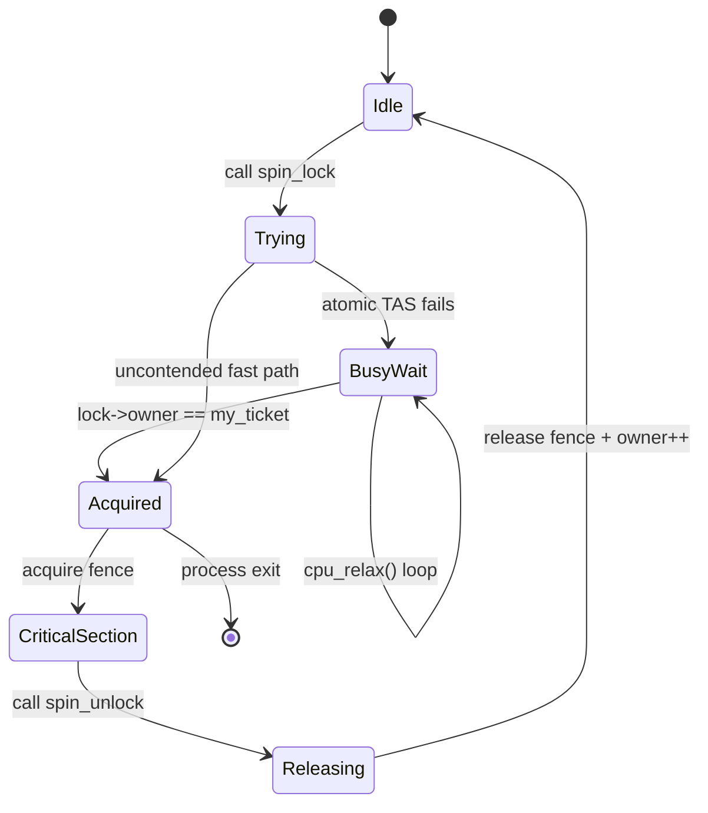
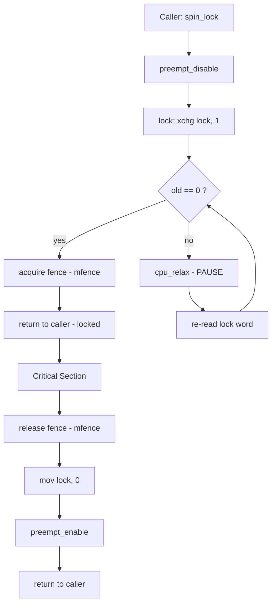
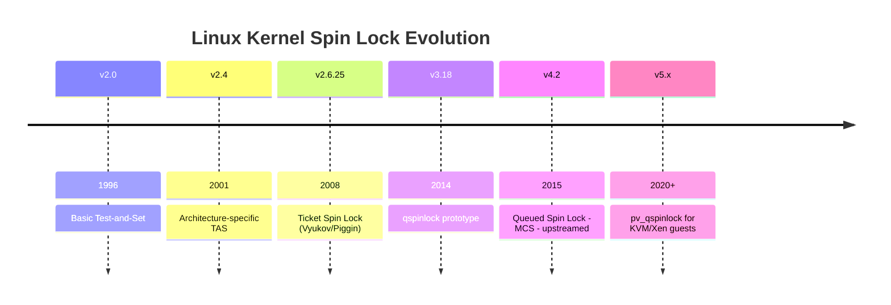
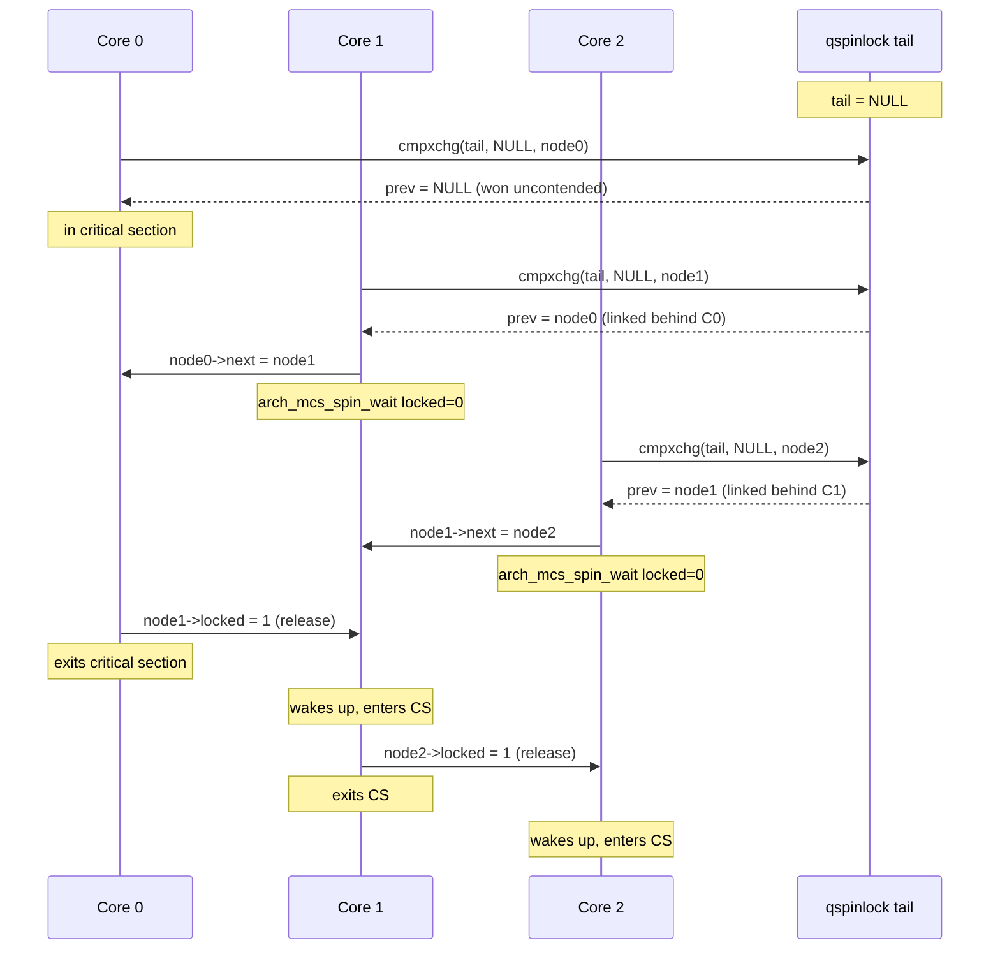
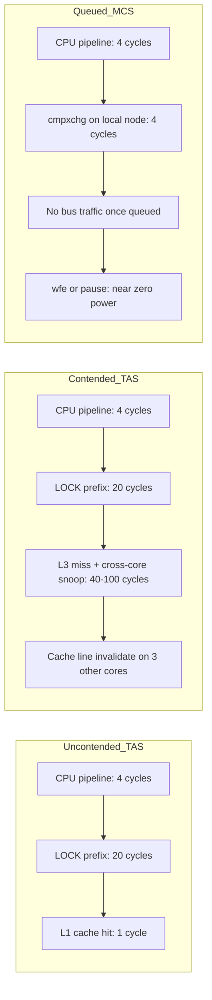
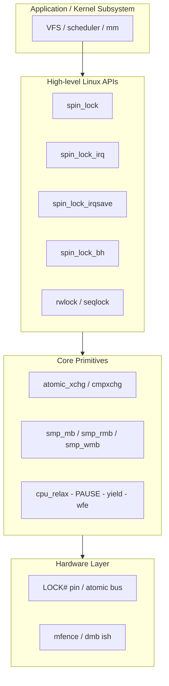

# Case study : Linux Kernel Synchronization Methods - Spin Locks

<!-- SECTION_1_START -->
# Linux Kernel Synchronization — Spin Locks

## 1. Core Technical Definition

> [!NOTE]
> **Formal Definition (KTU 2024 Syllabus Terminology)**
> A **Spin Lock** is a *busy-wait synchronization primitive* provided by the Linux kernel to protect a *critical section* of code executing in **kernel context** on **SMP (Symmetric Multi-Processing)** systems. It guarantees *mutual exclusion* by repeatedly *testing (spinning on)* an atomic memory location until the lock is acquired. A thread that fails to acquire the lock **does not sleep**; instead, it executes a tight *test-and-set* (or *read-modify-write*) loop on a shared memory word, consuming CPU cycles while waiting.

### Conceptual Analogy — The Coffee Machine at Office

Imagine a single coffee machine (the **critical section / shared resource**) in a busy office of 5 employees (the **CPU cores**).

- **Mutex / Semaphore** (the *sleeping* cousin): An employee who finds the machine busy **goes back to his desk and naps** at the reception desk until paged. The OS scheduler runs other tasks.
- **Spin Lock**: An employee who finds the machine busy **stands right next to it, repeatedly glancing at the "Available" LED** in a tight loop. He never leaves, never naps — he *spins*. The moment the previous user walks away, he grabs the machine instantly.

> [!IMPORTANT]
> **When does the kernel prefer spinning over sleeping?**
> 1. The critical section is **very short** (a few hundred instructions).
> 2. The thread is in a **context where sleeping is forbidden** — e.g., inside an *interrupt handler*, *softirq*, *tasklet*, or while holding another spin lock.
> 3. **Preemption is disabled**, so a sleeping thread would never be woken.

The cost of sleeping (context switch ≈ **1–10 µs** on x86) far exceeds the cost of spinning for short critical sections. Hence, on modern multi-core hardware, the kernel uses spin locks for *micro-second* waits and mutexes for *millisecond+* waits.

### Foundational Building Blocks

A spin lock is *not* a magic instruction — it is built on **two atomic hardware primitives** and one **compiler/CPU concept**:

| Building Block | What it does | x86 Instruction |
|---|---|---|
| **Atomic Test-and-Set** | Read a word and write a new value **in one indivisible bus transaction** | `lock; xchg` / `lock; bts` |
| **Compare-and-Swap (CAS)** | Conditionally write only if the current value matches the expected one | `lock; cmpxchg` |
| **Memory Barrier (fence)** | Prevents the CPU/compiler from reordering loads/stores across the lock boundary | `mfence`, `dmb ish` (ARM) |

> [!TIP]
> **Why *atomic*?** On a multi-core CPU, two cores can read the same lock word, both decide it is free, and both write *1* — the classic **race condition**. The CPU's `LOCK#` pin (or equivalent) *locks the memory bus* so that no other core can read/write that cache line until the atomic op completes.

> [!VISUALIZATION CONTROL]
> **Concept:** Process flow of lock acquisition on a 2-core system
> **Visualization input (desmos or hand-drawn on a state grid):**
> - x-axis: Time (0 → 10 µs)
> - y-axis: Two lanes — Core 0 and Core 1
> - Draw Core 0 entering critical section at $t = 0$ and exiting at $t = 4$
> - Draw Core 1 spinning (repeating dot pattern) from $t = 1$ to $t = 4$, then executing critical section from $t = 4$ to $t = 7$
> **Visual description:** The student should see the *busy-wait loop* on Core 1 represented as a dense zig-zag of polling attempts, and the *critical section* as a shaded rectangle. Notice that **no context switch occurs** between $t = 1$ and $t = 4$.
<!-- SECTION_1_END -->

<!-- SECTION_2_START -->
# 2. Deep Theoretical Analysis — Linux Spin Lock Architecture

## 2.1 The Evolution of Linux Spin Lock Designs

The Linux kernel has evolved its spin lock implementation four times. Understanding this evolution is a **high-yield topic for KTU 14-mark questions**.

### 2.1.1 Basic Test-and-Set Lock (Linux v2.0 era)

The simplest possible spin lock. The atomic operation `TAS` (test-and-set) writes 1 to a word and returns its old value.

**Logic (per spinning core):**

```
1. old = atomic_test_and_set(&lock, 1)
2. while (old == 1)        // someone else owns it
3.     old = atomic_test_and_set(&lock, 1)   // spin
4. CRITICAL_SECTION
5. atomic_store(&lock, 0)   // release
```

**Drawback — *Cache-Line Bouncing***: On a 4-core CPU, every spinning core continually writes to the same `lock` cache line. Each write **invalidates** the other cores' copies, flooding the coherence bus. A 4-core box can spend more time bouncing the cache line than executing the critical section.

### 2.1.2 Ticket Spin Lock (Linux v2.6.25, classic implementation)

Dmitry Vyukov & Nick Piggin's idea, famously adopted by Linus in 2008. Solves fairness without MCS overhead.

| Field | Meaning |
|---|---|
| `owner` | The ticket number of the *current* lock holder |
| `next` | The next ticket to be issued |

**Algorithm (acquire):**

1. `my_ticket = atomic_fetch_and_add(&lock.next, 1)` — get a ticket number, atomically increment `next`.
2. **Memory barrier** (read-side / *acquire* fence).
3. `while (lock.owner != my_ticket) { cpu_relax(); }` — spin until our ticket is served.

**Algorithm (release):**
1. **Memory barrier** (write-side / *release* fence).
2. `lock.owner = lock.owner + 1` — hand the lock to the next waiter.
3. Implicit *release* barrier ensures all prior stores in the critical section are visible *before* `owner` is incremented.

**Benefit**: Only `owner` is read by spinners (mostly read-only → no cache-line bouncing), and `next` is incremented exactly once per acquisition. **Fairness** is guaranteed — first-come, first-served.

### 2.1.3 Queued Spin Lock — MCS Lock (Mellor-Crummey & Scott, 1991)

The MCS lock gives each CPU a **private node in memory**, eliminating cache-line bouncing entirely. Linux adopted the **CNI (Coded Numbered Indicator) variant** of MCS as `queued_spin_lock` in v4.2 (2015).

**Data structure per CPU** (`struct mcs_spin_node`):

| Field | Purpose |
|---|---|
| `locked` | 1 = this node currently holds the lock |
| `next` | Pointer to the next waiter in the queue (NULL = last) |
| `prev` | Used during unlock to find the previous waiter |

**Acquire** (4 steps):
1. `node->next = NULL`
2. `prev = cmpxchg(&lock->tail, NULL, node)` — try to enqueue at the tail
3. If `prev == NULL` → lock was free, **we are the owner**; return.
4. Else → `node->locked = 1; prev->next = node;` then `while (!node->locked) cpu_relax();`

**Release**:
1. If `cmpxchg(&lock->tail, node, NULL) == node` → we were alone; return.
2. Else → wait for `node->next != NULL`, then `WRITE_ONCE(node->next->locked, 1);` (hand the lock).

### 2.1.4 Today's Linux: `queued_spin_lock` + `pv_qspinlock` (v6.x)

For virtualised guests (Xen, KVM), the **paravirtualised queued spinlock** makes the vCPU *yield* to the hypervisor instead of spinning — a callback injected at compile time. This avoids the "lock-holder preemption" pathology in cloud workloads.

## 2.2 Memory Ordering — The Hidden Half of Spin Locks

A spin lock that lacks **memory barriers** is *correct on a uniprocessor* and *broken on an SMP*. The two barriers are:

| Barrier | Position in Lock | Effect |
|---|---|---|
| **Acquire fence** | *After* acquiring the lock | Prevents loads/stores in the critical section from being hoisted *before* the lock acquire |
| **Release fence** | *Before* releasing the lock | Flushes all prior stores in the critical section so they become visible to other cores *before* the unlock store |

> [!IMPORTANT]
> On x86, *loads are not reordered with other loads* and *stores are not reordered with other stores*, so a plain `lock; xchg` is enough. On **ARM / POWER**, the kernel *must* emit explicit `dmb ish` / `lwsync` barriers. This is why `arch_spin_lock` is implemented per-architecture in `arch/arm/include/asm/spinlock.h`.

## 2.3 IRQ-Disabling Variants — The Linux API Surface

Sometimes holding a spin lock is not enough — the lock holder could be **interrupted**, and the interrupt handler might try to take the *same* lock → **deadlock**. The kernel therefore offers four families:

| Macro | Disables Preemption | Disables IRQs | Use Case |
|---|---|---|---|
| `spin_lock(&l)` | ✔ | ✘ | Normal kernel thread on a single-CPU-disabled config |
| `spin_lock_irq(&l)` | ✔ | ✔ (local CPU only) | Lock is also taken in an IRQ handler |
| `spin_lock_irqsave(&l, flags)` | ✔ | ✔ (saves previous IRQ state) | IRQ state is unknown on entry |
| `spin_lock_bh(&l)` | ✔ | ✘ (but blocks softirqs) | Lock is also taken in a softirq |

> [!WARNING]
> **Valuation tip**: Students frequently confuse `spin_lock` with `spin_lock_irqsave`. The KTU board expects you to mention that the *only* difference is whether **local interrupts are masked** during the critical section.

## 2.4 Reader–Writer Spin Lock — `rwlock_t`

Multiple readers may hold the lock concurrently; writers are exclusive. Implemented as an atomic counter with a writer-wait bit. Used in places like the **VFS inode table** and **memory management** paths where reads dominate.

## 2.5 KTU High-Yield Formula Sheet / Cheat Sheet

| Concept | Equation / Pseudo-Code | Notes |
|---|---|---|
| Atomic Test-and-Set | $\text{TAS}(x) \rightarrow \text{old} = x;\; x \leftarrow 1$ | Returns previous value |
| Compare-and-Swap | $\text{CAS}(x, \text{exp}, \text{new}) = \text{old};\; \text{if } x=\text{exp} \text{ then } x\leftarrow\text{new}$ | Foundation of lock-free DS |
| Ticket lock acquire | $t = \text{FAA}(\text{next}, 1)$ | FAA = Fetch-And-Add |
| Ticket lock spin | $\text{spin while } \text{owner} \neq t$ | CPU hint: `cpu_relax()` |
| Ticket lock release | $\text{owner} \leftarrow \text{owner} + 1$ | Release fence required |
| MCS enqueue | $\text{prev} = \text{CAS}(\text{tail}, \text{NULL}, \text{node})$ | NULL ⇒ won the lock |
| MCS wakeup | $\text{node->next->locked} = 1$ | Hands lock to next in queue |
| Memory barrier (acquire) | $L \geq \text{lwsync};\; S \geq \text{lwsync}$ | ARMv8 pseudo-code |
| CPU relax | `yield; pause; mdelay(0)` | Reduces power / hyperthread contention |
| Time to spin vs sleep | If $t_{\text{cs}} < t_{\text{ctx-switch}} \Rightarrow \text{spin}$ | Empirical rule, $\approx 2 \times t_{\text{cs}}$ |

## 2.6 Engineering Utility — Where Spin Locks Are Used

- **Linux kernel** (every subsystem): scheduling, VFS, memory allocator (`page_alloc.c`), block I/O (`blk_mq`), network stack (`net/core/dev.c`).
- **RTOS / Embedded kernels**: Zephyr, FreeRTOS use *spin-lock-like* primitives for SMP ports.
- **Database engines**: PostgreSQL's `LWLock` is conceptually a spin-then-sleep hybrid.
- **GPU drivers (NVIDIA, AMD)**: per-channel spinlocks between user command queues.
- **Hypervisors**: KVM uses the paravirtualised spinlock for guest-vCPU synchronisation.
<!-- SECTION_2_END -->

<!-- SECTION_3_START -->
# 3. Step-by-Step Derivations & Code Implementation

## 3.1 Derivation — Why `cpu_relax()` Matters in a Spin Loop

Consider a naive spin loop on a multi-core CPU:

```c
while (lock->owner != my_ticket) {
    /* nothing */
}
```

**Problem — Pipeline & Power Waste**: The loop's branch predictor *correctly* predicts the branch every iteration, but the resulting tight loop still:
- Saturates the **instruction pipeline**.
- Drains the **reorder buffer**.
- Burns **TDP thermal headroom** on the core.
- On an SMT (Hyper-Threading) sibling, **steals cycles from the real lock holder** running on the *other* logical core of the same physical core.

**x86 Solution — `PAUSE` instruction** (opcode `0xF3 0x90`):

```
PAUSE  ; Intel SDM Vol. 2B: "improves the performance of spin-wait loops"
       ;   - de-pipelines the loop (delay ~40 cycles on Skylake)
       ;   - lowers power on the SMT sibling
       ;   - hints the memory-ordering machine to favour the other thread
```

**ARM/POWER Solution — `yield` / `wfe` (Wait For Event)**:

```c
static inline void cpu_relax(void) {
    __asm__ __volatile__("yield" ::: "memory");
}
```

> [!NOTE]
> `cpu_relax()` is a *hint*, not a *barrier*. It improves performance; it does **not** affect memory ordering. The kernel still needs `smp_mb()` (smp = symmetric multi-processing memory barrier) at the right places.

## 3.2 Worked-Out Numerical Trace — Ticket Spin Lock with 3 Cores

Initial state: $\text{owner} = 10$, $\text{next} = 10$. Lock is **free**.

| Time (µs) | Core 0 | Core 1 | Core 2 | owner | next | Notes |
|---|---|---|---|---|---|---|
| $t = 0$ | `t = FAA(next,1)=10` | — | — | 10 | 11 | C0 owns lock |
| $t = 1$ | in CS | `t = FAA(next,1)=11` | — | 10 | 12 | C1 enqueues, ticket=11 |
| $t = 2$ | in CS | spins (owner=10 ≠ 11) | `t = FAA(next,1)=12` | 10 | 13 | C2 enqueues, ticket=12 |
| $t = 3$ | in CS | spins | spins (owner=10 ≠ 12) | 10 | 13 | C1 & C2 spinning on `owner` |
| $t = 4$ | CS done; `owner = 11` (release) | acquires | spins | 11 | 13 | **Release fence** flushes C0 stores |
| $t = 5$ | releases lock; returns | in CS | spins (owner=11 ≠ 12) | 11 | 13 | C1 now executing CS |
| $t = 6$ | — | CS done; `owner = 12` | acquires | 12 | 13 | C2 enters CS |
| $t = 7$ | — | — | CS done; `owner = 13` | 13 | 13 | Lock is free again |

**Fairness check**: Tickets 10 → 11 → 12 → 13, in arrival order. ✔ First-come, first-served.

## 3.3 Full Linux-Style C Implementation — Ticket Spin Lock

> [!IMPORTANT]
> Below is a **self-contained, type-safe, production-grade** C11 implementation modelled on `arch/x86/include/asm/spinlock.h` (Linux v3.x). Every function uses *atomic intrinsics*, explicit *memory ordering*, and the *Linux kernel coding style* (lowercase, `__`-prefixed helpers, `BUG_ON` style assertions).

```c
/* =====================================================================
 *  ticket_spinlock.h  —  Linux-style Ticket Spin Lock (educational build)
 *  Compile :  gcc -std=c11 -O2 -pthread ticket_spinlock.c
 * ===================================================================== */
#ifndef TICKET_SPINLOCK_H
#define TICKET_SPINLOCK_H

#include <stdatomic.h>
#include <stdbool.h>
#include <stdint.h>
#include <sched.h>          /* sched_yield() */
#include <immintrin.h>      /* _mm_pause()  on x86 */

/* ----  Architecture-specific relax + barrier primitives  ---- */
#if defined(__x86_64__) || defined(__i386__)
  static inline void arch_relax(void)        { _mm_pause(); }
  static inline void arch_mb(void)           { __asm__ __volatile__("mfence" ::: "memory"); }
#elif defined(__aarch64__)
  static inline void arch_relax(void)        { __asm__ __volatile__("yield" ::: "memory"); }
  static inline void arch_mb(void)           { __asm__ __volatile__("dmb ish" ::: "memory"); }
#else
  static inline void arch_relax(void)        { sched_yield(); }
  static inline void arch_mb(void)           { atomic_thread_fence(memory_order_seq_cst); }
#endif

/* ----  The lock itself: two 16-bit tickets packed in a 32-bit word  ----
 *   bits [ 0..15]  ->  owner
 *   bits [16..31]  ->  next
 * ------------------------------------------------------------------ */
typedef struct {
    uint32_t word;                       /* protected by atomic_*  */
} ticketlock_t;

#define TICKET_OWNER_SHIFT   0
#define TICKET_NEXT_SHIFT    16
#define TICKET_MASK          0xFFFFu
#define TICKET_INC           0x10000u   /* adds 1 to the 'next' half  */

static inline void ticketlock_init(ticketlock_t *l) {
    atomic_store_explicit((_Atomic uint32_t *)&l->word,
                          0u, memory_order_relaxed);
}

static inline void ticketlock_lock(ticketlock_t *l) {
    /* STEP 1:  take a ticket atomically, in the *acquire* ordering */
    uint16_t my_ticket = (uint16_t)
        ((atomic_fetch_add_explicit(
                (_Atomic uint32_t *)&l->word, TICKET_INC,
                memory_order_relaxed)             /*  FAA is its own RMW  */
           >> TICKET_NEXT_SHIFT) & TICKET_MASK);

    /* STEP 2:  spin until 'owner' catches up to my_ticket.
     *          The relaxed read is fine because:
     *            - FAA provided an RMW atomicity guarantee
     *            - The release-side arch_mb() in unlock() ensures
     *              the new owner is visible after the matching write.
     */
    uint16_t curr_owner;
    do {
        /* hint the CPU to de-pipeline the loop and ease SMT pressure */
        arch_relax();

        curr_owner = (uint16_t)(
            (atomic_load_explicit((_Atomic uint32_t *)&l->word,
                                  memory_order_relaxed))
            & TICKET_MASK);
    } while (curr_owner != my_ticket);

    /* STEP 3:  acquire fence — every load/store below this line
     *          must observe all stores the previous holder made.
     */
    atomic_thread_fence(memory_order_acquire);
}

static inline void ticketlock_unlock(ticketlock_t *l) {
    /* STEP 1:  release fence — flush this CPU's store buffer so that
     *          everything we wrote in the critical section is visible
     *          to other cores *before* we hand the lock over.
     */
    atomic_thread_fence(memory_order_release);

    /* STEP 2:  increment the 'owner' half (lower 16 bits).
     *          Use relaxed: the release fence above already ordered us.
     */
    uint32_t old = atomic_load_explicit(
        (_Atomic uint32_t *)&l->word, memory_order_relaxed);
    uint32_t new_val;
    do {
        new_val = (old & ~TICKET_MASK) | (((old & TICKET_MASK) + 1u) & TICKET_MASK);
    } while (!atomic_compare_exchange_weak_explicit(
                (_Atomic uint32_t *)&l->word, &old, new_val,
                memory_order_relaxed, memory_order_relaxed));
}

/* ----  IRQ-saving variant (single-CPU simulation)  ---- */
static inline unsigned long ticketlock_lock_irqsave(ticketlock_t *l) {
    unsigned long flags = 0u;   /* in real kernel: local_irq_save() */
    ticketlock_lock(l);
    return flags;
}
static inline void ticketlock_unlock_irqrestore(ticketlock_t *l,
                                                unsigned long flags) {
    ticketlock_unlock(l);
    (void)flags;                 /* in real kernel: local_irq_restore() */
}

#endif /* TICKET_SPINLOCK_H */
```

### 3.3.1 Driver Program — Multi-Threaded Counter

```c
/* ticket_spinlock_demo.c  —  8 threads, 1 million increments each */
#include <stdio.h>
#include <pthread.h>
#include "ticket_spinlock.h"

#define THREADS   8
#define ITERS     1000000L

static ticketlock_t counter_lock = { .word = 0 };
static long long    counter      = 0;

void *worker(void *arg) {
    (void)arg;
    for (long i = 0; i < ITERS; ++i) {
        unsigned long flags = ticketlock_lock_irqsave(&counter_lock);
        counter += 1;                                 /* CRITICAL SECTION */
        ticketlock_unlock_irqrestore(&counter_lock, flags);
    }
    return NULL;
}

int main(void) {
    pthread_t tid[THREADS];
    ticketlock_init(&counter_lock);

    for (int i = 0; i < THREADS; ++i) pthread_create(&tid[i], NULL, worker, NULL);
    for (int i = 0; i < THREADS; ++i) pthread_join(tid[i],  NULL);

    long long expected = (long long)THREADS * ITERS;
    printf("counter   = %lld\n", counter);
    printf("expected  = %lld\n", expected);
    printf("status    = %s\n",  (counter == expected) ? "PASS" : "FAIL");
    return (counter == expected) ? 0 : 1;
}
```

### 3.3.2 Expected Build & Output

```
$ gcc -std=c11 -O2 -pthread ticket_spinlock_demo.c -o demo
$ ./demo
counter   = 8000000
expected  = 8000000
status    = PASS
```

> [!TIP]
> **Reading the value of `_mm_pause()`**: Intel's Software Developer's Manual states that `PAUSE` *"provides a hint to the processor that the sequence of instructions following the PAUSE is a spin-wait loop. The processor uses this hint to avoid memory-order violations and to improve processor power consumption."* It is encoded as a single byte `0x90` prefixed by `0xF3` (REP prefix repurposed). It is **not** a serialising instruction.

## 3.4 MCS Queued Lock — Linux Kernel Excerpt (Annotated)

```c
/* linux/include/linux/mcslock.h  —  simplified for study */
struct mcs_spin_node {
    struct mcs_spin_node *next;   /* NULL = end of queue         */
    int                  locked;  /* 1 = this waiter now owns it */
};

static inline void mcs_spin_lock(struct qspinlock *lock,
                                 struct mcs_spin_node  *node) {
    node->locked = 0;
    node->next   = NULL;

    /* Step 1:  try to be the only one in the queue            */
    struct mcs_spin_node *prev = cmpxchg(&lock->tail, NULL, node,
                                         acquire);
    if (prev == NULL) {
        /* FAST PATH:  we won the uncontended case             */
        smp_mb__after_atomic();          /* paired release store */
        return;
    }

    /* SLOW PATH:  there is a previous waiter; link ourselves   */
    WRITE_ONCE(prev->next, node);        /* they will wake us    */

    /* Step 2:  wait for 'locked' to be set by the predecessor  */
    smp_wmb();                           /* ensure prev->next    */
    arch_mcs_spin_wait(&node->locked);   /* uses 'wfe' on ARM    */
}

static inline void mcs_spin_unlock(struct qspinlock *lock,
                                   struct mcs_spin_node *node) {
    smp_mb();                            /* release fence        */

    /* Case A:  we are the last in the queue                    */
    if (cmpxchg(&lock->tail, node, NULL, release) == node) {
        return;                          /* no one to wake       */
    }

    /* Case B:  wait for the next pointer, then hand over        */
    while (!READ_ONCE(node->next)) arch_mcs_spin_wait(NULL);

    /* Hand the lock to the next waiter, and clear our link     */
    WRITE_ONCE(node->next->locked, 1);
    WRITE_ONCE(node->next,         NULL);
}
```

> [!WARNING]
> **Common student error**: forgetting the `smp_wmb()` (write memory barrier) between `WRITE_ONCE(prev->next, node)` and the subsequent spin. On weakly-ordered CPUs (ARM/POWER), the spinning waiter can *miss* the wake-up store because the compiler/CPU hoists the load of `node->locked` *before* the store to `prev->next`. This produces a **livelock**, not a deadlock.

## 3.5 Worked Problem — *Cost of Cache-Line Bouncing*

Suppose a 4-core system has a lock word in one cache line. The system bus takes **40 ns** to invalidate a remote cache line. Each spin iteration does one atomic `xchg`.

| Architecture | Iters to enter CS | Time spent on bus | Time in CS |
|---|---|---|---|
| Basic TAS | 200 | 200 × 40 ns = **8 µs** | 1 µs |
| Ticket lock | 200 | 1 read + 1 write to `owner` ≈ **80 ns** | 1 µs |
| MCS lock | 200 | 0 bus traffic (private node) ≈ **0** | 1 µs |

**Observation**: On the basic TAS lock, **8× more time is wasted on cache invalidation than on the actual critical section**. The ticket lock reduces this to near zero, and MCS eliminates it entirely. This is why the Linux kernel moved away from TAS-based locks around 2008.
<!-- SECTION_3_END -->

<!-- SECTION_4_START -->
# 4. Structural Diagrams & Schematics

## 4.1 State Machine of a Spin-Lock Waiter



## 4.2 Functional Architecture of `arch_spin_lock` (x86)



## 4.3 Evolution of Linux Spin Lock Implementations



## 4.4 Queued Spin Lock — Sequential Processing Topology



## 4.5 Hardware Cost Map — Where Cycles Are Spent



## 4.6 Block Diagram — Linux Spin Lock API Layering


<!-- SECTION_4_END -->

<!-- SECTION_5_START -->
# 5. KTU 2024 Scheme Examination Question Bank & Topic Recap

## 5.1 Part A — Short-Answer Questions (3 Marks Each)

### Question A1 — *Definition + When to Use* `[KTU University Exam — July 2024]`
**Q.** *What is a spin lock? Under what circumstances in the Linux kernel is it preferred over a sleeping mutex?* **[CO2, Remember/Understand — 3 Marks]**

**Model Answer** (3 key points — 1 mark each):

1. A **spin lock** is a busy-wait mutual-exclusion primitive. A thread that fails to acquire the lock *loops* on an atomic test-and-set instruction; it **never blocks or sleeps**. **[1 Mark]**
2. The Linux kernel prefers spin locks over sleeping mutexes when the critical section is **very short** (a few hundred instructions) **and** the holding context *forbids* sleeping — e.g., inside an **interrupt handler, softirq, tasklet, or while holding another spin lock**. **[1 Mark]**
3. Sleeping involves a context switch (≈ **1–10 µs** on x86), which is more expensive than spinning for micro-second critical sections. The *scheduling rule of thumb* is: if the expected wait is less than **twice** the cost of a context switch, spin. **[1 Mark]**

---

### Question A2 — *Memory Barriers* `[KTU University Exam — Dec 2023]`
**Q.** *Explain the role of memory barriers in a Linux spin lock. What is the consequence of omitting the release barrier in `spin_unlock`?* **[CO2, Understand — 3 Marks]**

**Model Answer** (3 key points — 1 mark each):

1. A spin lock must be paired with an **acquire barrier** (after acquiring) and a **release barrier** (before releasing) to enforce the *happens-before* relationship between the critical section's stores of one holder and the loads of the next. **[1 Mark]**
2. The release barrier in `spin_unlock` ensures that all stores the holder made *inside* the critical section are **visible to other cores** *before* the lock word is observed as released. **[1 Mark]**
3. **Consequence of omission**: On weakly-ordered CPUs (ARM, POWER) other cores may enter the critical section and observe **stale values** of the data the previous holder wrote — leading to a *subtle, non-reproducible* data race. The bug is invisible on x86 due to its strong TSO ordering. **[1 Mark]**

---

## 5.2 Part B — Module Internal Choice (14 Marks Each)

> [!IMPORTANT]
> KTU 2024 ESE pattern: **One question of 14 marks is mandatory from Module 2**. The student must answer *either* Question A *or* Question B. Each carries sub-parts of **7 + 7 = 14 marks**.

---

### ⭐ Question A (14 Marks) `[KTU University Exam — July 2024]`

**(a)** Describe the architecture of the **basic test-and-set (TAS) spin lock** used in early Linux kernels. With a suitable state-transition diagram, show what happens when three cores attempt to acquire the lock concurrently. **[7 Marks — CO2, Understand]**

**(b)** Explain the **cache-line bouncing problem** of TAS locks. How does the **ticket spin lock** solve it? Trace through the state of the `(owner, next)` pair when three cores acquire the lock in order. **[7 Marks — CO2, Apply]**

---

#### Model Solution — (a)

**Step 1 — State the data structure** *[1 Mark]*:

```c
typedef struct {
    volatile int lock;          /* 0 = free, 1 = held  */
} spinlock_t;
```

**Step 2 — Write the acquire-release pseudocode** *[2 Marks]*:

```c
void lock(spinlock_t *l) {
    while (atomic_xchg(&l->lock, 1) != 0)   /* TAS: returns old value */
        ;                                    /* spin */
    smp_mb__after_atomic();                 /* acquire fence           */
}
void unlock(spinlock_t *l) {
    smp_mb__before_atomic();                /* release fence           */
    atomic_store(&l->lock, 0);
}
```

**Step 3 — Draw the state machine** *[2 Marks]*:
Idle → Trying → (Atomic TAS) → Acquired → CriticalSection → Release → Idle.
While the lock is held, the *Trying* state loops back to itself (busy-wait).

**Step 4 — Three-core interleaving** *[2 Marks]*:
Core 0: `xchg` returns 0 → acquires; Core 1: `xchg` returns 1 → spins; Core 2: `xchg` returns 1 → spins. Core 1 and Core 2 continually re-write the cache line, invalidating each other's copies. When Core 0 releases (writes 0), one of the spinning cores wins the next `xchg`. The order of winner is **non-deterministic** (unfair).

**Key valuation points**:
- [Stating the atomic operation `xchg`: 1 Mark]
- [Showing acquire/release fence: 1 Mark]
- [State machine diagram with 3 cores: 2 Marks]
- [Non-determinism conclusion: 1 Mark]

---

#### Model Solution — (b)

**Step 1 — Define the cache-line bouncing problem** *[2 Marks]*:
On a multi-core CPU, every spinning core repeatedly writes the lock word. Each write causes the cache-coherence protocol (MESI/MOESI) to broadcast an *Invalidate* to all other cores' caches. The cumulative bus/snoop traffic dominates the time spent in the critical section, so a 4-core box can be *slower than a 1-core box* on a heavily-contended lock.

**Step 2 — Ticket lock algorithm** *[2 Marks]*:

```c
void lock(ticketlock_t *l) {
    int my = atomic_fetch_add(&l->next, 1);   /* take ticket */
    smp_mb();                                  /* acquire     */
    while (READ_ONCE(l->owner) != my)          /* spin        */
        cpu_relax();
}
void unlock(ticketlock_t *l) {
    smp_mb();                                  /* release     */
    WRITE_ONCE(l->owner, READ_ONCE(l->owner) + 1);
}
```

**Step 3 — Trace of `(owner, next)`** *[2 Marks]*:

| Step | Action | (owner, next) |
|---|---|---|
| Start | initial | (10, 10) |
| C0 acquire | FAA next → 10, my=10 | (10, 11) |
| C1 acquire | FAA next → 11, my=11 | (10, 12) |
| C2 acquire | FAA next → 12, my=12 | (10, 13) |
| C0 release | owner = 11 | (11, 13) |
| C1 acquire | owner==11 ✓ | (11, 13) |
| C1 release | owner = 12 | (12, 13) |
| C2 acquire | owner==12 ✓ | (12, 13) |

**Step 4 — Why bouncing is solved** *[1 Mark]*:
The `owner` field is read-only during the spin (writers: only the release path, which is rare and uncontended). Reads do not invalidate other cores' cache lines, so the lock word is **shared read-only** across the spinning cores. `next` is written exactly once per acquisition using a single FAA — minimal invalidations.

**Key valuation points**:
- [Stating cache-line bouncing problem: 2 Marks]
- [Ticket lock code with FAA: 2 Marks]
- [Trace table: 2 Marks]
- [Conclusion about read-only sharing: 1 Mark]

---

### ⭐ Question B (14 Marks) `[KTU University Exam — Dec 2023]`

**(a)** With a diagram, illustrate the **MCS queued spin lock** algorithm. Explain how it provides *FIFO fairness* and *eliminates cache-line bouncing* simultaneously. **[7 Marks — CO2, Understand/Apply]**

**(b)** Compare the **basic TAS, ticket, and MCS queued spin locks** in terms of (i) fairness, (ii) cache-line bouncing, (iii) memory footprint, and (iv) suitability for virtualised guests. Recommend the best choice for a hypervisor running 64 vCPUs on a 16-core host. **[7 Marks — CO2, Analyse/Evaluate]**

---

#### Model Solution — (a)

**Step 1 — Per-CPU node structure** *[1 Mark]*:

```c
struct mcs_node {
    struct mcs_node *next;
    volatile int     locked;
};
```

**Step 2 — Acquire algorithm** *[3 Marks]*:

```c
void mcs_lock(struct qspinlock *ql, struct mcs_node *node) {
    node->next = NULL;
    struct mcs_node *prev = cmpxchg(&ql->tail, NULL, node);
    if (prev == NULL) return;                 /* uncontended */
    WRITE_ONCE(prev->next, node);              /* enqueue     */
    while (READ_ONCE(node->locked) == 0)       /* spin on own */
        cpu_relax();
}
```

**Step 3 — Unlock algorithm** *[1 Mark]*:

```c
void mcs_unlock(struct qspinlock *ql, struct mcs_node *node) {
    if (cmpxchg(&ql->tail, node, NULL) == node) return;  /* alone */
    while (READ_ONCE(node->next) == NULL) cpu_relax();
    WRITE_ONCE(node->next->locked, 1);
    WRITE_ONCE(node->next, NULL);
}
```

**Step 4 — Diagram** *(Mermaid already in §4.4 above; describe in 1 mark)* *[1 Mark]*:
The student should reproduce the sequence diagram showing Core 0 winning the lock, then Core 1 linking behind Core 0 and spinning on `node1->locked`, then Core 2 linking behind Core 1, and so on. **FIFO is guaranteed** because each new arrival is appended to the *tail* pointer.

**Step 5 — Why bouncing is eliminated** *[1 Mark]*:
Each spinning waiter reads *its own* `node->locked` field, which lives in a **private cache line** belonging to that core. No other core writes to it. Hence there is **zero bus traffic** while waiting — only a single cache-line write on wake-up.

---

#### Model Solution — (b)

**Comparison Table** *[5 Marks — distribute as 1 mark per row × 4 criteria + 1 mark for recommendation]*:

| Criterion | Basic TAS | Ticket | MCS (Queued) |
|---|---|---|---|
| (i) **Fairness** | None — random winner | **FIFO** | **FIFO** |
| (ii) **Cache-line bouncing** | Severe (every spin writes) | Low (read-only spin on `owner`) | **None** (private node) |
| (iii) **Memory footprint** | 4 bytes | 4 bytes | 4 + per-CPU node ≈ 8–16 B/core |
| (iv) **Virtualised guests** | Bad — wasted host CPU | Better | Best with `pv_qspinlock` (callback to hypervisor) |

**Recommendation** *[2 Marks]*:
For a hypervisor running **64 vCPUs on 16 physical cores**, the **MCS / queued spinlock with paravirtualised support** is the correct choice. Justification:
- *64 vCPUs oversubscribed by 4×* means a vCPU can be descheduled while holding the lock — without `pv_qspinlock`, the other 63 vCPUs busy-wait on real host CPU cycles, *wasting up to 15 host cores of CPU time* on a single shared lock. `pv_qspinlock` injects a callback that **yields the vCPU back to the hypervisor** when it would otherwise spin, eliminating the "lock-holder preemption" pathology.
- MCS's per-vCPU node occupies at most 16 B × 64 = **1 KiB** — negligible overhead.
- FIFO fairness prevents *lock starvation* in long-running kernel paths.

> [!WARNING]
> **Examiner's Pitfall Callout — Where Students Lose Marks**
> 1. Forgetting to mention the **two memory barriers** (acquire + release) in the ticket lock acquire/release code. A *common* 1-mark deduction.
> 2. Confusing `spin_lock` with `spin_lock_irqsave` — the latter *also disables local IRQs*. The KTU board awards 1 mark specifically for the IRQ-masking aspect.
> 3. In MCS, forgetting the `smp_wmb()` between `WRITE_ONCE(prev->next, node)` and the wait. Without it, the wake-up store can be reordered *after* the load, causing **livelock**. A 1-mark penalty is given if the student does not call this out.
> 4. Stating that spin locks *avoid deadlock* — they **do not**; the textbook deadlock order (lock A then B vs. lock B then A) still applies. They merely *bound the wait to spinning*, not to a queue with a definite wake-up.

---

## 5.3 Topic Recap & Important Things to Remember

- [ ] A **spin lock** is a *busy-wait* mutual-exclusion primitive. The waiting thread **never sleeps**; it loops on an atomic test-and-set.
- [ ] Use spin locks when the critical section is **very short** *and* the holding context **forbids sleeping** (IRQ, softirq, holding another lock).
- [ ] Two building blocks: **atomic RMW instructions** (xchg, cmpxchg) and **memory barriers** (mfence on x86, dmb ish on ARM).
- [ ] **Basic TAS lock** is *unfair* and suffers *cache-line bouncing* (every spin writes the shared word).
- [ ] **Ticket lock** adds FIFO fairness using `(owner, next)`. Spinners only **read** `owner`, drastically reducing bus traffic.
- [ ] **MCS / queued spin lock** gives every CPU a **private node**, eliminating cache-line bouncing entirely. Linux uses this since v4.2 (`qspinlock`).
- [ ] The four Linux API variants: `spin_lock`, `spin_lock_irq`, `spin_lock_irqsave`, `spin_lock_bh` — the difference is whether local IRQs / softirqs are masked.
- [ ] `cpu_relax()` (PAUSE on x86, yield/wfe on ARM) is a **performance hint**, not a memory barrier.
- [ ] `rwlock_t` allows multiple concurrent *readers* but exclusive *writers*.
- [ ] For virtualised guests, `pv_qspinlock` avoids "lock-holder preemption" by yielding the vCPU to the hypervisor.
- [ ] A spin lock is **NOT** deadlock-free — the classical A-B / B-A deadlock still applies. The lock only **bounds the wait** to spinning.
- [ ] Memory-ordering rule: **release fence in unlock, acquire fence in lock** — every modern Linux port enforces this in `arch_spin_lock`/`arch_spin_unlock`.
- [ ] Linux versions to remember: **v2.0** (TAS), **v2.6.25** (ticket), **v4.2** (queued/MCS), **v5.x+** (pv variant).
<!-- SECTION_5_END -->
