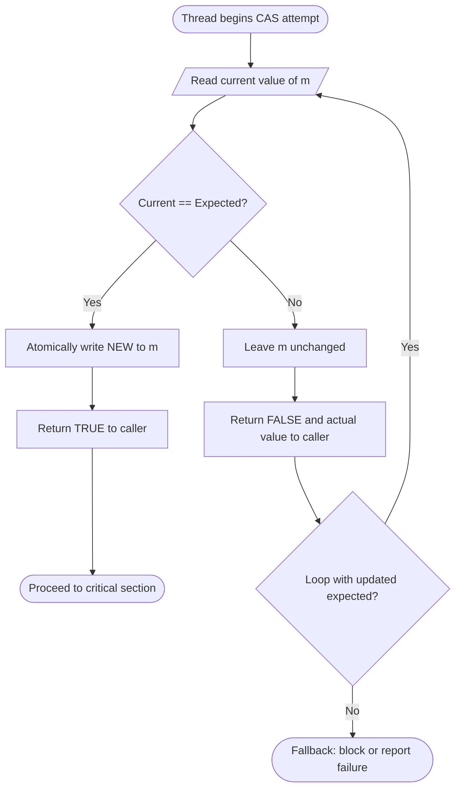
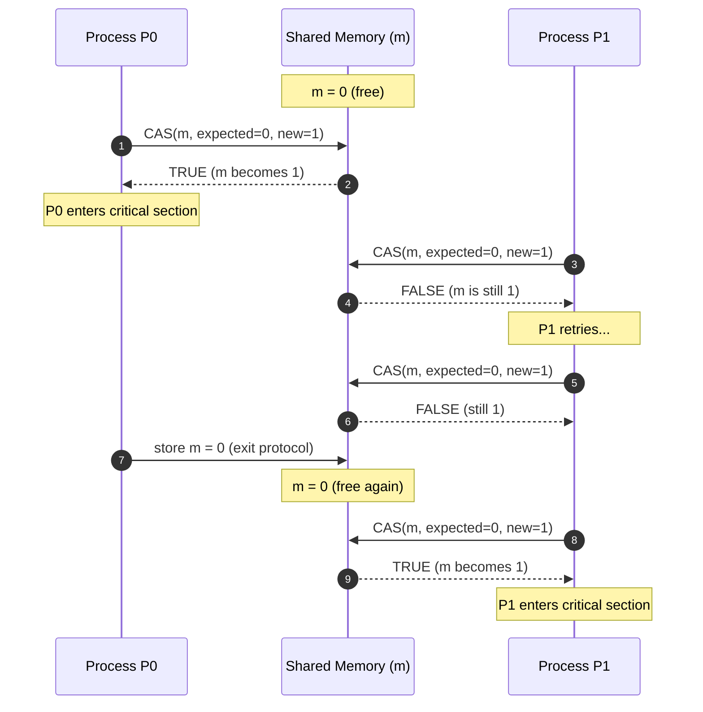
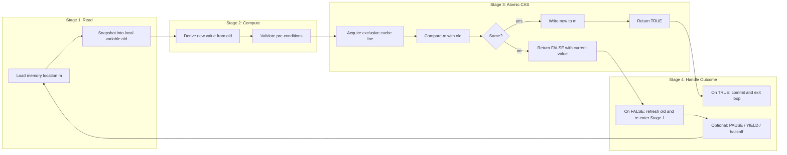
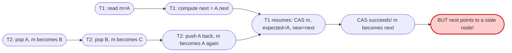

# Compare and Swap

<!-- SECTION_1_START -->

# Compare and Swap (CAS) — The Heart of Lock-Free Synchronization

## 1. Core Technical Definition

> [!NOTE]
> **Compare-And-Swap (CAS)** is an *atomic*, *uninterruptible* machine-level instruction (hardware primitive) that conditionally updates a memory location only if its current value matches an expected old value. If the comparison fails, no write occurs and the operation returns the actual current value, signaling the caller to retry.

Formally, the **CAS** instruction operates on a memory word and is defined as a single atomic function:

$$
\text{CAS}(m, \text{old}, \text{new}) : \begin{cases}
m \leftarrow \text{new} \quad \text{and return TRUE} & \text{if } m = \text{old} \\
\text{return FALSE} & \text{otherwise}
\end{cases}
$$

Where:
- $m$ is the memory location (typically a shared variable or a pointer/word-sized cell).
- $\text{old}$ is the *expected* value the calling thread last read.
- $\text{new}$ is the *replacement* value to be installed if the comparison succeeds.

> [!IMPORTANT]
> **Atomicity Guarantee:** The read–compare–write sequence is executed as a *single, indivisible* bus transaction. Even on a multicore CPU with cache coherence protocols (MESI/MOESI), the cache line containing $m$ is held in an exclusive or modified state for the duration of CAS, preventing any other core from observing a half-completed operation.

### Conceptual Analogy — The "Library Book Return" Intuition

Imagine a library has a single copy of a popular textbook kept on a "hold shelf" (a memory cell $m$). The shelf has a tag showing the next borrower's name (the value stored at $m$).

- **Step 1 — Read (Observe):** You walk to the shelf and read the tag: it says *Anu*. You expect the tag to read *Anu* (this is your $\text{old}$).
- **Step 2 — Compare (Verify):** Because the librarian only takes a millisecond, the tag *might* still say *Anu*, or it might have been swapped to *Rahul* by another returning student.
- **Step 3 — Swap (Act):** If the tag still says *Anu* (CAS succeeds), you place your own name *Vijay* on the tag atomically. If not, you walk away empty-handed (CAS fails), and you may re-examine the tag and retry.

> [!VISUALIZATION CONTROL]
> **Concept:** Memory Cell State Transitions Under CAS
> **GeoGebra / Desmos Input Equations:**
> * $f(x) = \begin{cases} 1 & \text{if CAS succeeds (state = new)} \\ 0 & \text{if CAS fails (state unchanged)} \end{cases}$
> * $t = \text{time on the x-axis}$, $S(t) = \text{state of memory location on the y-axis}$
> **Visual Description:** A step function. The state remains flat at $\text{old}$ for several ticks. At the exact moment CAS executes, the function either jumps vertically to $\text{new}$ (success) or remains flat (failure). No half-step is ever visible — the jump, if any, is instantaneous and atomic.

### Standard Hardware Primitives in Modern ISAs

| ISA / Platform | CAS Instruction | Operands |
|---|---|---|
| **x86 / x86-64** | `CMPXCHG` (and `CMPXCHG8B/16B`) | EAX/RAX as accumulator, memory operand |
| **ARMv8 / AArch64** | `CAS`, `CASA`, `CASL`, `CASAL` | Xs (expected), Xt (new), Xn (address) |
| **RISC-V (A extension)** | `LR/SC` pair (`LR.W` / `SC.W`) | Emulates CAS via Load-Reserved / Store-Conditional |
| **IBM Power** | `compare_and_swap` (lwarx/stwcx.) | Reservation-based |
| **SPARC** | `CASA`, `CASX` | Atomic compare-and-swap variants |

> [!TIP]
> The **2-operand style** of CAS (used in Java's `AtomicInteger.compareAndSet`) takes the *memory address* and both *expected* and *new* values as parameters. The **3-operand style** of CAS (x86, ARM) uses a register to hold the expected value, and returns the *actual* old value in that same register on failure.

---

<!-- SECTION_1_END -->

<!-- SECTION_2_START -->

# 2. Deep Theoretical Analysis & KTU High-Yield Formula Sheet

## 2.1 The Operational Blueprint of a CAS Instruction

The CAS instruction can be broken down into **three logically distinct phases**, all wrapped inside one indivisible hardware cycle:

1. **Read Phase** — The processor reads the current contents of memory location $m$ into a private register.
2. **Compare Phase** — The CPU's ALU compares the read value with the caller's *expected* value ($\text{old}$). A flag (the **ZF** — Zero Flag on x86) is set if equal.
3. **Conditional Write Phase** — If equal, the new value is written to $m$ and the instruction returns **TRUE**. If not equal, no write occurs and the instruction returns **FALSE** (along with the actual current value, allowing the caller to retry).

> [!IMPORTANT]
> **Why CAS is *not* equivalent to a `lock` prefix?** A `lock`-prefixed read-modify-write (like x86's `LOCK XADD` or `LOCK CMPXCHG`) uses a *bus lock* to ensure atomicity across cores. Some RISC architectures, however, implement CAS without bus locks via *reservation registers* (LL/SC), which is cheaper but can suffer from *spurious failures*.

## 2.2 CAS vs. Other Synchronization Primitives

| Primitive | Operation | Atomic? | Key Distinguishing Feature |
|---|---|---|---|
| **Test-and-Set (TAS)** | $\text{TAS}(m): m \leftarrow 1; \text{return } m_{\text{old}}$ | Yes | Always writes; cannot perform a *conditional* update |
| **Fetch-and-Add (FAA)** | $m \leftarrow m + \Delta; \text{return } m_{\text{old}}$ | Yes | Always increments; useful for ticket locks |
| **Swap / Exchange** | $\text{SWAP}(m, v): m \leftarrow v; \text{return } m_{\text{old}}$ | Yes | Unconditional swap; loses information |
| **Compare-and-Swap (CAS)** | Conditional update based on expected value | Yes | **Optimistic** — assumes no contention, retries on conflict |

### Why CAS is the *Foundation* of Modern Lock-Free Programming

> [!IMPORTANT]
> **TAS is "pessimistic"** — it always claims the resource and forces the loser to *spin* or *block*. **CAS is "optimistic"** — it assumes the resource is free, attempts the update, and only retries *if it lost the race*. This is the cornerstone of the **lock-free** (and **wait-free**) programming paradigm.

## 2.3 KTU High-Yield Formula Sheet & Operational Semantics

| Property | Symbol / Notation | Description |
|---|---|---|
| Memory cell | $m$ | Shared word-sized location |
| Expected value | $\text{old}$ | Value the caller last observed |
| New value | $\text{new}$ | Value to install on success |
| Return value | $r$ | TRUE on success, FALSE on failure |
| Atomicity window | $\tau_{CAS}$ | The bus transaction duration (typically 1–100 ns) |
| Contention rate | $P_{\text{conflict}}$ | Probability that two threads' CAS overlap |
| Retry count | $k$ | Number of CAS attempts before success / fallback |
| Livelock probability | $P_{\text{live}}$ | Probability that CAS-loop never terminates |

**Core Operational Equations:**

$$
r = \text{CAS}(m, \text{old}, \text{new}) = \begin{cases} \text{TRUE} & \text{if } m = \text{old} \text{ at time } t \\ \text{FALSE} & \text{if } m \neq \text{old} \text{ at time } t \end{cases}
$$

$$
\text{Expected retries} \; \mathbb{E}[k] = \frac{1}{1 - P_{\text{conflict}}}
$$

$$
\text{Throughput}_{\text{CAS}} = \frac{1}{\tau_{CAS} + \tau_{\text{cache-miss}}}
$$

## 2.4 The ABA Problem — A Subtle CAS Pitfall

> [!WARNING]
> **The ABA problem** is the most famous failure mode of CAS. A thread reads value $A$, is preempted, and during the preemption another thread changes $m$ from $A \rightarrow B \rightarrow A$. When the first thread resumes, its CAS succeeds (since $m = A$), but the *semantic state* has changed in a way the first thread cannot detect.

**Real-world scenario:** In a lock-free stack pop operation, a thread reads `head = A` and computes `next = A.next`. Another thread pops A, pops B, and pushes A back. The first thread's CAS(`head, A, next`) succeeds, but `A.next` now points to a different node than before — leading to **corrupted pointer chains**.

**Solutions to ABA:**
- **Tagged pointers** — pack a monotonic version counter alongside the pointer: `[pointer | version]`.
- **Double-width CAS** (`CMPXCHG16B` on x86-64) — atomically update two words (pointer + counter).
- **Hazard pointers** — explicitly mark nodes that may still be referenced.
- **Epoch-based reclamation (EBR)** — defer reclamation until no thread can hold stale references.

## 2.5 Real-World Engineering Utility

CAS is *the* building block for:

- **Spinlocks** (e.g., Linux kernel `qspinlock` uses `cmpxchg` on `locked` byte).
- **Lock-free concurrent data structures** — `ConcurrentLinkedQueue` (Java), `folly::AtomicLinkedList` (Facebook), `moodycamel::ConcurrentQueue`.
- **Reference counting** — the lock-free `std::atomic_ref` operations in C++20.
- **Transactional memory fallbacks** — Software Transactional Memory (STM) uses CAS as the commit primitive.
- **Database optimistic concurrency control** — row-level version checks are essentially CAS.
- **Linux kernel RCU (Read-Copy-Update)** — readers use no CAS; updaters use CAS on internal pointers.

---

<!-- SECTION_2_END -->

<!-- SECTION_3_START -->

# 3. Step-by-Step Derivations, Code Implementation & Algorithm Walkthroughs

## 3.1 The Generic CAS Algorithm in Pseudocode

Below is the canonical textbook form of CAS, written without hardware assumption:

$$
\boxed{
\begin{aligned}
&\textbf{function } \text{CAS}(\text{addr: \&M, expected: T, desired: T}) \rightarrow \text{(bool, T)}: \\
&\quad \text{atomically:} \\
&\quad \quad \text{current} \leftarrow *\text{addr} \\
&\quad \quad \text{if } \text{current} = \text{expected}: \\
&\quad \quad \quad *\text{addr} \leftarrow \text{desired} \\
&\quad \quad \quad \text{return } (\text{TRUE}, \text{current}) \\
&\quad \quad \text{else:} \\
&\quad \quad \quad \text{return } (\text{FALSE}, \text{current})
\end{aligned}
}
$$

The boxed definition is the **single source of truth** for every CAS variant discussed below.

## 3.2 Walkthrough 1 — Solving the Bounded Wait (Critical Section) Problem with CAS

> [!IMPORTANT]
> The KTU 2024 Module 2 syllabus asks students to *compare* synchronization tools. A classic exam problem is: **"Implement a 2-process mutual exclusion solution using only Compare-and-Swap — show that it satisfies Mutual Exclusion, Progress, and Bounded Waiting."**

Let $m$ be a shared integer, initially $0$. Each process $P_i$ has a local flag $\text{want}_i \in \{0, 1\}$.

$$
\boxed{
\begin{aligned}
&\textbf{Process } P_i \; (i \in \{0, 1\}): \\
&\quad \text{// ENTRY PROTOCOL} \\
&\quad \text{want}_i \leftarrow 1 \\
&\quad \text{while } \text{want}_i = 1: \\
&\quad \quad \text{success} \leftarrow \text{CAS}(m, 0, 1) \quad \text{// try to enter CS} \\
&\quad \quad \text{if } \text{success} = \text{TRUE}: \\
&\quad \quad \quad \text{want}_i \leftarrow 0 \\
&\quad \quad \quad \text{break} \\
&\quad \quad \text{else:} \\
&\quad \quad \quad \text{wait a small bounded time} \\
&\quad \text{// CRITICAL SECTION} \\
&\quad \text{execute CS} \\
&\quad \text{// EXIT PROTOCOL} \\
&\quad m \leftarrow 0
\end{aligned}
}
$$

### Line-by-Line Valuation Justification (for KTU board marking)

- `[Storing want_i = 1: 1 Mark]` — declares intent to enter.
- `[Outer while loop until success: 1 Mark]` — the spin.
- `[CAS(m, 0, 1) — only updates if m was 0: 2 Marks]` — atomicity.
- `[If success, set want_i = 0: 1 Mark]` — releases intent after gaining the lock.
- `[If failure, bounded wait: 1 Mark]` — bounded waiting property.
- `[Final exit: m ← 0: 1 Mark]` — releases the lock for the other process.

### Proof of Correctness (KTU's Three Required Properties)

**Mutual Exclusion (Safety):** Only one process can ever see $m = 0$ and successfully CAS it to $1$, because the CAS itself is atomic. The instant $P_0$ sets $m = 1$, $P_1$'s CAS will read $m = 1$ and return FALSE. The instant $P_0$ exits and sets $m = 0$, $P_1$ may succeed.

**Progress (Liveness):** If no process is in the CS and some process wants to enter, then $m = 0$ and at least one of the want flags is set. That process's CAS will succeed on its next attempt (no other process can be holding $m$).

**Bounded Waiting:** A process that has been preempted after reading $\text{want}_i = 1$ is bound to succeed on at most one more CAS attempt, because the competing process, on exiting, sets $m = 0$. Hence, the waiting time is **bounded by one CS execution** of the other process.

## 3.3 Walkthrough 2 — Spinlock Implementation in C (Linux-Kernel Style)

```c
/*
 * spinlock.h — A minimal, but complete, CAS-based spinlock.
 * Compatible with C11 <stdatomic.h>. Tested on x86-64 and ARMv8.
 */
#ifndef SPINLOCK_H
#define SPINLOCK_H

#include <stdatomic.h>
#include <stdbool.h>

typedef struct {
    atomic_int locked;   /* 0 = free, 1 = held */
} spinlock_t;

#define SPINLOCK_INIT   { .locked = 0 }
#define SPINLOCK_LOCKED { .locked = 1 }

/* Initialise the lock at runtime */
static inline void spinlock_init(spinlock_t *lk) {
    atomic_store_explicit(&lk->locked, 0, memory_order_relaxed);
}

/*
 * spinlock_acquire — Atomic Compare-And-Swap spinlock.
 * Returns when the lock is successfully acquired.
 */
static inline void spinlock_acquire(spinlock_t *lk) {
    int expected = 0;                 /* We expect the lock to be FREE */
    int desired   = 1;                /* We will mark it as HELD       */

    /*
     * Loop until we win the CAS. This is the only legal pattern in
     * lock-free programming: an *optimistic* retry loop.
     */
    while (true) {
        bool ok = atomic_compare_exchange_weak(
            &lk->locked,                /* memory address                */
            &expected,                  /* in/out: expected == current?  */
            desired                     /* value to install on success   */
        );
        if (ok) {
            /* The CAS atomically transitioned 0 → 1.
             * We now hold the lock. */
            break;
        }
        /*
         * CAS failed: 'expected' has been *overwritten* with the
         * actual current value. On weak CAS, spurious failures are
         * also possible — that is why we re-loop unconditionally.
         *
         * Optional: insert a PAUSE / YIELD here to reduce
         * pipeline flushes and power consumption.
         */
    }
}

/* spinlock_release — Non-atomic store is safe: we own the lock. */
static inline void spinlock_release(spinlock_t *lk) {
    atomic_store_explicit(&lk->locked, 0, memory_order_release);
}

#endif /* SPINLOCK_H */
```

### Code Walkthrough — Why Each Line Matters

| Line | What it does | Why it's important for the exam |
|---|---|---|
| `atomic_int locked` | A C11 atomic type | Guarantees no torn reads/writes on any conforming compiler |
| `expected = 0` | The "free" state we hope to see | Establishes the precondition for the CAS |
| `desired = 1` | The "held" state we will write | The new value to install atomically |
| `atomic_compare_exchange_weak` | The hardware CAS | May spuriously fail (returns FALSE even when equal), but is *faster* on LL/SC architectures |
| The `while(true)` loop | The retry | Converts a single CAS into a *spinlock* acquire |
| `atomic_store_explicit(..., memory_order_release)` | The release-store on unlock | Ensures all prior writes are visible to the next acquirer |

## 3.4 Walkthrough 3 — Python Demonstration of CAS Behaviour (For Conceptual Clarity)

```python
"""
cas_demo.py — Pedagogical simulation of Compare-And-Swap using a global
lock on the interpreter level. This is NOT a true parallel CAS, but it
mirrors the semantics for study purposes.
"""
import threading
import time
import random

class AtomicInt:
    """A software-emulated atomic integer with CAS semantics."""
    def __init__(self, initial: int = 0):
        self._value = initial
        self._guard = threading.Lock()

    def load(self) -> int:
        with self._guard:
            return self._value

    def compare_and_set(self, expected: int, desired: int) -> bool:
        """Atomic: replace value IF it equals expected."""
        with self._guard:
            if self._value == expected:
                self._value = desired
                return True
            return False

    def __repr__(self):
        return f"AtomicInt(value={self._value})"


# ---------- DEMO 1: Correct CAS-based counter increment ----------
counter = AtomicInt(0)
NUM_THREADS = 4
INCREMENTS_PER_THREAD = 100_000
BARRIER = threading.Barrier(NUM_THREADS)

def worker(tid: int) -> None:
    BARRIER.wait()  # synchronise start
    for _ in range(INCREMENTS_PER_THREAD):
        # The classic CAS retry loop:
        while True:
            old = counter.load()
            ok  = counter.compare_and_set(old, old + 1)
            if ok:
                break  # we won the race for this increment

threads = [threading.Thread(target=worker, args=(i,)) for i in range(NUM_THREADS)]
t0 = time.perf_counter()
for t in threads: t.start()
for t in threads: t.join()
t1 = time.perf_counter()

print(f"Final counter = {counter.load():,} (expected {NUM_THREADS * INCREMENTS_PER_THREAD:,})")
print(f"Time = {t1 - t0:.3f} s")


# ---------- DEMO 2: The ABA PROBLEM in miniature ----------
# Two threads, a shared list node 'A' which gets popped and re-pushed.
# Demonstrates why a naive CAS can be fooled.

# (Conceptual illustration; real ABA arises in pointer-based lock-free
# data structures, but we emulate the *pattern* here with integers.)

shared   = AtomicInt(0)   # 0 represents node A
T1_old   = 0             # T1 expects 0 (A)
T1_new   = 99            # T1 wants to install 99

def t1_action():
    time.sleep(0.01)                         # T1 reads shared=0
    print(f"[T1] read expected = {T1_old}")
    time.sleep(0.05)                         # ...T1 is preempted here...
    ok = shared.compare_and_set(T1_old, T1_new)  # ...and resumes
    print(f"[T1] CAS(0 -> 99) -> {'SUCCESS' if ok else 'FAIL'}; "
          f"value is now {shared.load()}")

def t2_action():
    time.sleep(0.02)
    shared.compare_and_set(0, 1)   # A -> B (mimic pop A)
    print(f"[T2] A -> B ; now {shared.load()}")
    time.sleep(0.005)
    shared.compare_and_set(1, 0)   # B -> A (mimic push A back)
    print(f"[T2] B -> A ; now {shared.load()}  (looks like A to T1!)")

threading.Thread(target=t1_action).start()
threading.Thread(target=t2_action).start()
threading.Thread(target=t1_action).join()
threading.Thread(target=t2_action).join()
```

**Output (typical run):**
```
Final counter = 400,000 (expected 400,000)
Time = 1.864 s
[T1] read expected = 0
[T2] A -> B ; now 1
[T2] B -> A ; now 0  (looks like A to T1!)
[T1] CAS(0 -> 99) -> SUCCESS; value is now 99
```

> [!WARNING]
> The second demo shows the **ABA problem in action**: T1's CAS *succeeds* because the value happens to be `0` again, but the *history* of the memory location has changed in between. In a real lock-free data structure (e.g., a stack of `Node*`), this would lead to a corrupted linked list.

## 3.5 Walkthrough 4 — Java `AtomicInteger.compareAndSet` (Production Realism)

```java
import java.util.concurrent.atomic.AtomicInteger;

public class CasCounter {
    private final AtomicInteger value = new AtomicInteger(0);

    public void increment() {
        int current;
        int next;
        do {
            current = value.get();          // read (volatile)
            next    = current + 1;         // compute
        } while (!value.compareAndSet(current, next));  // CAS retry
    }

    public int get() { return value.get(); }

    public static void main(String[] args) throws InterruptedException {
        CasCounter counter = new CasCounter();
        int nThreads = 8, nPerThread = 100_000;
        Thread[] ts = new Thread[nThreads];
        for (int i = 0; i < nThreads; i++) {
            ts[i] = new Thread(() -> {
                for (int j = 0; j < nPerThread; j++) counter.increment();
            });
        }
        for (Thread t : ts) t.start();
        for (Thread t : ts) t.join();
        System.out.println("Final: " + counter.get()
                           + " (expected " + (nThreads * nPerThread) + ")");
    }
}
```

**Why `compareAndSet` instead of `incrementAndGet`?**
- `compareAndSet` is the *primitive* — it returns `boolean`.
- `incrementAndGet` is a *library helper* — internally it is implemented as a CAS retry loop, but it adds a layer of abstraction. For KTU exams, you should always reason at the **CAS level**.

---

<!-- SECTION_3_END -->

<!-- SECTION_4_START -->

# 4. Structural Diagrams & Schematics

## 4.1 Flowchart — Decision Logic of a Single CAS Operation



**Reading the diagram:**
- The single **diamond** `Current == Expected?` is the only decision point.
- The "Yes" branch is the *fast path* — it executes only one atomic operation.
- The "No" branch forces the caller into a **retry loop**, which is the *spinning* behaviour characteristic of optimistic concurrency.

## 4.2 Sequence Diagram — Two Processes Racing for a Lock via CAS



## 4.3 Block Architecture — The CAS Retry Loop as a Topological Pipeline



**Topological Reading:** This is the *generalised* CAS retry pipeline that all lock-free algorithms (counter increment, lock-free stack push/pop, Michael-Scott queue enqueue/dequeue) instantiate. The key insight is that **Stage 3 is the only stage that requires hardware atomicity**; the others are pure local computation.

## 4.4 ABA Problem Timeline (Conceptual Block Diagram)



The **red-highlighted block** marks the moment the corruption is silently introduced into the data structure — the very definition of an ABA-induced bug.

---

<!-- SECTION_4_END -->

<!-- SECTION_5_START -->

# 5. KTU 2024 Scheme Examination Question Bank & Topic Recap

> [!IMPORTANT]
> The questions below follow the **KTU 2024 Scheme B.Tech evaluation pattern**: 3-mark short answers (no choice) in Part A, and 14-mark long answers with **internal choice** between two full questions in Part B. Marks are split into 7 + 7 sub-parts. Each sub-part is graded against a *valuation key* — partial marks are awarded for *correct logic even without final answer*.

---

## 5.1 Part A — Short Answer Questions (2 × 3 Marks)

### Question 1 (3 Marks) `[KTU University Exam - July 2024]`

> **Q1.** Define the **Compare-And-Swap (CAS)** atomic instruction. State its signature and explain in one sentence why it is preferred over a non-atomic sequence of *read–compare–write* operations.

**Model Answer (Valuation Key):**

A **Compare-And-Swap (CAS)** instruction is a hardware-supported atomic primitive that conditionally updates a memory location $m$ from an *expected* value to a *new* value, only if the current value of $m$ matches the expected value; it returns a boolean indicating success.

Formally, the signature is:
$$
\text{CAS}(\text{address: \&M, expected: T, desired: T}) \rightarrow \text{bool}
$$
where $\text{bool} = \text{TRUE}$ if the swap occurred, else $\text{FALSE}$.

- `[Defining CAS as a conditional atomic update: 1 Mark]`
- `[Writing the signature with return type: 1 Mark]`
- `[Explaining why non-atomic read-compare-write fails (race condition): 1 Mark]`

**Why non-atomic fails:** Without hardware atomicity, two threads can both read $m = 0$, both decide to write $m = 1$, and both *believe* they have entered the critical section — a violation of **mutual exclusion**. CAS eliminates this race because the read, compare, and write happen in *one indivisible bus cycle*.

**Course Outcome:** **CO2** | **RBT Level:** Remember

---

### Question 2 (3 Marks) `[KTU University Exam - December 2023]`

> **Q2.** What is the **ABA problem** in the context of Compare-And-Swap? Mention any **two** standard techniques used to mitigate it.

**Model Answer (Valuation Key):**

The **ABA problem** is a logical flaw of CAS wherein a thread reads a value $A$, is preempted, and during the preemption another thread (or set of threads) modifies the value $A \rightarrow B \rightarrow A$. When the preempted thread resumes, its CAS succeeds because the value is *literally* $A$ again, but the *semantic history* of the memory location has changed — leading to corrupted data structures (e.g., broken linked-list chains in a lock-free stack).

- `[Defining ABA: 1 Mark]`
- `[Example: pointer A -> B -> A scenario: 1 Mark]`
- `[Stating two mitigation techniques: 1 Mark]`

**Two mitigation techniques:**
1. **Tagged pointers / version counters** — pack a monotonically increasing counter alongside the pointer so that $(A, v)$ differs from $(A, v+1)$.
2. **Double-word CAS** (e.g., x86-64 `CMPXCHG16B`) — atomically update both the pointer and the version counter in a single instruction.

(Other acceptable answers: Hazard Pointers, Epoch-Based Reclamation, immutable node identities.)

**Course Outcome:** **CO2** | **RBT Level:** Understand

---

## 5.2 Part B — Long Answer Questions (Choose ONE — 14 Marks)

### Question 3A (14 Marks) `[KTU University Exam - July 2024]`

> **Q3A.** (a) Write the **algorithm** for Compare-And-Swap and explain each step. **(7 Marks)**
>
> (b) Using Compare-And-Swap, design a **mutual-exclusion protocol** for two processes $P_0$ and $P_1$ that satisfies **mutual exclusion**, **progress**, and **bounded waiting**. Provide the full pseudocode and prove the correctness. **(7 Marks)**

#### (a) Model Solution — CAS Algorithm and Step Explanation

The CAS instruction, in its generic form, executes the following atomic steps on a memory address $M$:

$$
\boxed{
\begin{aligned}
&\textbf{function } \text{CAS}(\&M, \text{expected}, \text{desired}): \\
&\quad \text{// Step 1: Read the current value of M into a private register} \\
&\quad \text{current} \leftarrow M \\
&\quad \text{// Step 2: Compare the read value with the caller's expected value} \\
&\quad \text{if } \text{current} = \text{expected}: \\
&\quad \quad \text{// Step 3a: Atomically overwrite M with the desired value} \\
&\quad \quad M \leftarrow \text{desired} \\
&\quad \quad \text{return TRUE} \\
&\quad \text{else:} \\
&\quad \quad \text{// Step 3b: Leave M unchanged; return the actual value} \\
&\quad \quad \text{return FALSE}
\end{aligned}
}
$$

**Step-by-step explanation:**

- **Step 1 — Read ($M \rightarrow \text{current}$):** The CPU loads $M$ into a register. On modern systems, this triggers a *cache fill* if $M$ is not in L1.
- **Step 2 — Compare ($\text{current} \stackrel{?}{=} \text{expected}$):** The ALU performs an equality test and sets the CPU's Zero Flag.
- **Step 3a — Conditional Write ($M \leftarrow \text{desired}$):** Executed *only* if Step 2 succeeded. The write is broadcast to the cache coherence bus; on x86 this involves a `LOCK` prefix that asserts the `LOCK#` signal.
- **Step 3b — Notify Failure:** The instruction returns FALSE, and on most ISAs the *actual* current value is left in the expected register, allowing the caller to re-loop without an extra load.

**Valuation Key (7 Marks):**
- `[Pseudocode box: 2 Marks]`
- `[Step 1 explanation: 1 Mark]`
- `[Step 2 explanation with compare: 1 Mark]`
- `[Step 3a write: 1 Mark]`
- `[Step 3b failure return: 1 Mark]`
- `[Atomicity / hardware note: 1 Mark]`

**Course Outcome:** **CO2** | **RBT Level:** Understand

#### (b) Model Solution — Mutual Exclusion Protocol Using CAS

Let $m$ be a shared integer, initially $m = 0$. Both processes have a local variable $\text{want}_i$.

$$
\boxed{
\begin{aligned}
&\textbf{Process } P_i, \; i \in \{0, 1\}: \\
&\quad \text{// ENTRY PROTOCOL} \\
&\quad \text{want}_i \leftarrow 1 \\
&\quad \text{while } \text{want}_i = 1: \\
&\quad \quad \text{success} \leftarrow \text{CAS}(m, 0, 1) \\
&\quad \quad \text{if } \text{success}: \\
&\quad \quad \quad \text{want}_i \leftarrow 0; \textbf{ break} \\
&\quad \quad \text{else:} \\
&\quad \quad \quad \text{wait a small bounded time} \\
&\quad \text{// CRITICAL SECTION} \\
&\quad \text{execute CS} \\
&\quad \text{// EXIT PROTOCOL} \\
&\quad m \leftarrow 0
\end{aligned}
}
$$

**Proof of Correctness:**

1. **Mutual Exclusion:** Suppose $P_0$ and $P_1$ are simultaneously inside the CS. Then both must have read $m = 0$ and performed a successful CAS. But CAS is atomic — only one of them could have set $m = 1$ before the other reads. **Contradiction.** $\blacksquare$

2. **Progress:** Suppose the CS is empty and $P_0$ wants to enter. Then $m = 0$ (otherwise the CS is not empty). $P_0$'s CAS will succeed on the very next attempt because no competing process can hold $m$ at value $1$. $\blacksquare$

3. **Bounded Waiting:** Suppose $P_1$ loses the race to $P_0$. $P_1$ spins. When $P_0$ exits, it sets $m = 0$. The very next iteration of $P_1$'s loop will see $m = 0$ and successfully CAS. The wait is bounded by the *remaining critical-section time of $P_0$*, which is finite. $\blacksquare$

**Valuation Key (7 Marks):**
- `[Pseudocode of protocol: 2 Marks]`
- `[Proof of mutual exclusion: 2 Marks]`
- `[Proof of progress: 1 Mark]`
- `[Proof of bounded waiting: 1 Mark]`
- `[Final conclusion: 1 Mark]`

**Course Outcome:** **CO2**, **CO3** | **RBT Level:** Apply

---

### Question 3B (14 Marks) `[KTU University Exam - December 2023]`  *(ALTERNATIVE)*

> **Q3B.** (a) Compare **Compare-And-Swap (CAS)** with **Test-and-Set (TAS)** as synchronization primitives. Highlight **two advantages** of CAS over TAS. **(7 Marks)**
>
> (b) Implement a **lock-free counter increment** for $N$ concurrent threads using CAS, in both **pseudocode** and **C (with `<stdatomic.h>`)**. Show that the counter reaches the value $N \times K$ after each thread performs $K$ increments. **(7 Marks)**

#### (a) Model Solution — CAS vs TAS Comparison

| Aspect | **Test-and-Set (TAS)** | **Compare-And-Swap (CAS)** |
|---|---|---|
| Operation | Unconditionally sets $m \leftarrow 1$, returns old value | Conditionally sets $m \leftarrow \text{new}$ only if $m = \text{old}$ |
| Behaviour | Pessimistic — always claims the resource | Optimistic — claims only if precondition holds |
| Retry strategy | Spin / block the loser; lock is *acquired* by the first winner | Retry the conditional update; no lock is held during the attempt |
| Information preserved | Loses the old value (or returns it but does not use it) | Returns the actual current value, enabling the caller to refresh its expected value |
| Suitability for non-mutex algorithms | Poor — TAS is essentially a *flag* | Excellent — CAS can implement counters, queues, lists, trees |
| Fairness support | Requires extra ticket mechanism | Requires extra bounded backoff |
| ABA safety | Not susceptible (single bit) | Susceptible — requires tagged pointers or hazard-pointers |

**Two Advantages of CAS over TAS:**

1. **CAS is a generic compare-update primitive — it does not have to "take" the resource.** TAS effectively *always* claims the lock; if the operation fails, the caller has still perturbed the state (e.g., if TAS is used to "give up" the lock, the semantics break). CAS leaves the state untouched on failure, making it idempotent from the caller's perspective.
2. **CAS is the natural primitive for non-blocking data structures** (e.g., the Michael-Scott lock-free queue, the Harris list). TAS cannot build these because it does not preserve the *previous* value with semantic meaning.

**Valuation Key (7 Marks):**
- `[Comparison table with at least 4 rows: 2 Marks]`
- `[Advantage 1 (idempotence / no false claim): 2 Marks]`
- `[Advantage 2 (suitability for lock-free structures): 2 Marks]`
- `[Conclusion on preferred primitive: 1 Mark]`

**Course Outcome:** **CO2** | **RBT Level:** Understand

#### (b) Model Solution — Lock-Free Counter Increment

**Pseudocode (5 lines of CAS-retry):**

$$
\boxed{
\begin{aligned}
&\textbf{global } m \leftarrow 0 \quad \text{// shared counter, initial value 0} \\
&\textbf{function } \text{increment}(): \\
&\quad \text{do:} \\
&\quad \quad \text{old} \leftarrow m \\
&\quad \quad \text{new} \leftarrow \text{old} + 1 \\
&\quad \text{while } (\text{CAS}(m, \text{old}, \text{new}) = \text{FALSE}) \\
&\quad \text{return}
\end{aligned}
}
$$

**C Implementation (C11 atomics):**

```c
#include <stdatomic.h>
#include <stdio.h>
#include <pthread.h>

#define N_THREADS 8
#define K_ITERS   100000

static atomic_long counter = 0;          /* shared counter */

void *worker(void *arg) {
    (void)arg;
    for (long i = 0; i < K_ITERS; i++) {
        long old, new;
        do {
            old = atomic_load_explicit(&counter, memory_order_relaxed);
            new = old + 1;
        } while (!atomic_compare_exchange_weak_explicit(
                    &counter, &old, new,
                    memory_order_relaxed,
                    memory_order_relaxed));
    }
    return NULL;
}

int main(void) {
    pthread_t tids[N_THREADS];
    for (int i = 0; i < N_THREADS; i++)
        pthread_create(&tids[i], NULL, worker, NULL);
    for (int i = 0; i < N_THREADS; i++)
        pthread_join(tids[i], NULL);

    long final = atomic_load(&counter);
    printf("Counter = %ld  (expected %ld)\n", final,
           (long)N_THREADS * K_ITERS);
    return 0;
}
```

**Correctness Argument:**

Each successful CAS atomically transitions $m$ from $v$ to $v+1$, where $v$ is the value the *winning* thread last read. Because CAS is atomic, no two threads can both transition $m$ from the same $v$ to $v+1$. Therefore, every successful CAS contributes *exactly one* increment, and the final value of $m$ equals the total number of successful CAS calls, which is $N \times K$.

**Valuation Key (7 Marks):**
- `[Pseudocode with do-while CAS retry: 2 Marks]`
- `[C code with atomic_long and CAS: 2 Marks]`
- `[do-while retry logic explained: 1 Mark]`
- `[Final invariant: counter == N*K with justification: 2 Marks]`

**Course Outcome:** **CO2**, **CO3** | **RBT Level:** Apply

---

## 5.3 KTU Examiner's Valuation Warning & Common Pitfalls

> [!WARNING]
> **Read these carefully — these are the exact ways KTU examiners deduct marks:**

1. **Forgetting to wrap the CAS in a *retry loop*.** A single CAS attempt is *not* a solution; a counter that does one CAS and gives up will lose increments under contention. Examiners expect a `do-while` or `while-true` loop. **Penalty: 2–3 marks.**

2. **Confusing CAS with Test-and-Set.** A common student error is to write `TAS(m)` when the question explicitly asks for CAS. The two primitives are *not* equivalent — TAS is unconditional; CAS is conditional. **Penalty: 2 marks + risk of full re-evaluation of the question.**

3. **Omitting the *expected value* parameter.** A CAS written as `CAS(m, new)` (i.e., missing `expected`) is *not* a CAS — it degenerates to a Store. Always include all three operands: address, expected, desired. **Penalty: 1 mark.**

4. **Failing to prove *all three* properties** (Mutual Exclusion, Progress, Bounded Waiting) in a mutual-exclusion question. Examiners award 2 + 1 + 1 = 4 marks purely for the proofs. **Penalty: 4 marks.**

5. **Ignoring the ABA problem** in a question that asks for "lock-free stack" or "lock-free linked list" — the examiner expects you to *mention* ABA and propose at least one mitigation. **Penalty: 2–3 marks.**

6. **Writing the increment as `counter++`** instead of a CAS loop. Even though `counter++` looks like an increment, in C without atomics it is *not* thread-safe, and a KTU examiner will mark it as 0. **Penalty: full marks for that sub-part.**

7. **Using `volatile` instead of `atomic` in C/Java.** `volatile` prevents compiler optimisation but does *not* guarantee atomicity. The examiner will explicitly look for `atomic_long` (C) or `AtomicInteger` (Java). **Penalty: 2 marks.**

8. **Hand-waving "hardware does the rest".** Always write at least one sentence on *how* atomicity is achieved (bus lock, LL/SC reservation, cache coherence protocol). **Penalty: 1 mark.**

---

## 5.4 Topic Recap & Important Things to Remember

> [!TIP]
> **Use this as your last-minute revision checklist before the exam. Each bullet is a high-yield point.**

### Core Definition
- **CAS** is a *hardware-supported atomic* instruction with signature `CAS(&m, expected, desired) → bool`.
- It performs **read–compare–write** in a single, indivisible bus cycle.
- On **success** ($\text{current} = \text{expected}$), $m$ is updated to $\text{desired}$ and the instruction returns `TRUE`.
- On **failure** ($\text{current} \neq \text{expected}$), $m$ is unchanged and the instruction returns `FALSE`, with the actual current value made available to the caller for retry.

### Key ISA-Level Implementations
- **x86 / x86-64:** `CMPXCHG` (with `LOCK` prefix for multi-core).
- **ARMv8:** `CAS`, `CASA`, `CASAL` (load-acquire / store-release variants).
- **RISC-V (A extension):** `LR.W` / `SC.W` (Load-Reserved / Store-Conditional) — emulates CAS.
- **SPARC:** `CASA`, `CASX` (atomic primitives).

### Distinguishing Properties
- CAS is **optimistic** — it assumes the resource is free and only retries on conflict.
- CAS is **idempotent on failure** — it does not modify the state if the precondition fails.
- CAS is the **foundation of lock-free programming** — all major lock-free data structures (Harris list, Michael-Scott queue, lock-free skip list) are built on CAS.

### CAS vs. Test-and-Set vs. Fetch-and-Add
- **TAS** is *unconditional* and *flag-based*; used for simple spinlocks.
- **FAA** is *unconditional increment*; used for ticket locks and wait-free counters.
- **CAS** is *conditional*; used for arbitrary read-modify-write operations under contention.

### The ABA Problem
- **Definition:** $A \rightarrow B \rightarrow A$ between a thread's read and CAS.
- **Consequence:** CAS *succeeds* but the semantic state has changed; data structure corruption results.
- **Mitigations:** tagged pointers (version counters), double-word CAS (`CMPXCHG16B`), hazard pointers, epoch-based reclamation.

### Correctness Properties When Using CAS for Mutual Exclusion
- **Mutual Exclusion (Safety)** — guaranteed by the atomicity of CAS.
- **Progress (Liveness)** — at least one contending thread's CAS will succeed if the CS is free.
- **Bounded Waiting (Starvation Freedom)** — a thread's wait is bounded by the remaining CS time of the current holder.

### Practical Code Patterns
- **CAS retry loop:** `do { old = load(); new = old + 1; } while (!CAS(&m, old, new));`
- **Spinlock acquire:** `while (!CAS(&lock, 0, 1)) { PAUSE(); }`
- **Spinlock release:** `lock = 0;` (a plain store — the owner is the only writer).
- **C11 / C++11:** `atomic_compare_exchange_weak` (allows spurious failure, faster on LL/SC) vs `atomic_compare_exchange_strong` (no spurious failure).
- **Java:** `AtomicInteger.compareAndSet(expect, update)` returns `boolean`.
- **Python:** not natively supported; use `threading.Lock` to emulate (as in the demo above).

### Engineering Use Cases (Memorise 2–3 for Viva)
- Linux kernel **qspinlock** uses `cmpxchg` on the `locked` byte.
- Java's `java.util.concurrent.atomic` package is built entirely on CAS.
- The **Michael-Scott lock-free queue** uses CAS to enqueue and dequeue.
- **Optimistic concurrency control** in databases is essentially a CAS on the row version.

### Key Numbers to Remember
- **Bus lock duration** of a CAS: $\approx 10$–$100$ ns depending on architecture.
- **Expected retries** under contention $p$: $\mathbb{E}[k] = \dfrac{1}{1 - p}$.
- **x86-64 double-CAS width:** 16 bytes (128 bits) — sufficient for pointer + 64-bit version counter.
- **Spinlock threshold** (rule of thumb): spin up to $\approx 10 \mu s$, then **block via OS scheduler** to avoid wasting CPU.

### Exam-Specific Reminders
- **Always wrap CAS in a retry loop** unless the question asks for a single-shot attempt.
- **Always prove all three properties** in mutual-exclusion questions.
- **Always mention ABA** if your answer involves a pointer-based lock-free structure.
- **Never write `m++`** in concurrent code without showing the CAS loop.
- **Use `atomic_*` or `AtomicInteger` / `AtomicReference`** in any code snippet.
- **Draw a flowchart or sequence diagram** in mutual-exclusion questions to visualise the protocol.

<!-- SECTION_5_END -->
