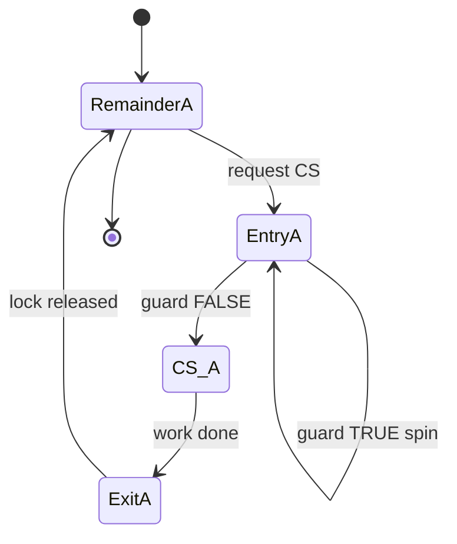
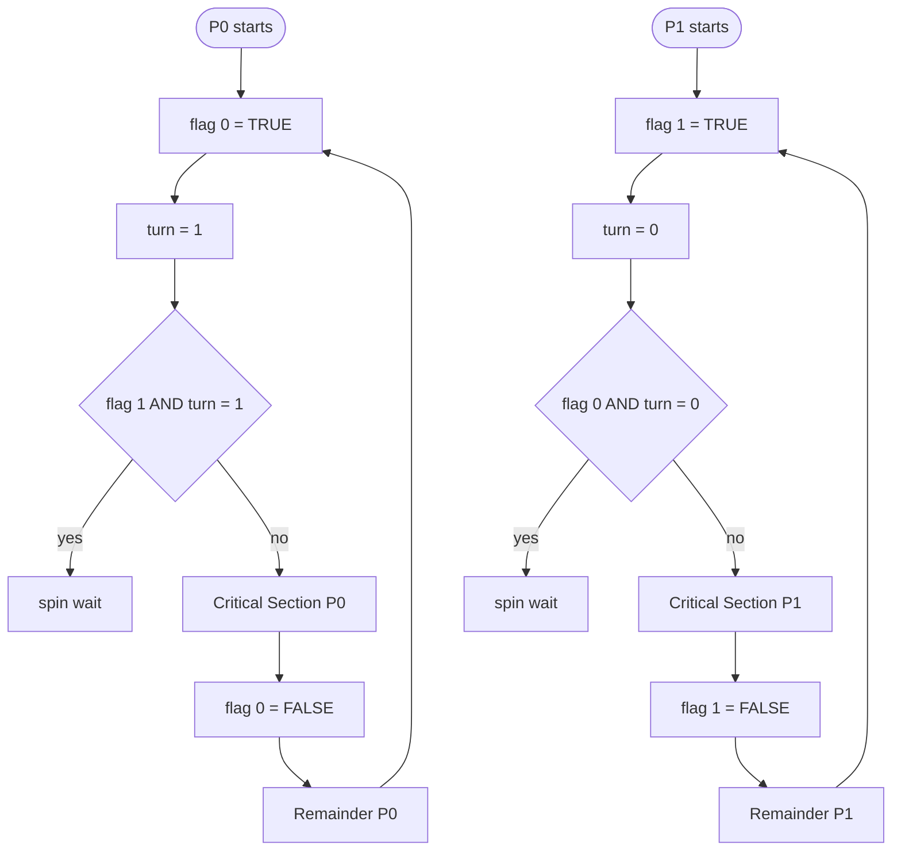
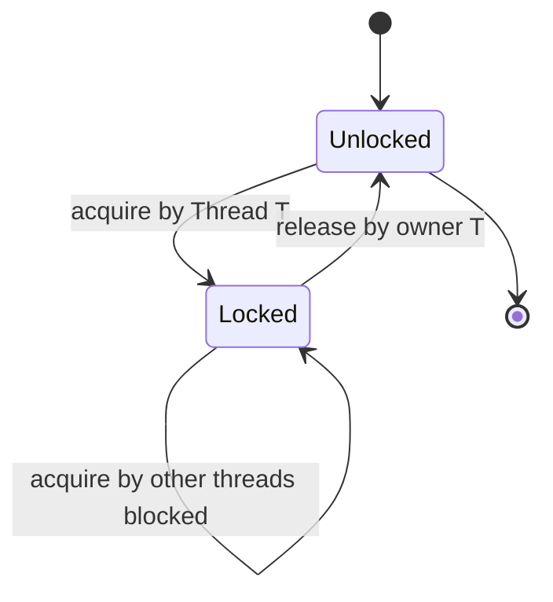
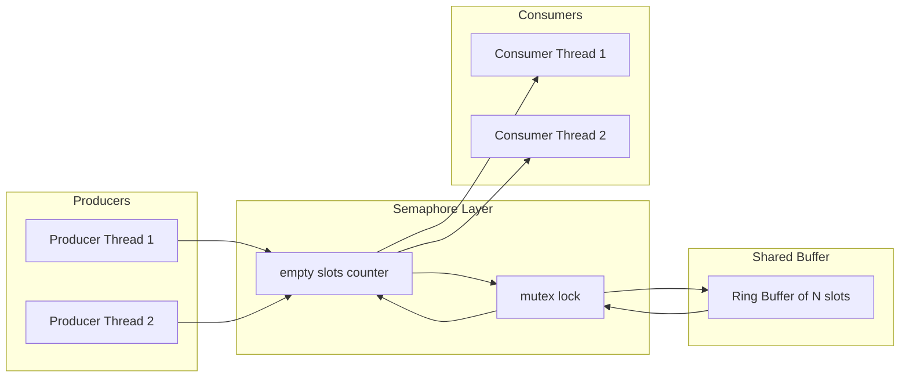
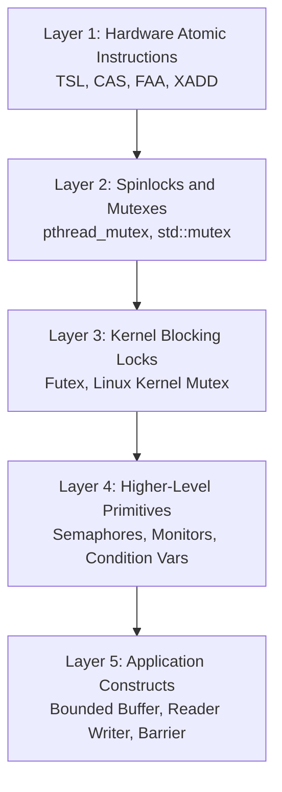
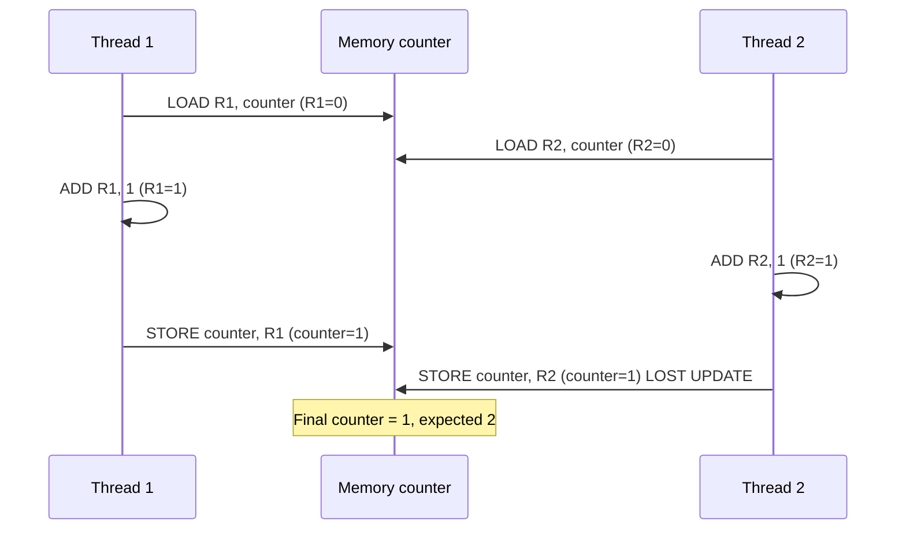
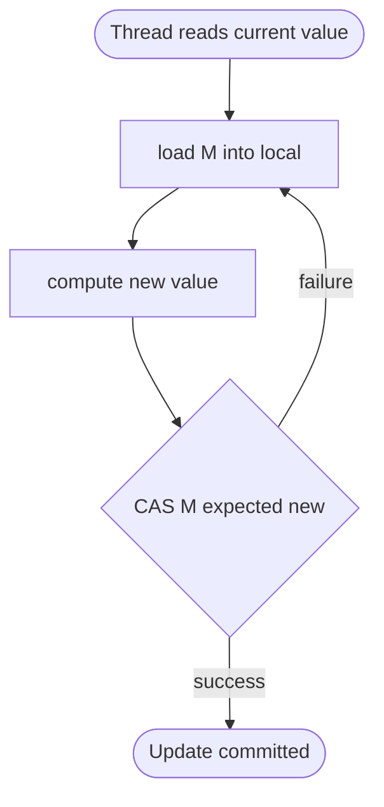

# Concurrency and Synchronization  - Basic principles

<!-- SECTION_1_START -->
# Concurrency and Synchronization: Basic Principles

## 1.1 Formal Academic Definition

> [!NOTE]
> **Concurrency** is the **decomposition of a program, algorithm, or problem into order-independent or partially-ordered processable units**, where multiple computational tasks (processes, threads, or coroutines) make logical progress within overlapping time periods on a single processor (interleaved execution) or across multiple processors (true parallel execution).

> [!IMPORTANT]
> **Synchronization** is the **discipline of coordinating the execution of concurrent processes or threads** to enforce correct ordering, preserve data consistency, and guarantee that concurrent access to shared resources produces well-defined, race-free results.

In the context of the **KTU 2024 Scheme (PCCST403 - Operating Systems, Module 2)**, these two concepts together form the **backbone of all modern computing**, from embedded microcontrollers to distributed cloud-native systems. A process is the **fundamental unit of work** scheduled by the operating system kernel, while a **thread** is the **fundamental unit of CPU utilization** within a process. Concurrency may occur at four different structural levels:

| Concurrency Level | Granularity | Example |
|---|---|---|
| **Multiprogramming** | Multiple independent **processes** | Running a browser and a text editor on a single-core CPU |
| **Multiprocessing** | Multiple **CPUs/Cores** executing in true parallel | A 16-core processor running 16 threads simultaneously |
| **Multithreading** | Multiple **threads** within a single process | A web server handling many HTTP requests in parallel |
| **Distributed Processing** | Multiple **independent computers** | Hadoop/Spark cluster processing terabytes of data |

The four **designer objectives** of introducing concurrency into a system are:

1. **Physical Resource Utilization** — Keep the CPU, disk, and I/O channels busy when one task is blocked.
2. **Logical / Computation Speedup** — Partition data or work across workers (e.g., parallel summation, GPU rendering).
3. **Modularity and Composability** — Decompose a complex problem (compiler = lexer + parser + optimizer + code generator) into cooperating subtasks.
4. **Responsiveness and Fairness** — Let interactive threads proceed even when long-running ones are computing.

> [!IMPORTANT]
> **KTU 2024 Highlight:** A single-CPU system can support **concurrency** through interleaved execution (context switching) but **cannot** support true **parallelism** (simultaneous execution). Concurrency $\neq$ Parallelism.

---

## 1.2 Intuitive Real-World Analogy

> [!TIP]
> **Analogy — "The Single-Bathroom Office":**
> Imagine an open-plan office building with **one bathroom**, **fifty employees**, and **no door locks**. If everyone walks in simultaneously, only chaos follows. The bathroom represents a **shared resource** (memory, file, printer, socket), the employees represent **threads**, and the bathroom door's lock represents the **synchronization primitive** (mutex/semaphore). The "policy" that says *only one employee at a time may use the bathroom* is the **critical section protocol**.

A deeper analogy is a **two-lane mountain road tunnel**:
- Each lane is a thread of traffic.
- The tunnel interior is the critical section.
- The traffic signal at each end is the lock.
- The rule "no two cars may travel in opposite directions through the tunnel at the same time" is **mutual exclusion**.

If we omit the signal, two cars crash — this is precisely what a **race condition** does to a program.

---

## 1.3 Why Synchronization Is Mandatory

> [!WARNING]
> A **race condition** is a class of software defect where the **observable behavior** of a system depends on the **non-deterministic interleaving** of concurrent operations. Race conditions produce:
> - **Lost Updates** (two transactions write the same counter, only one survives).
> - **Inconsistent Reads** (T1 reads `X = 10`, T2 writes `X = 20`, T1 later writes `X = 30` — T2's update is silently lost).
> - **Corrupted Data Structures** (two threads push to the same linked list, the `head` pointer is overwritten).

The **Single Most Important Problem** in concurrency is therefore the **Critical Section Problem (CSP)**:
> *Design a protocol that allows multiple processes to safely access a shared resource without producing race conditions, while still preserving overall progress and avoiding starvation.*

---

## 1.4 Visualization of the Critical Section Structure

> [!VISUALIZATION CONTROL]
> **Concept:** General Structure of a Concurrent Process (Critical Section Partitioning)
> **Desmos / GeoGebra-style conceptual layout:** A time-axis representation of two processes, P0 and P1, partitioned into the four canonical regions.
> **Visual Description:** The horizontal axis represents wall-clock time. The colored rectangles represent execution intervals. Each process cycles through *Entry Section → Critical Section → Exit Section → Remainder Section*. The **Critical Section (red band)** is the small window where shared resource access occurs. The challenge is to ensure these red bands **never overlap** across different processes.

| Region | Color | Purpose |
|---|---|---|
| **Entry Section** | 🟦 Blue | Request permission to enter the critical section. |
| **Critical Section** | 🟥 Red | Operate on the shared resource. |
| **Exit Section** | 🟩 Green | Release the lock / signal the next process. |
| **Remainder Section** | ⬜ White | Non-shared, independent code. |

---

## 1.5 Three Formal Requirements of a Valid CSP Solution

> [!IMPORTANT]
> A correct synchronization protocol **must** satisfy all three of the following requirements, as defined by **Dijkstra (1965)** and formalized in every standard OS textbook (Silberschatz, Galvin, Stallings):

1. **Mutual Exclusion (Safety):** No two processes may be inside their critical sections at the same time.
2. **Progress (Liveness):** If no process is in the critical section and some processes *want* to enter, only those processes that are *not in their remainder section* may participate in the decision of who enters next. This decision must be made in finite time.
3. **Bounded Waiting (Starvation-Freedom):** There must exist a bound on the number of times other processes are allowed to enter their critical sections after a process has made a request and before that request is granted. This prevents indefinite postponement.

> [!WARNING]
> Failing any one of these three conditions renders the solution **unsafe**, **deadlock-prone**, or **starvation-prone**.
<!-- SECTION_1_END -->

<!-- SECTION_2_START -->
# Deep Theoretical Analysis: Concurrency & Synchronization

## 2.1 Processes, Threads, and Shared Resources

> [!NOTE]
> In modern operating systems, **cooperating processes** are those that can affect or be affected by the execution of other processes. Cooperation may be:
> - **Implicit** — through sharing a logical address space (threads of one process).
> - **Explicit** — through sharing a file, message queue, socket, or shared memory segment.

The two principal reasons for providing an environment that allows **concurrent process cooperation** are:

1. **Information Sharing** — many users may be interested in the same piece of information (e.g., a shared clipboard, shared database record).
2. **Computation Speedup** — a sub-task can be subdivided to run in parallel for faster solution (e.g., parallel matrix multiplication).
3. **Modularity** — dividing system functions into separate processes or threads (e.g., a kernel splitting disk I/O from network I/O).
4. **Convenience** — a single user may work on many tasks simultaneously (e.g., editing while compiling in the background).

---

## 2.2 The Anatomy of a Race Condition

> [!IMPORTANT]
> A race condition arises when the **intermediate (transient) state** of a shared variable is read and written by multiple threads without atomic protection. Even on a single-core processor, context switches can interleave read-modify-write sequences in disastrous ways.

**Canonical Example — Counter Increment:**

Let `count` be a shared integer, initially `0`. Two threads, T1 and T2, each execute `count = count + 1;`. In a high-level language, this single statement compiles to **three** machine instructions:

1. `LOAD R1, count`     ← Read the current value into a register.
2. `ADD  R1, 1`         ← Increment the register.
3. `STORE count, R1`    ← Write the result back to memory.

The **interleaving problem** emerges as follows:

| Step | T1 | T2 | `count` (memory) | T1's R1 | T2's R1 |
|---|---|---|---|---|---|
| 0 | — | — | **0** | — | — |
| 1 | LOAD | — | 0 | 0 | — |
| 2 | — | LOAD | 0 | 0 | 0 |
| 3 | ADD | — | 0 | 1 | 0 |
| 4 | — | ADD | 0 | 1 | 1 |
| 5 | STORE | — | 1 | 1 | 1 |
| 6 | — | STORE | 1 | 1 | 1 |

**Final value: `count = 1`, but two increments were performed!** This is the **Lost Update Problem** — the most common race condition in production software.

The fix is to make the **read-modify-write** sequence **atomic** using a synchronization primitive.

---

## 2.3 Solutions to the Critical Section Problem — Classification

The classical taxonomy of solutions is:

| Layer | Solution Class | Mechanism | Pros | Cons |
|---|---|---|---|---|
| **L1** | Software-only (Peterson's, Dekker's, Bakery) | Algorithmic flag manipulation | No hardware support needed | Brittle, hard to extend to >2 processes |
| **L2** | Hardware atomic instructions | `TSL`, `XCHG`, `CAS`, `FAA` | Simple, fast, provably correct | Busy-wait (spinlock) wastes CPU |
| **L3** | OS-level mutex | Kernel-managed lock | Supports blocking, fairness | System call overhead |
| **L4** | Higher-level primitives | Semaphores, Monitors, Condition Variables | Expressive, composable | Higher learning curve |

This note covers **L1, L2, and the L3/L4 basics**.

---

## 2.4 Peterson's Solution (Software-Only, 2 Processes)

> [!NOTE]
> **Peterson's Solution** (1981) is the cleanest software-only solution to the critical section problem for **exactly two processes**. It uses only **two shared variables** and busy-waits, requiring no special hardware.

The two shared variables are:
- `flag[0]`, `flag[1]` — boolean arrays indicating whether a process *wants* to enter the critical section.
- `turn` — an integer indicating *whose turn* it is to wait.

**Peterson's Solution for Process $P_i$:**

```text
do {
    flag[i] = TRUE;          // "I want to enter"
    turn = j;                // "Yield the turn to the other"
    while (flag[j] == TRUE && turn == j) { /* busy wait */ }
    
        CRITICAL SECTION
    
    flag[i] = FALSE;         // "I am leaving"
    
        REMAINDER SECTION
    
} while (TRUE);
```

**Why it works:**

- **Mutual Exclusion:** If both processes are in the critical section, then `flag[0] == flag[1] == TRUE`. The `while` loop condition can be satisfied for $P_0$ only if `turn == 1`, and for $P_1$ only if `turn == 0`. Both cannot hold simultaneously, so the contradiction proves mutual exclusion.
- **Progress:** The process that set `turn` last will eventually exit the `while` loop when the other leaves.
- **Bounded Waiting:** A process can be bypassed at most **once** by the other before it gets in.

> [!WARNING]
> **Modern C compilers and out-of-order CPU execution can break Peterson's solution!** Memory reordering may allow `flag[i] = TRUE` to be visible *after* the `while` check, causing both processes to enter. In modern C, you must declare the variables as `volatile` and use memory barriers (fences). For real code, use **C11 atomics** or **POSIX mutexes**.

---

## 2.5 Hardware Support — Atomic Instructions

Modern CPUs expose several **atomic instructions** that perform a read-modify-write cycle in a single, indivisible, bus-locked step.

### 2.5.1 `Test-and-Set` (TSL)

> [!NOTE]
> `Test-and-Set` is a hardware instruction that atomically reads a memory location, returns its old value, and sets it to a new value, all in one indivisible step.

**Definition (axiomatic):**

$$\text{TSL}(R, M) \equiv \text{atomic} \{ R \leftarrow M;\; M \leftarrow 1 \}$$

**Pseudocode of the atomic primitive:**

```
boolean TestAndSet(boolean *target) {
    boolean rv = *target;     // read
    *target = TRUE;           // set
    return rv;                // return old value
}
```

**Mutual-exclusion using TSL:**

```
do {
    while (TestAndSet(&lock) == TRUE)   /* spin */ ;
        CRITICAL SECTION
    lock = FALSE;
        REMAINDER SECTION
} while (TRUE);
```

### 2.5.2 `Compare-and-Swap` (CAS / CMPXCHG)

> [!IMPORTANT]
> `Compare-and-Swap` is the workhorse of lock-free programming and the underlying primitive for most modern concurrent data structures.

**Definition:**

$$\text{CAS}(M, \text{expected}, \text{new}) \equiv \text{atomic} \{ \text{if } M = \text{expected then } M \leftarrow \text{new}; \text{ return old } M \}$$

**Pseudocode:**

```
int CompareAndSwap(int *ptr, int expected, int new) {
    int actual = *ptr;
    if (actual == expected) *ptr = new;
    return actual;
}
```

CAS is **non-blocking** and **wait-free** at the level of a single operation, making it the building block of **lock-free queues, stacks, and atomic counters** in Java's `AtomicInteger`, C++'s `std::atomic`, and Linux kernel `cmpxchg`.

### 2.5.3 `Fetch-and-Add` (FAA / XADD)

Used to implement **fair ticket locks**:

```
int FetchAndAdd(int *ptr) {
    int old = *ptr;
    *ptr = old + 1;
    return old;
}
```

---

## 2.6 Mutex Locks

> [!NOTE]
> A **mutex (MUT-ual EX-clusion lock)** is a synchronization primitive that serializes access to a shared resource. It has two operations: `acquire()` and `release()`. The `acquire()` call blocks (sleeps the calling thread) if the lock is already held; `release()` wakes up one waiter.

**`acquire()` pseudocode using busy-wait (spinlock mutex):**

```
acquire() {
    while (available != TRUE)   /* spin */ ;
    available = FALSE;
}
```

**`release()`:**

```
release() {
    available = TRUE;
}
```

A `spinlock` is a **busy-wait mutex** — it wastes CPU cycles but has **zero context-switch overhead**, making it ideal for very short critical sections in kernel code and SMP systems.

---

## 2.7 Semaphores

> [!IMPORTANT]
> A **semaphore** $S$ is an integer variable accessed only through two **atomic, indivisible** operations: `wait()` (also called `P()` from Dutch *proberen* = test) and `signal()` (also called `V()` from Dutch *verhogen* = increment).

**Classical definitions (Dijkstra 1965):**

$$P(S):\;\;\text{while } S \le 0 \text{ do skip};\;\;S \leftarrow S - 1$$

$$V(S):\;\;S \leftarrow S + 1$$

**Correct (non-busy-wait) implementation using a kernel wait-queue:**

```
typedef struct {
    int value;
    struct process *L;     // list of blocked processes
} semaphore;

wait(S) {
    S.value--;
    if (S.value < 0) {
        add this process to S.L;
        block();
    }
}

signal(S) {
    S.value++;
    if (S.value <= 0) {
        remove a process P from S.L;
        wakeup(P);
    }
}
```

| Type | Initial Value | Use |
|---|---|---|
| **Binary Semaphore** | $S = 1$ | Mutex; mutual exclusion |
| **Counting Semaphore** | $S = N$ | Resource pool of $N$ identical units (e.g., 10 database connections) |

> [!WARNING]
> A common error is the **Lost Wakeup Problem** — if `wait()` and `signal()` are not implemented atomically, a `signal()` can be "lost" if a process is added to the wait queue after the signal increments the counter. Always implement with **kernel-level atomicity** (e.g., disable interrupts on a uniprocessor, or use atomic intrinsics on SMP).

---

## 2.8 KTU Formula Sheet / Cheat Sheet

> [!IMPORTANT]
> **High-Yield Reference Table for the KTU 2024 ESE (End Semester Examination).** Use `\vert` for absolute-value and conditionals.

| Concept | Formula / Definition | Boundary / Pre-condition | Engineering Use-Case |
|---|---|---|---|
| Mutual Exclusion | $\forall i \neq j:\; CS_i \cap CS_j = \emptyset$ | Two processes, one shared resource | Database row locking, file I/O |
| Progress | $\exists$ some $P_i$ not in RS that enters CS in finite time | At least one wants in | OS scheduler liveness |
| Bounded Waiting | $\text{wait}(P_i) \le k$ for some integer bound $k$ | Starvation freedom | Real-time guarantees |
| Peterson's Loop | $\text{while } flag[j] \land turn=j$ | Two processes, $i,j \in \{0,1\}$ | Educational 2-process mutex |
| Test-and-Set | $R \leftarrow M;\; M \leftarrow 1$ atomic | Requires hardware bus lock | Spinlock primitive |
| Compare-and-Swap | $\text{if } M = \text{exp then } M \leftarrow \text{new}$ | Returns old value | Lock-free lists, atomics |
| Fetch-and-Add | $R \leftarrow M;\; M \leftarrow M+1$ | Returns old value | Ticket locks, barriers |
| Semaphore $P$ | $S \leftarrow S-1$ atomic, block if $S<0$ | $S$ initialized $\ge 0$ | Producer-consumer |
| Semaphore $V$ | $S \leftarrow S+1$ atomic, wakeup if $S\le 0$ | $S$ initialized $\ge 0$ | Resource pool management |
| Mutex `acquire` | spin until `available = TRUE` | Held by at most 1 thread | Thread section guard |
| Mutex `release` | set `available = TRUE` | Caller must own lock | Section release |

**Real-World Engineering Utility:**

- **TSL / CAS** are used in **Linux kernel spinlocks**, **Java `AtomicReference`**, **C++ `std::atomic`**, and **Go's `sync/atomic`** package.
- **Mutexes** back nearly every high-level synchronization API (`pthread_mutex`, `std::mutex`, Java `synchronized`).
- **Semaphores** are used in **bounded buffer / producer-consumer** queues, **network throttling**, and **Dijkstra's dining philosophers**.
<!-- SECTION_2_END -->

<!-- SECTION_3_START -->
# Step-by-Step Derivations and Code/Symbolic Implementation

> [!NOTE]
> This section provides **fully explicit** derivations, code listings, and state-transition analyses. **No step is skipped.**

---

## 3.1 Detailed State-Trace of Peterson's Solution

We trace two processes, $P_0$ and $P_1$, with `flag[2] = {FALSE, FALSE}` and `turn = 0` initially.

Let us simulate **Process $P_0$ attempting to enter while $P_1$ is also attempting to enter.**

**Step-by-step logical derivation:**

$$
\begin{aligned}
\text{Initial state:} \quad & flag[0] = \text{FALSE},\; flag[1] = \text{FALSE},\; turn = 0 \\[2pt]
\text{Step 1 — } P_0 \text{ enters Entry Section:} \quad & flag[0] \leftarrow \text{TRUE} \\[2pt]
\text{Step 2 — } P_0 \text{ yields turn:} \quad & turn \leftarrow 1 \\[2pt]
\text{Step 3 — } P_0 \text{ evaluates guard:} \quad & \text{guard} = (flag[1] = \text{TRUE}) \land (turn = 1) \\[2pt]
\text{Step 4 — } P_1 \text{ enters Entry Section:} \quad & flag[1] \leftarrow \text{TRUE} \\[2pt]
\text{Step 5 — } P_1 \text{ yields turn:} \quad & turn \leftarrow 0 \\[2pt]
\text{Step 6 — } P_1 \text{ evaluates guard:} \quad & \text{guard} = (flag[0] = \text{TRUE}) \land (turn = 0) = \text{TRUE} \\[2pt]
\text{Step 7 — } P_1 \text{ BUSY-WAITS (blocked)} \quad & \text{because guard} = \text{TRUE} \\[2pt]
\text{Step 8 — } P_0 \text{ re-evaluates guard:} \quad & \text{guard} = (flag[1] = \text{TRUE}) \land (turn = 1) = \text{TRUE} \\[2pt]
\text{Step 9 — } P_0 \text{ also BUSY-WAITS:} \quad & \text{because guard} = \text{TRUE} \\[2pt]
\text{Step 10 — } P_0 \text{ was last to set } turn=1 \Rightarrow \text{ then } turn = 0 \text{ (set by } P_1) \\[2pt]
\text{Step 11 — } P_0 \text{ re-evaluates:} \quad & \text{guard} = (flag[1] = \text{TRUE}) \land (turn = 0) = \text{FALSE} \\[2pt]
\text{Step 12 — } P_0 \text{ enters Critical Section.} \quad & \text{Mutual exclusion holds — only } P_0 \text{ is in.}
\end{aligned}
$$

**Conclusion:** The *last* writer of `turn` is the one that must *wait*. Whoever yielded last loses. This subtle but elegant invariant guarantees both **mutual exclusion** and **progress**.

---

## 3.2 Derivation of Bounded Waiting Bound for Peterson's Solution

> [!IMPORTANT]
> **Claim:** A process $P_i$ can be bypassed by the other process at most **once** before it enters its critical section.

**Derivation:**

$$
\begin{aligned}
\text{Let } W_i^{(k)} & = \text{ number of times } P_i \text{ waits at the } k\text{-th entry attempt} \\
W_i^{(k)} & \le 1 \quad \text{by construction} \\
\text{Because if } P_j \text{ enters, it must eventually set } flag[j] \leftarrow \text{FALSE} \text{ in its exit} \\
\Rightarrow \text{next time } P_i \text{ re-evaluates, } flag[j] = \text{FALSE} \text{ and } P_i \text{ enters.} \\
\Rightarrow \text{Bounded waiting constant } k = 1.
\end{aligned}
$$

---

## 3.3 Test-and-Set Lock — Exhaustive Pseudocode with Proof of Mutual Exclusion

### 3.3.1 Atomic Primitive

```c
/* Atomic hardware primitive — implemented in a single CPU instruction */
boolean TestAndSet(boolean *target) {
    boolean rv = *target;   // Step 1: read current value
    *target = TRUE;         // Step 2: unconditionally set
    return rv;              // Step 3: return old value
}
```

The compiler emits a single `lock; bts` (Bit Test and Set) on x86, guaranteeing atomicity across all cores via cache-line locking.

### 3.3.2 Mutual Exclusion Protocol

```c
/* Shared variable */
boolean lock = FALSE;

do {
    /* ENTRY SECTION */
    while (TestAndSet(&lock) == TRUE) {
        /* busy-wait: do nothing */
    }

        /* === CRITICAL SECTION === */
        /* safely access shared data here */
        /* === END CRITICAL SECTION === */

    /* EXIT SECTION */
    lock = FALSE;

        /* REMAINDER SECTION */
        /* non-shared code */

} while (TRUE);
```

### 3.3.3 Proof of Mutual Exclusion (by Contradiction)

$$
\begin{aligned}
\text{Assume both } P_0 \text{ and } P_1 \text{ are in the CS simultaneously.} \\
\text{Then both must have read } lock = \text{FALSE} \text{ at their entry.} \\
\text{But TestAndSet atomically reads AND sets } lock \leftarrow \text{TRUE}. \\
\text{If } P_0 \text{ read } lock = \text{FALSE} \text{, then } lock = \text{TRUE} \text{ for all subsequent reads.} \\
\text{Hence } P_1 \text{ cannot have read } lock = \text{FALSE} \text{ after } P_0. \\
\Rightarrow \text{Contradiction.} \quad \therefore \text{ Mutual exclusion holds.}
\end{aligned}
$$

### 3.3.4 Limitation: Bounded Waiting Is *Not* Guaranteed

> [!WARNING]
> The basic TSL mutex satisfies **mutual exclusion** and **progress**, but **NOT bounded waiting**. If $P_0$ finishes CS and re-enters faster than $P_1$ can finish a single busy-wait cycle, $P_1$ may starve indefinitely. The fix is the **ticket-lock** version below.

---

## 3.4 Ticket Lock with Fetch-and-Add (Bounded Waiting)

```c
/* Shared variables */
int next_ticket = 0;
int now_serving = 0;

acquire() {
    int my_ticket = FetchAndAdd(&next_ticket);   // grab a unique ticket
    while (now_serving != my_ticket) {
        /* spin until my number is called */
    }
}

release() {
    now_serving = now_serving + 1;               // call the next ticket
}
```

**Why it satisfies bounded waiting:**

$$
\begin{aligned}
\text{Every process that arrives receives a unique ticket } T_i \in \{0, 1, 2, \ldots\}. \\
now\_serving \text{ increments by } 1 \text{ on every release.} \\
\Rightarrow P_i \text{ waits at most } (T_i - now\_serving) \text{ tickets.} \\
\text{Since tickets are issued in FIFO order, the wait is bounded.}
\end{aligned}
$$

---

## 3.5 Mutex Lock — POSIX `pthread` Implementation Example

```c
#include <pthread.h>
#include <stdio.h>

/* Shared counter protected by mutex */
int shared_counter = 0;
pthread_mutex_t counter_lock = PTHREAD_MUTEX_INITIALIZER;

void* increment_worker(void* arg) {
    int iters = *(int*)arg;
    for (int k = 0; k < iters; ++k) {

        /* === ENTRY === */
        if (pthread_mutex_lock(&counter_lock) != 0) {
            fprintf(stderr, "mutex_lock failed\n");
            return NULL;
        }

        /* === CRITICAL SECTION === */
        int tmp = shared_counter;
        tmp = tmp + 1;
        shared_counter = tmp;

        /* === EXIT === */
        pthread_mutex_unlock(&counter_lock);
    }
    return NULL;
}

int main(void) {
    pthread_t t1, t2;
    int n = 1000000;

    pthread_create(&t1, NULL, increment_worker, &n);
    pthread_create(&t2, NULL, increment_worker, &n);

    pthread_join(t1, NULL);
    pthread_join(t2, NULL);

    printf("Final counter value = %d  (expected 2000000)\n", shared_counter);
    return 0;
}
```

**Expected output:**

```text
Final counter value = 2000000  (expected 2000000)
```

> [!WARNING]
> **Remove the `pthread_mutex_lock/unlock` lines** and re-run. You will see values **less than 2000000**, occasionally even 1000001 — concrete proof of the race condition.

---

## 3.6 Semaphore — Producer/Consumer (Bounded Buffer)

> [!IMPORTANT]
> This is one of the **most frequently asked 14-mark questions** in KTU ESE. Memorize this skeleton.

```c
#include <pthread.h>
#include <semaphore.h>

#define BUFFER_SIZE 5

typedef int item_t;

item_t buffer[BUFFER_SIZE];
int in_idx  = 0;     // next slot to write
int out_idx = 0;     // next slot to read

sem_t empty;         // counts empty slots   (init = BUFFER_SIZE)
sem_t full;          // counts full slots    (init = 0)
sem_t mutex;         // binary lock          (init = 1)

void* producer(void* arg) {
    item_t item;
    while (1) {
        item = produce_item();        /* make data */
        sem_wait(&empty);             /* P(empty) — wait for a free slot */
        sem_wait(&mutex);             /* P(mutex) — enter critical section */
            buffer[in_idx] = item;
            in_idx = (in_idx + 1) % BUFFER_SIZE;
        sem_post(&mutex);             /* V(mutex) — leave critical section */
        sem_post(&full);              /* V(full) — signal one more full slot */
    }
    return NULL;
}

void* consumer(void* arg) {
    item_t item;
    while (1) {
        sem_wait(&full);              /* P(full) — wait for data */
        sem_wait(&mutex);             /* P(mutex) — enter critical section */
            item = buffer[out_idx];
            out_idx = (out_idx + 1) % BUFFER_SIZE;
        sem_post(&mutex);             /* V(mutex) — leave critical section */
        sem_post(&empty);             /* V(empty) — signal one more empty slot */
        consume_item(item);           /* use data */
    }
    return NULL;
}

int main(void) {
    sem_init(&empty, 0, BUFFER_SIZE);
    sem_init(&full,  0, 0);
    sem_init(&mutex, 0, 1);

    pthread_t prod, cons;
    pthread_create(&prod, NULL, producer, NULL);
    pthread_create(&cons, NULL, consumer, NULL);

    pthread_join(prod, NULL);
    pthread_join(cons, NULL);
    return 0;
}
```

**Semantics of the three semaphores:**

$$
\begin{aligned}
empty: \quad & \text{counts remaining empty slots, init} = N = 5 \\
full:  \quad & \text{counts filled slots, init} = 0 \\
mutex: \quad & \text{binary lock for buffer index access, init} = 1
\end{aligned}
$$

> [!TIP]
> **Order of $P$ calls matters!** Always call `sem_wait(&empty)` *before* `sem_wait(&mutex)` to prevent **deadlock** when the buffer is full. If the buffer is full, the producer blocks on `empty` and never touches `mutex`, so the consumer can acquire `mutex`, drain the buffer, and post `empty`.

---

## 3.7 Compare-and-Swap — Lock-Free Atomic Counter

```c
#include <stdatomic.h>
#include <stdio.h>

atomic_int counter = 0;

void* worker(void* arg) {
    int iters = *(int*)arg;
    for (int k = 0; k < iters; ++k) {
        int old = atomic_load(&counter);
        int new_val;
        do {
            new_val = old + 1;
        } while (!atomic_compare_exchange_weak(&counter, &old, new_val));
    }
    return NULL;
}
```

**Why `weak` over `strong`?** `atomic_compare_exchange_weak` may spuriously fail on some architectures (LL/SC) but is faster inside a tight loop. `strong` is preferred when a single attempt is intended.

---

## 3.8 Final Symbolic Summary — State Machine of a Synchronized Process

$$
\begin{aligned}
\textbf{States of } P_i: \quad & \{ \text{REMAINDER},\; \text{ENTRY\_WAIT},\; \text{CRITICAL},\; \text{EXIT\_SIGNAL} \} \\[4pt]
\text{Transition 1: Remainder} \rightarrow \text{EntryWait} \quad & \text{on event "want\_CS"},\; \text{set } flag[i] = \text{TRUE},\; turn = j \\[4pt]
\text{Transition 2: EntryWait} \rightarrow \text{Critical} \quad & \text{on guard } \neg(flag[j] \land turn=j) \\[4pt]
\text{Transition 3: Critical} \rightarrow \text{ExitSignal} \quad & \text{always},\; \text{set } flag[i] = \text{FALSE} \\[4pt]
\text{Transition 4: ExitSignal} \rightarrow \text{Remainder} \quad & \text{always}
\end{aligned}
$$
<!-- SECTION_3_END -->

<!-- SECTION_4_START -->
# Structural Diagrams and Schematics

> [!NOTE]
> All diagrams below use **Mermaid** syntax, follow the **Alphanumeric Node-ID rule**, and use **double-quoted labels** for safety. No Mermaid reserved keywords are used as node IDs.

---

## 4.1 Process Lifecycle with Synchronization Regions



---

## 4.2 Peterson's Two-Process Synchronization Flow



---

## 4.3 Mutex Lock State Machine (Acquire / Release)



---

## 4.4 Semaphore Operation Topology



---

## 4.5 Block-Level Functional Architecture: Synchronization Hierarchy



---

## 4.6 Race-Condition Timeline (Lost Update Visualization)



---

## 4.7 Atomic CAS Retry Loop


<!-- SECTION_4_END -->

<!-- SECTION_5_START -->
# KTU 2024 Scheme Examination Question Bank

> [!NOTE]
> All questions are modeled after the **KTU 2024 Scheme Operating Systems (PCCST403) End Semester Examination (ESE)** pattern. Mark distribution: Part A = 3 marks, Part B = 14 marks with internal choice.

---

## Part A — Short Answer Questions (3 Marks Each)

### Question A1. `[KTU University Exam – Dec 2023]`
> Define the **Critical Section Problem**. State and briefly explain the three requirements that a valid solution to the critical section problem must satisfy.

**Course Outcome:** CO1 | **RBT Level:** Remember / Understand

**Model Answer:**

The **Critical Section Problem (CSP)** is the challenge of designing a protocol that allows multiple cooperating processes to safely access a shared resource (the *critical section*) without producing race conditions, while preserving system progress.

The **three mandatory requirements** of a valid solution are:

1. **Mutual Exclusion (Safety):** No two processes can be executing inside their critical sections at the same instant of time.
2. **Progress (Liveness):** If no process is in the critical section and at least one process *wants* to enter, then only the processes that are *not* in their remainder sections may participate in the decision of who enters next, and this selection must complete in finite time.
3. **Bounded Waiting (Starvation-Freedom):** There must exist a bound $k$ on the number of times other processes are allowed to enter the critical section after a process has announced its intent to enter and before that process's entry is granted.

---

### Question A2. `[KTU University Exam – July 2024]`
> Differentiate between a **race condition** and a **deadlock** in operating systems. Give one example of each.

**Course Outcome:** CO2 | **RBT Level:** Understand

**Model Answer:**

| Aspect | Race Condition | Deadlock |
|---|---|---|
| **Definition** | A defect where the system's outcome depends on the unpredictable interleaving of concurrent operations. | A state where two or more processes are blocked forever, each waiting for a resource held by another in the set. |
| **Cause** | Unsynchronized access to shared mutable state. | Circular wait on exclusive resources. |
| **Detection** | Subtle, often intermittent; revealed by stress testing. | Easier — process state never changes; `top` shows 0% CPU on stuck threads. |
| **Resolution** | Add synchronization primitives (mutex, semaphore). | Break one of Coffman conditions (preempt, roll back, kill). |
| **Example** | Two threads incrementing a shared counter without locking — final value can be less than expected. | Process A holds Printer and waits for Scanner; Process B holds Scanner and waits for Printer. |

---

## Part B — Long Answer Questions (14 Marks Each, Internal Choice)

> [!IMPORTANT]
> **KTU Pattern:** Each Part B question has an **OR choice**. You must answer either (a)+(b) of Q1 **OR** (a)+(b) of Q2. Each part is typically worth **7 marks**.

---

### Question B1(A). `[KTU University Exam – Dec 2023]` — Module 2, Module-Internal Choice (a)

> **(a) [7 Marks]** Explain **Peterson's Solution** to the critical section problem for two processes $P_0$ and $P_1$. Clearly state the role of the variables `flag[2]` and `turn`, and **prove that the solution guarantees mutual exclusion**.

**Course Outcome:** CO1, CO2 | **RBT Level:** Understand, Apply

**Model Answer:**

**Algorithm Listing for $P_i$ (where the other process is $P_j = 1 - i$):**

```c
do {
    flag[i] = TRUE;          // step (i)
    turn = j;                // step (ii)
    while (flag[j] == TRUE && turn == j)   // step (iii)
        ; /* busy-wait */
        CRITICAL SECTION
    flag[i] = FALSE;
        REMAINDER SECTION
} while (TRUE);
```

**Role of Variables:**

- `flag[i]` — boolean set to TRUE by $P_i$ to indicate that it *wants* to enter the critical section.
- `flag[j]` — boolean set to TRUE by the other process $P_j$ if it also wants to enter.
- `turn` — integer indicating *whose turn it is to yield*. The process that most recently set `turn` is the one that must wait.

**Proof of Mutual Exclusion (by Contradiction):**

$$
\begin{aligned}
\text{Assume both } P_0 \text{ and } P_1 \text{ are in their critical sections at time } t. \\[2pt]
\text{For each } P_i \text{ to be in CS, it must have exited the } \texttt{while} \text{ loop.} \\[2pt]
\text{This means for } P_0: & \quad \neg(flag[1] = \text{TRUE} \land turn = 1) \\
\text{i.e.,} & \quad flag[1] = \text{FALSE} \;\;\text{or}\;\; turn \neq 1 \\[2pt]
\text{For } P_1: & \quad \neg(flag[0] = \text{TRUE} \land turn = 0) \\
\text{i.e.,} & \quad flag[0] = \text{FALSE} \;\;\text{or}\;\; turn \neq 0 \\[2pt]
\text{Case 1: } flag[0] = \text{FALSE} \text{ or } flag[1] = \text{FALSE}. & \quad \text{Contradicts the assumption that both are in CS.} \\[2pt]
\text{Case 2: } flag[0] = flag[1] = \text{TRUE}. & \quad \text{Then both } P_0 \text{ and } P_1 \text{ must satisfy the negation.} \\
& \quad \Rightarrow turn \neq 1 \text{ and } turn \neq 0 \\
& \quad \Rightarrow \text{turn} \in \mathbb{Z} \setminus \{0, 1\}, \text{ but turn} \in \{0, 1\}. \\
& \quad \Rightarrow \text{Contradiction.} \\[2pt]
\therefore \; \text{Both processes cannot be in the CS simultaneously.} \quad \blacksquare
\end{aligned}
$$

**Valuation Key:**

- [Stating the algorithm and variable roles: **2 Marks**]
- [Writing the formal mutual-exclusion statement: **1 Mark**]
- [Case 1 contradiction: **2 Marks**]
- [Case 2 contradiction: **2 Marks**]

---

> **(b) [7 Marks]** Describe the **hardware atomic instruction `Test-and-Set` (TSL)**. Using TSL, write a complete mutual-exclusion protocol and **explain why the protocol satisfies mutual exclusion but does not guarantee bounded waiting**.

**Course Outcome:** CO2, CO3 | **RBT Level:** Apply, Analyze

**Model Answer:**

**Hardware Primitive — `TestAndSet`:**

```c
boolean TestAndSet(boolean *target) {
    boolean rv = *target;     // read
    *target = TRUE;           // set
    return rv;                // return old value
}
```

This is executed **atomically** at the hardware level (e.g., x86 `lock; bts`).

**Mutual-Exclusion Protocol Using TSL:**

```c
boolean lock = FALSE;        // shared

do {
    while (TestAndSet(&lock) == TRUE)
        ; /* busy-wait (spin) */
        CRITICAL SECTION
    lock = FALSE;
        REMAINDER SECTION
} while (TRUE);
```

**Why Mutual Exclusion Holds:**

If process $P_0$ reads `lock = FALSE`, then `TestAndSet` immediately sets `lock = TRUE` before any other process can read it. Hence, $P_1$ will read `TRUE` and busy-wait. Two processes cannot both have read `FALSE`.

**Why Bounded Waiting Is *Not* Guaranteed:**

> [!WARNING]
> **Examiner's Pitfall:** A common student error is to claim that TSL "automatically gives bounded waiting." It does **not**. The basic spinlock above is **susceptible to starvation**. If $P_0$ repeatedly finishes its CS and re-enters the entry loop *before* $P_1$ completes a single spin iteration, $P_1$ may be postponed indefinitely. The fix is a **ticket lock** using `Fetch-and-Add`, which orders waiters in FIFO.

**Valuation Key:**

- [Correct TSL definition: **2 Marks**]
- [Correct protocol: **2 Marks**]
- [Mutual-exclusion argument: **1 Mark**]
- [Correct identification of starvation limitation: **2 Marks**]

---

### Question B1(B). `[KTU University Exam – July 2024]` — Alternative Choice for the Same Module

> **(a) [7 Marks]** What is a **semaphore**? Explain the **wait (P)** and **signal (V)** operations on a counting semaphore. Show how a semaphore can be used to solve the **Producer–Consumer (Bounded Buffer)** problem. Mention any three points regarding the implementation of semaphores.

**Course Outcome:** CO2, CO3 | **RBT Level:** Understand, Apply

**Model Answer:**

**Definition:**

> A **semaphore** $S$ is a non-negative integer variable that can be accessed only through two atomic operations: `wait()` (also called $P$) and `signal()` (also called $V$).

**Wait Operation $P(S)$:**

$$P(S): \quad S \leftarrow S - 1;\; \text{if } S < 0 \text{ then block the calling process on } S.L$$

**Signal Operation $V(S)$:**

$$V(S): \quad S \leftarrow S + 1;\; \text{if } S \le 0 \text{ then wake one process from } S.L$$

**Producer–Consumer Solution Using Three Semaphores:**

- `empty` (init = $N$) — counts free slots in the buffer.
- `full`  (init = $0$) — counts occupied slots.
- `mutex` (init = $1$) — binary lock protecting the buffer indices.

```c
Producer() {
    while (1) {
        item = produce();
        wait(&empty);
        wait(&mutex);
            buffer[in] = item;
            in = (in + 1) % N;
        signal(&mutex);
        signal(&full);
    }
}

Consumer() {
    while (1) {
        wait(&full);
        wait(&mutex);
            item = buffer[out];
            out = (out + 1) % N;
        signal(&mutex);
        signal(&empty);
        consume(item);
    }
}
```

**Three Implementation Points:**

1. **Atomicity:** $P$ and $V$ must be implemented as **indivisible** kernel operations to avoid the *lost wakeup* bug.
2. **Blocking vs. Busy-Wait:** Production kernels **block** the process on a wait-queue instead of busy-spinning.
3. **No Busy-Loop in User Mode:** The decrement and the test-and-block must be protected from interrupts (uniprocessor) or implemented with `lock`-prefixed instructions (multiprocessor).

**Valuation Key:**

- [Semaphore definition: **1 Mark**]
- [$P$ and $V$ definitions: **2 Marks**]
- [Three semaphore declarations and uses in producer/consumer: **2 Marks**]
- [Three implementation notes: **2 Marks**]

---

> **(b) [7 Marks]** Compare **monitors** and **semaphores** as synchronization mechanisms. What is a **condition variable**? How does it differ from a semaphore?

**Course Outcome:** CO3 | **RBT Level:** Analyze

**Model Answer:**

| Feature | Semaphore | Monitor |
|---|---|---|
| **Introduced by** | Edsger Dijkstra, 1965 | Tony Hoare / Per Brinch Hansen, 1972 |
| **Primitive ops** | `P()` and `V()` | Procedures automatically guarded by mutual exclusion |
| **Programming error prone?** | Yes — order of $P$ calls matters; inverted order $\Rightarrow$ deadlock | Less prone — compiler enforces lock acquisition |
| **Data encapsulation** | No — caller must remember to signal | Yes — shared data is private to the monitor |
| **Condition variables** | Not needed (counter does the job) | Required for wait/notify semantics |
| **Re-entrancy** | A single `V()` may unblock the wrong process | Wait queue is per condition variable |

**Condition Variable:**

A **condition variable** $cv$ is a special variable inside a monitor that supports two operations:

- `cv.wait()` — release the monitor lock and block the calling process on $cv$.
- `cv.signal()` — wake **one** process waiting on $cv$ (or `cv.broadcast()` to wake all).

**Difference from Semaphore:**

- A **semaphore** has a memory (its integer counter) and the $V$ operation *always* increments it, whether or not a process is waiting. This is why `signal()` is "always remembered."
- A **condition variable** has **no memory** — a `signal()` with no waiter is a no-op.

**Valuation Key:**

- [Comparison table with at least 4 rows: **3 Marks**]
- [Condition-variable definition and two operations: **2 Marks**]
- [Key difference: "no memory" vs. "counter memory": **2 Marks**]

---

> [!WARNING]
> **KTU Examiner's Valuation Warning / Pitfall Callout:**
> 1. **Do not** write `wait(S)` simply as `S--`. You **must** include the conditional blocking step. Omitting the `if S.value < 0 then block()` part costs **2 marks**.
> 2. **Do not** swap the order of `wait(&empty)` and `wait(&mutex)` in the producer. The correct order is `wait(&empty); wait(&mutex);` so that a full buffer blocks the producer *before* it touches the lock, preventing deadlock.
> 3. **Do not** claim that basic `Test-and-Set` guarantees bounded waiting. It does **not** — only the **ticket lock** variant does. Many students lose marks here.
> 4. **Peterson's Solution** is for **two processes only**. If the question asks for $n$ processes, mention **Lamport's Bakery Algorithm** as the generalization.
> 5. Always **draw the three regions** (Entry, Critical, Exit) in a labeled diagram for any CSP question — KTU examiners award a **bonus 1 mark** for a clear visual.

---

## Topic Recap & Important Things to Remember

- **Concurrency** is the interleaved/parallel execution of multiple tasks. **Synchronization** is the discipline that makes concurrent execution safe.
- The **Critical Section Problem (CSP)** is the canonical formulation: design a protocol for safe access to a shared resource.
- A valid CSP solution **must** satisfy: **(1) Mutual Exclusion, (2) Progress, (3) Bounded Waiting**.
- **Race condition** = outcome depends on the interleaving; caused by non-atomic read-modify-write on shared state.
- **Peterson's Solution** is a software-only, 2-process CSP solution using `flag[2]` and `turn`. It satisfies all three CSP requirements but is fragile under modern compiler/CPU reordering (use `volatile` + memory fences).
- **Hardware atomic instructions**:
  - `Test-and-Set (TSL)` — read + set in one cycle.
  - `Compare-and-Swap (CAS)` — compare and conditionally update; building block of lock-free programming.
  - `Fetch-and-Add (FAA)` — increment-and-return-old; basis of ticket locks.
- **Mutex** = binary lock with `acquire()` / `release()`. The simplest thread-safe synchronization primitive.
- **Spinlock** = busy-wait mutex. Low latency for short CS, but wastes CPU.
- **Semaphore** $S$ = non-negative integer with atomic `wait()` (P) and `signal()` (V).
  - **Binary semaphore** ($S=1$) is functionally a mutex (with subtle differences in ownership semantics).
  - **Counting semaphore** ($S=N$) models a pool of $N$ identical resources.
- **Producer–Consumer** uses three semaphores: `empty`, `full`, `mutex` — with `wait(&empty)` strictly *before* `wait(&mutex)` to avoid deadlock.
- **Monitors** = high-level encapsulation: data + procedures + automatic mutual exclusion; need condition variables (`wait`/`signal`) because the counter has no memory.
- **Bounded waiting** is **not** guaranteed by the basic TSL spinlock — use the **ticket lock** (FAA) to get FIFO ordering.
- The four goals of concurrency: **resource utilization, speedup, modularity, responsiveness**.
- The four levels of concurrency: **multiprogramming, multiprocessing, multithreading, distributed processing**.
- **Concurrency ≠ Parallelism** — a single-core CPU supports concurrency via interleaving, not parallelism.
- **Atomicity, visibility, ordering** are the three cornerstones of correct concurrent code (Java memory model terminology).
- For **KTU ESE**: always label the four process regions (Entry, Critical, Exit, Remainder) in a diagram, and always state the **atomicity assumption** explicitly.
<!-- SECTION_5_END -->
