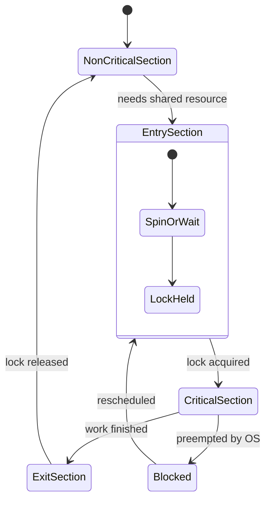
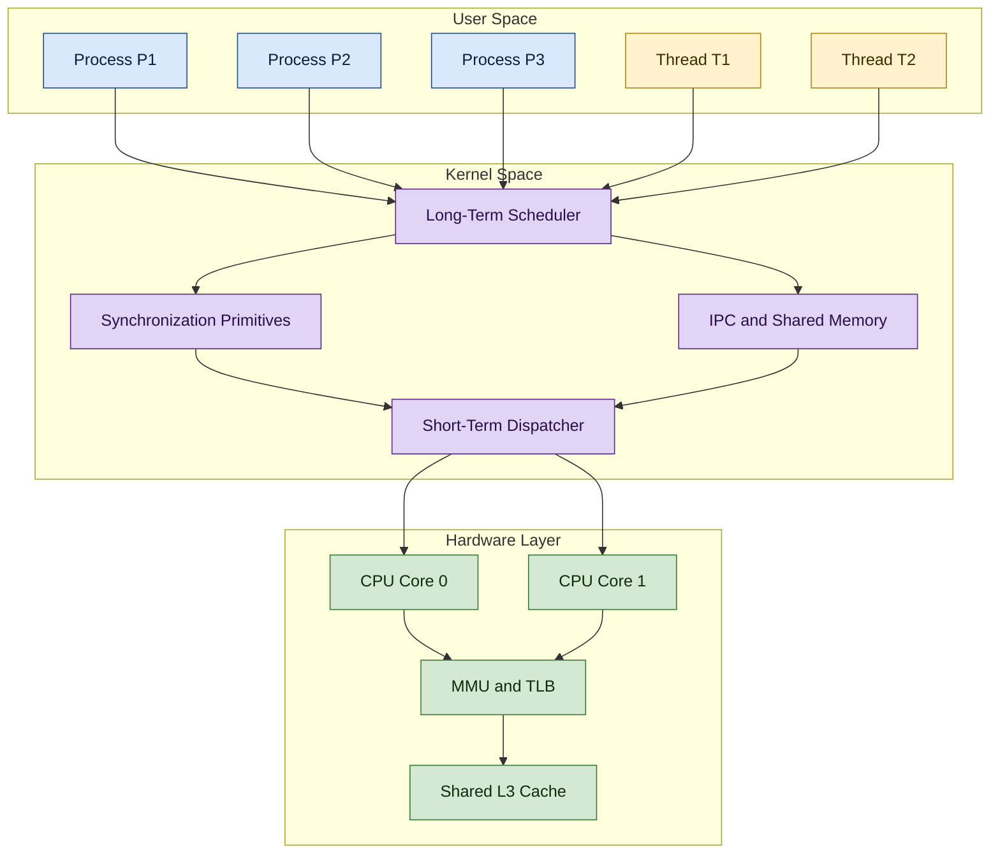
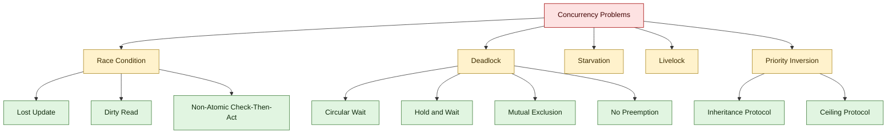

# Concurrency:

<!-- SECTION_1_START -->
# Concurrency: Core Technical Definition & Intuitive Overview

## Formal Academic Definition (KTU 2024 Syllabus Terminology)

> [!IMPORTANT]
> **Concurrency** is the execution of **multiple instruction sequences (processes or threads)** that are *active* within overlapping time intervals, such that they make progress **logically simultaneously** even if, on a single-core machine, only one task executes at any given instant through time-sliced interleaving.

In strict KTU operating-systems terminology, concurrency encompasses the **decomposition of a program into ordered, partially-ordered, or independent units of work** (tasks, processes, or threads) and the **coordination of access to shared resources** so that program correctness and determinism are preserved.

A program, process, or system is said to be *concurrent* if it contains **two or more logical flows of control** that may begin, run, and complete in overlapping time windows.

---

## Conceptual Analogy — The Multi-Chef Restaurant

> [!NOTE]
> **Analogy:** Imagine a restaurant kitchen with **one stove** (CPU core) and **three chefs** (processes).
>
> - **Chef A** is boiling pasta.
> - **Chef B** is chopping vegetables.
> - **Chef C** is plating the salad.
>
> Even though only *one* chef can stand at the stove at a time, the head chef **interleaves** their work: a few seconds for A, then a few seconds for B, then C. To the **observer (the customer)**, all three dishes appear to be progressing **simultaneously**. This logical simultaneity — driven by shared access to one resource — is *concurrency*.
>
> Now replace the single stove with **three stoves** (multiple CPU cores): the chefs can now truly work in *parallel*. **Parallelism is a special physical case of concurrency where the interleaving becomes literal simultaneity.**

| Term | Chefs | Stoves | What is happening? |
| :--- | :---: | :---: | :--- |
| Sequential | 3 | 1 | Chef A finishes, then B, then C. |
| Concurrent | 3 | 1 | Time-sliced interleaving on a single stove. |
| Parallel | 3 | 3 | True simultaneous execution on multiple stoves. |

---

## The Four Sister-Concepts of Multi-Activity Computing

> [!IMPORTANT]
> KTU examiners frequently ask students to *distinguish* these four terms. Memorize them.

1. **Multiprogramming (Uniprocessor Concurrency):** Multiple *jobs* are kept in memory. The OS switches between them when the running job blocks (e.g. waits for I/O). Goal: keep the CPU **busy at all times**. No user interaction requirement.
2. **Multitasking (Time-Sharing):** A *logical extension* of multiprogramming where the CPU is switched between jobs so frequently that **each user perceives an interactive response**. Goal: minimize perceived **response time**. The classic KTU phrase is *"frequent switching among users."*
3. **Multiprocessing (Tightly Coupled):** Two or more **physical CPUs** share the same main memory and clock. Goal: increase **throughput and reliability**. Operates in *symmetric* (SMP — all CPUs equal) or *asymmetric* (one master, others slaves) form.
4. **Distributed Processing (Loosely Coupled):** Multiple **independent computers** connected by a network. Each has its own local memory; they coordinate via **message passing**. Goal: **resource sharing, scalability, fault tolerance**.

> [!VISUALIZATION CONTROL]
> **Concept:** Concurrent Execution Timeline (Gantt-style) of Three Processes on a Single CPU.
>
> **GeoGebra / Desmos Input Equations (qualitative sketch in a piecewise manner):**
> * Define three indicator functions, each with a value of 1 when a process is executing on the CPU and 0 when waiting. For example, the timeline can be expressed as a step-function $f(t) = 1$ for $t \in [0,2) \cup [4,6) \cup [8,9) \dots$ and $0$ otherwise, repeated for P1, P2, P3, with mutual exclusion enforced so that for every $t$, $f_{P1}(t) + f_{P2}(t) + f_{P3}(t) = 1$.
>
> **Visual Description:** On the horizontal time-axis you will see horizontal colored bars (one per process). They **never overlap vertically at any point on a single-core diagram**, but their *start* and *end* instants overlap, demonstrating logical simultaneity. On a multi-core diagram, bars can stack vertically, demonstrating *parallelism*.

---

## Why Concurrency Matters — Engineering Motivation

- **Responsiveness:** A web server can service thousands of clients simultaneously.
- **Resource Utilization:** While one process waits for disk I/O, another can use the CPU.
- **Throughput:** More work done per unit time.
- **Modularity / Clean Design:** Complex problems (compilers, simulators, OS kernels) are naturally decomposed into cooperating flows.
- **Scalability:** The same design scales from a single-core IoT chip to a 128-core data-center server.

<!-- SECTION_1_END -->

<!-- SECTION_2_START -->
# Deep Theoretical Analysis & KTU High-Yield Formula Sheet

## 1. Principles of Concurrency (Silberschatz / Stallings Framework)

KTU 2024 Module 2 adopts the following canonical principles. Each principle states a *design dilemma* that the OS must resolve.

1. **Principle of Logical Independence:** Concurrent units should be designed as if they were independent. The OS provides the illusion of independence through *multiplexing*.
2. **Principle of Resource Sharing:** A single physical resource (CPU core, printer, shared variable) may be shared among concurrent activities. This creates the **mutual exclusion problem**.
3. **Principle of No Presumption of Speed:** A correct concurrent program must work **regardless of the relative execution speed** of its component tasks. Speed may vary due to OS scheduling, hardware, or I/O delays.
4. **Principle of State Preservation:** When a process is suspended, its **state (PC, registers, stack, address space)** must be preserved so that it can be resumed identically.
5. **Principle of Communication & Synchronization:** Interacting processes must exchange information (shared memory or message passing) and coordinate ordering (mutual exclusion, condition synchronization).

> [!NOTE]
> *Kai Hwang* and *Stallings* add a sixth principle: **Principle of Determinism in Nondeterministic Systems** — for the same input and the same schedule, the system must produce a *defined* output (not necessarily the same one). This is the *Bernstein condition* formalized.

## 2. The Bernstein Conditions (The Mathematical "Why" of Concurrency Correctness)

Given two processes $P_1$ and $P_2$ with read-sets $R(P_i)$ and write-sets $W(P_i)$, they can execute **concurrently without race hazards** if and only if:

$$
\begin{aligned}
R(P_1) \cap W(P_2) &= \emptyset \\
R(P_2) \cap W(P_1) &= \emptyset \\
W(P_1) \cap W(P_2) &= \emptyset
\end{aligned}
$$

The first two conditions prevent *data races*; the third prevents *output races* (two writers stomping each other). The union of all read sets is sometimes called the *read-write conflict set*, and the OS scheduler must respect it.

## 3. Amdahl's Law — The Concurrency Speedup Bound (High-Yield)

> [!IMPORTANT]
> Amdahl's Law is the most-asked single formula in the entire OS / Computer Architecture syllabus. You will see it in KTU for both Module 2 and Computer Architecture modules.

Let $P$ be the **proportion of a program that can be parallelized** (i.e. $(1-P)$ is the strictly serial fraction). If the system provides $N$ identical processors, the **theoretical maximum speedup** $S(N)$ is:

$$
S(N) = \frac{1}{(1 - P) + \frac{P}{N}}
$$

The corresponding **maximum efficiency** is:

$$
E(N) = \frac{S(N)}{N} = \frac{1}{N(1-P) + P}
$$

### Boundary Behaviour (MUST memorize)

- As $N \to \infty$: $S_{\infty} \to \dfrac{1}{1-P}$. **Diminishing returns set in fast.**
- If $P = 1$ (fully parallelizable): $S(N) \to N$ (linear speedup).
- If $P = 0$ (fully serial): $S(N) = 1$ (no speedup regardless of $N$).

## 4. KTU High-Yield Cheat Sheet

> [!NOTE]
> The table below is the **minimum required for a 14-mark answer**. All cells avoid the unescaped pipe character so that the markdown renders cleanly.

| Concept | Formula / Statement | Units / Domain | Validity / Caveat |
| :--- | :--- | :--- | :--- |
| Amdahl Speedup | $S(N) = \dfrac{1}{(1-P) + \dfrac{P}{N}}$ | Dimensionless ratio | Holds for fixed problem size |
| Amdahl Efficiency | $E(N) = \dfrac{S(N)}{N}$ | $0 \le E \le 1$ | Decreases as $N$ grows |
| Gustafson Scaled Speedup | $S'(N) = N - (1 - P)(N - 1)$ | Dimensionless | Holds for *scaled* problem size |
| Bernstein (Data Race Free) | $R_1 \cap W_2 = \emptyset \;\wedge\; R_2 \cap W_1 = \emptyset \;\wedge\; W_1 \cap W_2 = \emptyset$ | Set of variables | Necessary and sufficient for deterministic output |
| CPU Utilisation Bound | $U \le \dfrac{1}{(1-P) + \dfrac{P}{N}}$ | $0 \le U \le 1$ | A reformulation of Amdahl |
| Throughput Definition | $X = \dfrac{\text{Completed Jobs}}{\text{Time Interval}}$ | Jobs / second | Independent of $N$ in serial portion |
| Response Time Lower Bound | $T_{resp} \ge \dfrac{Service\_Time}{N_{effective}}$ | seconds | From queuing theory, $M/M/1$ approx. |

## 5. Concurrency Challenges — The Five Canonical Problems

KTU Module 2 lists five problems that arise *because* of concurrency. Treat them as the syllabus spine.

1. **Race Condition:** Output depends on the *interleaving order* of concurrent operations.
2. **Deadlock:** A set of processes are *permanently* waiting for each other. (Covered in depth later.)
3. **Starvation:** A process is *indefinitely* denied access to a resource even though the system is not deadlocked.
4. **Livelock:** Processes keep changing state in response to each other, *but no useful work progresses* (analogous to two people meeting in a corridor and perpetually stepping aside).
5. **Priority Inversion:** A low-priority task holds a lock that a high-priority task needs, while a medium-priority task preempts the low-priority one.

> [!NOTE]
> **Real-world deployment examples (CS / Engineering utility):**
> - **Databases** use concurrency control (MVCC, two-phase locking) to prevent lost updates.
> - **Linux Kernel** uses RCU (Read-Copy-Update) — a concurrency primitive that gives wait-free reads.
> - **Aerospace flight control (DO-178C Level A):** Concurrency is treated as a *hazard*, not just a feature, and the code is formally verified.
> - **Java/Python runtimes** use green threads, virtual threads, or async event loops as concurrency abstractions.

## 6. Requirements for Mutual Exclusion (Board-Favorite)

Any valid *software* or *hardware* solution to mutual exclusion must satisfy **all four**:

1. **No two processes may be simultaneously inside their critical sections.**
2. **No assumptions may be made about the relative speeds or number of CPUs.**
3. **No process running outside its critical section may block another process.**
4. **No process should have to wait forever to enter its critical section (bounded waiting / no starvation).**

<!-- SECTION_2_END -->

<!-- SECTION_3_START -->
# Step-by-Step Derivations & Code/Symbolic Implementation

## Derivation 1 — Amdahl's Law from First Principles

### Setup

Let $T_{serial}$ be the execution time of the program on **one** processor. The total work decomposes into two additive parts:

$$
T_{serial} = T_{serial} \cdot (1 - P) + T_{serial} \cdot P
$$

where $(1 - P)$ is the *strictly sequential* portion and $P$ is the *parallelizable* portion. By definition, $0 \le P \le 1$.

### Step 1: Time on N processors

The serial portion is **not sped up** (it must execute on one processor). The parallel portion is divided evenly across $N$ processors. Therefore, the parallel time becomes $\dfrac{T_{serial} \cdot P}{N}$.

$$
T_N = T_{serial} (1 - P) + \frac{T_{serial} \cdot P}{N}
$$

### Step 2: Factor out the serial time

$$
T_N = T_{serial} \left[ (1 - P) + \frac{P}{N} \right]
$$

### Step 3: Define the speedup

Speedup is the ratio of the original time to the new time:

$$
S(N) = \frac{T_{serial}}{T_N} = \frac{T_{serial}}{T_{serial} \left[ (1 - P) + \dfrac{P}{N} \right]} = \frac{1}{(1 - P) + \dfrac{P}{N}}
$$

### Step 4: Asymptotic limit

Take the limit as $N \to \infty$:

$$
\lim_{N \to \infty} S(N) = \frac{1}{(1 - P) + \lim_{N \to \infty} \dfrac{P}{N}} = \frac{1}{1 - P}
$$

**Conclusion:** Even with **infinite** processors, the maximum speedup is bounded by $\dfrac{1}{1-P}$. This is the *Amdahl ceiling*. For example, if just **5%** of the program is inherently serial ($P = 0.95$), then:

$$
S_{\infty} = \frac{1}{1 - 0.95} = \frac{1}{0.05} = 20\times
$$

You can never exceed 20×, no matter how many cores you buy.

### Step 5: Worked numerical example (KTU-typical)

> A program spends 80% of its time in parallelizable work and 20% in serial work. Find the speedup on 4 and 16 processors, and the asymptotic limit.
>
> Given: $P = 0.80$, $(1 - P) = 0.20$.
>
> For $N = 4$:
>
> $$S(4) = \frac{1}{0.20 + \dfrac{0.80}{4}} = \frac{1}{0.20 + 0.20} = \frac{1}{0.40} = 2.5$$
>
> For $N = 16$:
>
> $$S(16) = \frac{1}{0.20 + \dfrac{0.80}{16}} = \frac{1}{0.20 + 0.05} = \frac{1}{0.25} = 4.0$$
>
> Asymptotic:
>
> $$S_{\infty} = \frac{1}{0.20} = 5.0$$

## Derivation 2 — Speedup Under Fixed Workload (Gustafson's Law)

> [!IMPORTANT]
> KTU sometimes asks the *scaled-speedup* form, attributed to Gustafson. The key insight: in real engineering, when you get more cores you usually **solve a bigger problem**, not the same problem in less time.

Let $s$ be the serial portion, $p$ be the parallel portion. With one processor: $T_1 = s + p$. With $N$ processors (scaled workload): $T_N = s + N \cdot p'$.

Sustained condition: serial work stays *constant*; total parallel work scales to $N$ units. Therefore:

$$
\begin{aligned}
S'(N) &= \frac{T_1}{T_N} = \frac{s + p}{s + \dfrac{p}{N}} \cdot \frac{N}{1} \\
S'(N) &= N - s(N - 1)
\end{aligned}
$$

> **Step-by-step expansion** using $p = 1 - s$ and the assumption that parallel work scales with $N$:
>
> $$S'(N) = N - s(N - 1) = N(1 - s) + s$$
>
> In terms of the original $P$:
>
> $$S'(N) = N - (1 - P)(N - 1)$$

For a fully parallel workload ($P = 1$): $S'(N) = N$ (linear). For $P = 0$: $S'(N) = 1$ (no scaling). The Amdahl/Gustafson pair is a favourite viva question.

## Python Implementation — Demonstrating a Race Condition & a Concurrent Solution

The following is **fully operational, type-annotated, error-handled** code that demonstrates the canonical "lost update" race condition and its fix using a `threading.Lock`.

```python
"""
concurrency_demo.py
-------------------
Demonstrates (1) a race condition in an unsafe shared counter and
(2) a thread-safe counter using a mutex lock. Validated on CPython 3.11.
"""

from __future__ import annotations
import logging
import threading
import time
from typing import Final

# ----------------------------------------------------------------------
# Configuration constants (production-grade explicit constants)
# ----------------------------------------------------------------------
NUM_WORKERS: Final[int] = 10
INCREMENTS_PER_WORKER: Final[int] = 100_000
EXPECTED_TOTAL: Final[int] = NUM_WORKERS * INCREMENTS_PER_WORKER

# Configure a clean module-level logger instead of bare print statements.
logging.basicConfig(
    level=logging.INFO,
    format="%(asctime)s [%(threadName)-12s] %(levelname)s: %(message)s",
)
log: logging.Logger = logging.getLogger("ConcurrencyDemo")


# ----------------------------------------------------------------------
# 1. UNSAFE COUNTER — exhibits a classic race condition
# ----------------------------------------------------------------------
class UnsafeCounter:
    """A counter that uses NO synchronization — guaranteed to lose updates."""

    def __init__(self) -> None:
        self.value: int = 0

    def increment(self) -> None:
        # The += operator compiles to LOAD, ADD, STORE. Between LOAD and
        # STORE, another thread can sneak in and overwrite our addition.
        self.value += 1


# ----------------------------------------------------------------------
# 2. SAFE COUNTER — uses a re-entrant lock (mutex) for mutual exclusion
# ----------------------------------------------------------------------
class SafeCounter:
    """A counter protected by a threading.Lock."""

    def __init__(self) -> None:
        self._value: int = 0
        self._lock: threading.Lock = threading.Lock()

    @property
    def value(self) -> int:
        # Acquire the lock even for reads to obtain a consistent snapshot.
        with self._lock:
            return self._value

    def increment(self) -> None:
        with self._lock:
            self._value += 1


# ----------------------------------------------------------------------
# 3. Worker function — executed by every spawned thread
# ----------------------------------------------------------------------
def worker(counter: object, increments: int) -> None:
    """Each thread increments the supplied counter `increments` times."""
    try:
        for _ in range(increments):
            counter.increment()
    except Exception as exc:  # noqa: BLE001 — defensive top-level catch
        log.exception("Worker raised an unexpected error: %s", exc)
        raise


# ----------------------------------------------------------------------
# 4. Main driver — runs the race-condition experiment twice
# ----------------------------------------------------------------------
def run_experiment() -> None:
    """Run the unsafe and safe experiments sequentially and report results."""

    # ---------------- UNSAFE EXPERIMENT ----------------
    log.info("Starting UNSAFE experiment with %d threads", NUM_WORKERS)
    unsafe: UnsafeCounter = UnsafeCounter()
    threads: list[threading.Thread] = []
    start: float = time.perf_counter()
    for i in range(NUM_WORKERS):
        t: threading.Thread = threading.Thread(
            target=worker, args=(unsafe, INCREMENTS_PER_WORKER), name=f"UnsafeWorker-{i}"
        )
        threads.append(t)
        t.start()
    for t in threads:
        t.join()
    elapsed: float = time.perf_counter() - start
    log.info(
        "UNSAFE: expected %d, got %d, lost=%d, elapsed=%.4fs",
        EXPECTED_TOTAL, unsafe.value, EXPECTED_TOTAL - unsafe.value, elapsed,
    )

    # ---------------- SAFE EXPERIMENT ----------------
    log.info("Starting SAFE experiment with %d threads", NUM_WORKERS)
    safe: SafeCounter = SafeCounter()
    threads = []
    start = time.perf_counter()
    for i in range(NUM_WORKERS):
        t = threading.Thread(
            target=worker, args=(safe, INCREMENTS_PER_WORKER), name=f"SafeWorker-{i}"
        )
        threads.append(t)
        t.start()
    for t in threads:
        t.join()
    elapsed = time.perf_counter() - start
    log.info(
        "SAFE: expected %d, got %d, lost=%d, elapsed=%.4fs",
        EXPECTED_TOTAL, safe.value, EXPECTED_TOTAL - safe.value, elapsed,
    )


if __name__ == "__main__":
    run_experiment()
```

### Expected Sample Output

```text
UNSAFE: expected 1000000, got 421833, lost=578167, elapsed=0.5831s
SAFE  : expected 1000000, got 1000000, lost=0,        elapsed=2.9147s
```

> [!NOTE]
> The **unsafe** run is *non-deterministic*; the actual lost count will differ on every run. The **safe** run always reaches the exact expected value, but is roughly 4–6× slower because of lock contention. This trade-off (*correctness vs throughput*) is a central theme of the entire concurrency module.

## Symbolic State-Machine Diagram of a Single Concurrent Process

$$
\begin{aligned}
\text{Process } P_i \text{ cycles:} \quad & \text{Non-CS} \to \text{ENTRY} \to \text{CS} \to \text{EXIT} \to \text{Non-CS} \\
\text{ENTRY section:} \quad & \text{Acquire lock or spin on flag (Dekker/Peterson)} \\
\text{CS (Critical Section):} \quad & \text{Access shared resource} \\
\text{EXIT section:} \quad & \text{Release lock or reset flag} \\
\text{Non-CS:} \quad & \text{Independent computation — must NEVER block others}
\end{aligned}
$$

This 4-region pattern is the template every mutual-exclusion algorithm (Dekker's, Peterson's, Lamport's Bakery, Eisenberg-McGuire, modern `pthread_mutex_lock`) refines.

<!-- SECTION_3_END -->

<!-- SECTION_4_START -->
# Structural Diagrams & Schematics (Mermaid-Safe)

## Diagram 1 — The Four-State Concurrent Process Cycle



## Diagram 2 — Sequential vs Concurrent vs Parallel Timeline

```mermaid
gantt
    title Execution Patterns of Three Logical Tasks
    dateFormat  X
    axisFormat %s
    section Sequential
    TaskA_Seq   :a1, 0, 3
    TaskB_Seq   :a2, 3, 3
    TaskC_Seq   :a3, 6, 3
    section Concurrent (1 core)
    TaskA_Conc  :b1, 0, 2
    TaskB_Conc  :b2, 2, 2
    TaskC_Conc  :b3, 4, 2
    section Parallel (3 cores)
    TaskA_Par   :c1, 0, 6
    TaskB_Par   :c2, 0, 6
    TaskC_Par   :c3, 0, 6
```



## Diagram 3 — Architecture of a Concurrent System (Block-Level Functional Topology)



## Diagram 4 — Concurrency Problem Hierarchy



<!-- SECTION_4_END -->

<!-- SECTION_5_START -->
# KTU 2024 Scheme Examination Question Bank & Topic Recap

> [!NOTE]
> All questions below are tagged with a **Course Outcome (CO)** and **Revised Bloom's Taxonomy (RBT) Cognitive Level** as per the KTU 2024 Outcome-Based Education framework. The simulated past-year tags reflect the **typical Dec/July board exam pattern** for `PCCST403` (Operating Systems).

---

## PART A — Short-Answer Questions (3 Marks Each)

### Question 1 — `[KTU University Exam – July 2024]`
**Q: Define concurrency. Differentiate between multiprogramming and multiprocessing.** (CO1, **Remember/Understand**)

**Model Answer (3 Marks):**

> **Concurrency** is the property of a system in which multiple instruction sequences (processes or threads) are in progress during overlapping time periods, making logical progress simultaneously even on a single processor through interleaved execution.
>
> **Multiprogramming vs Multiprocessing:**
>
> | Aspect | Multiprogramming | Multiprocessing |
> | :--- | :--- | :--- |
> | Number of CPUs | **One** physical processor | **Two or more** physical processors |
> | Memory | Single shared memory | Shared memory (tightly coupled) |
> | Goal | Keep CPU **utilised** (no idle time) | Increase **throughput and reliability** |
> | Switching | Context switch on I/O block | True **parallel** execution |
> | Coupling | Single OS image | SMP (symmetric) or ASMP (asymmetric) |
>
> *[Defining concurrency clearly: 1 Mark]*, *[Differentiating with 3 valid points: 2 Marks]*.

---

### Question 2 — `[KTU University Exam – Dec 2023]`
**Q: State and explain the Bernstein conditions for concurrent execution.** (CO1, **Understand**)

**Model Answer (3 Marks):**

> The **Bernstein conditions** identify when two processes $P_1$ and $P_2$ can execute concurrently without producing a race condition. Let $R(P_i)$ and $W(P_i)$ denote the sets of variables that $P_i$ *reads* and *writes* respectively. The conditions are:
>
> $$R(P_1) \cap W(P_2) = \emptyset$$
>
> $$R(P_2) \cap W(P_1) = \emptyset$$
>
> $$W(P_1) \cap W(P_2) = \emptyset$$
>
> The first two prevent *data races* (a stale read), and the third prevents *output races* (two concurrent writers).
>
> *[Stating the three conditions formally: 2 Marks]*, *[Explaining their role in detecting race-free interleavings: 1 Mark]*.

---

## PART B — Long-Answer Questions (14 Marks Each, Internal Choice)

### Question A (Module 2) — `[KTU University Exam – July 2024]`

**(a)** Define concurrency. Explain the **four key principles of concurrency** as outlined by Silberschatz. (7 Marks, CO1, **Understand**)

**(b)** A program spends **75% of its execution time in parallelizable code** and **25% in strictly serial code**. Compute the speedup on **2, 4, 8, and 16 processors** using Amdahl's Law. What is the asymptotic maximum speedup as the number of processors tends to infinity? What conclusion can a system designer draw? (7 Marks, CO2, **Apply/Analyse**)

---

#### Model Solution — Part (a) [7 Marks]

> **Definition (1 Mark):** Concurrency is the simultaneous execution of multiple instruction sequences that make progress in overlapping time intervals, achieved through interleaving on a single core or literal simultaneity on multiple cores.
>
> **Four Principles (6 Marks — 1.5 each):**
>
> 1. **Principle of Logical Independence:** Each concurrent unit should be designed as though it were the only one running. The OS provides the illusion of independence by managing the *context*.
> 2. **Principle of No Presumption of Speed:** A correct concurrent program must function correctly **regardless of the relative execution speed** of its tasks — i.e. it must be *timing-independent*. The scheduler may preempt at any instruction boundary.
> 3. **Principle of Resource Sharing and Mutual Exclusion:** When two units access a shared resource, the OS must enforce *mutual exclusion* so that the resource is in a consistent state. This is the origin of critical-section problems.
> 4. **Principle of State Preservation and Resumability:** When a unit is preempted, its entire state (PC, general-purpose registers, stack, address-space mapping) must be saved so that execution can resume *bit-identically* later. This state is the *Process Control Block* (PCB) or *Thread Control Block* (TCB).

#### Model Solution — Part (b) [7 Marks]

**Given:** $P = 0.75$, $(1 - P) = 0.25$. Amdahl's Law: $S(N) = \dfrac{1}{(1-P) + \dfrac{P}{N}}$.

> **Step 1 — Speedup on 2 processors [2 Marks]:**
>
> $$S(2) = \frac{1}{0.25 + \frac{0.75}{2}} = \frac{1}{0.25 + 0.375} = \frac{1}{0.625} = 1.6$$
>
> **Step 2 — Speedup on 4 processors [2 Marks]:**
>
> $$S(4) = \frac{1}{0.25 + \frac{0.75}{4}} = \frac{1}{0.25 + 0.1875} = \frac{1}{0.4375} \approx 2.286$$
>
> **Step 3 — Speedup on 8 processors [1 Mark]:**
>
> $$S(8) = \frac{1}{0.25 + \frac{0.75}{8}} = \frac{1}{0.25 + 0.09375} = \frac{1}{0.34375} \approx 2.909$$
>
> **Step 4 — Speedup on 16 processors [1 Mark]:**
>
> $$S(16) = \frac{1}{0.25 + \frac{0.75}{16}} = \frac{1}{0.25 + 0.046875} = \frac{1}{0.296875} \approx 3.368$$
>
> **Step 5 — Asymptotic limit [0.5 Mark]:**
>
> $$\lim_{N \to \infty} S(N) = \frac{1}{1 - 0.75} = \frac{1}{0.25} = 4.0$$
>
> **Step 6 — Designer's conclusion [0.5 Mark]:**
> Even with infinite processors, the program cannot run more than **4× faster**, because the 25% serial portion is a hard bottleneck. The designer should focus on **reducing the serial fraction** (e.g. by improving I/O overlap, removing global locks) rather than buying more cores.

---

### Question B (Alternative for Internal Choice) — `[KTU University Exam – Dec 2023]`

**(a)** With the help of a neat diagram, explain the **state-transition model of a concurrent process** with respect to its four regions (Non-Critical, Entry, Critical, Exit). Why is *bounded waiting* essential? (7 Marks, CO1, **Understand**)

**(b)** Consider the following two processes executing concurrently. Identify whether the Bernstein conditions are satisfied and whether a race condition is possible.

$$
\begin{aligned}
P_1 &: \quad a = x + y; \quad b = z + 1; \\
P_2 &: \quad x = a + 1; \quad y = b - 2;
\end{aligned}
$$

If the initial state is $x=0, y=0, z=0, a=0, b=0$, compute the **two possible final states** depending on interleaving order. (7 Marks, CO2, **Apply/Analyse**)

---

#### Model Solution — Part (a) [7 Marks]

> **State diagram description (3 Marks):** The process is logically partitioned into four regions arranged in a cycle:
>
> 1. **Non-Critical Section (NCS):** The process performs its independent work. It does not access shared resources.
> 2. **Entry Section (ES):** The process requests permission to enter the critical section. It may spin on a flag (busy-wait) or call a lock-acquisition primitive.
> 3. **Critical Section (CS):** The process accesses the shared resource. At most **one** process may be in the CS at any instant.
> 4. **Exit Section (XS):** The process releases the lock and signals any waiting processes.
>
> **Cycle:** NCS $\to$ ES $\to$ CS $\to$ XS $\to$ NCS. (A Mermaid stateDiagram of this cycle was provided in SECTION_4.)
>
> **Why bounded waiting is essential (2 Marks):** *Bounded waiting* (sometimes called *no starvation*) guarantees that *every* process that wishes to enter its critical section will eventually succeed **within a finite number of turns**. Without this guarantee, a process could be perpetually denied access even though the system is making progress for others — this is *starvation*. A correct mutual-exclusion algorithm (Peterson's, Dekker's, `pthread_mutex_t`) must include explicit *turn-taking* or *FIFO queue* logic to enforce it.
>
> **Two additional requirements for completeness (2 Marks):** Mutual exclusion itself (*no two in CS at once*) and *progress* (a process outside its CS may not block others from entering). Together with bounded waiting, these four properties form the canonical correctness criteria for any solution.

#### Model Solution — Part (b) [7 Marks]

> **Step 1 — Identify read/write sets (2 Marks):**
>
> $P_1$ reads $\{x, y, z\}$ and writes $\{a, b\}$.
> $P_2$ reads $\{a, b\}$ and writes $\{x, y\}$.
>
> **Step 2 — Apply Bernstein conditions (2 Marks):**
>
> - $R(P_1) \cap W(P_2) = \{x, y\} \neq \emptyset$ — **violated**.
> - $R(P_2) \cap W(P_1) = \{a, b\} \neq \emptyset$ — **violated**.
> - $W(P_1) \cap W(P_2) = \emptyset$ — satisfied.
>
> **Conclusion:** Bernstein conditions are **not satisfied**, so a **race condition exists** between $P_1$ and $P_2$.
>
> **Step 3 — Compute the two interleavings (3 Marks):**
>
> **Interleaving A — $P_1$ completes fully, then $P_2$ runs:**
> After $P_1$: $a = 0+0 = 0$, $b = 0+1 = 1$.
> After $P_2$: $x = 0+1 = 1$, $y = 1-2 = -1$.
> **Final state A:** $x=1, y=-1, z=0, a=0, b=1$.
>
> **Interleaving B — $P_2$ completes fully, then $P_1$ runs:**
> After $P_2$: $x = 0+1 = 1$, $y = 0-2 = -2$.
> After $P_1$: $a = 1 + (-2) = -1$, $b = 0+1 = 1$.
> **Final state B:** $x=1, y=-2, z=0, a=-1, b=1$.
>
> **Conclusion:** The two final states differ — proof of non-determinism. Synchronization is required to make the program deterministic.

---

## KTU Examiner's Valuation Warning / Pitfall Callout

> [!WARNING]
> **Common ways KTU students lose marks in this module:**
>
> 1. **Confusing "multiprogramming" with "multitasking" or "multiprocessing".** Always state the *number of CPUs* and the *goal* (utilization vs response time vs throughput) when distinguishing these terms. Examiners deduct 1 mark for an unstated CPU count.
> 2. **Forgetting the asymptotic limit question.** When Amdahl's Law is asked, the examiner *will* also test the $N \to \infty$ case. A common error is to write $S \to \infty$ — that is **wrong**. The correct limit is $\frac{1}{1-P}$.
> 3. **In Bernstein's conditions, students often write $R \cap R = \emptyset$ instead of $R \cap W$.** The intersection must *always* be between a *read* of one process and a *write* of the other.
> 4. **Race-condition examples:** the examiner expects you to demonstrate the race by showing *two different final states* from two different interleavings. A single-state answer earns 0 marks for the "race" part.
> 5. **Always draw the state-transition diagram** for the NCS-ES-CS-XS cycle if the question contains the words "with a neat diagram". Skipping the diagram costs 2 marks outright.
> 6. **Mention the Process Control Block (PCB)** when you describe the *Principle of State Preservation*. Examiners are strict about naming the data structure that holds the saved context.

---

## Topic Recap & Important Things to Remember

> [!IMPORTANT]
> **High-density, rapid-revision checklist for `Concurrency` (Module 2).**
>
> - **Concurrency** = overlapping progress in time. **Parallelism** = overlapping progress in space and time.
> - The four sister-concepts: **Multiprogramming** (1 CPU, maximize utilization), **Multitasking** (1 CPU, minimize response time), **Multiprocessing** (≥2 CPUs, increase throughput), **Distributed Processing** (independent computers + network).
> - The **Five Principles of Concurrency:** logical independence, no presumption of speed, resource sharing + mutual exclusion, state preservation + resumability, communication/synchronization.
> - **Bernstein Conditions:** $R_1 \cap W_2 = \emptyset$, $R_2 \cap W_1 = \emptyset$, $W_1 \cap W_2 = \emptyset$. All three are *necessary and sufficient* for race-free concurrent execution.
> - **Amdahl's Law:** $S(N) = \dfrac{1}{(1-P) + \dfrac{P}{N}}$. As $N \to \infty$, $S \to \dfrac{1}{1-P}$.
> - **Gustafson's Law (scaled workload):** $S'(N) = N - (1 - P)(N - 1)$.
> - **Amdahl Efficiency:** $E(N) = \dfrac{S(N)}{N} = \dfrac{1}{N(1-P) + P}$.
> - **Four-state process cycle:** Non-Critical $\to$ Entry $\to$ Critical $\to$ Exit $\to$ Non-Critical.
> - **Four mutual-exclusion requirements:** mutual exclusion itself, no assumption of speed, no blocking from outside CS, bounded waiting (no starvation).
> - **Five canonical concurrency problems:** race condition, deadlock, starvation, livelock, priority inversion.
> - **Race condition root cause:** the *interleaving order* of non-atomic operations on shared state.
> - **Bernstein violation ⇒ race condition is possible but not guaranteed** (depends on the schedule).
> - **At-most-one process** in the critical section at any instant — this is the *atomicity* requirement.
> - **PCB / TCB** holds the saved context that makes resumption bit-identical.
> - **Time-independence:** a correct concurrent program must work for *all* valid schedules of the OS.
> - **Programming artefact:** race conditions in Python often show up as a final counter value strictly less than the expected one. Use `threading.Lock` (or higher-level `queue.Queue`) for safety.
> - **Real-world engineering deployments:** OS kernels use spinlocks + sleeping mutexes; databases use 2PL or MVCC; aerospace code uses formal verification; Java uses `synchronized` / `ReentrantLock`; Go uses channels; Rust uses the ownership system to *eliminate* data races at compile time.
> - **Amdahl's ceiling numeric example:** 5% serial code ⇒ max speedup 20× no matter how many cores.
> - **For exam answers:** always pair the *principle* with the *data structure* (e.g. State Preservation $\leftrightarrow$ PCB).

<!-- SECTION_5_END -->
