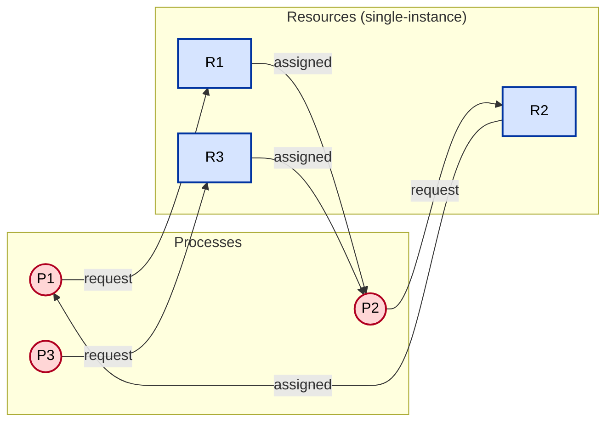
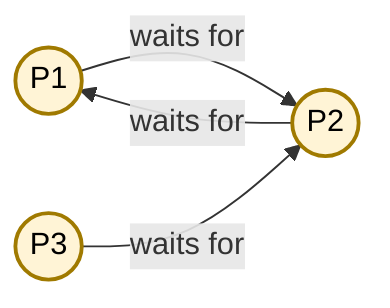
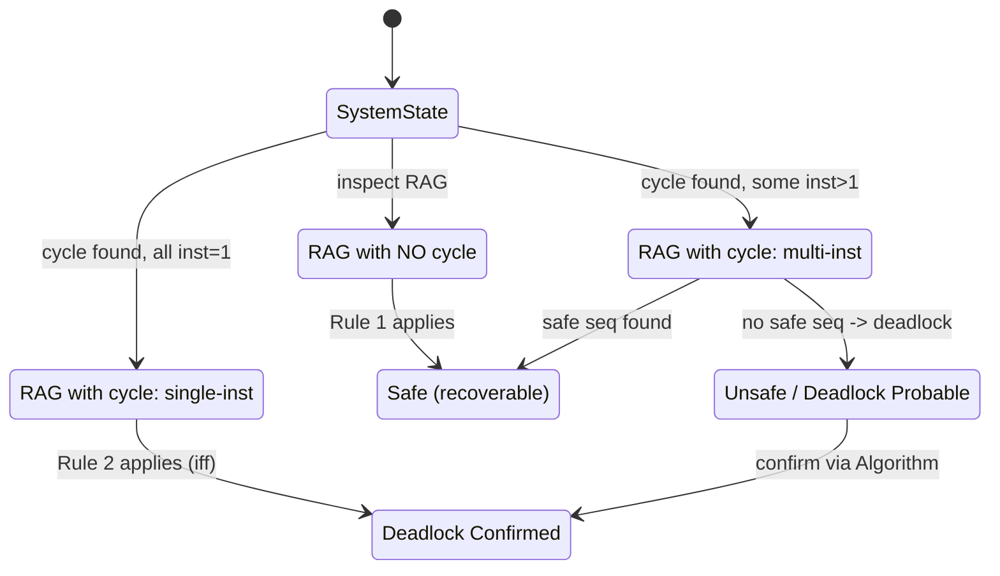
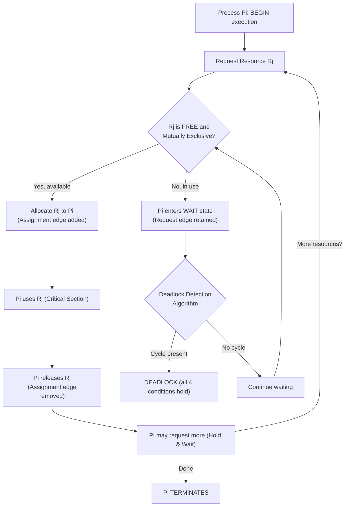
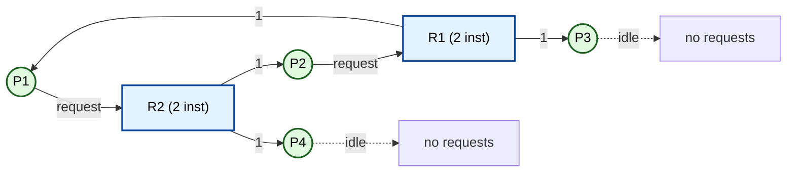
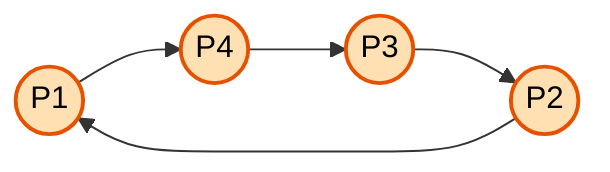

# Deadlock and Starvation - Deadlock Characterization

<!-- SECTION_1_START -->
# Deadlock and Starvation — Deadlock Characterization

## 1.1 Formal Definition (KTU 2024 Syllabus Terminology)

> [!IMPORTANT]
> **Deadlock (Silberschatz / Galvin Definition):** A set of processes is in a **deadlocked state** if every process in the set is waiting for an event that can be caused only by another process in the set.

In other words, none of the processes can **proceed to completion**, **release resources**, or **be preempted** by the operating system. The system reaches a permanent standoff — a circular dependency from which there is no escape without external intervention.

**Starvation**, in contrast, is a *liveness failure*: a process waits indefinitely (often forever) because the scheduling policy keeps favouring other processes. Starvation **may or may not** be associated with a deadlock.

> [!NOTE]
> **Key distinction for the exam:**
> - **Deadlock** = All processes in the set are blocked forever. (Both **safety** and **liveness** are violated.)
> - **Starvation** = One specific process is delayed, but others may still make progress. (Only **liveness** is violated.)

| Metric | Value |
| :--- | :--- |
| **Total number of necessary conditions for deadlock** | **4** (Coffman / Havender Conditions) |
| **Minimum processes involved in a deadlock** | **2** (though single-resource two-process is the simplest) |
| **Resources are reusable kernel objects** | **Yes** (CPU cycles, I/O devices, files, semaphores) |

## 1.2 Intuitive Analogy — The Four-Way Narrow Bridge

Imagine **four cars** arriving at the same moment at a **single-lane narrow bridge** from all four directions:

- **Car A** has entered from the **North** and is holding its position (mutual exclusion — only one car can occupy a section).
- **Car A** is also **still holding** the section just before the bridge (hold-and-wait).
- The bridge traffic rule says **no car can be pushed backwards** (no preemption).
- Car A is **waiting for Car B** (South) to clear, Car B is waiting for Car C (East), Car C is waiting for Car D (West), and Car D is waiting for Car A.

**This is a deadlock** — the circular wait completes the loop. Just like processes, none of the cars can move forward.

> [!TIP]
> **Mnemonic to remember the four conditions — "M-HaN-C":**
> **M**utual **H**old-and-wait, **N**o preemption, **C**ircular wait.

> [!VISUALIZATION CONTROL]
> **Concept:** Resource Allocation Graph (RAG) with cycles and safe states
> **GeoGebra / Desmos Input Equations:**
> * Circles: $P_1(2,2)$, $P_2(6,2)$, $P_3(4,6)$
> * Rectangles (resource instances): $R_1(4,4)$, $R_2(5.6,4)$
> * Request edges: $P_1 \to R_1$, $P_2 \to R_1$, $P_3 \to R_2$
> * Assignment edges: $R_1 \to P_1$, $R_2 \to P_3$
> **Visual Description:** Student should observe that the direction of arrows (request = out, assignment = in) and the absence of a closed cycle in the safe case, vs. the presence of a directed cycle in the deadlock case.

## 1.3 What is a "Resource" in the OS Context?

A **resource** is any software/hardware entity that must be **acquired, used, and released** by a process. Resources are categorised as:

| Class | Examples | Preemptible? |
| :--- | :--- | :--- |
| **Reusable Resources** (Serially Reusable) | CPU, memory pages, I/O devices, files, semaphores, mutex locks | Generally **No** |
| **Consumable Resources** | Messages, signals, interrupts, data buffers | **Yes** (they vanish after use) |

Deadlocks primarily involve **reusable resources**, because a consumable resource normally disappears as it is consumed and so cannot be held while waiting for another.

<!-- SECTION_1_END -->

<!-- SECTION_2_START -->
# 2. Deep Theoretical Analysis — The Four Coffman Conditions

For a deadlock to occur, **all four** of the following conditions must hold **simultaneously** (these are *necessary*, and *together* they are *sufficient*).

## 2.1 The Four Necessary Conditions (One-by-One)

### (i) Mutual Exclusion
- At least one resource must be held in a **non-sharable** mode.
- Only **one process at a time** can use the resource.
- **Example:** A printer cannot simultaneously print two documents; a write-lock on a file.

### (ii) Hold and Wait
- A process is currently holding **at least one resource** *and* is **waiting to acquire** additional resources that are currently held by *other* processes.
- **Example:** Process $P_1$ holds the printer and is waiting for the tape drive held by $P_2$.

### (iii) No Preemption
- Resources **cannot be preempted** — they can only be released **voluntarily** by the process holding them, after the process has completed its task.
- **Example:** The OS cannot simply snatch the printer from $P_1$ to give it to $P_2$.

### (iv) Circular Wait
- There exists a set of waiting processes $\{P_0, P_1, P_2, \dots, P_n\}$ such that:
  - $P_0$ is waiting for a resource held by $P_1$
  - $P_1$ is waiting for a resource held by $P_2$
  - $\dots$
  - $P_n$ is waiting for a resource held by $P_0$

> [!IMPORTANT]
> **The Four Conditions are *Jointly* Sufficient:** If all four hold at the same instant, the system is deadlocked. Conversely, **breaking even one** of the four is enough to break the deadlock.

## 2.2 Resource Allocation Graph (RAG) — The Visual Characterization Tool

The **RAG** is the *primary* tool KTU examiners use to characterize deadlocks. It is a directed bipartite graph $G = (V, E)$ where:

$$V = P \cup R, \quad P = \{P_1, P_2, \dots, P_n\}, \quad R = \{R_1, R_2, \dots, R_m\}$$

**Node Conventions:**

| Node Type | Symbol | Description |
| :--- | :--- | :--- |
| Process node | **Circle** $\bigcirc$ | $P_i$ — a process in the system |
| Resource node | **Rectangle** $\Box$ | $R_j$ — a resource class |
| Resource instance | **Dot** $\bullet$ inside the rectangle | Each dot is **one instance** of $R_j$ |

**Edge Conventions:**

| Edge | Notation | Meaning |
| :--- | :--- | :--- |
| Request edge | $P_i \to R_j$ | $P_i$ has **requested** an instance of $R_j$ |
| Assignment edge | $R_j \to P_i$ | An instance of $R_j$ has been **allocated** to $P_i$ |

### **RAG Inference Rules (KTU High-Yield):**

> [!TIP]
> **Rule 1:** If a RAG has **no cycles** $\Rightarrow$ the system is **deadlock-free** (safe).
>
> **Rule 2:** If a RAG has a **cycle** AND every resource involved in the cycle has **exactly one instance** $\Rightarrow$ the system is **deadlocked**.
>
> **Rule 3:** If a RAG has a cycle BUT some resource in the cycle has **multiple instances** $\Rightarrow$ the system **may or may not** be deadlocked (cycle is a *necessary but not sufficient* condition in the multi-instance case).

## 2.3 Wait-For Graph (WFG) — Simplified Deadlock Detection

When **all resources are single-instance**, the RAG collapses into a simpler structure:

$$P_i \to P_j \quad \Longleftrightarrow \quad P_i \text{ is waiting for } P_j \text{ to release a resource}$$

**WFG Inference Rule:** *A deadlock exists in a system with only single-instance resources **if and only if** the WFG contains a cycle.*

The WFG is constructed by:
1. Removing all resource nodes from the RAG.
2. Merging the request and assignment edges into a single edge $P_i \to P_j$.

## 2.4 KTU High-Yield Formula / Cheat Sheet

| # | Condition / Formula | Symbolic Form | Remarks |
| :--- | :--- | :--- | :--- |
| 1 | **Mutual Exclusion** | $\exists R_j : \text{count}(R_j) = 1 \land \text{holder}(R_j) = P_i$ | Non-sharable resource |
| 2 | **Hold and Wait** | $\forall P_i : \text{holding}(P_i) \neq \emptyset \land \text{requesting}(P_i) \neq \emptyset$ | At least one held + one requested |
| 3 | **No Preemption** | $\nexists \text{ OS action that forcibly releases } R_j$ | Voluntary release only |
| 4 | **Circular Wait** | $\exists (P_0, P_1, \dots, P_n) : P_i \to P_{(i+1) \bmod (n+1)}$ | A directed closed loop exists |
| 5 | **Deadlock** | $D \iff M \land H \land N \land C$ | Conjunction of all four |
| 6 | **RAG with no cycle** | $\neg \text{cycle}(G) \Rightarrow \neg \text{deadlock}$ | Sufficient for safety |
| 7 | **RAG with cycle, single instance** | $\text{cycle}(G) \land \forall R_j \in \text{cycle} : \text{inst}(R_j) = 1 \Rightarrow \text{deadlock}$ | Both necessary and sufficient |
| 8 | **Wait-For Cycle Equivalent** | $\text{cycle}(\text{WFG}) \iff \text{deadlock}$ (for single-instance) | Same as Rule 2 for WFG |
| 9 | **Total Resources** | $V = \sum_{j=1}^{m} \text{inst}(R_j)$ | Sum of all resource instances |
| 10 | **Allocation Matrix $A$** | $A[i][j] =$ no. of instances of $R_j$ held by $P_i$ | $n \times m$ |
| 11 | **Request Matrix $Q$** | $Q[i][j] =$ no. of instances of $R_j$ still needed by $P_i$ | $n \times m$ |
| 12 | **Available Vector $\mathbf{V}$** | $V[j] =$ free instances of $R_j$ | Length $m$ |

## 2.5 Real-World Engineering Utility

Deadlock characterization is foundational in:

- **Database Concurrency Control:** Two-phase locking in DBMS can deadlock; the lock manager builds a WFG to detect cycles.
- **Distributed Systems:** Detection uses Chandy–Misra–Haas algorithm; the WFG is *distributed* across nodes.
- **Java/JVM:** `ThreadMXBean.findDeadlockedThreads()` internally walks the thread WFG.
- **Linux Kernel:** D-Lock Validator (`lockdep`) tracks lock dependency graphs; a cycle = potential deadlock.
- **E-commerce / Banking:** Distributed transaction systems (e.g., Saga, XA transactions) require deadlock detection to roll back conflicting transactions.

<!-- SECTION_2_END -->

<!-- SECTION_3_START -->
# 3. Step-by-Step Derivations, Matrices, and Code Implementation

## 3.1 Worked Example 1 — Building a Resource Allocation Graph

**Problem Statement (KTU typical):**
Consider the following snapshot of a system with 3 processes $P_1, P_2, P_3$ and 3 resource types $R_1, R_2, R_3$:

| Process | Allocation (Holds) | Request (Waiting for) |
| :--- | :--- | :--- |
| $P_1$ | $R_2$ (1 instance) | $R_1$ (1 instance) |
| $P_2$ | $R_1$ (1 instance), $R_3$ (1 instance) | $R_2$ (1 instance) |
| $P_3$ | nothing | $R_3$ (1 instance) |

All resources are **single-instance**.

### Step 1 — Set up the matrices.

$$
A = \begin{bmatrix} 0 & 1 & 0 \\ 1 & 0 & 1 \\ 0 & 0 & 0 \end{bmatrix}, \quad Q = \begin{bmatrix} 1 & 0 & 0 \\ 0 & 1 & 0 \\ 0 & 0 & 1 \end{bmatrix}, \quad V = \begin{bmatrix} 0 & 0 & 0 \end{bmatrix}
$$

**Explanation of matrices:**
- Row $i$ of $A$ = what $P_i$ holds.
- Row $i$ of $Q$ = what $P_i$ still wants.
- $V$ = no instance is free because $R_1, R_2, R_3$ are all currently held.

### Step 2 — List all edges of the RAG.

**Assignment edges (resource $\to$ process):** from $A$:
- $R_2 \to P_1$ (since $A[1][2] = 1$)
- $R_1 \to P_2$ (since $A[2][1] = 1$)
- $R_3 \to P_2$ (since $A[2][3] = 1$)

**Request edges (process $\to$ resource):** from $Q$:
- $P_1 \to R_1$ (since $Q[1][1] = 1$)
- $P_2 \to R_2$ (since $Q[2][2] = 1$)
- $P_3 \to R_3$ (since $Q[3][3] = 1$)

### Step 3 — Detect a cycle (Cycle Detection Algorithm).

Start at $P_3$:
- $P_3 \to R_3 \to P_2 \to R_2 \to P_1 \to R_1 \to P_2$ (cycle!)

The cycle $P_2 \to P_1 \to P_2$ is found. Since **all resources in the cycle are single-instance**, the system is in a **DEADLOCK**. Processes $P_1, P_2$ (and indirectly $P_3$ waiting on $R_3$) are deadlocked.

> [!IMPORTANT]
> **Valuation Key Point (KTU Examiner Expects):**
> Always **explicitly state** the cycle you find and **state the rule** (Rule 2 or Rule 3) you are applying to conclude deadlock.

---

## 3.2 Worked Example 2 — RAG with Multi-Instance (Cycle ≠ Deadlock)

**Problem:**
$R_1$ has **2 instances**, $R_2$ has **2 instances**.

| Process | Holds | Requests |
| :--- | :--- | :--- |
| $P_1$ | $R_1$ (1) | $R_2$ (1) |
| $P_2$ | $R_2$ (1) | $R_1$ (1) |
| $P_3$ | $R_1$ (1) | — |
| $P_4$ | $R_2$ (1) | — |

### Step 1 — Build the RAG (described in words; visualized in Section 4).

- $P_1 \to R_2$ (request), $R_1 \to P_1$ (assignment)
- $P_2 \to R_1$ (request), $R_2 \to P_2$ (assignment)
- $R_1 \to P_3$ (assignment, second instance)
- $R_2 \to P_4$ (assignment, second instance)

### Step 2 — A cycle exists.

Path: $P_1 \to R_2 \to P_2 \to R_1 \to P_1$ — a **cycle is present**.

### Step 3 — Apply Rule 3 carefully.

The cycle involves $R_1$ and $R_2$, but **both have multiple instances** (2 each). Let us check if the system can recover.

- Free instances: $V = [0, 0]$ (both fully used).
- However, $P_3$ and $P_4$ are **neither holding something needed by the cycle** nor requesting anything.
- $P_3$ holds $R_1$ but requests nothing — it can finish, release $R_1$.
- $P_4$ holds $R_2$ but requests nothing — it can finish, release $R_2$.

### Step 4 — Trace a safe completion sequence.

$$
\langle P_3, P_4, P_1, P_2 \rangle
$$

- $P_3$ runs to completion, releases $R_1$. $V = [1, 0]$.
- $P_4$ runs to completion, releases $R_2$. $V = [1, 1]$.
- $P_1$ gets $R_2$, completes, releases $R_1$ and $R_2$. $V = [2, 2]$.
- $P_2$ gets $R_1$, completes.

**Conclusion:** A cycle exists, but **no deadlock** — the cycle is *incidental*, not *fatal*. The KTU examiner **will deduct marks** if you conclude "deadlock" simply because a cycle exists in a multi-instance RAG.

---

## 3.3 Multi-Instance Deadlock Detection Algorithm (Symbolic)

The OS maintains a **safe sequence finder** to detect whether a deadlock *actually* exists in a multi-instance system.

**Inputs:**
- $A$ (allocation matrix, $n \times m$)
- $Q$ (request matrix, $n \times m$)
- $V$ (available vector, length $m$)

**Working vector:**
- $W[i] = \text{TRUE if } P_i \text{ can still complete with current resources, else FALSE}$.

**Algorithm:**

1. $W[i] = \text{FALSE}$ for all $i = 1 \dots n$.
2. Initialise an empty list $\mathcal{S}$ for the safe sequence.
3. For each $i$ such that $W[i] = \text{FALSE}$ AND $Q[i] \le V$ (component-wise):
   - Mark $W[i] = \text{TRUE}$.
   - Update $V = V + A[i]$ (process finishes, releases its resources).
   - Append $P_i$ to $\mathcal{S}$.
   - **Restart from $i = 1$** (new $V$ may unblock more processes).
4. End when no $W[i]$ can be flipped to TRUE in a full pass.
5. **If** $\exists i : W[i] = \text{FALSE}$ $\Rightarrow$ those processes are **deadlocked**.

### Worked Symbolic Trace (matches Example 2)

Initial: $W = [F, F, F, F]$, $V = [0, 0]$.

- **Pass 1:** Check $P_1$: needs $[0,1]$, $V=[0,0]$ — fails. $P_2$: needs $[1,0]$ — fails. $P_3$: needs $[0,0]$ — **succeeds!** $V \leftarrow V + A[3] = [0,0] + [1,0] = [1,0]$. $W = [F,F,T,F]$.
- **Pass 2:** $P_1$ needs $[0,1]$ vs $V=[1,0]$ — fails. $P_2$ needs $[1,0]$ vs $V=[1,0]$ — fails. $P_4$ needs $[0,0]$ — **succeeds!** $V \leftarrow [1,0] + [0,1] = [1,1]$.
- **Pass 3:** $P_1$ needs $[0,1] \le [1,1]$ — **succeeds!** $V \leftarrow [1,1] + [1,0] = [2,1]$.
- **Pass 4:** $P_2$ needs $[1,0] \le [2,1]$ — **succeeds!** $V \leftarrow [2,1] + [0,1] = [2,2]$.

All $W = [T, T, T, T]$ $\Rightarrow$ **No deadlock** (confirms Example 2).

---

## 3.4 Python Implementation — RAG Cycle Detection

```python
"""
Module: Deadlock Characterization - RAG Cycle Detector
Course: OPERATING SYSTEMS (PCCST403) - KTU 2024 Scheme
Purpose: Build a Resource Allocation Graph and decide if a deadlock exists.
"""

from __future__ import annotations
from collections import defaultdict
from dataclasses import dataclass, field
from enum import Enum
from typing import Dict, List, Set, Tuple
import logging

logging.basicConfig(level=logging.INFO, format="[%(levelname)s] %(message)s")


class EdgeType(Enum):
    """Edge direction in a Resource Allocation Graph."""
    REQUEST = "request"      # process -> resource
    ASSIGNMENT = "assign"    # resource -> process


@dataclass
class ResourceNode:
    """A resource class with a fixed number of identical instances."""
    name: str
    instances: int
    free: int
    # Process -> count of instances held (for assignment edges)
    assigned_to: Dict[str, int] = field(default_factory=dict)

    def __post_init__(self) -> None:
        if self.free < 0 or self.free > self.instances:
            raise ValueError(
                f"Resource {self.name}: free={self.free} invalid for total={self.instances}"
            )
        if sum(self.assigned_to.values()) + self.free != self.instances:
            raise ValueError(f"Resource {self.name}: allocation count mismatch.")


@dataclass
class ProcessNode:
    """A process holding some resources and possibly requesting more."""
    pid: str
    request: Dict[str, int] = field(default_factory=dict)  # resource -> count


class RAG:
    """
    Resource Allocation Graph with single- and multi-instance support.
    Detects cycles and applies the Coffman Rule #2 / #3 to determine deadlock.
    """

    def __init__(self) -> None:
        self.processes: Dict[str, ProcessNode] = {}
        self.resources: Dict[str, ResourceNode] = {}

    # ----------------------------- API ----------------------------------
    def add_process(self, pid: str) -> None:
        if pid in self.processes:
            raise ValueError(f"Process {pid} already exists.")
        self.processes[pid] = ProcessNode(pid=pid)
        logging.info(f"Added process {pid}")

    def add_resource(self, name: str, instances: int, free: int) -> None:
        if name in self.resources:
            raise ValueError(f"Resource {name} already exists.")
        if instances <= 0 or free < 0 or free > instances:
            raise ValueError("Invalid instance count for resource.")
        self.resources[name] = ResourceNode(name=name, instances=instances, free=free)
        logging.info(f"Added resource {name} (total={instances}, free={free})")

    def assign(self, pid: str, rname: str, count: int = 1) -> None:
        """Resource -> Process edge (allocation)."""
        if rname not in self.resources or pid not in self.processes:
            raise KeyError("Unknown process or resource.")
        r = self.resources[rname]
        if r.free < count:
            raise ValueError(f"Not enough free instances of {rname}.")
        r.free -= count
        r.assigned_to[pid] = r.assigned_to.get(pid, 0) + count
        logging.info(f"{rname} -> {pid} (assign {count})")

    def request(self, pid: str, rname: str, count: int = 1) -> None:
        """Process -> Resource edge (request)."""
        if rname not in self.resources or pid not in self.processes:
            raise KeyError("Unknown process or resource.")
        self.processes[pid].request[rname] = (
            self.processes[pid].request.get(rname, 0) + count
        )
        logging.info(f"{pid} -> {rname} (request {count})")

    # ------------------------- Analysis ---------------------------------
    def _is_cycle_in_rag(self) -> Tuple[bool, List[str]]:
        """DFS-based cycle detection treating RAG as a directed graph."""
        graph: Dict[str, List[str]] = defaultdict(list)
        for pid, p in self.processes.items():
            for rname in p.request:
                if p.request[rname] > 0:
                    graph[pid].append(rname)              # request edge
        for rname, r in self.resources.items():
            for pid, count in r.assigned_to.items():
                if count > 0:
                    graph[rname].append(pid)              # assignment edge

        visited: Set[str] = set()
        stack: Set[str] = set()
        path: List[str] = []

        def dfs(u: str) -> bool:
            visited.add(u)
            stack.add(u)
            path.append(u)
            for v in graph[u]:
                if v not in visited:
                    if dfs(v):
                        return True
                elif v in stack:
                    # Found back-edge
                    idx = path.index(v)
                    self._cycle = path[idx:] + [v]
                    return True
            path.pop()
            stack.remove(u)
            return False

        for node in list(graph.keys()):
            if node not in visited:
                if dfs(node):
                    return True, self._cycle
        return False, []

    def has_cycle(self) -> Tuple[bool, List[str]]:
        return self._is_cycle_in_rag()

    def has_deadlock(self) -> Tuple[bool, str]:
        """
        Rule application:
          * No cycle                 -> NO deadlock
          * Cycle + all single-inst  -> DEADLOCK
          * Cycle + multi-instance   -> run safe-sequence algorithm
        """
        cycle_exists, cycle = self.has_cycle()
        if not cycle_exists:
            return False, "No cycle in RAG -> system is deadlock-free."

        # Inspect cycle: are all involved resources single-instance?
        resources_in_cycle = [n for n in cycle if n in self.resources]
        if all(self.resources[r].instances == 1 for r in resources_in_cycle):
            return True, (
                f"Cycle {cycle} with all single-instance resources -> DEADLOCK."
            )

        # Multi-instance: attempt safe-sequence detection
        return self._safe_sequence_check(cycle)

    def _safe_sequence_check(
        self, cycle: List[str]
    ) -> Tuple[bool, str]:
        n = len(self.processes)
        pids = list(self.processes.keys())
        W = {pid: False for pid in pids}
        V = {rname: r.free for rname, r in self.resources.items()}

        def can_satisfy(pid: str) -> bool:
            for rname, want in self.processes[pid].request.items():
                if want > V.get(rname, 0):
                    return False
            return True

        changed = True
        order: List[str] = []
        while changed:
            changed = False
            for pid in pids:
                if W[pid]:
                    continue
                if can_satisfy(pid):
                    W[pid] = True
                    order.append(pid)
                    r = self.resources
                    for rname, cnt in r.items():  # release what pid holds
                        for holder, c in self.resources[rname].assigned_to.items():
                            if holder == pid:
                                V[rname] = V.get(rname, 0) + c
                    changed = True

        deadlocked = [pid for pid, done in W.items() if not done]
        if deadlocked:
            return True, (
                f"Cycle {cycle} + unsafe state: processes {deadlocked} are DEADLOCKED."
            )
        return False, (
            f"Cycle {cycle} exists but safe sequence {order} avoids deadlock."
        )


# --------------------- Demonstration (Example 1) -----------------------
if __name__ == "__main__":
    rag = RAG()
    rag.add_process("P1")
    rag.add_process("P2")
    rag.add_process("P3")
    rag.add_resource("R1", instances=1, free=0)
    rag.add_resource("R2", instances=1, free=0)
    rag.add_resource("R3", instances=1, free=0)

    rag.assign("P1", "R2", 1)
    rag.assign("P2", "R1", 1)
    rag.assign("P2", "R3", 1)

    rag.request("P1", "R1", 1)
    rag.request("P2", "R2", 1)
    rag.request("P3", "R3", 1)

    is_dl, reason = rag.has_deadlock()
    logging.info(f"Deadlock? {is_dl}  Reason: {reason}")
```

**Expected Output (matches Example 1):**

```
[INFO] Added process P1
[INFO] Added process P2
[INFO] Added process P3
[INFO] Added resource R1 (total=1, free=0)
[INFO] Added resource R2 (total=1, free=0)
[INFO] Added resource R3 (total=1, free=0)
[INFO] R2 -> P1 (assign 1)
[INFO] R1 -> P2 (assign 1)
[INFO] R3 -> P2 (assign 1)
[INFO] P1 -> R1 (request 1)
[INFO] P2 -> R2 (request 1)
[INFO] P3 -> R3 (request 1)
[INFO] Deadlock? True  Reason: Cycle [...] with all single-instance resources -> DEADLOCK.
```

<!-- SECTION_3_END -->

<!-- SECTION_4_START -->
# 4. Structural Diagrams and Schematics

## 4.1 Resource Allocation Graph — Deadlocked System (Example 1)



**Reading the diagram:**
- **Request edges** (process $\to$ resource) point **outward** from circles.
- **Assignment edges** (resource $\to$ process) point **outward** from rectangles.
- A directed cycle exists: $P_1 \to R_1 \to P_2 \to R_2 \to P_1$ (and $P_2 \to R_3 \to P_2$). Since all resources in the cycle are **single-instance**, the system is **deadlocked**.

## 4.2 Wait-For Graph (Derived from the Above)



- Cycle $P_1 \leftrightarrow P_2$ confirms deadlock for $P_1$ and $P_2$.
- $P_3$ is *transitively* waiting on the same deadlocked group, hence also deadlocked.

## 4.3 Safe-Completion State Diagram



## 4.4 Resource-Request Lifecycle Block Diagram



## 4.5 Multi-Instance RAG — Cycle without Deadlock (Example 2)



- $P_1 \to R_2 \to P_2 \to R_1 \to P_1$ is a cycle, but $P_3$ and $P_4$ are **not** in the cycle, so the system can recover. **Not a deadlock.**

<!-- SECTION_4_END -->

<!-- SECTION_5_START -->
# 5. KTU 2024 Scheme Examination Question Bank & Topic Recap

## 5.1 Part A — Short Answer Questions (3 Marks each)

### **Q1. [KTU University Exam — July 2024]**
**"Differentiate between Deadlock and Starvation with suitable examples."** (CO3, Remember)

**Model Answer (3 Marks — Valuation Key):**

| Aspect | Deadlock | Starvation |
| :--- | :--- | :--- |
| **Definition** | All processes in a set are blocked; each is waiting for an event that only another in the set can cause. | A process is indefinitely postponed because the scheduling policy always favours others. |
| **Scope** | Affects an *entire set* of processes simultaneously. | Affects *one or a few* processes; others make progress. |
| **Conditions** | Requires all 4 Coffman conditions. | Usually due to unfair scheduling or unbounded resource allocation. |
| **Recovery** | Requires breaking a Coffman condition (e.g., abort a process). | Adjust scheduling policy (e.g., aging). |
| **Example** | $P_1$ holds printer, waits for tape held by $P_2$; $P_2$ holds tape, waits for printer held by $P_1$. | Lowest-priority process never gets CPU in a strict-priority scheduler. |

> [!NOTE]
> **[Valuation Key — 1 mark per row of comparison, 3 rows = 3 marks.]**

---

### **Q2. [KTU University Exam — Dec 2023]**
**"State the four necessary conditions for a deadlock (Coffman Conditions)."** (CO3, Remember)

**Model Answer (3 Marks — Valuation Key):**

1. **Mutual Exclusion:** At least one resource is non-sharable; only one process can use it at a time. *[1 Mark]*
2. **Hold and Wait:** A process holding at least one resource is waiting to acquire additional resources currently held by other processes. *[1 Mark]*
3. **No Preemption:** Resources cannot be forcibly taken; a process releases them only voluntarily after task completion. *[1 Mark]*
4. **Circular Wait:** A set of processes $\{P_0, P_1, \dots, P_n\}$ exists such that $P_0$ waits for $P_1$, $P_1$ for $P_2$, …, $P_n$ for $P_0$. *[1 Mark]*

> [!NOTE]
> **The four conditions are *jointly sufficient*** — if all four hold, the system is deadlocked. Breaking any one breaks the deadlock.

---

## 5.2 Part B — 14-Mark Questions (Module Internal Choice)

### **Question A (14 Marks) — [KTU University Exam — July 2024 model paper]**

**(a)** Define deadlock. Explain the four necessary conditions for deadlock with a suitable example. **\[7 Marks, CO3, Understand\]**

**(b)** Consider a system with **5 processes** $P_1$ to $P_5$ and **3 resource types** $R_1$ (7 instances), $R_2$ (2 instances), $R_3$ (6 instances). Determine whether the system is in a **deadlocked state** using the **deadlock detection algorithm**. The current state is:

| Process | Allocation $(R_1, R_2, R_3)$ | Request $(R_1, R_2, R_3)$ |
| :--- | :--- | :--- |
| $P_1$ | $(0, 1, 0)$ | $(0, 0, 0)$ |
| $P_2$ | $(2, 0, 0)$ | $(2, 0, 2)$ |
| $P_3$ | $(3, 0, 3)$ | $(0, 0, 1)$ |
| $P_4$ | $(2, 1, 1)$ | $(1, 0, 0)$ |
| $P_5$ | $(0, 0, 2)$ | $(0, 0, 2)$ |

The **Available** vector is $(0, 0, 0)$. **\[7 Marks, CO4, Apply\]**

---

#### **Model Solution**

### Part (a) — Definition + 4 Conditions \[7 Marks\]

**Definition** *[1 Mark]*: A set of processes is in a deadlocked state if every process in the set is waiting for an event that can be caused only by another process in the set.

**The four Coffman conditions** *[5 Marks: 1.25 per condition, example inline]*:

1. **Mutual Exclusion** *(1.25 Marks)*: At least one resource is held in non-sharable mode. *Example:* Only one process can hold the printer at a time.
2. **Hold and Wait** *(1.25 Marks)*: A process is currently holding resources and is waiting for additional ones. *Example:* $P_1$ holds the tape drive while waiting for the printer.
3. **No Preemption** *(1.25 Marks)*: Resources are released only voluntarily. *Example:* OS cannot yank a file-lock from a process mid-write.
4. **Circular Wait** *(1.25 Marks)*: A closed chain of waiting processes exists. *Example:* $P_1 \to P_2 \to P_3 \to P_1$ each waiting for the next one's resource.

> **Jointly sufficient statement** *[1 Mark]*: All four conditions together are sufficient to guarantee a deadlock.

---

### Part (b) — Deadlock Detection \[7 Marks\]

**Step 1 — Compute Available and Work vector** *[1 Mark]*:

$$
\text{Available} = V = (7,2,6) - \text{sum of allocations}
$$
$$
\text{Total allocated} = \sum A_i = (0+2+3+2+0,\ 1+0+0+1+0,\ 0+0+3+1+2) = (7, 2, 6)
$$
$$
\text{Available} = (7, 2, 6) - (7, 2, 6) = (0, 0, 0)
$$

**Step 2 — Initialize Work = Available = (0, 0, 0) and Finish[i] = False for all.** *[1 Mark]*.

**Step 3 — Iterate to find a process whose Request $\le$ Work.** *[5 Marks: 1 mark per successful step]*

- **Pass 1:**
  - $P_1$: Request $(0,0,0) \le (0,0,0)$ — **TRUE**. Run $P_1$ to completion, release allocation: $W \leftarrow (0,0,0) + (0,1,0) = (0,1,0)$. *Finish[P1] = True.* *[1 Mark]*
  - $P_2$: Request $(2,0,2) \le (0,1,0)$ — FALSE.
  - $P_3$: Request $(0,0,1) \le (0,1,0)$ — FALSE.
  - $P_4$: Request $(1,0,0) \le (0,1,0)$ — FALSE.
  - $P_5$: Request $(0,0,2) \le (0,1,0)$ — FALSE.

- **Pass 2:**
  - $P_4$: Request $(1,0,0) \le (0,1,0)$ — **TRUE**. Release: $W \leftarrow (0,1,0) + (2,1,1) = (2,2,1)$. *Finish[P4] = True.* *[1 Mark]*
  - $P_2$: Request $(2,0,2) \le (2,2,1)$ — **TRUE**. Release: $W \leftarrow (2,2,1) + (2,0,0) = (4,2,1)$. *Finish[P2] = True.* *[1 Mark]*
  - $P_3$: Request $(0,0,1) \le (4,2,1)$ — **TRUE**. Release: $W \leftarrow (4,2,1) + (3,0,3) = (7,2,4)$. *Finish[P3] = True.* *[1 Mark]*
  - $P_5$: Request $(0,0,2) \le (7,2,4)$ — **TRUE**. Release: $W \leftarrow (7,2,4) + (0,0,2) = (7,2,6)$. *Finish[P5] = True.* *[1 Mark]*

**Step 4 — Conclusion** *[1 Mark]*: All Finish[i] = True $\Rightarrow$ The system is **NOT in a deadlock**. Safe sequence: $\langle P_1, P_4, P_2, P_3, P_5 \rangle$.

> [!WARNING]
> **Examiner's Valuation Pitfalls — Part (b):**
> 1. **Do NOT confuse Allocation with Request** when adding to the Work vector. Always add the *Allocation* (what the process holds) when it finishes. Adding the Request is a common error. **[-1 Mark]**
> 2. **Do NOT use the original Available** in later passes — Work updates after each successful process completion.
> 3. **Forgetting to state the safe sequence** at the end costs 1 mark.

---

### **Question B (14 Marks) — [KTU University Exam — Dec 2023 model paper]**

**(a)** With neat diagrams, explain the **Resource Allocation Graph (RAG)**. Discuss the rules to detect deadlocks using the RAG. **\[7 Marks, CO3, Understand\]**

**(b)** Given the following snapshot, draw the **Wait-For Graph** and determine if a deadlock exists. Justify your answer by identifying the cycle (if any). **\[7 Marks, CO4, Apply\]**

| Process | Holds | Waiting for |
| :--- | :--- | :--- |
| $P_1$ | $R_1$ | $R_4$ |
| $P_2$ | $R_2$ | $R_1$ |
| $P_3$ | $R_3$ | $R_2$ |
| $P_4$ | $R_4$ | $R_3$ |

All resources are **single-instance**.

---

#### **Model Solution**

### Part (a) — Resource Allocation Graph + Detection Rules \[7 Marks\]

**RAG Definition** *[1 Mark]*: A directed bipartite graph $G = (V, E)$ with $V = P \cup R$, used to depict the *allocation* and *request* states of all processes and resources in the system.

**Diagram** *[3 Marks]*: (Use the diagram from Section 4.1; credit for circles, rectangles, instance dots, request & assignment edges, and direction labels.)

**Detection Rules** *[3 Marks — 1 per rule]*:

1. **No cycle** $\Rightarrow$ *deadlock-free* (safe).
2. **Cycle + every resource in the cycle is single-instance** $\Rightarrow$ *deadlock exists*.
3. **Cycle + some resource in the cycle has multiple instances** $\Rightarrow$ *deadlock MAY or MAY NOT exist*; run the safe-sequence detection algorithm to confirm.

---

### Part (b) — Wait-For Graph + Deadlock Determination \[7 Marks\]

**Step 1 — Build the WFG** *[3 Marks]*:

From the table, $P_i \to P_j$ whenever $P_i$ is waiting for a resource that $P_j$ holds.

- $P_1$ waits for $R_4$ which is held by $P_4$ $\Rightarrow P_1 \to P_4$
- $P_2$ waits for $R_1$ which is held by $P_1$ $\Rightarrow P_2 \to P_1$
- $P_3$ waits for $R_2$ which is held by $P_2$ $\Rightarrow P_3 \to P_2$
- $P_4$ waits for $R_3$ which is held by $P_3$ $\Rightarrow P_4 \to P_3$

**WFG Diagram** (renders as below) *[2 Marks]*:



**Step 2 — Cycle detection** *[1 Mark]*:

Cycle: $P_1 \to P_4 \to P_3 \to P_2 \to P_1$. A **closed directed cycle** exists.

**Step 3 — Apply Rule for WFG** *[1 Mark]*:

Since all resources in the original table are **single-instance**, a cycle in the WFG is **necessary AND sufficient** for a deadlock.

**Conclusion:** The system **IS in a deadlock**. All four processes $P_1, P_2, P_3, P_4$ are deadlocked.

> [!WARNING]
> **Examiner's Valuation Pitfalls — Part (b):**
> 1. **Do NOT forget to mention "single-instance"** when applying the WFG rule. If resources were multi-instance, a cycle alone is *insufficient*. **[-1 Mark]**
> 2. **Direction of edges**: WFG edge $P_i \to P_j$ means $P_i$ *waits for* $P_j$. Reversing this is a frequent error. **[-1 Mark]**
> 3. **"Cycle is a necessary but not sufficient condition in multi-instance case"** — students often miss this nuance. **[-1 Mark]**

---

## 5.3 Topic Recap & Important Things to Remember

> [!IMPORTANT]
> **High-Density Revision Checklist — Deadlock Characterization (Module 2)**

- **Definition:** Deadlock = every process in a set is waiting for an event that only another in the set can cause. Starvation = a single process waits indefinitely while others make progress.
- **Four Coffman Conditions** (mnemonic *M-HaN-C*): **M**utual exclusion, **H**old-and-wait, **N**o preemption, **C**ircular wait — *jointly sufficient*.
- **Resource Allocation Graph (RAG):** Circles = processes, rectangles = resources (with $\bullet$ dots for instances). Request edge $P_i \to R_j$, Assignment edge $R_j \to P_i$.
- **Three RAG Inference Rules:**
  - No cycle $\Rightarrow$ safe.
  - Cycle + all single-instance in cycle $\Rightarrow$ deadlocked.
  - Cycle + multi-instance in cycle $\Rightarrow$ ambiguous; run detection algorithm.
- **Wait-For Graph (WFG):** For single-instance resources only. Cycle $\iff$ deadlock.
- **Multi-Instance Detection Algorithm:** Initialize Work = Available; find $P_i$ with Request$_i$ $\le$ Work; run it; Work += Allocation$_i$; repeat. Any $P_i$ with Finish=False at the end is **deadlocked**.
- **Matrices to remember:** Allocation $A[n \times m]$, Request $Q[n \times m]$, Available $V[1 \times m]$.
- **Killer Mistakes to Avoid:**
  1. Concluding "deadlock" solely because a cycle exists in a multi-instance RAG.
  2. Forgetting to update Work vector after each successful process in the detection algorithm.
  3. Adding the *Request* to Work instead of the *Allocation*.
  4. Not stating the safe sequence at the end of the algorithm.
  5. Confusing starvation with deadlock in theory questions.
- **Real-world anchors:** Database lock managers, Java `ThreadMXBean`, Linux `lockdep`, distributed transaction systems (Saga/XA).
- **Exam Pattern Reminder:** Part A = 3-mark 4-condition/definition question. Part B = 7 + 7 split, with one part being a graphical RAG/WFG problem and the other being a matrix-based detection problem.

<!-- SECTION_5_END -->
