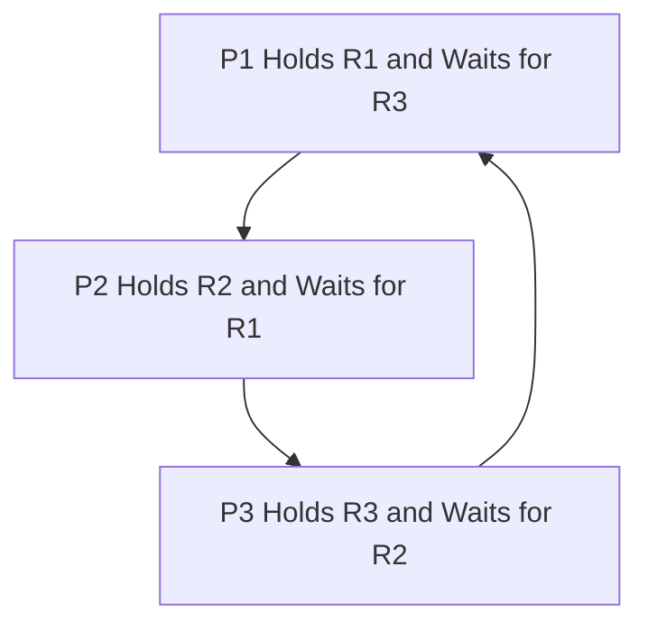
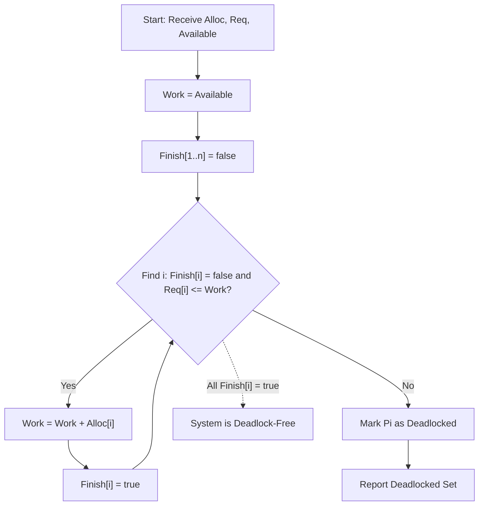
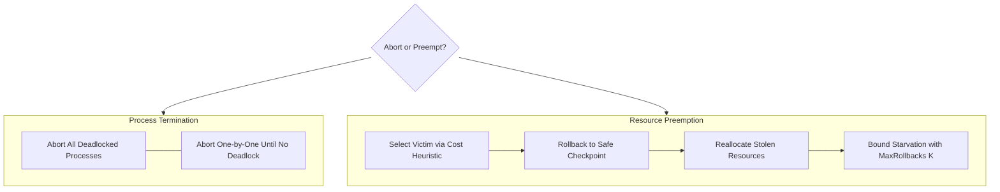
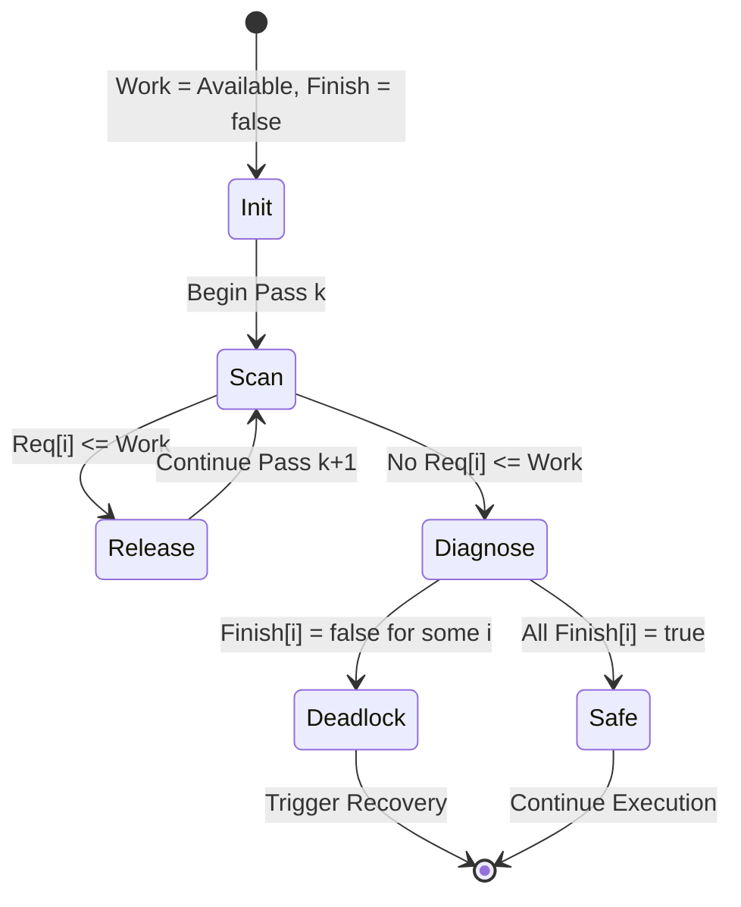

# Deadlock Detection and recovery

<!-- SECTION_1_START -->

# Deadlock Detection and Recovery

## 1.1 Formal Academic Definition

**Deadlock Detection** is the runtime mechanism by which the Operating System (OS) algorithmically inspects the current state of process-resource interactions to determine whether a circular wait has materialized in the system. **Deadlock Recovery** is the subsequent set of actions taken by the OS to break that circular wait, restore mutual progress, and resume normal execution.

> [!IMPORTANT]
> **KTU 2024 Syllabus Anchor (PCCST403 – Module 2):** *Deadlock Detection algorithms for single instance and multiple instance resource types. Recovery from Deadlock: Process Termination and Resource Preemption. Starvation.*

In a formal mathematical sense, given:
- $n$ processes $P_1, P_2, \ldots, P_n$
- $m$ resource types $R_1, R_2, \ldots, R_m$

A deadlock is said to exist in state $S$ when **no sequence** of process completions can occur from $S$. Detection is the algorithmic verification of this condition, while recovery is the policy-driven intervention to leave the state.

## 1.2 Intuitive Analogy: The Roundabout Gridlock

Imagine a single-lane roundabout where four cars arrive simultaneously. Car A blocks B, B blocks C, C blocks D, and D blocks A. No car can reverse (no rollback), no car can be lifted off the road without the tow-truck (recovery) arriving. The traffic system (OS) must:

1. **Detect** the circular dependency (four cars, one lane, each waiting on another).
2. **Recover** by either (a) towing one car away (process termination) or (b) manually driving one car in reverse along an alternative exit (resource preemption / rollback).

This is exactly what an OS does when it detects a deadlock: it identifies the cycle and selects a "victim" to break the wait.

## 1.3 Two Architectural Models of Detection

| Model | System Resource Profile | Detection Tool | Time Complexity |
|:------|:------------------------|:---------------|:----------------|
| Single Instance | Each resource type has exactly 1 instance | Wait-for Graph | $O(n^2)$ |
| Multiple Instance | Each resource type has $\geq 1$ instance | Detection Algorithm (Banker-style) | $O(m \times n^2)$ |

> [!NOTE]
> **Why two models?** In real systems, printers have multiple instances (multiple instance model), but a specific critical file lock is a single shared resource (single instance model). The detection mechanism must scale with this distinction.

## 1.4 Visualization of the Wait State

> [!VISUALIZATION CONTROL]
> **Concept:** Cycle detection in a process wait state (conceptual graph)
> **GeoGebra / Desmos Input Equations (Points on a 2D plane for cycle intuition):**
> * $P_1 = (0, 4)$
> * $P_2 = (4, 0)$
> * $P_3 = (0, -4)$
> * $P_4 = (-4, 0)$
> **Visual Description:** A closed polygon connecting $P_1 \to P_2 \to P_3 \to P_4 \to P_1$ represents a circular wait. The **interior** of the closed shape is the deadlocked region — no process on the boundary can ever move inward (complete) without external recovery.

<!-- SECTION_1_END -->

<!-- SECTION_2_START -->

# 2. Deep Theoretical Analysis and KTU Formula Sheet

## 2.1 The Resource Allocation Graph (RAG) vs. Wait-for Graph (WFG)

The **Resource Allocation Graph (RAG)** is a bipartite directed graph with two node sets: processes $P$ and resources $R$. An edge from $P_i \to R_j$ is a *request* edge; an edge from $R_j \to P_i$ is an *assignment* edge.

The **Wait-for Graph (WFG)** is the *collapsed* version obtained by eliminating resource nodes:

$$P_i \to P_j \iff P_i \text{ is waiting for a resource currently held by } P_j$$

> [!IMPORTANT]
> **Key Theorem (KTU High-Yield):** In a system with **single-instance** resource types, a deadlock exists **if and only if** the Wait-for Graph contains a **cycle**.
> For **multiple-instance** resource types, a cycle in the WFG is a **necessary but not sufficient** condition for deadlock — hence the need for the matrix-based detection algorithm.

## 2.2 Stepwise Logic of the Detection Algorithm (Multiple Instance)

The OS maintains three data structures continuously:

1. **Available Vector** $A = [a_1, a_2, \ldots, a_m]$ — free instances of each resource type.
2. **Allocation Matrix** $\text{Alloc}[n \times m]$ — currently held instances.
3. **Request Matrix** $\text{Req}[n \times m]$ — outstanding requests.

The algorithm proceeds in the following structured way:

- **Step 1 — Initialization:** Set the working vector $W = A$. Initialize the boolean finish array such that $\text{Finish}[i] = \text{false}$ for all $i \in \{1, \ldots, n\}$.
- **Step 2 — Search:** Find an index $i$ such that:
  $$\text{Finish}[i] = \text{false} \quad \text{AND} \quad \text{Req}_i \leq W$$
  where $\leq$ is component-wise comparison.
- **Step 3 — Simulated Release:** If such an $i$ exists, simulate $P_i$'s completion and release all its resources:
  $$W \mathrel{+}= \text{Alloc}_i \quad ; \quad \text{Finish}[i] \mathrel{:=} \text{true}$$
  Then **return to Step 2**.
- **Step 4 — Termination:** If no such $i$ exists in Step 2, terminate.
- **Step 5 — Diagnosis:** Any process with $\text{Finish}[i] = \text{false}$ at termination is **deadlocked**.

> [!NOTE]
> **Why "simulated release"?** The detection algorithm is a *what-if* analyzer. It pretends a process finishes and returns its resources. If the system can drain to an empty state this way, no deadlock exists. If the drain stalls, the residual unsatisfied processes are the deadlocked set.

## 2.3 KTU High-Yield Formula Sheet

| Symbol / Formula | Meaning | Constraint / Unit |
|:-----------------|:--------|:------------------|
| $W \mathrel{+}= \text{Alloc}_i$ | Simulated resource release on $P_i$ completion | Vector addition in $\mathbb{Z}_{\geq 0}^m$ |
| $\text{Req}_i \leq W$ | Component-wise: $\text{Req}_i[j] \leq W[j]$ for all $j$ | Boolean result |
| $\text{Finish}[i] = \text{true}$ | Process $P_i$ is **not** deadlocked | Boolean flag |
| $O(m \times n^2)$ | Time complexity of detection algorithm | $n$ = processes, $m$ = resource types |
| $O(n^2)$ | Time complexity of WFG cycle detection | Single-instance only |
| Cost Function $C = f(\text{priority}, \text{CPU used}, \text{resources held})$ | Victim selection metric in recovery | Heuristic, dimensionless |
| $\text{MaxRollbacks}[P_i] = K$ | Starvation bound: $P_i$ rolled back at most $K$ times | Integer, typically $K=2$ or $K=3$ |

> [!WARNING]
> **Pipe-Safe Notation:** All component-wise comparisons in the algorithm use $\leq$, **not** the absolute-value operator. Never write `Request[i] <= Work` with a bare pipe in a markdown table — use $\text{Req}_i \leq W$ to remain parser-safe.

## 2.4 Real-World Engineering Utility

Deadlock detection and recovery is **production-critical** in:

- **Database Engines (e.g., MySQL InnoDB, PostgreSQL):** Detect row-level lock deadlocks via wait-for graphs every few seconds, then roll back the cheapest transaction.
- **Java Virtual Machine (JVM):** `ThreadMXBean.findDeadlockedThreads()` builds an internal WFG to detect lock-order deadlocks.
- **Linux Kernel:** Uses lockdep validator — a runtime WFG analyzer that prints stack traces on cycle detection.
- **Distributed Systems (Hadoop YARN, Apache ZooKeeper):** Resource manager runs a periodic Banker-style detector across job queues.

In every case, **detection is preferred over prevention** in dynamic systems where the set of running processes and their resource requirements are not known in advance — preventing this would require over-conservative static bounds, sacrificing throughput.

<!-- SECTION_2_END -->

<!-- SECTION_3_START -->

# 3. Step-by-Step Derivations, Worked Examples, and Code Implementation

## 3.1 Worked Example: Single-Instance Wait-for Graph Cycle Detection

**Problem Setup:** Five processes $P_1, P_2, P_3, P_4, P_5$ with the following single-instance holdings and waits:

| Process | Currently Holds | Currently Waits For |
|:--------|:----------------|:--------------------|
| $P_1$ | $R_5$ | $R_1$ (held by $P_2$) |
| $P_2$ | $R_1$ | $R_2$ (held by $P_3$) |
| $P_3$ | $R_2$ | $R_3$ (held by $P_4$) |
| $P_4$ | $R_3$ | $R_4$ (held by $P_5$) |
| $P_5$ | $R_4$ | $R_5$ (held by $P_1$) |

**Step 1: Build the Wait-for Graph edges.**
Edges are $P_1 \to P_2$, $P_2 \to P_3$, $P_3 \to P_4$, $P_4 \to P_5$, $P_5 \to P_1$.

**Step 2: Run a Depth-First Search from $P_1$.**
- Visit $P_1$ → follow edge to $P_2$ → visit $P_2$ → follow edge to $P_3$ → visit $P_3$ → follow edge to $P_4$ → visit $P_4$ → follow edge to $P_5$ → visit $P_5$ → follow edge to $P_1$.
- The DFS tries to revisit $P_1$ which is already on the recursion stack. **Cycle found.**

**Step 3: Conclude.**
$$\text{Cycle: } P_1 \to P_2 \to P_3 \to P_4 \to P_5 \to P_1 \implies \text{Deadlock present}$$

All 5 processes are deadlocked because the cycle is a Hamiltonian cycle of the WFG.

## 3.2 Worked Example: Multiple-Instance Detection Algorithm

**Problem Setup:** $n = 5$ processes, $m = 3$ resource types (A, B, C) with **Available = $\langle 0, 0, 0 \rangle$**.

**Allocation Matrix:**

| Process | A | B | C |
|:--------|:-:|:-:|:-:|
| $P_0$ | 0 | 1 | 0 |
| $P_1$ | 2 | 0 | 0 |
| $P_2$ | 3 | 0 | 3 |
| $P_3$ | 2 | 1 | 1 |
| $P_4$ | 0 | 0 | 2 |

**Request Matrix:**

| Process | A | B | C |
|:--------|:-:|:-:|:-:|
| $P_0$ | 0 | 0 | 0 |
| $P_1$ | 2 | 0 | 2 |
| $P_2$ | 0 | 0 | 1 |
| $P_3$ | 1 | 0 | 0 |
| $P_4$ | 0 | 0 | 2 |

**Step 1 — Initialize:** $W = \langle 0, 0, 0 \rangle$. $\text{Finish} = [F, F, F, F, F]$.

**Step 2 — Iteration 1:** Scan for $i$ with $\text{Finish}[i] = F$ and $\text{Req}_i \leq W$.
- $P_0$: $\text{Req} = \langle 0,0,0 \rangle \leq \langle 0,0,0 \rangle$ ✓
- Simulate release: $W = W + \text{Alloc}_0 = \langle 0,0,0 \rangle + \langle 0,1,0 \rangle = \langle 0,1,0 \rangle$
- $\text{Finish}[0] = T$

**Step 3 — Iteration 2:** Scan remaining.
- $P_2$: $\text{Req} = \langle 0,0,1 \rangle \leq \langle 0,1,0 \rangle$? Component 2: $1 \leq 0$ is **false**. ✗
- $P_3$: $\text{Req} = \langle 1,0,0 \rangle \leq \langle 0,1,0 \rangle$? Component 0: $1 \leq 0$ is **false**. ✗
- $P_1$: $\text{Req} = \langle 2,0,2 \rangle \leq \langle 0,1,0 \rangle$? Component 0: $2 \leq 0$ is **false**. ✗
- $P_4$: $\text{Req} = \langle 0,0,2 \rangle \leq \langle 0,1,0 \rangle$? Component 2: $2 \leq 0$ is **false**. ✗
- No candidate found.

**Step 4 — Terminate.** $\text{Finish} = [T, F, F, F, F]$.

**Step 5 — Diagnose.**
- $P_0$ is safe.
- $P_1, P_2, P_3, P_4$ are **deadlocked**.

> [!NOTE]
> **Insight:** $P_0$ escapes the deadlock because it had no outstanding request. The single "runnable" process drains its resources but cannot unblock the others because the others are already holding critical resources and waiting for more than $P_0$ ever released.

## 3.3 Full Python Implementation of the Detection Algorithm

```python
from typing import List, Tuple


def detect_deadlock(
    allocation: List[List[int]],
    request: List[List[int]],
    available: List[int],
) -> Tuple[List[bool], List[int], List[int]]:
    """
    Banker-style deadlock detection algorithm.

    Parameters
    ----------
    allocation : List[List[int]]
        n x m matrix of currently allocated instances per process.
    request : List[List[int]]
        n x m matrix of outstanding requests per process.
    available : List[int]
        Length-m vector of currently free resource instances.

    Returns
    -------
    finish : List[bool]
        finish[i] = True means process i can complete (NOT deadlocked).
    work : List[int]
        Final working vector after simulated releases.
    deadlocked : List[int]
        Sorted list of indices of processes that are deadlocked.
    """
    n = len(allocation)
    m = len(available)

    # Defensive boundary checks
    if any(len(row) != m for row in allocation):
        raise ValueError("Allocation matrix row width must match available length.")
    if any(len(row) != m for row in request):
        raise ValueError("Request matrix row width must match available length.")
    if n != len(request):
        raise ValueError("Allocation and request must have the same number of rows.")

    work: List[int] = list(available)         # Step 1: Work = Available
    finish: List[bool] = [False] * n           # Step 1: Finish[i] = false

    changed = True
    while changed:                             # Iterative scan until no progress
        changed = False
        for i in range(n):
            if not finish[i]:
                # Component-wise check: Request[i] <= Work
                can_satisfy = all(request[i][j] <= work[j] for j in range(m))
                if can_satisfy:
                    for j in range(m):
                        work[j] += allocation[i][j]   # Simulated release
                    finish[i] = True
                    changed = True

    deadlocked = sorted(i for i, f in enumerate(finish) if not f)
    return finish, work, deadlocked


def demonstrate() -> None:
    """
    Reproduces the worked example from Section 3.2.
    """
    allocation = [
        [0, 1, 0],   # P0
        [2, 0, 0],   # P1
        [3, 0, 3],   # P2
        [2, 1, 1],   # P3
        [0, 0, 2],   # P4
    ]
    request = [
        [0, 0, 0],   # P0
        [2, 0, 2],   # P1
        [0, 0, 1],   # P2
        [1, 0, 0],   # P3
        [0, 0, 2],   # P4
    ]
    available = [0, 0, 0]

    finish, work, deadlocked = detect_deadlock(allocation, request, available)
    print("Finish array :", finish)
    print("Final work   :", work)
    print("Deadlocked   :", deadlocked)


if __name__ == "__main__":
    demonstrate()
```

**Sample Output:**
```
Finish array : [True, False, False, False, False]
Final work   : [0, 1, 0]
Deadlocked   : [1, 2, 3, 4]
```

## 3.4 Recovery Methods — Tabular Comparative Analysis

> [!NOTE]
> KTU Module 2 mandates comparison of **Process Termination** vs. **Resource Preemption** as recovery mechanisms. The table below provides an engineering-grade analysis.

| Recovery Aspect | Process Termination | Resource Preemption |
|:----------------|:--------------------|:--------------------|
| **Mechanism** | Abort one or more deadlocked processes; their resources are released automatically. | Force a victim process to release resources, then roll it back to a safe state. |
| **Sub-strategies** | (a) Abort all deadlocked processes. (b) Abort one at a time until no deadlock. | (a) Select victim. (b) Rollback. (c) Starvation prevention. |
| **Cost Heuristic $C$** | $C = \alpha \cdot \text{priority} + \beta \cdot \text{CPU time used} + \gamma \cdot \text{resources held}$ | Same $C$ function, plus rollback distance penalty. |
| **State Recovery** | No rollback needed — process is killed and restarted by user or OS. | Must **save snapshot** of victim state at a *safe checkpoint* before preemption. |
| **Impact on User** | Computation lost; user must restart job. | Computation partially lost; partial results preserved. |
| **Starvation Risk** | Low — a killed process is rescheduled fresh. | High — victim may be repeatedly selected; must enforce bound $K$. |
| **OS Complexity** | Low — single syscall. | High — requires checkpoint storage, rollback logic, retry queue. |
| **Best Used When** | Batch jobs, low-priority work, simple kernels. | Long-running scientific simulations, databases, transactions. |

> [!IMPORTANT]
> **Starvation Prevention Formula:** To prevent starvation, the OS maintains a counter $R_i$ for each process. If $R_i > K$ (typically $K=2$ or $K=3$), process $P_i$ is **excluded from victim selection** for its next $L$ scheduling rounds. This guarantees eventual progress.

## 3.5 Worked Example: Victim Selection by Cost Function

Suppose three deadlocked processes and the OS uses the heuristic:

$$C = 2 \cdot \text{Priority} + 1 \cdot \text{CPU time used (s)} + 3 \cdot \text{Resources held}$$

| Process | Priority (lower = better) | CPU Used (s) | Resources Held | $C$ | Selected? |
|:--------|:--------------------------:|:------------:|:--------------:|:---:|:---------:|
| $P_A$ | 1 | 12 | 2 | $2(1) + 12 + 3(2) = 20$ | No |
| $P_B$ | 3 | 5 | 1 | $2(3) + 5 + 3(1) = 14$ | **Yes (min)** |
| $P_C$ | 2 | 8 | 4 | $2(2) + 8 + 3(4) = 24$ | No |

The OS terminates $P_B$ first. If the deadlock persists, recompute $C$ for the remaining deadlocked set and repeat.

<!-- SECTION_3_END -->

<!-- SECTION_4_START -->

# 4. Structural Diagrams and Schematics

## 4.1 Mermaid — Wait-for Graph Showing a 3-Process Deadlock Cycle



> **Reading the graph:** Follow the arrows. $P_1$ waits for $P_2$ (which holds $R_1$). $P_2$ waits for $P_3$ (which holds $R_2$). $P_3$ waits for $P_1$ (which holds $R_3$). The cycle is closed — **deadlock confirmed**.

## 4.2 Mermaid — Detection Algorithm Flowchart



## 4.3 Mermaid — Recovery Strategy Topology



> [!NOTE]
> **Why two subgraphs?** Process termination and resource preemption are **decoupled** decision branches in the OS recovery subsystem. The OS chooses one based on the process type: user-mode batch jobs favor termination; long-lived database transactions favor preemption to preserve work.

## 4.4 Mermaid — Banker-Style Detection State Machine



> **Reading the state machine:** The detector alternates between *Scan* (looking for a runnable process) and *Release* (simulating its completion). When *Scan* exhausts options, transition to *Diagnose* where the residual unsatisfied set is the deadlocked cohort.

<!-- SECTION_4_END -->

<!-- SECTION_5_START -->

# 5. KTU 2024 Scheme Examination Question Bank

> [!IMPORTANT]
> **Mark Distribution Reference (KTU 2024 Scheme):** Each full question = 14 marks. Internal choice mandatory. Sub-parts typically split (a) 7 marks + (b) 7 marks. Cognitive levels escalate across sub-parts.

---

## 5.1 Part A — Short Answer Questions (3 Marks Each)

### Q1. `[KTU University Exam – Dec 2023]` [CO2, Remember]

**Distinguish between deadlock detection and deadlock prevention. Under what circumstances is detection preferred over prevention?**

**Model Answer (3 marks):**
- **Deadlock Prevention** *(1 mark)*: A static strategy that ensures at least one of the four Coffman conditions (mutual exclusion, hold-and-wait, no preemption, circular wait) can **never** hold. It imposes restrictions *before* resource allocation.
- **Deadlock Detection** *(1 mark)*: A dynamic strategy that allows all four conditions to hold but **algorithmically checks** at runtime whether a deadlock has formed, then triggers recovery.
- **When detection is preferred** *(1 mark)*: When the set of processes and their resource requirements are not known a priori (e.g., general-purpose OS with arbitrary user jobs). Prevention requires advance declaration of maximum needs, which is impractical for interactive workloads.

---

### Q2. `[KTU University Exam – July 2024]` [CO2, Understand]

**What is a wait-for graph? How is it derived from a resource allocation graph?**

**Model Answer (3 marks):**
- **Wait-for Graph (WFG)** *(1 mark)*: A directed graph whose nodes are *processes only*, where an edge $P_i \to P_j$ exists iff $P_i$ is currently waiting for a resource held by $P_j$.
- **Derivation** *(1 mark)*: The WFG is obtained by *collapsing* the bipartite Resource Allocation Graph. Each pair (request edge $P_i \to R_k$, assignment edge $R_k \to P_j$) is replaced by a single edge $P_i \to P_j$, eliminating the resource node $R_k$.
- **Significance** *(1 mark)*: In single-instance systems, a cycle in the WFG is necessary and sufficient for deadlock.

---

## 5.2 Part B — Full Questions with Internal Choice (14 Marks Each)

### Q3A. `[KTU University Exam – Model Paper 2024]` [CO2, Apply + Analyze]

**(a) [7 marks] Explain the deadlock detection algorithm for a system with multiple instances of each resource type. Clearly state the data structures used and the role of the working vector `Work`.**

**Model Answer — Part (a):**

**Data Structures used** *(2 marks)*:
- **Available** $\langle A_1, A_2, \ldots, A_m \rangle$: length-$m$ vector of free instances.
- **Allocation** $[n \times m]$ matrix: instances of each type held by each process.
- **Request** $[n \times m]$ matrix: outstanding requests of each process.

**Role of the Work vector** *(2 marks)*:
- `Work` is initialized to `Available` and represents the system's *current free resources* during the algorithm's *what-if* simulation.
- Whenever a process $P_i$ is found to have all requests satisfiable (`Request[i] <= Work`), the algorithm pretends $P_i$ runs to completion and `Work` is augmented: `Work = Work + Allocation[i]`. This models the release of all resources held by $P_i$.

**Algorithm Steps** *(3 marks)*:
1. Initialize `Work = Available`; `Finish[i] = false` for all $i$.
2. Find $i$ such that `Finish[i] = false` and `Request[i] <= Work`.
3. Execute `Work = Work + Allocation[i]`; set `Finish[i] = true`; go to Step 2.
4. If no such $i$ exists, terminate.
5. Any $i$ with `Finish[i] = false` at termination is deadlocked.

---

**(b) [7 marks] Consider a system with $n = 5$ processes $P_0 \ldots P_4$ and $m = 3$ resource types $A, B, C$ where Available = $\langle 0, 0, 0 \rangle$. Use the detection algorithm on the following matrices and report which processes, if any, are deadlocked. Also explain your result.**

| Allocation | A | B | C | Request | A | B | C |
|:----------:|:-:|:-:|:-:|:-------:|:-:|:-:|:-:|
| $P_0$ | 0 | 1 | 0 | $P_0$ | 0 | 0 | 0 |
| $P_1$ | 2 | 0 | 0 | $P_1$ | 2 | 0 | 2 |
| $P_2$ | 3 | 0 | 3 | $P_2$ | 0 | 0 | 1 |
| $P_3$ | 2 | 1 | 1 | $P_3$ | 1 | 0 | 0 |
| $P_4$ | 0 | 0 | 2 | $P_4$ | 0 | 0 | 2 |

**Model Answer — Part (b):**

**Step 1 — Initialize:** `Work = (0, 0, 0)`, `Finish = [F, F, F, F, F]`. *[1 mark]*

**Step 2 — Pass 1:** Scan for $i$ with `Finish[i] = F` and `Request[i] <= Work`. *[1 mark]*
- $P_0$: `Request(0,0,0) <= (0,0,0)` ✓
- Release: `Work = (0,0,0) + (0,1,0) = (0,1,0)`. `Finish[0] = T`. *[1 mark]*

**Step 3 — Pass 2:** Scan $P_1, P_2, P_3, P_4$. *[1 mark]*
- $P_2$: `Request(0,0,1) <= (0,1,0)`? Component C: $1 \leq 0$ is **false** ✗
- $P_3$: `Request(1,0,0) <= (0,1,0)`? Component A: $1 \leq 0$ is **false** ✗
- $P_1$: `Request(2,0,2) <= (0,1,0)`? Component A: $2 \leq 0$ is **false** ✗
- $P_4$: `Request(0,0,2) <= (0,1,0)`? Component C: $2 \leq 0$ is **false** ✗

**Step 4 — Terminate:** `Finish = [T, F, F, F, F]`. *[1 mark]*

**Step 5 — Conclusion:** Processes $P_1, P_2, P_3, P_4$ are **deadlocked**; only $P_0$ can complete. *[2 marks]*

**Explanation:** $P_0$ had zero outstanding requests and could complete immediately, releasing its single resource $B$. But $P_0$'s release was insufficient to satisfy the requests of the other four processes, all of which need at least one more instance of $A$ or $C$ than the system has free. The circular wait is unresolved even after $P_0$'s release, leaving the four processes in deadlock.

---

### Q3B. `[KTU University Exam – Model Paper 2024]` [CO2, Understand + Apply]

**(a) [7 marks] Describe the various methods used to recover from a deadlock. Compare process termination with resource preemption.**

**Model Answer — Part (a):**

**Process Termination** *(3 marks)*:
1. **Abort all deadlocked processes:** Brute-force; guarantees deadlock broken but loses all in-progress work. Used rarely, for short-lived batch jobs.
2. **Abort one process at a time:** Re-run the detection algorithm after each abort. Continue until the algorithm reports no deadlock. Minimizes work lost but increases total recovery time.

**Resource Preemption** *(3 marks)*:
1. **Select a victim** using a cost function: $C = \alpha \cdot \text{priority} + \beta \cdot \text{CPU used} + \gamma \cdot \text{resources held}$.
2. **Rollback** the victim to a previously saved safe state (checkpoint).
3. **Starvation prevention:** Restrict the number of times a process can be selected as victim (max rollbacks $K$).

**Comparison** *(1 mark)*: Process termination is simpler and faster to implement but discards work; preemption preserves work but requires checkpointing and risks starvation. Termination suits stateless batch jobs; preemption suits stateful long-running transactions.

---

**(b) [7 marks] A system has 4 processes $P_0, P_1, P_2, P_3$ and 3 resource types $A$ (7 instances), $B$ (2 instances), $C$ (6 instances). At time $T$, Available = $\langle 2, 1, 0 \rangle$. The Allocation and Request matrices are as follows. Run the detection algorithm and report the result.**

| Allocation | A | B | C | Request | A | B | C |
|:----------:|:-:|:-:|:-:|:-------:|:-:|:-:|:-:|
| $P_0$ | 0 | 1 | 0 | $P_0$ | 0 | 0 | 0 |
| $P_1$ | 3 | 0 | 2 | $P_1$ | 1 | 0 | 0 |
| $P_2$ | 3 | 0 | 1 | $P_2$ | 0 | 0 | 1 |
| $P_3$ | 2 | 1 | 1 | $P_3$ | 0 | 0 | 2 |

**Model Answer — Part (b):**

**Step 1 — Initialize:** `Work = (2, 1, 0)`, `Finish = [F, F, F, F]`. *[1 mark]*

**Step 2 — Pass 1:** *[1 mark]*
- $P_0$: `Request(0,0,0) <= (2,1,0)` ✓
- Release: `Work = (2,1,0) + (0,1,0) = (2,2,0)`. `Finish[0] = T`. *[1 mark]*

**Step 3 — Pass 2:** *[1 mark]*
- $P_2$: `Request(0,0,1) <= (2,2,0)`? C: $1 \leq 0$ **false** ✗
- $P_1$: `Request(1,0,0) <= (2,2,0)` ✓
- Release: `Work = (2,2,0) + (3,0,2) = (5,2,2)`. `Finish[1] = T`. *[1 mark]*

**Step 4 — Pass 3:** *[1 mark]*
- $P_2$: `Request(0,0,1) <= (5,2,2)` ✓
- Release: `Work = (5,2,2) + (3,0,1) = (8,2,3)`. `Finish[2] = T`. *[1 mark]*

**Step 5 — Pass 4:** $P_3$: `Request(0,0,2) <= (8,2,3)` ✓. Release: `Work = (8,2,3) + (2,1,1) = (10,3,4)`. `Finish[3] = T`.

**Final Result:** `Finish = [T, T, T, T]`. **No deadlock detected** — the system is in a recoverable state. *[1 mark]*

> [!WARNING]
> **KTU Examiner's Valuation Pitfall (Part B):** Common mistakes students make in detection problems:
> 1. **Forgetting to re-scan from index 0** after each release. The algorithm is iterative; a process that was unsatisfiable in pass 1 may become satisfiable in pass 2. *[Lose 2 marks]*
> 2. **Component-wise comparison errors** — students often check only the first component and assume the rest hold. Always verify *every* component of `Request[i] <= Work`. *[Lose 1 mark]*
> 3. **Conflating "Finish[i] = true" with "deadlocked".** `Finish[i] = true` means $P_i$ is **not** deadlocked. This is the most common sign-flip error. *[Lose 2 marks]*
> 4. **Omitting the initial values of `Work` and `Finish`** in the answer write-up. Always show step 1 explicitly. *[Lose 1 mark]*

---

## 5.3 Topic Recap and Important Things to Remember

> [!IMPORTANT]
> **Rapid Revision Checklist — KTU Module 2: Deadlock Detection and Recovery**

- **Definition:** Detection = identify existence of cycle; Recovery = break the cycle.
- **Single-instance model:** Use **Wait-for Graph (WFG)**. Cycle in WFG $\iff$ Deadlock. Detection via DFS in $O(n^2)$.
- **Multiple-instance model:** Use the **detection algorithm** (Banker-style) with `Available`, `Allocation`, `Request` matrices. Complexity $O(m \times n^2)$.
- **Algorithm core loop:** `Work = Available`; iteratively find $i$ with `Finish[i] = false` and `Request[i] ≤ Work`; if found, do `Work += Allocation[i]`, set `Finish[i] = true`. Otherwise terminate and report all `Finish[i] = false` as deadlocked.
- **Recovery Method 1 — Process Termination:** Abort all deadlocked processes OR abort one at a time with re-detection. Cost heuristic: $C = \alpha \cdot \text{priority} + \beta \cdot \text{CPU used} + \gamma \cdot \text{resources held}$.
- **Recovery Method 2 — Resource Preemption:** Select victim → rollback to safe checkpoint → reallocate → prevent starvation by bounding `MaxRollbacks = K` (typical $K=2$ or $K=3$).
- **Trade-off:** Termination is simple but discards work; preemption preserves work but is complex and risks starvation. Databases favor preemption; batch systems favor termination.
- **Real-world analogues:** InnoDB deadlock detector, JVM `ThreadMXBean`, Linux lockdep, YARN resource manager.
- **Pitfall alerts:** Always re-scan after each release; check **every** component of `Request[i] ≤ Work`; remember `Finish[i] = true` means *not* deadlocked.

<!-- SECTION_5_END -->
