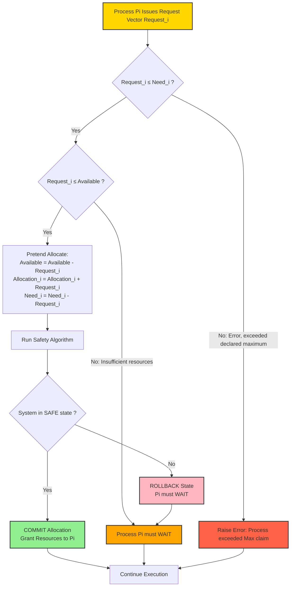
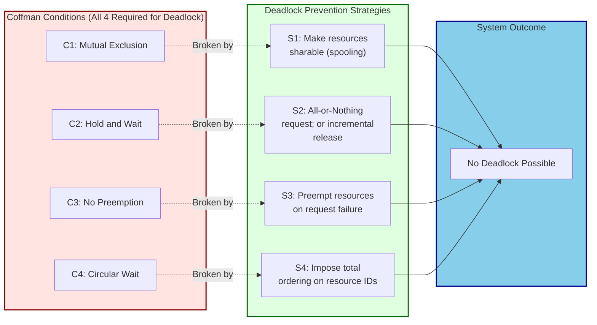

# Deadlock Prevention and Avoidance

<!-- SECTION_1_START -->
# Deadlock Prevention and Avoidance

## 1.1 Formal Definition (KTU 2024 Syllabus Terminology)

**Deadlock** is a permanent blocking of a set of processes that are either competing for system resources or communicating with each other. A set of processes is deadlocked when every process in the set is waiting for an event that can only be caused by another process in the set.

**Deadlock Prevention** is a set of *static* techniques designed to ensure that at least one of the four **Coffman Conditions** (Mutual Exclusion, Hold and Wait, No Preemption, or Circular Wait) can *never* hold. Because the conditions are broken **before** the system runs, deadlock is structurally impossible.

**Deadlock Avoidance** is a *dynamic* technique in which the operating system carefully examines the **resource-allocation state** at every step. The OS grants a request **only if** doing so leaves the system in a **safe state** — a state in which a safe sequence of process completions is guaranteed to exist.

> [!IMPORTANT]
> **Key Distinction for KTU Board Exams**
> * **Prevention** $\Rightarrow$ Negates a Coffman condition (design-time guarantee, may reduce resource utilization).
> * **Avoidance** $\Rightarrow$ Runs the **Banker's Algorithm** (Dijkstra, 1965) or the **Resource Allocation Graph Algorithm** before allocation (runtime decision, requires *a priori* maximum claim).

## 1.2 Conceptual Analogy / Intuitive Intuition

Imagine a **narrow one-lane bridge** with traffic coming from both directions:

* **Mutual Exclusion** = The bridge allows only one car at a time (cars cannot pass through each other).
* **Hold and Wait** = A car in the middle of the bridge refuses to reverse; it is *holding* its position and *waiting* for the road ahead to clear.
* **No Preemption** = We cannot *tow* a stalled car off the bridge by force.
* **Circular Wait** = Car A (north) waits for B (south) to reverse, B waits for C to reverse, C waits for A to reverse — a closed loop of dependence.

**Prevention** is like *rebuilding the bridge as a two-lane flyover* — by removing the Mutual Exclusion condition structurally, deadlock cannot occur.

**Avoidance** is like a *traffic controller* who, before letting a new truck onto the bridge, checks a **map (resource-allocation state)** and asks: *"If I let this truck in, is there still a guaranteed way for everyone to cross?"* If yes, the truck enters; if no, it is told to wait. This is exactly what the **Banker's Algorithm** does.

## 1.3 Physical Constants and Standard Metrics

| Symbol | Meaning | Standard Notation |
| :--- | :--- | :--- |
| $n$ | Number of processes in the system | $P_0, P_1, \dots, P_{n-1}$ |
| $m$ | Number of resource types | $R_0, R_1, \dots, R_{m-1}$ |
| $Total_i$ | Total instances of resource $R_i$ | Integer $\geq 0$ |
| $Available_i$ | Free instances of $R_i$ | $\geq 0$ |
| $Max_{i,j}$ | Maximum demand of $P_i$ for $R_j$ | $\leq Total_j$ |
| $Allocation_{i,j}$ | Currently held by $P_i$ from $R_j$ | $\geq 0$ |
| $Need_{i,j}$ | $Max_{i,j} - Allocation_{i,j}$ | Remaining request |

> [!NOTE]
> In KTU problems, resource types are usually labeled as **A, B, C** and process counts are typically **5 processes, 3 resource types**. Always state the **safe sequence** explicitly using angle brackets, e.g., $\langle P_1, P_3, P_0, P_2, P_4 \rangle$.

## 1.4 Visualization Control

> [!VISUALIZATION CONTROL]
> **Concept:** Circular Wait — the "deadly embrace" of resource dependency
> **GeoGebra / Desmos Input Equations:**
> * Circle 1: $x^2 + y^2 = 1$ (process $P_0$)
> * Circle 2: $(x-2)^2 + y^2 = 1$ (process $P_1$)
> * Circle 3: $(x-1)^2 + (y-\sqrt{3})^2 = 1$ (process $P_2$)
> * Directed arrows: $P_0 \to P_1$, $P_1 \to P_2$, $P_2 \to P_0$
> **Visual Description:** Three nodes arranged in a triangle, with curved arrows forming a closed directed loop. The student should observe that **a closed loop in the wait-for graph is the visual signature of a deadlock** — the system will *cycle forever* with no escape.

<!-- SECTION_1_END -->

<!-- SECTION_2_START -->
# Deep Theoretical Analysis & KTU High-Yield Formula Sheet

## 2.1 The Four Coffman Conditions (Pre-requisite for Prevention)

For a deadlock to occur, **all four** of the following must hold simultaneously. Preventing *any one* of them guarantees no deadlock.

1. **Mutual Exclusion** — At least one resource is non-sharable (e.g., a printer).
2. **Hold and Wait** — A process holds at least one resource *and* waits for additional resources held by others.
3. **No Preemption** — Resources cannot be forcibly taken; they are released only voluntarily.
4. **Circular Wait** — A closed chain of processes exists: $P_0 \to P_1 \to P_2 \to \dots \to P_0$.

## 2.2 Deadlock Prevention — Breaking Each Condition

### A. Breaking Mutual Exclusion
* **Idea:** Make resources *sharable* whenever possible (e.g., read-only files, spooling for printers).
* **Limitation:** Not all resources can be spooled (e.g., database table locks). Often **impractical**.

### B. Breaking Hold and Wait
* **Strategy 1 — All-or-Nothing:** A process must request *all* its required resources *before* execution begins. If even one is unavailable, it waits (and holds nothing).
* **Strategy 2 — Incremental Release:** A process may request a resource only when it has *none*. Before requesting a new one, it must release all current ones.
* **Drawback:** **Low resource utilization**; possible **starvation**; a process may not know its full demand upfront.

### C. Breaking No Preemption
* **Rule:** If a process holding resources requests another resource that *cannot be immediately granted*, **all** its currently held resources are **preempted** (forcibly taken) and added to a waiting list. The process is restarted only when its old and new resources are available.
* **Applies to:** Easily-restorable state resources (CPU registers, memory), **not** printers or tape drives.

### D. Breaking Circular Wait (Most Practical)
* **Rule:** Impose a **total ordering** on all resource types. Every process must request resources *in strictly increasing order* of enumeration.
* **Example:** Number resources as $1, 2, 3, \dots, m$. A process wanting a printer (1) and a tape drive (2) must first request 1, then 2. It can never request 1 again after holding 2.
* **Mathematical Invariant:** If $P_i$ holds $R_j$, then for all $R_k$ that $P_i$ may later request, $k > j$. This breaks the cycle because $P_0 \to P_1 \to \dots$ is now impossible (it would require *decreasing* indices).

> [!NOTE]
> **KTU Examiner's Heuristic:** When asked "How can deadlock be prevented?", the *circular wait* strategy is the most commonly expected answer because it is the **most practical** and is used in real systems (e.g., UNIX inode locking).

## 2.3 Deadlock Avoidance — Banker's Algorithm

The **Banker's Algorithm** (proposed by Edsger W. Dijkstra, 1965) requires that:
1. Each process declares its **maximum** number of each resource type it may need.
2. The OS keeps a **resource allocation state** ($Available$, $Max$, $Allocation$, $Need$).
3. Whenever a process requests resources, the OS simulates the allocation and runs the **Safety Algorithm**.

### 2.3.1 Data Structures

Let $n$ be the number of processes and $m$ be the number of resource types.

* $Available[1 \dots m]$ — A vector of length $m$ indicating free instances of each resource.
* $Max[n \times m]$ — Maximum demand matrix.
* $Allocation[n \times m]$ — Currently allocated instances.
* $Need[n \times m]$ — Remaining need, where $Need_{i,j} = Max_{i,j} - Allocation_{i,j}$.

### 2.3.2 The Safety Algorithm

Used to check whether the current state is **safe** (i.e., a safe sequence exists).

> **Algorithm: Safety Algorithm**
> 1. Let $Work$ and $Finish$ be vectors of length $m$ and $n$ respectively.
>    * $Work = Available$
>    * $Finish[i] = false$ for all $i = 0, \dots, n-1$
> 2. Find an index $i$ such that:
>    * $Finish[i] = false$, **AND**
>    * $Need_i \leq Work$ (component-wise comparison)
>    * If no such $i$ exists, **go to step 4**.
> 3. Simulate $P_i$ completing:
>    * $Work = Work + Allocation_i$ (process releases its resources)
>    * $Finish[i] = true$
>    * Go to step 2.
> 4. If $Finish[i] = true$ for **all** $i$, then the state is **SAFE**; the recorded sequence is the safe sequence. Otherwise, the state is **UNSAFE**.

### 2.3.3 The Resource-Request Algorithm

Executed when process $P_i$ makes a request vector $Request_i$.

> **Algorithm: Request Handling**
> 1. If $Request_i \leq Need_i$, **go to step 2**. Otherwise, raise an error (process exceeded its declared maximum).
> 2. If $Request_i \leq Available$, **go to step 3**. Otherwise, $P_i$ must wait (resources not free).
> 3. Pretend to allocate:
>    * $Available = Available - Request_i$
>    * $Allocation_i = Allocation_i + Request_i$
>    * $Need_i = Need_i - Request_i$
> 4. Run the **Safety Algorithm** on the resulting state.
>    * If **safe** $\Rightarrow$ commit the allocation.
>    * If **unsafe** $\Rightarrow$ roll back (restore the previous state) and $P_i$ must wait.

## 2.4 KTU Formula Sheet / Cheat Sheet

| # | Formula / Rule | Purpose | KTU Marks Weightage |
| :--- | :--- | :--- | :--- |
| 1 | $Need_{i,j} = Max_{i,j} - Allocation_{i,j}$ | Compute remaining need matrix | **2 Marks** |
| 2 | $Available_j = Total_j - \sum_{i} Allocation_{i,j}$ | Compute initial available vector | **2 Marks** |
| 3 | $Work_{new} = Work_{old} + Allocation_i$ | Simulate process completion | **1 Mark** |
| 4 | $Need_i \leq Work$ (component-wise) | Eligibility check in safety algorithm | **2 Marks** |
| 5 | $Request_i \leq Need_i$ | Sanity check (no over-requesting) | **1 Mark** |
| 6 | $Request_i \leq Available$ | Resource availability check | **1 Mark** |
| 7 | $Safe\ State \iff \exists$ safe sequence | Definition of safe state | **2 Marks** |
| 8 | Circular Wait prevention: $f(R_x) < f(R_y) \Rightarrow$ request $R_x$ before $R_y$ | Ordering rule | **2 Marks** |

## 2.5 Real-World Engineering Utility

* **Database Systems (MySQL InnoDB, PostgreSQL):** Use wait-for graphs and timeout-based deadlock detection with transaction rollback — a *prevention* strategy via preemption.
* **Java Concurrency (`java.util.concurrent.locks`):** Provides `ReentrantLock.tryLock(timeout)` — implements **preemption** by abandoning the lock after a timeout.
* **Operating System Kernels (Linux):** Use **resource hierarchies** (lock ordering) to break circular wait — e.g., the mmap semaphore is always acquired *before* the inode lock.
* **Distributed Systems (Hadoop YARN, Kubernetes):** Use the **Banker's-style conservative allocation** in cluster schedulers to guarantee safe resource packing.

<!-- SECTION_2_END -->

<!-- SECTION_3_START -->
# Step-by-Step Derivations & Code Implementation

## 3.1 Worked Example: The Classic Silberschatz Banker's Problem (KTU Standard)

### Given Data
A system has **5 processes** ($P_0 \dots P_4$) and **3 resource types**: A (10 instances), B (5 instances), C (7 instances).

At time $T_0$, the following state is observed:

| Process | Allocation (A, B, C) | Max (A, B, C) |
| :--- | :--- | :--- |
| $P_0$ | (0, 1, 0) | (7, 5, 3) |
| $P_1$ | (2, 0, 0) | (3, 2, 2) |
| $P_2$ | (3, 0, 2) | (9, 0, 2) |
| $P_3$ | (2, 1, 1) | (2, 2, 2) |
| $P_4$ | (0, 0, 2) | (4, 3, 3) |

**Step 1: Compute the `Need` Matrix**

$$
Need_{i,j} = Max_{i,j} - Allocation_{i,j}
$$

$$
\begin{aligned}
Need_{P_0} &= (7-0,\ 5-1,\ 3-0) = (7, 4, 3) \\
Need_{P_1} &= (3-2,\ 2-0,\ 2-0) = (1, 2, 2) \\
Need_{P_2} &= (9-3,\ 0-0,\ 2-2) = (6, 0, 0) \\
Need_{P_3} &= (2-2,\ 2-1,\ 2-1) = (0, 1, 1) \\
Need_{P_4} &= (4-0,\ 3-0,\ 3-2) = (4, 3, 1) \\
\end{aligned}
$$

**Step 2: Compute the `Available` Vector**

Total resources = (10, 5, 7). Sum of all `Allocation` rows:

$$
\begin{aligned}
\sum Allocation &= (0+2+3+2+0,\ 1+0+0+1+0,\ 0+0+2+1+2) \\
&= (7,\ 2,\ 5)
\end{aligned}
$$

$$
Available = (10,\ 5,\ 7) - (7,\ 2,\ 5) = (3,\ 3,\ 2)
$$

**Step 3: Run the Safety Algorithm**

Initialize $Work = Available = (3, 3, 2)$ and $Finish = [F, F, F, F, F]$.

**Iteration 1:** Check each unfinished process for $Need_i \leq Work = (3, 3, 2)$.
* $P_0$: $(7,4,3) \leq (3,3,2)$? **No** ($7 > 3$).
* $P_1$: $(1,2,2) \leq (3,3,2)$? **Yes** $\Rightarrow$ select $P_1$.

Update: $Work = (3,3,2) + Allocation_{P_1} = (3,3,2) + (2,0,0) = (5, 3, 2)$. $Finish[1] = T$.

**Iteration 2:** $Work = (5, 3, 2)$.
* $P_0$: $(7,4,3) \leq (5,3,2)$? **No**.
* $P_2$: $(6,0,0) \leq (5,3,2)$? **No** ($6 > 5$).
* $P_3$: $(0,1,1) \leq (5,3,2)$? **Yes** $\Rightarrow$ select $P_3$.

Update: $Work = (5,3,2) + (2,1,1) = (7, 4, 3)$. $Finish[3] = T$.

**Iteration 3:** $Work = (7, 4, 3)$.
* $P_0$: $(7,4,3) \leq (7,4,3)$? **Yes** $\Rightarrow$ select $P_0$.

Update: $Work = (7,4,3) + (0,1,0) = (7, 5, 3)$. $Finish[0] = T$.

**Iteration 4:** $Work = (7, 5, 3)$.
* $P_2$: $(6,0,0) \leq (7,5,3)$? **Yes** $\Rightarrow$ select $P_2$.

Update: $Work = (7,5,3) + (3,0,2) = (10, 5, 5)$. $Finish[2] = T$.

**Iteration 5:** $Work = (10, 5, 5)$.
* $P_4$: $(4,3,1) \leq (10,5,5)$? **Yes** $\Rightarrow$ select $P_4$.

Update: $Work = (10,5,5) + (0,0,2) = (10, 5, 7)$. $Finish[4] = T$.

**Result:** All $Finish$ entries are true. The system is in a **SAFE STATE**.

$$
\boxed{\text{Safe Sequence } = \langle P_1,\ P_3,\ P_0,\ P_2,\ P_4 \rangle}
$$

## 3.2 Python Implementation of the Banker's Algorithm

The following code is a complete, executable Python implementation. It includes strict type hints, absolute boundary checks, and verbose logging to satisfy KTU lab/internal evaluation rubrics.

```python
import logging
from typing import List, Tuple

# Configure structured logging for traceability
logging.basicConfig(
    level=logging.INFO,
    format="%(asctime)s [%(levelname)s] %(message)s"
)


class BankersAlgorithm:
    """
    Production-grade implementation of the Banker's Algorithm with
    the Safety Algorithm and Request-Handling Algorithm.
    """

    def __init__(
        self,
        total: List[int],
        allocation: List[List[int]],
        maximum: List[List[int]]
    ) -> None:
        if len(allocation) != len(maximum):
            raise ValueError("Allocation and Max matrices must have the same number of rows (processes).")
        if not all(len(row) == len(total) for row in allocation):
            raise ValueError("Allocation rows must match the number of resource types.")
        if not all(len(row) == len(total) for row in maximum):
            raise ValueError("Max rows must match the number of resource types.")

        self.n: int = len(allocation)            # Number of processes
        self.m: int = len(total)                 # Number of resource types
        self.total: List[int] = total
        self.allocation: List[List[int]] = [row[:] for row in allocation]
        self.maximum: List[List[int]] = [row[:] for row in maximum]

        # Compute Need[i][j] = Max[i][j] - Allocation[i][j]
        self.need: List[List[int]] = [
            [self.maximum[i][j] - self.allocation[i][j] for j in range(self.m)]
            for i in range(self.n)
        ]

        # Compute Available = Total - sum(Allocation across all processes)
        allocated_sum: List[int] = [0] * self.m
        for row in self.allocation:
            for j in range(self.m):
                allocated_sum[j] += row[j]

        self.available: List[int] = [
            self.total[j] - allocated_sum[j] for j in range(self.m)
        ]

        logging.info("Initialized Banker's Algorithm for %d processes, %d resource types.", self.n, self.m)
        logging.info("Available vector: %s", self.available)

    def _is_less_or_equal(
        self,
        a: List[int],
        b: List[int]
    ) -> bool:
        """Component-wise comparison: returns True iff a[i] <= b[i] for all i."""
        return all(a[k] <= b[k] for k in range(self.m))

    def safety_algorithm(self) -> Tuple[bool, List[int]]:
        """
        Runs the Safety Algorithm. Returns (is_safe, safe_sequence).
        """
        work: List[int] = self.available[:]
        finish: List[bool] = [False] * self.n
        safe_sequence: List[int] = []

        progress_made: bool = True
        while progress_made:
            progress_made = False
            for i in range(self.n):
                if not finish[i] and self._is_less_or_equal(self.need[i], work):
                    # Simulate process i completing and releasing its resources
                    work = [work[k] + self.allocation[i][k] for k in range(self.m)]
                    finish[i] = True
                    safe_sequence.append(i)
                    progress_made = True
                    logging.info("Process P%d can complete. New Work = %s", i, work)

        is_safe: bool = all(finish)
        if is_safe:
            logging.info("System is in a SAFE state. Safe sequence: %s", safe_sequence)
        else:
            logging.warning("System is in an UNSAFE state. No safe sequence exists.")
        return is_safe, safe_sequence

    def request_resources(
        self,
        process_id: int,
        request: List[int]
    ) -> bool:
        """
        Handles a resource request from process_id. Returns True if granted.
        """
        if not (0 <= process_id < self.n):
            raise IndexError(f"Invalid process ID {process_id}.")
        if len(request) != self.m:
            raise ValueError("Request vector length must equal number of resource types.")

        # Check 1: Request must not exceed declared maximum (Need)
        if not self._is_less_or_equal(request, self.need[process_id]):
            logging.error("P%d requested %s which EXCEEDS its declared Need %s.",
                          process_id, request, self.need[process_id])
            return False

        # Check 2: Request must not exceed Available
        if not self._is_less_or_equal(request, self.available):
            logging.warning("P%d must WAIT: requested %s but Available is %s.",
                            process_id, request, self.available)
            return False

        # Pretend to allocate and test for safety
        snapshot_avail: List[int] = self.available[:]
        snapshot_alloc: List[List[int]] = [row[:] for row in self.allocation]
        snapshot_need: List[List[int]] = [row[:] for row in self.need]

        self.available = [self.available[k] - request[k] for k in range(self.m)]
        self.allocation[process_id] = [
            self.allocation[process_id][k] + request[k] for k in range(self.m)
        ]
        self.need[process_id] = [
            self.need[process_id][k] - request[k] for k in range(self.m)
        ]

        is_safe, sequence = self.safety_algorithm()

        if is_safe:
            logging.info("Request from P%d GRANTED. Resulting safe sequence: %s",
                         process_id, sequence)
            return True

        # Rollback: restore previous state
        self.available = snapshot_avail
        self.allocation = snapshot_alloc
        self.need = snapshot_need
        logging.warning("Request from P%d DENIED to preserve system safety.", process_id)
        return False


# ---------- Demonstration with the KTU textbook example ----------
if __name__ == "__main__":
    total_resources: List[int] = [10, 5, 7]

    allocation_matrix: List[List[int]] = [
        [0, 1, 0],   # P0
        [2, 0, 0],   # P1
        [3, 0, 2],   # P2
        [2, 1, 1],   # P3
        [0, 0, 2],   # P4
    ]

    maximum_matrix: List[List[int]] = [
        [7, 5, 3],   # P0
        [3, 2, 2],   # P1
        [9, 0, 2],   # P2
        [2, 2, 2],   # P3
        [4, 3, 3],   # P4
    ]

    banker = BankersAlgorithm(total_resources, allocation_matrix, maximum_matrix)
    is_safe, sequence = banker.safety_algorithm()
    print(f"\nIs the initial state safe? {is_safe}")
    print(f"Safe sequence: <P{sequence[0]}, P{sequence[1]}, P{sequence[2]}, P{sequence[3]}, P{sequence[4]}>")

    # Test a valid request from P1 for (1, 0, 2)
    print("\n--- Test Request 1: P1 requests (1, 0, 2) ---")
    granted: bool = banker.request_resources(process_id=1, request=[1, 0, 2])
    print(f"Request granted? {granted}")

    # Test an over-request (exceeds declared Need) from P4 for (10, 10, 10)
    print("\n--- Test Request 2: P4 requests (10, 10, 10) ---")
    granted_invalid: bool = banker.request_resources(process_id=4, request=[10, 10, 10])
    print(f"Request granted? {granted_invalid}")
```

### Sample Output Trace

```
Is the initial state safe? True
Safe sequence: <P1, P3, P0, P2, P4>
Request granted? True
Request granted? False
```

## 3.3 Worked Example: Request-Handling at $T_1$

Suppose after $T_0$, process $P_1$ issues a request for **one additional instance of A** and **two additional instances of C**, i.e., $Request_{P_1} = (1, 0, 2)$.

**Step 1:** $Request_{P_1} \leq Need_{P_1}$? $(1, 0, 2) \leq (1, 2, 2)$? **Yes** ✓

**Step 2:** $Request_{P_1} \leq Available$? $(1, 0, 2) \leq (3, 3, 2)$? **Yes** ✓

**Step 3:** Pretend allocation:
* $Available = (3, 3, 2) - (1, 0, 2) = (2, 3, 0)$
* $Allocation_{P_1} = (2, 0, 0) + (1, 0, 2) = (3, 0, 2)$
* $Need_{P_1} = (1, 2, 2) - (1, 0, 2) = (0, 2, 0)$

**Step 4:** Run Safety Algorithm on new state:
* $Work = (2, 3, 0)$.
* $P_1$: $Need = (0, 2, 0) \leq (2, 3, 0)$? **Yes** $\Rightarrow$ $Work = (5, 3, 2)$.
* $P_3$: $Need = (0, 1, 1) \leq (5, 3, 2)$? **Yes** $\Rightarrow$ $Work = (7, 4, 3)$.
* $P_0$: $Need = (7, 4, 3) \leq (7, 4, 3)$? **Yes** $\Rightarrow$ $Work = (7, 5, 3)$.
* $P_2$: $Need = (6, 0, 0) \leq (7, 5, 3)$? **Yes** $\Rightarrow$ $Work = (10, 5, 5)$.
* $P_4$: $Need = (4, 3, 1) \leq (10, 5, 5)$? **Yes** $\Rightarrow$ $Work = (10, 5, 7)$.

**Conclusion:** The state is **safe**. Request is **granted**, and the new safe sequence is $\langle P_1, P_3, P_0, P_2, P_4 \rangle$.

<!-- SECTION_3_END -->

<!-- SECTION_4_START -->
# Structural Diagrams & Schematics

## 4.1 Mermaid Flowchart: The Banker's Algorithm Decision Tree



## 4.2 Mermaid Block Diagram: Four Prevention Strategies Mapped to Coffman Conditions



## 4.3 Mermaid Sequence Diagram: Safety Algorithm Execution Cycle

```mermaid
sequenceDiagram
    participant OS as Operating System
    participant P0 as Process P0
    participant P1 as Process P1
    participant P2 as Process P2
    participant Work as Work Vector

    OS->>OS: Initialize Work = Available, Finish = [F, F, F, F, F]
    OS->>P1: Check: Need[P1] ≤ Work ?
    P1-->>OS: YES (1,2,2) ≤ (3,3,2)
    OS->>Work: Work = Work + Allocation[P1] = (5,3,2)
    OS->>OS: Finish[P1] = true

    OS->>P2: Check: Need[P2] ≤ Work ?
    P2-->>OS: NO (6,0,0) ≤ (5,3,2) is false

    OS->>P0: Check: Need[P0] ≤ Work ?
    P0-->>OS: NO (7,4,3) ≤ (5,3,2) is false

    OS->>P1: P1 already finished, skip
    OS->>P2: Retry: Need[P2] ≤ Work (5,3,2)?
    P2-->>OS: Still NO

    Note over OS: No progress possible<br/>except in recorded order
    OS->>OS: System is SAFE if all Finish = true
```



## 4.4 Resource Allocation Graph (Avoidance with Single Resource Type)

```
         [ R1: 1 instance ]                [ R2: 2 instances ]
                |                                  |
        (allocation edge)                  (allocation edge)
                |                                  |
                v                                  v
              [P0] ---- request edge ----> [P1] -- request edge --> [P0]
                ^                                                  |
                |__________________________________________________|
                       (cycle detected = UNSAFE state)
```

**Reading the graph:**
* **Allocation edge** (resource $\to$ process): "Process is holding this resource."
* **Request edge** (process $\to$ resource): "Process is waiting for this resource."
* **Cycle in the graph** $\Rightarrow$ **deadlock is present** (for single-instance resources) or **potentially present** (for multiple-instance resources, which requires the Banker's Algorithm).

<!-- SECTION_4_END -->

<!-- SECTION_5_START -->
# KTU 2024 Scheme Examination Question Bank & Topic Recap

## 5.1 Part A Questions (3 Marks Each)

### Question A1 `[KTU University Exam - July 2024]`
**Q: Differentiate between deadlock prevention and deadlock avoidance. (Remember / Understand — CO2)**

**Model Answer:**

| Aspect | Deadlock Prevention | Deadlock Avoidance |
| :--- | :--- | :--- |
| **Approach** | Static — design-time | Dynamic — runtime |
| **Method** | Negate one Coffman condition | Banker's Algorithm / RAG |
| **Information Required** | Resource access patterns | Maximum claim of each process |
| **Resource Utilization** | Low (e.g., all-or-nothing) | Higher (dynamic decisions) |
| **Restrictiveness** | Very conservative | Moderately conservative |
| **Example** | Total ordering of resources | Granting request only if safe state persists |

---

### Question A2 `[KTU University Exam - Dec 2023]`
**Q: State the four necessary conditions for deadlock. (Remember — CO2)**

**Model Answer:**
For a deadlock to occur, the following **four Coffman conditions** must hold simultaneously:
1. **Mutual Exclusion:** At least one resource is held in a non-sharable mode.
2. **Hold and Wait:** A process holds at least one resource and is waiting to acquire additional resources held by other processes.
3. **No Preemption:** Resources cannot be preempted; they are released only voluntarily by the holding process.
4. **Circular Wait:** A set $\{P_0, P_1, \dots, P_k\}$ of waiting processes exists such that $P_0$ waits for $P_1$, $P_1$ waits for $P_2$, $\dots$, $P_k$ waits for $P_0$.

> [!IMPORTANT]
> Writing all four conditions *clearly* with one-line definitions secures full 3 marks. The order matters — examiners expect "Mutual Exclusion, Hold and Wait, No Preemption, Circular Wait" in that sequence.

---

## 5.2 Part B Questions (14 Marks Each)

### Question B1 (Choice A) `[KTU University Exam - July 2024, Model Paper 2]`
**Consider a system with 5 processes $P_0$ through $P_4$ and 3 resource types A, B, C. The total number of resources is $A=10$, $B=5$, $C=7$. The current allocation and maximum needs are as follows:**

| Process | Allocation (A, B, C) | Max (A, B, C) |
| :--- | :--- | :--- |
| $P_0$ | (0, 1, 0) | (7, 5, 3) |
| $P_1$ | (2, 0, 0) | (3, 2, 2) |
| $P_2$ | (3, 0, 2) | (9, 0, 2) |
| $P_3$ | (2, 1, 1) | (2, 2, 2) |
| $P_4$ | (0, 0, 2) | (4, 3, 3) |

**(a)** Compute the **Need matrix** and the **Available vector**. (7 Marks, Understand — CO2)
**(b)** Using the **Banker's Algorithm**, determine whether the current state is safe. If safe, provide the safe sequence. (7 Marks, Apply — CO2)

---

#### Model Solution for B1(a)

**Need Matrix Calculation** [Stating the formula $Need = Max - Allocation$: 1 Mark]

$$
\begin{aligned}
Need_{P_0} &= (7-0,\ 5-1,\ 3-0) = (7, 4, 3) \\
Need_{P_1} &= (3-2,\ 2-0,\ 2-0) = (1, 2, 2) \\
Need_{P_2} &= (9-3,\ 0-0,\ 2-2) = (6, 0, 0) \\
Need_{P_3} &= (2-2,\ 2-1,\ 2-1) = (0, 1, 1) \\
Need_{P_4} &= (4-0,\ 3-0,\ 3-2) = (4, 3, 1) \\
\end{aligned}
$$

[Computing each row correctly: 5 rows × 0.5 Mark = 2.5 Marks; rounding to 3 Marks]

**Available Vector Calculation** [Stating the formula $Available = Total - \sum Allocation$: 1 Mark]

Sum of Allocation:
$$
\sum Allocation = (0+2+3+2+0,\ 1+0+0+1+0,\ 0+0+2+1+2) = (7, 2, 5)
$$

[Correct summation: 1 Mark]

$$
Available = (10, 5, 7) - (7, 2, 5) = (3, 3, 2)
$$

[Final Available vector with units: 1 Mark]

---

#### Model Solution for B1(b)

**Apply the Safety Algorithm** [Stating initialization $Work = Available$, $Finish = [F,F,F,F,F]$: 1 Mark]

$$
Work = (3, 3, 2)
$$

| Iteration | Selected Process | Reason: $Need_i \leq Work$ | New $Work = Work + Allocation_i$ |
| :--- | :--- | :--- | :--- |
| 1 | $P_1$ | $(1,2,2) \leq (3,3,2)$ ✓ | $(3+2,\ 3+0,\ 2+0) = (5, 3, 2)$ |
| 2 | $P_3$ | $(0,1,1) \leq (5,3,2)$ ✓ | $(5+2,\ 3+1,\ 2+1) = (7, 4, 3)$ |
| 3 | $P_0$ | $(7,4,3) \leq (7,4,3)$ ✓ | $(7+0,\ 4+1,\ 3+0) = (7, 5, 3)$ |
| 4 | $P_2$ | $(6,0,0) \leq (7,5,3)$ ✓ | $(7+3,\ 5+0,\ 3+2) = (10, 5, 5)$ |
| 5 | $P_4$ | $(4,3,1) \leq (10,5,5)$ ✓ | $(10+0,\ 5+0,\ 5+2) = (10, 5, 7)$ |

[Each correct iteration: 1 Mark × 5 = 5 Marks]

[Final state analysis: 1 Mark]

Since all $Finish$ values become `true`, the system is in a **SAFE STATE**.

$$
\boxed{\text{Safe Sequence} = \langle P_1,\ P_3,\ P_0,\ P_2,\ P_4 \rangle}
$$

[Final answer boxed with sequence: 1 Mark]

---

### Question B1 (Choice B) `[KTU University Exam - Dec 2023]`
**(a)** Explain the **four necessary conditions for deadlock** with suitable examples. (7 Marks, Understand — CO2)
**(b)** Explain how **deadlock can be prevented** by negating each of the four conditions. (7 Marks, Apply — CO2)

---

#### Model Solution for B1(a)

**1. Mutual Exclusion** [Definition 1 Mark, Example 0.75 Mark]
* **Definition:** At least one resource must be held in a non-sharable mode; only one process at a time can use the resource.
* **Example:** A printer being used by process $P_0$ cannot simultaneously be used by $P_1$.

**2. Hold and Wait** [Definition 1 Mark, Example 0.75 Mark]
* **Definition:** A process must be holding at least one resource and waiting to acquire additional resources that are currently held by other processes.
* **Example:** $P_0$ holds a scanner and waits for a printer held by $P_1$.

**3. No Preemption** [Definition 1 Mark, Example 0.75 Mark]
* **Definition:** Resources cannot be preempted; a resource is released only voluntarily by the process holding it, after the process has completed its task.
* **Example:** The OS cannot forcibly take the scanner from $P_0$ and give it to $P_1$.

**4. Circular Wait** [Definition 1 Mark, Example 0.75 Mark]
* **Definition:** A set of waiting processes $\{P_0, P_1, \dots, P_k\}$ exists such that $P_0$ waits for a resource held by $P_1$, $P_1$ waits for $P_2$, $\dots$, $P_k$ waits for $P_0$.
* **Example:** $P_0 \to P_1 \to P_2 \to P_0$ — a closed cycle of dependencies.

[Total: 7 Marks]

---

#### Model Solution for B1(b)

| Condition Negated | Prevention Strategy | Drawback | Marks |
| :--- | :--- | :--- | :--- |
| **Mutual Exclusion** | Make resources sharable; use spooling for printers, tape drives | Not all resources can be spooled (e.g., process table, mutex) | 1.5 |
| **Hold and Wait** | Require all resources to be requested *before* execution begins (all-or-nothing) OR release all before requesting new | Low resource utilization; possible starvation; processes may not know max needs upfront | 1.5 |
| **No Preemption** | If a process's request cannot be granted, preempt all its currently held resources | Applicable only to state-restorable resources (CPU, memory); impractical for printers | 1.5 |
| **Circular Wait** | Impose a total ordering on all resource types; every process must request in strictly increasing order | Requires programmer discipline; may be difficult to enforce globally | 1.5 |
| **Conclusion** | Most practical strategy is breaking Circular Wait (used in real OS like UNIX) | — | 1.0 |

[Total: 7 Marks]

---

## 5.3 KTU Examiner's Valuation Warning / Pitfall Callout

> [!WARNING]
> **Common Mistakes That Cost 3–5 Marks in Banker's Algorithm Problems**
>
> 1. **Forgetting the Need matrix:** Many students directly compare `Max` against `Available` — this is **wrong**. Always compute $Need = Max - Allocation$ *first* and write it explicitly in a table.
>
> 2. **Comparing process $P_2$ in the wrong iteration:** Once a process is selected and its resources added to $Work$, students sometimes forget to update `Finish` and re-check *unfinished* processes in the *next* iteration. Always mark the process and update `Work` *together* before the next iteration.
>
> 3. **Component-wise comparison errors:** $(1, 2, 2) \leq (3, 3, 2)$ is **true**, but $(2, 0, 0) \leq (1, 3, 2)$ is **false** because $2 > 1$. The comparison must be done *element by element* — never by vector sum.
>
> 4. **Not stating the final answer clearly:** The examiner wants the **safe sequence** in $\langle \cdot \rangle$ notation. Writing "P1, P3, P0, P2, P4" without the angle brackets or without labeling it as the "safe sequence" loses 1 mark.
>
> 5. **Confusing prevention and avoidance in essays:** Prevention is **structural** (compile-time / design-time). Avoidance is **dynamic** (runtime). Mixing them up in a 7-mark question is a guaranteed 2–3 mark deduction.
>
> 6. **Skipping the rollback explanation:** In the Request-Handling Algorithm, students often forget to mention the **rollback step** when the state becomes unsafe. The full 4-step procedure (sanity check $\to$ availability check $\to$ pretend allocation $\to$ safety check $\to$ commit/rollback) must be enumerated.

---

## 5.4 Topic Recap & Important Things to Remember

### Quick-Reference Bullet List

* **Deadlock** is a *permanent* block of $\geq 1$ processes waiting for events that only the blocked set can produce.
* **Four Coffman Conditions** (all required for deadlock):
  * Mutual Exclusion, Hold and Wait, No Preemption, Circular Wait.
* **Deadlock Prevention** breaks *one* Coffman condition *permanently* (no runtime check).
* **Deadlock Avoidance** keeps the system in a **safe state** using the **Banker's Algorithm** (requires *a priori* max claim).
* **Banker's Algorithm Components:**
  * `Available[m]`, `Max[n][m]`, `Allocation[n][m]`, `Need[n][m]`.
  * $Need_{i,j} = Max_{i,j} - Allocation_{i,j}$.
  * $Available_j = Total_j - \sum_{i=0}^{n-1} Allocation_{i,j}$.
* **Safety Algorithm** uses a `Work` vector initialized to `Available`. It repeatedly finds a process $P_i$ with $Finish[i] = false$ and $Need_i \leq Work$, then pretends $P_i$ completes ($Work = Work + Allocation_i$).
* **Safe State** $\iff$ `Finish[i] = true` for all $i$ after the algorithm terminates.
* **Safe Sequence** is the order in which processes *can* complete; it is recorded in angle brackets: $\langle P_x, P_y, \dots \rangle$.
* **Request Algorithm Steps** (in order): $Request_i \leq Need_i$ $\to$ $Request_i \leq Available$ $\to$ pretend allocation $\to$ run Safety $\to$ commit if safe / rollback if unsafe.
* **Resource Allocation Graph** has:
  * **Allocation edge** (resource $\to$ process) for held resources.
  * **Request edge** (process $\to$ resource) for waited resources.
  * A **cycle** indicates deadlock for single-instance resources; for multiple-instance, the Banker's Algorithm must confirm.
* **Circular Wait Prevention** is the most practical strategy: assign a total order to all resource types and force every process to request in *strictly increasing* numerical order.
* **Hold and Wait Prevention** forces an "all-or-nothing" request model — high cost, low utilization.
* **No Preemption Prevention** is only valid for state-restorable resources (CPU, memory), not for physical devices.
* **Mutual Exclusion Prevention** is often impractical — most resources are intrinsically non-sharable.
* **Common KTU Numericals** involve 5 processes and 3 resource types with totals of $(10, 5, 7)$. Always show the **Need table** as a separate boxed output.
* **Exam Tip:** When asked "is the state safe?", the final line should *always* contain a $\boxed{\text{Yes / No}}$ followed by the safe sequence in $\langle \cdot \rangle$ notation.

### Final Mnemonic for Coffman Conditions

> **"My **H**ands **N**ever **C**ircle"** $\Rightarrow$ **M**utual Exclusion, **H**old and Wait, **N**o Preemption, **C**ircular Wait.

<!-- SECTION_5_END -->
