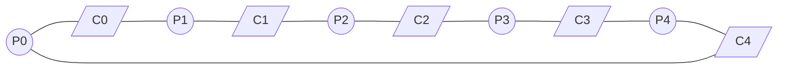
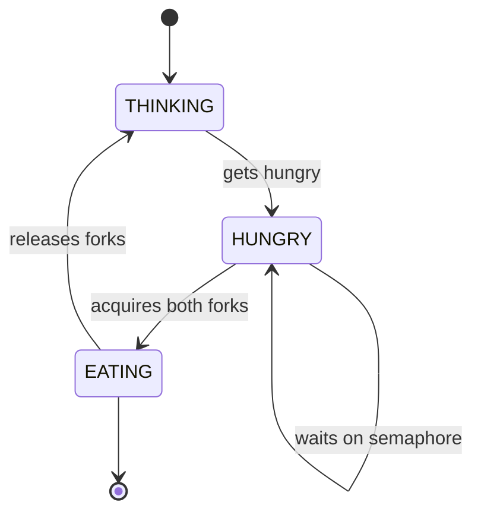
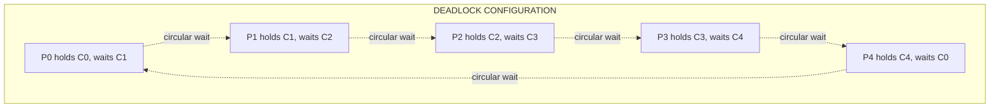
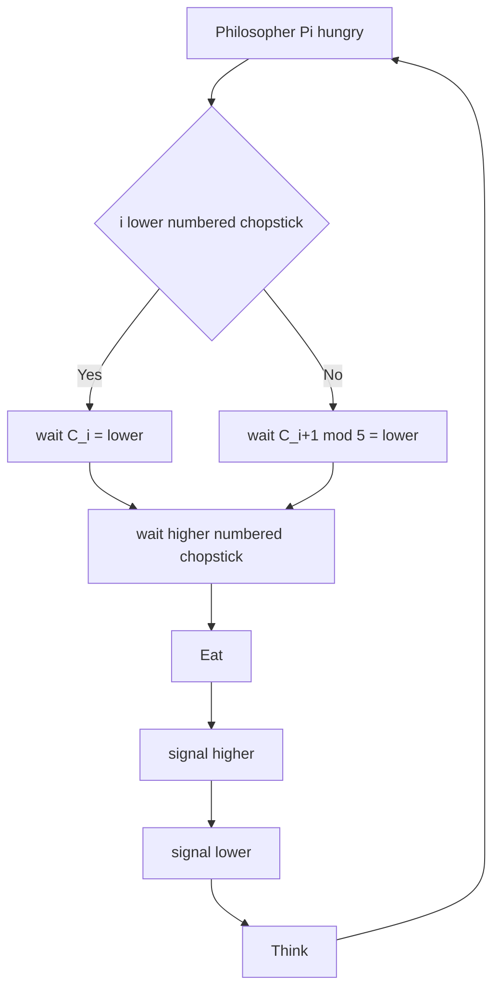
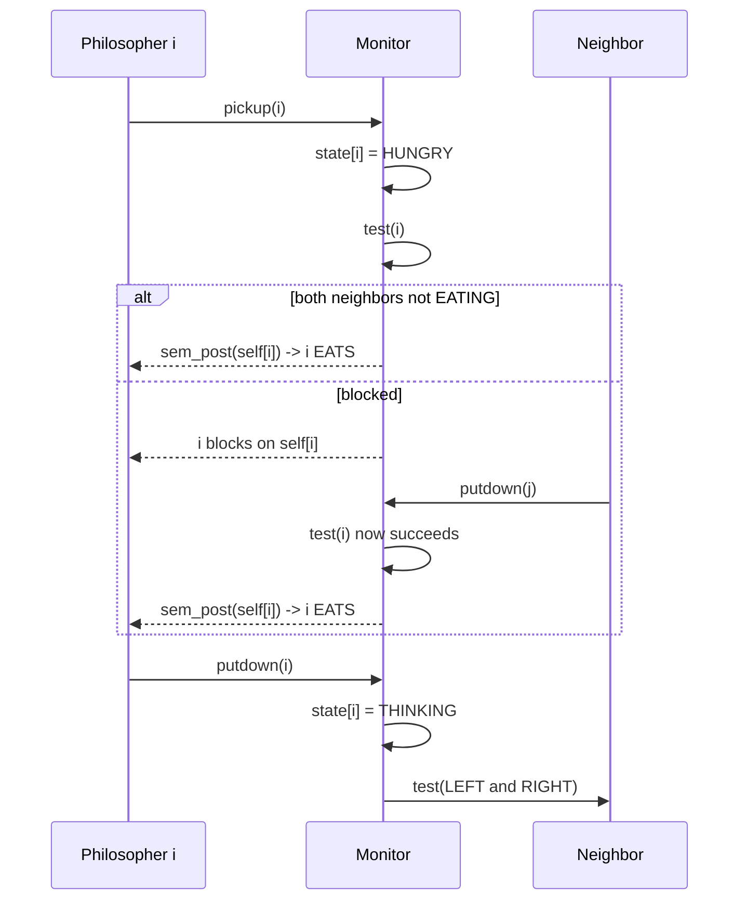

# Dining Philosophers Problem and its solution

<!-- SECTION_1_START -->

# The Dining Philosophers Problem

## Formal Academic Definition

> [!NOTE]
> **KTU 2024 Syllabus Definition**
> The *Dining Philosophers Problem* is a classic **synchronization and concurrency** problem formulated by **Edsger W. Dijkstra in 1965** (originally called "A Problem in Concurrent Programming"). It is used to illustrate the challenges of **deadlock**, **starvation**, and **mutual exclusion** when multiple processes compete for a finite set of shared resources.

The classical formulation: **five philosophers** sit around a circular table. Each philosopher alternates between **thinking** and **eating**. Between every pair of adjacent philosophers lies exactly one **chopstick (fork)**. To eat, a philosopher must acquire **both** the left and right chopsticks. A philosopher can only pick up a chopstick when it is free and must release it after eating.

## Conceptual Analogy — Plain English Intuition

> [!TIP]
> **Real-world analogy: "The Five Programmers and the Five Printers"**
> Imagine 5 programmers sitting in a circle. Between every two programmers sits a shared printer. To compile and print a document, a programmer needs to hold **two** printers (one on each side). Each printer can be held by only one programmer at a time. If every programmer simultaneously grabs the printer on their right side and waits forever for the one on their left, **everyone starves and nothing gets printed**. This is precisely what **deadlock** looks like in operating systems.

| Component | Real OS Counterpart |
|---|---|
| Philosopher | A thread/process |
| Chopstick/Fork | A shared resource (mutex/lock) |
| Eating | Critical section execution |
| Thinking | Non-critical (independent) work |
| Hungry | Process requesting resources |
| Deadlock | All threads permanently blocked |

> [!IMPORTANT]
> **Core Challenge in OS Engineering:** The problem models the fundamental difficulty in OS design — synchronizing $N$ competing processes that need $M$ shared resources while guaranteeing **deadlock-freedom**, **starvation-freedom**, and **progress** without busy-wasting CPU.

> [!VISUALIZATION CONTROL]
> **Concept:** Circular arrangement of 5 philosophers with interleaved chopsticks
> **Visual Description:** Draw 5 nodes (P0, P1, P2, P3, P4) on a circle. Between consecutive nodes, place a single edge representing the chopstick C0, C1, C2, C3, C4. Observe that each philosopher P_i must grab chopsticks C_i (left) and C_(i+1) mod 5 (right) before eating.

<!-- SECTION_1_END -->

<!-- SECTION_2_START -->

# Deep Theoretical Analysis

## The Formal Problem Statement

Let:
- $P = \{P_0, P_1, P_2, P_3, P_4\}$ be the set of **5 philosophers**
- $C = \{C_0, C_1, C_2, C_3, C_4\}$ be the set of **5 chopsticks** (one between each pair)
- Philosopher $P_i$ needs chopsticks $C_i$ and $C_{(i+1) \bmod 5}$ to eat
- $S_i$ is the current **state** of philosopher $i$: $S_i \in \{\text{THINKING}, \text{HUNGRY}, \text{EATING}\}$

The state machine for each philosopher is:
$$P_i: \text{THINKING} \xrightarrow{\text{gets hungry}} \text{HUNGRY} \xrightarrow{\text{acquires both forks}} \text{EATING} \xrightarrow{\text{done}} \text{THINKING}$$

## Why Naive Solutions Fail — The Three Hazards

| Hazard | Description | How Naive Code Triggers It |
|---|---|---|
| **Deadlock** | All processes blocked forever, waiting on each other | Every $P_i$ picks up $C_i$ simultaneously, then waits for $C_{(i+1) \bmod 5}$ |
| **Starvation** | A process is perpetually denied a resource | Unfair lock acquisition order favors some philosophers |
| **Race Condition** | Outcome depends on non-deterministic scheduling | $P_i$ sees both forks free but context-switches before locking |

## KTU High-Yield Formula Sheet & Solution Toolbox

> [!IMPORTANT]
> The following table is the **exam-critical summary** of all solutions. Memorize the trade-offs — they are asked every year.

| # | Solution Technique | Mechanism | Deadlock-Free? | Starvation-Free? | Concurrency |
|---|---|---|---|---|---|
| 1 | **Naive Semaphores** (1 per chopstick) | `wait(C_i); wait(C_(i+1))` | ❌ No | ❌ No | High |
| 2 | **Resource Hierarchy** (ordered locking) | Always lock lower-numbered chopstick first | ✅ Yes | ✅ Yes | High |
| 3 | **Arbitrator / Mutex Solution** | Single `mutex` before checking neighbors | ✅ Yes | ❌ Possible | Low (serialized) |
| 4 | **Dijkstra's Semaphore (count = 4)** | Allow at most 4 philosophers at the table | ✅ Yes | ❌ Possible | Medium |
| 5 | **Monitor-based Solution** (Hoare/Tanenbaum) | `pickup(i)` / `putdown(i)` procedures with condition variables | ✅ Yes | ✅ Yes | High |
| 6 | **Chandy-Misra Token Solution** | Distributed message passing; dirty/clean forks | ✅ Yes | ✅ Yes | High |
| 7 | **TANENBAUM's Asymmetric Solution** | Odd philosophers: left first, then right; Even: reverse | ✅ Yes | ✅ Yes | High |

## Critical Conditions for a Valid Solution

> [!NOTE]
> A KTU-valid Dining Philosophers solution **must** satisfy all four of these:
> 1. **Mutual Exclusion:** No two neighbors eat simultaneously.
> 2. **No Deadlock:** The system must not enter a state where all philosophers are blocked.
> 3. **No Starvation (Eventual Progress):** Every hungry philosopher eventually eats.
> 4. **Concurrency:** Multiple non-adjacent philosophers must be able to eat in parallel.

## Real-World Engineering Utility

- **Database Lock Managers:** Multi-granularity locking in DBMS (row, page, table locks) uses identical ordered-acquisition logic to prevent deadlocks.
- **Java `ReentrantLock`:** Standard JVM threads using intrinsic monitor locks mimic this exact problem when multiple methods request overlapping locks.
- **Embedded RTOS Design:** In VxWorks / FreeRTOS, device drivers following the *resource hierarchy* pattern to acquire shared peripherals.
- **Distributed Systems:** Chandy-Misra is foundational to distributed mutual exclusion algorithms like **Ricart-Agrawala** and **Maekawa**.

<!-- SECTION_2_END -->

<!-- SECTION_3_START -->

# Step-by-Step Derivations & Code Implementation

## Solution 1 — Naive Semaphore Approach (Demonstrates Deadlock)

Each chopstick is a binary semaphore initialized to 1.

```c
#include <semaphore.h>
#define N 5

sem_t chopstick[N];

void philosopher(int i) {
    while (1) {
        think();                  // Step 1: Think
        wait(&chopstick[i]);      // Step 2: Pick up LEFT
        wait(&chopstick[(i+1)%N]);// Step 3: Pick up RIGHT
        eat();                    // Step 4: Eat
        signal(&chopstick[i]);    // Step 5: Release LEFT
        signal(&chopstick[(i+1)%N]);// Step 6: Release RIGHT
    }
}

int main() {
    for (int i = 0; i < N; i++) sem_init(&chopstick[i], 0, 1);
    // ... create 5 threads calling philosopher(0..4)
}
```

**Why it deadlocks:** If all 5 philosophers simultaneously execute `wait(chopstick[i])` successfully (each grabs left), then every `wait(chopstick[(i+1)%N])` blocks because that chopstick is held by the neighbor. Circular wait condition → **deadlock**.

## Solution 2 — Resource Hierarchy (Ordered Locking) — RECOMMENDED KTU ANSWER

> [!TIP]
> This is the **most frequently asked solution** in KTU boards. Always state the rule, then implement it.

**Rule:** Number chopsticks $1$ to $5$. Every philosopher $P_i$ always picks the **lower-numbered** chopstick first, then the higher one.

```c
#include <semaphore.h>
#include <stdio.h>
#define N 5

sem_t chopstick[N];

void philosopher(int i) {
    int first, second;
    // ORDERED ACQUISITION: lower number first
    if (i < (i + 1) % N) {
        first  = i;
        second = (i + 1) % N;
    } else {
        first  = (i + 1) % N;
        second = i;
    }

    while (1) {
        printf("P%d is thinking\n", i);
        // Pick up the LOWER numbered chopstick first
        sem_wait(&chopstick[first]);
        printf("P%d picked up chopstick %d\n", i, first);
        // Then the HIGHER numbered chopstick
        sem_wait(&chopstick[second]);
        printf("P%d picked up chopstick %d -- EATING\n", i, second);

        printf("P%d is EATING\n", i);
        // Put down in REVERSE order
        sem_post(&chopstick[second]);
        sem_post(&chopstick[first]);
        printf("P%d finished eating, back to thinking\n", i);
    }
}
```

**Why it works:** No circular wait can ever form. Suppose a cycle existed: $P_a \to P_b \to P_c \to \dots \to P_a$. Then we must have $C_{low1} < C_{low2} < C_{low3} < \dots < C_{low1}$, which is a contradiction. The number line is acyclic.

## Solution 3 — Arbitrator (Single Mutex) — Simplest Deadlock-Free Solution

```c
#include <pthread.h>
#include <semaphore.h>
#define N 5
#define LEFT(i)  ((i + N - 1) % N)
#define RIGHT(i) ((i + 1) % N)

enum state { THINKING, HUNGRY, EATING } state_arr[N];
pthread_mutex_t mutex = PTHREAD_MUTEX_INITIALIZER;   // arbitrator
sem_t self[N];                                       // per-philosopher semaphore

void test(int i) {
    if (state_arr[i] == HUNGRY &&
        state_arr[LEFT(i)]  != EATING &&
        state_arr[RIGHT(i)] != EATING) {
        state_arr[i] = EATING;
        sem_post(&self[i]);   // wake philosopher i
    }
}

void pickup(int i) {
    pthread_mutex_lock(&mutex);
    state_arr[i] = HUNGRY;
    test(i);
    pthread_mutex_unlock(&mutex);
    sem_wait(&self[i]);        // block if not allowed to eat
}

void putdown(int i) {
    pthread_mutex_lock(&mutex);
    state_arr[i] = THINKING;
    test(LEFT(i));              // wake left neighbor if eligible
    test(RIGHT(i));             // wake right neighbor if eligible
    pthread_mutex_unlock(&mutex);
}

void* philosopher(void* arg) {
    int i = *(int*)arg;
    while (1) {
        think();
        pickup(i);
        eat();
        putdown(i);
    }
}
```

**Evaluation key points (KTU 2024):**
- `[Declaring state array and mutex: 2 Marks]`
- `[Correct `test()` logic checking both neighbors: 3 Marks]`
- `[Pickup calling test and blocking on self semaphore: 3 Marks]`
- `[Putdown resetting state and re-testing neighbors: 3 Marks]`

## Solution 4 — Tanenbaum's Asymmetric Approach (Starvation-Free)

> [!IMPORTANT]
> **Rule:**
> - **Odd-numbered** philosophers pick up the **LEFT** chopstick first, then RIGHT.
> - **Even-numbered** philosophers pick up the **RIGHT** chopstick first, then LEFT.
> - After eating, release in **reverse** order.

```c
void philosopher(int i) {
    while (1) {
        think();
        if (i % 2 == 0) {       // EVEN philosopher
            sem_wait(&chopstick[RIGHT(i)]);
            sem_wait(&chopstick[LEFT(i)]);
        } else {                // ODD philosopher
            sem_wait(&chopstick[LEFT(i)]);
            sem_wait(&chopstick[RIGHT(i)]);
        }
        eat();
        // Release in REVERSE order
        if (i % 2 == 0) {
            sem_post(&chopstick[LEFT(i)]);
            sem_post(&chopstick[RIGHT(i)]);
        } else {
            sem_post(&chopstick[RIGHT(i)]);
            sem_post(&chopstick[LEFT(i)]);
        }
    }
}
```

**Asymmetric proof of deadlock freedom:** No two adjacent philosophers ever try to grab the *same* chopstick first. Therefore, the cycle $P_0 \to P_1 \to P_2 \to P_3 \to P_4 \to P_0$ cannot form because at least one adjacent pair is always "out of phase".

## Solution 5 — Python Implementation (Modern Pedagogical View)

```python
import threading, time, random

N = 5
chopsticks = [threading.Semaphore(1) for _ in range(N)]

class Philosopher(threading.Thread):
    def __init__(self, i: int) -> None:
        super().__init__(daemon=True)
        self.i = i

    def think(self) -> None:
        time.sleep(random.uniform(0.1, 0.5))

    def eat(self) -> None:
        time.sleep(random.uniform(0.1, 0.5))

    def run(self) -> None:
        left  = self.i
        right = (self.i + 1) % N
        # ORDERED LOCKING: always acquire lower number first
        first, second = (left, right) if left < right else (right, left)
        while True:
            self.think()
            with chopsticks[first]:            # acquire lower
                with chopsticks[second]:       # acquire higher
                    self.eat()
```

<!-- SECTION_3_END -->

<!-- SECTION_4_START -->

# Structural Diagrams & Schematics

## Diagram 1 — Circular Problem Layout



> **Figure description:** Five philosopher nodes (P0–P4) arranged in a ring, interleaved with five chopstick edges (C0–C4). Each chopstick is shared between exactly two adjacent philosophers.

## Diagram 2 — Per-Philosopher State Machine



## Diagram 3 — Deadlock State in Naive Solution



> **Figure description:** The circular-wait cycle. Every philosopher holds one chopstick and waits for another held by their right neighbor, creating a closed dependency loop. No philosopher can proceed → **permanent deadlock**.

## Diagram 4 — Resource Hierarchy Solution Flow



## Diagram 5 — Monitor-Based Pickup/Putdown Interaction



<!-- SECTION_4_END -->

<!-- SECTION_5_START -->

# KTU 2024 Scheme Examination Question Bank

## Part A — Short Answer Questions (3 Marks Each)

### Question 1 `[KTU University Exam - July 2024]`
**State the Dining Philosophers Problem and mention the resources that may lead to deadlock.**

**Model Answer:**

> [!NOTE]
> The Dining Philosophers Problem was proposed by **Edsger W. Dijkstra in 1965** to illustrate synchronization issues. It involves **5 philosophers** sitting around a circular table with **5 chopsticks** placed between them. Each philosopher alternates between *thinking* and *eating*. To eat, a philosopher needs both the left and right chopstick. The resources leading to deadlock are the **chopsticks (forks)**. When every philosopher picks up one chopstick and waits for the other, a **circular wait** is formed, resulting in deadlock. `[3 Marks]`

### Question 2 `[KTU University Exam - Dec 2023]`
**Differentiate between deadlock and starvation in the context of the Dining Philosophers Problem.**

**Model Answer:**

| Aspect | Deadlock | Starvation |
|---|---|---|
| **Definition** | All processes are blocked permanently | Some process waits indefinitely while others make progress |
| **Affected in DP** | All 5 philosophers blocked | Only one or more philosophers starved |
| **Cause** | Circular wait on resources | Unfair scheduling/lock acquisition order |
| **Example** | Every $P_i$ holds $C_i$ waiting for $C_{(i+1)\bmod 5}$ | $P_0$ keeps preempted by neighbors |
| **Solution in DP** | Resource hierarchy / Asymmetric | FIFO queue / Bakery algorithm |

`[3 Marks]`

---

## Part B — 14-Mark Questions (Module Internal Choice Pattern)

### Question A — `[KTU University Exam - July 2024]` — **CO3, Apply/Analyze**

**(a)** Describe the Dining Philosophers Problem. Explain how deadlock occurs in a naive semaphore-based solution. `[7 Marks]`

**Model Solution:**

The Dining Philosophers Problem, proposed by Dijkstra, models $N$ philosophers sharing $N$ chopsticks around a circular table. Each philosopher must pick up two adjacent chopsticks to eat.

In the naive solution, each chopstick $C_i$ is a binary semaphore initialized to 1. The philosopher's code is:

```c
wait(C_i);
wait(C_(i+1)%5);
eat();
signal(C_i);
signal(C_(i+1)%5);
```

**Deadlock scenario:** Consider the interleaving where all 5 philosophers simultaneously execute `wait(C_i)` successfully. Then every `wait(C_(i+1)%5)` blocks because that chopstick is held by the right neighbor. The four Coffman conditions are satisfied:

1. **Mutual exclusion** — chopstick held by one philosopher
2. **Hold and wait** — each holds one, waits for another
3. **No preemption** — chopsticks cannot be forcibly taken
4. **Circular wait** — $P_0 \to P_1 \to P_2 \to P_3 \to P_4 \to P_0$

`[Problem statement: 2 Marks] [Naive code: 2 Marks] [Deadlock interleaving: 2 Marks] [Coffman conditions: 1 Mark]`

**(b)** Propose and implement a solution using the **resource hierarchy** technique. Prove it is deadlock-free. `[7 Marks]`

**Model Solution:**

**Rule:** Number chopsticks 1 to 5. Every philosopher $P_i$ always picks the lower-numbered chopstick first, then the higher-numbered one.

```c
int first  = min(i, (i+1) % 5);
int second = max(i, (i+1) % 5);
sem_wait(&chopstick[first]);
sem_wait(&chopstick[second]);
eat();
sem_post(&chopstick[second]);
sem_post(&chopstick[first]);
```

**Proof of deadlock-freedom (by contradiction):** Suppose a circular wait forms: $P_{a_0} \to P_{a_1} \to \dots \to P_{a_k} \to P_{a_0}$. Then $P_{a_0}$ is waiting for a chopstick held by $P_{a_1}$, which means $P_{a_1}$ acquired a higher-numbered chopstick than $P_{a_0}$'s request. Continuing, we get a strictly increasing sequence of chopstick numbers: $C_{a_0} < C_{a_1} < \dots < C_{a_k} < C_{a_0}$, which is **impossible**. Hence, no circular wait can form. `[Rule statement: 1 Mark] [Code: 3 Marks] [Proof by contradiction: 3 Marks]`

---

### Question B — `[KTU University Exam - Dec 2023]` — **CO3, Apply/Analyze**

**(a)** Explain the **monitor-based solution** to the Dining Philosophers Problem using condition variables. `[7 Marks]`

**Model Solution:**

A monitor encapsulates the shared state (`state[0..4]`) and operations `pickup(i)` and `putdown(i)`. Condition variable `self[i]` blocks philosopher $i$ when it cannot eat.

```c
monitor DP {
    enum {THINKING, HUNGRY, EATING} state[5];
    condition self[5];

    void test(int i) {
        if ((state[i] == HUNGRY) &&
            (state[(i+4)%5] != EATING) &&
            (state[(i+1)%5] != EATING)) {
            state[i] = EATING;
            signal(self[i]);      // wake philosopher i
        }
    }

    void pickup(int i) {
        state[i] = HUNGRY;
        test(i);
        if (state[i] != EATING) wait(self[i]);
    }

    void putdown(int i) {
        state[i] = THINKING;
        test((i+4)%5);            // left neighbor
        test((i+1)%5);            // right neighbor
    }
}
```

**Advantages:** Mutual exclusion enforced by monitor; starvation-free because `test` is fair. `[Monitor declaration: 2 Marks] [test logic: 2 Marks] [pickup/putdown: 2 Marks] [Justification: 1 Mark]`

**(b)** Compare the **arbitrator** and **Chandy-Misra** approaches. Which is suitable for a distributed system? `[7 Marks]`

**Model Solution:**

| Feature | Arbitrator (Centralized) | Chandy-Misra (Distributed) |
|---|---|---|
| **Coordination** | Single mutex controls all decisions | Token-based message passing |
| **Scalability** | Poor (bottleneck) | Excellent |
| **Failure mode** | Single point of failure | Fault-tolerant |
| **Network requirement** | Shared memory | Message passing |
| **Starvation** | Possible without FIFO | Free |
| **Used in** | Single-machine OS | Distributed databases, IoT |

**Chandy-Misra Algorithm (sketch):**
- Each fork is a **token** with state: *clean* or *dirty*.
- A philosopher can eat only if he holds both his forks.
- After eating, he **cleans** his forks and passes them to hungry neighbors.
- A philosopher receiving a *dirty* fork cleans it before sending it on.
- This guarantees **no deadlock**, **no starvation**, and **maximum concurrency** in distributed settings.

`[Comparison table: 3 Marks] [Chandy-Misra description: 3 Marks] [Verdict on distributed use: 1 Mark]`

> [!WARNING]
> **KTU Examiner's Valuation Warning — Common Pitfalls**
> 1. **Omitting the release in reverse order:** Always release locks in *reverse* of acquisition — marks are deducted otherwise.
> 2. **Forgetting to initialize semaphores to 1:** Writing `sem_init(..., 0, 1)` for chopsticks is mandatory; `0` means dead on arrival.
> 3. **No proof of correctness:** For any solution worth 7+ marks, a *brief justification* (circular-wait argument or Coffman conditions check) is required.
> 4. **Confusing deadlock with starvation:** Examiners award zero to answers that use these terms interchangeably.
> 5. **Using `wait` after `signal` in monitor solutions:** In Hoare monitors, the signaling philosopher *suspends* until the signaled one exits — do not write a wake-up-loop that re-checks.

---

## Topic Recap & Important Things to Remember

- ✅ The problem is by **Dijkstra (1965)**; canonical $N = 5$ philosophers, $N = 5$ forks.
- ✅ Each philosopher needs **two adjacent chopsticks** to eat.
- ✅ The naive 1-semaphore-per-chopstick approach **always deadlocks** under a specific interleaving.
- ✅ A valid solution must prevent **deadlock**, **starvation**, and ensure **mutual exclusion** plus **concurrency**.
- ✅ **Resource hierarchy** (ordered locking) is the simplest provably deadlock-free solution.
- ✅ **Monitor-based solution** uses a `test(i)` helper and a per-philosopher condition variable `self[i]`.
- ✅ **Dijkstra's fix:** Initialize room semaphore to 4 instead of 5 → at most 4 philosophers compete, breaking circular wait.
- ✅ **Asymmetric (Tanenbaum)** solution: odd philosophers pick left first, even pick right first.
- ✅ **Chandy-Misra** is the go-to **distributed** solution using dirty/clean fork tokens.
- ✅ The four **Coffman conditions** for deadlock are *necessary*; eliminating any one (typically circular wait) prevents it.
- ✅ The KTU board expects **pseudocode + correctness proof** together for 14-mark questions.
- ✅ Common exam phrases to memorize verbatim: *"circular wait"*, *"resource ordering"*, *"condition variable"*, *"Hoare monitor"*.

<!-- SECTION_5_END -->
