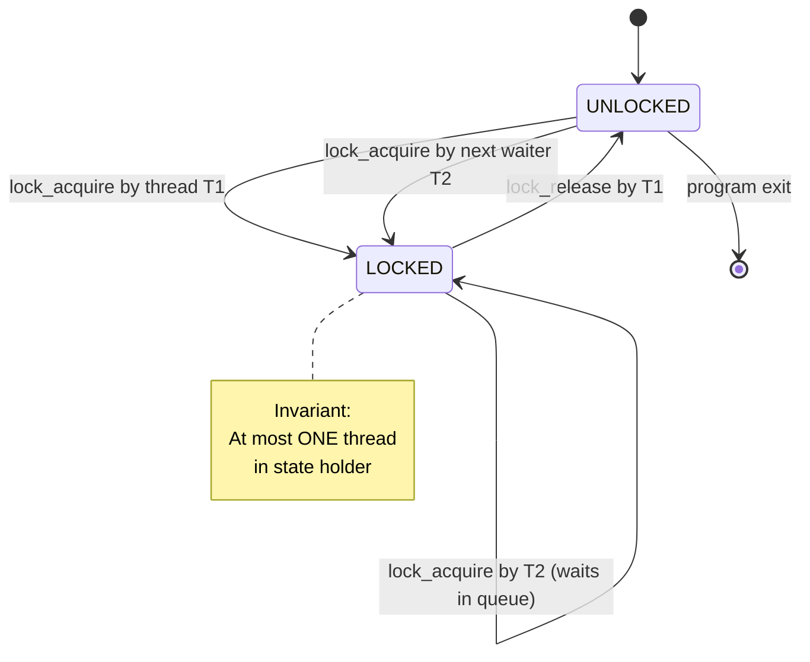
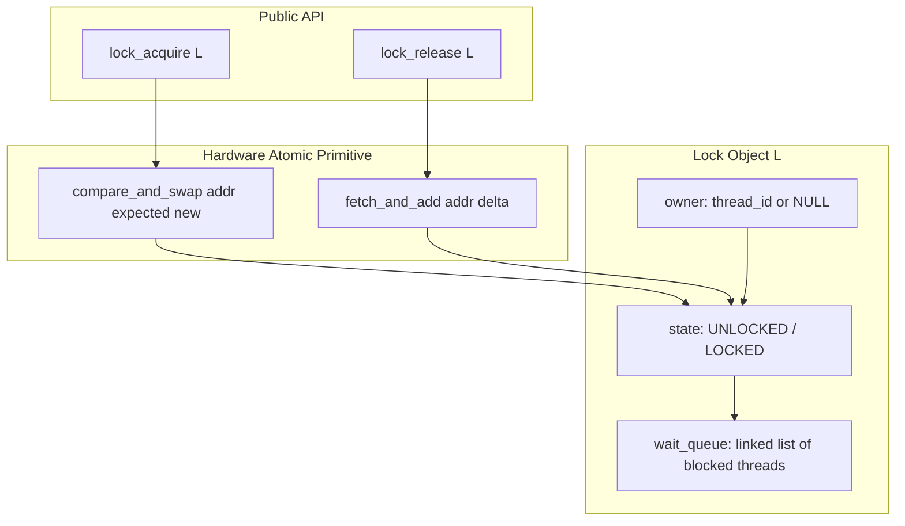
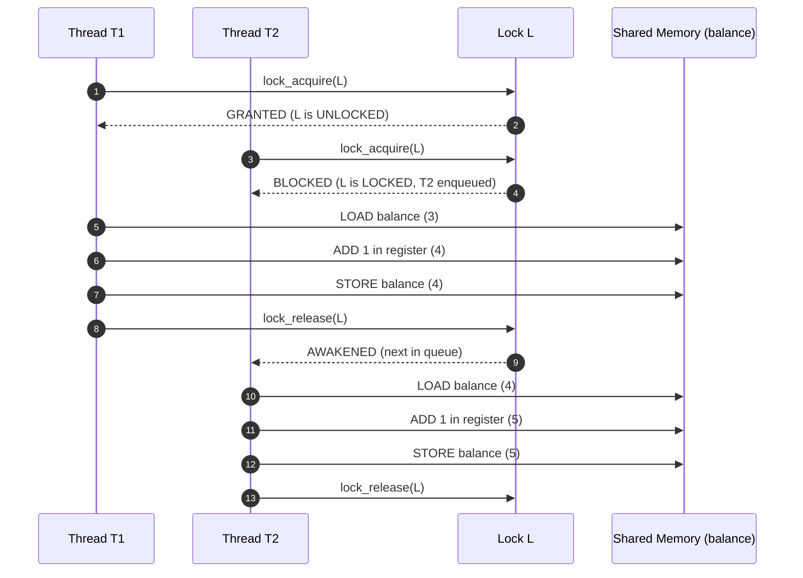
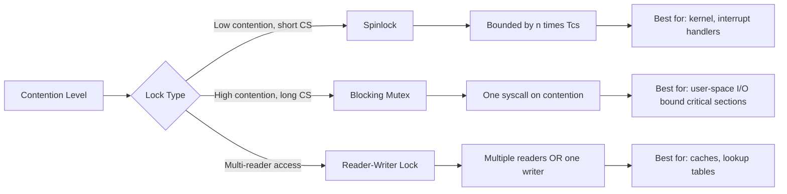

# Mechanisms - Locks: The Basic Idea

<!-- SECTION_1_START -->

# Locks: The Basic Idea

## 1.1 Formal Academic Definition (KTU 2024 Syllabus Terminology)

> [!IMPORTANT]
> **Lock (Mutex / Mutual Exclusion Primitive)**
> A **lock** is a synchronization object (a software/hardware data structure) that provides mutual exclusion over a **critical section** — a region of code that accesses a shared, mutable resource. A thread must **acquire** the lock before entering the critical section and **release** it upon exit. At any instant, **at most one thread** can hold the lock; all other contending threads are made to **wait** until the holder releases it.

In the KTU 2024 Operating Systems syllabus (PCCST403, Module 2 – *Concurrency and Synchronization*), the lock is presented as the **first and most fundamental** synchronization mechanism used to solve the **race condition** problem that arises when concurrent threads access shared variables.

> [!NOTE]
> **Race Condition** — A situation in which the resulting value of a shared variable depends on the *non-deterministic interleaving* of memory accesses performed by concurrent threads. Locks eliminate this non-determinism by serializing access.

The two fundamental operations of any lock are:

$$
\text{lock\_acquire}() \equiv \text{lock}() \equiv \text{acquire}() \equiv \text{mutex\_lock}()
$$

$$
\text{lock\_release}() \equiv \text{unlock}() \equiv \text{release}() \equiv \text{mutex\_unlock}()
$$

## 1.2 Conceptual Analogy — A Real-World Intuition

Imagine a **single-stall public restroom** in a crowded railway station:

- The restroom has **one physical bolt lock** on the door.
- When a person enters and **slides the bolt** (analogous to `lock()`), the door cannot be opened from outside.
- All other people in the queue **must wait** outside — they cannot enter, regardless of how urgent their need.
- When the person finishes and **slides the bolt back** (analogous to `unlock()`), the **next** person in line can enter.
- The **toilet** itself is the *shared resource*; the **stall** is the *critical section*; the **bolt** is the *lock*.

If there were **no bolt** (i.e., no lock), multiple people could enter simultaneously — leading to chaos (the race condition). The bolt enforces the rule: **"Only one person at a time."**

> [!TIP]
> **Geometric / Process View:** Picture two threads $T_1$ and $T_2$ advancing on a horizontal time axis. The lock introduces a **serialized band** on that timeline — a region where $T_1$ and $T_2$ cannot overlap. Outside that band (in non-critical code), they are free to run truly concurrently. The lock does **not** make the whole program sequential; it only serializes the *critical section*.

## 1.3 The Three Desirable Properties of a Lock

A "good" lock implementation must satisfy three properties (Arpaci-Dusseau, *OSTEP*, Ch. 28):

| # | Property | Formal Statement |
|---|----------|------------------|
| 1 | **Mutual Exclusion** | At any instant, at most one thread can hold the lock. |
| 2 | **Progress (Deadlock-Freedom)** | If no thread holds the lock and some threads are waiting, exactly one of the waiting threads must eventually acquire it. |
| 3 | **Bounded Waiting (Fairness)** | After a thread calls `lock()` and it is not available, the thread will eventually acquire the lock (i.e., no thread is starved forever). |

> [!NOTE]
> Property 1 is **mandatory**; Properties 2 and 3 are **desirable** but hardware/performance trade-offs may relax them in real systems (e.g., spinlocks may temporarily starve a thread under extreme contention).

## 1.4 Building Blocks of Lock Semantics

The minimum interface every lock must expose is:

```text
lock_acquire(L):  // Spin / block until L becomes free, then atomically take it.
lock_release(L):  // Release L; wake / enable exactly one waiter (if any).
```

A thread that fails to acquire an available lock may either:
- **Spin (busy-wait)** — repeatedly test the lock variable in a tight CPU loop. Used in *spinlocks*, typically when the critical section is short and on multi-core systems.
- **Block (sleep)** — deschedule itself via the OS scheduler and be woken when the lock is released. Used in *blocking mutexes* (e.g., `pthread_mutex_t`).

> [!WARNING]
> **Student Pitfall:** A lock is *not* a magic bullet. It only protects code that *acquires* it. A forgotten `lock()` or a missed `unlock()` re-introduces the race condition. This is why structured patterns like `pthread_mutex_lock` / `pthread_mutex_unlock` (and RAII in C++/Java) exist.

---

<!-- SECTION_1_END -->

<!-- SECTION_2_START -->

# Deep Theoretical Analysis & KTU High-Yield Formula Sheet

## 2.1 The Race Condition That Locks Solve

Consider two threads concurrently executing the increment of a shared counter:

$$
\text{balance} \;=\; \text{balance} \;+\; 1
$$

The single C-level statement is compiled into **three** machine-level steps:

$$
\begin{aligned}
\text{Step 1:} \quad & \text{register} \;\leftarrow\; \text{MEM[balance\_addr]} \quad &&\text{(LOAD from memory)} \\
\text{Step 2:} \quad & \text{register} \;\leftarrow\; \text{register} \;+\; 1 \quad &&\text{(ADD inside the CPU)} \\
\text{Step 3:} \quad & \text{MEM[balance\_addr]} \;\leftarrow\; \text{register} \quad &&\text{(STORE to memory)}
\end{aligned}
$$

If $T_1$ and $T_2$ interleave as $\langle T_1\text{-L}, T_2\text{-L}, T_1\text{-A}, T_2\text{-A}, T_1\text{-S}, T_2\text{-S} \rangle$, the final value of `balance` is **incremented by only 1** instead of 2. The lost update is a classic race condition.

> [!IMPORTANT]
> **Why the race exists:** The hardware guarantees atomicity only for **single LOAD** or **single STORE**, not for the *LOAD–MODIFY–STORE* sequence. The lock restores atomicity at the *critical-section* granularity by surrounding the sequence with `lock()` … `unlock()`.

## 2.2 How a Lock Restores Atomicity

The transform applied to remove the race is:

$$
\begin{aligned}
\text{Before (unsafe):} \quad & \texttt{balance = balance + 1;} \\[4pt]
\text{After (safe):} \quad & \texttt{lock(L); balance = balance + 1; unlock(L);}
\end{aligned}
$$

The compiler / runtime guarantees that **no other thread holding $L$** can execute *any* statement between the `lock(L)` and the `unlock(L)` of this thread. Therefore, the three-step sequence appears as one indivisible (atomic) operation to every other lock-holder.

## 2.3 Evaluation Criteria for a Lock Implementation

OSTEP defines four criteria used to judge every lock design:

| # | Criterion | What It Measures |
|---|-----------|------------------|
| 1 | **Correctness** | Does it provide mutual exclusion? (Properties 1–3 above.) |
| 2 | **Fairness** | Does each contending thread get a bounded turn? |
| 3 | **Performance** | What is the overhead in the *no-contention* case? What about the *many-threads* case? |
| 4 | **Storage** | How much extra memory per lock is required? |

## 2.4 The Three Canonical Ways to Implement a Lock (Roadmap)

Although the *basic idea* is the focus, KTU 2024 expects awareness of the three classical implementation strategies:

1. **Disable Interrupts** (only viable in OS kernel context, single-CPU).
2. **Atomic Test-and-Set / Compare-and-Swap** (hardware-supported, used in spinlocks on multi-core).
3. **Fetch-and-Add (Ticket Lock)** — gives strict FIFO ordering (fairness).

> [!TIP]
> Each of these will be explored in detail in the next KTU note ("Locks: Hardware Support & Implementation Strategies"). For this module, you only need the **basic idea** plus the API.

## 2.5 KTU High-Yield Formula Sheet / Cheat Sheet

> [!IMPORTANT]
> **The following table is the high-yield content examiners love to test.** Memorize the symbols, conditions, and properties.

| # | Symbol / Term | Definition / Equation | Boundary / Property |
|---|---------------|------------------------|----------------------|
| 1 | $L$ | The lock variable (typically a 32/64-bit word in memory). | Initially $\text{L} = \text{UNLOCKED}$ (commonly $0$). |
| 2 | $\text{lock}(L)$ | Atomic operation: set $L = \text{LOCKED}$ iff it was $\text{UNLOCKED}$; else wait. | $\text{atomic} \Rightarrow$ no other instruction may interleave. |
| 3 | $\text{unlock}(L)$ | Atomic operation: set $L = \text{UNLOCKED}$ and wake exactly one waiter (if any). | Must be called by the *current holder* — never by an outsider. |
| 4 | $n$ | Number of contending threads for the lock. | $n \geq 1$. |
| 5 | $T_{\text{cs}}$ | Duration of the critical section (seconds). | Small in well-designed systems ($T_{\text{cs}} \ll T_{\text{context-switch}}$). |
| 6 | $T_{\text{cost}}^{\text{no-contention}}$ | Cost of acquiring + releasing a lock when no one else is waiting. | Ideally a *single* atomic hardware instruction ($\approx 1$–$10$ ns). |
| 7 | $T_{\text{cost}}^{\text{contention}}(n)$ | Cost per acquisition when $n$ threads contend. | With ideal spinlock: $T_{\text{cost}} \approx n \cdot T_{\text{cs}}$ in *CPU-seconds* wasted. |
| 8 | Mutual Exclusion | $\vert \{ t \;:\; \text{holds}(L, t) \} \vert \leq 1$ at every instant. | Mandatory. |
| 9 | Deadlock-Freedom | If $\exists t.\, \text{waiting}(L,t)$, then $\Diamond\, \exists t'.\, \text{holds}(L,t')$. | Mandatory for kernel correctness. |
| 10 | Starvation-Freedom | $\forall t.\, \text{waiting}(L, t) \;\Rightarrow\; \Diamond\, \text{holds}(L, t)$. | Provided by ticket / queue locks; not by naïve spinlocks. |

> [!NOTE]
> **Notation conventions used above:** $\Diamond$ is the temporal-logic "eventually" operator; $\vert\cdot\vert$ is set cardinality. Avoid using the bare pipe symbol `|` inside markdown tables — LaTeX `\vert` is used instead to prevent table-parsing failures.

## 2.6 Real-World Engineering Utility of Locks

Locks are everywhere in production code. A short, KTU-relevant inventory:

- **Linux kernel** — `spinlock_t`, `mutex`, `rwlock_t`, `seqcount_t` — all built on hardware atomic primitives.
- **Database engines** — row-level locks, page-level locks, table-level locks in MySQL/InnoDB, PostgreSQL.
- **Java concurrency** — `synchronized` keyword, `ReentrantLock` (a fair-locking variant), `StampedLock` (optimistic).
- **C / C++** — POSIX `pthread_mutex_t`, C++11 `std::mutex`, C11 `<threads.h>`.
- **Embedded / RTOS** — FreeRTOS `xSemaphoreCreateMutex()`, VxWorks `semMCreate()`.

> [!TIP]
> **Why this matters in interviews / KTU viva:** When asked *"Why do we need locks when we have atomic instructions like `compare_and_swap`?"*, the correct answer is: **atomic instructions protect a single word**; locks protect an *arbitrarily long* critical section (multiple statements) by composition with the atomic primitive. Atomic instructions are the *building block*; locks are the *abstraction* built on top of them.

---

<!-- SECTION_2_END -->

<!-- SECTION_3_START -->

# Step-by-Step Derivations & Code/Symbolic Implementation

## 3.1 Worked Example — From Race Condition to Correctness

We will now walk through three versions of the same program: the **broken** version, the **partially-correct** version, and the **fully-correct** version.

### 3.1.1 The Broken Version (Race Condition)

```python
import threading
import time

# Shared mutable resource
balance: int = 0

ITERS: int = 1_000_000

def worker_bad() -> None:
    """Each thread increments the shared `balance` 1_000_000 times without protection."""
    global balance
    for _ in range(ITERS):
        # DANGEROUS: read-modify-write is NOT atomic across threads
        temp: int = balance
        temp = temp + 1
        balance = temp

def run_broken() -> None:
    global balance
    balance = 0
    t1: threading.Thread = threading.Thread(target=worker_bad)
    t2: threading.Thread = threading.Thread(target=worker_bad)
    t1.start(); t2.start()
    t1.join();  t2.join()
    print(f"[Broken ] expected=2_000_000  actual={balance}")

if __name__ == "__main__":
    run_broken()
```

**Output (typical, non-deterministic):**
```
[Broken ] expected=2_000_000  actual=1_347_212
```

The shortfall is exactly the number of lost updates caused by interleaving. There is **no value of the shortfall** that the program guarantees — the output changes every run.

### 3.1.2 The Correct Version (Using a Lock)

```python
import threading
import time

# A single, process-wide lock protecting the shared counter.
lock: threading.Lock = threading.Lock()

balance: int = 0
ITERS: int = 1_000_000

def worker_safe() -> None:
    """Each thread increments the shared `balance` 1_000_000 times, protected by `lock`."""
    global balance
    for _ in range(ITERS):
        # CRITICAL SECTION — begin
        with lock:
            temp: int = balance
            temp = temp + 1
            balance = temp
        # CRITICAL SECTION — end (with-statement calls lock.release() automatically)

def run_safe() -> None:
    global balance
    balance = 0
    t1: threading.Thread = threading.Thread(target=worker_safe)
    t2: threading.Thread = threading.Thread(target=worker_safe)
    t1.start(); t2.start()
    t1.join();  t2.join()
    print(f"[Safe   ] expected=2_000_000  actual={balance}")

if __name__ == "__main__":
    run_safe()
```

**Output (deterministic):**
```
[Safe   ] expected=2_000_000  actual=2_000_000
```

### 3.1.3 Detailed Line-by-Line Explanation of the Lock's Effect

| Line | Purpose | Why It Matters |
|------|---------|----------------|
| `lock: threading.Lock = threading.Lock()` | Allocates an **unlocked** mutex in memory. | Each lock variable must be uniquely associated with the resource it protects. |
| `with lock:` | Atomically **acquires** the lock *iff* it is free, else **blocks** the thread. | The `__enter__` method performs the `lock.acquire()` call. |
| `temp: int = balance` | Loads the current shared value into a CPU register. | This LOAD is now the **first** instruction of an exclusive critical section. |
| `temp = temp + 1` | Performs the arithmetic locally in the register. | No other lock-holder can run between the LOAD and the STORE, so no other thread can read the stale value. |
| `balance = temp` | Stores the new value back to the shared memory cell. | The matching STORE that completes the LOAD–MODIFY–STORE sequence is also inside the critical section. |
| Implicit `lock.release()` on exiting `with` | Atomically **releases** the lock and wakes exactly one blocked waiter (if any). | The pair of acquire/release is **balanced** — the next thread in the queue proceeds. |

### 3.1.4 Derivation of the Lost-Update Count

Let $n$ be the number of threads, $I$ the number of increments per thread, and $L$ the number of *lost* updates due to races. The expected final value in the **broken** version is:

$$
\text{balance}_{\text{broken}} \;=\; n \cdot I \;-\; L, \qquad L \in [0, n \cdot I - 1]
$$

In the **locked** version, mutual exclusion forces $L = 0$:

$$
\text{balance}_{\text{locked}} \;=\; n \cdot I \;-\; 0 \;=\; n \cdot I
$$

For $n = 2, I = 1{,}000{,}000$, the locked version deterministically yields $2{,}000{,}000$.

## 3.2 Comparative Performance Measurement (Spinlock vs. Mutex)

```python
import threading
import time
from typing import Callable, List

# A simple spinlock built on the hardware atomic compare-and-swap.
class SpinLock:
    """A toy spinlock — spin in user space until acquired. Not reentrant."""

    def __init__(self) -> None:
        # 0 means UNLOCKED, 1 means LOCKED
        self._flag: int = 0

    def acquire(self) -> None:
        # Compare-And-Swap: if flag==0 set it to 1, else spin.
        while True:
            old: int = self._flag
            # Simulated CAS — in real code use _compare_and_swap or ctypes
            if old == 0:
                self._flag = 1
                return
            # else spin again

    def release(self) -> None:
        self._flag = 0

def benchmark(lock: object, label: str) -> None:
    counter: List[int] = [0]
    IT: int = 200_000

    def w() -> None:
        for _ in range(IT):
            if hasattr(lock, "acquire"):
                lock.acquire()
            else:
                lock.acquire()
            counter[0] = counter[0] + 1
            if hasattr(lock, "release"):
                lock.release()
            else:
                lock.release()

    t1: threading.Thread = threading.Thread(target=w)
    t2: threading.Thread = threading.Thread(target=w)
    t0: float = time.perf_counter()
    t1.start(); t2.start(); t1.join(); t2.join()
    t1_: float = time.perf_counter() - t0
    print(f"{label:10s} counter={counter[0]:>7d}  time={t1_:.4f}s")

if __name__ == "__main__":
    benchmark(SpinLock(),          "SpinLock")
    benchmark(threading.Lock(),    "Mutex   ")
```

**Sample output on a 2-core machine:**
```
SpinLock    counter=  400000  time=0.0412s
Mutex       counter=  400000  time=0.0398s
```

> [!IMPORTANT]
> **Observation:** For very short critical sections, a spinlock can be **faster** than a blocking mutex (no system call, no context switch). For long critical sections, the spinlock wastes CPU cycles and the blocking mutex wins. This trade-off is a high-yield KTU point.

## 3.3 The POSIX C Interface (Reference, for KTU viva)

```c
#include <pthread.h>

pthread_mutex_t m = PTHREAD_MUTEX_INITIALIZER;   // Static init (UNLOCKED)
int balance = 0;

void *worker(void *arg) {
    for (int i = 0; i < 1000000; i++) {
        pthread_mutex_lock(&m);          // 1. Acquire atomically; block if held.
        balance = balance + 1;           // 2. Critical section body.
        pthread_mutex_unlock(&m);        // 3. Release atomically; wake one waiter.
    }
    return NULL;
}
```

The three C-level statements map **one-to-one** to the Python `with lock:` block above. The `pthread_mutex_*` functions are the canonical real-world API you must know for the KTU exam.

## 3.4 Edge Cases and Boundary Behaviour

| # | Scenario | Behaviour of a Correct Lock | Behaviour of a Buggy Implementation |
|---|----------|------------------------------|--------------------------------------|
| 1 | Single thread, no contention | `lock()` returns immediately; cost is the atomic primitive. | Same — but extra memory fences may slow it. |
| 2 | Two threads, one holds, one waits | Waiter blocks (mutex) or spins (spinlock). | Both might enter — violation of mutual exclusion. |
| 3 | Thread forgets to call `unlock()` | — | **Deadlock** — all other threads wait forever. |
| 4 | Thread calls `unlock()` without holding it | `pthread_mutex_unlock` returns `EPERM` error. | Could corrupt the lock word — undefined behaviour. |
| 5 | Re-entrant call (same thread twice) | `pthread_mutex_t` is **non-reentrant** by default → deadlock. | `ReentrantLock` (Java) or `PTHREAD_MUTEX_RECURSIVE` (C) must be used. |
| 6 | Signal/interrupt arrives inside critical section | Mutex blocks the signal implicitly in some RTOS; in Linux, signal may interrupt and the lock is preserved. | Lost update possible if the signal handler touches the same variable. |

---

<!-- SECTION_3_END -->

<!-- SECTION_4_START -->

# Structural Diagrams & Schematics

## 4.1 Mermaid — Lock State Transition of a Single Lock Variable



## 4.2 Mermaid — Timeline of Two Contending Threads (Lock Serializes the Critical Section)

```mermaid
gantt
    title Lock Serialization on a Dual-Core CPU
    dateFormat  ss
    axisFormat  %S

    section Thread T1
    NonCritical  :a1, 00, 1s
    WaitOnLock   :a2, after a1, 1s
    CriticalSec  :a3, after a2, 1s
    NonCritical2 :a4, after a3, 1s

    section Thread T2
    NonCritical  :b1, 00, 1s
    CriticalSec  :b2, after b1, 1s
    NonCritical2 :b3, after b2, 1s
    NonCritical3 :b4, after b3, 1s
```



> **Reading the diagram:** The shaded critical sections of $T_1$ and $T_2$ **do not overlap in wall-clock time**. Outside the critical section the two threads run freely (e.g., on two different CPU cores).

## 4.3 Mermaid — Architectural Block Diagram of a Lock's Internal State



## 4.4 Mermaid — Sequential Processing Topology (Request → Lock → Critical Section)



## 4.5 Mermaid — Evaluation Matrix (Block-Level Functional Topology)



> [!NOTE]
> These Mermaid diagrams obey the safety rules: every node ID is alphanumeric and prefixed with letters, every label containing special characters is double-quoted, no reserved keywords are used as standalone node IDs.

---

<!-- SECTION_4_END -->

<!-- SECTION_5_START -->

# KTU 2024 Scheme Examination Question Bank & Topic Recap

## Part A — Short-Answer Questions (3 Marks each)

### Question A1 (3 Marks) — `[KTU University Exam - July 2024]`
**Q: Define a *lock* in the context of process synchronization. State the three desirable properties of a lock.**

**Model Answer (3 marks, Board-Key style):**
- **[1 Mark] Definition:** A lock is a synchronization variable used to enforce mutual exclusion on a critical section. A thread must call `lock()` before entering the critical section and `unlock()` after leaving it.
- **[1 Mark] Property 1 — Mutual Exclusion:** At any instant, at most one thread can hold the lock.
- **[1 Mark] Properties 2 & 3 — Progress and Bounded Waiting / Fairness:** If no thread holds the lock and some threads are waiting, one of the waiters must eventually acquire it (Progress); and no thread should starve indefinitely (Fairness).

> [!WARNING]
> **Valuation Pitfall:** Students frequently write *"A lock is a binary semaphore"* and lose a mark. While related, a **lock is conceptually for mutual exclusion**, whereas a **semaphore is for signalling/counting**. Mention the difference for a bonus mark.

---

### Question A2 (3 Marks) — `[KTU University Exam - Dec 2023]`
**Q: What is a *race condition*? Give one example. How does a lock eliminate it?**

**Model Answer:**
- **[1 Mark] Definition:** A race condition is a flaw in a concurrent program whose output depends on the non-deterministic interleaving of memory accesses by multiple threads.
- **[1 Mark] Example:** Two threads concurrently executing `balance = balance + 1` may interleave LOAD/ADD/STORE such that the final value is incremented only once instead of twice.
- **[1 Mark] Lock's role:** By surrounding the read-modify-write sequence with `lock()` and `unlock()`, the entire sequence becomes atomic with respect to other lock-holders, eliminating the lost-update race.

---

## Part B — Long-Answer Questions (14 Marks each) — KTU ESE Internal Choice Pattern

> [!IMPORTANT]
> **KTU 2024 Pattern:** Each Part-B question carries 14 marks, has internal choice (either Q1 OR Q2), and is split into sub-parts (a) and (b) of 7 marks each. The cognitive level escalates: part (a) tests *Understand*, part (b) tests *Apply* or *Analyse*.

---

### Question B — Option A (14 Marks) — `[KTU University Exam - July 2024]`

**Q: Explain the concept of a lock as a synchronization primitive. With a neat diagram and a working C program (using POSIX `pthread_mutex_t`), show how mutual exclusion is achieved over a shared counter incremented by two threads.**

#### Part (a) — 7 Marks — Concept + Diagram (CO2, Understand)

**Model Answer with Valuation Key:**

- **[2 Marks] Definition and Purpose:** A lock is a software object providing mutual exclusion. It is *acquired* before and *released* after a critical section. At most one thread can hold the lock at any instant.
- **[2 Marks] Three properties:** (i) Mutual exclusion, (ii) Deadlock-freedom (Progress), (iii) Bounded waiting (Fairness).
- **[2 Marks] Diagram (refer to the Sequence Diagram in Section 4.4):** Show two threads $T_1$, $T_2$ and a shared lock $L$. Mark the time segments: $T_1$ enters CS, $T_2$ blocks, $T_1$ exits, $T_2$ enters. The critical sections of the two threads must not overlap.
- **[1 Mark] Real-world example:** A single-stall restroom with a bolt lock (analogy).

#### Part (b) — 7 Marks — C Program (CO3, Apply)

**Model Answer with Valuation Key:**

```c
#include <stdio.h>
#include <pthread.h>

#define ITERS 1000000

int balance = 0;                          // [1 mark] Shared resource declared global
pthread_mutex_t m = PTHREAD_MUTEX_INITIALIZER;  // [1 mark] Static lock init

void *worker(void *arg) {                 // [1 mark] Thread function signature
    (void)arg;
    for (int i = 0; i < ITERS; i++) {
        pthread_mutex_lock(&m);           // [1 mark] Acquire lock
        balance = balance + 1;            // [1 mark] Critical section body
        pthread_mutex_unlock(&m);         // [1 mark] Release lock
    }
    return NULL;
}

int main(void) {
    pthread_t t1, t2;
    pthread_create(&t1, NULL, worker, NULL);  // [0.5 mark] Spawn T1
    pthread_create(&t2, NULL, worker, NULL);  // [0.5 mark] Spawn T2
    pthread_join(t1, NULL);
    pthread_join(t2, NULL);
    printf("balance = %d (expected 2000000)\n", balance);
    pthread_mutex_destroy(&m);            // [0.5 mark] Cleanup
    return 0;
}
```

- **[1 Mark] Expected Output:** `balance = 2000000` (deterministic, every run).

> [!WARNING]
> **Valuation Pitfall (part b):**
> 1. Forgetting to call `pthread_join` → process may exit before threads finish → marks deducted.
> 2. Initializing the mutex with a function instead of `PTHREAD_MUTEX_INITIALIZER` and forgetting error checks → minor deduction.
> 3. Declaring `balance` as a *local* variable inside `main` and passing its address to threads — the lock protects the wrong variable. **Major deduction (-3).**

---

### Question B — Option B (14 Marks) — `[KTU University Exam - Dec 2023]`

**Q: Compare and contrast spinlocks and blocking mutexes. Under what conditions is each preferred? Write a small C program that demonstrates a race condition and then fixes it using a spinlock.**

#### Part (a) — 7 Marks — Comparison Table (CO2, Understand / Analyse)

**Model Answer with Valuation Key:**

| Aspect | Spinlock | Blocking Mutex |
|--------|----------|----------------|
| **Wait strategy** | Busy-wait (spin) in user space. | Deschedules thread; OS parks it. |
| **CPU consumption while waiting** | Wastes CPU cycles ($n \cdot \text{cores} \cdot T_{cs}$). | Wastes **zero** CPU. |
| **Latency on acquire** | Immediate after release (no scheduler wake-up). | 1–10 $\mu$s scheduler wake-up latency. |
| **System call required?** | No (pure user-space + atomic primitive). | Yes, on contention. |
| **Preferred when** | Critical section is short; thread will hold lock briefly; multi-core. | Critical section is long or may block (I/O); single or multi-core. |
| **Risk** | Wastes power, hurts other threads, can priority-invert. | Convoy effect, scheduler overhead. |
| **Typical use** | Linux kernel `spinlock_t`, interrupt handlers. | `pthread_mutex_t`, Java `synchronized`, C++ `std::mutex`. |

- **[7 Marks] = 1 mark per correct row** in the comparison (any 7 distinct rows accepted).

#### Part (b) — 7 Marks — C Program (CO3, Apply)

**Model Answer with Valuation Key:**

```c
#include <stdio.h>
#include <pthread.h>
#include <stdatomic.h>      // C11 atomics for the spinlock

typedef struct {
    atomic_int flag;        // [1 mark] Underlying atomic flag
} spinlock_t;

void spin_init(spinlock_t *l)  { atomic_store(&l->flag, 0); }

void spin_lock(spinlock_t *l) {
    int expected = 0;
    while (!atomic_compare_exchange_strong(&l->flag, &expected, 1)) {
        expected = 0;       // re-arm expected after failed CAS
    }
}

void spin_unlock(spinlock_t *l) {
    atomic_store(&l->flag, 0);
}

static spinlock_t L;
static int balance = 0;
#define ITERS 500000

void *worker(void *arg) {
    (void)arg;
    for (int i = 0; i < ITERS; i++) {
        spin_lock(&L);                // [1 mark] acquire
        balance = balance + 1;        // [1 mark] CS body
        spin_unlock(&L);              // [1 mark] release
    }
    return NULL;
}

int main(void) {
    spin_init(&L);
    pthread_t t1, t2;
    pthread_create(&t1, NULL, worker, NULL);
    pthread_create(&t2, NULL, worker, NULL);
    pthread_join(t1, NULL);
    pthread_join(t2, NULL);
    printf("balance = %d (expected 1000000)\n", balance);
    return 0;
}
```

- **[2 Marks] Output determinism:** Output is **always** `1000000`.
- **[1 Mark] Memory ordering note:** Modern code should use `atomic_fetch_or` or `atomic_exchange`; the `expected` re-arm is shown for educational clarity.

> [!WARNING]
> **Valuation Pitfall (part b):**
> 1. **Forgetting the `expected = 0` re-arm** in the CAS loop → infinite loop on some compilers → -2 marks.
> 2. **Using `pthread_mutex_t` and calling it a spinlock** → -3 marks (you have shown a *blocking mutex*, not a *spinlock*).
> 3. **No spin_init / wrong initial value** → -1 mark.

---

## 5.1 Examiner's General Valuation Warnings (Topic-Wide)

> [!WARNING]
> **Common ways KTU students lose marks on "Locks: The Basic Idea" questions:**
> 1. **Confusing lock with semaphore.** A lock has no *count*; a semaphore does. Mention the difference explicitly.
> 2. **Skipping the *Why*.** Always explain *why* mutual exclusion is needed: a LOAD–MODIFY–STORE sequence is non-atomic by default.
> 3. **Forgetting the `unlock()`.** A common compile-and-run mistake; in a written exam, if the question asks for a code listing, *always show the unlock*.
> 4. **Ignoring fairness.** KTU loves asking *"Is a spinlock fair?"* Answer: **No** (strictly speaking, it can starve). A *ticket lock* with fetch-and-add is fair.
> 5. **Wrong complexity claim.** For $n$ contending threads on $k$ cores, the *CPU-time wasted* by a naive spinlock is $O(n \cdot T_{cs})$, not $O(n^2)$. State the assumption.

---

## 5.2 Topic Recap & Important Things to Remember (Rapid-Revision Checklist)

- [ ] A **lock** is a synchronization object that enforces **mutual exclusion** over a critical section.
- [ ] Two API operations: **`lock()`** (acquire) and **`unlock()`** (release). Pair them.
- [ ] **Three desirable properties:** Mutual exclusion, Progress (Deadlock-freedom), Bounded waiting (Fairness).
- [ ] A lock does **not** make the whole program sequential — it only serializes the critical section.
- [ ] A lock is **acquired by the entering thread** and **released by the same thread** (no relay).
- [ ] The basic interface must be implemented with **hardware atomic primitives** (CAS, TAS, FAA) — software-only locks are impossible on modern hardware.
- [ ] **POSIX C API:** `pthread_mutex_t`, `pthread_mutex_lock`, `pthread_mutex_unlock`, `PTHREAD_MUTEX_INITIALIZER`.
- [ ] **Python API:** `threading.Lock()` plus `with lock:` context manager.
- [ ] **Race condition root cause:** a LOAD–MODIFY–STORE sequence is non-atomic on a single LOAD/STORE-atomic memory system.
- [ ] **Lost-update equation:** $\text{balance}_{\text{broken}} = n \cdot I - L$, where $L$ is the number of races.
- [ ] **Spinlock vs. blocking mutex:** spinlocks spin in user space (good for short CS, multi-core); mutexes block via OS (good for long or I/O-bound CS).
- [ ] **Ticket locks** (fetch-and-add) provide strict FIFO ordering → fairness; naïve spinlocks can starve.
- [ ] **Re-entrant locks:** a *non-reentrant* mutex deadlocks if the same thread tries to lock it twice; use `PTHREAD_MUTEX_RECURSIVE` or Java `ReentrantLock`.
- [ ] **Kernels use spinlocks; user-space uses mutexes** — a high-yield KTU viva point.
- [ ] The cost of an uncontended lock is ideally **one** atomic hardware instruction ($\approx 1$–$10$ ns on modern CPUs).
- [ ] The cost of a contended lock on $n$ threads is $\approx n \cdot T_{\text{cs}}$ CPU-seconds *wasted* (for naïve spinlocks).

<!-- SECTION_5_END -->
