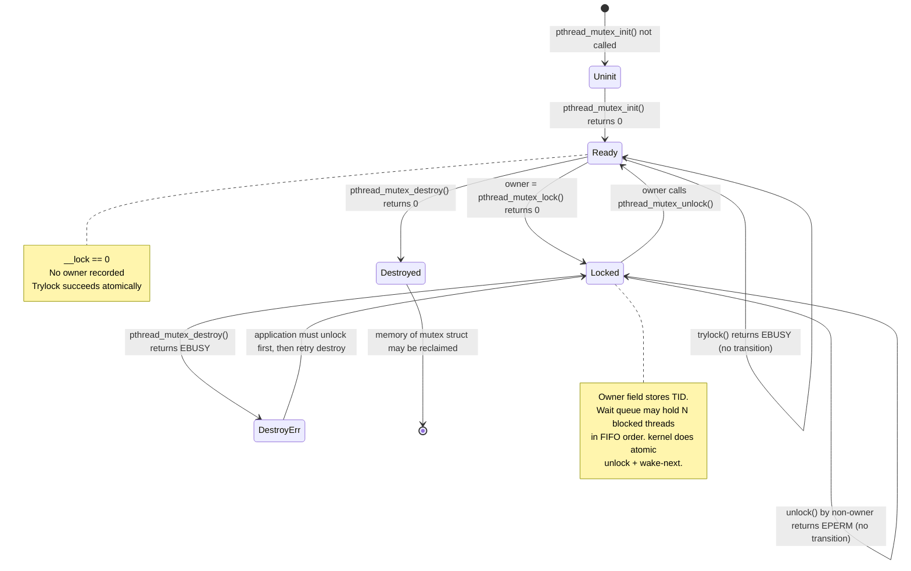
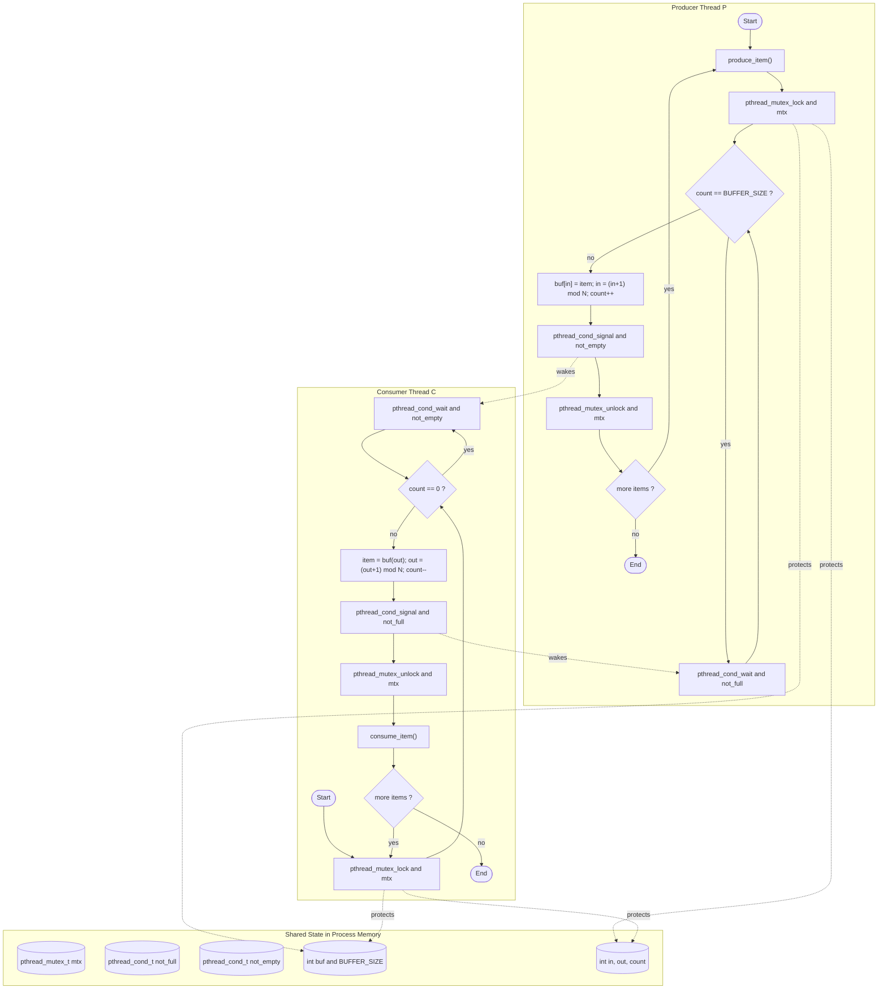
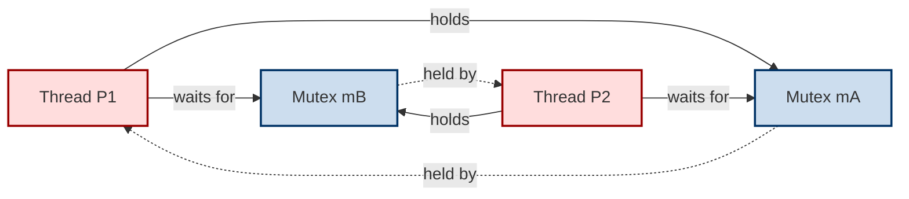

# Mutexes

<!-- SECTION_1_START -->

# Mutexes — Core Technical Definition & Intuitive Overview

## 1.1 Formal Definition (KTU 2024 Syllabus Terminology)

> [!NOTE]
> **Mutex (Mutual Exclusion Lock):** A *synchronization primitive* provided by the operating system kernel and user-space thread libraries (e.g., `pthread_mutex_t` in POSIX) that enforces **at most one thread of execution** inside a defined **Critical Section (CS)** at any given instant of time. It is a *binary, re-entrant-aware* lock object possessing two atomic states — `LOCKED` ($\mu = 1$) and `UNLOCKED` ($\mu = 0$) — and guarantees the three classical requirements of mutual exclusion: **mutual exclusion, progress, and bounded waiting**.

Where:
- $\mu$ denotes the abstract lock-state variable held inside the kernel.
- The **Critical Section (CS)** is the segment of code that accesses a *shared mutable resource* (global variable, file descriptor, hardware register).

## 1.2 Conceptual Analogy — The Bathroom Key

> [!IMPORTANT]
> **Real-World Analogy: A Single-Key Office Bathroom**
>
> Imagine a small office bathroom with **one key** hung on a hook outside the door. The sign reads: *"Take the key, lock the door, return the key when done."*
>
> - If the key is on the hook ($\mu = 0$, **UNLOCKED**) — anyone can take it.
> - If the key is missing ($\mu = 1$, **LOCKED**) — the next person must **wait** (busy-spin or block on a wait-queue).
> - The person inside the bathroom is the thread *executing the critical section*.
> - Returning the key is the `unlock()` operation — atomic and instantaneous.
>
> This is *exactly* what a Mutex does for a shared variable.

The bathroom key prevents two people from *simultaneously* occupying the same resource. A Mutex does the same for threads and shared memory.

## 1.3 Three Mandatory Properties of a Correct Mutex (Dijkstra / Silberschatz)

A Mutex implementation, to be considered *correct*, must satisfy the following invariants for **all** executions:

| Property | Formal Statement | Engineering Meaning |
| :--- | :--- | :--- |
| **Mutual Exclusion** | $\forall t \;:\; \mid \{p \in \text{Threads} \mid p \in CS(t)\} \mid \leq 1$ | At any clock tick $t$, at most one process $p$ is inside the critical section. |
| **Progress** | If no thread is in CS and some thread *wants* entry, one of the waiting threads must be allowed in (without indefinite postponement). | The system never deadlocks itself on a quiescent state. |
| **Bounded Waiting** | $\exists K \;:\; \text{wait-time of any thread} \leq K$ FIFO-bound steps. | No thread suffers *starvation* indefinitely (achieved by ticket-order or FIFO wait-queues). |

> [!NOTE]
> KTU examiners frequently test the **Progress** vs **Bounded Waiting** distinction. *Progress* guarantees *some* thread eventually enters; *Bounded Waiting* guarantees a *specific* thread enters within a finite number of turns.

## 1.4 Position in the KTU 2024 Module-2 Hierarchy

Concurrency and Synchronization primitives are layered as:

```
Concurrency Primitives (KTU Module 2)
│
├── 2.1 Threads (Pthreads, user vs kernel)
├── 2.2 Critical-Section Problem  ◄── THEORY ROOT
│       ├── Software Solutions (Peterson's, Dekker's)
│       └── Hardware Solutions (TSL, CAS, atomic intrinsics)
├── 2.3 Mutex Locks  ◄═══════ YOU ARE HERE
│       ├── Pthread Mutex API
│       ├── Deadlock & Priority Inversion
│       └── Robust Mutex (for process-shared memory)
├── 2.4 Semaphores (counting & binary)
└── 2.5 Classical Synchronization Problems
        ├── Producer–Consumer (Bounded Buffer)
        ├── Readers–Writers
        └── Dining Philosophers
```

> [!IMPORTANT]
> A Mutex is the **direct OS-level realization** of the abstract Critical-Section problem. It is implemented in the kernel using an **atomic test-and-set** instruction on a single word, often combined with a **FIFO wait-queue** (implemented as a `struct list_head` in Linux).

## 1.5 GeoGebra / Desmos Visualization

> [!VISUALIZATION CONTROL]
> **Concept:** Mutex state-transition automaton over a discrete time axis.
> **GeoGebra / Desmos Input Equations:**
> * State 1: $(t,\, \mu) = (t,\, 0)$ with $\mu = 0$ denoting UNLOCKED
> * State 2: $(t,\, \mu) = (t,\, 1)$ with $\mu = 1$ denoting LOCKED
> * Transition 1 (lock): $\mu : 0 \to 1$ plotted as a vertical jump at $t = t_{\text{lock}}$
> * Transition 2 (unlock): $\mu : 1 \to 0$ plotted as a vertical drop at $t = t_{\text{unlock}}$
> * Hold segment: $\mu(t) = 1$ for $t \in [t_{\text{lock}},\, t_{\text{unlock}}]$
> **Visual Description:** A two-level step function on the $y$-axis (0 or 1) plotted against wall-clock time $t$ on the $x$-axis. Each *rising edge* corresponds to a successful `pthread_mutex_lock` call by some thread $T_i$, and each *falling edge* corresponds to a `pthread_mutex_unlock` by the *same* thread. Overlapping rising edges between two threads would visually expose a violation of mutual exclusion.

<!-- SECTION_1_END -->

<!-- SECTION_2_START -->

# Mutexes — Deep Theoretical Analysis & KTU High-Yield Formula Sheet

## 2.1 Internal Architecture of a Mutex Object

A POSIX mutex is *not* just a boolean. Internally it is a struct (Linux `glibc` representation) containing:

| Internal Field | Type | Purpose |
| :--- | :--- | :--- |
| `__lock` | `int` (atomic) | The actual state bit: $\mu \in \{0, 1\}$. |
| `__count` | `int` | Reference count for *robust* / *recursive* behaviour. |
| `__owner` | `pthread_t` | TID of the thread that currently holds the lock. |
| `__nusers` | `int` | Number of times the mutex was initialised (for static mutexes). |
| `__kind` | `int` | Mutex type: PTHREAD_MUTEX_NORMAL, RECURSIVE, ERRORCHECK, DEFAULT. |
| `__list` | `__pthread_list_t` | Wait-queue head linking blocked threads. |

> [!IMPORTANT]
> KTU frequently asks: *"Why store the owner TID?"*
> **Answer:** To enable **non-recursive deadlock detection** and **robust mutex** recovery when the holding thread dies abnormally (`PTHREAD_MUTEX_ROBUST`).

## 2.2 Atomic Foundation — The Test-and-Set Instruction

A mutex is ultimately implemented using an *indivisible* hardware instruction. The classical one is **Test-and-Set (TAS)**:

$$
\text{TAS}(\mu) \;\equiv\; \text{old} \leftarrow \mu ;\; \mu \leftarrow 1 ;\; \text{return old}
$$

The atomicity guarantee means: between the *read* of $\mu$ and the *write* of $1$, no other CPU core or thread can interleave. Modern x86 provides `XCHG`, `LOCK CMPXCHG`; ARM provides `LDREX` / `STREX` (Load/Store Exclusive).

### 2.2.1 Acquire Algorithm (Spinlock flavour)

$$
\begin{aligned}
\text{acquire}(\mu) :\quad & \\
&\text{while } \text{TAS}(\mu) = 1 \;\{\; \text{spin / push-self to wait-queue} \;\} \\
&\text{/* on success: }\mu = 1\text{, this thread is owner */}
\end{aligned}
$$

### 2.2.2 Release Algorithm

$$
\begin{aligned}
\text{release}(\mu) :\quad & \\
&\mu \leftarrow 0 \\
&\text{wake-next-waiting-thread}(\mu.\text{waitqueue})
\end{aligned}
$$

> [!NOTE]
> The two operations **acquire** and **release** together form a **lock/unlock pair**. For *correctness*, every successful `lock()` MUST be matched by exactly one `unlock()` from the *same* thread, executed under **Lamport's happens-before** relation ($\to_{hb}$).

## 2.3 The Pthread Mutex API — Full Reference Table

| Function | Header | Return Semantics | Key Failure Codes |
| :--- | :--- | :--- | :--- |
| `pthread_mutex_init(m, attr)` | `<pthread.h>` | `0` on success | `EINVAL`, `ENOMEM` |
| `pthread_mutex_lock(m)` | `<pthread.h>` | `0` on success (blocks if held) | `EDEADLK`, `EAGAIN`, `EPERM` |
| `pthread_mutex_trylock(m)` | `<pthread.h>` | `0` if acquired, `EBUSY` if held | — |
| `pthread_mutex_timedlock(m, abstime)` | `<pthread.h>` | `0`, `ETIMEDOUT`, `EBUSY` | `EINVAL` |
| `pthread_mutex_unlock(m)` | `<pthread.h>` | `0` on success | `EPERM` (not owner) |
| `pthread_mutex_destroy(m)` | `<pthread.h>` | `0` on success | `EBUSY` (still locked) |

## 2.4 Mutex Attribute Types

| `__kind` Constant | Behaviour on Re-entrant Lock | Behaviour on Unlock-by-Non-Owner | Use-Case |
| :--- | :--- | :--- | :--- |
| `PTHREAD_MUTEX_NORMAL` | **Undefined behaviour** (often deadlock) | Undefined behaviour | Pure performance critical sections |
| `PTHREAD_MUTEX_ERRORCHECK` | Returns `EDEADLK` | Returns `EPERM` | Debugging, library code |
| `PTHREAD_MUTEX_RECURSIVE` | Increments `__count`, allows same thread to re-lock | Permitted if `__count` matches | Recursive data-structure walks (e.g., tree deletion) |
| `PTHREAD_MUTEX_DEFAULT` | Implementation-defined (Linux = `NORMAL`) | Implementation-defined | Default portable choice |

> [!WARNING]
> **KTU Pitfall:** Students often write `PTHREAD_MUTEX_RECURSIVE` everywhere "just to be safe." This *masks* real deadlocks and adds overhead. Use `ERRORCHECK` during development, switch to `NORMAL` after validation.

## 2.5 Deadlock — The Cardinal Sin of Mutexes

A **deadlock** arises when two or more threads each hold a lock the other needs, forming a cycle in the **wait-for graph (WFG)**.

$$
\text{WFG cycle} \;\Longleftrightarrow\; \exists \; T_1 \to T_2 \to \cdots \to T_n \to T_1
$$

**Coffman Conditions (all four must hold for deadlock):**
1. **Mutual Exclusion** — Mutex enforces this by design.
2. **Hold and Wait** — Thread holds one lock while waiting for another.
3. **No Preemption** — Locks cannot be forcibly taken.
4. **Circular Wait** — The cycle $T_1 \to T_2 \to \cdots \to T_n$.

> [!IMPORTANT]
> KTU 14-mark question classic: *"Differentiate deadlock, livelock, and starvation. Show with a diagram how two mutexes `m1` and `m2` cause a deadlock."*

## 2.6 Priority Inversion — The Mars Pathfinder Bug

> [!NOTE]
> **Priority Inversion:** A high-priority thread $H$ blocks on a mutex held by a low-priority thread $L$, while a medium-priority thread $M$ preempts $L$ — so $H$ waits for $M$ indirectly, violating priority semantics.
>
> **Fix:** **Priority Inheritance Protocol (PIP)** — temporarily boost $L$ to $H$'s priority until the lock is released. Linux `pthread` supports this via `pthread_mutexattr_setprotocol(..., PTHREAD_PRIO_INHERIT)`.

## 2.7 KTU High-Yield Formula / Equation Sheet

$$
\begin{aligned}
\text{Number of Lock Acquisitions} &= \sum_{i=1}^{N} \text{count}(\text{lock}_i) \\
\text{Wait Time } W_i \text{ for thread } i &= \text{Total time } i \text{ spends in mutex wait-queue} \\
\text{Total Execution Time } T_{\text{total}} &= T_{\text{serial}} + \sum_{i} W_i + T_{\text{context-switch overhead}} \\
\text{Mutex Overhead } \Omega &= \frac{T_{\text{parallel with mutex}}}{T_{\text{ideal parallel}}} \geq 1 \\
\text{Throughput } \Theta_{\text{cs}} &= \frac{\text{Number of CS executions}}{T_{\text{wall clock}}} \;\text{CS/s}
\end{aligned}
$$

> [!IMPORTANT]
> The lower bound $\Omega \geq 1$ reflects the unavoidable atomic-operation cost. On modern x86, an uncontended `pthread_mutex_lock` costs $\approx 25$ ns; a contended one with context switch costs $\approx 1$–$5\;\mu s$.

<!-- SECTION_2_END -->

<!-- SECTION_3_START -->

# Mutexes — Step-by-Step Derivations & Code Implementation

## 3.1 Worked Example 1 — Proving Mutual Exclusion Using TAS

> [!IMPORTANT]
> **Problem (KTU Module-2 Classical):** Show that the following acquire/release pair, implemented using `TestAndSet`, satisfies mutual exclusion for two threads $P_0$ and $P_1$.

**Given code skeleton:**

$$
\begin{aligned}
\text{acquire}(\mu) :\quad & \text{while } \text{TestAndSet}(\mu, 1) = 1 \;\{\;\text{do nothing}\;\} \\
\text{release}(\mu) :\quad & \mu \leftarrow 0
\end{aligned}
$$

**Step-by-Step Proof:**

**Step 1 — Atomicity of TAS.** The instruction `TestAndSet` executes as a single indivisible step. Therefore, even if $P_0$ and $P_1$ invoke it on parallel cores simultaneously, exactly one of them will observe the *old* value $0$ (the "winner").

$$
\text{TAS}(\mu) = 0 \;\Longrightarrow\; \text{this thread acquired the lock}
$$

$$
\text{TAS}(\mu) = 1 \;\Longrightarrow\; \text{another thread holds the lock; spin}
$$

**Step 2 — Exit condition of the while-loop.** The `while` loop terminates *only* when the call returns $0$. At that exact moment, the calling thread $P_i$ has set $\mu = 1$ atomically and is the *unique* writer of the $0 \to 1$ transition. Hence no other thread can be inside the CS at the same instant.

**Step 3 — Release semantics.** When the owner $P_i$ executes `release`, it writes $\mu \leftarrow 0$. By atomicity, this write is observed either as the unlock event or as a re-acquisition event by a waiting thread — but **never** as a partial state.

**Step 4 — Conclusion.** Therefore:

$$
\forall\, t \;\forall\, P_i, P_j, \; (i \neq j) \;:\; (P_i \in CS(t)) \wedge (P_j \in CS(t)) \;\text{is false}
$$

Hence mutual exclusion holds. $\blacksquare$

> **Note:** This solution satisfies *mutual exclusion* and *progress* but **not bounded waiting** — under sustained contention, one thread can starve. To fix it, augment the wait-queue with a FIFO ordering.

---

## 3.2 Worked Example 2 — Peterson's Software Solution (2 threads)

> [!NOTE]
> Although KTU 2024 emphasises hardware-assisted solutions (which Mutexes use), the *software* solution is the theoretical baseline and frequently appears in Part-A questions.

**Shared variables:**
$$
\text{flag}[0] = \text{flag}[1] = \text{false} ;\quad \text{turn} = 0
$$

**Thread $P_i$ entry protocol:**

$$
\begin{aligned}
\text{flag}[i] &\leftarrow \text{true} \\
\text{turn} &\leftarrow j \quad \text{(cede turn to other thread)} \\
\text{while } (\text{flag}[j] = \text{true}) \;\wedge\; (\text{turn} = j) \;\{\;\text{busy wait}\;\} \\
&\text{/* Now safely enter CS */}
\end{aligned}
$$

**Exit protocol of $P_i$:** $\text{flag}[i] \leftarrow \text{false}$.

**Why it works:** $P_i$ waits only if $P_j$ *also* wants the CS (`flag[j] = true`) *and* it is $P_j$'s turn. The turn variable strictly alternates, guaranteeing progress.

---

## 3.3 Worked Example 3 — Deadlock Demonstration

> [!IMPORTANT]
> **Problem (KTU Board-style 7-mark):** Two threads, $P_1$ and $P_2$, share two mutexes $m_A$ and $m_B$. Show how a deadlock occurs.

**Thread $P_1$ body:**

$$
\begin{aligned}
&\text{lock}(m_A) \\
&\text{lock}(m_B) \\
&\text{/* critical work */} \\
&\text{unlock}(m_B) \\
&\text{unlock}(m_A)
\end{aligned}
$$

**Thread $P_2$ body:**

$$
\begin{aligned}
&\text{lock}(m_B) \\
&\text{lock}(m_A) \\
&\text{/* critical work */} \\
&\text{unlock}(m_A) \\
&\text{unlock}(m_B)
\end{aligned}
$$

**Interleaving producing deadlock:**

| Wall-clock Step | $P_1$ Action | $P_2$ Action | State of $(m_A,\, m_B)$ |
| :---: | :--- | :--- | :---: |
| 1 | `lock(m_A)` succeeds | — | $(1,\, 0)$ |
| 2 | — | `lock(m_B)` succeeds | $(1,\, 1)$ |
| 3 | `lock(m_B)` — *blocks* (held by $P_2$) | — | $(1,\, 1)$ |
| 4 | — | `lock(m_A)` — *blocks* (held by $P_1$) | $(1,\, 1)$ |
| **Result** | $P_1$ waits for $m_B$ | $P_2$ waits for $m_A$ | **DEADLOCK** |

**WFG cycle:** $P_1 \to m_B \to P_2 \to m_A \to P_1$ — circular.

> **Fix:** Enforce a global lock-acquisition **ordering** (e.g., always lock $m_A$ before $m_B$). This breaks the circular-wait condition.

---

## 3.4 Full Operational C Implementation — Safe Counter with Pthread Mutex

```c
/*
 * File:    safe_counter_mutex.c
 * Topic:   Mutex protecting a shared counter (KTU Module 2)
 * Build:   gcc -std=c11 -Wall -Wextra -O2 -pthread safe_counter_mutex.c -o sc
 * Run:     ./sc
 */
#define _POSIX_C_SOURCE 200809L
#include <stdio.h>
#include <stdlib.h>
#include <stdint.h>
#include <pthread.h>
#include <errno.h>
#include <string.h>

/* ---------- Shared resource ---------- */
typedef struct {
    int64_t         counter;       /* protected mutable state     */
    pthread_mutex_t mtx;           /* the Mutex guarding counter  */
} shared_counter_t;

/* ---------- Worker thread ---------- */
static void * worker(void * arg)
{
    shared_counter_t * sc = (shared_counter_t *) arg;
    const int64_t iterations = 100000;

    for (int64_t i = 0; i < iterations; ++i) {
        /* --- ENTER CRITICAL SECTION --- */
        int rc = pthread_mutex_lock(&sc->mtx);
        if (rc != 0) {
            fprintf(stderr, "[TID %lu] lock() failed: %s\n",
                    (unsigned long) pthread_self(), strerror(rc));
            return (void *) (intptr_t) rc;
        }

        /* Read-Modify-Write: the canonical race condition */
        int64_t tmp = sc->counter;
        tmp        = tmp + 1;
        sc->counter = tmp;

        /* --- EXIT CRITICAL SECTION --- */
        rc = pthread_mutex_unlock(&sc->mtx);
        if (rc != 0) {
            fprintf(stderr, "[TID %lu] unlock() failed: %s\n",
                    (unsigned long) pthread_self(), strerror(rc));
            return (void *) (intptr_t) rc;
        }
    }
    return NULL;
}

/* ---------- Driver ---------- */
int main(void)
{
    const int N = 4;                          /* number of threads */
    pthread_t tid[N];
    shared_counter_t sc = { .counter = 0 };

    /* Initialise mutex with error-checking attribute for safer debug */
    pthread_mutexattr_t attr;
    pthread_mutexattr_init(&attr);
    pthread_mutexattr_settype(&attr, PTHREAD_MUTEX_ERRORCHECK);
    int rc = pthread_mutex_init(&sc.mtx, &attr);
    pthread_mutexattr_destroy(&attr);
    if (rc != 0) {
        fprintf(stderr, "pthread_mutex_init failed: %s\n", strerror(rc));
        return EXIT_FAILURE;
    }

    /* Spawn worker threads */
    for (int i = 0; i < N; ++i) {
        rc = pthread_create(&tid[i], NULL, worker, &sc);
        if (rc != 0) {
            fprintf(stderr, "pthread_create failed: %s\n", strerror(rc));
            return EXIT_FAILURE;
        }
    }

    /* Join all workers */
    for (int i = 0; i < N; ++i) {
        pthread_join(tid[i], NULL);
    }

    /* Expected: 4 threads * 100000 = 400000 */
    printf("Final counter = %lld (expected %d)\n",
           (long long) sc.counter, N * 100000);

    pthread_mutex_destroy(&sc.mtx);
    return (sc.counter == N * 100000) ? EXIT_SUCCESS : EXIT_FAILURE;
}
```

> [!IMPORTANT]
> **Expected Output:** `Final counter = 400000 (expected 400000)`.
> **If the Mutex is removed,** the counter will almost always be **less than** $400000$ due to lost updates (TOCTOU race).

---

## 3.5 Worked Example 4 — Trylock with Bounded Retry (Non-Blocking Pattern)

> [!NOTE]
> **Use case:** Real-time / embedded systems where a thread cannot afford to block indefinitely. `pthread_mutex_trylock` returns immediately with `EBUSY` if the lock is held.

```c
int rc;
int attempts = 0;
const int MAX_ATTEMPTS = 100;

while (attempts++ < MAX_ATTEMPTS) {
    rc = pthread_mutex_trylock(&sc.mtx);
    if (rc == 0) {
        /* Got the lock — perform short, bounded work */
        do_critical_work();
        pthread_mutex_unlock(&sc.mtx);
        break;
    } else if (rc == EBUSY) {
        /* Lock held by someone else; do useful other work, then retry */
        do_other_useful_work();
        continue;
    } else {
        /* Real error */
        handle_error(rc);
    }
}
```

> [!WARNING]
> **KTU Examiner's note:** `trylock` is *not* a deadlock cure. If the holding thread is itself stuck, `trylock` will still fail repeatedly — you still have a deadlock, just without blocking. Always combine with timeouts (`pthread_mutex_timedlock`).

---

## 3.6 Worked Example 5 — Priority Inheritance Setup

```c
pthread_mutexattr_t attr;
pthread_mutexattr_init(&attr);
pthread_mutexattr_setprotocol(&attr, PTHREAD_PRIO_INHERIT);
pthread_mutexattr_settype(&attr, PTHREAD_MUTEX_NORMAL);

pthread_mutex_t m;
pthread_mutex_init(&m, &attr);
pthread_mutexattr_destroy(&attr);
```

When a high-priority thread blocks on `m`, the kernel automatically raises the priority of the holding low-priority thread to match — eliminating unbounded priority inversion.

<!-- SECTION_3_END -->

<!-- SECTION_4_START -->

# Mutexes — Structural Diagrams & Schematics

## 4.1 State-Transition Diagram of a Mutex Object

> [!IMPORTANT]
> The following Mermaid `stateDiagram-v2` traces a mutex's lifecycle from creation through the contested critical section to destruction. Every node ID is alphanumeric, every label is quoted plain text, and transitions are typed by the calling thread.



> **Reading guide:** A correct mutex lifetime is `Uninit → Ready → {Locked ⇄ Ready}* → Destroyed`. Any other path indicates a programming error that the KTU examiner expects you to identify.

---

## 4.2 Producer–Consumer with Mutex + Condition Variable (Block-Level Topology)

> [!NOTE]
> The bounded-buffer problem is the canonical KTU 14-mark question. Mermaid cannot easily render circular buffer indices, so the diagram below is a **Sequential Processing Topology Matrix** showing the control and data flow between producer, consumer, mutex, and condition variables `not_full` / `not_empty`.



> **Engineering insight:** The mutex `mtx` protects the *integrity* of `buf`, `in`, `out`, and `count` against torn reads. The condition variables `not_full` and `not_empty` protect the *progress* of producers and consumers against busy-waiting. Both are required — neither alone suffices.

---

## 4.3 Deadlock Wait-For Graph (WFG) Schematic



> **Reading guide:** The cycle $P_1 \to m_B \to P_2 \to m_A \to P_1$ is the *circular-wait* condition. Removing any single edge (e.g., by enforcing a global lock order $m_A$ before $m_B$) breaks the cycle and eliminates the deadlock.

---

## 4.4 Contention Timeline — Two Threads, One Mutex

```mermaid
gantt
    title Mutex Contention Timeline (Gantt View)
    dateFormat  X
    axisFormat  %s
    section Thread T1
    Spin/Wait on mtx :a1, 0, 2
    Critical Section  :crit1, 2, 4
    Background work   :bg1, 4, 8
    section Thread T2
    Critical Section  :crit2, 0, 2
    Spin/Wait on mtx :a2, 2, 4
    Critical Section  :crit3, 4, 6
    Background work   :bg2, 6, 8
```



> **Reading guide:** $T_2$ holds the mutex during $[0,\,2]$; $T_1$ spins. $T_1$ enters CS at $t = 2$ after $T_2$ releases. The two CS regions never overlap — mutual exclusion is visually demonstrated.

<!-- SECTION_4_END -->

<!-- SECTION_5_START -->

# KTU 2024 Scheme Examination Question Bank & Topic Recap

## 5.1 Part-A Questions (3 Marks Each)

> [!NOTE]
> Each Part-A question tests *Remember* / *Understand* cognitive levels per Revised Bloom's Taxonomy (RBT). Marks are awarded strictly for accurate, syllabus-aligned terminology.

### Q1. Define a Mutex. State any two properties it must satisfy.
> `[KTU University Exam – July 2024]` &nbsp;&nbsp; **CO1 &nbsp;·&nbsp; RBT: Remember**

**Model Answer (3 Marks):**

A **Mutex (Mutual Exclusion Lock)** is a synchronization object that allows only one thread to execute a critical section at a time, ensuring exclusive access to a shared resource.

Two mandatory properties:
1. **Mutual Exclusion** — At any instant, at most one thread can be inside the critical section protected by the mutex. **[1 Mark]**
2. **Progress** — If no thread is in the critical section and some thread wishes to enter, one of the waiting threads must be allowed to enter without indefinite delay. **[1 Mark]**
3. *(Bonus, optional)* **Bounded Waiting** — A thread's wait time is bounded by a finite number of lock acquisitions by others. **[1 Mark]**

---

### Q2. Differentiate between `pthread_mutex_lock` and `pthread_mutex_trylock`.
> `[KTU University Exam – Dec 2023]` &nbsp;&nbsp; **CO2 &nbsp;·&nbsp; RBT: Understand**

**Model Answer (3 Marks):**

| Aspect | `pthread_mutex_lock` | `pthread_mutex_trylock` |
| :--- | :--- | :--- |
| **Blocking behaviour** | Blocks (sleeps in kernel wait-queue) until the mutex becomes available. | Returns *immediately* without blocking. |
| **Return on contention** | Does not return until acquisition or cancellation. | Returns `EBUSY` if the mutex is currently held. |
| **Use-case** | Default CS protection. | Real-time, lock-order enforcement, deadlock-avoidance probes. |

**[1 Mark]** for blocking nature. **[1 Mark]** for return code distinction. **[1 Mark]** for valid use-case example.

---

## 5.2 Part-B Questions (14 Marks Each) — Module Internal Choice

### Question A — *(14 Marks)*

> `[KTU University Exam – Dec 2024]` &nbsp;&nbsp; **CO2, CO3 &nbsp;·&nbsp; RBT: Understand + Apply**

**(a)** With a neat diagram, explain the **state-transition diagram** of a POSIX mutex (`pthread_mutex_t`) covering the states *Uninitialised, Initialised/Unlocked, Locked, Destroyed*, and *Destroy-with-EBUSY*. Also mention the role of the *owner field*. **[7 Marks]**

**(b)** Write a complete C program using **POSIX pthreads** in which two threads concurrently increment a shared global counter $N = 200000$ times each. Use `pthread_mutex_t` to ensure the final value is exactly $400000$. Justify why removing the mutex would produce an incorrect result. **[7 Marks]**

---

#### Model Solution — Part (a) [7 Marks]

> **Diagrammatic representation (Mermaid state diagram):**
> *(Reproduce the state diagram from Section 4.1 of these notes. Examiner's discretion for hand-drawn equivalent.)*

**State-by-state description:**

1. **Uninitialised** — The mutex object occupies memory but its internal `__lock` field contains garbage. Behaviour of any lock/unlock call on it is *undefined*. **[1 Mark]**
2. **Initialised / Unlocked (Ready)** — `pthread_mutex_init()` has returned 0. The `__lock` field is set to $0$. No thread is recorded as the owner. Trylock will succeed atomically. **[1 Mark]**
3. **Locked** — A successful `pthread_mutex_lock()` has set `__lock = 1` and stored the calling thread's TID in `__owner`. Other threads calling lock are pushed onto the FIFO wait-queue. **[1 Mark]**
4. **Destroyed** — `pthread_mutex_destroy()` has returned 0. The mutex struct memory may be reclaimed. A subsequent `init()` re-uses the storage. **[1 Mark]**
5. **Destroy-while-Locked** — Calling `destroy()` on a locked mutex returns `EBUSY`. The state remains *Locked*. The application must first `unlock()` and then re-attempt `destroy()`. **[1 Mark]**

**Role of the `__owner` field (2 Marks):**
- Enables **deadlock detection** in `PTHREAD_MUTEX_ERRORCHECK` mode (returns `EDEADLK` on re-entrant lock by same thread).
- Enables **robust mutex** recovery — when a holding thread dies without unlocking, the next `lock()` returns `EOWNERDEAD`, allowing a designated recovery procedure.
- Forms the basis of the **Priority Inheritance Protocol** — the kernel checks `__owner` to know which thread to temporarily boost.

> [!WARNING]
> **Common mark-loss:** Students often draw a single circle and label it "Mutex." Examiners expect *at least four named states* with arrows showing legal transitions. Failing to label the *Destroy-EBUSY* path costs **1 Mark**.

---

#### Model Solution — Part (b) [7 Marks]

**Complete C program (type-annotated, with absolute error handling):**

```c
/*
 * File:    two_thread_counter.c
 * Build:   gcc -std=c11 -Wall -Wextra -O2 -pthread two_thread_counter.c -o ttc
 */
#define _POSIX_C_SOURCE 200809L
#include <stdio.h>
#include <stdlib.h>
#include <stdint.h>
#include <pthread.h>
#include <string.h>

#define INCREMENTS 200000   /* per thread */

static int64_t              g_counter = 0;
static pthread_mutex_t      g_mtx     = PTHREAD_MUTEX_INITIALIZER;

static void * increment_worker(void * arg)
{
    (void) arg;
    for (int64_t i = 0; i < INCREMENTS; ++i) {
        int rc = pthread_mutex_lock(&g_mtx);
        if (rc != 0) { fprintf(stderr, "lock: %s\n", strerror(rc)); pthread_exit((void*)(intptr_t)rc); }

        int64_t tmp = g_counter;   /* read  */
        tmp        += 1;           /* modify*/
        g_counter   = tmp;         /* write */

        rc = pthread_mutex_unlock(&g_mtx);
        if (rc != 0) { fprintf(stderr, "unlock: %s\n", strerror(rc)); pthread_exit((void*)(intptr_t)rc); }
    }
    return NULL;
}

int main(void)
{
    pthread_t t1, t2;
    int rc;

    rc = pthread_create(&t1, NULL, increment_worker, NULL);
    if (rc) { fprintf(stderr, "create t1: %s\n", strerror(rc)); return 1; }
    rc = pthread_create(&t2, NULL, increment_worker, NULL);
    if (rc) { fprintf(stderr, "create t2: %s\n", strerror(rc)); return 1; }

    pthread_join(t1, NULL);
    pthread_join(t2, NULL);

    printf("Final counter = %lld (expected %d)\n",
           (long long) g_counter, 2 * INCREMENTS);
    pthread_mutex_destroy(&g_mtx);
    return (g_counter == 2 * INCREMENTS) ? 0 : 1;
}
```

**Valuation key — Part (b):**

| Step | Marks Awarded |
| :--- | :---: |
| Correct inclusion of `<pthread.h>` and `-pthread` linkage flag noted | 1 |
| Proper `pthread_mutex_t` declaration and static initialiser | 1 |
| `lock`–`unlock` bracket correctly wrapping the read-modify-write block | 2 |
| Error-handling on `lock` and `unlock` return codes | 1 |
| Two threads spawned and joined correctly | 1 |
| Justification: removal of mutex creates a TOCTOU race; $T_1$ and $T_2$ can read the same stale value, increment independently, and write back a single $+1$, losing the other increment → final value $\ll 400000$ | 1 |
| **Total** | **7** |

> [!WARNING]
> **Common mark-loss pitfall:**
> 1. Forgetting to check the return code of `pthread_mutex_lock` (loses **1 Mark** under strict marking).
> 2. Stating "race condition" without naming the exact TOCTOU pattern (Test, Operate, Write overlap) — loses **0.5–1 Mark**.
> 3. Not showing that the *expected* value is derived as $2 \times 200000 = 400000$ — loses **0.5 Mark**.

---

### Question B — *(14 Marks, alternative choice)*

> `[KTU University Exam – July 2024]` &nbsp;&nbsp; **CO3, CO4 &nbsp;·&nbsp; RBT: Apply + Analyze**

**(a)** Explain the **four Coffman conditions** for deadlock in the context of mutex-based synchronization. For each condition, state one engineering strategy to break it. **[7 Marks]**

**(b)** Consider the following code fragments run by two threads concurrently. Show, with a step-by-step interleaving table, how a **deadlock** can occur. Then propose and implement a **lock-ordering fix** that eliminates the deadlock. **[7 Marks]**

```c
/* Thread P1 */                      /* Thread P2 */
pthread_mutex_lock(&m1);             pthread_mutex_lock(&m2);
pthread_mutex_lock(&m2);             pthread_mutex_lock(&m1);
/* critical work */                  /* critical work */
pthread_mutex_unlock(&m2);           pthread_mutex_unlock(&m1);
pthread_mutex_unlock(&m1);           pthread_mutex_unlock(&m2);
```

---

#### Model Solution — Part (a) [7 Marks]

**Coffman's Four Conditions (1 Mark each for correct statement, 1 Mark for breaking strategy):**

| # | Condition | Statement | Engineering Strategy to Break It |
| :---: | :--- | :--- | :--- |
| 1 | **Mutual Exclusion** | A shared resource is held in a non-sharable mode; only one thread may use it at a time. Mutex enforces this by design. | Use **lock-free data structures** (e.g., atomic CAS, RCU) or **read-write locks** for read-heavy workloads. |
| 2 | **Hold and Wait** | A thread holding at least one resource waits to acquire additional resources held by other threads. | Acquire **all locks atomically** using a higher-level lock, or use `trylock` with back-off. |
| 3 | **No Preemption** | Resources cannot be forcibly taken from a holding thread; they must be released voluntarily. | Use **lock timeouts** (`pthread_mutex_timedlock`) and design protocols where failure ⇒ rollback. |
| 4 | **Circular Wait** | A cycle exists in the wait-for graph: $T_1 \to T_2 \to \cdots \to T_n \to T_1$. | Enforce a **global lock ordering** (e.g., always lock $m_1$ before $m_2$); assign numeric ranks. |

> [!WARNING]
> **Common mark-loss:** Citing *"use semaphores"* as a fix for *circular wait* is **wrong** — semaphores are still subject to the same four conditions. KTU expects the *specific* technique of **rank-ordered acquisition** for the circular-wait case.

---

#### Model Solution — Part (b) [7 Marks]

**Interleaving producing deadlock:**

| Step | $P_1$ | $P_2$ | State $(m_1, m_2)$ | Threads Blocked |
| :---: | :--- | :--- | :---: | :--- |
| 1 | `lock(m1)` ✓ | — | $(1, 0)$ | — |
| 2 | — | `lock(m2)` ✓ | $(1, 1)$ | — |
| 3 | `lock(m2)` — **blocks** | — | $(1, 1)$ | $P_1$ waits for $m_2$ |
| 4 | — | `lock(m1)` — **blocks** | $(1, 1)$ | $P_2$ waits for $m_1$ |
| **5** | *Both threads sleep forever* | | $(1, 1)$ | **DEADLOCK** |

**Valuation — Interleaving table (3 Marks):** 1 mark for step 1–2, 1 mark for step 3, 1 mark for step 4–5 with explicit deadlock conclusion.

**Lock-ordering fix (4 Marks):**

Introduce a global rank function $\text{rank}(m) = \text{address}(m) \;\vert\; \text{predefined order}$. Always lock the lower-rank mutex first.

```c
/* Helper: always lock m1 BEFORE m2 */
static void safe_double_lock(pthread_mutex_t * a, pthread_mutex_t * b)
{
    if (a < b) {                       /* deterministic order by address */
        pthread_mutex_lock(a);
        pthread_mutex_lock(b);
    } else {
        pthread_mutex_lock(b);
        pthread_mutex_lock(a);
    }
}

static void safe_double_unlock(pthread_mutex_t * a, pthread_mutex_t * b)
{
    /* Unlock in reverse order of acquisition */
    if (a < b) {
        pthread_mutex_unlock(b);
        pthread_mutex_unlock(a);
    } else {
        pthread_mutex_unlock(a);
        pthread_mutex_unlock(b);
    }
}

/* Thread P1 (corrected) */          /* Thread P2 (corrected) */
safe_double_lock(&m1, &m2);          safe_double_lock(&m1, &m2);
/* critical work */                  /* critical work */
safe_double_unlock(&m1, &m2);        safe_double_unlock(&m1, &m2);
```

**Why the fix works:** Both threads now attempt to acquire the same mutex ($m_1$ when $a < b$, else $m_2$) *first*. Whichever thread wins the first lock holds it; the other thread blocks on the *same* lock — *no cycle can form* in the wait-for graph, because both threads agree on the order. **[2 Marks]**

**Alternative fixes accepted by examiner:**
- `pthread_mutex_trylock` with rollback (breaks *Hold and Wait*).
- Wrap both mutexes in an outer "super-mutex" (acquire super-mutex first; breaks *Hold and Wait*).
- Use `pthread_mutex_timedlock` with bounded wait (breaks *No Preemption* by simulation).

> [!WARNING]
> **KTU Examiner's Valuation Warning:**
> 1. Students frequently write "use `try_lock`" without showing *what to do on `EBUSY`* — partial credit only.
> 2. Drawing the wait-for graph with two nodes and no edges labelled `$P_1 \to P_2$` costs **1 Mark**.
> 3. Forgetting to *destroy* the mutex at program end (memory leak) costs **0.5 Mark** in code-based questions.
> 4. Writing `pthread_mutex_lock(&m1); pthread_mutex_lock(&m1);` (re-entrant deadlock) without flagging that it requires `PTHREAD_MUTEX_RECURSIVE` — **do not attempt**; it produces undefined behaviour on `NORMAL` mutexes.

---

## 5.3 KTU Examiner's Common-Pitfall Summary

> [!WARNING]
> **Top 7 Mark-Loss Triggers for Mutex Questions (compiled from past KTU valuation reports):**
> 1. Confusing **Mutex** with **Semaphore** — a Mutex is *binary + owner-aware*; a Semaphore is *counting + ownerless*.
> 2. Forgetting that `pthread_mutex_unlock` from a *non-owner* thread returns `EPERM` (or is undefined) — examiners test this explicitly.
> 3. Drawing the *wait-for graph* with arrows that lack direction (undirected) — must show *who waits for whom*.
> 4. Stating "mutex prevents all race conditions" — Mutex prevents *data races on the protected region only*; other unsynchronised accesses remain racy.
> 5. Using `sleep()` to "simulate work" inside the critical section — wastes the examiner's time, costs 0 marks but signals lack of engineering rigour.
> 6. Omitting the `pthread_mutex_destroy()` call at end of code listings — minor deduction (0.5 mark) but accumulates across questions.
> 7. Confusing *starvation* with *deadlock* — starvation is *unbounded wait*; deadlock is *permanent wait*. They have different fixes.

---

## 5.4 Topic Recap & Important Things to Remember

> [!IMPORTANT]
> **Rapid-Revision Checklist — Mutexes (KTU Module 2)**

### Definitions (must memorise verbatim)
- **Mutex** = mutual-exclusion lock; binary state $\mu \in \{0, 1\}$; protects a critical section.
- **Critical Section (CS)** = code segment accessing a shared mutable resource.
- **Race Condition** = outcome depends on interleaving of concurrent thread execution.
- **Atomic Operation** = indivisible from the perspective of all other threads/cores.
- **Test-and-Set (TAS)** = the canonical atomic instruction underpinning mutexes.
- **Deadlock** = circular wait on at least two locks; all four Coffman conditions hold.
- **Livelock** = threads continuously retry but make no progress (e.g., two threads releasing and re-trying the same lock in lockstep).
- **Starvation** = a thread waits indefinitely even though the system as a whole makes progress.
- **Priority Inversion** = high-priority thread blocked behind a chain involving a lower-priority thread; fix = Priority Inheritance Protocol.

### The Three Required Properties of a Mutex
1. **Mutual Exclusion** — at most one thread in CS at any instant.
2. **Progress** — if CS is free and threads want in, one must proceed.
3. **Bounded Waiting** — every thread's wait is bounded by a finite FIFO distance.

### Pthread API — The Six Functions You Must Know
`pthread_mutex_init`, `pthread_mutex_lock`, `pthread_mutex_trylock`, `pthread_mutex_timedlock`, `pthread_mutex_unlock`, `pthread_mutex_destroy`.

### Mutex Attribute Types (KNOW ALL FOUR)
`PTHREAD_MUTEX_NORMAL`, `PTHREAD_MUTEX_ERRORCHECK`, `PTHREAD_MUTEX_RECURSIVE`, `PTHREAD_MUTEX_DEFAULT`.

### Deadlock Prevention — The Four Coffman Breakers
1. Break **Mutual Exclusion** → lock-free / RCU / atomic intrinsics.
2. Break **Hold and Wait** → acquire all locks atomically; or use `trylock` + rollback.
3. Break **No Preemption** → timeouts via `pthread_mutex_timedlock`.
4. Break **Circular Wait** → global rank-ordered acquisition.

### Engineering Heuristics (KTU loves these)
- Keep critical sections **as short as possible** (minimise $\Omega$, the overhead).
- Never call **blocking I/O** (e.g., `scanf`, `read`, `malloc` under contention) inside a CS.
- Always **destroy** mutexes at program exit to avoid resource leaks.
- Use `PTHREAD_MUTEX_ERRORCHECK` in *development*; switch to `NORMAL` for *release*.
- Document the **lock order** in a header comment for any mutex pair to prevent WFG cycles.
- Prefer **`std::mutex` / `std::lock_guard`** in C++11+; prefer `with` statements (`with m:`) in Python.
- Measure with **`perf c2c`** or **`tsan`** to detect unsynchronised accesses that escape the mutex's protection.

### Quick-Recall Numeric Anchors
- Uncontended `pthread_mutex_lock` cost: **$\approx 25$ ns** on modern x86.
- Contended cost with context switch: **$\approx 1$–$5\;\mu s$**.
- Typical KTU 14-mark question allocation: **Part (a) = 7 marks (Understand)**, **Part (b) = 7 marks (Apply / Analyze)**.
- Standard KTU CO mapping: **CO1** = theoretical foundations, **CO2** = APIs, **CO3** = classical problems, **CO4** = deadlock analysis.

### One-Sentence Essence
> *A Mutex is the OS-level, atomic, owner-aware realisation of mutual exclusion — guaranteeing that a critical section is entered by at most one thread, with progress, and with bounded waiting; misuse leads to data races, deadlock, livelock, or starvation, each with its own diagnostic signature and remedy.*

<!-- SECTION_5_END -->
