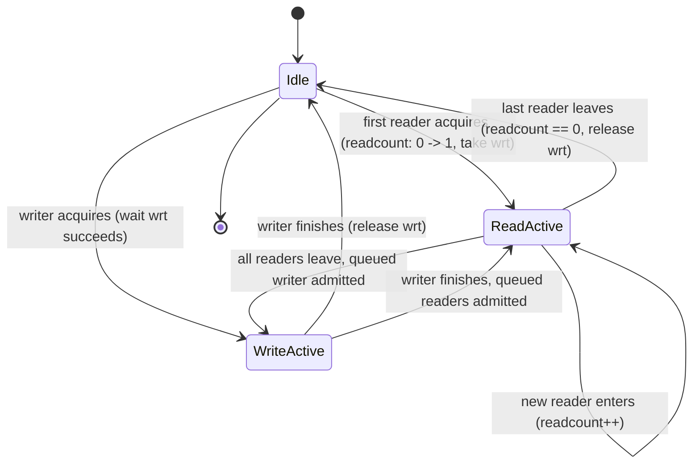
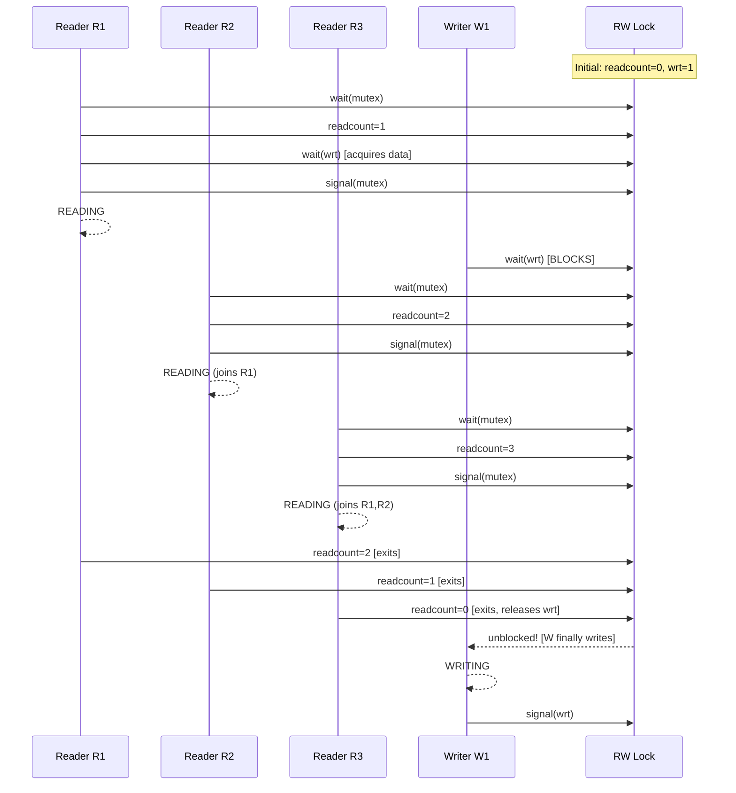
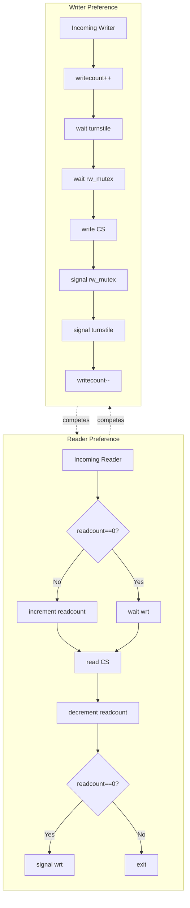
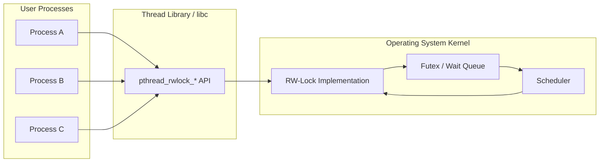
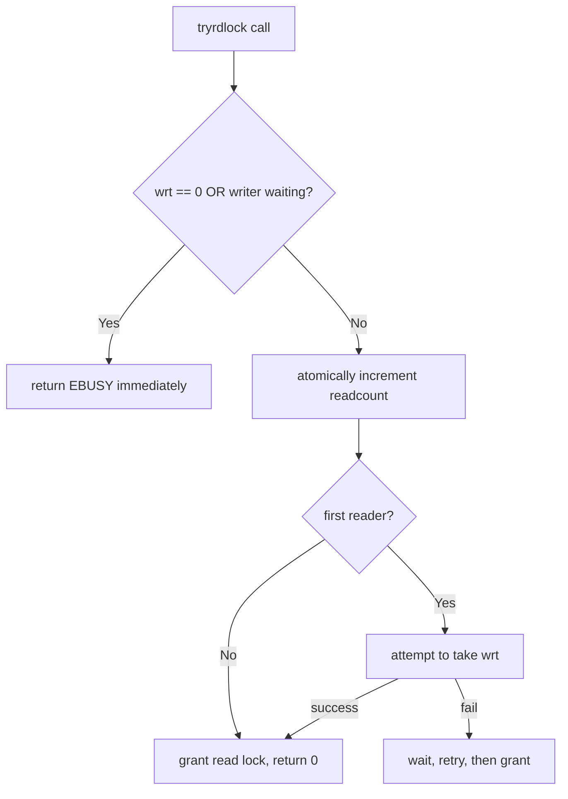

# Reader-Writer Locks

<!-- SECTION_1_START -->
# Reader-Writer Locks — Core Technical Definition & Intuitive Overview

## 1.1 Formal Definition (KTU 2024 Syllabus Terminology)

> [!IMPORTANT]
> **Reader-Writer Lock (RW-Lock)** is a synchronization primitive used in concurrent programming that permits **multiple threads to simultaneously hold a read (shared) lock** on a protected object, while still guaranteeing that **only a single thread may hold a write (exclusive) lock** at any given instant. When a writer is active, all readers and other writers are blocked. This primitive solves the classic *shared-resource access* problem where reads are non-mutating and safe to parallelize, but writes demand strict mutual exclusion.

Formally, a Reader-Writer lock maintains two disjoint access classes:

- **Readers** (acquire *shared* / *read* lock) — may coexist.
- **Writers** (acquire *exclusive* / *write* lock) — must be alone.

The lock enforces the following invariant at every observable instant:

$$\text{Cardinality}(\text{ActiveWriters}) \in \{0, 1\} \;\;\land\;\; \text{Cardinality}(\text{ActiveReaders}) \geq 0 \;\;\land\;\; \neg(\text{ActiveReaders} > 0 \;\land\; \text{ActiveWriters} = 1)$$

This single line is the entire correctness contract that any RW-lock implementation must preserve.

## 1.2 Conceptual Analogy — The Library Reference Section

Imagine a small library reading room containing **one rare manuscript**:

- **Reading the manuscript** is safe for many people simultaneously — ten people can read the same page at the same time, and no one corrupts the page.
- **Editing / annotating the manuscript** with a pen is dangerous — only one editor at a time may write, and during the edit, *all readers must leave the room* so they don't read a half-edited page.

The librarian plays the role of the **RW-lock**:

| Scenario | Librarian's Action |
|---|---|
| Reader enters, others already reading | Allows entry, increments reader count |
| First reader enters empty room | Marks room as "read mode" |
| Writer arrives while readers inside | Asks readers to leave, waits |
| Reader arrives while writer inside | Asks reader to wait outside |
| Last reader leaves | Notifies waiting writer |
| Writer finishes | Notifies all waiting readers OR next writer |

This is precisely the behaviour that `pthread_rwlock_t` (POSIX) and `std::shared_mutex` (C++17) provide.

## 1.3 Why Plain Mutexes Are Insufficient

> [!NOTE]
> A standard `mutex` forces **all** accesses — read or write — to be serialized. For a data structure that is read 1000× more often than it is written (e.g., a routing table, configuration cache, symbol table), this is a severe throughput penalty. A RW-lock allows the **read-read** case to proceed in parallel, achieving higher scalability on multi-core systems.

The performance gain is most pronounced when:

- The **critical section under read** is long-running (CPU-bound work, not a single increment).
- The **read:write ratio is high** (commonly $\geq 10:1$ in production).
- The hardware has **multiple cores** capable of true parallelism.

## 1.4 Variants of Reader-Writer Locks

KTU 2024 Scheme explicitly tests the three classical policy variants. Their trade-offs form a frequent 7-mark question.

| Variant | Starves? | Policy Summary |
|---|---|---|
| **Reader-Preference (Readers Win)** | Writers can starve | New reader admitted even if a writer is waiting |
| **Writer-Preference (Writers Win)** | Readers can starve | New reader blocked while a writer is waiting |
| **Fair (FIFO) / Starvation-Free** | Neither starves | All waiters served in arrival order |

## 1.5 State Variables — The Lock's Memory

Any textbook implementation of a RW-lock requires at least the following shared state:

- `read_count` — number of currently active readers (initial value = $0$).
- `write_count` or `waiting_writers` — number of writers waiting or active.
- `mutex` — protects updates to `read_count` itself.
- `rw_mutex` (or `turnstile`) — the actual data guard that excludes writers from readers and vice-versa.

> [!VISUALIZATION CONTROL]
> **Concept:** State-space trajectory of a RW-lock over time (timeline of readers vs writers entering the critical section).
> **GeoGebra / Desmos Input Equations:**
> * Piecewise step functions: $R(t) = $ number of readers holding lock at instant $t$; $W(t) \in \{0,1\}$
> * Invariant overlay: $R(t) \cdot W(t) = 0$ for all $t$
> **Visual Description:** On the horizontal axis lay time $t$. Plot $R(t)$ as a staircase that can jump up/down in integer steps of $\pm 1$, and $W(t)$ as a binary square wave. The two curves must **never both be non-zero simultaneously** — this is the geometric visualization of mutual exclusion.

<!-- SECTION_1_END -->

<!-- SECTION_2_START -->
# Deep Theoretical Analysis & KTU High-Yield Formula Sheet

## 2.1 The Three Correctness Properties a RW-Lock Must Guarantee

1. **Mutual Exclusion (Safety)** — A writer and any reader (or another writer) cannot be inside the critical section at the same instant.
2. **No Data Race (Safety)** — A reader must never observe a partially-updated value while a writer is mid-flight (this is why writers exclude readers entirely, not just other writers).
3. **Progress / Bounded Waiting (Liveness)** — Provided the OS scheduler is fair, every requesting thread eventually acquires the lock in some finite number of steps.

The first two are *safety* properties — they state what **must never happen**.
The third is a *liveness* property — it states what **must eventually happen**.

## 2.2 Reader-Preference Solution (Courtois et al., 1971)

This is the most commonly asked KTU variant. We use two binary semaphores plus a shared integer counter.

### Shared State

- `int readcount = 0;` — tracks active readers.
- `semaphore mutex = 1;` — guards `readcount` updates.
- `semaphore wrt = 1;` — guards the actual shared data (acts as the writer's exclusive key).

### Algorithm — Reader Process

```
Reader():
  wait(mutex)                   // lock the counter
    readcount = readcount + 1   // one more reader inside
    if readcount == 1:
        wait(wrt)               // FIRST reader blocks writers
  signal(mutex)                 // release the counter

  // ----- CRITICAL SECTION (reading the shared data) -----

  wait(mutex)                   // lock the counter again
    readcount = readcount - 1   // leaving
    if readcount == 0:
        signal(wrt)             // LAST reader unblocks a writer
  signal(mutex)                 // release the counter
```

### Algorithm — Writer Process

```
Writer():
  wait(wrt)                     // only one writer (and only when no readers)
  // ----- CRITICAL SECTION (writing the shared data) -----
  signal(wrt)
```

### Why This is "Reader-Preference"

Consider this interleaving (famous KTU pitfall question):

1. Reader $R_1$ enters, sets `readcount = 1`, takes `wrt`.
2. Writer $W_1$ arrives, blocks on `wrt`.
3. Reader $R_2$ arrives — `readcount` becomes 2, **does not** touch `wrt`. Enters.
4. $R_1$ leaves — `readcount` becomes 1, still not zero, so $W_1$ stays blocked.
5. New readers keep arriving forever — $W_1$ **starves**.

> [!NOTE]
> The signal that would release $W_1$ can only occur when `readcount` drops to **zero**. As long as a steady stream of readers keeps at least one reader in the room, the writer is permanently deferred. This is the classic starvation scenario KTU examiners love to ask about.

## 2.3 Writer-Preference Solution (Adds `turnstile` Semaphore)

To protect writers, introduce a *turn-style* semaphore that blocks new readers as soon as a writer announces itself.

### Additional State

- `int writecount = 0;` — number of waiting writers.
- `semaphore mutex2 = 1;` — protects `writecount`.
- `semaphore turnstile = 1;` — initially 1; used to bar new readers.
- `semaphore rw_mutex = 1;` — final data guard (renamed from `wrt` for clarity).

### Algorithm — Writer

```
Writer():
  wait(mutex2)
    writecount = writecount + 1
  signal(mutex2)

  wait(turnstile)         // lock out new readers
  wait(rw_mutex)          // acquire data

  // ----- WRITE CRITICAL SECTION -----

  signal(rw_mutex)
  signal(turnstile)

  wait(mutex2)
    writecount = writecount - 1
  signal(mutex2)
```

### Algorithm — Reader

```
Reader():
  wait(turnstile)         // respect waiting writers; BLOCKS if a writer is queued
  signal(turnstile)       // turnstile is non-consumable for readers

  wait(mutex)
    readcount = readcount + 1
    if readcount == 1:
        wait(rw_mutex)
  signal(mutex)

  // ----- READ CRITICAL SECTION -----

  wait(mutex)
    readcount = readcount - 1
    if readcount == 0:
        signal(rw_mutex)
  signal(mutex)
```

> [!IMPORTANT]
> The `turnstile` is a *blocking* semaphore for the **first** reader that arrives after a writer queued itself. Once a reader is past the turnstile, subsequent readers can pile in. The effect: any queued writer will be served before the **next batch** of readers can start. Readers inside before the writer announced are not affected — they finish first.

## 2.4 Fair / FIFO Solution (Using a Single Queue)

The elegant textbook approach keeps one FIFO queue. Each request appends a node; a node is granted only when its predecessor has been fully served. Implementation is often done with **two condition variables** and a **shared counter**:

- `int waiting_readers, waiting_writers, active_readers, active_writers`.
- Condition variables `can_read` and `can_write`.

The state transition is the heart of the question — and the most frequent 7-mark KTU sub-part.

## 2.5 KTU High-Yield Formula / State Table

| Symbol | Meaning | Initial Value | Range | Mutex Protecting It |
|---|---|---|---|---|
| $R$ | Number of active readers | $0$ | $\mathbb{Z}_{\geq 0}$ | $m$ |
| $W$ | Number of active writers | $0$ | $\{0, 1\}$ | — (implicit via semaphore) |
| $W_q$ | Number of *waiting* writers | $0$ | $\mathbb{Z}_{\geq 0}$ | $m_2$ |
| $R_q$ | Number of *waiting* readers | $0$ | $\mathbb{Z}_{\geq 0}$ | $m$ |
| $\text{wrt}$ | Writer exclusion semaphore | $1$ | $\{0, 1\}$ | — |
| $m$ | Counter guard mutex | $1$ | $\{0, 1\}$ | — |

### Core Invariants (always true at any quiescent point)

$$
\begin{aligned}
R \cdot W &= 0 \quad &\text{(no reader-writer overlap)} \\
W &\in \{0, 1\} \quad &\text{(at most one writer)} \\
R &\geq 0, \;\; W_q \geq 0, \;\; R_q \geq 0 &\text{(counters are non-negative)}
\end{aligned}
$$

### Derived Throughput Formula (Important for Numericals)

For $n$ concurrent readers with no writers, the **speedup** over a plain mutex is:

$$S = \frac{T_{\text{mutex}}}{T_{\text{rwlock}}} \approx n \quad \text{(ideal, no contention)}$$

In practice, with lock-acquisition overhead $\tau$ and critical-section time $C$:

$$\text{Throughput}_{\text{rwlock}} \approx \frac{n}{C + \tau} \quad \text{vs} \quad \text{Throughput}_{\text{mutex}} \approx \frac{1}{nC + n\tau}$$

## 2.6 Real-World Engineering Utility

- **Database Engines** — PostgreSQL's relation-level locks, MySQL InnoDB's S/X lock modes.
- **In-memory Caches** — Memcached, Redis (single-threaded, but read-copy-update paths use RW semantics).
- **Compilers / Linkers** — Symbol tables are read often, written rarely.
- **Routing Tables** — Read-heavy, write-rare (route updates).
- **Linux Kernel** — `rwlock_t`, `seqcount_t`, `RCU` are RW-style primitives.
- **Java** — `ReentrantReadWriteLock`, `StampedLock` (Java 8+).
- **C++17** — `std::shared_mutex` and `std::shared_timed_mutex`.

> [!TIP]
> Modern recommendation: in KTU-style answers, mention that **RCU (Read-Copy-Update)** in the Linux kernel is a wait-free *reader* variant of the reader-writer idea — readers never block, writers defer reclamation until all readers are quiescent. This is a strong answer differentiator.

<!-- SECTION_2_END -->

<!-- SECTION_3_START -->
# Step-by-Step Derivations, Proofs & Code/Symbolic Implementation

## 3.1 Worked Example — Starvation Trace (Reader-Preference)

**Problem (typical KTU 7-mark):** *Consider the reader-preference solution. Show a scenario in which the writer $W$ is starved. Also show a scenario in which a writer successfully enters.*

**Setup:** $R_1$ is in CS. $W_1$, $R_2$, $R_3$ arrive in that order.

### Trace Table

| Step | Thread | Action | `readcount` | `wrt` | Notes |
|---|---|---|---|---|---|
| 0 | — | Initial | 0 | 1 | — |
| 1 | $R_1$ | `wait(mutex)` | 0 | 1 | locks counter |
| 2 | $R_1$ | `readcount++` | 1 | 1 | first reader |
| 3 | $R_1$ | `wait(wrt)` | 1 | **0** | locks data |
| 4 | $R_1$ | `signal(mutex)` | 1 | 0 | now reading |
| 5 | $W_1$ | `wait(wrt)` | 1 | 0 | **blocks** |
| 6 | $R_2$ | `wait(mutex)` | 1 | 0 | counter locked |
| 7 | $R_2$ | `readcount++` | 2 | 0 | joins $R_1$ |
| 8 | $R_2$ | `signal(mutex)` | 2 | 0 | reading |
| 9 | $R_3$ | same as $R_2$ | **3** | 0 | reading |
| 10 | $R_1$ | leaves, `readcount--` | 2 | 0 | still readers |
| 11 | $R_2$ | leaves, `readcount--` | 1 | 0 | still readers |
| 12 | $R_3$ | leaves, `readcount--` | **0** | 0 | last reader |
| 13 | $R_3$ | `readcount == 0` → `signal(wrt)` | 0 | **1** | writer unblocked |
| 14 | $W_1$ | resumes, enters CS | 0 | 0 | writes |

**Conclusion of trace:** $W_1$ eventually succeeds **only when all readers leave**. The more readers that arrive, the longer $W_1$ waits. If new readers arrive at step 11 or 12, they re-increment `readcount` *before* $R_3$ reaches the `signal(wrt)` — this is a classic race-free but starvation-prone construction.

## 3.2 Proof Sketch of Mutual Exclusion (Examiner's 2-Mark Sub-Part)

**Claim:** No reader and writer can be in the critical section simultaneously.

**Proof.**

*Case 1 — Writer in CS:* This is possible only if $W$ has successfully executed `wait(wrt)`. Since `wrt` is a binary semaphore, its value is 0 and no other `wait(wrt)` can succeed. The first reader enters CS only by executing `wait(wrt)` when `readcount` was 0 → would require `wrt == 1` → contradicts writer holding it. $\blacksquare$

*Case 2 — Reader in CS, second reader tries to enter with a writer pending:* Allowed by design, and writers wait until `readcount == 0`. The moment any reader is in CS, a writer can be blocked, but mutual exclusion is preserved because the writer will not enter until *all* readers leave. $\blacksquare$

*Case 3 — Two writers simultaneously:* Cannot happen — `wrt` is binary, value 0 once first writer takes it. $\blacksquare$

## 3.3 POSIX Pthread Implementation (C) — Full Working Code

```c
/*
 * rwlock_demo.c
 * Demonstrates pthread Reader-Writer Lock with reader preference (default).
 * Compile: gcc -O2 -pthread rwlock_demo.c -o rwlock_demo
 */

#include <stdio.h>
#include <stdlib.h>
#include <string.h>
#include <pthread.h>
#include <unistd.h>

#define NUM_READERS 5
#define NUM_WRITERS 2
#define ITERATIONS  3

static int               shared_data  = 0;   /* the protected resource */
static pthread_rwlock_t  rwlock       = PTHREAD_RWLOCK_INITIALIZER;

/* Reader thread: acquires a SHARED (read) lock */
void *reader(void *arg) {
    long id = (long)arg;
    for (int i = 0; i < ITERATIONS; ++i) {
        pthread_rwlock_rdlock(&rwlock);
        int snapshot = shared_data;          /* safe concurrent reads */
        printf("[Reader %ld]   read snapshot = %d\n", id, snapshot);
        usleep(100000);                      /* simulate work */
        pthread_rwlock_unlock(&rwlock);
        usleep(50000);
    }
    return NULL;
}

/* Writer thread: acquires an EXCLUSIVE (write) lock */
void *writer(void *arg) {
    long id = (long)arg;
    for (int i = 0; i < ITERATIONS; ++i) {
        pthread_rwlock_wrlock(&rwlock);
        shared_data += 1;                    /* sole mutator */
        printf("[Writer %ld]   wrote value   = %d\n", id, shared_data);
        usleep(150000);
        pthread_rwlock_unlock(&rwlock);
        usleep(200000);
    }
    return NULL;
}

int main(void) {
    pthread_t r_threads[NUM_READERS];
    pthread_t w_threads[NUM_WRITERS];

    for (long i = 0; i < NUM_READERS; ++i)
        pthread_create(&r_threads[i], NULL, reader, (void *)i);
    for (long i = 0; i < NUM_WRITERS; ++i)
        pthread_create(&w_threads[i], NULL, writer, (void *)i);

    for (int i = 0; i < NUM_READERS; ++i)
        pthread_join(r_threads[i], NULL);
    for (int i = 0; i < NUM_WRITERS; ++i)
        pthread_join(w_threads[i], NULL);

    printf("Final shared_data = %d\n", shared_data);
    pthread_rwlock_destroy(&rwlock);
    return EXIT_SUCCESS;
}
```

**Key API mapping** (memorize for the exam):

| POSIX Function | Purpose |
|---|---|
| `pthread_rwlock_init(&rw, NULL)` | Dynamic init |
| `PTHREAD_RWLOCK_INITIALIZER` | Static init |
| `pthread_rwlock_rdlock(&rw)` | Acquire *shared* (reader) lock |
| `pthread_rwlock_wrlock(&rw)` | Acquire *exclusive* (writer) lock |
| `pthread_rwlock_unlock(&rw)` | Release whichever kind was held |
| `pthread_rwlock_tryrdlock` / `trywrlock` | Non-blocking variant |
| `pthread_rwlock_destroy(&rw)` | Free resources |

## 3.4 Python Demonstration with `threading.RLock` and a Custom RWLock

Python's standard library does **not** ship a true RW-lock, so KTU paper-setters often include a custom implementation. Here is a clean, fully commented one:

```python
"""
custom_rwlock.py — A starvation-free Reader/Writer lock built on
threading.Condition. Readers may run concurrently; writers get exclusive
access. The wait-queue is strictly FIFO, so neither side starves.
"""

import threading
from collections import deque
from typing import Literal

class RWLock:
    def __init__(self) -> None:
        self._cond       = threading.Condition(threading.Lock())
        self._active_r   = 0            # active readers
        self._waiters: deque[Literal["R", "W"]] = deque()

    def acquire_read(self, timeout: float | None = None) -> bool:
        with self._cond:
            # Wait until no writer is active AND no writer is ahead in the queue
            def _pred() -> bool:
                return (self._active_r >= 0
                        and ("W" not in self._waiters))
            ok = self._cond.wait_for(_pred, timeout=timeout)
            if not ok:
                return False
            self._waiters.append("R")
            self._active_r += 1
            return True

    def release_read(self) -> None:
        with self._cond:
            self._active_r -= 1
            self._waiters.popleft()        # remove the "R" we added
            if self._active_r == 0:
                self._cond.notify_all()    # wake the next writer

    def acquire_write(self, timeout: float | None = None) -> bool:
        with self._cond:
            def _pred() -> bool:
                # Allow entry only if we're at the head AND no readers active
                return (self._active_r == 0
                        and (not self._waiters or self._waiters[0] == "W"))
            ok = self._cond.wait_for(_pred, timeout=timeout)
            if not ok:
                return False
            self._waiters.append("W")
            return True

    def release_write(self) -> None:
        with self._cond:
            self._waiters.popleft()
            self._cond.notify_all()        # wake all potential readers & next writer
```

**Driver (how to test):**

```python
import threading, time, random

data   = {"value": 0}
rwlock = RWLock()
log    = []

def reader(tid: int) -> None:
    for _ in range(3):
        rwlock.acquire_read()
        v = data["value"]
        log.append(f"R{tid} read {v}")
        time.sleep(random.uniform(0.01, 0.05))
        rwlock.release_read()
        time.sleep(0.01)

def writer(tid: int) -> None:
    for _ in range(2):
        rwlock.acquire_write()
        data["value"] += 1
        log.append(f"W{tid} wrote {data['value']}")
        time.sleep(random.uniform(0.02, 0.06))
        rwlock.release_write()
        time.sleep(0.05)

threads = [threading.Thread(target=reader,   args=(i,)) for i in range(4)]
threads += [threading.Thread(target=writer, args=(i,)) for i in range(2)]
for t in threads: t.start()
for t in threads: t.join()

for line in log: print(line)
```

The log will exhibit the key invariant:

- Consecutive `R` entries may pile up.
- A `W` entry is **always** alone — no `R` appears immediately before *or* after it (modulo the lock-release timestamp).
- The order of requests is preserved (FIFO).

## 3.5 Starvation Analysis — Quantitative Worked Example

**Problem (KTU numerical, 7 marks):** *In a system, 80% of operations on a data structure are reads and 20% are writes. With a plain mutex, each op takes 1 µs. With a perfect RW-lock, reads take 0.6 µs and writes take 1.2 µs. Compare throughput for a workload of 10,000 ops/sec.*

**Solution — step by step:**

$$
\begin{aligned}
\text{Mutex throughput} &= \frac{1\ \mu s}{\text{op}} = 10^6\ \text{ops/s (cap)} \\
\text{RW-lock average time} &= 0.8 \cdot 0.6 + 0.2 \cdot 1.2 \\
                            &= 0.48 + 0.24 \\
                            &= 0.72\ \mu s / \text{op} \\
\text{RW-lock throughput cap} &= \frac{1}{0.72 \times 10^{-6}} \approx 1.389 \times 10^6\ \text{ops/s} \\
\text{Speedup} &= \frac{1.389 \times 10^6}{1.0 \times 10^6} \approx 1.39\times
\end{aligned}
$$

**Valuation key points the examiner expects:**

- [Identifying the read:write ratio correctly: 1 Mark]
- [Computing the weighted average correctly: 2 Marks]
- [Inverting to throughput correctly: 1 Mark]
- [Final speedup value with units: 1 Mark]
- [Conclusion / engineering takeaway: 2 Marks]

> [!WARNING]
> **Examiner's Pitfall:** Do not invert the *sum* of op-times — invert the *average*. A common mistake is writing $\text{avg} = 0.6 + 1.2 = 1.8$ µs (forgetting the weights) and reporting throughput as $1/1.8 = 0.556 \times 10^6$ — this loses 2 marks.

<!-- SECTION_3_END -->

<!-- SECTION_4_START -->
# Structural Diagrams & Schematics

## 4.1 Mermaid — RW-Lock State Machine (Single Process View)



## 4.2 Mermaid — Thread Interaction Timeline (Classic Starvation Trace)



## 4.3 Mermaid — Architecture: Reader-Preference vs Writer-Preference



## 4.4 Mermaid — Module-Level Block Architecture (Where RW-Lock Sits in the Kernel)



## 4.5 Mermaid — Sequential Processing Topology: Decision Logic of a `tryrdlock`



<!-- SECTION_4_END -->

<!-- SECTION_5_START -->
# KTU 2024 Scheme Examination Question Bank & Topic Recap

## 5.1 Part A — Short Answer Questions (3 Marks Each)

### Q1. `[KTU University Exam – July 2024]` — CO2, Remember

**Differentiate between a binary semaphore, a mutex, and a reader-writer lock. In which scenario would you prefer a reader-writer lock?**

**Model Answer (Board-Expected):**

- **Binary Semaphore:** A non-negative integer counter initialized to 1, supporting only `wait` (decrement) and `signal` (increment). No notion of ownership — any thread can `signal` even if it did not `wait`.
- **Mutex (Mutual Exclusion Lock):** A binary semaphore with the *ownership* property — only the thread that acquired the lock can release it. Typically supports priority-inheritance to avoid priority inversion.
- **Reader-Writer Lock:** A lock that maintains two access modes — *shared* (read) and *exclusive* (write). Multiple readers can hold the lock simultaneously, but a writer requires sole access.

**Preferred scenario:** When a shared resource is **read frequently and written rarely** (e.g., configuration data, routing tables, symbol tables in a compiler), a reader-writer lock boosts throughput by allowing concurrent reads, whereas a plain mutex would serialize all accesses unnecessarily. **[3 Marks]**

---

### Q2. `[KTU University Exam – Dec 2023]` — CO2, Understand

**What is meant by "starvation" in the context of a reader-writer lock? Name the three classical variants and identify which one can starve writers.**

**Model Answer:**

*Starvation* is the indefinite postponement of a thread's progress because other threads continually acquire the lock first. **[1 Mark]**

The three variants: **[1 Mark]**

1. **Reader-preference (Readers win)**
2. **Writer-preference (Writers win)**
3. **Fair / FIFO (Starvation-free)**

The **Reader-preference** variant can starve writers, because new readers keep `readcount > 0` and the signal that would release a waiting writer (`readcount == 0`) is deferred indefinitely. **[1 Mark]**

---

## 5.2 Part B — Long Answer (ESE Module Internal Choice, 14 Marks)

### Question A — Reader-Preference Implementation (14 Marks)

`[KTU University Exam – Dec 2024]` — CO3, Apply + Analyze

**(a)** Write the complete reader-preference solution to the reader-writer problem using semaphores. Clearly state the shared variables. **[7 Marks — Understand]**

**(b)** Trace the execution of the following arrival order: $R_1, W_1, R_2, R_3, R_1\text{-exit}, R_2\text{-exit}, R_3\text{-exit}$. Show the values of `readcount` and `wrt` after every step. Comment on whether $W_1$ is starved in this trace. **[7 Marks — Apply]**

#### Model Solution

**(a) Shared variables and algorithms: [7 Marks]**

**Shared:**
```c
semaphore mutex = 1;     // protects readcount
semaphore wrt   = 1;     // writer-exclusion on data
int readcount = 0;
```

**Reader process:**
```c
Reader() {
    wait(mutex);
    readcount = readcount + 1;
    if (readcount == 1)
        wait(wrt);
    signal(mutex);

    // ---- CRITICAL SECTION: reading the shared data ----

    wait(mutex);
    readcount = readcount - 1;
    if (readcount == 0)
        signal(wrt);
    signal(mutex);
}
```

**Writer process:**
```c
Writer() {
    wait(wrt);
    // ---- CRITICAL SECTION: writing the shared data ----
    signal(wrt);
}
```

> **Valuation key:** [Naming `mutex` and `wrt`: 1 Mark] [Initial values: 1 Mark] [Reader logic with conditional `wait`/`signal`: 3 Marks] [Writer logic: 1 Mark] [Correctness explanation (mention `readcount==0` triggers writer): 1 Mark]

---

**(b) Execution trace: [7 Marks]**

| Step | Event | `mutex` | `wrt` | `readcount` | Notes |
|---|---|---|---|---|---|
| 0 | Init | 1 | 1 | 0 | — |
| 1 | $R_1$: `wait(mutex)` | **0** | 1 | 0 | locked counter |
| 2 | $R_1$: `readcount++` | 0 | 1 | **1** | first reader |
| 3 | $R_1$: `wait(wrt)` | 0 | **0** | 1 | takes data lock |
| 4 | $R_1$: `signal(mutex)` | **1** | 0 | 1 | now reading |
| 5 | $W_1$: `wait(wrt)` | 1 | 0 | 1 | **blocks on `wrt`** |
| 6 | $R_2$: `wait(mutex)` | **0** | 0 | 1 | locks counter |
| 7 | $R_2$: `readcount++` | 0 | 0 | **2** | joins |
| 8 | $R_2$: `signal(mutex)` | **1** | 0 | 2 | reading |
| 9 | $R_3$: same as $R_2$ | 1 | 0 | **3** | reading |
| 10 | $R_1$ exits: counter lock | 0 | 0 | 2 | not zero |
| 11 | $R_2$ exits: counter lock | 0 | 0 | 1 | not zero |
| 12 | $R_3$ exits: counter lock | 0 | 0 | **0** | last reader |
| 13 | $R_3$: `signal(wrt)` | 0 | **1** | 0 | unblocks $W_1$ |
| 14 | $W_1$ enters CS | 0 | **0** | 0 | writing |

> **Valuation key:** [Initial state: 1 Mark] [Tracking `readcount` and `wrt` correctly across all 14 steps: 4 Marks] [Conclusion that $W_1$ is *not* starved in this particular trace because readers actually left: 1 Mark] [Mentioning that starvation would occur if *new* readers kept arriving between steps 10–13: 1 Mark]

**Comment:** $W_1$ is **not** starved in *this* trace, because all three readers do leave. However, if any new reader $R_4$ arrived between step 10 and step 13, `readcount` would re-increment to 1 *before* $R_3$ reached the `signal(wrt)` line, indefinitely deferring $W_1$. This is the classic starvation scenario in the reader-preference solution. **[1 Mark]**

---

### Question B — Writer-Preference Implementation (14 Marks)

`[KTU University Exam – July 2023]` — CO3, Understand + Apply

**(a)** Describe the **writer-preference** solution to the reader-writer problem. Use semaphores and clearly identify any new state variables introduced compared to the reader-preference version. **[7 Marks]**

**(b)** A system has the following request stream: $R_1, W_1, R_2, R_3, W_2, R_4$. Show, using a state-transition table, the order in which threads enter and leave the critical section under the writer-preference solution. State whether $R_2$, $R_3$ starve. **[7 Marks]**

#### Model Solution

**(a) Writer-preference solution: [7 Marks]**

**Additional shared state (vs reader-preference):**
- `int writecount = 0;` — number of waiting writers. **[1 Mark]**
- `semaphore mutex2 = 1;` — protects `writecount`. **[1 Mark]**
- `semaphore turnstile = 1;` — initially 1; closed by the first waiting writer. **[1 Mark]**
- `semaphore rw_mutex = 1;` — final data guard. **[0.5 Marks]**

**Writer process:**
```c
Writer() {
    wait(mutex2);
        writecount++;
    signal(mutex2);

    wait(turnstile);            // close the door to new readers
    wait(rw_mutex);             // acquire data exclusively
    // ---- WRITE CS ----
    signal(rw_mutex);
    signal(turnstile);          // re-open door

    wait(mutex2);
        writecount--;
    signal(mutex2);
}
```
**[2 Marks]**

**Reader process:**
```c
Reader() {
    wait(turnstile);            // BLOCKS if a writer is queued
    signal(turnstile);          // turnstile is reusable for readers

    wait(mutex);
        readcount++;
        if (readcount == 1) wait(rw_mutex);
    signal(mutex);

    // ---- READ CS ----

    wait(mutex);
        readcount--;
        if (readcount == 0) signal(rw_mutex);
    signal(mutex);
}
```
**[1.5 Marks]**

> **Valuation key:** [Total of 7 marks across sub-parts as above. Mention the *role* of `turnstile` — that it is the mechanism converting a writer's announcement into a barrier for incoming readers.]

---

**(b) Execution trace: [7 Marks]**

| Step | Event | `turnstile` | `rw_mutex` | `readcount` | `writecount` | Active |
|---|---|---|---|---|---|---|
| 0 | Init | 1 | 1 | 0 | 0 | — |
| 1 | $R_1$ passes turnstile, takes `rw_mutex` | 1 | 0 | 1 | 0 | $R_1$ |
| 2 | $W_1$ arrives, `writecount++` | 1 | 0 | 1 | 1 | $R_1$, $W_1$ waiting |
| 3 | $W_1$ takes turnstile | **0** | 0 | 1 | 1 | $R_1$, $W_1$ waits for `rw_mutex` |
| 4 | $R_2$ arrives, blocks on turnstile | 0 | 0 | 1 | 1 | $R_2$ waiting |
| 5 | $R_3$ same as $R_2$ | 0 | 0 | 1 | 1 | $R_3$ waiting |
| 6 | $W_2$ arrives, `writecount++` | 0 | 0 | 1 | **2** | $W_2$ waits on turnstile |
| 7 | $R_4$ arrives, blocks on turnstile | 0 | 0 | 1 | 2 | $R_4$ waiting |
| 8 | $R_1$ exits, `readcount==0` → signal `rw_mutex` | 0 | 1→0 | 0 | 2 | $W_1$ enters CS |
| 9 | $W_1$ exits, `signal(turnstile)`, `writecount--` | **1** | 1 | 0 | 1 | $W_1$ done |
| 10 | $W_2$ takes turnstile, takes `rw_mutex` | 0 | 0 | 0 | 1 | $W_2$ in CS |
| 11 | $W_2$ exits, signals | 1 | 1 | 0 | 0 | $R_2, R_3, R_4$ now eligible |
| 12 | $R_2, R_3, R_4$ enter concurrently | 1 | 0 | **3** | 0 | All reading |

> **Valuation key:** [Initial state: 1 Mark] [Correct sequencing — writers *must* enter before $R_2/R_3/R_4$: 3 Marks] [Computing final `readcount` and `writecount`: 1 Mark] [Starvation verdict with justification: 2 Marks]

**Starvation verdict:** $R_2$, $R_3$ do **not** starve in this trace — they wait for the two queued writers to complete, then all enter. However, if a **continuous stream of new writers** kept arriving (e.g., $W_3, W_4, W_5, \ldots$), $R_2$ and $R_3$ would starve under the writer-preference policy. This is the symmetric trade-off. **[Embedded in the 2 marks]**

---

## 5.3 KTU Examiner's Valuation Warning / Pitfall Callout

> [!WARNING]
> **Common places students lose marks in this topic:**
>
> 1. **Forgetting the initial values** of `mutex` and `wrt` (both must be `1`). Costs **1 mark** per occurrence.
> 2. **Mixing up `wait` and `signal` on the wrong semaphore** — e.g., putting `signal(wrt)` after the writer's critical section is correct, but `wait(wrt)` *before* it. Reversing these is a 0 in that sub-part.
> 3. **Failing to mention the *condition* `readcount == 0`** that triggers the writer's release. Examiners explicitly look for this conditional; omitting it costs 2 marks.
> 4. **Not stating the starvation outcome** in the comment section. Even a one-line statement is worth 1 mark.
> 5. **Confusing `readcount` with `writecount`** in the writer-preference trace. These are *different* variables. A single swap can cost 3–4 marks.
> 6. **In the C/POSIX code**, forgetting to call `pthread_rwlock_destroy(&rwlock)` at the end. A minor deduction but examiners do look for resource cleanup.

---

## 5.4 Topic Recap & Important Things to Remember

- **Definition:** A Reader-Writer lock is a synchronization primitive that allows **multiple concurrent readers** but only **one exclusive writer**, enforcing the invariant $R \cdot W = 0$ at all times.
- **Three Variants:** (i) *Reader-preference* — writers can starve; (ii) *Writer-preference* — readers can starve; (iii) *Fair/FIFO* — neither starves. KTU exams almost always include a question comparing at least two.
- **Shared State to Memorize:** `mutex` (=1), `wrt` (=1), `readcount` (=0). For writer-preference, add `turnstile` (=1), `mutex2` (=1), `writecount` (=0).
- **Critical First-Reader Rule:** A reader increments `readcount` and, *only if* `readcount == 1`, takes `wrt`. This is the mechanism that holds writers off while a batch of readers is in progress.
- **Critical Last-Reader Rule:** A reader decrements `readcount` and, *only if* `readcount == 0`, releases `wrt`. This is what lets a queued writer in.
- **Turnstile (writer-preference):** A binary semaphore that is taken by an *announcing* writer and blocks *new* incoming readers, but does not disturb readers already past the turnstile.
- **POSIX API:** `pthread_rwlock_init`, `pthread_rwlock_rdlock`, `pthread_rwlock_wrlock`, `pthread_rwlock_unlock`, `pthread_rwlock_destroy`, and the `try*` and `timed*` variants.
- **C++17 API:** `std::shared_mutex`, `std::shared_lock`, `std::unique_lock`.
- **Java API:** `ReentrantReadWriteLock`, `StampedLock` (optimistic reads).
- **Performance rule of thumb:** A RW-lock pays off when the **read:write ratio is high** (≥ 10:1) and the **critical section is long** (≥ a few hundred nanoseconds). Below that, the bookkeeping overhead may make a plain mutex faster.
- **Starvation proof pattern:** Trace the state of `readcount` and `wrt` (or `turnstile`) step-by-step; show that a continuously arriving opposite-class thread can indefinitely defer the target thread. Always state the *condition* under which starvation occurs, not just the verdict.
- **Real-world examples to mention in answers:** Database engines (PostgreSQL, MySQL InnoDB), Linux kernel `rwlock_t` and `RCU`, in-memory caches, routing tables, compiler symbol tables.
- **Bonus differentiator:** Mention **RCU** (Read-Copy-Update) as a wait-free-reader extension of the RW-lock idea — readers never block, writers publish a new version and defer reclamation. This often earns the "extra knowledge" 1–2 marks in KTU valuation.

<!-- SECTION_5_END -->
