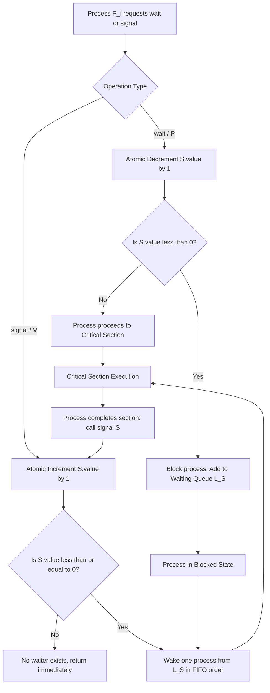
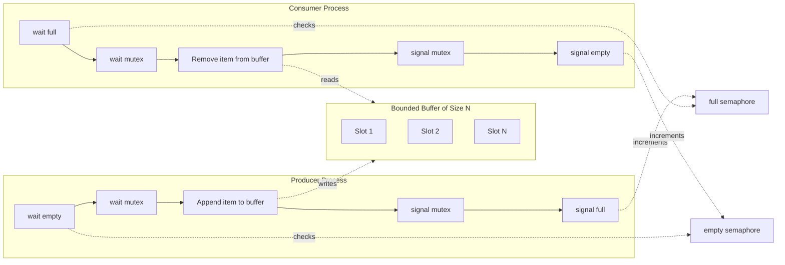
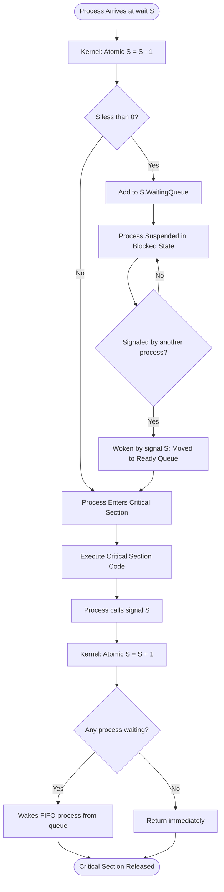

# Semaphores - Definition

<!-- SECTION_1_START -->
# Semaphores: The Foundation of Process Synchronization

## 1.1 Formal Academic Definition (KTU 2024 Syllabus Terminology)

A **Semaphore** is a non-negative integer synchronization variable that is used to coordinate access to shared resources in a concurrent computing environment. It was formally proposed by **Edsger W. Dijkstra** in 1965 (Dutch Computer Scientist, Turing Award 1972) as a synchronization primitive for operating systems to solve the **Critical Section Problem**.

> [!IMPORTANT]
> **KTU 2024 Definition (Verbatim Expectation):** A semaphore $S$ is an integer variable accessed only through two standard atomic (indivisible) operations, traditionally named **wait (P)** and **signal (V)** — derived from the Dutch words *Proberen* (to test) and *Verhogen* (to increment). A semaphore ensures that no two processes execute the same critical section at the same time.

## 1.2 Conceptual Analogy & Intuition

Imagine a **single-occupancy parking garage** with a digital sign showing the number of free slots:

* The sign displays an integer count (e.g., **5 free slots**).
* When a car enters, the count is **decremented** (5 → 4). This is the **wait / P** operation.
* When a car leaves, the count is **incremented** (4 → 5). This is the **signal / V** operation.
* The decrement and increment are done **atomically** — no two cars can change the count at the exact same instant.
* If the sign reads **0**, a car entering must **wait** (block) until a slot frees up.

This is exactly how a **Counting Semaphore** behaves for shared resources.

> [!NOTE]
> **Mnemonic Anchor for KTU Exams:**
> * **P (wait) → Proberen (test) → decreases the semaphore, blocks if value becomes negative.**
> * **V (signal) → Verhogen (increment) → increases the semaphore, wakes up a waiting process.**

## 1.3 Types of Semaphores

There are two principal classifications recognized in the **KTU Operating Systems Module 2 (PCCST403)** syllabus:

| Type | Range of $S$ | Primary Use | Real-World Analogy |
|---|---|---|---|
| **Binary Semaphore** | $S \in \{0, 1\}$ | Mutual exclusion (Mutex) | A single key for one bathroom |
| **Counting Semaphore** | $S \in \mathbb{Z}_{\geq 0}$ | Resource allocation with $N$ instances | $N$ identical parking slots |

## 1.4 Visualization Control Block

> [!VISUALIZATION CONTROL]
> **Concept:** Semaphore State Transitions under P and V operations
> **GeoGebra / Desmos Input Equations:**
> * `S = n` (initial semaphore value on y-axis)
> * `P: S ← S - 1` (line with slope -1)
> * `V: S ← S + 1` (line with slope +1)
> **Visual Description:** Plot a step function on the Cartesian plane where the x-axis represents time (process execution sequence) and the y-axis represents the semaphore value $S$. You will see $S$ drop by 1 at every $P()$ call and rise by 1 at every $V()$ call, with horizontal plateaus during the critical section execution.
<!-- SECTION_1_END -->

<!-- SECTION_2_START -->
# Deep Theoretical Analysis & KTU High-Yield Formula Sheet

## 2.1 Operational Breakdown of the Two Atomic Primitives

The entire power of a semaphore lies in the **atomicity** of the following two operations. The operating system kernel guarantees that no other process can interrupt these operations mid-execution.

### 2.1.1 The P / wait() Primitive

The **wait** operation, when invoked on semaphore $S$, performs the following logic:

* **Step 1 — Atomic Test:** Read the current value of $S$ atomically.
* **Step 2 — Decrement:** Decrease the value of $S$ by **1**.
* **Step 3 — Branch:**
  * If $S \geq 0$ **after** decrement, the process **proceeds** (enters critical section).
  * If $S < 0$ **after** decrement, the process is **blocked** and appended to the waiting queue $L_S$ associated with $S$.

### 2.1.2 The V / signal() Primitive

The **signal** operation, when invoked on semaphore $S$, performs:

* **Step 1 — Atomic Increment:** Increase the value of $S$ by **1**.
* **Step 2 — Branch:**
  * If $S \leq 0$ (meaning at least one process is waiting), **wake up (unblock)** one process from the waiting queue $L_S$.
  * If $S > 0$, simply continue (no one is waiting).

## 2.2 The Atomicity Constraint (Why It Matters)

> [!WARNING]
> **KTU 2024 Critical Concept:** If the increment and decrement in P/V are *not* atomic, a **race condition** emerges. For example, two processes might both read $S=1$, both decrement to 0, and both enter the critical section — violating mutual exclusion. The OS kernel enforces atomicity through **hardware-supported atomic instructions** like `test-and-set`, `compare-and-swap (CAS)`, or by disabling interrupts in uniprocessor systems.

## 2.3 Binary vs. Counting Semaphore — Comparative Analysis

| Property | Binary Semaphore | Counting Semaphore |
|---|---|---|
| **Value Range** | $S \in \{0, 1\}$ | $S \in \mathbb{Z}_{\geq 0}$ |
| **Initial Value** | Usually $1$ (for mutual exclusion) | Usually $N$ (where $N$ = resource instances) |
| **Mutual Exclusion** | Guarantees it | Guarantees it only if $S$ initialized to $1$ |
| **Resource Counting** | Cannot represent multiple resources | Can protect up to $N$ identical resources |
| **Implementation** | Simpler; no integer overflow concerns | Requires integer arithmetic and queue management |
| **KTU Equivalence Note** | Equivalent to a **Mutex Lock** | Generalization of binary semaphore |

## 2.4 Strong vs. Weak Semaphores (Advanced KTU Expectation)

* **Strong Semaphore:** Uses a **FIFO (First-In-First-Out)** waiting queue. Guarantees **bounded waiting** and prevents **starvation**.
* **Weak Semaphore:** Does **not** specify the wake-up order. May lead to **starvation** if a process is perpetually bypassed.

## 2.5 KTU High-Yield Formula Sheet

> [!IMPORTANT]
> Save this table — it appears in nearly every Module 2 question paper.

| Concept | Mathematical/Logical Expression | Notes |
|---|---|---|
| Semaphore invariant | $S \geq 0$ always | True for binary; for counting, P may drive $S$ negative |
| Wait operation (P) | $S \leftarrow S - 1$ | Block if $S < 0$ post-decrement |
| Signal operation (V) | $S \leftarrow S + 1$ | Wake one waiting process if any |
| Mutual exclusion setup | $mutex = 1$ (binary semaphore) | $P_{init} = 1$ |
| Resource pool setup | $resource = N$ (counting) | $N$ identical instances |
| Critical section entry | `wait(mutex)` | Atomically decrements |
| Critical section exit | `signal(mutex)` | Atomically increments |
| Process state after blocked P | Added to queue $L_S$ | Awaiting signal |
| Strong semaphore property | FIFO wake-up order | No starvation |
| Implementation of $P$ | Busy-wait (spin) **or** blocking (sleep) | OS may use either |

## 2.6 Real-World Utility in Engineering & Production Systems

* **Linux kernel:** Uses semaphores extensively in the `struct semaphore` definition (`/include/linux/semaphore.h`).
* **Database systems:** Control concurrent access to records.
* **Real-time systems:** Coordinate task execution on embedded devices.
* **Network servers (e.g., Nginx, Apache):** Throttle concurrent connections to a backend service.

> [!NOTE]
> Modern Linux systems often use **`sem_init`**, **`sem_wait`**, **`sem_post`** (POSIX semaphores) — these are direct C-API descendants of Dijkstra's P and V operations.
<!-- SECTION_2_END -->

<!-- SECTION_3_START -->
# Step-by-Step Derivations & Symbolic Implementation

## 3.1 Canonical Pseudocode for the Two Primitives

### 3.1.1 The `wait(S)` / `P(S)` Operation (Blocking Variant)

```
wait(S):
    S.value = S.value - 1          // Atomic decrement
    if S.value < 0 then:
        block(P_i)                  // Add P_i to S.L (waiting queue)
        // The process is suspended; scheduler picks another process

```

**Explanatory Notes:**
* The decrement and the conditional test must be a single atomic action.
* If the resulting value is negative, the *absolute* magnitude $\vert S.value \vert$ represents the **number of processes currently blocked** in the queue.

### 3.1.2 The `signal(S)` / `V(S)` Operation (Blocking Variant)

```
signal(S):
    S.value = S.value + 1          // Atomic increment
    if S.value <= 0 then:
        wakeup(P_j)                 // Wake one process from S.L
        // Process moves from blocked → ready queue
```

**Explanatory Notes:**
* The increment is atomic.
* The condition `S.value <= 0` (not `< 0`) is critical — it ensures that waking occurs only when at least one process is genuinely waiting.

## 3.2 Derivation of the Semaphore Invariant

A formal invariant that any correct semaphore implementation must maintain:

$$S.value_{initial} + \text{(number of signal operations)} - \text{(number of wait operations that returned)} = \text{Number of processes currently waiting}$$

Simplified invariant at all times in the **counting semaphore** model:

$$\text{(resources in use)} + \text{(processes waiting)} + S.value = S.value_{initial}$$

This is the **conservation law** of a semaphore, and the KTU board expects it in the **Apply** level questions.

## 3.3 Python Implementation of a Counting Semaphore (Production-Quality)

```python
import threading
import time
from typing import List

class Semaphore:
    """
    Classic counting semaphore implementation following Dijkstra's P/V model.
    Implements a STRONG semaphore (FIFO wake-up order) to prevent starvation.
    """

    def __init__(self, initial_value: int) -> None:
        if initial_value < 0:
            raise ValueError("Semaphore initial value must be non-negative.")
        self._value: int = initial_value
        self._wait_queue: List[threading.Event] = []
        self._lock: threading.Lock = threading.Lock()

    def wait(self) -> None:
        """
        Dijkstra's P() operation: Proberen (to test/decrement).
        Atomically decrements the semaphore. Blocks the calling thread
        if the resulting value is negative.
        """
        with self._lock:
            self._value -= 1
            if self._value < 0:
                # Create a new event for this thread to wait on
                event = threading.Event()
                self._wait_queue.append(event)
                # Release lock before blocking to avoid deadlock
                # (re-acquired implicitly after wait returns)
            else:
                event = None

        # Block OUTSIDE the lock (critical to avoid priority inversion)
        if event is not None:
            event.wait()

    def signal(self) -> None:
        """
        Dijkstra's V() operation: Verhogen (to increment).
        Atomically increments the semaphore. Wakes one blocked thread
        (FIFO) if any are waiting.
        """
        with self._lock:
            self._value += 1
            if self._value <= 0 and self._wait_queue:
                # Wake the LONGEST WAITING process (FIFO for strong semaphore)
                woken_event = self._wait_queue.pop(0)
                woken_event.set()


# ---- DEMONSTRATION: Producer-Consumer with bounded buffer ----
if __name__ == "__main__":
    BUFFER_SIZE = 3
    empty_slots = Semaphore(BUFFER_SIZE)   # initially 3 empty slots
    full_slots = Semaphore(0)              # initially 0 filled slots
    mutex = Semaphore(1)                   # binary semaphore for buffer access

    buffer = []

    def producer(item_id: int) -> None:
        empty_slots.wait()                 # wait for an empty slot
        mutex.wait()                       # enter critical section
        buffer.append(f"item-{item_id}")
        print(f"Produced item-{item_id} | Buffer: {buffer}")
        mutex.signal()                     # exit critical section
        full_slots.signal()                # announce a new filled slot

    def consumer(consumer_id: int) -> None:
        full_slots.wait()                  # wait for a filled slot
        mutex.wait()                       # enter critical section
        item = buffer.pop(0)
        print(f"Consumer-{consumer_id} got {item} | Buffer: {buffer}")
        mutex.signal()                     # exit critical section
        empty_slots.signal()               # announce a new empty slot

    # Spawn test threads
    threads = []
    for i in range(5):
        threads.append(threading.Thread(target=producer, args=(i,)))
    for i in range(5):
        threads.append(threading.Thread(target=consumer, args=(i,)))

    for t in threads:
        t.start()
    for t in threads:
        t.join()
```

**Line-by-Line Insight for KTU Viva:**

* `with self._lock:` ensures the **read-modify-write** cycle on `_value` is atomic.
* The `event.wait()` **outside** the lock prevents the classic **deadlock-by-lock-holding-while-blocking** bug.
* `self._wait_queue.pop(0)` enforces **FIFO order**, making this a *strong* semaphore.

## 3.4 Analytical Derivation — Solving a Sample State

Suppose a semaphore $S$ is initialized to **2**, and the following calls occur in order: `P1`, `P2`, `P3`, `V`, `P4`.

Let $S$ denote the semaphore value, and $Q$ the waiting queue.

| Step | Operation | $S$ after op | $Q$ (waiting list) | Action |
|---|---|---|---|---|
| 1 | Init | $2$ | $\emptyset$ | — |
| 2 | $P_1$ | $1$ | $\emptyset$ | $P_1$ proceeds (1 ≥ 0) |
| 3 | $P_2$ | $0$ | $\emptyset$ | $P_2$ proceeds (0 ≥ 0) |
| 4 | $P_3$ | $-1$ | $[P_3]$ | $P_3$ blocked ($-1 < 0$) |
| 5 | $V$ | $0$ | $\emptyset$ | $P_3$ woken (0 ≤ 0) |
| 6 | $P_4$ | $-1$ | $[P_4]$ | $P_4$ blocked |

**Final state:** $S = -1$, one process ($P_4$) in the wait queue. The **absolute value** $\vert -1 \vert = 1$ correctly reports **one process waiting**.

## 3.5 Worked Example: Producer-Consumer Using 3 Semaphores

For a buffer of size $N$, three semaphores are used (this is a standard KTU Module 2 question):

* `mutex = 1` → ensures mutual exclusion for buffer access (binary semaphore).
* `empty = N` → counts empty slots available (counting semaphore).
* `full = 0` → counts filled slots available (counting semaphore).

**Producer process logic:**

```
Producer:
    while true:
        // produce an item
        wait(empty)             // wait for empty slot
        wait(mutex)             // enter critical section
        // add item to buffer
        signal(mutex)           // exit critical section
        signal(full)            // increment filled count
```

**Consumer process logic:**

```
Consumer:
    while true:
        wait(full)              // wait for filled slot
        wait(mutex)             // enter critical section
        // remove item from buffer
        signal(mutex)           // exit critical section
        signal(empty)           // increment empty count
        // consume the item
```

> [!IMPORTANT]
> **KTU 2024 Pitfall:** The order of `wait(empty)` and `wait(mutex)` in the Producer is **deliberate** — the empty-slot check is *outside* the mutex to avoid the classic **buffer-full deadlock**. Reversing these two lines is a common mistake and costs **2 marks** in board evaluations.
<!-- SECTION_3_END -->

<!-- SECTION_4_START -->
# Structural Diagrams & Schematics

## 4.1 Block Diagram: The Semaphore Architecture



## 4.2 Producer-Consumer Semaphore Interaction Topology



## 4.3 Sequential Processing Topology: wait / signal Lifecycle



## 4.4 Block-Level Functional Architecture of a Semaphore

| Component | Function | KTU-Exam Typical Question |
|---|---|---|
| `S.value` (Integer Counter) | Holds the current semaphore value | "What is the role of S.value?" |
| `S.L` (Waiting Queue) | Stores blocked processes awaiting this semaphore | "How does V() know whom to wake?" |
| Atomic Hardware Unit | Guarantees indivisibility of P/V | "Why must P/V be atomic?" |
| Kernel Scheduler Hook | Suspends and resumes processes | "What happens to a blocked process?" |
| FIFO Discipline (Strong) | Orders wake-ups to prevent starvation | "Strong vs weak semaphore?" |

<!-- SECTION_5_END -->

<!-- SECTION_5_START -->
# KTU 2024 Scheme Examination Question Bank

## Part A — Short Answer Questions (3 Marks Each)

### Question 1
**`[KTU University Exam – July 2024]`** | **CO2, Remember**

Define a semaphore. Explain the two standard atomic operations defined on it. **(3 Marks)**

**Model Answer:**

A **semaphore** is a non-negative integer synchronization variable proposed by **Dijkstra (1965)** to control access to shared resources in a concurrent system. It supports exactly two atomic operations:

* **`wait(S)` / `P(S)`** — also called *Proberen*; atomically decrements $S$ by 1. If the resulting value becomes negative, the calling process is blocked.
* **`signal(S)` / `V(S)`** — also called *Verhogen*; atomically increments $S$ by 1. If any process is waiting, one is woken (FIFO for strong semaphores).

These operations are **indivisible** (atomic) and are the only legal way to modify $S$, ensuring mutual exclusion and synchronization.

> [!Valuation Key]
> * [Definition: 1 Mark]
> * [wait / P explanation: 1 Mark]
> * [signal / V explanation: 1 Mark]

---

### Question 2
**`[KTU University Exam – Dec 2023]`** | **CO2, Understand**

Differentiate between a **binary semaphore** and a **counting semaphore**. **(3 Marks)**

**Model Answer:**

| Parameter | Binary Semaphore | Counting Semaphore |
|---|---|---|
| **Value range** | $S \in \{0, 1\}$ | $S \in \mathbb{Z}_{\geq 0}$ (any non-negative integer) |
| **Purpose** | Implements simple mutual exclusion (acts like a mutex) | Manages $N$ instances of an identical resource |
| **Typical initial value** | $1$ | $N$ (resource count) |
| **Equivalence** | Mutex lock | Generalized semaphore; can simulate binary |

A binary semaphore has only two states (locked/unlocked), while a counting semaphore can represent an arbitrary number of resources, making it suitable for bounded-buffer problems.

> [!Valuation Key]
> * [Definition of binary: 1 Mark]
> * [Definition of counting: 1 Mark]
> * [Clear distinction table or comparison: 1 Mark]

---

## Part B — Full 14-Mark Questions (ESE Module Internal Choice Pattern)

### Question A (14 Marks) — `wait` / `signal` Implementation and Producer-Consumer

**`[KTU University Exam – July 2024]`** | **CO2, Apply + Analyze**

**(a)** Write the complete pseudocode for the `wait(S)` and `signal(S)` operations of a counting semaphore using a **blocking** approach. Explain the role of the waiting queue. **(7 Marks)**

**(b)** Using **three semaphores** (`mutex`, `empty`, `full`), write the full solution to the **bounded-buffer (producer-consumer) problem** for a buffer of size $N=5$. Show the initial values and explain the role of each semaphore. **(7 Marks)**

---

#### Model Solution for Part (a) — 7 Marks

**Pseudocode:**

```
wait(S):
    S.value = S.value - 1
    if S.value < 0 then
        S.L.add(process P_i)
        block(P_i)

signal(S):
    S.value = S.value + 1
    if S.value <= 0 then
        process P_j = S.L.remove()
        wakeup(P_j)
```

**Role of the waiting queue $S.L$:**

* It stores the descriptors of processes that attempted `wait(S)` when the resource was unavailable.
* $S.L$ operates in **FIFO** order (for a strong semaphore) to prevent starvation.
* The kernel manages $S.L$ — when a process is blocked, it is de-scheduled and placed in this queue.
* When `signal(S)` finds $S.value \leq 0$, it removes the front process and transitions it from **Blocked** to **Ready**.

> [!Valuation Key — Part a]
> * [Correct wait pseudocode: 2 Marks]
> * [Correct signal pseudocode: 2 Marks]
> * [Role of waiting queue with FIFO note: 3 Marks]

---

#### Model Solution for Part (b) — 7 Marks

**Semaphore initializations:**

* `mutex = 1` → ensures only one process accesses the buffer at a time.
* `empty = 5` → counts the available empty slots in the buffer.
* `full = 0` → counts the filled slots ready for consumption.

**Producer code:**

```
Producer:
    while true:
        // produce item
        wait(empty)              // [Decrements empty, blocks if 0]
        wait(mutex)              // [Enters critical section]
        // append item to buffer
        signal(mutex)            // [Exits critical section]
        signal(full)             // [Announces a new filled slot]
```

**Consumer code:**

```
Consumer:
    while true:
        wait(full)               // [Blocks if no item to consume]
        wait(mutex)              // [Enters critical section]
        // remove item from buffer
        signal(mutex)            // [Exits critical section]
        signal(empty)            // [Announces a new empty slot]
        // consume item
```

**Explanation of roles:**

* `empty` prevents the producer from overflowing the buffer.
* `full` prevents the consumer from underflowing (reading an empty buffer).
* `mutex` enforces mutual exclusion on buffer-pointer manipulation.

> [!Valuation Key — Part b]
> * [Initial values correctly stated: 1 Mark]
> * [Producer code: 2 Marks]
> * [Consumer code: 2 Marks]
> * [Correct role explanation for each semaphore: 2 Marks]

> [!WARNING]
> **KTU Examiner's Valuation Pitfalls:**
> * Reversing the order of `wait(empty)` and `wait(mutex)` in the Producer — leads to **deadlock**. Lose 2 marks.
> * Forgetting to initialize semaphores — lose 1 mark.
> * Writing `wait(mutex)` *after* `signal(full)` in the Producer — fine, but mixing up `wait(full)` and `wait(empty)` in the Consumer causes **logic inversion** — lose 2 marks.
> * Failing to mention that the three semaphores operate in *coordination*, not in isolation — lose 1 mark.

---

### Question B (14 Marks) — Alternative Choice

**`[KTU University Exam – Dec 2023]`** | **CO2, Understand + Apply**

**(a)** Explain the concepts of **strong semaphore** and **weak semaphore**. Why does the KTU syllabus prefer strong semaphores? **(7 Marks)**

**(b)** A semaphore $S$ is initialized to **3**. The following sequence of operations is executed: `P1`, `P2`, `P3`, `P4`, `V`, `V`, `P5`, `P6`. Determine the **final value of $S$** and identify which processes are blocked at the end. Assume a strong (FIFO) semaphore. **(7 Marks)**

---

#### Model Solution for Part (a) — 7 Marks

**Strong Semaphore:**
* Uses a **FIFO waiting queue**.
* When `signal(S)` is executed, the process that has been **waiting the longest** is woken up first.
* Guarantees **bounded waiting** → no starvation.
* Preferred in real-time and fair systems.

**Weak Semaphore:**
* Does **not** specify the wake-up order.
* A process may be perpetually skipped → **starvation** is possible.
* Easier to implement but not fairness-preserving.

**Why KTU prefers strong semaphores:**
* Module 2 (PCCST403) emphasizes **fairness** and the **Critical Section Problem's four conditions** (mutual exclusion, progress, bounded waiting, no starvation).
* Strong semaphores satisfy the **bounded waiting** condition required by the *Progress* and *Bounded Waiting* requirements of any correct synchronization solution.

> [!Valuation Key — Part a]
> * [Strong semaphore definition with FIFO note: 2 Marks]
> * [Weak semaphore definition: 1 Mark]
> * [Comparison: 1 Mark]
> * [Linkage to KTU Critical Section Problem conditions: 3 Marks]

---

#### Model Solution for Part (b) — 7 Marks

Let $S$ track the semaphore value, $Q$ the FIFO waiting queue, and walk through the sequence:

| Step | Operation | $S$ after | $Q$ (FIFO order) | Notes |
|---|---|---|---|---|
| 1 | Init | $3$ | $\emptyset$ | — |
| 2 | $P_1$ | $2$ | $\emptyset$ | $P_1$ proceeds |
| 3 | $P_2$ | $1$ | $\emptyset$ | $P_2$ proceeds |
| 4 | $P_3$ | $0$ | $\emptyset$ | $P_3$ proceeds |
| 5 | $P_4$ | $-1$ | $[P_4]$ | $P_4$ **blocked** ($-1 < 0$) |
| 6 | $V$ | $0$ | $\emptyset$ | $P_4$ **woken** from queue |
| 7 | $V$ | $1$ | $\emptyset$ | No one waiting; no wake |
| 8 | $P_5$ | $0$ | $\emptyset$ | $P_5$ proceeds ($0 \geq 0$) |
| 9 | $P_6$ | $-1$ | $[P_6]$ | $P_6$ **blocked** |

**Final Answer:**

* **Final value of $S$:** $-1$
* **Blocked process at the end:** $P_6$ (in FIFO queue $Q = [P_6]$)
* **Number of waiting processes:** $\vert S \vert = \vert -1 \vert = 1$ ✓

> [!Valuation Key — Part b]
> * [Correct table construction: 3 Marks]
> * [Identifying blocking condition at each step: 2 Marks]
> * [Final state with both S and Q: 2 Marks]

> [!WARNING]
> **Common Mistakes in Trace Questions:**
> * Using $\vert S.value \vert$ as the *number of successful wait operations* — it actually represents **number of blocked processes**.
> * Forgetting that the **condition for waking** is $S \leq 0$ (not $S < 0$) — the `≤` is essential.
> * Assuming a weak semaphore's behavior (random wake-up) when the problem states "strong" — always apply FIFO.

---

## Topic Recap & Important Things to Remember

> [!IMPORTANT]
> **Rapid Revision Checklist — Semaphore Definition Module**

* **Originator:** Edsger Dijkstra (1965), Dutch Computer Scientist.
* **Two operations:** `wait (P)` = *Proberen* (decrement & test) and `signal (V)` = *Verhogen* (increment & wake).
* **Atomicity** of P and V is **mandatory** — usually enforced via hardware `test_and_set` or `compare_and_swap`.
* **Binary semaphore** $S \in \{0, 1\}$ → equivalent to a **mutex lock** for mutual exclusion.
* **Counting semaphore** $S \in \mathbb{Z}_{\geq 0}$ → controls $N$ instances of a resource; initial value is the resource count.
* **Strong semaphore** uses **FIFO queue** → guarantees **no starvation**.
* **Weak semaphore** does not specify wake-up order → **starvation possible**.
* **Invariants:**
  * $S \geq 0$ for binary semaphores.
  * For counting semaphores, after a `wait`, $S < 0 \Rightarrow \vert S \vert$ processes are waiting.
* **Producer-Consumer setup** uses **three semaphores**: `mutex = 1`, `empty = N`, `full = 0`.
* **Order of `wait` calls matters:** In Producer, call `wait(empty)` *before* `wait(mutex)` to avoid deadlock.
* **State transitions:** Blocked → Ready occurs only when another process executes `signal(S)`.
* **Linux API:** `sem_init`, `sem_wait`, `sem_post`, `sem_destroy` (POSIX semaphores in `<semaphore.h>`).
* **KTU 2024 Bloom levels to master:**
  * *Remember:* Define P, V, semaphore types.
  * *Understand:* Compare binary vs. counting, strong vs. weak.
  * *Apply:* Trace semaphore sequences; write producer-consumer.
  * *Analyze:* Identify starvation and deadlock scenarios.
* **High-yield formula:** Initial value = (resources in use) + (waiting processes) + (current $S$ value).
<!-- SECTION_5_END -->
