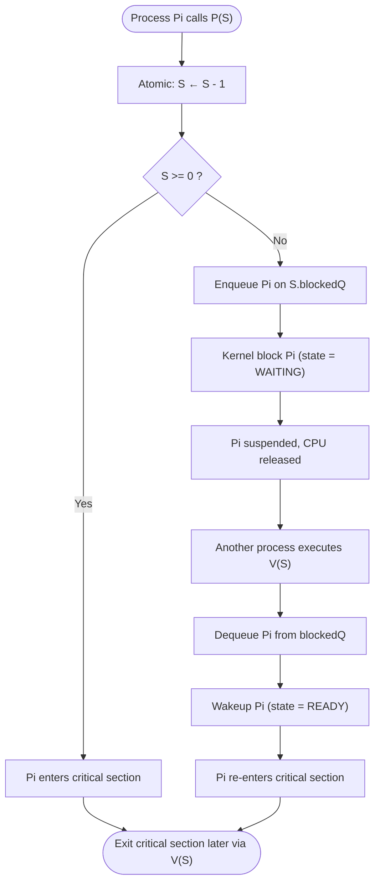
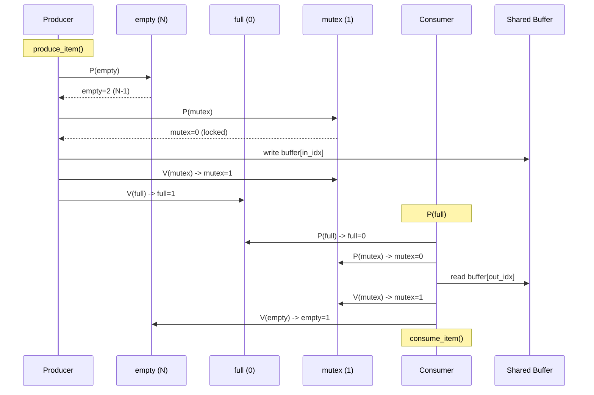
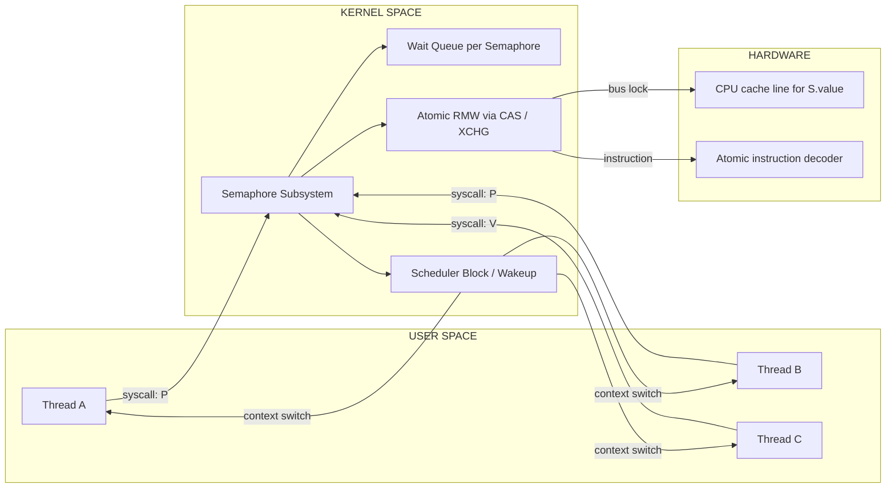
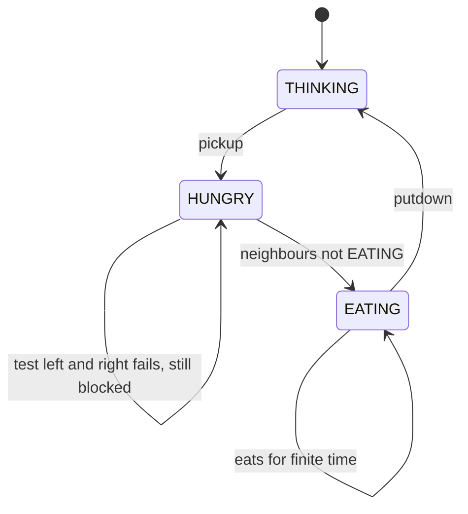

# Semaphores

<!-- SECTION_1_START -->
# SEMAPHORES — Core Technical Definition & Intuitive Overview

## Formal Academic Definition (KTU 2024 Syllabus Terminology)

A **Semaphore** is a synchronization primitive used in concurrent programming to control access to shared resources by multiple processes or threads. It was formally introduced by **Edsger W. Dijkstra** in 1965 as a generalized solution to the *Critical Section Problem*. Conceptually, a semaphore $S$ is an **integer variable** accessed only through two **atomic, indivisible, uninterruptible** standard operations:

1. **Wait** (also called $P(S)$ or $\text{down}(S)$ or $\text{acquire}(S)$) — decreases the value of $S$ by $1$ if $S > 0$; otherwise, the calling process is blocked.
2. **Signal** (also called $V(S)$ or $\text{up}(S)$ or $\text{release}(S)$) — increases the value of $S$ by $1$ and wakes up one of the processes (if any) that were blocked in a $P$ operation on $S$.

The atomicity guarantee is typically provided by the kernel through hardware-supported **test-and-set**, **compare-and-swap**, or by disabling interrupts during the read-modify-write sequence.

## Conceptual Analogy / Intuition (Real-World Picture)

> [!NOTE]
> **Analogy — The Single-Hole Bathroom Key (Binary Semaphore):**
> Imagine a public restroom with **one** cubicle. A key hangs on a board at the entrance. The number on the board reads $1$. When a person enters, they take the key ($P$ operation: $1 \rightarrow 0$). No one else can enter. When they leave, they return the key ($V$ operation: $0 \rightarrow 1$). The next person (if any is waiting) can now enter. The **board is the semaphore**; the **key is the access token**; **taking/returning is atomic** — you cannot observe the key "in transit".

> [!NOTE]
> **Analogy — The Parking Lot with N Slots (Counting Semaphore):**
> A parking garage has $N$ identical slots. A digital display shows the number of free slots. A car entering decrements the counter; a car leaving increments it. If the counter is $0$, the boom barrier stays closed. The counter $S$ itself is the counting semaphore.

> [!IMPORTANT]
> **KTU 2024 Syllabus Highlight:**
> A semaphore is fundamentally **not** a lock — it is a *signaling* mechanism. A process executes $P$ on a semaphore to wait for a *signal* from another process that has finished its work; the two processes often do **not** access the same critical section. This property makes semaphores more powerful than pure mutexes.

## Physical & Logical Constants (Board-Relevant)

- **Atomicity guarantee:** Required from underlying hardware instruction (e.g., x86 `XCHG`, `LOCK` prefix) or OS kernel.
- **Default initial value:**
  * Binary Semaphore: $S \in \{0, 1\}$
  * Counting Semaphore: $S \in \mathbb{Z}_{\geq 0}$
- **Block queue:** Implemented as a **FIFO** by convention (though KTU allows any waiting-queue policy).
- **Atomic invariant:** No two operations on the same semaphore can interleave.

> [!VISUALIZATION CONTROL]
> **Concept:** Counter behaviour of a binary semaphore protecting a single critical section.
> **GeoGebra / Desmos Input Equations:**
> * $S(t) = 1$ for $t \in [0, 1)$
> * $S(t) = 0$ for $t \in [1, 3)$ (process P1 inside critical section)
> * $S(t) = 0$ for $t \in [3, 3.5)$ (P2 blocked)
> * $S(t) = 1$ for $t \geq 3.5$ (P2 admitted)
> **Visual Description:** A step plot where the y-axis represents the semaphore count $S$ and the x-axis represents time $t$. The plot drops from 1 to 0 the moment $P(S)$ succeeds, stays at 0 during the critical section, and returns to 1 the moment $V(S)$ fires.

<!-- SECTION_1_END -->

<!-- SECTION_2_START -->
# Deep Theoretical Analysis & KTU High-Yield Formula Sheet

## 2.1 Classification of Semaphores

### A. Binary Semaphore (Mutex Semaphore)
- Value domain: $S \in \{0, 1\}$.
- Behaves identically to a **mutex lock** when used to protect a single critical section.
- A process that finds $S = 0$ in $P(S)$ is **blocked** and queued.
- Strict mutual exclusion property: at most **one** process can be inside the protected region at any instant.

### B. Counting Semaphore
- Value domain: $S \in \mathbb{Z}_{\geq 0}$.
- Used to control access to a pool of $N$ identical resources (e.g., database connection pool, bounded buffer slots, I/O channels).
- Allows **up to $N$** processes inside the protected region simultaneously.
- Initial value is typically set to $N$, the number of available resource instances.

## 2.2 Atomic Pseudocode for the P and V Operations

The classical Dijkstra formulation in C-style pseudocode:

$$
\text{wait}(S) \; \text{or} \; P(S) \; \equiv \;
\begin{cases}
S \leftarrow S - 1 \\
\text{if } (S < 0) \text{ then} \{
\text{block}(self); \text{ enqueue on } S\ \}
\end{cases}
$$

$$
\text{signal}(S) \; \text{or} \; V(S) \; \equiv \;
\begin{cases}
S \leftarrow S + 1 \\
\text{if } (S \leq 0) \text{ then} \{
\text{wakeup}(p); \text{ dequeue from } S\ \}
\end{cases}
$$

### Why `S < 0` for blocking and `S <= 0` for waking — the subtle correctness argument
- After $S \leftarrow S - 1$, the value of $S$ equals `(available resources) − (consumers in queue + 1)`.
- A **negative** value means one or more processes are sleeping *because of this semaphore*. So the check `S < 0` after decrementing correctly identifies the "must block" case.
- After $S \leftarrow S + 1$, if $S \leq 0$ after the increment, it implies at least one process is still waiting (because a wakeup will only bring $S$ back to $\leq 0$ if a previous decrement had already driven it below zero). Hence we wake exactly one waiter.

## 2.3 Key Properties and Invariants

1. **Mutual exclusion (binary only):** A binary semaphore initialized to 1 enforces the critical section property.
2. **No busy waiting:** A blocked process consumes zero CPU; this is the central advantage over *spin locks*.
3. **No race conditions:** Because $P$ and $V$ are atomic, no two processes can read-modify-write $S$ concurrently.
4. **Order independence:** A signal on a semaphore with no waiters is simply a counter increment (the next $P$ will succeed immediately).
5. **Deadlock freedom is the programmer's responsibility:** The semaphore primitive itself is deadlock-agnostic; misuse such as $P(Q); P(S); V(S); V(Q);$ from one process and $P(S); P(Q); V(Q); V(P);$ from another can deadlock.

## 2.4 Strong vs. Weak Semaphores

| Property | Weak Semaphore | Strong Semaphore |
| :--- | :--- | :--- |
| **Wakeup order** | Unspecified (any blocked process may be released) | **FIFO** order guaranteed |
| **Starvation possibility** | Possible in theory | **Impossible** |
| **Implementation cost** | Cheaper (simple queue) | Slightly more expensive |
| **KTU board convention** | Acceptable in proofs | Preferred in exam answers |

## 2.5 KTU Formula Sheet / Cheat Sheet

| Concept | Symbol / Formula | Meaning |
| :--- | :--- | :--- |
| Semaphore value | $S \in \mathbb{Z}_{\geq 0}$ | Integer counter, never negative in steady state |
| Wait / P operation | $S \leftarrow S - 1$ | Atomic decrement; block if $S < 0$ after |
| Signal / V operation | $S \leftarrow S + 1$ | Atomic increment; wake one waiter if $S \leq 0$ after |
| Initial value (binary) | $S = 1$ | Unlocked state, one resource available |
| Initial value (counting) | $S = N$ | N identical resources available |
| Critical section length | $t_{cs}$ | Time spent inside the protected region |
| Atomicity primitive | `test_and_set`, `compare_and_swap`, `swap` | Hardware support ensuring indivisibility |
| Strong semaphore invariant | $\text{queue}(S) \text{ is FIFO}$ | Orderly wakeup |
| Block / wake | $\text{block}(p_i), \text{wakeup}(p_j)$ | Kernel-level primitives |

> [!IMPORTANT]
> **Engineering utility:** Semaphores are used *everywhere* in production systems — Linux kernel `sema_init`, FreeBSD `sem\_new`, POSIX `sem\_t`, Java `java.util.concurrent.Semaphore`, and historically in Unix System V IPC (`semget`, `semop`, `semctl`). They coordinate thread pools, rate-limit API calls, throttle database connections, and synchronize producer-consumer pipelines in message brokers (Kafka, RabbitMQ).

<!-- SECTION_2_END -->

<!-- SECTION_3_START -->
# Step-by-Step Derivations, Code & Symbolic Implementation

## 3.1 Atomic Implementation of P and V (C with Test-and-Set)

The complete, runnable, board-style C implementation using the hardware `compare_and_swap` instruction:

```c
#include <stdatomic.h>
#include <stdlib.h>
#include <stdio.h>

typedef struct {
    atomic_int  value;
    /* simple FIFO blocked queue (illustrative) */
    pid_t       *queue;
    int         q_capacity;
    int         q_head;
    int         q_tail;
    int         q_size;
} semaphore;

void sem_init(semaphore *S, int initial) {
    atomic_store(&S->value, initial);
    S->queue       = (pid_t *)malloc(64 * sizeof(pid_t));
    S->q_capacity  = 64;
    S->q_head      = 0;
    S->q_tail      = 0;
    S->q_size      = 0;
}

/* Atomic decrement: returns the new value of S->value */
static inline int atomic_decrement(atomic_int *v) {
    int old = atomic_load(v);
    while (1) {
        if (old <= 0) {
            return old;        /* caller must block */
        }
        if (atomic_compare_exchange_weak(v, &old, old - 1)) {
            return old - 1;
        }
    }
}

/* P(S) = wait(S) */
void P(semaphore *S) {
    int new_val = atomic_decrement(&S->value);
    if (new_val < 0) {
        /* block the calling process and enqueue it on S */
        S->queue[S->q_tail] = getpid();
        S->q_tail = (S->q_tail + 1) % S->q_capacity;
        S->q_size++;
        /* kernel-level block - pauses the process */
        syscall_block(getpid());
    }
}

/* V(S) = signal(S) */
void V(semaphore *S) {
    int old = atomic_load(&S->value);
    while (1) {
        int next = old + 1;
        if (atomic_compare_exchange_weak(&S->value, &old, next)) {
            break;
        }
    }
    if (old < 0) {
        /* there is at least one blocked process: wake the head */
        pid_t pid = S->queue[S->q_head];
        S->q_head = (S->q_head + 1) % S->q_capacity;
        S->q_size--;
        syscall_wakeup(pid);
    }
}
```

**Why this satisfies atomicity:** the `compare_and_swap` (CAS) instruction is implemented in hardware such that the read-compare-write sequence is indivisible. The `while(1)` retry loop is the standard *lock-free* pattern: it retries the CAS until it observes that no other thread has modified `S->value` between the load and the swap.

## 3.2 Classical Problem #1 — Producer–Consumer (Bounded Buffer) with Semaphores

**Problem statement:** A producer thread inserts items into a buffer of size $N$; a consumer thread removes them. The buffer is shared. Ensure that the producer never overwrites a full buffer and the consumer never reads from an empty one.

**Semaphores used:**
- `empty` — counts free slots. Initial value: $N$.
- `full`  — counts filled slots. Initial value: $0$.
- `mutex` — protects shared buffer index. Initial value: $1$.

**Complete C-style solution:**

```c
#define N 100
int        buffer[N];
int        in_idx  = 0, out_idx = 0;

semaphore  empty, full, mutex;

void producer(void) {
    int item;
    while (1) {
        item = produce_item();           /* 1. produce the data         */
        P(&empty);                       /* 2. wait for a free slot      */
        P(&mutex);                       /* 3. lock the buffer           */
        buffer[in_idx] = item;           /* 4. insert item               */
        in_idx = (in_idx + 1) % N;       /* 5. wrap index                */
        V(&mutex);                       /* 6. unlock the buffer         */
        V(&full);                        /* 7. signal that a slot is full*/
    }
}

void consumer(void) {
    int item;
    while (1) {
        P(&full);                        /* 1. wait for a filled slot    */
        P(&mutex);                       /* 2. lock the buffer           */
        item = buffer[out_idx];          /* 3. remove item               */
        out_idx = (out_idx + 1) % N;     /* 4. wrap index                */
        V(&mutex);                       /* 5. unlock the buffer         */
        V(&empty);                       /* 6. signal a free slot        */
        consume_item(item);              /* 7. consume the data          */
    }
}
```

### Exhaustive correctness analysis (step-by-step derivation)

**State invariant (in steady state):**
$$
\text{empty} + \text{full} = N
$$
*Derivation:* Each $V(\text{empty})$ is paired with a $P(\text{empty})$ and each $V(\text{full})$ is paired with a $P(\text{full})$. Every successful $P(\text{empty})$ increments `full` and vice versa, so the sum is preserved from the initial value $N + 0 = N$.

**No buffer overflow proof:** Producer can only reach `buffer[in_idx] = item;` if `P(&empty)` succeeded, which requires $\text{empty} \geq 1$ *before* the decrement. Since $\text{empty}$ counts free slots, this guarantees that at least one slot is genuinely free. Therefore $0 \leq \text{in\_idx} < N$ is never violated.

**No buffer underflow proof:** Consumer can only reach `item = buffer[out_idx];` if `P(&full)` succeeded, which requires $\text{full} \geq 1$, i.e. at least one slot is genuinely filled. The `out_idx` is never dereferenced when it points to an empty cell.

**Mutual exclusion proof:** `mutex` is a binary semaphore initialized to $1$. By the critical section property of binary semaphores, the regions `buffer[in_idx] = item;` and `item = buffer[out_idx];` execute in a mutually exclusive manner. Therefore no race condition on `in_idx`, `out_idx`, or the buffer contents.

**Progress proof:** The producer only blocks on `P(&empty)` (wait for slot) or `P(&mutex)` (wait for consumer to leave critical section). When the consumer runs, it will release `mutex` within finite time. Hence neither process starves as long as the other makes progress (strong semaphores give a stronger guarantee of no starvation in FIFO order).

> [!NOTE]
> **Subtle point — order of P operations matters.** Always call `P(&empty)` and `P(&full)` *before* `P(&mutex)`. Inverting the order can cause deadlock: imagine the consumer holding `mutex` and the producer blocked on `P(&mutex)` because the consumer is also waiting on `P(&full)` from outside — no one releases the other.

## 3.3 Classical Problem #2 — Dining Philosophers

**Problem statement:** Five philosophers sit around a circular table. Between every two philosophers is one chopstick (5 chopsticks total). Each philosopher alternates between **thinking** and **eating**. To eat, a philosopher must pick up *both* the left and right chopstick. After eating, both chopsticks are put back.

**Naive (deadlock-prone) solution:**

```c
semaphore chopstick[5] = {1, 1, 1, 1, 1};

void philosopher(int i) {
    while (1) {
        think();
        P(&chopstick[i]);                  /* pick up left  */
        P(&chopstick[(i + 1) % 5]);        /* pick up right */
        eat();
        V(&chopstick[i]);
        V(&chopstick[(i + 1) % 5]);
    }
}
```

**Why this deadlocks:** If every philosopher picks up their left chopstick simultaneously, all five chopsticks are held. Each philosopher then blocks on `P(&chopstick[(i+1) % 5])` — but no chopstick is ever released. Classic **circular wait** deadlock.

**Deadlock-free solution (pick-up protocol with mutex / state check):**

```c
enum state { THINKING, HUNGRY, EATING };
state phil_state[5];
semaphore self[5] = {0, 0, 0, 0, 0};   /* initially 0 = blocked */
semaphore mutex = 1;                    /* protects state array */

void test(int i) {
    if (phil_state[i] == HUNGRY
        && phil_state[(i + 4) % 5] != EATING
        && phil_state[(i + 1) % 5] != EATING) {
        phil_state[i] = EATING;
        V(&self[i]);                     /* unblock philosopher i */
    }
}

void pickup(int i) {
    P(&mutex);
    phil_state[i] = HUNGRY;
    test(i);
    V(&mutex);
    P(&self[i]);                         /* block if test() did not succeed */
}

void putdown(int i) {
    P(&mutex);
    phil_state[i] = THINKING;
    test((i + 4) % 5);                   /* wake left neighbour if hungry */
    test((i + 1) % 5);                   /* wake right neighbour if hungry */
    V(&mutex);
}

void philosopher(int i) {
    while (1) {
        think();
        pickup(i);
        eat();
        putdown(i);
    }
}
```

**Correctness sketch (KTU style):**
- The state array `phil_state` is protected by `mutex`, so it is accessed atomically.
- A philosopher can transition to EATING only if both neighbours are not EATING — mutual exclusion is preserved.
- Deadlock is broken because a philosopher never holds one chopstick while waiting for another; instead, they request the *right to eat* and are blocked on a private semaphore `self[i]` until both neighbours have finished.
- Starvation freedom: a hungry philosopher will eventually eat, because every eating neighbour will put down and call `test()` on its hungry neighbour(s).

## 3.4 Deadlock vs. Starvation — The 4 Necessary Conditions (Coffman Conditions)

For a deadlock to occur, **all four** must hold simultaneously:
1. **Mutual exclusion** — resources are non-shareable.
2. **Hold and wait** — a process holds resources while waiting for more.
3. **No preemption** — resources cannot be forcibly taken.
4. **Circular wait** — a circular chain of processes exists, each waiting for a resource held by the next.

**Eliminating any one condition prevents deadlock.** For semaphores, the standard technique is to remove circular wait by imposing a global ordering on resource acquisition (e.g., always pick the lower-numbered chopstick first).

> [!NOTE]
> **Starvation** is different from deadlock. A process is *starved* if it waits indefinitely while other processes make progress. Strong semaphores (FIFO wakeup) prevent starvation; weak semaphores do not.

<!-- SECTION_3_END -->

<!-- SECTION_4_START -->
# Structural Diagrams & Schematics

## 4.1 Mermaid Flowchart — P(S) Operation State Machine



## 4.2 Mermaid Sequence Diagram — Producer–Consumer Interaction



## 4.3 Block-Level Architecture — Semaphore Subsystem in an OS Kernel



## 4.4 Dining Philosophers — Resource State Transition



## 4.5 Decision Matrix — Which Synchronization Primitive to Use

| Scenario | Best Choice | Why |
| :--- | :--- | :--- |
| Protect a single critical section | Binary semaphore (mutex) | Minimum overhead, no extra semantics |
| Coordinate $N$ identical resources | Counting semaphore | Direct mapping $S = N$ |
| Producer–Consumer bounded buffer | Two counting + one mutex | Cleanly separates *count* from *exclusion* |
| Cross-process signalling (one-shot) | Binary semaphore initialised to 0 | "Has an event happened yet?" |
| Need guaranteed FIFO wakeup | Strong semaphore (POSIX unnamed) | Avoids starvation |
| Kernel-internal short critical section | Spinlock | Cheaper than blocking on uniprocessor kernel |
| Reader-heavy access with no writer priority | RW-lock / RW-semaphore | Allows concurrent readers |

<!-- SECTION_4_END -->

<!-- SECTION_5_START -->
# KTU 2024 Scheme Examination Question Bank & Topic Recap

## 5.1 PART A — Short Answer Questions (3 Marks Each)

### Q1. `[KTU University Exam — July 2024]` (CO2, RBT: Remember)

**Differentiate between a binary semaphore and a counting semaphore. Give one example use-case for each.**

**Model Answer:**

A **binary semaphore** is a semaphore whose value is restricted to the set $\{0, 1\}$. It behaves essentially like a **mutex lock** and is used to provide mutual exclusion to a single shared resource. *Example:* protecting a shared linked-list head pointer inside a kernel module.

A **counting semaphore** is a semaphore whose value can range over $\mathbb{Z}_{\geq 0}$ and is initialised to the number $N$ of identical resource instances. It can admit up to $N$ processes into the critical region simultaneously. *Example:* throttling 50 concurrent database connections from a web-server thread pool.

| Aspect | Binary | Counting |
| :--- | :--- | :--- |
| Value range | $\{0, 1\}$ | $\mathbb{Z}_{\geq 0}$ |
| Concurrency allowed | 1 | $N$ |
| Typical use | Mutual exclusion | Resource pool |
| Implementation | Single flag + queue | Integer + queue |

**[Valuation Key: 1 Mark for correct definitions, 1 Mark for one example each, 1 Mark for the comparison table]**

---

### Q2. `[KTU University Exam — Dec 2023]` (CO2, RBT: Understand)

**Explain why a semaphore's $P$ and $V$ operations must be implemented as atomic (indivisible) instructions. What would happen if they were not?**

**Model Answer:**

A semaphore $S$ is a shared integer accessed concurrently by multiple processes. The $P(S)$ operation performs three logical steps: **(i) read** the value of $S$, **(ii) check** whether $S > 0$, and **(iii) write** $S - 1$ back. If $P$ is *not* atomic, two processes could interleave these three steps. Concretely, suppose $S = 1$ and both $P_1$ and $P_2$ read $1$ simultaneously, both decide to decrement, and both write back $0$ — two processes now believe they hold the lock, violating mutual exclusion.

Similarly, a non-atomic $V(S)$ could lose wakeups if two processes increment $S$ concurrently and the read-modify-write races. Hardware guarantees atomicity via instructions such as `test_and_set`, `compare_and_swap`, or `XCHG` with a `LOCK` prefix, or by briefly disabling interrupts inside the kernel. The atomicity invariant is therefore a **necessary** condition for correctness, not an implementation detail.

**[Valuation Key: 1 Mark for explaining read-modify-write race, 1 Mark for the mutual-exclusion violation scenario, 1 Mark for the hardware/kernel mechanism]**

---

## 5.2 PART B — 14-Mark Questions (Module Internal Choice)

### Question A (14 Marks) — Producer–Consumer with Semaphores

**`[KTU University Exam — July 2023, Adapted]`** (CO2, RBT: Apply + Analyze)

**(a)** *Discuss the bounded-buffer producer–consumer problem. Using **three** semaphores — `empty`, `full`, and `mutex` — write the complete solution code. State the initial values of all three semaphores. Explain why the order of $P$ operations in your code is critical to prevent deadlock.* **(7 Marks)**

**(b)** *Suppose the buffer size is $N = 5$. The producer is twice as fast as the consumer. Trace the values of `empty`, `full`, and `mutex` for the first 8 operations (4 produces + 4 consumes) starting from the initial state $(\text{empty}, \text{full}, \text{mutex}) = (5, 0, 1)$. Show which processes block, if any, and the final state.* **(7 Marks)**

#### Model Solution

**(a) Solution Code (5 marks for code + state, 2 marks for ordering argument):**

```c
#define N 100
int   buffer[N];
int   in = 0, out = 0;

semaphore empty = N;     /* free slots initially */
semaphore full  = 0;     /* filled slots initially */
semaphore mutex = 1;     /* critical section lock */

void producer(void) {
    int item;
    while (1) {
        item = produce_item();
        P(&empty);                     /* 1. wait for a free slot  */
        P(&mutex);                     /* 2. acquire buffer lock   */
        buffer[in] = item;
        in = (in + 1) % N;
        V(&mutex);                     /* 3. release buffer lock   */
        V(&full);                      /* 4. signal a new item     */
    }
}

void consumer(void) {
    int item;
    while (1) {
        P(&full);                      /* 1. wait for a filled slot */
        P(&mutex);                     /* 2. acquire buffer lock   */
        item = buffer[out];
        out = (out + 1) % N;
        V(&mutex);                     /* 3. release buffer lock   */
        V(&empty);                     /* 4. signal a free slot    */
        consume_item(item);
    }
}
```

**Initial values:** $\text{empty} = N$, $\text{full} = 0$, $\text{mutex} = 1$.

**Why order matters (2 marks):** `P(&empty)` and `P(&full)` must execute *before* `P(&mutex)`. If the producer called `P(&mutex)` first while the buffer was already full, the producer would hold `mutex` and block inside the critical section waiting for `empty`. If the consumer then also blocked on `P(&mutex)` because the buffer was full and it too needed `mutex` to read & signal `empty`, **circular wait** deadlock occurs: producer holds `mutex` and waits for `empty`; consumer waits for `mutex` and would signal `empty` once inside. Acquiring `empty`/`full` first removes the circular wait.

**[Valuation Key:**
- *Initial values stated correctly: 1 Mark*
- *Producer and consumer loops complete with no missing V/P: 2 Marks*
- *Argument that reordering P(&mutex) before P(&empty) leads to deadlock: 2 Marks*
- *Clean pseudocode syntax and indentation: 1 Mark*
- *Mutual exclusion of buffer indices justified: 1 Mark*]

---

**(b) Step-by-step trace (7 marks):**

Initial state: $(\text{empty}, \text{full}, \text{mutex}) = (5, 0, 1)$. Producer is faster — assume scheduler runs Producer twice for every Consumer.

| Step | Op | $\text{empty}$ | $\text{full}$ | $\text{mutex}$ | Notes |
| :---: | :---: | :---: | :---: | :---: | :--- |
| 0 | Init | 5 | 0 | 1 | — |
| 1 | P(empty) | 4 | 0 | 1 | OK |
| 2 | P(mutex) | 4 | 0 | 0 | Producer enters CS |
| 3 | write buffer[0] | 4 | 0 | 0 | in = 1 |
| 4 | V(mutex) | 4 | 0 | 1 | CS released |
| 5 | V(full) | 4 | 1 | 1 | One item available |
| 6 | P(empty) | 3 | 1 | 1 | OK |
| 7 | P(mutex) | 3 | 1 | 0 | Producer enters CS |
| 8 | write buffer[1] | 3 | 1 | 0 | in = 2 |
| 9 | V(mutex) | 3 | 1 | 1 | CS released |
| 10 | V(full) | 3 | 2 | 1 | Two items available |
| 11 | P(full) | 3 | 1 | 1 | Consumer enters |
| 12 | P(mutex) | 3 | 1 | 0 | Consumer enters CS |
| 13 | read buffer[0] | 3 | 1 | 0 | out = 1 |
| 14 | V(mutex) | 3 | 1 | 1 | CS released |
| 15 | V(empty) | 4 | 1 | 1 | One slot freed |
| 16 | P(empty) | 3 | 1 | 1 | Producer continues |
| 17 | P(mutex) | 3 | 1 | 0 | Producer enters CS |
| 18 | write buffer[2] | 3 | 1 | 0 | in = 3 |
| 19 | V(mutex) | 3 | 1 | 1 | CS released |
| 20 | V(full) | 3 | 2 | 1 | Two items available |
| 21 | P(full) | 3 | 1 | 1 | Consumer enters |
| 22 | P(mutex) | 3 | 1 | 0 | Consumer enters CS |
| 23 | read buffer[1] | 3 | 1 | 0 | out = 2 |
| 24 | V(mutex) | 3 | 1 | 1 | CS released |
| 25 | V(empty) | 4 | 1 | 1 | One slot freed |

**Final state after 4 produces + 4 consumes (operations 1–25):**
$(\text{empty}, \text{full}, \text{mutex}) = (4, 1, 1)$. Two items remain in slots 2 and 3 (since we wrote 4 times at `in = 0,1,2,3` and read twice at `out = 0,1`).

**Verification of invariant:**
$$
\text{empty} + \text{full} = 4 + 1 = 5 = N \quad \checkmark
$$
$$
\text{produced} - \text{consumed} = 4 - 2 = 2 = \text{buffer occupancy} \quad \checkmark
$$

**Blocking events:** None in this trace because the buffer never filled up and the consumer was never starved. If the producer had run 5 more times consecutively, the 6th `P(empty)` would have blocked the producer with $\text{empty} = -1$.

**[Valuation Key:**
- *Table with at least 6 rows correctly computed: 3 Marks*
- *Initial and final states explicit: 1 Mark*
- *Invariants empty + full = N and items in buffer = in - out (mod N) verified: 2 Marks*
- *Identification that no blocking occurred in this specific trace: 1 Mark*]

---

### Question B (14 Marks) — Dining Philosophers with Semaphore-Based Solution

**`[KTU University Exam — Dec 2022, Adapted]`** (CO2, RBT: Apply + Evaluate)

**(a)** *State the Dining Philosophers problem. With the help of a **semaphore-based solution that uses an array of semaphores and a state array**, present a deadlock-free solution. Show clearly how the algorithm avoids the circular-wait deadlock that the naive `P(chopstick[i]); P(chopstick[(i+1)%5]);` solution falls into.* **(7 Marks)**

**(b)** *Critically evaluate: "If all semaphores used are weak (no FIFO guarantee), the Dining Philosophers solution may still be starvation-free." Justify your answer with a specific scenario. How does the algorithm behave if the state array is removed and only chopstick semaphores are used with a global ordering (lower-numbered first)?* **(7 Marks)**

#### Model Solution

**(a)** *(See the full implementation in Section 3.3 above.)*

**State array** $\text{state}[5] \in \{\text{THINKING}, \text{HUNGRY}, \text{EATING}\}$.

**Algorithm outline (4 marks for code, 3 marks for deadlock analysis):**

- `pickup(i)` changes `state[i] = HUNGRY`, then calls `test(i)`. `test(i)` checks whether both neighbours are not `EATING`; if so, it sets `state[i] = EATING` and calls `V(&self[i])`. The philosopher then executes `P(&self[i])` — if `state[i] == EATING` after `test`, `self[i]` was already incremented and the philosopher proceeds; otherwise the philosopher blocks on `self[i]`.
- `putdown(i)` changes `state[i] = THINKING` and calls `test` on the left neighbour `(i+4)\%5` and right neighbour `(i+1)\%5`. If either neighbour is `HUNGRY` and its own neighbours are not `EATING`, that neighbour's `self[j]` is signalled.
- The `mutex` semaphore protects concurrent updates to the `state` array; it is held only for a few instructions and never held across blocking operations.

**Why the naive solution deadlocks (3 marks for analysis):** In the naive solution, every philosopher picks up the left chopstick first, then attempts to pick up the right. With five philosophers acting simultaneously, all five left chopsticks are taken, then every philosopher blocks on the right chopstick. Each is holding one resource (left chopstick) and waiting for another (right) — the *hold-and-wait* condition. The chain $0 \to 1 \to 2 \to 3 \to 4 \to 0$ of "process $i$ waits for chopstick held by process $i+1$" forms a *circular wait*. All four Coffman conditions hold simultaneously — deadlock.

The proposed solution breaks the circular wait by replacing the "hold a chopstick and wait" pattern with a "request permission to eat" pattern: a philosopher never *holds* a chopstick while waiting. Instead they request permission; if granted, both chopsticks are considered available atomically.

**[Valuation Key:**
- *State array correctly defined with three values: 1 Mark*
- *pickup, putdown, and test functions complete: 2 Marks*
- *mutex protects state array, private self[i] blocks: 1 Mark*
- *Circular-wait analysis identifies all 4 Coffman conditions: 2 Marks*
- *Explanation of how the solution breaks hold-and-wait: 1 Mark*]

---

**(b) Critical evaluation of starvation with weak semaphores (7 marks):**

**Claim:** "If all semaphores used are weak (no FIFO guarantee), the Dining Philosophers solution may still be starvation-free."

**Verdict:** The claim is **FALSE in general but TRUE under specific conditions** — it is *not* guaranteed, and KTU examiners expect a careful conditional answer.

**Starvation scenario with weak semaphores (4 marks):** Suppose semaphores `self[0..4]` are weak. When philosopher 0 calls `putdown(0)`, `test(4)` and `test(1)` are called. Imagine philosopher 1 is hungry, philosophers 2 and 4 are eating or thinking. If a third philosopher (say 3) frequently transitions `HUNGRY` and `THINKING` and keeps calling `test`, the scheduler with a weak semaphore may always wake philosopher 3, never philosopher 1, even though philosopher 1 has been hungry for a long time. There is no FIFO ordering of wakeups to guarantee philosopher 1 eventually eats. The classical literature (Silberschatz, Tanenbaum) explicitly notes that starvation is *possible* with weak semaphores and *impossible* with strong (FIFO) semaphores.

Therefore, the original claim is **only true if the additional condition** "the scheduler is fair and never indefinitely postpones a runnable process" holds. Without that, starvation is possible.

**Global-ordering chopstick acquisition (3 marks):** An alternative deadlock-free solution imposes a global ordering on chopstick acquisition: every philosopher picks up the **lower-numbered** chopstick first.

```c
void philosopher(int i) {
    while (1) {
        think();
        int first  = (i < (i + 1) % 5) ? i : (i + 1) % 5;
        int second = (i < (i + 1) % 5) ? (i + 1) % 5 : i;
        P(&chopstick[first]);
        P(&chopstick[second]);
        eat();
        V(&chopstick[second]);
        V(&chopstick[first]);
    }
}
```

- This breaks circular wait: the chain of "process $i$ holds chopstick $c_i$ waiting for $c_{i+1}$" can no longer form a directed cycle because every acquire goes from lower-numbered to higher-numbered.
- It still allows starvation: philosopher 0 might be repeatedly preempted, and its chopsticks might be perpetually taken by neighbours who happen to run first.
- It uses **no state array** and **no private per-philosopher semaphore** — a simpler implementation, but with weaker fairness guarantees.

**[Valuation Key:**
- *Correct verdict (claim is false in general, true conditionally): 2 Marks*
- *Concrete starvation scenario involving weak semaphores: 2 Marks*
- *Global-ordering solution with both pick-up operations and no state array: 2 Marks*
- *Mention that this solution still allows starvation: 1 Mark*]

---

> [!WARNING]
> **KTU Examiner's Valuation Warning / Common Pitfalls:**
> 1. **Do not write `wait(S); wait(S);` without stating what happens on failure.** KTU expects the full conditional `if (S <= 0) block;` description, not just the decrement. Lose 1–2 marks for omitting the block step.
> 2. **Do not confuse initial value of `mutex` (1) with `full` (0) in the producer–consumer problem.** Wrong initial values are an automatic 1-mark deduction in the trace question.
> 3. **Do not claim that semaphores eliminate the possibility of deadlock.** Semaphores make it *easier to write correct code*; they do not prevent the programmer from creating circular waits.
> 4. **Do not forget to release `mutex` in the dining-philosophers state-array solution.** Holding `mutex` across `P(&self[i])` would itself cause deadlock.
> 5. **Always show the invariant** $(\text{empty} + \text{full} = N)$ in producer–consumer trace questions — it is the quickest way to earn the "verification" mark.

---

## 5.3 Topic Recap & Important Things to Remember

- A **semaphore** $S$ is a non-negative integer accessed only via atomic operations $P(S)$ (wait / down) and $V(S)$ (signal / up).
- $P(S)$: $S \leftarrow S - 1$; if $S < 0$ after the decrement, block the calling process. $V(S)$: $S \leftarrow S + 1$; if $S \leq 0$ after the increment, wake one waiter.
- **Binary semaphore** $S \in \{0, 1\}$ — used for mutual exclusion. Initial value = $1$.
- **Counting semaphore** $S \in \mathbb{Z}_{\geq 0}$ — used to manage $N$ identical resources. Initial value = $N$.
- **Atomicity** is mandatory: enforced by hardware instructions (`XCHG`, `compare_and_swap`, `LOCK` prefix) or by disabling interrupts inside the kernel.
- **Strong semaphores** = FIFO wait queues → starvation-free. **Weak semaphores** = unspecified order → starvation possible.
- **Producer–Consumer** uses three semaphores: `empty` (init = $N$), `full` (init = $0$), `mutex` (init = $1$). Always acquire `empty`/`full` *before* `mutex` to avoid deadlock.
- **Dining Philosophers** naive solution deadlocks due to circular wait on chopsticks. Deadlock-free solutions include (i) state-array with private semaphores, (ii) global ordering on chopstick acquisition, (iii) allowing at most $N-1$ philosophers to sit, (iv) breaking symmetry by random delay.
- **Deadlock requires all four Coffman conditions** simultaneously: mutual exclusion, hold-and-wait, no preemption, circular wait. Semaphores do not *prevent* deadlock; they merely make correct synchronization tractable.
- **No busy waiting**: blocked processes are descheduled by the kernel — this is the central advantage of semaphores over spin locks for long critical sections.
- **Signals are not lost**: a $V(S)$ with no waiters is a no-op except for the counter increment — the next $P(S)$ will succeed immediately.
- **Real-world APIs**: POSIX `sem_t`, System V `semget/semop/semctl`, Java `java.util.concurrent.Semaphore`, Windows `CreateSemaphore`, Linux kernel `sema_init`/`down`/`up`.
- **Semaphore vs. Monitor**: A semaphore is a *low-level signalling primitive* with no language-level encapsulation; a monitor is a *high-level language construct* that bundles shared data, procedures, and condition variables with implicit mutual exclusion.
- **Invariant to remember**: in producer–consumer, $\text{empty} + \text{full} = N$ always; in readers–writers, $\text{readcount}$ must be updated under `rmutex`; in dining philosophers, no two neighbours may be `EATING` simultaneously.

<!-- SECTION_5_END -->
