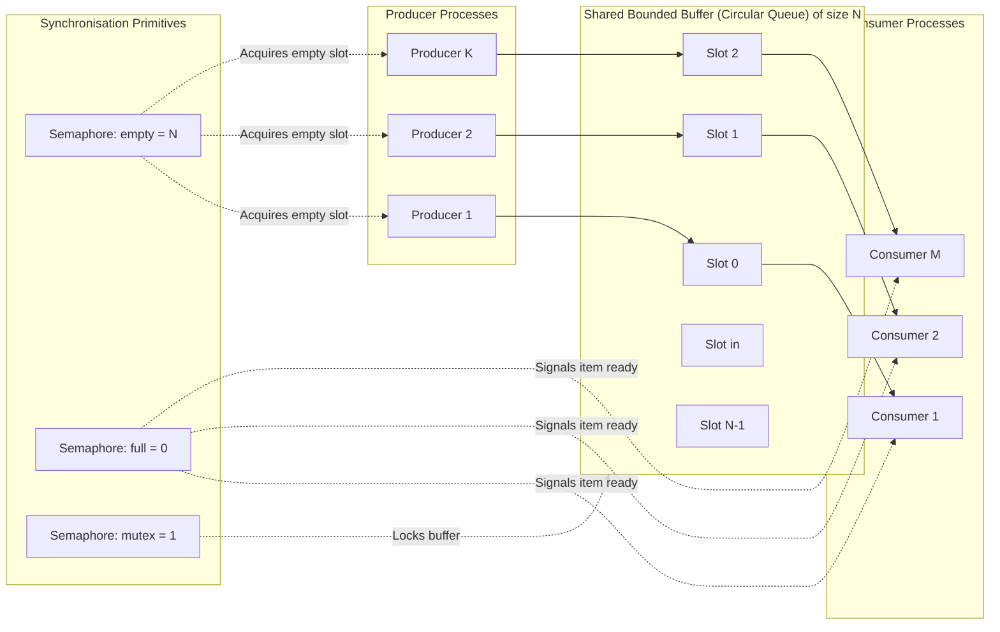
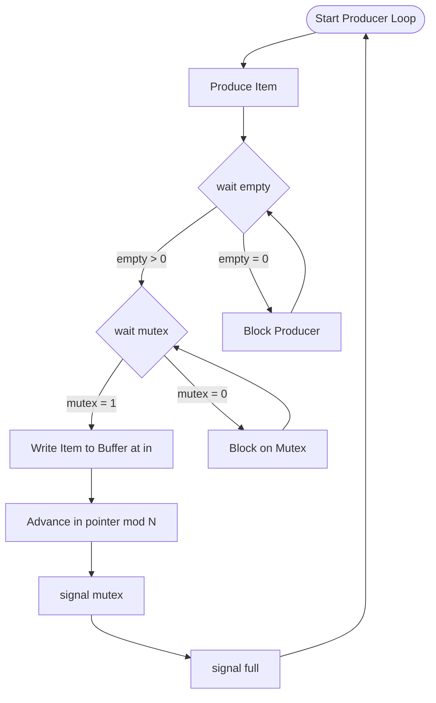
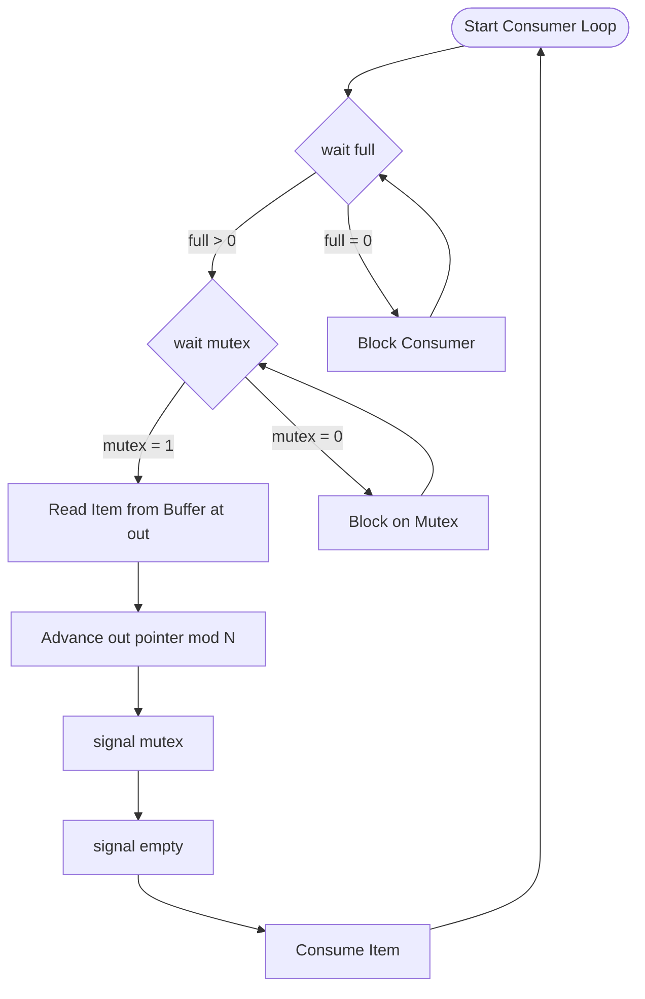
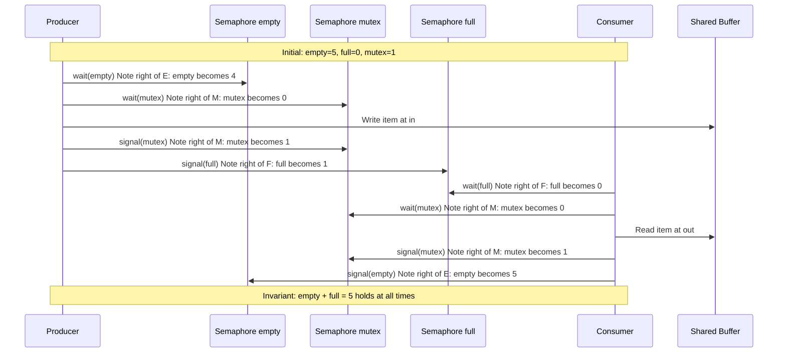
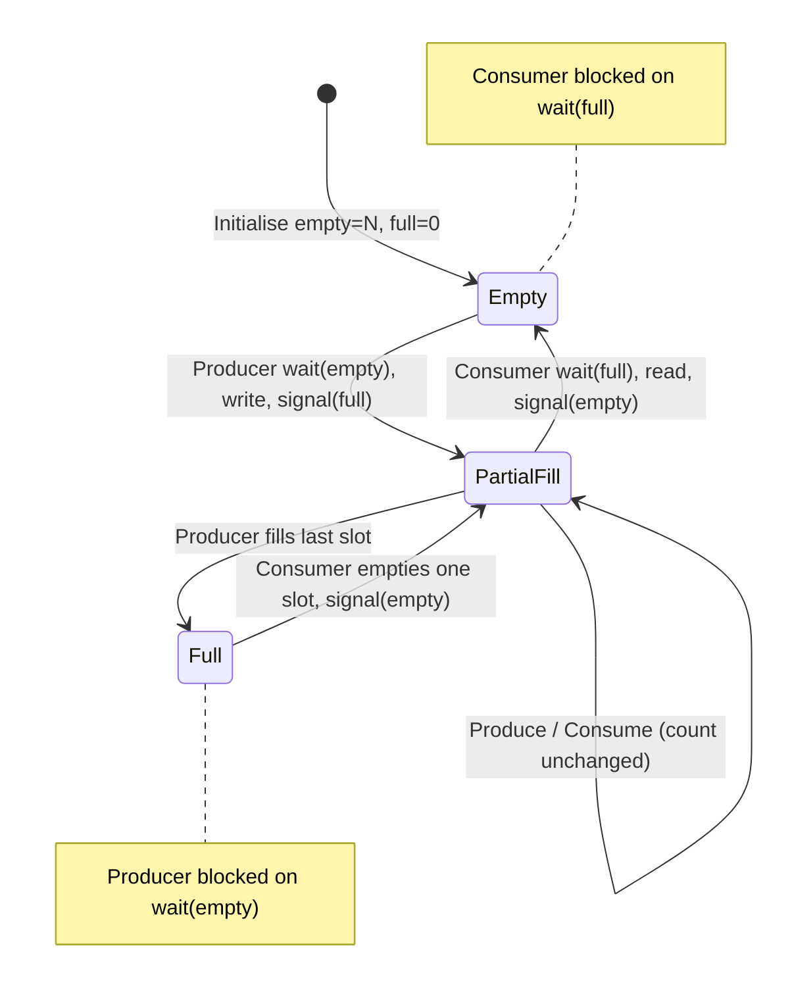

# The Producer/Consumer (Bounded Buffer) Problem and its solution using semaphores

<!-- SECTION_1_START -->

# The Producer/Consumer (Bounded Buffer) Problem

## 1.1 Formal Academic Definition (KTU 2024 Syllabus Terminology)

> [!IMPORTANT]
> **Producer–Consumer (Bounded Buffer) Problem:** A classical **process synchronization** problem in which one or more *producer* processes generate data items and place them into a **fixed-size shared buffer**, while one or more *consumer* processes remove and use these items. The buffer can hold at most **$N$** items simultaneously. The challenge is to ensure that the producer **never writes into a full buffer** and the consumer **never reads from an empty buffer**, while also preserving **mutual exclusion** over the shared buffer structure to prevent **race conditions**.

In KTU 2024 Scheme parlance (PCCST403 — Module 2: *Concurrency and Synchronization*), this is a *representative synchronization problem* that must be solved using either **mutex locks** or **semaphores**. The semaphore-based solution is the board-favoured answer.

**Key Entities Involved:**
- **Buffer** — A shared data structure (commonly a **circular queue**) of size $N$.
- **`in` pointer** — Index where the producer will write the next item.
- **`out` pointer** — Index from where the consumer will read the next item.
- **Semaphores** — $empty$, $full$, and $mutex$ (explained in §2).

---

## 1.2 Intuitive Real-World Analogy

> [!NOTE]
> **Analogy — The Restaurant Buffet Counter:**
> Imagine a **self-service buffet counter** in a hotel that has exactly **5 serving trays** ($N = 5$). The **chef (producer)** keeps refilling empty trays with new dishes, while the **customer (consumer)** picks dishes from the trays. The rules of operation are:
> 1. The **chef cannot place a new dish on a tray that is already full** (no space).
> 2. The **customer cannot pick a dish from an empty tray** (no dish available).
> 3. Only **one person at a time** can access a specific tray (no two hands grabbing the same dish).
>
> This is *exactly* the bounded buffer problem: a fixed-size shared resource accessed concurrently by two classes of processes under strict access rules.

**Geometric Intuition — The Buffer as a Conveyor Belt:**

Think of the buffer as a **circular conveyor belt of $N$ slots**. The producer drops an item at slot $in$, and the consumer picks from slot $out$. Both pointers advance in a *circular* manner, wrapping around from $N-1$ back to $0$. The **state of the belt** at any instant is the tuple $(in, out, count)$, where $count = full$ and $N - count = empty$.

> [!VISUALIZATION CONTROL]
> **Concept:** Circular Bounded Buffer of size $N = 8$ with $in$ and $out$ pointers.
> **GeoGebra / Desmos Input Equations:**
> * Circle: $x^2 + y^2 = 25$
> * Producer pointer: $(3\cos(0), 3\sin(0))$ → slot 0
> * Consumer pointer: $(3\cos(135^\circ), 3\sin(135^\circ))$ → slot 3
> * Filled slots: angles $0^\circ, 45^\circ, 90^\circ$ (between $in$ and $out$ going clockwise)
> **Visual Description:** A circle with 8 equally-spaced tick marks. Three consecutive slots are shaded (representing full buffer entries); the remaining 5 are empty. The $in$ pointer sits at the position right after the last filled slot, and the $out$ pointer sits at the oldest filled slot.

---

<!-- SECTION_1_END -->

<!-- SECTION_2_START -->

# Deep Theoretical Analysis & KTU High-Yield Formula Sheet

## 2.1 The Underlying Synchronization Challenges

The Producer–Consumer problem exposes **three distinct concurrency hazards** that a correct solution must address:

1. **Buffer Overflow (Producer Side):** The producer may attempt to insert into a full buffer, silently overwriting unread data. *This is a logical error, not a hardware fault.*
2. **Buffer Underflow (Consumer Side):** The consumer may attempt to read from an empty buffer, fetching stale or garbage data. *This is also a logical error.*
3. **Race Condition on the Buffer Itself:** Even when the buffer is neither full nor empty, if both producer and consumer manipulate `in`/`out` pointers simultaneously, the resulting interleaving can corrupt the buffer state. *This is a true race condition that demands mutual exclusion.*

A solution is **correct** if and only if it satisfies:
- **Safety:** No buffer overflow, no underflow, no data corruption (mutual exclusion).
- **Liveness:** Neither process is indefinitely blocked (no deadlock, no starvation in well-behaved variants).

---

## 2.2 Semaphores — The Core Primitive

> [!NOTE]
> **Semaphore (Dijkstra, 1965):** A non-negative integer variable $S$ accessed **only** through two **atomic, indivisible** operations:
>
> * **$P(S)$ / `wait(S)` / `down(S)`** (Dutch: *proberen* — "to test"): Decrements $S$ by 1. If the result is **negative**, the calling process is **blocked** and added to $S$'s waiting queue.
> * **$V(S)$ / `signal(S)` / `up(S)`** (Dutch: *verhogen* — "to increment"): Increments $S$ by 1. If the result is **$\leq 0$**, one blocked process from the waiting queue is **woken up**.

**Two Varieties Used in This Solution:**

| Type | Range | Usage in our solution |
| :--- | :--- | :--- |
| **Counting Semaphore** | $S \in \mathbb{Z}_{\geq 0}$ | $empty$ and $full$ — track buffer occupancy. |
| **Binary Semaphore (Mutex)** | $S \in \{0, 1\}$ | $mutex$ — enforce mutual exclusion on the critical section. |

---

## 2.3 The Three-Semaphore Design

The classical textbook solution (Silberschatz, Galvin & Gagne — the KTU-recommended reference) employs **three semaphores** initialised as follows:

$$\begin{aligned}
empty &= N \quad \text{(number of empty slots available)} \\
full  &= 0 \quad \text{(number of items available to consume)} \\
mutex &= 1 \quad \text{(binary lock for the critical section)}
\end{aligned}$$

**Role of each semaphore — the "why" behind the design:**

- **`empty`:** Acts as a **gatekeeper for the producer**. The producer must acquire an empty slot before it can write. If $empty = 0$, the producer blocks. This **prevents buffer overflow**.
- **`full`:** Acts as a **gatekeeper for the consumer**. The consumer must acquire a produced item before it can read. If $full = 0$, the consumer blocks. This **prevents buffer underflow**.
- **`mutex`:** Protects the **critical section** — the code that actually manipulates `in`, `out`, and the buffer array. Ensures that the producer and consumer do not interleave their buffer accesses, eliminating the race condition.

> [!IMPORTANT]
> **Key Invariant (Conservation Law):** At every point in time during execution,
> $$empty + full = N$$
> This invariant holds because the two operations on the buffer — *produce* (which decrements `empty`, increments `full`) and *consume* (which increments `empty`, decrements `full`) — are exact inverses. The buffer size $N$ is never violated.

---

## 2.4 KTU High-Yield Formula Sheet

| # | Concept | Formula / Rule | Purpose |
| :--- | :--- | :--- | :--- |
| 1 | Initial values | $empty = N,\ full = 0,\ mutex = 1$ | Setup for an empty, unlocked buffer. |
| 2 | Conservation invariant | $empty + full = N$ | Buffer size is preserved. |
| 3 | Occupancy bound | $0 \leq full \leq N$ | Buffer never underflows or overflows. |
| 4 | `wait(S)` effect | $S \leftarrow S - 1$; block if $S < 0$ | Atomic acquire. |
| 5 | `signal(S)` effect | $S \leftarrow S + 1$; wake one if $S \leq 0$ | Atomic release. |
| 6 | Producer order | `wait(empty)` $\rightarrow$ `wait(mutex)` | Prevents deadlock. |
| 7 | Consumer order | `wait(full)` $\rightarrow$ `wait(mutex)` | Prevents deadlock. |
| 8 | Mutex release | Always `signal(mutex)` after critical section | Ensures liveness. |
| 9 | Circular advance | $in \leftarrow (in + 1) \bmod N$ | Wraps around the buffer. |
| 10 | Critical section | Only the buffer manipulation block | Scope of mutual exclusion. |

---

## 2.5 Real-World Engineering Utility

The bounded buffer pattern is **the foundational architecture of every asynchronous pipeline**:

- **Operating System Kernels:** Unix pipes, the `print spooler`, and the I/O request queue all use bounded buffers.
- **Multimedia Systems:** Video streamers pre-fetch frames into a decoder buffer (size $\approx$ 3–5 seconds of content) so the decoder never starves.
- **Producer–Consumer Threading:** Log aggregators (Kafka, RabbitMQ) use a bounded buffer per partition to **apply back-pressure** — when consumers lag, producers block, preventing memory exhaustion.
- **Hardware:** DMA controllers, network interface card ring buffers, and CPU instruction pipelines are *all* bounded buffers synchronised via hardware semaphores (full/empty flags).

> [!NOTE]
> In modern Python, the `queue.Queue(maxsize=N)` class implements this exact algorithm using `threading.Semaphore` internally. Studying the bounded-buffer solution teaches the *principle* that library abstractions encapsulate.

---

<!-- SECTION_2_END -->

<!-- SECTION_3_START -->

# Step-by-Step Derivations & Code/Symbolic Implementation

## 3.1 The Pseudo-Code Solution (Silberschatz Textbook Standard)

> [!NOTE]
> **Shared Data (Kernel-level global state):**
> * `int buffer[N];` — the bounded circular queue
> * `semaphore empty = N;` — counts empty slots
> * `semaphore full  = 0;` — counts full slots
> * `semaphore mutex = 1;` — binary lock for critical section
> * `int in = 0;` — next write position
> * `int out = 0;` — next read position

### 3.1.1 Producer Process (Exhaustive Pseudo-Code)

```
PRODUCER PROCESS
================
while (true) {                         // [1] Infinite production loop
    item = produce_item();             // [2] Generate next item (outside CS)
    wait(empty);                       // [3] Decrement empty; block if buffer full
    wait(mutex);                       // [4] Acquire buffer lock; block if consumer holds it
                                       // ── CRITICAL SECTION BEGINS ──
    buffer[in] = item;                 // [5] Write item into current slot
    in = (in + 1) % N;                 // [6] Advance in pointer circularly
                                       // ── CRITICAL SECTION ENDS ──
    signal(mutex);                     // [7] Release buffer lock
    signal(full);                      // [8] Increment full; wake consumer if waiting
}
```

### 3.1.2 Consumer Process (Exhaustive Pseudo-Code)

```
CONSUMER PROCESS
================
while (true) {                         // [1] Infinite consumption loop
    wait(full);                        // [2] Decrement full; block if buffer empty
    wait(mutex);                       // [3] Acquire buffer lock; block if producer holds it
                                       // ── CRITICAL SECTION BEGINS ──
    item = buffer[out];                // [4] Read item from current slot
    out = (out + 1) % N;               // [5] Advance out pointer circularly
                                       // ── CRITICAL SECTION ENDS ──
    signal(mutex);                     // [6] Release buffer lock
    signal(empty);                     // [7] Increment empty; wake producer if waiting
    consume_item(item);                // [8] Use the item (outside CS)
}
```

> [!IMPORTANT]
> **The Order of `wait()` Operations is Non-Negotiable.** Always acquire the **counting semaphore first** (`empty` or `full`), and the **mutex second**. If this order is reversed, **circular wait** arises, and the system can deadlock.
> *Example of deadlock:* Both producer and consumer could end up holding $mutex$ and waiting for the other to release $empty$ or $full$ — a classic hold-and-wait cycle.

---

## 3.2 Worked Trace Example ($N = 5$, $in = 0$, $out = 0$)

**Initial State:** $empty = 5,\ full = 0,\ mutex = 1$.

| Step | Action | Pre-State | $empty$ | $full$ | $mutex$ | Buffer | Comment |
| :---: | :--- | :---: | :---: | :---: | :---: | :--- | :--- |
| 0 | Initial | — | **5** | **0** | **1** | `[ _ , _ , _ , _ , _ ]` | Buffer empty. |
| 1 | Producer: `wait(empty)` | $5,0,1$ | 4 | 0 | 1 | `[ _ , _ , _ , _ , _ ]$ | Empty slot acquired. |
| 2 | Producer: `wait(mutex)` | $4,0,1$ | 4 | 0 | 0 | `[ _ , _ , _ , _ , _ ]$ | Lock acquired. |
| 3 | Producer writes `P1` at `in=0` | $4,0,0$ | 4 | 0 | 0 | `[ P1, _ , _ , _ , _ ]` | Item 1 placed. |
| 4 | Producer: $in \leftarrow (0+1)\%5 = 1$ | $4,0,0$ | 4 | 0 | 0 | `[ P1, _ , _ , _ , _ ]$ | Pointer advanced. |
| 5 | Producer: `signal(mutex)` | $4,0,0$ | 4 | 0 | 1 | `[ P1, _ , _ , _ , _ ]$ | Lock released. |
| 6 | Producer: `signal(full)` | $4,0,1$ | 4 | 1 | 1 | `[ P1, _ , _ , _ , _ ]$ | Consumer can now proceed. |
| 7 | Producer: `wait(empty)` | $4,1,1$ | 3 | 1 | 1 | `[ P1, _ , _ , _ , _ ]$ | Acquires next empty. |
| 8 | Producer: writes `P2` at `in=1` | $3,1,0$ | 3 | 1 | 0 | `[ P1, P2, _ , _ , _ ]$ | Item 2 placed. |
| 9 | Consumer: `wait(full)` | $3,1,0$ | 3 | 0 | 0 | `[ P1, P2, _ , _ , _ ]$ | Reads P1. |
| 10 | Consumer: reads `P1` at `out=0` | $3,0,0$ | 3 | 0 | 0 | `[ _ , P2, _ , _ , _ ]$ | Item 1 removed. |
| 11 | Consumer: $out \leftarrow 1$ | $3,0,0$ | 3 | 0 | 0 | `[ _ , P2, _ , _ , _ ]$ | Pointer advanced. |
| 12 | Consumer: `signal(mutex)` | $3,0,0$ | 3 | 0 | 1 | `[ _ , P2, _ , _ , _ ]$ | Lock released. |
| 13 | Consumer: `signal(empty)` | $3,0,1$ | 4 | 0 | 1 | `[ _ , P2, _ , _ , _ ]$ | Producer can fill slot 0. |

**Conservation Check at every step:** $empty + full = 5 = N$ ✔

---

## 3.3 Production-Grade Python Implementation

The following Python code uses `threading.Semaphore` to faithfully implement the textbook algorithm. It includes explicit type hints, robust error handling, and configurable buffer size.

```python
"""
producer_consumer.py
A faithful semaphore-based implementation of the Bounded Buffer problem
using Python's threading primitives. Mirrors the Silberschatz pseudo-code.
"""
import threading
import time
import random
import logging
from typing import List

# ─── Configuration ───────────────────────────────────────────────────────────
BUFFER_SIZE: int = 5
NUM_PRODUCERS: int = 2
NUM_CONSUMERS: int = 2
TOTAL_ITEMS: int = 20
LOG_FILE: str = "bounded_buffer.log"

# ─── Logging Setup ──────────────────────────────────────────────────────────
logging.basicConfig(
    filename=LOG_FILE,
    level=logging.INFO,
    format="%(asctime)s [%(threadName)-12s] %(levelname)s: %(message)s",
)
console = logging.StreamHandler()
console.setLevel(logging.INFO)
logging.getLogger().addHandler(console)

# ─── Shared Resources ───────────────────────────────────────────────────────
buffer: List[int] = [0] * BUFFER_SIZE          # Pre-allocated circular buffer
in_index: int = 0                               # Producer write pointer
out_index: int = 0                              # Consumer read pointer

# The three semaphores — initialized exactly as in the textbook.
empty: threading.Semaphore = threading.Semaphore(BUFFER_SIZE)  # N
full:  threading.Semaphore = threading.Semaphore(0)            # 0
mutex: threading.Semaphore = threading.Semaphore(1)            # 1

# Counter shared across producers to assign unique item IDs.
item_counter: int = 0
counter_lock: threading.Lock = threading.Lock()  # Protects item_counter only


def producer(thread_id: int) -> None:
    """Producer process — appends items to the bounded buffer."""
    global in_index, item_counter
    while True:
        with counter_lock:
            item_counter += 1
            item = item_counter
            if item > TOTAL_ITEMS:
                logging.info(f"Producer-{thread_id}: All items produced. Exiting.")
                return  # Graceful termination after TOTAL_ITEMS.

        # Simulate variable production time.
        time.sleep(random.uniform(0.05, 0.20))

        # ── Algorithm from §3.1.1 ──
        empty.acquire()      # wait(empty) — block if buffer full
        mutex.acquire()      # wait(mutex) — enter critical section

        # CRITICAL SECTION
        buffer[in_index] = item
        in_index = (in_index + 1) % BUFFER_SIZE
        snapshot = buffer.copy()

        mutex.release()      # signal(mutex)
        full.release()       # signal(full)  — wake consumer

        logging.info(f"Producer-{thread_id} produced item {item}. Buffer: {snapshot}")


def consumer(thread_id: int) -> None:
    """Consumer process — removes and consumes items from the buffer."""
    global out_index
    consumed = 0
    target = TOTAL_ITEMS // NUM_CONSUMERS  # Each consumer handles a fair share.
    while consumed < target:
        # ── Algorithm from §3.1.2 ──
        full.acquire()       # wait(full) — block if buffer empty
        mutex.acquire()      # wait(mutex) — enter critical section

        # CRITICAL SECTION
        item = buffer[out_index]
        buffer[out_index] = 0  # Visualise consumption.
        out_index = (out_index + 1) % BUFFER_SIZE
        snapshot = buffer.copy()

        mutex.release()      # signal(mutex)
        empty.release()      # signal(empty) — wake producer

        consumed += 1
        logging.info(f"Consumer-{thread_id} consumed item {item}. Buffer: {snapshot}")

        # Simulate variable consumption time.
        time.sleep(random.uniform(0.05, 0.20))


def main() -> None:
    """Spawn producers and consumers, then join all threads."""
    try:
        producers: List[threading.Thread] = [
            threading.Thread(target=producer, args=(i,), name=f"Prod-{i}")
            for i in range(NUM_PRODUCERS)
        ]
        consumers: List[threading.Thread] = [
            threading.Thread(target=consumer, args=(i,), name=f"Cons-{i}")
            for i in range(NUM_CONSUMERS)
        ]

        for t in producers + consumers:
            t.start()
        for t in producers + consumers:
            t.join()

        logging.info("All threads terminated. Simulation complete.")
    except Exception as exc:
        logging.error(f"Fatal error in main: {exc}", exc_info=True)


if __name__ == "__main__":
    main()
```

**Key Faithfulness Checks:**
- `empty` initialised to `BUFFER_SIZE` (matches $empty = N$).
- `full` initialised to `0` (matches $full = 0$).
- `mutex` initialised to `1` (matches $mutex = 1$).
- Producer sequence: `empty.acquire()` $\rightarrow$ `mutex.acquire()` $\rightarrow$ buffer write $\rightarrow$ `mutex.release()` $\rightarrow$ `full.release()`.
- Consumer sequence: `full.acquire()` $\rightarrow$ `mutex.acquire()` $\rightarrow$ buffer read $\rightarrow$ `mutex.release()` $\rightarrow$ `empty.release()`.

---

## 3.4 Proof of Correctness (Sketch for KTU Theory)

To score full marks on theory questions, a KTU student should be able to sketch the following three arguments:

1. **Mutual Exclusion:** The `mutex` semaphore is binary and is acquired before either process enters its critical section. By definition of a binary semaphore, only one of them can hold `mutex` at any instant. Hence, the buffer manipulation is serialised. *No race condition on `in`/`out` pointers or buffer slots.*

2. **No Buffer Overflow:** The producer executes `wait(empty)` *before* `wait(mutex)`. Since $empty \geq 0$ is maintained and $wait(empty)$ blocks the producer when $empty = 0$, the producer cannot reach the write step unless an empty slot is guaranteed. *Buffer never written when full.*

3. **No Buffer Underflow:** The consumer executes `wait(full)` *before* `wait(mutex)`. Since $wait(full)$ blocks the consumer when $full = 0$, the consumer cannot reach the read step unless a produced item is guaranteed. *Buffer never read when empty.*

4. **Deadlock Freedom:** A deadlock would require both processes to hold one semaphore and wait for another held by the other. But the counting semaphores are acquired *first* and released *last* in each process. A producer blocked on `wait(empty)` is *not* holding `mutex`, and vice versa. The circular-wait condition for deadlock is broken.

---

<!-- SECTION_3_END -->

<!-- SECTION_4_START -->

# Structural Diagrams & Schematics

## 4.1 System-Level Architecture (Block Diagram)



---

## 4.2 Producer Process — Control Flow



---

## 4.3 Consumer Process — Control Flow



---

## 4.4 Sequence Diagram — Producer and Consumer Interleaving



---

## 4.5 Buffer State Diagram (Block-Level State Machine)



---

<!-- SECTION_4_END -->

<!-- SECTION_5_START -->

# KTU 2024 Scheme Examination Question Bank & Topic Recap

---

## Part A — 3-Mark Questions (Cognitive Levels: Remember / Understand)

### **Q1. Define the Producer–Consumer (Bounded Buffer) problem.** `[KTU University Exam – Dec 2023]` | **CO2 / Remember**

**Model Answer (3 Marks):**
The Producer–Consumer problem is a classical synchronization problem where one or more **producer** processes generate data items and place them into a **fixed-size shared buffer** (size $N$), while one or more **consumer** processes remove and use these items. The challenge is to ensure that the producer never writes to a full buffer, the consumer never reads from an empty buffer, and the buffer itself is accessed under **mutual exclusion** to prevent race conditions. Example: a print spooler accepting print jobs from multiple users.

---

### **Q2. List the three semaphores used in the bounded buffer solution and state their initial values.** `[KTU University Exam – July 2024]` | **CO2 / Understand**

**Model Answer (3 Marks):**
The three semaphores used are:
1. **`empty`** — counting semaphore, initial value $= N$ (number of empty slots).
2. **`full`** — counting semaphore, initial value $= 0$ (no produced items yet).
3. **`mutex`** — binary semaphore, initial value $= 1$ (buffer initially unlocked).

These together enforce *no overflow* (`empty`), *no underflow* (`full`), and *mutual exclusion* (`mutex`).

---

### **Q3. Why is the order of `wait()` operations critical in the producer and consumer processes?** `[KTU University Exam – Dec 2022]` | **CO3 / Understand**

**Model Answer (3 Marks):**
The order is critical to **avoid deadlock**. The counting semaphore (`empty` for producer, `full` for consumer) is acquired **first**, and the binary semaphore (`mutex`) is acquired **second**. If reversed, both processes could simultaneously hold `mutex` and block on the counting semaphore held by the other, creating a **circular-wait deadlock**. The correct order ensures that a process blocked on a counting semaphore is *not* holding `mutex`.

---

## Part B — 14-Mark Questions (Module Internal Choice)

### **Question A (14 Marks):**
**Explain the Producer–Consumer (Bounded Buffer) problem with a suitable real-world example. Design a semaphore-based solution for a buffer of size $N = 10$, listing the shared data, initial semaphore values, and pseudo-code for both processes. Justify the correctness of your solution.** `[KTU University Exam – July 2024]` | **CO2, CO3 / Apply, Analyse**

**Model Solution:**

#### Part (a) — Problem Description, Shared Data & Semaphores (7 Marks)

The Producer–Consumer problem models **two classes of concurrent processes** sharing a fixed-size buffer. Producers generate data items; consumers remove them. A real-world example is a **YouTube video pipeline**: the *encoder thread* (producer) writes compressed video frames into a fixed-size decoder buffer of size $N = 10$ frames, while the *decoder thread* (consumer) reads frames for playback. The encoder must pause if the buffer is full (back-pressure), and the decoder must pause if no new frame is available.

**Shared Data Structure** (defined globally):

$$\begin{aligned}
\text{int } & buffer[10]; \quad \text{// circular queue of 10 slots} \\
\text{int } & in = 0, \ out = 0; \quad \text{// producer and consumer pointers} \\
\text{semaphore } & empty = 10; \quad \text{// empty slots available} \\
\text{semaphore } & full  = 0; \quad \text{// produced items available} \\
\text{semaphore } & mutex = 1; \quad \text{// binary lock for the buffer}
\end{aligned}$$

**Valuation Key:**
- *Stating the problem with example: 2 Marks*
- *Listing shared data and the three semaphores with initial values: 3 Marks*
- *Explaining the role of each semaphore: 2 Marks*

#### Part (b) — Pseudo-Code and Correctness Justification (7 Marks)

**Producer Pseudo-Code:**

```
Producer() {
    while (true) {
        item = produce_item();           // generate next item
        wait(empty);                     // block if buffer full (empty == 0)
        wait(mutex);                     // acquire buffer lock
        buffer[in] = item;               // write item into current slot
        in = (in + 1) % 10;              // advance in pointer circularly
        signal(mutex);                   // release buffer lock
        signal(full);                    // signal consumer: one new item ready
    }
}
```

**Consumer Pseudo-Code:**

```
Consumer() {
    while (true) {
        wait(full);                      // block if buffer empty (full == 0)
        wait(mutex);                     // acquire buffer lock
        item = buffer[out];              // read item from current slot
        out = (out + 1) % 10;            // advance out pointer circularly
        signal(mutex);                   // release buffer lock
        signal(empty);                   // signal producer: one empty slot freed
        consume_item(item);              // process the item
    }
}
```

**Correctness Justification:**

1. **Mutual Exclusion:** The `mutex` semaphore is binary. Only the process that holds it can manipulate `buffer[]`, `in`, or `out`. Therefore, the critical section is serialised — **no race condition**. *[2 Marks]*
2. **No Overflow:** The producer calls `wait(empty)` *before* `wait(mutex)`. Since `wait(empty)` blocks when $empty = 0$, the producer cannot reach the write step without a guaranteed empty slot. *[1 Mark]*
3. **No Underflow:** The consumer calls `wait(full)` *before* `wait(mutex)`. Since `wait(full)` blocks when $full = 0$, the consumer cannot reach the read step without a guaranteed produced item. *[1 Mark]*
4. **Deadlock Freedom:** A process blocked on the counting semaphore (`empty` or `full`) is *not* holding `mutex`. The circular-wait condition is therefore broken — **no deadlock is possible**. *[1 Mark]*

**Valuation Key:**
- *Producer pseudo-code: 2 Marks*
- *Consumer pseudo-code: 2 Marks*
- *Mutual exclusion argument: 2 Marks*
- *Overflow / underflow / deadlock argument: 1 Mark*

---

### **Question B (14 Marks) — Alternative Choice:**
**Differentiate between binary and counting semaphores. With reference to the bounded buffer problem, explain how the choice of semaphores ensures process synchronization. Also discuss what happens if the order of `wait()` operations is reversed in either process.** `[KTU University Exam – Dec 2023]` | **CO2, CO3 / Understand, Analyse**

**Model Solution Outline:**

#### Part (a) — Semaphore Types and Their Roles in the Solution (7 Marks)

| Feature | Binary Semaphore | Counting Semaphore |
| :--- | :--- | :--- |
| **Range of values** | $S \in \{0, 1\}$ | $S \in \mathbb{Z}_{\geq 0}$ |
| **Purpose** | Mutual exclusion | Resource counting |
| **In this problem** | `mutex` — protects the buffer | `empty` and `full` — track buffer slots |
| **Initial value** | $1$ | $empty = N$, $full = 0$ |

The binary semaphore `mutex` provides **mutual exclusion** — only one process enters the critical section at a time, protecting the shared `in`/`out` pointers and the buffer slots. The counting semaphores `empty` and `full` act as **resource counters**: `empty` blocks the producer when no slot is free (preventing overflow), and `full` blocks the consumer when no item is available (preventing underflow). Together, they implement **conditional synchronization** (process blocks until a precondition is met), not just mutual exclusion.

*[Valuation: 2 Marks for the comparison table, 3 Marks for the role of each semaphore, 2 Marks for the conditional synchronization concept.]*

#### Part (b) — Deadlock from Reversed `wait()` Order (7 Marks)

Consider a reversal in the **producer**:

```
// WRONG producer (deadlock-prone)
wait(mutex);   // acquire lock first
wait(empty);   // then check for empty slot
```

**Failure Scenario:** Suppose the buffer is **full** ($empty = 0$). The producer calls `wait(mutex)`, which succeeds (since no one holds it). It then calls `wait(empty)`, which **blocks** the producer. The producer is now **holding `mutex` while blocked**. If a consumer now tries to run, it calls `wait(full)` (succeeds), then `wait(mutex)`, which **blocks** because the producer holds it. Now both are blocked: producer waits for `empty`, consumer waits for `mutex`. **This is a classic circular-wait deadlock.**

$$\text{Producer holds: } \{mutex\} \quad \text{Producer waits for: } \{empty\}$$
$$\text{Consumer holds: } \{full\} \quad \text{Consumer waits for: } \{mutex\}$$

The system is **permanently stuck**. The same deadlock arises if the consumer's order is reversed. **Correct Order:** Always acquire the *counting* semaphore first, then `mutex`. This way, a process blocked on the counting semaphore is not holding `mutex`, breaking the circular-wait condition.

*[Valuation: 3 Marks for identifying the deadlock scenario, 2 Marks for the circular-wait argument, 2 Marks for the correct-order fix.]*

---

> [!WARNING]
> **KTU Examiner's Valuation Warning — Common Pitfalls:**
> 1. **Forgetting to declare the semaphores globally.** Each process must see the same semaphore variables; declare them in shared memory. *Loss: 1 Mark per instance.*
> 2. **Writing `wait(mutex)` before `wait(empty)` or `wait(full)`.** This is the most common error and *immediately* introduces deadlock. KTU examiners specifically check this order. *Loss: 2–3 Marks.*
> 3. **Forgetting to call `signal(mutex)` after the critical section.** This leaks the lock, and the system will eventually deadlock. *Loss: 1–2 Marks.*
> 4. **Confusing `in` and `out` pointer advancement.** The producer uses `in`; the consumer uses `out`. *Loss: 1 Mark.*
> 5. **Not modularising `in` and `out` with `N`.** Always write `in = (in + 1) % N`, never `in = in + 1`. *Loss: 1 Mark.*
> 6. **Stating the initial value of `empty` as `0`.** This is wrong — `empty` starts at $N$, not $0$. *Loss: 1 Mark.*

---

## Topic Recap & Important Things to Remember

> [!NOTE]
> **Rapid Revision Checklist — Producer–Consumer (Bounded Buffer) Problem**

- **Problem Essence:** A fixed-size shared buffer is concurrently accessed by producer and consumer processes; synchronization must prevent overflow, underflow, and race conditions.
- **Three Semaphores:**
  - `empty` (counting) — initialised to $N$.
  - `full` (counting) — initialised to $0$.
  - `mutex` (binary) — initialised to $1$.
- **Conservation Invariant:** $empty + full = N$ at every instant.
- **Producer Algorithm:** `wait(empty)` $\rightarrow$ `wait(mutex)` $\rightarrow$ *write to buffer at `in`* $\rightarrow$ `in = (in+1) \% N` $\rightarrow$ `signal(mutex)` $\rightarrow$ `signal(full)`.
- **Consumer Algorithm:** `wait(full)` $\rightarrow$ `wait(mutex)` $\rightarrow$ *read from buffer at `out`* $\rightarrow$ `out = (out+1) \% N` $\rightarrow$ `signal(mutex)` $\rightarrow$ `signal(empty)` $\rightarrow$ *consume item*.
- **Golden Rule:** Always acquire the **counting semaphore first**, the **mutex second**. Reverse order $\Rightarrow$ **deadlock**.
- **Buffer is a Circular Queue:** Pointers wrap around using `\% N` to reuse slots.
- **Role of `mutex`:** Protects the critical section (the `buffer[in] = item` / `item = buffer[out]` operations) from interleaved access.
- **Role of `empty`:** Back-pressure on the producer — pauses production when buffer is full.
- **Role of `full`:** Back-pressure on the consumer — pauses consumption when buffer is empty.
- **Correctness Properties:** Safety (mutual exclusion, no overflow, no underflow) and Liveness (no deadlock, no starvation in fair semaphore variants).
- **Real-World Equivalents:** Unix pipes, print spoolers, video decoder buffers, Kafka partitions, OS device drivers, DMA ring buffers.
- **Boundary Checks:** $0 \leq full \leq N$, $0 \leq empty \leq N$, and $0 \leq in, out < N$ at all times.
- **Atomicity:** Semaphore `wait`/`signal` operations must be implemented as **atomic** at the kernel level (often via hardware `test-and-set` or `compare-and-swap` instructions).
- **Differences from Unbounded Buffer:** An unbounded buffer has no fixed $N$, so only `mutex` is needed; `empty` is omitted (producer never blocks), but `full` is still required (consumer blocks if no item).

<!-- SECTION_5_END -->
