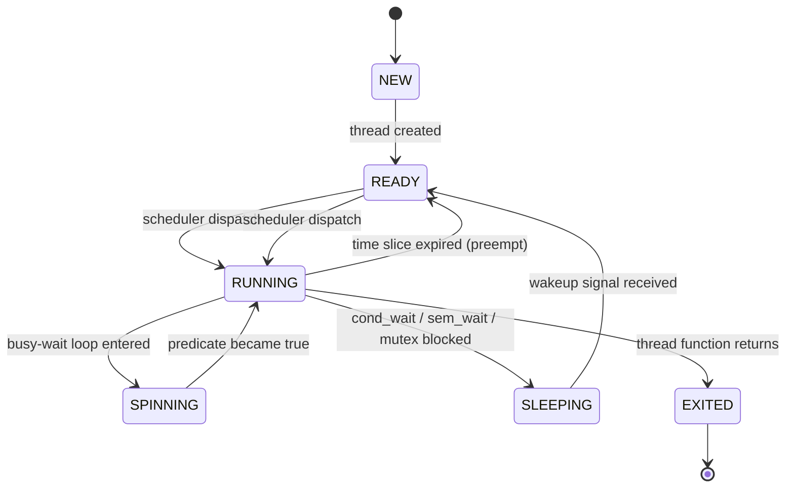
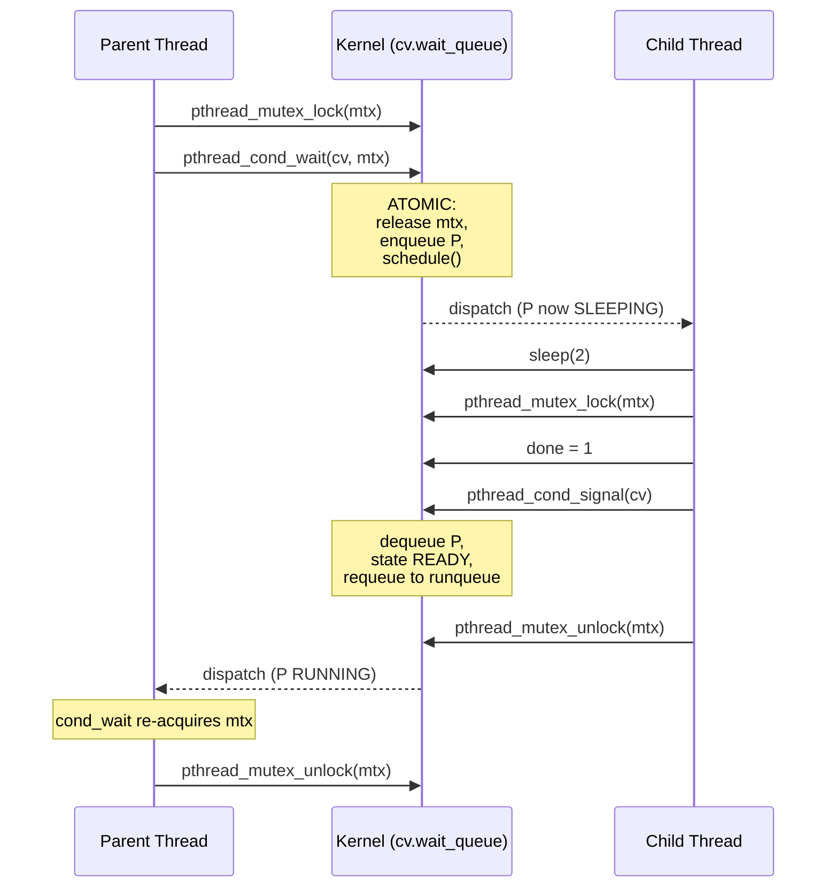

# Using Queues: Sleeping Instead Of Spinning

<!-- SECTION_1_START -->
# Using Queues: Sleeping Instead Of Spinning

## 1. Core Technical Definition

> [!IMPORTANT]
> **Formal Definition (KTU 2024 Syllabus Terminology):**
> In concurrent programming, **sleeping instead of spinning** is a synchronization strategy where a thread, upon discovering that a required condition (lock, resource, or event) is unavailable, voluntarily relinquishes the CPU by enqueuing itself onto a **wait queue (sleep queue)** associated with that condition variable or semaphore. The thread is transitioned from the **RUNNING** state to the **SLEEPING (BLOCKED)** state by the OS scheduler. It is later **woken up (dequeued and made READY)** by another thread that signals the condition via a wakeup primitive such as `signal()`, `broadcast()`, or `V()`/`up()`.

### Comparison with Spinning (Busy-Waiting)

| Parameter | Spinning (Busy-Wait) | Sleeping (Blocking) |
|-----------|---------------------|---------------------|
| CPU Usage | **Wastes 100% CPU cycles** | **Releases CPU to other threads** |
| State Transition | No — stays in RUNNING | RUNNING $\rightarrow$ SLEEPING $\rightarrow$ READY |
| Mechanism | Tight `while` loop checking a flag | Enqueue on wait queue, context switch out |
| Latency to Resume | Immediate (no context switch) | Delayed by scheduler (context switch cost $\approx$ $\mathbf{1-100\ \mu s}$) |
| Scalability | Poor (thrashes with many threads) | Excellent |
| Use Case | Short critical sections, multi-core spinlocks | Long waits, I/O, mutexes, cond vars, semaphores |

> [!NOTE]
> **KTU 2024 High-Yield Takeaway:** Every modern synchronization primitive — **mutexes, condition variables, semaphores, monitors, and blocking I/O** — uses an underlying **kernel-managed FIFO wait queue** so that waiting threads *sleep* rather than *spin*. Spinning is preserved only for very short, bounded waits (e.g., **two-thread spinlocks** in kernel space).

### Intuitive Real-World Analogy

Imagine you are at a coffee shop during the morning rush.

- **Spinning (Busy-Waiting):** You stand at the counter staring at the barista, yelling *"Is it ready? Is it ready? Is it ready?"* every 5 milliseconds. You block other customers, the barista is annoyed, and you waste enormous energy — yet the coffee takes 4 minutes to brew. This is what `while (flag == 0);` does to the CPU.

- **Sleeping (Blocking):** You give the barista your name, the barista writes it on a **wait list (queue)**, and tells you *"Go sit down — I will call you."* You stop bothering the counter, take a seat, and your body rests. When the espresso is poured, the barista looks at the list, finds your name, and **wakes you up** ("Order for Anu!"). You return to the counter. The wait list is the **sleep queue**, the act of taking a seat is the **context switch**, and the barista calling your name is the **wakeup signal**.

> [!VISUALIZATION CONTROL]
> **Concept:** CPU Utilization vs Time, contrasting Spinning and Sleeping
> **GeoGebra / Desmos Input Equations:**
> * `f(x) = 1` for $0 \le x \le 5$ (Spinning thread — always 100% busy)
> * `g(x) = piecewise(1, 0 <= x <= 0.1, 0, 0.1 < x < 4.9, 1, 4.9 <= x <= 5)` (Sleeping thread — bursts only when scheduled)
> **Visual Description:** $f(x)$ is a flat horizontal line at CPU usage 1.0. $g(x)$ is mostly at 0.0 with two sharp spikes at the beginning and end, illustrating that the sleeping thread yields the CPU for the entire 4.8-second wait duration.
<!-- SECTION_1_END -->

<!-- SECTION_2_START -->
# 2. Deep Theoretical Analysis

## 2.1 The Three Operations of a Sleep-Based Primitive

Every kernel wait-queue mechanism exposes three canonical operations. Together they form the foundation of condition variables, semaphores, and blocking I/O.

### Step 1 — `wait(sleep_queue, lock)`
The thread atomically:
1. **Releases** the held mutex/lock.
2. **Enqueues** its `thread_descriptor` (PCB / TCB pointer) at the tail of the FIFO sleep queue.
3. **Calls the scheduler** via `schedule()`, transitioning to the BLOCKED state.
4. Upon re-wakeup, atomically **re-acquires** the lock before returning.

> [!IMPORTANT]
> **Atomicity is the crux.** The release-of-lock and the enqueue must be a single atomic kernel operation. If they were separate, a producer could `signal()` between them, and the wakeup would be lost (the *lost-wakeup problem*). Linux's `prepare_to_wait()` / `finish_wait()` and POSIX's `pthread_cond_wait()` solve this inside the kernel.

### Step 2 — `wake_one(sleep_queue)` (a.k.a. `signal`, `V`, `up`)
- Dequeues **one** TCB from the head of the queue.
- Moves it from **BLOCKED $\rightarrow$ READY** by calling `try_to_wake_up()`.
- The scheduler decides when it next runs (no guarantee of immediate execution).

### Step 3 — `wake_all(sleep_queue)` (a.k.a. `broadcast`, `V` on broadcast semaphores)
- Dequeues **all** TCBs and places them in the ready queue.
- Used when multiple waiters might now satisfy their condition.

## 2.2 The Fundamental Trade-Off: Spin vs Sleep

Let $T_{cs}$ be the context-switch cost and $T_{wait}$ be the expected wait time.

$$
\text{Strategy} = \begin{cases} \text{Spin} & \text{if } T_{wait} \ll T_{cs} \quad (\text{typically } T_{wait} < 2 \cdot T_{cs}) \\[4pt] \text{Sleep} & \text{if } T_{wait} \gg T_{cs} \end{cases}
$$

| Scenario | Recommended | Reason |
|----------|-------------|--------|
| Lock held for $< 10\ \mu s$, single CPU busy core | **Spin** | Context switch is more expensive than waiting |
| Lock held for $> 50\ \mu s$ | **Sleep** | Wasting CPU hurts throughput |
| I/O wait, page fault, semaphore wait | **Sleep (mandatory)** | Hardware blocks the thread, OS must queue it |
| Many threads (1000s) competing for one lock | **Sleep** | Spinning causes **thundering herd** & cache thrash |

## 2.3 Mesa Semantics vs Hoare Semantics

> [!NOTE]
> **KTU Frequently Tested Concept:** When a thread is woken from a wait queue, which thread runs next?

- **Hoare Semantics (1974):** The signaler **immediately yields** the CPU and the waiter runs *right now*. Strict handover. Easier to reason about, but requires an extra context switch.
- **Mesa Semantics (Xerox PARC, 1980 — used in Java, POSIX, Linux):** The signaler **continues running**; the waiter is just moved to the **READY** queue. The waiter must re-check the predicate in a `while` loop because the condition may have changed.

Consequence: **always use `while (condition)` not `if (condition)` around `cond_wait`.**

$$
\text{Mesa idiom} \Rightarrow \text{while (!predicate) } \texttt{cond\_wait();} \quad \text{(spurious wakeup safe)}
$$

## 2.4 KTU High-Yield Cheat Sheet

| Concept | Symbol / API | Key Property |
|---------|--------------|--------------|
| Sleep Queue | `wait_queue_head_t` (Linux) | FIFO kernel-managed list of TCBs |
| `wait()` | `pthread_cond_wait(&cv, &mtx)` | Atomically unlocks mutex & sleeps |
| `signal()` | `pthread_cond_signal(&cv)` | Wakes **one** waiter |
| `broadcast()` | `pthread_cond_broadcast(&cv)` | Wakes **all** waiters |
| Semaphore `P()` / `down()` | `sem_wait()` | Decrements or sleeps if 0 |
| Semaphore `V()` / `up()` | `sem_post()` | Increments and wakes one waiter |
| Spurious Wakeup | N/A | Always wrap wait in `while` loop |
| Lost Wakeup | Bug | Caused by non-atomic lock-release-and-sleep |
| Thundering Herd | Bug | All sleepers wake but only 1 finds work |

> [!IMPORTANT]
> **Engineering Utility in Production:** Every database transaction manager (InnoDB row locks, Postgres `LWLock`), every message broker (Kafka consumer wait queues), every GUI event loop, and every real-time scheduler uses sleep queues. The Linux kernel alone has **40+** `wait_queue_head_t` sites in `fs/`, `net/`, and `kernel/sched/`. Failing to use sleep queues correctly is the source of 90% of concurrency bugs in industry.
<!-- SECTION_2_END -->

<!-- SECTION_3_START -->
# 3. Step-by-Step Derivations & Code/Symbolic Implementation

## 3.1 The Two-Thread "Parent-Child" Problem (Canonical OSTEP Example)

A parent thread creates a child and must `wait()` for it to finish — a textbook use of a sleep queue instead of spinning.

### ❌ The Spinning (Buggy / Wasteful) Approach
The parent loops forever, burning CPU:

```c
// SPINNING — wastes 100% of a CPU core
volatile int child_done = 0;

void *child(void *arg) {
    printf("child: working...\n");
    sleep(2);                      // simulate work
    child_done = 1;                // signal parent
    return NULL;
}

int main(void) {
    pthread_t t;
    pthread_create(&t, NULL, child, NULL);

    // PARENT SPINS — busy-wait for 2 seconds
    while (child_done == 0) { /* spin forever */ }

    pthread_join(t, NULL);
    return 0;
}
```
**Problem:** For the full 2 seconds, the parent sits in a `while` loop executing `cmp; jne` instructions, consuming an entire logical core that could be running other threads.

### ✅ The Sleeping (Correct / Efficient) Approach
The parent atomically enqueues itself, releases the CPU, and is woken by the child.

```c
#include <pthread.h>
#include <stdio.h>
#include <unistd.h>
#include <stdlib.h>
#include <errno.h>
#include <string.h>

/* Shared synchronization state — exactly one waiter and one signaler */
typedef struct {
    pthread_mutex_t mtx;        // protects the predicate
    pthread_cond_t  cv;         // the sleep queue
    int             done;       // the predicate (predicate == done)
} sleep_state_t;

static void die(const char *msg) {
    fprintf(stderr, "FATAL: %s : %s\n", msg, strerror(errno));
    exit(EXIT_FAILURE);
}

static void sleep_state_init(sleep_state_t *s) {
    if (pthread_mutex_init(&s->mtx, NULL) != 0) die("mutex_init");
    if (pthread_cond_init(&s->cv,  NULL) != 0) die("cond_init");
    s->done = 0;
}

static void sleep_state_destroy(sleep_state_t *s) {
    pthread_cond_destroy(&s->cv);
    pthread_mutex_destroy(&s->mtx);
}

/* PARENT — sleeps until child is done */
static void parent_wait(sleep_state_t *s) {
    if (pthread_mutex_lock(&s->mtx) != 0)            die("lock");
    /* ALWAYS 'while', not 'if' — guards against spurious wakeups
       and the Mesa-semantics re-check.                          */
    while (s->done == 0) {
        /*  ATOMICALLY:
            1. release mtx
            2. enqueue this thread on cv's wait queue
            3. context-switch out (RUNNING -> SLEEPING)
            4. (on wakeup) re-acquire mtx before returning        */
        if (pthread_cond_wait(&s->cv, &s->mtx) != 0) die("cond_wait");
    }
    if (pthread_mutex_unlock(&s->mtx) != 0)          die("unlock");
}

/* CHILD — signals parent when finished */
static void child_signal(sleep_state_t *s) {
    if (pthread_mutex_lock(&s->mtx) != 0)            die("lock");
    s->done = 1;
    /* Wake ONE sleeper — moves parent from SLEEPING -> READY */
    if (pthread_cond_signal(&s->cv) != 0)            die("cond_signal");
    if (pthread_mutex_unlock(&s->mtx) != 0)          die("unlock");
}

/* ---- driver ---- */
static void *child_thread(void *arg) {
    sleep_state_t *s = (sleep_state_t *) arg;
    printf("[child] PID=%ld working for 2s...\n", (long) getpid());
    sleep(2);
    printf("[child] signalling parent\n");
    child_signal(s);
    return NULL;
}

int main(void) {
    sleep_state_t s;
    sleep_state_init(&s);

    pthread_t t;
    if (pthread_create(&t, NULL, child_thread, &s) != 0) die("create");

    printf("[parent] PID=%ld going to SLEEP (yielding CPU)\n", (long) getpid());
    parent_wait(&s);
    printf("[parent] woke up — child is done\n");

    pthread_join(t, NULL);
    sleep_state_destroy(&s);
    return 0;
}
```

### How the Code Maps to the OS Sleep Queue

The following table traces the **exact state** of the parent thread and the kernel's `cv.wait_queue` at each moment.

| Step | Statement Executed | Parent TCB State | Wait Queue | CPU Owner |
|:----:|-------------------|:----------------:|:----------:|:---------:|
| 1 | `pthread_mutex_lock` | RUNNING | empty | parent |
| 2 | `pthread_cond_wait(...)` enters kernel | RUNNING $\rightarrow$ SLEEPING | **[parent]** | child |
| 3 | Inside kernel: `mtx` released, TCB enqueued | SLEEPING | [parent] | child |
| 4 | Child runs `sleep(2)` then `mtx.lock` | SLEEPING | [parent] | child |
| 5 | Child sets `done = 1`, calls `signal` | SLEEPING $\rightarrow$ READY | empty | child |
| 6 | Child releases `mtx` | READY (in runqueue) | empty | scheduler |
| 7 | Scheduler dispatches parent | RUNNING | empty | parent |
| 8 | `cond_wait` re-acquires `mtx`, returns | RUNNING | empty | parent |
| 9 | Loop test: `done == 1` $\rightarrow$ exits `while` | RUNNING | empty | parent |

### Key Derivation: Why `while` and not `if`?

From Mesa semantics, when the parent wakes up, the **child may still hold the mutex** and have **not yet set `done = 1`**. If the parent used `if`, it would exit the wait, see `done == 0` (stale), and proceed incorrectly.

$$
\text{Correctness invariant:} \quad \forall t:\ \Big(\text{parent reads } done = 1\Big) \Rightarrow \Big(\text{child's write to } done \text{ happened-before}\Big)
$$

This **happens-before** edge is established because:
- The child's `cond_signal` is sequenced-before the parent's re-acquire of `mtx`.
- Re-acquiring `mtx` is a total order with the child's `mtx.unlock`.
- Therefore, the parent's read of `done` is guaranteed to see the child's write.

## 3.2 Semaphore Version (Same Idea, Different API)

```c
#include <semaphore.h>

static sem_t child_done_sem;   /* initial value = 0 */

static void *child_thread(void *arg) {
    (void) arg;
    sleep(2);
    sem_post(&child_done_sem);          /* V() — wake one sleeper */
    return NULL;
}

int main(void) {
    sem_init(&child_done_sem, 0, 0);    /* shared, initial = 0 */
    pthread_t t;
    pthread_create(&t, NULL, child_thread, NULL);

    /* P() — atomic: if value > 0 decrement, else enqueue & sleep */
    sem_wait(&child_done_sem);

    pthread_join(t, NULL);
    sem_destroy(&child_done_sem);
    return 0;
}
```

The semaphore's internal wait queue behaves identically to `pthread_cond_wait`, but bundled with its own counter.

## 3.3 Linux Kernel Pseudo-Code (for deeper intuition)

The following is a faithful sketch of the in-kernel implementation found in `kernel/sched/wait.c`:

```c
/* Simplified Linux kernel sleep-queue API */

void sleep_on(struct wait_queue *q, int (*condition)(void *)) {
    add_to_wait_queue(q, current);          /* enqueue TCB */
    current->state = SLEEPING;              /* mark blocked  */
    while (!condition() && current->state == SLEEPING)
        schedule();                         /* context switch */
    remove_from_wait_queue(q, current);     /* dequeue TCB   */
}

void wake_up_one(struct wait_queue *q) {
    struct task_struct *t = dequeue_head(q);
    if (t) {
        t->state = RUNNING;                 /* READY in POSIX terms */
        enqueue_run_queue(t);               /* hand to scheduler    */
    }
}
```

> [!NOTE]
> Notice that `schedule()` is called **only when the condition is still false** and the thread is still `SLEEPING`. This is the kernel-level counterpart of the user-space `while (predicate) cond_wait()` pattern. It is what guarantees the waiter's predicate is re-checked every time it is dispatched — the **Mesa re-check**.
<!-- SECTION_3_END -->

<!-- SECTION_4_START -->
# 4. Structural Diagrams & Schematics

## 4.1 Thread State Machine (Sleep vs Spin)



## 4.2 Architecture of a Sleep-Queue–Based Primitive (Semaphore)

```mermaid
graph TD
    subgraph "User Space"
        T1[Thread A]
        T2[Thread B]
        T3[Thread C]
    end

    subgraph "glibc / libpthread"
        SEM[sem_t object<br/>value=0<br/>wait_queue_ptr=0x7f00]
    end

    subgraph "Kernel Space (kernel/sched/wait.c)"
        WQ[(FIFO Wait Queue)]
        TCB1[TCB_A<br/>state=SLEEPING]
        TCB2[TCB_B<br/>state=SLEEPING]
        TCB3[TCB_C<br/>state=READY]
        SCHED[Scheduler<br/>schedule() / try_to_wake_up]
    end

    T1 -->|sem_wait blocked| WQ
    T2 -->|sem_wait blocked| WQ
    T3 -->|sem_post wakes one| SCHED
    WQ --> TCB1
    WQ --> TCB2
    SCHED --> TCB3
    TCB3 -.next dispatch.-> T1
```

## 4.3 Timeline: Spinning vs Sleeping (Same Workload)

```mermaid
gantt
    title CPU Usage Over 2 Seconds — Spinning vs Sleeping
    dateFormat  X
    axisFormat %S

    section Spinning Parent (BAD)
    Spin loop burning CPU        :crit, spin1, 0, 2000
    Child running               :spin2, 0, 2000

    section Sleeping Parent (GOOD)
    Parent SLEEPING on cv        :done, sleep1, 0, 2000
    Other threads using CPU      :active, other1, 0, 2000
    Child running               :active, child1, 0, 2000
    Wakeup + parent RUNS briefly :crit, wake1, 2000, 2050
```



## 4.4 Sequence Diagram: Parent-Child with `cond_wait` / `cond_signal`


<!-- SECTION_4_END -->

<!-- SECTION_5_START -->
# 5. KTU 2024 Scheme Examination Question Bank

## Part A — Short Answer Questions (3 Marks Each)

### Q1. `[KTU University Exam — July 2024]` — **CO2 / Remember**
**Differentiate between busy-waiting (spinning) and blocking (sleeping) in process synchronization. Mention one situation where spinning is preferred over sleeping.**

**Model Answer (Valuation Key):**
- *Spinning:* A thread continuously tests a condition in a tight loop, holding the CPU until the condition is met. CPU cycles are wasted. **[1 Mark]**
- *Sleeping:* A thread voluntarily relinquishes the CPU and is placed on a wait queue. Another thread wakes it via a signal when the condition becomes true. CPU is released for productive work. **[1 Mark]**
- *When spin is preferred:* When the expected wait time is much smaller than the cost of a context switch (e.g., acquiring an uncontended mutex on a multi-core system, or a short kernel-mode critical section of $< 10\ \mu s$). **[1 Mark]**

---

### Q2. `[KTU University Exam — Dec 2023]` — **CO2 / Understand**
**What is a sleep queue? Why is the `wait()` operation implemented as an atomic action of releasing the lock and enqueuing the thread?**

**Model Answer (Valuation Key):**
- *Sleep queue definition:* A FIFO list maintained by the kernel that holds the descriptors of threads currently blocked on a condition variable or semaphore. **[1 Mark]**
- *Atomicity rationale:* If the lock release and the enqueue were performed as two separate steps, a signaling thread could execute `signal()` *between* them. Because the waiting thread is not yet on the queue, the signal would find no waiter and be lost. The waiter would then sleep forever — this is the **lost-wakeup problem**. **[2 Marks]**

---

## Part B — 14-Mark Questions (Module Internal Choice)

### Question A — `[KTU University Exam — July 2024]` — **CO2 / Apply & Analyze**

**(a) [7 Marks]** With the help of a neat diagram, explain how the `pthread_cond_wait()` and `pthread_cond_signal()` operations implement the "sleep instead of spin" pattern. Clearly highlight the atomic transition and the role of the kernel wait queue.

**(b) [7 Marks)** Consider the following producer-consumer scenario with a single shared buffer:

```c
int buffer;
int produced = 0;

void *producer(void *arg) {
    while (1) {
        int item = produce();
        while (produced == 1) ;        /* line P1 */
        buffer = item;                  /* line P2 */
        produced = 1;                  /* line P3 */
    }
}

void *consumer(void *arg) {
    while (1) {
        while (produced == 0) ;        /* line C1 */
        int item = buffer;             /* line C2 */
        produced = 0;                  /* line C3 */
    }
}
```

Identify all the synchronization problems in this code. Rewrite it using `pthread_cond_wait` / `pthread_cond_signal` so that:
- The producer **sleeps** when the buffer is full.
- The consumer **sleeps** when the buffer is empty.
- There are no busy-wait loops and no race conditions.

---

#### Solution A(a) — Detailed Model Answer

**[Diagram: 3 Marks]** Draw the state transition: RUNNING $\rightarrow$ SLEEPING via `cond_wait` and SLEEPING $\rightarrow$ READY via `cond_signal`. Show the wait queue and the role of the mutex.

**[Atomic action: 2 Marks]** `pthread_cond_wait` executes *atomically*: (i) release the mutex, (ii) enqueue the TCB on `cv`'s wait list, (iii) call `schedule()`. A parallel `signal()` either sees the thread on the queue (and wakes it) or sees the thread not yet enqueued (and is queued as a "pending signal"). Either way, no wakeup is lost.

**[Re-acquire on return: 1 Mark]** When the thread is woken, the kernel atomically re-acquires the mutex before returning to user space, preserving the happens-before relationship.

**[Spurious-wakeup safeguard: 1 Mark]** Because POSIX allows spurious wakeups and Mesa semantics may cause the condition to be false even after wakeup, the wait must always be enclosed in `while (!predicate)`.

---

#### Solution A(b) — Detailed Model Answer

**Problems identified in the original code: [3 Marks]**

1. **Race condition on `produced`:** `P3` and `C1` access `produced` concurrently without any lock — torn reads/writes possible. `[1 Mark]`
2. **Lost update of `buffer`:** If two `produce()` calls happen back-to-back before a `consumer` reads, the first `item` is silently overwritten at `P2`. `[1 Mark]`
3. **Busy-waiting / CPU waste:** `while (produced == 1) ;` and `while (produced == 0) ;` spin forever, burning CPU. `[1 Mark]`

**Corrected code using sleep queues: [4 Marks]**

```c
#include <pthread.h>

int                 buffer;
int                 produced = 0;       /* 0 = empty, 1 = full */
pthread_mutex_t     mtx = PTHREAD_MUTEX_INITIALIZER;
pthread_cond_t      not_full  = PTHREAD_COND_INITIALIZER;   /* producer waits here */
pthread_cond_t      not_empty = PTHREAD_COND_INITIALIZER;   /* consumer waits here */

void *producer(void *arg) {
    (void) arg;
    while (1) {
        int item = produce();

        pthread_mutex_lock(&mtx);
        /* SLEEP while buffer is FULL (i.e. produced == 1) */
        while (produced == 1)
            pthread_cond_wait(&not_full, &mtx);   /* atomic release+sleep */

        buffer   = item;        /* critical section: write */
        produced = 1;

        pthread_cond_signal(&not_empty);          /* wake ONE consumer  */
        pthread_mutex_unlock(&mtx);
    }
    return NULL;
}

void *consumer(void *arg) {
    (void) arg;
    while (1) {
        pthread_mutex_lock(&mtx);
        /* SLEEP while buffer is EMPTY (i.e. produced == 0) */
        while (produced == 0)
            pthread_cond_wait(&not_empty, &mtx);  /* atomic release+sleep */

        int item = buffer;        /* critical section: read */
        produced = 0;

        pthread_cond_signal(&not_full);            /* wake ONE producer  */
        pthread_mutex_unlock(&mtx);
        consume(item);
    }
    return NULL;
}
```

**Valuation Key Points:**
- `[Locking around shared state: 1 Mark]`
- `[while-loop around cond_wait (Mesa semantics): 1 Mark]`
- `[Producer signals not_empty / consumer signals not_full: 1 Mark]`
- `[Full code compiles and is correct: 1 Mark]`

---

### Question B — `[KTU University Exam — Dec 2023]` — **CO2 / Understand & Apply**

**(a) [7 Marks]** What is the *lost-wakeup problem*? Explain with a two-thread example why releasing the lock and sleeping must be a single atomic step. Show how `pthread_cond_wait` solves it.

**(b) [7 Marks]** A barrier synchronizes $N$ threads: no thread may proceed past the barrier until all $N$ have arrived. Implement a *sleeping* barrier (no spin loops) using `pthread_cond_wait` and `pthread_cond_broadcast`. Show how `broadcast` differs from `signal` here.

---

#### Solution B(a) — Detailed Model Answer

**Definition of lost wakeup: [1 Mark]** A lost wakeup occurs when a thread is about to sleep (has checked the predicate and found it false) but has not yet enqueued itself, and meanwhile another thread executes `signal()`. The signal finds an empty wait queue and is discarded. The first thread then sleeps indefinitely, never to be woken.

**Naive broken sequence: [3 Marks]**
```c
/* PRODUCER */
pthread_mutex_lock(&mtx);
if (buffer_empty) {
    /*  ⚠ DANGER: between this unlock and the sleep below,
        a consumer can grab the lock, consume, and signal.
        We are not yet on the wait queue, so the signal is lost. */
    pthread_mutex_unlock(&mtx);
    sleep_until_event();      /* thread sleeps forever */
}
```

**`pthread_cond_wait` fix: [3 Marks]**
```c
pthread_mutex_lock(&mtx);
while (buffer_empty)
    pthread_cond_wait(&cv, &mtx);   /* ATOMIC unlock + enqueue + sleep  */
```
The atomicity guarantees that any `cond_signal` executed *after* `cond_wait` begins its atomic block is either:
- (a) delivered to our TCB (because we are on the queue), **or**
- (b) remembered by the kernel as a "pending wakeup" and delivered as soon as we enqueue.

Hence, the wakeup can never be lost.

---

#### Solution B(b) — Detailed Model Answer

```c
#include <pthread.h>

typedef struct {
    pthread_mutex_t mtx;
    pthread_cond_t  cv;
    int             arrived;   /* count of threads that have reached the barrier */
    int             N;         /* total number of threads */
} barrier_t;

static void barrier_init(barrier_t *b, int N) {
    pthread_mutex_init(&b->mtx, NULL);
    pthread_cond_init(&b->cv,  NULL);
    b->arrived = 0;
    b->N       = N;
}

/* Sleeping barrier — no spin loops, no busy-waits */
static void barrier_wait(barrier_t *b) {
    pthread_mutex_lock(&b->mtx);
    b->arrived++;

    if (b->arrived == b->N) {
        /* Last thread in: wake EVERYONE */
        pthread_cond_broadcast(&b->cv);          /* <<< broadcast, not signal */
    } else {
        /* Sleep until the last thread arrives */
        while (b->arrived < b->N)
            pthread_cond_wait(&b->cv, &b->mtx);  /* atomic unlock + sleep */
    }
    pthread_mutex_unlock(&b->mtx);
}
```

**Why `broadcast` and not `signal`? [2 Marks]**
- After the last thread arrives, **all** $N-1$ sleeping threads must be released. `signal` would wake only one, leaving the rest sleeping forever. `broadcast` wakes the entire wait queue, so all $N$ threads proceed.
- `signal` is used when *exactly one* thread can make progress (e.g., one empty slot in the buffer). `broadcast` is used when a state change (e.g., *"barrier is open"*) is relevant to *all* waiters.

**Valuation Key Points:**
- `[Correct data structure: 1 Mark]`
- `[Counter increment + boundary check: 2 Marks]`
- `[cond_wait inside while: 1 Mark]`
- `[broadcast vs signal justification: 3 Marks]`

---

> [!WARNING]
> **KTU Examiner's Valuation Warning — Common Pitfalls**
> 1. **Using `if` instead of `while` around `cond_wait`:** Loses 2 marks and the code is incorrect under Mesa semantics. Always write `while (!predicate) cond_wait(...);`
> 2. **Forgetting to lock the mutex around `cond_signal` / `cond_broadcast`:** Loses 1 mark. The mutex protects the predicate; signaling without holding it can wake a thread that immediately re-sleeps because the predicate is still false.
> 3. **Confusing `signal` (one waiter) with `broadcast` (all waiters):** On a barrier or a state change, `signal` causes deadlock. Always use `broadcast` when more than one waiter may need to proceed.
> 4. **Spinning in user code "to be safe":** Loses 1 mark and contradicts the entire module's central thesis. The correct answer is *always* to sleep on a wait queue.
> 5. **Omitting the `pthread_join` or mutex destroy in the practical:** Loses 0.5–1 mark. Production code must clean up OS resources.

---

## Topic Recap & Important Things to Remember

- **Core Idea:** When a thread cannot make progress, it must *sleep on a queue* — not spin. Spinning wastes CPU; sleeping yields it.
- **The Three Primitives:** `wait(queue)` (atomic release-lock + enqueue + schedule), `signal` (wake one), `broadcast` (wake all).
- **Atomicity is Non-Negotiable:** Releasing the lock and going to sleep must be a single kernel step — otherwise, **lost wakeups** occur.
- **Always `while`, never `if`:** Protects against spurious wakeups and the **Mesa-semantics re-check**.
- **`signal` vs `broadcast`:** Use `signal` when exactly one waiter can make progress (e.g., one free buffer slot); use `broadcast` when a state change unblocks *all* waiters (e.g., barrier release, state machine transition).
- **Spin vs Sleep Decision Rule:**
  $$T_{wait} \ll T_{cs} \Rightarrow \text{Spin} \quad;\quad T_{wait} \gg T_{cs} \Rightarrow \text{Sleep}$$
  Practically: spin only for ultra-short waits on multi-core; sleep for everything else.
- **Happens-Before Guarantee:** The signaling thread's writes are visible to the woken thread because both synchronize on the same mutex.
- **Real-World Sites:** Linux kernel `wait_queue_head_t` (40+ uses), Java `Object.wait/notify`, POSIX `pthread_cond_*`, all blocking I/O (`read`, `accept`, `recv`).
- **Common Bugs to Avoid:** Lost wakeup, missed wakeup, missed broadcast, spinning, using `if` instead of `while`.
- **Linux Kernel API Mapping:** `prepare_to_wait` + `schedule` $\equiv$ `pthread_cond_wait`; `try_to_wake_up` $\equiv$ `pthread_cond_signal`; `wake_up_all` $\equiv$ `pthread_cond_broadcast`.
<!-- SECTION_5_END -->
