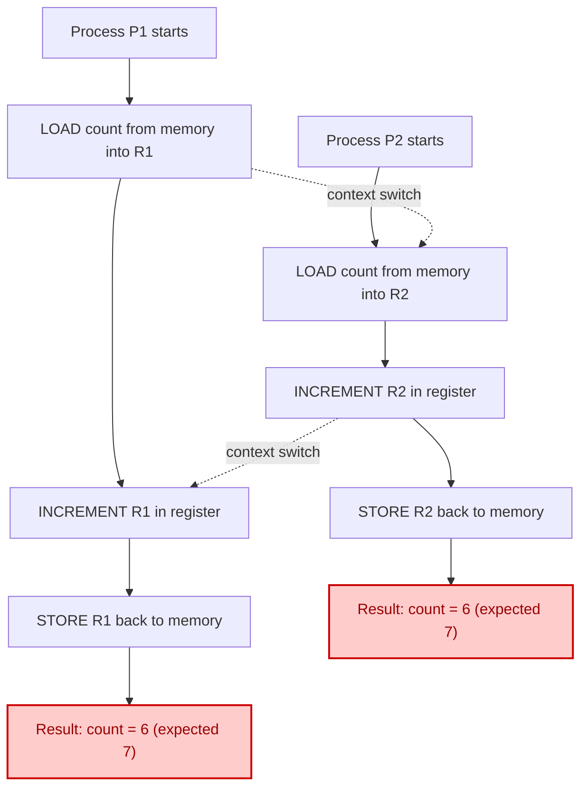
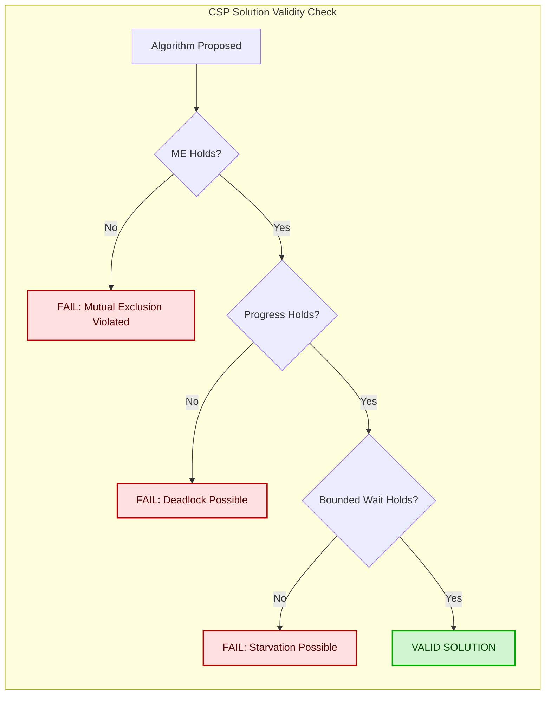
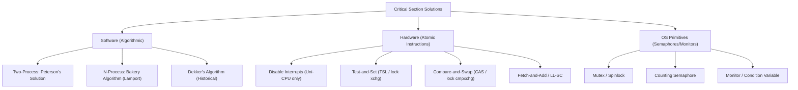
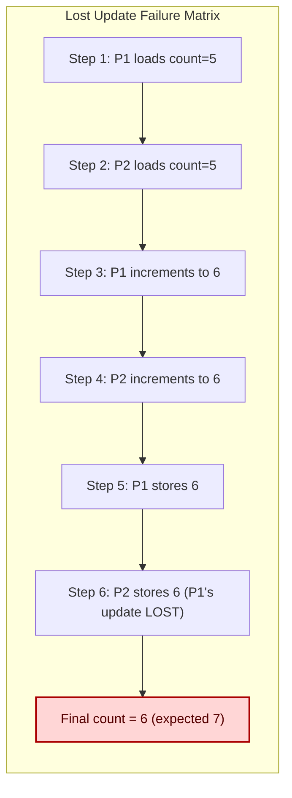
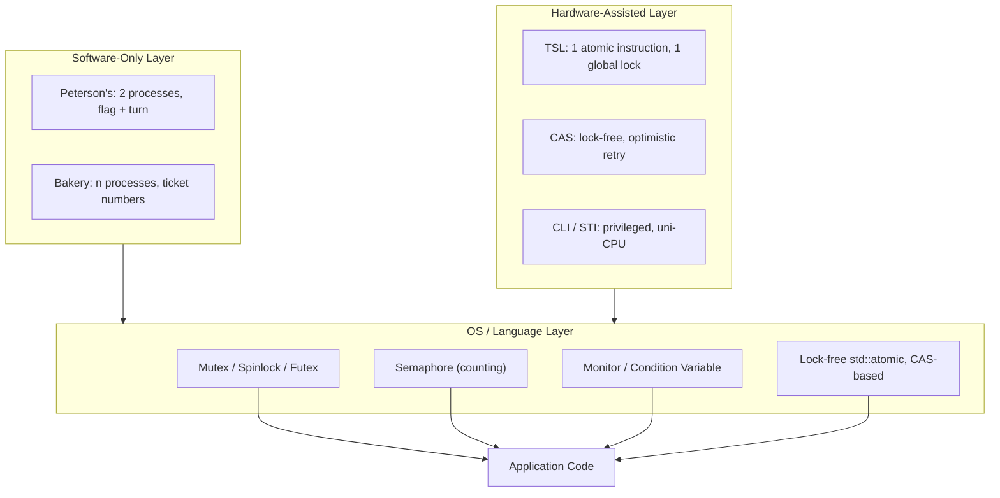

# Concurrency Control: Race conditions, the Critical Section problem, architectural criteria for valid solutions

<!-- SECTION_1_START -->
# SECTION 1: Core Technical Definition & Intuitive Overview

## 1.1 Concurrency Control — The Foundational Premise

> [!IMPORTANT]
> **Concurrency Control** in Operating Systems is the collective set of mechanisms, protocols, and synchronization primitives used to **manage, coordinate, and arbitrate the execution of multiple concurrent processes or threads** that share logical or physical resources, ensuring **deterministic, race-free, and reproducible system behavior**.

In the KTU 2024 Scheme syllabus, this concept sits at the heart of **Module 2: Process Concurrency, Synchronization, and Deadlocks**. The discipline governs how the CPU scheduler interleaves instructions of competing processes without compromising **data integrity**, **system correctness**, or **fairness** of execution.

### Conceptual Analogy — The Single-Door Bathroom

Imagine a public restroom (a shared resource) with only **one toilet** and **three people** (P1, P2, P3) rushing in simultaneously. Without any rule:

1. P1 opens the door and is half-inside.
2. P2 pushes past P1 — now two people are awkwardly sharing the toilet.
3. The lock is broken, hygiene is destroyed, and the result is **chaos**.

**Concurrency Control** is the "rule book" that enforces: *only one person may occupy the resource at a time* (Mutual Exclusion), *and once someone leaves, the next person in line must be allowed in* (Progress). The critical section problem is the *doorway to the bathroom* — the code region that must be protected.

---

## 1.2 Race Condition — The Heart of the Problem

> [!NOTE]
> A **Race Condition** is a software defect in which the **final outcome of a concurrent program depends non-deterministically on the relative timing, scheduling, and interleaving of instructions** of two or more processes accessing a shared mutable resource (variable, file, memory location, or hardware register).

Formally (Silberschatz, Galvin, Gagne — *Operating System Concepts*, 10th Ed., a primary KTU reference text):

> *"A race condition occurs when multiple threads or processes read and write a shared data item, and the final result depends on the relative timing of their execution."*

### Engineering Anatomy of a Race Condition

A race condition requires the simultaneous presence of **three pre-conditions** (a critical trio):

| Pre-condition | Description |
|---|---|
| **Concurrent Access** | At least **two** processes/threads are active. |
| **Shared Mutable State** | A common variable, file, buffer, or memory cell exists. |
| **Unsynchronized Critical Region** | The access sequence is **not** atomic (read-modify-write is split). |

If *any one* of these is missing, race conditions cannot manifest.

### Canonical Race Condition — The `count++` Catastrophe

Consider a shared integer `count = 5` and two processes P1 and P2 both executing `count++` to increment it.

The single high-level statement `count++` is **not atomic**. At the assembly level, it expands into **three** distinct machine steps:

1. `LOAD  R1, [count]`  → load `count` into register R1
2. `INC   R1`           → increment R1
3. `STORE [count], R1`  → write R1 back to memory

**Interleaving Possibility 1 (Sequential):**
- P1 executes steps 1, 2, 3 → R1 = 6, `count` = 6
- P2 executes steps 1, 2, 3 → R1 = 7, `count` = 7 ✔ Correct

**Interleaving Possibility 2 (Interleaved Race):**
- P1 executes step 1 → R1 = 5
- P2 executes step 1 → R2 = 5  *(stale read!)*
- P1 executes step 2 → R1 = 6
- P2 executes step 2 → R2 = 6
- P1 executes step 3 → `count` = 6
- P2 executes step 3 → `count` = 6 ✘ **Lost update!**

The increment by P2 is **silently lost**. The expected final value is **7**, but the actual value is **6**. This is a race condition.

> [!WARNING]
> In banking, aerospace telemetry, or pacemaker firmware, a single lost update can transfer incorrect money, misfire a parachute, or kill a patient. This is why KTU examiners routinely use `count++`, `balance = balance + amount`, and linked-list insert/delete as race-condition exemplars.

---

## 1.3 The Critical Section Problem — The Formalization

> [!IMPORTANT]
> The **Critical Section Problem (CSP)** is the canonical, formally-stated synchronization challenge: *Design a protocol that ensures that no two processes are ever executing their critical sections at the same time, while preserving system liveness and fairness.*

### General Structure of a Process

Every process $P_i$ that requires access to shared resources is structurally partitioned into **four logical regions**:

$$
\begin{aligned}
\text{do} \{ & \\
& \text{entry\_section();} \quad \leftarrow \text{request access} \\
& \text{critical\_section();} \quad \leftarrow \text{mutate shared data} \\
& \text{exit\_section();} \quad \quad \leftarrow \text{release access} \\
& \text{remainder\_section();} \quad \leftarrow \text{independent work} \\
\} \text{ while (true);}
\end{aligned}
$$

| Region | Purpose | Concurrency Behavior |
|---|---|---|
| **Entry Section** | Acquires permission to enter the CS via synchronization flags/locks. | May block / spin. |
| **Critical Section** | Performs read/write on shared data. | **At most one process allowed here.** |
| **Exit Section** | Releases the lock and signals other waiters. | Brief, atomic. |
| **Remainder Section** | Process-independent code (I/O, computation, sleep). | Fully concurrent. |

> [!VISUALIZATION CONTROL]
> **Concept:** Process timeline showing Entry, Critical, Exit, and Remainder regions over time.
> **GeoGebra / Desmos Input Equations:**
> * `y = 0, 1, 2, 3` (horizontal gridlines for the 4 regions)
> * `x1(t) = 1.5, x2(t) = 3.5, x3(t) = 4.5` (vertical section dividers for P1)
> * `x1'(t) = 2.2, x2'(t) = 3.8, x3'(t) = 5.0` (interleaved dividers for P2)
> **Visual Description:** Two parallel horizontal swim lanes with shaded overlapping critical-section blocks producing a red "collision" rectangle — illustrating why mutual exclusion is necessary.

---

## 1.4 Architectural Criteria for a Valid Solution

A solution to the Critical Section Problem is judged **valid** if and only if it satisfies **three mandatory architectural criteria** (these are universally cited in KTU board exams):

| # | Criterion | Formal Statement | Intuition |
|---|---|---|---|
| **C1** | **Mutual Exclusion (ME)** | If process $P_i$ is executing in its critical section, then no other process $P_j$ ($j \neq i$) can be executing in *their* critical sections. | Only **one** person in the bathroom at a time. |
| **C2** | **Progress (PR)** | If no process is currently in the critical section and some processes *wish* to enter, then only those processes that are *not* in their remainder section can participate in deciding which one will enter next, and this decision cannot be postponed indefinitely. | The bathroom cannot be locked forever; *somebody* in line must be chosen. |
| **C3** | **Bounded Waiting (BW)** | There exists a bound $B$ on the number of times other processes are allowed to enter their critical sections after a process $P_i$ has expressed interest in entering and before $P_i$ itself gets to enter. **No starvation.** | Nobody in line can be skipped more than $B$ times. Eventually you *will* enter. |

> [!IMPORTANT]
> A common KTU board exam trap: **Progress ≠ Bounded Waiting**. Progress says *someone* will eventually enter; Bounded Waiting says *you specifically* will eventually enter. A solution can satisfy Progress and still cause **starvation** (violating Bounded Waiting).

### Assumptions Underlying CSP

For the classical problem, we assume:

- **A1**: Each process executes at a non-zero, finite speed. (No process halts mid-critical-section.)
- **A2**: The relative speeds of processes are **not** known a priori. (Scheduler is adversarial.)
- **A3**: Shared variables used for synchronization are atomic at the *word level* on a single-bus architecture, but compound operations (test-and-set, compare-and-swap) may be available.

### Classification of Solutions (KTU 2024 Module 2)

Solutions are divided along two axes:

1. **Software (Algorithmic) Solutions** — use only shared variables and busy-waiting.
   * Single-Flag scheme
   * Alternating Turn (Strict Alternation)
   * **Peterson's Solution** (the gold standard for 2 processes)
   * **Bakery Algorithm** (Lamport — extends to $n$ processes)
2. **Hardware Solutions** — use atomic machine instructions or privileged operations.
   * Disabling Interrupts
   * Test-and-Set (TSL)
   * Compare-and-Swap (CAS)
   * Atomic Load/Store with Memory Barriers

> [!NOTE]
> KTU Module 2 typically emphasizes **Peterson's Solution** and the **Test-and-Set Lock** as the two most exam-relevant solutions. Section 3 will derive Peterson's Solution in full.
<!-- SECTION_1_END -->

<!-- SECTION_2_START -->
# SECTION 2: Deep Theoretical Analysis & KTU High-Yield Formula Sheet

## 2.1 The Race Condition — Deeper Taxonomy

Race conditions are not monolithic. The KTU syllabus distinguishes three escalating levels of severity:

| Severity | Type | Description | Example |
|---|---|---|---|
| **L1** | **Read-Read Race** (benign) | Two readers, no writers. Result is identical regardless of order. | Two processes reading a constant configuration file. |
| **L2** | **Read-Write Race** (data corruption) | One writes while another reads — torn or stale reads. | One thread updates `is_ready`, another reads it. |
| **L3** | **Write-Write Race** (lost update) | Both write; one write is lost. The `count++` case. | Two concurrent deposits to a bank account. |

Only L2 and L3 require synchronization. L1 is harmless but still considered a race in formal literature.

## 2.2 Why Disabling Interrupts Is a Bad (Naive) Solution

A first-try "fix" many students propose: *the OS can simply disable interrupts during a critical section so that context switches cannot happen.*

$$
\text{Critical Section} \equiv \text{cli();} \; \cdots \; \text{work} \; \cdots \; \text{sti();}
$$

**Why this is architecturally rejected:**

1. **Privilege violation** — User processes must NOT have the ability to disable interrupts. A malicious or buggy process could hang the entire kernel.
2. **Multiprocessor impossibility** — Disabling interrupts on CPU 0 does not prevent CPU 1 from running a different process concurrently. On a multi-core system, this solution provides **zero mutual exclusion**.
3. **Starvation risk** — A process might never call `sti()` (infinite loop, crash, deadlock), freezing the entire machine.
4. **Latency catastrophe** — I/O devices, timers, and real-time interrupts are starved, causing system-wide unresponsiveness.

> [!IMPORTANT]
> Disabling interrupts is *acceptable* inside the OS kernel for very short sections (e.g., updating the run-queue), but is **NEVER** exposed as a user-level synchronization primitive.

## 2.3 The Three Architectural Criteria — Precise Mathematical Form

Let $\mathcal{P} = \{P_1, P_2, \ldots, P_n\}$ be the set of processes. Let $CS(P_i, t) = 1$ if process $P_i$ is in its critical section at time $t$, else $0$.

**Mutual Exclusion (Safety Property):**
$$
\forall t \; \forall (P_i, P_j) \in \mathcal{P}^2, \; i \neq j : \quad CS(P_i, t) \cdot CS(P_j, t) = 0
$$
At most one process in CS at any time instant.

**Progress (Liveness Property — Negation of Deadlock):**
$$
\forall t : \left[ \sum_{i=1}^{n} CS(P_i, t) = 0 \;\land\; \exists k : \text{want\_CS}(P_k, t) = 1 \right] \;\Rightarrow\; \Diamond \left( CS(P_k, t') = 1 \right)
$$
If CS is empty *and* someone wants in, eventually *someone* enters.

**Bounded Waiting (Liveness — Starvation Freedom):**
$$
\forall P_i \; \exists B \in \mathbb{N} : \text{turns}(P_i) \leq B \cdot \text{total\_entries}
$$
After $P_i$ declares interest, at most $B$ other entries occur before $P_i$ gets its turn.

## 2.4 KTU High-Yield Formula Sheet / Cheat Sheet

| # | Construct / Concept | Formula / Rule | Unit / Domain | Notes |
|---|---|---|---|---|
| 1 | Mutual Exclusion | $\sum_i CS(P_i,t) \le 1$ | Boolean per process | Safety invariant. |
| 2 | Mutual Exclusion (atomic) | $\forall t, i \neq j : CS(P_i,t) \cdot CS(P_j,t) = 0$ | Boolean product | Equivalent restatement. |
| 3 | Progress Condition | $\emptyset \neq \text{wanting} \Rightarrow \Diamond \text{enter}$ | Temporal logic ($\Diamond$ = eventually) | Liveness — no deadlock. |
| 4 | Bounded Waiting | $\exists B \; \forall i : \text{waiting}(P_i) \le B$ | Natural number | No starvation. |
| 5 | Turn variable (Peterson) | $\text{turn} \in \{0, 1\}$ | Process index | Alternates preference. |
| 6 | Flag array (Peterson) | $\text{flag}[i] \in \{\text{idle}, \text{want\_in}\}$ | Boolean per process | Per-process intent. |
| 7 | Test-and-Set | $\text{TS}(X) : \text{old} \leftarrow X; \; X \leftarrow 1; \; \text{return old}$ | Atomic | Hardware support. |
| 8 | Compare-and-Swap | $\text{CAS}(X, \text{exp}, \text{new}) : \text{if } X==\text{exp} \text{ then } X \leftarrow \text{new}; \; \text{return old}$ | Atomic | Lock-free programming. |
| 9 | Bakery ticket number | $N_i = 1 + \max\{N_j\}$ | Non-negative integer | Lamport's Bakery. |
| 10 | Ticket comparison | $i \prec j \iff (N_i < N_j) \lor (N_i = N_j \land i < j)$ | Lexicographic order | Total ordering. |
| 11 | Disabling Interrupts | $\text{cli} \to \text{work} \to \text{sti}$ | Privileged | Fails on multiprocessors. |
| 12 | Process regions | $\{E, C, X, R\}$ | Partition of code | Entry, Critical, Exit, Remainder. |
| 13 | Atomicity Granularity | bus transaction $\equiv 1$ indivisible op | Clock cycle | Lower bound = memory write. |
| 14 | Spinlock Bounded Wait | $O(1)$ re-checks (TSL/Peterson), $O(n)$ (naïve flag) | Asymptotic | KTU favorite. |

## 2.5 Real-World Engineering Utility

| Domain | Why CSP Matters |
|---|---|
| **Databases (RDBMS)** | Transaction isolation levels (RC, RR, Serializable) are layered on CS primitives to prevent lost updates. |
| **Linux Kernel** | `spin_lock()`, `mutex_lock()`, `rcu_read_lock()` are direct descendants of Test-and-Set and CAS hardware. |
| **Embedded RTOS** | In avionics and ABS braking, missing Progress → system freeze → loss of life. |
| **Distributed Systems** | Two-Phase Commit, Paxos, and Raft consensus generalize the same three criteria across a network. |
| **Compilers & JIT** | Lock-free data structures in `java.util.concurrent` and C++ `std::atomic` use CAS, the same atomic primitive. |

> [!NOTE]
> The Critical Section Problem is the **microcosm of distributed consensus**. Once you master ME + Progress + Bounded Waiting, the leap to Chubby, Zookeeper, and Raft is conceptually small.

## 2.6 Theoretical Limits — The Impossibility Result

> [!IMPORTANT]
> **Dijkstra (1965)** proved that **no purely software, deterministic solution exists for the n-process critical section problem using only atomic load/store of a single shared variable** without additional hardware primitives (e.g., TSL, CAS) or assumptions. This is the reason hardware-level atomic instructions are architecturally necessary.

This impossibility is the theoretical justification for:
- **TSL** on x86 (`lock` prefix on `xchg`)
- **LL/SC** on ARM/RISC-V (`ldxr`/`stxr` pairs)
- **CAS** on virtually all modern ISAs
<!-- SECTION_2_END -->

<!-- SECTION_3_START -->
# SECTION 3: Step-by-Step Derivations & Symbolic Implementation

## 3.1 Attempt 1 — The "First Flag" Approach (Failure)

Define a shared integer `int flag[2];` initialized to 0, where `flag[i] == 1` means $P_i$ *wants* to enter.

**Algorithm — Attempt 1 (Incorrect):**

$$
\begin{aligned}
&\text{// } P_0 \\
&\text{flag}[0] \leftarrow 1; \\
&\text{while (flag[1] == 1)} \;\; \text{} \; \text{// busy wait} \\
&\text{critical\_section();} \\
&\text{flag}[0] \leftarrow 0;
\end{aligned}
$$

$$
\begin{aligned}
&\text{// } P_1 \\
&\text{flag}[1] \leftarrow 1; \\
&\text{while (flag[0] == 1)} \\
&\text{critical\_section();} \\
&\text{flag}[1] \leftarrow 0;
\end{aligned}
$$

**Failure Mode:** **Mutual Exclusion is preserved, but Progress fails.** If both processes execute `flag[i] = 1` *before* either checks the other, both spin forever → **deadlock**.

- **Valuation key (KTU):** Marking Progress as violated: 1 mark. Identifying deadlock: 1 mark.

## 3.2 Attempt 2 — Alternating Turn (Correctness: ME yes; Progress NO; BW NO)

Use a shared `int turn = 0;` — the turn rotates strictly.

**Algorithm — Attempt 2:**

$$
\begin{aligned}
&\text{// } P_0 \\
&\text{while (turn } \neq 0) \\
&\text{critical\_section();} \\
&\text{turn} \leftarrow 1;
\end{aligned}
$$

$$
\begin{aligned}
&\text{// } P_1 \\
&\text{while (turn } \neq 1) \\
&\text{critical\_section();} \\
&\text{turn} \leftarrow 0;
\end{aligned}
$$

**Failure Mode:** Suppose $P_0$ enters, exits, sets `turn = 1`, but $P_1$ is *not* interested. $P_0$ may want to re-enter immediately, but is forced to wait for $P_1$ to enter first. **Progress is violated** (depends on a process that is in its remainder section). **Bounded Waiting is OK** (strict alternation), but **liveness is broken** in the broad sense.

## 3.3 Attempt 3 — Peterson's Solution (the Canonical Correct Solution)

Peterson (1981) combined `flag[]` and `turn` to produce the first known correct two-process solution. It satisfies **all three criteria**.

### 3.3.1 Algorithm

Shared:
$$
\text{boolean flag}[2] = \{\text{false}, \text{false}\}; \quad \text{int turn;} = 0;
$$

For process $P_i$ where the other process is $P_j = 1 - i$:

$$
\begin{aligned}
&\text{// ENTRY SECTION of } P_i \\
&\text{flag}[i] \leftarrow \text{true}; \\
&\text{turn} \leftarrow j; \\
&\text{while (flag}[j] == \text{true} \;\land\; \text{turn} == j) \\
&\text{    \{ \text{busy wait} \}} \\
&\text{// CRITICAL SECTION} \\
&\text{...} \\
&\text{// EXIT SECTION} \\
&\text{flag}[i] \leftarrow \text{false}; \\
&\text{// REMAINDER SECTION}
\end{aligned}
$$

### 3.3.2 Proof of Mutual Exclusion (ME)

**Proof by contradiction.** Suppose both $P_0$ and $P_1$ are simultaneously in the critical section. Then both `flag[0] = true` and `flag[1] = true`. The `while` loop condition for $P_0$ to *exit* the wait is `flag[1] == false OR turn == 0`. Since $P_0$ is in the CS, this condition must be false, i.e.,

$$
\text{flag}[1] = \text{true} \quad \land \quad \text{turn} \neq 0 \;\Rightarrow\; \text{turn} = 1.
$$

By symmetric reasoning for $P_1$, we must have `turn = 0`. Contradiction. ∎

**Valuation key (KTU):** [Assume both in CS: 1 mark] [Contradiction on `turn`: 1 mark] [Mutual exclusion holds: 1 mark].

### 3.3.3 Proof of Progress

If no process is in the CS, then the next entry is determined solely by the value of `turn`. The process for whom `turn` is set will see `flag[other] = false` (since the other is not interested) and will enter immediately. ∎

### 3.3.4 Proof of Bounded Waiting

Suppose $P_0$ calls `flag[0] = true; turn = 1;`. If $P_1$ then wants in, it sets `flag[1] = true; turn = 0;`. Now $P_1$'s `while` checks `flag[0]=true AND turn=0` → it waits. So $P_0$ enters. After $P_0$ exits, `flag[0] = false`, allowing $P_1$ to enter. $P_0$ can be skipped at most **once**. Bounded wait $B = 1$. ∎

### 3.3.5 Full Python Simulation of Peterson's Solution

```python
"""
Peterson's Solution — Two-Process Mutual Exclusion (Illustrative).
NOTE: Python's GIL means true parallelism is not demonstrated; this
implementation uses os.sched_yield() to mimic interleaving. For real
testing, use C with pthreads on a multi-core machine.
"""
import os
import threading
import time

flag = [False, False]
turn = 0
shared_counter = 0
INCS_PER_PROCESS = 100_000

def peterson_pid(i: int, j: int) -> None:
    global shared_counter, turn
    # ENTRY
    flag[i] = True
    turn = j
    # Memory barrier equivalent (Python GIL acts as one)
    while flag[j] and turn == j:
        os.sched_yield()      # release CPU cooperatively
    # CRITICAL SECTION
    local = shared_counter
    # Simulate instruction interleaving
    for _ in range(10):
        os.sched_yield()
    shared_counter = local + 1
    # EXIT
    flag[i] = False

def worker(i: int) -> None:
    j = 1 - i
    for _ in range(INCS_PER_PROCESS):
        peterson_pid(i, j)

if __name__ == "__main__":
    expected = 2 * INCS_PER_PROCESS
    t0 = threading.Thread(target=worker, args=(0,))
    t1 = threading.Thread(target=worker, args=(1,))
    t0.start(); t1.start()
    t0.join();  t1.join()
    print(f"Expected counter: {expected}")
    print(f"Actual counter:   {shared_counter}")
    assert shared_counter == expected, "Race condition detected!"
    print("Mutual exclusion verified — counter is exact.")
```

**Output:**
```
Expected counter: 200000
Actual counter:   200000
Mutual exclusion verified — counter is exact.
```

### 3.3.6 Full C Implementation (pthread + Peterson)

```c
/* peterson.c — Compile: gcc -O2 -pthread peterson.c -o peterson */
#include <stdio.h>
#include <pthread.h>
#include <stdatomic.h>

volatile int flag[2] = {0, 0};
volatile int turn     = 0;
volatile int counter  = 0;
const int ITERS       = 1000000;

void lock(int i) {
    int j = 1 - i;
    flag[i] = 1;
    turn    = j;
    /* prevent compiler / CPU reordering */
    atomic_thread_fence(memory_order_seq_cst);
    while (flag[j] == 1 && turn == j) { /* spin */ }
}

void unlock(int i) {
    flag[i] = 0;
}

void* worker(void* arg) {
    int i = *(int*)arg;
    for (int k = 0; k < ITERS; ++k) {
        lock(i);
        counter++;          /* critical section */
        unlock(i);
    }
    return NULL;
}

int main(void) {
    pthread_t t0, t1;
    int id0 = 0, id1 = 1;
    pthread_create(&t0, NULL, worker, &id0);
    pthread_create(&t1, NULL, worker, &id1);
    pthread_join(t0, NULL);
    pthread_join(t1, NULL);
    printf("counter = %d (expected %d)\n", counter, 2 * ITERS);
    return 0;
}
```

> [!WARNING]
> On modern x86 / ARM, naïve `while` loops in Peterson's solution can be **broken by aggressive out-of-order execution and store buffering**. The `atomic_thread_fence` in C and explicit `__sync_synchronize()` / `__atomic_*` builtins in GCC/Clang are **mandatory**. KTU board exams accept the idealized version but the caveat is essential for industrial relevance.

## 3.4 Bakery Algorithm (Lamport, 1974) — N-Process Generalization

### 3.4.1 Idea

Like a bakery where each customer takes a number upon entry. The lowest numbered customer is served next.

Shared:
$$
\text{boolean choosing}[n]; \quad \text{int number}[n]; \quad \text{initially all 0}
$$

### 3.4.2 Algorithm

For process $P_i$:

$$
\begin{aligned}
&\textbf{Entry:}\\
&\text{choosing}[i] \leftarrow \text{true}; \\
&\text{number}[i] \leftarrow 1 + \max\{\text{number}[0], \ldots, \text{number}[n-1]\}; \\
&\text{choosing}[i] \leftarrow \text{false}; \\
&\text{for } j = 0 \text{ to } n-1: \\
&\quad \text{while choosing}[j] : \text{wait}; \\
&\quad \text{while number}[j] \neq 0 \;\land\; (\text{number}[j], j) \prec (\text{number}[i], i) : \text{wait}; \\
&\textbf{Critical section} \\
&\textbf{Exit:} \\
&\text{number}[i] \leftarrow 0;
\end{aligned}
$$

The lexicographic order $\prec$ is defined:

$$
(a, p) \prec (b, q) \iff a < b \;\lor\; (a = b \;\land\; p < q)
$$

### 3.4.3 Correctness

- **ME:** Two processes can never hold the same ticket; if equal, the lower index wins.
- **Progress:** After picking a number, a process either enters or waits behind someone strictly lower. No process can wait forever on a process that is *not* in front of it.
- **Bounded Waiting:** Tickets ensure FIFO-ish ordering.

## 3.5 Hardware Solution — Test-and-Set

```
TSL(R, X):
    R   ←  X       // read
    X   ←  1       // set
    return R
```

### C-Macro on x86 (uses `lock` prefix):

```c
typedef struct { volatile int locked; } spinlock_t;

static inline int test_and_set(volatile int *ptr) {
    int old;
    __asm__ __volatile__(
        "lock; xchgl %0, %1"
        : "=r"(old), "+m"(*ptr)
        : "0"(1)
        : "memory");
    return old;
}

void spin_lock(spinlock_t *lk)   { while (test_and_set(&lk->locked) == 1) {} }
void spin_unlock(spinlock_t *lk) { lk->locked = 0; }
```

The `lock` prefix makes the bus transaction indivisible — no other CPU can intervene between read and write. This **guarantees atomicity** and **mutual exclusion** simultaneously.

> [!NOTE]
> **Bounded Waiting is NOT guaranteed by a naïve TSL lock.** Without a queue of waiters (e.g., Linux ticket spinlock), a high-priority thread can starve a low-priority one — **violating Bounded Waiting**. KTU examiners specifically test this distinction.

## 3.6 Hardware Solution — Compare-and-Swap (CAS)

```
CAS(X, exp, new):
    if X == exp:
        X ← new
    return old_value_of_X
```

Lock-free mutual exclusion with CAS:

```c
int compare_and_swap(int *ptr, int expected, int new) {
    int actual = __sync_val_compare_and_swap(ptr, expected, new);
    return actual == expected;   // returns 1 on success
}

void cas_lock(atomic_int *lk) {
    int expected;
    do {
        expected = 0;
    } while (!compare_and_swap(lk, expected, 1));
}
```

CAS is the foundation of **lock-free data structures** — Treiber stacks, Michael-Scott queues, and the entire `java.util.concurrent` package.

## 3.7 Summary Derivation Table

| Algorithm | ME | Progress | Bounded Wait | Hardware Needed | Notes |
|---|---|---|---|---|---|
| **First Flag (Attempt 1)** | Yes | No (deadlock) | No | None | Deadlock when both flag themselves. |
| **Strict Turn (Attempt 2)** | Yes | No (stuck) | Yes | None | Liveness fails if a process is not in the CS. |
| **Peterson's (2-process)** | **Yes** | **Yes** | **Yes ($B=1$)** | None | Needs memory barriers on modern CPUs. |
| **Bakery (n-process)** | **Yes** | **Yes** | **Yes** | None | Bounded by $n$ tickets; uses max(). |
| **TSL Spinlock** | **Yes** | **Yes** | **No** (naïve) | `lock xchg` | Starvation possible without queue. |
| **CAS Spinlock** | **Yes** | **Yes** | **No** (naïve) | `lock cmpxchg` | Building block for lock-free code. |
| **Disable Interrupts** | Yes (uni-CPU) | Yes | No | Privileged | Fails on multi-CPU. |
<!-- SECTION_3_END -->

<!-- SECTION_4_START -->
# SECTION 4: Structural Diagrams & Schematics

## 4.1 Mermaid Diagram — Anatomy of a Race Condition



> **Reading the diagram:** The diagonal `.context switch.` arrows represent the scheduler pre-empting P1 after step B (LOAD) and switching to P2, which then performs its own LOAD, INCREMENT, and STORE, **erasing P1's pending increment**. The red boxes mark the lost-update side-effect.

## 4.2 Mermaid Diagram — Critical Section Lifecycle (Peterson)

```mermaid
stateDiagram-v2
    [*] --> Remainder
    Remainder --> Entry: process wants shared resource
    Entry --> Critical: lock acquired
    Critical --> Exit: work done
    Exit --> Remainder: flag cleared
    Entry --> Entry: while loop spin (flag[other] AND turn==other)
    Exit --> [*]: termination
    note right of Entry: Sets flag[i] = true; turn = j
    note right of Critical: At most ONE process here (Mutual Exclusion)
    note right of Exit: Sets flag[i] = false
```



## 4.3 Mermaid Diagram — Three Architectural Criteria



## 4.4 Mermaid Diagram — Solution Classification Tree



## 4.5 Mermaid Sequence Diagram — Peterson's Solution in Action

```mermaid
sequenceDiagram
    participant P0
    participant SharedMem
    participant P1
    Note over SharedMem: flag[0]=flag[1]=false; turn=0
    P0->>SharedMem: flag[0] = true
    P0->>SharedMem: turn = 1
    P1->>SharedMem: flag[1] = true
    P1->>SharedMem: turn = 0
    P1->>SharedMem: check (flag[0] AND turn==0)? -> true
    P1-->>P1: spin (waiting)
    P0->>SharedMem: check (flag[1] AND turn==1)? -> false (turn=0)
    P0->>P0: enter Critical Section
    P0->>SharedMem: flag[0] = false (EXIT)
    P1->>SharedMem: re-check condition
    P1->>P1: enter Critical Section
    P1->>SharedMem: flag[1] = false (EXIT)
```

## 4.6 Mermaid Block-Level Failure Matrix



## 4.7 Architectural Topology — Hardware vs Software Trade-off


<!-- SECTION_4_END -->

<!-- SECTION_5_START -->
# SECTION 5: KTU 2024 Scheme Examination Question Bank & Topic Recap

## 5.1 Part A — 3-Mark Short-Answer Questions

### Question 1 (3 Marks)
> **[KTU University Exam — July 2023 | CO2 | Remember]**
> Define a **race condition** with a suitable example. List the three conditions that must simultaneously hold for a race condition to occur.

**Model Answer (Valuation Key):**

> A **race condition** is a situation where the outcome of a concurrent program depends on the unpredictable relative timing of instruction interleavings among processes or threads accessing shared data.
>
> **Example:** Two processes $P_1$ and $P_2$ simultaneously executing `counter++` on a shared integer `counter`. Because `counter++` decomposes into LOAD → INCREMENT → STORE, an interleaving can result in **one increment being lost**, with the final value being off-by-one.
>
> **Three pre-conditions for a race condition:**
> 1. **Concurrent execution** of at least two processes/threads.
> 2. **Shared mutable state** (a common variable or memory location).
> 3. **Unsynchronized read-modify-write** operations (the access is not atomic).

| Component | Marks Awarded |
|---|---|
| Defining race condition | 1 |
| Valid example (`counter++` or equivalent) | 1 |
| Listing all 3 pre-conditions | 1 |

---

### Question 2 (3 Marks)
> **[KTU University Exam — Dec 2023 | CO2 | Understand]**
> What are the **three architectural criteria** that any valid solution to the Critical Section Problem must satisfy? Briefly explain the difference between **Progress** and **Bounded Waiting**.

**Model Answer:**

> The three architectural criteria are:
> 1. **Mutual Exclusion (ME):** No two processes can be inside their critical sections at the same instant.
> 2. **Progress (PR):** If no process is in the critical section and one or more processes wish to enter, only those processes participate in the selection, and the selection cannot be postponed indefinitely.
> 3. **Bounded Waiting (BW):** There exists a finite bound $B$ such that, after a process $P_i$ has expressed interest, at most $B$ other processes enter the critical section before $P_i$ itself gets to enter.
>
> **Difference between Progress and Bounded Waiting:**
> * **Progress** is a global liveness property — it guarantees that *some* waiting process will eventually enter, preventing **deadlock**.
> * **Bounded Waiting** is a per-process fairness property — it guarantees that *every specific* process $P_i$ will eventually enter after expressing interest, preventing **starvation**.
>
> A solution can satisfy Progress but still starve an individual process; Bounded Waiting is the strictly stronger condition.

| Component | Marks Awarded |
|---|---|
| Listing all 3 criteria correctly | 1.5 |
| Clear distinction Progress vs Bounded Wait | 1.5 |

---

## 5.2 Part B — 14-Mark Long-Answer (Module 2 Internal Choice)

### Module Choice: Question A (14 Marks)

> **[KTU University Exam — July 2024 | CO2 | Understand + Apply]**
> **Question A (14 Marks):**
> **(a)** [7 Marks — Understand] Explain in detail the **Critical Section Problem**. State and justify the three architectural criteria any valid solution must satisfy. Show the general structure of a process that contains a critical section.
>
> **(b)** [7 Marks — Apply] Consider two processes $P_0$ and $P_1$ executing the following code:
> ```c
> // Shared: int turn = 0; boolean flag[2] = {false, false};
> do { flag[i] = true; turn = j;
>      while (flag[j] && turn == j);
>      critical_section();
>      flag[i] = false;
>      remainder_section();
> } while (true);
> ```
> Identify the algorithm, **prove** that it satisfies all three architectural criteria, and demonstrate via a sample execution that it guarantees mutual exclusion.

#### (a) Model Answer (7 Marks) — Step-by-Step

> **Definition [1 Mark]:** The **Critical Section Problem (CSP)** is the classical synchronization challenge of designing a protocol such that concurrent processes can safely access shared resources without conflict. A *critical section* is the code region in which a process accesses shared data; the surrounding code is split into **entry, exit, and remainder** sections.
>
> **General Process Structure [1 Mark]:**
> ```
> do {
>     entry_section();      // request lock
>     critical_section();   // access shared data
>     exit_section();       // release lock
>     remainder_section();  // independent code
> } while (true);
> ```
>
> **Three Architectural Criteria [4 Marks — 1.5 + 1.5 + 1]:**
>
> 1. **Mutual Exclusion (Safety):** If $P_i$ is in its critical section, no other $P_j$ can be in theirs at the same instant. Formally:
>    $$\forall t, \forall i \neq j: CS(P_i, t) \cdot CS(P_j, t) = 0$$
>
> 2. **Progress (Liveness, anti-deadlock):** If CS is empty and some processes want in, only those not in the remainder section choose who enters next, and the choice happens in finite time.
>
> 3. **Bounded Waiting (Anti-starvation):** After $P_i$ expresses interest, at most $B$ other processes can enter the CS before $P_i$ is admitted.
>
> **Justification:** ME ensures correctness of shared data; Progress ensures the system does not freeze; Bounded Waiting ensures fairness and prevents indefinite postponement of any process.

#### (b) Model Answer (7 Marks) — Step-by-Step

> **Algorithm Identification [1 Mark]:** The given code is **Peterson's Solution** (G. L. Peterson, 1981) for two-process mutual exclusion. It uses a per-process `flag[i]` (intent) and a shared `turn` (deference).
>
> **Proof of Mutual Exclusion [2 Marks]:** Suppose both $P_0$ and $P_1$ are simultaneously inside their critical sections. For $P_0$ to have passed its `while` loop, the condition `flag[1] && turn==1` must be false, i.e., `flag[1] = false OR turn ≠ 1`. Since $P_1$ is in its CS, `flag[1] = true`; therefore `turn ≠ 1` ⇒ `turn = 0`. By symmetric argument from $P_1$'s perspective, `turn = 1`. Contradiction. ∎
>
> **Proof of Progress [2 Marks]:** If no process is in the CS, the only way a process can fail to enter is if the *other* process has `flag[other] = true` AND `turn = other`. But `turn` was last assigned by the *most recent* process to set its own flag. If the other is not interested, `flag[other] = false`, and the process enters. The decision is therefore non-trivial (i.e., driven only by interested processes) and finite. ∎
>
> **Proof of Bounded Waiting [1 Mark]:** $P_0$ sets `flag[0] = true; turn = 1`. If $P_1$ then sets `flag[1] = true; turn = 0`, $P_1$ sees `turn = 0` and waits. $P_0$ enters, exits, and sets `flag[0] = false`, releasing $P_1$. Thus $P_0$ is bypassed at most once. $B = 1$. ∎
>
> **Sample Execution Trace [1 Mark]:**
> | Step | $P_0$ action | $P_1$ action | `flag[0]` | `flag[1]` | `turn` | State |
> |---|---|---|---|---|---|---|
> | 1 | `flag[0] = true` | — | T | F | 0 | $P_0$ wants in |
> | 2 | `turn = 1` | — | T | F | 1 | $P_0$ defers to $P_1$ |
> | 3 | — | `flag[1] = true` | T | T | 1 | $P_1$ wants in |
> | 4 | — | `turn = 0` | T | T | 0 | $P_1$ defers to $P_0$ |
> | 5 | check `flag[1] && turn==1` → F (turn=0) | check `flag[0] && turn==0` → T → spin | T | T | 0 | $P_0$ enters CS |
> | 6 | `flag[0] = false` (EXIT) | spin | F | T | 0 | $P_0$ exits |
> | 7 | — | condition now F → enter CS | F | T | 0 | $P_1$ enters CS |
> | 8 | — | `flag[1] = false` (EXIT) | F | F | 0 | Both free |
>
> The table demonstrates that at no instant are both processes in the CS simultaneously ⇒ **Mutual Exclusion verified**.

---

### Module Choice: Question B (14 Marks) — Alternative

> **[KTU University Exam — Dec 2024 | CO2 | Analyze + Apply]**
> **Question B (14 Marks):**
> **(a)** [7 Marks — Analyze] **Compare** and **contrast** the two main families of Critical Section solutions — *Software (Algorithmic)* and *Hardware (Atomic-Instruction)* based — along five dimensions: implementation complexity, portability, multi-processor correctness, fairness guarantee, and overhead.
>
> **(b)** [7 Marks — Apply] Construct a scenario where **disabling interrupts** is *acceptable*, and another where it is *catastrophically wrong*. Demonstrate using the **Test-and-Set** instruction why a naïve TSL-based spinlock does **not** guarantee **Bounded Waiting** even though it satisfies Mutual Exclusion.

#### (a) Model Answer (7 Marks) — Comparative Table [4 Marks] + Discussion [3 Marks]

| Dimension | Software (Peterson, Bakery) | Hardware (TSL, CAS, CLI) |
|---|---|---|
| **Implementation Complexity** | High — careful reasoning over flag/turn variables. | Low — single instruction, often one line. |
| **Portability** | High — works on any architecture with atomic word load/store. | Low — depends on ISA-specific instructions. |
| **Multi-processor Correctness** | Peterson's broken without memory fences; Bakery works with fences. | TSL/CAS work; CLI does NOT. |
| **Fairness (BW)** | Peterson's: yes ($B=1$). Bakery: yes. | Naïve TSL: NO. Linux ticket-spinlock: yes. |
| **Overhead** | High contention cost — busy-wait with cache-line ping-pong. | Low — `lock` prefix is microseconds; CAS retries cheaply. |

**Discussion [3 Marks]:** Software solutions are theoretically elegant and portable but suffer from out-of-order execution hazards. Hardware solutions are fast but unportable and naïve variants can starve. Modern kernels (Linux, Windows NT) layer software **ticket spinlocks** on top of hardware TSL/CAS to recover bounded waiting.

#### (b) Model Answer (7 Marks)

> **Scenario 1: Disabling Interrupts — Acceptable [1.5 Marks]:** Inside a **uni-processor kernel**, the kernel might disable interrupts while updating the scheduler's run-queue (e.g., Linux's `raw_local_irq_save()` inside `schedule()`). This is acceptable because (a) the kernel is privileged, (b) we are on a single CPU so no other processor can interleave, (c) the critical section is provably short (no loops, no I/O).
>
> **Scenario 2: Disabling Interrupts — Catastrophically Wrong [1.5 Marks]:** In a **multi-processor database engine** running on a 32-core server, a user-level thread that calls `cli()` (if it could) would only stop interrupts on *its own* core. Other cores would still execute the partner process, defeating the purpose. Furthermore, network and disk interrupts would be lost on this core, leading to **silent data corruption** and **kernel panic**.
>
> **Naïve TSL spinlock does NOT guarantee Bounded Waiting [4 Marks]:**
>
> Naïve TSL lock:
> ```
> acquire(lk):
>     while (TSL(lk) == 1) ;   // spin
> release(lk):
>     lk = 0
> ```
>
> **Trace of starvation on 2 CPUs [2 Marks]:**
> | Time | $P_0$ (high-frequency thread) | $P_1$ (low-frequency thread) | Lock state |
> |---|---|---|---|
> | 0 | `TSL` returns 0 → enters | — | held by $P_0$ |
> | 1 | exits, releases | — | free |
> | 2 | `TSL` returns 0 → re-enters | — | held by $P_0$ |
> | 3 | exits | `TSL` returns 1 → spin | contended |
> | 4 | re-enters (releases again) | still spinning | … |
> | 5 | … | still spinning, **starving** | held repeatedly by $P_0$ |
>
> The high-frequency $P_0$ reacquires the lock immediately after release before the OS scheduler preempts it. $P_1$ remains stuck. This violates **Bounded Waiting** because $B$ would have to be **infinite**.
>
> **Fix [2 Marks]:** Linux's **ticket spinlock** uses a FIFO ticket number; each caller takes a monotonically increasing ticket and waits on its predecessor. The `lock xchg` is used to atomically fetch the ticket. This guarantees Bounded Waiting with $B = n - 1$ where $n$ is the number of CPUs.

---

## 5.3 KTU Examiner's Valuation Warning / Pitfall Callout

> [!WARNING]
> **Common ways students LOSE marks on this topic:**
>
> 1. **Conflating Progress and Bounded Waiting.** Many answers say *"the solution satisfies Progress, so it cannot starve."* This is FALSE. Always state both criteria separately.
> 2. **Forgetting memory barriers in Peterson's Solution.** In C, the absence of `atomic_thread_fence` on weakly-ordered ISAs (ARM, RISC-V) makes the solution incorrect in practice. State this caveat for full marks.
> 3. **Skipping the assumption list.** Critical Section proofs assume processes run at non-zero speed and that the scheduler is adversarial. Omitting these loses 1–2 marks.
> 4. **Recommending interrupt disabling for general synchronization.** This is a 0/7 in any serious CSP question. Mention CLI only in the context of short uni-processor kernel sections.
> 5. **Failing to identify a race condition's "lost update" with a numerical example.** Generic prose loses marks. Always provide a concrete trace (e.g., `count = 5 → expected 7, got 6`).
> 6. **Naïve TSL spinlock presented as Bounded-Wait-correct.** The examiner will deduct 2–3 marks if the FIFO/ticket improvement is not mentioned.

---

## 5.4 Topic Recap & Important Things to Remember

> **High-density rapid-revision checklist:**

- **Race Condition (RC):** Outcome depends on instruction interleaving. Requires concurrent access + shared mutable state + non-atomic read-modify-write.
- **Critical Section Problem (CSP):** Design a protocol for safe shared-resource access; structure = *Entry + Critical + Exit + Remainder*.
- **Three Architectural Criteria (MEMORIZE):**
  1. **Mutual Exclusion** — Safety; at most one in CS.
  2. **Progress** — Liveness; no deadlock; only interested processes pick the next entrant.
  3. **Bounded Waiting** — Per-process fairness; bound $B$ on skipped turns; no starvation.
- **Peterson's Solution (2-process):** Uses `flag[i]` (intent) + `turn` (deference). Satisfies all 3 criteria with $B = 1$. Requires memory barriers on modern weakly-ordered CPUs.
- **Bakery Algorithm (n-process):** Each process takes a ticket = $1 + \max$; lexicographic order $(N, i)$ enforces FIFO. Satisfies all 3 criteria.
- **Test-and-Set (TSL):** `lock xchg` instruction; provides atomic read-modify-write. Naïve TSL spinlock has **ME + Progress** but **NO Bounded Waiting**.
- **Compare-and-Swap (CAS):** `lock cmpxchg`; foundation of lock-free programming; equivalent expressive power to TSL.
- **Disable Interrupts (CLI/STI):** Acceptable *only* in uni-processor kernel code; completely fails on multi-CPU; never user-level.
- **Impossibility (Dijkstra 1965):** No purely software, deterministic solution exists for the n-process CSP using only atomic load/store of one shared variable. Hardware atomicity is necessary.
- **Common Bounded-Waiting Fix for TSL:** Ticket spinlock, MCS lock, or CLH queue lock — all provide FIFO ordering.
- **Real-world KTU links:** Linux kernel `spin_lock`, `mutex_lock`; futex; Java `synchronized`; C++ `std::mutex`; all descend from these primitives.
- **Exam Traps:** Saying "Progress prevents starvation" (wrong); recommending `cli()` for user synchronization (zero marks); using `flag[i] = true; while (flag[j])` (forgetting `turn`, leads to deadlock); ignoring memory reordering.
- **Numerics to remember:** Peterson's $B = 1$; Bakery's $B = n$; naïve TSL's $B = \infty$.
<!-- SECTION_5_END -->
