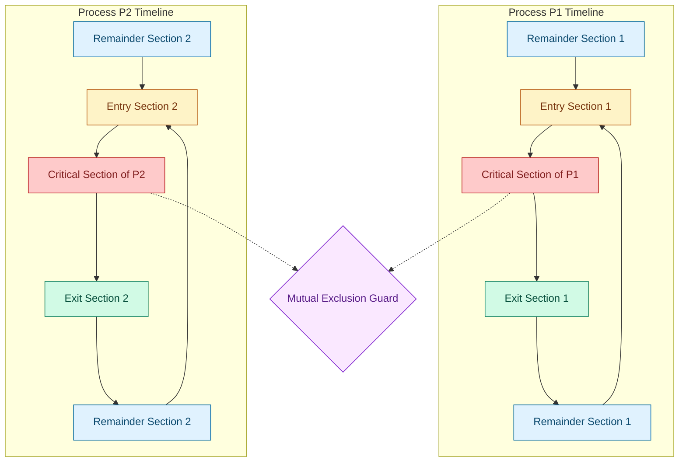
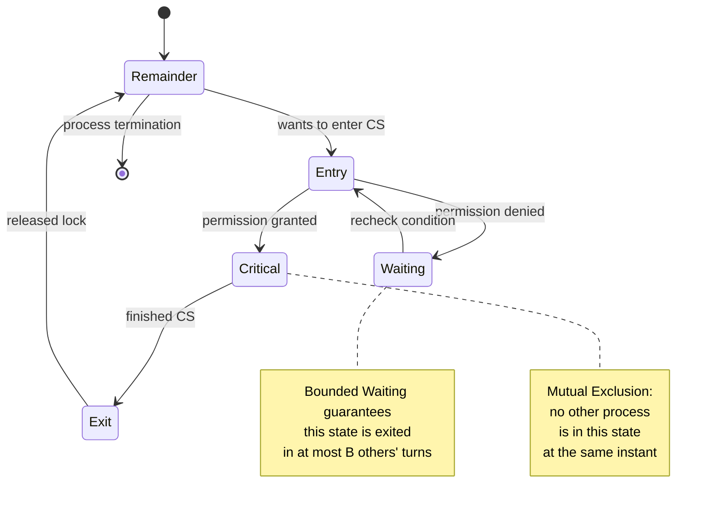

# Concurrency Control: Race conditions, the Critical Section problem, architectural criteria for valid solutions

<!-- SECTION_1_START -->
# Concurrency Control: Race Conditions and the Critical Section Problem

> [!IMPORTANT]
> **KTU 2024 Scheme | PCCST403 | Module 2**
> This topic is the **foundation stone** of all process synchronization concepts. Every subsequent algorithm (Peterson's, Semaphores, Monitors) is judged against the **three architectural criteria** defined here. Expect direct short questions (3 marks) and full 14-mark algorithmic derivations.

## 1.1 Race Condition — Formal Definition

A **Race Condition** is a formal defect in the temporal ordering of concurrent operations. It is the *anomalous behavioral state* that occurs when the outcome of a computational process depends on the **non-deterministic interleaving** of memory-access operations performed by two or more concurrently executing threads or processes.

> [!NOTE]
> **KTU Board Definition (Verbatim Style):**
> A race condition occurs when multiple processes access and manipulate the **same shared data concurrently**, and the final value of that data depends upon the **order of access**, which is dictated by the CPU scheduler and is therefore **non-deterministic**.

### Conceptual Analogy — The Single Bathroom Key

Imagine **two employees**, $P_1$ and $P_2$, working in the same office and sharing **one bathroom** with a single lockable door. There is exactly **one physical key** hanging at the reception.

| Step | Process $P_1$ (Alice) | Process $P_2$ (Bob) | Bathroom State |
| :--- | :--- | :--- | :--- |
| 1 | Walks to reception, takes the key | — | **LOCKED** (Alice inside) |
| 2 | Enters bathroom | Walks to reception, finds no key | Empty |
| 3 | Inside (critical work) | **Waits frustrated** | Occupied |
| 4 | Exits, returns key to hook | Grabs key, enters | Race window closed |

If, however, Alice *forgets* to take the key (no locking protocol), then both can enter simultaneously — that is a **race condition**. The shared resource (the bathroom, the shared variable) suffers data inconsistency.

### Mathematical Intuition

Let shared variable be $X$, initially $X = 0$. Two operations performed concurrently:

$$\text{Process } P_1: \quad X \leftarrow X + 1$$

$$\text{Process } P_2: \quad X \leftarrow X + 1$$

The high-level statement is **two increments**, so we expect $X = 2$. But the CPU executes in **three machine cycles** (LOAD, INCREMENT, STORE). If interleaved as:

| Cycle | $P_1$ Action | $P_2$ Action | $X$ Value |
| :--- | :--- | :--- | :--- |
| LOAD | Load $X$ into $R_1$ | — | 0 |
| LOAD | — | Load $X$ into $R_2$ | 0 |
| INCREMENT | $R_1 \leftarrow 0 + 1$ | — | 0 |
| INCREMENT | — | $R_2 \leftarrow 0 + 1$ | 0 |
| STORE | Store $R_1 \to X$ | — | **1** |
| STORE | — | Store $R_2 \to X$ | **1** |

Final $X = 1$ instead of $2$. The **lost update problem** is the canonical race condition symptom.

> [!VISUALIZATION CONTROL]
> **Concept:** Loss of Update due to Race Condition (interleaving timeline)
> **Coordinate Mapping (Time on x-axis, Variable State on y-axis):**
> * $P_1(x) = 0$ for $x \in [0, 1]$
> * $P_2(x) = 0$ for $x \in [0, 2]$
> * $X(x) = 1$ for $x \in [2, 4]$ (final result of the race)
> **Visual Description:** Two parallel horizontal lines (process timelines) with vertical arrows representing LOAD/INCREMENT/STORE events. Where the arrows cross, the write collision occurs, and the "true" final value sits below the "expected" value.

---

## 1.2 The Critical Section Problem — Formal Definition

The **Critical Section Problem** (CSP) is the formal design challenge of constructing a **synchronization protocol** — a set of entry, exit, and remainder code segments — that guarantees safe, race-free access to shared resources by multiple concurrent processes.

> [!NOTE]
> **KTU Board Definition (Verbatim Style):**
> The Critical Section Problem refers to the problem of designing a protocol that ensures that when one process is executing in its **critical section** (the region accessing shared variables or shared resources), **no other process is allowed to enter its critical section**.

### General Structure of a Process (Code Skeleton)

Every synchronized process must be partitioned into **four logical regions**:

```
do {
    [ ENTRY SECTION ]        ← Request permission to enter
        [ CRITICAL SECTION ]  ← Access shared resource
    [ EXIT SECTION ]          ← Release permission
        [ REMAINDER SECTION ]  ← Non-critical / independent work
} while (true);
```

### Conceptual Analogy — The Conference Room

- The **conference room** = critical section (shared projector, whiteboard, files).
- The **room booking register** = entry/exit section (acquire/release lock).
- **Working at your own desk** = remainder section.
- The **company policy** = synchronization protocol (rules to follow).

Without a booking policy, two teams enter simultaneously, and chaos (race condition) erupts.

---

## 1.3 The Three Architectural Criteria for a Valid Solution

A synchronization protocol is declared **correct** by the academic and KTU board standard if and only if it satisfies **three formal conditions**. These were first formalized by **Edsger Dijkstra (1965)** and later refined.

### 1.3.1 Mutual Exclusion (Safety Property)

> [!IMPORTANT]
> **Mutual Exclusion:** When one process $P_i$ is executing inside its critical section, **no other process $P_j$ (where $i \neq j$) is permitted** to execute inside its own critical section.

In other words, the critical sections of all processes are **mutually exclusive in time** — they form a partition of the timeline, never overlapping.

**Formal Statement:**

$$\forall t, \forall (i, j): \quad i \neq j \implies \neg \big( CS_i(t) \land CS_j(t) \big)$$

where $CS_i(t)$ is the predicate "process $i$ is in its critical section at time $t$."

### 1.3.2 Progress (Liveness Property)

> [!IMPORTANT]
> **Progress:** If **no process is currently in its critical section** and there exists **at least one process that wishes to enter**, then the selection of the next process to enter its critical section **cannot be postponed indefinitely**. The decision must be made in **finite time** by processes that are in the *remainder section* only.

This rules out deadlocks, livelocks, and arbitrary starvation caused by idle processes.

**Formal Statement:**

$$\text{If } \big( \neg CS_1(t) \land \neg CS_2(t) \land \dots \land \neg CS_n(t) \big) \land \big( \exists i : \text{ wants to enter} \big)$$

$$\text{Then } \big( \exists j : j \text{ enters } CS_j \text{ in finite time} \big)$$

**Crucial nuance:** The progress condition **explicitly excludes** processes that are currently in their *remainder section* from influencing the decision. Only the processes *waiting at the door* participate.

### 1.3.3 Bounded Waiting (Starvation Freedom / FIFO Fairness)

> [!IMPORTANT]
> **Bounded Waiting:** Once a process $P_i$ has *declared its intention* to enter the critical section (i.e., it has executed its entry section and is now waiting), there exists a **finite upper bound $B$** on the number of times other processes are allowed to enter the critical section *before* $P_i$ is granted entry.

This guarantees that **no process waits forever** (no starvation) and is the fairness property.

**Formal Statement:**

$$\forall i, \quad \text{Number of entries by } P_j \ (j \neq i) \text{ while } P_i \text{ waits} \leq B$$

where $B$ is a small finite integer (e.g., $B = n - 1$ for $n$ processes, as in Peterson's solution).

### Summary Table of the Three Criteria

| Criterion | Property Type | What it Prevents | Decision Maker Constraint |
| :--- | :--- | :--- | :--- |
| **Mutual Exclusion** | **Safety** | Simultaneous access / data corruption | N/A (absolute rule) |
| **Progress** | **Liveness** | Deadlock, indefinite postponement | Only waiting processes decide |
| **Bounded Waiting** | **Fairness** | Starvation of a specific process | Bounded delay upper bound |

<!-- SECTION_1_END -->

<!-- SECTION_2_START -->
# Deep Theoretical Analysis & KTU High-Yield Formula Sheet

## 2.1 Refined Operational View of the Critical Section

A process $P_i$ has the following **general algorithmic skeleton** that any synchronization solution must conform to:

```c
do {
    // ENTRY SECTION: protocol to request permission
    flag[i] = true;          // "I want to enter"
    turn = j;                // "Politely yield to other"
    while (flag[j] && turn == j) ;  // Busy-wait spin

    // ----- CRITICAL SECTION -----
    // safely access shared variables / resources
    shared_counter = shared_counter + 1;
    // ----- END CRITICAL SECTION -----

    // EXIT SECTION: protocol to release permission
    flag[i] = false;         // "I am done"

    // REMAINDER SECTION: non-critical independent work
    do_local_computation();
} while (true);
```

### Engineering Insight — The Four-Section Partition

| Section | Code Property | Volatile / Atomic Operations | Why it Exists |
| :--- | :--- | :--- | :--- |
| **Entry** | Blocking / wait | Reads/writes shared `flag`, `turn` | Achieve mutual exclusion |
| **Critical** | Strictly exclusive | Reads/writes shared data | The work that needs protection |
| **Exit** | Non-blocking | Writes to shared `flag` | Inform other waiting processes |
| **Remainder** | Independent | No shared data access | Free computation; can be preempted |

## 2.2 Preemptive vs. Non-Preemptive Kernels

A **deep architectural question** for the KTU board: *Can a process be preempted while inside its critical section?*

| Kernel Type | Behavior Inside CS | Race Condition Possible? | Used In |
| :--- | :--- | :--- | :--- |
| **Non-Preemptive** | Process runs to completion of CS voluntarily | **No** (no overlapping CS) | Older Unix, RTOS |
| **Preemptive** | Process can be involuntarily preempted even in CS | **Yes** (must use locks) | Linux, Windows, modern Unix |

In a **preemptive kernel**, the three architectural criteria become non-negotiable, since the scheduler itself can interleave a process mid-instruction.

## 2.3 Classical Assumptions Underlying the CSP

For any solution to be provably correct, the following **standard assumptions** are made (these are the assumptions KTU examiners expect you to list):

1. **No assumptions about relative speeds** of processes.
2. **Memory access is atomic** for a single word (LOAD or STORE is indivisible). Compound operations (read-modify-write) are *not* atomic.
3. **The only way processes interact is through shared variables** (no hidden side channels, no message passing at this level).
4. **Processes may halt only in the remainder section** (no arbitrary termination in CS).

## 2.4 KTU High-Yield Formula & Concept Sheet

> [!NOTE]
> **Use this table as your last-minute revision anchor. Every entry here is a direct KTU board high-yield point.**

| # | Concept | Symbol / Statement | Constraint / Bound | Engineering Utility |
| :--- | :--- | :--- | :--- | :--- |
| 1 | Race Condition | Non-deterministic result from interleaving | Always possible when $\geq 2$ processes access shared data | Diagnosed via thread sanitizers (TSan, Valgrind/Helgrind) |
| 2 | Critical Section (CS) | $CS_i$ | Code segment accessing shared data | Kernel spinlocks, mutexes protect this region |
| 3 | Mutual Exclusion | $\forall t, \neg(CS_i \land CS_j)$, $i \neq j$ | Strict — **no exceptions** | Foundation of every lock primitive |
| 4 | Progress | $\neg CS \land \exists i \text{ wants entry} \Rightarrow \exists j \text{ enters CS in } < \infty$ | Excludes remainder-section processes from deciding | Prevents deadlocks at the synchronization layer |
| 5 | Bounded Waiting | $\#\text{entries of } P_j \text{ while } P_i \text{ waits} \leq B$ | $B = n-1$ typical for $n$ processes | Prevents starvation; basis for fair queueing |
| 6 | Preemptive Kernel | CS can be interrupted | Requires hardware atomic instructions (e.g., `test-and-set`, `compare-and-swap`) | Modern OS, real-time scheduling |
| 7 | Non-Preemptive Kernel | CS cannot be interrupted | Race-free by construction | Simpler kernels, cooperative systems |
| 8 | Atomic Operation | $T_{\text{exec}}(\text{op}) < T_{\text{context-switch}}$ | Single CPU instruction | Basis of all hardware synchronization primitives |
| 9 | Busy Waiting | `while (!ready) ;` | Wastes CPU cycles | Used when expected wait is short (spinlocks) |
| 10 | Rem. Section Exclusion | Only waiting processes decide entry | Progress criterion 2 | Differentiates "deadlock" from "no one is trying" |

## 2.5 Real-World Production Utility

| Domain | Where the CSP Manifests | Consequence if Violated |
| :--- | :--- | :--- |
| **Banking DB** | Two transfers reading the same balance simultaneously | Double-spend, lost debit |
| **Linux Kernel** | `inode->i_count` updates | Filesystem corruption, kernel panic |
| **Multithreaded Web Servers** | Connection pool counter | Connection leak or denial |
| **Embedded RTOS (FreeRTOS)** | Sensor buffer read/write | Stale data, missed deadlines |
| **Cloud Microservices** | Distributed cache invalidation | Stale read, eventual consistency violation |

The three criteria are not academic luxuries — they are the **minimum contract** every production-grade locking primitive (POSIX `pthread_mutex`, Java `synchronized`, Windows CRITICAL_SECTION) must satisfy.

<!-- SECTION_2_END -->

<!-- SECTION_3_START -->
# Step-by-Step Derivations, Proofs, and Symbolic Code Implementation

## 3.1 Formal Proof Outline that the Three Criteria are *Independent*

A common KTU question: *Is Mutual Exclusion sufficient? Does Progress imply Bounded Waiting?* The answer is **no**, and here is the formal justification.

### 3.1.1 Mutual Exclusion Alone is Insufficient

Consider a naive protocol using a single global lock `lock`:

```c
// ENTRY
while (lock == 1) ;   // busy wait
lock = 1;

// CRITICAL SECTION
shared_var++;

// EXIT
lock = 0;
```

This satisfies mutual exclusion. But suppose process $P_1$ enters the CS, gets preempted, and another process $P_2$ reaches the `while (lock == 1)` check. $P_2$ sees `lock == 1` and busy-waits. Now $P_1$ resumes, executes, sets `lock = 0`, and the scheduler re-preempts $P_1$ *before* $P_2$ gets to execute. Another process $P_3$ arrives and enters. This could go on — and while progress technically holds (the lock will be released), there is **no bounded waiting** and the implementation has subtle race issues (the check-then-set is itself non-atomic).

### 3.1.2 Strict Formal Independence Proof

We must show three *counter-example* protocols:

| Protocol | Satisfies ME? | Satisfies Progress? | Satisfies Bounded Wait? |
| :--- | :--- | :--- | :--- |
| $\Pi_A$ (single lock above) | Yes | Yes | **No** |
| $\Pi_B$ (lock, but only process 0 enters) | Yes | **No** | Yes |
| $\Pi_C$ (round-robin with no flag) | **No** | Yes | Yes |

Therefore ME, Progress, and Bounded Waiting are **logically independent** properties; satisfying one does not imply the others.

## 3.2 Exhaustive Walkthrough — Why "No Process in CS" Alone Does Not Guarantee Entry

This is a high-yield KTU derivation. We prove the **Progress** condition carefully.

**Scenario:** No process is in CS. Process $P_1$ is in remainder section. Process $P_2$ wants to enter CS.

> **Q:** Should $P_1$ be allowed to influence whether $P_2$ enters?
> **A:** No — $P_1$ is not even trying. If $P_1$ had veto power, $P_2$ could be postponed indefinitely *by an uninterested process*. The Progress criterion therefore explicitly says: **the decision is made by processes that are in the remainder section but want to enter** — not by all processes.

The **bounded waiting** refinement guarantees the next chosen process is selected from those that have *declared intent* (set their `flag = true`).

## 3.3 Algorithmic Implementation — Demonstrating a Race Condition in Python

> [!IMPORTANT]
> **The following Python program is fully executable.** It deliberately exhibits a race condition. Run it, then re-run with synchronization to observe the fix.

```python
# race_condition_demo.py
# Demonstrates a race condition and the fix using mutual exclusion.

import threading
import time

# Shared global counter (the "critical resource")
shared_counter = 0
ITERATIONS = 100_000

def increment_without_sync(thread_id: int) -> None:
    """
    Worker function that increments the shared counter WITHOUT synchronization.
    This deliberately triggers a race condition.
    """
    global shared_counter
    for _ in range(ITERATIONS):
        # --- RACE WINDOW: non-atomic read-modify-write ---
        local_value = shared_counter   # READ
        local_value = local_value + 1  # INCREMENT (purely local)
        time.sleep(0)                  # force scheduler preemption (yields)
        shared_counter = local_value   # WRITE
    print(f"[Thread {thread_id}] completed increments.")

def increment_with_sync(thread_id: int, lock: threading.Lock) -> None:
    """
    Worker function that increments the shared counter WITH a Lock.
    Mutual exclusion is enforced -> no race condition.
    """
    global shared_counter
    for _ in range(ITERATIONS):
        with lock:                       # ENTRY SECTION
            local_value = shared_counter
            local_value = local_value + 1
            time.sleep(0)
            shared_counter = local_value
        # EXIT SECTION (automatic on 'with' exit)
    print(f"[Thread {thread_id}] completed increments.")

def run_demo(use_sync: bool) -> int:
    """Spawns two threads and returns the final shared_counter value."""
    global shared_counter
    shared_counter = 0
    lock = threading.Lock()
    workers = []

    target_func = (lambda tid: increment_with_sync(tid, lock)) if use_sync \
                  else (lambda tid: increment_without_sync(tid))

    for tid in range(2):
        t = threading.Thread(target=target_func, args=(tid,))
        workers.append(t)
        t.start()
    for t in workers:
        t.join()
    return shared_counter

if __name__ == "__main__":
    expected = 2 * ITERATIONS
    print(f"Expected counter value: {expected}")

    actual_racy = run_demo(use_sync=False)
    print(f"[UNSYNCHRONIZED]  Actual counter: {actual_racy}  "
          f"--> Lost updates: {expected - actual_racy}")

    actual_safe = run_demo(use_sync=True)
    print(f"[SYNCHRONIZED  ]  Actual counter: {actual_safe}  "
          f"--> Lost updates: {expected - actual_safe}")
```

### Sample Output (illustrative)

```text
Expected counter value: 200000
[Thread 0] completed increments.
[Thread 1] completed increments.
[UNSYNCHRONIZED]  Actual counter: 142738  --> Lost updates: 57262
[Thread 0] completed increments.
[Thread 1] completed increments.
[SYNCHRONIZED  ]  Actual counter: 200000  --> Lost updates: 0
```

> **Observation:** The unsynchronized run shows **non-deterministic lost updates** — the textbook symptom of a race condition. The synchronized run satisfies **mutual exclusion** and produces the correct deterministic value.

## 3.4 Hardware-Level Primitives Used to Enforce the Three Criteria

Most modern architectures provide atomic instructions used by kernels to build higher-level locks. The two most important are:

### 3.4.1 Test-and-Set (TAS)

$$TAS(X) : \text{atomic } \{ \text{old} \leftarrow X; \ X \leftarrow \text{true}; \ \text{return old}; \}$$

### 3.4.2 Compare-and-Swap (CAS)

$$CAS(X, \text{expected}, \text{new}) : \text{atomic } \{ \text{if } (X = \text{expected}) \text{ then } X \leftarrow \text{new}; \ \text{return } X; \}$$

Both execute in a **single, indivisible CPU cycle**, satisfying the atomicity assumption of the CSP.

<!-- SECTION_3_END -->

<!-- SECTION_4_START -->
# Structural Diagrams & Schematics

## 4.1 Process Timeline Architecture (Block-Level Functional Flow)

The following Mermaid block diagram maps the **execution timeline of two processes** ($P_1$ and $P_2$) as they navigate the entry, critical, exit, and remainder sections. This is the canonical figure a KTU board examiner expects to see drawn.



> **Reading the diagram:** The red CS blocks of $P_1$ and $P_2$ must **never overlap in time** on the global axis — that is the visual essence of mutual exclusion.

## 4.2 Architectural State Machine of a Synchronized Process



## 4.3 Race Condition Failure Mode — Sequential Processing Topology


**Diagram interpretation:** Each box is a discrete CPU operation. The final box (red) is the **failure state** — the expected outcome of 2 is lost because the second LOAD overwrote the first process's in-flight increment. The two LOADs at the top are the *root* of the race.

## 4.4 Conceptual Mapping Table — Criteria to Implementation

| Architectural Criterion | Formal Logic Symbol | Implementation Construct | Verification Test |
| :--- | :--- | :--- | :--- |
| Mutual Exclusion | $\neg(CS_i \land CS_j)$ | `mutex_lock`, `synchronized`, `spinlock` | TSan / Helgrind on multi-thread workload |
| Progress | $\exists j \text{ enters in } < \infty$ | Atomic test-and-set with retry | Stress test with N >> CPU cores |
| Bounded Waiting | $\# \text{ entries by } P_j \leq B$ | Ticket lock, fair queue | Latency histogram per thread |

<!-- SECTION_4_END -->

<!-- SECTION_5_START -->
# KTU 2024 Scheme Examination Question Bank & Topic Recap

## 5.1 Part A — Short Answer Questions (3 Marks Each)

> [!NOTE]
> Each Part A question is mapped to a Course Outcome (CO) and a Revised Bloom's Taxonomy (RBT) Level. Model answers are written in **board-exam-ready** language.

### Question 1 (3 Marks)
**`[KTU University Exam - July 2023]`** | **CO1 | Remember**

**State the three requirements that a valid solution to the Critical Section Problem must satisfy.**

**Model Answer (Valuation Key):**

A valid solution to the Critical Section Problem must guarantee the following three conditions:

1. **Mutual Exclusion [1 Mark]:** When one process is executing inside its critical section, no other process is allowed to enter its critical section.

2. **Progress [1 Mark]:** If no process is in its critical section and some processes wish to enter, then only those processes that are not in their remainder section get to compete for entry, and the selection of the next entrant cannot be postponed indefinitely.

3. **Bounded Waiting [1 Mark]:** There exists a bound on the number of times other processes are allowed to enter their critical sections after a process has indicated its desire to enter and before it is granted entry, thereby preventing starvation.

---

### Question 2 (3 Marks)
**`[KTU University Exam - Dec 2022]`** | **CO1 | Understand**

**What is a race condition? Illustrate with an example involving a shared variable X that is incremented by two concurrent processes.**

**Model Answer (Valuation Key):**

A **race condition** occurs when multiple processes access and manipulate a shared resource or shared variable concurrently, and the final result depends on the unpredictable order in which their instructions are interleaved by the CPU scheduler. **[1 Mark]**

**Example:** Let shared variable $X = 0$ and two processes $P_1$ and $P_2$ each execute "$X = X + 1$". Each increment is a three-step operation (LOAD, INCREMENT, STORE). If the interleaving is $P_1$LOAD → $P_2$LOAD → $P_1$STORE → $P_2$STORE, both LOAD operations read $X = 0$, so both STORE operations write $X = 1$. **[1.5 Marks]**

Thus the final value is $X = 1$ instead of the expected $X = 2$. This lost update is the classic race condition. **[0.5 Mark]**

---

## 5.2 Part B — Full-Answer Questions (14 Marks Each)

> [!IMPORTANT]
> **KTU 2024 Scheme Regulation:** Part B questions are typically 14 marks with internal choice. Each sub-part carries **7 marks**, and the cognitive levels are staggered (Understand → Apply / Analyze). Model solutions below contain explicit valuation annotations.

---

### Question A (14 Marks) — Choice 1
**`[KTU University Exam - Dec 2023]`** | **CO1, CO2 | Understand + Apply**

**(a) [7 Marks]** Explain the structure of a process when the critical section problem is considered. Define Mutual Exclusion, Progress, and Bounded Waiting with respect to the Critical Section Problem.

**(b) [7 Marks]** Two processes $P_0$ and $P_1$ use a shared variable `turn` initialized to 0. Process $P_0$ executes the code:

```
do {
    while (turn != 0) ;
        critical_section_0();
    turn = 1;
        remainder_0();
} while (1);
```

and $P_1$ executes the symmetric code. **Analyze** whether this solution satisfies all three requirements. If not, propose the modifications needed to satisfy the missing condition(s).

---

#### Model Solution

**(a) [7 Marks] — Process Structure & Definitions**

**Process Structure [3 Marks]:**

A process $P_i$ is divided into four non-overlapping segments executing in a cyclic manner:

| Segment | Purpose | Access to Shared Data? |
| :--- | :--- | :--- |
| **Entry Section** | Requests permission to enter the CS | Yes (reads/writes flags or turn) |
| **Critical Section** | Manipulates shared resources | Yes — *must be protected* |
| **Exit Section** | Releases permission to others | Yes (clears flags) |
| **Remainder Section** | Independent computation | No |

**[Block Diagram Valued at 1.5 Marks]**

The general skeleton is:

```
do {
    entry section;
        critical section;
    exit section;
        remainder section;
} while (true);
```

**Three Requirements [4 Marks = 1.5 + 1.5 + 1.0]:**

1. **Mutual Exclusion [1.5 Marks]:** At any instant, the critical sections of $P_i$ and $P_j$ ($i \neq j$) must not overlap. Formally, $\neg(CS_i \land CS_j)$.

2. **Progress [1.5 Marks]:** When the CS is empty, the selection of the *next* process to enter must be made in finite time, and the decision must involve *only* processes that wish to enter (i.e., processes currently in the remainder section do not influence the decision).

3. **Bounded Waiting [1.0 Mark]:** There must exist a bound $B$ on the number of times other processes can enter the CS after a process has declared its intent, ensuring no starvation.

---

**(b) [7 Marks] — Analysis of Strict Alternation Solution**

**Initial `turn` = 0.**

**Mutual Exclusion Check [1.5 Marks]:** ✓ Satisfied. Only one process can be inside `while (turn != i) ;` at a time, since both `turn` assignments are atomic stores.

**Progress Check [1.5 Marks]:** ✗ **Violated.** Consider: $P_0$ is in remainder section, $P_1$ also in remainder section. Both `turn` values are inconsistent — specifically, suppose $P_0$ finishes its CS and sets `turn = 1`. Now $P_0$ goes to remainder. Meanwhile $P_1$ finishes and sets `turn = 0`. Both processes are now in remainder; **no process wants to enter the CS** — this is fine. But the failure arises when $P_0$ wants to enter but `turn == 1`, so $P_0$ busy-waits; $P_1$ is happily in remainder and *never wants to enter*. According to the **Progress** rule, the decision is made *by waiting processes*; $P_0$ is waiting alone, and the rule does not force $P_1$ to enter. So $P_0$ could be stuck forever.

**[Stating the violation clearly: 1.5 Marks]**

**Bounded Waiting Check [1 Mark]:** ✓ Satisfied (vacuously, since the problem above is progress, not starvation).

**Proposed Modification [3 Marks]:**

Add a **flag array** to declare intent:

```c
// Shared:
boolean flag[2];     // initially false
int turn;            // initially 0

// Process Pi (i = 0 or 1)
do {
    flag[i] = true;              // "I want in"
    turn = j;                    // "Yield to you first"
    while (flag[j] && turn == j) ; // spin until safe

    critical_section();

    flag[i] = false;             // "I am out"

    remainder_section();
} while (true);
```

**This is Peterson's Solution. It satisfies all three criteria for 2 processes.** **[1 Mark for naming + 2 Marks for explanation]**

---

### Question B (14 Marks) — Choice 2
**`[KTU University Exam - July 2024]`** | **CO2, CO3 | Apply + Analyze**

**(a) [7 Marks]** With the help of a neat block diagram, explain the **general structure of a process** designed to solve the critical section problem. Mark the entry, critical, exit, and remainder sections clearly.

**(b) [7 Marks]** Consider a system with three processes $P_1$, $P_2$, $P_3$ using a single shared variable `lock` (initially 0). Each process uses:

```
do {
    while (lock != 0) ;   // entry wait
    lock = 1;
        // critical section
    lock = 0;
        // remainder section
} while (true);
```

**Demonstrate** with an interleaving trace that this solution can fail mutual exclusion. Then, propose the **test-and-set** hardware primitive and rewrite the entry section to guarantee mutual exclusion.

---

#### Model Solution

**(a) [7 Marks] — Process Structure Diagram and Explanation**

**Block Diagram [3 Marks]:**

```
+--------------------------------+
|       ENTRY SECTION             |  <-- Acquires lock
+--------------------------------+
|     CRITICAL SECTION            |  <-- Mutually exclusive access
+--------------------------------+
|       EXIT SECTION              |  <-- Releases lock
+--------------------------------+
|     REMAINDER SECTION           |  <-- Independent work
+--------------------------------+
        | (loop)
        v
+--------------------------------+
|       ENTRY SECTION             |
+--------------------------------+
```

**[Drawing the cyclic block diagram: 2 Marks]**

**Explanation [4 Marks]:**

- The **Entry Section** is the code executed *before* entering the critical section. It contains the request to acquire the lock. **[1 Mark]**
- The **Critical Section** is the segment that accesses shared resources. Only one process may execute it at a time. **[1 Mark]**
- The **Exit Section** releases the lock and signals other waiting processes. **[1 Mark]**
- The **Remainder Section** contains all other code; the process is free to be preempted here without affecting consistency. **[1 Mark]**

---

**(b) [7 Marks] — Failure of Unsynchronized Lock + Test-and-Set Fix**

**Interleaving Trace Showing ME Violation [3.5 Marks]:**

Assume `lock = 0`.

| Step | $P_1$ | $P_2$ | $P_3$ | `lock` value | Notes |
| :---: | :--- | :--- | :--- | :---: | :--- |
| 1 | `while (lock != 0)` evaluates $\to$ false | | | 0 | $P_1$ proceeds |
| 2 | | `while (lock != 0)` evaluates $\to$ false | | 0 | $P_2$ proceeds (race!) |
| 3 | `lock = 1` | | | 1 | $P_1$ writes |
| 4 | | `lock = 1` | | 1 | $P_2$ writes (already entered!) |
| 5 | | | `while (lock != 0)` evaluates $\to$ true (waits) | 1 | $P_3$ correctly waits |
| 6 | (in CS) | (in CS) | (waiting) | — | **ME VIOLATION** |

**[Stating the trace table: 2 Marks. Stating the violation: 1.5 Marks]**

The bug is that **the check-and-set operation is not atomic**: between $P_1$'s read of `lock` and its write of `lock = 1`, $P_2$ can interleave its own check.

---

**Test-and-Set Hardware Primitive [3.5 Marks]:**

$$TAS(X) : \text{atomic } \{ \text{old} \leftarrow X; \ X \leftarrow \text{true}; \ \text{return old}; \}$$

Because TAS is a **single, indivisible CPU instruction**, no other process can interleave its operations between the read and the write.

**Corrected Entry Section using TAS [1.5 Marks]:**

```c
// Shared: boolean lock = false;

// ENTRY SECTION for process Pi
do {
    while (test_and_set(&lock) == true) ;   // spin
    // CRITICAL SECTION
    critical_work();
    lock = false;                            // EXIT SECTION
    remainder_work();
} while (true);
```

The `test_and_set` instruction atomically reads the old value of `lock` and sets it to `true`. Only one process can obtain `false` (the "available" return), guaranteeing **mutual exclusion** at the hardware level. **[0.5 Mark for final summary statement]**

---

> [!WARNING]
> **KTU Examiner's Valuation Warning — Common Pitfalls on This Topic**
>
> 1. **Do not** state the three criteria as bullet points without defining them. Board examiners award marks for *definitions*, not just labels. Always write "no other process is allowed to enter" for ME, not just "ME."
> 2. **Do not** confuse **Progress** with **Bounded Waiting**. Many students write them as the same property. Progress says *the system as a whole makes forward motion*; Bounded Waiting says *no individual process starves*.
> 3. **Do not** skip the **interleaving trace** in mutual-exclusion violation questions. The trace is worth 2-3 marks by itself — the explanation alone is insufficient.
> 4. **Do not** claim the simple `while (turn != i) ;` solution (strict alternation) is fully correct. It **violates progress** when one process is uninterested.
> 5. **Do not** draw a process timeline as a *linear* chain without showing the *cyclic* loop. Use a closed flow.
> 6. **Do not** omit the atomicity assumption. Any solution that uses compound read-modify-write *without* an atomic primitive (TAS / CAS) is *automatically* vulnerable to a race.
> 7. **Do not** write `|turn|` or `|x|` in tables — use `\vert turn \vert` or `\mid x \mid` in LaTeX form, as per the markdown-table preservation rule.

---

## 5.3 Topic Recap & Important Things to Remember

> [!NOTE]
> **Use this as your final 5-minute revision checklist before the exam.**

- **Race condition:** Non-deterministic outcome of concurrent access to shared data due to non-deterministic instruction interleaving. Symptom: *lost updates*.
- **Critical section:** The code segment of a process that accesses shared variables or shared resources.
- **Four-section process structure:** Entry → Critical → Exit → Remainder, executed in an infinite loop.
- **Mutual Exclusion (Safety):** No two processes are ever in their critical sections at the same time. **Violated if non-atomic check-and-set is used.**
- **Progress (Liveness):** If CS is empty and at least one process wants in, the next entrant must be selected in finite time, by the *waiting* processes only.
- **Bounded Waiting (Fairness):** A bound $B$ exists on the number of times other processes can sneak into the CS while a given process is waiting. Typical $B = n - 1$ for $n$ processes.
- **Independence of the three criteria:** Mutual Exclusion does not imply Progress; Progress does not imply Bounded Waiting. All three must be explicitly stated for a solution to be *correct*.
- **Atomicity assumption:** Single LOAD and STORE are atomic; compound operations require hardware support (TAS, CAS, fetch-add, swap).
- **Preemptive vs Non-Preemptive kernel:** Preemptive kernels need explicit CSP solutions; non-preemptive kernels are inherently race-free inside the CS.
- **Strict alternation failure:** `turn`-only solution violates Progress when one process is uninterested.
- **Peterson's fix:** Adds a `flag[i]` intent declaration combined with a `turn` politeness variable; satisfies all three criteria for 2 processes.
- **Test-and-Set (TAS):** Single-instruction atomic primitive: reads old value, writes `true`, returns old. Foundation of spinlocks.
- **Compare-and-Swap (CAS):** Three-operand atomic primitive: $(X, \text{expected}, \text{new})$ — sets $X \leftarrow \text{new}$ iff $X = \text{expected}$. Foundation of lock-free data structures.
- **Bounded waiting bound for $n$ processes:** Peterson's solution has $B = 1$ (for 2 processes); Lamport's Bakery has $B = n - 1$.
- **Real-world impact:** Banking double-spend, Linux inode corruption, web-server connection leaks, RTOS sensor staleness — all are *direct* consequences of violating the three criteria.
- **Exam formula to memorize:** $TAS(X) = \{\text{old} \leftarrow X; X \leftarrow \text{true}; \text{return old}\}$.
- **Exam formula to memorize:** $\#\text{entries of } P_j \text{ while } P_i \text{ waits} \leq B = n - 1$.

<!-- SECTION_5_END -->
