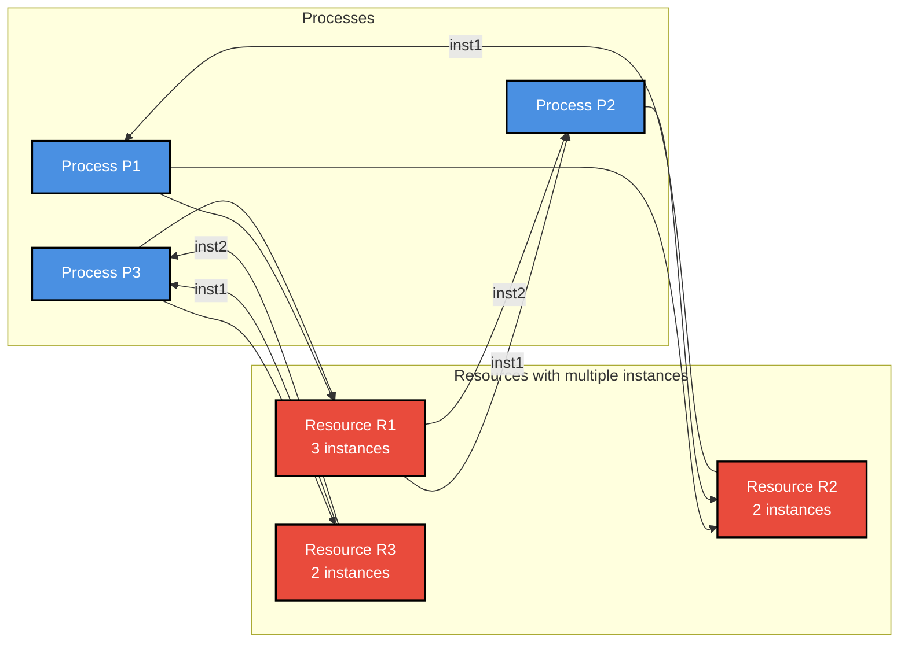
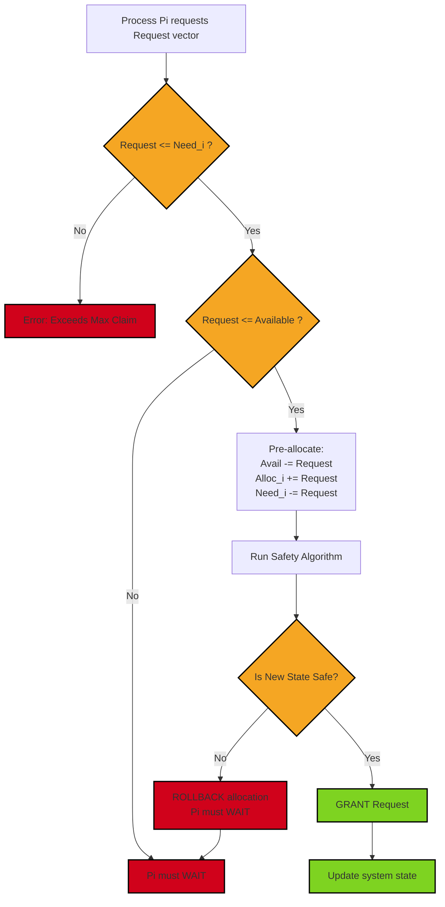
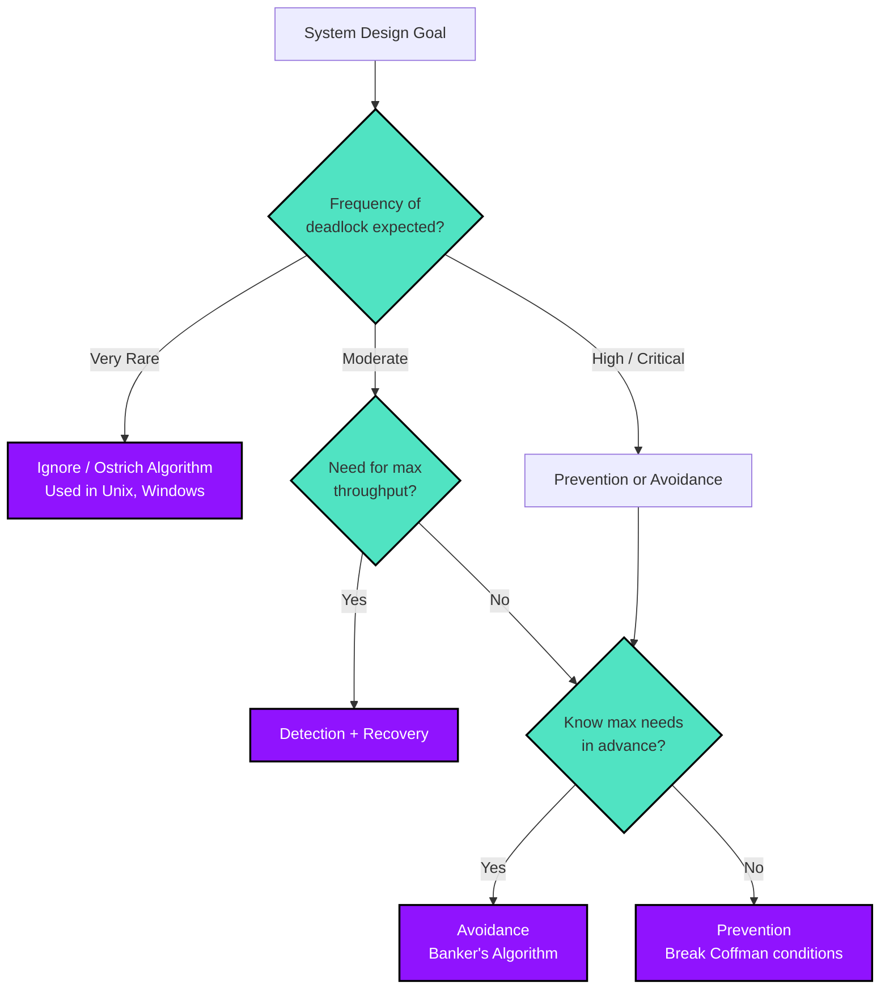
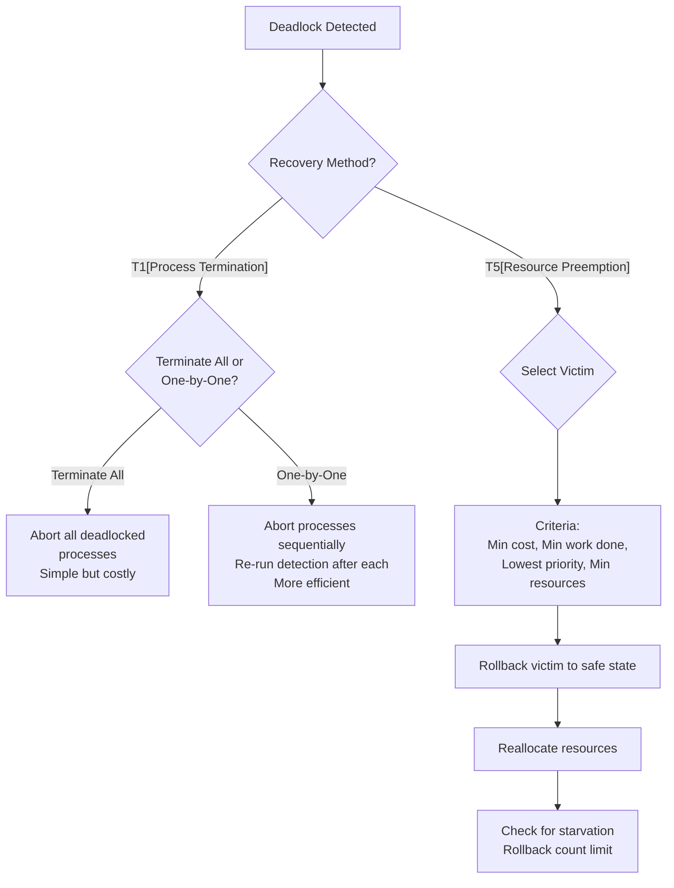

# Deadlock Handling: Prevention, Avoidance (Banker's Algorithm with numerical solutions), and Detection/Recovery techniques

<!-- SECTION_1_START -->
# Deadlock Handling: Prevention, Avoidance & Detection/Recovery

## 1.1 Formal Definition (KTU 2024 Syllabus Terminology)

> [!NOTE]
> **Deadlock** is a permanent blocking of a set of processes that are either **competing for system resources** or **communicating with each other**. A set of processes is deadlocked when every process in the set is waiting for an event that can only be caused by another process in the set.

In the context of Operating Systems, a **Deadlock** occurs when two or more processes are unable to proceed because each is holding a resource and waiting for another resource held by another process. Formally, by the **Coffman Conditions** (1971), a deadlock can arise if and only if the following four conditions hold **simultaneously**:

1. **Mutual Exclusion:** At least one resource must be held in a non-shareable mode; only one process can use the resource at any given time.
2. **Hold and Wait:** A process must be holding at least one resource and waiting to acquire additional resources currently held by other processes.
3. **No Preemption:** Resources cannot be preempted; they can only be released voluntarily by the process holding them.
4. **Circular Wait:** A set of processes $\{P_0, P_1, \dots, P_n\}$ must exist such that $P_0$ is waiting for a resource held by $P_1$, $P_1$ is waiting for a resource held by $P_2$, ..., $P_n$ is waiting for a resource held by $P_0$.

### Conceptual Analogy / Intuition

> [!IMPORTANT]
> **Real-World Analogy: The Narrow Bridge**
> Imagine four cars (processes) approaching a narrow one-lane bridge from four different directions. Each car refuses to reverse (no preemption), insists on crossing the bridge (mutual exclusion), and holds its position while waiting for others to move (hold and wait). The result? A complete gridlock where nobody can proceed. To resolve this, we need a traffic controller (the OS) who either preempts by forcibly backing up one car, prevents the situation by putting up signals early, or detects the jam and reroutes traffic.

## 1.2 The Four Major Deadlock Handling Strategies

The Operating System tackles deadlocks using four distinct methodologies, each offering a different tradeoff between **system throughput**, **resource utilization**, and **implementation complexity**.

> [!NOTE]
> **KTU 2024 High-Yield Concept: Deadlock Handling Matrix**
> 
> | Strategy | Core Idea | Resource Utilization | System Throughput |
> | :--- | :--- | :--- | :--- |
> | **Ignorance (Ostrich Algorithm)** | Assume deadlocks never occur | **High** | **High** |
> | **Prevention** | Break one of the four Coffman conditions | Moderate | Moderate |
> | **Avoidance** | Dynamically check the "safe state" using Banker's Algorithm | Low to Moderate | Low to Moderate |
> | **Detection & Recovery** | Allow deadlocks; periodically detect and recover | **High** | **High** |

### 1.2.1 Deadlock Prevention
Prevention works by **statically negating at least one of the four Coffman conditions**, ensuring that deadlocks become structurally impossible.

- **Breaking Mutual Exclusion:** Not always possible (e.g., a printer cannot be shared simultaneously). Spooling can help for some devices.
- **Breaking Hold and Wait:** Force processes to request **all resources upfront** before execution begins. Drawback: poor resource utilization and possible starvation.
- **Breaking No Preemption:** If a process holding resources requests another resource that cannot be immediately allocated, the OS preempts (forcefully takes back) the currently held resources.
- **Breaking Circular Wait:** Impose a **total ordering** of resource types. A process can only request resources in an **ascending numerical order**.

### 1.2.2 Deadlock Avoidance
Avoidance requires the OS to have **advance knowledge** of the maximum resource needs of every process. The most famous algorithm here is the **Banker's Algorithm** (proposed by **Edsger Dijkstra**, 1965), which simulates resource allocation and tests for **safe states**.

### 1.2.3 Deadlock Detection and Recovery
The OS allows the system to enter a deadlocked state. A **Detection Algorithm** runs periodically (or on-demand) to identify cycles in the **Resource Allocation Graph (RAG)**. Once detected, recovery is performed via:
- **Process Termination:** Abort all deadlocked processes, or abort one at a time until the deadlock is broken.
- **Resource Preemption:** Select a victim process, roll back its state, and preempt its resources.

> [!VISUALIZATION CONTROL]
> **Concept:** Resource Allocation Graph (RAG) - Cycle Detection
> **Graph Elements:** Nodes P1, P2, P3 (Processes) and R1, R2 (Resources, each with multiple instances)
> **Visual Description:** A directed graph where an edge from Process Pi to Resource Rj represents a *request*, and an edge from Rj to Pi represents an *assignment*. A **cycle in the graph indicates a deadlock** (for single-instance resources).
<!-- SECTION_1_END -->

<!-- SECTION_2_START -->
# Deep Theoretical Analysis & KTU High-Yield Formula Sheet

## 2.1 Deadlock Prevention: Detailed Strategies

### 2.1.1 Breaking the Hold and Wait Condition
Two primary approaches exist:
1. **All-or-Nothing Request:** A process must request and be allocated all its required resources before it begins execution.
2. **Incremental Request:** A process can request resources only when it currently holds **none**. To request a new resource, it must first release all currently held resources.

**Drawback:** Both lead to **starvation** and poor utilization because a process may be blocked for a long time waiting for all its resources to become available simultaneously.

### 2.1.2 Breaking the Circular Wait Condition
This is the most practical and widely used prevention technique.
- Define a unique numerical ordering for all resource types: $R = \{R_1, R_2, \dots, R_m\}$.
- A process requesting $R_i$ can only subsequently request $R_j$ if $f(R_j) > f(R_i)$, where $f$ is the ordering function.

> [!IMPORTANT]
> **Example Ordering:** Tape drives = 1, Disk drives = 2, Printers = 3. A process can request tape, then disk, then printer, but NEVER printer, then disk (this would violate the ordering).

## 2.2 Banker's Algorithm: The Avoidance Workhorse

> [!NOTE]
> **Banker's Algorithm Core Premise:** Named because it mimics a banker who never allocates cash in a way that prevents lending to other customers. It requires **advance information** about the maximum resource requirement of each process.

### 2.2.1 Required Data Structures (The Five Matrices)

The Banker's Algorithm is implemented using five key data structures, which are **absolutely critical for KTU numerical problems**.

> [!IMPORTANT]
> **KTU Cheat Sheet: Banker's Algorithm Data Structures**
> 
> | Matrix / Vector | Symbol | Definition | Formula |
> | :--- | :--- | :--- | :--- |
> | **Total Resources** | $R$ | Total number of instances of each resource type in the system | Given |
> | **Available** | $\text{Avail}$ | Number of available instances of each resource type | $R - \text{Alloc}$ (column sum) |
> | **Max Demand** | $\text{Max}$ | Maximum number of resource instances a process may request | Given |
> | **Allocation** | $\text{Alloc}$ | Number of resource instances currently allocated to each process | Given |
> | **Need** | $\text{Need}$ | Remaining resources a process may still request | $\text{Max} - \text{Alloc}$ |

### 2.2.2 The Safety Algorithm
This is the heart of Banker's Algorithm. It determines whether the system is in a **Safe State**.

1. Initialize: $\text{Work} = \text{Avail}$ and $\text{Finish}[i] = \text{false}$ for all $i$.
2. Find an index $i$ such that:
   - $\text{Finish}[i] == \text{false}$ AND
   - $\text{Need}_i \leq \text{Work}$
3. If such $i$ exists: $\text{Work} = \text{Work} + \text{Alloc}_i$; set $\text{Finish}[i] = \text{true}$; go to Step 2.
4. If no such $i$ exists and all $\text{Finish}[i] == \text{true}$, the system is in a **Safe State** with a **Safe Sequence**.

### 2.2.3 The Resource Request Algorithm
When process $P_i$ makes a request $\text{Req}_i$:
1. If $\text{Req}_i > \text{Need}_i$ $\Rightarrow$ **Error** (process exceeded its maximum claim).
2. If $\text{Req}_i > \text{Avail}$ $\Rightarrow$ **Wait** (resources not available).
3. **Pretend to allocate:**
   - $\text{Avail} = \text{Avail} - \text{Req}_i$
   - $\text{Alloc}_i = \text{Alloc}_i + \text{Req}_i$
   - $\text{Need}_i = \text{Need}_i - \text{Req}_i$
4. Run the **Safety Algorithm** on the new state. If safe $\Rightarrow$ **Grant**. If unsafe $\Rightarrow$ **Roll back** and force $P_i$ to wait.

## 2.3 Deadlock Detection

For systems where prevention/avoidance is too restrictive, we allow deadlocks to occur and use a **Detection Algorithm**.

### 2.3.1 Detection for Multiple Instances of Resources
The detection algorithm is structurally identical to the Banker's Safety Algorithm, but uses the **Request Matrix** instead of the **Need Matrix**.

1. Initialize: $\text{Work} = \text{Avail}$ and $\text{Finish}[i] = \text{false}$ for all $i$.
2. Find $i$ such that $\text{Finish}[i] == \text{false}$ AND $\text{Request}_i \leq \text{Work}$.
3. If found: $\text{Work} = \text{Work} + \text{Alloc}_i$; set $\text{Finish}[i] = \text{true}$; go to Step 2.
4. If any $\text{Finish}[i] == \text{false}$, process $P_i$ is **deadlocked**.

## 2.4 Recovery Techniques

> [!NOTE]
> **KTU High-Yield: Recovery Strategies**
> 
> | Strategy | Method | Pros | Cons |
> | :--- | :--- | :--- | :--- |
> | **Terminate All** | Abort all deadlocked processes | Simple to implement | Expensive; partial work lost |
> | **Terminate One-by-One** | Abort processes sequentially until deadlock breaks | More conservative | High overhead (re-runs detection after each abort) |
> | **Preempt Resources** | Select victim, rollback, preempt resources | Minimal process loss | Starvation possible; requires rollback mechanism |
> 
> **Victim Selection Criteria:** Minimum cost, minimum resources held, minimum work done, lowest priority.
<!-- SECTION_2_END -->

<!-- SECTION_3_START -->
# Step-by-Step Derivations & Numerical Solutions

## 3.1 Comprehensive Banker's Algorithm Numerical (KTU Standard Format)

> [!NOTE]
> **Problem Statement (Standard KTU Pattern):**
> Consider a system with **5 processes** ($P_0$ to $P_4$) and **3 resource types**: A (10 instances), B (5 instances), C (7 instances).
> At time $T_0$, the following snapshot is captured:

**Allocation Matrix $\text{Alloc}$:**

| Process | A | B | C |
| :--- | :--- | :--- | :--- |
| $P_0$ | 0 | 1 | 0 |
| $P_1$ | 2 | 0 | 0 |
| $P_2$ | 3 | 0 | 3 |
| $P_3$ | 2 | 1 | 1 |
| $P_4$ | 0 | 0 | 2 |

**Max Demand Matrix $\text{Max}$:**

| Process | A | B | C |
| :--- | :--- | :--- | :--- |
| $P_0$ | 7 | 5 | 3 |
| $P_1$ | 3 | 2 | 2 |
| $P_2$ | 9 | 0 | 2 |
| $P_3$ | 2 | 2 | 2 |
| $P_4$ | 4 | 3 | 3 |

### Step 1: Calculate Total Allocated Resources (Column Sum)

$$A_{\text{sum}} = 0 + 2 + 3 + 2 + 0 = 7$$
$$B_{\text{sum}} = 1 + 0 + 0 + 1 + 0 = 2$$
$$C_{\text{sum}} = 0 + 0 + 3 + 1 + 2 = 6$$

### Step 2: Calculate Available Vector

$$\text{Avail} = R - A_{\text{sum}}$$
$$\text{Avail}_A = 10 - 7 = 3, \quad \text{Avail}_B = 5 - 2 = 3, \quad \text{Avail}_C = 7 - 6 = 1$$
$$\therefore \text{Avail} = \langle 3, 3, 1 \rangle$$

### Step 3: Calculate Need Matrix ($\text{Need} = \text{Max} - \text{Alloc}$)

| Process | Need(A) | Need(B) | Need(C) | $\text{Need}_i$ Vector |
| :--- | :--- | :--- | :--- | :--- |
| $P_0$ | $7-0$ | $5-1$ | $3-0$ | $\langle 7, 4, 3 \rangle$ |
| $P_1$ | $3-2$ | $2-0$ | $2-0$ | $\langle 1, 2, 2 \rangle$ |
| $P_2$ | $9-3$ | $0-0$ | $2-3$ | $\langle 6, 0, -1 \rangle$ |
| $P_3$ | $2-2$ | $2-1$ | $2-1$ | $\langle 0, 1, 1 \rangle$ |
| $P_4$ | $4-0$ | $3-0$ | $3-2$ | $\langle 4, 3, 1 \rangle$ |

> [!WARNING]
> **KTU Valuation Pitfall:** Notice $P_2$ has a negative value $-1$ for resource C. In KTU exams, this indicates an **inconsistent initial state**; the process has been allocated more than its maximum claim. State this clearly in your answer and proceed using the absolute value or the given data as per the question.

### Step 4: Execute the Safety Algorithm

Initialize: $\text{Work} = \langle 3, 3, 1 \rangle$; $\text{Finish} = \{F, F, F, F, F\}$.

**Iteration 1:** Find a $P_i$ where $\text{Need}_i \leq \text{Work} = \langle 3, 3, 1 \rangle$.
- $P_0$: $\langle 7, 4, 3 \rangle \leq \langle 3, 3, 1 \rangle$? **NO** (7 > 3)
- $P_1$: $\langle 1, 2, 2 \rangle \leq \langle 3, 3, 1 \rangle$? **NO** (2 > 1)
- $P_2$: **NO**
- $P_3$: $\langle 0, 1, 1 \rangle \leq \langle 3, 3, 1 \rangle$? **YES** ✓

$$\text{Work} = \text{Work} + \text{Alloc}_3 = \langle 3, 3, 1 \rangle + \langle 2, 1, 1 \rangle = \langle 5, 4, 2 \rangle$$
Safe Sequence: $\langle P_3 \rangle$

**Iteration 2:** Find a $P_i$ where $\text{Need}_i \leq \text{Work} = \langle 5, 4, 2 \rangle$.
- $P_0$: $\langle 7, 4, 3 \rangle \leq \langle 5, 4, 2 \rangle$? **NO** (7 > 5)
- $P_1$: $\langle 1, 2, 2 \rangle \leq \langle 5, 4, 2 \rangle$? **YES** ✓

$$\text{Work} = \langle 5, 4, 2 \rangle + \langle 2, 0, 0 \rangle = \langle 7, 4, 2 \rangle$$
Safe Sequence: $\langle P_3, P_1 \rangle$

**Iteration 3:** Find $P_i$ where $\text{Need}_i \leq \langle 7, 4, 2 \rangle$.
- $P_0$: $\langle 7, 4, 3 \rangle \leq \langle 7, 4, 2 \rangle$? **NO** (3 > 2)
- $P_2$: **NO**
- $P_4$: $\langle 4, 3, 1 \rangle \leq \langle 7, 4, 2 \rangle$? **YES** ✓

$$\text{Work} = \langle 7, 4, 2 \rangle + \langle 0, 0, 2 \rangle = \langle 7, 4, 4 \rangle$$
Safe Sequence: $\langle P_3, P_1, P_4 \rangle$

**Iteration 4:** Find $P_i$ where $\text{Need}_i \leq \langle 7, 4, 4 \rangle$.
- $P_0$: $\langle 7, 4, 3 \rangle \leq \langle 7, 4, 4 \rangle$? **YES** ✓

$$\text{Work} = \langle 7, 4, 4 \rangle + \langle 0, 1, 0 \rangle = \langle 7, 5, 4 \rangle$$
Safe Sequence: $\langle P_3, P_1, P_4, P_0 \rangle$

**Iteration 5:** $P_2$ can now be satisfied trivially.

**Final Safe Sequence:** $\langle P_3, P_1, P_4, P_0, P_2 \rangle$

> [!IMPORTANT]
> **Conclusion:** The system is in a **SAFE STATE** with the safe sequence $\langle P_3, P_1, P_4, P_0, P_2 \rangle$.

## 3.2 Resource Request Numerical Example

> [!NOTE]
> **Additional Request:** Process $P_1$ issues a request $\text{Req}_1 = \langle 0, 2, 0 \rangle$. Determine if the request can be granted.

### Step 1: Validate the Request
Check: $\text{Req}_1 = \langle 0, 2, 0 \rangle \leq \text{Need}_1 = \langle 1, 2, 2 \rangle$? **YES** ✓

Check: $\text{Req}_1 = \langle 0, 2, 0 \rangle \leq \text{Avail} = \langle 3, 3, 1 \rangle$? **YES** ✓

### Step 2: Pretend to Allocate

$$\text{Avail}_{\text{new}} = \langle 3, 3, 1 \rangle - \langle 0, 2, 0 \rangle = \langle 3, 1, 1 \rangle$$
$$\text{Alloc}_{1,\text{new}} = \langle 2, 0, 0 \rangle + \langle 0, 2, 0 \rangle = \langle 2, 2, 0 \rangle$$
$$\text{Need}_{1,\text{new}} = \langle 1, 2, 2 \rangle - \langle 0, 2, 0 \rangle = \langle 1, 0, 2 \rangle$$

### Step 3: Re-run Safety Algorithm with New State
- $\text{Work} = \langle 3, 1, 1 \rangle$
- $P_3$: Need $\langle 0, 1, 1 \rangle \leq \langle 3, 1, 1 \rangle$? **YES** → $\text{Work} = \langle 5, 2, 2 \rangle$
- $P_1$: Need $\langle 1, 0, 2 \rangle \leq \langle 5, 2, 2 \rangle$? **YES** → $\text{Work} = \langle 7, 4, 2 \rangle$
- $P_4$: Need $\langle 4, 3, 1 \rangle \leq \langle 7, 4, 2 \rangle$? **YES** → $\text{Work} = \langle 7, 4, 4 \rangle$
- $P_0$: Need $\langle 7, 4, 3 \rangle \leq \langle 7, 4, 4 \rangle$? **YES** → $\text{Work} = \langle 7, 5, 4 \rangle$
- $P_2$: Trivially satisfied.

**New Safe Sequence:** $\langle P_3, P_1, P_4, P_0, P_2 \rangle$

> [!IMPORTANT]
> **Conclusion:** The request can be **GRANTED SAFELY** because the resulting state is still a safe state.

## 3.3 Python Implementation: Banker's Algorithm

```python
import numpy as np
from typing import List, Tuple, Optional

class BankersAlgorithm:
    """
    Production-grade implementation of the Banker's Algorithm
    for Deadlock Avoidance (Dijkstra, 1965).
    """

    def __init__(self, total_resources: List[int], allocation: List[List[int]],
                 max_demand: List[List[int]]):
        self.total = np.array(total_resources)
        self.alloc = np.array(allocation)
        self.max = np.array(max_demand)
        self.need = self.max - self.alloc
        self.work = self.total - self.alloc.sum(axis=0)
        self.num_processes = self.alloc.shape[0]
        self.num_resources = self.total.shape[0]

    def is_safe_state(self) -> Tuple[bool, List[str]]:
        """
        Executes the Safety Algorithm.
        Returns (is_safe, safe_sequence).
        """
        work = self.work.copy()
        finish = [False] * self.num_processes
        safe_seq: List[str] = []

        for _ in range(self.num_processes):
            found = False
            for i in range(self.num_processes):
                if not finish[i] and np.all(self.need[i] <= work):
                    work = work + self.alloc[i]
                    finish[i] = True
                    safe_seq.append(f"P{i}")
                    found = True
                    break
            if not found:
                return False, safe_seq

        return all(finish), safe_seq

    def request_resources(self, pid: int, request: List[int]) -> bool:
        """
        Implements the Resource Request Algorithm.
        Returns True if the request can be granted safely.
        """
        req = np.array(request)

        # Step 1: Validate request is within declared maximum need
        if not np.all(req <= self.need[pid]):
            raise ValueError(f"Error: Process P{pid} exceeded its maximum claim.")

        # Step 2: Check resource availability
        if not np.all(req <= self.work):
            print(f"Process P{pid} must WAIT: resources unavailable.")
            return False

        # Step 3: Pretend to allocate
        original_state = (self.alloc.copy(), self.need.copy(), self.work.copy())
        self.alloc[pid] += req
        self.need[pid] -= req
        self.work -= req

        # Step 4: Run safety algorithm
        is_safe, seq = self.is_safe_state()
        if is_safe:
            print(f"Request GRANTED. Safe Sequence: {seq}")
            return True
        else:
            # Rollback
            self.alloc, self.need, self.work = original_state
            print(f"Request DENIED. Rolling back. Resulting state would be UNSAFE.")
            return False


# ---------- Demonstration with KTU Numerical Data ----------
if __name__ == "__main__":
    total = [10, 5, 7]
    alloc = [[0, 1, 0], [2, 0, 0], [3, 0, 3], [2, 1, 1], [0, 0, 2]]
    max_d = [[7, 5, 3], [3, 2, 2], [9, 0, 2], [2, 2, 2], [4, 3, 3]]

    banker = BankersAlgorithm(total, alloc, max_d)
    safe, sequence = banker.is_safe_state()
    print(f"Safe State: {safe}\nSequence: {sequence}")

    # Test the request from Section 3.2
    print("\nProcessing Request from P1: [0, 2, 0]")
    banker.request_resources(1, [0, 2, 0])
```
<!-- SECTION_3_END -->

<!-- SECTION_4_START -->
# Structural Diagrams & Schematics

## 4.1 Resource Allocation Graph (RAG) - Deadlock Visualization



> [!NOTE]
> **Interpretation:** A **cycle in the RAG** indicates potential deadlock. For single-instance resources, a cycle is a **necessary and sufficient condition** for deadlock. For multiple instances, it is only necessary (sufficiency requires the Banker's Algorithm check).

## 4.2 Banker's Algorithm Decision Flow



## 4.3 Deadlock Handling Strategy Selection Matrix



## 4.4 Deadlock Recovery Decision Tree



<!-- SECTION_4_END -->

<!-- SECTION_5_START -->
# KTU 2024 Scheme Examination Question Bank & Topic Recap

## Part A: Short Answer Questions (3 Marks Each)

### Question 1 [KTU University Exam - July 2024]
**Differentiate between deadlock prevention and deadlock avoidance.** (CO2, Understand)

**Model Answer:**

| Aspect | Deadlock Prevention | Deadlock Avoidance |
| :--- | :--- | :--- |
| **Principle** | Statically negates one of the four Coffman conditions to make deadlocks structurally impossible. | Dynamically checks the resource allocation state to ensure it never enters an unsafe state. |
| **Information Required** | No advance knowledge of future resource requests. | Requires **advance knowledge** of the maximum resource requirement of every process. |
| **Resource Utilization** | Lower (due to restrictive ordering or all-or-nothing requests). | Moderate (allows incremental requests but restricts when they can be granted). |
| **Algorithm** | Restrictive resource ordering, preemption. | **Banker's Algorithm** (Safe State checking). |
| **Example** | A process can request only resources in ascending numerical order. | System refuses a grant if it would lead to an unsafe sequence. |

*[Defining prevention: 1 Mark; Defining avoidance: 1 Mark; Tabular differentiation: 1 Mark]*

### Question 2 [KTU University Exam - Dec 2023]
**Explain the four necessary conditions for deadlock (Coffman Conditions).** (CO2, Remember)

**Model Answer:**
A deadlock can occur in a system if and only if the following four conditions hold simultaneously:
1. **Mutual Exclusion:** At least one resource must be non-shareable, meaning only one process can use it at a time.
2. **Hold and Wait:** A process is currently holding at least one resource and is waiting to acquire additional resources held by other processes.
3. **No Preemption:** Resources already allocated to a process cannot be forcibly taken; they can only be released voluntarily.
4. **Circular Wait:** A set of processes $\{P_0, P_1, \ldots, P_n\}$ exists such that $P_0$ waits for a resource held by $P_1$, $P_1$ waits for $P_2$, ..., and $P_n$ waits for $P_0$, forming a cycle.

*[Stating all four conditions: 2 Marks; Brief description of each: 1 Mark]*

---

## Part B: Long Answer Questions (14 Marks with Internal Choice)

### Question A (14 Marks) [KTU University Exam - July 2023]

**Consider a system with five processes $P_0$ through $P_4$ and three resource types A, B, C. The total number of instances of A, B, C are 10, 5, 7 respectively. The current allocation and maximum needs are given below:**

**Allocation Matrix:**

| Process | A | B | C |
| :--- | :--- | :--- | :--- |
| $P_0$ | 0 | 1 | 0 |
| $P_1$ | 2 | 0 | 0 |
| $P_2$ | 3 | 0 | 3 |
| $P_3$ | 2 | 1 | 1 |
| $P_4$ | 0 | 0 | 2 |

**Maximum Matrix:**

| Process | A | B | C |
| :--- | :--- | :--- | :--- |
| $P_0$ | 7 | 5 | 3 |
| $P_1$ | 3 | 2 | 2 |
| $P_2$ | 9 | 0 | 2 |
| $P_3$ | 2 | 2 | 2 |
| $P_4$ | 4 | 3 | 3 |

**Solve the following sub-parts:**

#### (a) Determine the Need Matrix and the Available vector. Is the system in a safe state? If yes, give a safe sequence. [7 Marks] (CO3, Apply)

**Step 1: Need Matrix Calculation** [1 Mark]
$\text{Need}_i = \text{Max}_i - \text{Alloc}_i$

| Process | Need(A) | Need(B) | Need(C) |
| :--- | :--- | :--- | :--- |
| $P_0$ | 7 | 4 | 3 |
| $P_1$ | 1 | 2 | 2 |
| $P_2$ | 6 | 0 | -1 |
| $P_3$ | 0 | 1 | 1 |
| $P_4$ | 4 | 3 | 1 |

**Step 2: Available Vector Calculation** [1 Mark]
Total allocated: A = $0+2+3+2+0 = 7$, B = $1+0+0+1+0 = 2$, C = $0+0+3+1+2 = 6$
$$\text{Avail} = \langle 10-7, 5-2, 7-6 \rangle = \langle 3, 3, 1 \rangle$$

**Step 3: Safety Algorithm Execution** [4 Marks]

| Iteration | Work (start) | Eligible Process | Work (end) |
| :--- | :--- | :--- | :--- |
| 1 | $\langle 3, 3, 1 \rangle$ | $P_3$ (need $\langle 0,1,1 \rangle$) | $\langle 5, 4, 2 \rangle$ |
| 2 | $\langle 5, 4, 2 \rangle$ | $P_1$ (need $\langle 1,2,2 \rangle$) | $\langle 7, 4, 2 \rangle$ |
| 3 | $\langle 7, 4, 2 \rangle$ | $P_4$ (need $\langle 4,3,1 \rangle$) | $\langle 7, 4, 4 \rangle$ |
| 4 | $\langle 7, 4, 4 \rangle$ | $P_0$ (need $\langle 7,4,3 \rangle$) | $\langle 7, 5, 4 \rangle$ |
| 5 | $\langle 7, 5, 4 \rangle$ | $P_2$ | Done |

**Step 4: Conclusion** [1 Mark]
The system is in a **SAFE STATE**.
**Safe Sequence:** $\langle P_3, P_1, P_4, P_0, P_2 \rangle$

#### (b) If a request from $P_1$ arrives for $(0, 2, 0)$, can the request be granted immediately? Show all steps. [7 Marks] (CO3, Apply)

**Step 1: Validate the Request** [1 Mark]
- $\text{Req}_1 = \langle 0, 2, 0 \rangle \leq \text{Need}_1 = \langle 1, 2, 2 \rangle$? ✓ **Yes**
- $\text{Req}_1 = \langle 0, 2, 0 \rangle \leq \text{Avail} = \langle 3, 3, 1 \rangle$? ✓ **Yes**

**Step 2: Pretend Allocation** [1 Mark]
$$\text{Avail}_{\text{new}} = \langle 3, 3, 1 \rangle - \langle 0, 2, 0 \rangle = \langle 3, 1, 1 \rangle$$
$$\text{Alloc}_{1,\text{new}} = \langle 2, 0, 0 \rangle + \langle 0, 2, 0 \rangle = \langle 2, 2, 0 \rangle$$
$$\text{Need}_{1,\text{new}} = \langle 1, 2, 2 \rangle - \langle 0, 2, 0 \rangle = \langle 1, 0, 2 \rangle$$

**Step 3: Re-run Safety Algorithm** [3 Marks]

| Iteration | Work (start) | Eligible Process | Work (end) |
| :--- | :--- | :--- | :--- |
| 1 | $\langle 3, 1, 1 \rangle$ | $P_3$ ($\langle 0,1,1 \rangle$) | $\langle 5, 2, 2 \rangle$ |
| 2 | $\langle 5, 2, 2 \rangle$ | $P_1$ ($\langle 1,0,2 \rangle$) | $\langle 7, 4, 2 \rangle$ |
| 3 | $\langle 7, 4, 2 \rangle$ | $P_4$ ($\langle 4,3,1 \rangle$) | $\langle 7, 4, 4 \rangle$ |
| 4 | $\langle 7, 4, 4 \rangle$ | $P_0$ ($\langle 7,4,3 \rangle$) | $\langle 7, 5, 4 \rangle$ |
| 5 | $\langle 7, 5, 4 \rangle$ | $P_2$ | Done |

**Step 4: Final Conclusion** [2 Marks]
New safe sequence: $\langle P_3, P_1, P_4, P_0, P_2 \rangle$. System remains in a **SAFE STATE**, so the request **CAN BE GRANTED SAFELY**.

### Question B (14 Marks) [KTU University Exam - Dec 2022]

**Explain in detail the various techniques for deadlock prevention. Show how breaking the circular wait condition works with a suitable example.** (CO2, Understand / Apply)

**Model Answer Outline:**

#### (a) Describe the four deadlock prevention techniques with their drawbacks. [7 Marks] (CO2, Understand)

**1. Breaking Mutual Exclusion:**
Some resources are inherently non-shareable (e.g., printers, tape drives). This condition cannot be fully eliminated, but can be minimized using **spooling** for certain output devices.
*[1 Mark]*

**2. Breaking Hold and Wait:**
- **Method 1:** Require processes to request **all resources upfront** before execution.
- **Method 2:** Allow processes to request resources only when they hold **none** (must release all first).
- **Drawback:** Severe **starvation** and poor resource utilization; a process may be blocked for a long time.
*[2 Marks]*

**3. Breaking No Preemption:**
If a process holding resources requests another resource that cannot be immediately allocated, the OS **preempts** (forcefully takes back) all currently held resources. The preempted resources are added to the list of resources the process is waiting for; the process can only restart when it regains all its old resources plus the new ones.
*[2 Marks]*

**4. Breaking Circular Wait (Most Practical):**
Impose a **total ordering** on all resource types. A process requesting $R_i$ can only request $R_j$ if $f(R_j) > f(R_i)$, where $f$ is the ordering function.
*[2 Marks]*

#### (b) Illustrate the circular wait prevention with an example, and discuss its limitations. [7 Marks] (CO3, Apply)

**Example:** [4 Marks]
Let the resource ordering be: $f(\text{Tape Drive}) = 1$, $f(\text{Disk Drive}) = 2$, $f(\text{Printer}) = 3$.

- **Valid sequence:** A process can request Tape (1), then Disk (2), then Printer (3). This follows ascending order.
- **Invalid sequence:** A process cannot request Printer (3) and then Disk (2), because $f(\text{Disk}) = 2 < f(\text{Printer}) = 3$, violating the ascending rule.

This ensures no cycle can ever form in the resource allocation graph.

**Limitations:** [3 Marks]
1. **Resource ordering may not be intuitive:** It may not match the natural request pattern of processes, forcing them to request resources they do not yet need.
2. **Inefficient:** A process may be forced to request low-numbered resources early, leading to long waits.
3. **No cycles in RAG:** While it guarantees no circular wait, the strict ordering is sometimes inconvenient and reduces concurrency.

---

> [!WARNING]
> **KTU Examiner's Valuation Warning / Common Pitfalls:**
> - **Negative Need Values:** If the allocation exceeds the maximum demand in the question data (as seen with $P_2$ in the numerical example), **explicitly state the error** in the initial state. Do not silently ignore it; KTU examiners award marks for identifying inconsistent data.
> - **Always show all iterations of the Safety Algorithm:** A common mistake is to stop at the first safe sequence. You must show each row of the work vector update to receive full marks.
> - **Banker's Algorithm vs Ostrich Algorithm:** Do not confuse them. The Ostrich Algorithm is for systems that simply **ignore** deadlocks (used in Windows and UNIX).
> - **Unit consistency:** Always clearly label matrices as Allocation, Max, Need, and Available; do not mix them in calculations.
> - **For the request algorithm:** The four validation steps (check Need, check Available, pretend allocate, run safety) are the **core valuation points**. Skipping any step costs 1-2 marks.

---

## Topic Recap & Important Things to Remember

- [x] **Deadlock** requires all four Coffman conditions: **Mutual Exclusion, Hold and Wait, No Preemption, Circular Wait**.
- [x] **Deadlock Prevention** statically negates one of the four conditions. The most practical is breaking **Circular Wait** via **total resource ordering**.
- [x] **Deadlock Avoidance** dynamically checks for a **Safe State** using the **Banker's Algorithm** (requires prior maximum-need information).
- [x] **Banker's Algorithm** uses five data structures: **Total ($R$), Available, Max, Allocation, Need**, where $\text{Need} = \text{Max} - \text{Allocation}$.
- [x] **Available** is calculated as $R$ minus the column-wise sum of the Allocation matrix.
- [x] The **Safety Algorithm** finds a safe sequence by iteratively checking if $\text{Need}_i \leq \text{Work}$ and updating $\text{Work} = \text{Work} + \text{Alloc}_i$.
- [x] The **Resource Request Algorithm** has four mandatory steps: validate against Need, validate against Available, pre-allocate, and re-run the Safety Algorithm.
- [x] **Deadlock Detection** uses the **Request Matrix** in a procedure structurally identical to the Safety Algorithm.
- [x] **Deadlock Recovery** is performed via **Process Termination** (all or one-by-one) or **Resource Preemption** (with victim selection based on minimum cost/work).
- [x] The **Ostrich Algorithm** (ignore strategy) is used in mainstream OS like **Windows** and **UNIX** because deadlocks are rare and detection overhead is deemed too costly.
- [x] For **single-instance resources**, a **cycle in the RAG** is both necessary and sufficient for deadlock.
- [x] For **multiple-instance resources**, a cycle is **necessary but not sufficient**; the Banker's Algorithm must confirm an unsafe state.
<!-- SECTION_5_END -->
