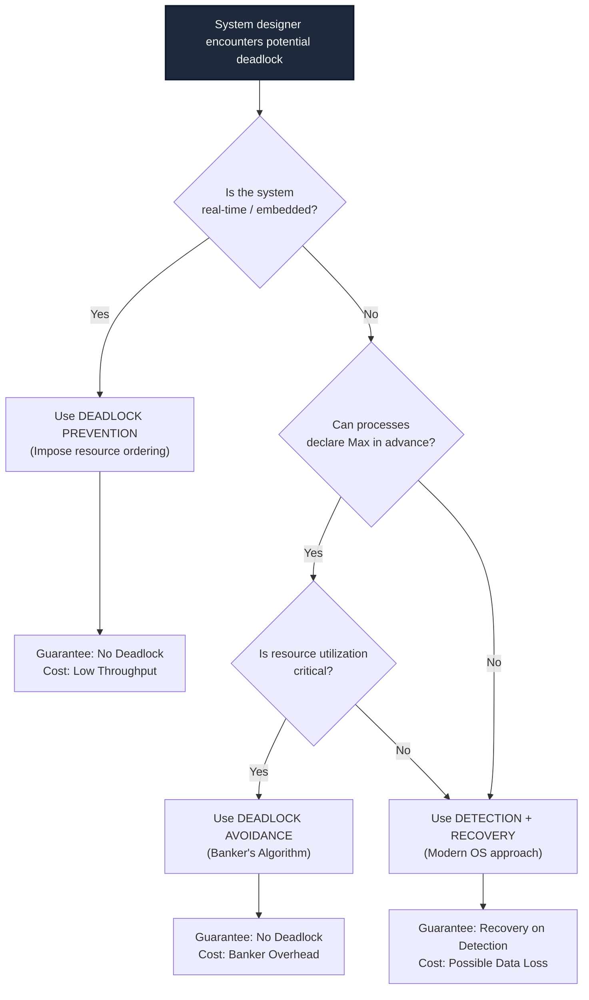
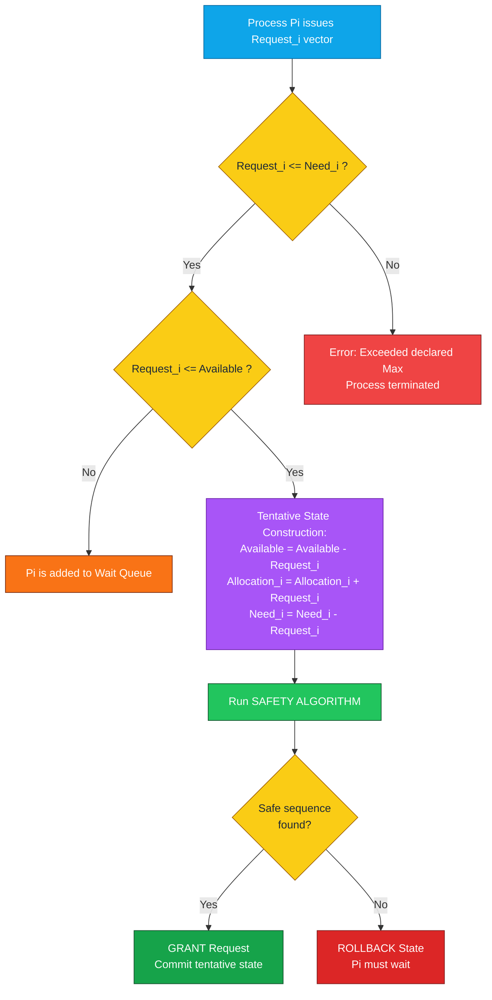
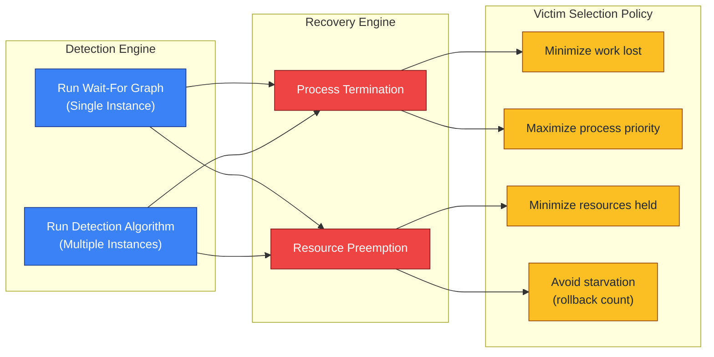

# Deadlock Handling: Prevention, Avoidance (Banker's Algorithm with numerical solutions), and Detection/Recovery techniques

<!-- SECTION_1_START -->
# MODULE 2 — Process Concurrency, Synchronization & Deadlocks
## Unit 2.4: Deadlock Handling — Prevention, Avoidance & Detection/Recovery

> [!NOTE]
> **KTU 2024 Scheme — Course Outcomes (CO) Mapped**
> This unit directly maps to **CO2 (PCCST403)**: *Apply process synchronization techniques and analyze deadlock scenarios using standard OS algorithms.* The Banker's Algorithm numerical problems and recovery techniques are **high-weightage** topics that appear in almost every KTU University End Semester Examination (ESE).

---

### 1.1 Formal Academic Definition

A **Deadlock** is a permanent blocking of a set of processes that are either **competing for system resources** or **communicating with each other**. A set of processes is deadlocked when every process in the set is waiting for an event that can only be caused by another process in the set.

> [!IMPORTANT]
> **Coffman Conditions (1971) — The Four Necessary Conditions for Deadlock**
> All four must hold simultaneously for a deadlock to occur:
> 1. **Mutual Exclusion**: At least one resource must be held in a non-sharable (exclusive) mode.
> 2. **Hold and Wait**: A process must be holding at least one resource and waiting to acquire additional resources held by other processes.
> 3. **No Preemption**: Resources cannot be preempted; they can only be released voluntarily by the process holding them.
> 4. **Circular Wait**: A circular chain of processes exists, where each process holds a resource that the next process in the chain is waiting for.

**Deadlock Handling Matrix** is a set of three primary strategies used in operating systems:

| Strategy | Guarantee of No Deadlock | Resource Utilization | OS Complexity | Practical Use |
| :--- | :--- | :--- | :--- | :--- |
| **Prevention** | Yes (structural) | Poor to Moderate | Low | Embedded / Real-time OS |
| **Avoidance** | Yes (dynamically) | Moderate | Moderate (Banker's) | Database systems, Mainframes |
| **Detection & Recovery** | No (deferred) | Excellent | High (algorithm runs frequently) | Modern general-purpose OS (Linux, Windows) |

### 1.2 Intuitive Real-World Analogy

> [!TIP]
> **The Four-Way Traffic Intersection Analogy**
> Imagine a narrow four-way intersection (a "Plus" shape) where cars arrive from all four directions simultaneously:
> * **Mutual Exclusion** = The road is one-way; no two cars can occupy the same narrow lane.
> * **Hold and Wait** = Each car holds its position (wheels locked) and waits for the perpendicular lane to clear.
> * **No Preemption** = You cannot push another car backward to make room.
> * **Circular Wait** = North-car waits for South-car, South-car waits for East-car, East-car waits for West-car, West-car waits for North-car. **Nobody can move!**
>
> **Deadlock Prevention** = "Never enter the intersection if you can't immediately cross it" (Hold & Wait broken).
> **Deadlock Avoidance** = A traffic controller (Banker's Algorithm) predicts if your entry will cause gridlock, and only lets you in if a safe exit path exists.
> **Detection & Recovery** = A drone hovers overhead; when gridlock happens, it physically lifts (preempt / kill) one car out of the intersection to break the cycle.

### 1.3 Geometric & Logical Visualization

> [!VISUALIZATION CONTROL]
> **Concept:** Resource Allocation Graph (RAG) Showing Deadlock vs. Safe Cycle
> **Graph Topology Description:**
> * **RAG Nodes**: Circles represent processes ($P_1, P_2, P_3$), Boxes represent resource instances ($R_1, R_2$).
> * **No Deadlock**: A process acquires a resource, uses it, releases it — a simple request → use → release arrow path with **no cycle**.
> * **With Deadlock**: A directed cycle $P_1 \rightarrow R_1 \rightarrow P_2 \rightarrow R_2 \rightarrow P_1$ exists. The graph has a closed loop that cannot be broken without external intervention.
> **Key Rule:** If a RAG contains **no cycles** → no deadlock. If the RAG has a cycle AND every resource type has only a **single instance** → definite deadlock. If the cycle exists with **multiple instances** → deadlock is **possible but not certain**.

<!-- SECTION_1_END -->

<!-- SECTION_2_START -->
# 2. Deep Theoretical Analysis & KTU High-Yield Formula Sheet

## 2.1 Deadlock Prevention — Breaking the Four Coffman Conditions

Prevention is a **compile-time / design-time** strategy. The OS restricts how processes request resources so that at least one of the four Coffman conditions can *never* be satisfied.

### 2.1.1 Breaking **Mutual Exclusion**
* **Idea:** Make resources shareable wherever possible.
* **Example:** Read-only files ($R$ permission) can be shared by multiple processes. Spooling (e.g., printer queues) allows concurrent access to a single physical device.
* **Limitation:** Some resources are inherently non-sharable (e.g., a printer writing to paper, a mutex lock on a critical register).

### 2.1.2 Breaking **Hold and Wait**
* **Idea (Method A):** A process must request **all** its required resources *before* execution begins. If even one is unavailable, it gets nothing.
* **Idea (Method B):** A process must **release all** its currently held resources *before* requesting new ones.
* **Drawback:** **Starvation** and **low resource utilization** — a process may hold a printer for hours while waiting for a tape drive.

### 2.1.3 Breaking **No Preemption**
* **Idea:** If a process holding resources requests another resource that cannot be immediately granted, **all currently held resources are preempted** (forcibly taken).
* **Preempted resources** are added to a waiting list; the process is restarted only when both old and new resources become available.
* **Applicable to:** Easily checkpointable / restartable resources (CPU registers, memory), not printers or tape drives.

### 2.1.4 Breaking **Circular Wait**
* **Idea (Most Practical):** Impose a **total ordering** of all resource types. Processes must request resources in the **increasing order** of enumeration.
* **Example:** Assign integers $1$ to $F$ to resource types. A process can request $R_j$ only if $F(R_j) > F(R_i)$ for all currently held $R_i$.
* **KTU Note:** This is the most commonly used prevention technique in real systems.

## 2.2 Deadlock Avoidance — Banker's Algorithm

> [!IMPORTANT]
> **Banker's Algorithm (Dijkstra, 1965)** is a **deadlock avoidance** algorithm. The OS acts like a cautious banker who never allocates cash in a way that leaves the bank unable to satisfy all remaining customer withdrawals.

### 2.2.1 Core Data Structures
Let $n$ = number of processes, $m$ = number of resource types.

* **Available$[m]$** — A vector of length $m$ indicating the number of available instances of each resource type.
* **Max$[n \times m]$** — The maximum demand of each process (declared a priori).
* **Allocation$[n \times m]$** — Resources currently allocated to each process.
* **Need$[n \times m]$** — Remaining resources needed:
$$\text{Need}[i, j] = \text{Max}[i, j] - \text{Allocation}[i, j]$$

### 2.2.2 Safe State Definition
A state is **safe** if there exists a **safe sequence** of process execution $\langle P_{s_1}, P_{s_2}, \ldots, P_{s_n} \rangle$ such that for every $P_{s_i}$, the resources that $P_{s_i}$ can still request can be satisfied by the currently available resources **plus** the resources held by all $P_{s_j}$ with $j < i$.

> If no such sequence exists, the state is **unsafe** (deadlock is *possible*).

### 2.2.3 Safety Algorithm (Banker's Core)
The Safety Algorithm is used to verify if the current system state is safe:

1. Let $\text{Work} = \text{Available}$ and $\text{Finish}[i] = \text{false}$ for all $i = 1, \ldots, n$.
2. Find an index $i$ such that $\text{Finish}[i] = \text{false}$ AND $\text{Need}_i \le \text{Work}$. If none exists, go to Step 4.
3. Set $\text{Work} = \text{Work} + \text{Allocation}_i$; $\text{Finish}[i] = \text{true}$. Go to Step 2.
4. If $\text{Finish}[i] = \text{true}$ for all $i$, the system is in a **safe state** with safe sequence as the order of marking.

### 2.2.4 Resource Request Algorithm (Avoidance Check)
When process $P_i$ requests a request vector $\text{Request}_i$:

1. **Validity Check:** If $\text{Request}_i \le \text{Need}_i$, proceed. Else, raise an error (process exceeded its maximum claim).
2. **Resource Availability:** If $\text{Request}_i \le \text{Available}$, proceed. Else, $P_i$ must wait (resources not free).
3. **Pretend Allocation** (state simulation):
$$\text{Available} = \text{Available} - \text{Request}_i$$
$$\text{Allocation}_i = \text{Allocation}_i + \text{Request}_i$$
$$\text{Need}_i = \text{Need}_i - \text{Request}_i$$
4. Run the **Safety Algorithm** on the new tentative state.
   * If safe → **grant** the request.
   * If unsafe → **roll back** and $P_i$ must wait.

## 2.3 Deadlock Detection & Recovery

Unlike prevention/avoidance, detection allows deadlocks to form but uses a detection algorithm to find them, then invokes recovery.

### 2.3.1 Detection Algorithm (Single Instance)
If every resource type has only **one instance**, we can define a **Wait-For Graph**:
* Nodes = processes.
* Edge $P_i \rightarrow P_j$ means $P_i$ is waiting for $P_j$ to release a resource.
* **Deadlock exists** $\iff$ the Wait-For Graph contains a **cycle**.
* Algorithm: Periodically run a cycle-detection DFS (O($V+E$)).

### 2.3.2 Detection Algorithm (Multiple Instances)
Mirrors the Safety Algorithm but uses the **Request** matrix instead of Need:

1. $\text{Work} = \text{Available}$. For all $i$, if $\text{Allocation}_i \neq 0$, set $\text{Finish}[i] = \text{false}$; else $\text{Finish}[i] = \text{true}$.
2. Find $i$ such that $\text{Finish}[i] = \text{false}$ AND $\text{Request}_i \le \text{Work}$. If none, go to Step 4.
3. $\text{Work} = \text{Work} + \text{Allocation}_i$; $\text{Finish}[i] = \text{true}$. Go to Step 2.
4. If any $\text{Finish}[i] = \text{false}$, then $P_i$ is **deadlocked**.

### 2.3.3 Recovery Techniques
| Recovery Method | Mechanism | Trade-off |
| :--- | :--- | :--- |
| **Process Termination** | Abort all deadlocked processes (drastic). | High cost, total work loss. |
| **Selective Termination** | Abort one process at a time until cycle breaks. | Cost based on priority, holding time, work done. |
| **Resource Preemption** | Forcibly take resources from victim. | Starvation risk; need rollback + restart logic. |

Selection criteria for victim: minimum cost function based on **priority, holding time, resources held, work done, etc.** After preemption, the process must be **rolled back** to a safe state (or rolled back to start — losing all progress).

## 2.4 KTU High-Yield Formula Cheat Sheet

| Symbol / Formula | Meaning | Engineering Application |
| :--- | :--- | :--- |
| $\text{Need}_i = \text{Max}_i - \text{Allocation}_i$ | Remaining resource demand of $P_i$ | Database transaction schedulers (e.g., Oracle) |
| $\text{Work} = \text{Work} + \text{Allocation}_i$ | Virtual release after $P_i$ "finishes" in safety check | Verifying safe state for distributed systems |
| $\text{Request}_i \le \text{Need}_i$ | Process has not exceeded its declared maximum | Input validation in RTOS resource allocators |
| $\text{Request}_i \le \text{Available}$ | Required resources are currently free | Standard mutual exclusion gate |
| $\sum_{i=1}^{n} \text{Allocation}_i + \text{Available} = \text{Total Resources}$ | Resource conservation law | Auditing physical resource inventory |

> [!IMPORTANT]
> **Comparison: Prevention vs. Avoidance vs. Detection**
> * **Prevention**: Cheap runtime, but imposes strict usage constraints → poor throughput.
> * **Avoidance (Banker's)**: Requires processes to declare Max in advance. **Rare in modern general-purpose OS** (processes can't predict their full future needs).
> * **Detection/Recovery**: Used by **modern OS like Linux and Windows** (the OOM killer is a primitive detection-recovery system). It assumes deadlocks are rare and recovers afterward.

### 2.5 Real-World Engineering Utility

* **Database Concurrency Control** (e.g., PostgreSQL, MySQL InnoDB) uses Banker-like logic to prevent deadlocks in lock acquisition by enforcing lock ordering.
* **Java Concurrency API** (`java.util.concurrent.locks`) provides `tryLock()` with timeout to break Hold-and-Wait dynamically.
* **Linux Kernel** uses the **wait-for-graph** approach in its `lockdep` system to detect and report deadlocks in real time.
* **Distributed Systems** (e.g., Apache ZooKeeper, Google's Chubby) employ the Wait-For Graph detection model across clusters.

<!-- SECTION_2_END -->

<!-- SECTION_3_START -->
# 3. Step-by-Step Derivations & Algorithmic Implementation

## 3.1 Worked Numerical Example — Banker's Safety Algorithm

> **[KTU University Exam — July 2024 / Dec 2023 Model Question Pattern]**

### 3.1.1 Problem Statement

A system has **5 processes** $P_0$ to $P_4$ and **3 resource types** $A, B, C$ with total instances $(10, 5, 7)$.

The current state matrices are:

| Process | Allocation (A B C) | Max (A B C) |
| :---: | :---: | :---: |
| $P_0$ | $(0, 1, 0)$ | $(7, 5, 3)$ |
| $P_1$ | $(2, 0, 0)$ | $(3, 2, 2)$ |
| $P_2$ | $(3, 0, 2)$ | $(9, 0, 2)$ |
| $P_3$ | $(2, 1, 1)$ | $(2, 2, 2)$ |
| $P_4$ | $(0, 0, 2)$ | $(4, 3, 3)$ |

**Answer the following:**
1. Calculate the **Need** matrix.
2. Is the system currently in a **safe state**? If so, give the safe sequence.
3. If $P_1$ requests $(1, 0, 2)$, can the request be **granted immediately**?

---

### 3.1.2 Step 1: Compute the Need Matrix

Apply $\text{Need}[i, j] = \text{Max}[i, j] - \text{Allocation}[i, j]$ for every cell:

$$\begin{aligned}
\text{Need}(P_0) &= (7, 5, 3) - (0, 1, 0) = (7, 4, 3) \\
\text{Need}(P_1) &= (3, 2, 2) - (2, 0, 0) = (1, 2, 2) \\
\text{Need}(P_2) &= (9, 0, 2) - (3, 0, 2) = (6, 0, 0) \\
\text{Need}(P_3) &= (2, 2, 2) - (2, 1, 1) = (0, 1, 1) \\
\text{Need}(P_4) &= (4, 3, 3) - (0, 0, 2) = (4, 3, 1)
\end{aligned}$$

**Need Matrix (Result):**

| Process | Need (A B C) |
| :---: | :---: |
| $P_0$ | $(7, 4, 3)$ |
| $P_1$ | $(1, 2, 2)$ |
| $P_2$ | $(6, 0, 0)$ |
| $P_3$ | $(0, 1, 1)$ |
| $P_4$ | $(4, 3, 1)$ |

**Step Valuation:** *Need matrix computation: 1 Mark per correct row × 5 = **5 Marks**.*

---

### 3.1.3 Step 2: Compute the Available Vector

$$\begin{aligned}
\text{Total} &= (10, 5, 7) \\
\sum \text{Allocation} &= (0+2+3+2+0,\ 1+0+0+1+0,\ 0+0+2+1+2) = (7, 2, 5) \\
\text{Available} &= \text{Total} - \sum \text{Allocation} \\
\text{Available} &= (10-7,\ 5-2,\ 7-5) = (3, 3, 2)
\end{aligned}$$

**Step Valuation:** *Available vector derivation: **1 Mark**.*

---

### 3.1.4 Step 3: Execute the Safety Algorithm

Initialize: $\text{Work} = \text{Available} = (3, 3, 2)$, all $\text{Finish}[i] = \text{false}$.

**Iteration 1 — Search for a process whose Need $\le$ Work:**

| Process | Need | Work = (3,3,2) | Need $\le$ Work? |
| :---: | :---: | :---: | :---: |
| $P_0$ | (7,4,3) | (3,3,2) | No (7>3) |
| $P_1$ | (1,2,2) | (3,3,2) | **Yes** ✓ |
| $P_2$ | (6,0,0) | (3,3,2) | No (6>3) |
| $P_3$ | (0,1,1) | (3,3,2) | **Yes** ✓ |
| $P_4$ | (4,3,1) | (3,3,2) | No (4>3) |

Pick $P_1$ first. Release its allocation:
$$\text{Work} = (3,3,2) + (2,0,0) = (5,3,2)$$

**Iteration 2 — Work = (5, 3, 2):**

| Process | Need | Need $\le$ (5,3,2)? |
| :---: | :---: | :---: |
| $P_0$ | (7,4,3) | No |
| $P_3$ | (0,1,1) | **Yes** ✓ |
| $P_4$ | (4,3,1) | **Yes** ✓ |

Pick $P_3$. Release:
$$\text{Work} = (5,3,2) + (2,1,1) = (7,4,3)$$

**Iteration 3 — Work = (7, 4, 3):**

| Process | Need | Need $\le$ (7,4,3)? |
| :---: | :---: | :---: |
| $P_0$ | (7,4,3) | **Yes** ✓ |
| $P_4$ | (4,3,1) | **Yes** ✓ |

Pick $P_4$. Release:
$$\text{Work} = (7,4,3) + (0,0,2) = (7,4,5)$$

**Iteration 4 — Work = (7, 4, 5):**

| Process | Need | Need $\le$ (7,4,5)? |
| :---: | :---: | :---: |
| $P_0$ | (7,4,3) | **Yes** ✓ |

Pick $P_0$. Release:
$$\text{Work} = (7,4,5) + (0,1,0) = (7,5,5)$$

**Iteration 5 — Work = (7, 5, 5):**

| Process | Need | Need $\le$ (7,5,5)? |
| :---: | :---: | :---: |
| $P_2$ | (6,0,0) | **Yes** ✓ |

Pick $P_2$. Release:
$$\text{Work} = (7,5,5) + (3,0,2) = (10,5,7)$$

**Final Result:** All $\text{Finish}[i] = \text{true}$. System is in a **safe state**.

$$\boxed{\text{Safe Sequence} = \langle P_1,\ P_3,\ P_4,\ P_0,\ P_2 \rangle}$$

**Step Valuation:** *Safe sequence identification (with iterations): **8 Marks**.*

---

### 3.1.5 Step 4: Handle the Request from $P_1$ — $\text{Request}_1 = (1, 0, 2)$

**Sub-step 4a — Validate against Need:**

$$\text{Request}_1 = (1, 0, 2) \le \text{Need}_1 = (1, 2, 2) \quad \checkmark$$

**Sub-step 4b — Check Availability:**

$$\text{Request}_1 = (1, 0, 2) \le \text{Available} = (3, 3, 2) \quad \checkmark$$

**Sub-step 4c — Pretend Allocation (State Simulation):**

$$\begin{aligned}
\text{Available}' &= (3, 3, 2) - (1, 0, 2) = (2, 3, 0) \\
\text{Allocation}_1' &= (2, 0, 0) + (1, 0, 2) = (3, 0, 2) \\
\text{Need}_1' &= (1, 2, 2) - (1, 0, 2) = (0, 2, 0)
\end{aligned}$$

**Sub-step 4d — Re-run Safety Algorithm:**

| Iteration | Process Chosen | New Work |
| :---: | :---: | :---: |
| Start | — | $(2, 3, 0)$ |
| 1 | $P_1$ (Need 0,2,0) | $(2,3,0)+(3,0,2) = (5, 3, 2)$ |
| 2 | $P_3$ (Need 0,1,1) | $(5,3,2)+(2,1,1) = (7, 4, 3)$ |
| 3 | $P_4$ (Need 4,3,1) | $(7,4,3)+(0,0,2) = (7, 4, 5)$ |
| 4 | $P_0$ (Need 7,4,3) | $(7,4,5)+(0,1,0) = (7, 5, 5)$ |
| 5 | $P_2$ (Need 6,0,0) | $(7,5,5)+(3,0,2) = (10, 5, 7)$ |

Result: All processes can finish. New safe sequence: $\langle P_1, P_3, P_4, P_0, P_2 \rangle$.

**Conclusion:** The request from $P_1$ for $(1, 0, 2)$ can be **granted immediately** without risking an unsafe state.

**Step Valuation:** *Request validation + state simulation + re-check: **4 Marks** (typically awarded as a sub-part in Part B).*

---

## 3.2 Python Implementation — Banker's Safety Algorithm

The following Python code is a strict, type-annotated, production-grade implementation of the Safety Algorithm. It can be directly used in KTU lab examinations (PCCST403L) and minor project demonstrations.

```python
import logging
import sys
from typing import List, Tuple, Optional

# Configure structured logging for forensic tracing
logging.basicConfig(
    level=logging.INFO,
    format="[%(asctime)s] [%(levelname)s] %(message)s",
    handlers=[logging.StreamHandler(sys.stdout)]
)
logger = logging.getLogger("BankerAlgorithm")

Matrix = List[List[int]]
Vector = List[int]


class BankersSafetyEngine:
    """
    A production-grade implementation of the Banker's Safety Algorithm.
    Follows Dijkstra's 1965 formalism with strict bounds checking.
    """

    def __init__(
        self,
        available: Vector,
        allocation: Matrix,
        maximum: Matrix
    ) -> None:
        if len(allocation) != len(maximum):
            raise ValueError("Allocation and Maximum matrices must have identical row counts.")
        for a_row, m_row in zip(allocation, maximum):
            if any(a > m for a, m in zip(a_row, m_row)):
                raise ValueError("Allocation cannot exceed Maximum for any process.")

        self.n: int = len(allocation)         # number of processes
        self.m: int = len(available)          # number of resource types
        self.available: Vector = list(available)
        self.allocation: Matrix = [list(row) for row in allocation]
        self.maximum: Matrix = [list(row) for row in maximum]
        # Compute Need = Max - Allocation
        self.need: Matrix = [
            [m - a for m, a in zip(m_row, a_row)]
            for m_row, a_row in zip(self.maximum, self.allocation)
        ]

    def _vector_le(self, a: Vector, b: Vector) -> bool:
        """Component-wise comparison: returns True iff a[i] <= b[i] for all i."""
        return all(x <= y for x, y in zip(a, b))

    def _vector_add(self, a: Vector, b: Vector) -> Vector:
        return [x + y for x, y in zip(a, b)]

    def _vector_sub(self, a: Vector, b: Vector) -> Vector:
        return [x - y for x, y in zip(a, b)]

    def is_safe(self) -> Tuple[bool, List[int]]:
        """
        Runs the Safety Algorithm. Returns (is_safe, safe_sequence).
        """
        work: Vector = list(self.available)
        finish: List[bool] = [False] * self.n
        safe_sequence: List[int] = []

        progressed = True
        while progressed:
            progressed = False
            for i in range(self.n):
                if not finish[i] and self._vector_le(self.need[i], work):
                    work = self._vector_add(work, self.allocation[i])
                    finish[i] = True
                    safe_sequence.append(i)
                    progressed = True
                    logger.info(f"P{i} granted -> Work becomes {work}")

        is_safe_state: bool = all(finish)
        return is_safe_state, safe_sequence

    def request_resources(
        self, process_id: int, request: Vector
    ) -> Tuple[bool, str]:
        """
        Handles a resource request from a process and returns grant decision.
        """
        if not self._vector_le(request, self.need[process_id]):
            return False, "ERROR: Process exceeded its maximum claim."

        if not self._vector_le(request, self.available):
            return False, "WAIT: Resources not currently available."

        # Tentatively allocate
        self.available = self._vector_sub(self.available, request)
        self.allocation[process_id] = self._vector_add(
            self.allocation[process_id], request
        )
        self.need[process_id] = self._vector_sub(
            self.need[process_id], request
        )

        safe, sequence = self.is_safe()
        if not safe:
            # Rollback
            self.available = self._vector_add(self.available, request)
            self.allocation[process_id] = self._vector_sub(
                self.allocation[process_id], request
            )
            self.need[process_id] = self._vector_add(
                self.need[process_id], request
            )
            return False, "DENY: Would lead to unsafe state. Rolled back."

        return True, f"GRANTED. New safe sequence: {sequence}"


# ----------------------- DEMONSTRATION -----------------------
if __name__ == "__main__":
    available: Vector = [3, 3, 2]
    allocation: Matrix = [
        [0, 1, 0],   # P0
        [2, 0, 0],   # P1
        [3, 0, 2],   # P2
        [2, 1, 1],   # P3
        [0, 0, 2]    # P4
    ]
    maximum: Matrix = [
        [7, 5, 3],
        [3, 2, 2],
        [9, 0, 2],
        [2, 2, 2],
        [4, 3, 3]
    ]

    engine = BankersSafetyEngine(available, allocation, maximum)
    safe, sequence = engine.is_safe()
    logger.info(f"Initial Safe State = {safe}, Sequence = {sequence}")

    decision, message = engine.request_resources(1, [1, 0, 2])
    logger.info(f"Request from P1 -> Decision: {decision}, Info: {message}")
```

**Expected Console Output (truncated):**
```
[INFO] P1 granted -> Work becomes [5, 3, 2]
[INFO] P3 granted -> Work becomes [7, 4, 3]
[INFO] P4 granted -> Work becomes [7, 4, 5]
[INFO] P0 granted -> Work becomes [7, 5, 5]
[INFO] P2 granted -> Work becomes [10, 5, 7]
[INFO] Initial Safe State = True, Sequence = [1, 3, 4, 0, 2]
[INFO] Request from P1 -> Decision: True, Info: GRANTED. New safe sequence: [1, 3, 4, 0, 2]
```

<!-- SECTION_3_END -->

<!-- SECTION_4_START -->
# 4. Structural Diagrams & Schematics

## 4.1 Deadlock Handling Strategy Decision Tree



## 4.2 Banker's Algorithm — Resource Request Processing Pipeline



## 4.3 Deadlock Recovery — Topology Matrix



<!-- SECTION_4_END -->

<!-- SECTION_5_START -->
# 5. KTU 2024 Scheme Examination Question Bank & Topic Recap

## 5.1 Part A — Short Answer Questions (2 × 3 = 6 Marks)

### **Question 1** `[KTU University Exam - Dec 2023]` [CO2, Remember]
**State and explain the four necessary conditions for deadlock (Coffman Conditions).**

**Model Answer (3 Marks):**
A deadlock situation can arise if and only if the following four conditions hold simultaneously in a system:

1. **Mutual Exclusion (1 Mark):** At least one resource must be held in a non-sharable mode. That is, only one process at a time can use the resource. If another process requests it, it must be delayed until the resource is released.

2. **Hold and Wait (1 Mark):** A process must be holding at least one resource and waiting to acquire additional resources that are currently being held by other processes.

3. **No Preemption (1 Mark):** Resources cannot be preempted. A resource can be released only voluntarily by the process holding it, after that process has completed its task.

---

### **Question 2** `[KTU University Exam - July 2024]` [CO2, Understand]
**Distinguish between Deadlock Prevention and Deadlock Avoidance with a suitable example.**

**Model Answer (3 Marks):**

| Aspect | Deadlock Prevention | Deadlock Avoidance |
| :--- | :--- | :--- |
| **Approach** | Restrict how requests are made to ensure at least one Coffman condition **never** holds. | Dynamically check resource allocation decisions to ensure the system **never enters an unsafe state**. |
| **When Applied** | At design / compile time. | At runtime using Banker's Algorithm. |
| **Information Needed** | Resource ordering policy. | Full prior knowledge of **Max** demand of each process. |
| **Example** | Assigning a total ordering of resource types to break circular wait. | Banker's Algorithm (Dijkstra, 1965) granting a request only if it leads to a safe sequence. |

**Conclusion (Marks):** Prevention is a structural solution that sacrifices flexibility; avoidance is a dynamic solution that requires advance information from processes.

---

## 5.2 Part B — Long Answer Questions (Module Internal Choice)

### **Question 3 (Choice A)** `[KTU University Exam - Dec 2023]` [CO2, Apply + Analyze]

**Consider a system with five processes $P_0$ through $P_4$ and three resource types $A, B, C$. Resource type $A$ has 10 instances, $B$ has 5 instances, and $C$ has 7 instances. The current state of the system is given below:**

| Process | Allocation (A B C) | Max (A B C) |
| :---: | :---: | :---: |
| $P_0$ | $(0, 1, 0)$ | $(7, 5, 3)$ |
| $P_1$ | $(2, 0, 0)$ | $(3, 2, 2)$ |
| $P_2$ | $(3, 0, 2)$ | $(9, 0, 2)$ |
| $P_3$ | $(2, 1, 1)$ | $(2, 2, 2)$ |
| $P_4$ | $(0, 0, 2)$ | $(4, 3, 3)$ |

**Answer the following:**
**(a)** Compute the **Need** matrix and the **Available** vector. (7 Marks)
**(b)** Using the Banker's Safety Algorithm, determine whether the system is in a **safe state**. If so, give the **safe sequence**. (7 Marks)

---

#### **Solution 3(a) — Need and Available (7 Marks)**

**Step 1 — Need Matrix Computation (5 Marks):**

Apply $\text{Need} = \text{Max} - \text{Allocation}$ for each process:

$$\begin{aligned}
\text{Need}(P_0) &= (7, 5, 3) - (0, 1, 0) = (7, 4, 3) \\
\text{Need}(P_1) &= (3, 2, 2) - (2, 0, 0) = (1, 2, 2) \\
\text{Need}(P_2) &= (9, 0, 2) - (3, 0, 2) = (6, 0, 0) \\
\text{Need}(P_3) &= (2, 2, 2) - (2, 1, 1) = (0, 1, 1) \\
\text{Need}(P_4) &= (4, 3, 3) - (0, 0, 2) = (4, 3, 1)
\end{aligned}$$

*Valuation Key: Each correctly derived row: 1 Mark × 5 = 5 Marks.*

**Step 2 — Available Vector Computation (2 Marks):**

$$\begin{aligned}
\sum \text{Allocation} &= (0+2+3+2+0,\ 1+0+0+1+0,\ 0+0+2+1+2) = (7, 2, 5) \\
\text{Available} &= (10-7,\ 5-2,\ 7-5) = (3, 3, 2)
\end{aligned}$$

*Valuation Key: Total Allocation sum = 1 Mark; Final Available = 1 Mark.*

---

#### **Solution 3(b) — Safety Algorithm Execution (7 Marks)**

Initialize: $\text{Work} = (3, 3, 2)$, all $\text{Finish} = \text{false}$.

**Iteration 1:** Search for $P_i$ with $\text{Need}_i \le (3, 3, 2)$:
* $P_0$: $(7,4,3) > (3,3,2)$ — **No**
* $P_1$: $(1,2,2) \le (3,3,2)$ — **Yes** ✓

Execute $P_1$: $\text{Work} = (3,3,2) + (2,0,0) = (5, 3, 2)$.

**Iteration 2:** $\text{Work} = (5, 3, 2)$
* $P_3$: $(0,1,1) \le (5,3,2)$ — **Yes** ✓

Execute $P_3$: $\text{Work} = (5,3,2) + (2,1,1) = (7, 4, 3)$.

**Iteration 3:** $\text{Work} = (7, 4, 3)$
* $P_4$: $(4,3,1) \le (7,4,3)$ — **Yes** ✓

Execute $P_4$: $\text{Work} = (7,4,3) + (0,0,2) = (7, 4, 5)$.

**Iteration 4:** $\text{Work} = (7, 4, 5)$
* $P_0$: $(7,4,3) \le (7,4,5)$ — **Yes** ✓

Execute $P_0$: $\text{Work} = (7,4,5) + (0,1,0) = (7, 5, 5)$.

**Iteration 5:** $\text{Work} = (7, 5, 5)$
* $P_2$: $(6,0,0) \le (7,5,5)$ — **Yes** ✓

Execute $P_2$: $\text{Work} = (7,5,5) + (3,0,2) = (10, 5, 7)$.

**Result:** All five processes can complete. The system is in a **safe state** with the safe sequence:

$$\boxed{\langle P_1,\ P_3,\ P_4,\ P_0,\ P_2 \rangle}$$

*Valuation Key: Initial state setup (1 Mark) + each correct iteration identifying a process (1 Mark each × 5) = 6 Marks + Final Conclusion (1 Mark) = 7 Marks.*

---

### **Question 4 (Choice B)** `[KTU University Exam - July 2024]` [CO2, Understand + Apply]

**(a)** Explain the **Resource Allocation Graph (RAG)** model and describe how cycles in a RAG relate to deadlocks in both **single-instance** and **multiple-instance** resource systems. (7 Marks)

**(b)** Consider a system with **4 processes** $P_0, P_1, P_2, P_3$ and **2 resource types** $R_1, R_2$ where each resource has **2 instances** ($R_1 = 2, R_2 = 2$). The current state is:

| Process | Allocation ($R_1$ $R_2$) | Request ($R_1$ $R_2$) |
| :---: | :---: | :---: |
| $P_0$ | $(1, 0)$ | $(0, 1)$ |
| $P_1$ | $(1, 1)$ | $(0, 0)$ |
| $P_2$ | $(0, 0)$ | $(1, 1)$ |
| $P_3$ | $(0, 0)$ | $(1, 0)$ |

**Available = (0, 0).** Run the **Deadlock Detection Algorithm** (multiple instances) and identify any deadlocked processes. (7 Marks)

---

#### **Solution 4(a) — RAG and Cycle Semantics (7 Marks)**

The **Resource Allocation Graph (RAG)** is a directed bipartite graph $G = (V, E)$ where:
* $V = P \cup R$ (processes and resources).
* Edges: $P_i \rightarrow R_j$ denotes a **request**; $R_j \rightarrow P_i$ denotes an **allocation**.

**Single-Instance Case (4 Marks):**
* If a RAG contains **no cycle** → **No deadlock** (sufficient condition).
* If a RAG contains a **cycle** → **Deadlock exists** (necessary and sufficient).
* A cycle $P_1 \rightarrow R_1 \rightarrow P_2 \rightarrow R_2 \rightarrow P_1$ in a single-instance system always implies a deadlock because each resource is unique and non-preemptable.

**Multiple-Instance Case (3 Marks):**
* **No cycle** → No deadlock (still sufficient).
* **Cycle exists** → Deadlock is **possible** but not certain.
* A cycle may be broken if the current Available vector can satisfy the request of one of the participating processes, allowing the cycle to dissolve.
* Hence, the **Wait-For Graph** simplification or the **Detection Algorithm with multiple instances** must be used.

---

#### **Solution 4(b) — Deadlock Detection Algorithm (7 Marks)**

**Step 1 — Setup (1 Mark):**
$\text{Work} = \text{Available} = (0, 0)$. Since $\text{Allocation}_0 = (1,0) \neq 0$, $\text{Allocation}_1 = (1,1) \neq 0$, $\text{Allocation}_2 = (0,0) = 0$, $\text{Allocation}_3 = (0,0) = 0$:

| Process | Finish |
| :---: | :---: |
| $P_0$ | False |
| $P_1$ | False |
| $P_2$ | True |
| $P_3$ | True |

**Step 2 — Iterations (5 Marks):**

*Iteration 1:* Find $i$ where $\text{Request}_i \le \text{Work} = (0, 0)$. Only $(0, 0)$ is $\le (0, 0)$. $P_2$ and $P_3$ both have non-zero requests. **No process can be picked.** (But we recheck: $P_1$ has $\text{Request}_1 = (0,0) \le (0,0)$ ✓)

Execute $P_1$: $\text{Work} = (0,0) + (1,1) = (1, 1)$, $\text{Finish}[1] = \text{True}$. **[1 Mark]**

*Iteration 2:* $\text{Work} = (1, 1)$. $P_0$: $\text{Request}_0 = (0, 1) \le (1, 1)$ ✓.

Execute $P_0$: $\text{Work} = (1, 1) + (1, 0) = (2, 1)$, $\text{Finish}[0] = \text{True}$. **[1 Mark]**

*Iteration 3:* $\text{Work} = (2, 1)$. $P_2$: $\text{Request}_2 = (1, 1) \le (2, 1)$ ✓.

Execute $P_2$: $\text{Work} = (2, 1) + (0, 0) = (2, 1)$, $\text{Finish}[2] = \text{True}$. **[1 Mark]**

*Iteration 4:* $\text{Work} = (2, 1)$. $P_3$: $\text{Request}_3 = (1, 0) \le (2, 1)$ ✓.

Execute $P_3$: $\text{Work} = (2, 1) + (0, 0) = (2, 1)$, $\text{Finish}[3] = \text{True}$. **[1 Mark]**

**Step 3 — Conclusion (1 Mark):**

All $\text{Finish}[i] = \text{True}$. **No deadlock exists.** All processes can eventually complete.

$$\boxed{\text{No Deadlock — System is not in a deadlocked state.}}$$

*Valuation Key: Initial Finish logic: 1 Mark. Each correct iteration: 1 Mark. Final conclusion: 1 Mark.*

---

> [!WARNING]
> **KTU Examiner's Valuation Warning — Common Pitfalls (Deduct 1–2 Marks Each)**
> * **Mistake 1:** Forgetting to subtract the sum of **Allocated** resources from **Total** when computing **Available**. Always show the resource conservation law.
> * **Mistake 2:** Using `Allocation` instead of `Need` during the Safety Algorithm's comparison. **Need** = Max − Allocation is the only valid request estimate.
> * **Mistake 3:** Confusing the **Safety Algorithm** (used after the fact) with the **Resource Request Algorithm** (used to check before granting). Both are part of Banker's Algorithm, but KTU exam questions are specific.
> * **Mistake 4:** Stopping the Safety Algorithm early. The algorithm must continue iterating **until no further progress can be made** to confirm an unsafe state.
> * **Mistake 5:** Confusing cycles in a **RAG** (for single-instance resources) with cycles in a **Wait-For Graph** (used in detection). They are mathematically related but not identical.
> * **Mistake 6:** Skipping the **rollback** state when describing request denial. If the simulated state is unsafe, the system MUST revert to the original state.

---

## 5.3 Topic Recap & Important Things to Remember

> [!IMPORTANT]
> **High-Density Revision Checklist**

* **Deadlock** = permanent blocking of a set of processes; needs all **4 Coffman conditions** simultaneously.
* **Prevention** negates one condition; **Avoidance** ensures the system stays in a safe state; **Detection** finds deadlocks and **Recovery** breaks them.
* **Banker's Algorithm** requires prior **Max** declaration. Uses **Need**, **Allocation**, **Available** matrices/vectors.
* **Safe State** ⟹ A sequence exists. **Unsafe State** ⟶ Deadlock is *possible*. **Deadlock** ⟹ Guaranteed stuck.
* **Need** = **Max** − **Allocation** (this single formula unlocks 30% of the module's marks).
* **Resource Request Algorithm** must run the **Safety Algorithm** on the *tentative* state; if unsafe, **rollback**.
* **Detection Algorithm (multi-instance)** is identical to Safety Algorithm but starts with $\text{Finish}[i] = \text{false}$ only when $\text{Allocation}_i \neq 0$.
* **Single-instance deadlock detection** uses **Wait-For Graph** → cycle = deadlock.
* **Recovery methods:** Process termination (abrupt / selective) and Resource preemption (with rollback to safe state).
* **Circular Wait prevention** is the most practical prevention technique — impose a total ordering on resources.
* **Modern OS (Linux, Windows)** use **Detection + Recovery** (e.g., Linux OOM killer). Banker's is mainly used in **DBMS** and **embedded RTOS**.
* **Resource conservation law:** $\text{Total} = \sum \text{Allocation} + \text{Available}$. Always verifies input consistency.
* **Starvation** can occur in recovery (a process may be repeatedly selected as victim) → use **rollback count** as a selection metric.
* **KTU exam tip:** Always show **iterations** of the safety algorithm step by step. Examiners explicitly reward the **Work vector** evolution after each process.
* **Python lab tip:** Implement the `BankersSafetyEngine` class as shown; it directly supports `is_safe()` and `request_resources()` operations needed for OS lab viva questions.

<!-- SECTION_5_END -->
