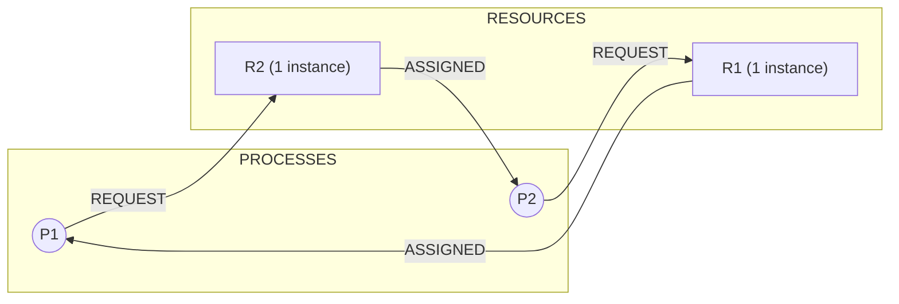
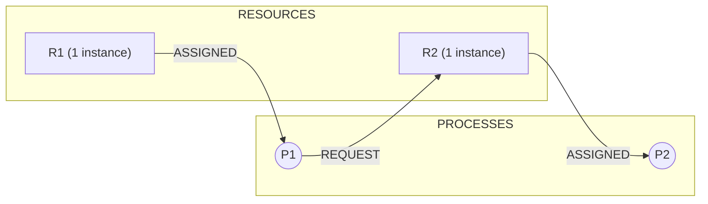
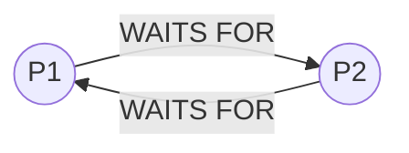
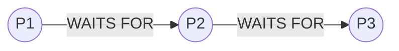
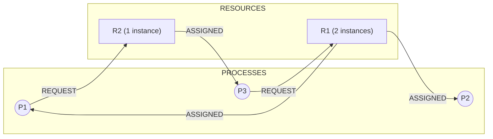
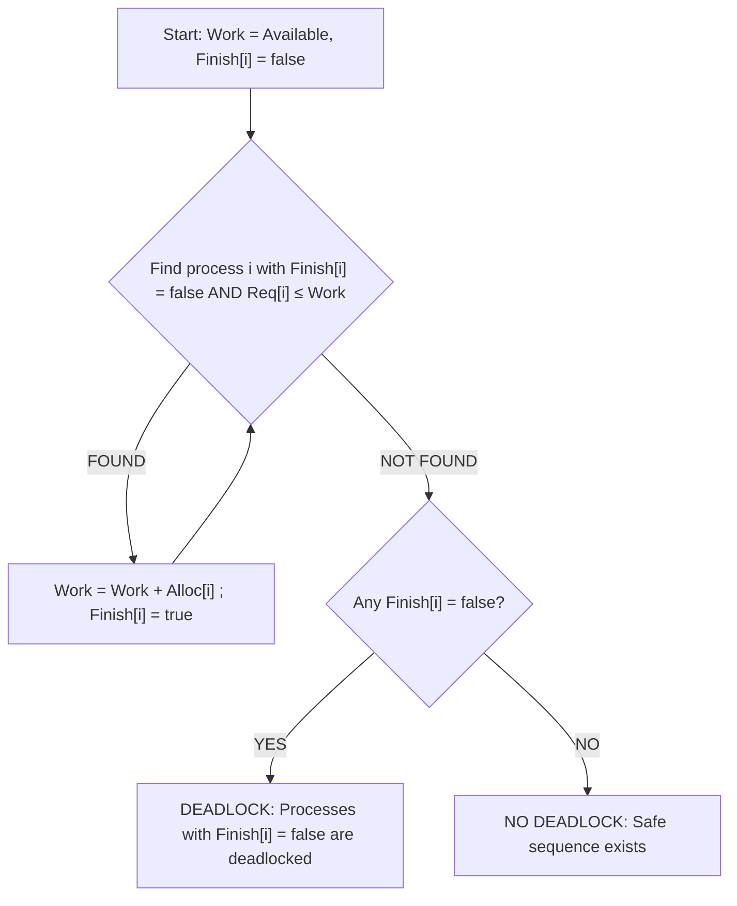
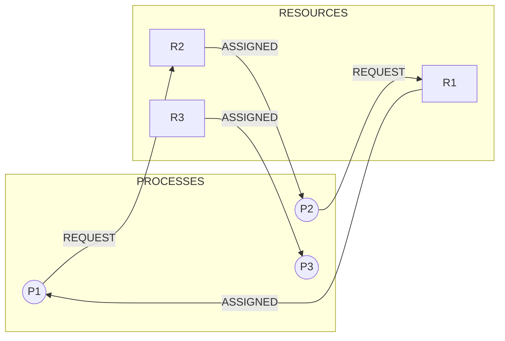

# Deadlocks: Conditions for deadlock occurrence, Resource Allocation Graphs (RAG)

<!-- SECTION_1_START -->

# Deadlocks: Conditions for Occurrence & Resource Allocation Graphs

## 1.1 Formal Definition (KTU 2024 Syllabus Terminology)

> [!IMPORTANT]
> **Deadlock** is a permanent blocking state in which a set of two or more processes are each waiting for a resource currently held by another process within the same set, and none of them can ever make progress, release a resource, or be preempted by the operating system.

Mathematically, a system is in a **deadlocked state** if and only if there exists a non-empty set of processes $\mathcal{D} \subseteq \mathcal{P}$ such that for every $P_i \in \mathcal{D}$:

$$
\forall P_i \in \mathcal{D}, \quad \text{Request}(P_i) \cap \text{Held}(\mathcal{D} \setminus \{P_i\}) \neq \emptyset
$$

That is, every deadlocked process is holding at least one resource **AND** is waiting for at least one additional resource held by another process in the same set. The two fundamental components are therefore **resource contention** and **circular dependency**.

## 1.2 Intuitive Overview — The "Narrow Bridge" Analogy

> [!NOTE]
> **Real-world analogy:** Picture a narrow one-lane bridge connecting two towns, with traffic flowing in both directions. When two cars enter the bridge from opposite ends simultaneously, neither can move forward (the road is too narrow) and neither can reverse (the slope is too steep). Both are *holding* the road segment in front of them and *waiting* for the segment in front of the other car. This is **deadlock** — a system where no party can proceed because each is blocked by the other.

Geometrically, you can imagine **four trains approaching a square railroad crossing from four directions**:

- Train A owns the East-West track and wants the North-South track.
- Train B owns the South-North track and wants the West-East track.
- Train C owns the West-East track and wants the South-North track.
- Train D owns the North-South track and wants the East-West track.

A cyclic chain forms: $A \rightarrow B \rightarrow C \rightarrow D \rightarrow A$. If we freeze this snapshot in time, no train can advance — the perfect example of a circular wait.

## 1.3 The Four Coffman Conditions (Necessary & Sufficient)

> [!IMPORTANT]
> **Edward G. Coffman Jr.** (1971) proved that **all four** of the following conditions must hold *simultaneously* for a deadlock to occur. If even one is broken, the system is provably deadlock-free.

| # | Condition | One-line Meaning |
|---|-----------|------------------|
| 1 | **Mutual Exclusion** | At least one resource is held in **non-sharable** (exclusive) mode. |
| 2 | **Hold and Wait** | A process already holding resources may request *additional* resources held by others. |
| 3 | **No Preemption** | Operating system resources **cannot be forcibly taken**; they are released only voluntarily by the holding process. |
| 4 | **Circular Wait** | A directed cycle exists: $P_1 \rightarrow P_2 \rightarrow \cdots \rightarrow P_n \rightarrow P_1$, where $P_i$ is waiting for a resource held by $P_{i+1}$. |

> [!TIP]
> **Key Insight for Board Exams:** The conditions are **independent** but **jointly sufficient**. Memorize them in the order *M-H-N-C* (Mutual, Hold, No-preempt, Circular) — it is the most common way KTU questions are framed.

## 1.4 The Resource Allocation Graph (RAG) — First Look

The **Resource Allocation Graph (RAG)** is a directed graph used by the OS to model the instantaneous state of resource ownership. Formally:

$$
\text{RAG} = (V, E)
$$

where $V = \mathcal{P} \cup \mathcal{R}$ contains two disjoint vertex sets — *processes* ($\mathcal{P}$) and *resources* ($\mathcal{R}$) — and $E$ contains two edge types:

- **Request Edge** $\;P_i \rightarrow R_j$: Process $P_i$ is currently waiting for one instance of resource type $R_j$.
- **Assignment Edge** $\;R_j \rightarrow P_i$: One instance of resource type $R_j$ has been allocated to process $P_i$.

A resource vertex $R_j$ drawn as a rectangle is annotated with **dots** (small circles) equal to the number of physical instances of that resource type. In a single-instance system, each rectangle contains exactly one dot.

> [!VISUALIZATION CONTROL]
> **Concept:** RAG cycle visualization in 2-D plane.
> **GeoGebra / Desmos Input Points (to plot manually):**
> * $A = (1, 2)$ — Process P1
> * $B = (4, 2)$ — Process P2
> * $C = (1, 0)$ — Resource R1 (1 instance)
> * $D = (4, 0)$ — Resource R2 (1 instance)
> * Arrow segments: $A \to C$, $C \to B$, $B \to D$, $D \to A$
> **Visual Description:** Plot the four labelled points on a Cartesian plane. Connect them with arrow segments as specified. Observe the closed cycle $A \rightarrow C \rightarrow B \rightarrow D \rightarrow A$ — this represents a **deadlock state** in a single-instance system.

<!-- SECTION_1_END -->

<!-- SECTION_2_START -->

# Deep Theoretical Analysis & KTU High-Yield Formula Sheet

## 2.1 Detailed Anatomy of Each Coffman Condition

### 2.1.1 Mutual Exclusion

A resource is in a *non-sharable* state when it can be used by only one process at a time. Classic examples include a **printer** (two processes cannot simultaneously print to the same device), a **write-lock on a file**, a **CD-ROM writer**, or a **mutex variable**. If a resource is inherently *sharable* (e.g., a read-only file), mutual exclusion can be relaxed and deadlocks involving that resource become impossible.

> [!NOTE]
> **Why it matters:** Pure read-only resources (e.g., HTML pages served from a CDN) never participate in deadlocks because they are intrinsically sharable.

### 2.1.2 Hold and Wait

A process that has been granted at least one resource may, *while still holding it*, request additional resources. The second resource is held by some other process in the system. The classical example is a process that opens a file (acquires the file lock) and then requests the printer. If the printer is held by another process, the first process is *holding* the file and *waiting* for the printer.

### 2.1.3 No Preemption

Resources already allocated to a process **cannot be forcibly taken** by the OS. They are released only when the process holding them voluntarily returns them (typically by exiting a critical section or terminating). Contrast this with **CPU preemption** — the scheduler can forcibly context-switch a process off the CPU, but it cannot arbitrarily revoke a mutex the process holds.

### 2.1.4 Circular Wait

A closed directed chain of processes exists such that each process in the chain is waiting for a resource held by the next process. The circular wait is a *consequence* of the first three conditions — it does not arise independently.

## 2.2 The Resource Allocation Graph — Formal Model

### 2.2.1 Vertex Sets and Edge Sets

$$
V = \mathcal{P} \cup \mathcal{R}, \quad
E = E_{\text{req}} \cup E_{\text{assign}}
$$

- $\mathcal{P} = \{P_1, P_2, \dots, P_n\}$ — set of active processes (drawn as **circles** in textbook diagrams).
- $\mathcal{R} = \{R_1, R_2, \dots, R_m\}$ — set of resource *types* (drawn as **rectangles**).
- $E_{\text{req}} \subseteq \mathcal{P} \times \mathcal{R}$ — request edges (process $\to$ resource).
- $E_{\text{assign}} \subseteq \mathcal{R} \times \mathcal{P}$ — assignment edges (resource $\to$ process).

If resource type $R_j$ has $\eta(R_j)$ instances, then up to $\eta(R_j)$ assignment edges may emanate from $R_j$.

### 2.2.2 Two Variants of RAG

| Variant | Resource Instances | Cycle Implication |
|---|---|---|
| **RAG with single instance** | Every resource type has exactly one instance ($\eta = 1$). | A **cycle implies deadlock**; absence of cycle implies no deadlock. (Equivalence.) |
| **RAG with multiple instances** | At least one resource type has $\eta \geq 2$. | A **cycle is necessary but not sufficient**; must run the detection algorithm to confirm. |

> [!IMPORTANT]
> **Board Exam Hot-Point:** This is a favourite KTU question — *"If a cycle exists in a RAG, is deadlock guaranteed?"* The answer is **NO in general**, and **YES if all resources are single-instance**.

## 2.3 The Wait-For Graph (WFG) — Simplification

When every resource has a single instance, the RAG can be collapsed into a **Wait-For Graph** by removing the resource vertices and drawing a direct edge $P_i \to P_j$ whenever $P_i$ is waiting for a resource that $P_j$ holds.

In a WFG:

- **An edge $P_i \to P_j$ means**: $P_i$ is waiting for $P_j$ to release a resource.
- **A cycle in a WFG = deadlock** (only valid for single-instance RAGs).

## 2.4 KTU Formula Sheet / Cheat Sheet

| # | Concept | Symbol / Formula | Unit / Notes |
|---|---|---|---|
| 1 | Number of process vertices | $n = \vert \mathcal{P} \vert$ | Integer $\geq 0$ |
| 2 | Number of resource types | $m = \vert \mathcal{R} \vert$ | Integer $\geq 0$ |
| 3 | Instances of resource $R_j$ | $\eta(R_j) \in \mathbb{Z}_{\geq 1}$ | Total physical units |
| 4 | Allocation matrix | $\mathbf{Alloc}[n \times m]$ | $\mathbf{Alloc}[i][j]$ = instances of $R_j$ held by $P_i$ |
| 5 | Request matrix | $\mathbf{Req}[n \times m]$ | $\mathbf{Req}[i][j]$ = instances of $R_j$ still needed by $P_i$ |
| 6 | Available vector | $\mathbf{Avail}[m]$ | $\mathbf{Avail}[j] = \eta(R_j) - \sum_{i} \mathbf{Alloc}[i][j]$ |
| 7 | Total resources in system | $T_j = \eta(R_j)$ | Per type $j$ |
| 8 | Work vector (init) | $\mathbf{Work} \leftarrow \mathbf{Avail}$ | During detection |
| 9 | Finish flag | $\mathbf{Finish}[i] \in \{\text{false}, \text{true}\}$ | false $\Rightarrow$ process may be deadlocked |
| 10 | Single-instance cycle rule | $\text{cycle} \iff \text{deadlock}$ | Only for $\eta(R_j) = 1, \forall j$ |
| 11 | Multi-instance safe process | $\mathbf{Req}[i] \leq \mathbf{Work}$ (component-wise) | Process $P_i$ can finish |
| 12 | Deadlock detection condition | $\exists i: \mathbf{Finish}[i] = \text{false}$ after algorithm | System is deadlocked |

> [!NOTE]
> **Notation used:** $\leq$ in the multi-instance rule means *component-wise* vector inequality: $a \leq b \iff a_k \leq b_k$ for every component $k$. Use $\mathbf{Req}_i \leq \mathbf{Work}$ to mean element-wise.

## 2.5 Real-World Engineering Utility

Deadlock reasoning underpins the design of:

- **Database Management Systems** — Two-phase locking (2PL) and deadlocks on row-level locks in PostgreSQL, MySQL InnoDB.
- **Java Concurrency** — `synchronized` blocks, `ReentrantLock`, `java.util.concurrent` framework — all require careful lock-ordering to avoid deadlocks.
- **Operating Systems** — Kernel resource allocators (Linux `mm_lock`, Windows executive resources).
- **Distributed Systems** — Distributed deadlocks across multiple servers (e.g., SPHO and CODA research systems).
- **Embedded & Real-Time Systems** — Priority inversion and deadlock detection in automotive (AUTOSAR) and aerospace (ARINC 653) systems.
- **Transaction Processing** — TPC benchmarks and banking systems where circular transaction dependencies must be detected and aborted.

<!-- SECTION_2_END -->

<!-- SECTION_3_START -->

# Step-by-Step Derivations & Code Implementation

## 3.1 Mathematical Representation of the RAG

Let the RAG be $G = (V, E)$. Define the **incidence mapping** $\phi: E \to V \times V$ as:

$$
\phi(e) = (u, v) \quad \text{where } e \text{ is the directed edge } u \to v
$$

The **adjacency matrix** $A_G$ is an $(n+m) \times (n+m)$ binary matrix where:

$$
A_G[u, v] = \begin{cases} 1, & \text{if edge } u \to v \text{ exists} \\ 0, & \text{otherwise} \end{cases}
$$

A **cycle** of length $k$ is a sequence of distinct vertices $v_1, v_2, \dots, v_k$ such that $A_G[v_1, v_2] = A_G[v_2, v_3] = \dots = A_G[v_k, v_1] = 1$.

For a single-instance RAG, the equivalence is:

$$
\text{Deadlock exists} \iff \exists \text{ cycle in } G
$$

## 3.2 Worked Example 1 — Single-Instance RAG with Cycle (Deadlock)

### Scenario

- 2 processes: $P_1, P_2$
- 2 resource types: $R_1, R_2$ (each with 1 instance)
- $P_1$ holds $R_1$ and requests $R_2$.
- $P_2$ holds $R_2$ and requests $R_1$.

### RAG Construction

Edges:

$$
R_1 \to P_1, \quad P_1 \to R_2, \quad R_2 \to P_2, \quad P_2 \to R_1
$$

### Cycle Detection (DFS Approach)

We trace the path from $P_1$:

$$
P_1 \to R_2 \to P_2 \to R_1 \to P_1
$$

The path returns to its starting vertex, confirming a **cycle of length 4**. By the single-instance equivalence, **deadlock exists**, and both $P_1$ and $P_2$ are deadlocked.

## 3.3 Worked Example 2 — Single-Instance RAG without Cycle (No Deadlock)

### Scenario

- 2 processes: $P_1, P_2$
- 2 resource types: $R_1, R_2$ (each with 1 instance)
- $P_1$ holds $R_1$ and requests $R_2$.
- $P_2$ holds $R_2$ and has no pending request.

### RAG Construction

Edges:

$$
R_1 \to P_1, \quad P_1 \to R_2, \quad R_2 \to P_2
$$

### Cycle Detection

Trace from $P_1$:

$$
P_1 \to R_2 \to P_2 \quad (\text{no outgoing edge from } P_2)
$$

Trace from $P_2$:

$$
P_2 \quad (\text{no outgoing edge})
$$

No cycle exists, so **no deadlock**. $P_2$ will eventually complete and release $R_2$, which can then be granted to $P_1$.

## 3.4 Worked Example 3 — Multi-Instance RAG: Cycle Exists, Yet No Deadlock

### Scenario

- 3 processes: $P_1, P_2, P_3$
- 2 resource types: $R_1$ (2 instances), $R_2$ (1 instance)
- $P_1$ holds $1$ instance of $R_1$, requests $R_2$.
- $P_2$ holds $1$ instance of $R_1$, has no pending request.
- $P_3$ holds $R_2$, requests $R_1$.

### RAG Construction

Edges:

$$
R_1 \to P_1, \quad R_1 \to P_2, \quad P_1 \to R_2, \quad R_2 \to P_3, \quad P_3 \to R_1
$$

### Cycle Check

$$
P_1 \to R_2 \to P_3 \to R_1 \to P_1 \quad \text{(cycle of length 4)}
$$

### Apply Multi-Instance Detection Algorithm

**Allocation matrix** $\mathbf{Alloc}$:

$$
\mathbf{Alloc} = \begin{bmatrix} 1 & 0 \\ 1 & 0 \\ 0 & 1 \end{bmatrix} \quad \text{rows: } P_1, P_2, P_3; \text{ cols: } R_1, R_2
$$

**Request matrix** $\mathbf{Req}$:

$$
\mathbf{Req} = \begin{bmatrix} 0 & 1 \\ 0 & 0 \\ 1 & 0 \end{bmatrix}
$$

**Total resources** $T = (2, 1)$. **Available** $\mathbf{Avail} = T - \sum_i \mathbf{Alloc}[i] = (2, 1) - (2, 1) = (0, 0)$.

**Iteration 1:** $\mathbf{Work} = (0, 0)$, $\mathbf{Finish} = (\text{F, F, F})$.

- $P_1$: $\mathbf{Req}_1 = (0, 1) \leq (0, 0)$? No (because $1 > 0$ at index 1).
- $P_2$: $\mathbf{Req}_2 = (0, 0) \leq (0, 0)$? Yes. **$P_2$ can finish**.

After $P_2$ finishes: $\mathbf{Work} = (0, 0) + \mathbf{Alloc}_2 = (0, 0) + (1, 0) = (1, 0)$. $\mathbf{Finish} = (\text{F, T, F})$.

**Iteration 2:** $\mathbf{Work} = (1, 0)$, $\mathbf{Finish} = (\text{F, T, F})$.

- $P_1$: $\mathbf{Req}_1 = (0, 1) \leq (1, 0)$? No (because $1 > 0$ at index 1).
- $P_3$: $\mathbf{Req}_3 = (1, 0) \leq (1, 0)$? Yes. **$P_3$ can finish**.

After $P_3$ finishes: $\mathbf{Work} = (1, 0) + \mathbf{Alloc}_3 = (1, 0) + (0, 1) = (1, 1)$. $\mathbf{Finish} = (\text{F, T, T})$.

**Iteration 3:** $\mathbf{Work} = (1, 1)$, $\mathbf{Finish} = (\text{F, T, T})$.

- $P_1$: $\mathbf{Req}_1 = (0, 1) \leq (1, 1)$? Yes. **$P_1$ can finish**.

After $P_1$ finishes: $\mathbf{Work} = (1, 1) + \mathbf{Alloc}_1 = (1, 1) + (1, 0) = (2, 1)$. $\mathbf{Finish} = (\text{T, T, T})$.

**Conclusion:** All processes finish. **No deadlock exists** despite the RAG cycle — confirming the rule that *cycle is necessary but not sufficient* for multiple-instance resources.

## 3.5 Worked Example 4 — Multi-Instance RAG: Genuine Deadlock

### Scenario

- 3 processes: $P_1, P_2, P_3$
- 4 resource types: $A, B, C, D$ (each with 1 instance; $\eta = 1$)
- Allocation and Request matrices as below.

### Matrices

$$
\mathbf{Alloc} = \begin{bmatrix} 0 & 1 & 0 & 0 \\ 0 & 0 & 1 & 0 \\ 1 & 0 & 0 & 1 \end{bmatrix}, \quad
\mathbf{Req} = \begin{bmatrix} 0 & 0 & 1 & 1 \\ 1 & 1 & 0 & 0 \\ 0 & 0 & 0 & 0 \end{bmatrix}
$$

**Total** $T = (1, 1, 1, 1)$. **Available** $\mathbf{Avail} = (1, 1, 1, 1) - (1, 1, 1, 1) = (0, 0, 0, 0)$.

### Algorithm Execution

**Iteration 1:** $\mathbf{Work} = (0, 0, 0, 0)$, $\mathbf{Finish} = (\text{F, F, F})$.

- $P_1$: $(0, 0, 1, 1) \leq (0, 0, 0, 0)$? No.
- $P_2$: $(1, 1, 0, 0) \leq (0, 0, 0, 0)$? No.
- $P_3$: $(0, 0, 0, 0) \leq (0, 0, 0, 0)$? Yes. **$P_3$ finishes**.

After $P_3$: $\mathbf{Work} = (0, 0, 0, 0) + (1, 0, 0, 1) = (1, 0, 0, 1)$. $\mathbf{Finish} = (\text{F, F, T})$.

**Iteration 2:** $\mathbf{Work} = (1, 0, 0, 1)$, $\mathbf{Finish} = (\text{F, F, T})$.

- $P_1$: $(0, 0, 1, 1) \leq (1, 0, 0, 1)$? No ($1 > 0$ at index 2).
- $P_2$: $(1, 1, 0, 0) \leq (1, 0, 0, 1)$? No ($1 > 0$ at index 1).
- No process can proceed.

### Conclusion

$\mathbf{Finish} = (\text{F, F, T})$. Processes $P_1$ and $P_2$ are **deadlocked**.

## 3.6 Full Detection Algorithm — Multi-Instance Pseudocode

```
ALGORITHM: Multi-Instance Deadlock Detection
INPUT:  Avail[m], Alloc[n][m], Req[n][m]
OUTPUT: Deadlocked set D

Step 1.  Work[m] ← Avail
         Finish[i] ← false for i = 1 to n

Step 2.  REPEAT
           found ← false
           FOR i = 1 to n DO
             IF Finish[i] = false
                AND Req[i][j] ≤ Work[j]  for all j ∈ {1..m} THEN
               Work[j] ← Work[j] + Alloc[i][j]  for all j
               Finish[i] ← true
               found ← true
             ENDIF
           ENDFOR
         UNTIL found = false

Step 3.  D ← { i : Finish[i] = false }
         IF D = ∅ THEN "No deadlock"
                   ELSE "Deadlock involving processes in D"
```

## 3.7 Python Code — Single-Instance RAG Cycle Detection (DFS)

```python
from typing import Dict, List, Tuple, Optional


def detect_deadlock_rag(
    vertices: List[str],
    edges: List[Tuple[str, str]],
) -> Optional[List[str]]:
    """
    Detect a cycle in a single-instance Resource Allocation Graph
    using iterative Depth-First Search with three-colour marking.

    Parameters
    ----------
    vertices : list of str
        All vertex labels (e.g., ['P1','P2','R1','R2']).
    edges : list of (from, to)
        Directed edges. Request and assignment edges are both allowed;
        cycle existence is what matters.

    Returns
    -------
    list of str  or  None
        The list of vertices forming the cycle in traversal order,
        or None if no cycle exists (=> no deadlock).
    """
    WHITE, GRAY, BLACK = 0, 1, 2
    color: Dict[str, int] = {v: WHITE for v in vertices}
    parent: Dict[str, Optional[str]] = {v: None for v in vertices}

    # Build adjacency list
    adj: Dict[str, List[str]] = {v: [] for v in vertices}
    for src, dst in edges:
        adj[src].append(dst)

    def dfs(start: str) -> Optional[List[str]]:
        stack: List[Tuple[str, int]] = [(start, 0)]
        color[start] = GRAY
        while stack:
            node, idx = stack[-1]
            if idx < len(adj[node]):
                stack[-1] = (node, idx + 1)
                nxt = adj[node][idx]
                if color[nxt] == GRAY:
                    # Cycle: reconstruct path from nxt back via parents
                    cycle = [nxt]
                    cur: Optional[str] = node
                    while cur is not None and cur != nxt:
                        cycle.append(cur)
                        cur = parent[cur]
                    cycle.append(nxt)
                    cycle.reverse()
                    return cycle
                if color[nxt] == WHITE:
                    color[nxt] = GRAY
                    parent[nxt] = node
                    stack.append((nxt, 0))
            else:
                color[node] = BLACK
                stack.pop()
        return None

    for v in vertices:
        if color[v] == WHITE:
            result = dfs(v)
            if result is not None:
                return result
    return None
```

### 3.7.1 Demonstration Run

```python
if __name__ == "__main__":
    # Deadlock:  P1 -> R2 -> P2 -> R1 -> P1
    vertices = ["P1", "P2", "R1", "R2"]
    edges = [
        ("R1", "P1"),  # R1 assigned to P1
        ("P1", "R2"),  # P1 requests R2
        ("R2", "P2"),  # R2 assigned to P2
        ("P2", "R1"),  # P2 requests R1
    ]
    cycle = detect_deadlock_rag(vertices, edges)
    assert cycle is not None
    print("DEADLOCK cycle:", " -> ".join(cycle))
    # Output: DEADLOCK cycle: P1 -> R2 -> P2 -> R1 -> P1
```

## 3.8 Python Code — Multi-Instance Deadlock Detection

```python
from typing import List


def detect_deadlock_multi(
    available: List[int],
    allocation: List[List[int]],
    request: List[List[int]],
) -> List[int]:
    """
    Multi-instance deadlock detection (banker-style).

    Parameters
    ----------
    available   : list of int  (length m)
        Currently free instances of each resource type.
    allocation  : list of list of int  (n x m)
        Instances of each resource type currently held by each process.
    request     : list of list of int  (n x m)
        Outstanding requests: how many more instances of each
        resource type each process is still waiting for.

    Returns
    -------
    list of int
        Indices of processes left unfinished (= deadlocked).
        Empty list means no deadlock.
    """
    n: int = len(allocation)
    m: int = len(available)

    work: List[int] = list(available)
    finish: List[bool] = [False] * n
    progress: bool = True

    while progress:
        progress = False
        for i in range(n):
            if finish[i]:
                continue
            # Component-wise: Req[i][j] <= work[j] for all j
            if all(request[i][j] <= work[j] for j in range(m)):
                for j in range(m):
                    work[j] += allocation[i][j]
                finish[i] = True
                progress = True

    return [i for i in range(n) if not finish[i]]


if __name__ == "__main__":
    # Example 4 (revisited)
    avail = [0, 0, 0, 0]
    alloc = [
        [0, 1, 0, 0],   # P1
        [0, 0, 1, 0],   # P2
        [1, 0, 0, 1],   # P3
    ]
    req = [
        [0, 0, 1, 1],   # P1
        [1, 1, 0, 0],   # P2
        [0, 0, 0, 0],   # P3
    ]
    deadlocked = detect_deadlock_multi(avail, alloc, req)
    print("Deadlocked process indices:", deadlocked)
    # Output: Deadlocked process indices: [0, 1]
```

## 3.9 Comprehensive Worked Example — Reused Numerical Trace

For Example 3 (multi-instance, cycle but no deadlock), we can verify with the code:

```python
avail = [0, 0]                # R1 has 2 instances, R2 has 1
alloc = [
    [1, 0],   # P1: holds 1 of R1
    [1, 0],   # P2: holds 1 of R1
    [0, 1],   # P3: holds 1 of R2
]
req = [
    [0, 1],   # P1 wants R2
    [0, 0],   # P2 needs nothing
    [1, 0],   # P3 wants R1
]
print(detect_deadlock_multi(avail, alloc, req))
# Output: []  (no deadlock)
```

This output matches the manual derivation in §3.4. The cycle $P_1 \to R_2 \to P_3 \to R_1 \to P_1$ is a *false positive* for the cycle-based heuristic.

## 3.10 Edge-Case Mathematical Proof — Why Cycle Alone Is Insufficient

Define the sequence of $\mathbf{Work}$ vectors produced by the detection algorithm:

$$
\mathbf{Work}^{(0)} = \mathbf{Avail}, \quad
\mathbf{Work}^{(k+1)} = \mathbf{Work}^{(k)} + \mathbf{Alloc}[i_k]
$$

where $i_k$ is the index of the process that "finishes" at iteration $k$. A system is **deadlock-free** iff a sequence $i_0, i_1, \dots, i_{n-1}$ exists such that all $n$ processes finish. This is equivalent to: there exists a *topological ordering* of the *process dependency DAG*. The RAG cycle test is a sufficient proxy only when the dependency DAG is forced to mirror the RAG structure, which holds exactly when $\eta(R_j) = 1$ for all $j$.

<!-- SECTION_3_END -->

<!-- SECTION_4_START -->

# Structural Diagrams & Schematics

> [!NOTE]
> All diagrams below use the **Mermaid** syntax. Process vertices are drawn as circles (`((label))`) and resource vertices as rectangles (`[label]`) to match the standard OS textbook convention.

## 4.1 Diagram A — Single-Instance RAG with Cycle (Deadlock State)



**Reading the diagram:** Follow the arrows in order $R1 \rightarrow P1 \rightarrow R2 \rightarrow P2 \rightarrow R1$. The closed loop is a **cycle of length 4**. With single-instance resources, this guarantees deadlock.

## 4.2 Diagram B — Single-Instance RAG without Cycle (Safe State)



**Reading the diagram:** $P_1$ is waiting for $R_2$, which is held by $P_2$. $P_2$ has no outgoing edges — it is *not* waiting for anything. Therefore $P_2$ will release $R_2$ when it terminates, unblocking $P_1$. **No cycle, no deadlock.**

## 4.3 Diagram C — Wait-For Graph Showing Deadlock (Cycle)



**Reading the diagram:** $P_1$ waits for $P_2$ AND $P_2$ waits for $P_1$ — a self-contained 2-node cycle. This is the simplest possible deadlock in a WFG.

## 4.4 Diagram D — Wait-For Graph in a Safe State (Acyclic)



**Reading the diagram:** Linear chain $P_1 \to P_2 \to P_3$. $P_3$ has no dependencies, so it finishes and releases its resources; $P_2$ unblocks; $P_1$ unblocks. **No cycle, no deadlock.**

## 4.5 Diagram E — Multi-Instance RAG Where Cycle Exists But No Deadlock



**Reading the diagram:** A cycle exists ($P_1 \to R_2 \to P_3 \to R_1 \to P_1$). But $P_2$ is *not* waiting — it will release its $R_1$ instance. The freed instance satisfies $P_3$'s request, $P_3$ releases $R_2$, $P_1$ gets $R_2$, and the system unwinds. **Cycle exists, but no deadlock.** This is the canonical counter-example to the naive "cycle = deadlock" rule in multi-instance RAGs.

## 4.6 Diagram F — Sequential Processing Topology for the Detection Algorithm



This topology mirrors the multi-instance detection algorithm in §3.6. Each iteration of the inner loop corresponds to one pass of the search for a *runnable* process.

<!-- SECTION_4_END -->

<!-- SECTION_5_START -->

# KTU 2024 Scheme Examination Question Bank & Topic Recap

---

## Part A — Short-Answer Questions (3 Marks Each)

### Q1. **[KTU University Exam — July 2024]** Define a *deadlock*. State the four necessary conditions for its occurrence. **(CO1, Remember)**

**Model Answer (3 Marks):**

> A **deadlock** is a permanent blocking state in which a set of two or more processes are each waiting for a resource held by another process in the same set, and none can make progress, release a resource, or be preempted by the OS.
>
> **The four Coffman conditions are:**
> 1. **Mutual Exclusion** — at least one resource is non-sharable. **[1 Mark]**
> 2. **Hold and Wait** — a process holding resources may request additional ones held by others. **[1 Mark]**
> 3. **No Preemption** — resources cannot be forcibly taken; they are released only voluntarily. **[0.5 Mark]**
> 4. **Circular Wait** — a closed chain of processes exists where each waits for a resource held by the next. **[0.5 Mark]**

> [!WARNING]
> **Valuation Pitfall:** Students often state the conditions *out of order* or *merge Hold-and-Wait with Circular Wait*. Examiners deduct 0.5 marks if the precise terminology ("non-sharable", "voluntarily released") is missing. Use the exact phrases above.

---

### Q2. **[KTU University Exam — Dec 2023]** Differentiate between a **Request Edge** and an **Assignment Edge** in a Resource Allocation Graph. What do the dots inside a resource rectangle represent? **(CO1, Understand)**

**Model Answer (3 Marks):**

| Edge / Element | Direction | Meaning |
|---|---|---|
| **Request Edge** | Process $\to$ Resource | Process is *waiting* for one instance of the resource type. **[1 Mark]** |
| **Assignment Edge** | Resource $\to$ Process | One instance of the resource type is *currently allocated* to the process. **[1 Mark]** |
| **Dots inside resource box** | — | The total **number of physical instances** of that resource type. Each dot represents one instance. **[1 Mark]** |

---

## Part B — 14-Mark Long-Answer Questions (Module Internal Choice)

> **KTU Pattern:** Each Part B question has internal choice (Q-A or Q-B). Both choices have sub-parts of 7 marks each, mapped to escalating Revised Bloom's Taxonomy levels.

---

### Question A — 14 Marks **[KTU University Exam — July 2024, Module 2]**

#### (a) Explain the four Coffman conditions for deadlock in detail. For each condition, give a real-world example from an operating system or concurrent programming scenario. **[7 Marks, CO1, Understand]**

**Model Solution:**

> **1. Mutual Exclusion (1.5 Marks)**
> A resource is in a non-sharable mode when only one process can use it at a time. **OS Example:** A printer device — only one print job can write to the printer's hardware buffer at a time. In Java, a `ReentrantLock` acquired by thread $T_1$ cannot be used by thread $T_2$ until $T_1$ releases it. The moment a resource is intrinsically *sharable* (e.g., a read-only file), it is exempt from mutual exclusion and cannot participate in a deadlock.

> **2. Hold and Wait (1.5 Marks)**
> A process already holding one or more resources may issue a *new* request for resources currently held by other processes. **OS Example:** Thread $T_1$ acquires a file lock on `config.txt`, then requests a database connection from the pool. If the connection is held by thread $T_2$, $T_1$ is *holding* the file lock and *waiting* for the connection.

> **3. No Preemption (2 Marks)**
> Resources already granted to a process cannot be forcibly revoked by the OS. They are released only when the holding process voluntarily returns them (typically on exit from a critical section or process termination). **OS Example:** If a process holds a mutex and is suspended, the OS cannot arbitrarily take the mutex and give it to another process; the kernel has no safe way to roll back the holder's state. Contrast with CPU time, which the scheduler freely preempts.

> **4. Circular Wait (2 Marks)**
> A closed directed cycle of processes exists: $P_1 \to P_2 \to \cdots \to P_n \to P_1$, where $P_i$ waits for a resource held by $P_{i+1}$. **OS Example:** Process $P_1$ holds the printer, wants the tape drive. Process $P_2$ holds the tape drive, wants the disk. Process $P_3$ holds the disk, wants the printer. The chain $P_1 \to P_2 \to P_3 \to P_1$ is a circular wait. Breaking it (e.g., enforcing a global lock-ordering: always acquire *printer $\to$ tape $\to$ disk*) eliminates this condition.

**Valuation Key:** [Stating each condition with its precise definition: 1 Mark each = 4 Marks] [Real-world OS example per condition: 0.5–0.75 Mark each = 3 Marks].

#### (b) Construct the Resource Allocation Graph (RAG) for the following scenario. Determine whether a deadlock exists. Show all edges clearly. **[7 Marks, CO2, Apply]**

**Scenario:**

| Process | Held Resources | Requested Resources |
|---|---|---|
| $P_1$ | $R_1$ (1 instance) | $R_2$ |
| $P_2$ | $R_2$ (1 instance) | $R_1$ |
| $P_3$ | $R_3$ (1 instance) | None |

Assume each resource $R_1, R_2, R_3$ has exactly one instance.

**Model Solution:**

> **RAG Construction (3 Marks):**
> Edges: $R_1 \to P_1$, $P_1 \to R_2$, $R_2 \to P_2$, $P_2 \to R_1$, $R_3 \to P_3$.



> **Cycle Detection (3 Marks):**
> Trace from $P_1$: $P_1 \to R_2 \to P_2 \to R_1 \to P_1$. The path returns to $P_1$, confirming a **cycle of length 4**.

> **Deadlock Decision (1 Mark):**
> Since every resource has exactly **one instance** (single-instance RAG), a cycle in the graph is *equivalent* to deadlock. Therefore, **$P_1$ and $P_2$ are deadlocked**. $P_3$ is *not* deadlocked because it is in a separate component of the graph and has no pending request.

**Valuation Key:** [Drawing all 5 edges: 1.5 Marks] [Correct cycle identification: 1.5 Marks] [Applying single-instance rule: 1 Mark] [Final conclusion: 1 Mark] [Diagrammatic clarity: 2 Marks].

---

### Question B — 14 Marks **[KTU University Exam — Dec 2023, Module 2]**

#### (a) With a neat diagram, explain the structure of a Resource Allocation Graph. Distinguish between RAG with **single-instance** resources and RAG with **multiple-instance** resources. How does the presence of a cycle relate to deadlock in each case? **[7 Marks, CO1, Understand]**

**Model Solution:**

> **Structure of RAG (2 Marks):**
> A RAG is a directed bipartite graph $G = (V, E)$ where:
> - Vertex set $V = \mathcal{P} \cup \mathcal{R}$.
> - $\mathcal{P} = \{P_1, P_2, \dots, P_n\}$ — process vertices (drawn as **circles**).
> - $\mathcal{R} = \{R_1, R_2, \dots, R_m\}$ — resource vertices (drawn as **rectangles** with dots equal to instance count).
> - $E = E_{\text{req}} \cup E_{\text{assign}}$, where $E_{\text{req}}$ is the set of request edges ($P_i \to R_j$) and $E_{\text{assign}}$ is the set of assignment edges ($R_j \to P_i$).

> **Single-Instance RAG (2.5 Marks):**
> - Every resource type has exactly $\eta(R_j) = 1$ instance.
> - The equivalence rule: **cycle in RAG $\iff$ deadlock exists**. No cycle $\iff$ no deadlock.
> - Can be reduced to a **Wait-For Graph** by removing resource vertices and drawing direct process-to-process edges.

> **Multiple-Instance RAG (2.5 Marks):**
> - At least one resource type has $\eta(R_j) \geq 2$ instances.
> - The rule: **cycle is necessary but not sufficient**. A cycle *may* indicate deadlock, but a cycle-free system is always deadlock-free.
> - The multi-instance detection algorithm (§3.6) must be executed to *confirm* or *deny* deadlock.

#### (b) Consider the following system with 3 processes and 4 resource types. Total instances of each resource = 1. Determine whether the system is in a **deadlock state** using the detection algorithm. Show every iteration clearly. **[7 Marks, CO2, Apply]**

**Given Matrices:**

$$
\mathbf{Alloc} = \begin{bmatrix} 1 & 0 & 0 & 0 \\ 0 & 1 & 0 & 0 \\ 0 & 0 & 1 & 0 \end{bmatrix}, \quad
\mathbf{Req} = \begin{bmatrix} 0 & 1 & 0 & 1 \\ 1 & 0 & 1 & 0 \\ 0 & 0 & 0 & 1 \end{bmatrix}
$$

**Model Solution (step-by-step):**

> **Step 0: Compute Available (1 Mark)**
> Total $T = (1, 1, 1, 1)$. Sum of allocations = $(1, 1, 1, 0)$. Therefore:
> $$\mathbf{Avail} = (1, 1, 1, 1) - (1, 1, 1, 0) = (0, 0, 0, 1)$$

> **Step 1: Initialise (0.5 Mark)**
> $\mathbf{Work} = (0, 0, 0, 1)$. $\mathbf{Finish} = (\text{F, F, F})$.

> **Step 2: Iterative search (4 Marks — 1.5 per iteration)**
> - **Iteration 1:**
>   - $P_1$: $\mathbf{Req}_1 = (0,1,0,1) \leq (0,0,0,1)$? **No** ($1 > 0$ at index 1).
>   - $P_2$: $\mathbf{Req}_2 = (1,0,1,0) \leq (0,0,0,1)$? **No** ($1 > 0$ at index 0).
>   - $P_3$: $\mathbf{Req}_3 = (0,0,0,1) \leq (0,0,0,1)$? **Yes**. $P_3$ finishes.
>   - $\mathbf{Work} \leftarrow (0,0,0,1) + (0,0,1,0) = (0,0,1,1)$. $\mathbf{Finish} = (\text{F, F, T})$.
> - **Iteration 2:**
>   - $P_1$: $(0,1,0,1) \leq (0,0,1,1)$? **No** ($1 > 0$ at index 1).
>   - $P_2$: $(1,0,1,0) \leq (0,0,1,1)$? **No** ($1 > 0$ at index 0).
>   - No process can proceed.

> **Step 3: Conclusion (1.5 Marks)**
> $\mathbf{Finish} = (\text{F, F, T})$. Therefore, **$P_1$ and $P_2$ are deadlocked**. $P_3$ can complete (it had no real dependency on the other resources beyond its initial allocation).

**Valuation Key:** [Initialisation: 0.5 Mark] [Each iteration correctly evaluated: 1.5 Marks each] [Final Finish array correct: 1 Mark] [Final deadlocked-set identification: 1 Mark].

---

> [!WARNING]
> **KTU Examiner's Valuation Warning — Most Common Mistakes on this Topic:**
> 1. **Forgetting to update $\mathbf{Work}$ after a process finishes.** Always write $\mathbf{Work} \leftarrow \mathbf{Work} + \mathbf{Alloc}[i]$ explicitly. *(Loss: 1 Mark per omission.)*
> 2. **Conflating "cycle" with "deadlock" in multi-instance RAGs.** A cycle in a multi-instance RAG is *necessary but not sufficient*. Do not write "cycle implies deadlock" without the multi-instance caveat. *(Loss: 2 Marks.)*
> 3. **Mis-drawing the dots inside the resource rectangle.** Each dot represents one instance. Forgetting to draw dots, or drawing the wrong number, loses 0.5 Mark in diagrams.
> 4. **Skipping the initial state declaration ($\mathbf{Work} \leftarrow \mathbf{Avail}$).** Examiners want to see explicit step 0. *(Loss: 0.5 Mark.)*
> 5. **Confusing WFG and RAG.** A WFG is a *simplification* of a single-instance RAG, not a separate concept. The WFG has only process vertices. *(Loss: 1 Mark.)*

---

## Topic Recap & Important Things to Remember

> [!TIP]
> **High-Density Revision Checklist — Print This Page Before the Exam!**

- [x] **Definition of Deadlock**: A permanent blocking state in a set of $\geq 2$ processes where each is waiting for a resource held by another in the set.
- [x] **Coffman Conditions (Mnemonic: M-H-N-C)**: Mutual Exclusion, Hold and Wait, No Preemption, Circular Wait. *All four must hold simultaneously.*
- [x] **RAG Formal Definition**: $G = (V, E)$ where $V = \mathcal{P} \cup \mathcal{R}$ and $E = E_{\text{req}} \cup E_{\text{assign}}$.
- [x] **Process vertices are circles**; **Resource vertices are rectangles with dots** (each dot = one instance).
- [x] **Request edge** = $P_i \to R_j$ (process is *waiting*). **Assignment edge** = $R_j \to P_i$ (resource is *held*).
- [x] **Single-instance RAG**: cycle $\iff$ deadlock (equivalence). No cycle $\Rightarrow$ no deadlock.
- [x] **Multi-instance RAG**: cycle is **necessary but NOT sufficient**. Run the detection algorithm to confirm.
- [x] **Wait-For Graph (WFG)**: Single-instance RAG with resources removed. Edge $P_i \to P_j$ means $P_i$ waits for a resource held by $P_j$. Cycle in WFG = deadlock.
- [x] **Allocation Matrix $\mathbf{Alloc}[n][m]$**: $\mathbf{Alloc}[i][j]$ = instances of $R_j$ held by $P_i$.
- [x] **Request Matrix $\mathbf{Req}[n][m]$**: $\mathbf{Req}[i][j]$ = outstanding request of $P_i$ for $R_j$.
- [x] **Available Vector $\mathbf{Avail}[m]$**: $T_j - \sum_i \mathbf{Alloc}[i][j]$.
- [x] **Detection Algorithm**: Initialise $\mathbf{Work} = \mathbf{Avail}$, $\mathbf{Finish} = \text{false}$. Repeatedly find a process with $\mathbf{Req}[i] \leq \mathbf{Work}$, mark it finished, and add its allocation to $\mathbf{Work}$. Stop when no such process exists.
- [x] **Deadlock Decision**: Any process with $\mathbf{Finish}[i] = \text{false}$ at termination is deadlocked.
- [x] **Real-world places where this matters**: databases (row-level locks), Java `synchronized` blocks, OS kernel resource allocators, distributed systems, AUTOSAR automotive systems, banking transaction processing.
- [x] **Equation to remember**: $\mathbf{Work}^{(k+1)} = \mathbf{Work}^{(k)} + \mathbf{Alloc}[i_k]$ — the iterative update of the work vector.
- [x] **Component-wise inequality notation**: $\mathbf{Req}_i \leq \mathbf{Work}$ means $\mathbf{Req}_i[j] \leq \mathbf{Work}[j]$ for all $j \in \{1, \dots, m\}$.
- [x] **Common exam traps**: cycle $\neq$ deadlock (multi-instance); forgetting to update Work; confusing WFG with RAG; mis-drawing instance dots.

<!-- SECTION_5_END -->
