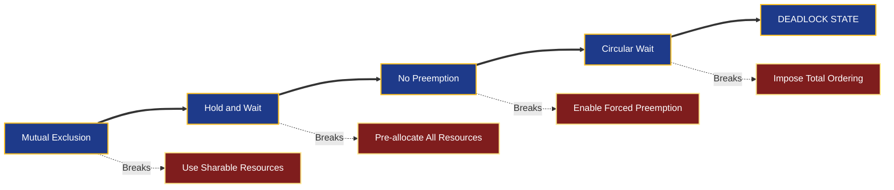
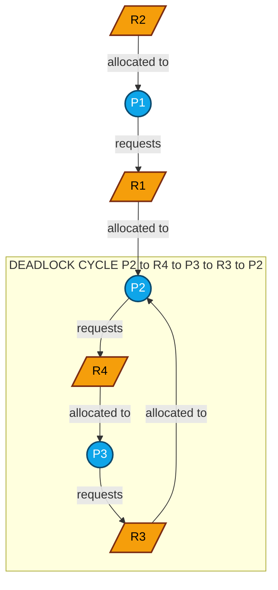

# Deadlocks: Conditions for deadlock occurrence, Resource Allocation Graphs (RAG)

<!-- SECTION_1_START -->
# Module 2 — Deadlocks: Conditions & Resource Allocation Graphs

> [!IMPORTANT]
> **KTU 2024 Scheme (PCCST403) — Operating Systems, Module 2**
> This topic forms the foundation for understanding process synchronization hazards. It maps to **CO2** of the official syllabus (Apply synchronization primitives and analyze deadlock scenarios).

## 1.1 Formal Academic Definition

A **Deadlock** is a permanent blocking state of a set of processes in a multi-programming environment, where **two or more processes** are perpetually waiting for an event (release of a resource) that can only be triggered by **another process** within the same waiting set. Formally, a system is said to be in a deadlock state at time $t$ if and only if the following four conditions are simultaneously satisfied:

$$
\exists \, P \subseteq \mathcal{P} \; \text{ such that } \; \forall p_i \in P, \; p_i \text{ is blocked on an event } e \text{ held by } p_j \in P
$$

where $\mathcal{P}$ is the set of all active processes in the system. The resource set $\mathcal{R} = \{R_1, R_2, \ldots, R_m\}$ with allocation matrix $A$ and request matrix $Q$ must exhibit a cycle in the wait-for dependency graph for a deadlock to exist.

### The Four Coffman Conditions (Necessary & Sufficient)
According to **Edward G. Coffman Jr. (1971)**, a deadlock can occur **if and only if** all four of the following conditions hold **simultaneously**:

1. **Mutual Exclusion** — At least one resource is held in a non-sharable (exclusive) mode.
2. **Hold and Wait** — A process holding at least one resource is waiting to acquire additional resources currently held by other processes.
3. **No Preemption** — A resource can be released only voluntarily by the process holding it; the OS cannot forcibly take it back.
4. **Circular Wait** — A closed chain of processes exists, where each process holds at least one resource that the next process in the chain is requesting.

> [!NOTE]
> **Syllabus Highlight:** The 2024 scheme emphasizes the *RAG-based cycle detection* approach over purely textual analysis. Expect at least one RAG-drawing sub-question in the **14-mark module questions**.

## 1.2 Conceptual Analogy — The One-Lane Bridge

Imagine **two narrow one-lane bridges** crossing a river from opposite ends:

- **Bridge-North (Resource $R_1$):** Car $A$ enters from the South, Car $B$ enters from the North.
- **Bridge-South (Resource $R_2$):** Car $A$ wants to continue, Car $B$ also wants to continue.

The two cars meet at the narrow midpoint. Neither can reverse (no preemption), neither can pass the other (mutual exclusion), each is holding its bridge entrance (hold and wait), and they form a **circular dependency** (circular wait). The only way out is for one to back up — exactly the kind of action a deadlock recovery strategy provides (e.g., **process abortion**).

> [!TIP]
> Another classic analogy: the **Dining Philosophers Problem** (Dijkstra, 1965) — five philosophers sit around a circular table, each needing two chopsticks (one on the left, one on the right) to eat. If every philosopher simultaneously picks up the left chopstick, **circular wait** ensues and all starve.

## 1.3 Resource Allocation Graph (RAG) — High-Level Overview

The **Resource Allocation Graph** is a directed bipartite graph used by the OS to model the instantaneous state of resource allocation. It serves as the **canonical visual tool** for detecting the possibility of deadlocks (in single-instance systems, it is both necessary and sufficient).

> [!VISUALIZATION CONTROL]
> **Concept:** RAG with Single-Instance Resources (Cycle $\iff$ Deadlock)
> **Graph Entities:**
> * **Process Nodes:** Circles labelled $P_1$, $P_2$, $P_3$, $P_4$
> * **Resource Nodes:** Rectangles labelled $R_1$, $R_2$, $R_3$, $R_4$
> * **Allocation Edges:** Arrow from $R_i \rightarrow P_j$ (one outgoing arrow per instance)
> * **Request Edges:** Arrow from $P_j \rightarrow R_i$
> **Visual Description:** Draw four processes on the left and four resources on the right. Add allocation arrows (resource $\rightarrow$ process) for currently held resources and request arrows (process $\rightarrow$ resource) for pending requests. If a **directed cycle** can be traced from any node back to itself, a deadlock is possible.
> **Desmos / GeoGebra Re-creation:** Plot a 2D grid with the four process nodes at positions $(1,3)$, $(3,3)$, $(1,1)$, $(3,1)$ and the four resource nodes at $(2,4)$, $(2,2)$, $(4,3)$, $(0,1)$. Connect directed edges manually to reproduce the cycle scenario.

---

<!-- SECTION_1_END -->

<!-- SECTION_2_START -->
# 2. Deep Theoretical Analysis & High-Yield Formula Sheet

## 2.1 The Four Conditions — Detailed Mechanics

### 2.1.1 Mutual Exclusion
* **Definition:** A resource can be used by **only one process at a time** in a non-sharable mode.
* **Formal Statement:** $\forall R_i, \forall p_a, p_b \in \mathcal{P}, \; (p_a \neq p_b) \implies \neg(\text{Alloc}(R_i, p_a) \land \text{Alloc}(R_i, p_b))$
* **Examples:** Printers, tape drives, write-mode file locks, mutex variables.
* **Engineering Note:** Sharable resources (e.g., read-only files) are immune. Deadlocks only target **non-sharable** resources.

### 2.1.2 Hold and Wait
* **Definition:** A process already holding at least one resource may request additional resources held by others.
* **Formal Statement:** $\exists p_i \in P$ such that $\text{Held}(p_i) \neq \emptyset \land \text{Requested}(p_i) \neq \emptyset$
* **Implication:** A process accumulates resources *incrementally* rather than requesting all upfront.

### 2.1.3 No Preemption
* **Definition:** The OS **cannot forcibly deallocate** a resource; only the holding process can release it.
* **Formal Statement:** $\text{Release}(R_i, p_i) \implies \text{Initiated by } p_i \text{ or system policy at completion}$
* **Counter-example:** CPU is preemptible (scheduler can preempt), hence CPU cycles do not cause deadlocks.

### 2.1.4 Circular Wait
* **Definition:** A closed directed chain of processes and resources exists: $P_1 \rightarrow R_a \rightarrow P_2 \rightarrow R_b \rightarrow \cdots \rightarrow P_1$
* **Formal Statement:** $\exists \, p_0, p_1, \ldots, p_{k-1}$ with $p_{(i+1) \bmod k}$ holding a resource requested by $p_i$.

> [!IMPORTANT]
> **Coffman's Theorem:** The four conditions are **independently necessary** and **jointly sufficient** for deadlock. Breaking **any one** of them eliminates the deadlock entirely. This is the operational basis for the four classes of deadlock handling techniques taught in Module 2.

## 2.2 Resource Allocation Graph (RAG) — Formal Specification

The RAG is a tuple $\mathcal{G} = (V, E)$ where:

$$
V = P \cup R = \{P_1, \ldots, P_n\} \cup \{R_1, \ldots, R_m\}
$$

$$
E = E_{alloc} \cup E_{request}
$$

$$
E_{alloc} \subseteq R \times P \quad \text{(resource instance} \rightarrow \text{process)}
$$

$$
E_{request} \subseteq P \times R \quad \text{(process} \rightarrow \text{requested resource)}
$$

### 2.2.1 Multi-Instance vs Single-Instance RAGs

| Feature | Single-Instance RAG | Multi-Instance RAG |
|---|---|---|
| Resource Representation | Single dot inside rectangle | Multiple dots (instances) inside rectangle |
| Cycle Implication | Cycle $\iff$ Deadlock | Cycle $\implies$ Possible deadlock, not guaranteed |
| Detection Method | Visual cycle tracing | Reduction algorithm (Banker's-style) |
| Complexity | $\mathcal{O}(V + E)$ traversal | $\mathcal{O}(n^2 \cdot m)$ worst case |

### 2.2.2 RAG Cycle Detection Rules

1. If the graph contains **no cycle** $\Rightarrow$ System is **deadlock-free**.
2. If a cycle exists:
   * **Single-instance resources:** Deadlock is **certain**.
   * **Multi-instance resources:** Deadlock is **possible** but not certain — must run a detection algorithm.

> [!TIP]
> **Engineering Utility:** Modern production kernels (Linux, FreeBSD) embed RAG-inspired wait-for graphs in their lock-validator modules (e.g., `lockdep` in Linux kernel). When a circular dependency is detected, the kernel prints a stack trace and aborts the offending thread.

## 2.3 KTU High-Yield Formula & Notation Sheet

| Symbol | Meaning | Constraint / Unit |
|---|---|---|
| $\mathcal{P}$ | Set of all processes | Cardinality $n$ |
| $\mathcal{R}$ | Set of all resource classes | Cardinality $m$ |
| $A$ | Allocation matrix (current state) | $A[i][j]$ = instances of $R_j$ held by $P_i$ |
| $Q$ | Request / Need matrix | $Q[i][j]$ = instances of $R_j$ requested by $P_i$ |
| $E_j$ | Available instances of $R_j$ | $E_j = \text{Total}(R_j) - \sum_i A[i][j]$ |
| $W$ | Work vector (in detection algorithm) | Initially $W = E$ |
| $F$ | Finish flag array | $F[i] \in \{\text{true}, \text{false}\}$ |
| $\pi$ | Safe sequence | Ordered list of $P_i$ that can complete |
| $n$, $m$ | Process count, Resource class count | $\mathbb{Z}^+$ |

### Critical Equations (LaTeX-Isolated)

$$
\text{Request}(P_i) \le \text{Need}(P_i) \le \text{MaxClaim}(P_i)
$$

$$
\text{Need}(P_i, R_j) = \text{MaxClaim}(P_i, R_j) - \text{Allocated}(P_i, R_j)
$$

$$
\text{Safe State:} \quad \exists \, \pi = \langle P_{i_1}, P_{i_2}, \ldots, P_{i_n} \rangle \text{ such that } \forall k, \; \text{Need}(P_{i_k}) \le \text{Work}_{k-1}
$$

---

<!-- SECTION_2_END -->

<!-- SECTION_3_START -->
# 3. Step-by-Step Derivations, Algorithms & Symbolic Implementation

## 3.1 Worked Example — Constructing a RAG (KTU Board Style)

**Problem Setup:** Consider a system with three processes $P_1, P_2, P_3$ and four resource types $R_1, R_2, R_3, R_4$ (all single-instance). The current state is:

* $P_1$ holds $R_2$ and requests $R_1$.
* $P_2$ holds $R_1$ and $R_3$, and requests $R_4$.
* $P_3$ holds $R_4$ and requests $R_3$.

**Step 1: Identify the vertex sets**

$$
P = \{P_1, P_2, P_3\}, \quad R = \{R_1, R_2, R_3, R_4\}
$$

**Step 2: Identify the allocation edges (resource instance $\rightarrow$ process)**

$$
E_{alloc} = \{(R_2, P_1), \; (R_1, P_2), \; (R_3, P_2), \; (R_4, P_3)\}
$$

**Step 3: Identify the request edges (process $\rightarrow$ resource)**

$$
E_{request} = \{(P_1, R_1), \; (P_2, R_4), \; (P_3, R_3)\}
$$

**Step 4: Trace the cycle (DFS / Path Analysis)**

Start at $P_1$:
* $P_1 \xrightarrow{\text{requests}} R_1 \xrightarrow{\text{allocated to}} P_2 \xrightarrow{\text{requests}} R_4 \xrightarrow{\text{allocated to}} P_3 \xrightarrow{\text{requests}} R_3 \xrightarrow{\text{allocated to}} P_2$ (back to $P_2$, not $P_1$)

Continue cycle detection from $P_2$:
* $P_2 \rightarrow R_4 \rightarrow P_3 \rightarrow R_3 \rightarrow P_2$ ⟹ **Cycle found**: $P_2 \rightarrow R_4 \rightarrow P_3 \rightarrow R_3 \rightarrow P_2$

**Step 5: Conclude**

Since all resources are single-instance and a cycle exists, the system is **definitely deadlocked** with respect to $\{P_2, P_3\}$.

## 3.2 Multi-Instance RAG — Detection Algorithm (Pseudocode + Python)

The canonical algorithm is a variation of Banker's safety check, applied iteratively on the wait-for structure.

### 3.2.1 Algorithm Specification

1. Initialize $W[j] = \text{Available}[j]$ for each resource $R_j$.
2. Initialize $F[i] = \text{false}$ for each process $P_i$.
3. Find a process $P_i$ such that $F[i] = \text{false}$ and $\text{Request}_i \le W$. If none exists, terminate.
4. If found, release its resources: $W = W + \text{Allocation}_i$ and set $F[i] = \text{true}$. Go to step 3.
5. If $F[i] = \text{false}$ for all remaining $P_i$, those processes are **deadlocked**.

### 3.2.2 Full Python Implementation

```python
from typing import List, Tuple

def detect_deadlock(
    allocation: List[List[int]],
    request: List[List[int]],
    available: List[int]
) -> Tuple[List[bool], List[int]]:
    """
    Detects deadlock in a multi-instance RAG using the safety-check algorithm.
    
    Parameters
    ----------
    allocation : List[List[int]]
        allocation[i][j] = instances of resource R_j held by process P_i.
    request : List[List[int]]
        request[i][j] = instances of resource R_j currently requested by P_i.
    available : List[int]
        available[j] = free instances of resource R_j.
    
    Returns
    -------
    (finish, deadlocked_processes) : Tuple[List[bool], List[int]]
        finish[i] is True if P_i can terminate safely;
        deadlocked_processes holds the indices of deadlocked processes.
    """
    n: int = len(allocation)
    m: int = len(available)
    work: List[int] = list(available)
    finish: List[bool] = [False] * n
    safe_sequence: List[int] = []
    
    # Main safety iteration
    progress: bool = True
    while progress:
        progress = False
        for i in range(n):
            if finish[i]:
                continue
            # Check if request_i <= work element-wise
            can_proceed: bool = all(request[i][j] <= work[j] for j in range(m))
            if can_proceed:
                # Release the resources of P_i
                for j in range(m):
                    work[j] += allocation[i][j]
                finish[i] = True
                safe_sequence.append(i)
                progress = True
    
    deadlocked_processes: List[int] = [i for i in range(n) if not finish[i]]
    return finish, deadlocked_processes


# ---- Worked Example: RAG from the KTU board problem ----
allocation: List[List[int]] = [
    [0, 1, 0, 0],   # P1 holds R2
    [1, 0, 1, 0],   # P2 holds R1, R3
    [0, 0, 0, 1],   # P3 holds R4
]
request: List[List[int]] = [
    [1, 0, 0, 0],   # P1 requests R1
    [0, 0, 0, 1],   # P2 requests R4
    [0, 0, 1, 0],   # P3 requests R3
]
available: List[int] = [0, 0, 0, 0]   # No free instances

finish, deadlocked = detect_deadlock(allocation, request, available)
print(f"Finish flags : {finish}")
print(f"Deadlocked   : {deadlocked}")
# Expected output: deadlocked = [0, 1, 2]  (all three processes)
```

**Expected Output for the Worked Example**

$$
\text{finish} = [\text{false}, \text{false}, \text{false}]
$$

$$
\text{deadlocked} = [0, 1, 2]
$$

Because no process has its request satisfied by the available vector, **all three processes are deadlocked** — confirming the RAG cycle result.

## 3.3 Multi-Instance RAG — Worked Detection Trace

**New Scenario:** Same three processes, but the Available vector is $E = [0, 0, 1, 0]$.

**Iteration 1:** $W = [0, 0, 1, 0]$.

* $P_1$ needs $[1, 0, 0, 0] \le W$? ✗ (R1 short).
* $P_2$ needs $[0, 0, 0, 1] \le W$? ✗ (R4 short).
* $P_3$ needs $[0, 0, 1, 0] \le W$? ✓ — **Proceed**.

**Step:** Release $P_3$’s allocation. $W = W + \text{Allocation}_3 = [0, 0, 1, 0] + [0, 0, 0, 1] = [0, 0, 1, 1]$.

**Iteration 2:** $W = [0, 0, 1, 1]$.

* $P_2$ needs $[0, 0, 0, 1] \le W$? ✓ — **Proceed**.

**Step:** Release $P_2$’s allocation. $W = [0, 0, 1, 1] + [1, 0, 1, 0] = [1, 0, 2, 1]$.

**Iteration 3:** $W = [1, 0, 2, 1]$.

* $P_1$ needs $[1, 0, 0, 0] \le W$? ✓ — **Proceed**.

**Step:** Release $P_1$’s allocation. $W = [1, 0, 2, 1] + [0, 1, 0, 0] = [1, 1, 2, 1]$.

**Final Result:** All processes complete. Safe sequence:

$$
\pi = \langle P_3, P_2, P_1 \rangle
$$

> [!NOTE]
> **Cycle vs. Deadlock Distinction:** A multi-instance RAG *can* contain a cycle and **still be safe** (e.g., Dining Philosophers where the OS preempts one chopstick). The single-instance RAG is the only case where *cycle $\iff$ deadlock*.

---

<!-- SECTION_3_END -->

<!-- SECTION_4_START -->
# 4. Structural Diagrams & Schematics

## 4.1 Coffman Conditions — Causal Dependency Graph

The four conditions are *jointly sufficient*. Breaking any single node breaks the deadlock. The graph below shows how each condition logically enables the next.



## 4.2 Resource Allocation Graph (RAG) — Concrete Topology

The mermaid diagram below mirrors the worked example in Section 3.1. Process nodes are circles, resource nodes are rectangles, allocation edges go from resource to process, and request edges go from process to resource.



## 4.3 Sequential Processing Topology Matrix

| Stage | Graph Operation | Symbol Used | Algorithm State |
|---|---|---|---|
| 1 | Parse process set | $P = \{P_1, \ldots, P_n\}$ | Vertex list initialized |
| 2 | Parse resource set | $R = \{R_1, \ldots, R_m\}$ | Vertex list initialized |
| 3 | Insert allocation edges | $R_j \rightarrow P_i$ | $E_{alloc}$ populated |
| 4 | Insert request edges | $P_i \rightarrow R_j$ | $E_{request}$ populated |
| 5 | Run DFS / cycle detection | $\text{cycle}(G)$ | Returns True/False |
| 6 | Classify state | Safe / Unsafe / Deadlocked | Output reported |

> [!NOTE]
> **Why Mermaid here?** Tools like GeoGebra and Desmos cannot natively draw directed bipartite graphs with custom node shapes. The Mermaid block renders the same semantic information (process vs. resource roles, edge direction, cycle membership) using universally supported syntax.

---

<!-- SECTION_4_END -->

<!-- SECTION_5_START -->
# 5. KTU 2024 Examination Question Bank & Topic Recap

> [!IMPORTANT]
> All questions below follow the **KTU 2024 Scheme** paper pattern: Part A (3 marks) and Part B (14 marks, internal choice between two questions).

## 5.1 Part A — Short Answer Questions (2 × 3 = 6 Marks)

### Q1. [KTU University Exam — July 2024]
**State and briefly explain the four necessary conditions for a deadlock to occur.** *(3 Marks, CO2, Remember)*

**Model Answer:**

The four Coffman conditions are:

1. **Mutual Exclusion:** At least one resource is non-sharable, i.e., it can be used by only one process at a time.
2. **Hold and Wait:** A process holding at least one resource is permitted to request additional resources currently held by other processes.
3. **No Preemption:** Resources cannot be preempted; they can be released only voluntarily by the holding process.
4. **Circular Wait:** A closed chain of processes $\{P_0, P_1, \ldots, P_k\}$ exists such that $P_0$ waits for a resource held by $P_1$, $P_1$ waits for a resource held by $P_2$, ..., $P_k$ waits for a resource held by $P_0$.

**Valuation Key:** *[Listing all four conditions: 2 Marks. Brief explanation of any one: 1 Mark.]*

### Q2. [KTU University Exam — Dec 2023]
**Differentiate between a single-instance and a multi-instance Resource Allocation Graph with respect to deadlock detection.** *(3 Marks, CO2, Understand)*

**Model Answer:**

| Aspect | Single-Instance RAG | Multi-Instance RAG |
|---|---|---|
| Resource depiction | Single dot inside the rectangle | Multiple dots representing each instance |
| Cycle implication | A cycle guarantees a deadlock | A cycle only *suggests* a possible deadlock |
| Detection method | Simple cycle detection (DFS) | Reduction algorithm (Banker's-style) |
| Computational cost | Linear in $|V| + \vert E \vert$ | Polynomial, $\mathcal{O}(n^2 m)$ in worst case |

**Valuation Key:** *[Drawing distinction in cycle semantics: 2 Marks. Detection complexity comparison: 1 Mark.]*

---

## 5.2 Part B — Long Answer Questions (1 × 14 = 14 Marks, with Internal Choice)

### Question A (14 Marks) — Full RAG Analysis [KTU University Exam — July 2024]

Consider a system with **four processes $P_1, P_2, P_3, P_4$** and **four resource types $R_1, R_2, R_3, R_4$**, each having **one instance**. The current state is described as:

* $P_1$ holds $R_1$ and requests $R_2$.
* $P_2$ holds $R_3$ and requests $R_4$.
* $P_3$ holds $R_2$ and requests $R_3$.
* $P_4$ holds $R_4$ and requests $R_1$.

**(a)** Draw the Resource Allocation Graph for the above state. *(7 Marks, CO2, Apply)*

**(b)** Using cycle detection, determine whether the system is in a deadlock. If yes, identify the deadlocked processes. *(7 Marks, CO2, Analyze)*

#### Model Solution for Q.A(a) — Drawing the RAG

**Step 1:** Identify the vertex sets.

$$
P = \{P_1, P_2, P_3, P_4\}, \quad R = \{R_1, R_2, R_3, R_4\}
$$

**Step 2:** Identify allocation edges $E_{alloc} = R \rightarrow P$:

$$
E_{alloc} = \{(R_1, P_1), \; (R_2, P_3), \; (R_3, P_2), \; (R_4, P_4)\}
$$

**Step 3:** Identify request edges $E_{request} = P \rightarrow R$:

$$
E_{request} = \{(P_1, R_2), \; (P_2, R_4), \; (P_3, R_3), \; (P_4, R_1)\}
$$

**Step 4:** Construct the RAG as in Section 4.2 above (using the same mermaid layout but with the updated edge sets).

**Valuation Key for Q.A(a):**
* *[Correctly identifying vertex sets: 1 Mark]*
* *[Drawing allocation arrows with correct direction: 3 Marks]*
* *[Drawing request arrows with correct direction: 3 Marks]*

#### Model Solution for Q.A(b) — Cycle Detection

**Step 1: Build the wait-for graph** $WFG$ (project the RAG by collapsing resources):

$$
P_1 \rightarrow P_3 \quad (\text{via } R_2)
$$

$$
P_3 \rightarrow P_2 \quad (\text{via } R_3)
$$

$$
P_2 \rightarrow P_4 \quad (\text{via } R_4)
$$

$$
P_4 \rightarrow P_1 \quad (\text{via } R_1)
$$

**Step 2: Trace the cycle using DFS starting from $P_1$:**

$$
P_1 \rightarrow P_3 \rightarrow P_2 \rightarrow P_4 \rightarrow P_1
$$

**Step 3: Conclude.** A directed cycle exists in the wait-for graph. Since all resources are single-instance, **a cycle implies a definite deadlock**.

**Step 4: Identify deadlocked processes.** All four processes $\{P_1, P_2, P_3, P_4\}$ are part of the cycle and are deadlocked.

**Valuation Key for Q.A(b):**
* *[Constructing the wait-for projection: 2 Marks]*
* *[Tracing the cycle correctly: 3 Marks]*
* *[Final conclusion with deadlock set identified: 2 Marks]*

---

### Question B (14 Marks) — Coffman Conditions & Multi-Instance RAG [KTU University Exam — Dec 2023]

**(a)** Explain in detail the four necessary conditions for deadlock, citing a real-world example for each. *(7 Marks, CO2, Understand)*

**(b)** A system has three processes and three resource types. The current state is given below. Use the detection algorithm to determine if a deadlock exists. *(7 Marks, CO2, Apply)*

$$
\text{Allocation} = \begin{bmatrix} 0 & 1 & 0 \\ 2 & 0 & 0 \\ 0 & 0 & 1 \end{bmatrix}, \quad
\text{Request} = \begin{bmatrix} 0 & 0 & 0 \\ 0 & 0 & 2 \\ 0 & 0 & 0 \end{bmatrix}, \quad
\text{Available} = \begin{bmatrix} 0 & 0 & 0 \end{bmatrix}
$$

#### Model Solution for Q.B(a) — The Four Conditions

1. **Mutual Exclusion — Example:** A printer in a lab. Only one user can issue a print job at a time; the device driver enforces exclusive access via a spool lock.
2. **Hold and Wait — Example:** A text editor that opens a file (holds it) and then requests access to a network port that another process is using.
3. **No Preemption — Example:** A CD-burning session. The OS cannot yank the CD mid-burn without ruining the disk; only the burning process can release the resource on completion or error.
4. **Circular Wait — Example:** The classic traffic deadlock on a one-lane bridge, where Car A holds the entry of Bridge 1 and waits for Bridge 2, while Car B holds Bridge 2 and waits for Bridge 1.

**Valuation Key for Q.B(a):**
* *[Correctly stating all four conditions: 4 Marks]*
* *[Valid real-world example for each: 3 Marks]*

#### Model Solution for Q.B(b) — Detection Algorithm

**Step 1: Initialize work vector**

$$
W = [0, 0, 0], \quad F = [\text{false}, \text{false}, \text{false}]
$$

**Step 2: Iterate.**

* **Check $P_1$:** Request$_1 = [0, 0, 0] \le W = [0, 0, 0]$? ✓ — **Proceed.**
  * Release: $W = W + \text{Allocation}_1 = [0, 0, 0] + [0, 1, 0] = [0, 1, 0]$.
  * $F[1] = \text{true}$.

* **Check $P_2$:** Request$_2 = [0, 0, 2] \le W = [0, 1, 0]$? ✗ (R$_3$ short by 2).

* **Check $P_3$:** Request$_3 = [0, 0, 0] \le W = [0, 1, 0]$? ✓ — **Proceed.**
  * Release: $W = [0, 1, 0] + [0, 0, 1] = [0, 1, 1]$.
  * $F[3] = \text{true}$.

* **Recheck $P_2$:** Request$_2 = [0, 0, 2] \le W = [0, 1, 1]$? ✗ (R$_3$ short by 1).

**Step 3: Termination.** No further progress. $F = [\text{true}, \text{false}, \text{true}]$.

**Step 4: Conclusion.** Process $P_2$ remains unfinished and is **deadlocked** (with no free $R_3$ instances in the system even after releasing all others).

**Valuation Key for Q.B(b):**
* *[Correct initialization of $W$ and $F$: 1 Mark]*
* *[Correctly processing $P_1$ and $P_3$ releases: 2 Marks]*
* *[Identifying that $P_2$ cannot proceed in any iteration: 2 Marks]*
* *[Final deadlock conclusion: 2 Marks]*

---

## 5.3 KTU Examiner's Valuation Warning / Pitfall Callout

> [!WARNING]
> **Common Mark-Deduction Pitfalls**
> 1. **Arrow direction error:** Always draw allocation edges from *resource* to *process* and request edges from *process* to *resource*. A reversed arrow will be treated as a wrong graph entirely (**-3 to -4 marks** in 14-mark questions).
> 2. **Confusing "cycle" with "deadlock":** For multi-instance RAGs, a cycle is *necessary but not sufficient*. Students who jump to "deadlock exists" without running the detection algorithm lose **at least 2 marks**.
> 3. **Forgetting the "No Preemption" condition:** This is the most-skipped condition. Examiners specifically check the *full set* of four.
> 4. **Skipping the wait-for projection:** For a 7-mark deadlock-detection sub-part, simply drawing the RAG is not enough. You must explicitly trace the cycle and name the deadlocked processes.
> 5. **Not stating units / cardinalities in formula sheets:** KTU examiners award marks for completeness of notation.

---

## 5.4 Topic Recap & Important Things to Remember

* **Deadlock** is a permanent blocking state requiring the **simultaneous satisfaction** of the four Coffman conditions.
* **Coffman Conditions:** Mutual Exclusion, Hold and Wait, No Preemption, Circular Wait — *all four* are necessary; *together* they are sufficient.
* **Resource Allocation Graph (RAG):** A bipartite directed graph with $P \cup R$ as vertices and $E_{alloc} \cup E_{request}$ as edges.
* **Single-Instance RAG:** Cycle $\iff$ Deadlock. Detection is a simple DFS.
* **Multi-Instance RAG:** Cycle $\implies$ *Possible* deadlock. Use the safety-check / Banker-style detection algorithm with $W$ and $F$ vectors.
* **Edge Direction Convention:** Resource $\rightarrow$ Process for allocation; Process $\rightarrow$ Resource for request.
* **Process Indices:** Always use LaTeX math mode for subscripts (e.g., $P_1$, $R_3$) in your answer sheet.
* **Notation Mastery:** $A$ (Allocation), $Q$ / Request matrix, $E$ (Available), $W$ (Work), $F$ (Finish flag), $\pi$ (Safe sequence).
* **Engineering Relevance:** RAG-based wait-for graphs power `lockdep` in Linux, deadlock detectors in JVM thread dumps, and DBMS lock managers (e.g., InnoDB).
* **Quick-Fire Rule of Thumb:** *"Sharable resource = no deadlock; preemptible resource = no deadlock; total-ordering protocol = no circular wait."*
* **Common Exam Numbers:** Typical KTU problems use $n = 3$ or $4$ processes and $m = 3$ or $4$ resource classes; matrices are $3 \times 3$ or $4 \times 4$.

---

<!-- SECTION_5_END -->
