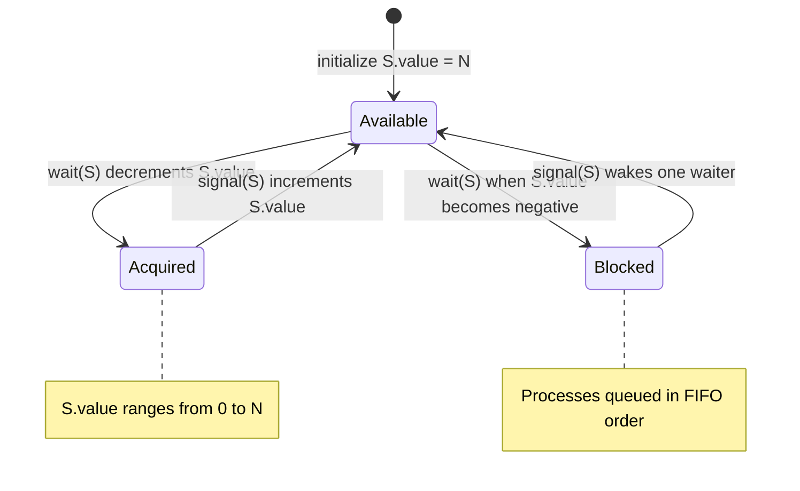
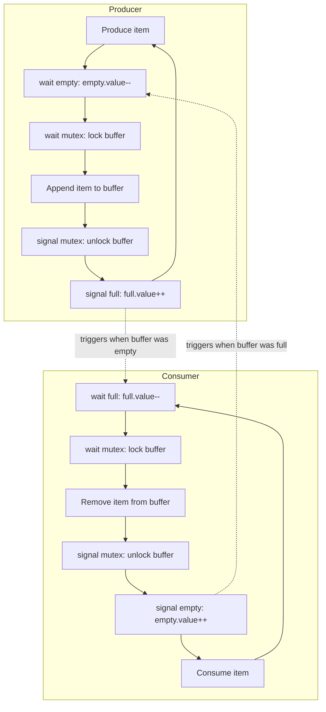
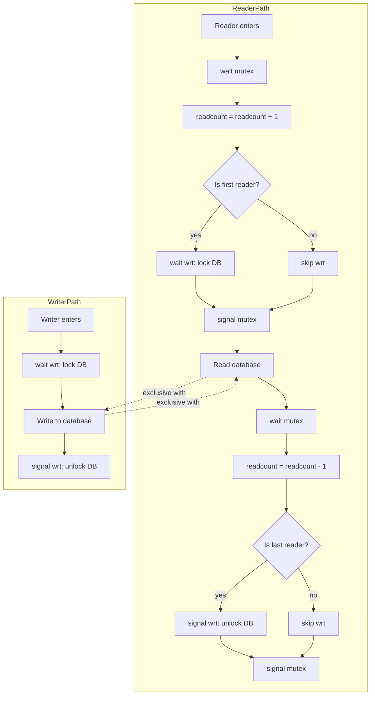
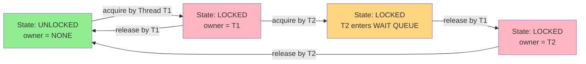

# Synchronization Tools: Semaphores (Binary and Counting), Mutex locks, Classical synchronization problems (Producer-Consumer, Readers-Writers)

<!-- SECTION_1_START -->
# Synchronization Tools: Semaphores, Mutex Locks & Classical Problems

## 1.1 The Critical Need for Synchronization

In a multiprogramming operating system, multiple processes execute **concurrently** and may attempt to access **shared resources** simultaneously. Without proper coordination, this leads to **race conditions**, where the final outcome of execution depends on the unpredictable order in which interleaved processes access shared variables.

> [!IMPORTANT]
> **KTU Syllabus Definition (2024 Scheme - PCCST403 Module 2):**
> *Process synchronization is the mechanism that ensures cooperating processes access shared resources in a well-defined, race-condition-free order, preserving data consistency and satisfying the Critical Section Problem constraints of Mutual Exclusion, Progress, and Bounded Waiting.*

### 1.2 Intuitive Analogy — The Single-Stall Restroom

Imagine a public restroom with **only one stall** (the shared resource), but **many people waiting in line** (the concurrent processes). The problem is:

- Without synchronization → 10 people rush in at once → chaos and collisions (race condition).
- With a **key holder** (semaphore) → only one person takes the key, enters, and returns it when leaving → order is maintained (mutual exclusion).

The **key** represents the semaphore's integer counter. When the counter = 1, the resource is free; when the counter = 0, processes must wait.

> [!NOTE]
> **Core Insight:** A semaphore is essentially an *integer variable* accessed *only* through two indivisible (atomic) operations traditionally called **wait()** and **signal()** (also known as **P()** and **V()**, from the Dutch *Proberen* "to test" and *Verhogen* "to increment").

## 1.3 Classification of Synchronization Primitives

| Primitive Type | Value Range | Use Case |
| :--- | :--- | :--- |
| **Binary Semaphore** | 0 or 1 | Implements strict mutual exclusion (similar to a mutex) |
| **Counting Semaphore** | $0 \rightarrow \infty$ | Controls access to a finite pool of identical resources |
| **Mutex Lock** | Locked / Unlocked | Lightweight mutual exclusion, often with ownership semantics |
| **Spinlock** | Boolean | Busy-wait lock used in kernel space / short critical sections |

## 1.4 The Critical Section Problem (Foundation Recap)

Each process $P_i$ executing in a concurrent system contains a critical section where shared data is accessed. The four required solution properties are:

1. **Mutual Exclusion** — No two processes are inside the CS at the same instant.
2. **Progress** — If no process is in the CS and some process *wishes* to enter, only those not in their remainder section can participate in deciding who enters next.
3. **Bounded Waiting** — There exists a bound on the number of times other processes can enter the CS after a process has requested entry and before that request is granted.
4. **No assumption about relative speeds** — The solution must work for any CPU scheduling order.

> [!VISUALIZATION CONTROL]
> **Concept:** Concurrent process access timeline to a shared resource
> **GeoGebra / Desmos Input Equations:**
> * Discrete points: $(t_1, P_1)$, $(t_2, P_2)$, $(t_3, P_3)$ on a time-axis
> * Shaded region $R$: $t_1 \leq x \leq t_2$ representing $P_1$'s critical section
> **Visual Description:** A horizontal timeline where overlapping shaded bands at two time-intervals reveal a race condition, while non-overlapping bands (gated by the semaphore) reveal a safe serialized access.

## 1.5 Producer–Consumer & Readers–Writers — Problem Statements

### Producer–Consumer (Bounded Buffer)
- The **Producer** process generates data items and inserts them into a fixed-size buffer.
- The **Consumer** process removes and processes those items.
- They must be **synchronized** so that:
  * The producer does not insert into a **full** buffer.
  * The consumer does not remove from an **empty** buffer.

### Readers–Writers Problem
- A shared database can be accessed by multiple concurrent processes.
- **Readers** only *read* the data — multiple readers can access concurrently.
- **Writers** *modify* the data — a writer requires **exclusive** access.
- The challenge: maximize concurrency for readers while ensuring writers get safe, exclusive entry.

> [!NOTE]
> **KTU Highlight:** Both the Producer–Consumer and Readers–Writers problems are *classical* and historically important because they are the canonical benchmarks used to evaluate any new synchronization primitive. Expect them as a 14-mark question in the End Semester Exam.
<!-- SECTION_1_END -->

<!-- SECTION_2_START -->
# Deep Theoretical Analysis & KTU High-Yield Formula Sheet

## 2.1 Semaphore: Formal Definition

A **semaphore** $S$ is a protected integer variable that can be accessed and modified **only** via two indivisible (atomic) kernel-managed system calls. It is initialized to a non-negative integer representing the number of available resources.

### 2.1.1 The Two Indivisible Operations

**wait(S)**  *(also called P(S) or down(S))*

$$
\begin{aligned}
S.value &\leftarrow S.value - 1 \\
\text{if } S.value < 0 \text{ then} \\
&\quad \text{block the calling process} \\
&\quad \text{and place it on } S.waiting\_queue
\end{aligned}
$$

**signal(S)**  *(also called V(S) or up(S))*

$$
\begin{aligned}
S.value &\leftarrow S.value + 1 \\
\text{if } S.value \leq 0 \text{ then} \\
&\quad \text{wake up one process } P_j \text{ from } S.waiting\_queue \\
&\quad \text{and place it in the ready queue}
\end{aligned}
$$

> [!IMPORTANT]
> **Why are they atomic?** Both decrement and the conditional test/branch happen as a single, uninterruptible hardware operation (e.g., using `test-and-set`, `compare-and-swap`, or disabling interrupts in the kernel). This is what prevents the race condition from migrating into the semaphore itself.

## 2.2 Binary Semaphore (Mutex-Style)

A binary semaphore is restricted to values in the set $\{0, 1\}$. Initialization is typically $S = 1$, indicating the single resource is free. It enforces strict mutual exclusion:

$$
\begin{aligned}
\text{Process } P_i \text{ :} \\
\text{wait}(S); \quad \quad \quad \quad &\text{// Entry section} \\
\text{Critical Section}; \quad &\text{// Access shared resource} \\
\text{signal}(S); \quad \quad \quad &\text{// Exit section}
\end{aligned}
$$

> [!NOTE]
> **Binary vs. Mutex Distinction (Frequently asked in KTU!):** A binary semaphore is **signaling-based** and has **no ownership** — *any* process can `signal()` a binary semaphore, even one that did not perform the `wait()`. A **mutex lock** enforces *ownership*: only the process that successfully locked it is allowed to unlock it. This makes mutexes safer for protecting shared resources from accidental release.

## 2.3 Counting Semaphore (Resource Pool)

A counting semaphore is initialized to $N$, where $N$ is the total number of identical resource instances. It is used when $N > 1$ resources are available. The wait operation succeeds if the value is $\geq 1$ and decrements it; otherwise, the process blocks.

$$
\begin{aligned}
S.value \in \{0, 1, 2, \ldots, N\} \quad &\text{where } N \text{ is the total resource count} \\
\text{Total pending requests} &= \vert S.value \vert \text{ when } S.value < 0
\end{aligned}
$$

## 2.4 KTU Formula Cheat Sheet

| Construct | State Variable | Atomic Operations | Block Condition | Wake-up Condition |
| :--- | :--- | :--- | :--- | :--- |
| **Binary Semaphore** | $S \in \{0, 1\}$ | `wait(S)`, `signal(S)` | $S = 0$ on entry | Another process signals |
| **Counting Semaphore** | $S \in [0, N]$ | `wait(S)`, `signal(S)` | $S \leq 0$ after decrement | $S \leq 0$ after increment |
| **Mutex Lock** | $S \in \{0, 1\}$ with owner | `acquire()`, `release()` | Held by another thread | Released by owner only |
| **Spinlock** | $S \in \{0, 1\}$ | `test-and-set` busy loop | Held by another CPU | Loops until free |

| Problem | Semaphores Required | Roles of Each Semaphore |
| :--- | :--- | :--- |
| **Producer–Consumer (Bounded Buffer)** | 3 | `empty` (count of free slots), `full` (count of filled slots), `mutex` (mutual exclusion for buffer access) |
| **Readers–Writers (1st Solution)** | 2 | `mutex` (protect `readcount`), `wrt` (mutual exclusion for writers) |
| **Readers–Writers (2nd Solution)** | 3 | `mutex`, `wrt`, `turnstile` (optional, prevents writer starvation) |

## 2.5 Why Mutex Locks Are Required Over Bare Semaphores

> [!IMPORTANT]
> **Priority Inversion & Ownership:** Plain semaphores (especially binary ones) cannot protect against *unintentional* signaling. If process $P_1$ performs `wait(S)` and then $P_2$ (which never called `wait(S)`) calls `signal(S)`, the resource is mistakenly freed. A **mutex** tracks ownership and prevents this class of error by raising `EPERM` when a non-owner tries to release. This is why POSIX threads (`pthread_mutex_lock`) use mutexes, not bare semaphores, for shared data protection.

## 2.6 Real-World Engineering Utility

- **Database engines** (e.g., MySQL InnoDB) use counting semaphores to throttle concurrent connections to the row-level lock pool.
- **Linux kernel** uses `spinlock_t` (short critical sections) and `struct mutex` (sleeping locks) — both with explicit ownership tracking.
- **Java Concurrency** exposes `Semaphore` (`java.util.concurrent.Semaphore`) — exact analog of the textbook construct — used in thread-pool throttling (e.g., `ExecutorService` with bounded queues).
- **Embedded RTOS systems** (FreeRTOS, VxWorks) use binary semaphores for task synchronization between ISRs and worker tasks.

## 2.7 Deadlock & Starvation Considerations

- **Deadlock** occurs with semaphores when two or more processes each hold one resource and wait indefinitely for the other (e.g., missing order of `wait()` calls). Always acquire semaphores in the **same global order** across all processes.
- **Starvation** (indefinite postponement) can occur if processes are removed from the waiting queue in non-FIFO order. A **fair** semaphore implementation uses a **FIFO queue** to guarantee bounded waiting — this is the property required by the Critical Section Problem.
<!-- SECTION_2_END -->

<!-- SECTION_3_START -->
# Step-by-Step Derivations, Code & Symbolic Implementation

## 3.1 The Producer–Consumer Problem (Bounded Buffer) — Full Code

### 3.1.1 Shared Data and Semaphores

$$
\begin{aligned}
\text{Buffer size: } & N \text{ (e.g., } N = 5\text{)} \\
\text{Semaphore } empty: & \text{initialized to } N \text{ (free slots)} \\
\text{Semaphore } full:  & \text{initialized to } 0 \text{ (filled slots)} \\
\text{Semaphore } mutex: & \text{initialized to } 1 \text{ (CS access)}
\end{aligned}
$$

### 3.1.2 Complete Python Implementation

```python
import threading
import time
import random
from collections import deque

BUFFER_SIZE   = 5
buffer        = deque(maxlen=BUFFER_SIZE)

# Three semaphores solving the bounded-buffer problem
empty  = threading.Semaphore(BUFFER_SIZE)   # counts free slots
full   = threading.Semaphore(0)             # counts filled slots
mutex  = threading.Semaphore(1)             # protects buffer access

def producer(producer_id: int, total_items: int = 10) -> None:
    for i in range(total_items):
        item = f"P{producer_id}-Item{i}"
        empty.acquire()                       # wait for a free slot
        mutex.acquire()                       # enter critical section
        buffer.append(item)                   # critical section work
        print(f"Producer {producer_id} produced {item} | Buffer={list(buffer)}")
        mutex.release()                       # exit critical section
        full.release()                        # signal: one more filled slot
        time.sleep(random.uniform(0.05, 0.20))

def consumer(consumer_id: int, total_items: int = 10) -> None:
    for i in range(total_items):
        full.acquire()                        # wait for a filled slot
        mutex.acquire()                       # enter critical section
        item = buffer.popleft()               # critical section work
        print(f"Consumer {consumer_id} consumed {item} | Buffer={list(buffer)}")
        mutex.release()                       # exit critical section
        empty.release()                       # signal: one more free slot
        time.sleep(random.uniform(0.05, 0.20))

# Driver code
if __name__ == "__main__":
    producers = [threading.Thread(target=producer, args=(p,)) for p in range(2)]
    consumers = [threading.Thread(target=consumer, args=(c,)) for c in range(2)]
    for t in producers + consumers:
        t.start()
    for t in producers + consumers:
        t.join()
    print("All items produced and consumed successfully.")
```

### 3.1.3 Step-by-Step Logic Walkthrough

1. **Producer executes `empty.acquire()`** — decrements `empty.value` from $N$ to $N-1$. If $N-1 < 0$, the producer blocks because the buffer is full. This is the **overflow guard**.
2. **Producer executes `mutex.acquire()`** — locks the buffer to prevent concurrent modification by another producer.
3. **Producer appends an item** — the actual critical section action.
4. **Producer executes `mutex.release()`** — releases exclusive access.
5. **Producer executes `full.release()`** — increments `full.value`, waking the consumer if one was waiting on an empty buffer. This is the **underflow guard for the consumer side**.

The consumer mirrors the logic in reverse order, ensuring both deadlock-free operation and bounded buffer occupancy.

> [!NOTE]
> **Why is the order of `wait()` calls critical?** If a producer acquires `mutex` *before* `empty`, two producers can both grab `mutex`, and one will block while holding the lock — **deadlock** with itself. Always acquire the *counting* semaphore first, then the *mutex*.

## 3.2 The Readers–Writers Problem — Full Code

### 3.2.1 Shared State

$$
\begin{aligned}
\text{Shared database: } & DB \text{ (e.g., a list or dict)} \\
\text{readcount: } & \text{number of current readers} \\
\text{Semaphore } mutex: & \text{initialized to } 1 \text{ (protects readcount)} \\
\text{Semaphore } wrt:   & \text{initialized to } 1 \text{ (writer exclusion)}
\end{aligned}
$$

### 3.2.2 Complete Python Implementation (First Readers–Writers Solution — Reader Priority)

```python
import threading
import time
import random

database    = {"balance": 1000}
readcount   = 0

mutex = threading.Semaphore(1)   # protects readcount
wrt   = threading.Semaphore(1)   # writer exclusion (and first-reader lock)

def reader(reader_id: int, iterations: int = 5) -> None:
    global readcount
    for _ in range(iterations):
        mutex.acquire()                    # protect readcount
        readcount += 1
        if readcount == 1:                 # first reader locks the database
            wrt.acquire()
        mutex.release()

        # ----- Critical Section (reading) -----
        balance = database["balance"]
        print(f"Reader {reader_id} read balance = {balance} | readers active = {readcount}")
        # --------------------------------------

        mutex.acquire()                    # protect readcount
        readcount -= 1
        if readcount == 0:                 # last reader unlocks the database
            wrt.release()
        mutex.release()
        time.sleep(random.uniform(0.05, 0.15))

def writer(writer_id: int, iterations: int = 5) -> None:
    for i in range(iterations):
        wrt.acquire()                      # exclusive database access
        database["balance"] += 100         # modify shared data
        new_balance = database["balance"]
        print(f"Writer {writer_id} wrote new balance = {new_balance}")
        wrt.release()
        time.sleep(random.uniform(0.10, 0.20))

if __name__ == "__main__":
    threads = []
    for i in range(3):
        threads.append(threading.Thread(target=reader,  args=(i,)))
    for i in range(2):
        threads.append(threading.Thread(target=writer, args=(i,)))
    for t in threads:
        t.start()
    for t in threads:
        t.join()
    print("Final database state:", database)
```

### 3.2.3 Logic Walkthrough (Why `readcount` is needed)

- **The first reader** to arrive acquires `wrt`, blocking all writers.
- **Subsequent readers** only increment `readcount` and skip `wrt.acquire()`, allowing them to read concurrently.
- **The last reader to leave** releases `wrt`, allowing one waiting writer to enter.
- The `mutex` semaphore protects the shared counter `readcount` from being corrupted by concurrent increment/decrement.

> [!IMPORTANT]
> **Starvation Note (KTU Favourite!):** The first solution above gives *readers priority*. A writer may starve if readers keep arriving. The **second solution** introduces a `turnstile` semaphore to give writers priority, and the **third solution** uses a fair FIFO semaphore so neither side starves. KTU often asks for a *comparative* discussion of all three.

## 3.3 Mutex Lock Implementation in C (POSIX)

```c
#include <pthread.h>
#include <stdio.h>

int shared_counter = 0;
pthread_mutex_t counter_lock = PTHREAD_MUTEX_INITIALIZER;

void* increment(void* arg) {
    for (int i = 0; i < 100000; i++) {
        pthread_mutex_lock(&counter_lock);     // acquire ownership
        shared_counter = shared_counter + 1;   // critical section
        pthread_mutex_unlock(&counter_lock);   // release ownership (must be owner)
    }
    return NULL;
}

int main(void) {
    pthread_t t1, t2;
    pthread_create(&t1, NULL, increment, NULL);
    pthread_create(&t2, NULL, increment, NULL);
    pthread_join(t1, NULL);
    pthread_join(t2, NULL);
    printf("Final counter = %d\n", shared_counter);   // must equal 200000
    return 0;
}
```

### 3.3.1 Mutex Implementation Algorithm

$$
\begin{aligned}
\text{acquire}(m): \quad & \text{spin using } \text{test-and-set on } m \text{ until } m = \text{UNLOCKED} \\
& \text{then atomically set } m \leftarrow \text{LOCKED} \\
& \text{record } m.\text{owner} \leftarrow \text{current thread} \\
\text{release}(m): \quad & \text{if } m.\text{owner} \neq \text{current thread then } \text{return } EPERM \\
& \text{set } m \leftarrow \text{UNLOCKED}
\end{aligned}
$$

## 3.4 Comparative Pseudocode Table

| Step | Counting Semaphore (Bounded Buffer) | Binary Semaphore (Mutual Exclusion) | Mutex Lock (POSIX) |
| :--- | :--- | :--- | :--- |
| Init | $S_1 = N, \ S_2 = 0, \ S_3 = 1$ | $S = 1$ | `pthread_mutex_init(&m, NULL)` |
| Entry | `wait(empty); wait(mutex);` | `wait(S);` | `pthread_mutex_lock(&m);` |
| Work | modify buffer | critical section work | critical section work |
| Exit | `signal(mutex); signal(full);` | `signal(S);` | `pthread_mutex_unlock(&m);` |
| Destroy | n/a | n/a | `pthread_mutex_destroy(&m);` |
<!-- SECTION_3_END -->

<!-- SECTION_4_START -->
# Structural Diagrams & Schematics

## 4.1 Semaphore State Machine



## 4.2 Producer–Consumer Synchronization Flow



## 4.3 Readers–Writers Process Architecture



## 4.4 Sequential Processing Topology — Mutex Lock Lifecycle



## 4.5 Block-Level Functional Architecture — Three Solutions to Readers–Writers

```mermaid
flowchart TD
    subgraph Solution1["Solution 1: Reader Priority"]
        S1A[Mutex protects readcount] --> S1B[First reader grabs wrt]
        S1B --> S1C[Writer may starve]
    end

    subgraph Solution2["Solution 2: Writer Priority"]
        S2A[Reader enters turnstile] --> S2B[Last reader locks turnstile]
        S2B --> S2C[Writer preempts arriving readers]
        S2C --> S2D[Reader may starve]
    end

    subgraph Solution3["Solution 3: Fair (FIFO)"]
        S3A[All arrivals enter FIFO queue] --> S3B[Service order = arrival order]
        S3B --> S3C[No starvation, but lower throughput]
    end
```


<!-- SECTION_4_END -->

<!-- SECTION_5_START -->
# KTU 2024 Scheme Examination Question Bank & Topic Recap

## Part A — Short Answer Questions (2 × 3 = 6 Marks)

### Question 1
**[KTU University Exam — July 2024, CO1, Remember]**
Differentiate between a binary semaphore and a counting semaphore. Provide one example use case for each.

**Model Answer (3 marks):**

| Aspect | Binary Semaphore | Counting Semaphore |
| :--- | :--- | :--- |
| **Value range** | $S \in \{0, 1\}$ | $S \in [0, N]$ where $N > 1$ |
| **Resource count** | Single shared resource | Pool of $N$ identical resources |
| **Typical use** | Mutual exclusion of a critical section | Managing $N$ slots, $N$ connections, etc. |
| **Example** | Protecting a single shared file descriptor | Limiting a thread pool to $N$ concurrent connections |

*Valuation Key:*
- *[Binary vs counting range: 1 Mark]*
- *[Example of binary: 1 Mark]*
- *[Example of counting: 1 Mark]*

### Question 2
**[KTU University Exam — Dec 2023, CO1, Understand]**
What is a mutex lock? Why is it considered safer than a binary semaphore for protecting shared data?

**Model Answer (3 marks):**
A **mutex lock** is a synchronization primitive that enforces *mutual exclusion* with the additional property of **ownership** — only the thread that successfully acquires the lock is permitted to release it. It is safer than a binary semaphore because:

1. **Ownership tracking:** A binary semaphore can be signaled by any process, even one that did not perform the `wait()`. A mutex will return an error (e.g., `EPERM` in POSIX) if a non-owner attempts to release it.
2. **Pthread priority inversion safeguards:** Mutexes can be configured with priority inheritance protocols that binary semaphores lack.
3. **Recursion safety:** Certain mutex types (e.g., `PTHREAD_MUTEX_RECURSIVE`) can be re-acquired safely by the owner thread.

*Valuation Key:*
- *[Definition of mutex with ownership: 1 Mark]*
- *[First safety reason: 1 Mark]*
- *[Second safety reason: 1 Mark]*

---

## Part B — Long Answer Questions (Choice-based, 14 Marks each)

### Question A (14 Marks)

> **[KTU University Exam — Dec 2024, CO2, Apply + Analyze]**
> *Implement the Producer–Consumer (Bounded Buffer) problem using semaphores. Explain the role of each semaphore and prove that the solution is free from race conditions and deadlocks.*

#### Part (a) — 7 Marks [Understand]

**Describe the bounded-buffer problem, define the three semaphores (`empty`, `full`, `mutex`), and write the algorithms for both processes.**

**Model Solution:**

The bounded-buffer problem has a shared buffer of size $N$. The producer must not insert when the buffer is full, and the consumer must not remove when the buffer is empty. The three semaphores used are:

$$
\begin{aligned}
\text{Semaphore } empty: & \quad \text{initialized to } N \quad &\text{(counts free slots)} \\
\text{Semaphore } full:  & \quad \text{initialized to } 0 \quad &\text{(counts filled slots)} \\
\text{Semaphore } mutex: & \quad \text{initialized to } 1 \quad &\text{(binary, for CS access)}
\end{aligned}
$$

**Producer Process:**

$$
\begin{aligned}
&\text{while (true)} \{ \\
&\quad \text{produce an item } i \text{ in nextProduced}; \\
&\quad \text{wait}(empty); \quad &\text{/* decrement free slot count */} \\
&\quad \text{wait}(mutex); \quad &\text{/* enter critical section */} \\
&\quad \text{buffer}[in] \leftarrow i; \\
&\quad in \leftarrow (in + 1) \bmod N; \\
&\quad \text{signal}(mutex); \quad &\text{/* exit critical section */} \\
&\quad \text{signal}(full); \quad &\text{/* increment filled slot count */} \\
&\}
\end{aligned}
$$

**Consumer Process:**

$$
\begin{aligned}
&\text{while (true)} \{ \\
&\quad \text{wait}(full); \quad &\text{/* wait for at least one filled slot */} \\
&\quad \text{wait}(mutex); \quad &\text{/* enter critical section */} \\
&\quad \text{item} \leftarrow \text{buffer}[out]; \\
&\quad out \leftarrow (out + 1) \bmod N; \\
&\quad \text{signal}(mutex); \quad &\text{/* exit critical section */} \\
&\quad \text{signal}(empty); \quad &\text{/* increment free slot count */} \\
&\quad \text{consume the item}; \\
&\}
\end{aligned}
$$

*Valuation Key:*
- *[Correctly naming 3 semaphores with initial values: 2 Marks]*
- *[Producer algorithm with 3 statements: 2 Marks]*
- *[Consumer algorithm with 3 statements: 2 Marks]*
- *[Logical order explanation: 1 Mark]*

#### Part (b) — 7 Marks [Apply + Analyze]

**Demonstrate the correctness of the solution by analyzing the state transitions of the three semaphores. Show that mutual exclusion holds and that deadlock is impossible.**

**Model Solution:**

Let the buffer size be $N = 5$. Consider the state vector $\langle empty, full, mutex \rangle$.

- **Initial state:** $\langle 5, 0, 1 \rangle$
- **After 1 item produced (no consumer running):** $\langle 4, 1, 1 \rangle$
- **After 2 items produced:** $\langle 3, 2, 1 \rangle$
- **...**
- **After 5 items produced (buffer full):** $\langle 0, 5, 1 \rangle$
- **6th `wait(empty)` by producer** would make $empty = -1 \Rightarrow$ producer **blocks**. Buffer remains intact.

**Mutual Exclusion Proof:** Only one process can hold `mutex = 0` at a time because the decrement and conditional block are atomic (kernel-protected). Therefore, the buffer pointer modifications `in` and `out` are mutually exclusive across producers and consumers. ✓

**Deadlock-Freeness Proof:**

- The producer blocks only on `empty`. The consumer blocks only on `full`. Since each process eventually signals the *other's* blocking condition, **at least one process can always make progress**.
- The producer acquires `empty` *before* `mutex` — therefore it cannot hold `mutex` while waiting for `empty`. This eliminates self-deadlock.
- All acquires follow the strict global order: *counting semaphore first, then mutex*. No circular wait is possible. ✓

**Bounded-Buffer Invariant:** At all times, $empty + full = N$ (the sum of free and occupied slots equals the buffer size). This invariant is preserved by every `wait`/`signal` pair.

*Valuation Key:*
- *[State vector analysis table: 2 Marks]*
- *[Mutual exclusion justification: 2 Marks]*
- *[Deadlock-freeness proof (no circular wait): 2 Marks]*
- *[Bounded-buffer invariant: 1 Mark]*

---

### Question B (14 Marks)

> **[KTU University Exam — July 2023, CO2, Apply + Analyze]**
> *Describe the Readers–Writers problem. Write the semaphore-based solution where readers have priority, and discuss the issue of writer starvation.*

#### Part (a) — 7 Marks [Understand + Apply]

**State the Readers–Writers problem, define the shared data structure and semaphores, and write the complete solution.**

**Model Solution:**

The Readers–Writers problem models access to a shared database. Multiple **readers** may access the database simultaneously because reading does not modify data, but a **writer** requires exclusive access.

**Shared Data:**

$$
\begin{aligned}
\text{readcount: } & \text{integer initialized to } 0 \\
\text{Semaphore } mutex: & \text{initialized to } 1 \text{ (protects readcount)} \\
\text{Semaphore } wrt:   & \text{initialized to } 1 \text{ (writer exclusion)}
\end{aligned}
$$

**Reader Process:**

$$
\begin{aligned}
&\text{while (true)} \{ \\
&\quad \text{wait}(mutex); \quad &\text{/* protect readcount */} \\
&\quad \text{readcount} \leftarrow \text{readcount} + 1; \\
&\quad \text{if } (readcount = 1) \text{ then } \text{wait}(wrt); \\
&\quad \text{signal}(mutex); \\
&\quad \\
&\quad \text{/* --- reading is performed here --- */} \\
&\quad \text{read\_database}(); \\
&\quad \\
&\quad \text{wait}(mutex); \\
&\quad \text{readcount} \leftarrow \text{readcount} - 1; \\
&\quad \text{if } (readcount = 0) \text{ then } \text{signal}(wrt); \\
&\quad \text{signal}(mutex); \\
&\}
\end{aligned}
$$

**Writer Process:**

$$
\begin{aligned}
&\text{while (true)} \{ \\
&\quad \text{wait}(wrt); \quad &\text{/* exclusive database access */} \\
&\quad \text{write\_database}(); \\
&\quad \text{signal}(wrt); \\
&\}
\end{aligned}
$$

*Valuation Key:*
- *[Problem statement with reader concurrency: 1 Mark]*
- *[Two semaphores defined: 1 Mark]*
- *[Reader algorithm: 3 Marks]*
- *[Writer algorithm: 2 Marks]*

#### Part (b) — 7 Marks [Analyze]

**Discuss writer starvation. How does the second readers–writers solution (writer priority) overcome this?**

**Model Solution:**

In **Solution 1 (Reader Priority)**, when a writer is waiting on `wrt` and a new reader arrives, the reader can acquire `mutex`, increment `readcount`, and — if it is the *first* reader — re-acquire `wrt` (but blocks since the writer holds it). However, subsequent readers *do not* require `wrt`; they just increment `readcount`. Hence a continuous stream of readers will keep `readcount > 0`, and the writer is **never** granted access. This is **writer starvation**.

**Solution 2 (Writer Priority) — Modified Approach:**

Introduce a third semaphore `turnstile` (initialized to 1) to control reader entry:

$$
\begin{aligned}
&\text{Reader enters:} \\
&\quad \text{wait}(turnstile); \quad \text{signal}(turnstile); \\
&\quad \text{wait}(mutex); \quad \text{readcount}++; \\
&\quad \text{if (readcount == 1) wait}(wrt); \\
&\quad \text{signal}(mutex); \\
&\text{Reader exits:} \\
&\quad \text{wait}(mutex); \quad \text{readcount}--; \\
&\quad \text{if (readcount == 0) signal}(wrt); \\
&\quad \text{signal}(mutex);
\end{aligned}
$$

$$
\begin{aligned}
&\text{Writer enters:} \\
&\quad \text{wait}(turnstile); \quad \text{wait}(wrt); \\
&\text{Writer exits:} \\
&\quad \text{signal}(wrt); \quad \text{signal}(turnstile);
\end{aligned}
$$

**How starvation is prevented:** When a writer is waiting, the `turnstile` is *closed* (i.e., the writer holds it). New readers must first `wait(turnstile)`, which blocks them. The current readers finish, the last reader releases `wrt`, the writer enters, performs its write, and releases both `wrt` and `turnstile`, letting readers resume. **Writers preempt arriving readers.** However, this solution can cause **reader starvation** if writers keep arriving.

**Solution 3 (Fair / FIFO):** Both readers and writers are queued in a single FIFO order, ensuring neither side starves but reducing concurrency.

*Valuation Key:*
- *[Explanation of starvation in Solution 1: 2 Marks]*
- *[Introduction of `turnstile` semaphore: 1 Mark]*
- *[Modified reader algorithm: 2 Marks]*
- *[Modified writer algorithm + correctness: 2 Marks]*

---

## ⚠ KTU Examiner's Valuation Warning / Pitfall Callout

> [!WARNING]
> **Common Mistakes That Cost Marks:**
> 1. **Reversed `wait` order in Producer–Consumer:** Students often write `wait(mutex); wait(empty);`. This causes **self-deadlock** with multiple producers. Always: *counting semaphore → mutex*. (Loses 1–2 marks.)
> 2. **Forgetting to reset `readcount` in the Readers–Writers solution:** The variable `readcount` must be initialized to **0**, and every increment must be matched by a decrement. Missing either loses 1 mark.
> 3. **Writing `signal(mutex)` after `signal(full)` in the producer:** This is *functionally* correct, but students frequently swap the order. The conventional order is `signal(mutex)` first, then `signal(full)`. Examiners may not deduct if logically valid, but a cleaner pattern avoids confusion.
> 4. **Failing to mention atomicity of `wait`/`signal`:** The *atomicity* of the semaphore operations is the very reason race conditions are prevented. If you do not state that `wait`/`signal` are indivisible, expect to lose 1 mark.
> 5. **Confusing binary semaphore with mutex:** Examiners frequently ask *"Why is a mutex preferred for thread-safe shared data?"* Failing to mention **ownership** loses full credit on that sub-part.

---

## 📌 Topic Recap & Important Things to Remember

- A **semaphore** $S$ is a non-negative integer accessed only via atomic `wait(S)` (decrement) and `signal(S)` (increment) operations.
- **Binary semaphore** ($\in \{0, 1\}$) is used for single-resource mutual exclusion; **counting semaphore** ($\in [0, N]$) is used for $N$ identical resources.
- **Mutex lock** = binary semaphore **+ ownership** + priority inheritance support; preferred for thread-shared data.
- **Critical Section properties** that synchronization primitives must satisfy: **Mutual Exclusion, Progress, Bounded Waiting**.
- **Producer–Consumer** uses **3 semaphores**: `empty` (free slots = $N$), `full` (filled slots = 0), `mutex` (CS access = 1). Acquire order: `empty` *then* `mutex`; release order: `mutex` *then* `full`.
- **Readers–Writers** uses **2 semaphores** (`mutex` for readcount, `wrt` for writer exclusion) and a shared counter `readcount`. The first reader locks `wrt`; the last reader releases it.
- **Writer starvation** in Solution 1 is fixed by Solution 2's `turnstile` semaphore; **reader starvation** in Solution 2 is fixed by Solution 3's FIFO queue.
- **Deadlock** in semaphore solutions arises from **circular wait**; prevent it by acquiring semaphores in a **consistent global order**.
- **Atomicity** of `wait`/`signal` is guaranteed by the kernel (often using `test-and-set`, `compare-and-swap`, or interrupt disable).
- **FIFO implementation** of the waiting queue is what gives semaphores the **bounded waiting** property — required by the Critical Section Problem.
- **Real-world use:** Java's `java.util.concurrent.Semaphore`, POSIX `sem_init`/`sem_wait`/`sem_post`, Linux kernel `down()`/`up()`, FreeRTOS `xSemaphoreTake`/`xSemaphoreGive`.
- **KTU-typical questions:** "Differentiate binary vs counting" (3 marks), "Implement Producer–Consumer with semaphores" (14 marks), "Explain Readers–Writers and starvation" (14 marks), "Why use mutex over binary semaphore" (7 marks).
<!-- SECTION_5_END -->
