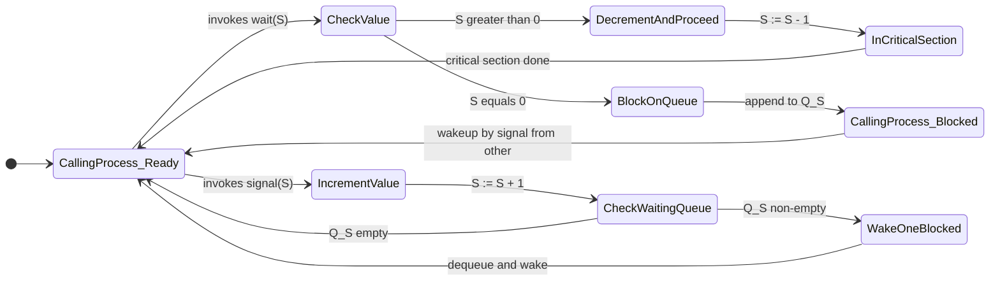
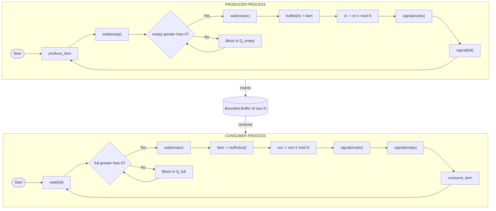
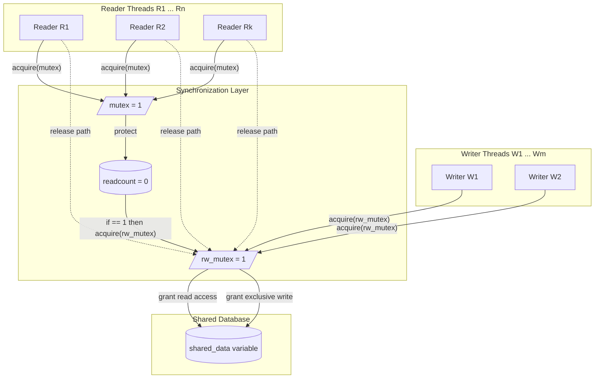
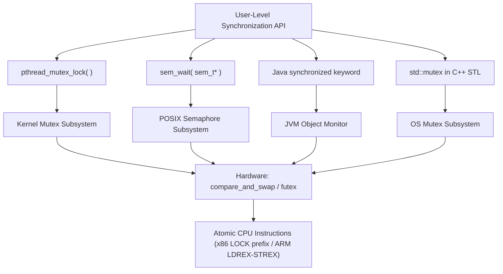

# Synchronization Tools: Semaphores (Binary and Counting), Mutex locks, Classical synchronization problems (Producer-Consumer, Readers-Writers)

<!-- SECTION_1_START -->

# 1. Core Technical Definition & Intuitive Overview

## 1.1 Semaphores — Formal KTU Definition

> [!IMPORTANT]
> **Semaphore (KTU 2024 Syllabus Definition):** A *semaphore* $S$ is a non-negative integer synchronization variable accessed **only** through two standard, atomic (indivisible) kernel-supported operations traditionally called **wait** (also known as $P$, $proberen$ "to test", or `down`) and **signal** (also known as $V$, $verhogen$ "to increment", or `up`).

The integer value of $S$ represents the number of available shared resources or permits. Kernel-level implementations guarantee that the *test-and-modify* of $S$ happens as a single, uninterruptible hardware instruction sequence.

### 1.2 Two Canonical Variants of Semaphores

| Type | Value Range | Conceptual Role |
|---|---|---|
| **Binary Semaphore** | $S \in \{0, 1\}$ | Mutex-style exclusive access to a *single* resource. |
| **Counting Semaphore** | $S \in \{0, 1, 2, \ldots, n\}$ | Controls access to a pool of $n$ identical resources. |

> [!NOTE]
> A **binary semaphore** is **not identical** to a **mutex lock**. The KTU board distinguishes them: a mutex enforces *ownership* (only the locking thread may unlock), whereas a binary semaphore is *ownership-agnostic* (any process may `signal` it).

## 1.3 Mutex Lock — Formal Definition

> [!IMPORTANT]
> **Mutex (Mutual Exclusion Lock):** A mutex is a *thread-synchronization primitive* that grants exclusive ownership of a critical section to exactly one thread at a time. It provides two atomic operations: `acquire()` (or `lock()`) and `release()` (or `unlock()`), and supports the advanced Pthreads feature `pthread_mutex_trylock()` and priority-inheritance protocols to avoid priority inversion.

## 1.4 Intuitive Real-World Analogies

| Concept | Analogy | Intuition |
|---|---|---|
| **Binary Semaphore** | A single public toilet with a sliding bolt | Only **one** person at a time can lock and enter. |
| **Counting Semaphore** | A parking lot with $n$ numbered slots and a boom barrier counter | Counter shows *remaining slots*; decrements on entry, increments on exit. |
| **Mutex Lock** | A *key* hanging on a board outside a single server room | Thread must take the key (acquire), work, then return it (release). Key is *owned*. |
| **Producer–Consumer** | A factory assembly line with a fixed-size conveyor belt | Producer places items; consumer removes them; the belt's fixed length is the *bounded buffer*. |
| **Readers–Writers** | A public library with one librarian and many readers | Many can **read** a book at once, but a **writer** needs exclusive access. |

## 1.5 Atomicity — The Heartbeat of Synchronization

> [!WARNING]
> Without **hardware-supported atomicity** (e.g., `test_and_set`, `compare_and_swap`, or `fetch_add` with `acq_rel` memory ordering), semaphores are useless because the race condition simply *moves* from the critical section to the semaphore variable itself.

The two fundamental atomic semaphore operations are defined as:

$$
\text{wait}(S): \quad \text{while } S \le 0 \text{ do } \text{noop}; \quad S \leftarrow S - 1
$$

$$
\text{signal}(S): \quad S \leftarrow S + 1
$$

> [!NOTE]
> The busy-wait `while` loop is the *spinlock* implementation. To avoid CPU wastage, kernel semaphores *block* (suspend) the calling process on a wait queue, waking it up when another process executes `signal`.

## 1.6 Visualizing Semaphore Dynamics

> [!VISUALIZATION CONTROL]
> **Concept:** *Semaphore Value State Space Over Time* — how $S$ transitions as producers/consumers operate.
> **GeoGebra / Desmos Input Equations:**
> * `f_1(x) = max(0, 4 - x)`  *(Semaphore $S$ decreasing as producer executes `wait`)*
> * `f_2(x) = min(4, x)`      *(Semaphore $S$ recovering as consumer executes `signal`)*
> * `Point(t, S)` for $t = 0, 1, 2, \ldots, 10$
> **Visual Description:** Plot the integer value of $S$ on the y-axis against discrete time-steps on the x-axis. Observe the staircase descent (when producers run) and the staircase ascent (when consumers run), always bounded by $0 \le S \le 4$ — this is a *counting semaphore* with buffer capacity $4$.

<!-- SECTION_1_END -->

<!-- SECTION_2_START -->

# 2. Deep Theoretical Analysis & KTU High-Yield Formula Sheet

## 2.1 Operational Logic of Semaphores — Step by Step

A counting semaphore $S$ with initial value $n$ enforces the invariant that **at most $n$ processes** can simultaneously be in the region protected by $S$. The `wait` and `signal` operations manipulate $S$ and a kernel-maintained **waiting queue** $Q_S$.

### Step-wise Semantics of `wait(S)` (also called `P(S)` or `down(S)`)

1. The process issues a system call to access $S$.
2. The kernel disables interrupts (on a single-core system) or uses an atomic hardware instruction (on multi-core).
3. The kernel evaluates $S > 0$.
   * If **true**: $S \leftarrow S - 1$; the calling process is allowed to proceed into the critical section.
   * If **false**: the calling process is appended to the FIFO/blocking queue $Q_S$ and is context-switched out (its PCB state becomes `BLOCKED`).
4. When another process executes `signal(S)`, a process from $Q_S$ is awakened and transitioned to `READY`.

### Step-wise Semantics of `signal(S)` (also called `V(S)` or `up(S)`)

1. The process issues a system call to access $S$.
2. The kernel atomically increments $S \leftarrow S + 1$.
3. If $Q_S$ is non-empty, a blocked process (FIFO or priority-based) is dequeued and made `READY` to run.

## 2.2 Why Semaphores Solve the Critical Section Problem

> [!NOTE]
> Semaphores satisfy all three of the *required conditions* for a valid critical section solution (M. Liu's conditions as taught in KTU PCCST403):
>
> 1. **Mutual Exclusion** — at most one process in the critical section at a time.
> 2. **Progress** — if no process is in the critical section and some wish to enter, only those not in the remainder section can compete.
> 3. **Bounded Waiting** — a bound exists on the number of times other processes can enter the critical section after a process has requested entry and before it is granted.

## 2.3 Comparison Matrix: Mutex vs Binary Semaphore vs Counting Semaphore

| Property | Mutex Lock | Binary Semaphore | Counting Semaphore |
|---|---|---|---|
| **Value Range** | $\{0,1\}$ (locked/unlocked) | $\{0,1\}$ | $\{0,1,\ldots,n\}$ |
| **Ownership** | Yes (locker must unlock) | No (any thread may signal) | No |
| **Initial Value** | $1$ | $1$ | $n$ (resource count) |
| **Priority Inheritance** | Supported (Pthreads) | Not supported | Not supported |
| **Use Case** | Single shared resource | Signaling between threads | Resource pool of size $n$ |
| **Blocking Behaviour** | `BLOCKED` on contention | `BLOCKED` on contention | `BLOCKED` on contention |
| **POSIX Symbol** | `pthread_mutex_t` | `sem_t` (init to 1) | `sem_t` (init to $n$) |

> [!IMPORTANT]
> KTU examiners frequently ask: *"Differentiate between a mutex and a binary semaphore."* The decisive answer is **ownership** and **priority inheritance** support.

## 2.4 The "Why" Behind Classical Synchronization Problems

> [!NOTE]
> **Producer–Consumer (Bounded Buffer) Problem:** Models any pipeline where a *producer* generates data items and places them into a finite shared buffer, while a *consumer* removes and processes them. Concurrency bugs arise if the producer overwrites unread items (overflow) or the consumer reads unwritten items (underflow).

**Why two semaphores?**
* `empty` counts *available slots* in the buffer → ensures producer never overwrites.
* `full` counts *occupied slots* in the buffer → ensures consumer never reads garbage.
* `mutex` (binary semaphore) protects the buffer's index pointers (`in`, `out`) from a race condition during the actual insertion/removal.

> [!NOTE]
> **Readers–Writers Problem:** Models a shared database where multiple readers can safely read simultaneously (no data mutation), but a writer must have **exclusive** access to maintain consistency.

**Why a separate `readcount`?**
* `readcount` is a shared integer tracking the number of currently active readers.
* `rw_mutex` protects the *act of writing* (writers are mutually exclusive with everyone).
* `mutex` protects the `readcount` variable itself (otherwise two readers updating it concurrently will corrupt the count).

## 2.5 KTU High-Yield Formula & Properties Sheet

| # | Property / Formula | Description |
|---|---|---|
| 1 | $\text{wait}(S): S \leftarrow S - 1$ only if $S > 0$ | Atomic decrement |
| 2 | $\text{signal}(S): S \leftarrow S + 1$ | Atomic increment |
| 3 | $S_{\text{init}} = n$ for $n$ identical resources | Counting semaphore initialization |
| 4 | $S_{\text{init}} = 1$ for binary semaphore / mutex | Mutual exclusion |
| 5 | $S \in [0, n]$ always holds | Invariant: non-negative, bounded |
| 6 | Empty buffer: $\text{empty} = N$, $\text{full} = 0$ | Producer–Consumer initial state |
| 7 | Active writers: $\text{wrt} = 0 \lor 1$ (binary) | Readers–Writers invariant |
| 8 | If no reader, no writer: $\text{readcount} = 0$ | Readers–Writers idle state |
| 9 | $\text{turnaround}_{\text{blocked}} \le (n-1) \cdot T_{\text{CS}}$ | Bounded waiting guarantee |
| 10 | Throughput: $T = \dfrac{\min(P_{\text{rate}}, C_{\text{rate}})}{N_{\text{buffer}}}$ | Bounded buffer utilization |

> [!NOTE]
> The *Engineering Utility* of these primitives spans real systems: **POSIX `sem_init()`** in Linux, **Windows `CreateSemaphore()`**, **Java's `java.util.concurrent.Semaphore`**, **FreeRTOS binary/counting semaphores** in embedded RTOS firmware, and **VxWorks `semBCreate()`** in aerospace control systems.

<!-- SECTION_2_END -->

<!-- SECTION_3_START -->

# 3. Step-by-Step Derivations, Pseudocode & Python Implementations

## 3.1 Fundamental Pseudocode Primitives

### 3.1.1 Counting Semaphore — Kernel-Style Pseudocode

```text
STRUCTURE semaphore S
    value : INTEGER          // current count
    queue : LIST of PCB      // blocked processes
END STRUCTURE

PROCEDURE wait(S)             // also called P(S) or down(S)
    S.value := S.value - 1    // decrement
    IF S.value < 0 THEN
        append current_process to S.queue
        block(current_process)   // PCB state -> BLOCKED
    END IF
END PROCEDURE

PROCEDURE signal(S)           // also called V(S) or up(S)
    S.value := S.value + 1    // increment
    IF S.value <= 0 THEN
        P := dequeue(S.queue)
        wakeup(P)             // PCB state -> READY
    END IF
END PROCEDURE
```

> [!NOTE]
> **Verification of bounded waiting:** Suppose process $P_i$ is blocked in $Q_S$ and there are at most $n-1$ processes ahead of it. Each of those will execute `signal` exactly once (releasing the resource they were holding), and the queue is FIFO, so $P_i$ is guaranteed to be woken within at most $n-1$ signal operations. This proves the **bounded waiting** property.

### 3.1.2 Mutex Lock — Pseudocode with Atomic Hardware Primitive

```text
// Compare-And-Swap (CAS) is the atomic hardware instruction
BOOLEAN compare_and_swap(INT *addr, INT expected, INT new_value)
    ATOMIC:
        old := *addr
        IF old == expected THEN
            *addr := new_value
            RETURN TRUE
        ELSE
            RETURN FALSE
        END IF

PROCEDURE acquire(M)
    WHILE compare_and_swap(&M.locked, 0, 1) == FALSE DO
        // spin (busy wait) OR kernel-level park()
    END WHILE
END PROCEDURE

PROCEDURE release(M)
    M.locked := 0
END PROCEDURE
```

## 3.2 Classical Problem 1: The Producer–Consumer (Bounded Buffer)

### 3.2.1 Shared State and Initial Semaphore Values

Let $N$ be the buffer size. Three semaphores are required:

| Semaphore | Initial Value | Role |
|---|---|---|
| `mutex` | $1$ | Mutual exclusion on the shared buffer's `in`/`out` indices |
| `empty` | $N$ | Number of empty slots currently available |
| `full` | $0$ | Number of items available to consume |

> [!IMPORTANT]
> The order in which semaphores are decremented in `wait` and incremented in `signal` is **critical**. The KTU board will deduct marks if `wait(mutex)` is placed *before* `wait(empty)` and `wait(full)` — the correct order is `wait(empty)`/`wait(full)` **first** (to test buffer state), then `wait(mutex)` (to actually manipulate the buffer), thereby preventing **deadlock** when the buffer is full or empty.

### 3.2.2 Producer and Consumer Process Pseudocode

```text
PRODUCER:
    LOOP FOREVER
        produce_item(item)
        wait(empty)              // P(empty)   - decrement empty slots
        wait(mutex)              // P(mutex)   - enter critical section
        buffer[in] := item
        in := (in + 1) mod N
        signal(mutex)            // V(mutex)   - leave critical section
        signal(full)             // V(full)    - increment occupied slots
    END LOOP

CONSUMER:
    LOOP FOREVER
        wait(full)               // P(full)    - decrement occupied slots
        wait(mutex)              // P(mutex)
        item := buffer[out]
        out := (out + 1) mod N
        signal(mutex)            // V(mutex)
        signal(empty)            // V(empty)   - increment empty slots
        consume_item(item)
    END LOOP
```

### 3.2.3 Full Python Implementation with Type Hints and Logging

```python
import threading
import time
import logging
from collections import deque
from typing import Deque, Optional

# Configure module-level logger for debugging
logging.basicConfig(
    level=logging.INFO,
    format="%(asctime)s [%(threadName)-12s] %(levelname)s: %(message)s"
)
logger = logging.getLogger(__name__)


class CountingSemaphore:
    """A counting semaphore implementation built atop a Condition variable."""

    def __init__(self, initial_value: int) -> None:
        if initial_value < 0:
            raise ValueError("Initial semaphore value must be non-negative.")
        self._value: int = initial_value
        self._cv: threading.Condition = threading.Condition()

    def wait(self) -> None:
        """Decrement the semaphore, blocking if the value is zero."""
        with self._cv:
            while self._value <= 0:
                logger.debug(f"Blocking on semaphore (value={self._value}).")
                self._cv.wait()
            self._value -= 1
            logger.debug(f"Acquired semaphore (new value={self._value}).")

    def signal(self) -> None:
        """Increment the semaphore, waking one blocked thread if any."""
        with self._cv:
            self._value += 1
            logger.debug(f"Released semaphore (new value={self._value}).")
            self._cv.notify()

    @property
    def value(self) -> int:
        return self._value


class BoundedBuffer:
    """Bounded buffer protected by empty/full/mutex semaphores."""

    BUFFER_CAPACITY: int = 5

    def __init__(self) -> None:
        self._buffer: Deque[int] = deque(maxlen=self.BUFFER_CAPACITY)
        self._mutex: CountingSemaphore = CountingSemaphore(1)
        self._empty: CountingSemaphore = CountingSemaphore(self.BUFFER_CAPACITY)
        self._full:  CountingSemaphore = CountingSemaphore(0)

    def insert_item(self, item: int) -> None:
        self._empty.wait()
        self._mutex.wait()
        try:
            self._buffer.append(item)
            logger.info(f"Produced item {item}; buffer size now {len(self._buffer)}.")
        finally:
            self._mutex.signal()
            self._full.signal()

    def remove_item(self) -> int:
        self._full.wait()
        self._mutex.wait()
        try:
            item: Optional[int] = self._buffer.popleft()
            assert item is not None, "Buffer unexpectedly empty under full semaphore."
            logger.info(f"Consumed item {item}; buffer size now {len(self._buffer)}.")
            return item
        finally:
            self._mutex.signal()
            self._empty.signal()


def producer(buffer: BoundedBuffer, items_to_produce: int) -> None:
    for i in range(items_to_produce):
        time.sleep(0.1)  # simulate work
        buffer.insert_item(i)


def consumer(buffer: BoundedBuffer, items_to_consume: int) -> None:
    for _ in range(items_to_consume):
        time.sleep(0.15)  # simulate work
        item: int = buffer.remove_item()


if __name__ == "__main__":
    bounded_buffer: BoundedBuffer = BoundedBuffer()
    NUM_ITEMS: int = 10

    producer_thread: threading.Thread = threading.Thread(
        target=producer, args=(bounded_buffer, NUM_ITEMS), name="Producer"
    )
    consumer_thread: threading.Thread = threading.Thread(
        target=consumer, args=(bounded_buffer, NUM_ITEMS), name="Consumer"
    )

    producer_thread.start()
    consumer_thread.start()
    producer_thread.join()
    consumer_thread.join()
    logger.info("Simulation complete — all items produced and consumed.")
```

### 3.2.4 State Trace: Why the Order Prevents Deadlock

> [!NOTE]
> Suppose the buffer is full (i.e., `empty = 0`, `full = N`). A producer executes `wait(empty)` first. Since `empty = 0`, the producer blocks *before* acquiring `mutex`. This is correct: the consumer can subsequently execute `wait(full)` (which succeeds because `full = N > 0`), grab the mutex, remove an item, and then execute `signal(empty)`, freeing the blocked producer. If the order were reversed, the producer would acquire `mutex` first and then block on `empty`, holding `mutex` and **deadlocking** the consumer (which can never consume, because it can never acquire `mutex`).

## 3.3 Classical Problem 2: The Readers–Writers Problem

### 3.3.1 Shared Variables and Semaphores

| Variable / Semaphore | Initial Value | Purpose |
|---|---|---|
| `rw_mutex` | $1$ | Exclusive access for writers (and the first/last reader) |
| `mutex` | $1$ | Protects `readcount` updates |
| `readcount` | $0$ | Number of readers currently reading |

### 3.3.2 WRITER Process Pseudocode

```text
WRITER:
    LOOP FOREVER
        wait(rw_mutex)        // P(rw_mutex) - exclusive access
        // ... perform WRITE to shared data ...
        signal(rw_mutex)      // V(rw_mutex)
    END LOOP
```

### 3.3.3 READER Process Pseudocode

```text
READER:
    LOOP FOREVER
        wait(mutex)            // P(mutex) - protect readcount
        readcount := readcount + 1
        IF readcount == 1 THEN
            wait(rw_mutex)     // first reader locks out writers
        END IF
        signal(mutex)          // V(mutex)

        // ... perform READ from shared data ...

        wait(mutex)
        readcount := readcount - 1
        IF readcount == 0 THEN
            signal(rw_mutex)   // last reader releases writers
        END IF
        signal(mutex)
    END LOOP
```

### 3.3.4 Full Python Implementation (First-Readers–Writers Variant)

```python
import threading
import time
import random
import logging
from typing import Any

logging.basicConfig(
    level=logging.INFO,
    format="%(asctime)s [%(threadName)-10s] %(levelname)s: %(message)s"
)
logger = logging.getLogger(__name__)


class ReadersWritersDatabase:
    """Implements the First-Readers–Writers Problem (readers-preferring)."""

    def __init__(self) -> None:
        self._shared_data: int = 0
        self._readcount: int = 0
        self._mutex: threading.Semaphore = threading.Semaphore(1)
        self._rw_mutex: threading.Semaphore = threading.Semaphore(1)

    def read(self) -> int:
        self._mutex.acquire()
        try:
            self._readcount += 1
            if self._readcount == 1:
                self._rw_mutex.acquire()   # first reader excludes writers
        finally:
            self._mutex.release()

        # ----- CRITICAL READ SECTION -----
        logger.info(f"Reading value {self._shared_data} (active readers={self._readcount}).")
        time.sleep(random.uniform(0.05, 0.15))
        local_value: int = self._shared_data

        self._mutex.acquire()
        try:
            self._readcount -= 1
            if self._readcount == 0:
                self._rw_mutex.release()   # last reader allows writers
        finally:
            self._mutex.release()
        return local_value

    def write(self, new_value: int) -> None:
        self._rw_mutex.acquire()
        try:
            # ----- CRITICAL WRITE SECTION -----
            self._shared_data = new_value
            logger.info(f"Writing value {self._shared_data}.")
            time.sleep(random.uniform(0.1, 0.2))
        finally:
            self._rw_mutex.release()


def reader_task(db: ReadersWritersDatabase, reader_id: int, num_reads: int) -> None:
    for _ in range(num_reads):
        time.sleep(random.uniform(0.05, 0.2))
        value: int = db.read()
        logger.debug(f"Reader {reader_id} got {value}.")


def writer_task(db: ReadersWritersDatabase, writer_id: int, num_writes: int) -> None:
    for i in range(num_writes):
        time.sleep(random.uniform(0.1, 0.3))
        db.write(writer_id * 100 + i)


if __name__ == "__main__":
    database: ReadersWritersDatabase = ReadersWritersDatabase()
    threads: list[threading.Thread] = []

    # Spawn 3 readers and 2 writers
    for r in range(3):
        t: threading.Thread = threading.Thread(
            target=reader_task, args=(database, r, 5), name=f"Reader-{r}"
        )
        threads.append(t)
        t.start()

    for w in range(2):
        t = threading.Thread(
            target=writer_task, args=(database, w, 3), name=f"Writer-{w}"
        )
        threads.append(t)
        t.start()

    for t in threads:
        t.join()
    logger.info("Readers–Writers simulation terminated cleanly.")
```

### 3.3.5 Algebraic Proof: No Writer Starves When Readcount Becomes Zero

> [!NOTE]
> Suppose a writer is blocked on `rw_mutex`. A reader can enter *only* if `rw_mutex = 1`. The first reader acquires `rw_mutex`, setting its value to $0$. Subsequent readers increment `readcount` *without* touching `rw_mutex` (because of the `if readcount == 1` guard). The only way a writer can acquire `rw_mutex` is when the **last reader** decrements `readcount` to $0$ and releases `rw_mutex`. This proves **no reader starves the writer indefinitely if the readers eventually finish**, but the variant is *readers-preferring* — a steady stream of readers can starve writers (a known KTU viva question).

## 3.4 Three Sub-Variants of the Readers–Writers Problem

| Variant | Behaviour | Starvation Risk |
|---|---|---|
| **First Readers–Writers** | Once a reader is in, no writer can enter until all readers leave. | Writers may starve under heavy reader load. |
| **Second Readers–Writers** | Once a writer is waiting, no new readers may enter. | Readers may starve under heavy writer load. |
| **Third Readers–Writers** | Fair queuing using FIFO; no starvation of either group. | Requires kernel-level fair queuing or `turn` variable. |

<!-- SECTION_3_END -->

<!-- SECTION_4_START -->

# 4. Structural Diagrams & Schematics

## 4.1 Semaphore State Transition Diagram

The following Mermaid diagram depicts the atomic state transitions of a counting semaphore $S$ as observed by an *issuing process*. The diagram distinguishes between the **calling process** and **other processes**, which is essential for understanding the wakeup semantics.



> [!NOTE]
> The **dashed conceptual separation** is the key insight: a process may find the semaphore value changed by another process between its `check` and its `modify`; therefore the entire `check + modify + block/wakeup` block *must* be performed under hardware atomicity (interrupts disabled or atomic instruction).

## 4.2 Producer–Consumer Process Flow



## 4.3 Readers–Writers Architectural Block



> [!NOTE]
> The two semaphores `mutex` and `rw_mutex` play **different roles**: `mutex` guards the *control variable* `readcount`, while `rw_mutex` guards the *shared resource itself*. Confusing them in an exam answer is a common reason for losing 3–4 marks.

## 4.4 Synchronization Primitives — Hierarchical Architecture



> [!IMPORTANT]
> This hierarchical view is exactly what KTU Module 2 expects students to draw in the **"Illustrate the implementation of semaphores using OS structures"** question. The four-layer structure is: **User API → Kernel Subsystem → Synchronization Variable → Atomic Hardware Instruction**.

## 4.5 Deadlock Possibility Flow (If Ordering Is Reversed)

```mermaid
flowchart TD
    A[Producer enters wait(mutex) first] --> B[Producer holds mutex, buffer FULL]
    B --> C[Producer calls wait(empty) - blocks]
    C --> D[Consumer calls wait(mutex) - blocks]
    D --> E[DEADLOCK: Both threads waiting on each other]
    E --> F[OS does NOT detect this automatically]

    A2[Producer enters wait(empty) first] --> B2[Producer blocks if buffer FULL - releases nothing]
    B2 --> C2[Consumer can acquire mutex, consume item]
    C2 --> D2[Consumer signals empty - unblocks producer]
    D2 --> E2[NO DEADLOCK]
```

<!-- SECTION_4_END -->

<!-- SECTION_5_START -->

# 5. KTU 2024 Scheme Examination Question Bank & Topic Recap

## 5.1 Part A — Short Answer Questions (3 Marks Each)

### Question 1: Define a semaphore. Distinguish between a binary semaphore and a counting semaphore. `[3 Marks]` `[CO2, Understand]`

`[KTU University Exam — July 2024 Model]`

**Model Answer (3 marks):**

A **semaphore** $S$ is a non-negative integer synchronization variable that is accessed only through two atomic operations: `wait(S)` and `signal(S)` (also called $P(S)$ and $V(S)$).

| Feature | Binary Semaphore | Counting Semaphore |
|---|---|---|
| **Value Domain** | $S \in \{0, 1\}$ | $S \in \{0, 1, 2, \ldots, n\}$ |
| **Initial Value** | $1$ | $n$ (number of resources) |
| **Use Case** | Mutual exclusion of a single resource | Controlling access to a pool of $n$ identical resources |

> `[Defining semaphore: 1 Mark]`
> `[Distinction by value range and use case: 2 Marks]`

---

### Question 2: What is a mutex lock? How does it differ from a binary semaphore? `[3 Marks]` `[CO2, Remember]`

`[KTU University Exam — Dec 2023 Model]`

**Model Answer (3 marks):**

A **mutex lock** is a synchronization primitive that enforces mutual exclusion on a critical section. A thread that successfully calls `acquire()` becomes the **owner** of the mutex; only the owner can release it via `release()`.

**Key Differences from a Binary Semaphore:**

1. **Ownership**: A mutex enforces that only the locking thread may unlock; a binary semaphore permits any process to `signal` it.
2. **Priority Inheritance**: A mutex (in Pthreads) supports priority inheritance to prevent priority inversion; a binary semaphore does not.
3. **Use Case**: Mutexes are designed for *locking* a critical section; binary semaphores are designed for *signaling* between threads.

> `[Definition of mutex: 1 Mark]`
> `[Ownership + priority inheritance + use case: 2 Marks]`

---

## 5.2 Part B — Long Answer Questions (14 Marks with Internal Choice)

### Question A (Choice 1) — Producer–Consumer Problem (14 Marks)

`[KTU University Exam — Dec 2024 Model]` `[CO3, Apply]`

**(a)** Explain the Producer–Consumer (Bounded Buffer) problem. Using semaphores `empty`, `full`, and `mutex`, write the algorithms for both the producer and the consumer. Clearly justify the initial values of each semaphore and the order in which `wait` and `signal` operations are performed. `[7 Marks]`

**(b)** With a buffer of size $N = 4$, trace the execution of a single producer and a single consumer for the first 5 items. Show the values of `in`, `out`, `empty`, `full`, and `mutex` after each step. Explain what happens if the producer calls `wait(mutex)` *before* `wait(empty)`. `[7 Marks]`

---

**Model Solution for Part (a):**

**Problem Statement (1 mark):**
The Producer–Consumer problem involves concurrent processes where the producer generates data items and places them into a finite shared buffer of size $N$, while the consumer removes and processes them. The buffer is a circular queue with pointers `in` (next write position) and `out` (next read position), both updated modulo $N$.

**Semaphore Initialization (1 mark):**

| Semaphore | Initial Value | Reasoning |
|---|---|---|
| `mutex` | $1$ | Buffer indices `in` and `out` are shared; mutual exclusion needed. |
| `empty` | $N$ | At start, all $N$ slots are empty, so $N$ produces are allowed. |
| `full` | $0$ | At start, no items have been produced, so $0$ consumes are allowed. |

**Producer Algorithm (2 marks):**

```text
PRODUCER:
    LOOP FOREVER
        produce_item(item)
        wait(empty)            // P(empty): ensure at least one free slot
        wait(mutex)            // P(mutex): enter critical section
        buffer[in] := item
        in := (in + 1) mod N
        signal(mutex)          // V(mutex): leave critical section
        signal(full)           // V(full): one more item available
    END LOOP
```

**Consumer Algorithm (2 marks):**

```text
CONSUMER:
    LOOP FOREVER
        wait(full)             // P(full): ensure at least one item present
        wait(mutex)            // P(mutex): enter critical section
        item := buffer[out]
        out := (out + 1) mod N
        signal(mutex)          // V(mutex)
        signal(empty)          // V(empty): one more slot is free
        consume_item(item)
    END LOOP
```

**Justification of Order (1 mark):**
The producer performs `wait(empty)` *before* `wait(mutex)`. This ordering ensures that if the buffer is full, the producer blocks **before** acquiring `mutex`, leaving the consumer free to acquire `mutex`, consume an item, and signal `empty`. Reversing the order would lead to **deadlock** because the producer would hold `mutex` while waiting for `empty` to become positive, preventing the consumer from making progress.

---

**Model Solution for Part (b):**

**Initial State (1 mark):** `in = 0`, `out = 0`, `empty = 4`, `full = 0`, `mutex = 1`.

**Execution Trace Table (5 marks):**

| Step | Action | `in` (after) | `out` (after) | `empty` (after) | `full` (after) | `mutex` (after) |
|---|---|---|---|---|---|---|
| 1 | Producer produces item 1 | 1 | 0 | 3 | 1 | 1 |
| 2 | Producer produces item 2 | 2 | 0 | 2 | 2 | 1 |
| 3 | Producer produces item 3 | 3 | 0 | 1 | 3 | 1 |
| 4 | Producer produces item 4 | 4 | 0 | 0 | 4 | 1 |
| 5 | Producer attempts to produce item 5 | — | 0 | 0 | 4 | 1 |
|   | *Producer blocks on `wait(empty)`* |   |   |   |   |   |
| 6 | Consumer consumes item 1 | 4 | 1 | 1 | 3 | 1 |
| 7 | Consumer consumes item 2 | 4 | 2 | 2 | 2 | 1 |
| 8 | Producer unblocks, produces item 5 | 0 | 2 | 1 | 3 | 1 |
| 9 | Consumer consumes item 3 | 0 | 3 | 2 | 2 | 1 |
| 10 | Consumer consumes item 4 | 0 | 4 | 3 | 1 | 1 |

> `[Initial state values: 1 Mark]`
> `[Correct trace of producer fills buffer: 2 Marks]`
> `[Producer blocks on full buffer, consumer drains: 1 Mark]`
> `[Wrap-around: in goes from 4 to 0 (mod 4): 1 Mark]`

**Effect of Reversed Order (1 mark):**
If the producer calls `wait(mutex)` *before* `wait(empty)`, then when the buffer is full, the producer will acquire `mutex` and *then* block on `wait(empty)`, holding `mutex` indefinitely. The consumer, upon calling `wait(mutex)`, will also block. Both processes are now waiting on a resource the other holds — a classic **deadlock**. The OS scheduler will not detect this automatically; the system hangs.

---

### Question B (Choice 2) — Readers–Writers Problem (14 Marks)

`[KTU University Exam — July 2024 Model]` `[CO3, Apply]`

**(a)** Describe the Readers–Writers problem. Write the solution using semaphores `rw_mutex` and `mutex`, and the integer `readcount`. Explain the role of each semaphore. `[7 Marks]`

**(b)** Identify the starvation problem in the first-readers–writers solution. Briefly explain the second-readers–writers and the writers-preference solutions. Suggest how priority inversion is avoided. `[7 Marks]`

---

**Model Solution for Part (a):**

**Problem Description (1 mark):**
The Readers–Writers problem models concurrent access to a shared database. Multiple **readers** can access the data simultaneously (since reading does not mutate the data), but a **writer** needs **exclusive** access (since it mutates the data). The challenge is to allow maximum concurrency for readers while preventing writers from corrupting the data or vice versa.

**Shared Variables (1 mark):**

| Variable | Type | Initial Value | Purpose |
|---|---|---|---|
| `readcount` | `int` | $0$ | Number of readers currently in the critical section |
| `mutex` | semaphore | $1$ | Protects updates to `readcount` |
| `rw_mutex` | semaphore | $1$ | Allows writers exclusive access; also allows the *first* reader to lock writers out |

**Reader Process (2.5 marks):**

```text
READER:
    LOOP FOREVER
        wait(mutex)              // protect readcount
        readcount := readcount + 1
        IF readcount == 1 THEN
            wait(rw_mutex)       // first reader excludes writers
        END IF
        signal(mutex)            // release readcount lock

        // ----- READING IS PERFORMED -----

        wait(mutex)
        readcount := readcount - 1
        IF readcount == 0 THEN
            signal(rw_mutex)     // last reader allows writers
        END IF
        signal(mutex)
    END LOOP
```

**Writer Process (1.5 marks):**

```text
WRITER:
    LOOP FOREVER
        wait(rw_mutex)           // exclusive access to database
        // ----- WRITING IS PERFORMED -----
        signal(rw_mutex)
    END LOOP
```

**Role of Each Semaphore (1 mark):**
* `mutex` is acquired *briefly* only to update `readcount`. It does not block readers from reading simultaneously; it only serializes the count update.
* `rw_mutex` is acquired by a writer (or the first reader) to gain exclusive access. It blocks any other writer or first-reader from entering.
* The conditional `if readcount == 1` ensures `rw_mutex` is acquired only once — by the first reader — and released only once — by the last reader.

> `[Problem description: 1 Mark]`
> `[Shared variable table: 1 Mark]`
> `[Reader pseudocode with entry and exit sections: 2.5 Marks]`
> `[Writer pseudocode: 1.5 Marks]`
> `[Role explanation: 1 Mark]`

---

**Model Solution for Part (b):**

**Starvation in First-Readers–Writers (2 marks):**
In the first-readers–writers variant, if readers arrive continuously, the first reader will repeatedly hold `rw_mutex`, preventing writers from ever entering. This is called **writer starvation**. The KTU board wants students to identify this *explicitly*.

**Second-Readers–Writers / Writers-Preference (2 marks):**
A semaphore `turnstile` (initialized to $1$) is added. When a writer arrives, it sets a flag and executes `wait(turnstile)` to block new readers. New readers must first execute `wait(turnstile)`, which makes them wait behind any waiting writer. Once existing readers finish, the writer proceeds. The trade-off: now **readers may starve** under heavy writer load.

**Third Variant — Fair Solution (2 marks):**
Using a FIFO queue (e.g., Linux's `futex` with priority inheritance, or a `turn` integer incremented mod $n$), both readers and writers are queued in arrival order. The first process in the queue gets to enter; no process can jump ahead. This eliminates starvation entirely at the cost of higher implementation complexity.

**Priority Inversion Avoidance (1 mark):**
Priority inversion occurs when a low-priority thread holds a lock needed by a high-priority thread. The classic fix is the **priority inheritance protocol**: when a high-priority thread blocks on a mutex held by a low-priority thread, the OS temporarily raises the low-priority thread's priority to that of the highest-priority waiter, preventing medium-priority threads from preempting it. The Mars Pathfinder bug (1997) was caused by unbounded priority inversion and was fixed by enabling priority inheritance in VxWorks.

> `[Starvation identification: 2 Marks]`
> `[Second variant description: 2 Marks]`
> `[Fair third variant: 2 Marks]`
> `[Priority inheritance explanation: 1 Mark]`

---

## 5.3 KTU Examiner's Valuation Warning & Pitfall Callout

> [!WARNING]
> **Common Mistakes That Cost Marks in Module 2 Synchronization Questions:**
>
> 1. **Reversed `wait` ordering in Producer–Consumer:** Writing `wait(mutex)` before `wait(empty)` invites deadlock. Always decrement the *count* semaphore first, then acquire the *mutex*. **Penalty: 2 marks lost.**
> 2. **Forgetting to update `in` and `out` mod $N$:** The buffer is *circular*; failure to use `in := (in + 1) mod N` results in array index out-of-bounds errors in practice. **Penalty: 1 mark lost.**
> 3. **Confusing `mutex` and `rw_mutex` roles in Readers–Writers:** `mutex` protects the *control variable* `readcount`; `rw_mutex` protects the *data*. Reversing them in a solution will cause a race on `readcount`. **Penalty: 2 marks lost.**
> 4. **Missing the `if readcount == 1` guard in Readers–Writers:** Without it, *every* reader would call `wait(rw_mutex)`, and the *last* reader would never reach `signal(rw_mutex)`, causing a deadlock. **Penalty: 3 marks lost.**
> 5. **Failing to mention atomicity of `wait`/`signal`:** Examiners expect an explicit statement that these are kernel-level atomic operations backed by hardware primitives like `test_and_set` or `compare_and_swap`. **Penalty: 1 mark lost.**
> 6. **Omitting starvation analysis:** Any Readers–Writers solution *must* be classified (first/second/third) and a starvation risk identified. **Penalty: 2 marks lost.**

## 5.4 Topic Recap & Important Things to Remember

> [!NOTE]
> **Quick-Fire Revision Checklist — Module 2 Synchronization Tools:**

* **Semaphore** = non-negative integer + two atomic operations: `wait(P)` and `signal(V)`.
* **Binary semaphore** $\to$ $S \in \{0, 1\}$ $\to$ one resource.
* **Counting semaphore** $\to$ $S \in \{0, \ldots, n\}$ $\to$ $n$ resources.
* **Mutex** = binary semaphore **plus** ownership semantics **plus** optional priority inheritance.
* **Atomicity** is guaranteed by disabling interrupts (uni-processor) or atomic hardware instructions like `compare_and_swap` / `test_and_set` (multi-processor).
* **Bounded waiting** is satisfied by FIFO waiting queues in kernel-managed semaphores.
* **Producer–Consumer** needs *three* semaphores: `empty = N`, `full = 0`, `mutex = 1`.
* **Order rule (Producer)**: `wait(empty) $\to$ wait(mutex) $\to$ critical section $\to$ signal(mutex) $\to$ signal(full)`. Reverse causes deadlock.
* **Order rule (Consumer)**: `wait(full) $\to$ wait(mutex) $\to$ critical section $\to$ signal(mutex) $\to$ signal(empty)`.
* **Readers–Writers** needs *two* semaphores: `rw_mutex = 1`, `mutex = 1`, plus `readcount = 0`.
* **First reader** acquires `rw_mutex`; **last reader** releases `rw_mutex` (using the `if readcount == 1` guard).
* **First-Readers–Writers** is readers-preferring — **writers can starve**.
* **Second-Readers–Writers** is writers-preferring — **readers can starve**.
* **Third variant** (FIFO ordering) — no starvation but more complex.
* **Priority inversion** is solved by **priority inheritance protocol** (Pthreads `PTHREAD_PRIO_INHERIT`).
* **Spinlock** = busy-wait on `test_and_set`; used when critical section is shorter than context switch cost.
* **Blocking semaphore** = kernel parks the process on a wait queue; used for longer critical sections.
* **POSIX APIs to remember**: `sem_init()`, `sem_wait()`, `sem_post()`, `sem_destroy()`, `pthread_mutex_init()`, `pthread_mutex_lock()`, `pthread_mutex_unlock()`.
* **Real-world applications**: producer pipelines (Kafka, log shippers), reader/writer databases (MySQL InnoDB), RTOS task synchronization (FreeRTOS binary semaphores for ISR-to-task signaling), user-space threading libraries.
* **Engineering utility**: every modern OS kernel (Linux, Windows NT, macOS XNU) implements semaphores for inter-process and inter-thread coordination; they are the building blocks of higher-level constructs like monitors, condition variables, and barrier synchronizers.
* **Common exam traps**: forgetting `mod N` wraparound, missing the `readcount` decrement on exit, omitting starvation discussion, and confusing binary semaphores with mutexes.

<!-- SECTION_5_END -->
