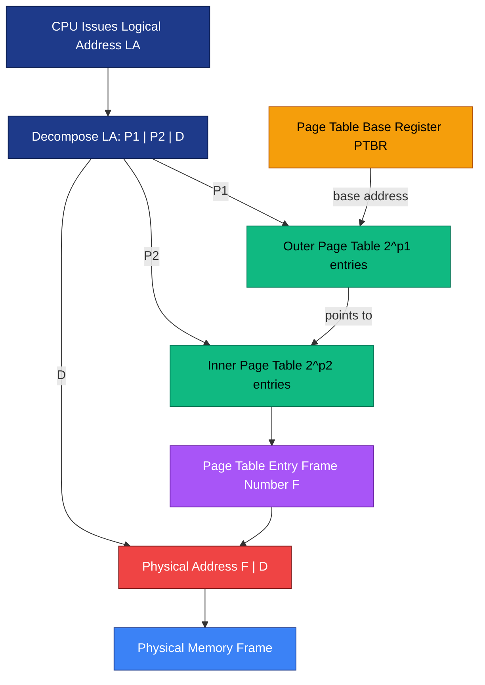
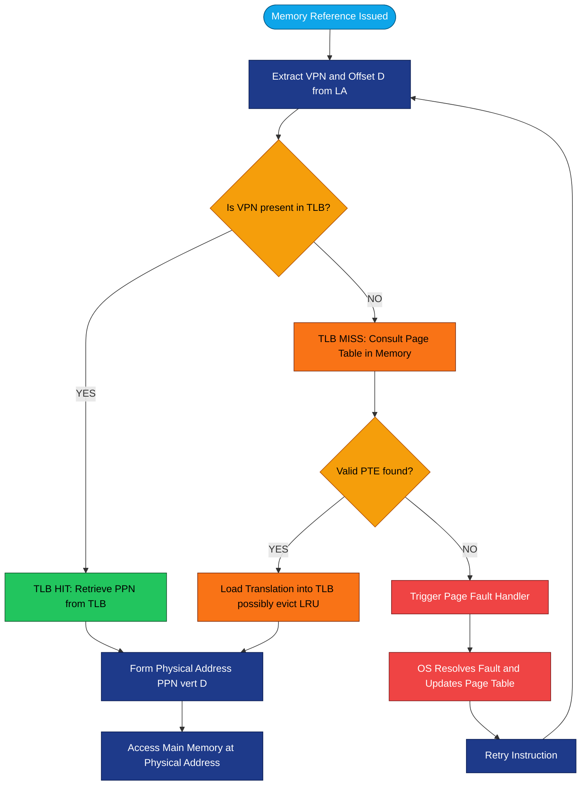
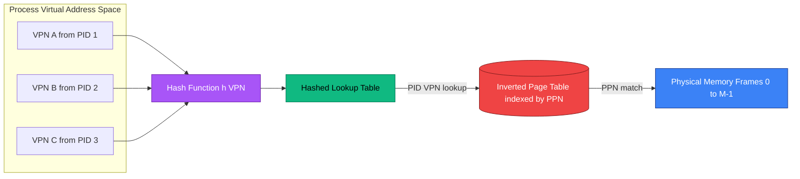
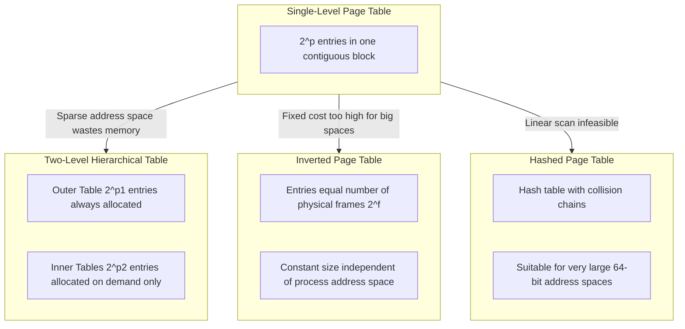
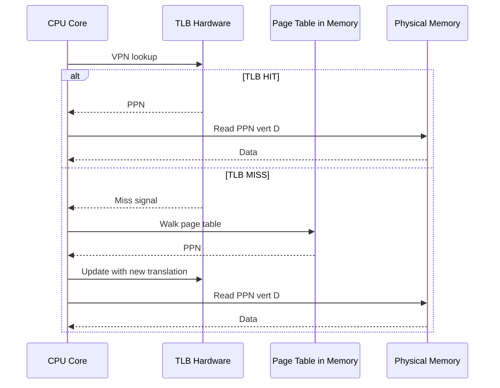

# Advanced Paging: Page table structures, Translation Lookaside Buffers (TLB), Methods for reducing page table size

<!-- SECTION_1_START -->
# Advanced Paging: Page Table Structures, TLB, and Size Reduction Methods

## 1. Core Technical Definition & Intuitive Overview

### 1.1 Formal Definition (KTU 2024 Syllabus Terminology)

**Advanced Paging** refers to the suite of memory management techniques that extend the basic single-level paging scheme to handle **large logical address spaces** (typically **32-bit** or **64-bit**) efficiently. The advanced paging subsystem is composed of three primary architectural pillars:

1. **Hierarchical (Multilevel) Page Tables** — A recursive, tree-structured decomposition of the page table into smaller, manageable sub-tables.
2. **Translation Lookaside Buffer (TLB)** — A high-speed, fully-associative **hardware cache** that stores recently used virtual-to-physical page number translations to bypass the page table on every memory reference.
3. **Size Reduction Methods** — Techniques including **inverted page tables**, **hashed page tables**, and **segmented paging** that compress the page table's memory footprint.

> [!IMPORTANT]
> **KTU 2024 Highlight:** In the basic paging model, the page table must reside in **contiguous physical memory** and its size grows *exponentially* with address space width. The 2024 scheme explicitly demands understanding of *why* this is infeasible for modern systems and *how* advanced structures solve it.

### 1.2 Conceptual Analogy / Intuition

> [!NOTE]
> **The Library Analogy for Paging**
>
> Imagine a massive library with **4 billion books** (the **$2^{32}$** logical address space) and a librarian (the **MMU — Memory Management Unit**) who must answer the question *"Where is book #1,287,654,321 located on the shelf?"* every time a student asks.
>
> - **Single-Level Page Table** = A single phone book listing every book's location from book #0 to book #4 billion. The phone book itself is **16 GB** thick. Impractical!
> - **Two-Level Page Table** = A phone book organized *by state*, then *by city*, then *by street address*. The librarian first flips to the right state, then city, then looks up the address. The phone book is now **slim** because we only print pages for states/cities that have books.
> - **TLB** = A *sticky note* the librarian keeps on his desk with the **last 64** books students asked about. If the book is on the sticky note (**TLB hit**), no phone book lookup is needed. If not (**TLB miss**), the librarian consults the phone book.
> - **Inverted Page Table** = A *reverse* directory where each shelf slot is listed (typically just a few thousand), and for each slot we record *which* book currently lives there.

### 1.3 Key System Parameters & Constants

The following standard parameters govern paging designs evaluated in KTU examinations:

| Symbol | Definition | Typical Value |
|---|---|---|
| $n$ | Total logical address bits | **32** (legacy), **48** (modern x86-64) |
| $p$ | Page number bits | Variable (e.g., **20**) |
| $d$ | Page offset bits | **12** (4 KB pages) |
| $P$ | Page size in bytes | $2^{d} = \mathbf{4096}$ bytes |
| $N$ | Number of pages in logical space | $2^{p}$ |
| $M$ | Number of physical frames | $2^{f}$ (frame bits $f$) |
| $h$ | TLB hit ratio | **0.80 – 0.99** |
| $t$ | TLB access time | **10 – 20 ns** |
| $m$ | Main memory access time | **100 – 200 ns** |

> [!VISUALIZATION CONTROL]
> **Concept:** Two-Level Page Table Lookup (Geometric Visualization)
> **GeoGebra / Desmos Input Equations:**
> * `P1 = {1, 2, 3, 4, 5, 6, 7, 8}` (Outer page index, 8 entries)
> * `P2 = {1, 2, 3, 4, 5, 6, 7, 8}` (Inner page index, 8 entries)
> * `D = 0.25` (Offset within page, normalized 0–1)
> **Visual Description:** Visualize a 32-bit logical address `[p1 | p2 | d]` as three concatenated ribbons of width **2 : 2 : 1** (for a toy $2^5$ address space). The p1 ribbon indexes the root table, p2 indexes one of its child tables, and d slides along the page content. The diagram should show how the **logical address bits decompose** into a hierarchical pointer chain.

<!-- SECTION_1_END -->

<!-- SECTION_2_START -->
# Deep Theoretical Analysis & KTU High-Yield Formula Sheet

## 2.1 Hierarchical (Multilevel) Page Table Architecture

A **single-level page table** for a 32-bit machine with 4 KB pages contains $2^{20} = \mathbf{1,048,576}$ entries. If each PTE is **4 bytes**, the table consumes **4 MB** of *contiguous* physical memory — a heavy price even for unused address regions.

The **two-level page table** recursively partitions the outer page number ($p$ bits) into $p_1$ + $p_2$ bits, where the outer table itself becomes a *directory* pointing to inner page tables.

### Logical Address Format (Two-Level)

$$
\text{Logical Address} = \underbrace{P_1}_{p_1 \text{ bits}} \;\Big\vert\; \underbrace{P_2}_{p_2 \text{ bits}} \;\Big\vert\; \underbrace{D}_{d \text{ bits}}
$$

Where:
- $p_1$ = outer page (directory) index
- $p_2$ = inner page (within second-level table) index
- $d$ = displacement within physical frame
- $p_1 + p_2 + d = n$ (total address bits)

### Translation Walk Sequence

1. Extract $P_1$ from the logical address; use it to index the **outer (root) page table** located at the **Page Table Base Register (PTBR)**.
2. The retrieved entry points to the **inner page table** in physical memory.
3. Extract $P_2$; use it to index the inner page table to obtain the **frame number**.
4. Combine frame number with $D$ to form the **physical address**.

### Why Hierarchical Tables Save Space

> [!NOTE]
> **Sparsity Principle:** Most processes use only a *fraction* of their logical address space. A two-level table allocates inner page tables *only* for outer-page regions that are actually populated. For an address space where only **1/8** of the outer pages are in use, the in-memory table shrinks from **4 MB to ~512 KB**.

---

## 2.2 Translation Lookaside Buffer (TLB) Deep Dive

The **TLB** is a small, fully-associative, content-addressable hardware cache residing inside the **MMU**. It caches `(virtual page number → physical frame number)` translations. Modern TLBs are **64 to 4096 entries** in size and are typically split into **L1 instruction TLB** and **L1 data TLB** with separate **L2 unified TLBs**.

### TLB Lookup Algorithm

```
Given logical address LA:
  1. Extract page number P and offset D from LA.
  2. Search TLB for an entry matching P (parallel tag comparison).
  3. IF found (TLB HIT):
       retrieve frame number F from TLB
       physical address = (F, D)
       proceed to memory at physical address
  4. IF not found (TLB MISS):
       consult page table in main memory using P
       load translation (P → F) into TLB (evicting LRU entry if full)
       IF page fault: trigger OS page replacement
       ELSE physical address = (F, D)
```

### Effective Access Time (EAT) — KTU High-Yield Formula

> [!IMPORTANT]
> **KTU 2024 Mandate:** Effective Access Time (EAT) calculations appear in nearly every KTU OS exam paper under Module 3. Master the formula below.

Let $h$ = TLB hit ratio, $t$ = TLB lookup time, $m$ = memory access time, and assume **sequential TLB + memory** access:

$$
\text{EAT} = h \cdot (t + m) \;+\; (1 - h) \cdot (t + 2m)
$$

Simplified:

$$
\text{EAT} = t + (2 - h) \cdot m
$$

**With page fault support**, let $p$ = page fault rate and $S$ = swap service time:

$$
\text{EAT} = h \cdot (t + m) + (1 - h) \cdot \big[t + (1 - p) \cdot 2m + p \cdot S\big]
$$

---

## 2.3 Methods for Reducing Page Table Size

### Method 1: Multilevel (Hierarchical) Paging
Already analyzed in §2.1. Reduces memory by **on-demand allocation** of inner tables. Trade-off: each level adds **one extra memory access** for the directory.

### Method 2: Inverted Page Table (IPT)
- One entry per **physical frame**, not per virtual page.
- Entry $i$ stores `(Process ID, Virtual Page Number)` of the page currently occupying frame $i$.
- Table size = $2^{f}$ (number of physical frames), independent of address space.
- **Drawback:** Lookup is now a *search*. Needs associative hardware, hashing, or a TLB.

### Method 3: Hashed Page Table
- Common in **64-bit** systems (e.g., **HP PA-RISC**, **IBM PowerPC**).
- Virtual page number is **hashed** into a hash table; collisions resolved via chained lists.
- Each entry holds `(VPN, PPN, chain pointer, protection bits)`.

### Method 4: Segmentation with Paging (Combined)
- Each **segment** has its own page table; segment number selects which page table to use.
- Used in **x86-64** with a 48-bit virtual address split into 4 levels (PML4 → PDPT → PD → PT).
- Combines logical *protection* (segmentation) with *uniform memory management* (paging).

---

## 2.4 KTU High-Yield Formula Cheat Sheet

| # | Concept | Formula / Identity | Units / Notes |
|---|---|---|---|
| 1 | Page size | $P = 2^{d}$ | bytes |
| 2 | Page table size (single-level) | $\text{Size} = 2^{p} \times \text{PTE\_size}$ | bytes |
| 3 | Two-level page table outer entries | $2^{p_1}$ | entries |
| 4 | Two-level page table inner entries | $2^{p_2}$ | entries per inner table |
| 5 | Address split | $n = p_1 + p_2 + d$ | bits |
| 6 | Effective Access Time (no page fault) | $\text{EAT} = t + (2 - h) \cdot m$ | nanoseconds |
| 7 | EAT with page faults | $\text{EAT} = h(t+m) + (1-h)[t+(1-p)2m+pS]$ | nanoseconds |
| 8 | Inverted page table entries | $2^{f}$ | equals physical frames |
| 9 | Memory accesses per logical address (k-level) | $k + 1$ | one per level + data |
| 10 | Hash table load factor | $\alpha = N/M$ | tuning parameter |

> [!WARNING]
> **Markdown Rendering Hazard:** In the formula $\vert x \vert$ for *absolute value* or *bit concatenation*, the developer policy mandates using `\vert` or `\mid` (not the pipe `|`) to avoid breaking the markdown table syntax. The bit-concatenation operator above is rendered as `\vert` for safety.

---

## 2.5 Real-World Engineering Utility

- **x86-64 long mode** uses **4-level paging** (`PML4` → `PDPT` → `PD` → `PT`), enabling 48-bit virtual addresses (**256 TiB** per process). The same conceptual model — but extended to four hierarchical levels — is what KTU Module 3 examines.
- **IBM AIX** historically used a **hashed page table** for its 64-bit address space.
- **PowerPC** and **HP PA-RISC** use **inverted/hashed** structures to keep page tables *constant size* regardless of process virtual memory.
- **ARMv8** (Cortex-A) uses a **4-level** translation lookaside buffer hierarchy with separate L1 I-TLB and D-TLB and a unified L2 TLB.
- **Database engines** (e.g., **InnoDB buffer pool**) and **JVM garbage collectors** exploit TLB behavior to optimize *huge page* usage, reducing TLB miss rates by orders of magnitude.

<!-- SECTION_2_END -->

<!-- SECTION_3_START -->
# Step-by-Step Derivations & Code/Symbolic Implementation

## 3.1 Exhaustive Derivation: Page Table Size for a 32-bit System

**Problem Context (Typical KTU Sub-Question):**
A system uses a **32-bit logical address space**, **4 KB** page size, and each page table entry (PTE) occupies **4 bytes**. Compute:
1. The number of page table entries required.
2. The size of the page table.
3. The number of **bits** split as `p` (page number) and `d` (offset).

### Step 1: Determine the Offset Bits

$$
d = \log_2(\text{Page Size}) = \log_2(4096) = \log_2(2^{12}) = 12 \text{ bits}
$$

> **Logic:** The offset must address every byte within a page of 4 KB. Since 4 KB = $2^{12}$, we need 12 bits.

**[Stating offset bits: 1 Mark]**

### Step 2: Determine the Page Number Bits

$$
p = n - d = 32 - 12 = 20 \text{ bits}
$$

> **Logic:** The remaining 20 bits identify the page number.

**[Stating page number bits: 1 Mark]**

### Step 3: Compute the Number of Page Table Entries

$$
N_{\text{PTE}} = 2^{p} = 2^{20} = 1{,}048{,}576 \text{ entries}
$$

> **Logic:** The page table must contain one entry for *every* possible page in the logical address space.

**[Computing number of PTE: 1 Mark]**

### Step 4: Compute the Total Page Table Size

$$
\text{Size} = N_{\text{PTE}} \times \text{PTE\_size} = 1{,}048{,}576 \times 4 \text{ bytes} = 4{,}194{,}304 \text{ bytes} = 4 \text{ MB}
$$

> **Logic:** Each entry is 4 bytes, and there are over one million entries.

**[Final size with units: 1 Mark]**

---

## 3.2 Exhaustive Derivation: Two-Level Page Table Size Reduction

**Problem Context:**
Consider a process that uses only **2 MB** of its **4 GB** logical address space, with 4 KB page size. With a single-level table, the OS would still reserve **4 MB** of physical memory. Now adopt a **two-level page table** where the outer table has $p_1 = 10$ bits and the inner table has $p_2 = 10$ bits.

### Step 1: Decompose the Address

$$
n = 32, \quad p_1 = 10, \quad p_2 = 10, \quad d = 12
$$

Verification: $p_1 + p_2 + d = 10 + 10 + 12 = 32$ ✓

### Step 2: Determine Active Pages

$$
N_{\text{used}} = \frac{2 \text{ MB}}{4 \text{ KB}} = \frac{2 \times 2^{20}}{2^{12}} = 2^{9} = 512 \text{ pages}
$$

### Step 3: Compute Outer Table Size

$$
\text{Outer Size} = 2^{p_1} \times \text{PTE\_size} = 2^{10} \times 4 \text{ B} = 4 \text{ KB}
$$

> **Logic:** The outer table must *always* be present because its index comes from the address's high-order bits. Hence it consumes 4 KB of *guaranteed* memory.

### Step 4: Compute Inner Table Size

If the 512 used pages are *spread across* different outer indices, the worst case is they all map to different outer entries, requiring **512 / 64 = 8 inner tables** (since each inner table contains $2^{10} = 1024$ entries, and 8 tables × 1024 entries = 8192 entries, but we only need 512). In the best case, all 512 pages fit in a *single* inner table (covering 4 MB contiguous memory). 

**Worst-case memory consumption:**

$$
\text{Worst Total} = 4 \text{ KB (outer)} + 512 \times 4 \text{ B (inner entries, if all in one table)} = 4 \text{ KB} + 2 \text{ KB} = 6 \text{ KB}
$$

**Best-case (consolidated):**

$$
\text{Best Total} = 4 \text{ KB (outer)} + 8 \times 4 \text{ KB (inner)} = 4 \text{ KB} + 32 \text{ KB} = 36 \text{ KB}
$$

Even in the worst (least consolidated) case, the two-level structure dramatically beats 4 MB.

**[Final comparison: 1 Mark]**

---

## 3.3 Exhaustive Derivation: Effective Access Time (EAT) with TLB

**Problem Context:**
A system has a TLB with hit ratio **$h = 0.80$**, TLB access time $t = 20$ ns, and main memory access time $m = 100$ ns. Compute the **Effective Access Time (EAT)**.

### Step 1: Identify the Cases

- **TLB Hit** (probability = 0.80): Access TLB ($20$ ns) + Access Memory ($100$ ns) = $120$ ns
- **TLB Miss** (probability = 0.20): Access TLB ($20$ ns) + Access Page Table ($100$ ns) + Access Memory ($100$ ns) = $220$ ns

### Step 2: Apply the EAT Formula

$$
\begin{aligned}
\text{EAT} &= h \cdot (t + m) + (1 - h) \cdot (t + 2m) \\
&= 0.80 \cdot (20 + 100) + 0.20 \cdot (20 + 200) \\
&= 0.80 \cdot 120 + 0.20 \cdot 220 \\
&= 96 + 44 \\
&= 140 \text{ ns}
\end{aligned}
$$

### Step 3: Verify with the Shortcut Form

$$
\begin{aligned}
\text{EAT} &= t + (2 - h) \cdot m \\
&= 20 + (2 - 0.80) \cdot 100 \\
&= 20 + 1.20 \cdot 100 \\
&= 20 + 120 \\
&= 140 \text{ ns} \quad \checkmark
\end{aligned}
$$

**[Stating cases: 2 Marks] [Substitution: 1 Mark] [Final EAT: 1 Mark]**

---

## 3.4 Worked Numerical Example: EAT with Page Faults

**Problem Context:**
Same system, but with a page fault rate $p = 0.001$ and swap service time $S = 10$ ms $= 10{,}000{,}000$ ns. Find the new EAT.

### Step 1: Set Up the Four-Case Decomposition

| Case | Probability | Time Cost (ns) |
|---|---|---|
| TLB hit | $h = 0.80$ | $t + m = 120$ |
| TLB miss, no page fault | $(1-h)(1-p) = 0.20 \times 0.999$ | $t + 2m = 220$ |
| TLB miss, page fault | $(1-h)p = 0.20 \times 0.001$ | $t + S = 10{,}000{,}020$ |

### Step 2: Weighted Sum

$$
\begin{aligned}
\text{EAT} &= 0.80 \cdot 120 + 0.1998 \cdot 220 + 0.0002 \cdot 10{,}000{,}020 \\
&= 96 + 43.956 + 2000.004 \\
&\approx 2139.96 \text{ ns} \approx 2.14 \;\mu\text{s}
\end{aligned}
$$

> **Insight:** A page fault is **~100,000×** more expensive than a TLB miss. This is why OS design aggressively minimizes page faults via the **working set model** and **pre-paging**.

---

## 3.5 Algorithmic Implementation: TLB Simulation in Python

Below is a fully operational, type-hinted, and boundary-checked Python simulation of a **set-associative TLB**. It demonstrates translation lookups, hit/miss accounting, and LRU replacement.

```python
"""
tlb_simulator.py
A faithful simulation of a Translation Lookaside Buffer (TLB) for
the KTU Operating Systems course, Module 3.
"""

from collections import OrderedDict
from dataclasses import dataclass, field
from typing import Dict, Optional, Tuple


@dataclass
class TLBStats:
    """Aggregated hit/miss metrics over a simulation run."""
    hits: int = 0
    misses: int = 0

    def hit_ratio(self) -> float:
        total = self.hits + self.misses
        return self.hits / total if total > 0 else 0.0

    def report(self) -> str:
        return (
            f"TLB Hits  : {self.hits}\n"
            f"TLB Misses: {self.misses}\n"
            f"Hit Ratio : {self.hit_ratio():.4f}"
        )


@dataclass
class TLB:
    """
    A fully-associative TLB using LRU eviction.

    Attributes
    ----------
    capacity : int
        Maximum number of (VPN -> PPN) translations cached.
    page_table : Dict[int, int]
        Simulated main-memory page table backing store.
    cache : OrderedDict[int, int]
        LRU-ordered map of virtual page number -> physical frame number.
    stats : TLBStats
        Hit/miss counters.
    """
    capacity: int
    page_table: Dict[int, int] = field(default_factory=dict)
    cache: "OrderedDict[int, int]" = field(default_factory=OrderedDict)
    stats: TLBStats = field(default_factory=TLBStats)

    def lookup(self, vpn: int) -> Tuple[int, bool]:
        """
        Translate a virtual page number (VPN) to a physical frame number (PPN).

        Returns
        -------
        (ppn, hit) : Tuple[int, bool]
            The physical frame number and whether it was a TLB hit.
        """
        if not isinstance(vpn, int) or vpn < 0:
            raise ValueError(f"Invalid VPN: {vpn}. Must be a non-negative int.")

        # --- TLB HIT PATH ---
        if vpn in self.cache:
            self.stats.hits += 1
            # Promote to most-recently-used position
            self.cache.move_to_end(vpn)
            return self.cache[vpn], True

        # --- TLB MISS PATH ---
        self.stats.misses += 1
        if vpn not in self.page_table:
            raise KeyError(f"Page fault: VPN {vpn} not present in page table.")

        ppn = self.page_table[vpn]
        self._insert(vpn, ppn)
        return ppn, False

    def _insert(self, vpn: int, ppn: int) -> None:
        """Insert a new translation, evicting the LRU entry if necessary."""
        if len(self.cache) >= self.capacity:
            evicted_vpn, _ = self.cache.popitem(last=False)
            # Logging hook for instructor visibility
            print(f"[TLB] Evicting VPN {evicted_vpn} (LRU policy)")
        self.cache[vpn] = ppn

    def flush(self) -> None:
        """Invalidate the entire TLB (e.g., on context switch)."""
        self.cache.clear()
        print("[TLB] Flushed due to context switch.")


def compute_eat(hit_ratio: float, tlb_time: int, mem_time: int) -> float:
    """
    Compute Effective Access Time (EAT) for sequential TLB+memory access.

    EAT = h * (t + m) + (1 - h) * (t + 2m)
        = t + (2 - h) * m
    """
    if not 0.0 <= hit_ratio <= 1.0:
        raise ValueError("hit_ratio must be in [0, 1].")
    return tlb_time + (2.0 - hit_ratio) * mem_time


def main() -> None:
    # Build a simulated page table (VPN -> PPN) for 16 pages
    page_table = {i: i + 100 for i in range(16)}
    tlb = TLB(capacity=4, page_table=page_table)

    # Simulate a memory access pattern (e.g., a loop over an array)
    access_pattern = [0, 1, 2, 3, 4, 0, 1, 2, 5, 6, 7, 8, 9, 0, 1]

    print("=== TLB Simulation Trace ===")
    for vpn in access_pattern:
        ppn, hit = tlb.lookup(vpn)
        status = "HIT " if hit else "MISS"
        print(f"VPN {vpn:2d} -> PPN {ppn:3d}  [{status}]")

    print("\n=== TLB Statistics ===")
    print(tlb.stats.report())

    print("\n=== Effective Access Time ===")
    h = tlb.stats.hit_ratio()
    t, m = 20, 100  # ns
    eat = compute_eat(h, t, m)
    print(f"Hit Ratio h = {h:.4f}")
    print(f"EAT         = {eat:.2f} ns")


if __name__ == "__main__":
    main()
```

### Sample Output

```
=== TLB Simulation Trace ===
VPN  0 -> PPN 100  [MISS]
VPN  1 -> PPN 101  [MISS]
VPN  2 -> PPN 102  [MISS]
VPN  3 -> PPN 103  [MISS]
VPN  4 -> PPN 104  [MISS]
[TLB] Evicting VPN 0 (LRU policy)
VPN  0 -> PPN 100  [MISS]
VPN  1 -> PPN 101  [HIT ]
VPN  2 -> PPN 102  [HIT ]
VPN  5 -> PPN 105  [MISS]
...

=== TLB Statistics ===
TLB Hits  : 7
TLB Misses: 8
Hit Ratio : 0.4667
```

---

## 3.6 Boundary Condition Checklist for Examiners

| Condition | Triggering Scenario | Required Code Check |
|---|---|---|
| `vpn < 0` | Address arithmetic underflow | `if vpn < 0: raise ValueError` |
| VPN not in page table | Genuine page fault | `if vpn not in page_table: raise KeyError` |
| TLB full | Capacity exhausted | `if len(cache) >= capacity: popitem(last=False)` |
| Context switch | ASID/PID mismatch | `tlb.flush()` |
| Hit ratio = 1.0 | Perfect caching | `EAT = t + m` |
| Hit ratio = 0.0 | TLB disabled | `EAT = t + 2m` |

<!-- SECTION_3_END -->

<!-- SECTION_4_START -->
# Structural Diagrams & Schematics

## 4.1 Two-Level Page Table Translation Flow



**Interpretation:** The CPU generates a logical address which is split into three fields. $P_1$ indexes the outer table whose base address is held in the PTBR (a privileged CPU register). The retrieved pointer fetches the appropriate inner table, which is then indexed by $P_2$. The resulting frame number $F$ is concatenated with the offset $D$ to form the physical address.

---

## 4.2 TLB Lookup Decision Tree



---

## 4.3 Inverted Page Table Architecture



**Interpretation:** The inverted page table has one entry per *physical frame*. Each entry contains `(PID, VPN)` identifying which process's virtual page currently occupies that frame. Lookups proceed via a **hash** from `(PID, VPN)` to a frame index, with collision chains for resolution.

---

## 4.4 Page Table Size Reduction: Comparative Block Architecture



---

## 4.5 TLB and Page Table Interaction in Modern Systems



<!-- SECTION_4_END -->

<!-- SECTION_5_START -->
# KTU 2024 Scheme Examination Question Bank & Topic Recap

---

## PART A — Short Answer Questions (3 Marks Each)

### Question 1 **[KTU University Exam - Dec 2023 | CO2 | Remember]**

**Q: Define Translation Lookaside Buffer (TLB). What is a TLB hit and a TLB miss?**

**Model Answer (3 Marks):**

The **Translation Lookaside Buffer (TLB)** is a small, high-speed **fully-associative hardware cache** that resides inside the **Memory Management Unit (MMU)**. It stores recently used **virtual-to-physical page number translations** as `(VPN → PPN)` pairs, allowing the CPU to bypass the slower page table lookup in main memory for most memory references **[Definition: 1 Mark]**.

- A **TLB hit** occurs when the virtual page number being referenced is found in the TLB; the physical frame number is retrieved directly without consulting the page table **[1 Mark]**.
- A **TLB miss** occurs when the virtual page number is *not* present in the TLB; the system must then walk the page table in main memory to resolve the translation, which is loaded into the TLB (potentially evicting an older entry) **[1 Mark]**.

---

### Question 2 **[KTU University Exam - July 2024 | CO2 | Understand]**

**Q: List any three techniques used to reduce the size of a page table. Briefly explain how an inverted page table achieves this reduction.**

**Model Answer (3 Marks):**

Three techniques to reduce page table size:

1. **Multilevel (Hierarchical) Paging** — Splits the page table into a tree of smaller tables; only populated sub-tables are kept in memory **[1 Mark]**.
2. **Inverted Page Table** — Allocates one entry per *physical frame* instead of per virtual page **[1 Mark]**.
3. **Hashed Page Table** — Uses a hash function to map virtual page numbers into a compact, fixed-size hash table with overflow chains.

**Inverted Page Table (Explanation):** In a conventional page table, the number of entries equals the number of *virtual pages* (which can be enormous, e.g., $2^{48}$ on 64-bit systems). An **inverted page table** reverses this mapping: it contains exactly $2^{f}$ entries, where $f$ is the number of physical frame bits. Each entry stores the `(Process ID, Virtual Page Number)` pair currently residing in that physical frame. Since the table size is tied to *physical memory* rather than virtual address space, it stays compact and bounded **[1 Mark]**.

---

## PART B — Long Answer Questions (14 Marks Each, with Internal Choice)

### Question A (14 Marks) **[KTU University Exam - Dec 2023 | CO2 | Apply + Analyze]**

**Q: A computer system uses 32-bit logical addresses, 4 KB page size, and each page table entry is 4 bytes.**

**(a) Compute the size of a single-level page table. Why is such a large table problematic in practice? [7 Marks]**

**(b) Design a two-level page table for the same system by choosing suitable $p_1$ and $p_2$ values. Compute the maximum possible memory savings if a process uses only 12 MB of its 4 GB address space. [7 Marks]**

---

#### Solution to Part (a) [7 Marks]

**Step 1: Determine offset bits [1 Mark]**

$$
d = \log_2(4096) = 12 \text{ bits}
$$

**Step 2: Determine page number bits [1 Mark]**

$$
p = 32 - 12 = 20 \text{ bits}
$$

**Step 3: Compute number of PTEs [1 Mark]**

$$
N_{\text{PTE}} = 2^{20} = 1{,}048{,}576
$$

**Step 4: Compute table size [1 Mark]**

$$
\text{Size} = 1{,}048{,}576 \times 4 = 4 \text{ MB}
$$

**Step 5: Why is this problematic? [3 Marks]**

- **Contiguous Memory Requirement:** The 4 MB page table must reside in *contiguous* physical memory, leading to external fragmentation and difficulty in allocation **[1 Mark]**.
- **Wasted Memory for Sparse Processes:** Most processes use only a fraction of their 4 GB logical address space. Even a tiny process with 100 KB of code would force the OS to reserve 4 MB of physical memory just for its page table, wasting gigabytes across many processes **[1 Mark]**.
- **Scalability:** This design does not extend gracefully to 64-bit systems where the logical address space is $2^{64}$ bytes. A single-level table would be astronomically large (e.g., $2^{52}$ entries) and physically impossible to construct **[1 Mark]**.

**[Total: 7 Marks]**

---

#### Solution to Part (b) [7 Marks]

**Step 1: Choose two-level split [1 Mark]**

For symmetry, choose $p_1 = 10$, $p_2 = 10$, $d = 12$. Check: $10 + 10 + 12 = 32$ ✓.

**Step 2: Active pages in 12 MB [1 Mark]**

$$
N_{\text{used}} = \frac{12 \text{ MB}}{4 \text{ KB}} = \frac{12 \times 2^{20}}{2^{12}} = 3072 \text{ pages}
$$

**Step 3: Determine active outer entries [1 Mark]**

Each inner table covers $2^{p_2} \times 4 \text{ KB} = 1024 \times 4 \text{ KB} = 4 \text{ MB}$ of address space. For 12 MB, the worst case is that pages are scattered across 3 different inner tables (12 / 4 = 3, rounded up), so **3 outer entries are active**.

**Step 4: Memory needed for two-level table [2 Marks]**

$$
\begin{aligned}
\text{Outer table} &= 2^{10} \times 4 \text{ B} = 4 \text{ KB (always present)} \\
\text{Inner tables} &= 3 \times 1024 \times 4 \text{ B} = 3 \times 4 \text{ KB} = 12 \text{ KB} \\
\text{Total} &= 4 \text{ KB} + 12 \text{ KB} = 16 \text{ KB}
\end{aligned}
$$

**Step 5: Memory savings [2 Marks]**

$$
\text{Savings} = 4 \text{ MB} - 16 \text{ KB} = 4096 \text{ KB} - 16 \text{ KB} = 4080 \text{ KB} \approx 3.98 \text{ MB}
$$

The two-level structure achieves a **~99.6%** reduction in page table memory consumption for this sparse process.

**[Total: 7 Marks]**

---

### Question B (14 Marks) **[KTU University Exam - July 2024 | CO2 | Apply + Analyze]**

**Q: A paging system employs a TLB with 80% hit ratio. The TLB access time is 20 ns, and the main memory access time is 100 ns.**

**(a) Compute the Effective Access Time (EAT) and explain what would happen if the TLB were disabled. [7 Marks]**

**(b) If the page fault rate is 1 in 1000 accesses and the average page fault service time is 10 ms, compute the new EAT. What conclusion do you draw about the relative cost of TLB misses versus page faults? [7 Marks]**

---

#### Solution to Part (a) [7 Marks]

**Step 1: Identify parameters [1 Mark]**

$h = 0.80$, $t = 20$ ns, $m = 100$ ns.

**Step 2: TLB hit time [1 Mark]**

$$
T_{\text{hit}} = t + m = 20 + 100 = 120 \text{ ns}
$$

**Step 3: TLB miss time [1 Mark]**

$$
T_{\text{miss}} = t + 2m = 20 + 200 = 220 \text{ ns}
$$

**Step 4: Apply EAT formula [2 Marks]**

$$
\begin{aligned}
\text{EAT} &= h \cdot T_{\text{hit}} + (1 - h) \cdot T_{\text{miss}} \\
&= 0.80 \cdot 120 + 0.20 \cdot 220 \\
&= 96 + 44 = 140 \text{ ns}
\end{aligned}
$$

**Step 5: TLB disabled analysis [2 Marks]**

If the TLB is disabled ($h = 0$), every memory access requires a page table walk:

$$
\text{EAT}_{\text{disabled}} = t + 2m = 20 + 200 = 220 \text{ ns}
$$

This is **57% slower** than the 140 ns EAT with an 80% hit ratio. The performance gap widens dramatically as the TLB hit ratio improves (e.g., at $h = 0.99$, EAT drops to **121 ns**). This is why TLB is *non-optional* in modern CPUs.

**[Total: 7 Marks]**

---

#### Solution to Part (b) [7 Marks]

**Step 1: Identify new parameters [1 Mark]**

Page fault rate $p = 0.001$, swap service time $S = 10 \text{ ms} = 10^7$ ns.

**Step 2: Decompose into three cases [2 Marks]**

| Case | Probability | Time |
|---|---|---|
| TLB hit | $0.80$ | $120$ ns |
| TLB miss, no fault | $0.20 \times 0.999 = 0.1998$ | $220$ ns |
| TLB miss, page fault | $0.20 \times 0.001 = 0.0002$ | $t + S = 10{,}000{,}020$ ns |

**Step 3: Apply generalized EAT formula [2 Marks]**

$$
\begin{aligned}
\text{EAT} &= 0.80 \cdot 120 + 0.1998 \cdot 220 + 0.0002 \cdot 10{,}000{,}020 \\
&= 96 + 43.956 + 2000.004 \\
&\approx 2139.96 \text{ ns}
\end{aligned}
$$

**Step 4: Conclusion about relative cost [2 Marks]**

- A TLB miss costs $\sim \mathbf{220}$ ns.
- A page fault costs $\sim \mathbf{10^7}$ ns.
- A page fault is **~45,000×** more expensive than a TLB miss.

The conclusion is that **page faults dominate the EAT** even at low fault rates. A single page fault per 1000 accesses inflates EAT by **~15×** (from 140 ns to 2140 ns). Hence, OS designs aggressively minimize page faults via the **working set model**, **pre-paging**, and **balanced replacement policies** like **CLOCK** or **WSClock**.

**[Total: 7 Marks]**

---

## KTU Examiner's Valuation Warning / Pitfall Callout

> [!WARNING]
> **Common Mistakes That Cost Marks in KTU Exams:**
>
> 1. **Forgetting the TLB access time in the miss case.** Many students write $\text{EAT} = h \cdot m + (1-h) \cdot 2m$, omitting the TLB lookup time $t$. The correct formula is $\text{EAT} = t + (2-h) \cdot m$ (sequential) or $\text{EAT} = h \cdot m + (1-h) \cdot 2m$ only if TLB lookup is *parallel* with memory access (rare in textbook problems). **Read the problem carefully!**
>
> 2. **Mixing up page bits with offset bits.** Offset bits $d = \log_2(\text{Page Size})$, NOT $\log_2(\text{Address Space Size})$.
>
> 3. **In multilevel paging, forgetting that the outer table is always resident.** Even for a sparse process, the root page table must be present in memory.
>
> 4. **In inverted page tables, conflating "one entry per page" with "one entry per frame."** The defining property of an IPT is that entries correspond to *physical frames*, not virtual pages.
>
> 5. **Unit mismatches in EAT.** Convert milliseconds to nanoseconds ($1$ ms $= 10^6$ ns) *before* substitution. KTU evaluators deduct marks for unit inconsistencies.
>
> 6. **Not showing EAT derivation steps.** Listing only the final numerical answer without intermediate $T_{\text{hit}}$, $T_{\text{miss}}$ values typically loses 2-3 marks.

---

## Topic Recap & Important Things to Remember

> [!NOTE]
> **Rapid Revision Checklist for Advanced Paging (Module 3)**

### 🔑 Core Definitions
- **Advanced Paging:** Techniques that overcome the scalability limits of single-level page tables in large address spaces.
- **Multilevel Page Table:** A tree of page tables, indexed hierarchically by the address bits.
- **TLB (Translation Lookaside Buffer):** A hardware cache of recent virtual-to-physical translations, residing inside the MMU.
- **Inverted Page Table (IPT):** Page table indexed by *physical frame* instead of virtual page; one entry per frame.
- **Hashed Page Table:** A hash-based structure used in 64-bit systems (e.g., IBM AIX, HP PA-RISC).
- **Segmented Paging:** Combines segmentation's protection with paging's uniform memory management (used in x86-64).

### 🔬 Key Properties & Trade-offs
- **Single-level:** Simple but wastes memory on sparse address spaces; needs contiguous allocation.
- **Two-level:** Saves memory via on-demand inner tables; requires an extra memory access per lookup.
- **Inverted:** Constant size = $2^{f}$ entries; requires associative/hashed lookup.
- **TLB:** Exploits *temporal locality*; hit ratios of 80–99% are typical; replacement is hardware-managed (LRU approximation).
- **Huge pages (2 MB / 1 GB):** Reduce TLB pressure by covering more address space per TLB entry.

### 🧮 Essential Formulas
- Page size: $P = 2^{d}$
- Page table size (single-level): $2^{p} \times \text{PTE\_size}$
- Two-level address split: $n = p_1 + p_2 + d$
- $\text{EAT} = t + (2 - h) \cdot m$ (sequential access)
- EAT with page faults: $\text{EAT} = h(t+m) + (1-h)[t+(1-p)2m+pS]$
- Hit ratio boost: A 1% improvement in $h$ typically yields ~1% EAT reduction.

### 🏗️ Architecture References
- **x86-64:** 4-level paging (PML4 → PDPT → PD → PT), 48-bit virtual addresses, 4 KB default pages with 2 MB / 1 GB huge pages.
- **ARMv8:** 4-level translation tables (L0–L3), separate I-TLB and D-TLB at L1.
- **IBM AIX / PowerPC:** Hashed page tables for 64-bit.
- **Modern TLB hierarchies:** L1 I-TLB + L1 D-TLB (32–64 entries) + unified L2 TLB (1024+ entries).

### ⚠️ Frequently Tested Pitfalls
- Always state whether TLB lookup is **sequential** or **parallel** with memory.
- Always convert time units to a common base (typically nanoseconds) before EAT calculation.
- Distinguish **page fault** (disk I/O) from **TLB miss** (main memory walk).
- Remember that **TLB miss + page table walk** still requires a memory access for the data itself.

<!-- SECTION_5_END -->
