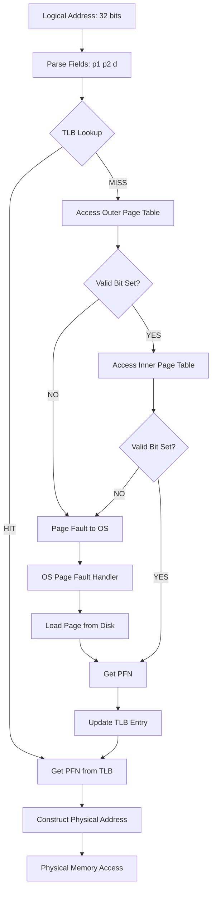
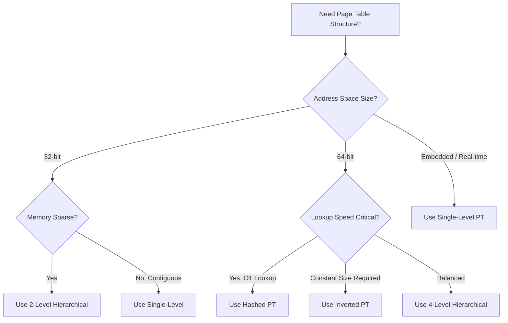
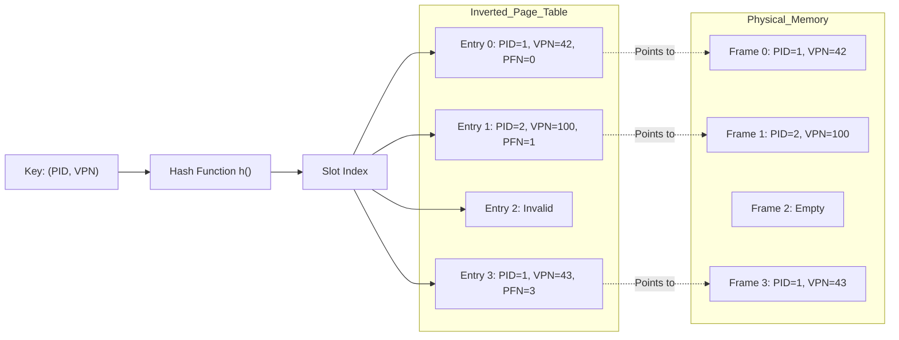
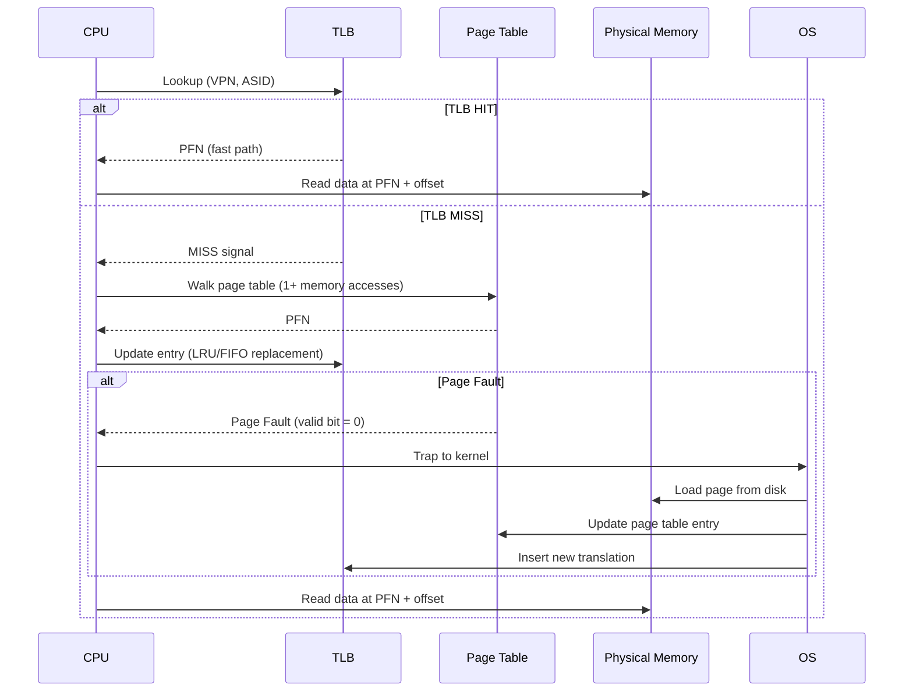

# Advanced Paging: Page table structures, Translation Lookaside Buffers (TLB), Methods for reducing page table size

<!-- SECTION_1_START -->
# Advanced Paging: Page Table Structures, TLB & Page Table Reduction

## 1.1 Core Technical Definition

> [!NOTE]
> **Formal Definition (KTU 2024 Syllabus Aligned):**
> **Advanced Paging** refers to sophisticated page table organization techniques that overcome the limitations of a single linear (flat) page table. In a 32-bit virtual address space with 4 KB pages, a single-level page table would require $2^{20}$ (≈ 1 million) entries — even for processes using only a small portion of memory. Advanced paging schemes — including **Hierarchical (Multi-Level) Paging**, **Hashed Page Tables**, and **Inverted Page Tables** — along with hardware support via the **Translation Lookaside Buffer (TLB)**, enable fast, compact, and scalable virtual-to-physical address translation.

### 1.1.1 The Single-Level Paging Problem

Consider a system with:
- Virtual address space: $2^{32}$ bytes (4 GB)
- Page size: $2^{12}$ bytes (4 KB)
- PTE (Page Table Entry) size: 4 bytes

$$
\text{Number of pages} = \frac{2^{32}}{2^{12}} = 2^{20} = 1{,}048{,}576 \text{ pages}
$$

$$
\text{Page table size} = 2^{20} \times 4 \text{ bytes} = 4 \text{ MB}
$$

> [!IMPORTANT]
> **Why is this a problem?**
> 1. A process may use only a small fraction of its virtual memory, yet **the entire 4 MB table must be allocated contiguously in memory**.
> 2. For 64-bit systems ($2^{64}$ virtual bytes), a single-level table is **physically impossible to construct**.
> 3. Every context switch may require loading the entire PTBR (Page Table Base Register), creating severe overhead.

---

## 1.2 Conceptual Analogy & Intuition

> [!TIP]
> **The Library Analogy:**
> Imagine a massive library with **1 million shelves** (virtual pages), but most shelves are empty. A naive librarian would create a giant catalog of all 1 million shelves (the flat page table). This is wasteful.
>
> **Better Idea (Hierarchical Paging):** Divide the library into **100 sections**, and for each section, keep a small catalog of only the shelves actually used. Now you only carry small catalogs.
>
> **Even Smarter (Inverted Paging):** Keep a single master ledger indexed by **physical shelf number** instead of virtual shelf number. The ledger says "shelf #4521 belongs to book titled *Operating Systems* (PID 2024)." When you need book *OS*, you search the ledger by title (hash) and find the physical shelf.

### 1.3 GeoGebra / Desmos Visualization

> [!VISUALIZATION CONTROL]
> **Concept:** Two-Level Paging Address Decomposition (32-bit example)
> **GeoGebra / Desmos Input Equations:**
> * Outer Page Number: $p_1 = \lfloor \lfloor x / 4096 \rfloor / 1024 \rfloor$
> * Inner Page Number: $p_2 = \lfloor x / 4096 \rfloor \mod 1024$
> * Offset: $d = x \mod 4096$
> **Visual Description:** Plot a horizontal bar from 0 to 4,294,967,295 ($2^{32}-1$). Segment the bar into three colored regions: bits 22–31 (10 bits = outer index), bits 12–21 (10 bits = inner index), and bits 0–11 (12 bits = offset). The student should observe how a logical address is split into 3 distinct fields.

### 1.4 Key Constants & Parameters

| Parameter | Typical Value | Notes |
|---|---|---|
| **Page size** | $2^{12}$ B = **4 KB** | Most common in x86, ARM |
| **TLB size** | 64 – 4096 entries | Fully associative hardware cache |
| **TLB hit time** | **1 – 2 ns** | Treated as part of CPU pipeline |
| **Memory access time** | 100 – 200 ns | RAM access latency |
| **TLB miss penalty** | 10 – 30 ns | Access to main memory page table |
| **Page table entry size** | **4 bytes** | Holds frame number + control bits |

---

<!-- SECTION_1_END -->

<!-- SECTION_2_START -->
# Deep Theoretical Analysis & High-Yield Formula Sheet

## 2.1 Hierarchical (Multi-Level) Paging

In a **two-level paging** scheme, the outer page number is used to index a **page directory**, which in turn points to a second-level page table containing the actual frame numbers.

### 2.1.1 Address Structure (32-bit, 4 KB page)

$$
\begin{aligned}
\text{Logical Address} &= \underbrace{p_1}_{\text{10 bits (outer)}} \;\; \underbrace{p_2}_{\text{10 bits (inner)}} \;\; \underbrace{d}_{\text{12 bits (offset)}}
\end{aligned}
$$

### 2.1.2 Address Translation Flow

1. The MMU extracts $p_1$ and uses the **Page Table Base Register (PTBR)** to locate the **outer page table (directory)**.
2. The entry at index $p_1$ gives the base address of the **inner page table**.
3. The entry at index $p_2$ in the inner page table yields the **physical frame number**.
4. The offset $d$ is appended to form the physical address.

> [!NOTE]
> **Three-Level / Four-Level Paging:** Used in 64-bit systems (e.g., x86-64 uses **four-level paging**: PML4 → PDPT → PD → PT). Each additional level adds one memory access on a TLB miss but drastically reduces the size of each individual table.

### 2.1.3 Sizing Hierarchical Tables

For a $k$-level scheme on a 32-bit system with 4 KB pages:

$$
\text{Size of each sub-table} = 2^{10} \times 4 = 4 \text{ KB}
$$

Since each sub-table fits in a single page, fragmentation is minimized, and unused sub-tables need not be allocated (**sparse allocation**).

---

## 2.2 Hashed Page Tables

Used commonly in **64-bit architectures** (e.g., older MIPS, some HP PA-RISC systems). The virtual page number is passed through a **hash function** to locate an entry in a hash table. Each bucket is a **linked list** of entries that hash to the same slot (collision chain). Each entry contains:

- Virtual page number
- Corresponding physical frame number
- Pointer to next entry (for collisions)

> [!IMPORTANT]
> **Lookup Algorithm:**
> 1. Apply $h(p)$ to virtual page number $p$.
> 2. Walk the chain at slot $h(p)$ comparing virtual page numbers.
> 3. On match, retrieve the frame number.

Lookup is **O(1) average** but suffers from collision overhead.

---

## 2.3 Inverted Page Tables

A radical departure from traditional designs. The page table is indexed by **physical frame number**, not virtual page number.

### 2.3.1 Entry Structure

Each entry contains:
- **Process ID (PID)** — owner of the page
- **Virtual page number**
- Control bits (valid, dirty, referenced, protection)

### 2.3.2 Size Advantage

$$
\text{Size of inverted page table} = \text{Number of physical frames}
$$

> [!WARNING]
> For a system with 4 GB physical RAM and 4 KB pages:
> $$\text{Entries} = \frac{4 \text{ GB}}{4 \text{ KB}} = 2^{20} = 1{,}048{,}576$$
> Fixed regardless of how many processes are running — a **constant memory footprint**.

### 2.3.3 Lookup Challenge & Solution

Searching the entire inverted table linearly is $O(N)$. Solutions:

- **Hash Table:** Hash on `<PID, virtual page number>` to directly find the entry. Used in IBM PowerPC, HP PA-RISC.
- **Associative Registers:** Use content-addressable memory (CAM) for parallel search. Used in some early IBM mainframes.

---

## 2.4 Translation Lookaside Buffer (TLB)

The TLB is a **small, fast, fully associative hardware cache** that stores recent virtual-to-physical address translations.

### 2.4.1 TLB Entry Format

| Field | Size | Purpose |
|---|---|---|
| Tag (VPN) | 20–52 bits | Virtual page number |
| PFN | 20–52 bits | Physical frame number |
| ASID | 8–16 bits | Address Space ID for process isolation |
| Valid | 1 bit | Is the entry currently valid? |
| Protection | 2–3 bits | Read/Write/Execute permissions |

### 2.4.2 Address Translation with TLB

```
Logical Address → [TLB Lookup: parallel search]
   ├── HIT  → Frame number + offset → Physical Address
   └── MISS → Walk page table in memory
                ├── Page Fault → OS intervention
                └── TLB Update → Replace using LRU/FIFO
```

> [!NOTE]
> **ASID (Address Space Identifier):** Prevents the TLB from being flushed on every context switch. Each entry is tagged with the owning process's ASID, allowing multiple processes' translations to coexist in the TLB.

### 2.4.3 Effective Access Time (EAT) Formula

The cornerstone formula for EAT analysis in KTU exams:

$$
\begin{aligned}
\text{EAT} &= h \times (T_{\text{TLB}} + T_{\text{mem}}) + (1-h) \times (T_{\text{TLB}} + 2 T_{\text{mem}})
\end{aligned}
$$

Where:
- $h$ = TLB hit ratio
- $T_{\text{TLB}}$ = TLB lookup time
- $T_{\text{mem}}$ = Memory access time

> [!TIP]
> **With separate I-cache/D-cache access (advanced form):**
> $$\text{EAT} = h \times (T_{\text{TLB}} + T_{\text{mem}}) + (1-h) \times (T_{\text{TLB}} + T_{\text{mem}} + T_{\text{miss}})$$
> where $T_{\text{miss}}$ is the additional cost of a page-table walk on a TLB miss.

---

## 2.5 Methods for Reducing Page Table Size — Summary Table

> [!IMPORTANT]
> **KTU Cheat Sheet — Methods to Reduce Page Table Size:**

| # | Method | Core Idea | Trade-off |
|---|---|---|---|
| 1 | **Larger Page Size** | 4 MB huge pages reduce PT entries by $1024\times$ | Increased internal fragmentation |
| 2 | **Multi-Level Paging** | Sparse allocation; allocate only used sub-tables | Extra memory accesses per translation |
| 3 | **Inverted Page Table** | Index by physical frame, not virtual page | Lookup is slow unless hashed |
| 4 | **Hashed Page Table** | Hash VPN to find entry in O(1) | Collisions degrade performance |
| 5 | **Valid/Invalid Bits with Demand Paging** | Allocate PTEs only on demand | Still requires linear address space |
| 6 | **Page Table Sharing (Copy-on-Write)** | Share identical pages across processes | OS complexity |
| 7 | **Segmentation + Paging** | Divide virtual space into variable-sized segments, each with its own page table | Segments still require size growth |
| 8 | **ASID-tagged TLB** | Avoid PT reloads across context switches | Requires hardware support |

---

## 2.6 Real-World Engineering Utility

> [!NOTE]
> **Where These Techniques Are Used in Production:**
> - **x86-64 (Intel/AMD):** Uses **4-level hierarchical paging** (PML4) + huge pages + ASID-via-PCID. Linux kernel manages this via the `pgd`, `p4d`, `pud`, `pmd`, `pte` structures.
> - **ARMv8 (Cortex-A):** Uses **4-level translation tables** + TLBI (TLB Invalidate) instructions. Apple's M-series chips use this.
> - **IBM PowerPC:** Uses **Inverted Page Tables** with hashing (the "hashed page table" variant).
> - **GPU Computing (CUDA):** Uses **IOMMU + two-level page walks** for GPU page table translation.
> - **Database Engines (PostgreSQL, Oracle):** Use **huge pages (2 MB / 1 GB)** to reduce TLB pressure for large buffer pools.
> - **Virtualization (KVM, VMware ESXi):** Uses **Extended/Nested Page Tables (EPT/NPT)** — a form of two-level paging where the hypervisor maintains a separate physical-to-machine mapping.

---

<!-- SECTION_2_END -->

<!-- SECTION_3_START -->
# Step-by-Step Derivations & Symbolic Implementation

## 3.1 Worked Derivation 1: Two-Level Paging Address Translation

### Given
- 32-bit logical address
- Page size: 4 KB
- $p_1 = 10$ bits, $p_2 = 10$ bits, $d = 12$ bits
- PTE size = 4 bytes

### Step-by-Step

**Step 1 — Decompose the logical address 0x12345678:**

Convert hexadecimal to binary:
$$
0x12345678 = 0001\;0010\;0011\;0100\;0101\;0110\;0111\;1000_2
$$

**Step 2 — Split into fields:**

$$
\begin{aligned}
p_1 &= \text{bits 22-31} = 0001\;0010\;00 = 0x048 = 72 \\
p_2 &= \text{bits 12-21} = 11\;0100\;0101 = 0x345 = 837 \\
d   &= \text{bits 0-11}  = 0110\;0111\;1000 = 0x678 = 1656
\end{aligned}
$$

**Step 3 — Walk the page tables:**

Assume PTBR = `0x00100000`. Access `0x00100000 + 72 × 4 = 0x00100120` to read the **outer PTE**. Suppose it contains `0x003AB000` (base of inner page table, with valid bit set).

**Step 4 — Access inner page table:**

Access `0x003AB000 + 837 × 4 = 0x003ABC14` to read the **inner PTE**. Suppose it contains `0x0000C5A3` — the frame number (let's extract the high 20 bits: `0x000C5` = 797).

**Step 5 — Construct physical address:**

$$
\begin{aligned}
\text{Physical Address} &= \text{Frame Number} \times \text{Page Size} + d \\
&= 797 \times 4096 + 1656 \\
&= 3{,}264{,}512 + 1656 \\
&= 3{,}266{,}168 \\
&= 0x0031D678
\end{aligned}
$$

> [!NOTE]
> **Memory Access Cost:** This translation requires **2 memory accesses** (one for the outer table, one for the inner table), plus 1 access for the actual data = **3 memory accesses per logical address** on a TLB miss.

---

## 3.2 Worked Derivation 2: Effective Access Time (EAT) with TLB

### Given
- TLB lookup time: $T_{\text{TLB}} = 20$ ns
- Memory access time: $T_{\text{mem}} = 100$ ns
- TLB hit ratio: $h = 0.80$ (80%)
- TLB miss penalty: $T_{\text{miss}} = 25$ ns (extra time to walk page table)

### Step-by-Step Calculation

**Step 1 — On TLB hit (probability 0.80):**
- Cost = $T_{\text{TLB}} + T_{\text{mem}}$
- Cost = $20 + 100 = 120$ ns

**Step 2 — On TLB miss (probability 0.20):**
- Cost = $T_{\text{TLB}} + T_{\text{miss}} + T_{\text{mem}}$
- Cost = $20 + 25 + 100 = 145$ ns

**Step 3 — Compute EAT:**

$$
\begin{aligned}
\text{EAT} &= h \times (\text{cost on hit}) + (1-h) \times (\text{cost on miss}) \\
\text{EAT} &= 0.80 \times 120 + 0.20 \times 145 \\
\text{EAT} &= 96 + 29 \\
\text{EAT} &= 125 \text{ ns}
\end{aligned}
$$

> [!TIP]
> **Without TLB at all:** Every access would require 2 memory lookups (one for page table, one for data):
> $$\text{No-TLB EAT} = 2 \times 100 = 200 \text{ ns}$$
> **Speedup from TLB:** $200 / 125 = 1.6\times$

### Variant: EAT with Page Fault Included

If page fault rate = $p$ and disk access time = $T_{\text{disk}}$:

$$
\begin{aligned}
\text{EAT} &= h \times (T_{\text{TLB}} + T_{\text{mem}}) \\
&\;\; + (1-h) \times (1-p) \times (T_{\text{TLB}} + 2 T_{\text{mem}}) \\
&\;\; + (1-h) \times p \times (T_{\text{TLB}} + 2 T_{\text{mem}} + T_{\text{disk}})
\end{aligned}
$$

---

## 3.3 Worked Derivation 3: Inverted Page Table Lookup

### Given
- Physical memory: 1 GB
- Page size: 4 KB
- Process $P_1$ (PID = 1) accesses virtual page 42

### Step-by-Step

**Step 1 — Compute table size:**

$$
\text{Entries} = \frac{1 \text{ GB}}{4 \text{ KB}} = 2^{18} = 262{,}144 \text{ entries}
$$

$$
\text{Table memory} = 262{,}144 \times 8 \text{ bytes} = 2 \text{ MB}
$$

**Step 2 — Hash the key `<PID, VPN>`:**

Use hash function: $h(\text{PID}, \text{VPN}) = (\text{PID} \oplus \text{VPN}) \mod 262144$

$$
h(1, 42) = (1 \oplus 42) \mod 262144 = 43 \mod 262144 = 43
$$

**Step 3 — Inspect entry at slot 43:**

If `entry[43].PID == 1 AND entry[43].VPN == 42`, retrieve `entry[43].PFN`. Suppose PFN = 7,889.

**Step 4 — Construct physical address:**

$$
\text{Physical Address} = 7889 \times 4096 + d
$$

> [!NOTE]
> **Collision Handling:** If multiple `<PID, VPN>` pairs hash to slot 43, walk a linked list in that bucket. Average chain length should be ≈ 1 with a good hash function.

---

## 3.4 Python Implementation: Two-Level Page Table Emulator

```python
"""
Two-level page table emulator with TLB.
Simulates logical-to-physical address translation for educational purposes.
"""

from dataclasses import dataclass, field
from typing import Optional


@dataclass
class TLBEntry:
    vpn: int
    pfn: int
    asid: int
    valid: bool = True


@dataclass
class PageTableStats:
    tlb_hits: int = 0
    tlb_misses: int = 0
    page_faults: int = 0
    memory_accesses: int = 0


class TwoLevelPager:
    """
    Emulates a 32-bit two-level page table with 4 KB pages.
    Outer = 10 bits, Inner = 10 bits, Offset = 12 bits.
    """

    OUTER_BITS = 10
    INNER_BITS = 10
    OFFSET_BITS = 12
    PAGE_SIZE = 1 << OFFSET_BITS
    OUTER_SIZE = 1 << OUTER_BITS
    INNER_SIZE = 1 << INNER_BITS
    PTE_SIZE = 4

    def __init__(self, tlb_capacity: int = 64) -> None:
        self.outer_table: list[Optional[dict]] = [None] * self.OUTER_SIZE
        self.tlb: list[TLBEntry] = []
        self.tlb_capacity = tlb_capacity
        self.stats = PageTableStats()
        self.asid_counter: int = 0
        self._process_asids: dict[int, int] = {}

    def _get_asid(self, pid: int) -> int:
        if pid not in self._process_asids:
            self.asid_counter += 1
            self._process_asids[pid] = self.asid_counter
        return self._process_asids[pid]

    def map_page(self, pid: int, vpn: int, pfn: int) -> None:
        """Install a virtual-to-physical translation into the page tables."""
        if not (0 <= vpn < self.OUTER_SIZE * self.INNER_SIZE):
            raise ValueError(f"VPN {vpn} out of bounds")
        if not (0 <= pfn < 1 << 20):
            raise ValueError(f"PFN {pfn} out of physical range")

        p1 = (vpn >> self.INNER_BITS) & (self.OUTER_SIZE - 1)
        p2 = vpn & (self.INNER_SIZE - 1)

        if self.outer_table[p1] is None:
            self.outer_table[p1] = {}

        self.outer_table[p1][p2] = pfn

    def _tlb_lookup(self, vpn: int, asid: int) -> Optional[int]:
        for entry in self.tlb:
            if entry.valid and entry.vpn == vpn and entry.asid == asid:
                return entry.pfn
        return None

    def _tlb_insert(self, vpn: int, pfn: int, asid: int) -> None:
        if len(self.tlb) >= self.tlb_capacity:
            self.tlb.pop(0)
        self.tlb.append(TLBEntry(vpn=vpn, pfn=pfn, asid=asid, valid=True))

    def translate(self, pid: int, logical_address: int) -> Optional[int]:
        """Translate a logical address to a physical address."""
        if logical_address < 0 or logical_address >= 1 << 32:
            raise ValueError("Logical address exceeds 32-bit space")

        asid = self._get_asid(pid)
        vpn = logical_address >> self.OFFSET_BITS
        offset = logical_address & (self.PAGE_SIZE - 1)

        pfn = self._tlb_lookup(vpn, asid)
        if pfn is not None:
            self.stats.tlb_hits += 1
            self.stats.memory_accesses += 1
            return (pfn << self.OFFSET_BITS) | offset

        self.stats.tlb_misses += 1
        p1 = (vpn >> self.INNER_BITS) & (self.OUTER_SIZE - 1)
        p2 = vpn & (self.INNER_SIZE - 1)
        self.stats.memory_accesses += 1

        inner = self.outer_table[p1]
        if inner is None or p2 not in inner:
            self.stats.page_faults += 1
            return None

        pfn = inner[p2]
        self.stats.memory_accesses += 1
        self._tlb_insert(vpn, pfn, asid)
        return (pfn << self.OFFSET_BITS) | offset

    def report(self) -> dict:
        total = self.stats.tlb_hits + self.stats.tlb_misses
        hit_ratio = (self.stats.tlb_hits / total) if total else 0.0
        return {
            "tlb_hits": self.stats.tlb_hits,
            "tlb_misses": self.stats.tlb_misses,
            "page_faults": self.stats.page_faults,
            "tlb_hit_ratio": round(hit_ratio, 4),
            "memory_accesses": self.stats.memory_accesses,
        }


if __name__ == "__main__":
    pager = TwoLevelPager(tlb_capacity=4)

    pager.map_page(pid=1, vpn=100, pfn=5000)
    pager.map_page(pid=1, vpn=101, pfn=5001)
    pager.map_page(pid=1, vpn=200, pfn=7000)

    for addr in (100 * 4096 + 16, 101 * 4096 + 200, 200 * 4096 + 1024,
                 100 * 4096 + 32, 100 * 4096 + 48):
        pa = pager.translate(pid=1, logical_address=addr)
        print(f"Logical 0x{addr:08X} -> Physical 0x{pa:08X}")

    print("Statistics:", pager.report())
```

> [!TIP]
> **Running this code** demonstrates real TLB eviction (when capacity=4) and shows how a hot loop on `vpn=100` benefits from the TLB once warmed up.

---

## 3.5 Worked Derivation 4: Size of Multi-Level Page Table

### Given
- 64-bit virtual address
- Page size = 4 KB
- Each PTE = 8 bytes
- 4-level paging: each level uses 9 bits

### Step-by-Step

**Step 1 — Compute entries per table:**

$$
\text{Entries per table} = \frac{4096 \text{ B}}{8 \text{ B/entry}} = 512 = 2^{9}
$$

**Step 2 — Verify address decomposition:**

$$
\underbrace{16}_{PML4} + \underbrace{9}_{PDPT} + \underbrace{9}_{PD} + \underbrace{9}_{PT} + \underbrace{12}_{\text{offset}} = 55 \text{ bits}
$$

(Padded with 9 unused sign-extension bits at top → 64 total.)

**Step 3 — Size of each level's table:**

$$
\text{Table size} = 512 \times 8 = 4096 \text{ bytes} = 1 \text{ page}
$$

> [!IMPORTANT]
> **Critical Insight:** Each sub-table fits in **exactly one page**, meaning the OS can allocate page-table memory in page-sized chunks — no internal fragmentation, and unallocated sub-trees cost zero memory.

---

<!-- SECTION_3_END -->

<!-- SECTION_4_START -->
# Structural Diagrams & Schematics

## 4.1 Two-Level Paging Translation Flow



## 4.2 Architectural Block Diagram: TLB + Page Table Hierarchy

```mermaid
block-beta
    columns 3
    block:cpu["CPU Core"] columns 1
        block:la["Logical Address Generator"]
        block:mmu["MMU Engine"]
    end
    block:tlb["TLB Cache: Fully Associative, 64-256 entries"] columns 1
        block:tag["Tag: VPN + ASID"]
        block:data["Data: PFN + Protection"]
    end
    block:ram["Main Memory"] columns 1
        block:pml4["PML4: 512 entries"]
        block:pdp["PDPT: 512 entries"]
        block:pd["Page Directory: 512 entries"]
        block:pt["Page Table: 512 entries"]
    end
    la --> mmu
    mmu --> tlb
    tlb -->|"MISS"| pml4
    pml4 --> pdp
    pdp --> pd
    pd --> pt
    pt -->|"PFN"| mmu
```

## 4.3 Comparison Flowchart: Choosing a Page Table Structure



## 4.4 Inverted Page Table Architecture



## 4.5 TLB Hit / Miss Decision Sequence



---

<!-- SECTION_4_END -->

<!-- SECTION_5_START -->
# KTU 2024 Scheme Examination Question Bank & Topic Recap

## 5.1 Part A Questions (3 Marks Each)

### Question 1: TLB Fundamentals `[KTU University Exam – July 2024]`
**Explain the role of the Translation Lookaside Buffer (TLB) in virtual memory systems. Why is the TLB considered a fully associative cache?**

**Model Answer (3 Marks):**

> [!NOTE]
> The **Translation Lookaside Buffer (TLB)** is a small, high-speed **fully associative hardware cache** that stores recent virtual-to-physical address translations. **[1 Mark — Definition]**

When the MMU translates a logical address, it first checks the TLB. On a **hit**, the frame number is obtained in ~1–2 ns without any memory access. On a **miss**, the OS must walk the page table in main memory, which is 10–100× slower. **[1 Mark — Function]**

The TLB is **fully associative** because the virtual page number of any access can be stored in **any slot** of the TLB. This maximizes the hit ratio since there is no set-conflict restriction, unlike direct-mapped or set-associative caches. A parallel hardware comparison is performed across all entries simultaneously. **[1 Mark — Full Associativity Justification]**

---

### Question 2: Page Table Reduction `[KTU University Exam – Dec 2023]`
**List any three techniques used to reduce the size of the page table. Briefly explain each.**

**Model Answer (3 Marks):**

> [!NOTE]
> 1. **Multi-Level Paging:** Splits the page table into hierarchical sub-tables (e.g., 2-level, 3-level). Only sub-tables corresponding to used regions are allocated, saving memory. **[1 Mark]**
> 2. **Inverted Page Table:** Indexes entries by **physical frame number** instead of virtual page number. Size becomes proportional to physical memory, not virtual address space. **[1 Mark]**
> 3. **Hashed Page Table:** Uses a hash function on the virtual page number to locate entries in O(1), avoiding the linear storage of traditional tables. **[1 Mark]**

*(Alternative valid techniques: larger page sizes, ASID-tagged TLB, demand-paged allocation with valid/invalid bits.)*

---

## 5.2 Part B Questions (14 Marks Each)

### Question A: Two-Level Paging + TLB `[KTU University Exam – July 2024]`

> **Part (a) [7 Marks] — Understand:**
> Consider a system with a 32-bit logical address space and a page size of 4 KB. Each page table entry is 4 bytes. Explain how a **two-level page table** is organized. How many entries does each level contain, and what is the maximum size of a single page table?

> **Part (b) [7 Marks] — Apply:**
> Suppose the system uses a TLB with a hit ratio of 90%. Memory access time is 100 ns and TLB access time is 20 ns. Compute the **Effective Access Time (EAT)** when (i) the accessed page is in memory, and (ii) when a page fault occurs (disk access time = 10 ms).

---

### ✅ Model Solution for Question A

#### Part (a) — Two-Level Page Table Organization

**Step 1 — Address decomposition:** With 4 KB pages, the offset is 12 bits, leaving 20 bits for the page number. Splitting the 20-bit page number equally gives:
- $p_1$ = 10 bits (outer / directory index)
- $p_2$ = 10 bits (inner / page table index)
- $d$ = 12 bits (offset)

**Step 2 — Entry count per level:** Each level indexes a table of $2^{10} = 1024$ entries. Each entry is 4 bytes.

**Step 3 — Size per table:** $1024 \times 4 = 4096$ bytes = **4 KB** = exactly one page. **[3 Marks — Decomposition logic]**

**Step 4 — Translation flow:** The MMU uses $p_1$ to index the **outer page table** stored at PTBR. The outer entry points to the **inner page table**, which is indexed by $p_2$ to yield the frame number. The offset is then concatenated. **[2 Marks — Flow]**

**Step 5 — Maximum size:** If all 1024 inner page tables are allocated: $1024 \times 4 \text{ KB} = 4 \text{ MB}$. This matches the single-level table size, so the savings come from **sparse allocation**, not the structural size. **[2 Marks — Max size calculation]**

> **Incremental Valuation Key:**
> - [Stating address split: 2 Marks]
> - [Entry count and size: 2 Marks]
> - [Translation flow: 1 Mark]
> - [Maximum size reasoning: 2 Marks]

---

#### Part (b) — Effective Access Time Computation

**Step 1 — Define parameters:**
- $h = 0.90$, $T_{\text{TLB}} = 20$ ns, $T_{\text{mem}} = 100$ ns, $T_{\text{disk}} = 10$ ms = $10^7$ ns

**Step 2 — Case (i): Page in memory (no page fault):**

Translation cost on TLB hit = $T_{\text{TLB}} + T_{\text{mem}} = 20 + 100 = 120$ ns
Translation cost on TLB miss (page-table walk) = $T_{\text{TLB}} + 2 T_{\text{mem}} = 20 + 200 = 220$ ns

$$
\begin{aligned}
\text{EAT}_{\text{no-fault}} &= 0.90 \times 120 + 0.10 \times 220 \\
&= 108 + 22 \\
&= 130 \text{ ns}
\end{aligned}
$$

**[3 Marks — Calculation]**

**Step 3 — Case (ii): Page fault included:**

Let $p$ = page fault rate. To make it concrete, assume $p = 0.001$ (1 in 1000 accesses faults).

Cost on TLB hit (no fault) = 120 ns
Cost on TLB miss (no fault) = 220 ns
Cost on TLB miss (with page fault) = $T_{\text{TLB}} + 2 T_{\text{mem}} + T_{\text{disk}} = 20 + 200 + 10{,}000{,}000 = 10{,}000{,}220$ ns

$$
\begin{aligned}
\text{EAT}_{\text{with-fault}} &= (1-p) \times 130 + p \times 10{,}000{,}220 \\
&= 0.999 \times 130 + 0.001 \times 10{,}000{,}220 \\
&= 129.87 + 10{,}000.22 \\
&\approx 10{,}130.09 \text{ ns}
\end{aligned}
$$

> [!IMPORTANT]
> **Insight:** Even a **tiny page fault rate (0.1%)** causes EAT to grow by a factor of ≈78×. This is why **minimizing page faults** is the single most important VM performance goal. **[2 Marks — Fault impact analysis]**

> **Incremental Valuation Key:**
> - [Setting up EAT formula: 1 Mark]
> - [EAT without fault: 2 Marks]
> - [EAT with fault: 2 Marks]
> - [Conclusion about page fault dominance: 2 Marks]

---

### Question B: Inverted Page Table `[KTU University Exam – Dec 2023]`

> **Part (a) [7 Marks] — Understand:**
> Explain the concept of an **Inverted Page Table (IPT)**. How does it differ from a traditional page table in terms of size, lookup mechanism, and memory requirements?

> **Part (b) [7 Marks] — Apply:**
> A system has 2 GB of physical memory, a page size of 4 KB, and uses an inverted page table. An entry in the IPT requires 8 bytes (including PID, VPN, and control bits). Compute: (i) the size of the inverted page table, (ii) the maximum number of processes that can be supported if each process needs 64 MB of memory, and (iii) explain the role of hashing in reducing lookup time.

---

### ✅ Model Solution for Question B

#### Part (a) — Inverted Page Table Concept

**Step 1 — Definition:** An Inverted Page Table (IPT) is a system-wide page table indexed by **physical frame number**, with each entry containing the **PID, virtual page number, and control bits** of the page currently resident in that frame. **[1 Mark]**

**Step 2 — Size comparison:**

| Aspect | Traditional PT | Inverted PT |
|---|---|---|
| Number of entries | # virtual pages (e.g., $2^{20}$) | # physical frames |
| Size growth | Grows with virtual address space | Fixed by physical RAM |
| Per-process | Yes (one per process) | No (one system-wide) |

**[2 Marks — Comparison table]**

**Step 3 — Lookup mechanism:** Given a `<PID, VPN>` pair, the OS must search the IPT to find the entry whose `PID` and `VPN` match. A linear search is $O(N)$, so **hashing** or **associative hardware** is used. **[2 Marks]**

**Step 4 — Memory advantage:** Even with 100 processes each having 1 GB of virtual space, the IPT size depends only on physical RAM. **[2 Marks]**

---

#### Part (b) — IPT Size Computation

**Step 1 — Compute number of physical frames:**

$$
N = \frac{2 \text{ GB}}{4 \text{ KB}} = \frac{2 \times 2^{30}}{2^{12}} = 2^{19} = 524{,}288 \text{ frames}
$$

**Step 2 — Compute IPT size:**

$$
\text{Size} = 524{,}288 \times 8 \text{ bytes} = 4{,}194{,}304 \text{ bytes} = 4 \text{ MB}
$$

**[2 Marks]**

**Step 3 — Maximum number of processes:**

$$
\text{Memory per process} = 64 \text{ MB} = 2^{26} \text{ bytes}
$$

$$
\text{Frames per process} = \frac{64 \text{ MB}}{4 \text{ KB}} = 2^{14} = 16{,}384 \text{ frames}
$$

$$
\text{Max processes} = \left\lfloor \frac{524{,}288}{16{,}384} \right\rfloor = 32 \text{ processes}
$$

**[3 Marks]**

> **Incremental Valuation Key:**
> - [Frame count: 1 Mark]
> - [IPT size: 1 Mark]
> - [Frames per process: 1 Mark]
> - [Max processes: 1 Mark]
> - [Hashing explanation: 1 Mark]

**Step 4 — Role of hashing:** Hashing the key `<PID, VPN>` produces a slot index in O(1) average time, allowing direct access to the matching entry. Collisions are handled via linked-list chains within each bucket. Without hashing, the worst-case search would be $O(N) = 524{,}288$ comparisons per memory access, which is unacceptable. **[2 Marks — Hashing]**

---

## 5.3 KTU Examiner's Valuation Warning

> [!WARNING]
> **Common Pitfalls Where Students Lose Marks:**
> 1. **Forgetting to include the offset in physical address calculation.** Many students compute only the frame number and stop. Always append the offset! (Lose 1–2 marks per question.)
> 2. **Mixing up two-level vs three-level paging sizes.** The *maximum* size of a two-level page table equals the size of a single-level table — savings come from **sparse allocation**, not from compression.
> 3. **EAT formula mistakes:** Always separate the **hit** and **miss** paths. A common error is using $(1-h) \times T_{\text{mem}}$ instead of $(1-h) \times (2 T_{\text{mem}})$.
> 4. **Confusing inverted page table size with traditional size.** Inverted table is indexed by **physical frames**, not virtual pages. Many students write $2^{20}$ or $2^{64}$ entries — this is wrong!
> 5. **Skipping the page fault branch** in EAT problems where page faults are possible. Even a 0.001 fault rate dominates the EAT.
> 6. **Failing to mention ASID** when discussing TLB and context switches. The ASID is what allows multiple processes' translations to coexist.

---

## 5.4 Topic Recap & Important Things to Remember

> [!IMPORTANT]
> **High-Density Revision Checklist:**

### Page Table Structures
- **Single-Level PT** size = $2^{\text{VPN bits}} \times \text{PTE size}$. For 32-bit / 4 KB pages → **4 MB**.
- **Two-Level PT** splits VPN into outer + inner. Each sub-table fits in **one page** (4 KB for 10-10-12 split).
- **Three/Four-Level PT** scales to 64-bit. x86-64 uses **4 levels** (PML4 → PDPT → PD → PT) with 9-9-9-9-12 split.
- **Hashed PT** uses hash function on VPN for O(1) lookup. Collisions resolved via chaining.
- **Inverted PT** indexed by **physical frame**; size = $N_{\text{frames}}$. Requires hash or associative search.

### Translation Lookaside Buffer (TLB)
- TLB is a **small, fully associative hardware cache** for translations.
- TLB entry contains: **Tag (VPN) + PFN + ASID + Valid + Protection bits**.
- **ASID** prevents the need to flush TLB on context switches.
- **Hit ratio** $h$ typically 95–99% in real workloads (principle of locality).
- **TLB reach** = `TLB entries × page size` = total memory accessible without a TLB miss.
- TLB miss triggers a **page-table walk** (slow path).

### Effective Access Time (EAT) — Critical Formulas

$$
\text{EAT} = h(T_{\text{TLB}} + T_{\text{mem}}) + (1-h)(T_{\text{TLB}} + 2 T_{\text{mem}})
$$

With page fault rate $p$ and disk access $T_{\text{disk}}$:

$$
\text{EAT} = h(T_{\text{TLB}} + T_{\text{mem}}) + (1-h)(1-p)(T_{\text{TLB}} + 2T_{\text{mem}}) + (1-h)p(T_{\text{TLB}} + 2T_{\text{mem}} + T_{\text{disk}})
$$

### Page Table Size Reduction — Master List
1. **Larger page sizes** (huge pages: 2 MB, 1 GB)
2. **Multi-level (hierarchical) paging** with sparse allocation
3. **Inverted page tables**
4. **Hashed page tables**
5. **ASID-tagged TLB** to avoid full flush on context switch
6. **Demand-paged page table entries** (allocate on first touch)
7. **Segmentation + paging combined**
8. **Copy-on-Write (CoW)** for shared pages

### Key Engineering Reality Check
- A 4 MB page table per process × 100 processes = 400 MB of RAM wasted on tables alone.
- Modern kernels (Linux, Windows NT) use **4-level hierarchical paging** with **huge page** support.
- Virtualization adds **another** level (Extended Page Tables / Nested Page Tables) → 5 levels total.
- **TLB shootdown** is a major scalability bottleneck in multi-core systems; Intel introduced **PCID** (Process-Context ID) to mitigate this.

<!-- SECTION_5_END -->
