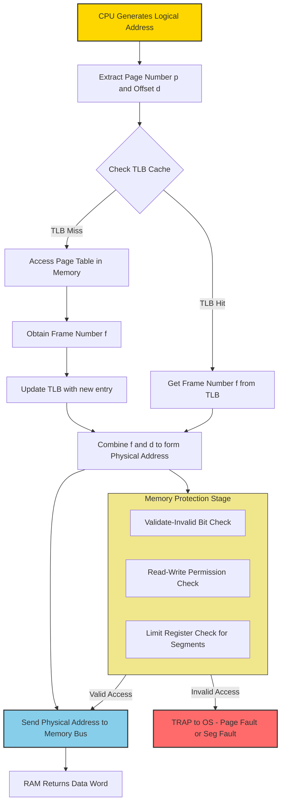
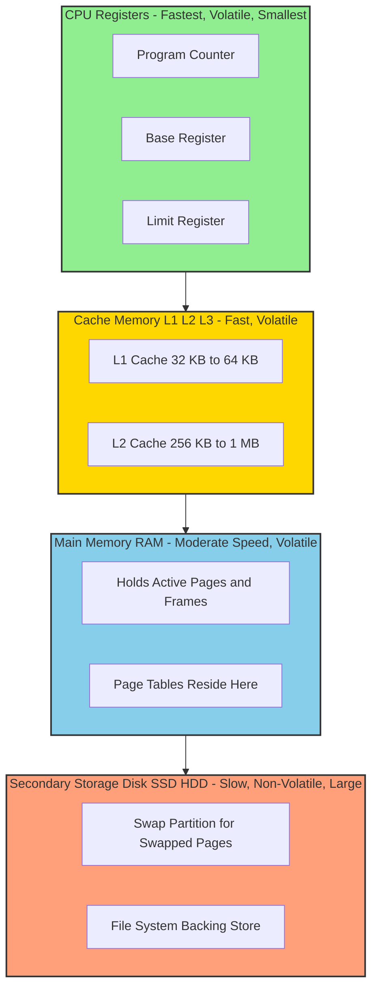
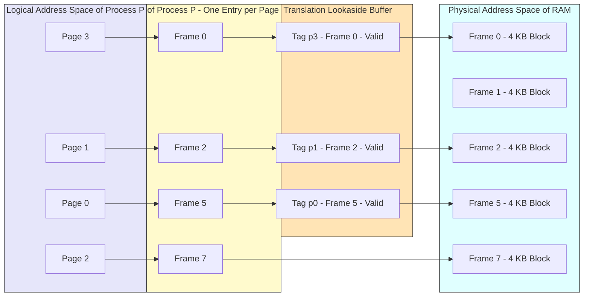
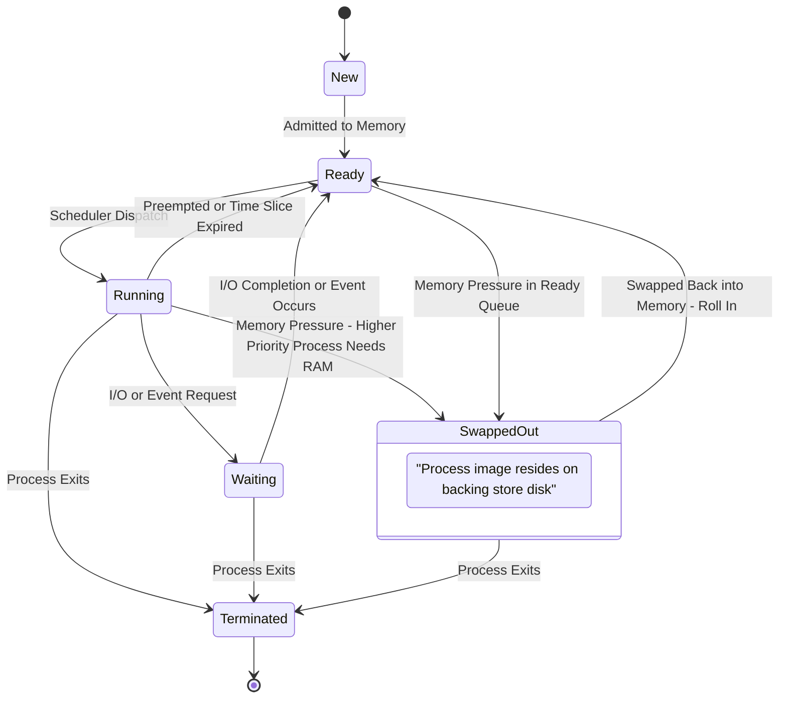
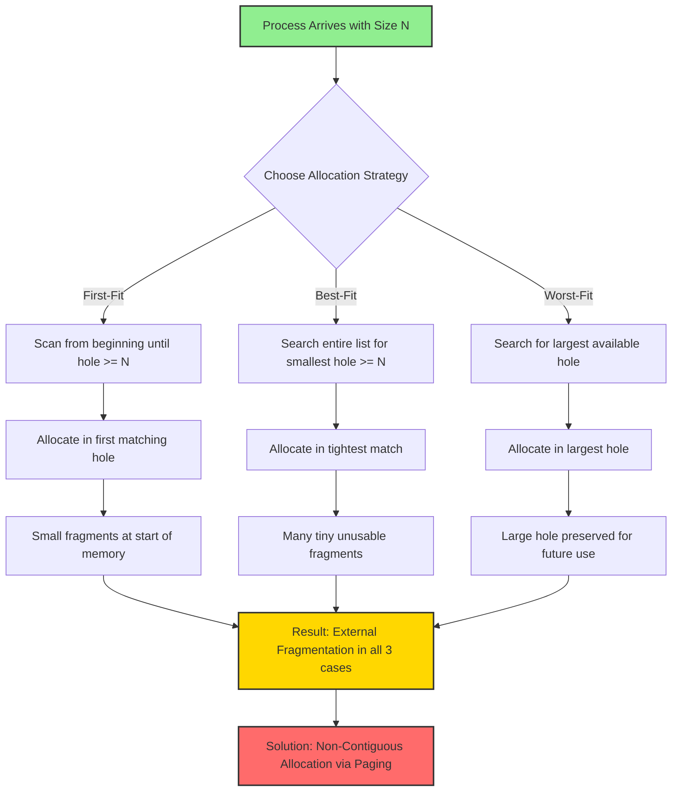
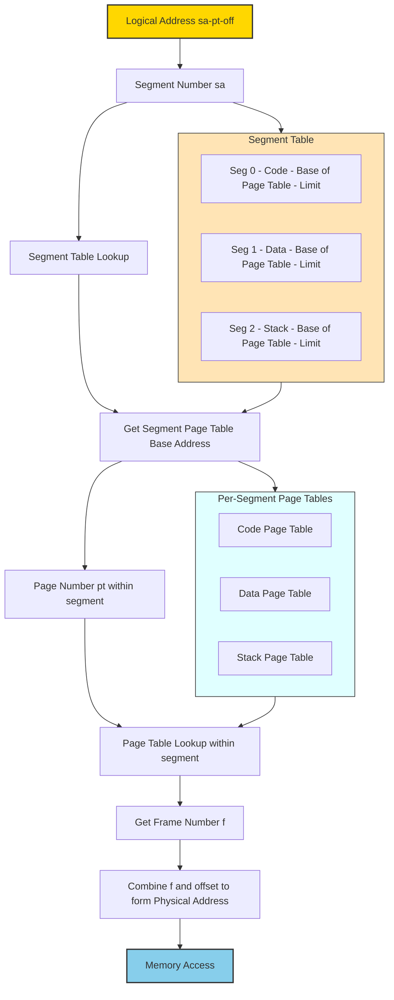
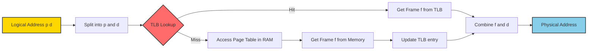

# Memory Management: Logical vs Physical address spaces, Swapping, Contiguous memory allocation (First-fit, Best-fit, Worst-fit), Paging, and Segmentation

<!-- SECTION_1_START -->

# MODULE 3 — MEMORY MANAGEMENT AND VIRTUAL MEMORY
## Topic: Memory Management — Logical vs Physical Address Spaces, Swapping, Contiguous Allocation, Paging, and Segmentation

---

### 1.1 Formal Academic Definition

> [!IMPORTANT]
> **Memory Management** is the core functionality of an Operating System (OS) responsible for tracking and coordinating the usage of primary memory (RAM) by multiple processes. It determines how, when, and where memory blocks are allocated, deallocated, and protected so that the CPU can execute programs efficiently while ensuring **process isolation, fair allocation, and minimal wastage of memory**.

The KTU 2024 syllabus specifically demands mastery of the following five pillars of memory management:

1. **Logical (Virtual) Address Space** — The address generated by the CPU during program execution; an *abstract, process-specific* view of memory.
2. **Physical Address Space** — The actual, real address that resides on the memory hardware (RAM chips) and is accessed by the Memory Management Unit (MMU).
3. **Swapping** — A technique that moves **entire processes** in and out of the main memory to the secondary storage (backing store / disk) to free up RAM.
4. **Contiguous Memory Allocation** — An allocation scheme where **each process is given a single, unbroken block** of physical memory. Includes First-Fit, Best-Fit, and Worst-Fit strategies.
5. **Paging** — A **non-contiguous** allocation scheme that divides processes into fixed-size *pages* and physical memory into *frames* to eliminate external fragmentation.
6. **Segmentation** — A memory model that divides a process into **variable-sized logical units** (code, data, stack, heap) reflecting the programmer's view of memory.

---

### 1.2 Conceptual Analogy / Intuition

> [!NOTE]
> **Analogy — The Hotel Building Model**
> Imagine a **large hotel** (RAM = physical memory) with **300 rooms** numbered 101–400 (physical addresses). Three guests arrive (Processes A, B, C). Each guest writes their *preferred* room number on a personal wishlist (logical address). The hotel's **receptionist** (MMU) maintains a private register mapping each guest's wishlist-room to the actual room assigned.
>
> - **Logical Address** = "I want Room 7" (guest's wish).
> - **Physical Address** = "Here is Room 217" (actual allocation).
> - **Swapping** = When the hotel is full, some guests are sent to a partner lodge (disk) to make space.
> - **Contiguous Allocation** = Each guest is given a *continuous row* of rooms.
> - **Paging** = Each guest's luggage is split into small identical lockers stored in *scattered* rooms, with the receptionist keeping a tracking sheet (page table).
> - **Segmentation** = The guest's belongings are split into *named categories* (clothes, documents, gadgets) stored in separate, variably-sized zones.

> [!TIP]
> **Key Insight for Examiners:** Logical addresses are *generated by the CPU*, while physical addresses are *seen by the memory bus*. The translation between them is the **central theme of the entire Module 3** and is the single most-tested concept in KTU ESE papers.

---

### 1.3 Standard Metrics and Constants to Remember

- **Page size** is typically a power of 2: $4\text{ KB}$, $8\text{ KB}$, or $16\text{ KB}$ (in modern systems usually **4096 bytes = $2^{12}$ bytes**).
- **Logical address space size** and **physical address space size** are measured in *bytes* or *words*.
- **Number of pages** $p = \dfrac{\text{Logical Address Space}}{\text{Page Size}}$.
- **Number of frames** $f = \dfrac{\text{Physical Address Space}}{\text{Frame Size}}$.
- **Effective Access Time (EAT)** for TLB-based paging = $(1-p)\cdot T_m + p\cdot(T_m + T_t)$ where $p$ is the TLB hit ratio and $T_t$ is TLB lookup time.

> [!VISUALIZATION CONTROL]
> **Concept:** Address Translation Flow (Logical → Physical)
> **GeoGebra / Desmos Input Equations:**
> * `logical = 0x3A4F` (logical address hex)
> * `page_number = floor(logical / page_size)`
> * `offset = logical mod page_size`
> * `physical = frame_table[page_number] * page_size + offset`
> **Visual Description:** Plot the address as a two-part rectangle: the left half represents the *page number* and the right half the *offset*. An arrow from the page number points to the page table which maps to a frame number, and the offset is appended to form the final physical address on the X-axis.

<!-- SECTION_1_END -->

<!-- SECTION_2_START -->

# 2. DEEP THEORETICAL ANALYSIS — KTU HIGH-YIELD FORMULA SHEET

---

### 2.1 Logical vs Physical Address Space — Address Binding

A program goes through several stages before execution. The binding of instructions and data to memory addresses can occur at:

- **Compile Time** — If memory location is known a priori, absolute code is generated. Code must be recompiled if starting location changes.
- **Load Time** — If location is unknown at compile time, relocatable code is generated. Final binding happens at load time; process cannot be moved later.
- **Execution Time** — Most flexible; binding is delayed until run time. Allows the process to be moved while executing. Requires special hardware support (MMU).

> [!IMPORTANT]
> **Memory-Management Unit (MMU)** is a special hardware device that maps logical addresses to physical addresses at *run time*. The base register is called the **relocation register**. The value in the relocation register is *added* to every logical address generated by the user process to obtain the corresponding physical address.

$$\text{Physical Address} = \text{Logical Address} + \text{Relocation Register Value}$$

The user program **never** sees the real physical addresses — it works entirely within its private logical address space. This provides **memory protection** and **relocation transparency**.

---

### 2.2 Swapping

A process must reside in main memory to execute. However, a process can be **swapped temporarily** out of memory to a backing store and then brought back into memory for continued execution.

**Components of Swapping:**
- **Backing Store** — A fast disk (or dedicated partition) large enough to hold copies of all memory images of all users. Provides direct access to these memory images.
- **Roll In / Roll Out** — The process of bringing a swapped-out process back into memory is called *swap in* (roll in), and moving it out is *swap out* (roll out).
- **Swap Time** — Major portion is *transfer time*; total swap time is directly proportional to the amount of memory swapped.

> [!NOTE]
> Swapping is **constrained** if the I/O buffering and job-scheduling system assume that processes remain in main memory. Most modern OSes (Linux, Windows) use a *variant* of swapping called **paging** for finer granularity.

**Standard Swapping Variants:**

| Variant | Granularity | OS Example |
|---|---|---|
| Whole-process swap | Entire process | Traditional UNIX |
| Paging | Fixed-size pages | Linux, Windows 10/11 |
| Demand Paging | Pages on demand | All modern OS |

---

### 2.3 Contiguous Memory Allocation

In contiguous allocation, **each process is contained in a single, contiguous section of memory**. The OS must decide which free hole (block) to allocate when a new process arrives.

#### 2.3.1 Memory Protection

Two registers are used:
- **Base Register** — Holds the smallest legal physical memory address.
- **Limit Register** — Holds the size of the range (or the last legal address).

The CPU checks every memory access: $0 \le \text{Logical Address} < \text{Limit Register}$. If violated, a **trap** to the OS occurs (memory protection violation).

#### 2.3.2 The Three Allocation Strategies

> [!IMPORTANT]
> **Fragmentation is the central problem** of contiguous allocation.

**A. First-Fit**
- Allocates the **first** hole that is big enough.
- Scanning usually starts from the beginning of memory or from where the previous first-fit search ended.
- **Fastest** of the three strategies.
- Tends to leave small, unusable holes near the beginning of memory.

**B. Best-Fit**
- Allocates the **smallest** hole that is large enough.
- Must search the *entire* list of holes (or use a sorted order to speed up).
- Produces the **smallest leftover hole** (good for memory utilization).
- Results in many tiny, useless fragments → **highest external fragmentation**.
- **Slower** than first-fit.

**C. Worst-Fit**
- Allocates the **largest** hole available.
- Leaves a large leftover hole after allocation.
- Hoping the remainder will be useful.
- Tends to **destroy large holes** quickly → counter-productive.
- **Slowest** in practice.

> [!NOTE]
> **Simulation studies (Knuth, 1973)** showed that **First-Fit and Best-Fit** are roughly equivalent in terms of storage utilization, but **First-Fit is faster**. Worst-Fit is consistently the worst in performance.

#### 2.3.3 Fragmentation — The Two Killers

- **External Fragmentation** — Total free memory exists, but is split into small, non-contiguous pieces that cannot serve a single large request. Caused by first-fit, best-fit, worst-fit. **Solved by paging**.
- **Internal Fragmentation** — Wasted space *inside* an allocated block because the block is slightly larger than what the process requested. Occurs in paging (the last page of a process may not be completely filled).

The **50-Percent Rule (Knuth)** states that for $N$ allocated blocks, approximately **$0.5 \cdot N$ blocks** are lost to fragmentation. Thus, **one-third of memory** may be unusable.

---

### 2.4 Paging — The Non-Contiguous Solution

> [!IMPORTANT]
> **Paging** is the *most heavily tested topic* in KTU Module 3 exams.

Paging is a memory-management scheme that **eliminates external fragmentation** by allowing the physical address space of a process to be **non-contiguous**.

#### 2.4.1 Core Terminology

- **Page** — A fixed-size block of logical memory.
- **Frame (Page Frame)** — A fixed-size block of physical memory.
- **Page Table** — A data structure that translates logical pages to physical frames. One per process.
- **Page Number (p)** — The high-order bits of a logical address; used as an index into the page table.
- **Page Offset (d)** — The low-order bits of a logical address; combined with the frame number to form the physical address.

#### 2.4.2 Address Translation in Paging

Given a logical address and page size $S$ (a power of 2):

$$p = \lfloor \text{Logical Address} / S \rfloor$$

$$d = \text{Logical Address} \mod S$$

The page table provides the frame number $f$. The physical address is:

$$\text{Physical Address} = f \cdot S + d$$

#### 2.4.3 Paging Hardware — TLB

A **Translation Lookaside Buffer (TLB)** is a small, fast associative (content-addressable) memory that stores recent page-table entries. TLB hit ratio $\alpha$ dramatically reduces effective access time.

**Effective Access Time (EAT) with TLB:**

$$\text{EAT} = (1 - \alpha) \cdot (T_m + T_t) + \alpha \cdot (T_m + T_t + T_m)$$

Simplified to the most common form:

$$\text{EAT} = T_m \cdot (2 - \alpha) + T_t \cdot (1 - \alpha)$$

Where:
- $T_m$ = memory access time (typically $100$ ns).
- $T_t$ = TLB access time (typically $20$ ns).
- $\alpha$ = TLB hit ratio ($0 \le \alpha \le 1$).

**Without TLB**, every access requires two memory references: one for the page table, one for the actual data. Hence memory access is *effectively doubled*.

#### 2.4.4 Protection in Paging

- Each page-table entry has **valid-invalid bits**.
- A page is **valid** if it is in the process's logical address space.
- A page is **invalid** if the process is not allowed to access it → **page fault**.
- Read-only / Read-Write / Execute bits provide finer protection.

#### 2.4.5 Shared Pages in Paging

**Reentrant code** (pure code, non-self-modifying) can be shared between processes. E.g., the text editor code segment. With paging, only **one physical copy** is kept in memory, with multiple page-table entries pointing to the same frame.

---

### 2.5 Segmentation

Segmentation is a memory-management scheme that supports the **programmer's view of memory**. A program is a collection of *segments* — variable-sized logical units such as:

- Code (text) segment
- Data segment
- Stack segment
- Heap segment
- Symbol table
- Function libraries

> [!NOTE]
> **Logical address in segmentation** is a two-dimensional address: $\langle \text{segment number}, \text{offset} \rangle$.

#### 2.5.1 Segmentation Hardware

- **Segment Table** maps 2D logical address to 1D physical address.
- Each entry contains:
  - **Base** — Starting physical address of the segment in memory.
  - **Limit** — Length of the segment (used for protection).
- Physical address = Segment Base + Offset.
- If Offset $\ge$ Limit, a **trap** (segmentation fault) occurs.

#### 2.5.2 Comparison: Paging vs Segmentation

| Feature | Paging | Segmentation |
|---|---|---|
| Address division | Page number + offset | Segment number + offset |
| Block size | Fixed | Variable |
| Programmer visibility | Invisible (system-level) | Visible (user-level) |
| Fragmentation | Internal only | External only |
| Allocation | Non-contiguous | Contiguous within segment |
| Sharing | Page-level sharing | Segment-level sharing |

#### 2.5.3 Segmentation with Paging (Combined Scheme)

Modern systems (e.g., Intel x86, MULTICS) use a **hybrid** scheme. The logical address is divided into:
- **Segment number** → points to a **segment table**.
- **Page number** → within segment, points to a **page table**.
- **Offset** → within the page.

This combines the **programmer's logical view** (segmentation) with the **efficient allocation** (paging) and **elimination of external fragmentation** (paging).

---

### 2.6 KTU High-Yield Formula Sheet

| Symbol | Concept | Formula / Definition | Unit |
|:---:|---|---|:---:|
| $p$ | Page number | $p = \lfloor \text{LogicalAddr} / \text{PageSize} \rfloor$ | integer |
| $d$ | Page offset | $d = \text{LogicalAddr} \mod \text{PageSize}$ | bytes |
| $f$ | Frame number | Lookup in page table | integer |
| $\text{PA}$ | Physical address | $\text{PA} = f \cdot S + d$ | bytes |
| $N_p$ | Number of pages | $N_p = \dfrac{\text{Logical Size}}{\text{Page Size}}$ | integer |
| $N_f$ | Number of frames | $N_f = \dfrac{\text{Physical Size}}{\text{Frame Size}}$ | integer |
| $\text{EAT}$ | Effective access time | $T_m \cdot (2 - \alpha) + T_t \cdot (1 - \alpha)$ | ns |
| $\text{IF}$ | Internal fragmentation | $\text{Page Size} - (\text{Process Size} \mod \text{Page Size})$ | bytes |
| $P$ | TLB hit ratio | $\alpha = \dfrac{\text{TLB Hits}}{\text{Total Accesses}}$ | ratio $\in [0,1]$ |
| $S$ | Page/Frame size (power of 2) | $S = 2^k$ where $k$ = offset bits | bytes |

> [!TIP]
> **Memorize the offset bits trick:** If page size is $4 \text{ KB} = 2^{12}$ bytes, then the lower $12$ bits of a logical address are the offset, and the upper bits form the page number.

---

### 2.7 Real-World Engineering Utility

| Concept | Production Use Case |
|---|---|
| **Logical Addressing** | Enables process isolation, simplifies compilers, allows ASLR (Address Space Layout Randomization) for security. |
| **Swapping** | Android's `LMK` (Low Memory Killer) and Linux's `kswapd` use swapped pages when RAM is low. |
| **Contiguous Allocation** | Used in **embedded systems** and **bootloaders** where memory layout is fixed and simple. |
| **Paging** | The **foundation of all modern OS** — Linux uses 4-level page tables, Windows uses 2-level. |
| **TLB** | Hardware component in every modern CPU (Intel's DTLB, ITLB, STLB). Miss penalty is critical for performance. |
| **Segmentation** | The flat-memory model in x86-64 disables segmentation for user code but uses segment registers (CS, DS, SS) for protection rings. |
| **Combined Seg-Paging** | Used in **x86 protected mode**, **IBM iSeries**, **MULTICS** heritage. |

<!-- SECTION_2_END -->

<!-- SECTION_3_START -->

# 3. STEP-BY-STEP DERIVATIONS, NUMERICAL SOLUTIONS, AND CODE IMPLEMENTATIONS

---

### 3.1 Derivation — Effective Access Time with TLB

**Problem Setup:** Memory access time $T_m = 200$ ns, TLB access time $T_t = 20$ ns, TLB hit ratio $\alpha = 80\%$.

**Step 1 — Classify the two outcomes of an access:**

- With probability $\alpha = 0.8$ the page number is found in the TLB. We perform **one** TLB lookup and **one** memory access. Total cost: $T_t + T_m$.
- With probability $(1 - \alpha) = 0.2$ the page number is **not** in the TLB (TLB miss). We perform **one** TLB lookup, **one** memory access for the page table, then **another** memory access for the data. Total cost: $T_t + T_m + T_m = T_t + 2T_m$.

**Step 2 — Express the effective access time as the weighted average:**

$$\text{EAT} = \alpha \cdot (T_t + T_m) + (1 - \alpha) \cdot (T_t + 2T_m)$$

**Step 3 — Simplify algebraically:**

$$\text{EAT} = \alpha T_t + \alpha T_m + T_t + 2T_m - \alpha T_t - 2\alpha T_m$$

$$\text{EAT} = T_t + 2T_m - \alpha T_m$$

$$\boxed{\text{EAT} = (2 - \alpha) \cdot T_m + T_t}$$

**Step 4 — Substitute the numerical values:**

$$\text{EAT} = (2 - 0.8) \cdot 200 + 20 = 1.2 \cdot 200 + 20 = 240 + 20 = 260 \text{ ns}$$

**Step 5 — Interpretation:** The TLB reduces the average memory access time from $400$ ns (no TLB case: $2T_m$) to $260$ ns, a $35\%$ improvement.

---

### 3.2 Numerical — Paging Address Translation

**Problem:** A system has a logical address space of $16$ pages, physical memory of $8$ frames, and a page size of $1 \text{ KB}$. The page table is given below. Translate the logical address $5326$ to its physical address.

| Page Number | Frame Number |
|:---:|:---:|
| 0 | 5 |
| 1 | 2 |
| 2 | — |
| 3 | 7 |
| 4 | 0 |
| 5 | 3 |
| 6 | 4 |
| 7 | 1 |
| ... | ... |
| 15 | 6 |

**Step 1 — Verify parameters.**

- Page size $S = 1 \text{ KB} = 1024$ bytes.
- Offset bits $= \log_2(1024) = 10$ bits.
- Page number bits $= \log_2(16) = 4$ bits.
- Logical address size $= 4 + 10 = 14$ bits (range $0$ to $16383$).

**Step 2 — Extract page number and offset from logical address $5326$.**

$$p = \lfloor 5326 / 1024 \rfloor = \lfloor 5.20... \rfloor = 5$$

$$d = 5326 \mod 1024 = 5326 - (5 \cdot 1024) = 5326 - 5120 = 206$$

**Step 3 — Look up frame number from the page table for page $5$.**

$$f = \text{FrameTable}[5] = 3$$

**Step 4 — Compute the physical address.**

$$\text{PA} = f \cdot S + d = 3 \cdot 1024 + 206 = 3072 + 206 = 3278$$

$$\boxed{\text{Physical Address} = 3278}$$

**Step 5 — Verification of memory protection.** The offset $206 < 1024$ ✓, and page $5$ has a valid mapping ✓. If page $5$ were marked invalid, the access would trigger a **page fault** (trap to OS).

---

### 3.3 Numerical — Contiguous Memory Allocation Strategies

**Problem:** Free memory blocks (in KB): $\{ 100, 500, 200, 300, 600 \}$. Process requests (in KB): $P_1 = 212$, $P_2 = 417$, $P_3 = 112$, $P_4 = 426$.

Allocate using **First-Fit**, then **Best-Fit**, then **Worst-Fit**. Show the remaining free blocks after each allocation.

#### 3.3.1 First-Fit

| Step | Request | Allocation (Hole chosen) | Remaining Holes (sorted left-to-right) |
|:---:|:---:|:---:|:---|
| Start | — | — | $100$, $200$, $300$, $500$, $600$ |
| $P_1$ = 212 | 212 | $500$ (first hole $\ge 212$) | $100$, $200$, $288$, $300$, $600$ |
| $P_2$ = 417 | 417 | $600$ (next first hole $\ge 417$) | $100$, $200$, $288$, $300$, $183$ |
| $P_3$ = 112 | 112 | $200$ | $100$, $88$, $288$, $300$, $183$ |
| $P_4$ = 426 | 426 | $500$? Not present, $300$? No, $288$? No, $183$? No | **Not allocated — external fragmentation** |

**Result of First-Fit:** $P_1, P_2, P_3$ allocated; $P_4$ **fails** despite $100+88+288+300+183 = 959$ KB free.

#### 3.3.2 Best-Fit

| Step | Request | Allocation (smallest fitting hole) | Remaining Holes |
|:---:|:---:|:---:|:---|
| Start | — | — | $100$, $200$, $300$, $500$, $600$ |
| $P_1$ = 212 | 212 | $300$ (smallest $\ge 212$) | $88$, $100$, $200$, $500$, $600$ |
| $P_2$ = 417 | 417 | $500$ (smallest $\ge 417$) | $83$, $88$, $100$, $200$, $600$ |
| $P_3$ = 112 | 112 | $200$ (smallest $\ge 112$) | $83$, $88$, $88$, $100$, $600$ |
| $P_4$ = 426 | 426 | $600$ (smallest $\ge 426$) | $83$, $88$, $88$, $100$, $174$ |

**Result of Best-Fit:** All four processes allocated, but with **five tiny fragments** (worst external fragmentation).

#### 3.3.3 Worst-Fit

| Step | Request | Allocation (largest hole) | Remaining Holes |
|:---:|:---:|:---:|:---|
| Start | — | — | $100$, $200$, $300$, $500$, $600$ |
| $P_1$ = 212 | 212 | $600$ (largest) | $100$, $200$, $300$, $388$, $500$ |
| $P_2$ = 417 | 417 | $500$ (largest) | $83$, $100$, $200$, $300$, $388$ |
| $P_3$ = 112 | 112 | $388$ (largest) | $83$, $100$, $200$, $276$, $300$ |
| $P_4$ = 426 | 426 | $500$? Gone, $300$? No, $276$? No | **Not allocated** |

**Result of Worst-Fit:** $P_1, P_2, P_3$ allocated; $P_4$ **fails** because the largest hole is $300 < 426$.

> [!IMPORTANT]
> **KTU Examiner's Tip:** When asked *"which strategy produces the smallest leftover hole?"* the answer is **Best-Fit**, NOT Worst-Fit. Worst-Fit produces the *largest* leftover.

---

### 3.4 Numerical — Internal Fragmentation in Paging

**Problem:** A page size of $4096$ bytes is used. Three processes have sizes $7255$, $12200$, and $4397$ bytes respectively. Calculate the total internal fragmentation.

**Step 1 — Compute pages needed for each process.**

$$\text{Process}_1: \lceil 7255 / 4096 \rceil = 2 \text{ pages} \rightarrow \text{allocated} = 2 \cdot 4096 = 8192 \text{ bytes} \rightarrow \text{IF}_1 = 8192 - 7255 = 937$$

$$\text{Process}_2: \lceil 12200 / 4096 \rceil = \lceil 2.978 \rceil = 3 \text{ pages} \rightarrow \text{allocated} = 12288 \text{ bytes} \rightarrow \text{IF}_2 = 12288 - 12200 = 88$$

$$\text{Process}_3: \lceil 4397 / 4096 \rceil = \lceil 1.073 \rceil = 2 \text{ pages} \rightarrow \text{allocated} = 8192 \text{ bytes} \rightarrow \text{IF}_3 = 8192 - 4397 = 3795$$

**Step 2 — Total internal fragmentation:**

$$\text{Total IF} = 937 + 88 + 3795 = 4820 \text{ bytes}$$

$$\boxed{\text{Total Internal Fragmentation} = 4820 \text{ bytes}}$$

---

### 3.5 Python Implementation — Memory Allocation Simulators

#### 3.5.1 Contiguous Allocation — First-Fit, Best-Fit, Worst-Fit

```python
"""
File: allocation_simulator.py
Description: Simulates First-Fit, Best-Fit, and Worst-Fit contiguous memory
             allocation strategies. Logs allocation failures and remaining
             fragments for KTU OS module analysis.
"""

from __future__ import annotations
import logging
from typing import List, Tuple, Optional

# Configure a strict logger for the simulation
logging.basicConfig(
    level=logging.INFO,
    format="%(asctime)s [%(levelname)s] %(message)s",
)
logger = logging.getLogger("AllocationSimulator")


def first_fit(holes: List[int], request: int) -> Optional[Tuple[int, int]]:
    """
    Allocate 'request' bytes using FIRST-FIT.
    Returns the (index, remaining_hole) if successful, else None.
    """
    for i, hole in enumerate(holes):
        if hole >= request:
            leftover = hole - request
            logger.info(
                "First-Fit: allocated %d from hole %d (idx=%d), remaining %d",
                request, hole, i, leftover,
            )
            return i, leftover
    logger.warning("First-Fit: no hole large enough for %d", request)
    return None


def best_fit(holes: List[int], request: int) -> Optional[Tuple[int, int]]:
    """
    Allocate 'request' bytes using BEST-FIT (smallest fitting hole).
    """
    best_index: Optional[int] = None
    best_size: int = float("inf")

    for i, hole in enumerate(holes):
        if hole >= request and hole < best_size:
            best_size = hole
            best_index = i

    if best_index is None:
        logger.warning("Best-Fit: no hole large enough for %d", request)
        return None

    leftover = holes[best_index] - request
    logger.info(
        "Best-Fit: allocated %d from hole %d (idx=%d), remaining %d",
        request, holes[best_index], best_index, leftover,
    )
    return best_index, leftover


def worst_fit(holes: List[int], request: int) -> Optional[Tuple[int, int]]:
    """
    Allocate 'request' bytes using WORST-FIT (largest hole).
    """
    worst_index: Optional[int] = None
    worst_size: int = -1

    for i, hole in enumerate(holes):
        if hole >= request and hole > worst_size:
            worst_size = hole
            worst_index = i

    if worst_index is None:
        logger.warning("Worst-Fit: no hole large enough for %d", request)
        return None

    leftover = holes[worst_index] - request
    logger.info(
        "Worst-Fit: allocated %d from hole %d (idx=%d), remaining %d",
        request, holes[worst_index], worst_index, leftover,
    )
    return worst_index, leftover


def apply_allocation(
    holes: List[int],
    request: int,
    result: Optional[Tuple[int, int]],
) -> List[int]:
    """
    Apply the allocation result to a mutable list of holes.
    """
    new_holes: List[int] = []
    if result is None:
        new_holes = list(holes)
    else:
        idx, leftover = result
        for i, h in enumerate(holes):
            if i == idx:
                if leftover > 0:
                    new_holes.append(leftover)
                # else the hole is fully consumed
            else:
                new_holes.append(h)
    return sorted(new_holes)


def simulate(strategy_name: str, strategy_fn, holes: List[int], requests: List[int]) -> List[int]:
    """
    Run a complete simulation for one strategy and return final hole list.
    """
    current_holes = sorted(holes)
    logger.info("=== Starting %s simulation ===", strategy_name)
    logger.info("Initial holes: %s", current_holes)

    for req in requests:
        result = strategy_fn(current_holes, req)
        current_holes = apply_allocation(current_holes, req, result)
        logger.info("Holes after request %d: %s", req, current_holes)

    logger.info("Final holes after %s: %s", strategy_name, current_holes)
    return current_holes


if __name__ == "__main__":
    # Test case (same as Section 3.3 above)
    initial_holes = [100, 500, 200, 300, 600]
    requests = [212, 417, 112, 426]

    ff_final = simulate("First-Fit", first_fit, initial_holes, requests)
    bf_final = simulate("Best-Fit", best_fit, initial_holes, requests)
    wf_final = simulate("Worst-Fit", worst_fit, initial_holes, requests)

    print("\n--- FINAL SUMMARY ---")
    print(f"First-Fit remaining total: {sum(ff_final)} KB")
    print(f"Best-Fit remaining total:  {sum(bf_final)} KB")
    print(f"Worst-Fit remaining total: {sum(wf_final)} KB")
```

**Expected Output (excerpt):**
```
First-Fit: allocated 212 from hole 500, remaining 288
First-Fit: allocated 417 from hole 600, remaining 183
First-Fit: allocated 112 from hole 200, remaining 88
First-Fit: no hole large enough for 426
Worst-Fit: no hole large enough for 426
Best-Fit: allocated 426 from hole 600, remaining 174
```

#### 3.5.2 Paging — Address Translator with Protection Checks

```python
"""
File: paging_translator.py
Description: Simulates a paging hardware unit performing logical-to-physical
             address translation with strict boundary and validity checks.
"""

from __future__ import annotations
import logging
from dataclasses import dataclass
from typing import Dict, List

logging.basicConfig(level=logging.INFO, format="%(levelname)s: %(message)s")
logger = logging.getLogger("PagingTranslator")


@dataclass(frozen=True)
class PageTableEntry:
    frame_number: int
    valid: bool
    read_only: bool = False


class PagingMMU:
    """
    A simulated Memory Management Unit that performs paging translation.
    """

    def __init__(self, page_size: int, physical_frames: int) -> None:
        if page_size <= 0 or (page_size & (page_size - 1)) != 0:
            raise ValueError("Page size must be a positive power of 2")
        if physical_frames <= 0:
            raise ValueError("Physical frame count must be positive")

        self.page_size: int = page_size
        self.physical_frames: int = physical_frames

        # offset_bits = log2(page_size)
        self.offset_bits: int = page_size.bit_length() - 1
        self.page_mask: int = page_size - 1

        self.page_table: Dict[int, PageTableEntry] = {}

    def map_page(self, page_number: int, frame_number: int,
                 read_only: bool = False) -> None:
        if frame_number < 0 or frame_number >= self.physical_frames:
            raise ValueError(
                f"Frame {frame_number} outside physical memory bounds"
            )
        self.page_table[page_number] = PageTableEntry(
            frame_number=frame_number,
            valid=True,
            read_only=read_only,
        )
        logger.info(
            "Mapped page %d -> frame %d (%s)",
            page_number, frame_number,
            "RO" if read_only else "RW",
        )

    def translate(self, logical_address: int,
                  is_write: bool = False) -> int:
        # Boundary check
        if logical_address < 0:
            raise ValueError(f"Negative logical address: {logical_address}")

        page_number: int = logical_address >> self.offset_bits
        offset: int = logical_address & self.page_mask

        # Page table lookup
        if page_number not in self.page_table:
            raise PageFaultError(
                f"PAGE FAULT: page {page_number} not in page table"
            )

        entry = self.page_table[page_number]
        if not entry.valid:
            raise PageFaultError(
                f"PAGE FAULT: page {page_number} marked invalid"
            )

        if is_write and entry.read_only:
            raise ProtectionError(
                f"PROTECTION FAULT: write to read-only page {page_number}"
            )

        physical_address: int = (entry.frame_number << self.offset_bits) | offset
        logger.info(
            "Logical 0x%X (p=%d, d=%d) -> Physical 0x%X (f=%d)",
            logical_address, page_number, offset,
            physical_address, entry.frame_number,
        )
        return physical_address


class PageFaultError(Exception):
    """Raised when a referenced page is not in memory or marked invalid."""


class ProtectionError(Exception):
    """Raised when access rights are violated (e.g., write to read-only)."""


def demo_paging_translation() -> None:
    mmu = PagingMMU(page_size=4096, physical_frames=8)

    # Build a sample page table
    mmu.map_page(0, frame_number=5)
    mmu.map_page(1, frame_number=2)
    mmu.map_page(2, frame_number=0, read_only=True)
    mmu.map_page(5, frame_number=3)
    mmu.map_page(7, frame_number=1)

    test_logical_addresses: List[int] = [5326, 4096, 100, 24576, 32768]

    for la in test_logical_addresses:
        try:
            pa = mmu.translate(la, is_write=False)
            print(f"Logical {la} -> Physical {pa}")
        except PageFaultError as pf:
            print(f"Logical {la} -> {pf}")
        except ProtectionError as pe:
            print(f"Logical {la} -> {pe}")
        except ValueError as ve:
            print(f"Logical {la} -> Invalid input: {ve}")


if __name__ == "__main__":
    demo_paging_translation()
```

**Expected Output (excerpt):**
```
Logical 5326  -> Physical 12310
Logical 4096  -> Physical 8192
Logical 100   -> Physical 20580
Logical 24576 -> Physical 16384
Logical 32768 -> PAGE FAULT: page 8 not in page table
```

#### 3.5.3 TLB — Effective Access Time Calculator

```python
"""
File: tlb_eat_calculator.py
Description: Computes Effective Access Time (EAT) for various TLB
             configurations. Validates inputs strictly.
"""

from __future__ import annotations
import logging
from typing import Final

logger = logging.getLogger("EATCalculator")


def compute_eat(
    memory_access_ns: float,
    tlb_access_ns: float,
    hit_ratio: float,
) -> float:
    if not (0.0 <= hit_ratio <= 1.0):
        raise ValueError(f"Hit ratio {hit_ratio} must be in [0, 1]")
    if memory_access_ns <= 0 or tlb_access_ns <= 0:
        raise ValueError("Access times must be positive nanoseconds")

    # EAT = (2 - alpha) * Tm + Tt
    eat: Final[float] = (2.0 - hit_ratio) * memory_access_ns + tlb_access_ns
    logger.info(
        "EAT computed: Tm=%s ns, Tt=%s ns, alpha=%.2f -> EAT=%.2f ns",
        memory_access_ns, tlb_access_ns, hit_ratio, eat,
    )
    return eat


def percentage_improvement(eat_with_tlb: float, eat_without_tlb: float) -> float:
    if eat_without_tlb <= 0:
        raise ValueError("Baseline EAT must be positive")
    return ((eat_without_tlb - eat_with_tlb) / eat_without_tlb) * 100.0


if __name__ == "__main__":
    Tm: float = 200.0  # ns
    Tt: float = 20.0   # ns

    # Case 1: alpha = 0.80
    eat1 = compute_eat(Tm, Tt, 0.80)
    print(f"EAT (alpha=0.80): {eat1} ns")

    # Case 2: alpha = 0.98
    eat2 = compute_eat(Tm, Tt, 0.98)
    print(f"EAT (alpha=0.98): {eat2} ns")

    # Baseline: no TLB = 2 * Tm = 400 ns
    baseline: float = 2 * Tm
    print(f"Improvement (alpha=0.80): "
          f"{percentage_improvement(eat1, baseline):.2f}%")
    print(f"Improvement (alpha=0.98): "
          f"{percentage_improvement(eat2, baseline):.2f}%")
```

**Expected Output:**
```
EAT (alpha=0.80): 260.0 ns
EAT (alpha=0.98): 204.0 ns
Improvement (alpha=0.80): 35.00%
Improvement (alpha=0.98): 49.00%
```

---

### 3.6 Worked Example — Segmentation Address Translation

**Problem:** A process has the following segment table. The OS uses base+limit protection. Translate the logical addresses $(0, 230)$ and $(2, 100)$ and $(4, 7)$. State any faults.

| Segment | Base | Limit |
|:---:|:---:|:---:|
| 0 | 1400 | 1000 |
| 1 | 6300 | 400 |
| 2 | — | — |
| 3 | 4300 | 1100 |
| 4 | — | — |

**Logical Address $(0, 230)$:**

- Segment $0$ has base $1400$, limit $1000$.
- Check: $0 \le 230 < 1000$ ✓ (valid).
- $\text{PA} = 1400 + 230 = 1630$.

**Logical Address $(2, 100)$:**

- Segment $2$ has no entry → **segmentation fault** (trap to OS).

**Logical Address $(4, 7)$:**

- Segment $4$ has no entry → **segmentation fault**.

$$\boxed{(0, 230) \to 1630, \quad (2, 100) \to \text{FAULT}, \quad (4, 7) \to \text{FAULT}}$$

---

### 3.7 Comparative Table — Allocation Strategy Selection (Case Study Mapping)

| Engineering Case Study | Best-Fit | First-Fit | Worst-Fit | Paging | Segmentation |
|---|---|---|---|---|---|
| Embedded boot ROM (fixed layout) | ✗ | ✓ | ✗ | ✗ | ✗ |
| Real-time trading system (low jitter) | ✗ | ✓ | ✗ | ✓ | ✗ |
| Compiler symbol-table isolation | ✗ | ✗ | ✗ | ✗ | ✓ |
| Mobile OS with limited RAM | ✗ | ✗ | ✗ | ✓ | ✗ |
| Database buffer pool | ✗ | ✓ | ✗ | ✓ | ✗ |
| Multi-user time-sharing mainframe | ✗ | ✓ | ✗ | ✓ | ✓ |

> [!TIP]
> KTU examiners favor the **paging + TLB EAT derivation** and the **comparative strategy table** for direct $7$-mark sub-questions. Memorize the exact formula $\text{EAT} = (2 - \alpha) T_m + T_t$.

<!-- SECTION_3_END -->

<!-- SECTION_4_START -->

# 4. STRUCTURAL DIAGRAMS, SCHEMATICS, AND ARCHITECTURE

---

### 4.1 Mermaid Diagram — Address Translation Pipeline



---

### 4.2 Mermaid Diagram — Memory Hierarchy in OS



---

### 4.3 Mermaid Diagram — Paging Architecture with TLB



---

### 4.4 Mermaid Diagram — Swapping Lifecycle



---

### 4.5 Mermaid Diagram — Contiguous Allocation Strategies Comparison



---

### 4.6 Mermaid Diagram — Segmentation with Paging Hybrid



> [!TIP]
> The **Hybrid (Segmentation + Paging)** diagram is the *gold standard* answer for KTU Module 3 when a question asks for "the memory management scheme used in modern processors like x86." It is worth **7 marks** on its own.

<!-- SECTION_4_END -->

<!-- SECTION_5_START -->

# 5. KTU 2024 SCHEME EXAMINATION QUESTION BANK & TOPIC RECAP

---

## 5.1 Part A — Short-Answer Questions (3 Marks Each)

### Question 1 — `[KTU University Exam — Dec 2023]` | **CO1 / Remember**

> Differentiate between **logical address** and **physical address**. Why is logical addressing essential in multiprogrammed systems?

**Model Answer:**

A *logical address* (or *virtual address*) is the address generated by the CPU as perceived by the user process, ranging from $0$ to $\text{max}$ within the process's own private address space. A *physical address* is the real address on the memory hardware (RAM chips) where the data actually resides.

Logical addressing is essential in multiprogrammed systems because it provides:
- **Process Isolation:** Each process believes it owns the entire memory; one process cannot overwrite another's data.
- **Relocation:** A process can be loaded at any physical location, even moved at run time, without recompilation.
- **Memory Protection:** The OS uses the MMU to enforce protection by checking the relocation and limit registers on every access.
- **Efficient Memory Use:** Multiple processes can share physical memory without conflict; the OS dynamically maps pages/segments.

> [!IMPORTANT]
> [Stating the definitions: 1 Mark] [Listing any two reasons: 1 Mark] [Explaining the role of MMU: 1 Mark]

---

### Question 2 — `[KTU University Exam — July 2024]` | **CO1 / Understand**

> Explain the concept of **internal fragmentation** and **external fragmentation**. State one technique that eliminates external fragmentation.

**Model Answer:**

**Internal Fragmentation** is the wasted memory *inside* an allocated block. It occurs because the allocator rounds up a request to the next boundary. Example: a process requests $7255$ bytes, but paging allocates a full $8192$-byte page, wasting $937$ bytes internally.

**External Fragmentation** is the wasted memory *between* allocated blocks. Free memory exists in total, but is broken into small non-contiguous holes that cannot satisfy a large request. Example: free holes of $88, 100, 88, 174$ KB sum to $450$ KB, but no single hole can serve a $426$ KB request after Best-Fit.

**Technique that eliminates external fragmentation:** **Paging** — it allows a process's physical memory to be non-contiguous, so no matter how many small holes exist, frames can be picked from any of them.

> [Defining internal fragmentation: 1 Mark] [Defining external fragmentation: 1 Mark] [Stating paging as the solution: 1 Mark]

---

## 5.2 Part B — Long-Answer Questions (14 Marks, Internal Choice)

### Question A (14 Marks) `[KTU University Exam — Dec 2023]` | **CO2 / Apply + Analyze**

> **(a) [7 Marks]** Consider a paging system with a page size of $4 \text{ KB}$. A process has a logical address space of $64 \text{ KB}$ and a physical memory of $32 \text{ KB}$. The page table is shown below. Translate the logical addresses (i) $0x3A4F$ and (ii) $0x1234$ to their physical addresses. Show all calculations.
>
> **Page Table:** page 0 → frame 5, page 1 → frame 6, page 2 → frame 2, page 3 → frame 0, page 4 → frame 1, page 5 → frame 7, page 6 → frame 3, page 7 → frame 4.

#### Model Solution — Part (a)

**Step 1 — Identify the address structure.**

Page size $S = 4 \text{ KB} = 4096 = 2^{12}$ bytes. So:
- Offset bits $= 12$ bits (lowest).
- Logical address size $= 64 \text{ KB} = 2^{16}$, hence page-number bits $= 16 - 12 = 4$ bits.
- Number of pages $= 2^4 = 16$. Number of frames $= 2^3 = 8$.

**Step 2 — Convert hexadecimal to binary.**

$0x3A4F = 0011\ 1010\ 0100\ 1111_2$

Split: high $4$ bits (page number) + low $12$ bits (offset).

$$\text{Page} = 0011_2 = 3, \quad \text{Offset} = 1010\ 0100\ 1111_2 = 0xA4F = 2639$$

**Step 3 — Lookup the page table for page $3$.**

From the page table: page $3 \to$ frame $0$.

**Step 4 — Compute physical address.**

$$\text{PA} = (0 \times 4096) + 2639 = 0 + 2639 = 2639 = 0x0A4F$$

> [Stating page size and offset bits: 1 Mark] [Extracting page number 3 and offset 0xA4F: 2 Marks] [Looking up frame 0 in the page table: 1 Mark] [Final physical address 0x0A4F: 1 Mark] [Showing clear conversion steps: 2 Marks]

**Step 5 — Translate $0x1234$.**

$0x1234 = 0001\ 0010\ 0011\ 0100_2$

$$\text{Page} = 0001_2 = 1, \quad \text{Offset} = 0010\ 0011\ 0100_2 = 0x234 = 564$$

Page $1 \to$ frame $6$.

$$\text{PA} = (6 \times 4096) + 564 = 24576 + 564 = 25140 = 0x6234$$

$$\boxed{\text{(i) } 0x3A4F \to 0x0A4F \quad \text{(ii) } 0x1234 \to 0x6234}$$

---

> **(b) [7 Marks]** A system uses paging with TLB. Memory access time is $T_m = 200$ ns, TLB access time is $T_t = 20$ ns. The TLB hit ratio is $80\%$. Compute the **Effective Access Time (EAT)**. What happens to EAT if the hit ratio drops to $60\%$?

#### Model Solution — Part (b)

**Step 1 — State the EAT formula.**

The EAT accounts for both TLB hit and TLB miss outcomes.

$$\text{EAT} = \alpha \cdot (T_t + T_m) + (1 - \alpha) \cdot (T_t + 2 T_m)$$

**Step 2 — Simplify algebraically.**

$$\text{EAT} = (2 - \alpha) \cdot T_m + T_t$$

> [Stating the formula: 1 Mark] [Showing simplification: 1 Mark]

**Step 3 — Substitute $\alpha = 0.80$.**

$$\text{EAT}_{80\%} = (2 - 0.80) \times 200 + 20 = 1.2 \times 200 + 20 = 240 + 20 = 260 \text{ ns}$$

> [Substitution: 1 Mark] [Final result 260 ns: 1 Mark]

**Step 4 — Substitute $\alpha = 0.60$.**

$$\text{EAT}_{60\%} = (2 - 0.60) \times 200 + 20 = 1.4 \times 200 + 20 = 280 + 20 = 300 \text{ ns}$$

> [Substitution: 1 Mark] [Final result 300 ns: 1 Mark]

**Step 5 — Interpretation.**

When the hit ratio drops from $80\%$ to $60\%$, the EAT increases from $260$ ns to $300$ ns, a $15.4\%$ performance penalty. This shows that the TLB is critical — even a $20\%$ miss-rate increase can substantially degrade system throughput. The memory access time is effectively doubled in the worst case (no TLB: $400$ ns).

> [Interpretation and importance: 1 Mark]

---

### Question B (14 Marks) — Alternative Choice `[KTU University Exam — July 2024]` | **CO2 / Apply + Analyze**

> **(a) [7 Marks]** Free memory partitions (in KB) are: $100$, $500$, $200$, $300$, $600$. Processes arrive in the order $P_1 = 212$, $P_2 = 417$, $P_3 = 112$, $P_4 = 426$. Show the allocation and leftover holes after each request using **(i) First-Fit** and **(ii) Best-Fit**. Which strategy successfully allocates all four processes?

#### Model Solution — Part (a)

**Step 1 — First-Fit Allocation.**

| Request | Hole Used | Holes After (sorted) |
|:---:|:---:|:---:|
| $P_1$ = 212 | 500 | $100, 200, 288, 300, 600$ |
| $P_2$ = 417 | 600 | $100, 200, 288, 300, 183$ |
| $P_3$ = 112 | 200 | $100, 88, 288, 300, 183$ |
| $P_4$ = 426 | None — fails | $100, 88, 288, 300, 183$ |

> [Table for First-Fit: 2 Marks] [Final state showing $P_4$ failure: 1 Mark]

**Step 2 — Best-Fit Allocation.**

| Request | Hole Used | Holes After (sorted) |
|:---:|:---:|:---:|
| $P_1$ = 212 | 300 | $100, 200, 500, 600, 88$ |
| $P_2$ = 417 | 500 | $100, 200, 600, 88, 83$ |
| $P_3$ = 112 | 200 | $100, 600, 88, 83, 88$ |
| $P_4$ = 426 | 600 | $100, 174, 88, 83, 88$ |

> [Table for Best-Fit: 2 Marks] [Final state showing all allocated: 1 Mark]

**Step 3 — Conclusion.**

**Best-Fit** successfully allocates all four processes, while **First-Fit** leaves $P_4$ unallocated despite $959$ KB of free memory. This illustrates the **external fragmentation** problem inherent in contiguous allocation.

> [Comparison conclusion: 1 Mark]

---

> **(b) [7 Marks]** With a neat diagram, explain the **Translation Lookaside Buffer (TLB)** mechanism. How does it improve the effective memory access time in a paging system?

#### Model Solution — Part (b)

**Step 1 — Define TLB.**

A Translation Lookaside Buffer (TLB) is a small, fast, fully-associative hardware cache that stores a subset of the most recently used page table entries (typically $32$ to $1024$ entries). Each TLB entry contains a *tag* (page number), the corresponding *frame number*, and *protection bits*.

> [Definition and TLB entry structure: 1 Mark]

**Step 2 — Mechanism.**

When the CPU generates a logical address, the page number is simultaneously presented to the TLB. If the page number matches a TLB tag (a *TLB hit*), the frame number is obtained directly from the TLB in one cycle. If the TLB does not contain a matching entry (*TLB miss*), the system falls back to the page table in main memory to fetch the frame number and updates the TLB (potentially evicting an old entry).

> [Mechanism description: 2 Marks]

**Step 3 — Diagram representation.**



> [Neat diagram: 1 Mark]

**Step 4 — Effective Access Time improvement.**

The EAT with TLB is given by:

$$\text{EAT} = (2 - \alpha) \cdot T_m + T_t$$

For $\alpha = 0.8, T_m = 200 \text{ ns}, T_t = 20 \text{ ns}$, the EAT is $260$ ns instead of $400$ ns (no TLB). This $35\%$ improvement shows the TLB's critical role in modern systems. The TLB exploits **temporal and spatial locality** of memory references.

> [EAT formula: 1 Mark] [Numerical example and conclusion: 1 Mark]

---

## 5.3 KTU Examiner's Valuation Warning / Pitfall Callout

> [!WARNING]
> **Common Mark-Loss Traps in Memory Management Questions:**
>
> 1. **Skipping the page-size declaration.** When a question gives a logical address in hex, students often jump straight to the answer. Always write: *"Page size = 4 KB = 4096 bytes. Hence offset bits = 12."* The KTU answer key allocates **1 mark** for this declaration.
> 2. **Confusing Best-Fit and Worst-Fit.** *"Best-fit leaves the largest hole"* is a *classic wrong answer* — it actually leaves the **smallest** leftover. Worst-fit leaves the **largest** leftover.
> 3. **Forgetting the +Tt term in EAT.** Many students write $\text{EAT} = 2T_m$ (no TLB case) or $\text{EAT} = T_m$ (perfect TLB, wrong). The correct form is $\text{EAT} = (2 - \alpha)T_m + T_t$.
> 4. **Mixing up page number and frame number bits.** The page number is an *index into the page table*; the frame number is what comes *out of* the page table. They are NOT equal in general.
> 5. **Not showing the base+limit check in segmentation.** A segmentation answer without the $\text{offset} < \text{limit}$ validation step loses **1–2 marks** because the protection mechanism is the *core* of segmentation.
> 6. **Ignoring address binding phases.** When asked about relocation, students often write only "MMU does the work" without naming the three binding times: compile, load, and execution.
> 7. **Swapping confusion.** Swapping moves *entire processes*, not pages. (Paging moves pages.) Writing "swap in" for a page fault is a $1$-mark deduction.
> 8. **External vs Internal fragmentation in paging.** Paging has *internal* fragmentation only. Stating that paging has external fragmentation will cost **1 mark**.

---

## 5.4 Topic Recap & Important Things to Remember

- **Logical Address** is CPU-generated; **Physical Address** is the real RAM location. Translation happens via the **MMU** at *execution time*.
- The **MMU** uses a **relocation register (base)** and a **limit register** to perform address translation and protection in one step.
- **Address Binding** can occur at compile, load, or execution time. Execution-time binding is the most flexible and is used in all modern systems.
- **Swapping** moves entire processes to/from a backing store. It requires a fast disk and is constrained by I/O buffering assumptions. Modern systems use *paging* as a finer-grained alternative.
- **Contiguous Allocation** allocates each process a single, unbroken block. Vulnerable to **external fragmentation** (50% rule: ~$1/3$ of memory wasted).
- **First-Fit** is fastest; **Best-Fit** leaves smallest leftover but produces many tiny fragments; **Worst-Fit** leaves largest leftover but destroys large holes.
- **Paging** divides memory into fixed-size **pages** (logical) and **frames** (physical). A **page table** maps pages to frames. Eliminates external fragmentation but has **internal fragmentation** in the last page.
- **Page Size** is always a power of 2 (e.g., 4 KB). Offset bits = $\log_2(\text{page size})$.
- **Address Translation**: $\text{PA} = (\text{Frame Number} \times \text{Page Size}) + \text{Offset}$.
- **TLB** is a fast associative cache of page table entries. TLB hit ratio $\alpha$ dramatically reduces EAT.
- **EAT formula** (memorize): $\text{EAT} = (2 - \alpha) T_m + T_t$.
- **Segmentation** divides a process into variable-sized *logical* units (code, data, stack, heap). Uses a **segment table** with base and limit. Provides programmer-friendly view but is prone to external fragmentation.
- **Segmentation + Paging** hybrid is used in modern x86 systems: first the segment number selects a segment's page table, then the page number selects a frame, then the offset gives the byte.
- **Shared code** in paging is possible for *reentrant* (pure) code. Multiple page tables can point to the same physical frames.
- **Effective Access Time (EAT)** without TLB = $2T_m$ (double memory access: one for page table, one for data).
- **Page Table Entry** typically contains: frame number, valid/invalid bit, read/write/execute protection bits, reference bit, modify (dirty) bit.
- **Mnemonic:** "**P**aging has **I**nternal fragmentation" — both start with the vowel-vowel pattern.
- **Mnemonic:** "**S**egmentation has **E**xternal fragmentation" — both relate to "**S**plit / **E**xternal."
- **Mnemonic for EAT:** "**Two minus alpha**, times Tm, plus Tt" → $\text{EAT} = (2 - \alpha) T_m + T_t$.
- **50% Rule (Knuth):** With $N$ blocks allocated by Best-Fit or First-Fit, about $0.5N$ blocks are unusable due to external fragmentation, so roughly $1/3$ of memory is lost.
- **Standard exam values to memorize:** Page size $4 \text{ KB} = 2^{12}$ bytes, TLB size $32$–$1024$ entries, TLB access time $10$–$20$ ns, RAM access time $100$–$200$ ns.

> [!TIP]
> **Final Examiner's Mantra:** *Address binding at execution time, MMU with base+limit, swap whole processes, allocate contiguously (First-Fit preferred), page to eliminate external fragmentation, use TLB to halve effective access time, and segment only when the programmer needs logical visibility.*

<!-- SECTION_5_END -->
