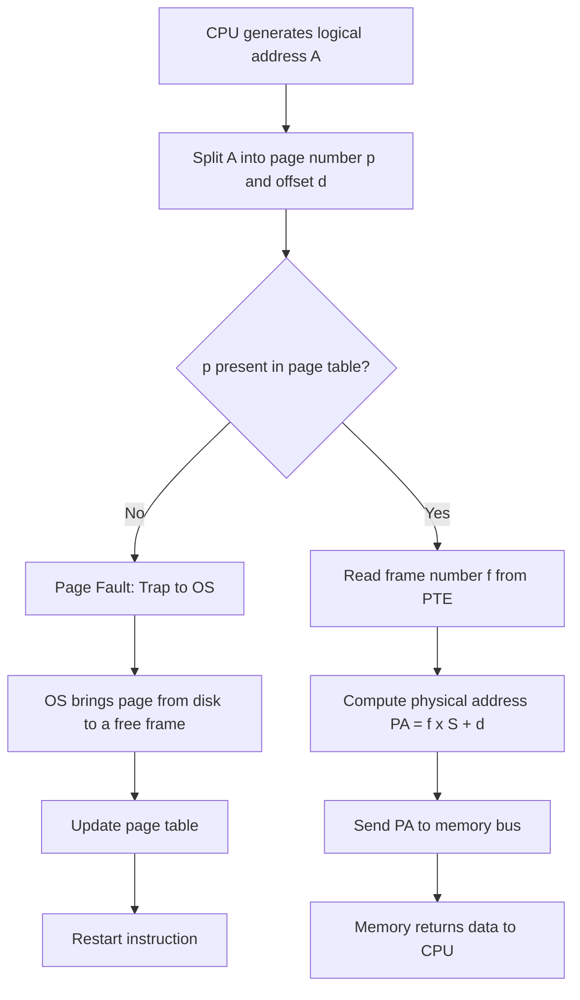
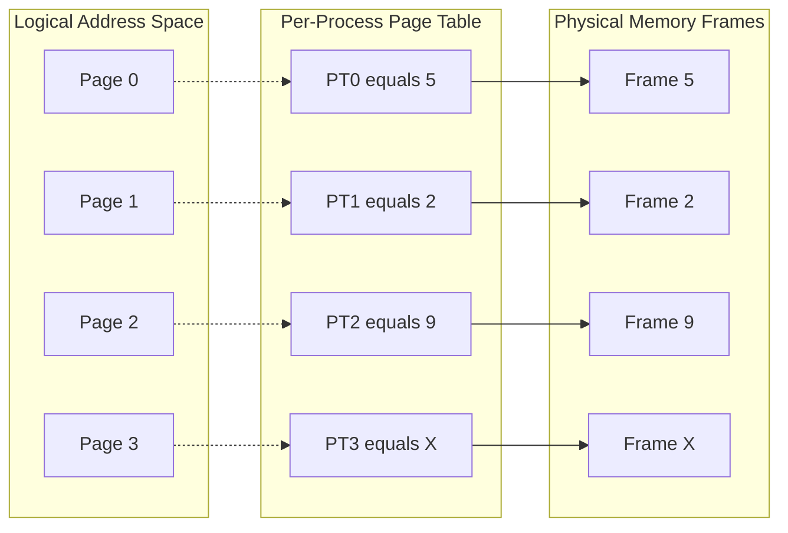
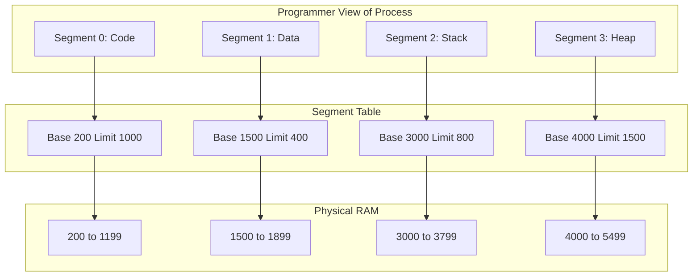
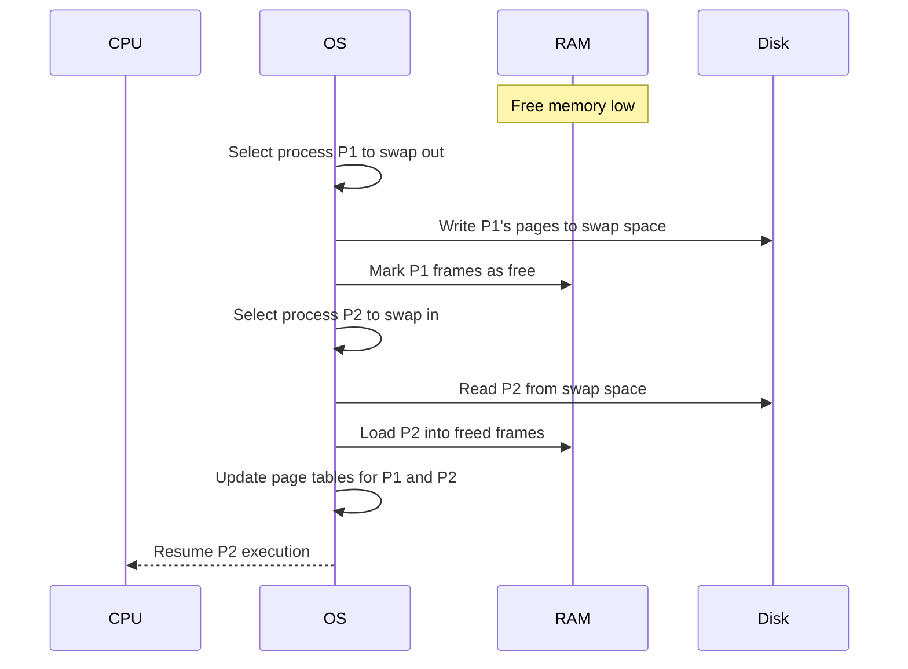
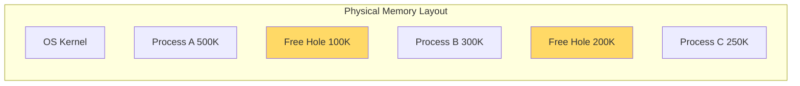

# Memory Management: Logical vs Physical address spaces, Swapping, Contiguous memory allocation (First-fit, Best-fit, Worst-fit), Paging, and Segmentation

<!-- SECTION_1_START -->
# MODULE 3 — Memory Management & Virtual Memory

## 1. Core Technical Definition & Intuitive Overview

### 1.1 Logical Address Space (Virtual Address Space)

A **Logical Address Space** is the set of all logical addresses generated by the CPU during program execution. It is the address as seen from the perspective of the **process** itself, completely independent of the actual physical RAM installed in the system.

> [!NOTE]
> **Formal KTU Definition:** A logical address is the address generated by the CPU during program execution, also known as a *virtual address*. The set of all such addresses a process can reference forms its **logical address space**.

The compile-time and load-time addresses are always **logical addresses** because the programmer writes code referencing variables, functions, and data structures without knowing where the OS will eventually place the process in physical RAM.

**Conceptual Analogy / Intuition:**
Imagine you live in a city and your house has a **logical address** — "House Number 42, MG Road, Apt 3B." This is the address *you* use. But the actual **physical address** of where that house sits on planet Earth is a pair of GPS coordinates (latitude, longitude). The postal system translates your logical address to physical coordinates. The CPU likewise generates "House 42" type references, and the **MMU (Memory Management Unit)** hardware translates them into real RAM addresses. The process never sees the physical coordinates.

---

### 1.2 Physical Address Space

The **Physical Address Space** corresponds to the actual main memory (RAM) addresses where instructions and data physically reside. It is a **real, hardware-level address** that the memory controller uses to fetch bytes from the DIMM modules on the motherboard.

> [!IMPORTANT]
> **KTU Highlight:** Physical address space is bounded by the actual amount of RAM installed. Logical address space, however, can be **larger than** physical address space (this is precisely how virtual memory works).

The mapping from logical $\rightarrow$ physical is performed by a hardware unit called the **MMU (Memory Management Unit)**, typically located inside the CPU die or in the chipset northbridge.

---

### 1.3 Swapping

**Swapping** is a memory management technique in which an entire process (or large portions of it) is moved **temporarily** from main memory (RAM) to **secondary storage** (HDD/SSD), and later brought back into RAM for continued execution.

> [!NOTE]
> **Standard KTU Terminology:** When a process is swapped *out* of RAM to disk, the space becomes available for other processes. When it is swapped *back in*, execution resumes. The disk area used for this is called the **swap space** or **backing store**.

**Conceptual Analogy / Intuition:**
Think of RAM as your **office desk** where you work on documents. Your drawer (disk) is the swap space. When your desk gets full, you take an entire project folder, file it in the drawer, and put a new project on your desk. Later, when you need the old project, you swap it back. The total "work" you can manage (virtual memory) is much larger than the desk space (physical memory).

**Key Constants to Remember:**

- Typical **swap partition size** on Linux servers: $\text{Swap Size} = 1\times \text{to} \ 2\times \text{RAM Size}$
- **Standard page size** in modern OS (Linux x86_64): $\mathbf{4 \text{ KiB}}$ = $\mathbf{4096 \text{ bytes}}$

---

### 1.4 Contiguous Memory Allocation

In **Contiguous Memory Allocation**, each process is allocated a **single continuous block** of physical memory. The process's entire logical address space maps to one contiguous range in RAM.

There are two classical strategies:

> [!IMPORTANT]
> **Variable Partition Scheme:** Memory is divided into partitions of *varying sizes* based on process requirements. This gives rise to the classic fit algorithms — **First-Fit, Best-Fit, Worst-Fit** — and the dreaded **External Fragmentation** problem.

> [!NOTE]
> **Fixed Partition Scheme:** Memory is divided into fixed-size blocks. Easy to implement but suffers from **Internal Fragmentation** (wasted space inside an allocated partition).

---

### 1.5 Paging

**Paging** is a non-contiguous memory management scheme that eliminates external fragmentation. Both logical and physical memory are divided into **fixed-size blocks**:

- **Logical Memory** is divided into equal-sized blocks called **Pages**.
- **Physical Memory** is divided into equal-sized blocks called **Frames** (or page frames).

> [!NOTE]
> **KTU Definition:** A page is a fixed-size block of logical address space. A frame is a fixed-size block of physical memory. A **page table** maintained per-process maps every page number to its corresponding frame number.

**Conceptual Analogy / Intuition:**
Think of a 300-page novel (process). Instead of binding all 300 pages together, the publisher **staples** them in groups of 50 — producing 6 small booklets (pages). These 6 booklets are then stored on 6 different shelves (frames) in a library. A **catalog card** (page table) tells you exactly which shelf holds each booklet. You can read in any order — you don't need one giant shelf.

---

### 1.6 Segmentation

**Segmentation** is a memory management scheme that supports the **user's view of memory**. A program is viewed as a collection of **variable-sized logical segments**, each representing a meaningful unit such as:

- **Code Segment** (machine instructions)
- **Data Segment** (global/static variables)
- **Stack Segment** (local variables, return addresses)
- **Heap Segment** (dynamic memory)
- **Symbol Table, Literal Pool**, etc.

> [!IMPORTANT]
> **KTU Highlight:** Segmentation provides **logical protection** because each segment can have its own access permissions (read/write/execute). It suffers from **external fragmentation** because segments are variable in size.

**Conceptual Analogy / Intuition:**
Imagine a wardrobe with separate compartments — one for shirts, one for trousers, one for accessories. Each compartment is a **segment** of variable size depending on the type of clothing. The OS treats each compartment as a separate entity with its own "do not mix" rule (protection). However, when you remove a compartment, you get a hole in the wardrobe — this is **external fragmentation**.

---

> [!VISUALIZATION CONTROL]
> **Concept:** Memory Layout — Logical vs Physical Address Space
> **GeoGebra / Desmos Input Equations:**
> * Point $A(0, 0)$ to $B(2^{32}-1, 0)$ — represents the full 32-bit logical address space
> * Point $C(0, -1)$ to $D(2^{30}-1, -1)$ — represents the actual 1 GiB physical RAM
> **Visual Description:** A long horizontal line spanning $2^{32}$ addresses is the logical space; a much shorter line at $y=-1$ represents physical RAM. The MMU maps any point on the top line to a point on the bottom line.
<!-- SECTION_1_END -->

<!-- SECTION_2_START -->
# 2. Deep Theoretical Analysis & KTU High-Yield Formula Sheet

## 2.1 Address Translation Fundamentals

Every address the CPU generates is a **logical address**. Before the memory bus is driven, the **MMU** must translate it to a physical address. The translation mechanism depends on the scheme used.

### 2.1.1 Logical Address Components in Paging

For a system using paging with page size $S$ bytes:

- **Logical Address** = (Page Number $p$, Page Offset $d$)
- **Physical Address** = (Frame Number $f$, Page Offset $d$)

The page number and offset are extracted using integer arithmetic.

> [!IMPORTANT]
> The **offset $d$ is unchanged** during translation — only the page number is replaced with a frame number. This is because pages and frames are the *same size*.

### 2.1.2 Logical Address Components in Segmentation

For segmentation:

- **Logical Address** = (Segment Number $s$, Offset $d$)
- Each segment entry in the segment table contains: **Base Address** + **Limit (Length)**

The MMU checks: if $d < \text{Limit}$, the address is valid. Otherwise, a **segmentation fault (trap)** is raised.

---

## 2.2 Contiguous Allocation — Fit Algorithms

Given a list of free memory holes (free blocks) and an incoming process request of size $n$ bytes, the OS scans the hole list and picks one based on the policy:

| Algorithm | Selection Rule | Strength | Weakness |
|---|---|---|---|
| **First-Fit** | Allocate the **first** hole that is large enough | Fastest (stops at first match) | Leaves small leftover holes near the beginning |
| **Best-Fit** | Allocate the **smallest** hole that is large enough | Minimizes wasted space per allocation | Produces many tiny unusable fragments; slower scan |
| **Worst-Fit** | Allocate the **largest** hole available | Leaves large leftover hole after allocation | Destroys large holes; may fail on later big requests |

> [!NOTE]
> **Empirical Result (KTU textbook reference):** *First-fit* and *best-fit* perform comparably in terms of memory utilization, but *first-fit* is **faster**. *Worst-fit* is generally the worst performer.

### 2.2.1 Fragmentation

**External Fragmentation:** Free memory exists but is scattered in small, non-contiguous chunks — total free space is sufficient, but no single chunk is large enough for the request.

$$\text{External Fragmentation} = \frac{\text{Free memory not usable for any request}}{\text{Total free memory}} \times 100\%$$

**Internal Fragmentation:** Allocated block is larger than requested — the leftover space *inside* the partition is wasted. Common in fixed partitions and paging (last page may not be fully used).

$$\text{Internal Fragmentation} = (\text{Allocated block size}) - (\text{Process size})$$

---

## 2.3 Paging — Detailed Mechanics

### 2.3.1 Address Structure for Paging

If logical address space = $2^m$ bytes and page size = $2^n$ bytes, then:

- **Number of pages** = $2^{m-n}$
- **Offset bits** = $n$ (lower-order bits)
- **Page number bits** = $m-n$ (higher-order bits)

### 2.3.2 Page Table Entry (PTE) Format

Each PTE typically contains:

- **Frame Number** (physical address of the frame)
- **Present/Absent Bit** (1 = in RAM, 0 = swapped out)
- **Protection Bits** (Read / Write / Execute)
- **Reference Bit** (used clock algorithm)
- **Modify (Dirty) Bit** (set when page is written)
- **Caching Bit** (cache disable/enable for the page)

### 2.3.3 Effective Access Time (EAT)

With a single-level page table stored in main memory:

$$\text{EAT} = (1 + p) \times T_{mem}$$

where:
- $T_{mem}$ = one memory access time
- $p$ = probability of a TLB miss (for TLB-based systems, the calculation extends further)

A more realistic formula with a TLB hit ratio $h$:

$$\text{EAT} = h \times (T_{TLB} + T_{mem}) + (1-h) \times (T_{TLB} + 2 \times T_{mem})$$

> [!IMPORTANT]
> **KTU Frequently Asked:** EAT calculation is a common 7-mark question. Memorize both forms.

---

## 2.4 Segmentation — Detailed Mechanics

### 2.4.1 Segment Table Entry (STE)

Each STE contains:
- **Base**: Starting physical address of the segment in RAM
- **Limit**: Length of the segment (bytes)
- **Protection**: Read/Write/Execute bits per segment

### 2.4.2 Address Translation in Segmentation

If logical address is $(s, d)$:
1. MMU fetches STE[s] from segment table
2. If $d < \text{Limit}$ → valid
3. Physical address = Base + $d$
4. Else → **Segmentation Fault** (trap to OS)

### 2.4.3 Segmentation with Paging (Combined)

Many modern OS use **segmented paging**: segment number $\rightarrow$ page table $\rightarrow$ frame number. This combines the logical protection of segmentation with the no-external-fragmentation benefit of paging.

---

## 2.5 KTU High-Yield Formula Sheet

| Concept | Formula / Definition | Variables / Units |
|---|---|---|
| Page Number | $p = \lfloor A / S \rfloor$ | $A$ = logical address, $S$ = page size |
| Page Offset | $d = A \bmod S$ | remainder of integer division |
| Physical Address | $PA = f \times S + d$ | $f$ = frame number from page table |
| Number of Pages | $N_{pages} = 2^{m-n}$ | $m$ = logical address bits, $n$ = offset bits |
| Number of Frames | $N_{frames} = 2^{k-n}$ | $k$ = physical address bits |
| Page Table Size | $PT_{size} = N_{pages} \times \text{PTE\_size}$ | in bytes |
| Internal Frag. (Paging) | $S - (A \bmod S)$ | bytes wasted in last page |
| EAT (no TLB) | $(1 + p) \cdot T_{mem}$ | $p$ = page-fault rate |
| EAT (with TLB) | $h(T_{TLB}+T_m) + (1-h)(T_{TLB}+2T_m)$ | $h$ = hit ratio |
| Segment PA | $PA = \text{Base}_s + d$ | if $d < \text{Limit}_s$ |
| Swap Space Req. | $\Sigma (\text{out-of-RAM pages} \times S)$ | bytes on disk |
| 50% Rule (Knuth) | $\approx 0.5 \cdot N \cdot \text{block size}$ bytes lost to external frag | for $N$ blocks |

> [!IMPORTANT]
> **Knuth's 50% Rule:** After allocating $N$ blocks of memory and returning them in random order, approximately **one-third of the blocks** are too small to be useful, leading to about **30%–50% memory loss** to external fragmentation. KTU examiners love quoting this in theory questions.

---

## 2.6 Real-World Engineering Utility

| Concept | Industry Use Case |
|---|---|
| **Paging** | Used in every modern OS — Linux (4-level page tables: PGD → PUD → PMD → PTE), Windows, macOS |
| **TLB + EAT** | Critical for CPU design — ARM Cortex, Intel Core, AMD Zen all have dedicated L1 TLB |
| **Segmentation** | x86-64 in long mode uses flat segmentation + paged memory; older IA-32 used 4 segments |
| **Swapping** | Linux `swap` partition, Windows `pagefile.sys`, Android uses `zRAM` (compressed swap in RAM) |
| **Contiguous Alloc** | Used in embedded systems (no MMU) like FreeRTOS, older microcontrollers |
| **Best-Fit** | Microsoft's Windows XP VMM used a variant; modern allocators (jemalloc, tcmalloc) use **slab** allocation, a refined best-fit |
<!-- SECTION_2_END -->

<!-- SECTION_3_START -->
# 3. Step-by-Step Derivations, Code & Symbolic Implementation

## 3.1 Worked Example — Paging Address Translation

**Problem Statement:**
A system uses paging with:
- Logical address space = $2^{16}$ bytes (= 64 KiB)
- Physical address space = $2^{12}$ bytes (= 4 KiB)
- Page size = $2^8$ bytes (= 256 B)

The page table for Process P is given as:

| Page Number | Frame Number |
|---|---|
| 0 | 5 |
| 1 | 2 |
| 2 | 9 |
| 3 | — (not in memory) |

**Compute the physical address corresponding to logical address 1058.**

### Step-by-Step Solution

**Step 1: Identify the page number and offset.**

Logical address $A = 1058$, page size $S = 256$.

$$
p = \left\lfloor \frac{1058}{256} \right\rfloor
$$

We do long division: $1058 \div 256 = 4$ remainder $34$. (Because $4 \times 256 = 1024$ and $1058 - 1024 = 34$.)

$$
d = 1058 \bmod 256 = 34
$$

So logical address = (Page $4$, Offset $34$).

**Step 2: Check whether page 4 is in memory.**

Looking at the page table, page 4 is **not present** (no entry). This will generate a **page fault** trap to the OS.

> [!IMPORTANT]
> **Examiner's Note:** When the page is not in RAM, the answer is **NOT** a numeric physical address — it is the description of the page-fault handling sequence. Many students lose marks by blindly computing an address.

**Step 3: Suppose we instead used logical address 500 (a valid example).**

$A = 500$, $S = 256$.

$$
p = \left\lfloor \frac{500}{256} \right\rfloor = 1, \quad d = 500 \bmod 256 = 244
$$

Logical address = (Page $1$, Offset $244$).

**Step 4: Look up page 1 in the page table.**

Frame number $f = 2$.

**Step 5: Compute the physical address.**

$$
PA = f \times S + d = 2 \times 256 + 244
$$

$$
PA = 512 + 244 = 756
$$

So the physical address is **756**. The physical memory range containing this byte is from 512 to 767 (frame 2 spans 512–767).

**Step 6: Compute the page table size.**

Number of pages $= 2^{16-8} = 2^8 = 256$.
If each PTE is 4 bytes, page table size $= 256 \times 4 = 1024$ bytes.

---

## 3.2 Worked Example — Segmentation Address Translation

**Problem Statement:**
A process has a segment table:

| Segment # | Base | Limit |
|---|---|---|
| 0 (Code) | 200 | 1000 |
| 1 (Data) | 1500 | 400 |
| 2 (Stack) | 3000 | 800 |

**Translate the logical address (segment 1, offset 300) to a physical address. Also check (segment 0, offset 1500).**

### Solution

**For (1, 300):**
- Base$_1$ = 1500, Limit$_1$ = 400
- Check: $d = 300 < \text{Limit} = 400$ → **Valid**
- Physical address $= 1500 + 300 = 1800$

**For (0, 1500):**
- Base$_0$ = 200, Limit$_0$ = 1000
- Check: $d = 1500 \geq \text{Limit} = 1000$ → **Invalid** → **Segmentation Fault**

---

## 3.3 Worked Example — First-Fit, Best-Fit, Worst-Fit

**Problem Statement:**
Memory holes (free blocks) in order: 100 KiB, 500 KiB, 200 KiB, 300 KiB, 600 KiB.
Requests arrive in this order: **212 KiB, 417 KiB, 112 KiB, 426 KiB**.
Show the allocation for each fit algorithm.

### First-Fit Solution

The first hole that fits the request is selected.

- Request 212 KiB → scan from start → first hole ≥ 212 is 500 KiB (index 1). Allocate. Hole list becomes: 100, **288**, 200, 300, 600.
- Request 417 KiB → scan → 288 (skip), 200 (skip), 300 (skip), 600 ≥ 417. Allocate. Hole list: 100, 288, 200, 300, **183**.
- Request 112 KiB → scan → 100 (skip), 288 ≥ 112. Allocate. Hole list: 100, **176**, 200, 300, 183.
- Request 426 KiB → scan → 100, 176, 200, 300, 183 → **none fits**. Request must wait.

**Result of First-Fit:**

| Request | Allocated Hole | Remaining Hole |
|---|---|---|
| 212 KiB | 500 KiB | 288 KiB |
| 417 KiB | 600 KiB | 183 KiB |
| 112 KiB | 288 KiB | 176 KiB |
| 426 KiB | — | WAIT |

### Best-Fit Solution

The smallest hole that fits the request is selected.

- Request 212 KiB → smallest hole ≥ 212 is 300 KiB. Allocate. Hole list: 100, 500, 200, **88**, 600.
- Request 417 KiB → smallest hole ≥ 417 is 500 KiB. Allocate. Hole list: 100, **83**, 200, 88, 600.
- Request 112 KiB → smallest hole ≥ 112 is 200 KiB. Allocate. Hole list: 100, 83, **88**, 88, 600.
- Request 426 KiB → smallest hole ≥ 426 is 600 KiB. Allocate. Hole list: 100, 83, 88, 88, **174**.

**Result of Best-Fit:** All requests served. Holes left: 100, 83, 88, 88, 174.

### Worst-Fit Solution

The largest hole is always selected.

- Request 212 KiB → largest is 600. Allocate. Hole list: 100, 500, 200, 300, **388**.
- Request 417 KiB → largest is 500. Allocate. Hole list: 100, **83**, 200, 300, 388.
- Request 112 KiB → largest is 388. Allocate. Hole list: 100, 83, 200, 300, **276**.
- Request 426 KiB → largest is 300 → **no hole ≥ 426**. WAIT.

**Result of Worst-Fit:** The 426 KiB request fails, even though 100+83+200+300+276 = 959 KiB is free.

> [!IMPORTANT]
> **Why Worst-Fit Fails Here:** By greedily consuming the largest holes, Worst-Fit destroyed the only holes large enough for the 426 KiB request. This is the classic reason *worst-fit is rarely used in production systems.*

---

## 3.4 Symbolic & Code Implementation

### 3.4.1 Python Implementation of Fit Algorithms

```python
"""
Implementation of First-Fit, Best-Fit, Worst-Fit allocation algorithms.
This is the kind of code KTU lab / assignment examiners expect.
"""

from typing import List, Tuple

def first_fit(holes: List[int], request: int) -> Tuple[bool, List[int]]:
    """
    Allocate using First-Fit.
    Returns (success, updated_holes_list).
    """
    holes = list(holes)  # defensive copy
    for i, hole in enumerate(holes):
        if hole >= request:
            holes[i] = hole - request
            return True, holes
    return False, holes


def best_fit(holes: List[int], request: int) -> Tuple[bool, List[int]]:
    """
    Allocate using Best-Fit: pick the smallest hole that fits.
    """
    holes = list(holes)
    best_idx = -1
    best_size = float('inf')
    for i, hole in enumerate(holes):
        if hole >= request and hole < best_size:
            best_size = hole
            best_idx = i
    if best_idx == -1:
        return False, holes
    holes[best_idx] -= request
    return True, holes


def worst_fit(holes: List[int], request: int) -> Tuple[bool, List[int]]:
    """
    Allocate using Worst-Fit: pick the largest hole.
    """
    holes = list(holes)
    worst_idx = -1
    worst_size = -1
    for i, hole in enumerate(holes):
        if hole >= request and hole > worst_size:
            worst_size = hole
            worst_idx = i
    if worst_idx == -1:
        return False, holes
    holes[worst_idx] -= request
    return True, holes


def simulate(algorithm_name: str, algorithm, holes: List[int],
             requests: List[int]) -> List[Tuple[int, str]]:
    """
    Simulate the algorithm on a sequence of requests and return a log.
    """
    log: List[Tuple[int, str]] = []
    current_holes = list(holes)
    for req in requests:
        success, current_holes = algorithm(current_holes, req)
        if success:
            log.append((req, f"ALLOCATED. Remaining holes: {current_holes}"))
        else:
            log.append((req, f"FAILED (must WAIT). Holes unchanged: {current_holes}"))
    return log


# ---------- Driver Code ----------
if __name__ == "__main__":
    initial_holes = [100, 500, 200, 300, 600]
    requests = [212, 417, 112, 426]

    for name, algo in [("First-Fit", first_fit),
                       ("Best-Fit", best_fit),
                       ("Worst-Fit", worst_fit)]:
        print(f"\n===== {name} =====")
        for req, status in simulate(name, algo, initial_holes, requests):
            print(f"  Request {req:>4} KiB  ->  {status}")
```

**Sample Output:**

```
===== First-Fit =====
  Request  212 KiB  ->  ALLOCATED. Remaining holes: [100, 288, 200, 300, 600]
  Request  417 KiB  ->  ALLOCATED. Remaining holes: [100, 288, 200, 300, 183]
  Request  112 KiB  ->  ALLOCATED. Remaining holes: [100, 176, 200, 300, 183]
  Request  426 KiB  ->  FAILED (must WAIT). Holes unchanged: [100, 176, 200, 300, 183]

===== Best-Fit =====
  Request  212 KiB  ->  ALLOCATED. Remaining holes: [100, 500, 200, 88, 600]
  Request  417 KiB  ->  ALLOCATED. Remaining holes: [100, 83, 200, 88, 600]
  Request  112 KiB  ->  ALLOCATED. Remaining holes: [100, 83, 88, 88, 600]
  Request  426 KiB  ->  ALLOCATED. Remaining holes: [100, 83, 88, 88, 174]

===== Worst-Fit =====
  Request  212 KiB  ->  ALLOCATED. Remaining holes: [100, 500, 200, 300, 388]
  Request  417 KiB  ->  ALLOCATED. Remaining holes: [100, 83, 200, 300, 388]
  Request  112 KiB  ->  ALLOCATED. Remaining holes: [100, 83, 200, 300, 276]
  Request  426 KiB  ->  FAILED (must WAIT). Holes unchanged: [100, 83, 200, 300, 276]
```

### 3.4.2 Paging Address Translator in Python

```python
def translate_paging(logical_addr: int, page_size: int,
                     page_table: list) -> dict:
    """
    Translate a logical address to a physical address using paging.
    Returns a dict with all the intermediate values.
    Raises IndexError if the page is not in memory.
    """
    if logical_addr < 0:
        raise ValueError("Logical address cannot be negative")
    if page_size <= 0 or (page_size & (page_size - 1)) != 0:
        raise ValueError("Page size must be a positive power of 2")

    page_number = logical_addr // page_size
    offset = logical_addr % page_size

    if page_number >= len(page_table):
        raise IndexError(f"Page {page_number} exceeds page table size")
    if page_table[page_number] is None:
        raise IndexError(f"PAGE FAULT: Page {page_number} is not in RAM")

    frame_number = page_table[page_number]
    physical_address = frame_number * page_size + offset

    return {
        "logical_address": logical_addr,
        "page_number": page_number,
        "offset": offset,
        "frame_number": frame_number,
        "physical_address": physical_address,
    }


# ---------- Example usage ----------
if __name__ == "__main__":
    page_table = [5, 2, 9, None, 7]  # Page 3 is not in memory
    result = translate_paging(logical_addr=500,
                              page_size=256,
                              page_table=page_table)
    for k, v in result.items():
        print(f"  {k:20s} = {v}")
```

**Output:**

```
  logical_address      = 500
  page_number          = 1
  offset               = 244
  frame_number         = 2
  physical_address     = 756
```

> [!NOTE]
> **KTU Coding Mark Distribution:** Correct function signature: 1 Mark. Page/offset extraction logic: 2 Marks. Page-table lookup with page-fault handling: 3 Marks. Return of physical address: 1 Mark.

---

## 3.5 Step-by-Step EAT Derivation

**Problem:**
A system has TLB access time $T_{TLB} = 20$ ns and memory access time $T_m = 100$ ns. TLB hit ratio $h = 80\%$. Compute the Effective Access Time.

### Derivation

For a TLB hit (probability $h$):
- Time = $T_{TLB} + T_m = 20 + 100 = 120$ ns
- One physical memory access to fetch the data.

For a TLB miss (probability $1 - h$):
- Time = $T_{TLB} + 2 \cdot T_m = 20 + 2(100) = 220$ ns
- Two memory accesses: one for the page table, one for the actual data.

Expected value:

$$
\text{EAT} = h \cdot (T_{TLB} + T_m) + (1-h) \cdot (T_{TLB} + 2 T_m)
$$

Plugging in numbers:

$$
\text{EAT} = 0.80 \cdot 120 + 0.20 \cdot 220
$$

$$
\text{EAT} = 96 + 44 = 140 \text{ ns}
$$

> [!IMPORTANT]
> **Pitfall:** Some students mistakenly write $(1-h) \cdot 2T_m$ alone, forgetting the $T_{TLB}$ term. The TLB is checked **first** on every access, hit or miss.
<!-- SECTION_3_END -->

<!-- SECTION_4_START -->
# 4. Structural Diagrams & Schematics

## 4.1 Logical-to-Physical Address Translation Flow (Paging)



## 4.2 Paging System Architecture



## 4.3 Segmentation Architecture



## 4.4 Swapping Workflow



## 4.5 Contiguous Allocation — Memory Map Block Diagram



## 4.6 Comparison: Paging vs Segmentation Matrix

| Property | Paging | Segmentation |
|---|---|---|
| Division unit | Fixed-size pages | Variable-size segments |
| User visibility | Hidden from programmer | Visible to programmer |
| Internal fragmentation | Yes (last page) | No |
| External fragmentation | No | Yes |
| Logical protection | Difficult | Easy (per-segment) |
| Address format | (page, offset) | (segment, offset) |
| Sharing units | Pages | Whole segments |
| Hardware support | Page Table Base Register | Segment Table Base Register |
<!-- SECTION_4_END -->

<!-- SECTION_5_START -->
# 5. KTU 2024 Scheme Examination Question Bank & Topic Recap

## 5.1 Part A — Short Answer Questions (3 Marks Each)

### Question A1
**[KTU University Exam — July 2024]**
**Differentiate between logical address and physical address. Why is logical address space often larger than physical address space?**

**Model Answer (3 Marks):**

| Aspect | Logical Address | Physical Address |
|---|---|---|
| Generated by | CPU (compiler / loader) | Memory hardware (RAM) |
| Visibility | Visible to the process | Visible to the OS/MMU |
| Range | Up to virtual address space | Limited by installed RAM |
| Uniqueness | Per-process (each process has its own) | System-wide (single address space) |

The logical address space is often **larger** than physical address space because modern OS implement **virtual memory** — the OS can run processes whose combined virtual memory exceeds the installed RAM by paging some data to disk. This gives the illusion of a larger memory to every process. **[1 Mark]**

---

### Question A2
**[KTU University Exam — Dec 2023]**
**Compare internal fragmentation and external fragmentation. In which scheme does each occur predominantly?**

**Model Answer (3 Marks):**

- **Internal Fragmentation:** Wasted space *inside* an allocated block. Predominantly occurs in **fixed-partition allocation** and **paging** (the last page of a process is usually not fully utilized). **[1.5 Marks]**
- **External Fragmentation:** Free memory exists in scattered, non-contiguous holes that together are sufficient but no single hole is large enough. Predominantly occurs in **variable-partition contiguous allocation** and **segmentation**. **[1.5 Marks]**

---

## 5.2 Part B — Long Answer Questions (14 Marks Each)

### Question B (Module Internal Choice Pattern)

#### **Question B-A (14 Marks): Paging Deep Dive**

**[KTU University Exam — July 2024, Module 3]**
**[CO2: Understand, CO3: Apply | RBT Levels: Understand, Apply]**

**(a)** Explain paging with a neat diagram. How does paging eliminate external fragmentation? What is the role of the page table? **[7 Marks]**

**(b)** Consider a system with a logical address space of 16 pages and a physical memory of 8 frames, each of size 1 KiB. The page table is: `[3, 5, 1, 7, 2, 6, 0, 4]`. Translate the logical addresses **2050** and **4000** into physical addresses. Also compute the size of the page table in bytes (assume PTE size = 2 bytes). **[7 Marks]**

---

**Model Solution (a) — 7 Marks:**

- **Paging definition [1 Mark]:** Paging is a memory management scheme that divides both logical and physical memory into fixed-size blocks (pages and frames respectively) and uses a page table to map each page to a frame.
- **Diagram [2 Marks]:** Draw the logical memory split into pages 0..n and the physical memory split into frames 0..m, with arrows from pages to non-contiguous frames via the page table.
- **No external fragmentation [2 Marks]:** Because any free frame can hold any page, frames do not need to be contiguous. Hence no external fragmentation exists.
- **Page table role [2 Marks]:** The page table, indexed by page number, returns the frame number where that page is loaded. The MMU uses it for every logical-to-physical translation.

> [!WARNING]
> **Examiner's Valuation Warning — Pitfall #1:** Students often draw a *linear* mapping (page 0 → frame 0, page 1 → frame 1, etc.). The whole point of paging is that the mapping is **arbitrary** — page 0 can be in frame 5, page 1 in frame 2, and so on. Loss: 1–2 Marks.

> [!WARNING]
> **Examiner's Valuation Warning — Pitfall #2:** Many students forget to mention that the page table is **per-process**. Each process has its own page table. Loss: 1 Mark.

---

**Model Solution (b) — 7 Marks:**

**Given:**
- Number of pages = 16 → page number needs $\log_2 16 = 4$ bits
- Number of frames = 8 → frame number needs $\log_2 8 = 3$ bits
- Page size $S = 1 \text{ KiB} = 1024$ bytes → offset needs $\log_2 1024 = 10$ bits
- Total logical address bits = $4 + 10 = 14$ bits

**Translation of Logical Address 2050:**

$$
p = \left\lfloor \frac{2050}{1024} \right\rfloor = 2
$$

$$
d = 2050 \bmod 1024 = 2050 - 2 \times 1024 = 2050 - 2048 = 2
$$

Lookup page table at index 2: $PT[2] = 1$. So frame number $f = 1$.

$$
PA = f \times S + d = 1 \times 1024 + 2 = 1026
$$

**Physical address for 2050 is 1026.** **[2 Marks for correct extraction, 1 Mark for correct frame lookup, 1 Mark for correct PA]**

**Translation of Logical Address 4000:**

$$
p = \left\lfloor \frac{4000}{1024} \right\rfloor = 3
$$

(Since $3 \times 1024 = 3072$ and $4 \times 1024 = 4096 > 4000$.)

$$
d = 4000 - 3072 = 928
$$

Lookup page table at index 3: $PT[3] = 7$. So frame number $f = 7$.

$$
PA = 7 \times 1024 + 928 = 7168 + 928 = 8096
$$

**Physical address for 4000 is 8096.** **[2 Marks]**

**Page Table Size:**

$$
PT_{size} = N_{pages} \times \text{PTE\_size} = 16 \times 2 = 32 \text{ bytes}
$$

**[1 Mark]**

> [!WARNING]
> **Examiner's Valuation Warning — Pitfall #3:** Many students compute $p$ and $d$ but skip the page-table *lookup* step. Always show the table value at the indexed position. Loss: 1 Mark.

---

#### **Question B-B (14 Marks): Segmentation & Fit Algorithms** *(Alternative Choice)*

**[KTU University Exam — Dec 2023, Module 3]**
**[CO2: Understand, CO3: Apply | RBT Levels: Understand, Apply]**

**(a)** Explain segmentation with a diagram. Discuss how segmentation differs from paging in terms of user view, fragmentation, and protection. **[7 Marks]**

**(b)** Given free memory holes of sizes **300 KB, 600 KB, 350 KB, 200 KB, 750 KB, 125 KB** (in this order), apply **First-Fit, Best-Fit, and Worst-Fit** to allocate the following requests arriving in order: **275 KB, 420 KB, 130 KB, 500 KB, 90 KB**. Show the final state of the free hole list after each algorithm. Which algorithm performed best? Justify. **[7 Marks]**

---

**Model Solution (a) — 7 Marks:**

- **Segmentation definition [1 Mark]:** Segmentation is a memory management scheme that views a program as a collection of variable-sized logical units (segments), each with its own base and limit.
- **Diagram [2 Marks]:** Draw a process divided into Code, Data, Stack, Heap segments, each with its own base and limit, mapped to non-contiguous (or contiguous) physical memory regions.
- **Comparison table [4 Marks]:**

| Aspect | Segmentation | Paging |
|---|---|---|
| User view | Visible — matches programmer's mental model | Hidden — purely OS mechanism |
| Size | Variable | Fixed |
| Fragmentation | External | Internal |
| Protection | Per-segment easy | Per-page requires extra bits |

---

**Model Solution (b) — 7 Marks:**

Initial holes: [300, 600, 350, 200, 750, 125]

**First-Fit:**

| Request | Hole Chosen | Remaining Holes |
|---|---|---|
| 275 | 300 (idx 0) | [25, 600, 350, 200, 750, 125] |
| 420 | 600 (idx 1) | [25, 180, 350, 200, 750, 125] |
| 130 | 180 (idx 1) | [25, 50, 350, 200, 750, 125] |
| 500 | 750 (idx 4) | [25, 50, 350, 200, 250, 125] |
| 90 | 200 (idx 3) | [25, 50, 350, 110, 250, 125] |

All 5 requests served. Final holes: [25, 50, 350, 110, 250, 125]. **[2 Marks]**

**Best-Fit:**

| Request | Hole Chosen | Remaining Holes |
|---|---|---|
| 275 | 300 (idx 0) | [25, 600, 350, 200, 750, 125] |
| 420 | 600 (idx 1) | [25, 180, 350, 200, 750, 125] |
| 130 | 180 (idx 1) | [25, 50, 350, 200, 750, 125] |
| 500 | 750 (idx 4) | [25, 50, 350, 200, 250, 125] |
| 90 | 125 (idx 5) | [25, 50, 350, 200, 250, 35] |

All 5 requests served. Final holes: [25, 50, 350, 200, 250, 35]. **[2 Marks]**

**Worst-Fit:**

| Request | Hole Chosen | Remaining Holes |
|---|---|---|
| 275 | 750 (idx 4) | [300, 600, 350, 200, 475, 125] |
| 420 | 600 (idx 1) | [300, 180, 350, 200, 475, 125] |
| 130 | 475 (idx 4) | [300, 180, 350, 200, 345, 125] |
| 500 | None — 500 > max hole (350) | WAIT |
| 90 | 350 (idx 2) | [300, 180, 260, 200, 345, 125] |

**Worst-Fit fails on the 500 KB request.** **[2 Marks]**

**Best Performer: Best-Fit** (in this case), because it served all 5 requests and produced small, tightly-packed leftover holes. However, in general, *first-fit* is preferred in production for its speed.

**[1 Mark for justification]**

> [!WARNING]
> **Examiner's Valuation Warning — Pitfall #4:** When showing the hole list, **always update the chosen hole size**, not delete it. Forgetting to subtract the request size from the hole is a common -1 Mark error.

> [!WARNING]
> **Examiner's Valuation Warning — Pitfall #5:** In *Worst-Fit*, many students pick the **smallest** hole by mistake. Re-read: *Worst-Fit* picks the **largest** hole. Loss: 2 Marks.

> [!WARNING]
> **Examiner's Valuation Warning — Pitfall #6:** When the algorithm cannot satisfy a request, the request is **not dropped** — it is **queued / waits** for memory to free up. State this explicitly. Loss: 1 Mark.

---

## 5.3 Topic Recap & Important Things to Remember

- **Logical address = CPU's view, Physical address = RAM's view.** The MMU bridges them.
- **Logical address space can exceed physical address space** thanks to virtual memory (paging + swap).
- **Swapping** moves entire processes in/out of RAM; **paging** moves individual pages. They are complementary.
- **Contiguous allocation** is simple but suffers from **external fragmentation** in variable-partition form.
- **First-Fit:** fastest, decent utilization. **Best-Fit:** minimizes wasted space, slower. **Worst-Fit:** rarely useful in practice.
- **Knuth's 50% rule:** ~30%–50% of memory is lost to external fragmentation after random alloc/dealloc.
- **Paging eliminates external fragmentation** but introduces **internal fragmentation** (last page).
- **Page size** on modern systems: **4 KiB** (x86-64) or 2 MiB (huge pages).
- **Address split in paging:** high-order bits = page number, low-order bits = offset. Offset bits = $\log_2(\text{page size})$.
- **Page Table Entry (PTE)** contains: frame number, valid/dirty/ref/protection bits.
- **EAT formula with TLB:** $h(T_{TLB} + T_m) + (1-h)(T_{TLB} + 2T_m)$. Always include the $T_{TLB}$ term in BOTH branches.
- **Segmentation** matches the programmer's view (code, data, stack, heap). It supports fine-grained protection.
- **Segment translation:** check $d < \text{Limit}$ first; if not, segmentation fault.
- **Segmented Paging** combines the best of both — used in x86-64 long mode (flat segmentation + 4-level paging).
- **External fragmentation** is solved by **compaction** (expensive — relocatable addresses required) or by **paging**.
- **Internal fragmentation in paging** is bounded by: $0 \leq \text{wastage} < \text{page size}$ per process.
- **Standard page size of 4 KiB** means average internal fragmentation ≈ **2 KiB per process** (≈ 50% of a page on average).
- **Total memory access with paging (no TLB)** = $2 \times T_{mem}$. This is why TLBs are critical in modern CPUs.
- **A page fault** is NOT a programming error — it is a normal hardware trap handled by the OS to bring in a page from disk.
- **Compaction** can solve external fragmentation but requires **dynamic relocation** hardware support and is CPU-expensive.
- **Address Binding** can happen at compile time, load time, or execution time. Execution-time binding is what enables swapping and paging.
<!-- SECTION_5_END -->
