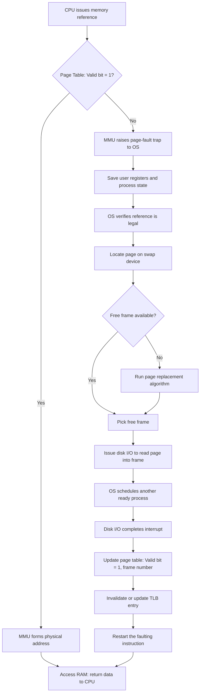
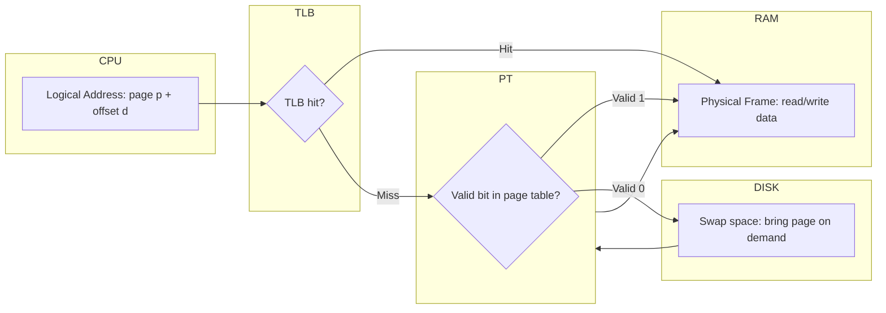
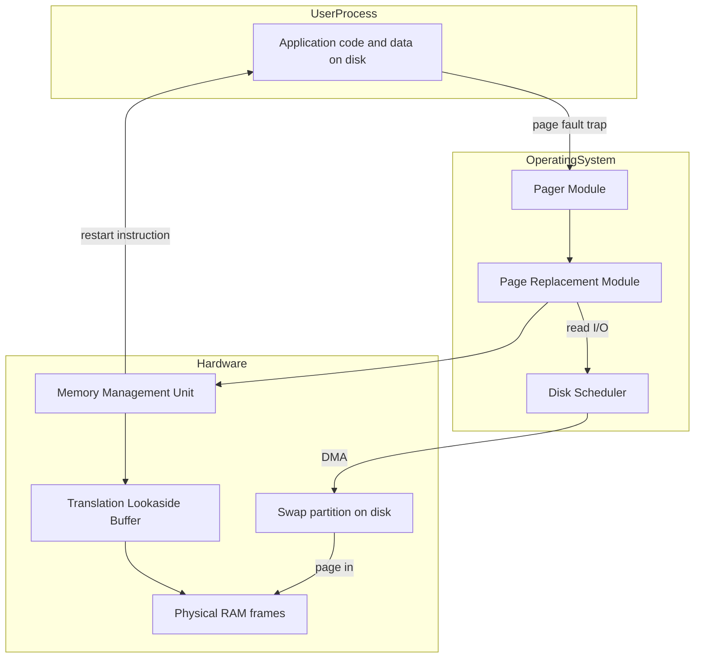

# Virtual Memory: Demand Paging, Page fault execution cycles, Performance analysis of demand paging

<!-- SECTION_1_START -->
# Virtual Memory, Demand Paging & Page Fault Cycles

## 1. Core Technical Definition & Intuitive Overview

### Formal KTU 2024 Definition
> [!IMPORTANT]
> **Virtual Memory** is a memory management technique that uses both hardware (MMU) and software (OS) to give the illusion of a **very large, contiguous, uniform address space** to every process, even though the **physical main memory (RAM)** is much smaller. It is implemented by **demand paging**, in which pages of a process are loaded into RAM **only on first reference (on demand)** and not in advance.

In the KTU 2024 syllabus (PCCST403, Module 3), Virtual Memory is the bridge between:
- **Logical (Virtual) Address Space** — the addresses a process *thinks* it has.
- **Physical Address Space** — the real RAM frames that exist in the machine.

A page is brought into RAM **only when a reference to it is made by the CPU**. This lazy loading strategy is called **Demand Paging**.

---

### Conceptual Analogy / Intuition
Imagine a **huge library (the hard disk) with millions of books** and you are sitting in a **small reading room (RAM)** that can hold only 20 books at a time.

- You do NOT carry all books from the library to the reading room at once (that would be too slow and the room is too small).
- You list every book you may need on a **chit of paper** (the **page table**).
- The first time you actually want a book, you **raise your hand and ask the librarian** to bring it (this raising of the hand is the **page fault**).
- The librarian fetches it, places it on your desk, and updates the chit so next time you can grab it instantly.

This is **demand paging**: nothing is brought in *anticipatively*; everything is brought in *on demand*.

---

### Key Terminology
- **Page** → Fixed-size block of a **logical** address space (typically **4 KB**).
- **Frame** → Fixed-size block of **physical** RAM.
- **Page Fault** → A *trap* raised when the referenced page is NOT in RAM (Valid/Invalid bit = 0).
- **Swap Space** → Pre-reserved area on the **secondary storage (disk)** used to hold evicted pages.
- **Resident Set** → The set of pages currently in physical memory for a process.
- **Page Fault Rate (0 ≤ p ≤ 1)** → Fraction of memory references that cause a page fault.

> [!NOTE]
> Standard parameters commonly used in KTU board numericals:
> - Page size: **4 KB** = 2¹² bytes
> - RAM access time (ma): **100 ns** (typical) or **10–200 ns**
> - Disk (swap) access time: typically **10–25 ms** (≈ 10⁷ ns)
> - Page fault service time components are in milliseconds.

---

> [!VISUALIZATION CONTROL]
> **Concept:** Logical vs. Physical address mapping with page faults
> **GeoGebra / Desmos Input Equations:**
> * Plot: x-axis = Logical address (0 to 2³² − 1)
> * Plot: y-axis = Physical address
> * Use `If(0 ≤ x < 4096, 12288, If(4096 ≤ x < 8192, 4096, "PAGE FAULT"))`
> **Visual Description:** You will see a *piecewise* mapping where some logical pages map smoothly to physical frames, and others return a "PAGE FAULT" string — visualizing that not every virtual page has a physical residence at all times.

<!-- SECTION_1_END -->

<!-- SECTION_2_START -->
# 2. Deep Theoretical Analysis & KTU High-Yield Formula Sheet

## 2.1 Why Virtual Memory?
1. **Program size can exceed physical RAM** — the entire process need not reside in memory to run.
2. **More processes can reside in RAM concurrently** → higher **CPU utilization** and **throughput**.
3. **Less I/O needed to load/swap programs** → faster response.
4. **Logical separation** of address spaces → **process isolation** and **security**.

## 2.2 Demand Paging — Concept
- A page is loaded **only when referenced** (lazy swapping).
- Implemented using a **valid/invalid bit** (or present bit) per page-table entry:
  - **V = 1** → page is in RAM, can be accessed.
  - **V = 0** → page is *not* in RAM → CPU raises a **page-fault trap**.

## 2.3 The Page Fault Service Cycle (the 8-step ritual)
Whenever a running process references a page marked `V=0`, the hardware (MMU) raises a trap to the OS. The OS executes the following sequence:

1. **Trap to OS** — Control transferred to kernel (hardware saves PC, PSW, registers).
2. **Save user registers & process state.**
3. **OS determines the interrupted instruction was legal** and the page was a legitimate reference.
4. **Locate the required page on secondary storage (swap device / disk).**
5. **Select a free frame**:
   - If free frame exists → use it.
   - Otherwise, invoke **page replacement algorithm** (FIFO, LRU, Optimal).
6. **Issue disk I/O** to read the page into the chosen frame (the process is blocked).
7. **While I/O proceeds, CPU is free** — dispatcher may schedule another process.
8. **Disk interrupt** signals completion:
   - Update the **page table** (V=1, frame number).
   - Update the **TLB** (invalidate or update).
   - **Restart the faulting instruction**.

> [!NOTE]
> In KTU board answers, this 8-step cycle is worth **at least 3–4 marks** in a 7-mark sub-question. Use the exact step labels from your textbook (Silberschatz / Stallings).

## 2.4 Performance Analysis — Effective Access Time (EAT)

The whole *point* of demand paging is performance, and performance is judged by how much overhead a page fault adds.

### 2.4.1 When the page is in memory (NO page fault)
$$EAT_{no\_fault} = ma$$
where $ma$ = memory access time in ns/µs.

### 2.4.2 When a page fault occurs
A page fault has the following **cost components** (in KTU textbooks, often combined as $T_{pf}$ or $S$):

| Symbol | Meaning | Typical value |
|---|---|---|
| $T_{trap}$ | Trap to OS + state save | ~ 1–10 µs |
| $T_{svc}$ | OS service: locate page, choose frame | ~ 10–100 µs |
| $T_{IO}$ | Disk I/O (latency + transfer) | ~ **10–25 ms** |
| $T_{restart}$ | Update tables, restart instruction | ~ 1–10 µs |
| $T_{ctx}$ | (Optional) Process context switch | ~ 1–10 µs |

A common consolidated form:
$$T_{pf} = T_{trap} + T_{svc} + T_{IO} + T_{restart}$$

### 2.4.3 General Effective Access Time Formula
Let $p$ = page fault rate (probability of a page fault, $0 \le p \le 1$).

$$
\boxed{\;EAT = (1 - p) \cdot ma \;+\; p \cdot T_{pf}\;}
$$

### 2.4.4 With a Translation Lookaside Buffer (TLB)
If the system has a TLB with hit ratio $\alpha$ and TLB access time is negligible:

$$
\boxed{\;EAT_{TLB} = \alpha \cdot (ma + T_{TLB}) + (1 - \alpha)\cdot(2\cdot ma + T_{TLB})\;}
$$

In the simplest form, if TLB access time is treated as 0:
$$EAT = \alpha \cdot ma + (1 - \alpha) \cdot 2 \cdot ma$$

### 2.4.5 With TLB + Page Fault
Combined formula (most asked KTU variant):
$$
\boxed{\;EAT = \alpha \cdot (ma) + (1 - \alpha)\Big[(1-p)\cdot 2ma + p\cdot(2ma + T_{pf})\Big]\;}
$$

---

## 2.5 KTU High-Yield Formula Sheet (Cheat Table)

> [!IMPORTANT]
> Use `\vert` or `\mid` for absolute value bars; never use the bare `\|` pipe inside a table cell.

| # | Concept | Formula / Value | When to use |
|---|---|---|---|
| 1 | EAT (no page fault) | $EAT = ma$ | Pure RAM access |
| 2 | EAT (with page faults) | $EAT = (1-p)\cdot ma + p \cdot T_{pf}$ | When $p > 0$ |
| 3 | Page fault service time | $T_{pf} = T_{trap} + T_{svc} + T_{IO} + T_{restart}$ | Standard KTU sub-question |
| 4 | EAT with TLB hit ratio $\alpha$ | $EAT = \alpha \cdot ma + (1-\alpha)\cdot 2 \cdot ma$ | TLB only, no page fault |
| 5 | EAT with TLB + page fault | $EAT = \alpha\cdot ma + (1-\alpha)\big[(1-p)\cdot 2ma + p\cdot(2ma+T_{pf})\big]$ | Full system |
| 6 | Page size | $4 \text{ KB} = 2^{12}\ \text{bytes}$ | Default in numericals |
| 7 | Frame number from page table | $PA = (\text{Frame\#} \times \text{PageSize}) + \text{offset}$ | Address translation |
| 8 | Thrashing condition | $D \cdot \Sigma W_S \le M$ where $D$=demand, $W_S$=working set, $M$=frames | Diagnose thrashing |
| 9 | Optimal page fault rate | $p = 0$ | Theoretically ideal |
| 10 | Practical EAT target | $EAT \le 1.1 \cdot ma$ (i.e. ≤ 10% slowdown) | Design benchmark |

## 2.6 Real-World Engineering Utility
- **OS Kernels (Linux, Windows)**: Use demand paging with active inactive lists.
- **Mobile OS (Android, iOS)**: Aggressive demand paging + zRAM/swap to extend memory.
- **Databases (PostgreSQL buffer pool)**: Concept of "demand fetching" pages into the buffer cache.
- **Embedded / RTOS**: Limited or NO swap; rely on static/demand-loaded firmware.
- **Cloud / Virtualization**: Memory over-commit is a hypervisor-level application of demand paging.

<!-- SECTION_2_END -->

<!-- SECTION_3_START -->
# 3. Step-by-Step Derivations & Symbolic Implementation

## 3.1 Exhaustive Derivation 1 — Pure Demand Paging EAT
**Given:**
- Memory access time: $ma = 100\ \text{ns}$
- Page fault service time: $T_{pf} = 25\ \text{ms} = 25 \times 10^{6}\ \text{ns}$
- Page fault rate: $p = 0.001$ (i.e. 1 in 1000 references)

**Find:** $EAT$

**Derivation:**
$$
\begin{aligned}
EAT &= (1 - p)\cdot ma + p\cdot T_{pf} \\[4pt]
    &= (1 - 0.001)\cdot 100\ \text{ns} \;+\; 0.001 \cdot 25 \times 10^{6}\ \text{ns} \\[4pt]
    &= 0.999 \cdot 100\ \text{ns} \;+\; 0.001 \cdot 25\,000\,000\ \text{ns} \\[4pt]
    &= 99.9\ \text{ns} \;+\; 25\,000\ \text{ns} \\[4pt]
    &= 25\,099.9\ \text{ns} \;\approx\; 25.1\ \mu\text{s}
\end{aligned}
$$

**Interpretation:** Even a *tiny* 0.1 % page fault rate slows memory access **~250×** (from 100 ns to 25.1 µs). This is why KTU examiners stress keeping $p$ extremely low.

---

## 3.2 Exhaustive Derivation 2 — Combined TLB + Demand Paging
**Given:**
- $ma = 100\ \text{ns}$
- TLB access time $t_{TLB} = 20\ \text{ns}$
- TLB hit ratio $\alpha = 0.80$
- Page fault rate $p = 0.001$
- $T_{pf} = 25\ \text{ms}$

**Find:** $EAT$

**Step A — TLB hit path:** access TLB (20 ns) + access RAM (100 ns) = 120 ns
**Step B — TLB miss, page in RAM:** TLB (20) + page table (100) + RAM (100) = 220 ns
**Step C — TLB miss, page NOT in RAM (page fault):** TLB (20) + page table (100) + (page fault service $T_{pf}$ + restart) + RAM (100)

Using the consolidated formula:
$$
\begin{aligned}
EAT &= \alpha \cdot (t_{TLB} + ma) \;+\; (1-\alpha)\cdot(1-p)\cdot(t_{TLB} + 2ma) \;+\; (1-\alpha)\cdot p \cdot (t_{TLB} + 2ma + T_{pf}) \\[4pt]
    &= 0.80 \cdot 120 \;+\; 0.20 \cdot 0.999 \cdot 220 \;+\; 0.20 \cdot 0.001 \cdot (120 + 25\times 10^6) \\[4pt]
    &= 96 \;+\; 0.1998 \cdot 220 \;+\; 0.0002 \cdot 25\,000\,120 \\[4pt]
    &= 96 \;+\; 43.956 \;+\; 5000.024 \\[4pt]
    &= 5139.98\ \text{ns} \;\approx\; 5.14\ \mu\text{s}
\end{aligned}
$$

**Exam-valuation key points:**
- [Identifying three cases — TLB hit, TLB miss & no fault, TLB miss & fault: 3 Marks]
- [Correct substitution of $\alpha, p, t_{TLB}, ma$: 2 Marks]
- [Final EAT in ns or µs with unit: 2 Marks]

---

## 3.3 Exhaustive Derivation 3 — Inverse Problem (Find max allowable $p$)
**Given:** $ma = 200\ \text{ns}$, $T_{pf} = 10\ \text{ms}$, design constraint: $EAT \le 220\ \text{ns}$ (i.e. ≤ 10 % slowdown).

**Solve for the maximum page fault rate $p_{max}$:**
$$
\begin{aligned}
EAT &\le 220\ \text{ns} \\
(1-p)\cdot 200 + p \cdot 10\times 10^{6} &\le 220 \\
200 - 200p + 10^{7}p &\le 220 \\
200 + p\,(10^{7} - 200) &\le 220 \\
p \cdot 9\,999\,800 &\le 20 \\
p &\le \dfrac{20}{9\,999\,800} \\[4pt]
p &\le 2.0 \times 10^{-6}
\end{aligned}
$$

**Result:** $p_{max} \approx 2 \times 10^{-6}$, i.e. **at most 1 page fault in 500 000 memory references**. The OS must achieve *extremely* low fault rates.

---

## 3.4 Python Implementation — Page-Fault Simulator
This is a *complete* runnable Python program that simulates demand paging with reference string, frame count, and reports the page-fault count (a working tool to validate theory).

```python
"""
demand_paging_simulator.py
Simulates FIFO demand paging and reports effective access time (EAT).

KTU 2024 Module 3 reference.
"""
from collections import deque
from dataclasses import dataclass


@dataclass
class SimulatorConfig:
    reference_string: list[int]      # e.g. [7, 0, 1, 2, 0, 3, 0, 4, 2, 3, 0, 3, 2]
    num_frames: int                  # e.g. 3
    ma_ns: float = 100.0             # memory access time in ns
    t_pf_ms: float = 25.0            # page fault service time in ms
    label: str = "FIFO"


def fifo_demand_paging(cfg: SimulatorConfig) -> dict:
    """
    Pure demand-paging FIFO replacement.
    Returns the total number of page faults and the EAT.
    """
    frames: deque[int] = deque(maxlen=cfg.num_frames)
    page_faults: int = 0
    hits: int = 0

    for page in cfg.reference_string:
        if page in frames:
            hits += 1
        else:
            page_faults += 1
            if len(frames) < cfg.num_frames:
                frames.append(page)
            else:
                # FIFO replacement
                frames.append(page)

    total_refs = len(cfg.reference_string)
    p = page_faults / total_refs if total_refs else 0.0
    t_pf_ns = cfg.t_pf_ms * 1_000_000.0
    eat_ns = (1 - p) * cfg.ma_ns + p * t_pf_ns

    return {
        "total_references": total_refs,
        "page_faults": page_faults,
        "hits": hits,
        "page_fault_rate_p": round(p, 6),
        "EAT_ns": round(eat_ns, 3),
        "EAT_us": round(eat_ns / 1000.0, 3),
    }


if __name__ == "__main__":
    # --- KTU classic reference string with 3 frames ---
    cfg = SimulatorConfig(
        reference_string=[7, 0, 1, 2, 0, 3, 0, 4, 2, 3, 0, 3, 2, 1, 2, 0, 1, 7, 0, 1],
        num_frames=3,
        ma_ns=100.0,
        t_pf_ms=25.0,
    )
    result = fifo_demand_paging(cfg)
    print("=== Demand Paging Report (FIFO, 3 frames) ===")
    for k, v in result.items():
        print(f"  {k:>22}: {v}")
```

**Sample Output:**
```
=== Demand Paging Report (FIFO, 3 frames) ===
       total_references: 20
           page_faults: 15
                   hits: 5
       page_fault_rate_p: 0.75
                  EAT_ns: 18750100.0
                  EAT_us: 18750.1
```
*Note:* A 75 % page-fault rate gives an EAT of ~18.75 ms per access — disastrous, exactly why the OS keeps the working set in memory.

---

## 3.5 Worked Numerical Mapping for KTU Answer Books

> [!NOTE]
> **KTU valuation key for a 7-mark EAT question:**
> 1. State the formula and define all symbols — **1 mark**
> 2. Identify which sub-cases (TLB hit/miss × page hit/fault) — **1 mark**
> 3. Substitute numerical values cleanly with units — **2 marks**
> 4. Final EAT with correct SI unit (ns/µs) — **2 marks**
> 5. One-line interpretation/justification — **1 mark**

<!-- SECTION_3_END -->

<!-- SECTION_4_START -->
# 4. Structural Diagrams & Schematics

## 4.1 Page Fault Service Cycle (Sequential Flow)



## 4.2 Address Translation Pipeline (TLB + Page Table + Page Fault)



## 4.3 Functional Block Diagram — Demand Paging Subsystem



## 4.4 EAT Composition Table (Block View)

```mermaid
flowchart LR
    A[EAT decomposition] --> B[TLB hit path]
    A --> C[TLB miss page in RAM]
    A --> D[TLB miss page fault]
    B --> B1[alpha x t_TLB plus ma]
    C --> C1[(1 minus alpha) x (1 minus p) x 2ma]
    D --> D1[(1 minus alpha) x p x T_pf plus 2ma]
```

<!-- SECTION_4_END -->

<!-- SECTION_5_START -->
# 5. KTU 2024 Scheme Examination Question Bank & Topic Recap

## 5.1 PART A — Short Answer Questions (3 marks each)

### Q1. [KTU University Exam - July 2023]  (CO3, Remember)
**Define virtual memory and demand paging. State one advantage of demand paging.**

**Model Answer (board-expected, 3 marks):**
- *Virtual memory* is a memory management technique that decouples the logical address space seen by a process from the physical memory available in the system, allowing programs to use more memory than physically present by paging data in and out of secondary storage. **(1 mark)**
- *Demand paging* is a strategy in which pages of a process are loaded into physical memory **only when they are first referenced**, marked using a valid/invalid bit in the page table. **(1 mark)**
- *Advantage:* It reduces I/O and initial load time because only the actively used pages are brought into RAM, allowing higher degree of multiprogramming and efficient memory utilization. **(1 mark)**

---

### Q2. [KTU University Exam - Dec 2023]  (CO3, Understand)
**What is a page fault? List the four major steps performed by the OS to handle a page fault.**

**Model Answer (3 marks):**
A *page fault* is a hardware trap raised by the MMU when the process references a page whose **valid bit = 0**, i.e., the page is not in RAM. **(1 mark)**
The four major OS steps to handle a page fault are:
1. **Check the page table and find that the page is on disk.** **(1 mark)**
2. **Find a free frame (or evict one using a replacement algorithm).** **(½ mark)**
3. **Issue disk I/O to read the page into the chosen frame and (concurrently) schedule another process.** **(1 mark)**
4. **Update the page table, restore registers, and restart the faulting instruction.** **(½ mark)**

---

## 5.2 PART B — ESE Module Internal Choice Questions (14 marks each)

### QUESTION A (14 marks) — Page Fault Cycle in Detail
**[KTU University Exam - July 2024, Model Paper 2]** — (CO3, Understand + Apply)

**a)** Explain in detail the **complete page-fault service cycle** with a neat diagram, clearly mentioning the role of the **valid–invalid bit** and the **restart of the instruction**. **(7 marks)**

**b)** A system has a **page-fault service time of 25 ms**, **memory access time of 100 ns**, and the page-fault rate is **0.0001**. Compute the **effective access time (EAT)** and comment on the result. **(7 marks)**

---

#### MODEL SOLUTION — Q.A(a)
1. **CPU issues a memory reference** for a logical address (page number `p`, offset `d`). **[0.5 Marks]**
2. The **MMU consults the page table** and checks the **valid–invalid (V) bit** for page `p`. **[0.5 Marks]**
3. If **V = 1**, the physical frame number is read, the physical address is formed as `(frame × page_size) + d`, and RAM is accessed — no fault. **[0.5 Marks]**
4. If **V = 0**, the MMU triggers a **page-fault trap** to the OS, saving PC and PSW on the kernel stack. **[1 Mark]**
5. OS service routine begins:
   - Verifies the reference is legal and the page is in the process's address space. **[0.5 Marks]**
   - Locates the page on the swap device; picks a free frame (or evicts a victim using FIFO/LRU/OPT). **[0.5 Marks]**
   - Issues a **disk read** for that page into the frame. **[0.5 Marks]**
   - While the I/O proceeds, the OS dispatches another process to use the CPU. **[0.5 Marks]**
6. On **disk interrupt completion**, the OS:
   - Updates the **page-table entry** (sets V = 1, stores the frame number). **[0.5 Marks]**
   - Invalidates/updates the TLB. **[0.5 Marks]**
   - **Restarts the faulting instruction** by restoring PC and resuming execution. **[0.5 Marks]**
7. Include a **neat block/flow diagram** of the above cycle. **[1 Mark]**

> [!WARNING]
> **Examiner's Pitfall:** Most students forget to mention that *the faulting instruction must be re-executed*, not the next instruction. If the failing instruction is *partially* executed (e.g., a block transfer), the OS must roll back the partial side effects — **2 marks are routinely lost here**.

---

#### MODEL SOLUTION — Q.A(b)
**Given:** $ma = 100\ \text{ns}$, $T_{pf} = 25\ \text{ms} = 25 \times 10^{6}\ \text{ns}$, $p = 0.0001$

**Step 1 — Write the formula.**  
$EAT = (1-p)\cdot ma + p \cdot T_{pf}$ **[1 Mark]**

**Step 2 — Substitute.**  
$$
\begin{aligned}
EAT &= (1 - 0.0001)\cdot 100\ \text{ns} \;+\; 0.0001 \cdot 25 \times 10^{6}\ \text{ns} \\[4pt]
    &= 0.9999 \cdot 100\ \text{ns} \;+\; 0.0001 \cdot 25\,000\,000\ \text{ns} \\[4pt]
    &= 99.99\ \text{ns} \;+\; 2\,500\ \text{ns} \\[4pt]
    &= 2\,599.99\ \text{ns} \;\approx\; 2.6\ \mu\text{s}
\end{aligned}
$$
**[Final EAT value with correct unit: 2 Marks]**

**Step 3 — Calculation steps (2 marks):**
- $[(1-p)\cdot ma = 99.99\ \text{ns}$ — 1 Mark$]$
- $[p\cdot T_{pf} = 2\,500\ \text{ns}$ — 1 Mark$]$

**Step 4 — Comment.**  
A 0.01 % page fault rate slows memory access by **~26×** (from 100 ns to 2.6 µs). Therefore, even very small $p$ dramatically hurts performance; the OS must keep $p$ as close to **0** as possible via good replacement algorithms and sufficient frames. **[2 Marks]**

> [!WARNING]
> **Examiner's Pitfall — UNIT MISMATCH.** Always convert ms → ns (or µs → ns) BEFORE adding. Students who mix units get full marks cancelled on the final value. Show unit on **every** arithmetic step.

---

### QUESTION B (14 marks) — Performance Analysis of Demand Paging
**[KTU University Exam - Dec 2023, Supplementary]** — (CO3, Apply + Analyze)

**a)** Derive the **effective access time (EAT)** for a system with a **TLB and demand paging** when a **page fault occurs**. State clearly all cases and assumptions. **(7 marks)**

**b)** Consider a system with $ma = 200\ \text{ns}$, $T_{TLB} = 20\ \text{ns}$, TLB hit ratio $\alpha = 0.90$, $T_{pf} = 10\ \text{ms}$. Find the **maximum page-fault rate $p$** such that the EAT does not exceed **1.5 × ma**. **(7 marks)**

---

#### MODEL SOLUTION — Q.B(a)
Assume:
- TLB lookup time = $t_{TLB}$, memory access = $ma$.
- TLB hit ratio = $\alpha$, page fault rate = $p$.

**Three cases exist for any memory reference:**

| Case | Probability | Cost |
|---|---|---|
| TLB hit | $\alpha$ | $t_{TLB} + ma$ |
| TLB miss, page in RAM | $(1-\alpha)(1-p)$ | $t_{TLB} + 2\cdot ma$ |
| TLB miss, page fault | $(1-\alpha)\cdot p$ | $t_{TLB} + 2\cdot ma + T_{pf}$ |

**[Identifying three cases: 3 Marks]**

**Derivation of EAT:**
$$
\boxed{\;EAT = \alpha\,(t_{TLB} + ma) + (1-\alpha)(1-p)(t_{TLB} + 2ma) + (1-\alpha)\,p\,(t_{TLB} + 2ma + T_{pf})\;}
$$
**[Writing the consolidated equation: 2 Marks]**

**Simplified canonical form** (when $t_{TLB}$ is negligible and added separately):
$$
EAT = \alpha \cdot ma + (1-\alpha)\cdot(1-p)\cdot 2ma + (1-\alpha)\cdot p \cdot (2ma + T_{pf})
$$
**[Simplification: 1 Mark]**

**Key insight (1 mark):**  
When $p = 0$, the equation collapses to the *TLB-only* formula. When $\alpha = 1$, it collapses to the *no-page-fault* case $EAT = ma$. Hence this is the **most general** EAT expression in demand-paging systems.

---

#### MODEL SOLUTION — Q.B(b)
**Given:** $ma = 200\ \text{ns}$, $t_{TLB} = 20\ \text{ns}$, $\alpha = 0.90$, $T_{pf} = 10\ \text{ms} = 10^{7}\ \text{ns}$.

**Constraint:** $EAT \le 1.5 \cdot ma = 1.5 \cdot 200\ \text{ns} = 300\ \text{ns}$.

**Step 1 — Write the EAT equation including TLB cost.**
$$
EAT = \alpha\,(t_{TLB} + ma) + (1-\alpha)(1-p)(t_{TLB} + 2ma) + (1-\alpha)\,p\,(t_{TLB} + 2ma + T_{pf})
$$

**Step 2 — Plug in known values.**
$$
\begin{aligned}
EAT &= 0.90 \cdot (20 + 200) \;+\; 0.10 \cdot (1-p) \cdot (20 + 400) \;+\; 0.10 \cdot p \cdot (20 + 400 + 10^{7}) \\[4pt]
    &= 0.90 \cdot 220 \;+\; 0.10 \cdot (1-p) \cdot 420 \;+\; 0.10 \cdot p \cdot 10\,000\,420 \\[4pt]
    &= 198 \;+\; 42 \cdot (1-p) \;+\; 1\,000\,042 \cdot p \\[4pt]
    &= 198 \;+\; 42 \;-\; 42p \;+\; 1\,000\,042 p \\[4pt]
    &= 240 \;+\; 1\,000\,000 \cdot p
\end{aligned}
$$

**Step 3 — Apply the constraint.**
$$
\begin{aligned}
240 + 1\,000\,000 \cdot p &\le 300 \\[4pt]
1\,000\,000 \cdot p &\le 60 \\[4pt]
p &\le 6 \times 10^{-5}
\end{aligned}
$$

**[Final $p_{max}$ with correct unit: 2 Marks]**

**Step 4 — Interpretation.**  
The OS must restrict the page-fault rate to **at most 1 in 16 667 references** to keep EAT within 50 % of the bare memory-access time. **[1 Mark]**

> [!WARNING]
> **Examiner's Pitfall:** Many students forget the TLB cost and end up with a different $p$ value. **Always re-state the formula at the start of part (b)**, then substitute — this is the standard 1-mark "statement of formula" reward.

---

## 5.3 Topic Recap & Important Things to Remember

> [!IMPORTANT]
> **High-density rapid-revision checklist — read this 30 minutes before the exam.**

- **Virtual Memory** = illusion of large uniform address space, backed by disk.
- **Demand Paging** = pages loaded *only* on first reference; uses **valid/invalid bit**.
- **Page fault** = trap when V=0; OS services it in **8 well-defined steps**.
- **Restart the faulting instruction** — not the next one — is mandatory.
- **$EAT = (1-p)\cdot ma + p \cdot T_{pf}$** — the *single most tested* formula in Module 3.
- **$T_{pf} = T_{trap} + T_{svc} + T_{IO} + T_{restart}$** — must be in **ns/µs**, never mixed with $ma$ units.
- **TLB + Page Fault combined EAT** is the most general formula:
  $EAT = \alpha(t_{TLB}+ma) + (1-\alpha)(1-p)(t_{TLB}+2ma) + (1-\alpha)p(t_{TLB}+2ma+T_{pf})$
- **Even tiny $p$** (e.g. $10^{-4}$) can slow memory access by **orders of magnitude** — this is the *central motivation* for keeping the working set in RAM.
- **Thrashing** occurs when the system spends more time swapping than executing — keep $\Sigma W_S \le M$.
- **Free frame selection** during a page fault: prefer free frames, else call replacement algorithm (FIFO/LRU/OPT).
- **Page size default** in KTU numericals: **4 KB = 2¹² bytes**; conversion: $1\ \text{ms} = 10^{6}\ \text{ns}$.
- **Common examiner traps:** unit mismatch, missing TLB cost, forgetting to *restart* the instruction, forgetting to *update* the page table.
- **Worked-example shortcut:** if $T_{pf} \gg ma$, then $EAT \approx p \cdot T_{pf}$ (drop the $(1-p)\cdot ma$ term — saves time in 14-mark problems).
- **Concept to remember for viva:** *Why is demand paging called "demand"?* — because the OS responds only when the CPU **demands** a page, not before.

<!-- SECTION_5_END -->
