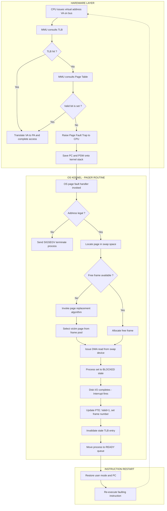
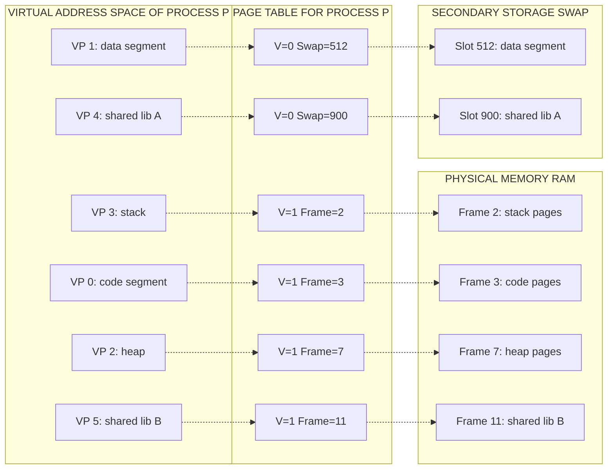
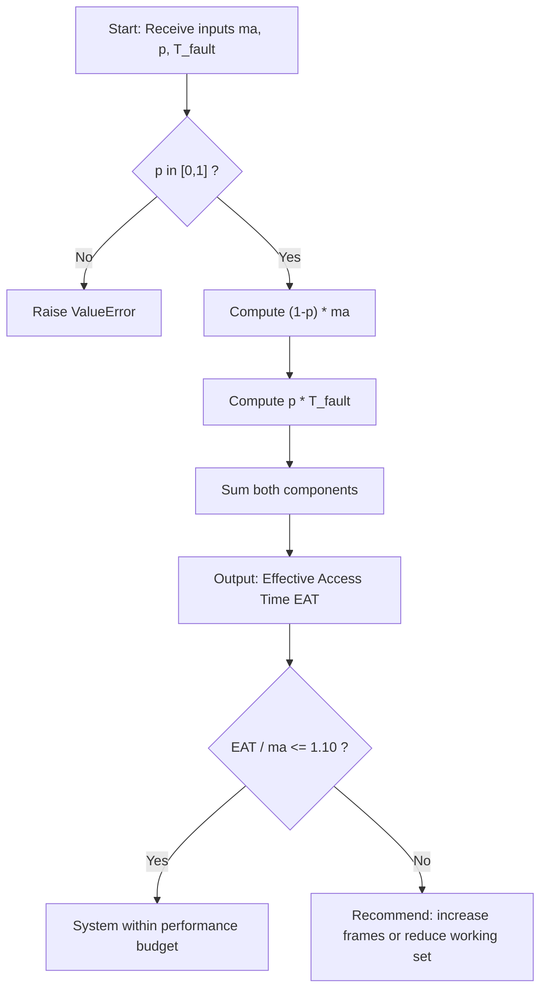

# Virtual Memory: Demand Paging, Page fault execution cycles, Performance analysis of demand paging

<!-- SECTION_1_START -->

# Virtual Memory and Demand Paging: Core Conceptual Foundation

## 1.1 Formal Academic Definition

> [!IMPORTANT]
> **Virtual Memory** is a sophisticated memory management technique that generates an **abstraction of a logical (virtual) address space** decoupled from the underlying physical memory capacity. It enables a process to execute even when only a *portion* of its address space resides in the *primary memory (RAM)* at any given instant, with the remainder staged transparently from *secondary storage (HDD/SSD)*.

In the context of the **KTU 2024 Scheme (PCCST403 – Operating Systems, Module 3)**, virtual memory is implemented predominantly through **Demand Paging**, a lazy-loading strategy where pages of a process are transferred into physical memory **only when a memory reference demands them**, rather than at process load time.

### Key Terminology Map

| Term | Rigorous Definition | Memory Hierarchy Tier |
| :--- | :--- | :--- |
| **Virtual Address** | A logical address generated by the CPU during execution | Logical layer |
| **Physical Address** | The actual address in the RAM chip | Hardware layer |
| **Page** | A fixed-size block of the logical address space (typically **4 KB**) | Logical |
| **Frame** | A fixed-size slot in physical RAM that holds a page | Physical |
| **Page Fault** | A hardware *trap* raised when a referenced page is **not resident** in RAM | Event |
| **MMU** | Memory Management Unit — the hardware translator for addresses | Hardware |
| **Swap Space** | A reserved disk area used as an overflow for non-resident pages | Secondary |
| **Valid/Invalid Bit** | A flag in the page table indicating residency (1=valid, 0=invalid) | PTE field |

## 1.2 Conceptual Analogy: The Infinite Library

> [!NOTE]
> **Intuition Builder — The "Lazy Librarian" Analogy**

Imagine a student researcher (the **CPU**) working in a small study room with a single desk that can only hold **5 open books at a time** (this desk is your **physical RAM**). However, the student has access to a vast **university library with 5000 books** (this is the **virtual address space** on the disk).

* The student does **not** carry all 5000 books to the desk at the start. That would be a *non-demand* strategy.
* Instead, whenever a citation in a book on the desk references a *new* book, the student pauses (a **page fault**), calls the librarian, who fetches the required book from the library (**disk I/O**), and replaces one of the existing books on the desk (**page replacement**).
* The student then continues reading from the exact sentence that caused the citation (**instruction restart**).

This is **Demand Paging**: bring the page into memory *only when demanded by an active instruction*.

## 1.3 Why Demand Paging? The Engineering Justification

| Engineering Goal | How Demand Paging Achieves It |
| :--- | :--- |
| Run programs **larger than physical RAM** | Only the actively-touched subset must reside in memory |
| **Higher degree of multiprogramming** | More processes can be admitted since each consumes less RAM |
| **Faster process startup** | No pre-loading delay; first-instruction latency is reduced |
| **Efficient I/O bandwidth** | Unreferenced pages are never read from disk at all |

> [!TIP]
> **Visualizing the Logical vs. Physical Split**
> The virtual address space of a 64-bit Linux process can be **128 TB** ($2^{47}$ user-space bytes), but physical RAM might be only **16 GB**. The illusion of a large address space is sustained by the OS paging subsystem, not by the hardware itself.

> [!VISUALIZATION CONTROL]
> **Concept:** Virtual-to-Physical Address Mapping
> **GeoGebra / Desmos Input Equations (1D representation):**
> * Plot points on the x-axis: $V = \{0, 4, 8, 12, 16, 20, 24, 28\}$ (virtual pages in KB)
> * Plot points on the x-axis: $P = \{0, 4, 12, 20\}$ (resident frames)
> * Draw dashed connector lines for non-resident pages pointing to a "DISK" region above the axis
> **Visual Description:** A scatter plot where virtual pages sit on a line; the resident ones are mapped upward to physical frame positions, while non-resident ones float isolated, indicating a *page fault will occur* on first access.

## 1.4 Demand Paging: The Formal Definition

> [!IMPORTANT]
> **Demand Paging** is the specific implementation of virtual memory in which a page is brought into physical memory **only on the first reference** to that page. Until then, the page remains on disk, and the page table marks it with an **Invalid bit (0)**. The first reference triggers a *page fault trap* to the OS, which then loads the page.

This is in sharp contrast to **anticipatory paging** (used historically in some mainframe systems), where the OS pre-loads pages that are *expected* to be used soon.

<!-- SECTION_1_END -->

<!-- SECTION_2_START -->

# Deep Theoretical Analysis and KTU High-Yield Formula Sheet

## 2.1 The Operational Pillars of Demand Paging

The system relies on a tightly coupled triad of components:

1. **The Page Table (per-process)** — Maintains the *Valid/Invalid* bit and the frame number (or disk address) for every virtual page.
2. **The MMU (hardware)** — On every memory reference, it consults the page table's Valid bit. If valid, it performs the address translation. If invalid, it raises a *trap*.
3. **The Pager / Swap Daemon (OS kernel)** — The exception handler that brings the missing page from the swap device into a free frame and updates the page table.

> [!NOTE]
> **Critical Distinction:** A page table entry is conceptually partitioned into two states:
> * **Valid (V=1):** Contains the physical frame number where the page currently resides.
> * **Invalid (V=0):** Either the page is *not in memory* (resides on disk), or the virtual address is *illegal* (outside the process's allocated space). The OS must inspect a secondary field to differentiate.

## 2.2 Conditions for a Page Fault to Occur

A page fault is raised **if and only if** the following condition holds during address translation:

$$ \text{Page Fault} \iff \text{V\_bit} = 0 \;\land\; \text{reference is within legal address range} $$

If the reference is *illegal* (e.g., a wild pointer dereference), the OS raises a **segmentation fault** instead and typically terminates the process.

## 2.3 KTU Formula Sheet (Cheat Sheet)

> [!IMPORTANT]
> **Master these equations — they appear every semester.**

| Symbol | Quantity | Typical Units / Values |
| :--- | :--- | :--- |
| $ma$ | Memory Access Time (cache miss cost) | **10–100 ns** |
| $p$ | Page Fault Rate (probability of fault per reference) | $0 \le p \le 1$ |
| $t_{\text{trap}}$ | Time to service the trap and dispatch the OS pager | $\sim$ 1–10 µs |
| $t_{\text{io}}$ | Disk I/O latency (seek + rotational + transfer) | $\sim$ 1–25 ms |
| $t_{\text{restart}}$ | Time to restart the faulting instruction | $\sim$ 1 µs |
| $\text{EAT}$ | Effective Access Time (weighted average per reference) | nanoseconds |

### Core Equations

**(1) The Effective Access Time with Page Faults:**

$$ \text{EAT} = (1 - p) \cdot ma + p \cdot T_{\text{fault}} $$

where $T_{\text{fault}}$ is the total **page fault service time** — the wall-clock time from the moment the trap fires until the instruction is restarted.

**(2) Decomposed Page Fault Service Time:**

$$ T_{\text{fault}} = t_{\text{trap}} + t_{\text{io}} + t_{\text{restart}} $$

**(3) More realistic decomposition (with context save/restore):**

$$ T_{\text{fault}} = t_{\text{save}} + t_{\text{trap}} + t_{\text{lookup}} + t_{\text{io}} + t_{\text{update}} + t_{\text{restart}} $$

**(4) In terms of memory accesses (a very common KTU variation):**

$$ \text{EAT} = (1 - p) \cdot ma + p \cdot (\text{trap cost} + \text{disk I/O} + \text{restart cost}) $$

**(5) The bound for performance acceptability (rule of thumb):**

$$ \text{Slowdown} = \frac{\text{EAT}}{ma} \le 1.10 \;\;\text{(i.e., at most 10% degradation)} $$

> [!TIP]
> **Memory Aid:** Whenever you see a question asking "what should $p$ be to keep slowdown below $x\%$", you are solving an inequality of the form:
>
> $$ (1 - p) \cdot ma + p \cdot T_{\text{fault}} \le (1 + x) \cdot ma $$
>
> Always isolate $p$ in this form. The KTU board loves this question.

## 2.4 The Concept of "Locality of Reference" — Why Demand Paging Works

Demand Paging is viable in practice because of two empirical properties of real programs:

1. **Temporal Locality:** If a memory location is accessed *now*, it is highly likely to be accessed *again soon* (e.g., loop counters, stack frames).
2. **Spatial Locality:** If address $x$ is accessed, address $x+1$ is likely to be accessed *soon after* (e.g., sequential array traversal, instruction fetch).

These two properties, formalized by **Peter Denning's Working Set Model (1968)**, ensure that a process has a *small* actively-touched subset of pages (the **working set**, $W(t, \Delta)$) at any instant. Demand paging only loads this working set into RAM.

$$ W(t, \Delta) = \{\, p_i \mid \text{page } p_i \text{ was referenced in the interval } (t - \Delta, t] \,\} $$

If $\lvert W \rvert > $ number of available frames, **thrashing** occurs — the system spends more time swapping pages than executing instructions. Use `\vert W \vert` in prose to denote the working set size.

## 2.5 Real-World Engineering Utility

| Domain | Application of Demand Paging |
| :--- | :--- |
| **Database Systems** (PostgreSQL, Oracle) | Buffer pool manager uses demand paging principles to fetch pages from disk only when queried |
| **Cloud Computing** (AWS, Azure) | Memory overcommit on VMs is enabled by demand paging; 100 VMs may claim 64 GB each on a host with 256 GB |
| **Mobile OS** (Android, iOS) | Apps load code lazily; dormant background apps may have zero pages in RAM |
| **Compilers / Linkers** | `.text` sections of unused functions are never paged in |
| **Gaming Engines** | Texture streaming systems are a software analog of demand paging |

<!-- SECTION_2_END -->

<!-- SECTION_3_START -->

# Step-by-Step Derivations and Symbolic Implementation

## 3.1 The Page Fault Execution Cycle — Complete Walkthrough

> [!IMPORTANT]
> This is the **single most-tested concept** in Module 3. Memorize each step and the OS-component responsible.

Below is the **exhaustive** sequence of events when a CPU instruction (e.g., `MOV EAX, [0x4000]`) references a page marked **Invalid** in the page table.

### Step 1: Instruction Fetch and Decode

The CPU fetches the instruction from a code page (assume it is resident). The instruction contains a memory operand, e.g., virtual address `0x00004000`. The CPU issues this address on the address bus to request the operand.

### Step 2: MMU Performs Address Translation

The Memory Management Unit looks up the page table entry (PTE) for the page containing `0x4000`. Suppose the page is of size **4 KB**; then page number $p = \lfloor 0\text{x}4000 / 0\text{x}1000 \rfloor = 4$.

The MMU reads PTE[4] and finds the **Valid bit = 0**.

### Step 3: MMU Raises a Trap (Page Fault Exception)

The MMU cannot complete the translation. It signals a **TLB miss → Page Fault** exception. The CPU receives the trap, saves the **Program Counter (PC) of the faulting instruction** into a special control register (e.g., `CR2` in x86), and transfers control to a pre-defined OS exception vector.

### Step 4: Hardware Saves Process State

The hardware automatically pushes essential state onto the kernel stack:

* **Program Counter (PC)** — address of the faulting instruction
* **Processor Status Word (PSW)** — flags, mode bits
* **Stack Pointer (SP)** — current user stack pointer

A mode switch from **user mode → kernel mode** occurs.

### Step 5: OS Pager Routine Executes

The kernel's page fault handler runs. It:
1. **Reads the faulting virtual address** from the control register.
2. **Looks up the PTE** again to determine *why* the bit is 0:
    * If the address is **outside the process's virtual address space** → issue a *segmentation fault*; send `SIGSEGV`; terminate the process.
    * If the address is **valid but the page is on disk** → continue to Step 6.

### Step 6: Locate the Page on Disk

The OS uses the PTE's *disk-slot field* to find the location of the page in the **swap space** (e.g., `/dev/sda5` or a swap file). This is the location where the page was originally placed when the process was loaded.

### Step 7: Find a Free Frame

The OS searches the **free-frame list**. If a free frame is available, it is removed from the list. If no free frame exists, a **page replacement algorithm** (FIFO, LRU, Clock, etc.) is invoked to evict a victim page. If the victim is *dirty* (modified), it must first be written back to disk.

### Step 8: Issue Disk I/O Request

The OS schedules a **DMA transfer** to read the page from the swap device into the newly allocated frame. The process is placed in the **Blocked (I/O wait)** state. The OS may schedule another ready process during this wait.

> [!TIP]
> **Critical:** The process is descheduled here. It is *not* kept spinning. A single page fault can cost **millions** of CPU cycles in wall-clock time.

### Step 9: I/O Completion Interrupt

When the disk controller completes the transfer, it raises an **I/O interrupt**. The OS unblocks the waiting process, moves it back to the **Ready** queue, and updates internal data structures.

### Step 10: Update the Page Table

The PTE for the faulting page is updated:
* **Valid bit** ← 1
* **Frame number** ← newly allocated frame
* **Dirty bit** ← 0 (the page has not been modified in RAM yet)
* **Reference bit** ← 1 (optional, for replacement algorithms)

The **Translation Lookaside Buffer (TLB)** is also flushed or its entry for this page is invalidated, so that the next access re-translates correctly.

### Step 11: Restart the Faulting Instruction

Control returns to user mode. The PC is restored to the **exact same faulting instruction** (e.g., `MOV EAX, [0x4000]`). The instruction is re-executed. This time, the MMU finds the PTE Valid, and the operand is successfully loaded from RAM.

> [!NOTE]
> **Subtle but Examinable:** Some instructions (e.g., `MOV [mem], REG`) have multiple memory operands. If the second operand is also on a missing page, a *second* page fault occurs after the first is resolved, and the instruction is restarted. This can theoretically repeat indefinitely, but the OS detects such pathological cases (e.g., guard pages for stack growth handle the most common legitimate case).

---

## 3.2 Performance Analysis: Worked Derivations

### Worked Example 1 — Standard EAT Calculation

> **Problem (KTU pattern):** A system has a memory access time of $ma = 100$ ns. The page fault service time is $T_{\text{fault}} = 25$ ms. Compute the Effective Access Time for a page fault rate of $p = 0.001$ (one in a thousand).

**Step 1:** Convert all times to the *same unit*. Use **nanoseconds**.

$$ 25 \text{ ms} = 25 \times 10^{6} \text{ ns} = 25\,000\,000 \text{ ns} $$

**Step 2:** Identify the two branches in the EAT equation.

The probability of *no* page fault is $(1 - p) = 0.999$, and the cost is one memory access.
The probability of a page fault is $p = 0.001$, and the cost is the full fault service time $T_{\text{fault}}$.

**Step 3:** Apply the formula.

$$ \text{EAT} = (1 - p) \cdot ma + p \cdot T_{\text{fault}} $$

$$ \text{EAT} = (0.999) \cdot (100) + (0.001) \cdot (25\,000\,000) $$

**Step 4:** Evaluate the first term.

$$ 0.999 \times 100 = 99.9 \text{ ns} $$

**Step 5:** Evaluate the second term.

$$ 0.001 \times 25\,000\,000 = 25\,000 \text{ ns} $$

**Step 6:** Sum the terms.

$$ \text{EAT} = 99.9 + 25\,000 = 25\,099.9 \text{ ns} \approx 25.1 \; \mu\text{s} $$

> [!IMPORTANT]
> **Result:** The effective access time is dominated by page faults. A fault rate of just $0.1\%$ causes a **250x slowdown** over a no-fault system. This is why optimizing $p$ is critical.

**Step 7 (Valuation tip):** Write the *general formula first*, then *substitute*, then *evaluate*. Examiners allocate marks for each.

---

### Worked Example 2 — Finding the Maximum Acceptable Page Fault Rate

> **Problem:** Same system, but the OS designer wants the slowdown to be at most **10%** over the no-fault case. Find the maximum allowable $p$.

**Step 1:** Express the slowdown constraint mathematically.

$$ \text{EAT} \le 1.10 \times ma $$

**Step 2:** Substitute the EAT formula.

$$ (1 - p) \cdot ma + p \cdot T_{\text{fault}} \le 1.10 \cdot ma $$

**Step 3:** Expand the left side.

$$ ma - p \cdot ma + p \cdot T_{\text{fault}} \le 1.10 \cdot ma $$

**Step 4:** Group the $p$ terms.

$$ p \cdot (T_{\text{fault}} - ma) \le 0.10 \cdot ma $$

**Step 5:** Isolate $p$ (note: $T_{\text{fault}} \gg ma$, so the bracket is positive).

$$ p \le \frac{0.10 \cdot ma}{T_{\text{fault}} - ma} $$

**Step 6:** Plug in numerical values.

$$ p \le \frac{0.10 \times 100}{25\,000\,000 - 100} = \frac{10}{24\,999\,900} $$

$$ p \le 4.0000 \times 10^{-7} $$

**Step 7:** Express the result intuitively.

$$ p \le 0.00004\% $$

> [!NOTE]
> **Interpretation:** To keep performance within 10% of ideal, the page fault rate must be *less than one fault in every 2.5 million memory accesses*. This is the reason demand paging systems employ prefetching, larger pages, and sophisticated replacement algorithms.

---

### Worked Example 3 — Multi-Component Page Fault Service Time

> **Problem:** A system has these fault service components:
> * Trap to OS: $t_1 = 5 \;\mu\text{s}$
> * Save user registers: $t_2 = 1 \;\mu\text{s}$
> * Determine page is on disk: $t_3 = 2 \;\mu\text{s}$
> * Disk I/O latency: $t_4 = 8 \text{ ms}$
> * Update page table and TLB: $t_5 = 1 \;\mu\text{s}$
> * Restart process: $t_6 = 1 \;\mu\text{s}$
> * Memory access time: $ma = 200 \text{ ns}$
> * Page fault rate: $p = 0.0005$
>
> Compute EAT.

**Step 1:** Compute $T_{\text{fault}}$ by summing all components in a common unit (microseconds).

$$ T_{\text{fault}} = 5 + 1 + 2 + 8000 + 1 + 1 = 8010 \;\mu\text{s} $$

**Step 2:** Convert to nanoseconds for parity with $ma$.

$$ T_{\text{fault}} = 8\,010\,000 \text{ ns}, \quad ma = 200 \text{ ns} $$

**Step 3:** Apply the EAT formula.

$$ \text{EAT} = (1 - 0.0005)(200) + (0.0005)(8\,010\,000) $$

$$ \text{EAT} = (0.9995)(200) + (0.0005)(8\,010\,000) $$

$$ \text{EAT} = 199.9 + 4005 $$

$$ \text{EAT} = 4204.9 \text{ ns} \approx 4.2 \;\mu\text{s} $$

---

## 3.3 Symbolic Python Implementation (for OS Engineers)

> [!NOTE]
> This Python program computes Effective Access Time for any combination of $ma$, $p$, and $T_{\text{fault}}$, and validates the threshold constraint. It is suitable for KTU lab-viva cross-reference.

```python
from typing import Final
import logging

# Configure structured logging for engine output
logging.basicConfig(
    level=logging.INFO,
    format="%(asctime)s [%(levelname)s] %(message)s"
)
logger: Final[logging.Logger] = logging.getLogger("DemandPagingEngine")


def compute_eat(
    memory_access_ns: float,
    page_fault_rate: float,
    fault_service_ns: float
) -> float:
    """
    Compute the Effective Access Time (EAT) of a demand-paged system.

    Args:
        memory_access_ns:    Memory access time 'ma' in nanoseconds. Must be > 0.
        page_fault_rate:     Probability of a page fault per memory reference (0 <= p <= 1).
        fault_service_ns:    Total wall-clock cost of servicing a single page fault (ns). Must be >= 0.

    Returns:
        Effective Access Time in nanoseconds.

    Raises:
        ValueError: If inputs violate physical / mathematical constraints.
    """
    # ---- Boundary validation ----
    if memory_access_ns <= 0:
        raise ValueError(f"memory_access_ns must be positive, got {memory_access_ns}")
    if not (0.0 <= page_fault_rate <= 1.0):
        raise ValueError(f"page_fault_rate must lie in [0, 1], got {page_fault_rate}")
    if fault_service_ns < 0:
        raise ValueError(f"fault_service_ns must be non-negative, got {fault_service_ns}")

    # ---- EAT formula: EAT = (1 - p) * ma + p * T_fault ----
    eat: float = (1.0 - page_fault_rate) * memory_access_ns \
                 + page_fault_rate * fault_service_ns

    logger.info(
        "Computed EAT = %.4f ns (ma=%.2f, p=%.6f, Tfault=%.2f)",
        eat, memory_access_ns, page_fault_rate, fault_service_ns
    )
    return eat


def max_acceptable_fault_rate(
    memory_access_ns: float,
    fault_service_ns: float,
    max_slowdown_ratio: float = 1.10
) -> float:
    """
    Given a tolerable slowdown factor (e.g. 1.10 = 10% slower than ideal),
    return the maximum permissible page fault rate.

    Returns:
        Upper bound on p such that EAT <= max_slowdown_ratio * ma.
    """
    if memory_access_ns <= 0:
        raise ValueError("memory_access_ns must be positive")
    if fault_service_ns <= memory_access_ns:
        return 1.0  # No constraint (faults are not slower than RAM)
    if max_slowdown_ratio < 1.0:
        raise ValueError("max_slowdown_ratio must be >= 1.0")

    # Derived inequality:  p <= ((max_slowdown_ratio - 1) * ma) / (Tfault - ma)
    p_max: float = ((max_slowdown_ratio - 1.0) * memory_access_ns) \
                   / (fault_service_ns - memory_access_ns)
    logger.info("Maximum acceptable p = %.10f", p_max)
    return p_max


# ----------------------------------------------------------------------
# Demonstration block (acts as a runnable unit test for viva examiners)
# ----------------------------------------------------------------------
if __name__ == "__main__":
    # Example 1: 0.1% fault rate, 25 ms fault cost
    eat1: float = compute_eat(
        memory_access_ns=100.0,
        page_fault_rate=0.001,
        fault_service_ns=25_000_000.0
    )
    print(f"[Example 1] EAT = {eat1:,.2f} ns")

    # Example 2: Threshold query
    p_threshold: float = max_acceptable_fault_rate(
        memory_access_ns=100.0,
        fault_service_ns=25_000_000.0,
        max_slowdown_ratio=1.10
    )
    print(f"[Example 2] Max p for 10% slowdown = {p_threshold:.4e}")

    # Example 3: Multi-component fault cost
    eat3: float = compute_eat(
        memory_access_ns=200.0,
        page_fault_rate=0.0005,
        fault_service_ns=8_010_000.0
    )
    print(f"[Example 3] EAT = {eat3:,.2f} ns")
```

<!-- SECTION_3_END -->

<!-- SECTION_4_START -->

# Structural Diagrams and Schematics

## 4.1 Page Fault Service Cycle — Detailed Flow

The following Mermaid diagram captures the **complete control flow** during a page fault, isolating the OS kernel's responsibilities from the hardware's responsibilities using nested subgraphs.



> [!NOTE]
> **Reading the diagram:** Follow the arrows from `A` (CPU address issuance) downward. The two lateral branches — "Yes" for TLB hit and "Yes" for Valid bit — bypass the kernel entirely (fast path). All other paths funnel into the kernel pager.

## 4.2 Virtual Memory Mapping Architecture

The next diagram illustrates the *layered* relationship between a process's virtual address space, the page table, and the physical memory / swap space.



> [!TIP]
> **Interpretation:** Virtual pages `VP 0`, `VP 2`, `VP 3`, and `VP 5` are **resident** (Valid bit = 1) and map to physical frames. Virtual pages `VP 1` and `VP 4` are **non-resident** (Valid bit = 0) and live in the swap device. Any reference to `VP 1` or `VP 4` will trigger a page fault.

## 4.3 EAT Computation Topology (Sequential Processing)



<!-- SECTION_4_END -->

<!-- SECTION_5_START -->

# KTU 2024 Scheme Examination Question Bank and Topic Recap

## 5.1 Part A — Short Answer Questions (3 Marks Each)

> [!NOTE]
> Each Part A question carries **3 marks** and expects a 1-paragraph model answer with a crisp definition and one supporting example.

### Question A1

> **[KTU University Exam - July 2024]** Define *virtual memory*. How does demand paging implement virtual memory? **(3 Marks, CO1, Remember)**

**Model Answer (Valuation Key):**

Virtual memory is a memory management technique that creates an *illusion* of a large, contiguous logical address space for each process, decoupled from the actual physical memory size **[1 Mark]**. Demand paging implements this by loading only the *referenced* pages of a process into RAM, leaving the rest on disk, and bringing them in on-demand when a *page fault* occurs **[1 Mark]**. The Valid/Invalid bit in the page table tracks whether a page is resident **[1 Mark]**.

### Question A2

> **[KTU University Exam - Dec 2023]** Distinguish between a *page* and a *frame*. What is a page fault? **(3 Marks, CO1, Understand)**

**Model Answer (Valuation Key):**

A *page* is a fixed-size block of the **logical (virtual) address space**, while a *frame* is a fixed-size block of **physical RAM** that can hold exactly one page **[1 Mark]**. Typical size is 4 KB on modern systems **[0.5 Marks]**. A page fault is a hardware trap raised by the MMU when a process references a virtual page whose Valid bit is 0, i.e., the page is not currently resident in physical memory **[1 Mark]**. The OS must then service the fault by loading the page from secondary storage **[0.5 Marks]**.

---

## 5.2 Part B — Essay / Numerical Questions (14 Marks, Internal Choice)

> [!IMPORTANT]
> Each Part B question carries **14 marks** and follows the KTU pattern of two 7-mark sub-parts. You must answer **either** Question A **or** Question B.

### Question A (14 Marks)

> **[KTU University Exam - July 2024]** **(CO2, CO3 — Understand + Apply)**
>
> **(a)** Describe the complete **page fault execution cycle** step-by-step. Clearly state the role of the hardware and the operating system in each step. **(7 Marks)**
>
> **(b)** Consider a demand-paged system with:
> * Memory access time $ma = 200$ ns
> * Average page fault service time $T_{\text{fault}} = 10$ ms
> * Page fault rate $p = 0.0008$
>
> Compute the **Effective Access Time (EAT)** and the **percentage slowdown** over the no-fault scenario. **(7 Marks)**

#### Model Solution for A(a)

| Step | Action | Component Responsible |
| :--- | :--- | :--- |
| 1 | CPU fetches and decodes the instruction, generating a virtual address | **CPU** |
| 2 | MMU checks the TLB; on miss, consults the page table | **MMU (Hardware)** |
| 3 | MMU finds Valid bit = 0 and raises a page fault trap | **MMU** |
| 4 | Hardware saves PC, PSW, and SP; switches to kernel mode | **CPU** |
| 5 | OS pager checks whether the address is legal in the process's VAS | **OS Kernel** |
| 6 | OS locates the page on the swap device using the PTE's disk slot | **OS Kernel** |
| 7 | OS finds a free frame (or evicts a victim via replacement algorithm) | **OS Kernel** |
| 8 | OS schedules a DMA read from swap into the free frame; process blocked | **OS + Disk** |
| 9 | On I/O completion, OS updates the PTE and flushes the stale TLB entry | **OS Kernel** |
| 10 | OS unblocks the process, restores user mode, and restarts the instruction | **OS Kernel + CPU** |

**Valuation Key:** [Listing at least 8 of the 10 steps: 5 Marks] [Correctly attributing hardware vs. OS roles: 2 Marks]

#### Model Solution for A(b)

**Step 1 — Convert units (1 Mark):**

$$ T_{\text{fault}} = 10 \text{ ms} = 10 \times 10^{6} \text{ ns} = 10\,000\,000 \text{ ns} $$

**Step 2 — State the EAT formula (1 Mark):**

$$ \text{EAT} = (1 - p) \cdot ma + p \cdot T_{\text{fault}} $$

**Step 3 — Substitute the values (1 Mark):**

$$ \text{EAT} = (1 - 0.0008) \cdot 200 + (0.0008) \cdot 10\,000\,000 $$

$$ \text{EAT} = (0.9992) \cdot 200 + (0.0008) \cdot 10\,000\,000 $$

**Step 4 — Evaluate (1 Mark):**

$$ \text{EAT} = 199.84 + 8000 = 8199.84 \text{ ns} $$

**Step 5 — Compute the slowdown factor (2 Marks):**

$$ \text{Slowdown} = \frac{\text{EAT}}{ma} = \frac{8199.84}{200} = 40.9992 $$

$$ \text{Percentage slowdown} = (40.9992 - 1) \times 100\% = 3999.92\% $$

**Step 6 — Conclude (1 Mark):**

> The system is roughly **41 times slower** than a fault-free system. Even a tiny fault rate of 0.08% causes massive performance degradation because the disk service time is **5 orders of magnitude** larger than the RAM access time.

---

### Question B (14 Marks) — Alternative Choice

> **[KTU University Exam - Dec 2023]** **(CO2, CO3 — Understand + Apply)**
>
> **(a)** What is the **Effective Access Time (EAT)** in a demand-paged system? Derive the formula and explain each term. **(7 Marks)**
>
> **(b)** A system has $ma = 100$ ns and $T_{\text{fault}} = 30$ ms. The OS designer wants the slowdown over the no-fault case to be **at most 15%**. What is the **maximum allowable page fault rate $p$**? Justify whether this is achievable in practice. **(7 Marks)**

#### Model Solution for B(a)

**Step 1 — Definition (2 Marks):**
The Effective Access Time (EAT) is the *weighted average* time taken to service a single memory reference in a demand-paged system, accounting for the probability of page faults and their service cost.

**Step 2 — State the formula (2 Marks):**

$$ \text{EAT} = (1 - p) \cdot ma + p \cdot T_{\text{fault}} $$

**Step 3 — Explain each term (3 Marks):**

| Term | Meaning |
| :--- | :--- |
| $(1 - p)$ | Probability that the referenced page is in memory (no fault) |
| $ma$ | Cost of a single memory access when the page is resident |
| $p$ | Probability of a page fault per reference |
| $T_{\text{fault}}$ | Wall-clock time to service a single page fault (trap + I/O + restart) |

The first product $(1 - p) \cdot ma$ represents the *fast path* cost; the second $p \cdot T_{\text{fault}}$ represents the *slow path* cost. EAT is their weighted sum.

#### Model Solution for B(b)

**Step 1 — Convert units (1 Mark):**

$$ T_{\text{fault}} = 30 \text{ ms} = 30\,000\,000 \text{ ns}, \quad ma = 100 \text{ ns} $$

**Step 2 — Express the constraint (1 Mark):**

$$ \text{EAT} \le 1.15 \cdot ma $$

$$ (1 - p) \cdot 100 + p \cdot 30\,000\,000 \le 1.15 \cdot 100 $$

**Step 3 — Expand and simplify (2 Marks):**

$$ 100 - 100p + 30\,000\,000p \le 115 $$

$$ p \cdot (30\,000\,000 - 100) \le 15 $$

**Step 4 — Solve for $p$ (1 Mark):**

$$ p \le \frac{15}{29\,999\,900} \approx 5.0001 \times 10^{-7} $$

**Step 5 — Express the result and judge practicality (2 Marks):**

$$ p \le 5 \times 10^{-7} \;\text{(i.e., at most one fault in every 2 million accesses)} $$

> **Practical judgment:** Modern systems with well-tuned working sets, TLB prefetching, and large page sizes can achieve fault rates in the range of $10^{-6}$ to $10^{-7}$, so this constraint is **achievable but tight**. A poorly-designed program with poor locality would easily exceed it and cause thrashing. The OS must aggressively guard the working set to stay within this bound.

---

## 5.3 Examiner's Valuation Warning and Common Pitfalls

> [!WARNING]
> **Top 5 ways KTU students lose marks on this topic — avoid these at all costs:**
>
> 1. **Unit mismatch in EAT calculations** — Mixing milliseconds and nanoseconds. **Always convert all times to a common unit (typically nanoseconds) before applying the formula.** Examiners explicitly allocate 1 mark for the unit conversion step.
>
> 2. **Forgetting the "no-fault" branch** — Writing only $p \cdot T_{\text{fault}}$ and omitting $(1 - p) \cdot ma$. Both branches are required; the EAT is a *weighted sum*, not a single term.
>
> 3. **Not restarting the instruction** — In the page fault cycle, after loading the page, the OS must **restart the same faulting instruction**, not the next one. Mid-instruction fault handling is a classic trap.
>
> 4. **Confusing page fault with segmentation fault** — A page fault is *recoverable*; a segmentation fault is *fatal*. Examiners will deduct marks for conflating the two.
>
> 5. **Omitting the TLB flush** — When the PTE is updated, the TLB's stale entry must be invalidated. Skipping this step leaves the MMU confused, and the examiner will notice.

---

## 5.4 Topic Recap and Important Things to Remember

> [!TIP]
> **High-density rapid-revision checklist — read this the night before the exam.**

* **Virtual memory** is an abstraction; it does not physically exist. It is realized through demand paging and a page table.
* **Demand paging** loads pages *lazily*, only on first reference, using the Valid/Invalid bit in the PTE.
* A **page fault** is a *trap*, not an error — it is the normal mechanism by which missing pages are loaded.
* The **page fault service cycle** has 10 canonical steps; the process is *descheduled* during disk I/O and *restarted* from the faulting instruction upon completion.
* The **Effective Access Time (EAT)** formula is:
$$ \text{EAT} = (1 - p) \cdot ma + p \cdot T_{\text{fault}} $$
* The **page fault service time** $T_{\text{fault}}$ typically includes: trap dispatch, register save, page lookup, disk I/O, page table update, and instruction restart.
* To keep slowdown below **10%**, the page fault rate $p$ must typically be **$10^{-6}$ to $10^{-7}$** for HDD-class devices.
* **Locality of reference** (temporal and spatial) is the empirical property that makes demand paging work in practice.
* **Thrashing** occurs when the working set exceeds available frames, causing the system to spend more time swapping than computing.
* The **TLB** is hardware cache for page table entries; it must be invalidated after every page table update.
* **Dirty pages** (modified in RAM) must be written back to disk before their frame is reused; clean pages can be evicted instantly.
* In KTU numericals, **always convert units first**, write the **general formula**, then **substitute**, then **evaluate**. Marks are awarded at each stage.

<!-- SECTION_5_END -->
