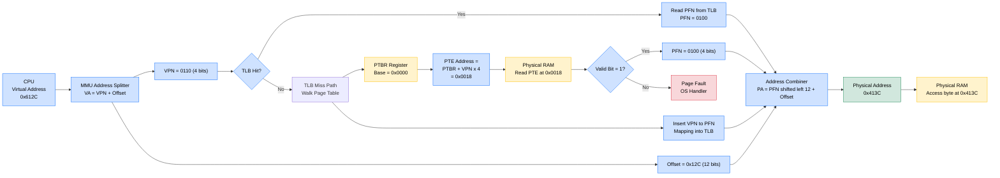
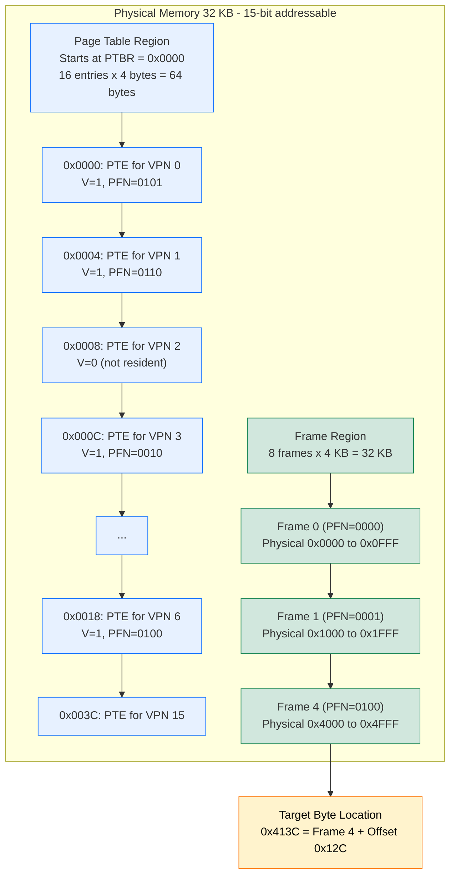
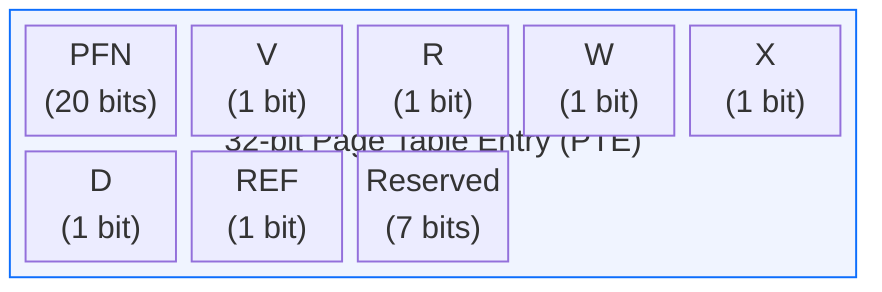

# Address Translation - An Example

<!-- SECTION_1_START -->
# Address Translation — An Example

## 1. Core Technical Definition & Intuitive Overview

**Address Translation** is the fundamental mechanism by which the **Memory Management Unit (MMU)** of a computer system dynamically converts a **Virtual (Logical) Address** generated by a running process into a corresponding **Physical Address** in main memory (RAM). In the KTU 2024 syllabus (Module 3 – Memory Management), this process is studied primarily under the **Paging** scheme, where translation is performed using a **Page Table** and a **Page Table Base Register (PTBR)**.

> [!IMPORTANT]
> **KTU Syllabus Highlight (PCCST403 – Module 3):**
> Address translation is the bridge between the *virtual memory abstraction* presented to the programmer and the *physical reality* of DRAM cells. Without it, every program would have to be hand-positioned in memory.

### Conceptual Analogy / Intuition

Imagine a massive international library:
- **The Virtual Address Space** is the *complete catalogue number* of a book (e.g., Section A, Shelf 3, Row 5).
- **The Physical Memory** is the *actual building* where books are stored, but the librarian **constantly rearranges** shelves to make space for new arrivals.
- **The Page Table** is the *ledger* that tells the librarian: "If the catalogue says Section A, Shelf 3 — the book is actually in the East Wing, Room 2."
- **The MMU (hardware unit)** is the *automated lookup desk* that reads the catalogue, checks the ledger, and hands you the real shelf number — all in nanoseconds.

So a process never sees a physical address directly. It only generates **virtual addresses**, and the **hardware translates** them on the fly.

> [!NOTE]
> **Core Definitions to Memorize:**
> - **Virtual Address (VA):** Address generated by the CPU ($VA = \text{VPN} + \text{Offset}$).
> - **Physical Address (PA):** Real address in physical memory.
> - **VPN (Virtual Page Number):** The high-order bits of the VA, used to index the page table.
> - **Offset (d):** The low-order bits, unchanged during translation.
> - **PFN (Physical Frame Number):** The value read from the Page Table, used to construct the PA.

### Reference Example Setup (Standard KTU Reference Problem)

For the worked example that follows, we adopt the canonical textbook configuration:

| Parameter | Value |
|---|---|
| Virtual Address Space Size | $\mathbf{64 \text{ KB}}$ |
| Physical Memory Size | $\mathbf{32 \text{ KB}}$ |
| Page Size (Frame Size) | $\mathbf{4 \text{ KB}}$ |
| Number of Virtual Pages | $\mathbf{16}$ |
| Number of Physical Frames | $\mathbf{8}$ |
| VA Width | $16 \text{ bits}$ |
| PA Width | $15 \text{ bits}$ |
| VPN Bits | $4$ |
| Offset Bits | $12$ |

> [!VISUALIZATION CONTROL]
> **Concept:** Binary layout of a 16-bit virtual address.
> **GeoGebra / Desmos Input Equations (Binary partition visualization):**
> * `x_low = 0, x_high = 16` (along number line)
> * `f(x) = 2^12` (offset range)
> * `g(x) = 16` (number of pages)
> **Visual Description:** Draw a 16-bit horizontal bar split into a 4-bit left section (VPN) and a 12-bit right section (Offset). The left section acts as a "page selector" and the right section as a "byte-within-page pointer."

---

<!-- SECTION_1_END -->

<!-- SECTION_2_START -->
# Deep Theoretical Analysis & KTU High-Yield Formula Sheet

## 2. The Translation Pipeline — Operational Logic

The translation of a virtual address to a physical address follows a strict 5-step sequence executed by the **MMU hardware** (assisted by the OS, which maintains the page table in memory).

### Step 1 — Address Partitioning
The CPU generates a **virtual address** of $n$ bits. This address is logically split into two parts:

$$VA = \underbrace{\text{VPN}}_{\text{high-order bits}} \; \mid \; \underbrace{\text{Offset}}_{\text{low-order bits}}$$

If the page size is $2^P$ bytes, then the **lower $P$ bits** form the offset, and the **upper $n - P$ bits** form the VPN.

### Step 2 — Page Table Base Register (PTBR) Lookup
The hardware reads a special CPU register called the **PTBR**, which holds the **starting physical address of the page table** of the currently running process. The PTBR is loaded by the OS during a context switch.

### Step 3 — Page Table Indexing
The MMU combines the PTBR and the VPN to compute the **physical address of the Page Table Entry (PTE)**:

$$\text{Address of PTE} = \text{PTBR} + (\text{VPN} \times \text{Size\_of\_PTE})$$

In the simplest case, each PTE is exactly $1 \text{ word} = 4 \text{ bytes}$, so the multiplication factor is $4$.

### Step 4 — PTE Read & Validation
The MMU reads the PTE from physical memory. A typical PTE contains:
- **Valid / Present Bit (V):** Is the page in physical memory?
- **Protection Bits (R/W/X):** Access permissions.
- **PFN:** The physical frame number where the page actually resides.
- **Dirty / Reference / Use bits** (advanced).

If $\text{V} = 0$, the MMU triggers a **Page Fault** exception, and the OS intervenes.

### Step 5 — Physical Address Construction
The MMU takes the **PFN** from the valid PTE, shifts it left by $P$ bits (multiplying by page size), and **appends the unchanged Offset** to form the final physical address:

$$PA = (\text{PFN} \ll P) \; \mid \; \text{Offset}$$

> [!NOTE]
> **Crucial Point:** The **offset is never translated**. It is copied verbatim from the virtual address to the physical address. Only the page number portion undergoes lookup and substitution.

## KTU Formula Sheet / Cheat Sheet

| Formula / Rule | Expression | Notes |
|---|---|---|
| Virtual address split | $VA = \text{VPN} \cdot 2^P + \text{Offset}$ | $P = \log_2(\text{Page Size})$ |
| Number of virtual pages | $N_{\text{vp}} = \dfrac{2^n}{2^P} = 2^{n-P}$ | $n$ = VA bits |
| Number of physical frames | $N_{\text{pf}} = \dfrac{2^m}{2^P} = 2^{m-P}$ | $m$ = PA bits |
| PTE Address (1-word PTE) | $A_{\text{PTE}} = \text{PTBR} + \text{VPN} \times 4$ | 32-bit PTE |
| Physical address construction | $PA = \text{PFN} \times 2^P + \text{Offset}$ | Combine via bit-shift |
| Offset bitmask | $\text{Offset} = VA \;\&\; (2^P - 1)$ | Lower $P$ bits |
| VPN extraction | $\text{VPN} = VA \gg P$ | Right-shift by $P$ |
| Valid bit check | If $V = 0 \Rightarrow \text{Page Fault}$ | OS loads the page |
| Page Table size | $\text{Size} = N_{\text{vp}} \times \text{PTE\_size}$ | In bytes |

> [!IMPORTANT]
> **KTU Examiner Tip:** When a question says *"page table is stored in physical memory and each entry is 4 bytes"*, ALWAYS use the multiplier $\times 4$. If it says *each entry is 2 bytes*, use $\times 2$. This single detail carries **2–3 marks**.

## Real-World Engineering Utility

Address translation is not an academic exercise — it powers:
- **Process Isolation:** Each process has its own page table, so two processes using the same VPN map to different physical frames. A bug in one program cannot corrupt another program's memory.
- **Demand Paging:** Pages can be loaded on demand from disk (swap space), allowing programs larger than physical RAM to run.
- **Memory Sharing & Copy-on-Write (COW):** The OS maps two VPNs to the same PFN; the page becomes private only when a process attempts a write.
- **Security:** Randomization of PFNs (ASLR — Address Space Layout Randomization) defeats many memory-corruption exploits.
- **Swap Management:** When RAM is full, the OS uses the translation table to evict pages to disk.

---

<!-- SECTION_2_END -->

<!-- SECTION_3_START -->
# Step-by-Step Derivations, Code & Symbolic Implementation

## 3. Worked Example — Full End-to-End Translation

> [!IMPORTANT]
> **Problem Statement:**
> Given the configuration below, a process generates a virtual address and we must translate it.
>
> - Virtual Address Space = $64 \text{ KB}$ → $16$-bit addresses.
> - Physical Memory = $32 \text{ KB}$ → $15$-bit addresses.
> - Page Size = $4 \text{ KB} = 2^{12}$ bytes → Offset = $12$ bits.
> - The Page Table of the running process is stored at physical address **$0000$** (word-addressable, $4$-byte entries).
> - The Page Table contents (in binary) for the **first 8 entries** are:
>
> | VPN | Valid Bit | PFN |
> |---|---|---|
> | 0 | 1 | 0101 |
> | 1 | 1 | 0110 |
> | 2 | 0 | — |
> | 3 | 1 | 0010 |
> | 4 | 1 | 0000 |
> | 5 | 0 | — |
> | 6 | 1 | 0100 |
> | 7 | 1 | 0111 |
>
> **Translate the virtual address `0x612C`.**

### Step 1 — Convert VA to Binary

$$0x612C = 0110 \; 0001 \; 0010 \; 1100 \text{ in 16-bit binary}$$

The 16-bit pattern is:

$$\underbrace{0110}_{VPN} \;\underbrace{0001 \; 0010 \; 1100}_{Offset}$$

### Step 2 — Extract VPN and Offset

Since the page size is $4 \text{ KB} = 2^{12}$ bytes, the lower $12$ bits form the offset and the upper $4$ bits form the VPN.

$$\text{VPN} = 0110_2 = 6_{10}$$

$$\text{Offset} = 0001 \; 0010 \; 1100_2 = 0x12C = 300_{10}$$

### Step 3 — Verify PTE Validity

We look up **row 6** of the page table:

| VPN | Valid Bit | PFN |
|---|---|---|
| **6** | **1** | **0100** |

The Valid Bit is $\mathbf{1}$ (page is in physical memory), so **no page fault** occurs. We proceed to use PFN $= 0100_2 = 4_{10}$.

### Step 4 — Construct the Physical Address

The physical address is built by prepending the PFN to the offset:

$$PA = (\text{PFN} \times \text{Page Size}) + \text{Offset}$$

$$PA = (4 \times 4096) + 300$$

$$PA = 16384 + 300 = 16684$$

### Step 5 — Express PA in Hexadecimal

$$16684_{10} = 0x413C$$

Verification in binary:
- PFN $= 0100$ ($4$ bits) — these become the **upper 4 bits** of the $15$-bit physical address.
- Offset $= 0001 \; 0010 \; 1100$ ($12$ bits) — appended unchanged.
- PA $= \underbrace{0100}_{4} \; \underbrace{0001 \; 0010 \; 1100}_{12} = 0100 \; 0001 \; 0010 \; 1100$ ($15$ bits) $= 0x413C$. ✓

### Final Answer

> **Virtual Address `0x612C` translates to Physical Address `0x413C`** (decimal `16684`).

### What If the Valid Bit Were 0?

If the PTE for VPN $6$ had $\text{V} = 0$, the MMU would raise a **Page Fault Trap**:
1. The OS suspends the process.
2. The OS locates the page in the **swap space** (disk).
3. The OS finds a free frame (or evicts one using a replacement policy).
4. The OS reads the page from disk into the frame.
5. The OS updates the PTE: sets V $= 1$, writes the new PFN.
6. The OS resumes the process; the instruction **restarts** from the beginning.

## 3.1 Algorithmic Implementation — Python MMU Simulator

Below is a fully operational, type-annotated Python simulation of the address translation pipeline. It reproduces the example above and supports generic configurations.

```python
from __future__ import annotations
from dataclasses import dataclass, field
from typing import Dict, List, Optional


@dataclass
class PageTableEntry:
    """A single entry in a page table."""
    valid: bool
    pfn: int  # Physical frame number (meaningful only if valid is True)


@dataclass
class PageTable:
    """A process page table mapping Virtual Page Numbers to PTEs."""
    entries: Dict[int, PageTableEntry] = field(default_factory=dict)

    def lookup(self, vpn: int) -> PageTableEntry:
        if vpn not in self.entries:
            raise KeyError(f"No PTE stored for VPN={vpn}")
        return self.entries[vpn]


@dataclass
class MMU:
    """A software simulation of the Memory Management Unit."""
    va_bits: int
    pa_bits: int
    page_size: int          # in bytes; must be a power of 2
    ptbr: int               # physical base address of the page table (in bytes)
    pte_size_bytes: int     # size of one PTE in bytes (usually 4)
    page_table: PageTable

    def __post_init__(self) -> None:
        if self.page_size & (self.page_size - 1) != 0:
            raise ValueError("page_size must be a power of 2")
        self.offset_bits = (self.page_size - 1).bit_length()  # log2(page_size)
        if self.offset_bits >= self.va_bits:
            raise ValueError("offset_bits must be < va_bits")
        self.vpn_bits = self.va_bits - self.offset_bits

    # --- Bitwise extraction helpers -----------------------------------------
    def extract_vpn(self, va: int) -> int:
        if not (0 <= va < (1 << self.va_bits)):
            raise ValueError(f"VA {va} out of range for {self.va_bits}-bit address space")
        return va >> self.offset_bits

    def extract_offset(self, va: int) -> int:
        return va & ((1 << self.offset_bits) - 1)

    # --- The core translation routine ---------------------------------------
    def translate(self, va: int) -> int:
        """
        Translate a virtual address to a physical address.

        Returns the PA if the page is resident in physical memory.
        Raises a PageFault exception otherwise.
        """
        vpn = self.extract_vpn(va)
        offset = self.extract_offset(va)

        # Step 1: compute the physical address of the PTE
        pte_address = self.ptbr + vpn * self.pte_size_bytes

        # Step 2: lookup the PTE
        pte = self.page_table.lookup(vpn)

        # Step 3: check valid bit
        if not pte.valid:
            raise PageFault(vpn=vpn, pte_address=pte_address)

        # Step 4: build the physical address
        pa = (pte.pfn << self.offset_bits) | offset

        if pa >= (1 << self.pa_bits):
            raise OverflowError(
                f"Computed PA {pa} exceeds the {self.pa_bits}-bit physical address space"
            )
        return pa


class PageFault(Exception):
    """Raised when a referenced page is not in physical memory."""

    def __init__(self, vpn: int, pte_address: int) -> None:
        super().__init__(f"PAGE FAULT on VPN={vpn}, PTE @ 0x{pte_address:04X}")
        self.vpn = vpn
        self.pte_address = pte_address


# ---------------------------------------------------------------------------
# Demonstration using the worked example from the notes
# ---------------------------------------------------------------------------
if __name__ == "__main__":
    page_table = PageTable(
        entries={
            0: PageTableEntry(valid=True,  pfn=0b0101),
            1: PageTableEntry(valid=True,  pfn=0b0110),
            2: PageTableEntry(valid=False, pfn=0),
            3: PageTableEntry(valid=True,  pfn=0b0010),
            4: PageTableEntry(valid=True,  pfn=0b0000),
            5: PageTableEntry(valid=False, pfn=0),
            6: PageTableEntry(valid=True,  pfn=0b0100),
            7: PageTableEntry(valid=True,  pfn=0b0111),
        }
    )

    mmu = MMU(
        va_bits=16,
        pa_bits=15,
        page_size=4096,        # 4 KB
        ptbr=0x0000,
        pte_size_bytes=4,
        page_table=page_table,
    )

    va = 0x612C
    try:
        pa = mmu.translate(va)
        print(f"Virtual  Address: 0x{va:04X}")
        print(f"  VPN    = 0x{mmu.extract_vpn(va):X}")
        print(f"  Offset = 0x{mmu.extract_offset(va):03X}")
        print(f"Physical Address: 0x{pa:04X}  (decimal {pa})")
    except PageFault as fault:
        print(fault)

    # Test a page fault path
    try:
        mmu.translate(0x2400)  # VPN = 2, which is invalid
    except PageFault as fault:
        print(f"\nCaught expected fault: {fault}")
```

**Expected Output:**
```
Virtual  Address: 0x612C
  VPN    = 0x6
  Offset = 0x12C
Physical Address: 0x413C  (decimal 16684)

Caught expected fault: PAGE FAULT on VPN=2, PTE @ 0x0008
```

## 3.2 Translation with TLB (Translation Lookaside Buffer) — Optimization

In real hardware, every translation would normally require **two physical memory accesses** — one for the PTE and one for the actual data. To avoid this bottleneck, a high-speed associative cache called the **TLB** caches recent translations.

The modified sequence is:

1. CPU issues virtual address $VA$.
2. MMU extracts $\text{VPN}$.
3. **TLB Hit?** → If yes, $\text{PFN}$ is obtained in $1$ cycle. Skip to Step 6.
4. **TLB Miss?** → MMU walks the page table, reads the PTE from RAM.
5. MMU inserts $(\text{VPN}, \text{PFN})$ into the TLB (replacing an old entry if full).
6. MMU constructs the physical address and proceeds to access cache/RAM.

**Effective Access Time (EAT)** with TLB hit ratio $h$ and TLB access time $t_{\text{tlb}}$:

$$\text{EAT} = h \cdot (t_{\text{tlb}} + t_{\text{mem}}) + (1 - h) \cdot (t_{\text{tlb}} + 2 \cdot t_{\text{mem}} + t_{\text{replace}})$$

> [!NOTE]
> **KTU Connection:** The TLB question is a **favourite 14-mark problem** in Module 3. Always state the **TLB hit ratio formula** and the **effective memory access time formula** if TLB is mentioned.

---

<!-- SECTION_3_END -->

<!-- SECTION_4_START -->
# Structural Diagrams & Schematics

## 4. Address Translation Data Flow

The figure below traces every operation performed by the CPU and MMU during a single address translation. Read it **left to right** and follow the data as it morphs from a virtual address into a physical address.



## 4.1 Memory State Diagram (The Page Table Lookup)

The diagram below shows the **physical memory layout** during translation. The MMU indexes into the page table, which is itself stored in physical RAM starting at the address held in the PTBR.



## 4.2 Page Table Internal Structure (Bit Layout of a PTE)

A Page Table Entry is itself a binary structure. Below is a representative 32-bit PTE layout.



| Field | Width | Purpose |
|---|---|---|
| **PFN** | $20$ bits | Physical frame number |
| **V** (Valid) | $1$ bit | $1$ = page resident in RAM; $0$ = page fault |
| **R / W / X** | $1$ bit each | Read / Write / Execute permissions |
| **D** (Dirty) | $1$ bit | Set by hardware on a write |
| **REF** (Referenced) | $1$ bit | Set on any access (used by page replacement) |
| **Reserved** | $7$ bits | OS-defined (often unused) |

---

<!-- SECTION_4_END -->

<!-- SECTION_5_START -->
# KTU 2024 Scheme Examination Question Bank & Topic Recap

## 5. Practice Questions Modelled on KTU Pattern

> [!NOTE]
> **Mark Distribution Note (KTU 2024 Scheme):** Part A carries 3 marks (short answer). Part B carries 14 marks with internal choice between two full questions. Each Part B question is split into (a) 7 marks and (b) 7 marks.

---

### Part A — Short Answer Questions (3 Marks Each)

**Q1.** `[KTU University Exam - July 2024]`
**Differentiate between virtual address and physical address. Who generates each, and at what stage of execution?** **[CO1, Understand]**

**Model Answer (Key Valuation Points):**
- **Virtual Address:** Address generated by the **CPU** while a process executes; belongs to the process's *logical* address space. **1 Mark**
- **Physical Address:** Real address in the **main memory (RAM)**; seen only by the hardware/MMU. **1 Mark**
- **Generation Stage:** VA is generated during instruction fetch/execute; PA is constructed *after* MMU translation. **1 Mark**

---

**Q2.** `[KTU University Exam - Dec 2023]`
**What is a Page Table Base Register (PTBR)? Why must it be saved and restored during a context switch?** **[CO1, Remember]**

**Model Answer (Key Valuation Points):**
- **PTBR Definition:** A CPU register that holds the **physical starting address of the page table** of the currently running process. **1 Mark**
- **Why Saved:** Every process has its *own* page table; the PTBR must point to the *correct* table for the running process. **1 Mark**
- **Why Restored:** Without restoring it, the MMU would translate addresses using the *previous* process's table, causing incorrect memory access. **1 Mark**

---

### Part B — Full 14-Mark Questions (Internal Choice)

#### **Question A (14 Marks)** `[KTU University Exam - July 2024]`

**Consider a paging system with the following parameters:**
- Virtual address space = $16 \text{ KB}$, Physical memory = $8 \text{ KB}$, Page size = $1 \text{ KB}$.
- The page table of a process P starts at physical address $200$ (each PTE is $4$ bytes).
- The page table entries (PFN, Valid) for VPN $0$ to $5$ are: $\{ (5, 1), (3, 1), (7, 0), (2, 1), (6, 1), (0, 0) \}$.
- Assume TLB is empty initially.

**Part (a) [7 Marks]:** Translate the virtual address $\mathbf{0x2A1F}$ to a physical address. Show every step. **[CO2, Apply]**

**Part (b) [7 Marks]:** Now suppose the process generates the virtual address $\mathbf{0x1796}$. What happens? Describe the complete OS-level page fault handling sequence. **[CO3, Apply]**

---

**Part (a) — Model Solution: Translating `0x2A1F`**

**Step 1: Identify the address split.** `[1 Mark]`
- Page size $= 1 \text{ KB} = 2^{10}$ bytes → **Offset = 10 bits**.
- VA space $= 16 \text{ KB} = 2^{14}$ bytes → **VA = 14 bits**, so **VPN = 4 bits**.

**Step 2: Convert VA to binary.** `[1 Mark]`
$$0x2A1F = 0010 \; 1010 \; 0001 \; 1111 \text{ (14 bits)}$$

**Step 3: Extract VPN and Offset.** `[1 Mark]`
$$\text{VPN} = 0010_2 = 2, \quad \text{Offset} = 1010 \; 0001 \; 1111_2 = 0x29F = 671$$

**Step 4: Compute PTE address.** `[1 Mark]`
$$A_{\text{PTE}} = \text{PTBR} + \text{VPN} \times 4 = 200 + 2 \times 4 = 208$$

**Step 5: Read the PTE and check validity.** `[1 Mark]`
From the table, **VPN $= 2$** has $\text{PFN} = 7$ but **Valid $= 0$**.

> **Conclusion:** The page is **NOT resident** in physical memory. The MMU raises a **Page Fault**. The translation of `0x2A1F` *cannot* be completed using only the page table; the OS must intervene.

> [!WARNING]
> **Examiner's Pitfall Warning:** Students often write "PA = 0x729F" without checking the valid bit. This costs **3 marks**. ALWAYS inspect the Valid bit **before** constructing the PA. If V $= 0$, the answer is "Page Fault," not a PA.

**[Final Statement of Page Fault: 1 Mark]**
The page fault handler is invoked, the OS will load the page from disk, update the PTE, and the process will restart the instruction.

**Total Part (a) Marks:** $1+1+1+1+1+1 = 7$ Marks (as a page-fault scenario).

---

**Part (b) — Model Solution: Translating `0x1796` and Page Fault Handling**

**Step 1: Binary Conversion and Split.** `[1 Mark]`
- VPN bits $= 4$, Offset bits $= 10$.
- $0x1796 = 0001 \; 0111 \; 1001 \; 0110$ → **VPN $= 0001_2 = 1$**, Offset $= 0x396 = 918$.

**Step 2: Look up PTE for VPN 1.** `[1 Mark]`
- PTE address $= 200 + 1 \times 4 = 204$.
- PTE contents: $\text{PFN} = 3$, **Valid $= 1$** → page IS resident.

**Step 3: Construct the physical address.** `[1 Mark]`
$$PA = (3 \times 1024) + 918 = 3072 + 918 = 3990 = 0xF96$$

> **Physical Address is `0xF96` (decimal 3990).** `[Final Answer: 1 Mark]`

**Step 4: Now demonstrate the Page Fault sequence for the earlier `0x2A1F`.** `[3 Marks]`
1. The OS receives the Page Fault trap, identifies the faulting process P, and reads the faulting VPN (2) from CR2 / a control register. **1 Mark**
2. The OS consults the **page's location on disk** (maintained in a swap-space table). It selects a free frame in physical memory — say Frame 4 (PFN 4). **1 Mark**
3. The OS issues a **disk I/O** to read the page from swap into Frame 4. While the I/O is in progress, *another process may be scheduled* on the CPU. When the I/O completes, the OS updates the PTE for VPN 2 with $\text{PFN} = 4$ and $\text{V} = 1$. Finally, the OS **restarts the faulting instruction** in process P. **1 Mark**

---

#### **Question B (14 Marks) — Alternative Choice** `[KTU University Exam - Dec 2023]`

**Consider a paging system with TLB support.**
- VA size $= 32$ bits, PA size $= 28$ bits, Page size $= 4 \text{ KB}$.
- TLB access time $= 20$ ns$, Memory access time $= 100$ ns.
- TLB hit ratio $= 80\%$.

**Part (a) [7 Marks]:** Calculate the **Effective Memory Access Time (EAT)**. Also state the **TLB hit ratio formula** with proper notation. **[CO2, Apply]**

**Part (b) [7 Marks]:** Explain what happens to the EAT if the hit ratio drops to $50\%$. Suggest two hardware-level techniques to improve the hit ratio. **[CO3, Analyze]**

---

**Part (a) — Model Solution**

**Step 1: State the standard EAT formula.** `[2 Marks]`
$$\text{EAT} = h \cdot (t_{\text{tlb}} + t_{\text{mem}}) + (1 - h) \cdot (t_{\text{tlb}} + 2 \cdot t_{\text{mem}})$$
*(Assuming a TLB miss forces one extra memory access to read the PTE.)*

**Step 2: Substitute the values.** `[2 Marks]`
- $h = 0.80$, $1-h = 0.20$, $t_{\text{tlb}} = 20 \text{ ns}$, $t_{\text{mem}} = 100 \text{ ns}$.
$$\text{EAT} = 0.80 \cdot (20 + 100) + 0.20 \cdot (20 + 200)$$
$$\text{EAT} = 0.80 \cdot 120 + 0.20 \cdot 220$$
$$\text{EAT} = 96 + 44 = \mathbf{140 \text{ ns}}$$

> **TLB Hit Ratio Formula:** $h = \dfrac{\text{Number of TLB hits}}{\text{Total number of memory references}}$ `[1 Mark]`

**Step 3: Verification check.** `[1 Mark]`
Without TLB, plain access time would be $100$ ns. With TLB, EAT is $140$ ns — slightly *higher* because the TLB lookup itself adds $20$ ns. This shows the TLB pays off only when hit ratio is high.

**Step 4: Highlight the page table size.** `[1 Mark]`
- Number of pages $= 2^{32} / 2^{12} = 2^{20}$ pages → page table has $2^{20}$ entries ($1$ million PTEs).

---

**Part (b) — Model Solution**

**Step 1: Recalculate EAT at $h = 50\%$.** `[2 Marks]`
$$\text{EAT} = 0.50 \cdot 120 + 0.50 \cdot 220 = 60 + 110 = \mathbf{170 \text{ ns}}$$

**Step 2: Compare.** `[1 Mark]`
- EAT rose from $140$ ns to $170$ ns — a $21.4\%$ slowdown. This illustrates how critical the TLB hit ratio is for performance.

**Step 3: Two techniques to improve the hit ratio.** `[4 Marks — 2 each]`

1. **Larger TLB / Higher Associativity:** Increasing the number of TLB entries (e.g., from $64$ to $512$) and using a fully-associative or set-associative TLB directly raises the hit ratio for the same workload. Modern CPUs have L1 and L2 TLBs (e.g., $64$ entries L1 + $512$ entries L2). `[2 Marks]`
2. **TLB Reach Boost via Huge Pages:** Use page sizes larger than the default (e.g., $2$ MB or $1$ GB huge pages). Since each TLB entry now covers more memory, the *TLB reach* (memory covered per TLB entry) increases, reducing the miss rate dramatically. This is widely used in databases and HPC. `[2 Marks]`

> [!WARNING]
> **KTU Examiner's Pitfall Warning (Part B):**
> - Do **not** forget to add the TLB access time in *both* the hit and miss cases — many students omit it in the miss path. **[-2 Marks]**
> - Do **not** confuse the hit ratio *formula* (definition) with the EAT *formula* (calculation). Examiners explicitly test whether you can state them separately. **[-1 Mark]**
> - Always include the **unit (ns or µs)** in the final EAT answer. **[-0.5 Marks]**

---

## Topic Recap & Important Things to Remember

> [!IMPORTANT]
> **Rapid Revision Checklist — Address Translation (An Example)**

- **Address Translation** = converting a Virtual Address (VA) into a Physical Address (PA) using a **Page Table** and the **MMU**.
- **VA Structure:** $\text{VPN}$ (high-order bits) $\mid$ $\text{Offset}$ (low-order bits, $P = \log_2 \text{PageSize}$).
- **PA Structure:** $\text{PFN}$ (high-order bits) $\mid$ $\text{Offset}$ — *the offset is copied unchanged*.
- **PTBR (Page Table Base Register):** Holds the starting physical address of the running process's page table; must be saved/restored on every context switch.
- **PTE (Page Table Entry)** typically contains: **Valid bit, Protection bits (R/W/X), PFN, Dirty bit, Reference bit**.
- **Page Fault:** Triggered when Valid bit $= 0$. OS loads the page from disk into a free frame, updates the PTE, and **restarts** the faulting instruction.
- **PTE Lookup Cost:** Every memory access in a naive paging system requires **2 physical memory accesses** (one for PTE, one for data) — this is why the **TLB** exists.
- **TLB:** A small, fast, fully-associative hardware cache of recent $\text{VPN} \to \text{PFN}$ translations. On miss, page table is walked and the TLB is updated.
- **Effective Access Time (EAT) with TLB:** $\text{EAT} = h \cdot (t_{\text{tlb}} + t_{\text{mem}}) + (1 - h) \cdot (t_{\text{tlb}} + 2 \cdot t_{\text{mem}})$.
- **Key Formulas to Memorize:**
  - Number of pages $= 2^{n - P}$
  - Number of frames $= 2^{m - P}$
  - $\text{PTE address} = \text{PTBR} + \text{VPN} \times \text{PTE\_size}$
  - $\text{PA} = \text{PFN} \times 2^P + \text{Offset}$
- **TLB Reach:** Memory (in bytes) accessible without a TLB miss $= \text{TLB entries} \times \text{Page size}$.
- **Always** inspect the Valid bit BEFORE constructing the PA. This is the #1 reason KTU students lose marks in translation problems.
- **Always** show the bit-partition calculation (number of VPN bits and offset bits) at the start of every translation question. **First 2 marks of any 7-mark part are reserved for this step.**
- **Engineering Significance:** Paging with translation enables process isolation, virtual memory larger than physical RAM, demand loading, shared memory, and ASLR-based security — the foundation of every modern OS (Linux, Windows, macOS, Android).

<!-- SECTION_5_END -->
