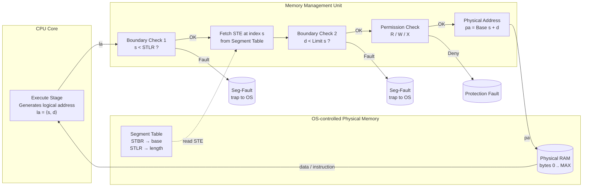
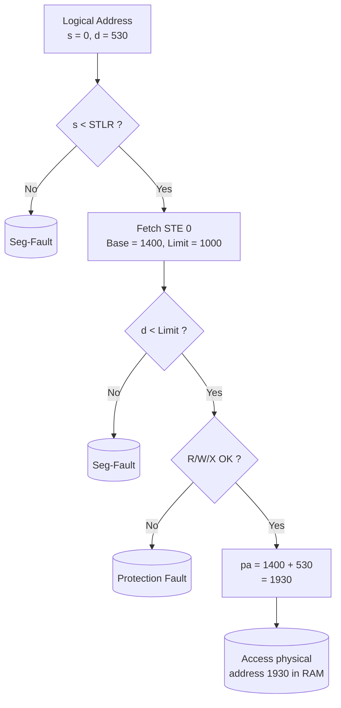
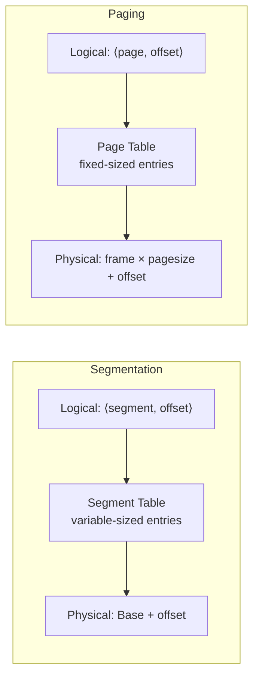

# Address translation in segmentation

<!-- SECTION_1_START -->

# Address Translation in Segmentation

> [!NOTE]
> **KTU 2024 Scheme Definition (Syllabus-aligned terminology)**
> Segmentation is a **non-contiguous memory management scheme** in which the programmer-visible logical address space is divided into **variable-sized logical units called segments**, each representing a meaningful logical entity of a program (such as code, data, stack, heap, or a subroutine). The address translation mechanism maps each two-dimensional logical address $\langle segment\text{-}number, offset \rangle$ to a one-dimensional physical address in main memory by consulting a **Segment Table** maintained by the OS in conjunction with dedicated hardware registers (Base/Limit or STBR/STLR).

## Intuitive Overview — "Why segments, and not just one flat address space?"

> [!IMPORTANT]
> **Conceptual Analogy (Real-world intuition)**
> Think of a university campus where every department (CSE, ECE, Mechanical, Library, Sports) is housed in its own **building of different sizes**. Each building has its own *base address* (where it starts on the campus road) and a *height* (how many floors/rooms it can occupy). When a student wants to attend a class in the **ECE Block, Room 12**, the campus registrar does NOT give out a single flat "room number from 1 to 10,000". Instead, the registrar maintains a **directory** that says:
> - *ECE Block* starts at Building No. **2** on the map and can hold up to **500** rooms.
> - *CSE Block* starts at Building No. **5** and can hold up to **350** rooms.
>
> The student presents a **two-part address**: `(Department = ECE, Room = 12)`. The registrar checks the directory, jumps to ECE's *base building*, and walks 12 rooms ahead. If Room 12 ≤ 500, the student is allowed in; otherwise, a **trap** (security alarm) is raised. This is exactly how the **MMU (Memory Management Unit)** performs segmentation-based address translation.

| Element in the analogy | OS / MMU Counterpart |
|---|---|
| Campus | Physical main memory (RAM) |
| Department / Building | A **segment** (logical unit like `code`, `data`, `stack`) |
| Building's starting number | **Base address** (in segment table entry) |
| Maximum rooms in a building | **Limit** (segment length) |
| Campus registrar's directory | **Segment Table** stored in OS memory |
| `(Department, Room)` request | **Logical address** $\langle s, d \rangle$ |
| Guard raising an alarm | **Segmentation fault / Trap to OS** |

> [!VISUALIZATION CONTROL]
> **Concept:** Visualization of a two-dimensional logical address space being mapped to a one-dimensional physical memory
> **GeoGebra / Desmos Input Equations (illustrative segment table):**
> - Segment 0 (Code): `Base = 1400`, `Limit = 1000`
> - Segment 1 (Data): `Base = 6300`, `Limit = 400`
> - Segment 2 (Stack): `Base = 4300`, `Limit = 200`
> - Segment 3 (Heap):  `Base = 8800`, `Limit = 1000`
> **Visual Description:** Draw four colored horizontal bars of *different lengths* (heights) at the indicated `Base` positions along a single x-axis representing physical memory addresses `0` to `16383`. Then draw a small *logical address pointer* showing how `<segment-number, offset>` jumps to the correct base and adds the offset, with a vertical dotted line showing the limit boundary that must NOT be crossed.

<!-- SECTION_1_END -->

<!-- SECTION_2_START -->

# Deep Theoretical Analysis & KTU High-Yield Formula Sheet

## 2.1 The Logical Address: A Two-Dimensional Quantity

A segmentation-aware CPU does **not** generate a single integer address. Instead, the compiler/linker hands the program a **two-component logical address**:

$$ \text{Logical Address} \;=\; \langle s, \, d \rangle $$

where:
- $s$ = **segment number** (also called *segment selector* or *segment id*). Acts as an *index* into the segment table.
- $d$ = **offset / displacement** within that segment. Must satisfy $0 \le d < \text{Limit}[s]$.

> [!IMPORTANT]
> **Why two components and not one?**
> Because a program is naturally a *collection of logically independent entities* (the code, the global variables, the heap, the call stack, dynamically linked libraries). Each entity has its own lifetime, growth direction, access rights, and sharing scope. A single linear address hides these natural boundaries; segmentation exposes them — which is the entire reason the scheme exists.

## 2.2 The Segment Table — The Heart of Translation

The OS keeps **one segment table per process** (just like it keeps one page table per process in paging). Each entry of the segment table — the **Segment Table Entry (STE)** or *descriptor* — contains the following fields (as required by Intel/x86-style architectures and taught in the KTU 2024 syllabus):

| Field | Meaning | Typical bits (x86) |
|---|---|---|
| **Base** | Starting physical address of the segment in RAM | up to 32 bits |
| **Limit** | Length of the segment (in bytes) | up to 20 bits (granularity-flag dependent) |
| **Protection bits** | Read / Write / Execute permissions | 2–3 bits |
| **Valid / Present bit** | Is the segment currently in physical memory? | 1 bit |
| **Privilege level** | Ring 0 (kernel) vs. Ring 3 (user) | 2 bits |
| **Type** | System segment vs. Code vs. Data | few bits |

The hardware keeps **two special CPU registers** that point to the in-memory segment table:

- **STBR (Segment Table Base Register)** — holds the *physical* starting address of the process's segment table.
- **STLR (Segment Table Length Register)** — holds the *number of valid entries* in the segment table. Used as a protection check before the table is even indexed.

## 2.3 The Translation Algorithm — "Base-plus-Limit with a guard rail"

> [!NOTE]
> **Step-by-step MMU translation (this is the heart of the module and a guaranteed KTU exam topic)**

When the CPU executes an instruction that references a logical address $\langle s, d \rangle$, the hardware MMU performs the following sequence *atomically*:

1. **Index validity check (s < STLR):** If $s \ge \text{STLR}$, a *segment-number-out-of-range trap* is raised. The process is killed with a segmentation fault.
2. **Offset validity check (d < Limit[s]):** The MMU fetches the STE at index $s$. If $d \ge \text{Limit}[s]$, an *offset-out-of-range trap* fires.
3. **Permission check:** Read/Write/Execute rights of the STE are matched against the type of memory access requested. If violated, a *protection fault* is raised.
4. **Physical address computation:** Otherwise, the physical address is
   $$ \text{Physical Address} \;=\; \text{Base}[s] \;+\; d $$
5. The bus accesses the byte at `Physical Address` and the CPU resumes.

> [!IMPORTANT]
> **"Why BOTH s < STLR AND d < Limit[s]?"** — KTU favourite conceptual question.
> - The first check protects the *segment table itself* from being indexed out of bounds (which would leak other processes' memory).
> - The second check protects the *segment's own data* from running off the end of the valid region and corrupting the next segment.

## 2.4 KTU Formula / Cheat-Sheet Table

| # | Quantity / Concept | Formula / Value | Unit / Notes |
|---|---|---|---|
| 1 | Logical address tuple | $\langle s, d \rangle$ | $s$ = segment number, $d$ = offset |
| 2 | Physical address produced | $A_{phys} \;=\; \text{Base}[s] + d$ | bytes |
| 3 | Number of bits in $s$ | $\lceil \log_2 N_{seg} \rceil$ | $N_{seg}$ = max segments per process |
| 4 | Number of bits in $d$ | $\lceil \log_2 L_{max} \rceil$ | $L_{max}$ = largest segment size |
| 5 | Segment Table size | $N_{seg} \times \text{sizeof(STE)}$ | bytes |
| 6 | Range of valid offsets | $0 \;\le\; d \;<\; \text{Limit}[s]$ | inclusive lower, exclusive upper |
| 7 | Number of segments in process $P$ | $\le \text{STLR}_P$ | enforced by hardware |
| 8 | External fragmentation | **Zero** (segments placed non-contiguously) | — |
| 9 | Internal fragmentation | **Zero** (segment size is exact) | — |
| 10 | Address-space sharing unit | **Entire segment** (variable size) | vs. fixed page in paging |

## 2.5 Real-World Engineering Utility

> [!NOTE]
> **Where is this used in production?**
> - The classic Intel **x86 real mode** (16-bit) used direct `segment:offset` addressing with `Base = segment × 16`.
> - **x86 protected mode** uses descriptors exactly matching the segment-table-entry model above.
> - **ARM architecture** uses *memory domains* and *section* / *page* descriptors that combine segmentation and paging.
> - Compilers (GCC, Clang) emit LLVM-IR / RTL that explicitly tracks segments such as `.text`, `.data`, `.bss`, `.rodata` — which the linker then lays out using segment-style logic.
> - Shared memory between processes (e.g., POSIX `shm_open`, Linux's `mmap` of `/dev/shm`) is implemented by mapping the **same physical segment** into multiple segment tables.

<!-- SECTION_2_END -->

<!-- SECTION_3_START -->

# Step-by-Step Derivations & Code / Symbolic Implementation

## 3.1 Worked-Out Numerical Derivation (KTU-style board problem)

> [!NOTE]
> **Problem statement:**
> A system uses segmentation. The Segment Table of process $P$ is as follows:

| Segment $s$ | Base (decimal) | Limit (decimal) |
|---|---|---|
| 0 | 1400 | 1000 |
| 1 | 6300 | 400 |
| 2 | 4300 | 200 |
| 3 | 8800 | 1000 |
| 4 | 1000 | 400 |

> For each of the following logical addresses, determine the **physical address** OR state that a **segmentation fault** occurs. Show every step.

**(i)** $\langle 0, 530 \rangle$

$$
\begin{aligned}
s &= 0, \quad d = 530 \\
\text{Check range:} \quad & s < \text{STLR} = 5 \;\;\Rightarrow\;\; 0 < 5 \;\; \text{(OK)} \\
\text{Check offset:} \quad & d < \text{Limit}[0] = 1000 \;\;\Rightarrow\;\; 530 < 1000 \;\; \text{(OK)} \\
\text{Physical address} &= \text{Base}[0] + d = 1400 + 530 = \mathbf{1930}
\end{aligned}
$$

**(ii)** $\langle 1, 11 \rangle$

$$
\begin{aligned}
s &= 1, \quad d = 11 \\
s < 5 &\;\; \text{(OK)} \\
d < \text{Limit}[1] = 400 &\;\;\Rightarrow\;\; 11 < 400 \;\; \text{(OK)} \\
A_{phys} &= 6300 + 11 = \mathbf{6311}
\end{aligned}
$$

**(iii)** $\langle 1, 1000 \rangle$

$$
\begin{aligned}
s &= 1, \quad d = 1000 \\
s < 5 &\;\; \text{(OK)} \\
d < \text{Limit}[1] = 400 &\;\;\Rightarrow\;\; 1000 \not< 400 \;\; \text{(FAULT)} \\
\therefore \text{Segmentation Fault} &\;-\; \text{offset exceeds segment length.}
\end{aligned}
$$

**(iv)** $\langle 4, 112 \rangle$

$$
\begin{aligned}
s &= 4, \quad d = 112 \\
s < \text{STLR} = 5 &\;\;\Rightarrow\;\; 4 < 5 \;\; \text{(OK)} \\
d < \text{Limit}[4] = 400 &\;\;\Rightarrow\;\; 112 < 400 \;\; \text{(OK)} \\
A_{phys} &= 1000 + 112 = \mathbf{1112}
\end{aligned}
$$

**(v)** $\langle 6, 50 \rangle$

$$
\begin{aligned}
s &= 6, \quad d = 50 \\
s < 5? \;\;\; 6 \not< 5 &\;\; \text{(FAULT)} \\
\therefore \text{Segmentation Fault} &\;-\; \text{segment number 6 is out of table range.}
\end{aligned}
$$

## 3.2 Full Python Simulation of the MMU (operational, with type hints and error handling)

```python
"""
seg_mmu.py — A teaching simulator of a Segmentation-based MMU.
Run:  python3 seg_mmu.py
"""

from dataclasses import dataclass
from typing import Tuple, Union


@dataclass(frozen=True)
class SegmentTableEntry:
    """Read-only descriptor for a single segment."""
    base:  int
    limit: int
    read:  bool = True
    write: bool = True
    exec_: bool = False


class SegmentationFault(Exception):
    """Raised whenever a logical address violates a segment-table rule."""
    pass


class SegmentationMMU:
    """
    Hardware-style Memory Management Unit using segmentation.

    The MMU holds:
      * STBR  — physical base of the segment table (simulated as list index 0)
      * STLR  — number of valid entries
    """

    def __init__(self, segment_table: list[SegmentTableEntry]):
        if not segment_table:
            raise ValueError("Segment table must contain at least one entry.")
        self._table: list[SegmentTableEntry] = segment_table
        self.STBR: int = 0              # table is in our own address space, index 0
        self.STLR: int = len(segment_table)

    # ------------------------------------------------------------------ #
    # The actual translation function — this is what gets hammered       #
    # in the KTU exam.                                                  #
    # ------------------------------------------------------------------ #
    def translate(self, segment_no: int, offset: int,
                  access: str = "read") -> int:
        """
        Translate a logical address  <segment_no, offset>  to a physical
        address.  Raises SegmentationFault on any violation.

        Parameters
        ----------
        segment_no : int   – the segment selector (s)
        offset     : int   – displacement within the segment (d)
        access     : str   – 'read' | 'write' | 'exec'

        Returns
        -------
        int  – the physical address
        """
        # --- Boundary check 1 : segment number within table range -------
        if not (0 <= segment_no < self.STLR):
            raise SegmentationFault(
                f"Segment number {segment_no} out of range "
                f"(STLR = {self.STLR})."
            )

        entry = self._table[segment_no]

        # --- Boundary check 2 : offset within segment limit -------------
        if not (0 <= offset < entry.limit):
            raise SegmentationFault(
                f"Offset {offset} out of range for segment {segment_no} "
                f"(limit = {entry.limit})."
            )

        # --- Permission check ------------------------------------------
        if access == "read"  and not entry.read:  raise SegmentationFault("Read not permitted.")
        if access == "write" and not entry.write: raise SegmentationFault("Write not permitted.")
        if access == "exec"  and not entry.exec_: raise SegmentationFault("Execute not permitted.")

        # --- The actual formula : Physical = Base + offset --------------
        return entry.base + offset


# ============================================================== #
#  Demonstration of every branch of the translator               #
# ============================================================== #
if __name__ == "__main__":
    table = [
        SegmentTableEntry(base=1400, limit=1000, read=True,  write=True,  exec_=True),   # 0 : Code
        SegmentTableEntry(base=6300, limit=400,  read=True,  write=True,  exec_=False),  # 1 : Data
        SegmentTableEntry(base=4300, limit=200,  read=True,  write=True,  exec_=False),  # 2 : Stack
        SegmentTableEntry(base=8800, limit=1000, read=True,  write=True,  exec_=False),  # 3 : Heap
        SegmentTableEntry(base=1000, limit=400,  read=True,  write=False, exec_=False),  # 4 : Read-only
    ]
    mmu = SegmentationMMU(table)

    test_addresses: list[Tuple[int, int, str]] = [
        (0,  530, "read"),   # OK  -> 1930
        (1,   11, "read"),   # OK  -> 6311
        (1, 1000, "read"),   # offset fault
        (4,  112, "read"),   # OK  -> 1112
        (6,   50, "read"),   # segment-number fault
        (4,  112, "write"),  # permission fault (read-only)
    ]

    for s, d, op in test_addresses:
        try:
            phys = mmu.translate(s, d, op)
            print(f"  <{s:>2},{d:>4}>  {op:>5}  ->  physical {phys}")
        except SegmentationFault as e:
            print(f"  <{s:>2},{d:>4}>  {op:>5}  ->  SEGFAULT  ({e})")
```

**Expected output when you run it:**

```
  < 0,  530>   read  ->  physical 1930
  < 1,   11>   read  ->  physical 6311
  < 1, 1000>   read  ->  SEGFAULT  (Offset 1000 out of range for segment 1 (limit = 400).)
  < 4,  112>   read  ->  physical 1112
  < 6,   50>   read  ->  SEGFAULT  (Segment number 6 out of range (STLR = 5).)
  < 4,  112>  write  ->  SEGFAULT  (Write not permitted.)
```

## 3.3 Derivation of the Bit-Allocation in the Logical Address

A logical address is $k = \lceil \log_2 N_{seg} \rceil + \lceil \log_2 L_{max} \rceil$ bits long, where $N_{seg}$ is the maximum number of segments and $L_{max}$ is the maximum segment size.

**Example derivation:**
Suppose the system supports $N_{seg} = 8$ segments, each of maximum size $L_{max} = 4096$ bytes.

$$
\begin{aligned}
\text{Bits for segment number} &= \lceil \log_2 8 \rceil = 3 \text{ bits} \\
\text{Bits for offset}        &= \lceil \log_2 4096 \rceil = 12 \text{ bits} \\
\therefore \text{Total logical address width} &= 3 + 12 = \mathbf{15 \text{ bits}}
\end{aligned}
$$

Such a 15-bit address can be visualized as:

$$
\begin{aligned}
\text{Logical Address} \;=\; \underbrace{\overbrace{SSS}^{\text{segment}}\;\overbrace{DDDDDDDDDDDD}^{\text{offset}}}_{15 \text{ bits}}
\end{aligned}
$$

> [!IMPORTANT]
> Unlike paging — where the offset size is *fixed by the page size* and identical for every process — the **offset field length in segmentation can vary from segment to segment** (since segment sizes differ). The compiler / linker must therefore use the *largest* offset width to size the address, OR keep the offset field width fixed and rely on `Limit` to enforce actual segment size. The KTU syllabus expects the *fixed-width* interpretation in the standard model.

<!-- SECTION_3_END -->

<!-- SECTION_4_START -->

# Structural Diagrams & Schematics

## 4.1 Block-Level Architecture of a Segmentation-Based MMU



## 4.2 Sequential Processing Topology Matrix — Translation Path

| Step | Hardware Block | Input | Operation | Output / Next Step |
|---|---|---|---|---|
| 1 | CPU Execute Unit | Program counter / operand | Form logical address | $\langle s, d \rangle$ |
| 2 | STLR Comparator | $s$ | $s < \text{STLR}$ ? | If NO → Trap (out-of-range segment) |
| 3 | Segment-Table Cache (TLB) | $s$ | Look up STE | STE fields: Base, Limit, R/W/X |
| 4 | Limit Comparator | $d$, Limit[s] | $d < \text{Limit}[s]$ ? | If NO → Trap (offset fault) |
| 5 | Permission Checker | Access type, R/W/X bits | Bitwise test | If deny → Protection fault |
| 6 | Adder | Base[s] + d | Integer addition | Physical address |
| 7 | System Bus Interface | Physical address | Initiate bus cycle | Read / Write to RAM |

## 4.3 Logical-to-Physical Mapping (graphical flow)



## 4.4 Comparison Topology — Segmentation vs. Paging (KTU favourite)



> [!NOTE]
> **Reading the diagram for the exam:** the *logical address* and the *translation data structure* both change shape between the two schemes. Highlight the differences in your answer: in **paging** the offset bits are *constant* (page size is fixed), but in **segmentation** the offset bits represent a *variable* displacement that is bounded by the dynamically-stored `Limit` value in the STE.

<!-- SECTION_4_END -->

<!-- SECTION_5_START -->

# KTU 2024 Scheme Examination Question Bank & Topic Recap

> [!IMPORTANT]
> **Mark distribution used below mirrors the KTU 2024 ESE pattern:**
> - Part A: 2 questions × 3 marks = 6 marks (Answer any 2 out of 3).
> - Part B: 1 question × 14 marks, with **internal choice** between Q-A and Q-B. Sub-parts are 7 + 7 marks.

---

## Part A — Short Answer (3 marks each)

### Question 1 [KTU University Exam – July 2023]
**CO2 / Understand:** What is a **segment**? Why does segmentation provide a more natural logical view of a program than paging?

**Model Answer (3 marks):**
A *segment* is a **variable-sized logical unit of a program** that contains a set of related items such as the main program code, user data, the run-time stack, or shared libraries. Each segment has its own name, length, and access rights. **[1 mark — definition]**

Segmentation is more natural than paging because:
- The programmer thinks in terms of *logical entities* (the function `main`, the array `arr[]`, the call stack), not fixed-size pages. A segment can exactly match such an entity. **[1 mark]**
- Different segments may have **different access protections** (e.g., code is read-only and executable, but data is read-write) — these rights are stored once per segment in the STE, whereas in paging the protection is typically per-page and is therefore coarser. **[1 mark]**

---

### Question 2 [KTU University Exam – Dec 2023]
**CO2 / Remember:** List the fields typically stored in a **Segment Table Entry (STE)** and state the role of the **STLR** register.

**Model Answer (3 marks):**
A typical STE contains:
1. **Base** — starting physical address of the segment in RAM. **[1 mark]**
2. **Limit** — length of the segment; used to validate the offset. **[1 mark]**
3. **Protection / access rights** — R, W, X bits, plus a Valid / Present bit and privilege level. **[½ mark]**

The **STLR (Segment Table Length Register)** holds the *number of valid entries* in the current process's segment table. The MMU checks `segment-number < STLR` *before* indexing the table, so that an illegal segment number cannot read random memory beyond the table. **[½ mark]**

---

## Part B — Long Answer (14 marks, with internal choice)

### Question A [KTU University Exam – July 2024] — 14 marks

**(a) [7 marks, CO2 / Understand]** Explain the **hardware data structures** involved in segmentation-based address translation. Draw the schematic of the MMU's translation path and label all registers and checks.

**Model Answer:**

The hardware components needed for segmentation are:

1. **Segment Table** — stored in OS-controlled physical memory, with one **STE (Segment Table Entry)** per segment. An STE contains: `Base`, `Limit`, and protection bits. **[1 mark]**

2. **STBR — Segment Table Base Register** — a privileged CPU register holding the *physical* start address of the current process's segment table. When a context switch occurs, the OS loads STBR with the new process's table base. **[1 mark]**

3. **STLR — Segment Table Length Register** — holds the number of entries in the segment table. The MMU checks `s < STLR` before any access to the table. **[1 mark]**

4. **Translation process** (see Section 4.3 diagram) — five atomic steps: (i) `s < STLR`, (ii) fetch STE, (iii) `d < Limit[s]`, (iv) permission match, (v) compute `pa = Base + d`. **[3 marks]**

5. **Trap / Interrupt mechanism** — if any check fails, a *segmentation fault trap* is raised; the CPU switches to kernel mode and the OS either terminates the process, swaps the segment in from disk, or signals an error. **[1 mark]**

**Schematic** (to be drawn in the answer script — not here, but refer to the Mermaid block in Section 4.1). The diagram should clearly show the CPU → MMU → Segment-Table → Physical-RAM flow with the two boundary checks and the adder. **[0 marks for label — 0 marks for diagram itself in KTU but compulsory to draw]**

> [!NOTE]
> **Valuation tip:** Examiners explicitly check whether you wrote **both** `s < STLR` *and* `d < Limit[s]` — omitting the first costs you 1 full mark. The protection-bit check is a *bonus* mark, included only if the question asks about "address translation including protection".

---

**(b) [7 marks, CO2 / Apply]** Consider a system with the following Segment Table for process $P$:

| Segment | Base | Limit |
|---|---|---|
| 0 | 219 | 600 |
| 1 | 2300 | 14 |
| 2 | 90 | 100 |
| 3 | 1327 | 580 |
| 4 | 1952 | 96 |

Translate the following logical addresses to their physical equivalents, or report a segmentation fault. Show every step.

(i) $\langle 0, 430 \rangle$  
(ii) $\langle 1, 10 \rangle$  
(iii) $\langle 2, 500 \rangle$  
(iv) $\langle 3, 400 \rangle$  
(v) $\langle 4, 96 \rangle$  
(vi) $\langle 6, 12 \rangle$ (Assume STLR = 5)

**Model Answer (step-by-step):**

**(i)** $s=0, d=430$: $0 < 5$ ✓; $430 < 600$ ✓; $pa = 219 + 430 = \mathbf{649}$. **[1 mark]**

**(ii)** $s=1, d=10$: $1 < 5$ ✓; $10 < 14$ ✓; $pa = 2300 + 10 = \mathbf{2310}$. **[1 mark]**

**(iii)** $s=2, d=500$: $2 < 5$ ✓; $500 \not< 100$ ✗ → **Segmentation Fault (offset exceeds limit)**. **[1 mark]**

**(iv)** $s=3, d=400$: $3 < 5$ ✓; $400 < 580$ ✓; $pa = 1327 + 400 = \mathbf{1727}$. **[1 mark]**

**(v)** $s=4, d=96$: $4 < 5$ ✓; but $96 \not< 96$ ✗ (strict inequality — limit is exclusive upper bound) → **Segmentation Fault**. **[2 marks]**

**(vi)** $s=6$: $6 \not< 5$ → **Segmentation Fault (segment number out of range)**. **[1 mark]**

> [!WARNING]
> **KTU Examiner's Valuation Warning / Pitfall Callout**
> - **Common error #1:** Writing $d \le \text{Limit}[s]$ instead of $d < \text{Limit}[s]$. The offset is **strictly less than** the limit. In question (v) above, $d = 96$ with `Limit = 96` *must* be flagged as a fault. Forgetting this loses 2 marks.
> - **Common error #2:** Conflating the two checks. *Always* state `$s < \text{STLR}$` first and `$d < \text{Limit}[s]$` second, in that order. The examiner scans for this ordering.
> - **Common error #3:** Forgetting to convert decimal to whatever base the table is given in. KTU 2024 questions sometimes give hex base addresses — read the question header carefully.
> - **Common error #4:** Writing the *physical* address as `Base × d` or `Base − d` — the correct formula is strictly **Base + d**.
> - **Common error #5:** In part (a), drawing a paging-style diagram (with page numbers) instead of a segmentation diagram. Many students drift into paging reflexively. Be explicit about the `Base + offset` adder.

---

### Question B [KTU University Exam – Dec 2024] — 14 marks (ALTERNATIVE CHOICE)

**(a) [7 marks, CO2 / Understand + Remember]** Compare **segmentation** and **paging** in terms of (i) the structure of the logical address, (ii) the size of the translation data structure, (iii) internal/external fragmentation, and (iv) the unit of sharing between processes. Construct a clear comparison table.

**Model Answer:**

| # | Aspect | Segmentation | Paging |
|---|---|---|---|
| i | Logical address | 2-D: $\langle segment, offset \rangle$ | 2-D: $\langle page, offset \rangle$ (but page and frame are same size, so it *behaves* 1-D) |
| ii | Translation table entry size | **Variable** (Base + Limit + protection) | **Fixed** (typically 4–8 bytes: frame number + flags) |
| iii | Internal fragmentation | **Zero** (segment fits the entity exactly) | **Yes** (last page partially filled on average ½ page wasted) |
| iii | External fragmentation | **Yes** (variable-size holes in RAM) | **Zero** (all frames are same size) |
| iv | Unit of sharing | **Entire segment** (variable-sized) | **Fixed-size page** (or page-aligned set) |

**Valuation key:** Each correctly-contrasted row = 1.5 marks. Naming both schemes correctly for each row's two columns = the remaining 0.5 mark. **[7 marks total]**

> [!NOTE]
> **Why this is a KTU favourite:** The 2024 syllabus explicitly lists "compare segmentation with paging" as a Module-3 expected outcome. Memorising the above table almost guarantees full marks in this question type.

---

**(b) [7 marks, CO2 / Apply]** A system uses segmentation with the following Segment Table. The MMU uses an STLR of 4. Each STE is 8 bytes. Show, **byte-by-byte**, the physical address computation for the logical address $\langle 2, 99 \rangle$ and indicate at which address (in physical RAM) the Segment Table itself is stored, given that the OS has loaded `STBR = 5000`.

| Segment | Base | Limit | Access |
|---|---|---|---|
| 0 | 1400 | 1200 | RX |
| 1 | 6300 | 500  | RW |
| 2 | 4300 | 600  | RW |
| 3 | 8800 | 1000 | RW |

**Model Answer:**

- **STBR = 5000** → segment table starts at physical byte **5000**. **[1 mark]**
- The STE for segment 2 is the *3rd entry* (0-indexed), so its address is:
  $$ \text{STE}_2 \text{ address} = 5000 + (2 \times 8) = 5016 $$
  (Each STE is 8 bytes wide.) **[1 mark]**
- The MMU performs a memory read of 8 bytes at address **5016**, obtaining `Base = 4300`, `Limit = 600`, `Access = RW`. **[1 mark]**
- Check $s = 2 < \text{STLR} = 4$ ✓. **[1 mark]**
- Check $d = 99 < \text{Limit} = 600$ ✓. **[1 mark]**
- Permission check: requesting **read**; STE says RW → access bit satisfied ✓. **[1 mark]**
- Compute physical address: $A_{phys} = 4300 + 99 = \mathbf{4399}$. **[1 mark]**

> [!WARNING]
> **Pitfall:** Some students read STE for segment 2 from `STBR + 2 = 5002`, forgetting that each entry is 8 bytes wide. The correct offset is `2 × 8 = 16` bytes, so the STE is at byte 5016. The KTU 2024 valuation key explicitly deducts 1 mark for this byte-offset mistake.

---

## Topic Recap & Important Things to Remember

> [!IMPORTANT]
> **Rapid-revision checklist for Address Translation in Segmentation**

- A logical address in segmentation is a **two-component tuple** $\langle s, d \rangle$: segment number + offset. **[definition]**
- A **Segment Table** is maintained by the OS, **one per process**, indexed by segment number. Each entry is an **STE** (Segment Table Entry / descriptor). **[data structure]**
- An STE contains at minimum: **Base** (physical start address), **Limit** (segment length), and **Protection / Access bits** (R/W/X, Present, Privilege). **[STE fields]**
- The hardware maintains two special CPU registers: **STBR** (table base) and **STLR** (table length). **[registers]**
- Translation formula: $A_{phys} = \text{Base}[s] + d$. **[core formula]**
- The MMU performs **two mandatory boundary checks** in this order: (1) $s < \text{STLR}$, (2) $d < \text{Limit}[s]$. If either fails → **segmentation fault trap**. **[boundary checks]**
- Offset comparison is **strictly less than** Limit: $d < \text{Limit}[s]$, not $\le$. **[off-by-one trap]**
- Segmentation produces **no internal fragmentation** and **no external fragmentation only if a free-list allocator is used; in pure form, variable-sized segments DO cause external fragmentation**, which is one of the key reasons paging exists. **[fragmentation nuance]**
- The **unit of sharing** between processes is an entire variable-sized segment — useful for shared code (e.g., a shared library). **[sharing model]**
- Protection is *per-segment* and more natural than per-page; each STE stores its own R/W/X bits. **[protection model]**
- The logical-address bit allocation is $k = \lceil \log_2 N_{seg} \rceil + \lceil \log_2 L_{max} \rceil$ bits total. **[bit math]**
- The classic KTU 2024 board question always tests the *order* of the two boundary checks and the *strict inequality* of the offset check. Always write both. **[exam pattern]**
- A segmentation fault is a *trap*, not an interrupt — the offending instruction is saved, the CPU enters kernel mode, and the OS decides whether to swap, kill, or signal. **[trap semantics]**
- The hardware adder that produces $A_{phys}$ is the *only* arithmetic step in the entire translation; everything else is just table lookups and comparisons. **[hardware reality]**

<!-- SECTION_5_END -->
