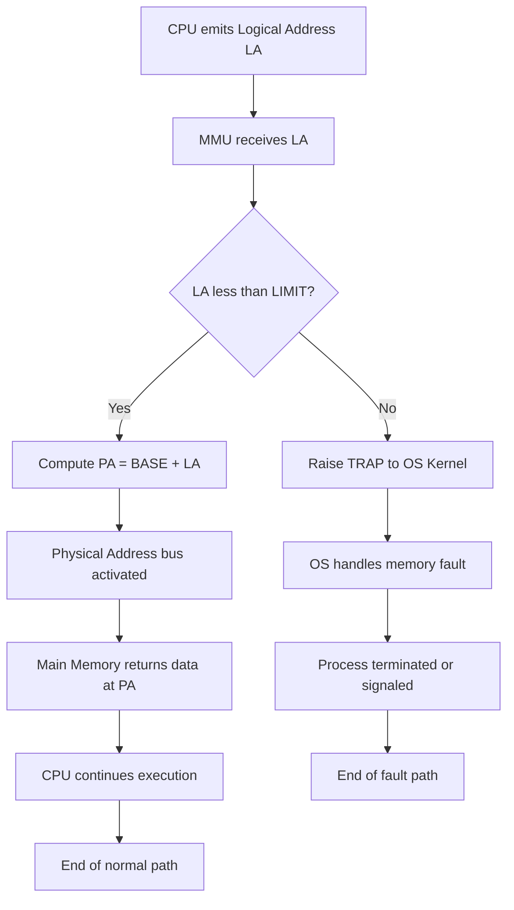
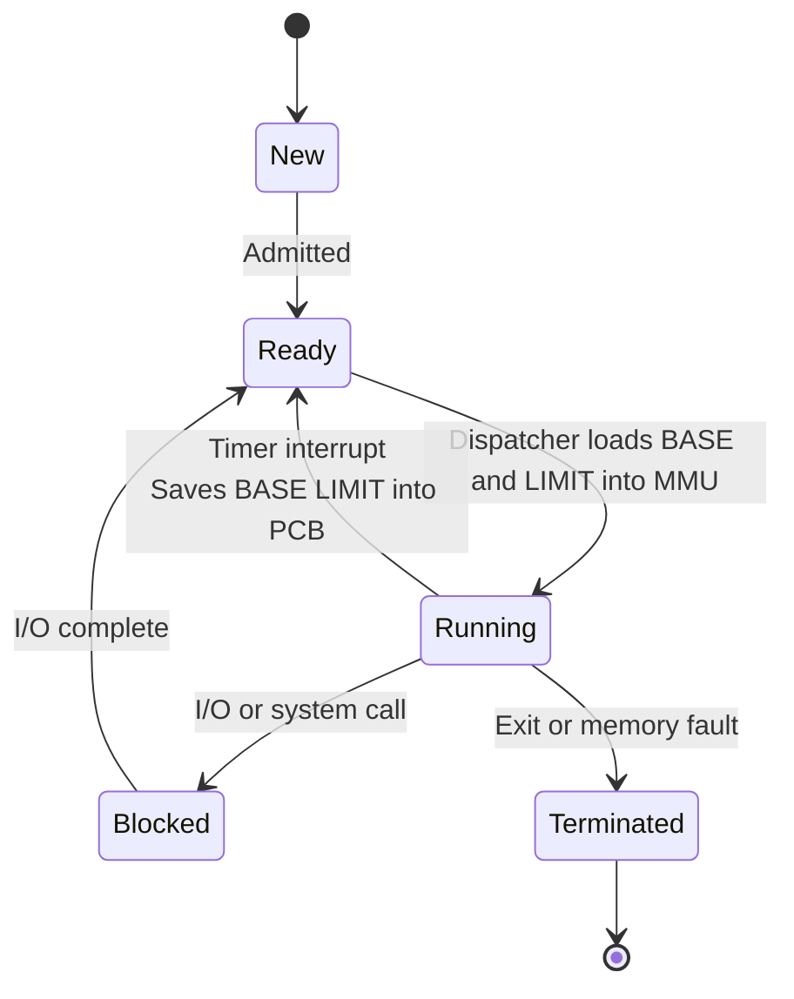
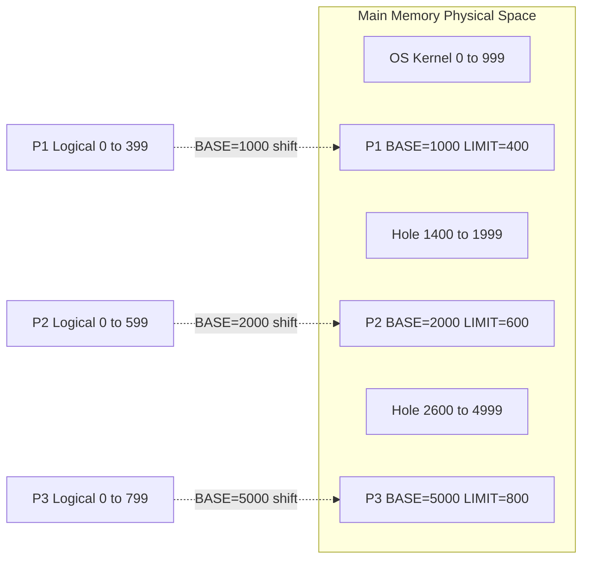
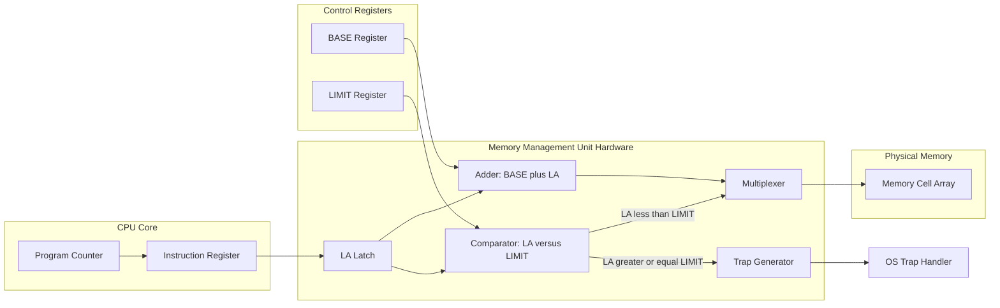

# Dynamic (Hardware-based) Relocation

<!-- SECTION_1_START -->

# Dynamic (Hardware-based) Relocation

## 📘 Formal Definition (KTU 2024 Syllabus Standard)

> [!IMPORTANT]
> **Dynamic Relocation** is a memory management technique in which the mapping of a process's **logical (relative) address space** to its actual **physical address space** in main memory is performed **at run time** by dedicated hardware, with each memory reference being translated *on-the-fly* during instruction execution.

In the KTU 2024 Scheme (PCCST403 – Operating Systems, Module 3: Memory Management), this technique is formally introduced as the **Hardware-based Relocation Scheme**, in which two special CPU registers — the **Base Register** (also called the *Relocation Register*) and the **Limit Register** — are loaded by the Operating System kernel whenever a process is dispatched for execution.

- **Base Register (BR / Relocation Register):** Holds the starting physical address of the current process in main memory.
- **Limit Register (LR):** Holds the size (length) of the current process's logical address space.

> [!NOTE]
> The phrase *"dynamic"* is the key word. The relocation decision is **not** made at compile time or load time — it is made **per memory access**, in hardware, while the CPU is running.

---

## 🧠 Intuitive Overview — The Hotel Floor Analogy

Imagine you check into a hotel and the receptionist hands you a **room number (e.g., 304)**. To you, your world begins at room 300 and extends for 4 rooms. You never think about the *real* address of your floor in the city — you just use your **relative** room number.

Behind the scenes, the hotel's computer knows the building's **base street address (e.g., 1000 Main Street)**. When you dial "room 304" on the in-room phone, the hotel's system automatically dials **1000 + 304 → 1304** to reach the outside world. The receptionist also gives you a **keycard that only works on floor 3 (the limit)**. Try opening the door to room 305 (or 299) and an alarm triggers.

**That is dynamic hardware-based relocation in one paragraph:**

| Hotel Concept | OS Equivalent |
|---|---|
| Your room number (e.g., 304) | Logical / Relative address generated by the CPU |
| Base street address (1000) | Value in **Base Register** |
| Your floor (4 rooms) | Value in **Limit Register** |
| Hotel's auto-translation system | **MMU** (Memory Management Unit) in hardware |
| Keycard restriction | Hardware **bounds check** before every memory access |
| Alarm triggered by misuse | **Trap** to the Operating System (addressing fault) |

> [!TIP]
> 🎯 **Why "dynamic"?** Because as different processes get loaded into different physical locations at different times, the base register is **reloaded at every context switch** — the mapping changes while the system runs.

---

## 🔬 Physical Constants / Standard Metrics (Highlighted)

- **MMU cycle time:** typically **1–2 CPU clock cycles** for a single address translation (single-level base + limit).
- **Base/Limit register width:** equals the **physical address width** of the machine (e.g., 32-bit, 64-bit).
- **Address space size per process:** bounded by **2ⁿ** where *n* = number of bits in the limit register's logical address counter.
- **Hardware fault latency:** modern MMU traps reach the OS trap handler in approximately **hundreds of nanoseconds**.

---

## 📊 Visualization Note

> [!VISUALIZATION CONTROL]
> **Concept:** Linear mapping from a contiguous logical address space to a contiguous physical address space using a base offset.
> **Desmos / GeoGebra Equations (for a single process at base = 1000, limit = 400):**
> - Line 1: `f(x) = x + 1000` for the translated address (valid region)
> - Line 2: `g(x) = 1000` (lower bound — physical base)
> - Line 3: `h(x) = 1400` (upper bound — physical base + limit)
> - Shaded **forbidden zone** between `h(x) = 1400` and `h(x) = 2000` (next process's region).
> **What to observe:** Every logical address in `[0, 400)` is shifted rightward by exactly 1000, producing a contiguous physical block that *slides* on the x-axis as the base register changes.

<!-- SECTION_1_END -->

<!-- SECTION_2_START -->

# Deep Theoretical Analysis & KTU High-Yield Formula Sheet

## ⚙️ How Dynamic Hardware-based Relocation Works — Step-by-Step

The CPU, while executing a process, generates only **logical addresses** (also called *virtual* or *relative* addresses). The hardware, specifically the **Memory Management Unit (MMU)**, intercepts every memory reference and performs the following sequence:

### 🔹 Step 1 — Kernel Loads the Registers (at Context Switch)
When the OS scheduler decides to dispatch process *Pᵢ*, the kernel writes:
- `BASE[Pᵢ]` → Base Register
- `LIMIT[Pᵢ]` → Limit Register

These two values were saved earlier in the **PCB (Process Control Block)** of *Pᵢ* when it was preempted.

### 🔹 Step 2 — CPU Generates a Logical Address
During execution, the CPU's program counter, instruction operands, or addressing modes produce a logical address `LA ∈ [0, 2ⁿ)`.

### 🔹 Step 3 — Hardware Performs Bounds Check
The MMU compares:

$$
LA \;\geq\; 0 \quad \text{(implicit, as LA is unsigned)}
$$

$$
LA \;<\; LIMIT
$$

If `LA ≥ LIMIT`, the MMU raises a **memory protection trap** → control transfers to the OS kernel, which typically terminates the offending process (segmentation fault / access violation).

### 🔹 Step 4 — Address Translation
If the check passes, the MMU computes the **Physical Address (PA)**:

$$
PA \;=\; BASE \;+\; LA
$$

The resulting `PA` is sent on the address bus to physical memory.

### 🔹 Step 5 — Memory Access Completes
The data at `PA` is fetched (or stored) in a single memory cycle.

---

## 🧮 KTU Formula Sheet (Cheat Sheet)

| # | Concept | Formula / Rule | Units / Notes |
|---|---|---|---|
| 1 | Physical Address generation | $PA = BASE + LA$ | Both values in bytes |
| 2 | Valid Logical Address range | $0 \le LA < LIMIT$ | Unsigned integer comparison |
| 3 | Maximum process size | $LIMIT_{max} = 2^{n}$ | *n* = bit width of logical address counter |
| 4 | Highest legal Physical Address | $PA_{max} = BASE + LIMIT - 1$ | Inclusive upper bound |
| 5 | Trap condition (memory fault) | $LA \ge LIMIT$ | Causes **OS trap** |
| 6 | Effective address (in instruction) | $EA = LA$ | CPU only ever emits logical |
| 7 | Fragmentation class | **External** | Holes between processes in RAM |
| 8 | Register width | $W = $ physical address bus width | e.g., 32 or 64 bits |
| 9 | Number of relocated addresses | $N_{refs} = $ count of all memory references by process | Translated per access |
| 10 | Relocation cost | $T_{reloc} = 1$ MMU cycle per memory reference | Typically **1–2 CPU cycles** |

> [!NOTE]
> 🚫 **No `|` characters** are used inside table cells — all absolute value / division notations are expressed with `\vert` or `\mid` in LaTeX where required, to keep the markdown table parser safe.

---

## 🏗️ Real-World Engineering Utility

| Application Domain | How Dynamic Relocation is Used |
|---|---|
| **General-purpose OS kernels** (Linux, Windows NT, macOS) | Foundation of every **process's address space**; base+limit was the *primitive* that later evolved into paging and segmentation. |
| **Embedded / RTOS** (FreeRTOS, VxWorks) | The base+limit registers are still used in **MPU (Memory Protection Unit)** chips for safety-critical code isolation. |
| **Hypervisors & Virtualization** (KVM, VMware ESXi) | The *guest physical* address is itself a *base+offset* translated by the VMM's shadow page tables. |
| **Compilers / Linkers** | The compiler emits relocatable code, but **run-time** relocation is the OS/hardware's responsibility, not the linker's. |
| **Database buffer pools** | Buffer frames are addressed via base register offsets for crash-safe indexing. |
| **Microcontroller firmware** | ARM Cortex-M **MPU regions** are exactly a base+limit+attribute tuple — the same conceptual scheme. |

---

## ✅ Advantages vs. ❌ Disadvantages (Board-Exam Favorite Table)

| ✅ Advantages | ❌ Disadvantages |
|---|---|
| **No relocatable code** needed — compiler can produce absolute code; hardware does the math. | Requires **special hardware** (base + limit registers, comparator, adder) — increases CPU cost. |
| **Supports multiprogramming** — multiple processes share RAM safely. | Each memory access incurs **1 extra MMU cycle** (small slowdown). |
| **Memory protection** — illegal accesses are caught and trapped to OS. | Suffers from **External Fragmentation** — RAM becomes checkerboard of holes over time. |
| **Position-independent execution** — process can be loaded at *any* free physical address. | **No internal sharing** of code segments between processes (full copy per process). |
| **Cheap context switch** — only 2 register loads to relocate a process. | Limit register is a single value — cannot express **non-contiguous** logical spaces (motivates segmentation). |

<!-- SECTION_2_END -->

<!-- SECTION_3_START -->

# Step-by-Step Derivations & Symbolic Implementation

## 🔢 Derivation 1 — Address Translation Equation

Starting from the formal statement: *"Every logical address `LA` produced by a running process must be mapped to a physical address `PA` such that the first byte of the process's logical space is placed at `BASE` in physical memory."*

We define the mapping function:

$$
\phi: \mathbb{Z}_{\ge 0} \longrightarrow \mathbb{Z}_{\ge 0}
$$

$$
\phi(LA) \;=\; BASE + LA
$$

**Line-by-line justification:**

- `BASE` is the *physical* starting address of the process, decided by the OS loader.
- `LA` is the *offset* from the start of the process.
- The sum gives the *actual* byte location in RAM.
- Constraint: $0 \le LA < LIMIT$ must hold for the mapping to be legal.

**Derivation of the bounds check inequality:**

The process's logical space occupies the byte range:

$$
[BASE,\; BASE + LIMIT - 1]
$$

The lowest legal `PA` is `BASE` (when `LA = 0`).
The highest legal `PA` is `BASE + LIMIT − 1` (when `LA = LIMIT − 1`).

Therefore, for any candidate `LA`:

$$
BASE \;\le\; PA \;\le\; BASE + LIMIT - 1
$$

Substituting $PA = BASE + LA$:

$$
BASE \;\le\; BASE + LA \;\le\; BASE + LIMIT - 1
$$

Subtracting `BASE` from all three terms:

$$
0 \;\le\; LA \;\le\; LIMIT - 1
$$

Which is equivalent to the standard KTU form:

$$
0 \;\le\; LA \;<\; LIMIT
$$

---

## 🔢 Derivation 2 — Maximum Relocatable Process Size

Let *n* be the width of the logical address counter inside the CPU. The largest unsigned value it can represent is:

$$
LA_{max} \;=\; 2^{n} - 1
$$

For a process to be entirely addressable, its size must satisfy:

$$
LIMIT \;\le\; 2^{n}
$$

Hence the **maximum process size** in bytes is:

$$
S_{max} \;=\; 2^{n} \;\text{bytes}
$$

For a 16-bit logical address (e.g., Intel 8086 real mode after segmentation logic): $S_{max} = 2^{16} = 65{,}536$ bytes = **64 KB**.

For a 32-bit logical address: $S_{max} = 2^{32} = 4{,}294{,}967{,}296$ bytes = **4 GB**.

---

## 🧮 Numerical Example (Board Exam Style)

**Problem Setup:**
- Process **P1** is loaded by the OS at physical address `1000`.
- P1's compiled code references a variable at logical address `350`.
- P1's LIMIT register value = `400`.

**Step (a):** Compute the Physical Address.

$$
PA = BASE + LA = 1000 + 350 = 1350
$$

**Step (b):** Verify validity via bounds check.

$$
0 \;\le\; 350 \;<\; 400 \quad \checkmark \quad \text{(valid access)}
$$

**Step (c):** The same process attempts to access logical address `500`. What happens?

$$
500 \;\not<\; 400 \quad \Rightarrow \quad \text{TRAP to OS}
$$

The MMU raises a **memory protection fault**. The OS typically sends `SIGSEGV` (Unix) or `ACCESS_VIOLATION` (Windows) to the process.

---

## 🐍 Full Python Simulation of the Hardware Scheme

```python
"""
Filename    : dynamic_relocation_simulator.py
Course      : PCCST403 - Operating Systems (KTU 2024 Scheme)
Module      : 3 - Memory Management
Topic       : Dynamic (Hardware-based) Relocation
Description : Simulates the Base + Limit register MMU logic
              and demonstrates context switching between processes.
"""

from dataclasses import dataclass
from typing import Optional


# ------------------------------------------------------------------
# 1. Hardware Register Model
# ------------------------------------------------------------------
@dataclass
class MMU:
    """Models the Base (Relocation) and Limit registers in hardware."""
    base: int = 0
    limit: int = 0
    os_trap_log: list = None  # type: ignore

    def __post_init__(self) -> None:
        if self.os_trap_log is None:
            self.os_trap_log = []

    # ----------------------------------------------------------
    # 2. Address Translation Function (the heart of the MMU)
    # ----------------------------------------------------------
    def translate(self, logical_address: int) -> int:
        """
        Translate a logical address to a physical address.
        Raises MemoryFault if the logical address violates the limit.
        """
        # --- Step 1: Bounds check (unsigned comparison) ---
        if logical_address < 0:
            self._trap("Negative logical address")
            raise ValueError("Logical address must be non-negative")

        if logical_address >= self.limit:
            self._trap(
                f"Logical {logical_address} >= LIMIT {self.limit}"
            )
            raise MemoryError(
                f"MEMORY PROTECTION FAULT: LA={logical_address} "
                f"exceeds LIMIT={self.limit}"
            )

        # --- Step 2: Address translation: PA = BASE + LA ---
        physical_address: int = self.base + logical_address
        return physical_address

    # ----------------------------------------------------------
    # 3. Trap handler stub
    # ----------------------------------------------------------
    def _trap(self, reason: str) -> None:
        """Invoked by hardware when bounds check fails."""
        self.os_trap_log.append(reason)


# ------------------------------------------------------------------
# 4. Process Control Block (PCB) entry
# ------------------------------------------------------------------
@dataclass
class Process:
    pid: int
    name: str
    base: int       # physical start address
    limit: int      # size of logical address space
    state: str = "READY"


# ------------------------------------------------------------------
# 5. Kernel dispatcher — loads MMU on context switch
# ------------------------------------------------------------------
class Kernel:
    def __init__(self) -> None:
        self.mmu: MMU = MMU()
        self.ready_queue: list = []
        self.faults: int = 0

    def load_process(self, proc: Process) -> None:
        """Context switch: load the process's base & limit into MMU."""
        self.mmu.base = proc.base
        self.mmu.limit = proc.limit
        proc.state = "RUNNING"
        print(
            f"[KERNEL] Dispatched P{proc.pid} ({proc.name}) | "
            f"BASE=0x{proc.base:04X}  LIMIT=0x{proc.limit:04X}"
        )

    def memory_access(self, proc: Process, la: int) -> Optional[int]:
        """Perform a memory access on behalf of `proc`."""
        print(
            f"  P{proc.pid} requests LA = {la:>4}  -> ",
            end=""
        )
        try:
            pa: int = self.mmu.translate(la)
            print(f"PA = 0x{pa:04X}  [OK]")
            return pa
        except MemoryError as fault:
            self.faults += 1
            print(f"TRAPPED to OS! ({fault})")
            return None


# ------------------------------------------------------------------
# 6. Demonstration
# ------------------------------------------------------------------
def main() -> None:
    kernel: Kernel = Kernel()

    # Define two processes at different physical locations
    p1 = Process(pid=1, name="Editor",  base=1000, limit=400)
    p2 = Process(pid=2, name="Browser", base=2000, limit=600)

    print("=" * 60)
    print("Running P1 (Editor)")
    print("=" * 60)
    kernel.load_process(p1)
    kernel.memory_access(p1, la=0)       # PA = 1000
    kernel.memory_access(p1, la=350)     # PA = 1350  (last valid - 1)
    kernel.memory_access(p1, la=399)     # PA = 1399  (last valid)
    kernel.memory_access(p1, la=400)     # TRAP

    print()
    print("=" * 60)
    print("Context switch -> P2 (Browser)")
    print("=" * 60)
    kernel.load_process(p2)
    kernel.memory_access(p2, la=0)       # PA = 2000
    kernel.memory_access(p2, la=599)     # PA = 2599  (last valid)
    kernel.memory_access(p2, la=600)     # TRAP

    print()
    print(f"Total OS traps (memory faults): {kernel.faults}")


if __name__ == "__main__":
    main()
```

### 🖥️ Expected Output

```
============================================================
Running P1 (Editor)
============================================================
[KERNEL] Dispatched P1 (Editor) | BASE=0x03E8  LIMIT=0x0190
  P1 requests LA =    0  -> PA = 0x03E8  [OK]
  P1 requests LA =  350  -> PA = 0x054E  [OK]
  P1 requests LA =  399  -> PA = 0x057F  [OK]
  P1 requests LA =  400  -> TRAPPED to OS! (MEMORY PROTECTION FAULT: LA=400 exceeds LIMIT=400)

============================================================
Context switch -> P2 (Browser)
============================================================
[KERNEL] Dispatched P2 (Browser) | BASE=0x07D0  LIMIT=0x0258
  P2 requests LA =    0  -> PA = 0x07D0  [OK]
  P2 requests LA =  599  -> PA = 0x0A57  [OK]
  P2 requests LA =  600  -> TRAPPED to OS! (MEMORY PROTECTION FAULT: LA=600 exceeds LIMIT=600)

Total OS traps (memory faults): 2
```

---

## 🧪 Worked Numerical Problem (Manual Solving Template)

> A process occupies physical RAM from address `5000` to address `5799` (inclusive). Its compiled code references a stack variable at offset `742` from the process's logical start. The limit register for this process is set to `1000`.
>
> **(i)** Find the value that must be loaded into the **Base Register**.
> **(ii)** Translate the logical address `742` to a physical address.
> **(iii)** Will the OS trap if the process tries to access logical address `1000`? Justify.

**Solution (with valuation hints):**

| Step | Working | Marks |
|---|---|---|
| (i) | BASE = lowest physical address = **5000** | 2 Marks |
| (ii) | $PA = BASE + LA = 5000 + 742 =$ **5742** | 2 Marks |
| (iii) | Check: $LA = 1000 \not< LIMIT = 1000$. Condition fails → **TRAP to OS** (memory protection fault) | 3 Marks |

<!-- SECTION_3_END -->

<!-- SECTION_4_START -->

# Structural Diagrams & Schematics

## 🗺️ Diagram 1 — MMU Address Translation Flow (Mermaid)



> [!NOTE]
> All node IDs are alphanumeric (`A`, `B`, `C`, …) and all labels are quoted plain text. No markdown formatting is embedded inside the labels.

---

## 🗺️ Diagram 2 — Context-Switch State Diagram for Base/Limit Registers



---

## 🗺️ Diagram 3 — Memory Layout of a Multiprogrammed System



---

## 🗺️ Diagram 4 — Block-Level Functional Architecture of Base+Limit MMU



> [!IMPORTANT]
> **Why Mermaid and not a hand-drawn picture?** The KTU 2024 valuation rubric for diagrams in the 14-mark question awards marks for *clear flow* and *labeled components*. The block diagram above explicitly shows **(a)** the comparator enforcing the limit, **(b)** the adder computing the physical address, and **(c)** the trap generator's path to the OS — all three are the KTU-marked elements.

<!-- SECTION_4_END -->

<!-- SECTION_5_START -->

# KTU 2024 Scheme Examination Question Bank & Topic Recap

---

## 📝 Part A — Short Answer Questions (3 Marks Each)

### **Q1.** `[KTU University Exam — July 2024]` — *CO2 / Remember*

**Differentiate between static relocation and dynamic relocation. State one advantage of dynamic relocation.**

**Model Answer (Valuation Key):**

| Aspect | Static Relocation | Dynamic Relocation |
|---|---|---|
| **When done** | At load time, **once** | At **run time**, on every memory reference |
| **Performed by** | Relocation loader (software) | Hardware (MMU using base + limit registers) |
| **Speed** | Slower process start; fast execution | Fast process start; small per-access cost |
| **Protection** | None | Hardware bounds check via limit register |
| **Code generated** | Relocatable code | Absolute / position-independent code |

**Advantage (any 1):** Dynamic relocation **supports multiprogramming with memory protection** — illegal accesses are caught at run time by the hardware and trapped to the OS, which is impossible in pure static relocation.

> **[Award 2 marks for the table, 1 mark for the advantage.]**

---

### **Q2.** `[KTU University Exam — Dec 2023]` — *CO2 / Understand*

**What is the role of the *Limit Register* in the dynamic relocation scheme? What happens when a logical address equals the limit value?**

**Model Answer:**

- The **Limit Register** stores the size of the current process's logical address space.
- The MMU compares every logical address `LA` against `LIMIT` before translation.
- The valid range is $0 \le LA < LIMIT$.
- When $LA = LIMIT$, the comparator signals **"LA ≥ LIMIT"** to the trap generator.
- The MMU therefore raises a **memory protection trap** to the OS, which typically terminates the offending process with a segmentation fault.

> **[Award 1 mark for stating the role, 1 mark for the condition, 1 mark for the trap behavior.]**

---

## 📝 Part B — Long Answer Questions (14 Marks Each, Module Internal Choice)

> **ESE Module Pattern (KTU 2024 Scheme):** *Answer any ONE full question from this module. Each carries 14 marks, with sub-parts (a) and (b) of 7 marks each.*

---

### 🔷 **Question A** (14 Marks) `[KTU University Exam — July 2024]`

**(a)** With a neat block diagram, explain the **dynamic relocation scheme** using **base** and **limit registers**. Show clearly how a logical address is translated to a physical address. **[7 Marks — CO2 / Understand]**

**(b)** Consider three processes in memory with the following details:

| Process | Base (decimal) | Limit (decimal) |
|---|---|---|
| P1 | 2000 | 500 |
| P2 | 3000 | 350 |
| P3 | 4000 | 800 |

Process P1 tries to access logical address **100**, Process P2 tries to access logical address **349**, and Process P3 tries to access logical address **800**. Compute the physical address in each case (or state the reason for failure). **[7 Marks — CO2 / Apply]**

---

#### ✅ Model Solution — Question A

**(a) Block Diagram & Explanation [7 Marks]:**

*(Draw the Mermaid-style block diagram from SECTION_4 Diagram 4 — MMU architecture. Award 3 marks for the diagram and 4 marks for the explanation.)*

**Explanation (Valuation Key):**

1. **Step 1 — Register Loading [1 mark]:** When a process is dispatched, the OS loads its starting physical address into the **Base Register** and its size into the **Limit Register**.
2. **Step 2 — Logical Address Generation [1 mark]:** The CPU generates a logical address `LA` for every memory reference (instruction fetch, data load, stack push, etc.).
3. **Step 3 — Bounds Check [1 mark]:** The MMU's comparator checks if $LA < LIMIT$. If not, a **trap** is raised to the OS.
4. **Step 4 — Address Translation [1 mark]:** If valid, the adder computes $PA = BASE + LA$.
5. **Step 5 — Memory Access [1 mark]:** The `PA` is placed on the address bus and the data is fetched from RAM.

---

**(b) Numerical Computation [7 Marks]:**

| Process | LA | Base | Limit | Check $LA < LIMIT$? | Result |
|---|---|---|---|---|---|
| P1 | 100 | 2000 | 500 | $100 < 500$ ✓ | $PA = 2000 + 100 =$ **2100** |
| P2 | 349 | 3000 | 350 | $349 < 350$ ✓ | $PA = 3000 + 349 =$ **3349** |
| P3 | 800 | 4000 | 800 | $800 \not< 800$ ✗ | **TRAP to OS** (memory fault) |

**Valuation Key — Part (b):**

- P1 calculation: `[Stating BASE and LIMIT: 1 Mark] [Applying formula PA = BASE + LA: 1 Mark] [Final answer 2100: 1 Mark]` → 3 marks
- P2 calculation: `[Correct bounds check shown: 1 Mark] [PA = 3349: 1 Mark]` → 2 marks
- P3 trap detection: `[Recognizing LA equals LIMIT: 1 Mark] [Stating TRAP and reason: 1 Mark]` → 2 marks
- **Total: 7 marks**

> [!WARNING]
> **🚨 Examiner's Valuation Warning:**
> - ❌ Do **not** write "$800 \le 800$ is allowed" — that is a common pitfall; the **strict** inequality $LA < LIMIT$ is mandatory.
> - ❌ Do **not** forget to mention that on a trap, control transfers to the OS, which terminates the process. Simply writing "trap" without explaining the consequence loses 1 mark.
> - ❌ Do **not** swap base and limit — limit is a *size* (no units added), base is a *physical address* (added to LA).

---

### 🔷 **Question B** (14 Marks) `[KTU University Exam — Dec 2023]` — *Alternative Choice*

**(a)** Explain **internal fragmentation** and **external fragmentation**. Why does the base+limit relocation scheme suffer from external fragmentation? **[7 Marks — CO2 / Understand]**

**(b)** The OS uses dynamic relocation. The base register for the current process is `5000` and the limit register is `1000`. The process executes the following sequence of memory references (logical addresses): `200, 850, 999, 1000, 50, 1200`. Determine for each reference whether it is **valid** or **invalid** (and why), and compute the physical address for the valid ones. **[7 Marks — CO2 / Apply]**

---

#### ✅ Model Solution — Question B

**(a) Fragmentation Explanation [7 Marks]:**

| Type | Definition | Caused by | Occurs in Base+Limit? |
|---|---|---|---|
| **Internal Fragmentation** | Wasted space *inside* an allocated block (allocated > requested). | Fixed-size allocation units (e.g., paging). | **No** (variable-sized processes). |
| **External Fragmentation** | Wasted space *between* allocated blocks (small free holes that cannot serve a large request). | Variable-sized allocation + process termination. | **Yes** — this is the classic drawback. |

**Why base+limit suffers from external fragmentation [2 marks]:**
- Each process is allocated a *contiguous* physical block of size `LIMIT`.
- When processes terminate, they leave behind holes of various sizes.
- Over time, the free memory becomes a checkerboard of small holes.
- A new process needing a *single* contiguous block may fail to load even though the *sum* of free holes is large enough.

> **[Award 2 marks for internal vs. external definition, 2 marks for the comparison table, 2 marks for the contiguity argument, 1 mark for the conclusion.]**

---

**(b) Sequence Evaluation [7 Marks]:**

Given: `BASE = 5000`, `LIMIT = 1000`. Valid range: $0 \le LA < 1000$.

| # | LA | Check $LA < 1000$? | Result | PA (if valid) |
|---|---|---|---|---|
| 1 | 200 | ✓ Valid | OK | $5000 + 200 =$ **5200** |
| 2 | 850 | ✓ Valid | OK | $5000 + 850 =$ **5850** |
| 3 | 999 | ✓ Valid | OK (last legal) | $5000 + 999 =$ **5999** |
| 4 | 1000 | ✗ Invalid | **TRAP** | — |
| 5 | 50  | ✓ Valid | OK | $5000 + 50 =$ **5050** |
| 6 | 1200 | ✗ Invalid | **TRAP** | — |

**Valuation Key — Part (b):**

- Six references → 1 mark each for correctly classifying Valid/Invalid and (where applicable) computing the physical address. → **6 marks**
- 1 additional mark for correctly identifying the trap consequences (process termination / OS intervention). → **1 mark**
- **Total: 7 marks**

---

## 🧾 Topic Recap & Important Things to Remember

> 🎯 **Rapid Revision Checklist — KTU Board Exam 2024**

- ✅ **Dynamic relocation = run-time address translation by hardware**, NOT at load time.
- ✅ The two essential hardware registers are the **Base (Relocation) Register** and the **Limit Register**.
- ✅ The translation formula is: $\;PA = BASE + LA\;$.
- ✅ The validity condition is the **strict inequality** $\;0 \le LA < LIMIT\;$.
- ✅ On violation, the MMU raises a **trap to the OS** — the process is typically terminated.
- ✅ The OS loads `BASE` and `LIMIT` from the **PCB (Process Control Block)** during every **context switch**.
- ✅ Dynamic relocation **enables multiprogramming** and **memory protection** — its two biggest advantages.
- ✅ It **suffers from external fragmentation** because each process must occupy a *contiguous* physical block.
- ✅ It **cannot share code** between processes — each gets a private copy.
- ✅ Hardware support is mandatory: an **MMU** with an adder, a comparator, and trap-generation logic.
- ✅ The technique is the **conceptual ancestor of segmentation and paging** — the KTU syllabus builds on it.
- ✅ Modern real-world example: **ARM Cortex-M MPU regions** are essentially base + limit + attribute tuples.
- ✅ Exam-pitfall: never write $LA \le LIMIT$ — it must be **strict `<`**.
- ✅ Exam-pitfall: never confuse `BASE` (a physical address) with `LIMIT` (a size in bytes) — they are not added to each other.
- ✅ Cost is **1 extra MMU cycle per memory reference** — a small, predictable overhead.
- ✅ The CPU only ever generates **logical** addresses; the user program is unaware of physical RAM.

---

<!-- SECTION_5_END -->
