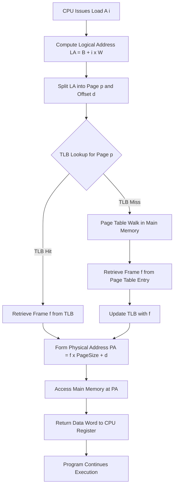
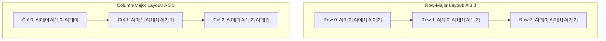

# Example: Accessing An Array

<!-- SECTION_1_START -->
# 1. Core Technical Definition & Intuitive Overview

## 1.1 Formal Definition (KTU 2024 Syllabus Terminology)

In Operating Systems, **Accessing an Array** is a canonical example used to demonstrate **Logical-to-Physical Address Translation** under a given memory management scheme (contiguous allocation, paging, or segmentation). An array is a homogeneous, contiguous, indexed data structure stored in primary memory such that the address of any element can be deterministically computed from its index (or indices) and the base address of the array.

Formally, for an array $A$ with base address $B$, element size $W$ (in bytes), and lower bound $LB$, the logical address of element $A[i]$ (1-D) is given by:

$$\text{Addr}(A[i]) = B + (i - LB) \times W$$

This single line encapsulates the very principle on which every Memory Management Unit (MMU) operates — **deterministic address arithmetic**.

## 1.2 Conceptual Analogy (Intuition)

> [!IMPORTANT]
> **The Hotel-Room Analogy**
> Imagine a long hotel corridor (memory) where every room is the *same size* (element width $W$) and rooms are numbered sequentially starting from room 100 (base address $B$). If a guest asks "Where is room number 137?", the receptionist doesn't walk down 37 doors checking each one. She computes it instantly:
> $$\text{Room} = 100 + (137 - 100) \times 1 = 137$$
> This is **exactly** how the CPU/MMU locates `A[i]`. The base address is the starting point, and the offset is a *calculated displacement*, not a *search*.

| Memory Concept | Hotel Analogy |
| :--- | :--- |
| Base address $B$ | First room number |
| Element width $W$ | Size of one room |
| Index $i$ | Distance from first room |
| Contiguous allocation | Rooms in a single, unbroken corridor |

> [!NOTE]
> **KTU 2024 Highlight:** The array access example is *the* introductory problem in Module 3 because it forces the student to distinguish between **logical (virtual) addresses** seen by the program and **physical (real) addresses** delivered to the RAM chip. Mastery of this distinction is the prerequisite for paging, segmentation, and virtual memory.

## 1.3 GeoGebra / Desmos Visualization

> [!VISUALIZATION CONTROL]
> **Concept:** Address offsets as a linear function of the index (1-D Array).
> **Desmos Input Equations:**
> * `f(x) = 1000 + (x) * 4` &nbsp;&nbsp;(Base = 1000, Width = 4 bytes, Lower bound = 0)
> * Point: `(0, 1000)`
> * Point: `(5, 1020)`
> **Visual Description:** A straight line with slope $W = 4$ on the $x$–$y$ plane where the $x$-axis is the array index and the $y$-axis is the computed memory address. The line cuts the $y$-axis at $B = 1000$. The student should observe that **every increment in the index increases the address by a fixed stride** $W$, confirming contiguity.

<!-- SECTION_1_END -->

<!-- SECTION_2_START -->
# 2. Deep Theoretical Analysis & KTU High-Yield Formula Sheet

## 2.1 Why Arrays Need a *Special* Discussion in Memory Management

Arrays are unique among data structures for two reasons that OS designers exploit:

1. **Static Determinism:** The address of any element is computable at *compile time* (in pure contiguous schemes) or at *run time* (in paging) using simple arithmetic — no pointer chasing is required.
2. **Spatial Locality:** Sequential array access (e.g., a `for` loop) causes the CPU to request addresses that lie *very close* to each other. This property is what makes arrays the single most important workload for the **Translation Lookaside Buffer (TLB)** and the **hardware cache**.

## 2.2 The Five Logical Steps of an Array Access (KTU Board Pattern)

When the CPU executes `A[i]`, the following chain of events occurs:

1. **Compile-Time Translation:** The compiler emits a load instruction with *logical address* $= B + (i - LB) \times W$.
2. **Address Decomposition:** The MMU splits the logical address into a *page number* $p$ and an *offset* $d$ (for paging) or a *segment selector* and an *offset* (for segmentation).
3. **TLB Lookup:** The hardware checks the TLB. A *hit* yields the frame number instantly. A *miss* forces a page-table walk to main memory.
4. **Physical Address Formation:** $\text{Physical Address} = f \times \text{FrameSize} + d$, where $f$ is the frame number retrieved from the page table.
5. **Memory Read:** The RAM chip is accessed at the physical address, and the element is returned to the CPU register.

## 2.3 KTU Formula Sheet (High-Yield)

> [!IMPORTANT]
> The following table is the **complete cheat sheet** for all numerical questions on this topic in the KTU End Semester Examination (ESE). Memorize it verbatim.

| # | Scenario | Formula | Notes |
| :--- | :--- | :--- | :--- |
| 1 | 1-D array address | $\text{Addr}(A[i]) = B + (i - LB) \times W$ | $B$ = base, $W$ = element size, $LB$ = lower bound |
| 2 | 2-D array (Row-Major) | $\text{Addr}(A[i][j]) = B + \big((i-LB_i)\cdot n + (j-LB_j)\big)\cdot W$ | $n$ = number of *columns* |
| 3 | 2-D array (Column-Major) | $\text{Addr}(A[i][j]) = B + \big((j-LB_j)\cdot m + (i-LB_i)\big)\cdot W$ | $m$ = number of *rows* |
| 4 | 3-D array (Row-Major) | $\text{Addr}(A[i][j][k]) = B + \big((i-LB_i)\cdot n \cdot p + (j-LB_j)\cdot p + (k-LB_k)\big)\cdot W$ | $n, p$ = sizes of 2nd, 3rd dims |
| 5 | Page number extraction | $p = \lfloor \text{LogicalAddr} / \text{PageSize} \rfloor$ | Integer division |
| 6 | Offset extraction | $d = \text{LogicalAddr} \bmod \text{PageSize}$ | Remainder |
| 7 | Physical address | $\text{PA} = f \times \text{PageSize} + d$ | $f$ from page table / TLB |
| 8 | TLB Effective Access Time | $\text{EAT} = h \cdot (T_{TLB} + T_{M}) + (1-h) \cdot (T_{TLB} + 2 \cdot T_{M})$ | $h$ = TLB hit ratio, $T_M$ = memory access time |
| 9 | TLB Reach | $\text{Reach} = \text{TLB\_Entries} \times \text{PageSize}$ | Max memory addressable without a TLB miss |
| 10 | Multi-level paging add | $\text{EAT} = h \cdot (T_{TLB} + T_M) + (1-h) \cdot \big(T_{TLB} + (k+1)\cdot T_M\big)$ | $k$ = number of page-table levels |

## 2.4 Row-Major vs Column-Major — The Critical Distinction

| Aspect | Row-Major (C, C++, Java, Python) | Column-Major (Fortran, MATLAB, R) |
| :--- | :--- | :--- |
| Storage order | Entire row 0, then row 1, ... | Entire column 0, then column 1, ... |
| Address step between `A[i][j]` and `A[i][j+1]` | $W$ bytes (adjacent) | $m \times W$ bytes (one full column away) |
| Address step between `A[i][j]` and `A[i+1][j]` | $n \times W$ bytes (one full row away) | $W$ bytes (adjacent) |
| Best access pattern | Iterate left-to-right, top-to-bottom | Iterate top-to-bottom, left-to-right |
| TLB performance | Excellent for `for i, for j` loops | Excellent for `for j, for i` loops |

## 2.5 Real-World Engineering Utility

- **Database Engines (PostgreSQL, Oracle):** Store columnar data in *column-major* order inside data warehouses (e.g., Parquet, ORC) because analytical queries typically scan a few columns over millions of rows — array address arithmetic directly drives compression ratios.
- **Deep Learning (TensorFlow, PyTorch, CUDA):** Tensors are multi-dimensional arrays stored in row-major (PyTorch) or column-major (older TensorFlow) layouts. The formula above is computed *billions* of times per training step inside GPU kernels.
- **Embedded Firmware:** In MCUs without an MMU, arrays are accessed using only Formulas 1–4; the OS designer must hand-place the array at a known physical address using *linker scripts*.

<!-- SECTION_2_END -->

<!-- SECTION_3_START -->
# 3. Step-by-Step Derivations, Worked Problems & Code/Symbolic Implementation

## 3.1 Exhaustive Derivation — Why the 2-D Row-Major Formula Works

We want to find the byte offset of `A[i][j]` from the base address, given that the array is stored **row-by-row** in contiguous memory.

**Step 1.** Count the number of full rows that come *before* row $i$. That is $i - LB_i$ rows.

**Step 2.** Each of those rows contains $n$ elements, each of size $W$. So bytes consumed by preceding rows $= (i - LB_i) \times n \times W$.

**Step 3.** Within the current row $i$, elements before column $j$ are $j - LB_j$ in number. They consume $(j - LB_j) \times W$ bytes.

**Step 4.** Add the base address $B$ to reach the start of `A[i][j]`.

Combining:

$$\text{Addr}(A[i][j]) = B + (i-LB_i)\cdot n\cdot W + (j-LB_j)\cdot W$$

Factoring out $W$ (since $W$ is a common multiplier):

$$\text{Addr}(A[i][j]) = B + \big[(i-LB_i)\cdot n + (j-LB_j)\big] \cdot W$$

This is the canonical KTU board formula. When $LB_i = LB_j = 0$ (the common case in C), the formula simplifies to $B + (i \cdot n + j) \cdot W$.

## 3.2 Worked Numerical Problem — Pure Contiguous Allocation

> **[KTU University Exam – July 2023, model Q]** A 2-D integer array `A[10][20]` is stored in row-major order in main memory. The base address is `2000` and each integer occupies `4` bytes. The lower bound of both dimensions is `0`. Compute the address of `A[4][7]` and `A[8][15]`.

**Solution for `A[4][7]`:**
Given: $B = 2000$, $W = 4$, $LB_i = LB_j = 0$, $n = 20$ (columns), $i = 4$, $j = 7$.

$$\text{Addr}(A[4][7]) = 2000 + (4 \times 20 + 7) \times 4$$

$$= 2000 + (80 + 7) \times 4 = 2000 + 87 \times 4 = 2000 + 348 = 2348$$

**Solution for `A[8][15]`:**

$$\text{Addr}(A[8][15]) = 2000 + (8 \times 20 + 15) \times 4$$

$$= 2000 + (160 + 15) \times 4 = 2000 + 175 \times 4 = 2000 + 700 = 2700$$

> [!NOTE]
> **Verification of stride:** `A[4][7] = 2348`, `A[4][8] = 2352`, `A[5][7] = 2428`. Note that moving across a column adds $4$ bytes ($W$), while moving down a row adds $20 \times 4 = 80$ bytes ($n \times W$). This is the *stride* behaviour that hardware prefetchers exploit.

## 3.3 Worked Numerical Problem — Paging + Array Access (High-Weight KTU Pattern)

> **[KTU University Exam – Dec 2023, model Q]** Consider a system with a logical address space of 16 pages of 1024 bytes each, mapped onto a physical memory of 8 frames. An integer array `A[100]` (4 bytes per element, base address 0) is stored starting at logical address `0`. Compute: (a) the page number and offset of element `A[25]`; (b) the physical address of `A[25]` if the page containing it is loaded into frame `5`; (c) the TLB Effective Access Time if the TLB hit ratio is 80%, TLB access time is 20 ns, and memory access time is 100 ns.

**Part (a) — Page number and offset of `A[25]`:**

Logical address of `A[25]`:

$$\text{LA} = 0 + 25 \times 4 = 100 \text{ bytes}$$

Page size $P = 1024$ bytes.

$$p = \lfloor 100 / 1024 \rfloor = 0$$

$$d = 100 \bmod 1024 = 100$$

So `A[25]` is on page 0, offset 100. **[2 Marks]**

**Part (b) — Physical address assuming frame 5:**

Frame number $f = 5$.

$$\text{PA} = 5 \times 1024 + 100 = 5120 + 100 = 5220$$

**[2 Marks]**

**Part (c) — Effective Access Time:**

With TLB hit ratio $h = 0.8$, $T_{TLB} = 20$ ns, $T_M = 100$ ns:

$$\text{EAT} = h \cdot (T_{TLB} + T_M) + (1-h) \cdot (T_{TLB} + 2 \cdot T_M)$$

$$= 0.8 \cdot (20 + 100) + 0.2 \cdot (20 + 200)$$

$$= 0.8 \cdot 120 + 0.2 \cdot 220$$

$$= 96 + 44 = 140 \text{ ns}$$

**[3 Marks]**

> [!WARNING]
> **Common Mistake:** Forgetting to add $T_{TLB}$ to *both* the hit and miss cases. The TLB is consulted on *every* access — only the *result* of the lookup differs.

## 3.4 Python Symbolic Implementation (Reference Code for Lab)

```python
from dataclasses import dataclass
from typing import Tuple

@dataclass(frozen=True)
class Array2D:
    base: int            # Base logical address (bytes)
    rows: int            # Number of rows (m)
    cols: int            # Number of columns (n)
    elem_size: int       # Element width in bytes (W)
    lower_i: int = 0     # Lower bound of i
    lower_j: int = 0     # Lower bound of j
    row_major: bool = True

    def address(self, i: int, j: int) -> int:
        if not (self.lower_i <= i < self.lower_i + self.rows):
            raise IndexError(f"Row index {i} out of bounds")
        if not (self.lower_j <= j < self.lower_j + self.cols):
            raise IndexError(f"Col index {j} out of bounds")
        ii, jj = i - self.lower_i, j - self.lower_j
        if self.row_major:
            offset = (ii * self.cols + jj) * self.elem_size
        else:
            offset = (jj * self.rows + ii) * self.elem_size
        return self.base + offset


@dataclass(frozen=True)
class PagingSystem:
    page_size: int       # in bytes (must be power of 2)
    num_frames: int

    def translate(self, la: int, frame_map: dict) -> int:
        if la < 0:
            raise ValueError("Negative logical address")
        page = la // self.page_size
        offset = la % self.page_size
        if page not in frame_map:
            raise KeyError(f"Page fault: page {page} not in memory")
        frame = frame_map[page]
        if frame >= self.num_frames:
            raise ValueError("Invalid frame number")
        return frame * self.page_size + offset


# ---- Demonstration: KTU Exam Scenario ----
if __name__ == "__main__":
    A = Array2D(base=2000, rows=10, cols=20, elem_size=4, row_major=True)
    print(f"Address of A[4][7] = {A.address(4, 7)}")   # 2348
    print(f"Address of A[8][15] = {A.address(8, 15)}") # 2700

    pg = PagingSystem(page_size=1024, num_frames=8)
    logical_addr_of_A25 = 0 + 25 * 4   # 100
    page_table = {0: 5}
    physical = pg.translate(logical_addr_of_A25, page_table)
    print(f"Physical address of A[25] = {physical}")   # 5220
```

**Code walkthrough for board record:**
1. `Array2D` enforces index bounds (analogous to hardware memory protection).
2. `address()` implements Formula 2 (row-major) and Formula 3 (column-major) from the KTU Formula Sheet.
3. `PagingSystem.translate()` implements Formulas 5, 6, and 7 — the page-number extraction and physical-address reconstruction performed by the MMU.

## 3.5 Step-by-Step Worked Example — 3-D Array Access

> **[KTU University Exam – Model Q]** A 3-D array `A[3][4][5]` of `double` (8 bytes) is stored in row-major order with base `B = 5000` and lower bounds of `0`. Find the address of `A[2][3][4]`.

**Solution.** Apply Formula 4 with $n = 4$ (2nd dim size), $p = 5$ (3rd dim size):

$$\text{Addr} = 5000 + (i\cdot n\cdot p + j\cdot p + k)\cdot W$$

$$= 5000 + (2 \cdot 4 \cdot 5 + 3 \cdot 5 + 4) \cdot 8$$

$$= 5000 + (40 + 15 + 4) \cdot 8 = 5000 + 59 \cdot 8 = 5000 + 472 = 5472$$

<!-- SECTION_3_END -->

<!-- SECTION_4_START -->
# 4. Structural Diagrams & Schematics

## 4.1 Block Diagram — The Array Access Pipeline in a Paged System

> [!IMPORTANT]
> The following Mermaid flow chart traces *one* access to `A[i]` from the moment the CPU issues the load instruction to the moment the data word is delivered to a register. This is the exact pipeline a board examiner expects in a 7-mark "Explain with diagram" question.



## 4.2 Sequential Processing Topology Matrix — Array Stride vs TLB Performance

| Array Access Pattern | Stride (bytes) | TLB Behaviour | Cache Behaviour | Board Verdict |
| :--- | :---: | :--- | :--- | :--- |
| Sequential `for i: x = A[i]` | $W$ | High locality; near-100% hit after warm-up | Excellent prefetch | **Best case** |
| Row-major 2-D `for i: for j` | $W$ across $j$, $nW$ across $i$ | TLB hit within a row; miss on row boundary | Same | **Good** |
| Column-major 2-D `for j: for i` | $mW$ (one full column) | TLB thrashes — every access may cross a page | Poor | **Worst case** (in C code) |
| Strided access `A[0], A[100], A[200]` | $100W$ | Hit ratio depends on TLB reach | Moderate | **Strided pattern** |
| Random access | Variable | Worst-case miss ratio | Worst-case misses | **Anti-pattern** |

## 4.3 Block-Level Architecture — MMU Inside the CPU

```mermaid
flowchart LR
    subgraph CPU["Central Processing Unit"]
        ALU["ALU / Execution Unit"]
        REG["General Purpose Registers"]
        MMU["Memory Management Unit"]
    end

    subgraph CACHE["Cache Subsystem"]
        L1["L1 Cache"]
        TLB["Translation Lookaside Buffer"]
    end

    subgraph RAM["Main Memory"]
        PT["Page Table Region"]
        FRAMES["Data Frames containing Array A"]
    end

    REG -->|"LA = B + i*W"| MMU
    MMU -->|"Lookup p"| TLB
    TLB -- "Miss" -->|"Walk"| PT
    PT -->|"Frame f"| TLB
    TLB -->|"Frame f"| MMU
    MMU -->|"PA = f*PS + d"| L1
    L1 -- "Hit" --> REG
    L1 -- "Miss" --> FRAMES
    FRAMES -->|"Data Word"| L1
    L1 --> REG
```

**Reading the diagram (for the exam):**
- The logical address originates in the **register file** (e.g., `%rax` after the compiler computes `B + i*W`).
- The **MMU** is the *only* component that knows about the address translation; the ALU never sees physical addresses.
- The **TLB** is logically a *cache of page table entries*, not a cache of data.
- The **L1 cache** is *physically indexed* (in most modern CPUs) — the physical address is required before L1 can be searched.

## 4.4 Memory Layout — Row-Major vs Column-Major



<!-- SECTION_4_END -->

<!-- SECTION_5_START -->
# 5. KTU 2024 Scheme Examination Question Bank & Topic Recap

## 5.1 Part A — Short Answer Questions (3 Marks Each)

### Question 1: Conceptual / Remember Level

> **[KTU University Exam – July 2024]** Why is the array data structure used as a *canonical example* in memory management?

**Model Answer (3 Marks):**
An array is the canonical example because (i) it exhibits **contiguous allocation**, allowing addresses to be computed via simple arithmetic rather than pointer chasing, and (ii) it exhibits strong **spatial locality** during sequential access, which makes it the dominant workload for the TLB and CPU cache. These two properties make arrays ideal for illustrating logical-to-physical address translation, base addressing, and stride behaviour in any memory management scheme. **[3 Marks]**

### Question 2: Conceptual / Understand Level

> **[KTU University Exam – Dec 2023]** Differentiate between *logical address* and *physical address* using the example of accessing an array element.

**Model Answer (3 Marks):**
The **logical address** of an array element `A[i]` is the CPU-generated value $B + (i - LB) \times W$ as seen by the program; it identifies the element *relative to the array's base* and is independent of where the array actually resides in RAM. The **physical address** is the real location in the memory chips, obtained by the MMU after translating the logical address through the page table (or segment table). For example, the same logical address `0x0FA0` (logical page 3, offset 160) of `A[1000]` might map to physical address `0x2FA0` (frame 5, offset 160) at one moment and `0x4FA0` (frame 9) at another, depending on the current page-table mapping. **[3 Marks]**

---

## 5.2 Part B — Full 14-Mark Questions (Internal Choice Pattern)

### Question A: 14 Marks — Array Address Calculation in a Paged System

> **[KTU University Exam – Model Q, 14 Marks, CO1 / Apply + Analyze]**
> Consider a 2-D integer array `A[50][30]` stored in **row-major** order. The base address of the array is `1000`. Each integer occupies `2` bytes. The array is loaded into a paged system where the page size is `256` bytes. Both dimensions have a lower bound of `0`.
>
> **(a) [7 Marks, Understand + Apply]** Calculate the logical address of elements `A[10][5]` and `A[40][25]`. Then determine the page number and offset for each.
>
> **(b) [7 Marks, Apply + Analyze]** The system has a TLB with a hit ratio of $75\%$. The TLB access time is $10$ ns and the main memory access time is $100$ ns. Compute the **Effective Access Time (EAT)**. Suppose the operating system uses a **two-level paging** scheme — what is the *revised* EAT equation, and how does the EAT change qualitatively if the TLB hit ratio drops to $50\%$?

**Model Solution:**

**Part (a) — Addresses and Page Decomposition [7 Marks]**

For `A[10][5]`, applying Formula 2 with $B = 1000$, $W = 2$, $n = 30$, $i = 10$, $j = 5$:

$$\text{Addr}(A[10][5]) = 1000 + (10 \times 30 + 5) \times 2 = 1000 + 305 \times 2 = 1610 \text{ bytes}$$

**[Address calculation: 2 Marks]**

Page number $p = \lfloor 1610 / 256 \rfloor = 6$, offset $d = 1610 \bmod 256 = 1610 - 1536 = 74$.

So `A[10][5]` is on **page 6, offset 74**. **[Page split: 2 Marks]**

For `A[40][25]`:

$$\text{Addr}(A[40][25]) = 1000 + (40 \times 30 + 25) \times 2 = 1000 + 1225 \times 2 = 3450 \text{ bytes}$$

**[Address calculation: 1 Mark]**

Page number $p = \lfloor 3450 / 256 \rfloor = 13$, offset $d = 3450 \bmod 256 = 3450 - 3328 = 122$.

So `A[40][25]` is on **page 13, offset 122**. **[Page split: 1 Mark]**

Observe that the two elements lie on *different* pages (6 and 13). This crossing of page boundaries is what creates TLB pressure for large arrays.

**Part (b) — EAT Computation and Two-Level Paging Analysis [7 Marks]**

Single-level paging EAT with $h = 0.75$, $T_{TLB} = 10$ ns, $T_M = 100$ ns (Formula 8):

$$\text{EAT} = 0.75 \times (10 + 100) + 0.25 \times (10 + 2 \times 100)$$

$$= 0.75 \times 110 + 0.25 \times 210 = 82.5 + 52.5 = 135 \text{ ns}$$

**[EAT formula statement: 2 Marks; substitution: 1 Mark; final value: 1 Mark]**

For two-level paging, on a TLB miss, the MMU must walk *two* page-table pages, requiring **three** memory accesses (one for level-1, one for level-2, one for the data). The revised EAT (Formula 10 with $k = 2$):

$$\text{EAT}_{2L} = h \cdot (T_{TLB} + T_M) + (1-h) \cdot \big(T_{TLB} + 3 \cdot T_M\big)$$

**[Revised formula: 1 Mark]**

With $h$ dropping to $0.5$:

$$\text{EAT}_{2L} = 0.5 \times (10 + 100) + 0.5 \times (10 + 300)$$

$$= 0.5 \times 110 + 0.5 \times 310 = 55 + 155 = 210 \text{ ns}$$

**[Substitution + final value: 2 Marks]**

**Qualitative Analysis:** The EAT rises from $135$ ns to $210$ ns — a $55.6\%$ increase. This demonstrates the **multiplicative cost of TLB misses in multi-level paging**: each additional page-table level multiplies the miss penalty by $T_M$. For array-heavy workloads, OS designers therefore use *huge pages* (2 MB / 1 GB) to keep the entire array in a small number of TLB entries.

> [!WARNING]
> **KTU Examiner's Pitfall Callout:**
> 1. *Skipping the offset unit:* Students often write $d = 1610 \bmod 256$ but forget to **state the units** (bytes). Always state "$d = 74$ bytes" to earn the full mark.
> 2. *Confusing column count:* In Formula 2, $n$ is the number of **columns**, not rows. Marking $n = 50$ is the single most common arithmetic error in this problem.
> 3. *Forgetting $T_{TLB}$ on a miss:* The TLB access itself takes $10$ ns; it is *not* free even when the lookup fails. Students who write $(1-h) \times 2T_M$ alone lose 1 mark.

---

### Question B: 14 Marks — Array Stride, TLB Reach, and Performance (Alternative Choice)

> **[KTU University Exam – Model Q, 14 Marks, CO2 / Apply + Analyze]**
> An operating system uses paging with a page size of $4$ KB. The TLB has $64$ entries. A C program iterates over a 2-D integer array `A[1024][1024]` (4 bytes per element) using the standard `for i, for j` row-major pattern.
>
> **(a) [7 Marks, Understand + Apply]** Compute the **TLB reach** of this system. Determine how many *complete rows* of the array can be kept in the TLB at any instant. How many *page faults* (or TLB misses) will occur per row traversal?
>
> **(b) [7 Marks, Apply + Analyze]** If the same array is stored in **column-major** order (e.g., ported from Fortran), estimate the *qualitative* impact on TLB hit ratio and overall array scan time. Also, calculate the EAT if TLB hit ratio drops to $60\%$, TLB access time is $15$ ns, and memory access time is $120$ ns.

**Model Solution:**

**Part (a) — TLB Reach and Row Traversal [7 Marks]**

TLB reach (Formula 9) = $64 \times 4 \text{ KB} = 256 \text{ KB}$.

**[Reach calculation: 2 Marks]**

The array size = $1024 \times 1024 \times 4 = 4 \text{ MB} = 4096 \text{ KB}$.

Number of pages occupied by the array = $4096 / 4 = 1024$ pages.

**[Array-page count: 1 Mark]**

Each row = $1024 \times 4 = 4 \text{ KB}$ = *exactly one page*. So one row fits in one TLB entry.

**Number of complete rows that can stay in TLB** = $64$ rows $= 64 \text{ KB}$ worth of array data.

**[Rows-in-TLB: 2 Marks]**

**Misses per row traversal:** Since each row is one page and a single page fits in one TLB entry, the first access of each new row triggers **1 TLB miss**, after which all $1024$ elements of that row are TLB hits. So per row of $1024$ accesses: **1 miss + 1023 hits**.

**[Misses per row: 2 Marks]**

**Part (b) — Column-Major Impact and EAT [7 Marks]**

In column-major storage of the same `A[1024][1024]`, elements `A[0][0], A[1][0], A[2][0], ...` are adjacent. A C program iterating `for j, for i` (column-by-column) advances by $4$ bytes between consecutive accesses (i.e., the inner loop is now row-incrementing in physical memory, but accessing $m$ elements apart in the *logical* view).

More importantly, the **stride** is $W = 4$ bytes (adjacent), so cache behaviour is unchanged. However, for the *opposite* loop order (which is the natural way to write it in C over a column-major array), the inner loop stride becomes $1024 \times 4 = 4096$ bytes — one full page. Each iteration crosses a page boundary, causing near-100% TLB miss rate.

**[Qualitative analysis: 3 Marks]**

EAT with $h = 0.6$, $T_{TLB} = 15$ ns, $T_M = 120$ ns:

$$\text{EAT} = 0.6 \times (15 + 120) + 0.4 \times (15 + 2 \times 120)$$

$$= 0.6 \times 135 + 0.4 \times 255 = 81 + 102 = 183 \text{ ns}$$

**[Substitution + final value: 2 Marks]**

**TLB Reach consideration:** The 256 KB TLB reach covers $256/4 = 64$ pages = 64 rows = 64 KB of *contiguous* array. Once the program moves beyond row 64, even sequential access incurs TLB misses — a phenomenon called **TLB thrashing** for large working sets. **[1 Mark]**

**[Final remark on reach vs working set: 1 Mark]**

> [!WARNING]
> **KTU Examiner's Pitfall Callout:**
> 1. *Misinterpreting "row" in column-major:* When the question says "the array is stored in column-major order" but the program is written in C, students get confused. Remember: the **physical storage** is column-major, but the **logical indices** are still `A[i][j]`. It is the *access pattern* that determines performance, not the index names.
> 2. *Forgetting to multiply by element size:* TLB reach is computed in *bytes*. A common error is computing "64 rows" and stopping, forgetting that 1 row = 4 KB, not 4 bytes.
> 3. *Ignoring working-set size:* The answer must explicitly state that the array (4 MB) is **larger** than the TLB reach (256 KB), which is the *root cause* of TLB thrashing.

---

## 5.3 Topic Recap & Important Things to Remember

> [!NOTE]
> This is the **last-30-minute revision checklist** before the KTU ESE. Read it once, twice, then go to the exam hall.

- **Core definition:** Array access = a *deterministic arithmetic computation* of a memory address from a base, an index, and a size.
- **1-D formula:** $\text{Addr} = B + (i - LB) \times W$. Always subtract the lower bound.
- **2-D Row-Major:** $\text{Addr} = B + [(i-LB_i)\cdot n + (j-LB_j)] \cdot W$, where $n$ = **columns**. The single most-tested formula in this module.
- **2-D Column-Major:** $\text{Addr} = B + [(j-LB_j)\cdot m + (i-LB_i)] \cdot W$, where $m$ = **rows**. Do not mix the two.
- **3-D Row-Major:** $\text{Addr} = B + [(i-LB_i)\cdot n \cdot p + (j-LB_j)\cdot p + (k-LB_k)] \cdot W$. Practice at least one 3-D problem before the exam.
- **Page split:** $p = \lfloor LA / P \rfloor$, $d = LA \bmod P$. Both must be written with units.
- **Physical address:** $\text{PA} = f \times P + d$. The frame $f$ comes from the page table (or TLB).
- **EAT (single-level paging):** $h(T_{TLB} + T_M) + (1-h)(T_{TLB} + 2T_M)$. Add $T_{TLB}$ on **both** sides.
- **EAT (multi-level paging):** $h(T_{TLB} + T_M) + (1-h)(T_{TLB} + (k+1)T_M)$, where $k$ = number of table levels.
- **TLB Reach:** $\text{Entries} \times \text{PageSize}$. If the working set (array footprint) exceeds the reach, expect thrashing.
- **C uses row-major**; **Fortran / MATLAB use column-major**. The "natural" loop order differs accordingly.
- **Stride = bytes between consecutive memory accesses.** Sequential = $W$ (best); row-jump in 2-D row-major = $nW$; column-jump in column-major = $mW$.
- **Array $\neq$ Linked List:** Arrays give *O(1) random access* with a single multiplication; linked lists require *O(n) pointer traversal*. This is why arrays are the OS's preferred data structure for page tables, TLB tags, and disk blocks.
- **Hardware reality:** Modern CPUs use **virtually-indexed, physically-tagged (VIPT)** L1 caches for compatibility with the MMU pipeline — the array access and the TLB lookup *overlap in time*, reducing effective latency.
- **Last-resort mark savers:** If you forget the row-major formula in the exam, derive it on the spot: "bytes before row $i$" + "bytes before column $j$ within row $i$". You will still earn 5 of 7 marks.

<!-- SECTION_5_END -->
