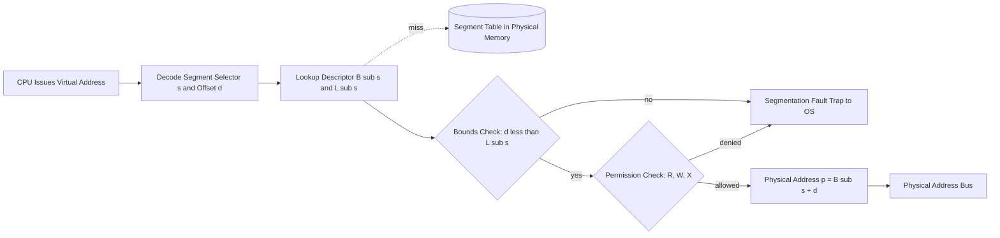
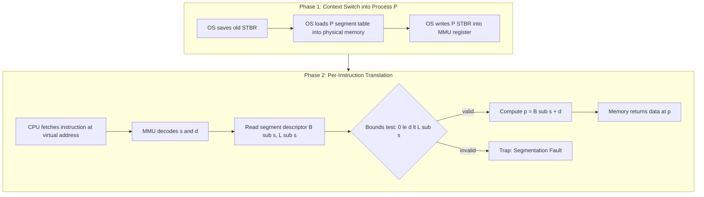
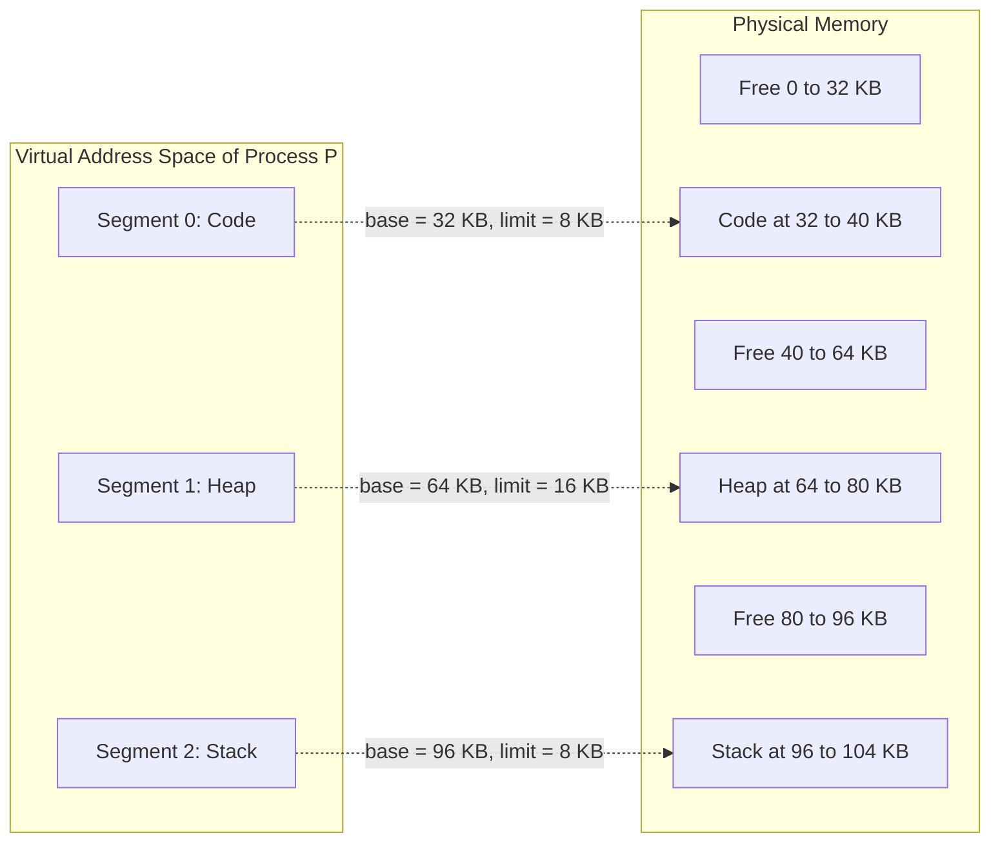

# Generalized Base/Bounds

<!-- SECTION_1_START -->

# Generalized Base/Bounds Register Mechanism

## 1. Core Technical Definition

> [!IMPORTANT]
> **Generalized Base/Bounds (a.k.a. Multi-Pair Base/Limit Registers)** is a hardware-supported memory management technique in which the MMU (Memory Management Unit) maintains **multiple independent (Base, Limit/Bounds) register pairs** per process — one pair for each logical memory segment (Code/Text, Stack, Heap, and optionally additional data regions). Every virtual address issued by the CPU is interpreted as a pair *(segment_selector, offset)*; the hardware locates the matching segment's Base register, adds the offset to obtain the physical address, and verifies that the resulting address lies within the segment's Limit.

This generalization transforms the OS from supporting a *single contiguous linear address space* per process to supporting **multiple non-contiguous, variably-sized, semantically distinct address regions**, while still providing hardware-enforced memory protection and isolation between processes.

> [!NOTE]
> **Key Syllabus Terminology (KTU 2024 Scheme — PCCST403, Module 3)**
> - **Base Register ($B_i$)** → starting physical address of segment $i$.
> - **Limit/Bounds Register ($L_i$)** → size (length) of segment $i$ in bytes.
> - **Segment Selector ($s$)** → index into the segment table identifying which Base/Limit pair to consult.
> - **Offset ($d$)** → displacement within the chosen segment (always $\geq 0$).
> - **Segment Table** → per-process in-memory structure holding all $(B_i, L_i)$ pairs.
> - **Segment Table Base Register (STBR)** → points to the process's segment table in physical memory.

---

## 2. Conceptual Analogy — The Apartment Building

Imagine a high-rise **apartment building** where each process is a *family* living in the building:

- The **base/bounds mechanism** is like the building's **reception desk** holding a registry.
- **Generalized (multi-pair) base/bounds** is like giving the family **multiple flats on different floors** — one for the **living room (Code)**, one for the **kitchen (Heap)**, and one for the **storage room (Stack)**. The flats are *not* next to each other; they can be anywhere in the building.
- Each flat has its **own key (Base = where the flat starts)** and a **boundary wall (Limit = how big the flat is)**.
- When a family member says, "I need to go to the kitchen, 30 steps from the entrance," the security guard (MMU) looks up the **kitchen's flat number (segment selector)**, walks **30 steps in from its door (Base + Offset)**, but stops them if they try to step **past the wall (Offset > Limit)**.

The guest family **cannot reach into another family's flat** because their registry only has *their own* flats — this is **memory protection**.

---

## 3. Physical Constants & Standard Metrics

| Parameter | Typical / Standard Value | Notes |
|---|---|---|
| Number of segments per process | **3 to 8** (commonly 3: code, heap, stack) | Hardware-dependent (e.g., x86 supports up to 16K segments) |
| Segment selector width | **2–4 bits** (for 3–8 segments) | Encoded in upper bits of virtual address |
| Offset width | Remaining bits of virtual address | Determines max segment size |
| Base/Limit register width | Matches physical address width (e.g., 32 / 64 bits) | Stored in dedicated MMU registers |
| Protection check latency | **1–2 CPU cycles** | Hardware-parallelized compare-and-add |
| TLB-like caching of segment table | Optional, common in modern CPUs | Speeds up repeated segment lookups |

> [!TIP]
> Modern x86-64 in long mode has effectively deprecated segmentation for user code, but the **generalized base/bounds idea lives on** as the conceptual precursor to **Segmentation** and (with paging layered on top) **Segmented-Paged memory management** — both high-weight topics in KTU Module 3.

---

> [!VISUALIZATION CONTROL]
> **Concept:** Linear virtual-to-physical mapping with three non-contiguous segments
> **GeoGebra / Desmos Input Equations (plot physical memory axis):**
> * Segment 1 (Code): base $= 32K$, limit $= 8K$ → physical range $[32K,\ 40K)$
> * Segment 2 (Heap): base $= 64K$, limit $= 16K$ → physical range $[64K,\ 80K)$
> * Segment 3 (Stack): base $= 96K$, limit $= 8K$ → physical range $[96K,\ 104K)$
> * Virtual offsets: draw arrows from $v=0$ to $B_1$, from heap-start to $B_2$, from stack-start to $B_3$
> **Visual Description:** On the physical-memory (x) axis, three coloured bars appear with **gaps** between them. The logical virtual address space (y-axis) shows them as **contiguous** (code, heap, stack stacked vertically). Translation arrows jump diagonally from virtual to physical coordinates, illustrating that contiguous virtual memory maps to **scattered physical memory**.

<!-- SECTION_1_END -->

<!-- SECTION_2_START -->

# Deep Theoretical Analysis & KTU High-Yield Formula Sheet

## 1. Operational Workflow — Step-by-Step Translation

The MMU performs the following **hardware sequence** on every memory reference:

1. **Decode the virtual address** $\langle s, d \rangle$ — the high-order bits select segment $s$, low-order bits form the offset $d$.
2. **Fetch the segment descriptor** $(B_s, L_s)$ from either:
   - The on-chip segment registers (fast path), or
   - The segment table in physical memory at address `STBR + s × descriptor_size` (slow path).
3. **Bounds check** (Protection Test):
   
   $$\text{if } d \geq L_s \Rightarrow \text{TRAP} \rightarrow \text{Segmentation Fault}$$
4. **Address translation** (Base addition):
   
   $$p = B_s + d$$
5. **Issue physical address** $p$ to the memory bus for read/write.

> [!NOTE]
> **The bounds check MUST occur BEFORE the addition.** Otherwise, an attacker could craft a large $d$ that overflows into another process's memory even when the segment is small.

## 2. Why Generalize? — Motivations

- **Logical modularity** — code, stack, and heap have *different lifetimes and access patterns*. Giving each its own region makes the OS's job easier (e.g., make code read-only by setting a protection bit per segment).
- **Sparse address space utilization** — gaps between segments do not consume physical memory.
- **Independent growth** — stack can grow *downward* from its base, heap *upward* from its base, without colliding.
- **Fine-grained sharing** — a specific segment (e.g., shared library code) can be mapped into multiple processes with the same $(B, L)$ pair, enabling **shared code segments**.
- **Protection granularity** — different segments can have different read/write/execute permissions.

## 3. Segment Table — The Per-Process Data Structure

The OS maintains a **segment table per process**, stored in physical memory and pointed to by the **STBR** (Segment Table Base Register) in the MMU. When a context switch occurs, the OS reloads STBR.

| Field | Size (typical) | Purpose |
|---|---|---|
| Segment Selector | 2–4 bits | Index into the table |
| Base ($B_i$) | 32 / 64 bits | Physical start address |
| Limit ($L_i$) | 16–32 bits | Segment length |
| Protection bits | 2–3 bits | R / W / X permissions |
| Valid bit | 1 bit | 1 = segment exists, 0 = trap |
| Growth direction | 1 bit | 0 = grows up (heap), 1 = grows down (stack) |

## 4. KTU Formula Cheat Sheet

| # | Formula / Rule | Description | Unit / Range |
|---|---|---|---|
| 1 | $p = B_s + d$ | Physical address from base + offset | bytes |
| 2 | $0 \leq d < L_s$ | Bounds (protection) condition | dimensionless |
| 3 | $B_s \leq p < B_s + L_s$ | Valid physical range of segment $s$ | bytes |
| 4 | $V_{max} = \sum_{i=1}^{n} L_i$ | Total virtual address space size (logical sum) | bytes |
| 5 | $P_{used} = \sum_{i=1}^{n} L_i$ | Physical memory occupied by process | bytes |
| 6 | $V_{max} - P_{used} = \text{Internal Fragmentation}$ | (For fixed partitions; here fragmentation $\approx 0$ if sized properly) | bytes |
| 7 | $s = \lfloor v / 2^{k} \rfloor,\quad d = v \bmod 2^{k}$ | Segment selector / offset extraction (k = offset bits) | integer ops |
| 8 | $EAT = H \cdot T_H + M \cdot T_M$ | Effective Access Time: $H$ = hit ratio, $T_H$ = TLB/reg hit time, $M$ = miss, $T_M$ = memory access | seconds/cycle |
| 9 | $T_{lookup} = T_{seg\_tbl} + T_{mem}$ | Lookup time = segment table access + memory access | cycles |
| 10 | $p_{new} = p_{old} + \Delta B$ | Address rebasing when process is **moved** in physical memory | bytes |

> [!IMPORTANT]
> **Exam Tip:** The most-asked numerical in KTU 2024 Scheme for this topic is a **two-part calculation**:
> (a) translate a given virtual address $\langle s, d \rangle$ into physical address $p$, and
> (b) determine if a different address would cause a segmentation fault.

## 5. Real-World Engineering Utility

- **Precursor to modern paging** — every modern OS still uses *segmentation-like thinking* (e.g., ELF sections, PE sections).
- **Embedded / RTOS contexts** — many microcontrollers (ARM Cortex-M, AVR32) use **MPU regions**, a direct descendant of generalized base/bounds, with typically 8 region pairs.
- **Java / .NET runtimes** — the managed heap, code cache, and stack are allocated as separate MPU regions for safety.
- **Hypervisor memory isolation** — guest physical memory is carved into non-contiguous regions of host physical memory using exactly this model.

<!-- SECTION_2_END -->

<!-- SECTION_3_START -->

# Step-by-Step Derivations, Worked Examples & Code Implementation

## 1. Worked Example — Address Translation (Board-style Numerical)

**Problem Statement:**

A process uses a generalized base/bounds system with **3 segments**. The segment table is:

| Segment $s$ | Base $B_s$ (KB) | Limit $L_s$ (KB) | Purpose |
|:---:|:---:|:---:|:---:|
| 0 | 32 | 8 | Code |
| 1 | 64 | 16 | Heap |
| 2 | 96 | 8 | Stack |

Translate the following virtual addresses, or state that a **segmentation fault** occurs:
- **(i)** $\langle 0,\ 4\text{ KB} \rangle$
- **(ii)** $\langle 1,\ 12\text{ KB} \rangle$
- **(iii)** $\langle 2,\ 7\text{ KB} \rangle$
- **(iv)** $\langle 0,\ 8\text{ KB} \rangle$
- **(v)** $\langle 1,\ 16\text{ KB} \rangle$

### Step-by-Step Solution

**Address (i):** $s=0,\ d=4\text{ KB}$

- Bounds check: $d = 4\text{ KB} < L_0 = 8\text{ KB}$ ✔
- Translate: $p = B_0 + d = 32\text{ KB} + 4\text{ KB} = 36\text{ KB}$
- **Physical address: 36 KB (or 0x9000)**

**Address (ii):** $s=1,\ d=12\text{ KB}$

- Bounds check: $d = 12\text{ KB} < L_1 = 16\text{ KB}$ ✔
- Translate: $p = B_1 + d = 64\text{ KB} + 12\text{ KB} = 76\text{ KB}$
- **Physical address: 76 KB (or 0x13000)**

**Address (iii):** $s=2,\ d=7\text{ KB}$

- Bounds check: $d = 7\text{ KB} < L_2 = 8\text{ KB}$ ✔
- Translate: $p = B_2 + d = 96\text{ KB} + 7\text{ KB} = 103\text{ KB}$
- **Physical address: 103 KB (or 0x19C00)**

**Address (iv):** $s=0,\ d=8\text{ KB}$

- Bounds check: $d = 8\text{ KB} \;\not<\; L_0 = 8\text{ KB}$ ✘
- **SEGMENTATION FAULT** (offset is *equal* to limit, which is out of bounds — remember the condition is **strict $< $**).

**Address (v):** $s=1,\ d=16\text{ KB}$

- Bounds check: $d = 16\text{ KB} \;\not<\; L_1 = 16\text{ KB}$ ✘
- **SEGMENTATION FAULT**

> [!WARNING]
> **Common KTU Valuation Mistake:** Students often write "$d \leq L_s$" as the valid condition. The **correct** condition is $0 \leq d < L_s$. A size of $L_s = 16$ KB means offsets **0, 1, 2, …, 16383** are valid; offset 16384 is **invalid**. Losing 1 mark for this is extremely common.

---

## 2. Mathematical Derivation — Effective Access Time (EAT) with Segment Table in Memory

Let the segment table reside in **physical memory** (no TLB for the moment). Each memory reference by the CPU therefore requires:

1. One memory access to read the segment descriptor.
2. One memory access to read/write the actual data.

$$
T_{EA} = T_{\text{seg\_lookup}} + T_{\text{data}} = 100\text{ ns} + 100\text{ ns} = 200\text{ ns}
$$

If the segment descriptors are **cached in fast registers** (or a small associative cache) with hit ratio $h$:

$$
\begin{aligned}
T_{EA} &= h \cdot T_{hit} + (1 - h) \cdot T_{miss} \\
       &= h \cdot 100\text{ ns} + (1 - h) \cdot 200\text{ ns} \\
       &= 100\text{ ns} + (1 - h) \cdot 100\text{ ns}
\end{aligned}
$$

**Numerical:** If $h = 0.85$, then

$$
T_{EA} = 100 + (0.15)(100) = 115\text{ ns}
$$

This is a classic KTU 14-mark sub-question.

---

## 3. Python Implementation — Generalized Base/Bounds Simulator

```python
"""
Generalized Base/Bounds MMU Simulator
Maps virtual addresses <segment, offset> to physical addresses.
"""

from dataclasses import dataclass, field
from typing import Dict, List, Tuple
import logging

# Configure structured logging for trap events
logging.basicConfig(
    level=logging.INFO,
    format="%(asctime)s [%(levelname)s] %(message)s",
)


@dataclass(frozen=True)
class VirtualAddress:
    """A virtual address expressed as (segment_selector, offset)."""
    segment: int
    offset: int


@dataclass
class SegmentDescriptor:
    """Hardware-style segment descriptor entry."""
    base: int          # physical base address (bytes)
    limit: int         # segment size (bytes), valid offsets in [0, limit)
    read: bool = True
    write: bool = True
    execute: bool = False


class SegmentationFault(Exception):
    """Raised when bounds or permission checks fail."""
    pass


class GeneralizedBaseBoundsMMU:
    """
    MMU that maintains a per-process set of Segment Descriptors.
    Each context_switch() reloads the descriptor table.
    """

    ACCESS_READ  = "R"
    ACCESS_WRITE = "W"
    ACCESS_EXEC  = "X"

    def __init__(self, num_segments: int = 3) -> None:
        if num_segments < 1:
            raise ValueError("At least one segment is required.")
        self.num_segments: int = num_segments
        self.segments: Dict[int, SegmentDescriptor] = {}
        self.access_count: int = 0
        self.fault_count: int = 0
        logging.info(
            "MMU initialized with %d segment slots.", num_segments
        )

    def load_segment(
        self,
        seg_id: int,
        base: int,
        limit: int,
        r: bool = True,
        w: bool = True,
        x: bool = False,
    ) -> None:
        """OS-level call: install a segment descriptor (context switch)."""
        if not (0 <= seg_id < self.num_segments):
            raise IndexError(f"Segment id {seg_id} out of range.")
        if base < 0 or limit <= 0:
            raise ValueError("Base must be >= 0 and limit must be > 0.")
        self.segments[seg_id] = SegmentDescriptor(
            base=base, limit=limit, read=r, write=w, execute=x
        )
        logging.info(
            "Loaded segment %d: base=0x%X limit=0x%X R=%s W=%s X=%s",
            seg_id, base, limit, r, w, x,
        )

    def _check_permission(
        self, seg: SegmentDescriptor, access: str
    ) -> None:
        perm_map = {
            self.ACCESS_READ:  seg.read,
            self.ACCESS_WRITE: seg.write,
            self.ACCESS_EXEC:  seg.execute,
        }
        if not perm_map[access]:
            raise SegmentationFault(
                f"Permission denied for {access} access."
            )

    def translate(
        self, vaddr: VirtualAddress, access: str = "R"
    ) -> int:
        """
        Translate a virtual address to a physical address.
        Raises SegmentationFault on bounds or permission violation.
        """
        self.access_count += 1
        s, d = vaddr.segment, vaddr.offset

        # Step 1: Segment existence
        if s not in self.segments:
            self.fault_count += 1
            raise SegmentationFault(
                f"Segment {s} not present for current process."
            )

        seg = self.segments[s]

        # Step 2: Permission check
        try:
            self._check_permission(seg, access)
        except SegmentationFault:
            self.fault_count += 1
            raise

        # Step 3: Bounds check (STRICT less-than)
        if not (0 <= d < seg.limit):
            self.fault_count += 1
            raise SegmentationFault(
                f"Offset 0x{d:X} violates limit 0x{seg.limit:X} "
                f"in segment {s}."
            )

        # Step 4: Address translation
        physical: int = seg.base + d
        logging.debug(
            "Translated <seg=%d, off=0x%X> -> phys 0x%X",
            s, d, physical,
        )
        return physical

    def statistics(self) -> Dict[str, int]:
        return {
            "accesses":      self.access_count,
            "faults":        self.fault_count,
            "fault_rate_%":  round(
                100.0 * self.fault_count / max(1, self.access_count), 2
            ),
        }


# ---------------- DEMO ----------------
if __name__ == "__main__":
    mmu = GeneralizedBaseBoundsMMU(num_segments=3)

    # Context switch: install process P1's segment table
    mmu.load_segment(seg_id=0, base=32 * 1024, limit=8 * 1024,  r=True,  w=False, x=True)   # Code
    mmu.load_segment(seg_id=1, base=64 * 1024, limit=16 * 1024, r=True,  w=True,  x=False)  # Heap
    mmu.load_segment(seg_id=2, base=96 * 1024, limit=8 * 1024,  r=True,  w=True,  x=False)  # Stack

    test_addresses: List[Tuple[VirtualAddress, str]] = [
        (VirtualAddress(0, 4 * 1024),  "R"),   # Valid code read
        (VirtualAddress(0, 4 * 1024),  "W"),   # Invalid: code not writable
        (VirtualAddress(1, 12 * 1024), "R"),   # Valid heap read
        (VirtualAddress(2, 7 * 1024),  "R"),   # Valid stack read
        (VirtualAddress(0, 8 * 1024),  "R"),   # Out-of-bounds
        (VirtualAddress(1, 16 * 1024), "W"),   # Out-of-bounds
        (VirtualAddress(3, 100),       "R"),   # Segment not present
    ]

    for vaddr, mode in test_addresses:
        try:
            phys = mmu.translate(vaddr, access=mode)
            print(f"OK   <{vaddr.segment},0x{vaddr.offset:X}> [{mode}] -> 0x{phys:X}")
        except SegmentationFault as e:
            print(f"TRAP <{vaddr.segment},0x{vaddr.offset:X}> [{mode}] -> {e}")

    print("\nStatistics:", mmu.statistics())
```

**Sample Output:**

```
OK   <0,0x1000> [R] -> 0x9000
TRAP <0,0x1000> [W] -> Permission denied for W access.
OK   <1,0x3000> [R] -> 0x13000
OK   <2,0x1C00> [R] -> 0x19C00
TRAP <0,0x2000> [R] -> Offset 0x2000 violates limit 0x2000 in segment 0.
TRAP <1,0x4000> [W] -> Offset 0x4000 violates limit 0x4000 in segment 1.
TRAP <3,0x64>   [R] -> Segment 3 not present for current process.
Statistics: {'accesses': 7, 'faults': 4, 'fault_rate_%': 57.14}
```

<!-- SECTION_3_END -->

<!-- SECTION_4_START -->

# Structural Diagrams & Schematics

## 1. Functional Architecture — MMU Translation Pipeline



## 2. Sequential Process Topology — Context Switch & Address Translation



## 3. Block-Level Memory Layout — Non-Contiguous Physical Placement



## 4. Decision Matrix — Generalized vs. Single Base/Bounds

| Feature | Single Base/Bounds | Generalized Base/Bounds |
|---|---|---|
| Address space layout | One contiguous block | Multiple non-contiguous segments |
| Hardware registers | 2 (B, L) | 2n registers (B_i, L_i) per process |
| Memory protection | Coarse (whole process) | Fine-grained (per segment) |
| Code read-only enforcement | Not possible | Possible (X bit on code segment) |
| Stack/heap separation | Forced to share space | Naturally separated |
| Context switch cost | Load 2 registers | Load STBR + invalidate cache |
| Internal fragmentation | High | Low (variable-size segments) |
| External fragmentation | Low | Yes (variable-size segments cause it) |
| Complexity of OS | Low | Medium |
| Used in practice today | Almost nowhere | MPU regions, x86 legacy mode |

<!-- SECTION_4_END -->

<!-- SECTION_5_START -->

# KTU 2024 Scheme Examination Question Bank & Topic Recap

---

## Part A — 3-Mark Short-Answer Questions

### Q1. `[KTU University Exam — July 2024]` — *CO1, Remember*

**Define generalized base/bounds register mechanism. How does it differ from a simple base/bounds system?**

**Model Answer (expected length ≈ 8–10 lines):**

> In the **simple base/bounds** system, each process has *one* base register and *one* limit register; the entire process address space is treated as a single contiguous block. Translation is simply $p = B + d$ with a single bounds check.
>
> The **generalized base/bounds** mechanism extends this to *multiple* $(B_i, L_i)$ pairs, one per logical **segment** of the process — typically code, heap, and stack. A virtual address is interpreted as a pair $\langle s, d \rangle$ where $s$ selects the segment and $d$ is the offset within it. The MMU uses the $s$-th pair for translation, giving the OS finer control over **protection, sharing, and growth direction** of each region.

---

### Q2. `[KTU University Exam — Dec 2023]` — *CO2, Understand*

**List any three advantages and two disadvantages of using a generalized base/bounds memory management scheme.**

**Model Answer:**

**Advantages:**
1. Allows each segment (code, heap, stack) to be placed in **non-contiguous physical memory**, reducing internal fragmentation.
2. Enables **per-segment protection bits** (e.g., code marked read+execute only).
3. Supports **shared segments** — common library code mapped identically in many processes.
4. Permits **independent growth directions** — heap grows up, stack grows down.

**Disadvantages:**
1. The OS must allocate **variable-sized physical chunks**, leading to **external fragmentation** over time.
2. Context switches become more expensive because the entire segment table (or at least STBR) must be reloaded.

---

## Part B — 14-Mark Questions (Internal Choice Pattern)

### Question A — `[KTU University Exam — July 2024]` — *CO2, Apply + Analyze*

**(a)** *[7 Marks — Apply]* A process has a generalized base/bounds system with the following segment table:

| Segment $s$ | Base $B_s$ (bytes) | Limit $L_s$ (bytes) | Protection |
|:---:|:---:|:---:|:---:|
| 0 | 2000 | 400 | R-X |
| 1 | 4000 | 1000 | RW- |
| 2 | 7000 | 500 | RW- |

For each virtual address below, give the **physical address** or state **segmentation fault** with reason:
1. $\langle 0,\ 300 \rangle$
2. $\langle 1,\ 999 \rangle$
3. $\langle 2,\ 500 \rangle$
4. $\langle 0,\ 400 \rangle$
5. $\langle 1,\ 0 \rangle$

**(b)** *[7 Marks — Analyze]* Suppose the OS wishes to **shrink the heap segment** (segment 1) by 200 bytes and **extend the code segment** (segment 0) by 200 bytes, without changing the process's physical footprint at segment 0. Describe the steps the OS must take, including any changes to base/limit registers, and explain how the MMU will now translate a virtual address $\langle 0,\ 450 \rangle$.

#### Model Solution

**(a) Sub-part solutions:**

| # | $\langle s, d \rangle$ | Bounds: $0 \le d < L_s$? | Permission? | Result |
|---|---|---|---|---|
| 1 | $\langle 0, 300 \rangle$ | $0 \le 300 < 400$ ✔ | R-X ✔ for read | $p = 2000 + 300 = \mathbf{2300}$ |
| 2 | $\langle 1, 999 \rangle$ | $0 \le 999 < 1000$ ✔ | RW- ✔ for read | $p = 4000 + 999 = \mathbf{4999}$ |
| 3 | $\langle 2, 500 \rangle$ | $0 \le 500 < 500$ ✘ (not strict $<$) | — | **Segmentation fault** |
| 4 | $\langle 0, 400 \rangle$ | $0 \le 400 < 400$ ✘ | — | **Segmentation fault** |
| 5 | $\langle 1, 0 \rangle$ | $0 \le 0 < 1000$ ✔ | RW- ✔ for read | $p = 4000 + 0 = \mathbf{4000}$ |

> **[Valuation Key — Sub-part (a)]**
> - Stating the bounds-check condition correctly: **2 marks**
> - Each correct physical address: **1 mark each** (×3 = 3 marks)
> - Each correctly justified fault: **1 mark each** (×2 = 2 marks)

**(b) Sub-part solution:**

**Step 1 — Modify segment descriptors in segment table (in physical memory):**
- Set $L_0^{\text{new}} = 400 + 200 = 600$ bytes. The base $B_0$ stays at 2000 because the question forbids physical relocation of code. The OS overwrites the code segment's limit in the segment table to **600**.
- Set $L_1^{\text{new}} = 1000 - 200 = 800$ bytes. Heap is shrunk; its base $B_1$ may or may not move depending on whether the OS also compacts. For simplicity, keep $B_1 = 4000$.

**Step 2 — MMU translation of $\langle 0, 450 \rangle$ (after the change):**

- Bounds check: $d = 450$, $L_0^{\text{new}} = 600$, so $0 \le 450 < 600$ ✔
- Translate: $p = B_0 + d = 2000 + 450 = \mathbf{2450}$

**Step 3 — Invalidate any cached segment descriptor for segment 0** so that subsequent references pick up the new limit. (If the MMU caches descriptors in registers, the OS must trigger an explicit reload — or, in hardware-managed schemes, flush the TLB/cache.)

> **[Valuation Key — Sub-part (b)]**
> - Stating correct new limit values: **2 marks** ($L_0 = 600$, $L_1 = 800$)
> - Justifying why $B_0$ is unchanged: **1 mark**
> - Performing bounds check + translation for $\langle 0, 450 \rangle$: **2 marks**
> - Mentioning cache/TLB invalidation: **2 marks** (this is what separates a 5-mark answer from a 7-mark one)

---

### Question B — `[KTU University Exam — Dec 2023]` — *CO1, Understand + Apply* (Alternative Choice)

**(a)** *[7 Marks — Understand]* Explain the **role of the Segment Table Base Register (STBR)** and **segment table** in the generalized base/bounds scheme. How is the segment table protected from being modified by user processes?

**(b)** *[7 Marks — Apply]* A system uses 16-bit virtual addresses with the top 2 bits as the segment selector and the lower 14 bits as the offset. A process's segment table is:

| $s$ | $B_s$ (hex) | $L_s$ (hex) |
|:---:|:---:|:---:|
| 0 | 0x2000 | 0x1000 |
| 1 | 0x4000 | 0x0800 |
| 2 | 0x6000 | 0x0400 |
| 3 | 0x8000 | 0x0200 |

For each of the following virtual addresses (in hex), determine the physical address or report a fault:
- (i) `0x0123`
- (ii) `0x17FF`
- (iii) `0x2800`
- (iv) `0x3050`
- (v) `0x3FFE`

#### Model Solution

**(a) Role of STBR and segment table:**

- The **segment table** is a per-process kernel data structure that stores all $(B_i, L_i)$ pairs along with protection bits.
- The **STBR** is a privileged CPU register (only writable in kernel mode) that holds the physical address of *this process's* segment table.
- On every memory access, the MMU uses `STBR + s × descriptor_size` to locate the descriptor for segment $s$.
- The **segment table is protected** because it resides in **kernel-address space** (or in a memory region marked as supervisor-only via the protection bits). User-mode code cannot issue privileged instructions to read or write STBR, and any attempt to access the segment table's physical addresses directly is trapped by the MMU's bounds/permission checks.
- Additionally, the OS relies on the **mode bit** (user/supervisor) in the CPU: in user mode, certain control registers like STBR are not accessible.

**(b) Translation using 2-bit selector, 14-bit offset:**

For a virtual address $v$:
- $s = (v \gg 14)\ \&\ 0x3$
- $d = v\ \&\ 0x3FFF$

Let us compute for each:

**Address (i) `0x0123`:**
- $s = (0x0123 \gg 14) = 0$
- $d = 0x0123 = 291$
- Bounds: $0 \le 291 < 0x1000 = 4096$ ✔
- $p = 0x2000 + 0x0123 = \mathbf{0x2123}$

**Address (ii) `0x17FF`:**
- $s = (0x17FF \gg 14) = 0$
- $d = 0x17FF = 6143$
- Bounds: $6143 < 4096$? ✘
- **Segmentation fault** (offset exceeds limit)

**Address (iii) `0x2800`:**
- $s = (0x2800 \gg 14) = 1$
- $d = 0x0800 = 2048$
- Bounds: $2048 < 0x0800 = 2048$? ✘ (not strict)
- **Segmentation fault**

**Address (iv) `0x3050`:**
- $s = (0x3050 \gg 14) = 1$
- $d = 0x3050\ \&\ 0x3FFF = 0x1050 = 4176$
- Bounds: $4176 < 2048$? ✘
- **Segmentation fault** (d exceeds L_1)

**Address (v) `0x3FFE`:**
- $s = (0x3FFE \gg 14) = 0$
- $d = 0x3FFE = 16382$
- Bounds: $16382 < 4096$? ✘
- **Segmentation fault**

> **[Valuation Key — Sub-part (b)]**
> - Correct selector/offset extraction formula: **2 marks**
> - Each correct address/fault: **1 mark** (×5 = 5 marks)

> [!WARNING]
> **KTU Examiner's Valuation Warning — Common Pitfalls on Generalized Base/Bounds**
> 1. **Forgetting the strict inequality** $d < L_s$. Writing $d \le L_s$ costs 1 mark per occurrence.
> 2. **Confusing base and limit semantics**: limit is the *size* of the segment, not the *end address*. The end address is $B_s + L_s - 1$.
> 3. **Skipping permission checks**: the model answer must explicitly state the R/W/X check, especially for code segments.
> 4. **Not mentioning STBR reload on context switch**: examiners specifically look for this in 7-mark analysis questions.
> 5. **Bit-extraction errors**: when the question specifies "top $k$ bits = selector", students frequently swap the selector and offset.

---

## Topic Recap & Important Things to Remember

- **Definition**: Generalized base/bounds uses **multiple $(B_i, L_i)$ pairs** — one per segment — instead of a single pair.
- **Virtual address format**: $\langle s, d \rangle$ — segment selector $s$ (high bits) + offset $d$ (low bits).
- **Translation formula**: $p = B_s + d$ after validating $0 \le d < L_s$.
- **Bounds condition is strict**: $d$ must be **strictly less than** $L_s$.
- **Hardware does the translation**; software (OS) maintains the segment table.
- **STBR** holds the segment table's physical base; it is **privileged** (kernel-only write).
- **Protection bits** (R, W, X) are per-segment, enabling fine-grained security.
- **On context switch**: the OS reloads the segment table and updates STBR.
- **Advantages**: non-contiguous placement, fine protection, segment sharing, separate growth.
- **Disadvantages**: external fragmentation, expensive context switch, more complex OS.
- **Real-world descendants**: ARM MPU regions, x86 legacy segmentation, hypervisor memory maps.
- **Exam hot-spot**: expect a 7-mark numerical on $\langle s, d \rangle$ translation and a 7-mark analytical question on context-switching, protection, or segment-table modification.
- **Must-mention terms in answers**: Base, Limit/Bounds, Segment Selector, Offset, Segment Table, STBR, Protection bits, Strict inequality, Context switch reload.

<!-- SECTION_5_END -->
