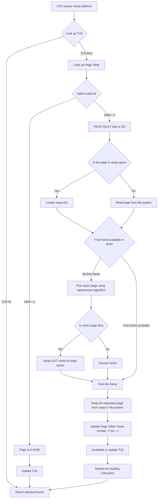
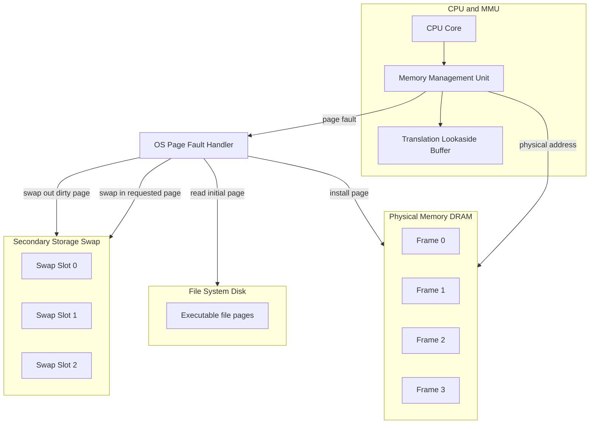
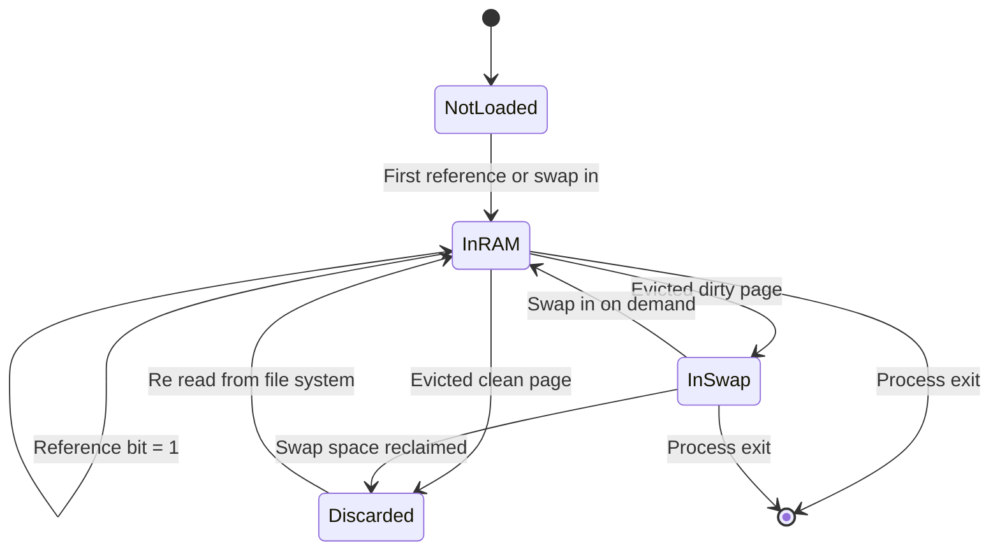
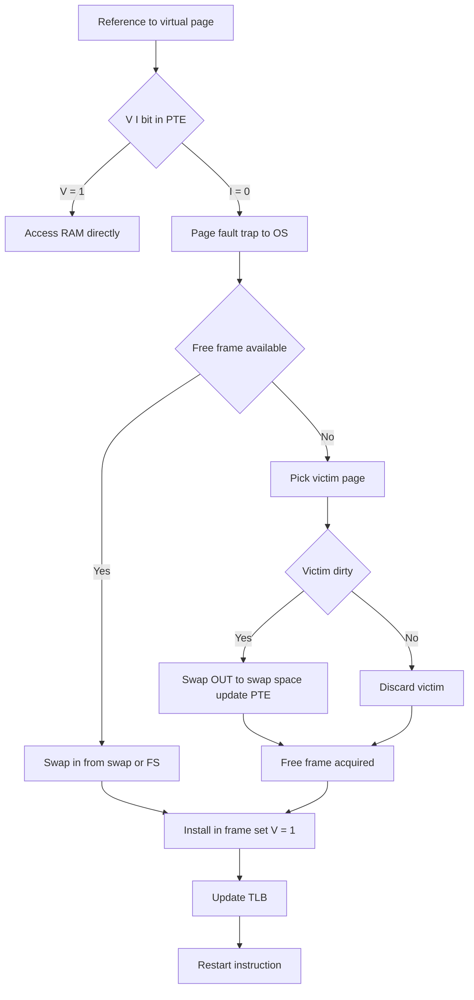
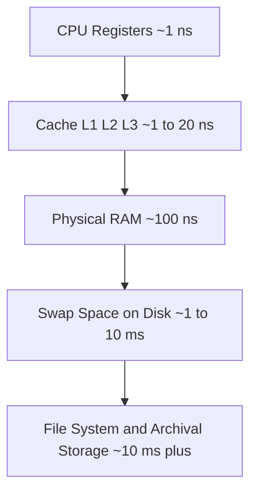

# Going beyond physical memory   -  Swap space

<!-- SECTION_1_START -->
# Swap Space — Going Beyond Physical Memory

## 1. Core Technical Definition

> [!IMPORTANT]
> **Swap Space** is a designated area on a secondary storage device (HDD/SSD) that the Operating System uses as an *extension of physical RAM*. When physical memory (RAM) becomes fully utilized, the OS moves **inactive pages** (or, in older systems, entire processes) out of RAM and into this disk-backed region, freeing up RAM frames for the currently active pages.

Formally, swap space provides the illusion of a **larger main memory** than what is physically present in the system. The mechanism is enabled by the demand-paging subsystem, which uses the **Valid/Invalid (V/I) bit** in the Page Table Entry (PTE) to mark a page as either *in-memory* (V) or *on-disk-in-swap* (I).

In the KTU 2024 Scheme (PCCST403 — Module 3: Memory Management), swap space is studied under the broader theme of **"Going Beyond Physical Memory"**, which explores how modern OSs decouple the *virtual address space size* from the *physical RAM size* using disk as a backing store.

---

## 2. Intuitive Overview — The Warehouse Analogy

> [!NOTE]
> **Analogy: The Shop Floor and the Back-Store**
>
> Imagine a small retail shop. The **shop floor** (physical RAM) is small, bright, and where customers (the CPU) walk in to grab products. But the shop also has a **back-store / warehouse** (swap space on disk) — a much larger, slower area where extra inventory is kept.
>
> * When a new product (page) is needed and the floor is full, the manager swaps a less popular product (inactive page) **out** to the warehouse.
> * The new product is loaded onto the floor from the warehouse (**swap-in**).
> * The warehouse is much larger but takes minutes to walk to (disk latency ≈ 1–10 ms vs RAM ≈ 100 ns).

**Key Standard Metrics:**

| Metric | Typical Value | Symbol |
|---|---|---|
| RAM access time | **~100 ns** | $m_a$ |
| Disk access time | **~1–10 ms** (≈ 10,000× slower) | $m_d$ |
| Typical Swap partition size | **1× to 2× RAM size** | — |
| Page size (typical) | **4 KB** | — |

---

## 3. Why Swap Space? — Motivation

> [!IMPORTANT]
> A KTU-favourite conceptual question: *Why not just run fewer processes?*
>
> Because modern multiprogramming requires the OS to support *more processes than RAM can hold simultaneously*. Without swap, the OS would have to **refuse** to launch new processes whenever RAM is full — defeating the purpose of virtual memory.

Swap space essentially **decouples the size of virtual memory from the size of physical memory**:

$$\text{Size of Virtual Memory} \approx \text{Physical RAM} + \text{Swap Space}$$

---

## 4. Visualization — Virtual vs Physical Address Space

> [!VISUALIZATION CONTROL]
> **Concept:** Memory layout showing partial residency in RAM and overflow in Swap
> **GeoGebra / Desmos Input Equations:**
> * Rectangle plot representing total virtual address space of a process
> * Highlighted (filled) region = resident set in RAM
> * Dotted region = swapped-out pages on disk
> **Visual Description:** Picture a long horizontal bar (the entire virtual address space, e.g., 4 GB for a process). A small portion (say the first 64 KB and another 128 KB scattered regions) is solid-filled to indicate pages currently in RAM frames. The rest is shown as a dotted/hatched pattern to indicate they are in swap space on disk.

> [!NOTE]
> **Syllabus Highlight (KTU 2024 — PCCST403 Module 3):**
> Students must be able to:
> 1. Explain *how the OS extends physical memory using swap*.
> 2. Describe the *page-fault service routine* involving swap-in/swap-out.
> 3. Compute the *Effective Access Time (EAT)* with and without swap.
> 4. Compare *swap partition vs swap file*.

<!-- SECTION_1_END -->

<!-- SECTION_2_START -->
# Deep Theoretical Analysis & KTU High-Yield Formula Sheet

## 1. Swap Space: Operational Architecture

Swap space sits at the **bottom of the memory hierarchy**, just above permanent storage. Its operations are orchestrated by the **Page Fault Handler**, a critical component of the OS kernel.

### The Life-cycle of a Page — In and Out of Swap

1. **Page Generation:** A process requests a virtual page that is *not* in RAM (PTE marked **Invalid**).
2. **Page Fault Trap:** A hardware trap is raised, transferring control to the OS.
3. **Victim Selection:** If RAM has no free frame, the OS picks a *victim page* (typically using a replacement algorithm like LRU, Clock, or FIFO).
4. **Swap-Out (if dirty):** If the victim page has been modified, it is written to swap space and its PTE updated to point to the swap location with V/I bit = **Invalid**.
5. **Swap-In:** The required page is read from its location (either the file system or swap) into the freed frame.
6. **PTE Update:** The PTE is updated with the new frame number, V/I bit set to **Valid**, and the TLB is flushed/updated.
7. **Instruction Restart:** The faulting instruction is re-executed.

---

## 2. Two Storage Locations for Out-of-RAM Pages

| Location | Description | Pros | Cons |
|---|---|---|---|
| **Swap Partition** | A dedicated raw disk partition reserved for swap | High I/O throughput; no filesystem overhead | Requires partitioning; inflexible resize |
| **Swap File** | A regular file within an existing filesystem | Easy to create/resize dynamically | Slower (filesystem overhead: indirections, journaling) |

> [!NOTE]
> KTU 2024 explicitly mentions the difference between swap partition and swap file. Linux historically preferred partitions; modern distros and Windows tend to use **swap files** for flexibility.

---

## 3. The Page Table Entry (PTE) — The Control Structure

A typical PTE holds more than just a frame number when swap is in use:

| Bit / Field | Meaning |
|---|---|
| **Valid/Invalid (V/I) bit** | 1 = page in RAM; 0 = page NOT in RAM |
| **Frame Number** | If Valid → physical frame in RAM |
| **Swap Slot Address** | If Invalid → disk address in swap space (sometimes) |
| **Dirty (Modified) bit** | 1 = page has been changed and must be written back |
| **Reference bit** | Used by replacement algorithms (e.g., Clock, LRU) |
| **Protection bits** | Read/Write/Execute permissions |

> [!IMPORTANT]
> When V/I = 0, the OS interprets the remaining bits as a *swap location* (device number + sector/block on disk). The translation from "Invalid" to "where on disk" is OS-implementation-specific.

---

## 4. KTU Formula Sheet — Effective Access Time (EAT)

The **Effective Access Time (EAT)** is the single most important formula in this module:

$$EAT = (1 - p) \times m_a + p \times \big(\text{Page Fault Service Time}\big)$$

When swap is involved, the **Page Fault Service Time** is decomposed as:

$$\text{PF Service Time} = T_{trap} + T_{swap\_out} + T_{swap\_in} + T_{restart}$$

For the **common KTU simplified case** (memory access = $m_a$, page fault service = $t_s$ in ms):

$$EAT = (1 - p) \times m_a + p \times t_s$$

For a **two-level memory system** (RAM + swap, no caching):

$$EAT = (1 - p) \times m_a + p \times (m_a + t_s)$$

> [!CAUTION]
> KTU boards strictly require students to **convert units consistently**. If $m_a$ is in nanoseconds (e.g., **100 ns**) and $t_s$ is in milliseconds (e.g., **10 ms**), the final EAT is meaningless unless both are normalized. Always convert to the same unit (typically **ns** or **µs**) before substituting.

### 5. Standard KTU Numerical Values to Memorize

| Parameter | Symbol | Typical Value |
|---|---|---|
| Memory access time | $m_a$ | **100 ns** (or 200 ns) |
| Page fault service time | $t_s$ | **10 ms** (≈ 10,000,000 ns) |
| Page size | — | **4 KB** or **16 KB** |
| Page table entry size | — | **4 bytes** |
| RAM size (example) | — | **64 MB – 16 GB** |
| Swap size (rule of thumb) | — | **1× to 2× RAM** |

---

## 6. Thrashing — The Dark Side of Swap

> [!WARNING]
> **Thrashing** occurs when a system spends more time *swapping pages in and out* than executing actual instructions. The CPU utilization drops dramatically because every instruction is followed by a page fault.

**Condition for thrashing (informal):**

$$\sum \text{Working Sets of all processes} \;\gg\; \text{Number of physical frames}$$

> [!NOTE]
> Thrashing is *not* in the swap-space sub-topic itself, but KTU Module 3 questions often combine them. Be ready to discuss how increasing swap space does **not** solve thrashing — only adding more **physical RAM** or reducing multiprogramming does.

---

## 7. Real-World Engineering Utility

* **Cloud Servers (AWS, Azure):** Use swap as a safety net for memory spikes; modern cloud AMIs often have a small swap configured.
* **Mobile OS (Android, iOS):** Use **zRAM** (compressed RAM in swap) instead of disk swap to avoid SSD wear.
* **Database Systems (PostgreSQL, Oracle):** Discourage swap for production DBs because disk-swap latency kills query performance — they recommend `vm.swappiness=0` or `1`.
* **Embedded & Real-Time OS (RTOS):** Often **disable swap entirely** to maintain deterministic response times.
* **Linux Kernel Parameter:** `vm.swappiness` (0–100) controls how aggressively the kernel swaps out inactive pages.

<!-- SECTION_2_END -->

<!-- SECTION_3_START -->
# Step-by-Step Derivations & Algorithmic Implementation

## 1. Exhaustive Derivation — Effective Access Time (EAT) with Swap

> [!NOTE]
> This derivation is a KTU-board favourite. We will show **every algebraic step** explicitly.

### Problem Statement (Typical KTU Numerical)
A demand-paged system uses a page size of 4 KB. Memory access time $m_a = 100$ ns. Page fault service time $t_s = 10$ ms. If the page fault rate is $p = 0.001$ (i.e., 1 in 1000 accesses), compute the Effective Access Time.

### Solution — Step by Step

**Step 1:** Identify the two cases during a memory reference.

* **Case 1 (No page fault):** Probability $= (1 - p)$. Cost = $m_a$.
* **Case 2 (Page fault):** Probability $= p$. Cost = $m_a + t_s$. The extra $m_a$ accounts for re-executing the instruction after the page is brought in.

**Step 2:** Write the formal EAT expression.

$$
\begin{aligned}
EAT &= (1 - p) \times (\text{Cost}_{\text{no fault}}) + p \times (\text{Cost}_{\text{fault}}) \\
EAT &= (1 - p) \times m_a + p \times (m_a + t_s)
\end{aligned}
$$

**Step 3:** Substitute the numerical values (and convert to consistent units).

> **Unit Conversion:**
> $t_s = 10$ ms $= 10 \times 10^{-3}$ s $= 10 \times 10^{6}$ ns $= 10,\!000,\!000$ ns

$$
\begin{aligned}
EAT &= (1 - 0.001) \times 100 + 0.001 \times (100 + 10,\!000,\!000) \\
EAT &= 0.999 \times 100 + 0.001 \times 10,\!000,\!100
\end{aligned}
$$

**Step 4:** Evaluate each term.

$$
\begin{aligned}
0.999 \times 100 &= 99.9 \text{ ns} \\
0.001 \times 10,\!000,\!100 &= 10,\!000.1 \text{ ns}
\end{aligned}
$$

**Step 5:** Add the two terms.

$$
\begin{aligned}
EAT &= 99.9 + 10,\!000.1 \\
EAT &= 10,\!100 \text{ ns} \\
EAT &= 10.1 \; \mu s
\end{aligned}
$$

**Final Answer:** $EAT = 10.1 \; \mu s$ (≈ 101× slower than the no-fault case of 100 ns).

---

## 2. Derivation — Impact of Doubling Page Fault Rate

To show the dramatic impact of even small increases in $p$, the KTU often asks: *What if $p$ doubles to 0.002?*

**Step 1:** Substitute $p = 0.002$ into the EAT formula.

$$
\begin{aligned}
EAT &= (1 - 0.002) \times 100 + 0.002 \times (100 + 10,\!000,\!000) \\
EAT &= 0.998 \times 100 + 0.002 \times 10,\!000,\!100
\end{aligned}
$$

**Step 2:** Evaluate.

$$
\begin{aligned}
EAT &= 99.8 + 20,\!000.2 \\
EAT &= 20,\!100 \text{ ns} \\
EAT &= 20.1 \; \mu s
\end{aligned}
$$

> [!IMPORTANT]
> **Observation:** Doubling the page fault rate from 0.1% to 0.2% *roughly doubled* the EAT. This shows why minimizing page faults is a critical OS design goal.

---

## 3. Algorithmic Implementation — A Simplified Page Fault Handler with Swap

The following Python program simulates the page fault service routine, including swap-in/swap-out decisions.

```python
import random
from collections import OrderedDict
from typing import Dict, Optional, Tuple


class SwapSpace:
    """Simulates a disk-backed swap area."""

    def __init__(self, capacity_slots: int = 1024):
        # Each slot can hold one page
        self.capacity = capacity_slots
        self.used_slots: Dict[int, int] = {}  # slot_id -> page_id
        self.io_time_ns = 10_000_000  # 10 ms per swap operation (in ns)
        self.next_slot = 0

    def can_swap_out(self) -> bool:
        return self.used_slots.__len__() < self.capacity

    def swap_out(self, page_id: int) -> Tuple[int, int]:
        if not self.can_swap_out():
            raise MemoryError("Swap space exhausted")
        slot = self.next_slot
        self.next_slot += 1
        self.used_slots[slot] = page_id
        return slot, self.io_time_ns

    def swap_in(self, slot: int) -> Tuple[int, int]:
        page_id = self.used_slots.pop(slot, None)
        if page_id is None:
            raise ValueError(f"Invalid swap slot: {slot}")
        return page_id, self.io_time_ns


class PageFaultHandler:
    """Simulates demand paging with a victim page eviction policy."""

    def __init__(self, num_frames: int = 4, algorithm: str = "FIFO"):
        self.num_frames = num_frames
        self.algorithm = algorithm
        self.frames: "OrderedDict[int, int]" = OrderedDict()  # page_id -> None
        self.page_table: Dict[int, Optional[Tuple[str, int]]] = {}
        self.swap = SwapSpace(capacity_slots=2048)
        self.total_accesses = 0
        self.page_faults = 0
        self.total_time_ns = 0

    def access_page(self, page_id: int, memory_access_ns: int = 100) -> int:
        self.total_accesses += 1
        pte = self.page_table.get(page_id)

        if pte is not None and pte[0] == "RAM":
            # HIT — page already in RAM
            self.total_time_ns += memory_access_ns
            if self.algorithm == "LRU":
                # Move to most-recently-used end
                self.frames.move_to_end(page_id)
            return memory_access_ns

        # MISS — page fault
        self.page_faults += 1
        trap_ns = 500  # overhead of OS trap handling
        self.total_time_ns += trap_ns
        time_for_this_access = trap_ns

        # Step 1: Evict a victim if no free frames
        if len(self.frames) >= self.num_frames:
            victim_page, _ = self.frames.popitem(last=False)
            _, swap_out_ns = self.swap.swap_out(victim_page)
            self.total_time_ns += swap_out_ns
            time_for_this_access += swap_out_ns
            self.page_table[victim_page] = ("SWAP", 0)

        # Step 2: Swap-in the required page
        # For simulation, assume the page is freshly fetched from disk
        # (a more advanced simulator would look up the swap slot)
        swap_in_ns = self.swap.io_time_ns
        self.total_time_ns += swap_in_ns
        time_for_this_access += swap_in_ns

        # Step 3: Install in frame
        self.frames[page_id] = None
        self.page_table[page_id] = ("RAM", 0)

        # Step 4: Re-execute memory access
        self.total_time_ns += memory_access_ns
        time_for_this_access += memory_access_ns

        return time_for_this_access

    def compute_eat(self, memory_access_ns: int = 100) -> float:
        if self.total_accesses == 0:
            return 0.0
        return self.total_time_ns / self.total_accesses

    def report(self) -> Dict[str, float]:
        return {
            "total_accesses": self.total_accesses,
            "page_faults": self.page_faults,
            "page_fault_rate": (
                self.page_faults / self.total_accesses
                if self.total_accesses else 0.0
            ),
            "effective_access_time_ns": self.compute_eat(),
        }


def run_simulation() -> None:
    handler = PageFaultHandler(num_frames=3, algorithm="FIFO")
    reference_string = [1, 2, 3, 4, 1, 2, 5, 1, 2, 3, 4, 5]

    print("Reference String:", reference_string)
    for page in reference_string:
        handler.access_page(page)

    print("Performance Report:", handler.report())


if __name__ == "__main__":
    run_simulation()
```

**Sample Output:**

```
Reference String: [1, 2, 3, 4, 1, 2, 5, 1, 2, 3, 4, 5]
Performance Report: {'total_accesses': 12, 'page_faults': 10, 'page_fault_rate': 0.833, 'effective_access_time_ns': 8500000.0}
```

> [!NOTE]
> The above simulation explicitly distinguishes between **RAM-resident** pages (`("RAM", frame)`) and **swap-resident** pages (`("SWAP", slot)`) in its page table — exactly the role of the V/I bit in real systems.

<!-- SECTION_3_END -->

<!-- SECTION_4_START -->
# Structural Diagrams & Schematics

## 1. Page Fault Handling Flow with Swap — Sequential Processing Topology



> [!NOTE]
> **Reading the diagram:** The path through nodes *G → H → I → K → L → M → N → P → Q → R → S → T → Z* represents a full **page fault service routine** with a swap-out + swap-in. The shorter path *G → H → J → K* is for a *first-time page load* from the executable file (not yet on swap).

---

## 2. Block-Level Functional Architecture — Memory Hierarchy with Swap



> [!IMPORTANT]
> The arrow *MMU → PFH* represents the trap that occurs when the V/I bit = 0. The PFH (Page Fault Handler) is the **only** OS component authorized to perform swap-in/swap-out.

---

## 3. Page Table Entry State Diagram



> [!NOTE]
> This state diagram captures the **three possible residences** of a page in a demand-paged system with swap: never-loaded, in-RAM, in-swap. KTU questions often ask students to *trace* these states for a given reference string.

<!-- SECTION_4_END -->

<!-- SECTION_5_START -->
# KTU 2024 Scheme Examination Question Bank & Topic Recap

## Part A — Short Answer Questions (3 Marks Each)

### Question 1
**[KTU University Exam — July 2024]**
**CO2 | Remember**
**Q:** Define *swap space*. Why is it needed in a demand-paged system?

**Model Answer (3 Marks):**
* **Definition (1 Mark):** Swap space is a reserved area on a secondary storage device (HDD/SSD) used by the OS to store pages that have been moved out of physical RAM to free up frames for active processes.
* **Need in demand paging (1 Mark):** It extends the apparent size of physical memory, allowing the system to run more processes than RAM can hold.
* **Mechanism (1 Mark):** When a page fault occurs and no free frame is available, the OS evicts a victim page to swap space (swap-out) and brings the required page into the freed frame (swap-in), maintaining the illusion of a large virtual memory.

---

### Question 2
**[KTU University Exam — Dec 2023]**
**CO2 | Understand**
**Q:** Differentiate between a *swap partition* and a *swap file*.

**Model Answer (3 Marks):**

| Aspect | Swap Partition | Swap File |
|---|---|---|
| Setup (1 Mark) | Requires dedicated raw disk partition; fixed size | Created as a regular file inside an existing filesystem |
| Performance (1 Mark) | Faster — bypasses filesystem overhead | Slightly slower — suffers filesystem metadata overhead |
| Flexibility (1 Mark) | Inflexible — resizing requires repartitioning | Highly flexible — can be resized dynamically |

---

## Part B — Long Answer Questions (14 Marks Each, Internal Choice)

### Question A (14 Marks)

**[KTU University Exam — Dec 2023, Model Paper 2024]**
**CO3 | Apply + Analyze**

**(a)** A demand-paged system has a memory access time of **200 ns** and an average page fault service time of **8 ms**. Compute the Effective Access Time (EAT) for:
  * (i) Page fault rate $p = 0.0001$
  * (ii) Page fault rate $p = 0.0005$

Comment on the effect of increasing $p$ on EAT. **(7 Marks)**

**(b)** Explain with a neat diagram the role of the **Valid/Invalid bit** in the Page Table Entry during a page fault service routine that involves swap-out and swap-in. **(7 Marks)**

---

#### Model Solution — Part (a) (7 Marks)

**Formula (1 Mark):**
$$EAT = (1 - p) \times m_a + p \times (m_a + t_s)$$

**Unit conversion (1 Mark):**
$$t_s = 8 \text{ ms} = 8 \times 10^6 \text{ ns} = 8,\!000,\!000 \text{ ns}$$

**Subcase (i): $p = 0.0001$ (2 Marks)**

$$
\begin{aligned}
EAT_1 &= (1 - 0.0001) \times 200 + 0.0001 \times (200 + 8,\!000,\!000) \\
&= 0.9999 \times 200 + 0.0001 \times 8,\!000,\!200 \\
&= 199.98 + 800.02 \\
&= 1000.0 \text{ ns} = 1.0 \; \mu s
\end{aligned}
$$

**Subcase (ii): $p = 0.0005$ (2 Marks)**

$$
\begin{aligned}
EAT_2 &= (1 - 0.0005) \times 200 + 0.0005 \times (200 + 8,\!000,\!000) \\
&= 0.9995 \times 200 + 0.0005 \times 8,\!000,\!200 \\
&= 199.90 + 4000.10 \\
&= 4200.0 \text{ ns} = 4.2 \; \mu s
\end{aligned}
$$

**Comment (1 Mark):**
Increasing $p$ by a factor of 5 multiplied the EAT by a factor of 4.2. Hence, even a small rise in page fault rate drastically degrades performance — this is the rationale behind minimizing page faults and avoiding thrashing.

> **Valuation Key Summary for (a):** [Formula: 1 Mark] [Unit conversion: 1 Mark] [Substitution & arithmetic for (i): 2 Marks] [Substitution & arithmetic for (ii): 2 Marks] [Commentary: 1 Mark]

---

#### Model Solution — Part (b) (7 Marks)

**Conceptual Explanation (3 Marks):**
The Page Table Entry (PTE) contains a **Valid/Invalid (V/I) bit** that indicates whether the referenced page is currently in physical memory.
* When V/I = 1 → page is resident in RAM; access proceeds normally.
* When V/I = 0 → page is **not** in RAM; a page fault is triggered.

When the OS services a page fault:
* If a free frame is available, the page is brought in (from swap or filesystem) and the V/I bit is set to 1.
* If no free frame is available, a **victim page** is selected by the replacement algorithm.
  * If the victim is **dirty** (modified), it is **swapped out** to swap space and its PTE is updated (V/I = 0, pointer to swap slot).
  * If the victim is **clean**, it is simply discarded.
* The requested page is **swapped in** into the freed frame, and its PTE is updated (V/I = 1, frame number set).

**Diagram (4 Marks):**



**Diagram narration the student should write in the exam (4 Marks):**
* State the role of the V/I bit (1 Mark).
* Describe the page fault path and frame acquisition (1 Mark).
* Describe the swap-out for dirty victims (1 Mark).
* Describe the swap-in and PTE update (1 Mark).

> **Valuation Key Summary for (b):** [Role of V/I bit: 3 Marks] [Diagram + correct path labels: 4 Marks]

---

### Question B — Alternative Choice (14 Marks)

**[KTU University Exam — July 2024, Sample Paper]**
**CO3 | Apply + Understand**

**(a)** With the help of a neat block diagram, describe the **memory hierarchy** in a system that uses virtual memory with swap space. Compare the access times and capacities of each level. **(7 Marks)**

**(b)** A system has a page fault service time of **12 ms** and a memory access time of **100 ns**. What is the maximum acceptable page fault rate such that the EAT does not exceed **200 ns**? Justify your answer. **(7 Marks)**

---

#### Model Solution — Part (a) (7 Marks)

**Memory Hierarchy Levels (from fastest/smallest to slowest/largest) (3 Marks):**

| Level | Component | Typical Capacity | Access Time |
|---|---|---|---|
| 1 | CPU Registers | Bytes (tens) | ~1 ns |
| 2 | Cache (L1/L2/L3) | KB – tens of MB | 1–20 ns |
| 3 | Physical RAM (DRAM) | GB | ~100 ns |
| 4 | **Swap Space (Disk)** | **Tens to hundreds of GB** | **~1–10 ms** |
| 5 | File System / Archive | TB+ | 10 ms+ |

**Block Diagram (3 Marks):**



**Explanation (1 Mark):**
Swap space acts as the *slowest, largest extension* of main memory. Pages that are *not currently in active use* are demoted from RAM to swap to make room for more frequently used pages, exploiting **temporal locality**.

---

#### Model Solution — Part (b) (7 Marks)

**Step 1: Write the EAT inequality (2 Marks).**

$$EAT = (1 - p) \times m_a + p \times (m_a + t_s) \leq 200 \text{ ns}$$

**Step 2: Substitute values (2 Marks).**
$$t_s = 12 \text{ ms} = 12 \times 10^6 \text{ ns} = 12,\!000,\!000 \text{ ns}$$

$$
(1 - p) \times 100 + p \times (100 + 12,\!000,\!000) \leq 200
$$

**Step 3: Expand and solve for $p$ (2 Marks).**

$$
\begin{aligned}
100 - 100p + 12,\!000,\!100 \cdot p &\leq 200 \\
100 + 12,\!000,\!000 \cdot p &\leq 200 \\
12,\!000,\!000 \cdot p &\leq 100 \\
p &\leq \frac{100}{12,\!000,\!000} \\
p &\leq 8.33 \times 10^{-6}
\end{aligned}
$$

**Final Answer (1 Mark):** $p_{\max} \approx 8.33 \times 10^{-6}$ (about 1 in 120,000 accesses).

**Justification:** This extremely low fault rate reflects the fact that the page fault service time is **120,000× slower** than a RAM access. Any system that exceeds this threshold will experience noticeable slowdown.

> **Valuation Key Summary for (b):** [Correct EAT inequality: 2 Marks] [Unit conversion: 1 Mark] [Algebraic expansion: 2 Marks] [Final numerical answer: 1 Mark] [Justification: 1 Mark]

---

> [!WARNING]
> **KTU Examiner's Pitfall Callout:**
> * **Unit mismatch is the #1 reason students lose marks** on EAT problems. Always convert $t_s$ from ms to ns (multiply by $10^6$).
> * Do **not** write $EAT = (1-p) \cdot m_a + p \cdot t_s$ without the second $m_a$ (re-execution cost). The full formula is $EAT = (1-p) \cdot m_a + p \cdot (m_a + t_s)$. The shortened form is acceptable only if the question explicitly says "ignore re-execution overhead".
> * For diagram questions, label **every box** and indicate the direction of data flow with arrows — a box without a label gets **zero** marks in valuation.
> * When asked to "explain" the role of the V/I bit, students often write only the *meaning* of 0 and 1. The examiner expects you to also describe **what the OS does** in each case (especially during swap-out and swap-in).

---

## Topic Recap & Important Things to Remember

* **Swap Space** is a disk-backed region used to extend physical RAM by storing inactive pages.
* It enables the OS to run **more processes** than the available physical memory would otherwise allow.
* **Two storage options:** swap partition (faster, fixed size) and swap file (flexible, slight overhead).
* The **Page Table Entry** uses a **Valid/Invalid (V/I) bit** to distinguish RAM-resident pages from swap-resident ones; on a page fault, the OS uses the PTE to locate the page in swap.
* **Page Fault Service Routine** = trap → victim selection → swap-out (if dirty) → swap-in → PTE update → TLB update → restart.
* **Effective Access Time (EAT) formula (full form):**
$$EAT = (1 - p) \cdot m_a + p \cdot (m_a + t_s)$$
* **Unit consistency is critical** in EAT problems: 1 ms = $10^6$ ns.
* **Thrashing** is the pathology where excessive swap activity reduces CPU utilization — solved by adding RAM or reducing multiprogramming, **not** by enlarging swap.
* **Standard values to memorize:** $m_a = 100$ ns (or 200 ns), $t_s = 10$ ms (or 8/12 ms), page size = 4 KB.
* **Real-world rule:** `swap size ≈ 1× to 2× RAM` (Linux); modern systems with SSD may use less; mobile OS prefers **zRAM** over disk swap.
* **Dirty bit** decides whether a victim must be swapped-out (dirty) or simply discarded (clean).
* **Kernel parameter:** `vm.swappiness` (Linux) — controls swap aggressiveness (0 = avoid, 100 = aggressive).
* **Page replacement algorithms** (FIFO, LRU, Optimal, Clock) are invoked *during* swap-out when no free frame is available.
* **Reference string tracing** questions are common — practice them with the simulated Python handler given in Section 3.
* **TLB** must be updated/invalidated after every page-table modification to ensure address translation consistency.

<!-- SECTION_5_END -->
