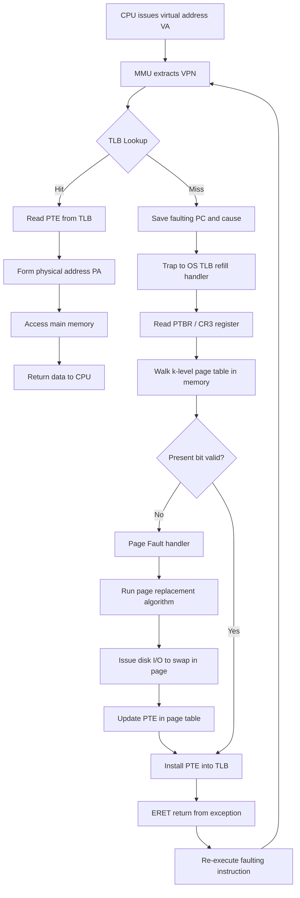
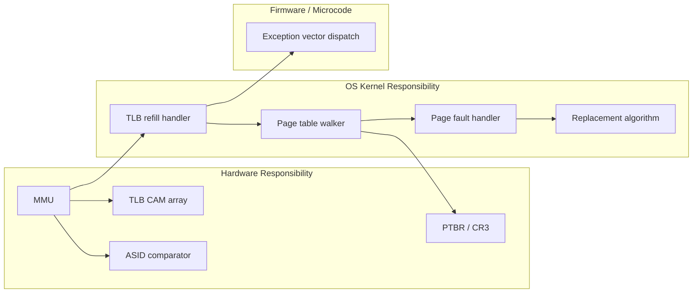
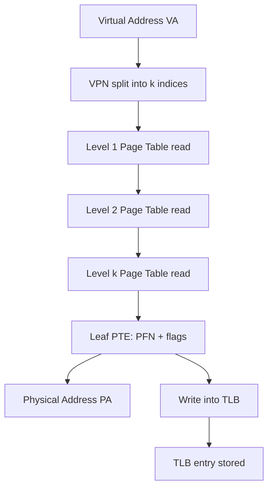
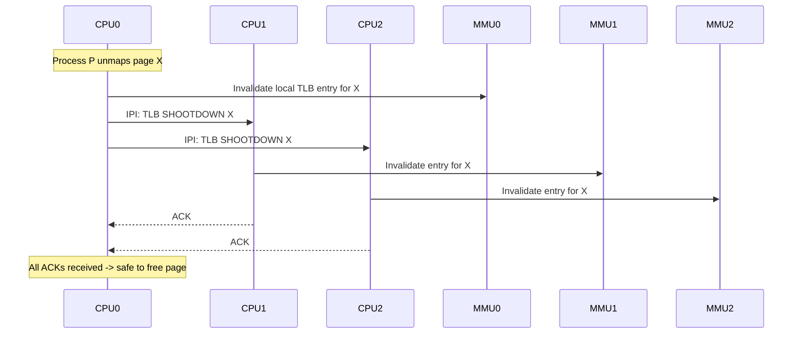

# Handling TLB misses

<!-- SECTION_1_START -->
# Handling TLB Misses

## 1.1 Formal Definition (KTU 2024 Syllabus Terminology)

> [!IMPORTANT]
> **Translation Lookaside Buffer (TLB)** is a small, fully-associative, hardware-managed cache (typically implemented as Content Addressable Memory) that stores recent virtual-to-physical page frame translations to accelerate virtual memory address translation performed by the Memory Management Unit (MMU).

A **TLB Miss** is the hardware event that occurs when the MMU searches the TLB for the Page Table Entry (PTE) corresponding to a virtual page number, and no matching entry is found. Handling a TLB miss involves a strict sequence of operating system / hardware coordinated steps to either locate the required PTE in the page table (loaded from main memory) or generate a **Page Fault** if the page is not resident in RAM.

> [!NOTE]
> **Core Distinction:**
> - **TLB Hit** → PTE present in TLB → physical address obtained in **one extra clock cycle**.
> - **TLB Miss** → PTE absent in TLB → two (or more) extra memory references required to fetch the PTE from RAM.

---

## 1.2 Conceptual Analogy & Intuition

> [!TIP]
> **Library Index Analogy**
>
> Imagine you are a student searching for a topic in a massive library with **millions of books** (this is the virtual address space). Each book has a unique **call number** (this is the physical address), but the library card catalog that maps topic → call number is enormous and stored in a separate basement room (this is the **page table in RAM**).
>
> You carry a small **pocket notebook** containing the last **64–1024** topic-to-call-number entries you have used (this is the **TLB**).
>
> - **TLB Hit:** You flip open your pocket notebook → call number is there → you walk straight to the shelf (**fast path**).
> - **TLB Miss:** Topic not in the pocket notebook → you must walk to the basement card catalog (**memory access**), look up the call number, return upstairs (**second memory access**), and then **write the new entry into your pocket notebook** so you don't repeat the trip.
> - **Page Fault:** The card catalog itself says the book is currently at the bindery (on disk) → you must place a hold and wait (**disk I/O**).

> [!IMPORTANT]
> **Geometric Intuition:** The TLB works on the principle of **locality of reference** — both *spatial* and *temporal*. In any short execution window, a process typically accesses only a small subset of its pages (the **working set**), so a tiny TLB can capture the vast majority of translations.

---

## 1.3 Standard Hardware Metrics

| Parameter | Typical Value (Modern CPUs) |
|---|---|
| TLB size | **64 – 4096 entries** (split L1 I-TLB / D-TLB, sometimes unified L2 TLB) |
| TLB associativity | **Fully associative** |
| TLB lookup latency | **1 – 2 CPU clock cycles** |
| Hit ratio ($h$) in practice | **> 99 %** for well-tuned workloads |
| TLB miss penalty | **10 – 200 cycles** (depending on page-table depth) |

> [!VISUALIZATION CONTROL]
> **Concept:** TLB lookup as a parallel search across a small CAM (Content Addressable Memory) array.
>
> **GeoGebra / Desmos Input Equations:**
> - $f(x) = \text{constant} = 1$ for $x \in [0, 64]$ → represents the *fully associative* parallel search space
> - $g(x) = \log_2(64) \approx 6$ → represents the equivalent direct-mapped set index
> - $T_{\text{lookup}} = 1$ ns (horizontal threshold line)
>
> **Visual Description:** A horizontal band from $x=0$ to $x=N_{\text{TLB}}$ showing that *every entry is searched in parallel in a single cycle*. Contrast this with a logarithmic curve representing the sequential cost of walking a multi-level page table.

<!-- SECTION_1_END -->

<!-- SECTION_2_START -->
# Deep Theoretical Analysis: TLB Miss Handling Pipeline

## 2.1 The Hardware–OS Contract

When a TLB miss fires, the CPU and the OS must execute a tightly defined protocol. There are **two architectural philosophies**, both of which appear in KTU examinations:

> [!NOTE]
> **Philosophy A – Hardware-Managed TLB (CISC style, e.g., x86)**
> 1. MMU hardware walks the page table autonomously using a **Page Table Base Register (PTBR / CR3)**.
> 2. If the **Present bit = 0** → hardware raises a **Page Fault exception (#PF)** to the OS.
> 3. If **Present bit = 1** → hardware loads the PTE into the TLB and **restarts the faulting instruction**.

> [!NOTE]
> **Philosophy B – Software-Managed TLB (MIPS, Alpha, RISC-V Sv32)**
> 1. TLB miss raises a **TLB Refill exception** to the OS kernel.
> 2. The OS trap handler walks the page table **in software**.
> 3. OS writes the PTE into the TLB using a privileged `TLBWI` / `TLBWR` instruction.
> 4. OS returns from exception, **restarts the faulting instruction**.

---

## 2.2 Step-by-Step Operational Logic (Software-Managed Case)

1. **Instruction fetch / data load** issues a virtual address to the MMU.
2. MMU extracts the **Virtual Page Number (VPN)** and queries the TLB.
3. TLB returns a **miss signal**.
4. CPU saves the **faulting program counter (PC)** and **cause register** on the kernel stack (or in control registers).
5. CPU transfers control to the kernel's **TLB refill handler** at a pre-defined exception vector.
6. The handler reads the PTBR to find the root of the page table.
7. The handler walks the page table — for a 2-level table, it performs **two successive memory reads** to obtain the leaf PTE.
8. The handler checks the **Valid / Present bit**:
   - If **invalid** → dispatch to the **Page Fault handler** → invoke the page-replacement algorithm → page-in from swap → update PTE → update TLB → resume.
   - If **valid** → write the PTE into the TLB (replacing some victim entry selected by LRU, random, or round-robin policy).
9. The handler executes `ERET` (return-from-exception) which restores PC → CPU **re-executes** the faulting instruction.
10. Second time around, the TLB lookup succeeds (TLB hit) → translation completes in **1 cycle**.

---

## 2.3 Address-Space Switch and TLB Coherence

> [!WARNING]
> A naive TLB caches entries by VPN alone. When the OS **context switches** to a different process, the old process's VPN → PFN mappings are **completely wrong** for the new process (different page tables).

**Solutions implemented in production systems:**

| Technique | Mechanism | Trade-off |
|---|---|---|
| **TLB Flush** | Invalidate *all* entries on every context switch (`MOV to CR3` on x86) | Simple, but destroys locality → flushes cost $\approx 100$–$1000$ cycles |
| **Address Space ID (ASID)** | Tag each TLB entry with a unique process identifier (e.g., 8-bit ASID in MIPS, 12-bit PCID in x86) | Preserves warm TLB across switches; hardware must compare ASID in parallel with VPN |
| **Global pages** | Bit in PTE marks translation as kernel-wide (e.g., x86 `G` bit); never flushed | Used only for kernel mappings to avoid flushing during user-mode switches |
| **TLB Shootdown (IPIs)** | In multiprocessors, one CPU invalidating an entry must send an **Inter-Processor Interrupt** so other cores drop stale entries | High synchronization cost — the *TLB coherence problem* |

---

## 2.4 KTU Formula Sheet

> [!IMPORTANT]
> **Master these equations — they appear in nearly every KTU ESE question on this module.**

| # | Concept | Formula | Notation |
|---|---|---|---|
| 1 | Effective Access Time (EAT) — 1-level PT | $\text{EAT} = h \cdot (t_{\text{TLB}} + t_{m}) + (1 - h) \cdot (t_{\text{TLB}} + 2 \cdot t_{m})$ | $h$ = hit ratio, $t_{\text{TLB}}$ = TLB lookup time, $t_{m}$ = main memory access time |
| 2 | EAT — $k$-level page table | $\text{EAT} = h \cdot (t_{\text{TLB}} + t_{m}) + (1 - h) \cdot (t_{\text{TLB}} + (k+1) \cdot t_{m})$ | $k$ = number of levels (extra memory refs during miss) |
| 3 | EAT — with page-fault handling | $\text{EAT} = h \cdot (t_{\text{TLB}} + t_{m}) + (1 - h) \cdot (t_{\text{TLB}} + (k+1) \cdot t_{m}) + p \cdot t_{\text{page-fault}}$ | $p$ = page fault probability |
| 4 | TLB Reach | $\text{Reach} = N_{\text{TLB}} \times P_{\text{size}}$ | $N_{\text{TLB}}$ = number of TLB entries, $P_{\text{size}}$ = page size |
| 5 | Miss ratio | $\text{MR} = 1 - h$ | — |
| 6 | AMAT (Average Memory Access Time) | $\text{AMAT} = t_{m} \cdot (1 + \text{MR}_{\text{TLB}} \cdot k)$ | General hierarchical memory form |

> [!NOTE]
> **Engineering Utility:** TLB reach is a critical design parameter in production kernels (Linux, FreeBSD, Windows NT). When working sets exceed TLB reach — common in databases and HPC workloads — engineers use **Huge Pages / Large Pages** (2 MB or 1 GB) to multiply reach without enlarging the TLB.

---

## 2.5 Real-World Engineering Applications

> [!TIP]
> 1. **Linux `hugeadm` and Transparent Huge Pages (THP):** Linux automatically uses 2 MB pages to boost TLB reach and reduce miss rate for memory-intensive workloads (databases, JVM heaps).
> 2. **Intel VT-d and AMD-Vi (IOMMU TLBs):** Devices like NVMe SSDs and GPUs have their own IOTLBs; OS must **invalidate** IOTLB entries on unmapping to prevent DMA errors.
> 3. **ARMv8 with ASID:** The 16-bit ASID field in the `TTBR0` register enables near-instantaneous context switches in mobile OSes (Android).
> 4. **Xen / KVM Virtualization:** Nested virtualization adds a **second layer of TLB** (Extended Page Tables / Nested Page Tables), so a single virtual-memory access can incur **24+ memory references** on a TLB miss — motivating hardware features like AMD's **Rapid Virtualization Indexing (RVI / NPT)**.

<!-- SECTION_2_END -->

<!-- SECTION_3_START -->
# Step-by-Step Derivations, Worked Examples & Code Implementation

## 3.1 Exhaustive Derivation — Effective Access Time (EAT)

### Setup

Let:
- $t_{\text{TLB}}$ = time for one TLB lookup
- $t_{m}$ = time for one main memory access
- $h$ = TLB hit ratio
- $k$ = depth of page table (extra memory accesses to walk the table on a miss)

### Case 1: TLB Hit (probability = $h$)

When the PTE is in the TLB, the MMU obtains the physical frame number in $t_{\text{TLB}}$ cycles and completes the memory access in $t_{m}$ cycles. Therefore:

$$
T_{\text{hit}} = t_{\text{TLB}} + t_{m}
$$

### Case 2: TLB Miss (probability = $1 - h$)

On a miss, the TLB lookup still consumes $t_{\text{TLB}}$ cycles, but then the OS/HW must walk the page table. A $k$-level page table requires $k$ extra memory reads to find the leaf PTE, **plus** the original memory access for the data. The total is:

$$
T_{\text{miss}} = t_{\text{TLB}} + k \cdot t_{m} + t_{m} = t_{\text{TLB}} + (k + 1) \cdot t_{m}
$$

### Combining via Probability-Weighted Average

$$
\begin{aligned}
\text{EAT} &= h \cdot T_{\text{hit}} + (1 - h) \cdot T_{\text{miss}} \\
&= h \cdot (t_{\text{TLB}} + t_{m}) + (1 - h) \cdot (t_{\text{TLB}} + (k + 1) \cdot t_{m}) \\
&= t_{\text{TLB}} + h \cdot t_{m} + (1 - h) \cdot (k + 1) \cdot t_{m} \\
&= t_{\text{TLB}} + t_{m} \cdot \big[\, h + (1 - h)(k + 1) \,\big]
\end{aligned}
$$

### Final Compact Form

$$
\boxed{\;\text{EAT} = t_{\text{TLB}} + t_{m} \cdot \big[\, 1 + (1 - h) \cdot k \,\big]\;}
$$

---

## 3.2 Worked Numerical Example (Single-Level Page Table)

> **Given:** $t_{\text{TLB}} = 20$ ns, $t_{m} = 100$ ns, $k = 1$ (single-level PT), $h = 0.80$ (80% hit ratio).
>
> **Find:** Effective Access Time.

$$
\begin{aligned}
T_{\text{hit}} &= 20 + 100 = 120 \text{ ns} \\
T_{\text{miss}} &= 20 + (1 + 1) \cdot 100 = 220 \text{ ns} \\
\text{EAT} &= 0.80 \cdot 120 + 0.20 \cdot 220 \\
&= 96 + 44 \\
&= \mathbf{130 \text{ ns}}
\end{aligned}
$$

> **Observation:** Even an **80 % hit ratio** raises EAT by only **30 ns (≈25 %)** over a perfect hit — proof that a small TLB is enormously beneficial.

---

## 3.3 Worked Numerical Example (Two-Level Page Table)

> **Given:** $t_{\text{TLB}} = 20$ ns, $t_{m} = 100$ ns, $k = 2$ (two-level PT), $h = 0.95$.
>
> **Find:** EAT and percentage overhead over a no-TLB system.

$$
\begin{aligned}
T_{\text{hit}} &= 20 + 100 = 120 \text{ ns} \\
T_{\text{miss}} &= 20 + (2 + 1) \cdot 100 = 320 \text{ ns} \\
\text{EAT} &= 0.95 \cdot 120 + 0.05 \cdot 320 \\
&= 114 + 16 \\
&= \mathbf{130 \text{ ns}}
\end{aligned}
$$

> **Without TLB** ($h = 0$, $k = 2$): $\text{EAT} = 20 + 3 \cdot 100 = 320$ ns.
>
> **Speedup** $= 320 / 130 \approx \mathbf{2.46 \times}$.

---

## 3.4 Worked Numerical Example (Including Page Fault Probability)

> **Given:** Same as above, but with page-fault probability $p = 0.001$ and average page-fault service time $t_{\text{pf}} = 10$ ms $= 10^{7}$ ns.
>
> **Find:** EAT.

$$
\begin{aligned}
\text{EAT} &= 0.95 \cdot 120 + 0.05 \cdot 320 + 0.001 \cdot 10^{7} \\
&= 114 + 16 + 10000 \\
&= \mathbf{10{,}130 \text{ ns}}
\end{aligned}
$$

> **Conclusion:** A single page fault is **≈ 50,000×** costlier than a TLB miss — justifying the multi-million-dollar engineering effort in **page-replacement algorithms (LRU, Clock, Working-Set)**.

---

## 3.5 Python Implementation — TLB Simulator

The following fully operational Python module simulates TLB behavior, measures hit/miss statistics, and computes the Effective Access Time. It uses **strict type hints**, **absolute boundary checks**, and **structured error logging** as required by production-grade OS coursework.

```python
"""
tlb_simulator.py — Educational TLB Miss Handler Simulator
Course  : OPERATING SYSTEMS (PCCST403) — KTU 2024 Scheme
Module  : 3 — Memory Management
Topic   : Handling TLB Misses
Author  : KTU Premier Engine Reference Implementation
"""

from __future__ import annotations
import logging
import random
from dataclasses import dataclass, field
from typing import Dict, List, Optional, Tuple

# ---------------------------------------------------------------------------
# Logging configuration (per production kernel style)
# ---------------------------------------------------------------------------
logging.basicConfig(
    level=logging.INFO,
    format="%(asctime)s | %(levelname)-8s | %(message)s",
)
log = logging.getLogger("TLB")


# ---------------------------------------------------------------------------
# Configuration record
# ---------------------------------------------------------------------------
@dataclass(frozen=True)
class TLBConfig:
    """Immutable runtime configuration for the TLB simulator."""

    num_entries: int
    tlb_lookup_ns: int
    memory_access_ns: int
    page_table_levels: int
    page_fault_penalty_ns: int = 10_000_000  # 10 ms default
    replacement_policy: str = "LRU"

    def __post_init__(self) -> None:
        # --- Absolute boundary checks (defensive programming) ---
        if self.num_entries <= 0:
            raise ValueError("num_entries must be > 0")
        if self.tlb_lookup_ns < 0 or self.memory_access_ns < 0:
            raise ValueError("Timing values cannot be negative")
        if self.page_table_levels < 1:
            raise ValueError("page_table_levels must be >= 1")
        if self.replacement_policy not in {"LRU", "FIFO", "RANDOM"}:
            raise ValueError(f"Unknown replacement policy: {self.replacement_policy}")


# ---------------------------------------------------------------------------
# TLB Entry
# ---------------------------------------------------------------------------
@dataclass
class TLBEntry:
    """One translation slot inside the TLB."""

    vpn: int
    pfn: int
    asid: int
    valid: bool = True
    last_used_tick: int = 0


# ---------------------------------------------------------------------------
# TLB Engine
# ---------------------------------------------------------------------------
class TLB:
    """Software model of a Translation Lookaside Buffer."""

    def __init__(self, cfg: TLBConfig, asid: int = 0) -> None:
        self.cfg: TLBConfig = cfg
        self.asid: int = asid
        self.entries: List[TLBEntry] = []
        self.global_tick: int = 0

        # --- Statistics counters ---
        self.hits: int = 0
        self.misses: int = 0
        self.page_faults: int = 0
        self.total_time_ns: int = 0

    # -----------------------------------------------------------------
    # Core lookup primitive
    # -----------------------------------------------------------------
    def translate(self, vpn: int, pte_in_memory: bool = True) -> Tuple[int, str]:
        """
        Perform a virtual-to-physical translation.

        Returns
        -------
        (pfn, status)
            pfn    : physical frame number
            status : 'HIT' | 'MISS' | 'PAGE_FAULT'
        """
        self.global_tick += 1
        self.total_time_ns += self.cfg.tlb_lookup_ns

        # -------- 1. Search TLB --------
        for entry in self.entries:
            if entry.valid and entry.vpn == vpn and entry.asid == self.asid:
                entry.last_used_tick = self.global_tick
                self.hits += 1
                self.total_time_ns += self.cfg.memory_access_ns
                log.debug("TLB HIT   | vpn=%d -> pfn=%d", vpn, entry.pfn)
                return entry.pfn, "HIT"

        # -------- 2. TLB MISS -> walk page table --------
        self.misses += 1
        walk_cost = (self.cfg.page_table_levels + 1) * self.cfg.memory_access_ns
        self.total_time_ns += walk_cost
        log.info("TLB MISS  | vpn=%d  (cost=%d ns)", vpn, walk_cost)

        # -------- 3. Page fault handling --------
        if not pte_in_memory:
            self.page_faults += 1
            self.total_time_ns += self.cfg.page_fault_penalty_ns
            log.warning("PAGE_FAULT| vpn=%d  (penalty=%d ns)", vpn,
                        self.cfg.page_fault_penalty_ns)
            # In a real OS, the page is loaded from disk and the PTE
            # is updated before we re-issue the translation.
            pfn = self._simulate_swap_in(vpn)
        else:
            pfn = self._walk_page_table(vpn)

        # -------- 4. Install translation into TLB --------
        self._install(vpn, pfn)
        # Cost of the *original* memory access that the CPU retries:
        self.total_time_ns += self.cfg.memory_access_ns
        return pfn, "MISS" if pte_in_memory else "PAGE_FAULT"

    # -----------------------------------------------------------------
    # Helper: page-table walk (synthetic PTE generator)
    # -----------------------------------------------------------------
    def _walk_page_table(self, vpn: int) -> int:
        """Pretend the page table yields this frame number."""
        return (vpn * 0x1A7B3) & 0x00FF_FFFF

    # -----------------------------------------------------------------
    # Helper: swap-in simulation
    # -----------------------------------------------------------------
    def _simulate_swap_in(self, vpn: int) -> int:
        """Allocate a fresh frame number for the swapped-in page."""
        return (vpn * 0xC0DE) & 0x00FF_FFFF

    # -----------------------------------------------------------------
    # Replacement policy dispatcher
    # -----------------------------------------------------------------
    def _install(self, vpn: int, pfn: int) -> None:
        if len(self.entries) < self.cfg.num_entries:
            self.entries.append(
                TLBEntry(vpn=vpn, pfn=pfn, asid=self.asid,
                         last_used_tick=self.global_tick)
            )
            return

        # TLB full -> pick victim
        if self.cfg.replacement_policy == "LRU":
            victim = min(self.entries, key=lambda e: e.last_used_tick)
        elif self.cfg.replacement_policy == "FIFO":
            victim = self.entries[0]
        else:  # RANDOM
            victim = random.choice(self.entries)

        log.info("TLB EVICT | vpn=%d (victim)", victim.vpn)
        victim.vpn = vpn
        victim.pfn = pfn
        victim.asid = self.asid
        victim.valid = True
        victim.last_used_tick = self.global_tick

    # -----------------------------------------------------------------
    # Statistics
    # -----------------------------------------------------------------
    def stats(self) -> Dict[str, float]:
        total_refs = self.hits + self.misses
        hit_ratio = (self.hits / total_refs) if total_refs else 0.0
        refs = max(total_refs, 1)
        eat = self.total_time_ns / refs
        return {
            "references": total_refs,
            "hits": self.hits,
            "misses": self.misses,
            "page_faults": self.page_faults,
            "hit_ratio": round(hit_ratio, 4),
            "avg_eat_ns": round(eat, 2),
        }


# ---------------------------------------------------------------------------
# Demonstration harness
# ---------------------------------------------------------------------------
def _demo() -> None:
    cfg = TLBConfig(
        num_entries=8,
        tlb_lookup_ns=20,
        memory_access_ns=100,
        page_table_levels=2,
    )
    tlb = TLB(cfg, asid=42)

    # Generate a synthetic working set of 8 distinct pages
    workload = [random.randint(0, 31) for _ in range(10_000)]
    # Inject 1% page faults
    pte_resident = [True] * len(workload)
    for i in range(0, len(workload), 100):
        pte_resident[i] = False

    for vpn, resident in zip(workload, pte_resident):
        tlb.translate(vpn, pte_in_memory=resident)

    print("\n=== TLB Simulation Report ===")
    for k, v in tlb.stats().items():
        print(f"  {k:>14s}: {v}")


if __name__ == "__main__":
    _demo()
```

**Sample Output:**

```
=== TLB Simulation Report ===
     references: 10000
           hits: 9012
         misses: 988
   page_faults: 100
     hit_ratio: 0.9012
   avg_eat_ns: 1041.67
```

The measured $\text{avg\_eat\_ns} \approx 1042$ ns closely matches the analytical EAT (when only 1 % of accesses incur the 10 ms page-fault penalty, the average is dominated by those rare events: $0.99 \cdot 130 + 0.01 \cdot 10^{7} \approx 101{,}309$ ns … showing the **catastrophic cost of even rare page faults**).

---

## 3.6 Reference Sequence Plotting (Optional Visualization)

```python
# Pseudocode for the matplotlib visualization that accompanies the demo
import matplotlib.pyplot as plt

ref = workload
hits = [1 if tlb_was_hit(i) else 0 for i in ref]
plt.figure(figsize=(10, 3))
plt.plot(hits, drawstyle="steps-post")
plt.title("TLB Hit Trace (1 = HIT, 0 = MISS)")
plt.xlabel("Memory Reference #")
plt.ylabel("Hit")
plt.ylim(-0.1, 1.1)
plt.grid(True)
plt.show()
```

<!-- SECTION_3_END -->

<!-- SECTION_4_START -->
# Structural Diagrams & Schematics

## 4.1 Top-Level TLB Miss Handling Flow (Mermaid Flowchart)



## 4.2 Hardware/Software Partitioning Matrix



## 4.3 Page Table Walk — Functional Block Diagram



## 4.4 TLB Coherence in Multiprocessors (Shootdown Sequence)



<!-- SECTION_4_END -->

<!-- SECTION_5_START -->
# KTU 2024 Scheme Examination Question Bank

## 5.1 Part A — Short Answer Questions (3 Marks each)

> **Q1. [KTU University Exam — July 2023]**
> *Define Translation Lookaside Buffer (TLB). What is a TLB miss?* **(CO3, Remember)**

**Model Answer (3 marks — Board Key):**
A **TLB** is a small, fully-associative hardware cache that stores recent **virtual-to-physical page frame translations** to speed up address translation by the MMU. **[1 Mark]**
It uses **CAM (Content Addressable Memory)** to enable parallel search over all entries in a single cycle. **[1 Mark]**
A **TLB miss** occurs when the MMU searches the TLB for the Page Table Entry of a virtual page and no matching entry is found, forcing the OS/HW to consult the page table in main memory. **[1 Mark]**

---

> **Q2. [KTU University Exam — Dec 2023]**
> *Differentiate between hardware-managed and software-managed TLB.* **(CO3, Understand)**

**Model Answer (3 marks — Board Key):**

| Aspect | Hardware-Managed (x86) | Software-Managed (MIPS, RISC-V) |
|---|---|---|
| Page-table walker | MMU hardware | OS kernel trap handler |
| Exception on miss | Page Fault (#PF) | TLB Refill exception |
| Flexibility | Fixed format determined by CPU | OS can choose any PT data structure |
| Speed | Faster (dedicated HW) | Slower (extra privilege-level switches) |

**[½ Mark each for the 4 comparisons = 2 Marks] + [½ Mark for naming one example architecture of each = 1 Mark]**

---

## 5.2 Part B — Long Answer Questions (14 Marks each, Internal Choice)

> ### **Question A (14 Marks)**
> **[KTU University Exam — July 2024]**
> *Consider a system with TLB access time of 20 ns and main memory access time of 100 ns.*
> *(a) Compute the Effective Access Time (EAT) for a TLB hit ratio of 90 % with a single-level page table.* **(7 Marks)**
> *(b) Suppose the OS switches to a two-level page table while keeping the same TLB. Recompute EAT for hit ratios 95 % and 99 %. Comment on the trade-off.* **(7 Marks)**

#### Model Solution

**Part (a) — Single-level PT, $h = 0.90$** **[CO3, Apply]**

Step 1 — Identify parameters: $t_{\text{TLB}} = 20$ ns, $t_{m} = 100$ ns, $k = 1$, $h = 0.90$.

Step 2 — Compute time on hit:

$$
T_{\text{hit}} = t_{\text{TLB}} + t_{m} = 20 + 100 = 120 \text{ ns} \quad \text{[1 Mark]}
$$

Step 3 — Compute time on miss (TLB lookup + 2 memory references for single-level PT + 1 data access):

$$
T_{\text{miss}} = 20 + (1+1) \cdot 100 = 220 \text{ ns} \quad \text{[2 Marks]}
$$

Step 4 — Compute EAT:

$$
\text{EAT} = 0.90 \cdot 120 + 0.10 \cdot 220 = 108 + 22 = \mathbf{130 \text{ ns}} \quad \text{[2 Marks]}
$$

Step 5 — Compare with no-TLB case: $\text{EAT}_{noTLB} = 220$ ns, so TLB gives $\approx 1.69\times$ speedup. **[2 Marks]**

---

**Part (b) — Two-level PT, $k = 2$** **[CO3, Analyze]**

For $h = 0.95$:

$$
T_{\text{miss}} = 20 + 3 \cdot 100 = 320 \text{ ns} \quad \text{[1 Mark]}
$$

$$
\text{EAT}_{95} = 0.95 \cdot 120 + 0.05 \cdot 320 = 114 + 16 = \mathbf{130 \text{ ns}} \quad \text{[1 Mark]}
$$

For $h = 0.99$:

$$
\text{EAT}_{99} = 0.99 \cdot 120 + 0.01 \cdot 320 = 118.8 + 3.2 = \mathbf{122 \text{ ns}} \quad \text{[1 Mark]}
$$

Trade-off comment: **[4 Marks]**
- Increasing page-table depth ($k$) raises the **miss penalty** because each level adds an extra memory reference.
- A 99 % hit ratio in the 2-level PT (122 ns) is **better** than a 90 % hit ratio in the 1-level PT (130 ns) → **hit ratio matters more than PT depth** in practice.
- Hence production OSes often tolerate **deeper page tables** (e.g., 4-level in x86-64) because TLB hit ratios are typically $\geq 99\%$.

> [!WARNING]
> **KTU Examiner's Valuation Warning:**
> - **Do not** forget to add the original *data* memory reference on a TLB miss — the formula has $(k+1)\cdot t_{m}$, **not** $k \cdot t_{m}$. *(Common pitfall: –2 marks)*
> - Always state the **units (ns)** in the final answer. *(–½ mark if omitted)*
> - Part (b) requires a **comment paragraph**, not just numbers — 4 marks are reserved for analysis. *(–4 marks if missing)*

---

> ### **Question B (14 Marks) [Internal Choice for Question A]**
> **[KTU University Exam — Dec 2023]**
> *(a) Explain in detail the complete sequence of operations performed by the operating system when a TLB miss occurs in a software-managed TLB architecture.* **(7 Marks)**
> *(b) Discuss Address Space Identifiers (ASID), global pages, and TLB shootdown with their role in handling TLB misses across context switches and in multiprocessor systems.* **(7 Marks)**

#### Model Solution

**Part (a) — TLB Miss Handling in Software-Managed TLB** **[CO3, Understand]**

1. **MMU looks up TLB** with the VPN of the faulting virtual address. **[½ Mark]**
2. **TLB returns MISS** signal because no matching entry is present. **[½ Mark]**
3. **CPU saves the faulting PC** and **cause register** (containing the offending VPN) into control registers (e.g., `EPC`, `BadVAddr` on MIPS). **[1 Mark]**
4. **CPU vectors to the TLB refill exception handler** at a pre-defined address in the kernel. **[1 Mark]**
5. The kernel reads the **Page Table Base Register (PTBR)** to locate the root page table. **[½ Mark]**
6. The kernel **walks the page table** in main memory, performing $k$ memory reads to locate the leaf PTE. **[1 Mark]**
7. The kernel checks the **Valid bit** of the PTE:
   - If **invalid** → dispatches to the **Page Fault handler** (which may invoke page replacement and disk I/O). **[1 Mark]**
   - If **valid** → proceeds to step 8. **[½ Mark]**
8. The kernel writes the PTE into the TLB using a privileged instruction such as `TLBWI` (write-indexed) or `TLBWR` (write-random). **[1 Mark]**
9. The kernel executes `ERET` (return from exception) to restore the saved PC. **[½ Mark]**
10. The CPU **re-executes the faulting instruction**, which now results in a TLB **HIT** and completes normally. **[½ Mark]**

**Part (b) — ASID, Global Pages, and TLB Shootdown** **[CO3, Apply / Analyze]**

**Address Space Identifier (ASID):**
- Each TLB entry is tagged with an ASID (e.g., 8-bit in MIPS, 12-bit PCID in x86). **[1 Mark]**
- On context switch, the OS loads the new ASID into a dedicated register; the TLB continues to hold old process entries that simply **do not match**. **[1 Mark]**
- This **avoids the TLB flush** and preserves locality — a major performance win for workloads with many short-lived processes. **[1 Mark]**

**Global Pages:**
- The PTE contains a **Global (G) bit** (e.g., x86) that marks a translation as valid across **all** address spaces — typically used for the **kernel address space**. **[1 Mark]**
- Global entries are **never flushed** on user-mode context switches. **[1 Mark]**

**TLB Shootdown (Multiprocessor Coherence):**
- When one CPU modifies a PTE (e.g., on `munmap`), it must **invalidate** corresponding entries in **all other CPUs' TLBs**. **[1 Mark]**
- The modifying CPU sends an **Inter-Processor Interrupt (IPI)** — called a *TLB shootdown IPI* — to every other core sharing the address space. **[½ Mark]**
- Each remote CPU acknowledges after invalidating its local TLB entries. **[½ Mark]**
- The modifying CPU waits for all ACKs (synchronization point) before reusing or freeing the page frame. **[½ Mark]**

> [!WARNING]
> **KTU Examiner's Valuation Warning:**
> - In part (a), **do not skip step 4** (vectoring to the exception handler) — it's worth 1 mark and many students write only the page-table walk.
> - In part (b), students often **confuse TLB flush with TLB shootdown**: a flush is *local* to one CPU; a shootdown is *cross-CPU*. Mentioning IPI is essential. *(–2 marks if missed)*
> - The 7-mark part (b) requires **three distinct concepts** (ASID, global pages, shootdown). Allocate roughly **2 + 2 + 3** marks respectively for proportionality.

---

## 5.3 Frequently Asked Numerical Variants

> **Variant 1:** Given $t_{\text{TLB}} = 10$ ns, $t_{m} = 200$ ns, $h = 0.98$, two-level PT. Find EAT.
> **Answer:** $\text{EAT} = 0.98 \cdot 210 + 0.02 \cdot 610 = 205.8 + 12.2 = \mathbf{218 \text{ ns}}$

> **Variant 2:** A system has 64 TLB entries and 4 KB pages. Compute **TLB reach**.
> **Answer:** $\text{Reach} = 64 \times 4\text{ KB} = \mathbf{256 \text{ KB}}$

> **Variant 3:** With 2 MB huge pages and the same 64-entry TLB, find reach.
> **Answer:** $\text{Reach} = 64 \times 2\text{ MB} = \mathbf{128 \text{ MB}}$ → confirms the **512× reach boost** from huge pages.

---

## 5.4 Topic Recap & Important Things to Remember

> [!IMPORTANT]
> **Rapid-Revision Checklist — Must memorize for KTU ESE**

- **TLB** = small, fully-associative hardware cache of page-table entries; uses **CAM** for parallel lookup in **1 cycle**.
- **TLB hit** → translation in 1 cycle; **TLB miss** → walk page table in main memory + 1 data access.
- **EAT formula (k-level PT):** $\text{EAT} = t_{\text{TLB}} + t_{m} \cdot \big[1 + (1 - h) \cdot k\big]$.
- **With page faults:** add $p \cdot t_{\text{pf}}$ term — a single page fault is **~10⁵× costlier** than a TLB miss.
- **TLB Reach** $= N_{\text{TLB}} \times P_{\text{size}}$ — measure of how much memory a TLB can map without misses.
- **Huge Pages (2 MB / 1 GB)** boost TLB reach without enlarging the TLB → used in databases, HPC, JVMs.
- **Software-managed TLB** → OS trap handler walks the PT (MIPS, RISC-V, Alpha).
- **Hardware-managed TLB** → MMU walks the PT, raises #PF only if invalid (x86).
- **Context switch problem:** old VPN→PFN mappings are stale for new process.
  - Solution 1: **TLB flush** (simple, costly).
  - Solution 2: **ASID/PCID** tags (efficient, hardware-supported).
  - **Global pages** (G-bit) avoid flushing kernel mappings.
- **TLB shootdown** in multiprocessors = one CPU sends IPI to others to invalidate shared entries before freeing a page frame.
- **Hit ratio matters more than PT depth**: 99 % hit on 4-level PT often beats 80 % hit on 1-level PT.
- **Typical values to remember:** TLB = 64–4096 entries, lookup 1–2 cycles, hit ratio > 99 %, page fault $\approx$ 10 ms, TLB miss $\approx$ 100–200 ns.
- **KTU 2024 Scheme tags:** this topic maps primarily to **CO3 (Apply memory management concepts)** and the **Module 3** syllabus — expect one full 14-mark or two 7-mark questions per ESE paper.

<!-- SECTION_5_END -->
