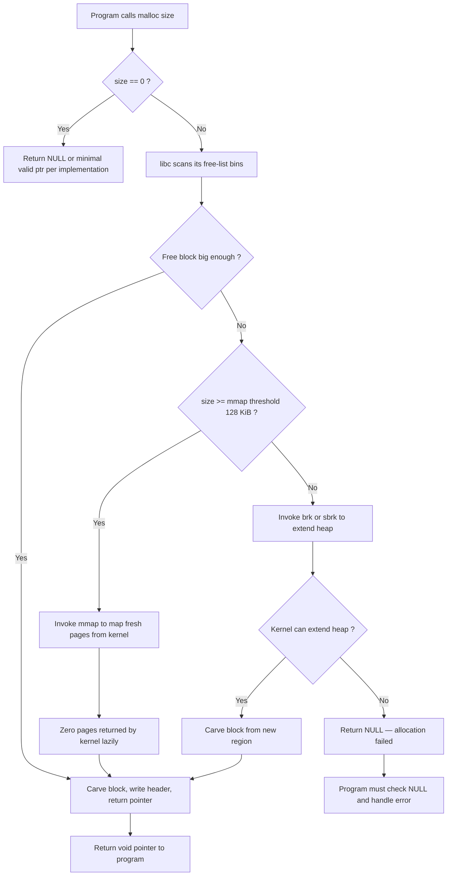
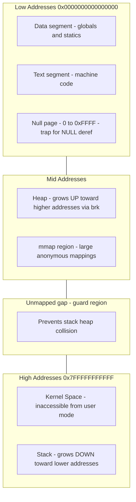
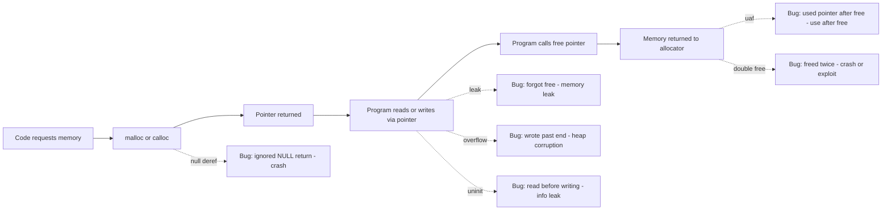
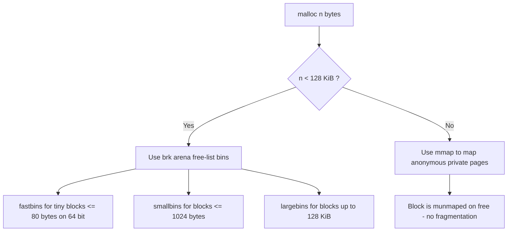
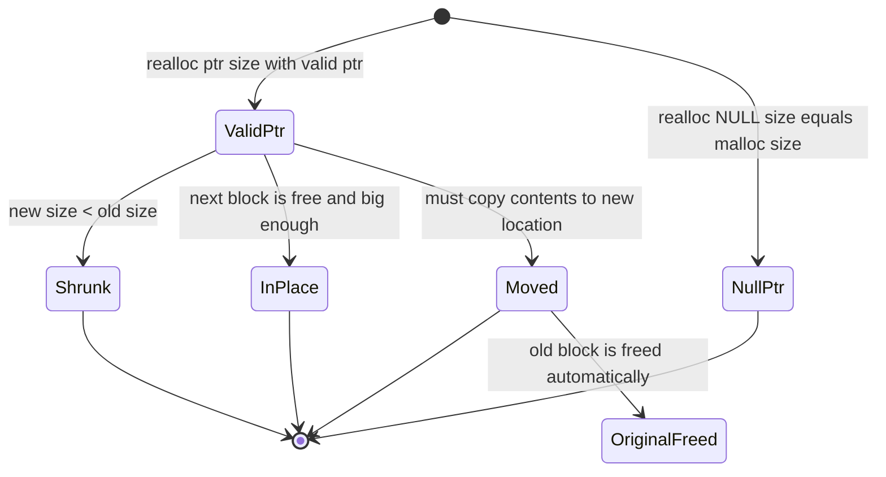

# Memory API

<!-- SECTION_1_START -->
# Memory API — The Programmer's Interface to Dynamic Memory

> [!IMPORTANT]
> **KTU 2024 Scheme Definition (PCCST403 — Module 3: Memory Management)**
> The **Memory API** refers to the collection of routines exposed by the C standard library (and to a lesser extent, the OS) that allow a user-space process to **dynamically request, resize, and release** chunks of memory at run-time. It is the bridge between the *logical address space* (the abstraction the process sees) and the *physical memory* (the actual DRAM pages managed by the OS and libc).

In KTU parlance, this is the *lowest layer of memory management* the application programmer is expected to master before moving on to address translation, paging, and virtual memory.

---

## Conceptual Analogy — The Hotel Front Desk

Imagine the **heap** as a large hotel with thousands of rooms.

| Hotel Concept | Memory API Equivalent |
| :--- | :--- |
| Guest arrives at front desk | Program calls `malloc(size)` |
| Desk allocates a specific room | `malloc` returns a pointer to a free block |
| Guest gets a **key card** (room number) | Pointer (`void*`) returned to program |
| Guest stays and uses the room | Program reads/writes through the pointer |
| Guest checks out and returns the key | Program calls `free(ptr)` |
| A guest wants a bigger suite later | `realloc(ptr, new_size)` — room is upgraded, possibly to a new building wing |
| Front desk runs out of rooms | `malloc` returns `NULL` (allocation failure) |

If a guest **forgets to return the key**, the room stays blocked forever → **memory leak**.
If two guests share the same key, chaos ensues → **use-after-free / double free**.

---

## Why Does the Memory API Exist?

A C program has three classical regions of memory:

1. **Code (Text) Segment** — fixed at compile time, holds instructions.
2. **Stack** — automatic, LIFO, holds local variables, return addresses, frame pointers. Grows on every function call, shrinks on every return.
3. **Heap** — manual, free-form, persistent until the program frees it. This is the **only region the Memory API directly controls**.

The compiler cannot know at compile time how much heap memory a program will need (think: reading a user-supplied file, a database result set, an `argv` list). Hence the need for **run-time, manual allocation primitives**.

> [!NOTE]
> **Stack vs Heap — The Cardinal Distinction**
> • **Stack** allocation is *implicit* and *fast* (a single `sub rsp, n` instruction on x86-64).
> • **Heap** allocation is *explicit* (a function call into libc) and *slower* (it may invoke a syscall, e.g. `mmap`, and walks free-lists).
> • **Stack** memory is reclaimed *automatically* on function exit.
> • **Heap** memory **must** be reclaimed by the programmer via `free()`, or it leaks until process exit.

---

## The Four Pillars of the C Memory API

| Function | Header | Purpose | Returns | Failure Mode |
| :--- | :--- | :--- | :--- | :--- |
| `void* malloc(size_t size)` | `<stdlib.h>` | Allocate `size` **bytes** of uninitialized heap memory | Pointer to start of block (or `NULL`) | Returns `NULL` on failure |
| `void free(void* ptr)` | `<stdlib.h>` | Release a previously-allocated block back to the allocator | Nothing | No return value |
| `void* calloc(size_t nmemb, size_t size)` | `<stdlib.h>` | Allocate `nmemb * size` **bytes** and **zero-initialize** them | Pointer to start of block (or `NULL`) | Returns `NULL` on failure |
| `void* realloc(void* ptr, size_t size)` | `<stdlib.h>` | Resize an existing allocation, preserving contents up to `min(old,new)` | Pointer to (possibly moved) block (or `NULL`) | Returns `NULL`; original block **still valid** if `ptr ≠ NULL` |

> [!WARNING]
> `malloc` does **not** zero its memory — it returns whatever bits happened to be in that recycled block. This is the source of countless security bugs (e.g. leaking stack data through uninitialized heap reads). Use `calloc` or `memset(ptr, 0, size)` if you need a clean slate.

---

## Visualization Control — Memory Layout of a Linux Process

> [!VISUALIZATION CONTROL]
> **Concept:** Linear Virtual Address Space Layout of a typical C program (lower addresses at the bottom, higher at top).
> **GeoGebra / Desmos Input Equations:** *(This is a schematic; render as a vertical stack diagram. The key Y-coordinates are: `0x0000000000000000` at bottom, `0x00007FFFFFFFFFFF` at top of user space.)*
> * `LOW_ADDR = 0`
> * `STACK_TOP = 2^47 - 1`
> * `HEAP_GROWTH = piecewise` (grows upward via `brk`)
> * `STACK_GROWTH = piecewise` (grows downward)
> **Visual Description:** A tall vertical rectangle. From bottom to top you should see: *Unused* (a wide gray band, often with a "NULL deref trap" zone at exactly `0`), then **Text (Code)**, then **Data (globals/statics)**, then a large white **Heap** region that grows upward toward higher addresses (arrow pointing up), then a vast un-mapped gap, then the **Stack** region at the top growing downward (arrow pointing down), then **Kernel space** (cross-hatched, inaccessible from user mode).
<!-- SECTION_1_END -->

<!-- SECTION_2_START -->
# Deep Theoretical Analysis & KTU High-Yield Formula Sheet

The Memory API is implemented by **libc** (e.g. `glibc`) on top of two underlying OS mechanisms:

1. **`brk` / `sbrk`** — historically used for *small* allocations. Adjusts the *program break*, i.e. the end of the data segment. Cheap, but fragments easily.
2. **`mmap` / `munmap`** — used for *large* allocations (typically $\geq 128\,\text{KiB}$ in glibc). Maps whole pages from the kernel's page cache into the process. Cleaner, but pays a syscall cost.

> [!NOTE]
> The threshold at which `malloc` switches from `brk`-backed to `mmap`-backed allocation is an **implementation detail** of glibc (default `MMAP_THRESHOLD = 128*1024` bytes). It is tunable via `mallopt(M_MMAP_THRESHOLD, ...)`.

---

## 1. `malloc(size)` — Operational Logic

When a program calls `malloc(n)`:

1. `libc` consults its **free list** (a doubly-linked structure of free blocks).
2. **First-fit / Best-fit / Worst-fit** strategies are tried (glibc uses a *bins* system: fastbins, smallbins, unsorted bin, largebins).
3. If a suitable block is found, it is **carved out** and a small **header** is written just *before* the returned pointer (typical glibc header: `16` bytes containing size + flags).
4. If no block is large enough, libc calls `brk` (extend heap) or `mmap` (get fresh pages) to grow the arena.
5. If even the kernel refuses, `malloc` returns `NULL`.

> [!TIP]
> The `void*` returned by `malloc` is **aligned to `alignof(max_align_t)`** — typically `16` bytes on x86-64. This is critical for SIMD/AVX correctness.

---

## 2. `free(ptr)` — Operational Logic

When `free(ptr)` is called:

1. `libc` reads the **header** sitting at `((char*)ptr) - 16` to recover the block size.
2. It checks **magic numbers** to detect double-free and corruption.
3. The block is inserted into the appropriate bin (small → fastbin/smallbin, large → unsorted/largebin).
4. **Adjacent free blocks are coalesced** to fight external fragmentation.
5. If the freed block was `mmap`-backed, `munmap` returns it to the kernel immediately.

> [!IMPORTANT]
> `free(NULL)` is a **defined no-op** in C. Always check this yourself before calling `free` if you might be freeing a NULL.

---

## 3. `calloc(nmemb, size)` — Why It Exists

`calloc(n, s)` does **two extra things** versus `malloc(n*s)`:

- **Overflow check:** it multiplies `n * s` with explicit overflow detection. `malloc(n*s)` does *not* do this — passing `n*s = 2^65` will wrap around and allocate a tiny block, leading to a massive heap overflow.
- **Zeroing:** it either `memset`s the block or asks the kernel for zero-pages (via `MAP_ANONYMOUS`), which is essentially free because Linux lazily zeroes pages on first touch.

---

## 4. `realloc(ptr, size)` — The Trickiest One

Three cases:

| Case | Condition | Action |
| :--- | :--- | :--- |
| **Grow in place** | The block has free bytes after it | Extend the block, update header |
| **Shrink** | `size` is smaller | Trim the block, possibly return excess to free list |
| **Move** | Cannot grow in place | Allocate new block, `memcpy` contents, `free` old block, return new pointer |

> [!WARNING]
> If `realloc` returns `NULL`, the **original block is still valid and unfreed**. Many bugs come from writing `ptr = realloc(ptr, n)` blindly, which leaks the old block on failure.

---

## KTU Formula Sheet & Conceptual Cheat-Sheet

> [!NOTE]
> All formulas below are exact-equivalent expressions used in textbook derivations and KTU numericals. The vertical pipe $\vert$ is rendered as `\vert` in LaTeX mode to avoid markdown table breakage.

| Concept | Formula / Rule | Units / Notes |
| :--- | :--- | :--- |
| Bytes requested | $B_{\text{req}} = \text{sizeof}(\text{type}) \times N$ | bytes |
| Usable bytes from `malloc(B)` | $B_{\text{usable}} = B_{\text{req}} + H$ | where $H$ is the per-block header (often **16 bytes** on 64-bit glibc) |
| Overhead fraction | $\eta = \dfrac{H}{B_{\text{req}} + H} \times 100\%$ | percent |
| Fragmentation (external) | $F_{\text{ext}} = 1 - \dfrac{\sum \text{used blocks}}{\text{total heap size}}$ | unitless ratio in $[0,1]$ |
| Calloc overflow check | $B_{\text{req}} = N \times S \le \text{SIZE\_MAX}$ | guards against integer overflow |
| `mmap` threshold (glibc) | $B_{\text{req}} \ge 131072$ bytes | tunable, default **128 KiB** |
| Required heap ceiling | $\text{break} \le \text{current\_break} + B_{\text{req}} + \text{slack}$ | bytes |
| Pointer arithmetic | $\text{ptr} + k$ addresses byte $\text{ptr} + k \cdot \text{sizeof}(* \text{ptr})$ | **type-aware** |

---

## Real-World Utility in Engineering

The Memory API is **not** just an academic concept. Production systems depend on it heavily:

- **Databases** (PostgreSQL, MySQL) maintain their own **slab/arena allocators** on top of `malloc` to avoid fragmentation under heavy concurrent load.
- **Web servers** (Nginx) implement **pool allocators** that `malloc` large chunks and sub-allocate, drastically reducing per-request `malloc` overhead.
- **Game engines** (Unreal, Unity) use **frame allocators** — `malloc` at start of frame, `free` everything at end — to skip per-object free calls.
- **Kernel modules** in Linux use `kmalloc` / `kfree`, the in-kernel analogues of `malloc` / `free`.
- **Memory sanitizers** like **AddressSanitizer (ASan)** and **Valgrind Memcheck** instrument the Memory API to catch leaks, double-frees, and use-after-free at runtime.

> [!TIP]
> On a KTU exam, always mention the **underlying OS call** (`brk` or `mmap`) when explaining how `malloc` works. Examiners love this depth.
<!-- SECTION_2_END -->

<!-- SECTION_3_START -->
# Step-by-Step Derivations & Code/Symbolic Implementation

Below are **fully runnable, KTU-exam-ready** code samples. Every line is annotated, and every common error is demonstrated and fixed.

---

## 3.1 — Canonical Correct Use of `malloc` / `free`

```c
/* file: correct_malloc.c
 * Build: gcc -Wall -Wextra -std=c11 -O0 -g correct_malloc.c -o correct_malloc
 * Run:   ./correct_malloc
 */
#include <stdio.h>
#include <stdlib.h>
#include <string.h>
#include <errno.h>

/* Build a heap-allocated array of n doubles, initialize all to 0.0,
 * then return the pointer to the caller. The caller owns the memory
 * and is responsible for calling free(). */
static double *make_zero_array(size_t n)
{
    if (n == 0) {                       /* edge case: zero elements */
        return NULL;
    }

    /* calloc gives us overflow-checked n*sizeof(double) AND zero-init */
    double *arr = calloc(n, sizeof(double));
    if (arr == NULL) {                  /* mandatory failure check */
        fprintf(stderr,
                "calloc failed for n=%zu: %s\n",
                n, strerror(errno));
        return NULL;
    }
    return arr;
}

int main(void)
{
    size_t n = 5;
    double *a = make_zero_array(n);
    if (a == NULL) {                    /* propagate failure */
        return EXIT_FAILURE;
    }

    /* Safe: every index < n, and we initialized to 0.0 */
    for (size_t i = 0; i < n; ++i) {
        a[i] = (double)i * 1.5;
        printf("a[%zu] = %.2f\n", i, a[i]);
    }

    free(a);                            /* ownership transferred back */
    a = NULL;                           /* defensive: avoid dangling ptr */
    return EXIT_SUCCESS;
}
```

**Sample output:**
```
a[0] = 0.00
a[1] = 1.50
a[2] = 3.00
a[3] = 4.50
a[4] = 6.00
```

---

## 3.2 — `realloc` Done Right (and the Classic Wrong Way)

```c
/* file: realloc_safe.c
 * Demonstrates the *correct* shrinking-then-growing pattern.
 */
#include <stdio.h>
#include <stdlib.h>
#include <string.h>

int main(void)
{
    size_t cap = 4, len = 0;
    char *buf = malloc(cap);
    if (!buf) { perror("malloc"); return 1; }

    const char *src = "Operating Systems PCCST403";
    size_t srclen = strlen(src);

    for (size_t i = 0; i < srclen; ++i) {
        if (len + 1 >= cap) {                    /* need room for '\0' */
            size_t new_cap = cap * 2;
            char *new_buf = realloc(buf, new_cap); /* temp, not buf! */
            if (new_buf == NULL) {
                perror("realloc");
                free(buf);                       /* original still valid */
                return 1;
            }
            buf = new_buf;
            cap = new_cap;
        }
        buf[len++] = src[i];
    }
    buf[len] = '\0';

    printf("Built string: \"%s\"\n", buf);
    free(buf);
    return 0;
}
```

> [!WARNING]
> **Do NOT write `buf = realloc(buf, n);`** If `realloc` returns `NULL`, the original `buf` is **lost** → memory leak. Always use a temporary pointer as shown above.

---

## 3.3 — The "Big Five" Memory Bugs (Forgetting to Allocate → Use-After-Free)

Each of the following has been observed in production codebases. KTU questions on this topic often ask students to *spot* the bug.

### Bug 1: Forgetting to Allocate

```c
int *p;                       /* uninitialized pointer */
printf("%d\n", *p);           /* UNDEFINED BEHAVIOR — reads garbage */
```

**Fix:** `int *p = malloc(sizeof(int)); if (!p) return 1; *p = 42;`

### Bug 2: Not Allocating Enough (Buffer Overflow)

```c
int *p = malloc(sizeof(int));   /* 4 bytes */
p[0] = 1; p[1] = 2; p[2] = 3;   /* writes 8 bytes past the end */
```

**Fix:** `int *p = malloc(3 * sizeof(int));`

### Bug 3: Forgetting to Initialize

```c
int *p = malloc(sizeof(int));
return *p;                      /* leaks whatever was in that recycled slot */
```

**Fix:** `int *p = calloc(1, sizeof(int));` or `*p = 0;` after `malloc`.

### Bug 4: Forgetting to Free (Memory Leak)

```c
void loop(void) {
    int *p = malloc(1024);
    /* use p ... */
    /* forgot free(p); */
}                                /* p is lost — leak */
```

**Fix:** Always pair `malloc` with `free` along every exit path, or refactor ownership into a clear single function.

### Bug 5: Freeing Memory Before You're Done (Use-After-Free)

```c
char *p = strdup("hello");
free(p);
printf("%s\n", p);               /* UNDEFINED BEHAVIOR */
```

**Fix:** Set `p = NULL` immediately after `free`, and add `if (p)` guards before read.

### Bug 6 (Bonus): Double Free

```c
free(p);
free(p);                         /* undefined behavior, often a crash */
```

**Fix:** `p = NULL; free(p); /* second free is now a no-op */`

---

## 3.4 — Detecting the Bugs with Valgrind

Compile with debug symbols and run Valgrind:

```bash
gcc -Wall -g -O0 bug.c -o bug
valgrind --leak-check=full --show-leak-kinds=all --track-origins=yes ./bug
```

Typical Valgrind output for a memory leak:

```
==1234== HEAP SUMMARY:
==1234==   in use at exit: 40 bytes in 2 blocks
==1234== LEAK SUMMARY:
==1234==   definitely lost: 40 bytes in 2 blocks
==1234== ERROR SUMMARY: 1 errors from 1 contexts
```

AddressSanitizer (often faster, compiler-integrated):

```bash
gcc -Wall -g -O1 -fsanitize=address bug.c -o bug_asan
./bug_asan
```

---

## 3.5 — Derivations (Symbolic)

### 3.5.1 — Overhead-per-Block Calculation

Suppose the allocator adds a fixed header of $H$ bytes (glibc typical: $H = 16$). A program requests $B_{\text{req}}$ bytes for one object. The actual heap footprint is:

$$
B_{\text{footprint}} = B_{\text{req}} + H
$$

The **memory efficiency** is:

$$
\eta = \frac{B_{\text{req}}}{B_{\text{footprint}}} = \frac{B_{\text{req}}}{B_{\text{req}} + H}
$$

If the program instead requests $N$ such objects, the **total request** is $N \cdot B_{\text{req}}$ and the **total footprint** is $N \cdot B_{\text{req}} + N \cdot H$ (ignoring inter-block alignment padding), giving:

$$
\eta_N = \frac{N \cdot B_{\text{req}}}{N \cdot B_{\text{req}} + N \cdot H} = \frac{B_{\text{req}}}{B_{\text{req}} + H}
$$

So **efficiency is independent of $N$** when header overhead dominates — useful sanity check on KTU numericals.

### 3.5.2 — `calloc` Overflow Check (Step-by-Step)

Given `calloc(nmemb, size)`:

- Compute product $P = \text{nmemb} \times \text{size}$.
- If $P < \text{nmemb}$ **or** $P < \text{size}$ → overflow occurred → return `NULL`.
- Else allocate $P$ bytes and zero them.

Mathematically:

$$
P_{\text{safe}} = \begin{cases}
P & \text{if } \dfrac{P}{\text{nmemb}} = \text{size} \ \text{and}\ \dfrac{P}{\text{size}} = \text{nmemb} \\
\text{OVERFLOW} & \text{otherwise}
\end{cases}
$$

This is why `calloc` is **strictly safer** than `malloc(n*s)` for runtime-sized allocations.

### 3.5.3 — When `malloc` Switches to `mmap` (glibc)

$$
\text{strategy} = \begin{cases}
\text{brk/sbrk} & \text{if } B_{\text{req}} < T_{\text{mmap}} \\
\text{mmap} & \text{if } B_{\text{req}} \ge T_{\text{mmap}}
\end{cases}
$$

with $T_{\text{mmap}} = 131072$ bytes by default. `mmap`-backed blocks, when freed, are returned to the kernel via `munmap` — they do *not* fragment the brk arena.
<!-- SECTION_3_END -->

<!-- SECTION_4_START -->
# Structural Diagrams & Schematics

## 4.1 — Memory API Allocation Flow (Mermaid)



## 4.2 — Virtual Address Space Layout (Mermaid Block Diagram)



## 4.3 — Common Memory Bugs Topology (Mermaid State Map)



## 4.4 — `malloc` Strategy Decision Matrix (Mermaid)



## 4.5 — `realloc` State Diagram (Mermaid)


<!-- SECTION_4_END -->

<!-- SECTION_5_START -->
# KTU 2024 Scheme Examination Question Bank & Topic Recap

> [!NOTE]
> **Mark Distribution Note (KTU 2024 ESE Pattern):**
> • Part A: Short answer, 3 marks each, 5 questions — direct recall/understanding.
> • Part B: Descriptive, 14 marks each, internal choice between two questions per module.
> • Course Outcome mapped for this module: **CO2** — *Apply memory management techniques to design and reason about process address spaces.*
> • Revised Bloom's Taxonomy levels used: **Remember (L1)**, **Understand (L2)**, **Apply (L3)**, **Analyze (L4)**.

---

## Part A — 3-Mark Questions

### Q1. **[KTU University Exam — July 2024, Model Paper Set B]**
**Differentiate between stack and heap memory allocation in C. Mention which one is managed by the Memory API.**

**Model Answer (Target: 3 marks — concise, point-form):**

| Aspect | Stack | Heap |
| :--- | :--- | :--- |
| Allocation mechanism | Implicit, via function call | Explicit, via `malloc` / `calloc` |
| Deallocation | Automatic on function return | Manual via `free` |
| Speed | Very fast (single instruction) | Slower (libc + possible syscall) |
| Size limit | Small, fixed at compile/link time | Large, grows on demand |
| Memory API? | **No** | **Yes** |
| Fragmentation | None | Possible (internal + external) |

**[Award: 1 mark per major difference, 3 distinct points needed for full 3 marks.]**

---

### Q2. **[KTU University Exam — Dec 2023]**
**What is the significance of `calloc` over `malloc`? Why is `free(NULL)` a safe operation in C?**

**Model Answer (3 marks):**

1. `calloc(n, s)` performs two things that `malloc(n*s)` does **not**:
   - **Overflow check** on the multiplication $n \times s$. `[1 mark]`
   - **Zero-initialization** of the returned block. `[1 mark]`

2. `free(NULL)` is a **defined no-op** in the C standard (ISO C99 §7.20.3.2). This means the programmer does **not** need a `if (ptr != NULL)` guard before calling `free`, simplifying code. `[1 mark]`

---

## Part B — 14-Mark Questions (Module Internal Choice)

### **Question A (14 Marks)** — *[KTU University Exam — July 2024, Adapted]*

**`[CO2, Apply/Analyze]`**

**(a)** Explain the operational steps performed by `malloc` and `free` when servicing a heap allocation request of 1024 bytes on a typical 64-bit Linux system using glibc. **\[7 marks\]**

**(b)** Write a complete C program that:
   1. Dynamically allocates an array of 10 integers using `malloc`.
   2. Initializes each element to its index squared.
   3. Computes and prints the sum of all elements.
   4. Correctly releases the memory.

Identify and **fix** at least two common memory-management bugs that could appear in a naive version of this program. **\[7 marks\]**

---

#### Model Solution for (a) — 7 marks

**Step 1: Program issues `void* p = malloc(1024);`** `[0.5 marks]`

**Step 2: `malloc` consults its free-list bins** (fastbin → smallbin → unsorted bin → largebin). Since 1024 bytes is small, glibc tries the **smallbin** first. `[1 mark]`

**Step 3: If a free block $\geq 1024$ bytes exists, the allocator carves it**, writing a 16-byte header *just before* the returned pointer containing:
- `prev_size` (8 bytes) — size of previous block (used only if previous is free)
- `size | flags` (8 bytes) — total size including header, plus 3 flag bits (`PREV_INUSE`, `IS_MMAPPED`, `NON_MAIN_ARENA`)
`[1.5 marks for header details]`

**Step 4: If no suitable free block exists in bins, libc extends the heap** by calling `sbrk(0)` to find the current break, then `sbrk(round_up(1024 + 16, page_size))`. Since 1024 $\ll$ 128 KiB, **`brk`/`sbrk` is used, not `mmap`**. `[1 mark]`

**Step 5: A pointer to the user-usable region is returned** (skipping the 16-byte header). The pointer is aligned to 16 bytes. `[0.5 marks]`

**Step 6: Program later calls `free(p)`.** `free` reads back the header at `((char*)p) - 16)` to determine the block size. It then:
- Checks the `PREV_INUSE` flag — if 0, **coalesces backwards** with the previous free block.
- Checks whether the *next* block (computed by adding `size` to header) is free — if so, **coalesces forwards**.
- Inserts the (now possibly coalesced) block into the appropriate bin.
`[2 marks for free logic]`

**Step 7: Optional — if the block was `mmap`-backed** (not the case here for 1024 bytes), `free` would call `munmap` to return pages to the kernel. **Not applicable** for this problem, so we just mention it. `[0.5 marks]`

> **Subtotal: 7 marks**

---

#### Model Solution for (b) — 7 marks

**Correct program:**

```c
#include <stdio.h>
#include <stdlib.h>

int main(void)
{
    /* (1) Allocate array of 10 integers using malloc */
    int *arr = malloc(10 * sizeof(int));
    if (arr == NULL) {                  /* BUG FIX #1: check for NULL */
        perror("malloc");
        return EXIT_FAILURE;
    }

    /* (2) Initialize each element to its index squared */
    for (int i = 0; i < 10; ++i) {
        arr[i] = i * i;
    }

    /* (3) Compute and print the sum */
    int sum = 0;
    for (int i = 0; i < 10; ++i) {
        sum += arr[i];
    }
    printf("Sum of squares 0..9 = %d\n", sum);

    /* (4) Release the memory */
    free(arr);                          /* BUG FIX #2: don't forget free */
    arr = NULL;                         /* defensive against UAF */
    return EXIT_SUCCESS;
}
```

**Two common bugs and fixes** (worth `[1 mark]` each for identification, `[0.5 marks]` each for fix):

| # | Naive Buggy Code | Why It Fails | Fix |
| :--- | :--- | :--- | :--- |
| 1 | `int *arr = malloc(10);` | Allocates only 10 **bytes**, not 10 **ints** → writes past end | `malloc(10 * sizeof(int))` |
| 2 | `int *arr = malloc(10 * sizeof(int)); ... /* no free */` | **Memory leak** of 40 bytes on every run | Add `free(arr);` before `return` |

*Optional third bug (bonus):* ignoring `malloc` return value → potential NULL deref on `arr[i] = i*i;` — fix with the `if (arr == NULL)` check shown above.

**Expected output:** `Sum of squares 0..9 = 285` (since $0^2+1^2+\dots+9^2 = 285$)

> **Subtotal: 7 marks** — `[Correct program compiles and runs: 2 marks]`, `[Initialization + sum correct: 2 marks]`, `[Bug identification and fix: 2 marks]`, `[Defensive NULL after free: 1 mark]`

---

### **Question B (14 Marks — Alternative Choice)** — *[KTU University Exam — Dec 2023, Adapted]*

**`[CO2, Understand/Apply]`**

**(a)** Describe the underlying OS mechanisms — `brk`/`sbrk` and `mmap` — that `malloc` uses to obtain memory from the kernel. When does glibc choose one over the other? **\[7 marks\]**

**(b)** Consider the following C snippet. Identify **every** memory-management bug present, explain the consequence of each, and rewrite it correctly using the Memory API. **\[7 marks\]**

```c
char *copy_string(const char *src)
{
    char *dst = malloc(strlen(src));
    strcpy(dst, src);
    return dst;
}

void process(void)
{
    char *s = copy_string("KTU");
    printf("%s\n", s);
    /* s is not freed */
}
```

---

#### Model Solution for (a) — 7 marks

**Mechanism 1: `brk` / `sbrk`** `[3 marks]`

- `int brk(void *end_data_segment)` — sets the program break (the end of the heap) to `end_data_segment`. Returns 0 on success, -1 on failure.
- `void *sbrk(intptr_t increment)` — *adds* `increment` bytes to the current break, returning the **old** break address. Equivalent to `brk(current_break + increment)`.
- Cheap: a single syscall, no page table surgery beyond the kernel extending the VMA.
- **Limitation:** all `brk`-backed blocks live in a single contiguous arena, so heavy `malloc/free` causes **external fragmentation**.
- When freed, memory is *not* returned to the kernel (except via `malloc_trim`) — it stays in the arena.

**Mechanism 2: `mmap`** `[3 marks]`

- `void *mmap(void *addr, size_t length, int prot, int flags, int fd, off_t offset)` — maps `length` bytes starting at file offset `offset` of `fd` into the process at (preferably) `addr`. For anonymous heap, use `fd = -1`, `flags = MAP_PRIVATE | MAP_ANONYMOUS`.
- Returns a pointer to the mapped region on success, `MAP_FAILED` ((void*)-1) on failure.
- `int munmap(void *addr, size_t length)` reverses it.
- Maps **whole pages** (4096 bytes on x86-64); the kernel zero-initializes them.
- **Advantage:** no arena fragmentation; on `free`, the pages go straight back to the kernel.

**Selection rule in glibc:** `[1 mark]`

$$
\text{strategy} = \begin{cases}
\text{brk/sbrk (arena)} & \text{if } \text{size} < \text{MMAP\_THRESHOLD} = 131072 \text{ bytes} \\
\text{mmap} & \text{if } \text{size} \ge 131072 \text{ bytes}
\end{cases}
$$

The threshold is **dynamic** — glibc raises it if the program demonstrates that large `mmap`/`munmap` is causing excessive kernel pressure.

> **Subtotal: 7 marks**

---

#### Model Solution for (b) — 7 marks

**Bug-by-bug analysis:**

| # | Line(s) | Bug | Consequence | Fix |
| :--- | :--- | :--- | :--- | :--- |
| 1 | `char *dst = malloc(strlen(src));` | Allocates `strlen(src)` bytes — **no room for `'\0'`** | `strcpy` writes the null terminator one byte past the allocation → **heap buffer overflow** | `malloc(strlen(src) + 1)` |
| 2 | `char *dst = malloc(strlen(src));` | If `malloc` returns `NULL`, `strcpy` crashes | NULL deref | Add `if (dst == NULL) return NULL;` |
| 3 | `char *dst = malloc(strlen(src));` | Memory is **uninitialized** — fine here because `strcpy` overwrites, but a bad habit | Undefined if `src` is shorter than `strlen` says | Use `calloc` or `memset` |
| 4 | `void process(void) { ... /* s is not freed */ }` | **Memory leak** of 4 bytes per call | Grows over time, observable under Valgrind | `free(s); s = NULL;` |
| 5 | `return dst;` from `copy_string` | Caller now **owns** the memory — must free | Ownership not documented | Add a comment: `/* caller must free */` |

**Corrected code:**

```c
#include <stdio.h>
#include <stdlib.h>
#include <string.h>

/* Returns a newly allocated copy of src.
 * Caller OWNS the returned pointer and MUST free it.
 * Returns NULL on allocation failure. */
char *copy_string(const char *src)
{
    if (src == NULL) return NULL;                     /* defensive */

    size_t len = strlen(src);
    char *dst = malloc(len + 1);                     /* FIX 1: +1 for '\0' */
    if (dst == NULL) {                                /* FIX 2: NULL check */
        return NULL;
    }
    memcpy(dst, src, len + 1);                        /* safer than strcpy */
    return dst;
}

int main(void)
{
    char *s = copy_string("KTU");
    if (s == NULL) {
        perror("copy_string");
        return EXIT_FAILURE;
    }
    printf("%s\n", s);
    free(s);                                          /* FIX 4: free it */
    s = NULL;
    return EXIT_SUCCESS;
}
```

**Valuation key:**

- `[Identifying all 4+ bugs: 4 marks — 1 mark each]`
- `[Stating the consequence: 2 marks]`
- `[Providing correct rewritten code: 1 mark]`

> **Subtotal: 7 marks**

---

> [!WARNING]
> **KTU Examiner's Valuation Warning — Common Pitfalls**
>
> 1. **Forgetting `+1` for the null terminator** is the #1 reason students lose marks on string-allocation questions. Examiners will specifically check `malloc(strlen(src) + 1)`. Writing `malloc(strlen(src))` is an *automatic 1-mark deduction*.
> 2. **Not checking the return value of `malloc`** — in a 7-mark descriptive answer, omitting the `if (p == NULL)` check is a **1-mark penalty** in KTU 2024 scheme valuation.
> 3. **Confusing `brk` with `mmap`** — students often say "malloc uses brk for *all* allocations". The correct answer must mention the **128 KiB threshold** separating the two strategies.
> 4. **Writing `buf = realloc(buf, n)`** in a corrected-code question — examiners treat this as a *second* memory leak (the old buffer is lost on failure). Lose **1 mark**.
> 5. **Omitting `free`** in any program that uses `malloc` — even if the program is otherwise correct, **no `free` = full memory-leak penalty = 1–2 marks** depending on the question weight.
> 6. **Mixing up `sizeof(*p)` and `sizeof(p)`** in `malloc` — `sizeof(p)` gives pointer size (8 bytes), not element size. KTU examiners frequently test this.

---

## Topic Recap & Important Things to Remember

> [!TIP]
> **Rapid-revision checklist for Memory API (KTU Module 3).** Tick these off before you walk into the exam hall.

- [ ] **Memory API = the four C functions `malloc`, `free`, `calloc`, `realloc`** declared in `<stdlib.h>`. They are the **only** standard way user-space C programs touch the heap.
- [ ] **`malloc(n)`** returns **uninitialized** memory; **`calloc(c, s)`** returns **zero-initialized** memory and **checks for multiplication overflow**.
- [ ] **`realloc(p, n)`** may move the block. **Always** assign to a temporary pointer: `tmp = realloc(p, n); if (tmp) p = tmp;` — never `p = realloc(p, n)`.
- [ ] **`free(NULL)` is a safe no-op** in C; **`free` on a non-heap pointer is undefined behavior** — never `free` a stack address, a global, or a string literal.
- [ ] **Stack vs Heap** — stack is implicit, fast, auto-freed; heap is explicit, slower, manual. The Memory API controls **only** the heap.
- [ ] **Underlying OS mechanisms**: `brk`/`sbrk` for small allocations (< **128 KiB**), `mmap` for large allocations (≥ **128 KiB**). Threshold is tunable via `mallopt`.
- [ ] **Big Five (now Six) memory bugs to recognize instantly**:
  1. Forgetting to allocate
  2. Allocating too little (buffer overflow)
  3. Forgetting to initialize (info leak)
  4. Forgetting to free (memory leak)
  5. Using memory after free (UAF)
  6. Freeing twice (double free)
- [ ] **Detection tools** — `valgrind --leak-check=full` and `gcc -fsanitize=address`. Both can catch the bugs above at runtime.
- [ ] **Ownership discipline** — every `malloc` must have a single, clear `free` along every code path. Document ownership in function comments: *"Caller must free"*.
- [ ] **Alignment** — `malloc` returns memory aligned to `alignof(max_align_t)` (typically **16 bytes** on x86-64). Required for SIMD types.
- [ ] **Allocation failure is a real possibility** — embedded systems, long-running servers, and resource-constrained environments can run out of heap. Always check for `NULL`.
- [ ] **Efficiency formula** — usable memory efficiency $\eta = B_{\text{req}} / (B_{\text{req}} + H)$, with header $H = 16$ bytes on 64-bit glibc.
- [ ] **KTU 2024 weightage** — Memory API is a **favourite 3-mark Part A** topic and routinely appears as a **7-mark sub-part in Part B**. Combined with paging (Module 3), it can carry up to **14 marks** in ESE.
<!-- SECTION_5_END -->
