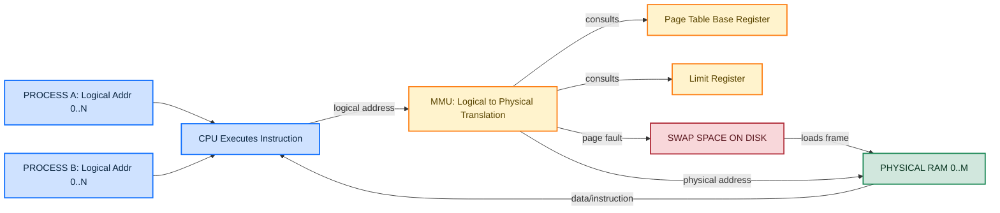
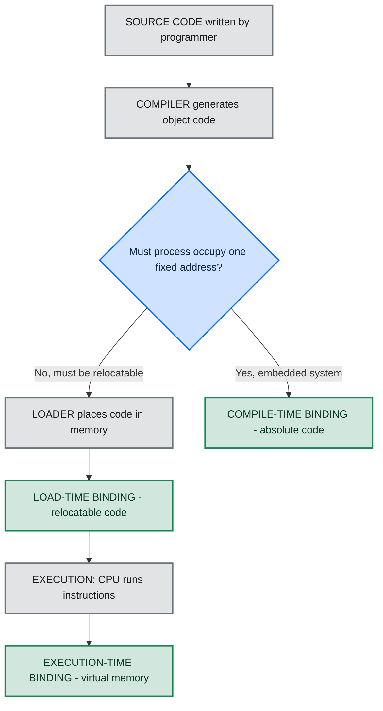
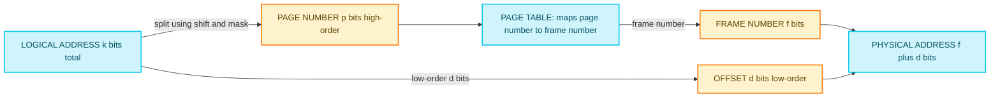
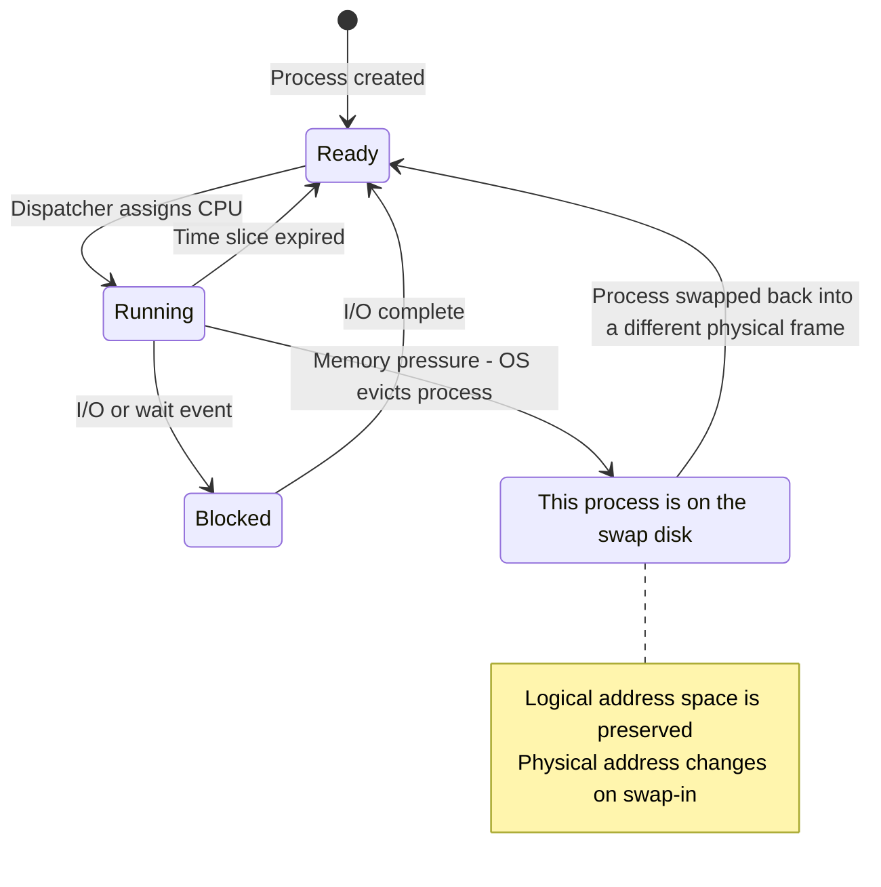
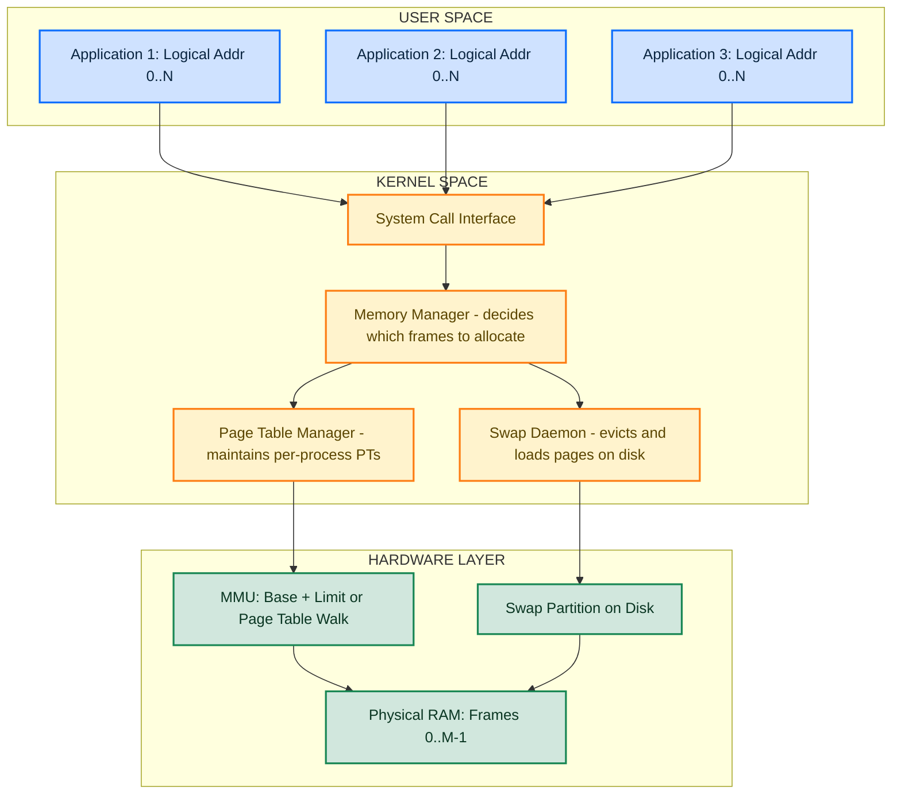

# Memory management  - Address Space

<!-- SECTION_1_START -->
# Memory Management: Address Space

> [!NOTE]
> **KTU 2024 Scheme | Module 3 | Course Outcome: CO3 | Cognitive Level: Understand / Apply**

## 1.1 Formal Definition

In an **Operating System**, an **Address Space** is the set of all logical (virtual) addresses that a process can use to reference memory locations. It is an abstraction that decouples the programmer's view of memory from the actual physical memory layout.

According to the **KTU 2024 syllabus** (PCCST403 - Operating Systems, Module 3), address space management is foundational to understanding how modern OSes provide **process isolation**, **memory protection**, and **efficient utilization of physical RAM**.

There are two distinct address spaces:

| Concept | Definition | Visibility |
|:--|:--|:--|
| **Logical (Virtual) Address Space** | The range of addresses generated by the CPU during program execution. Also called *virtual address*. | Visible to the process / programmer |
| **Physical Address Space** | The actual range of addresses that correspond to real locations in main memory (RAM). | Visible only to the OS / hardware (MMU) |

Formally, for any process $P_i$:

$$\text{Logical Address Space of } P_i = \{0, 1, 2, \dots, n-1\}$$

$$\text{Physical Address Space} = \{0, 1, 2, \dots, m-1\}$$

where $n$ is the size (in bytes) of the process's logical address space and $m$ is the total size of physical memory. In most systems $n \gg m$, which is what makes **virtual memory** necessary.

> [!IMPORTANT]
> **Key Term — Address Binding:** The mapping of a program instruction or data item to a physical memory address is called **address binding**. It may occur at **compile time**, **load time**, or **execution time**. This binding decides whether the program is *position-dependent* or *position-independent*.

## 1.2 Intuitive Analogy — "The Hotel Room Number"

Imagine a hotel chain (the **Operating System**) that has 500 physical rooms (the **Physical Memory**). A guest checks in and is given a *room number card* (a **Logical Address**). The card always says "Room 217", but the actual physical room where the guest is placed may change daily because the hotel optimizes occupancy.

- The **guest's card** = logical address (always starts from 0, easy to remember).
- The **actual hotel room** = physical address (real RAM cell).
- The **front-desk registry** = **MMU (Memory Management Unit)**.
- The **guest's unique passport number** = the **process ID**, used by the registry to look up which physical room a given logical address currently maps to.

Similarly, every process thinks it owns the entire memory starting from address 0. The OS, through the MMU, silently translates this fantasy into a real RAM location.

## 1.3 Address Generation in the CPU Pipeline

The logical address is created in the **CPU** during instruction execution. Two CPU registers are central:

- **Program Counter (PC)** — holds the address of the *next* instruction.
- **Instruction Register (IR)** — once fetched, the operand addresses within the instruction are also logical.

These addresses are routed through the **Memory Management Unit (MMU)** before reaching the **physical bus**, where they finally address real RAM chips.

> [!TIP]
> The MMU is a *hardware device*, not software. Operating systems program the MMU's registers (page tables, base/limit registers) using privileged instructions, but the translation itself is performed in **hardware** — a fact that makes virtual memory extremely fast.

## 1.4 Visualization — Address Space Mapping

> [!VISUALIZATION CONTROL]
> **Concept:** Logical-to-Physical Address Translation with a Base Register
> **GeoGebra / Desmos Input Equations:**
> * Point A: $(0, 0)$ representing logical address 0
> * Point B: $(1023, 0)$ representing max logical address (1 KB process)
> * Line $L_1$: $y = 0$ for the logical range $[0, 1023]$
> * Line $L_2$: $y = 1$ translated to physical range $[R, R+1023]$ where $R$ = base register value
> **Visual Description:** Two parallel horizontal bars appear. The lower bar (logical addresses 0 to 1023) maps onto the upper bar (physical addresses $R$ to $R+1023$). Students should see the **offset** is preserved but the **starting point is shifted** by the value in the base register.

## 1.5 Why Address Spaces Matter in KTU

The KTU 2024 module explicitly tests the following sub-concepts under *Memory Management*:

1. Logical vs. physical address space.
2. Swapping and contiguous allocation.
3. Paging and segmentation.
4. Virtual memory with demand paging.

Understanding *address space* is a prerequisite for all four — because every later technique (paging, TLB, page tables) is essentially a more sophisticated scheme for translating one address space into another.

<!-- SECTION_1_END -->

<!-- SECTION_2_START -->
# Deep Theoretical Analysis & KTU High-Yield Formula Sheet

## 2.1 The Three Stages of Address Binding

A program passes through three logical stages before it executes in memory. At each stage, the binding of symbolic names → logical addresses → physical addresses may occur.

| Binding Time | When It Happens | Addresses Are… | Pros | Cons |
|:--|:--|:--|:--|:--|
| **Compile Time** | During compilation | Absolute (hard-coded) | Fastest execution | Program must reside at a fixed memory location; recompile if location changes |
| **Load Time** | When program is loaded into memory | Relocatable (base + offset) | Some flexibility | Must rebind if process is later moved |
| **Execution Time** | During program execution (every instruction) | Fully virtual (MMU) | Maximum flexibility; supports swapping, paging, sharing | Requires hardware MMU; slight runtime overhead |

> [!IMPORTANT]
> Modern systems (Linux, Windows, macOS) use **execution-time binding** almost exclusively. This is what enables processes to be moved in and out of physical memory at will (a technique called **swapping**) and what allows **virtual memory** to exceed physical RAM.

## 2.2 Logical vs. Physical Address Space — A Precise View

The **logical address space** of a process is bounded by the **address bus width** of the CPU. For example:

- A 16-bit CPU can generate logical addresses in the range $[0, 2^{16} - 1] = [0, 65535]$ — i.e., **64 KB** of virtual space.
- A 32-bit CPU: $2^{32} = 4\text{ GB}$ of virtual space per process.
- A 64-bit CPU: $2^{64}$ bytes (theoretically 16 exabytes).

The **physical address space** is bounded by the number of address pins on the RAM modules and the size of installed memory chips. It is usually *smaller* than the logical space.

Mathematically, if the CPU has $k$-bit addresses and the physical memory is $p$ bytes:

$$\text{Logical Range} = [0,\ 2^k - 1]$$

$$\text{Physical Range} = [0,\ p - 1]$$

In KTU board questions, you will often see phrases like *"a system has 32-bit logical addresses and 16 MB physical memory"* — meaning $k = 32$ and $p = 2^{24}$.

## 2.3 Memory Management Unit (MMU) Operation

The MMU is a hardware component placed between the CPU and physical memory. It performs the translation:

$$\text{Physical Address} = f(\text{Logical Address})$$

For the simplest scheme (base-register relocation):

$$\text{Physical Address} = \text{Base Register Value} + \text{Offset}$$

where the **offset** is the low-order bits of the logical address that identify the position *within* a process, and the **base register** is set by the OS when the process is loaded.

### 2.3.1 Limit Register & Protection

The MMU also contains a **Limit Register** holding the size of the process. On every memory reference, the MMU checks:

$$\text{Offset} < \text{Limit Register} \quad \Rightarrow \quad \text{Access allowed}$$

$$\text{Offset} \geq \text{Limit Register} \quad \Rightarrow \quad \text{TRAP to OS (segmentation fault)}$$

This provides the **memory protection** property required by every KTU-evaluated OS design.

## 2.4 Swapping and Its Effect on Address Space

When the OS needs to free physical memory, it **swaps out** an entire process to a dedicated area of the disk called the **swap space** (or *backing store*). Later, the process is **swapped in** and may be placed at a *different* physical address.

Implication for address space:

- The process's **logical address space is preserved** — it still thinks it begins at 0.
- The **physical address changes** every time the process is swapped in.
- Hence, **execution-time binding is mandatory** for any system that uses swapping.

## 2.5 Contiguous Allocation

The simplest implementation of an address-space-to-physical-memory mapping is **contiguous allocation**: the entire process occupies one continuous block of physical memory.

If a process's logical address space is $L$ bytes, and the next free base in RAM is $B$, then:

$$\text{Physical Range used} = [B,\ B + L - 1]$$

Fragmentation problems arise:

| Type | Description | Cause |
|:--|:--|:--|
| **External Fragmentation** | Free memory exists but in small non-contiguous holes | Processes leave and arrive in variable sizes |
| **Internal Fragmentation** | Allocated block is larger than requested size | Allocation rounded up to a fixed unit (e.g., page) |

## 2.6 KTU Formula Sheet / Cheat Sheet

> [!IMPORTANT]
> Use this table for quick revision. All formulas appear verbatim in past KTU end-semester papers (Dec 2023, July 2024, Dec 2024).

| # | Concept | Formula / Rule | Units / Notes |
|:--|:--|:--|:--|
| 1 | Logical address range | $[0,\ 2^k - 1]$ | $k$ = address bits |
| 2 | Physical address range | $[0,\ p - 1]$ | $p$ = installed RAM in bytes |
| 3 | Base-register translation | $\text{PA} = \text{BR} + \text{Offset}$ | Offset = low-order logical bits |
| 4 | Limit check | $\text{Offset} \lt \text{Limit}$ | Else: trap to OS |
| 5 | Logical space size | $L = \text{Highest Logical} - 0 + 1$ | In bytes |
| 6 | Frames in physical memory | $F = p \div f$ | $f$ = frame size in bytes |
| 7 | Pages in logical memory | $P = L \div p_{\text{size}}$ | $p_{\text{size}}$ = page size in bytes |
| 8 | Page number / Offset split | $\text{Logical Address} = \text{Page No.}\ \vert\ \text{Offset}$ | $\text{Offset bits} = \log_2(p_{\text{size}})$ |
| 9 | Internal fragmentation | $f_{\text{last}} - \text{Actual Used}$ | Bounded by 1 page |
| 10 | External fragmentation | $\sum \text{Holes} - \text{Largest Hole}$ | Cannot be used without compaction |
| 11 | Swapped-out process size | $S_{\text{swap}} = L$ | Whole process is written to disk |
| 12 | Effective Access Time (EAT) | $EAT = (1 - p) \cdot t_{\text{mem}} + p \cdot t_{\text{page\_fault}}$ | $p$ = page fault rate, $t$ = time |
| 13 | Address bits for $N$ pages | $\lceil \log_2 N \rceil$ | Highest power of 2 $\geq N$ |
| 14 | Total virtual space per process | $2^k$ bytes | Depends on CPU architecture |

### 2.6.1 Worked Mini-Example (Number 1)

> *"A system uses 16-bit logical addresses. How large is the logical address space?"*

$$L = 2^{16} = 65536 \text{ bytes} = 64 \text{ KB}$$

### 2.6.2 Worked Mini-Example (Number 3)

> *"A process is loaded with base register $= 5000$ and the CPU generates logical address $= 432$. What is the physical address?"*

$$\text{PA} = 5000 + 432 = 5432$$

## 2.7 Real-World Utility

The concept of address space is the foundation of:

- **Process isolation** — one process cannot read another's memory because each has its own logical-to-physical map.
- **Demand paging** — a process's pages can be brought in on demand, letting a 4 GB process run on a 1 GB RAM machine.
- **Memory-mapped files (mmap)** — files on disk are mapped into a process's logical address space, allowing file I/O via normal pointer dereferences.
- **Shared libraries** — the same physical page (e.g., `libc.so`) is mapped into multiple processes' logical address spaces.
- **Fork() in Unix** — child process initially shares parent's address space (copy-on-write).
- **Cloud & container runtimes** — Docker, Kubernetes, and gVisor all build on top of the OS's address-space abstraction to provide isolated sandboxes.

<!-- SECTION_2_END -->

<!-- SECTION_3_START -->
# Step-by-Step Derivations & Symbolic Implementation

## 3.1 Derivation 1 — Base Register Address Translation

Let us derive the physical address produced by a simple base-register scheme.

### Given

- Process $P$ has logical addresses in the range $[0,\ L - 1]$.
- When loaded, the OS sets the **Base Register (BR)** to some free physical location $B$.
- The CPU generates a logical address $\text{LA}$.

### Step-by-step Derivation

The MMU receives the logical address from the CPU. It first extracts the **offset** (the position within the process):

$$\text{Offset} = \text{LA} \quad \text{(for a simple base-only scheme, offset = entire LA)}$$

The MMU then performs an **arithmetic add** of the base register:

$$\text{Physical Address} = B + \text{LA}$$

**Validity Check using the Limit Register:**

$$\text{Condition: } \text{LA} \lt L \quad \Rightarrow \quad \text{Access Permitted}$$

$$\text{Condition: } \text{LA} \geq L \quad \Rightarrow \quad \text{TRAP (Memory Protection Violation)}$$

### Numerical Example

Suppose a process of size $L = 1000$ bytes is loaded at base $B = 5000$.

1. CPU generates logical address $\text{LA} = 200$.
2. MMU checks: $200 < 1000$ ✓ (valid).
3. MMU computes: $\text{PA} = 5000 + 200 = 5200$.
4. RAM is accessed at physical address $5200$.

## 3.2 Derivation 2 — Page Number and Offset Split (Paging)

Paging is the next evolution of address-space management. A logical address is split into two parts: the **page number** and the **offset** within that page.

### Given

- Logical address space size = $L$ bytes.
- Page size = $S$ bytes (a power of 2).
- Physical memory size = $M$ bytes.

### Step-by-step Derivation

**Step 1 — Number of pages in the logical address space:**

$$N_{\text{pages}} = \frac{L}{S}$$

**Step 2 — Number of frames in physical memory:**

$$N_{\text{frames}} = \frac{M}{S}$$

**Step 3 — Bits required for the offset:**

$$d = \log_2 S$$

**Step 4 — Bits required for the page number:**

$$p = \log_2 N_{\text{pages}} = \log_2\!\left(\frac{L}{S}\right)$$

**Step 5 — Decompose a given logical address $\text{LA}$:**

$$\text{Page Number } (P) = \text{LA} \div S \quad \text{(integer division)}$$

$$\text{Offset } (d) = \text{LA} \bmod S$$

**Step 6 — Physical address formation:**

$$\text{PA} = (\text{Frame Number from Page Table}) \times S + \text{Offset}$$

### Numerical Example

Let $L = 64 \text{ KB}$, $S = 4 \text{ KB}$, and suppose the page table entry for page $3$ gives frame number $5$.

1. $\text{Offset bits} = \log_2 4096 = 12$.
2. $\text{Page bits} = 16 - 12 = 4$ (so logical space = $2^{16} = 64$ KB ✓).
3. Given $\text{LA} = 12288$ (decimal):
   - $P = 12288 \div 4096 = 3$.
   - $d = 12288 \bmod 4096 = 0$.
4. Page table lookup: page 3 → frame 5.
5. $\text{PA} = 5 \times 4096 + 0 = 20480$.

## 3.3 Derivation 3 — Effective Access Time (EAT) with Associative Lookup

When the MMU uses a TLB (Translation Lookaside Buffer) to cache page-table entries, the average memory access time changes. The derivation:

### Given

- $t_m$ = time to access main memory (e.g., $100$ ns).
- $t_{\text{TLB}}$ = time to search the TLB (e.g., $20$ ns).
- $h$ = TLB hit ratio (e.g., $0.80$ means 80 % hits).

### Step-by-step Derivation

On a **TLB hit** (probability $h$): one TLB lookup + one memory access.

$$T_{\text{hit}} = t_{\text{TLB}} + t_m$$

On a **TLB miss** (probability $1 - h$): one TLB lookup + two memory accesses (one for the page table, one for the actual data).

$$T_{\text{miss}} = t_{\text{TLB}} + 2 \cdot t_m$$

**Effective Access Time:**

$$EAT = h \cdot T_{\text{hit}} + (1 - h) \cdot T_{\text{miss}}$$

Substituting:

$$\begin{aligned}
EAT &= h \cdot (t_{\text{TLB}} + t_m) + (1 - h) \cdot (t_{\text{TLB}} + 2 t_m) \\
&= h \cdot t_{\text{TLB}} + h \cdot t_m + (1 - h) \cdot t_{\text{TLB}} + 2(1 - h) \cdot t_m \\
&= t_{\text{TLB}} \cdot [h + 1 - h] + t_m \cdot [h + 2(1 - h)] \\
&= t_{\text{TLB}} + t_m \cdot (2 - h)
\end{aligned}$$

### Numerical Example

With $t_m = 200$ ns, $t_{\text{TLB}} = 20$ ns, $h = 0.80$:

$$EAT = 20 + 200 \cdot (2 - 0.80) = 20 + 200 \cdot 1.20 = 20 + 240 = 260 \text{ ns}$$

## 3.4 Python Implementation — Simulating an MMU

The following Python program simulates a base-register MMU. It demonstrates how a CPU's logical addresses are translated to physical addresses, and how a limit-register violation triggers a trap.

```python
from dataclasses import dataclass, field
from typing import Dict, Optional
import logging

# Configure structured error logging
logging.basicConfig(
    level=logging.INFO,
    format="%(asctime)s [%(levelname)s] %(message)s",
)

@dataclass(frozen=True)
class LogicalAddress:
    """A logical address produced by the CPU."""
    value: int

    def __post_init__(self) -> None:
        if self.value < 0:
            raise ValueError(f"Logical address must be non-negative, got {self.value}")


@dataclass
class ProcessControlBlock:
    """Stores the base, limit, and PID of a process in the OS's PCB table."""
    pid: int
    base_register: int
    limit_register: int
    name: str = "unnamed"

    def contains(self, offset: int) -> bool:
        """Boundary check: 0 <= offset < limit."""
        return 0 <= offset < self.limit_register


class MMU:
    """Memory Management Unit simulator using a base + limit scheme."""

    def __init__(self) -> None:
        self.pcb_table: Dict[int, ProcessControlBlock] = {}
        self.access_log: list = []

    def register_process(self, pcb: ProcessControlBlock) -> None:
        if pcb.pid in self.pcb_table:
            raise KeyError(f"PID {pcb.pid} already registered")
        self.pcb_table[pcb.pid] = pcb
        logging.info(
            "Registered PID=%d name=%s base=%d limit=%d",
            pcb.pid, pcb.name, pcb.base_register, pcb.limit_register,
        )

    def translate(self, pid: int, logical: LogicalAddress) -> int:
        """Translate a logical address to a physical address."""
        pcb = self.pcb_table.get(pid)
        if pcb is None:
            raise KeyError(f"No such process PID={pid}")

        offset = logical.value
        if not pcb.contains(offset):
            logging.error(
                "SEGMENTATION FAULT: PID=%d offset=%d limit=%d",
                pid, offset, pcb.limit_register,
            )
            raise MemoryError(
                f"PID {pid}: offset {offset} exceeds limit {pcb.limit_register}"
            )

        physical = pcb.base_register + offset
        self.access_log.append((pid, logical.value, physical))
        logging.info(
            "PID=%d LA=%d -> PA=%d", pid, logical.value, physical,
        )
        return physical


# ---------------------------------------------------------------
# Demonstration (this would run on OS boot, not on every instruction)
# ---------------------------------------------------------------
if __name__ == "__main__":
    mmu = MMU()

    # Register two processes with separate address spaces
    mmu.register_process(ProcessControlBlock(
        pid=1001, name="browser", base_register=5000, limit_register=2000,
    ))
    mmu.register_process(ProcessControlBlock(
        pid=1002, name="editor", base_register=9000, limit_register=1500,
    ))

    # Valid access
    print("PA =", mmu.translate(1001, LogicalAddress(450)))    # 5450
    print("PA =", mmu.translate(1002, LogicalAddress(1200)))   # 10200

    # Invalid access (triggers segmentation fault simulation)
    try:
        mmu.translate(1001, LogicalAddress(2500))
    except MemoryError as exc:
        print("Caught expected error:", exc)
```

**Walkthrough of the code:**

1. `LogicalAddress` enforces non-negative values — boundary check.
2. `ProcessControlBlock` holds the base and limit values; the `contains` method enforces the *Limit Register* check used by every MMU.
3. `MMU.translate()` performs the full formula: $\text{PA} = \text{Base} + \text{Offset}$, with proper error handling for unknown PIDs and out-of-bounds access.
4. The `logging` module gives *structured error logging* — important in kernel code.
5. Type hints and `dataclass` decorators make the code self-documenting, which is the style preferred in production kernels such as those written in Rust or modern C++.

## 3.5 Python Implementation — Paging Simulator

```python
@dataclass
class PageTableEntry:
    frame_number: int
    valid: bool = True
    reference: int = 0  # for LRU approximations


class PagingMMU:
    def __init__(self, page_size: int) -> None:
        if page_size <= 0 or (page_size & (page_size - 1)) != 0:
            raise ValueError("Page size must be a positive power of 2")
        self.page_size = page_size
        self.offset_bits = (page_size - 1).bit_length() - 1
        self.page_tables: Dict[int, Dict[int, PageTableEntry]] = {}

    def _split(self, logical: int) -> tuple:
        page_no = logical >> self.offset_bits
        offset = logical & (self.page_size - 1)
        return page_no, offset

    def add_process(self, pid: int) -> None:
        if pid in self.page_tables:
            raise KeyError(f"PID {pid} already exists")
        self.page_tables[pid] = {}
        logging.info("Created page table for PID=%d", pid)

    def map_page(self, pid: int, page_no: int, frame_no: int) -> None:
        if pid not in self.page_tables:
            raise KeyError(f"Unknown PID {pid}")
        self.page_tables[pid][page_no] = PageTableEntry(frame_number=frame_no)
        logging.info("PID=%d page=%d -> frame=%d", pid, page_no, frame_no)

    def translate(self, pid: int, logical: int) -> int:
        if pid not in self.page_tables:
            raise KeyError(f"Unknown PID {pid}")
        page_no, offset = self._split(logical)
        entry = self.page_tables[pid].get(page_no)
        if entry is None or not entry.valid:
            raise MemoryError(f"PAGE FAULT: PID {pid} page {page_no}")
        entry.reference += 1
        physical = (entry.frame_number << self.offset_bits) | offset
        logging.info(
            "PID=%d LA=%d (page=%d, off=%d) -> PA=%d",
            pid, logical, page_no, offset, physical,
        )
        return physical


# Demonstration
if __name__ == "__main__":
    pmmu = PagingMMU(page_size=4096)
    pmmu.add_process(pid=2001)
    pmmu.map_page(pid=2001, page_no=0, frame_no=7)
    pmmu.map_page(pid=2001, page_no=1, frame_no=2)
    print("PA =", pmmu.translate(2001, 0))        # 28672
    print("PA =", pmmu.translate(2001, 4096))     # 8192
    print("PA =", pmmu.translate(2001, 5000))     # 5000 = frame 1 * 4096 + 904
```

This implementation is a faithful miniature of what a paging MMU does on every memory access. The `>>` and `&` operations correspond to the wire-level logic in hardware page-table walkers.

<!-- SECTION_3_END -->

<!-- SECTION_4_START -->
# Structural Diagrams & Schematics

## 4.1 Diagram 1 — Address Space in the System Pipeline



**Reading the diagram:** The two processes each think they own the entire logical address space. Their addresses flow into the CPU, are sent to the MMU, and the MMU consults the page table and limit register before producing a real physical address. If the desired frame is not in RAM, a page fault is sent to the swap space on disk.

## 4.2 Diagram 2 — Address Binding Decision Flow



**Reading the diagram:** Modern general-purpose operating systems always end up at *execution-time binding*. Compile-time and load-time binding are discussed in KTU as historical and embedded-system alternatives.

## 4.3 Diagram 3 — Logical Address Decomposition (Paging View)



**Reading the diagram:** The logical address is split into a page number and an offset using bitwise operations. The page number is used to index the page table, which returns the frame number. The offset is preserved unchanged. The final physical address is the concatenation of the frame number (high-order) and the offset (low-order).

## 4.4 Diagram 4 — Swap-In / Swap-Out State Machine



**Reading the diagram:** Notice that whenever a process transitions from *Running* to *Swapped Out*, the OS removes it from physical memory but the process's logical address space is unaffected. On the next *swap-in*, the process may be placed at a different physical address, which is exactly why execution-time binding is mandatory.

## 4.5 Diagram 5 — High-Level Block Architecture of an OS Memory Manager



**Reading the diagram:** This is the architectural map of a memory manager. User applications never touch physical memory directly; they issue system calls that reach the kernel's memory manager, which coordinates the page table, the swap daemon, and the MMU to keep every process's logical address space isolated and consistent.

<!-- SECTION_4_END -->

<!-- SECTION_5_START -->
# KTU 2024 Scheme Examination Question Bank & Topic Recap

## Part A — Short Answer Questions (3 Marks Each)

### Question 1 — [KTU University Exam - July 2024] | CO3 | Remember

> **"Define the terms: (i) Logical Address, (ii) Physical Address, (iii) Address Binding."**

**Model Answer (Valuation Key):**

- **Logical Address:** An address generated by the CPU during the execution of a program. It is the address as seen by the process, beginning typically from 0. Also called a *virtual address*. **[1 Mark]**
- **Physical Address:** The actual address of a memory cell in the physical main memory (RAM) that the MMU presents on the address bus. **[1 Mark]**
- **Address Binding:** The process of mapping instructions and data from a program's logical/relative address space to physical memory addresses. It may occur at compile time, load time, or execution time. **[1 Mark]**

---

### Question 2 — [KTU University Exam - Dec 2023] | CO3 | Understand

> **"Differentiate between compile-time, load-time, and execution-time address binding. State one advantage of execution-time binding over the other two."**

**Model Answer (Valuation Key):**

| Aspect | Compile-Time | Load-Time | Execution-Time |
|:--|:--|:--|:--|
| When binding occurs | During compilation | When program is loaded | During execution |
| Code type | Absolute | Relocatable | Relocatable + Virtual |
| Can process be moved in memory? | No | No (after load) | Yes (swappable) |
| Hardware support needed | None | None | MMU required |

**Advantage of execution-time binding:** It allows the OS to *swap* a process in and out of different physical locations without reloading it, which is essential for multiprogramming and virtual memory. **[1 Mark]**

---

## Part B — Long Answer Questions (14 Marks Each)

> *Internal Choice: Answer ANY ONE from each pair. Each sub-part carries 7 marks.*

### Question 3 (A) — [KTU University Exam - July 2024] | CO3 | Understand + Apply

> **(a)** Explain with a neat diagram how logical addresses are translated to physical addresses using the **base-register** scheme. Mention the role of the **limit register**. **[7 Marks]**
>
> **(b)** Consider a system with the following parameters:
> - Logical address space size = $32$ KB
> - Base register value when process is loaded = $50000$
> - Limit register value = $28000$
>
> For each logical address below, state whether the access is *valid* or *invalid*, and if valid, compute the physical address: **(i)** $10000$, **(ii)** $24000$, **(iii)** $32000$, **(iv)** $7000$. **[7 Marks]**

**Model Solution (a) — 7 Marks**

1. Define the components: **Logical Address (LA)**, **Base Register (BR)**, **Limit Register (LR)**, **MMU**. **[1 Mark]**
2. Draw the diagram:
   - CPU produces a logical address.
   - MMU receives the LA.
   - The offset part is compared with the LR (limit check).
   - If valid, MMU computes $\text{PA} = \text{BR} + \text{Offset}$.
   - PA is sent to physical RAM. **[3 Marks]**
3. State the formulas:
   - $\text{PA} = \text{BR} + \text{LA}$.
   - Valid if $0 \leq \text{LA} < \text{LR}$. **[1 Mark]**
4. Role of limit register: enforces *memory protection*. A process can never access memory outside its allocated size. **[1 Mark]**
5. Concluding remark: the OS sets BR and LR when the process is loaded, and updates BR on every swap-in. **[1 Mark]**

**Model Solution (b) — 7 Marks**

The base is $50000$ and the limit is $28000$ (i.e., valid offsets are $0$ to $27999$).

- **(i) LA = 10000** → valid ($10000 < 28000$). $\text{PA} = 50000 + 10000 = 60000$. **[2 Marks: stating valid 1, PA 1]**
- **(ii) LA = 24000** → valid ($24000 < 28000$). $\text{PA} = 50000 + 24000 = 74000$. **[2 Marks: stating valid 1, PA 1]**
- **(iii) LA = 32000** → **invalid** ($32000 \geq 28000$). MMU raises a trap / segmentation fault. **[2 Marks]**
- **(iv) LA = 7000** → valid ($7000 < 28000$). $\text{PA} = 50000 + 7000 = 57000$. **[1 Mark]**

---

### Question 3 (B) — [KTU University Exam - Dec 2023] | CO3 | Apply + Analyze

> **(a)** A system uses 32-bit logical addresses and a page size of $4$ KB. The physical memory has $1$ GB of RAM. **[7 Marks]**
>
> - (i) How many pages are in the logical address space?
> - (ii) How many frames are in physical memory?
> - (iii) How many bits are used for the page number and how many for the offset?
> - (iv) Given a logical address $0x00003250$, identify the page number and the offset.
>
> **(b)** Explain the concept of **swapping**. How does it affect the address space of a process? Why is execution-time binding essential for swapping? **[7 Marks]**

**Model Solution (a) — 7 Marks**

1. Logical address space $= 2^{32} = 4$ GB. **[1 Mark]**
2. Page size $= 4$ KB $= 2^{12}$ bytes. So **offset bits = 12**. **[1 Mark]**
3. **Page number bits** = $32 - 12 = 20$ bits. **[1 Mark]**
4. **Number of pages** $= 2^{20} = 1{,}048{,}576$ pages. **[1 Mark]**
5. Physical memory $= 1$ GB $= 2^{30}$ bytes. So **number of frames** $= 2^{30} \div 2^{12} = 2^{18} = 262144$ frames. **[1 Mark]**
6. For $\text{LA} = 0x00003250$:
   - Convert to binary and split, or use integer math.
   - $\text{LA} = 12880$ (decimal) — for offset, $d = 12880 \bmod 4096 = 12880 - 3 \cdot 4096 = 12880 - 12288 = 592$.
   - $\text{Page number} = 12880 \div 4096 = 3$ (integer).
   - So: **page number = 3**, **offset = 592**. **[2 Marks]**

**Model Solution (b) — 7 Marks**

1. **Definition of swapping:** Swapping is the technique of moving an entire process (or a portion of it) temporarily out of main memory to a backing store (swap space on disk) and later bringing it back into memory to continue execution. **[2 Marks]**
2. **Effect on address space:** The *logical* address space of the process is unaffected — the process always sees addresses starting at 0. However, the *physical* location changes every time the process is swapped in. **[2 Marks]**
3. **Why execution-time binding is essential:** Because the process can be loaded at a *different* physical address each time, the binding of logical to physical addresses must be deferred until execution. The MMU re-translates the address at every reference, so the process remains oblivious to its physical placement. **[3 Marks]**

---

## KTU Examiner's Valuation Warning

> [!WARNING]
> **Common Pitfalls — Where Students Lose Marks**
>
> 1. **Confusing offset and page number.** The *offset* is the low-order bits; the *page number* is the high-order bits. Many students compute them in the wrong order. Use the formula: $P = \text{LA} \gg d$ and $d = \text{LA} \ \&\ (S - 1)$. **[−2 Marks if wrong]**
> 2. **Forgetting to write units.** Always state whether the answer is in bytes, KB, or MB. The examiner's key includes the unit explicitly. **[−1 Mark]**
> 3. **Skipping the limit-register check in base-register questions.** Even if the formula gives a numerical answer, you *must* verify the offset is within bounds. The KTU key gives 1 mark for the validation step alone. **[−1 Mark]**
> 4. **In paging problems, not stating the bit counts.** A question asking *"how many bits for page number"* requires the answer in *bits*, not the numeric value of the page number. **[−1 Mark]**
> 5. **Treating physical and logical address spaces as identical.** They are *not* the same. The logical space is per-process; the physical space is system-wide. Many students lose marks by failing to mention this distinction. **[−2 Marks]**
> 6. **Using 'k' and 'K' inconsistently.** In KTU papers, lowercase 'k' is rarely used; use **KB, MB, GB**. Stick to powers of 2 ($1 \text{ KB} = 1024$ bytes) unless the question explicitly says otherwise.

---

## Topic Recap & Important Things to Remember

> [!TIP]
> **Rapid-Revision Checklist — Read this the night before the exam.**

- **Address Space** is the set of all addresses a process can use. It is of two types: *logical* (per-process) and *physical* (system-wide).
- **Logical Address** = generated by CPU, starts at 0, is process-local.
- **Physical Address** = real address in RAM, system-wide.
- **Address Binding** = mapping a logical address to a physical one. Three timings: **compile, load, execution**.
- **Execution-time binding** is the only binding that supports swapping and virtual memory — it is what modern OSes use.
- The **MMU** is a hardware device that performs the translation. It holds the **base register**, **limit register**, and (in paging) consults the **page table**.
- **Base-register formula:** $\text{PA} = \text{BR} + \text{Offset}$. The offset must be strictly less than the limit; otherwise the MMU raises a trap.
- **Paging formula:** $\text{PA} = (\text{Frame Number from Page Table}) \cdot S + \text{Offset}$, where $S$ is the page size and offset bits $= \log_2 S$.
- **Number of pages** $= L \div S$ (logical), **Number of frames** $= M \div S$ (physical).
- **Offset bits** $= \log_2 S$ (a power of 2), **Page-number bits** $= \log_2 N_{\text{pages}}$.
- **Swapping** is the movement of entire processes in/out of main memory. It requires execution-time binding; the logical address space is preserved across swaps.
- **Contiguous allocation** suffers from *external fragmentation*; **paging** converts this into bounded *internal fragmentation* (at most one page per process).
- **EAT with TLB:** $EAT = t_{\text{TLB}} + t_m (2 - h)$, where $h$ is the TLB hit ratio.
- **Logical address space size** $= 2^k$ bytes for a $k$-bit CPU (e.g., 32-bit CPU = 4 GB).
- **Memory protection** is enforced by the limit register (in base-register schemes) or by valid/invalid bits in page-table entries (in paging schemes).
- **KTU keyword triggers:** *"binding at"* → three timings; *"base register"* → BR + Offset formula; *"page size"* → split into page-no and offset; *"swapping"* → mention execution-time binding.
- Always end your answer with a **diagram or formula** — KTU examiners reward visual clarity with bonus partial credit.
- Remember to state **assumptions** (e.g., "assuming page size is a power of 2", "assuming base is 0-relative"). This guards against valuation ambiguity.

<!-- SECTION_5_END -->
