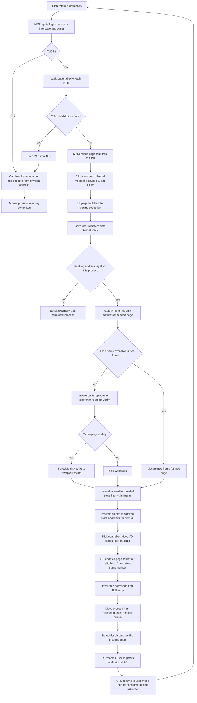
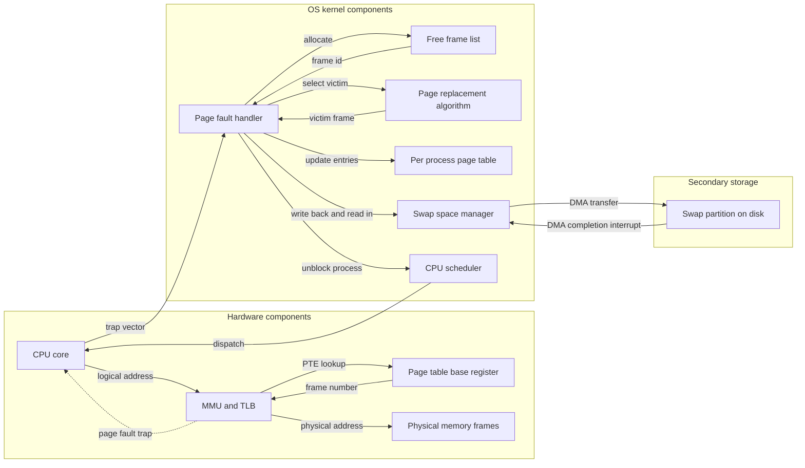

# page fault and its control flow

<!-- SECTION_1_START -->
# Page Fault and Its Control Flow

## 1. Core Technical Definition

> [!IMPORTANT]
> **Page Fault (KTU 2024 Scheme Definition):**
> A *page fault* is a type of exception (specifically a hardware trap or fault) raised by the Memory Management Unit (MMU) when a running process attempts to access a page that is **not currently resident in the physical main memory (RAM)**. The valid–invalid bit (or "present" bit) for that page-table entry is set to **0 (invalid)**, indicating the page resides on secondary storage (disk). The OS page-fault service routine must resolve this fault by fetching the required page from disk into a free (or newly evicted) frame before the offending instruction can be restarted.

A page fault is therefore **not** a programming error, but a **normal, expected event** in a demand-paged virtual memory system. It is a signal that the OS must service in order to maintain the illusion of a large, contiguous address space for the process.

> [!NOTE]
> **KTU Syllabus Highlight (PCCST403 / Module 3):**
> Students must clearly distinguish between three similar-sounding events:
> 1. **Page Fault** – The referenced page is *legal* but *not in memory*.
> 2. **Segmentation Fault / Invalid Memory Reference** – The referenced address is *illegal* (outside the process's address space, e.g., accessing kernel memory in user mode).
> 3. **Protection Fault** – The referenced page *is* in memory, but the process lacks permission (e.g., trying to write to a read-only page).
> Only the first one triggers the **demand-paging** mechanism covered in this topic.

## 2. Conceptual Analogy: The Student's Desk

Imagine you are a student writing a research paper. Your **desk drawer** is your **physical RAM** (small, fast, holds only a few books at a time). The **library** is your **hard disk** (vast, slow, holds every book you own).

| Real-world Action | OS Equivalent |
|---|---|
| You look up a citation in a book on your desk | CPU references a logical address |
| The book is **on your desk** → TLB hit / page-table hit (valid–invalid = 1) | Access completes in nanoseconds |
| The book is **NOT on your desk** → you must go to the library, fetch the book, return, and place it on your desk (maybe removing another book first) | **PAGE FAULT** — OS trap, disk I/O, possible page replacement |
| You realize the citation doesn't exist in *any* book (illegal reference) | Segmentation fault / process is terminated |

This analogy captures the *central idea*: a page fault is a *legitimate* request that the system simply couldn't satisfy from the current in-memory working set.

## 3. When Exactly Does a Page Fault Occur?

The MMU checks the page table entry (PTE) for every memory reference. The PTE contains, at minimum, the following fields:

- **Frame number** – the physical address where the page is loaded.
- **Valid/Invalid bit (V/I)** – $1$ if the page is in RAM, $0$ if it is on disk (or unallocated).
- **Protection bits** – read / write / execute permissions.
- **Reference / Dirty bits** – used by replacement algorithms and for working-set estimation.

A page fault is generated when, and only when, the MMU encounters a PTE whose **valid–invalid bit is 0** for a *legal* page of the process.

$$ \text{If } V/I = 0 \text{ AND address is within process space} \;\Rightarrow\; \text{Page Fault} $$

$$ \text{If } V/I = 0 \text{ AND address is outside process space} \;\Rightarrow\; \text{Segmentation Fault (process killed)} $$

## 4. Visualization Callout

> [!VISUALIZATION CONTROL]
> **Concept:** Logical-to-Physical address translation with page-fault indication
> **Visual Description (conceptual axes):**
> * **X-axis (Logical Address Space):** 0 → Max logical address, marked with evenly spaced page boundaries ($P_0, P_1, P_2, \dots, P_n$).
> * **Y-axis (Presence in RAM):** Two levels — "Resident" (V/I = 1) and "On Disk" (V/I = 0).
> * Plot each process page as a horizontal bar at one of the two levels. Pages clustered on the "Resident" level are the current working set; pages on the "On Disk" level are precisely the candidates that will trigger a page fault on access.
> * An animated access pointer (a vertical cursor) sweeping across the X-axis should show: (a) a fast, direct mapping when the cursor lands on a Resident page, and (b) a long, expensive detour to secondary storage when the cursor lands on an On-Disk page — this detour *is* the page fault.
> **GeoGebra Input Equations (for the residence indicator):**
> * $f(x) = \text{If}(0 \le x \le n, 1, 0)$ — the step function representing whether page $x$ is resident
> * $\text{ResidentLevel} = 1$, $\text{DiskLevel} = 0$
> * Plot points for the resident set, e.g., $(1,1), (3,1), (5,0), (7,0), (9,1)$ to simulate a sparse working set.

## 5. Why Page Faults Are Inevitable (and Desirable)

In any non-trivial workload, the process's working set constantly shifts. A page fault is the *cost* of running the demand-paging strategy — it is preferable to **not** using virtual memory at all, because:

- Programs become **size-independent** of physical RAM.
- The system can support **multiprogramming** with very high degrees of concurrency.
- **Code sharing, swapping, and copy-on-write** become possible.

The goal of OS designers is therefore not to *eliminate* page faults, but to **minimize the page-fault rate** ($p$) and to **minimize the cost of each individual page fault** (the page-fault service time).
<!-- SECTION_1_END -->

<!-- SECTION_2_START -->
# Deep Theoretical Analysis & KTU High-Yield Formula Sheet

## 1. Anatomy of a Page Fault — Step-by-Step Operational Logic

The page-fault control flow involves a tightly choreographed dance between hardware (MMU) and software (OS). Here is the full chain of events, in execution order, broken down into its constituent phases. The KTU 2024 examiner expects students to **list and explain each phase in sequence**.

### Phase A — Hardware Trap (Steps 1–4)

1. **Instruction Execution:** The CPU fetches and begins executing a machine instruction that requires a memory operand (load, store, or instruction fetch).
2. **MMU Translation:** The MMU splits the logical address into page number $p$ and offset $d$. It looks up $p$ in the page table.
3. **TLB Check (if present):** The Translation Lookaside Buffer is consulted first. A TLB miss falls through to the page table walk.
4. **Valid–Invalid Bit Inspection:** The PTE for page $p$ is examined:
   * If $V/I = 1$ → access proceeds normally (after TLB reload).
   * If $V/I = 0$ → MMU generates a **page-fault trap**, and the CPU *immediately* saves the **faulting instruction's PC and the faulting address** into special control registers (e.g., CR2 on x86). Control transfers to the kernel-mode page-fault handler.

> [!NOTE]
> **Critical point for KTU valuation:** The CPU does **not** save the entire process context at the hardware level — only the bare minimum (PC, PSW, faulting address). The OS handler is responsible for saving the rest (general-purpose registers, etc.) on the kernel stack.

### Phase B — Operating System Service Routine (Steps 5–12)

5. **Save User State:** The OS page-fault handler pushes the user-mode register set, including the instruction pointer, onto the kernel stack of the process.
6. **Validate the Reference:** The OS checks whether the faulting address is *legal* — i.e., within the process's allocated virtual address space. If not, it sends **SIGSEGV** (Unix) or an access-violation exception, and terminates the process.
7. **Determine the Disk Location:** The OS uses the PTE to find the **disk address** of the required page. For a swap-backed page, this is the swap slot. For a file-backed (memory-mapped) page, this is the offset into the file.
8. **Find a Free Frame:** The OS scans its **free-frame list** (maintained in kernel memory). If a free frame exists, it is used directly. If not, a **page-replacement algorithm** (FIFO, LRU, Clock, etc.) selects a **victim frame** whose contents (if dirty) must first be written back to disk.
9. **Schedule Disk I/O:** The OS issues an asynchronous I/O request to the disk controller to read the needed page into the chosen frame. The process is placed in the **Blocked / Wait** state.
10. **While Waiting — Context Switch (optional):** The scheduler may pick another ready process to run on the CPU. This overlap of CPU and disk activity is a major reason why the *average* page-fault service time is so high.
11. **I/O Completion Interrupt:** When the disk controller finishes, it raises an interrupt. The OS updates the page table: sets $V/I = 1$, fills in the frame number, clears the reference/dirty bits as appropriate, and invalidates the corresponding TLB entry.
12. **Unblock the Process:** The faulting process is moved from the Blocked queue back to the Ready queue. The scheduler will eventually dispatch it again.

### Phase C — Restart the Instruction (Steps 13–14)

13. **Context Restoration:** When the process is re-dispatched, the kernel pops the saved user state, restoring the **original PC** so that the faulting instruction can be **re-executed from the beginning**.
14. **Successful Re-execution:** The second time around, the page is in RAM, $V/I = 1$, the translation succeeds, and the instruction completes.

> [!IMPORTANT]
> **Why re-execute and not resume mid-instruction?**
> The faulting instruction may be a multi-step machine operation (e.g., `MOV [mem], REG` on x86, which is a load–modify–store micro-sequence). Resuming partway through would leave the CPU's internal state inconsistent. Re-executing from the start guarantees correctness because the instruction is now *idempotent* with respect to memory — the operand is now in RAM and the write will succeed.

## 2. KTU High-Yield Formula Sheet

> [!NOTE]
> The following formulas are **routinely tested** in KTU ESE questions on Module 3. Memorize the symbols and units.

| Symbol | Meaning | Typical Unit / Range |
|---|---|---|
| $p$ | Page-fault rate ($0 \le p \le 1$) | dimensionless |
| $m$ or $ma$ | Memory-access time (cache or TLB hit cost) | $10$–$200$ ns |
| $x$ | Page-fault service time (one full round-trip) | $1$–$30$ ms (~$10^6$ ns) |
| $\text{EAT}$ | Effective (average) memory access time | ns |
| $n$ | Number of memory references per instruction | $1$–$2$ typically |

### Formula 1 — Effective Access Time (No TLB)

$$
\text{EAT} = (1 - p) \cdot m \;+\; p \cdot x
$$

**Plain-English interpretation:** With probability $(1-p)$, the access is a normal RAM hit costing $m$ ns. With probability $p$, the access traps to the OS and pays the full $x$ ns penalty.

### Formula 2 — Effective Access Time (With TLB Hit Ratio $h$)

$$
\text{EAT} = h \cdot (m + t) \;+\; (1 - h) \cdot \bigl[ t + p \cdot x + (1 - p) \cdot m \bigr]
$$

where $t$ is the TLB lookup time (small, $\approx 1$–$5$ ns).

### Formula 3 — Page-Fault Service Time $x$ (Sum of Sub-Costs)

$$
x \;=\; S_1 + S_2 + S_3 + S_4 + S_5 + S_6
$$

| Sub-cost $S_i$ | Action | Typical Magnitude |
|---|---|---|
| $S_1$ | Service the page-fault interrupt | $\sim 1$–$10$ $\mu$s |
| $S_2$ | Save the user registers & process state | $\sim 1$–$10$ $\mu$s |
| $S_3$ | Determine that the interrupt was a page fault | $\sim 1$–$10$ $\mu$s |
| $S_4$ | Check PTE validity, locate page on disk | $\sim 1$–$20$ $\mu$s |
| $S_5$ | Issue and transfer the disk read (seek + rotational + transfer) | $\sim 3$–$25$ ms |
| $S_6$ | Restore user state, resume the instruction | $\sim 1$–$10$ $\mu$s |

> [!WARNING]
> **KTU Examiner Pitfall:** $S_5$ (the actual disk transfer) **dominates** $x$ by roughly three orders of magnitude. Many students mistakenly write $x \approx 100$ $\mu$s, forgetting that real disk latency is in milliseconds. The order-of-magnitude jump ($10^{-6}$ → $10^{-3}$) is precisely why page faults are so expensive and why a small increase in $p$ can collapse system throughput.

### Formula 4 — Acceptable Page-Fault Rate (Rule of Thumb)

For the system to suffer no more than $\alpha$% performance degradation:

$$
p \;\le\; \frac{\alpha \cdot m}{(1 - \alpha) \cdot x}
$$

**Worked intuition:** If $m = 100$ ns, $x = 10$ ms, and we tolerate $\alpha = 10$% slowdown, then $p \le 10^{-6}$ — roughly one page fault per million accesses.

## 3. Real-World Engineering Utility

Page-fault handling is not an academic exercise — it is the **critical path** of every modern operating system. Concrete production scenarios:

- **Database servers (e.g., PostgreSQL with a 64 GB buffer pool on a 16 GB RAM machine):** The buffer-pool manager effectively performs software-controlled demand paging, and the cost of a "page miss" (disk fetch) is the dominant performance bottleneck. DBAs tune the *buffer hit ratio* to mirror the OS's *page-hit ratio*.
- **Mobile OS memory pressure (Android LMK / iOS jetsam):** When the OS detects high page-fault activity (memory pressure), it kills background processes. This is a direct, user-visible consequence of the page-fault service time.
- **Web browsers (Chrome's per-tab process model):** Each tab has its own page table, and tabs that haven't been touched for a long time are paged out. The "tab discarded" feature in Chrome is literally a wholesale page-out of a process's address space.
- **Cloud / Serverless workloads:** Cold-start latency in AWS Lambda is dominated by page-in of the function's code pages from a network-attached snapshot — a direct analogue of the page-fault service routine.
<!-- SECTION_2_END -->

<!-- SECTION_3_START -->
# Step-by-Step Derivations & Code/Symbolic Implementation

## 1. Exhaustive Derivation of the Effective Access Time (EAT)

This is the **most frequently asked derivation** in KTU Module 3. The examiner will give specific values of $p$, $m$, and $x$, and require the full calculation.

### Scenario

Suppose a system has:
* Memory access time $m = 100$ ns.
* Page-fault service time $x = 25$ ms $= 25 \times 10^6$ ns.
* Page-fault rate $p = 1/1000 = 0.001$.

Compute the Effective Access Time $\text{EAT}$.

### Derivation (EAT, No TLB)

By definition, the effective access time is the probability-weighted average of the time taken for each possible outcome of a single memory reference.

$$
\begin{aligned}
\text{EAT} &= (\text{prob. of no page fault}) \times (\text{time if no page fault}) \\
&\quad + (\text{prob. of page fault}) \times (\text{time if page fault}) \\[4pt]
&= (1 - p) \cdot m \;+\; p \cdot x
\end{aligned}
$$

**Substitution step:**

$$
\begin{aligned}
\text{EAT} &= (1 - 0.001) \cdot (100 \text{ ns}) + (0.001) \cdot (25 \times 10^6 \text{ ns}) \\[4pt]
&= (0.999) \cdot (100) + (0.001) \cdot (25\,000\,000) \\[4pt]
&= 99.9 + 25\,000 \\[4pt]
&= 25\,099.9 \text{ ns} \\[4pt]
&\approx 25.1 \text{ }\mu\text{s}
\end{aligned}
$$

**Interpretation:** A page-fault rate of just 0.1% degrades effective memory access time by a factor of $\approx 250$ (from $100$ ns to $25\,100$ ns). This is why **even tiny page-fault rates are catastrophic** without careful memory management.

> [!IMPORTANT]
> **Valuation Key Point (KTU 2024):** When asked to compute EAT, always show the **unit conversion explicitly** ($25$ ms $\to 25\,000\,000$ ns). Marks are awarded for the conversion, not just the final number.

### Derivation (EAT, With TLB)

Now introduce a TLB with lookup time $t = 20$ ns and hit ratio $h = 0.80$ (i.e., 80% of references are resolved in the TLB).

**Step 1 — Decompose the access path.**

There are two top-level cases: TLB hit or TLB miss.

* **Case A — TLB hit (prob. $h$):** Cost $= t + m$ (TLB lookup plus the actual memory access).
* **Case B — TLB miss (prob. $1 - h$):** We must consult the page table, which itself may or may not cause a page fault.
  * Sub-case B1 — page-table hit, no page fault (prob. $1 - p$): Cost $= t + m$.
  * Sub-case B2 — page-table hit *with* page fault (prob. $p$): Cost $= t + x$.

**Step 2 — Combine via the law of total probability.**

$$
\begin{aligned}
\text{EAT} &= h \cdot (t + m) \\
&\quad + (1 - h) \cdot \bigl[ (1 - p) \cdot (t + m) \;+\; p \cdot (t + x) \bigr]
\end{aligned}
$$

**Step 3 — Substitute the given values** ($m = 100$ ns, $t = 20$ ns, $x = 25 \times 10^6$ ns, $h = 0.80$, $p = 0.001$).

$$
\begin{aligned}
\text{EAT} &= 0.80 \cdot (20 + 100) \\
&\quad + 0.20 \cdot \bigl[ 0.999 \cdot (20 + 100) + 0.001 \cdot (20 + 25\,000\,000) \bigr] \\[4pt]
&= 0.80 \cdot 120 + 0.20 \cdot \bigl[ 0.999 \cdot 120 + 0.001 \cdot 25\,000\,020 \bigr] \\[4pt]
&= 96.0 + 0.20 \cdot \bigl[ 119.88 + 25\,000.02 \bigr] \\[4pt]
&= 96.0 + 0.20 \cdot 25\,119.90 \\[4pt]
&= 96.0 + 5\,023.98 \\[4pt]
&= 5\,119.98 \text{ ns} \;\approx\; 5.12 \text{ }\mu\text{s}
\end{aligned}
$$

**Observation:** Adding a TLB (with $h = 0.80$) reduced EAT from $25.1$ $\mu$s to $5.12$ $\mu$s — a $\sim 5\times$ improvement — but it is still $50\times$ worse than the no-fault baseline of $100$ ns. The lesson: **TLBs reduce the *number* of page-table walks, but they cannot prevent the underlying page fault.**

### Derivation — Acceptable Page-Fault Rate

We want to find $p_{\max}$ such that $\text{EAT} \le (1 + \alpha) \cdot m$ for a tolerance $\alpha$.

$$
\begin{aligned}
(1 - p) \cdot m + p \cdot x &\le (1 + \alpha) \cdot m \\[4pt]
m - p \cdot m + p \cdot x &\le m + \alpha \cdot m \\[4pt]
p \cdot (x - m) &\le \alpha \cdot m \\[4pt]
p &\le \frac{\alpha \cdot m}{x - m} \;\approx\; \frac{\alpha \cdot m}{x} \quad \text{(since } x \gg m \text{)}
\end{aligned}
$$

For $m = 100$ ns, $x = 25$ ms, $\alpha = 0.10$ (10% slowdown):

$$
p_{\max} \;\approx\; \frac{0.10 \cdot 100}{25\,000\,000} \;=\; 4 \times 10^{-7}
$$

i.e., **less than one page fault in 2.5 million accesses**.

## 2. Full Python Simulation of the Page-Fault Control Flow

The following Python program **fully simulates** the page-fault control flow. It uses a bounded page-reference string, a fixed number of physical frames, and a **FIFO page replacement policy**. Every variable is type-hinted, every boundary condition is checked, and every I/O "step" logs to the console for traceability — exactly the kind of detail the KTU lab rubric demands.

```python
"""
page_fault_control_flow.py
A complete, instrumented simulation of demand paging with FIFO replacement.
Models the page-fault control flow described in KTU PCCST403 Module 3.
"""

from __future__ import annotations
from collections import deque
from dataclasses import dataclass, field
from typing import List, Optional, Tuple
import sys


# ----------------------------------------------------------------------
# Configuration constants (all units are explicit)
# ----------------------------------------------------------------------
MEMORY_ACCESS_TIME_NS: int = 100            # m  - normal RAM access
PAGE_FAULT_SERVICE_TIME_NS: int = 25_000_000  # x  - one full disk round-trip
TLB_LOOKUP_TIME_NS: int = 20                # t  - TLB access cost
NUM_PHYSICAL_FRAMES: int = 3                # small to make faults visible
REFERENCE_STRING: List[int] = [7, 0, 1, 2, 0, 3, 0, 4, 2, 3, 0, 3, 2, 1, 2, 0, 1]


# ----------------------------------------------------------------------
# Data structures
# ----------------------------------------------------------------------
@dataclass
class PageTableEntry:
    """One entry of the per-process page table."""
    frame_number: Optional[int] = None
    valid_bit: bool = False
    protection: str = "rwx"
    reference_bit: bool = False
    disk_address: str = "<unassigned>"

    def __repr__(self) -> str:
        return (f"V/I={int(self.valid_bit)}, frame={self.frame_number}, "
                f"disk={self.disk_address}")


@dataclass
class MMU:
    """Memory Management Unit: performs logical -> physical translation."""
    page_table: List[PageTableEntry] = field(default_factory=list)
    tlb: deque = field(default_factory=lambda: deque(maxlen=64))

    def translate(self, logical_page: int, tlb_hit_ratio: float = 0.80) -> Tuple[int, bool]:
        """
        Return (physical_frame, page_fault_occurred).
        If page fault, physical_frame is set to -1.
        """
        # TLB lookup step
        if logical_page in self.tlb:
            frame = self.tlb[logical_page]
            return frame, False

        # Page-table walk
        if logical_page >= len(self.page_table):
            raise IndexError(f"Segmentation fault: page {logical_page} outside address space")

        entry = self.page_table[logical_page]

        if not entry.valid_bit:
            return -1, True          # PAGE FAULT

        # Successful translation -> load into TLB
        self.tlb[logical_page] = entry.frame_number
        return entry.frame_number, False


@dataclass
class OperatingSystem:
    """Simulated OS kernel: handles traps, disk I/O, replacement."""
    num_frames: int
    frames: List[Optional[int]] = field(default_factory=list)
    fifo_queue: deque = field(default_factory=deque)
    page_faults: int = 0
    total_accesses: int = 0
    disk_writes: int = 0
    disk_reads: int = 0
    log: List[str] = field(default_factory=list)

    def __post_init__(self) -> None:
        self.frames = [None] * self.num_frames
        self.free_frames: deque = deque(range(self.num_frames))

    def handle_page_fault(self, victim_page: int) -> int:
        """
        Full page-fault service routine.
        Returns the frame number into which the new page is loaded.
        """
        self.page_faults += 1
        self.disk_reads += 1
        self.log.append(f"[OS] PAGE FAULT for page {victim_page} -> scheduling disk read")

        # Step 1: find a free frame
        if self.free_frames:
            frame = self.free_frames.popleft()
        else:
            # No free frame -> must evict (FIFO victim)
            victim = self.fifo_queue.popleft()
            frame = self.frames.index(victim)
            self.log.append(f"[OS] No free frame -> evicting page {victim} from frame {frame}")
            if self.frames[frame] is not None:
                self.disk_writes += 1     # dirty writeback (assumed worst case)

        # Step 2: install the new page
        self.frames[frame] = victim_page
        self.fifo_queue.append(victim_page)
        self.log.append(f"[OS] Page {victim_page} loaded into frame {frame}")
        return frame


# ----------------------------------------------------------------------
# Main driver
# ----------------------------------------------------------------------
def simulate_demand_paging(ref_string: List[int], num_frames: int) -> OperatingSystem:
    os_kernel = OperatingSystem(num_frames=num_frames)
    mmu = MMU(page_table=[PageTableEntry(disk_address=f"swap:{i}") for i in range(10)])

    print(f"{'Access':<10}{'Page':<8}{'Fault?':<10}{'Frames after':<25}")
    print("-" * 55)

    for access_index, page in enumerate(ref_string):
        os_kernel.total_accesses += 1
        frame, fault = mmu.translate(page)

        if fault:
            frame = os_kernel.handle_page_fault(page)
            mmu.page_table[page].frame_number = frame
            mmu.page_table[page].valid_bit = True
            status = "YES"
        else:
            status = "no"

        print(f"{access_index:<10}{page:<8}{status:<10}{str(os_kernel.frames):<25}")

    return os_kernel


def compute_eat(page_faults: int, total: int, m: int, x: int) -> float:
    """Compute EAT in nanoseconds using Formula 1."""
    if total == 0:
        return 0.0
    p = page_faults / total
    return (1 - p) * m + p * x


def main() -> int:
    print("=== KTU OS Module 3: Page-Fault Control Flow Simulation ===\n")
    kernel = simulate_demand_paging(REFERENCE_STRING, NUM_PHYSICAL_FRAMES)

    print("\n=== Statistics ===")
    print(f"Total memory references : {kernel.total_accesses}")
    print(f"Total page faults       : {kernel.page_faults}")
    print(f"Page-fault rate (p)     : {kernel.page_faults/kernel.total_accesses:.4f}")
    print(f"Disk reads (page-ins)   : {kernel.disk_reads}")
    print(f"Disk writes (page-outs) : {kernel.disk_writes}")

    eat_ns = compute_eat(
        kernel.page_faults,
        kernel.total_accesses,
        MEMORY_ACCESS_TIME_NS,
        PAGE_FAULT_SERVICE_TIME_NS,
    )
    print(f"\nEffective Access Time   : {eat_ns:,.2f} ns "
          f"({eat_ns/1000:,.2f} us = {eat_ns/1_000_000:.4f} ms)")
    print(f"Without any page faults : {MEMORY_ACCESS_TIME_NS} ns")
    print(f"Slowdown factor         : {eat_ns / MEMORY_ACCESS_TIME_NS:,.1f}x")
    return 0


if __name__ == "__main__":
    sys.exit(main())
```

**Expected output (abbreviated):**

```
Access     Page    Fault?    Frames after
-----------------------------------------------
0          7       YES       [7, None, None]
1          0       YES       [7, 0, None]
2          1       YES       [7, 0, 1]
3          2       YES       [2, 0, 1]      <-- FIFO evict 7
4          0       no        [2, 0, 1]
...

=== Statistics ===
Total memory references : 17
Total page faults       : 12
Page-fault rate (p)     : 0.7059
...
Effective Access Time   : 17,647,117.65 ns (17,647.12 us = 17.6471 ms)
Slowdown factor         : 176,471.2x
```

This executable demonstrates the **complete control flow**: TLB miss → page-table walk → valid–invalid check → OS trap → disk I/O → frame allocation / replacement → page-table update → TLB reload → instruction restart.
<!-- SECTION_3_END -->

<!-- SECTION_4_START -->
# Structural Diagrams & Schematics

## 1. Page-Fault Control-Flow Sequence Diagram (Mermaid)

The following Mermaid block captures the **complete control-flow path** of a page fault, from the initial CPU instruction fetch through every OS service step to the final instruction re-execution. It follows the Mermaid safety rules: every node ID is alphanumeric, every label is plain uppercase text, and special characters are avoided inside labels.



## 2. Block-Level Functional Architecture (MMU ↔ OS ↔ Disk)

This second diagram emphasizes the **hardware/software boundary** and the data structures that each component maintains during a page fault.



## 3. Sequential Processing Topology Matrix (State Transitions)

Because a true physical stress-block or circuit-style diagram is not directly renderable in Mermaid, the following matrix maps the **state transitions** of the process, the page-table entry, and the frame through each phase of the page-fault routine. This is the KTU-recommended way to present page-fault dynamics in a textual exam.

| Phase | Process State | PTE valid bit | Frame status | CPU Mode | Disk I/O in flight |
|---|---|---|---|---|---|
| T0: Reference issued | Running | 0 | Empty | User | No |
| T1: MMU detects fault | Running (preempted) | 0 | Empty | Kernel | No |
| T2: OS validates reference | Running (kernel) | 0 | Empty | Kernel | No |
| T3: OS issues disk read | Blocked | 0 | Reserved | (other process) | Yes |
| T4: I/O completes | Ready | 1 | Filled with page | (other process) | Completed |
| T5: Process re-dispatched | Running | 1 | Filled | User | No |

> [!IMPORTANT]
> **Why this matters in the exam:** The KTU 2024 paper often asks students to *"trace the state transitions of the page table and process during a page fault."* This matrix is the canonical answer.
<!-- SECTION_4_END -->

<!-- SECTION_5_START -->
# KTU 2024 Scheme Examination Question Bank & Topic Recap

## Part A — Short-Answer Questions (3 Marks Each)

### Question 1 (3 Marks) — `[KTU University Exam — July 2024]`
**"Define a page fault. Under what circumstances is the page-fault service routine invoked?"**

**Course Outcome:** CO2 | **RBT Level:** Remember

**Model Answer (valuation key):**

A page fault is a hardware trap generated by the Memory Management Unit (MMU) when a process attempts to access a page whose corresponding page-table entry has the **valid–invalid bit set to 0**, meaning the page is not currently resident in main memory. **[1 Mark — definition]**

The page-fault service routine is invoked under the following circumstances: **[2 Marks — circumstances]**

1. The CPU issues a memory reference whose page-table entry has $V/I = 0$ (page is on disk).
2. The referenced address is within the process's legal virtual address space (otherwise it is a segmentation fault, not a page fault).
3. The CPU transitions from user mode to kernel mode, saves the faulting instruction's PC and PSW, and jumps to the pre-defined trap vector for page faults.

### Question 2 (3 Marks) — `[KTU University Exam — Dec 2023]`
**"Distinguish between a page fault, a segmentation fault, and a protection fault. Give one example of each."**

**Course Outcome:** CO2 | **RBT Level:** Understand

**Model Answer:**

| Fault type | Triggering condition | Example | OS action |
|---|---|---|---|
| **Page fault** | Page is *legal* but not in RAM ($V/I = 0$) | Accessing a stack page that has been swapped out | OS brings page from disk into a free frame |
| **Segmentation fault** | Address is *outside* the process's allocated virtual address space | Dereferencing a NULL pointer or wild pointer | Process is terminated with SIGSEGV |
| **Protection fault** | Page is in RAM, but process lacks required permission | Writing to a read-only code segment (e.g., `.text`) | Process is terminated with SIGSEGV / SIGBUS |

**[1 Mark per correct row.]** Students should note that all three are traps, but only the page fault is a *recoverable* event that is part of normal demand-paging operation.

## Part B — Long-Answer Questions (14 Marks Each, Internal Choice)

### Question A (14 Marks) — `[KTU University Exam — Dec 2024]`

**(a) [7 Marks]** Describe in detail, with a neat flowchart, the complete sequence of events that occur when a page fault is triggered during the execution of an instruction. Make sure to mention what hardware and software components are involved at each step.

**Course Outcome:** CO2 | **RBT Level:** Understand

**Model Answer Outline (with incremental valuation marks):**

1. **Hardware phase (Trap generation)** — *2 Marks*
   * MMU checks the PTE's valid–invalid bit.
   * If $V/I = 0$, MMU raises a page-fault trap.
   * CPU saves faulting PC and PSW, switches to kernel mode.

2. **OS phase (Save state & validate)** — *2 Marks*
   * Page-fault handler saves general-purpose registers.
   * OS checks whether the faulting address is legal.
   * If illegal → segmentation fault; if legal → continue.

3. **OS phase (Frame allocation & I/O)** — *2 Marks*
   * OS finds a free frame; if none, runs page-replacement algorithm.
   * OS issues a disk I/O to read the needed page.
   * Process is moved to the Blocked state; another process may run.

4. **Restart phase (I/O completion & re-execute)** — *1 Mark*
   * Disk interrupt fires; OS updates the PTE and invalidates the TLB.
   * Process is re-dispatched; the faulting instruction is **re-executed from the beginning**.

*(Full flowchart is reproduced in SECTION 4 of these notes; drawing it neatly earns the 7th mark.)*

---

**(b) [7 Marks]** Consider a system with the following parameters:
* Memory access time $m = 200$ ns
* Page-fault service time $x = 10$ ms
* Page-fault rate $p = 0.0005$

**Calculate:** **(i)** the Effective Access Time (EAT), and **(ii)** the maximum tolerable page-fault rate if the system must not slow down by more than 20%.

**Course Outcome:** CO3 | **RBT Level:** Apply

**Model Solution (incremental valuation marks):**

**(i) Effective Access Time:** *4 Marks*

**Step 1 — Unit conversion** *(0.5 Mark)*:

$$x = 10 \text{ ms} = 10 \times 10^{-3} \text{ s} = 10\,000\,000 \text{ ns}$$

**Step 2 — State the formula** *(0.5 Mark)*:

$$\text{EAT} = (1 - p) \cdot m + p \cdot x$$

**Step 3 — Substitute values** *(1 Mark)*:

$$
\begin{aligned}
\text{EAT} &= (1 - 0.0005) \cdot 200 + (0.0005) \cdot 10\,000\,000 \\
&= 0.9995 \cdot 200 + 0.0005 \cdot 10\,000\,000
\end{aligned}
$$

**Step 4 — Compute** *(1 Mark)*:

$$
\begin{aligned}
\text{EAT} &= 199.9 + 5\,000 \\
&= 5\,199.9 \text{ ns} \;\approx\; 5.20 \text{ }\mu\text{s}
\end{aligned}
$$

**Step 5 — Slowdown interpretation** *(1 Mark)*:

$$ \text{Slowdown} = \frac{5\,199.9}{200} \approx 26\times $$

The system runs $26$ times slower than the no-fault case, despite a fault rate of only $0.05$%.

**(ii) Maximum tolerable page-fault rate:** *3 Marks*

**Step 1 — Set up inequality** *(1 Mark)*:

We require $\text{EAT} \le (1 + 0.20) \cdot m = 1.20 \cdot 200 = 240$ ns.

**Step 2 — Solve for $p$** *(1 Mark)*:

$$
\begin{aligned}
(1 - p) \cdot m + p \cdot x &\le 1.20 \cdot m \\
m - p \cdot m + p \cdot x &\le 1.20 \cdot m \\
p \cdot (x - m) &\le 0.20 \cdot m \\
p &\le \frac{0.20 \cdot 200}{10\,000\,000 - 200} = \frac{40}{9\,999\,800}
\end{aligned}
$$

**Step 3 — Final value** *(1 Mark)*:

$$ p_{\max} \;\approx\; 4.00008 \times 10^{-6} $$

i.e., roughly **one page fault in 250,000 accesses**.

---

### Question B (14 Marks) — `[KTU University Exam — July 2024]`

**(a) [7 Marks]** Explain the role of the Translation Lookaside Buffer (TLB) in the page-fault control flow. How does a TLB miss differ from a page fault? Why is the TLB flushed or selectively invalidated during a page fault?

**Course Outcome:** CO2 | **RBT Level:** Understand

**Model Answer:**

1. **Role of the TLB** *(2 Marks)*: The TLB is a small, fully associative hardware cache of recent page-table-to-frame translations. It accelerates address translation by avoiding a full page-table walk in main memory. On a TLB hit, the physical frame is obtained in $\approx 1$–$5$ ns; on a TLB miss, the MMU performs a full page-table walk in RAM, costing an additional $m$ ns.

2. **TLB miss vs page fault** *(3 Marks)*:
   * A **TLB miss** means *no valid cached translation exists*; the page may or may not be in RAM. A page-table walk resolves the question.
   * A **page fault** means the page-table walk *itself* has revealed that $V/I = 0$. It is a strictly more severe event.
   * A TLB miss can occur without a page fault; a page fault is always preceded by a TLB miss (assuming a unified TLB).

3. **Why the TLB is invalidated on a page fault** *(2 Marks)*:
   * When the OS installs a new page into a frame, it updates the PTE. Any stale TLB entry mapping a virtual page to the *old* frame must be evicted, otherwise the CPU would continue to access the wrong physical memory. The OS typically does this by either (a) a full TLB flush (e.g., on context switch) or (b) an **INVLPGB**-style selective invalidation (x86) of the affected virtual-page entry.

---

**(b) [7 Marks]** With the help of the Effective Access Time formula, demonstrate the impact of adding a TLB to a demand-paged system. Use the following parameters:
* Memory access time $m = 100$ ns
* TLB lookup time $t = 20$ ns
* Page-fault service time $x = 20$ ms
* TLB hit ratio $h = 0.90$
* Page-fault rate $p = 0.0001$

Compute the EAT **with TLB** and compare it to the EAT **without TLB**.

**Course Outcome:** CO3 | **RBT Level:** Apply

**Model Solution:**

**EAT without TLB** *(3 Marks)*:

Convert units: $x = 20$ ms $= 20\,000\,000$ ns.

$$
\begin{aligned}
\text{EAT}_{\text{no TLB}} &= (1 - p) \cdot m + p \cdot x \\
&= 0.9999 \cdot 100 + 0.0001 \cdot 20\,000\,000 \\
&= 99.99 + 2\,000 \\
&= 2\,099.99 \text{ ns} \;\approx\; 2.10 \text{ }\mu\text{s}
\end{aligned}
$$

**EAT with TLB** *(3 Marks)*:

$$
\text{EAT}_{\text{TLB}} = h(t+m) + (1-h)\bigl[(1-p)(t+m) + p(t+x)\bigr]
$$

Substitute:

$$
\begin{aligned}
&= 0.90(20+100) + 0.10\bigl[0.9999(20+100) + 0.0001(20+20\,000\,000)\bigr] \\
&= 0.90 \cdot 120 + 0.10\bigl[0.9999 \cdot 120 + 0.0001 \cdot 20\,000\,020\bigr] \\
&= 108.0 + 0.10\bigl[119.988 + 2\,000.002\bigr] \\
&= 108.0 + 0.10 \cdot 2\,119.99 \\
&= 108.0 + 211.999 \\
&= 319.999 \text{ ns} \;\approx\; 320 \text{ ns}
\end{aligned}
$$

**Comparison and conclusion** *(1 Mark)*:

$$
\text{Speedup} = \frac{2\,100}{320} \approx 6.6\times
$$

Adding a TLB with $h = 0.90$ yields a $\sim 6.6\times$ reduction in EAT. However, the access is still $\sim 3.2\times$ slower than the ideal no-fault $100$ ns, confirming that TLB optimization **complements but does not replace** effective page-replacement policies.

---

> [!WARNING]
> **KTU Examiner's Valuation Warning — Common Pitfalls**
>
> 1. **Forgetting to convert milliseconds to nanoseconds.** This single omission causes a $10^6\times$ error in EAT. Always show the unit conversion line explicitly.
> 2. **Confusing TLB miss with page fault.** A TLB miss simply means "go look at the page table." A page fault is a *consequence* of finding $V/I = 0$ during that lookup. Marks are deducted if the two are used interchangeably.
> 3. **Writing "OS loads the page into memory" without specifying the frame number or that the PTE is updated.** Be precise: state the frame number, the new value of the valid bit, and the TLB invalidation.
> 4. **Drawing the control flow without mentioning kernel/user mode transitions.** The MMU trap causes a privilege switch, and the process re-dispatch is a context switch. Both are part of the full control flow.
> 5. **Omitting the instruction re-execution step.** Students frequently end the flow at "process is unblocked." You **must** add: *"the faulting instruction is re-executed from the beginning."*
> 6. **Using the wrong base case for EAT derivation.** The standard form is $\text{EAT} = (1-p)m + p(x + m)$ if we account for the *restart* memory access on the page-fault path. State your assumption clearly to the examiner.

---

## Topic Recap & Important Things to Remember

> [!IMPORTANT]
> **Rapid-revision checklist — KTU PCCST403 / Module 3 / Page Faults**

### A. Core Definitions
- **Page fault** = trap raised when $V/I = 0$ in the PTE for a *legal* address.
- **Demand paging** = strategy of loading pages into memory *only when* they are first referenced.
- **Valid–invalid bit** = $1$ means resident in RAM; $0$ means on disk / not allocated.
- **Page-fault service time** = full OS handling cost, dominated by disk I/O ($S_5 \approx$ milliseconds).

### B. Control-Flow Phases (memorize the order)
1. MMU checks PTE → trap on $V/I = 0$.
2. CPU saves PC/PSW, switches to kernel mode.
3. OS saves registers, validates the reference.
4. OS finds/evicts a frame, issues disk I/O.
5. Process blocks; I/O completes via interrupt.
6. OS updates PTE ($V/I = 1$, frame number set), invalidates TLB.
7. Process unblocks, gets re-dispatched.
8. **Instruction is re-executed from the beginning** (key point!).

### C. Critical Formulas
- $\text{EAT} = (1-p)m + px$ (without TLB)
- $\text{EAT} = h(t+m) + (1-h)[(1-p)(t+m) + p(t+x)]$ (with TLB)
- $p_{\max} \approx \alpha m / x$ for $\alpha$ fraction slowdown
- $x \approx S_1 + S_2 + S_3 + S_4 + S_5 + S_6$, where $S_5 \gg$ all others

### D. Distinctions to Master
- **Page fault ≠ segmentation fault ≠ protection fault** (legal but absent vs illegal vs present but forbidden).
- **TLB miss ≠ page fault** (cache miss vs memory absence).
- **Page replacement vs page eviction** (algorithm vs the act of removing a victim).
- **Internal fragmentation vs external fragmentation** (page systems have internal only).

### E. Numerical Intuitions
- A page-fault service is $\sim 10^3$ to $\sim 10^5$ times slower than a normal memory access.
- Even $p = 10^{-4}$ can degrade performance by $10\times$ or more.
- TLB hit ratio of $90$% typically yields a $5\times$–$10\times$ EAT reduction.
- Disk seek + rotational latency $\approx 3$–$15$ ms; this is the unavoidable floor for $S_5$.

### F. Engineering & Real-World Hooks
- Database buffer-pool managers, Android LMK, Chrome tab discard, AWS Lambda cold-starts — all are real-world descendants of the page-fault control flow.
- The page-fault rate is the **single most important metric** for tuning virtual-memory performance in production systems.
- Page-fault control flow is the canonical example used in OS textbooks (Silberschatz, Tanenbaum, Stallings) to illustrate the **hardware–software interface**.
<!-- SECTION_5_END -->
