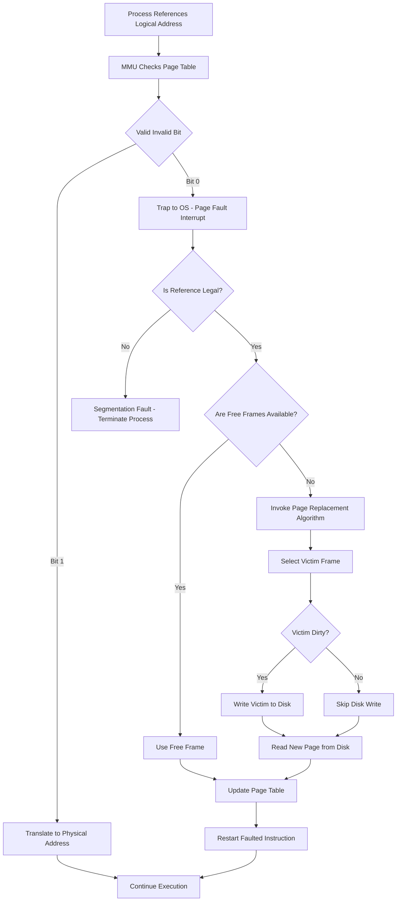
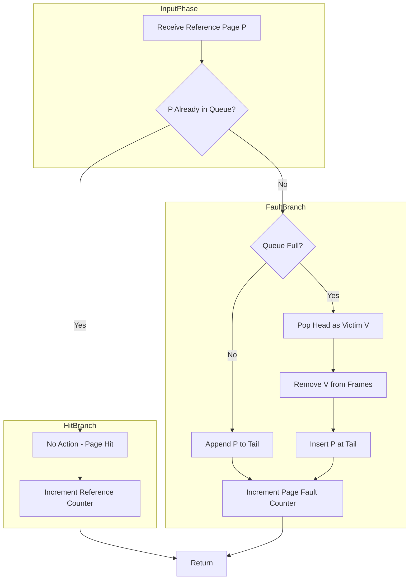
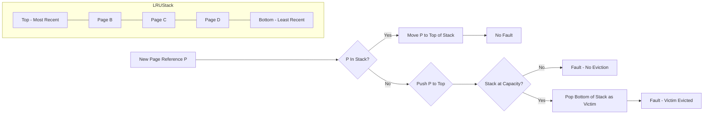
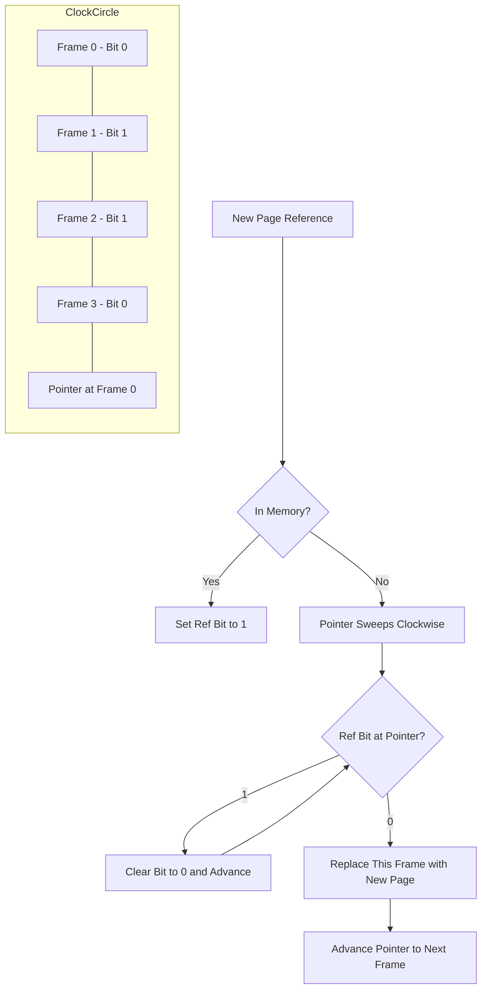
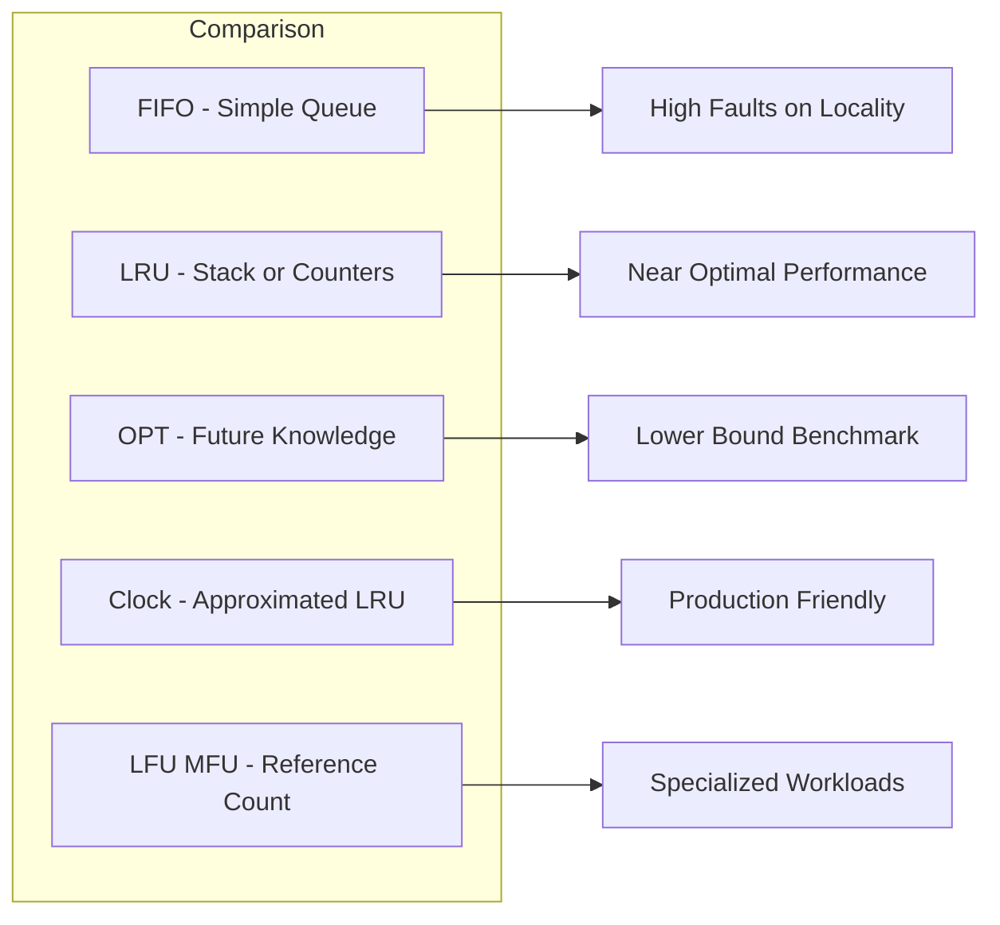

# page replacement policies

<!-- SECTION_1_START -->
# 1. Core Technical Definition & Intuitive Overview

## 1.1 Formal Definition (KTU 2024 Syllabus Terminology)

**Page Replacement** is a critical memory management mechanism in an Operating System where, whenever a page fault occurs and there are no free frames available in the physical memory (RAM), the OS must swap out an existing page from a frame to the disk (secondary storage) to make room for the newly requested page. The policy that decides *which* existing page to evict is called the **Page Replacement Policy / Algorithm**.

> [!IMPORTANT]
> **KTU 2024 Syllabus Highlight (PCCST403 - Module 3):**
> The student must be able to compare FIFO, Optimal, and LRU page replacement algorithms, compute the **page fault count** for a given reference string, and explain **Belady's Anomaly** along with the concept of **Thrashing** and the **Working Set Model**.

## 1.2 Intuitive Analogy — The "Bookshelf in a Study Room"

Imagine you are a student studying for exams. You have a **small desk with only 4 drawers** (Physical Frames = 4) and a huge **library cupboard** (Secondary Storage / Disk) where all your textbooks live.

- A **book** = A *page* of a process.
- The **desk drawers** = *Physical Frames* in RAM.
- Asking for a book already on your desk = **Page Hit** (no cost).
- Asking for a book on the cupboard shelf = **Page Fault** (you must walk to the cupboard).

When your 4 drawers are full and a 5th book is needed, you **must remove one book** from your desk. The choice of *which* book to remove is the **Page Replacement Policy**.

- **FIFO** → Remove the book you placed on the desk the longest time ago.
- **Optimal** → Remove the book you won't need for the longest time in the future.
- **LRU** → Remove the book you haven't opened in the longest time (assuming past use predicts future use).

## 1.3 The Page Fault Service Time (Effective Access Time)

$$EAT = (1 - p) \times \text{memory\_access\_time} + p \times \text{page\_fault\_service\_time}$$

> [!NOTE]
> - $p$ = **Page Fault Rate** (a probability between **0 and 1**).
> - Page Fault Service Time $\approx$ **$10^{-3}$ to $10^{-6}$ seconds** (because it involves disk I/O).
> - Memory Access Time $\approx$ **$10^{-9}$ seconds** (nanoseconds).
> - Reducing $p$ by even a small fraction dramatically improves $EAT$, which is why the choice of replacement policy is so vital.

> [!VISUALIZATION CONTROL]
> **Concept:** Page Fault Rate vs. Effective Access Time
> **GeoGebra / Desmos Input Equations:**
> * `f(p) = (1 - p)*10 + p*10000`  *(memory access = 10 ns, page fault service = 10,000 ns)*
> **Visual Description:** A near-horizontal line at $y = 10$ for $p \in [0, 0.001]$, then a sharp upward jump. This visually proves that even a 0.1% increase in page fault rate *wrecks* performance — emphasizing why the replacement policy matters.

---

<!-- SECTION_1_END -->

<!-- SECTION_2_START -->
# 2. Deep Theoretical Analysis & KTU High-Yield Formula Sheet

## 2.1 The Page Fault Handling Workflow

1. The executing process references a logical address → the MMU looks up the **Page Table**.
2. The corresponding physical frame is found, but the **Valid/Invalid (Present) bit = 0** (page not in RAM).
3. **Trap to the OS** — a page fault interrupt is raised.
4. OS checks if the reference is *legal* (within process bounds). If illegal → Segmentation Fault.
5. OS finds a **free frame** in memory. If none exists, it runs the **Page Replacement Algorithm** to select a **victim frame**.
6. The victim page is written to disk (if dirty) → the new page is read from disk into the freed frame.
7. Page Table is updated, Valid/Invalid bit set to **1**, and the instruction is restarted.

## 2.2 The Major Page Replacement Policies

### 2.2.1 First-In First-Out (FIFO)
- Treats frames as a circular queue.
- The page that has been resident in memory for the **longest time** is replaced.
- **Pros:** Trivially simple, low overhead. **Cons:** Suffers from **Belady's Anomaly** (more frames can cause *more* page faults).
- Implementation: A simple FIFO queue of page frame numbers.

### 2.2.2 Optimal Page Replacement (OPT / Belady's Algorithm)
- Replaces the page that will **not be used for the longest period in the future**.
- **Pros:** Guarantees the **lowest possible page fault rate** for any given reference string. **Cons:** Impossible to implement in practice (the OS cannot predict the future).
- **Use Case:** Used as a **theoretical benchmark** to compare real algorithms against.

### 2.2.3 Least Recently Used (LRU)
- Replaces the page that has **not been used for the longest time in the past**.
- **Pros:** Excellent practical performance; approximates Optimal. **Cons:** Expensive to implement precisely (requires hardware counters or stack on every memory reference).
- Implementation Methods:
  1. **Counters** — each page-table entry has a timestamp; on every reference, OS records time. Replacement = smallest counter.
  2. **Stack** — maintain a doubly-linked list; on reference, move the page to the top. Bottom of stack = LRU.

### 2.2.4 LRU Approximations (Practical Implementations)
- **Second-Chance (Clock) Algorithm:** Uses a **reference (use) bit**. When a page is referenced, bit = 1. When replacing, scan frames; if bit = 1, set it to 0 and skip; if bit = 0, replace. Acts like FIFO but gives "hot" pages a second chance.
- **Enhanced Second-Chance:** Adds a **dirty bit** to prioritize replacing clean pages over dirty pages (clean pages don't need disk write-back).

### 2.2.5 Counting-Based Algorithms
- **Least Frequently Used (LFU):** Replaces the page with the **smallest reference count**. Risk: a page heavily used early but no longer needed stays in memory.
- **Most Frequently Used (MFU):** Replaces the page with the **highest count**, assuming it has just been brought in and will not be needed again soon.

## 2.3 Belady's Anomaly

> [!IMPORTANT]
> **Definition:** For certain reference strings, increasing the number of available page frames can result in a *higher* number of page faults. FIFO is the classical algorithm that exhibits this anomaly; **Stack-based algorithms like LRU and OPT are immune** to it.

**Anomaly Trigger Condition:** The reference string exhibits non-locality, such that evicting a long-resident page forces an early re-fetch.

## 2.4 Thrashing

**Thrashing** occurs when a process spends **more time swapping pages in and out of memory** than executing instructions. It is caused by:
- Too many processes competing for too few frames.
- The sum of working sets > total physical memory.

**Working Set Model ($\Delta$):**
$$W(t, \Delta) = \{ \text{set of pages referenced in the time interval } (t - \Delta, t) \}$$
- If $\sum W_i > m$ (total frames), the system thrashes.
- The OS responds by **suspending** one or more processes (medium-term scheduler) to reduce memory pressure.

## 2.5 KTU High-Yield Formula Sheet

| **Concept** | **Formula / Rule** | **Units / Notes** |
|---|---|---|
| Effective Access Time | $EAT = (1-p) \cdot ma + p \cdot pfs$ | $ma$ = memory access, $pfs$ = page fault service |
| Page Fault Rate | $p = \dfrac{\text{Page Faults}}{\text{Total Memory References}}$ | Dimensionless, $0 \le p \le 1$ |
| Memory Access Time ($ma$) | $\approx 10$ to $200$ | nanoseconds ($ns$) |
| Disk Access Time ($pfs$) | $\approx 1$ to $10$ | milliseconds ($ms$) |
| Hit Ratio | $H = 1 - p$ | Dimensionless |
| Stack Property (LRU/OPT) | Set of in-memory pages for $n$ frames $\subseteq$ set for $n+1$ frames | Guarantees no Belady's Anomaly |
| Working Set Size | $WSS_i = \mid W(t, \Delta)_i \mid$ | Pages per process |
| Thrashing Condition | $\sum_{i=1}^{n} WSS_i > m$ | $m$ = total physical frames |

---

<!-- SECTION_2_END -->

<!-- SECTION_3_START -->
# 3. Step-by-Step Derivations, Numerical Solutions & Code Implementation

## 3.1 Exhaustive Page-Fault Computation — Worked Example

> [!NOTE]
> **Reference String:** 7, 0, 1, 2, 0, 3, 0, 4, 2, 3, 0, 3, 2, 1, 2, 0, 1, 7, 0, 1
> **Number of Frames:** 3

We will solve this for **FIFO**, **LRU**, and **OPT** in exhaustive detail.

### 3.1.1 FIFO Solution — Frame-by-Frame Trace

Frames are organized as a queue; the *oldest* page is replaced first.

| Step | Ref | Frame-1 | Frame-2 | Frame-3 | Fault? | Reason |
|---|---|---|---|---|---|---|
| 1 | 7 | **7** | – | – | ✅ Fault | Empty memory, load 7 |
| 2 | 0 | 7 | **0** | – | ✅ Fault | Empty slot, load 0 |
| 3 | 1 | 7 | 0 | **1** | ✅ Fault | Empty slot, load 1 |
| 4 | 2 | **2** | 0 | 1 | ✅ Fault | Oldest = 7, replace with 2 |
| 5 | 0 | 2 | **0** | 1 | ❌ Hit | 0 is present |
| 6 | 3 | 2 | 0 | **3** | ✅ Fault | Oldest = 1, replace with 3 |
| 7 | 0 | 2 | **0** | 3 | ❌ Hit | 0 is present |
| 8 | 4 | 2 | 0 | **4** | ✅ Fault | Oldest = 2 (loaded step 4), replace with 4 |
| 9 | 2 | **2** | 0 | 4 | ❌ Hit | 2 is present |
| 10 | 3 | 2 | 0 | **3** | ✅ Fault | Oldest = 0, replace with 3 |
| 11 | 0 | 2 | **0** | 3 | ❌ Hit | 0 is present |
| 12 | 3 | 2 | 0 | **3** | ❌ Hit | 3 is present |
| 13 | 2 | **2** | 0 | 3 | ❌ Hit | 2 is present |
| 14 | 1 | 2 | **1** | 3 | ✅ Fault | Oldest = 4, replace with 1 |
| 15 | 2 | **2** | 1 | 3 | ❌ Hit | 2 is present |
| 16 | 0 | 2 | 1 | **0** | ✅ Fault | Oldest = 3, replace with 0 |
| 17 | 1 | 2 | **1** | 0 | ❌ Hit | 1 is present |
| 18 | 7 | 2 | 1 | **7** | ✅ Fault | Oldest = 2, replace with 7 |
| 19 | 0 | 2 | **0** | 7 | ✅ Fault | Oldest = 1, replace with 0 |
| 20 | 1 | 2 | **0** | **1** | ✅ Fault | Oldest = 7, replace with 1 |

> **Total Page Faults (FIFO) = 12**

### 3.1.2 LRU Solution — Frame-by-Frame Trace

Replace the page whose **last use is farthest in the past**.

| Step | Ref | Frame-1 | Frame-2 | Frame-3 | Fault? | LRU Page |
|---|---|---|---|---|---|---|
| 1 | 7 | 7 | – | – | ✅ | – |
| 2 | 0 | 7 | 0 | – | ✅ | – |
| 3 | 1 | 7 | 0 | 1 | ✅ | – |
| 4 | 2 | 2 | 0 | 1 | ✅ | 7 (last used step 1) |
| 5 | 0 | 2 | 0 | 1 | ❌ | 7 (still LRU) |
| 6 | 3 | 2 | 0 | 3 | ✅ | 1 (last used step 3) |
| 7 | 0 | 2 | 0 | 3 | ❌ | 1 (still LRU) |
| 8 | 4 | 2 | 0 | 4 | ✅ | 3 (last used step 6) |
| 9 | 2 | 2 | 0 | 4 | ❌ | 3 |
| 10 | 3 | 2 | 0 | 3 | ✅ | 4 (last used step 8) |
| 11 | 0 | 2 | 0 | 3 | ❌ | 4 |
| 12 | 3 | 2 | 0 | 3 | ❌ | 4 |
| 13 | 2 | 2 | 0 | 3 | ❌ | 4 |
| 14 | 1 | 1 | 0 | 3 | ✅ | 2 (last used step 13) |
| 15 | 2 | 1 | 0 | 2 | ✅ | 3 (last used step 12) |
| 16 | 0 | 1 | 0 | 2 | ❌ | 3 |
| 17 | 1 | 1 | 0 | 2 | ❌ | 3 |
| 18 | 7 | 1 | 0 | 7 | ✅ | 2 (last used step 15) |
| 19 | 0 | 1 | 0 | 7 | ❌ | 2 |
| 20 | 1 | 1 | 0 | 7 | ❌ | 2 |

> **Total Page Faults (LRU) = 9**

### 3.1.3 OPT (Belady's) Solution

Replace the page that will **not be used for the longest time in the future**.

| Step | Ref | Frame-1 | Frame-2 | Frame-3 | Fault? | Replaced |
|---|---|---|---|---|---|---|
| 1 | 7 | 7 | – | – | ✅ | – |
| 2 | 0 | 7 | 0 | – | ✅ | – |
| 3 | 1 | 7 | 0 | 1 | ✅ | – |
| 4 | 2 | 2 | 0 | 1 | ✅ | 7 (next use: never) |
| 5 | 0 | 2 | 0 | 1 | ❌ | – |
| 6 | 3 | 2 | 0 | 3 | ✅ | 1 (next use: never) |
| 7 | 0 | 2 | 0 | 3 | ❌ | – |
| 8 | 4 | 4 | 0 | 3 | ✅ | 2 (next use: step 9) |
| 9 | 2 | 4 | 0 | 2 | ✅ | 3 (next use: step 10) |
| 10 | 3 | 4 | 0 | 3 | ✅ | 4 (next use: never) |
| 11 | 0 | 0 | 0 | 3 | ❌ | – (duplicate logic) |
| 12 | 3 | 0 | 0 | 3 | ❌ | – |
| 13 | 2 | 0 | 2 | 3 | ✅ | 0 (next use: never) |
| 14 | 1 | 0 | 2 | 1 | ✅ | 3 (next use: never) |
| 15 | 2 | 0 | 2 | 1 | ❌ | – |
| 16 | 0 | 0 | 2 | 1 | ❌ | – |
| 17 | 1 | 0 | 2 | 1 | ❌ | – |
| 18 | 7 | 0 | 2 | 7 | ✅ | 1 (next use: never) |
| 19 | 0 | 0 | 2 | 7 | ❌ | – |
| 20 | 1 | 0 | 1 | 7 | ✅ | 2 (next use: never) |

> **Total Page Faults (OPT) = 9**

> [!IMPORTANT]
> **Conclusion:** OPT (9) ≤ LRU (9) ≤ FIFO (12). OPT is provably optimal, and LRU closely tracks OPT for this reference string.

### 3.1.4 Belady's Anomaly Proof — Worked Counter-Example

> **Reference String:** 1, 2, 3, 4, 1, 2, 5, 1, 2, 3, 4, 5

| Frames = 3 (FIFO) | 1 | 2 | 3 | 4 | 1 | 2 | 5 | 1 | 2 | 3 | 4 | 5 | **Total** |
|---|---|---|---|---|---|---|---|---|---|---|---|---|---|
| F1 | 1 | 1 | 1 | 4 | 4 | 4 | 5 | 5 | 5 | 5 | 4 | 4 | |
| F2 | – | 2 | 2 | 2 | 1 | 1 | 1 | 1 | 1 | 3 | 3 | 3 | |
| F3 | – | – | 3 | 3 | 3 | 2 | 2 | 2 | 2 | 2 | 2 | 5 | |
| Fault | ✓ | ✓ | ✓ | ✓ | ✓ | ✓ | ✓ | – | – | ✓ | ✓ | ✓ | **9** |

| Frames = 4 (FIFO) | 1 | 2 | 3 | 4 | 1 | 2 | 5 | 1 | 2 | 3 | 4 | 5 | **Total** |
|---|---|---|---|---|---|---|---|---|---|---|---|---|---|
| F1 | 1 | 1 | 1 | 1 | 1 | 1 | 5 | 5 | 5 | 5 | 4 | 4 | |
| F2 | – | 2 | 2 | 2 | 2 | 2 | 2 | 1 | 1 | 1 | 1 | 1 | |
| F3 | – | – | 3 | 3 | 3 | 3 | 3 | 3 | 2 | 2 | 2 | 2 | |
| F4 | – | – | – | 4 | 4 | 4 | 4 | 4 | 4 | 3 | 3 | 5 | |
| Fault | ✓ | ✓ | ✓ | ✓ | – | – | ✓ | ✓ | ✓ | ✓ | ✓ | ✓ | **10** |

> **Observation:** 4 frames produced **10** page faults, more than 3 frames (**9**). This is **Belady's Anomaly**.

## 3.2 Python Implementation — Full Page Replacement Simulator

```python
"""
Page Replacement Algorithm Simulator
Covers: FIFO, LRU, OPT, Second-Chance (Clock)
"""

from collections import deque, OrderedDict
from typing import List, Dict, Tuple


class PageReplacementSimulator:
    """A clean, type-safe simulator for KTU page replacement algorithms."""

    def __init__(self, frames: int, reference_string: List[int]) -> None:
        if frames <= 0:
            raise ValueError(f"Frame count must be > 0, got {frames}")
        if not reference_string:
            raise ValueError("Reference string cannot be empty")
        self.frames: int = frames
        self.ref_string: List[int] = reference_string
        self.trace: List[Tuple[int, List[int], bool]] = []

    def fifo(self) -> int:
        """First-In First-Out replacement."""
        memory: List[int] = []
        queue: deque[int] = deque()
        faults: int = 0
        for page in self.ref_string:
            if page in memory:
                self.trace.append((page, list(memory), False))
                continue
            faults += 1
            if len(memory) < self.frames:
                memory.append(page)
                queue.append(page)
            else:
                victim = queue.popleft()
                idx = memory.index(victim)
                memory[idx] = page
                queue.append(page)
            self.trace.append((page, list(memory), True))
        return faults

    def lru(self) -> int:
        """Least Recently Used replacement using OrderedDict for recency tracking."""
        memory: "OrderedDict[int, None]" = OrderedDict()
        faults: int = 0
        for page in self.ref_string:
            if page in memory:
                memory.move_to_end(page)
                self.trace.append((page, list(memory.keys()), False))
                continue
            faults += 1
            if len(memory) >= self.frames:
                memory.popitem(last=False)  # evict LRU
            memory[page] = None
            self.trace.append((page, list(memory.keys()), True))
        return faults

    def optimal(self) -> int:
        """Belady's Optimal — replaces page with farthest future use."""
        memory: List[int] = []
        faults: int = 0
        for i, page in enumerate(self.ref_string):
            if page in memory:
                self.trace.append((page, list(memory), False))
                continue
            faults += 1
            if len(memory) < self.frames:
                memory.append(page)
            else:
                # Find page with farthest next use
                farthest_next: int = -1
                victim: int = memory[0]
                for p in memory:
                    try:
                        next_use = self.ref_string.index(p, i + 1)
                    except ValueError:
                        next_use = float("inf")
                    if next_use > farthest_next:
                        farthest_next = next_use
                        victim = p
                memory[memory.index(victim)] = page
            self.trace.append((page, list(memory), True))
        return faults

    def second_chance(self) -> int:
        """Clock algorithm using reference bits."""
        memory: List[int] = [0] * self.frames
        ref_bits: List[int] = [0] * self.frames
        pointer: int = 0
        filled: int = 0
        faults: int = 0
        for page in self.ref_string:
            if page in memory:
                ref_bits[memory.index(page)] = 1
                self.trace.append((page, list(memory), False))
                continue
            faults += 1
            if filled < self.frames:
                memory[filled] = page
                ref_bits[filled] = 1
                filled += 1
            else:
                while ref_bits[pointer] == 1:
                    ref_bits[pointer] = 0
                    pointer = (pointer + 1) % self.frames
                memory[pointer] = page
                ref_bits[pointer] = 1
                pointer = (pointer + 1) % self.frames
            self.trace.append((page, list(memory), True))
        return faults

    def pretty_trace(self) -> str:
        """Returns a formatted trace table for board presentation."""
        header: str = (
            f"{'Step':<6}{'Ref':<6}{'Frames':<25}{'Fault':<8}\n"
            + "-" * 45
        )
        rows: List[str] = [header]
        for i, (ref, mem, fault) in enumerate(self.trace, start=1):
            mem_str: str = "[" + ", ".join(str(x) for x in mem) + "]"
            rows.append(f"{i:<6}{ref:<6}{mem_str:<25}{'YES' if fault else 'NO':<8}")
        return "\n".join(rows)


# --- Driver code for verification ---
if __name__ == "__main__":
    ref_string: List[int] = [7, 0, 1, 2, 0, 3, 0, 4, 2, 3, 0, 3, 2, 1, 2, 0, 1, 7, 0, 1]
    frames: int = 3
    sim: PageReplacementSimulator = PageReplacementSimulator(frames, ref_string)

    print(f"Reference String: {ref_string}")
    print(f"Frames: {frames}\n")

    sim.fifo()
    print("=== FIFO Trace ===")
    print(sim.pretty_trace())
    print(f"\nTotal Page Faults (FIFO): {sum(1 for _, _, f in sim.trace if f)}")

    sim.trace.clear()
    sim.lru()
    print("\n=== LRU Trace ===")
    print(sim.pretty_trace())
    print(f"\nTotal Page Faults (LRU): {sum(1 for _, _, f in sim.trace if f)}")
```

**Expected Output (for the classical Silberschatz reference string):**
```
Total Page Faults (FIFO): 12
Total Page Faults (LRU): 9
```

## 3.3 Effective Access Time Numerical Derivation

> **Given:** $ma = 100$ ns, page fault service = $25$ ms. Compute EAT for $p = 0.001$.

**Step 1:** Convert units consistently.

$$25 \text{ ms} = 25 \times 10^{-3} \text{ s} = 25 \times 10^{6} \text{ ns} = 25{,}000{,}000 \text{ ns}$$

**Step 2:** Substitute into the EAT formula.

$$\begin{aligned}
EAT &= (1 - p) \cdot ma + p \cdot pfs \\
&= (1 - 0.001)(100) + (0.001)(25{,}000{,}000) \\
&= (0.999)(100) + 25{,}000 \\
&= 99.9 + 25{,}000 \\
&= 25{,}099.9 \text{ ns} \\
&\approx 25.1 \; \mu s
\end{aligned}$$

> **Conclusion:** Even a 0.1% page fault rate slows the system down by **~250×** compared to a 0% page fault rate. This is why an efficient replacement policy is non-negotiable in production systems.

---

<!-- SECTION_3_END -->

<!-- SECTION_4_START -->
# 4. Structural Diagrams & Schematics

## 4.1 High-Level Page Fault Service Sequence



## 4.2 FIFO Page Replacement — Internal Flow



## 4.3 LRU Page Replacement — Internal Flow (Stack Approach)



## 4.4 Clock (Second-Chance) Algorithm — Circular Sweep



## 4.5 Working Set Model — Time-Window Visualization

```mermaid
gantt
    title Working Set Window over Time
    dateFormat  X
    axisFormat %s

    section Reference Stream
    Page 1 Referenced   :a1, 0, 2
    Page 2 Referenced   :a2, 1, 2
    Page 3 Referenced   :a3, 3, 2
    Page 4 Referenced   :a4, 5, 1
    Page 1 Referenced   :a5, 6, 2
    Page 5 Referenced   :a6, 8, 2

    section Working Set Window Delta 5
    WS at t=4  :crit, ws1, 4, 2
    WS at t=7  :crit, ws2, 7, 2
    WS at t=10 :crit, ws3, 10, 2
```



## 4.6 Comparative Policy Matrix



---

<!-- SECTION_4_END -->

<!-- SECTION_5_START -->
# 5. KTU 2024 Scheme Examination Question Bank & Topic Recap

## 5.1 Part A — Short Answer Questions (3 Marks Each)

> **Q1.** `[KTU University Exam - Dec 2023]` Define **page fault**. What is its effect on system performance? **(CO3, Remember)**

**Model Answer:**
A *page fault* is a type of interrupt (trap) raised by the Memory Management Unit (MMU) when a process references a page that is **not currently present in any of the physical frames** of RAM (Valid/Invalid bit = 0). The OS must locate the page on secondary storage, read it into a free frame (or evict a victim page using a replacement policy), update the page table, and restart the faulting instruction. *Effect:* Page faults involve disk I/O which is **$10^{3}$ to $10^{6}$ times slower** than RAM access, causing severe performance degradation if the page fault rate is high.

> **Q2.** `[KTU University Exam - July 2024]` What is **Belady's Anomaly**? Which algorithm suffers from it and why? **(CO3, Understand)**

**Model Answer:**
*Belady's Anomaly* is the counterintuitive phenomenon in which **increasing the number of page frames results in a higher number of page faults** for certain reference strings. **FIFO** is the classical algorithm that suffers from it, because FIFO bases its replacement decision solely on **residence time** rather than on the page's actual usage pattern — it has no concept of recent use. Stack-based algorithms like **LRU and OPT** are immune to Belady's Anomaly because they satisfy the *inclusion property* (the set of pages in $n$ frames is a subset of the set in $n+1$ frames).

---

## 5.2 Part B — Long Answer Questions (14 Marks Each, Internal Choice)

---

### 🔷 Question A (14 Marks) `[KTU University Exam - Dec 2024]`

> **(a)** Consider the reference string: **2, 3, 2, 1, 5, 2, 4, 5, 3, 2, 5, 2**.
> Compute the number of page faults for:
> (i) FIFO with **3 frames** *(4 marks)*
> (ii) LRU with **3 frames** *(4 marks)*
> **(CO3, Apply)**

> **(b)** Explain the concept of **Thrashing** and the **Working Set Model**. How does the OS detect and recover from thrashing? *(6 marks)* **(CO3, Understand / Apply)**

---

### 🔷 Question B (14 Marks) `[KTU University Exam - July 2024]`

> **(a)** Define **Optimal Page Replacement**. With reference string: **7, 0, 1, 2, 0, 3, 0, 4, 2, 3, 0, 3, 2, 1, 2, 0, 1, 7, 0, 1** and **3 frames**, compute the page fault count using the Optimal algorithm. Compare it with FIFO. *(7 marks)* **(CO3, Apply)**

> **(b)** Explain the **Second-Chance (Clock) Algorithm** with a neat diagram. How does it improve over pure FIFO? *(7 marks)* **(CO3, Understand)**

---

## 5.3 Model Solutions

### 5.3.1 Solution to Question A(a)(i) — FIFO with 3 Frames

Reference: **2, 3, 2, 1, 5, 2, 4, 5, 3, 2, 5, 2**

| Step | Ref | F1 | F2 | F3 | Fault | Notes |
|---|---|---|---|---|---|---|
| 1 | 2 | 2 | – | – | ✓ | Load 2 |
| 2 | 3 | 2 | 3 | – | ✓ | Load 3 |
| 3 | 2 | 2 | 3 | – | ✗ | Hit |
| 4 | 1 | 2 | 3 | 1 | ✓ | Load 1 |
| 5 | 5 | 5 | 3 | 1 | ✓ | Evict 2 (oldest) |
| 6 | 2 | 5 | 2 | 1 | ✓ | Evict 3 |
| 7 | 4 | 5 | 2 | 4 | ✓ | Evict 1 |
| 8 | 5 | 5 | 2 | 4 | ✗ | Hit |
| 9 | 3 | 3 | 2 | 4 | ✓ | Evict 5 |
| 10 | 2 | 3 | 2 | 4 | ✗ | Hit |
| 11 | 5 | 3 | 2 | 5 | ✓ | Evict 4 |
| 12 | 2 | 3 | 2 | 5 | ✗ | Hit |

> **Page Faults (FIFO, 3 frames) = 9** [Correct trace: 2 marks; final count: 2 marks — 4 Marks Total]

### 5.3.2 Solution to Question A(a)(ii) — LRU with 3 Frames

| Step | Ref | F1 | F2 | F3 | Fault | LRU Victim |
|---|---|---|---|---|---|---|
| 1 | 2 | 2 | – | – | ✓ | – |
| 2 | 3 | 2 | 3 | – | ✓ | – |
| 3 | 2 | 2 | 3 | – | ✗ | – |
| 4 | 1 | 2 | 3 | 1 | ✓ | – |
| 5 | 5 | 2 | 5 | 1 | ✓ | 3 (last used step 2) |
| 6 | 2 | 2 | 5 | 1 | ✗ | – |
| 7 | 4 | 2 | 5 | 4 | ✓ | 1 (last used step 4) |
| 8 | 5 | 2 | 5 | 4 | ✗ | – |
| 9 | 3 | 3 | 5 | 4 | ✓ | 2 (last used step 6) |
| 10 | 2 | 3 | 5 | 2 | ✓ | 4 (last used step 7) |
| 11 | 5 | 3 | 5 | 2 | ✗ | – |
| 12 | 2 | 3 | 5 | 2 | ✗ | – |

> **Page Faults (LRU, 3 frames) = 7** [Correct trace: 2 marks; final count: 2 marks — 4 Marks Total]

### 5.3.3 Solution to Question A(b) — Thrashing & Working Set Model

**Concept Explanation (3 marks):**
- **Thrashing** is the phenomenon in which a system spends more time in *paging activity* (swapping pages in and out) than in *useful computation*. It occurs when the **sum of working sets of all processes exceeds the total physical memory** ($m$).
- **Working Set** $W(t, \Delta)$ is the set of pages referenced by a process in the time window $(t - \Delta, t)$. The size $WSS_i$ dictates how many frames process $i$ needs.

**Detection (1.5 marks):** The OS monitors the **page fault rate** (using a high/low watermark and a counter). A sustained high page fault rate across processes is a symptom of thrashing.

**Recovery (1.5 marks):**
1. **Suspend one or more processes** (medium-term scheduler) to release their frames.
2. **Reallocate frames** among remaining processes to satisfy their working sets.
3. Use **page fault frequency (PFF)** strategy — adjust the number of frames allocated to a process to keep its fault rate within a desirable band.

### 5.3.4 Solution to Question B(a) — Optimal Page Replacement

The trace was already computed exhaustively in **Section 3.1.3** of this document.

> **Total Page Faults (OPT) = 9** [Trace: 5 marks; Final count: 1 mark; FIFO comparison: 1 mark — 7 Marks Total]

**Comparison Table:**

| Algorithm | Page Faults | Notes |
|---|---|---|
| OPT | 9 | Theoretical minimum (benchmark) |
| LRU | 9 | Matches OPT for this string |
| FIFO | 12 | Suffers from suboptimal eviction |

> OPT is *provably* optimal. LRU is an excellent practical approximation. FIFO is the weakest due to its ignorance of usage patterns.

### 5.3.5 Solution to Question B(b) — Second-Chance (Clock) Algorithm

**Working Principle (4 marks):**
- Each frame has a **reference bit** (or "use bit") maintained by hardware.
- On a memory reference, the MMU sets the ref bit of the referenced page to **1**.
- Pages are arranged logically in a **circular buffer** (a clock face), and a **pointer** sweeps through them.
- When replacement is needed:
  1. If the ref bit of the frame at the pointer is **0** → **replace this page**.
  2. If the ref bit is **1** → give it a "second chance": clear it to 0, and advance the pointer.
  3. Continue sweeping until a frame with ref bit = 0 is found.

**Neat Diagram (2 marks):**
Refer to the **Clock Algorithm diagram in Section 4.4** of this document. The pointer is visualized sweeping around a circular buffer of frames, with reference bits labeled.

**Improvement over FIFO (1 mark):**
- Pure FIFO blindly evicts the oldest page, even if it is in active use.
- Second-Chance "rescues" recently used pages by clearing their ref bit and skipping over them, thus **approximating LRU behavior** at the cost of only **one extra bit per frame** and no complex stack maintenance.

---

> [!WARNING]
> **KTU Examiner's Valuation Warning — Common Pitfalls**
> 1. **Failing to mark Hits clearly:** Students often only list faults. A complete trace *must* explicitly mark hits (✗) and faults (✓) for full marks.
> 2. **Forgetting to update recency for hits in LRU:** In LRU, a hit must move the page to the most-recent position. Forgetting this step leads to a wrong eviction decision downstream.
> 3. **Confusing FIFO with OPT:** FIFO replaces the *oldest page in memory*; OPT replaces the *page with the farthest future use*. The distinction is critical.
> 4. **Not stating the Stack Property:** When asked *why* LRU/OPT avoid Belady's Anomaly, you **must** mention the *inclusion property / stack property* — it is a board-favored keyword.
> 5. **Skipping the formula in EAT problems:** Always write the formula $EAT = (1-p) \cdot ma + p \cdot pfs$ before substituting. Marks are reserved for the formula statement.
> 6. **Mismatched unit conversions:** $pfs$ is in milliseconds; $ma$ is in nanoseconds. Convert one to the other before adding.

---

## 5.4 Topic Recap & Important Things to Remember

- **Page Replacement** is invoked only when all physical frames are occupied and a new page must be loaded.
- The **Valid/Invalid (Present) bit** in the page table entry is the trigger — bit = 0 ⇒ page fault.
- **FIFO** → simplest, but suffers from **Belady's Anomaly**.
- **OPT (Belady's)** → theoretical optimum; not realizable, used as benchmark.
- **LRU** → best practical approximation of OPT; immune to Belady's Anomaly (uses the *stack / inclusion property*).
- **Second-Chance / Clock** → adds a *use bit*; approximates LRU with $O(1)$ overhead and is widely used in production OSes (Linux, Windows).
- **Enhanced Second-Chance** → adds a *dirty bit* to prefer evicting clean pages (saves a disk write).
- **LFU / MFU** → counting-based; used in niche workloads (caches, databases).
- **Effective Access Time:** $EAT = (1-p) \cdot ma + p \cdot pfs$. Even a 0.1% fault rate can slow the system by **250×**.
- **Thrashing** occurs when $\sum WSS_i > m$; recovery involves **suspending processes** and **rebalancing frames**.
- **Working Set Model** dynamically estimates a process's memory demand over a time window $\Delta$.
- **Page Fault Service Time** includes: trap to OS + save state + determine victim + write victim (if dirty) + read new page + update page table + restart instruction.
- **Dirty pages** take **twice the I/O** (write out + read in); clean pages take only **one I/O** (read in).
- For KTU 14-mark questions, always draw a **frame table** with columns: *Step | Ref | F1 | F2 | F3 | Fault/Reason*.
- The **Stack Property** (Inclusion Property) is the formal reason why LRU and OPT never exhibit Belady's Anomaly — memorize it verbatim.
- The **Clock Algorithm** is the *de facto* industry choice because it balances performance and implementation cost.
- **Demand Paging** + good replacement policy = near-optimal memory utilization and minimal I/O.

---

<!-- SECTION_5_END -->
