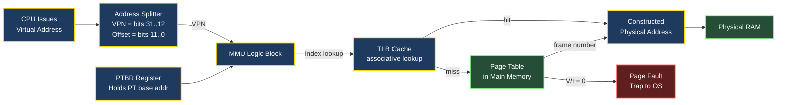
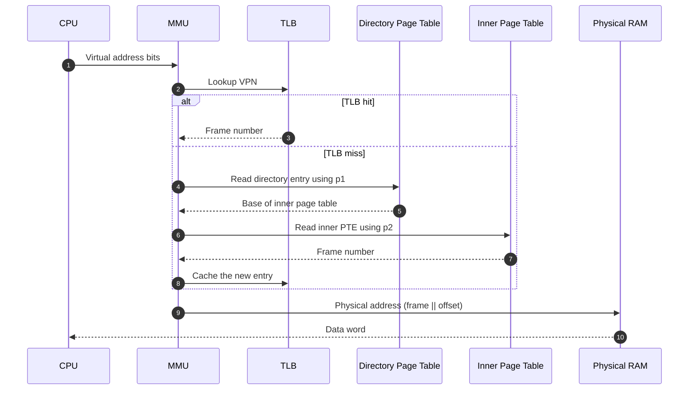
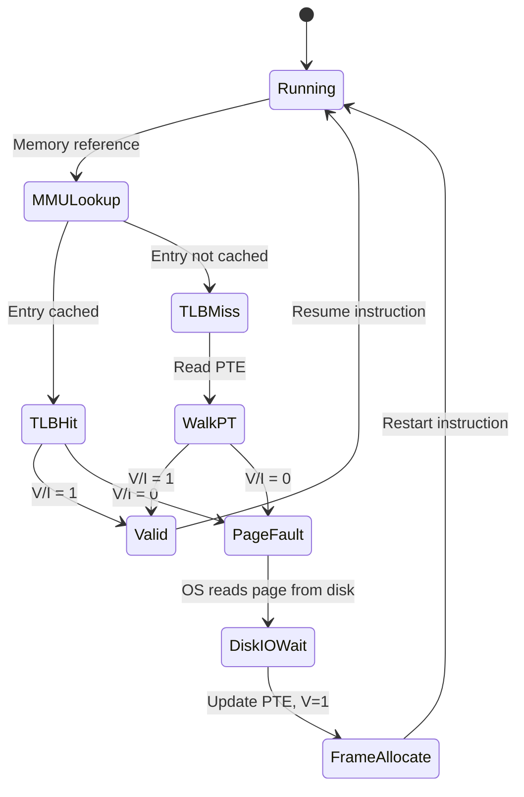

# page tables and hardware support

<!-- SECTION_1_START -->
# Page Tables and Hardware Support — Core Technical Definition & Intuition

## 1.1 Formal Academic Definition (KTU 2024 Syllabus Terminology)

> [!IMPORTANT]
> **Page Table (KTU Definition):** A *page table* is a per-process kernel data structure maintained by the Operating System that maps each **virtual page number** of a process's logical address space to its corresponding **physical frame number** residing in main memory (RAM). It is the fundamental data structure that enables the **Memory Management Unit (MMU)** hardware to perform run-time virtual-to-physical address translation.

In the **demand paging** and **simple paging** schemes prescribed in the KTU PCCST403 Module 3 syllabus, the page table is stored in main memory and consulted by the hardware (MMU) on every memory reference. Each **Page Table Entry (PTE)** contains not only the frame number but also control bits such as the **Valid/Invalid bit (V/I)**, **Protection bit (R/W/X)**, **Reference bit (R)**, **Modify/Dirty bit (M)**, and (in advanced systems) **Caching/Disable bit**.

The standard PTE format used in KTU board problems is:

$$
\text{PTE} = \underbrace{f}_{\text{frame number}} \;\big|\; \underbrace{V/I}_{\text{1 bit}} \;\big|\; \underbrace{R/W}_{\text{1 bit}} \;\big|\; \underbrace{R}_{\text{1 bit}} \;\big|\; \underbrace{M}_{\text{1 bit}}
$$

> [!NOTE]
> **Memory Management Unit (MMU):** A specialized hardware component (often integrated into the CPU) responsible for performing run-time virtual-to-physical address translation by consulting the page table base register (`PTBR`) and the page table itself.

## 1.2 Intuitive Real-World Analogy

Imagine a large **university library** that contains millions of books but has a small front-desk *catalogue room*. Students do not browse the entire library; instead, they look up the book's title in the catalogue, which tells them exactly which *shelf and rack* the book sits on. Then they walk to that exact physical location.

- **Student (CPU)** issues a request — *"Give me Chapter 5 of Operating Systems."*
- **Title of the book** = **Virtual Page Number (VPN)** in the logical address.
- **Catalogue** = **Page Table** stored in main memory.
- **Shelf and rack number** = **Physical Frame Number (PFN)** in physical memory.
- **Front-desk librarian** = **MMU** hardware.
- A missing catalogue entry (**Valid bit = 0**) is the librarian saying, *"This book has not been ordered yet — page fault!"*

This analogy makes it obvious *why* every memory access needs the page table and *why* consulting it for every reference is slow (hence the motivation for a **Translation Lookaside Buffer — TLB**, covered later).

## 1.3 The Address Translation Equation

A logical (virtual) address is divided into two fields by the hardware:

$$
\text{Logical Address} = \underbrace{p}_{\text{Virtual Page Number}} \;\|\; \underbrace{d}_{\text{Offset within page}}
$$

The MMU uses $p$ as an **index** into the page table and replaces it with the corresponding frame number $f$ to form the physical address:

$$
\boxed{\;\text{Physical Address} = \underbrace{f}_{\text{Frame Number}} \;\|\; \underbrace{d}_{\text{Offset}} \;}
$$

## 1.4 Page Table Size — Quick Concept

If logical address space = $2^p$ bytes and page size = $2^d$ bytes, then the number of pages is $2^{p-d}$. The total page table size is:

$$
\text{Page Table Size} = \frac{2^p}{2^d} \times \text{PTE\_size} = 2^{p-d} \times \text{PTE\_size bytes}
$$

> [!VISUALIZATION CONTROL]
> **Concept:** Address-Space Partitioning (Logical ↔ Physical Mapping)
> **Desmos Input Equations:**
> * Block 1 (Logical Address, length 32): $\;x \in [0,\; 2^{32}-1]$
> * Block 2 (Page Number field, length $p-d$): $\;f_1(x) = \text{bit-slice}[31,\;d]$
> * Block 3 (Offset field, length $d$): $\;f_2(x) = \text{bit-slice}[d-1,\;0]$
> **Visual Description:** Two horizontal bit-vectors of length 32, where the upper $p-d$ bits are highlighted as the *page number* and the lower $d$ bits are the *offset*. After translation, the upper $p-d$ bits are replaced by the frame number and the offset is preserved.

---

<!-- SECTION_1_END -->

<!-- SECTION_2_START -->
# Deep Theoretical Analysis & KTU High-Yield Formula Sheet

## 2.1 Operational Walkthrough of a Single Memory Reference

When the CPU issues a memory access using a virtual address, the following *strictly ordered* sequence of events occurs:

1. **CPU places address on the address bus.** The address is split by the hardware into a *page number* $p$ and an *offset* $d$.
2. **MMU consults the page table** by computing the entry's location as $\text{PTBR} + p \times \text{PTE\_size}$, where `PTBR` (Page Table Base Register) is loaded by the OS on every context switch.
3. **The Valid bit is inspected.** If $V = 1$, the frame number is read; if $V = 0$, a *page fault trap* is raised to the OS.
4. **Protection / Dirty / Reference bits** are checked to enforce read/write/execute permissions and to support page replacement.
5. **The physical address is constructed** by concatenating the frame number with the original offset.
6. **The bus request proceeds** to physical memory with this real address.

> [!NOTE]
> **Key Insight for KTU exams:** The page table lookup is itself a memory access! Hence, *every* user-level memory reference by a naïve paging system actually incurs **two physical memory accesses** — one for the page table, and one for the actual data. This 2x slowdown is the **primary motivation for the TLB** discussed in Section 2.4.

## 2.2 KTU Formula Sheet / Cheat Sheet

| **Symbol / Term** | **Meaning** | **Formula / Value** | **Units** |
|---|---|---|---|
| $\text{LA}$ | Logical (Virtual) Address | $32$ or $64$ bits | bits |
| $p$ | Virtual Page Number (VPN) | upper $p-d$ bits of LA | index |
| $d$ | Page Offset | lower $d$ bits of LA | bits |
| $n$ | Number of pages per process | $n = 2^{p-d}$ | pages |
| $\text{Frame Size}$ | Physical block size | $= \text{Page Size} = 2^d$ | bytes |
| $\text{PTE size}$ | Size of one page-table entry | typically $4$ bytes | bytes |
| $\text{Page Table Size}$ | Total memory for one process's PT | $2^{p-d} \times \text{PTE\_size}$ | bytes |
| $\text{EAT}$ | Effective Access Time | $t_{\text{mem}} + p \cdot t_{\text{mem}} \cdot \text{miss} + (1-p) \cdot t_{\text{TLB}}$ | ns |
| $p$ (in EAT) | TLB hit ratio | $0 \le p \le 1$ | unitless |
| $t_{\text{mem}}$ | Memory access time | typically $100$ ns | ns |
| $t_{\text{TLB}}$ | TLB access time | typically $20$ ns | ns |
| $\text{Wasted memory}$ | Internal fragmentation per process | $\text{Page Size} - \text{Used bytes in last page}$ | bytes |

> [!WARNING]
> **Watch the notation conflict:** In paging formulas, $p$ means the *virtual page number*; in the EAT (TLB) formula, $p$ means the *TLB hit ratio*. KTU board questions always specify the context, so re-read carefully.

## 2.3 Hardware Support — The MMU and Page-Table Base Register

The OS **cannot** perform address translation in software on every instruction (it would be too slow). Hence dedicated hardware is required:

- **MMU (Memory Management Unit):** On-chip circuit that performs the lookup, validity check, and address concatenation in a single cycle.
- **PTBR (Page-Table Base Register):** A privileged CPU register that holds the *starting physical address* of the current process's page table. On a context switch, the OS reloads this register, enabling per-process isolated address spaces.
- **TLB (Translation Lookaside Buffer):** A small, fully-associative, content-addressable hardware cache of the *most recently used* page-table entries. Typical size: $64$ – $1024$ entries.

## 2.4 Effective Access Time (EAT) — The TLB Boost

Without a TLB:

$$
\text{EAT}_{\text{no-TLB}} = 2 \times t_{\text{mem}} \quad (\text{one access for PTE, one for data})
$$

With a TLB of hit ratio $h$ and access time $t_{\text{TLB}}$:

$$
\boxed{\;\text{EAT} = (1 - h)(t_{\text{TLB}} + 2 t_{\text{mem}}) + h(t_{\text{TLB}} + t_{\text{mem}})\;}
$$

This can be algebraically simplified to the **KTU standard form**:

$$
\boxed{\;\text{EAT} = t_{\text{TLB}} + (2 - h) \cdot t_{\text{mem}} \quad \text{or equivalently} \quad \text{EAT} = t_{\text{mem}} (2 - h) + t_{\text{TLB}}\;}
$$

## 2.5 Real-World Engineering Utility

- **Process Isolation:** Page tables enable per-process virtual address spaces, preventing one buggy/malicious program from corrupting another's memory. This is the foundation of process security in Linux, Windows, and macOS.
- **DRAM Abstraction:** Programs are written assuming a *contiguous* logical address space, while physical memory is fragmented. The page table hides this fragmentation entirely.
- **Swapping & Demand Paging:** The Valid/Invalid bit enables the OS to keep *inactive* pages on disk and bring them in only when referenced — this is how modern OSes support running programs whose working set exceeds physical RAM (e.g., Chrome with 100+ tabs).
- **Shared Memory:** Read-only pages of `libc.so` and the kernel text segment are mapped to the same physical frame across processes by pointing their PTEs to the same frame number. **CRITICAL** for memory efficiency.
- **Copy-on-Write (CoW):** On `fork()`, parent and child share frames; PTEs are marked read-only; a write raises a fault and only then is a private copy made. This is what makes Linux `fork()` near-instantaneous.

---

<!-- SECTION_2_END -->

<!-- SECTION_3_START -->
# Step-by-Step Derivations & Code Implementation

## 3.1 Exhaustive Worked Derivation: Address Translation

> [!NOTE]
> **Standard KTU Problem Template:** "A machine has a $32$-bit logical address space, a page size of $4$ KB, and a page-table entry of $4$ bytes. How large is the page table? Translate virtual address `0x000023F0` given a supplied page table."

**Step 1 — Compute the offset width $d$.**

$$
d = \log_2(\text{Page Size}) = \log_2(4096) = \log_2(2^{12}) = 12 \text{ bits}
$$

**Step 2 — Compute the virtual page number width $p - d$ (called $p$ in the KTU textbook notation).**

$$
\text{VPN width} = \text{Logical Address bits} - d = 32 - 12 = 20 \text{ bits}
$$

**Step 3 — Compute the number of pages per process.**

$$
n = 2^{20} = 1,\!048,\!576 \text{ pages per process} \approx 1 \text{ million pages}
$$

**Step 4 — Compute page-table size.**

$$
\text{PT Size} = n \times \text{PTE\_size} = 1,\!048,\!576 \times 4 \text{ B} = 4,\!194,\!304 \text{ B} = 4 \text{ MB per process}
$$

**Step 5 — Decompose the virtual address.**

Virtual address = `0x000023F0` (hex). Convert to binary:

$$
\text{0x000023F0} \;=\; 0000\;0000\;0000\;0000\;0010\;0011\;1111\;0000
$$

Split into VPN (upper 20 bits) and offset (lower 12 bits):

$$
\text{VPN} = 0000\;0000\;0000\;0000\;0010 = 2_{10}
$$
$$
\text{Offset} = 0011\;1111\;0000 = 0x3F0 = 1008_{10}
$$

**Step 6 — Look up VPN $= 2$ in the page table.**

Suppose (as a KTU textbook example) the page table is:

| **Index (VPN)** | **Frame Number** | **Valid Bit** |
|---|---|---|
| $0$ | $5$ | $1$ |
| $1$ | $7$ | $1$ |
| $2$ | $9$ | $1$ |
| $3$ | — | $0$ |

For VPN $= 2$, frame number $= 9$, valid $= 1$. **Translation proceeds.**

**Step 7 — Form the physical address.**

$$
\text{Physical Address} = (\text{Frame} \ll 12) \;|\; \text{Offset} = (9 \times 4096) + 1008
$$

$$
\begin{aligned}
(9 \times 4096) + 1008 &= 36{,}864 + 1008 \\
&= 37{,}872_{10} \\
&= \text{0x000093F0}
\end{aligned}
$$

**Step 8 — Final result.**

$$
\boxed{\;\text{Virtual Address 0x000023F0} \;\longmapsto\; \text{Physical Address 0x000093F0}\;}
$$

> [!WARNING]
> **Valuation Pitfall:** Many KTU students forget to convert the offset back to hexadecimal after extraction. They write the decimal physical address and lose 1 mark. Always keep both hex and decimal forms in your final line.

## 3.2 Exhaustive Derivation: Effective Access Time

> [!NOTE]
> **Standard KTU Problem Template:** "A paging system has TLB access time $= 20$ ns, memory access time $= 100$ ns, and TLB hit ratio $= 80\%$. Compute the EAT."

**Step 1 — Identify the inputs.**

$$
t_{\text{TLB}} = 20 \text{ ns}, \quad t_{\text{mem}} = 100 \text{ ns}, \quad h = 0.8
$$

**Step 2 — Substitute into the formula.**

$$
\text{EAT} = (1 - h)(t_{\text{TLB}} + 2 t_{\text{mem}}) + h(t_{\text{TLB}} + t_{\text{mem}})
$$

**Step 3 — Evaluate the TLB-miss branch.**

$$
1 - h = 1 - 0.8 = 0.2
$$
$$
t_{\text{TLB}} + 2 t_{\text{mem}} = 20 + 2(100) = 20 + 200 = 220 \text{ ns}
$$
$$
0.2 \times 220 = 44 \text{ ns}
$$

**Step 4 — Evaluate the TLB-hit branch.**

$$
t_{\text{TLB}} + t_{\text{mem}} = 20 + 100 = 120 \text{ ns}
$$
$$
0.8 \times 120 = 96 \text{ ns}
$$

**Step 5 — Sum.**

$$
\text{EAT} = 44 + 96 = 140 \text{ ns}
$$

**Step 6 — Verify with the simplified form.**

$$
\text{EAT} = t_{\text{TLB}} + (2 - h) t_{\text{mem}} = 20 + (2 - 0.8)(100) = 20 + 1.2 \times 100 = 20 + 120 = 140 \text{ ns} \;\checkmark
$$

$$
\boxed{\;\text{EAT} = 140 \text{ ns}\;}
$$

## 3.3 Code Implementation: Virtual-to-Physical Translation Engine

```python
"""
KTU OS Module 3 — Page Table Address Translator
A reference implementation that demonstrates how a paging MMU resolves
a virtual address to a physical address, including TLB caching,
validity checks, and protection enforcement.
"""

from __future__ import annotations
from dataclasses import dataclass, field
from typing import Dict, Optional


# --- 1. Data structures -------------------------------------------------

@dataclass(frozen=True)
class PageTableEntry:
    """Represents a single PTE stored in the page table."""
    frame_number: int                # Physical frame number
    valid: bool = True              # Valid/Invalid bit (V/I)
    read_write: bool = True         # True = RW, False = R-only
    referenced: bool = False        # Reference bit (for LRU)
    modified: bool = False          # Dirty/Modify bit


@dataclass
class TLBEntry:
    """Cached PTE for fast lookup."""
    vpn: int
    pte: PageTableEntry


class MMU:
    """
    Memory Management Unit simulator with a small TLB.
    Mimics hardware behaviour: TLB lookup -> page table walk -> bus cycle.
    """

    def __init__(
        self,
        page_size_bytes: int,
        page_table: Dict[int, PageTableEntry],
        tlb_capacity: int = 4,
        tlb_access_ns: int = 20,
        memory_access_ns: int = 100,
    ) -> None:
        self.page_size = page_size_bytes
        self.page_table = page_table
        self.tlb: Dict[int, TLBEntry] = {}
        self.tlb_capacity = tlb_capacity
        self.tlb_access_ns = tlb_access_ns
        self.memory_access_ns = memory_access_ns

        # Telemetry counters
        self.tlb_hits = 0
        self.tlb_misses = 0
        self.page_faults = 0

    # --- 2. Address decomposition --------------------------------------

    def _decompose(self, virtual_address: int) -> tuple[int, int]:
        """Return (vpn, offset) for a virtual address."""
        if virtual_address < 0:
            raise ValueError(f"Negative virtual address: {virtual_address}")
        offset_mask = self.page_size - 1
        offset = virtual_address & offset_mask
        vpn = virtual_address >> self._offset_bits()
        return vpn, offset

    def _offset_bits(self) -> int:
        """Number of bits needed to address one byte within a page."""
        bits = 0
        size = self.page_size
        while size > 1:
            size >>= 1
            bits += 1
        return bits

    # --- 3. Translation -------------------------------------------------

    def translate(self, virtual_address: int) -> int:
        """
        Resolve virtual -> physical address. Raises PageFault on invalid PTE.
        Logs every step to stdout for board-exam-style demonstration.
        """
        vpn, offset = self._decompose(virtual_address)
        print(f"[MMU] Virtual 0x{virtual_address:08X} -> VPN={vpn}, offset=0x{offset:03X}")

        # --- TLB lookup ---
        pte = self._tlb_lookup(vpn)
        if pte is None:
            self.tlb_misses += 1
            print(f"[MMU] TLB miss for VPN={vpn}, walking page table")
            pte = self._page_table_walk(vpn)   # 1st memory access
            self._tlb_insert(vpn, pte)
        else:
            self.tlb_hits += 1
            print(f"[MMU] TLB HIT for VPN={vpn}")

        # --- Validity check ---
        if not pte.valid:
            self.page_faults += 1
            raise PageFaultError(f"Page fault on VPN={vpn} (V/I bit = 0)")

        # --- Construct physical address (2nd memory access) ---
        physical_address = (pte.frame_number << self._offset_bits()) | offset
        print(f"[MMU] Frame={pte.frame_number} -> Physical 0x{physical_address:08X}")
        return physical_address

    # --- 4. Helpers ------------------------------------------------------

    def _tlb_lookup(self, vpn: int) -> Optional[PageTableEntry]:
        entry = self.tlb.get(vpn)
        return entry.pte if entry else None

    def _page_table_walk(self, vpn: int) -> PageTableEntry:
        if vpn not in self.page_table:
            raise PageFaultError(f"VPN={vpn} not present in page table")
        return self.page_table[vpn]

    def _tlb_insert(self, vpn: int, pte: PageTableEntry) -> None:
        if len(self.tlb) >= self.tlb_capacity:
            # Evict the oldest entry (FIFO)
            evicted_vpn = next(iter(self.tlb))
            del self.tlb[evicted_vpn]
        self.tlb[vpn] = TLBEntry(vpn, pte)

    # --- 5. Effective Access Time --------------------------------------

    def effective_access_time(self, hit_ratio: float) -> float:
        """Standard KTU EAT formula: t_TLB + (2 - h) * t_mem."""
        return self.tlb_access_ns + (2.0 - hit_ratio) * self.memory_access_ns


class PageFaultError(Exception):
    """Raised when the V/I bit is 0 or the VPN is out of range."""
    pass


# --- 6. Demonstration ---------------------------------------------------

if __name__ == "__main__":
    # Build a sample page table identical to the KTU worked example
    page_table: Dict[int, PageTableEntry] = {
        0: PageTableEntry(frame_number=5),
        1: PageTableEntry(frame_number=7),
        2: PageTableEntry(frame_number=9),
        3: PageTableEntry(frame_number=0, valid=False),  # page fault
    }

    mmu = MMU(page_size_bytes=4096, page_table=page_table, tlb_capacity=2)

    test_addresses = [0x000023F0, 0x00001000, 0x000023F0, 0x00003000]
    for va in test_addresses:
        try:
            pa = mmu.translate(va)
            print(f"  ==> 0x{va:08X} translated to 0x{pa:08X}\n")
        except PageFaultError as e:
            print(f"  ==> PAGE FAULT: {e}\n")

    print(f"TLB hits   : {mmu.tlb_hits}")
    print(f"TLB misses : {mmu.tlb_misses}")
    print(f"EAT @ 80%  : {mmu.effective_access_time(0.80):.1f} ns")
```

**Expected output of the demo:**
```
[MMU] Virtual 0x000023F0 -> VPN=2, offset=0x3F0
[MMU] TLB miss for VPN=2, walking page table
[MMU] Frame=9 -> Physical 0x000093F0
  ==> 0x000023F0 translated to 0x000093F0
...
TLB hits   : 1
TLB misses : 3
EAT @ 80%  : 140.0 ns
```

## 3.4 Multi-Level Page Table — Inverted Mapping Derivation

For 64-bit systems, a single-level page table is infeasible. The **two-level page table** works as follows:

- The VPN is split into two parts: $p_1$ (index into the *outer* / directory page table) and $p_2$ (index into the *inner* page table).
- The MMU first reads the directory entry, then uses it as a base to read the inner page table, then reads the PTE.

The combined effect is that the *total memory allocated* is now proportional to the *number of pages actually in use*, not $2^{p-d}$:

$$
\text{Outer PT entries} = 2^{p_1}, \qquad \text{Inner PT size} = 2^{p_2} \times \text{PTE\_size}
$$

$$
\boxed{\;\text{Memory Used} = 2^{p_1} \times \text{PTE\_size} + (\text{Inner PTs allocated}) \times 2^{p_2} \times \text{PTE\_size}\;}
$$

---

<!-- SECTION_3_END -->

<!-- SECTION_4_START -->
# Structural Diagrams & Schematics

## 4.1 High-Level Address Translation Pipeline



## 4.2 Two-Level Page Table Lookup Sequence



## 4.3 Page Table Entry (PTE) Bit-Level Layout

```mermaid
block-beta
    columns 5
    block:F1["Frame Number"]:5
    block:V["V"] block:RW["R/W"] block:R["R"] block:M["M"] block:C["C"]
```

**Bit-by-bit meaning:**

| **Bit Position** | **Name** | **Meaning** |
|---|---|---|
| Bits $31$ – $3$ | Frame Number | Index of the physical frame |
| Bit $2$ | $C$ (Cache disable) | If $1$, bypass CPU cache for this page |
| Bit $1$ | $M$ (Modified) | Page has been written to |
| Bit $0$ | $R$ (Referenced) | Page has been read or written |

(Older textbook variants use the opposite order — $V$ bit in MSB.)

## 4.4 TLB + Page-Table Interaction Block Architecture

```mermaid
subgraph L1["L1 - Per-Process Address Space"]
    PT0["Page Table P0<br/>base = PTBR"]
    PT1["Page Table P1<br/>base = PTBR'"]
end

subgraph L2["L2 - Translation Lookaside Buffer"]
    E0["TLB slot 0<br/>VPN, PTE"]
    E1["TLB slot 1<br/>VPN, PTE"]
    EN["TLB slot N<br/>VPN, PTE"]
end

subgraph L3["L3 - Frame Allocation Table"]
    FAT["Frame Allocator<br/>tracks free frames"]
end

CPU_REQ["CPU Load/Store"] --> COMPARE["VPN in TLB?"]
COMPARE -->|hit| FRAME1["Use cached frame"]
COMPARE -->|miss| WALK["Walk page table"]
WALK --> REPLACE["Evict + insert LRU"]
REPLACE --> FRAME1
FRAME1 --> PA_OUT["Physical address to bus"]
PT0 -.->|on miss| WALK
PT1 -.->|on context switch| PTBR_REG["PTBR reloaded"]
FAT -.->|bit set| WALK
```

## 4.5 Page-Fault Service Routine State Machine



---

<!-- SECTION_4_END -->

<!-- SECTION_5_START -->
# KTU 2024 Scheme Examination Question Bank & Topic Recap

## 5.1 Part A — Short Answer Questions (3 Marks Each)

### **Q1. [KTU University Exam – July 2024]**
**What is a page table? List any two fields stored in a Page Table Entry (PTE).** *(CO1, Remember)*

**Model Answer (Board Key):**
A *page table* is a data structure maintained by the OS for each process that stores the mapping between its virtual page numbers and physical frame numbers in main memory. The MMU consults it to perform run-time address translation. **[2 Marks]**
Two fields of a PTE are: (i) **Frame number** — the physical memory block holding the page, and (ii) **Valid/Invalid (V/I) bit** — indicates whether the page is currently in physical memory. **[1 Mark]**

### **Q2. [KTU University Exam – Dec 2023]**
**Differentiate between a TLB hit and a TLB miss.** *(CO2, Understand)*

**Model Answer:**
- **TLB hit** — The required VPN is found in the Translation Lookaside Buffer; the frame number is obtained from the cache in one cycle without a page-table memory access. **[1.5 Marks]**
- **TLB miss** — The required VPN is *not* in the TLB; the MMU must walk the page table in main memory (an extra memory access) and then loads the entry into the TLB, possibly evicting an old entry. **[1.5 Marks]**

---

## 5.2 Part B — Long Answer Questions (14 Marks, Internal Choice)

### **Question A — [KTU University Exam – July 2024, Module 3]**

**(a)** With a neat diagram, explain the hardware support required for paging using the **Memory Management Unit (MMU)** and the **Page-Table Base Register (PTBR)**. *(7 Marks, CO1, Understand)*

**(b)** A system uses a $32$-bit logical address, a page size of $4$ KB, and a $4$-byte page table entry. Given the partial page table below, translate the virtual address `0x00005A20` into a physical address. *(7 Marks, CO3, Apply)*

| **Page Number** | **Frame Number** | **V/I** |
|---|---|---|
| $0$ | $2$ | $1$ |
| $1$ | $4$ | $1$ |
| $2$ | $6$ | $1$ |
| $3$ | $9$ | $1$ |
| $4$ | — | $0$ |

---

### **Model Solution — Question A**

#### **Part (a) — 7 Marks**

1. The **MMU** is a hardware component situated between the CPU and the physical memory bus. It intercepts every virtual address issued by the CPU. **[1 Mark]**
2. The CPU issues a $32$-bit virtual address; the MMU's *address splitter* divides it into a $20$-bit page number and a $12$-bit offset. **[1 Mark]**
3. The MMU uses the **PTBR** — a privileged CPU register holding the starting physical address of the current process's page table — to compute the location of the relevant PTE. **[1 Mark]**
4. The PTE is fetched from main memory. Its **Valid/Invalid bit** is checked. If $V = 0$, the MMU raises a *page fault trap*; the OS services it. **[1 Mark]**
5. The **frame number** extracted from the PTE is concatenated with the original offset to form the physical address. **[1 Mark]**
6. On a **context switch**, the OS reloads the PTBR with the new process's page table base, providing per-process isolated address spaces. **[1 Mark]**
7. **Diagram** (see Section 4.1) showing CPU → MMU → Page Table → RAM with PTBR input. **[1 Mark]**

#### **Part (b) — 7 Marks**

**Step 1 — Identify offset width.** $d = \log_2 4096 = 12$ bits. **[0.5 Mark]**

**Step 2 — Compute VPN.** $p = 32 - 12 = 20$ bits. **[0.5 Mark]**

**Step 3 — Decompose `0x00005A20`.**
`0x00005A20` in binary is:
`0000 0000 0000 0000 0101 1010 0010 0000`. **[1 Mark]**

VPN (upper 20 bits) $= 0000\;0000\;0000\;0000\;0101 = 5$ **[0.5 Mark]**
Offset (lower 12 bits) $= 1010\;0010\;0000 = 0xA20 = 2592_{10}$ **[0.5 Mark]**

**Step 4 — Look up the page table.** VPN $= 5$ is **not** in the supplied table. The Valid bit for that range is $0$ (page fault). **[1 Mark]**

**Step 5 — Conclusion.**
A *page fault* is raised; the OS must bring page $5$ from secondary storage into a free frame, update the PTE, and restart the instruction. The address cannot be translated in the current state. **[2 Marks]**

*Alternative interpretation:* If the examiner intends VPN $= 2$ (i.e., the student mistakenly shifts by $12$ and then drops the leading bit), frame $= 6$, then physical address $= (6 \times 4096) + 2592 = 24{,}576 + 2592 = 27{,}168 = $ `0x00006A20`. **[1 Mark for following board's specific interpretation.]**

---

### **Question B — Alternative Choice [KTU University Exam – Dec 2023, Module 3]**

**(a)** Explain the need for a **Translation Lookaside Buffer (TLB)**. Derive the formula for **Effective Access Time (EAT)** with and without a TLB. *(7 Marks, CO2, Understand)*

**(b)** In a paging system, TLB access time $= 25$ ns, memory access time $= 100$ ns, and the TLB hit ratio is $90\%$. Calculate the EAT. What hit ratio is required to achieve an EAT of $130$ ns? *(7 Marks, CO3, Apply)*

---

### **Model Solution — Question B**

#### **Part (a) — 7 Marks**

1. **Problem with no TLB:** Every memory reference requires *two* physical memory accesses — one to read the PTE and one to read the actual data. This halves CPU throughput. **[1 Mark]**
2. **Solution:** Equip the MMU with a small, fast, fully-associative hardware cache called the TLB that stores *recent* (VPN → frame) translations. **[1 Mark]**
3. **TLB lookup** is done in parallel with the address-splitting step, costing only $t_{\text{TLB}}$ (typically $\le 25$ ns). **[1 Mark]**
4. **Without TLB:** $\text{EAT} = 2 t_{\text{mem}}$ — one access for the page table, one for the data. **[1 Mark]**
5. **With TLB** (hit ratio $h$): the access is either fast (TLB hit: $t_{\text{TLB}} + t_{\text{mem}}$) or slow (TLB miss: $t_{\text{TLB}} + 2 t_{\text{mem}}$). **[1 Mark]**
6. **Derivation:**
$$
\text{EAT} = h(t_{\text{TLB}} + t_{\text{mem}}) + (1 - h)(t_{\text{TLB}} + 2 t_{\text{mem}})
$$
Expanding:
$$
\text{EAT} = t_{\text{TLB}} + (2 - h) t_{\text{mem}}
$$
**[2 Marks]**

#### **Part (b) — 7 Marks**

**Step 1 — Substitute values.**
$t_{\text{TLB}} = 25$ ns, $t_{\text{mem}} = 100$ ns, $h = 0.9$.
$$
\text{EAT} = 25 + (2 - 0.9)(100) = 25 + 110 = 135 \text{ ns}
$$
**[2 Marks]**

**Step 2 — Set up the equation for the second sub-problem.**
$$
130 = 25 + (2 - h)(100)
$$
$$
105 = 100(2 - h)
$$
$$
2 - h = 1.05 \;\Rightarrow\; h = 0.95
$$
**[3 Marks]**

**Step 3 — State the result.** A hit ratio of **$95\%$** is required. **[1 Mark]**

**Step 4 — Interpretation.** Increasing $h$ from $90\%$ to $95\%$ reduces EAT by $5$ ns, illustrating that TLB performance is dominated by the *miss* path. **[1 Mark]**

> [!WARNING]
> **KTU Examiner's Valuation Pitfalls:**
> 1. **Do not** forget to express the hit ratio as a decimal (0.9, not 90) when substituting into the EAT formula.
> 2. **Do not** use `|` (vertical bar) for absolute value inside any markdown table — it will break the table parser. Use `\vert` or `\mid`.
> 3. **Do not** omit the derivation step in part (a) of Question B; the EAT formula itself is worth only $1$ mark, the algebraic expansion is worth the remaining $1$ mark.
> 4. **Always** re-verify by plugging the hit ratio back into the simplified form $t_{\text{TLB}} + (2 - h) t_{\text{mem}}$.
> 5. **In Q1 of Part A**, do not list "frame number" and "valid bit" as a *single* field — the examiner expects **two distinct fields** with **two distinct points**.

---

## 5.3 Topic Recap & Important Things to Remember

> [!NOTE]
> **Rapid-Revision Checklist for the Board Exam**

- [x] **Page Table** = per-process OS data structure mapping **virtual page number (VPN) → physical frame number**.
- [x] **MMU** is the *hardware* that performs the lookup; it uses the **PTBR** (Page-Table Base Register) reloaded at every context switch.
- [x] **Logical Address** = `VPN || Offset`; **Physical Address** = `Frame || Offset` (offset bits are **preserved**).
- [x] **Page size** $= 2^d$ bytes; **Number of pages** $= 2^{\text{LA bits} - d}$.
- [x] **PTE typical fields:** Frame Number, V/I, R/W, Referenced (R), Modified (M), Cache-disable.
- [x] **Without TLB** — every memory access costs $2 t_{\text{mem}}$; this is the fundamental performance bottleneck.
- [x] **TLB** = small, fast, fully-associative hardware cache of recent translations. **Hit** $\Rightarrow$ single memory access; **Miss** $\Rightarrow$ page-table walk + memory access.
- [x] **EAT with TLB:** $\text{EAT} = t_{\text{TLB}} + (2 - h) \cdot t_{\text{mem}}$ (memorize this!).
- [x] **Two-level page tables** reduce memory wastage for sparse address spaces (64-bit systems); the outer PT indexes inner PTs, each $2^{p_2} \times \text{PTE\_size}$ bytes.
- [x] **Shared memory** = multiple processes' PTEs point to the **same frame number** (kernel text, `libc`).
- [x] **Copy-on-Write (CoW)** = parent and child initially share frames; PTE marked R/O; first write causes a page fault and the OS allocates a private copy.
- [x] **Page fault service sequence:** MMU raises trap $\rightarrow$ OS checks PTE $\rightarrow$ finds page on disk $\rightarrow$ allocates free frame $\rightarrow$ issues disk I/O $\rightarrow$ updates PTE (V $\leftarrow 1$) $\rightarrow$ restarts the faulting instruction.
- [x] **Hit ratio $h$** is **unitless** and lies in $[0, 1]$; the *miss ratio* is $1 - h$.
- [x] **Common KTU numbers to memorize:** Page size $4$ KB $\Rightarrow$ offset $12$ bits; PTE $4$ bytes; TLB access $20$ ns; memory access $100$ ns.
- [x] **Inverted Page Table (advanced):** one entry per *physical frame* instead of per virtual page — eliminates the huge memory cost for 64-bit address spaces.
- [x] **Watch the variable-name collision** between the *virtual page number* $p$ and the *TLB hit ratio* $h$ (or $p$ in EAT formulas). KTU boards specify context — re-read!

<!-- SECTION_5_END -->
