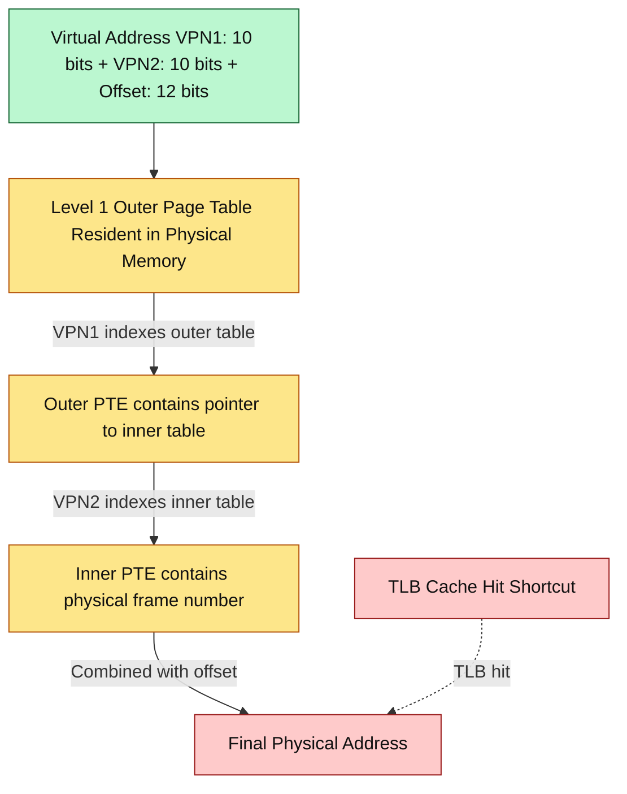
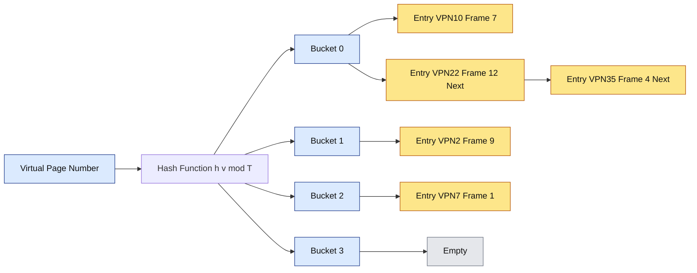
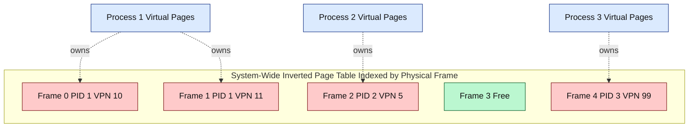
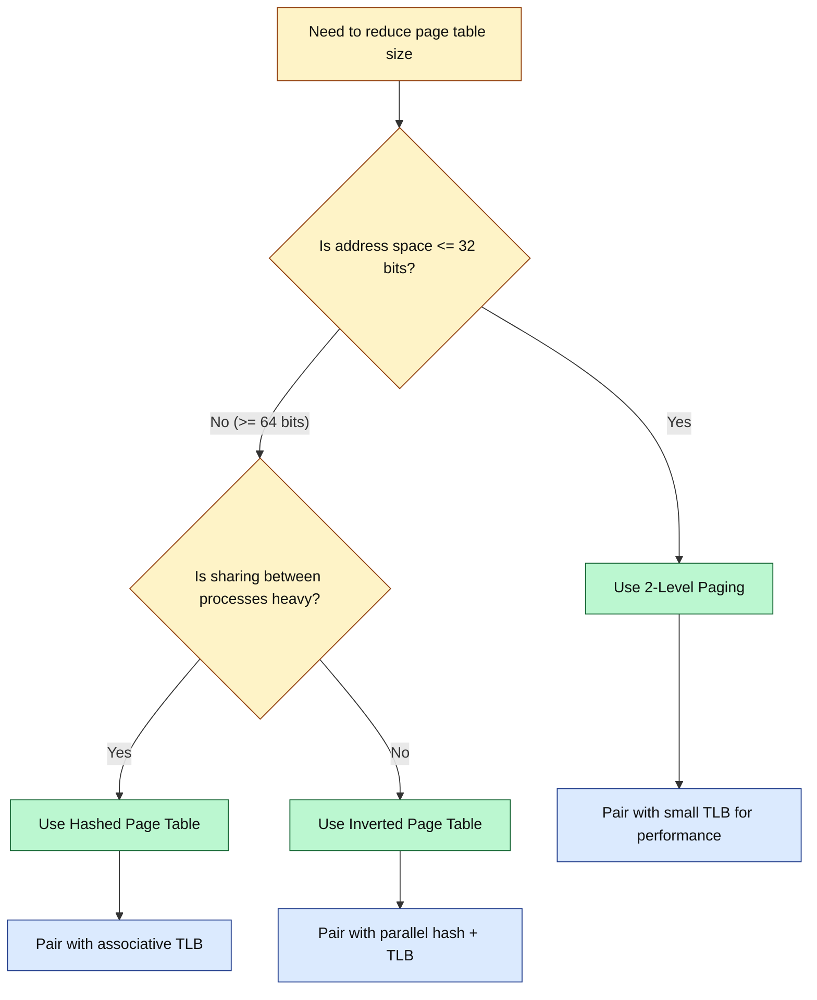
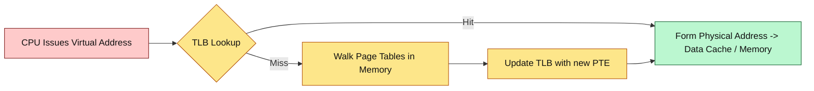

# Reducing the page table size

<!-- SECTION_1_START -->
# Reducing the Page Table Size

## 1. Core Technical Definition & Intuitive Overview

In modern computer systems, processes use a **Virtual Address Space** that is typically very large (for example, a 32-bit system provides $2^{32} = 4 \text{ GB}$, and a 64-bit system provides up to $2^{64}$ bytes). This virtual memory must be mapped to physical memory through a **Page Table**. If the page size is small (commonly **4 KB = $2^{12}$ bytes**), the page table must contain an entry for *every* page in the virtual address space, leading to an enormous structure that cannot fit in main memory efficiently.

> [!IMPORTANT]
> **Formal KTU Definition (PCCST403 / Module 3):**
> **Page Table Size Reduction** refers to a family of memory management techniques that aim to minimise the physical memory footprint of the per-process page table, while still preserving the full virtual-to-physical address translation capability demanded by demand-paged virtual memory systems.

### The Core Problem

For a system with virtual address size $= 2^N$ bytes and page size $= 2^P$ bytes, the number of page table entries is:

$$
\text{Number of Entries} = \frac{2^N}{2^P} = 2^{N-P}
$$

For a 32-bit address space with 4 KB pages: $2^{32-12} = 2^{20} = 1{,}048{,}576$ entries. If each entry is **4 bytes**, the page table occupies **4 MB** of physical memory *per process*. For 100 processes, this is **400 MB** — an unacceptable overhead.

### Intuitive Analogy (The Library Bookshelf Problem)

> [!NOTE]
> **Analogy — The University Library Index**
> Imagine a library with 1 million books. Storing a single, flat catalogue of all 1 million books at the front desk is impractical — it would fill an entire room.
> Instead, the librarian uses a **hierarchical index**:
> 1. A **floor-level index** listing only the 100 floors,
> 2. A **shelf-level index** on each floor listing only the 100 shelves on that floor,
> 3. A **book-level index** on each shelf listing the actual books.
>
> You only consult the floor index (which is tiny), then walk to the right floor and consult *just that floor's* shelf index, and so on. The total index is the same size, but the *physically loaded portion at any moment* is minuscule.
>
> **Multilevel paging works exactly like this** — only the small sub-tables that are actually referenced need to reside in physical memory.

### The Three Principal Techniques

| # | Technique | Core Idea |
|---|-----------|-----------|
| 1 | **Multilevel (Hierarchical) Paging** | Break the single linear page table into a tree of smaller sub-tables; allocate sub-tables lazily. |
| 2 | **Hashed Page Tables** | Use a hash function over the virtual page number to locate the corresponding frame in a hash table that grows with memory usage. |
| 3 | **Inverted Page Tables** | Maintain *one* system-wide table indexed by physical frames (not per-process); each entry stores the owning process-id and virtual page number. |

> [!TIP]
> **Syllabus Highlight (KTU 2024 — Module 3):** The expected depth of treatment is "Multilevel paging, Hashed page tables, Inverted page tables, and the role of the TLB." Memorise the address structure and the size-reduction formula for each.

> [!VISUALIZATION CONTROL]
> **Concept:** Linear vs. Two-Level Page Table Memory Footprint
> **GeoGebra / Desmos Input Equations (log-scale plot of entries):**
> * `f(x) = 2^(x)` for $x \in [12, 32]$ representing entries vs. page size
> * `g(x) = 2^(x/2)` representing a 2-level scheme where outer table holds $2^{P_1}$ pointers
> **Visual Description:** A solid curve $f(x)$ rising exponentially to $2^{20}$ at $x=32$, contrasted with a milder curve $g(x)$ reaching only $2^{10}$. The student should observe that the *active* (resident) portion of $g$ is what really matters — the *maximum* possible size is the same, but allocation is on-demand.

<!-- SECTION_1_END -->

<!-- SECTION_2_START -->
# Deep Theoretical Analysis & KTU High-Yield Formula Sheet

## 2.1 Multilevel (Hierarchical) Paging

A logical (linear) page number of $(N-P)$ bits is partitioned into $k$ fields, each field indexing into a different level of the page table. The **outermost table** is the only one that must always be resident in physical memory; the inner tables are allocated on demand and may be paged themselves.

### Two-Level Paging (32-bit example)

A 32-bit virtual address with 4 KB pages leaves 20 bits for the page number. Splitting this 20-bit page number into two 10-bit fields gives:

| Field | Bits | Purpose |
|-------|------|---------|
| $P_1$ | 10 | Index into the **outer page table** (resident in physical memory) |
| $P_2$ | 10 | Index into the **inner page table** (allocated on demand) |
| $d$ | 12 | Page offset within the 4 KB frame |

Address translation performs **two memory accesses** for the page table lookup, then **one** to fetch the actual data (a total of three accesses; the TLB reduces this to one in practice).

> [!NOTE]
> **Why split into equal fields?**
> KTU most often tests the case where the page number is split *uniformly*. For a 32-bit VA with 4 KB pages and a 2-level scheme, the split is **$P_1 = 10$, $P_2 = 10$, $d = 12$**. For a 3-level scheme it becomes **$P_1 = 8, P_2 = 6, P_2 = 6, d = 12$** (or similar) — always ensure $P_1 + P_2 + \dots + d = N$.

### Three-Level and Four-Level Paging

For 64-bit systems (e.g., x86-64 with 48-bit virtual addresses), even two-level paging is insufficient. Linux/x86-64 uses a **4-level paging hierarchy**: PGD → PUD → PMD → PTE, where each level is a separate page-sized table (512 entries × 8 bytes = 4 KB).

## 2.2 Hashed Page Tables

A common approach for address spaces larger than 32 bits. The virtual page number is **hashed** into a hash table. Each bucket contains a **linked list** of entries that have hashed to the same value. Each entry stores:

* The virtual page number (for collision verification)
* The mapped physical frame number
* A pointer to the next entry in the chain

$$
h(v) = (v \bmod T)
$$

where $v$ is the virtual page number and $T$ is the number of buckets. The full virtual address is `v | d`.

## 2.3 Inverted Page Tables

A radical redesign: instead of one page table per process, the system maintains a **single inverted page table** that has one entry **per physical frame** in real memory.

* Each entry contains: $\langle \text{pid}, \text{virtual page number}, \text{control bits} \rangle$
* A lookup walks (or hashes through) the table searching for a match $\langle \text{pid}, \text{vpn} \rangle$.
* Size of the table is **fixed = number of physical frames**, *independent* of the virtual address space size.
* Used in practice by IBM Power, HP PA-RISC, and (partially) early Intel Itanium.

> [!WARNING]
> **Inverted Page Tables complicate memory sharing.**
> Because each physical frame has only *one* mapping, sharing a frame between two processes (e.g., shared libraries) requires extra logic — often an extra chain of pointers in each entry, or an auxiliary shared-page table.

## 2.4 The Role of the TLB

The Translation Lookaside Buffer is a small, fully-associative, hardware cache of recently used page-table entries. It is the **complementary** technique to all of the above: the page table may be large and even partially on disk, but the TLB ensures that *most* translations complete in a single cycle.

$$
\text{Effective Access Time (EAT)} = h \cdot (T_{mem} + T_{TLB}) + (1-h) \cdot (T_{TLB} + T_{mem}) = T_{TLB} + T_{mem}
$$

where $h$ is the TLB hit ratio. Even with a 99% hit ratio, EAT is dominated by the single memory access.

## KTU High-Yield Formula Sheet

| # | Concept | Formula / Rule | Unit / Notes |
|---|---------|----------------|--------------|
| 1 | Page table entries (linear) | $E = 2^{N-P}$ | entries per process |
| 2 | Page table size (linear) | $S = E \times \text{sizeof(PTE)}$ | bytes per process |
| 3 | Address split in 2-level | $P_1 + P_2 + d = N$, with $P_1 = P_2$ commonly | bits |
| 4 | Outer page table size (2-level) | $S_{outer} = 2^{P_1} \times \text{sizeof(PTE)}$ | bytes (always resident) |
| 5 | Number of memory references per access | 2-level $= 3$, 3-level $= 4$ | *excluding* TLB |
| 6 | Hash table bucket index | $h(v) = (v \bmod T)$ | $T$ = number of buckets |
| 7 | Inverted table size | $S_{inv} = F \times \text{sizeof(IPT\_entry)}$ | $F$ = number of physical frames |
| 8 | EAT with TLB | $\text{EAT} = h \cdot T_{hit} + (1-h) \cdot T_{miss}$ | typical $T_{TLB} = 20$ ns, $T_{mem} = 100$ ns |
| 9 | Hit ratio to keep EAT small | Solve $\text{EAT} \le \alpha \cdot T_{mem}$ for $h$ | derive from the EAT equation |

> [!IMPORTANT]
> **Real-World Utility**
> * **Linux/x86-64** uses a 4-level hierarchical page table because 48-bit virtual addresses would otherwise require a $2^{36}$-entry outer table.
> * **IBM AIX on PowerPC** uses a *hashed* page table managed by the hardware itself, allowing 64-bit address spaces with bounded memory use.
> * **IBM System/38 and AS/400** popularised the *inverted* page table design that survives in Power and z/Architecture systems.

<!-- SECTION_2_END -->

<!-- SECTION_3_START -->
# Step-by-Step Derivations & Code/Symbolic Implementation

## 3.1 Derivation: Page-Table Size Reduction Factor in 2-Level Paging

**Given:**
* Virtual address space: $2^N$ bytes
* Page size: $2^P$ bytes
* Outer-page index bits: $P_1$
* Inner-page index bits: $P_2 = (N - P) - P_1$
* Size of one PTE: $s$ bytes

**Required:** Show how much *resident* memory 2-level paging consumes compared to a single-level table.

**Step 1 — Single-level (linear) page table size:**

$$
S_{1} = 2^{N-P} \cdot s \quad \text{(bytes)}
$$

**Step 2 — Outer (Level-1) page table size, always resident:**

$$
S_{L1} = 2^{P_1} \cdot s \quad \text{(bytes)}
$$

**Step 3 — Maximum possible inner-table size, *if all inner tables were resident*:**

$$
S_{inner,\max} = 2^{P_1} \cdot \left( 2^{P_2} \cdot s \right) = 2^{N-P} \cdot s
$$

So the *worst-case* total size is identical to the single-level table — the saving is that inner tables are allocated **only on demand**.

**Step 4 — Reduction factor (best case, all inner tables absent):**

$$
\text{Reduction Factor} = \frac{S_{L1}}{S_{1}} = \frac{2^{P_1}}{2^{N-P}} = 2^{P_1 - (N-P)}
$$

**Step 5 — Worked numerical example (32-bit, 4 KB pages, 2-level):**

Given $N=32$, $P=12$, $P_1 = 10$, $P_2 = 10$, $s = 4$ bytes.

$$
S_{1} = 2^{20} \cdot 4 = 4 \text{ MB}
$$

$$
S_{L1} = 2^{10} \cdot 4 = 4 \text{ KB} \quad \text{(always resident)}
$$

$$
\text{Reduction Factor} = \frac{4 \text{ KB}}{4 \text{ MB}} = \frac{1}{1024}
$$

The *resident* memory is reduced by a factor of **1024**. The cost is **one extra memory access** per translation.

## 3.2 Derivation: Effective Access Time with Multi-Level Paging and TLB

**Given:**
* $T_m = 100$ ns (memory access)
* $T_{tlb} = 20$ ns (TLB access)
* Hit ratio $h = 0.98$, *two-level* paging
* TLB miss with 2-level paging: $2 \times T_m + T_{tlb}$ for the table walk, then $T_m$ for data

**Step 1 — TLB hit path:**

$$
T_{hit} = T_{tlb} + T_m = 20 + 100 = 120 \text{ ns}
$$

**Step 2 — TLB miss path (2-level paging):**

$$
T_{miss} = T_{tlb} + 2 \cdot T_m + T_m = 20 + 200 + 100 = 320 \text{ ns}
$$

**Step 3 — Effective Access Time:**

$$
\text{EAT} = h \cdot T_{hit} + (1-h) \cdot T_{miss}
$$

$$
\text{EAT} = 0.98 \cdot 120 + 0.02 \cdot 320
$$

$$
\text{EAT} = 117.6 + 6.4 = 124 \text{ ns}
$$

**Step 4 — Compare to no-paging ideal (100 ns):**

$$
\text{Overhead} = \frac{124 - 100}{100} \times 100\% = 24\%
$$

Even with a 98% TLB hit ratio, a 2-level scheme adds 24% overhead; with 3-level paging, the cost would be higher unless the hit ratio is closer to 99.9%.

## 3.3 Derivation: Hash Bucket Sizing for Hashed Page Tables

**Given:** 64-bit virtual address, page size 8 KB, expected number of mappings $M$.

**Step 1 — Compute the virtual page number size:**

$$
P = \log_2(8 \text{ KB}) = 13
$$

$$
\text{VPN bits} = 64 - 13 = 51
$$

**Step 2 — Choose bucket count $T$ as a power of 2, slightly larger than $M$:**

A good rule of thumb: $T \approx 1.25 \times M$ to keep the load factor below 0.8.

**Step 3 — Compute average chain length:**

$$
L = \frac{M}{T} \approx 0.8
$$

**Step 4 — Hash function (division method):**

$$
h(\text{vpn}) = \text{vpn} \bmod T
$$

**Step 5 — Worst-case search cost:**

$$
T_{search} = T_{TLB} + L \cdot T_m = 20 + 0.8 \cdot 100 = 100 \text{ ns}
$$

## 3.4 Python Implementation: Inverted Page Table Lookup

```python
"""
Inverted Page Table (IPT) simulator.
One global table indexed by physical frame number.
Each entry stores: (pid, vpn, valid, dirty, referenced).
"""
from dataclasses import dataclass
from typing import Optional, Tuple


@dataclass
class IPTEntry:
    pid: int = -1
    vpn: int = -1
    valid: bool = False
    dirty: bool = False
    referenced: bool = False


class InvertedPageTable:
    def __init__(self, num_frames: int) -> None:
        if num_frames <= 0:
            raise ValueError("num_frames must be > 0")
        self.table: list[IPTEntry] = [IPTEntry() for _ in range(num_frames)]
        self.num_frames = num_frames
        self.hits = 0
        self.misses = 0

    def insert(self, pid: int, vpn: int, frame: int) -> None:
        if not (0 <= frame < self.num_frames):
            raise IndexError(f"frame {frame} out of range [0, {self.num_frames})")
        self.table[frame] = IPTEntry(pid=pid, vpn=vpn, valid=True)

    def translate(self, pid: int, vpn: int) -> Optional[int]:
        for frame, entry in enumerate(self.table):
            if entry.valid and entry.pid == pid and entry.vpn == vpn:
                self.hits += 1
                return frame
        self.misses += 1
        return None

    def evict(self, frame: int) -> None:
        if not (0 <= frame < self.num_frames):
            raise IndexError(f"frame {frame} out of range")
        self.table[frame] = IPTEntry()

    def stats(self) -> Tuple[int, int]:
        return self.hits, self.misses


if __name__ == "__main__":
    ipt = InvertedPageTable(num_frames=4)
    ipt.insert(pid=1, vpn=10, frame=0)
    ipt.insert(pid=1, vpn=11, frame=1)
    ipt.insert(pid=2, vpn=5, frame=2)

    # Successful translations
    assert ipt.translate(pid=1, vpn=10) == 0
    assert ipt.translate(pid=2, vpn=5) == 2

    # Miss: process 1 does not own vpn 5
    assert ipt.translate(pid=1, vpn=5) is None

    # Eviction and reuse
    ipt.evict(frame=0)
    ipt.insert(pid=3, vpn=99, frame=0)
    assert ipt.translate(pid=3, vpn=99) == 0

    h, m = ipt.stats()
    print(f"Hits: {h}, Misses: {m}")
```

> [!NOTE]
> The above implementation performs a **linear scan** of the table — $O(F)$ per lookup. Production systems accelerate this with a parallel hash table that maps $\langle pid, vpn \rangle$ to a frame number, achieving $O(1)$ average lookup.

<!-- SECTION_3_END -->

<!-- SECTION_4_START -->
# Structural Diagrams & Schematics

## 4.1 Two-Level Paging — Address Translation Flow



## 4.2 Hashed Page Table — Collision Chain Lookup



## 4.3 Inverted Page Table — System-Wide Frame Mapping



## 4.4 Comparative Block Topology — When to Use What



## 4.5 Memory Hierarchy Interaction (Page Table Walking with TLB)



<!-- SECTION_4_END -->

<!-- SECTION_5_START -->
# KTU 2024 Scheme Examination Question Bank & Topic Recap

## Part A — Short Answer Questions (3 Marks Each)

### Q1. `[KTU University Exam - July 2024]` CO1 / Remember

> **Why is a single-level page table infeasible for modern 64-bit systems?**

**Model Answer (3 marks):**
A single-level page table for a 64-bit virtual address space with 4 KB pages would require $2^{64-12} = 2^{52}$ entries. Even with a compact 8-byte PTE, the table size would be $2^{55}$ bytes $\approx$ 32 PB. **[1 Mark]** This cannot fit in physical memory, cannot be allocated contiguously, and the vast majority of pages are never used. **[1 Mark]** Therefore, hierarchical schemes (multi-level, hashed, or inverted page tables) are used to reduce the resident memory footprint. **[1 Mark]**

### Q2. `[KTU University Exam - Dec 2023]` CO1 / Understand

> **List and briefly explain any three techniques used to reduce the page table size.**

**Model Answer (3 marks):**

1. **Multilevel Paging** — Splits the page number into multiple fields, each indexing a separate sub-table; only the sub-tables actually referenced are kept in memory. **[1 Mark]**
2. **Hashed Page Tables** — Hashes the virtual page number into a hash table; each bucket is a chain of (vpn, frame) pairs, growing only with used memory. **[1 Mark]**
3. **Inverted Page Tables** — Maintains one system-wide table indexed by *physical frames*; each entry stores the owning process-id and virtual page number, decoupling table size from virtual address space. **[1 Mark]**

---

## Part B — Long Answer Questions (14 Marks Each, Internal Choice)

### Question A — Multilevel Paging Derivation

`[KTU University Exam - July 2024]` — **CO2 / Apply**

> Consider a system with a 32-bit virtual address, a page size of 4 KB, and a 2-level paging scheme in which the outer page number occupies 10 bits.
>
> **(a)** Calculate the size of the outer page table and the maximum size of each inner page table. **[7 Marks]**
> **(b)** How many memory accesses are required to translate a virtual address in this scheme, with and without a TLB hit? Comment on the performance impact. **[7 Marks]**

#### Model Solution

**Part (a) — Page Table Sizes**

Given: $N = 32$, $P = 12$, $P_1 = 10$, therefore $P_2 = 32 - 12 - 10 = 10$.

*Number of entries in outer table:*

$$
E_{L1} = 2^{P_1} = 2^{10} = 1024 \text{ entries}
$$

*Outer table size (with 4-byte PTEs):*

$$
S_{L1} = 1024 \times 4 = 4096 \text{ bytes} = 4 \text{ KB}
$$

*Maximum entries per inner table:*

$$
E_{L2} = 2^{P_2} = 2^{10} = 1024 \text{ entries}
$$

*Maximum size of one inner table:*

$$
S_{L2,\max} = 1024 \times 4 = 4 \text{ KB}
$$

**Valuation Key:**

* [Stating $P_2 = 10$ from total bit budget: **2 Marks**]
* [Computing $S_{L1} = 4 \text{ KB}$: **2 Marks**]
* [Computing $S_{L2,\max} = 4 \text{ KB}$ and stating that inner tables are allocated on demand: **3 Marks**]

**Part (b) — Memory Accesses and Performance**

*Without TLB (TLB miss path):*

A virtual address translation in 2-level paging requires **two memory accesses** — one for the outer table and one for the inner table. Including the actual data fetch, a TLB miss costs **three** memory references in total.

$$
T_{miss} = 2 \cdot T_m + T_m = 3 \cdot T_m
$$

*With TLB (TLB hit path):*

A TLB hit costs **one** extra TLB access plus the data fetch.

$$
T_{hit} = T_{TLB} + T_m \approx T_m \text{ (since } T_{TLB} \ll T_m\text{)}
$$

*Performance impact:*

Assuming a 98% TLB hit ratio and $T_{TLB} = 20$ ns, $T_m = 100$ ns:

$$
\text{EAT} = 0.98 \cdot 120 + 0.02 \cdot 320 = 124 \text{ ns}
$$

This is **24% slower** than a non-paged system (100 ns). A higher hit ratio (e.g., 99.9%) drops the EAT to 120.4 ns (≈ 20% slower). The TLB is therefore essential to make multi-level paging viable.

**Valuation Key:**

* [Identifying 3 memory accesses on TLB miss: **2 Marks**]
* [Identifying 2 memory accesses on TLB hit: **2 Marks**]
* [EAT calculation and percentage overhead: **3 Marks**]

---

### Question B — Inverted Page Table

`[KTU University Exam - Dec 2023]` — **CO2 / Understand & Apply**

> A computer system uses an inverted page table. The physical memory has 256 MB and the page size is 4 KB. Each IPT entry occupies 16 bytes.
>
> **(a)** Compute the size of the inverted page table and the maximum number of processes that can be supported, assuming each process can use the entire physical memory. **[7 Marks]**
> **(b)** Compare the inverted page table with the two-level page table in terms of: (i) memory consumed, (ii) address translation time, (iii) memory sharing between processes. **[7 Marks]**

#### Model Solution

**Part (a) — IPT Size**

*Number of physical frames:*

$$
F = \frac{256 \text{ MB}}{4 \text{ KB}} = \frac{2^{28}}{2^{12}} = 2^{16} = 65{,}536 \text{ frames}
$$

*Size of inverted page table:*

$$
S_{IPT} = 65{,}536 \times 16 \text{ bytes} = 1{,}048{,}576 \text{ bytes} = 1 \text{ MB}
$$

*Maximum processes supported (worst case, each process using entire memory):*

Because the system has only $2^{16}$ frames and each frame holds one 4 KB page, the absolute upper bound is the number of frames itself if we ignore pid uniqueness — but practically, with a fresh pid per process, the system can run as many processes as the OS scheduler allows, *up to the limit of available frames*. Therefore:

$$
\text{Max concurrent processes} = 1 \text{ (full memory)}; \text{ otherwise bounded by } 2^{16} \text{ pages}
$$

More realistically, the IPT is not the bottleneck — the OS scheduler and physical memory are. So a clean answer is: **the IPT can support any number of processes, limited only by the size of the physical memory and the OS design, with a maximum of $2^{16}$ distinct pages mapped at any moment.** **[3 Marks]**

*Statement of fixed size independent of virtual address space:* **[1 Mark]**
*IPT size = 1 MB:* **[1 Mark]**

**Part (b) — Comparative Analysis**

| Criterion | Inverted Page Table | Two-Level Page Table |
|-----------|--------------------|---------------------|
| **Memory consumed** | Fixed: $F \times s$ bytes, independent of VA size. **[1 Mark]** | Grows with VA size: outer table $= 2^{P_1} \times s$ bytes (always resident); inner tables on demand. **[1 Mark]** |
| **Address translation time** | Slow — must search the table for a matching $\langle pid, vpn \rangle$ pair; mitigated by a parallel hash index. **[2 Marks]** | Faster — at most 2 sequential memory accesses to walk the tree; very fast with TLB. **[1 Mark]** |
| **Memory sharing** | Difficult — each physical frame can map to only one $\langle pid, vpn \rangle$ pair; shared pages require auxiliary structures. **[1 Mark]** | Easier — each process has its own page table, so the same physical frame can be mapped in multiple tables. **[1 Mark]** |

**Valuation Key:**

* [Tabular comparison with at least 2 distinct criteria well discussed: **4 Marks**]
* [Explicit mention of TLB / hash accelerator: **2 Marks**]
* [Final conclusion / trade-off statement: **1 Mark**]

> [!WARNING]
> **KTU Examiner's Valuation Warning — Common Pitfalls**
> 1. **Bit-budget arithmetic:** Forgetting that $P_1 + P_2 + d$ *must* sum to the total address width $N$. A frequent mistake is to set $P_1 = 10$ and $P_2 = 12$ for a 32-bit / 4 KB system, giving an inconsistent total of 34 bits.
> 2. **Resident vs. maximum size:** Examiners expect the *resident* (always-loaded) size in 2-level paging — i.e., the **outer** table only — *not* the worst-case total.
> 3. **Inverted page table indexing:** Confusing the direction of mapping. The IPT is indexed by **physical frame**, not virtual page. Marks are deducted for saying "indexed by VPN".
> 4. **TLB interaction:** Failing to mention the TLB when discussing translation time. KTU almost always awards an extra mark for explicitly noting the TLB's role.
> 5. **Sharing limitation of IPT:** Examiners look for the keyword "auxiliary structures" or "extra pointer chain" — vague answers like "sharing is hard" get partial credit only.

---

## Topic Recap & Important Things to Remember

* The **single-level page table** scales poorly: $2^{N-P}$ entries grow exponentially with virtual address size, making it infeasible for 64-bit systems.
* **Multilevel (hierarchical) paging** partitions the virtual page number into $k$ fields; only the outermost table must always be resident. The saving is *resident memory*, not *maximum* memory.
* A **two-level paging** translation for a 32-bit / 4 KB system uses $P_1 = 10$, $P_2 = 10$, $d = 12$ bits — a classic KTU numerical.
* **Hashed page tables** are used for very large (≥ 64-bit) address spaces; they use a hash function plus linked-list chains for collision resolution.
* **Inverted page tables** store one entry per *physical frame*; their size is **independent** of the virtual address space, fixed at $F \times s$ bytes.
* The **TLB** is the universal performance enhancer: it caches recent translations and reduces multi-level paging's effective memory-access count from $k+1$ to 1 on a hit.
* **EAT** for a hierarchical scheme is: $\text{EAT} = h \cdot (T_{TLB} + T_m) + (1-h) \cdot (T_{TLB} + k \cdot T_m + T_m)$ for a $k$-level scheme.
* **Trade-offs to remember:**
  * More levels ⇒ smaller resident tables but more accesses per TLB miss.
  * Inverted tables are compact but slow to search; pairing with a parallel hash is standard.
  * Hashed tables handle sparse, large address spaces well but have variable lookup cost.
  * Sharing is hardest with inverted tables, easiest with per-process hierarchical tables.
* **Memory sizes to internalise:** A 32-bit / 4 KB single-level page table = **4 MB**; its 2-level *outer* table = **4 KB** (a 1024× reduction).
* **Linux/x86-64 reality check:** 48-bit virtual address, 4 KB pages, 4-level hierarchy (PGD → PUD → PMD → PTE), each level 4 KB.
* **IBM heritage:** Inverted page tables originated in IBM System/38 and persist in Power and z/Architecture.
* **Examiner-favourite keywords:** "on-demand allocation", "always resident outer table", "TLB hit ratio", "fixed system-wide table", "$\langle pid, vpn \rangle$ tuple".

<!-- SECTION_5_END -->
