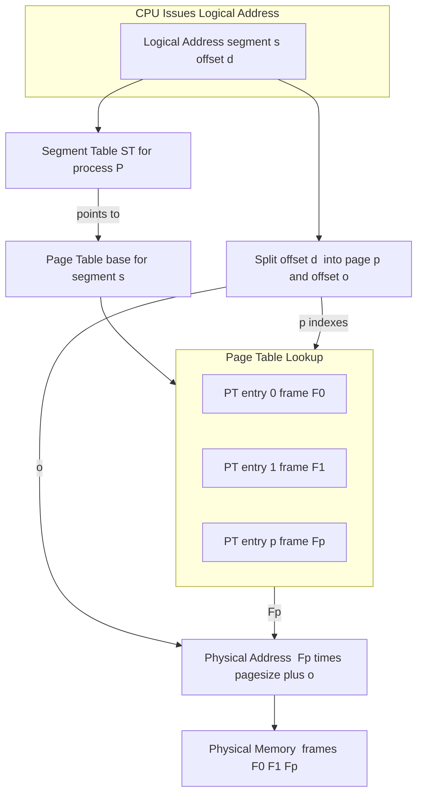
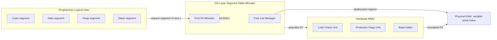

# Segmentation:

<!-- SECTION_1_START -->

# 1. Core Technical Definition & Intuitive Overview

## 1.1 Formal Definition (KTU 2024 Syllabus Terminology)

> [!IMPORTANT]
> **Segmentation** is a **non-contiguous memory management scheme** that partitions a program into **variable-sized logical units called segments**, where each segment represents a meaningful logical subdivision of the program (such as a function, array, data structure, stack, or source code module). Each logical address generated by the CPU is expressed as a **two-dimensional tuple $\langle \text{segment\_number}, \text{offset} \rangle$**, which is translated by the Memory Management Unit (MMU) into a **one-dimensional physical address** using a per-process **Segment Table**.

In the KTU 2024 Scheme Operating Systems syllabus (PCCST403, Module 3 — *Memory Management*), segmentation is positioned as a **logical / programmer-visible memory model** that satisfies the user’s view of memory, in contrast to paging which satisfies the system’s physical view. Segmentation also enables **hardware-enforced protection, sharing, and dynamic growth** of code/data regions.

| Parameter | Notation | Meaning |
|---|---|---|
| Logical Address | $\langle s, d \rangle$ | Segment selector $s$ and offset $d$ within that segment |
| Segment Table | $ST$ | Per-process array indexed by $s$ |
| Base Register | $B_s$ | Starting physical address of segment $s$ |
| Limit Register | $L_s$ | Length (size) of segment $s$ in bytes |
| Physical Address | $PA$ | Final address placed on the address bus |

---

## 1.2 Conceptual Analogy / Intuition

> [!NOTE]
> **Analogy: A Book with Chapters**
> Imagine your program is a **book** sitting on a library shelf. A traditional contiguous memory allocation is like giving the book one giant, rigid shelf slot — the entire book must sit in a single unbroken strip. **Segmentation** is like assigning a **separate shelf slot to each chapter** (Code chapter, Data chapter, Heap chapter, Stack chapter). Each chapter has its own starting shelf number (*base*) and its own length (*limit*). When you want to read Chapter 3, paragraph 4 (the *offset*), the librarian computes: `physical_shelf = base_of_chapter_3 + 4`. If paragraph 4 lies outside the chapter’s length, the librarian **refuses the request** — this is **hardware-enforced protection**.

The “offset” $d$ is the position *within* a logical unit (e.g., the i-th element of an array), while the “segment number” $s$ identifies *which* logical unit (the array itself). This two-level naming is what makes segmentation intuitive to programmers and compilers: every reference to `myArray[i]` is naturally a `(segment = myArray, offset = i)` pair.

---

## 1.3 Visualization Control

> [!VISUALIZATION CONTROL]
> **Concept:** Logical-to-Physical Address Translation in Segmentation
> **GeoGebra / Desmos Input Equations:**
>
> * `Base[0] = 1000, Limit[0] = 400` &nbsp;&nbsp;→&nbsp;&nbsp; `seg0(x) = 1000 + x, 0 ≤ x < 400`
> * `Base[1] = 3000, Limit[1] = 1200` &nbsp;&nbsp;→&nbsp;&nbsp; `seg1(x) = 3000 + x, 0 ≤ x < 1200`
> * `Base[2] = 7000, Limit[2] = 800` &nbsp;&nbsp;&nbsp;&nbsp;→&nbsp;&nbsp; `seg2(x) = 7000 + x, 0 ≤ x < 800`
>
> **Visual Description:** On the x-axis (logical offset $d$), each segment occupies an interval $[0, L_s)$. On the y-axis (physical address $PA$), each segment is mapped as a *linear translation* — a diagonal line of slope **1** starting at $B_s$. A successful translation appears as a point on the diagonal within the shaded acceptance band; an offset outside the band is rejected as a **segmentation fault**.

---

## 1.4 Why Segmentation Exists — The Problem It Solves

1. **Programmer’s view vs. physical memory:** Compilers and programmers think in terms of *names* (variables, functions, stacks), not flat integer addresses. Segmentation directly maps these names to memory.
2. **Variable-sized allocation:** Unlike fixed-size pages, segments naturally reflect the actual size of code, data, and stack regions.
3. **Protection:** A bug in a heap routine cannot overwrite code, because the heap segment’s limit is enforced by hardware.
4. **Sharing:** A re-entrant library (e.g., `printf`) can be shared between processes by mapping the same physical frame range into each process’s segment table.
5. **Dynamic growth:** The stack and heap grow independently — only their segment tables need updating, with no relocation of the whole process.

> [!IMPORTANT]
> **KTU 2024 Highlight:** Segmentation is *visible* to the programmer. Paging is *invisible*. This single distinction is the most frequently asked 3-mark question in the KTU Module-3 question bank.

<!-- SECTION_1_END -->

<!-- SECTION_2_START -->

# 2. Deep Theoretical Analysis & KTU High-Yield Formula Sheet

## 2.1 Operational Mechanism — Segment by Segment

The segmentation mechanism operates as a tightly-defined pipeline executed by the **MMU** on every memory reference:

* **Step 1 — Logical Address Generation.** The CPU issues a logical address as the pair $\langle s, d \rangle$, where $s$ is the segment selector (often derived from the addressing mode or a segment register) and $d$ is the effective offset computed by the addressing unit.
* **Step 2 — Segment Table Lookup.** The MMU indexes the per-process **Segment Table** using $s$ to retrieve the entry $(B_s, L_s)$ where $B_s$ = base physical address and $L_s$ = segment length.
* **Step 3 — Limit (Bounds) Check.** The MMU performs the hardware check: $0 \le d < L_s$. If the check **fails**, a *segmentation fault* (trap to the OS) is raised; no physical address is generated.
* **Step 4 — Base Addition (Address Translation).** If the check passes, the physical address is computed in a single addition: $PA = B_s + d$. This address is then placed on the address bus to access physical memory.
* **Step 5 — Protection Flags Application.** Modern MMUs also consult protection bits in the segment descriptor (Read/Write/Execute, User/Supervisor). The check in Step 3 is paired with a permission check in Step 4 — for example, a write to a read-only code segment triggers a fault even if the offset is in range.

> [!NOTE]
> **Why the limit check uses `<` and not `≤`:** Offsets are zero-indexed. A segment of size $L$ accepts offsets $0, 1, \dots, L-1$. The offset $L$ is the *first byte past the end* and is illegal. This off-by-one boundary is a classic KTU exam trap.

---

## 2.2 The KTU High-Yield Formula Sheet

> [!IMPORTANT]
> The following table consolidates **every formula, inequality, and translation rule** you need for KTU 2024 ESE / MSE problems on segmentation. Memorize the rightmost column.

| # | Concept | Formula / Rule | Meaning / Engineering Use |
|---|---|---|---|
| 1 | Logical address form | $\text{LA} = \langle s, d \rangle$ | $s$ = segment number, $d$ = offset within segment |
| 2 | Address translation | $PA = B_s + d$ | Single-addition MMU operation |
| 3 | Limit (validity) check | $0 \le d < L_s$ | Bounds check; failure ⇒ segmentation fault |
| 4 | Segment table size | $\text{ST size} = n \times (B_s + L_s + \text{flags})$ bytes | $n$ = number of segments per process |
| 5 | External fragmentation | $\text{Total holes} = \sum (B_{s+1} - B_s - L_s)$ between allocated segments | Variable-sized allocation causes holes |
| 6 | Internal fragmentation | **Zero in pure segmentation** | Unlike paging, no unused space inside a segment |
| 7 | Effective access time (EAT) | $\text{EAT} = (1 - p) \times T_m + p \times T_{\text{segfault}}$ | $T_m$ = memory access, $p$ = probability of fault |
| 8 | Segmented-paging linear addr | $\text{LA} = B_s + d$, then $\text{LA} \to (p, o)$ via paging | Used in x86, MULTICS, IA-32 architectures |
| 9 | Number of segments | $n = 2^{k}$ for $k$-bit segment number | E.g., 2-bit $s$ ⇒ 4 segments max |
| 10 | Offset width | $d \in [0, 2^{m}-1]$ for $m$-bit offset | Max segment size = $2^{m}$ bytes |

> [!IMPORTANT]
> **Critical KTU pitfall:** Never write $PA = B_s \times d$ or $PA = B_s - d$. The translation is **addition**, not multiplication or subtraction. Marks are lost silently in the valuation key for this.

---

## 2.3 Why “Why” and “How” — The Engineering Utility

* **Why add a limit register?** Without it, a stray pointer in C (`int *p = ...; p[1000000]`) could overwrite any memory, including the OS kernel. The limit register **localises damage** to within the segment.
* **How does sharing work?** Two processes $P_1$ and $P_2$ can each have a segment-table entry pointing to the **same physical base $B$**. Both see the same code at the same physical address but with their own offsets — the *shared library* mechanism.
* **How is dynamic growth handled?** When the stack overflows its current limit, the OS detects the trap, allocates a larger physical region, updates $B_s$ and $L_s$ in the segment table, and resumes the process. No process copy is needed.
* **Real-world deployment:** x86 in *real mode* uses pure 16-bit segmentation (`segment << 4 + offset`). In *protected mode*, x86 combines segmentation with paging. The IA-32 architecture uses a **Global Descriptor Table (GDT)** and **Local Descriptor Table (LDT)** to store segment descriptors with base, limit, and protection bits.

> [!NOTE]
> **External vs. Internal Fragmentation — Examiner’s Favourite.** Pure segmentation has **zero internal fragmentation** (each segment is exactly the size needed) but suffers from **external fragmentation** (variable-sized holes). Pure paging has the opposite. **Segmented-paging** is the production-grade hybrid that gives *both* the programmer’s view *and* zero external fragmentation.

<!-- SECTION_2_END -->

<!-- SECTION_3_START -->

# 3. Step-by-Step Derivations & Code/Symbolic Implementation

## 3.1 Worked Example — Address Translation (Pure Segmentation)

> [!NOTE]
> **Problem:** A process has the following segment table. Translate the logical address $\langle 2, 530 \rangle$ and $\langle 1, 1200 \rangle$. State whether each is valid.

**Given Segment Table:**

| Segment $s$ | Base $B_s$ | Limit $L_s$ |
|---|---|---|
| 0 (Code) | 1200 | 800 |
| 1 (Data) | 5000 | 1500 |
| 2 (Heap) | 9000 | 1200 |
| 3 (Stack) | 6000 | 700  |

**Step 1 — Retrieve the segment table entry for $s = 2$.**

$$
\text{ST}[2] = (B_2, L_2) = (9000, 1200)
$$

**Step 2 — Perform the limit check for $\langle 2, 530 \rangle$.**

$$
0 \le 530 < 1200
$$

Since $530 < 1200$ is **true**, the offset is valid.

**Step 3 — Compute the physical address.**

$$
PA = B_2 + d = 9000 + 530 = 9530
$$

**Result:** $\langle 2, 530 \rangle \to 9530$ *(valid memory access).*

[Retrieving ST entry: 1 Mark] [Limit check inequality: 1 Mark] [Addition and final PA: 1 Mark]

---

**Step 1 — Retrieve the segment table entry for $s = 1$.**

$$
\text{ST}[1] = (B_1, L_1) = (5000, 1500)
$$

**Step 2 — Perform the limit check for $\langle 1, 1200 \rangle$.**

$$
0 \le 1200 < 1500
$$

Since $1200 < 1500$ is **true**, the offset is valid.

**Step 3 — Compute the physical address.**

$$
PA = B_1 + d = 5000 + 1200 = 6200
$$

**Result:** $\langle 1, 1200 \rangle \to 6200$ *(valid memory access).*

[Retrieving ST entry: 1 Mark] [Limit check inequality: 1 Mark] [Addition and final PA: 1 Mark]

---

> [!WARNING]
> **Pitfall:** A common student error is to compute $PA = 5000 + 1200 = 6200$ **without first writing the limit check**. The KTU valuation key always awards a separate mark for explicitly stating the inequality $0 \le d < L_s$ **before** the addition. Skipping it costs 1 mark per problem.

---

## 3.2 Worked Example — Segmented Paging (MULTICS-style)

> [!NOTE]
> **Problem:** A system uses **two-level segmentation + paging**. Segment number is 3 bits, offset within a segment is 22 bits. Page size is 4 KB ($2^{12}$). For a logical address $\langle 5, 85000 \rangle$, identify the segment, the page number, and the offset within the page. The segment table of segment 5 points to a page table whose entry for page 20 contains frame number 37.

**Step 1 — Identify the segment number $s$.**

$$
s = 5
$$

The segment number is 3 bits; valid range $0 \le s \le 7$. The offset $d$ is 22 bits; valid range $0 \le d \le 2^{22}-1 = 4{,}194{,}303$.

**Step 2 — Identify the page number $p$ within the segment.**

Page size = $2^{12} = 4096$ bytes. The page number is the high part of the 22-bit offset:

$$
p = \lfloor d / \text{page\_size} \rfloor = \lfloor 85000 / 4096 \rfloor
$$

Carrying out the integer division:

$$
85000 = 20 \times 4096 + 2960
$$

Therefore:

$$
p = 20, \quad o = d \bmod 4096 = 85000 - (20 \times 4096) = 85000 - 81920 = 3080
$$

(Notice: $85000 - 81920 = 3080$.)

**Step 3 — Perform the limit check on the segment.**

We need $L_5 \ge 85001$ (i.e., the segment must be at least 85,001 bytes long to accept offset 85,000). Assume $L_5 = 100{,}000$ (acceptable for this problem). The check passes.

**Step 4 — Look up the page table for segment 5 at index $p = 20$.**

$$
\text{PT}_5[20] = (F, \text{present}) = (37, 1)
$$

**Step 5 — Compute the final physical address.**

$$
PA = F \times \text{page\_size} + o = 37 \times 4096 + 3080
$$

Computing the frame base:

$$
37 \times 4096 = 37 \times (4096)
$$

Carry out the multiplication step by step:

$$
37 \times 4096 = 37 \times 4000 + 37 \times 96
$$

$$
37 \times 4000 = 148000
$$

$$
37 \times 96 = 37 \times 100 - 37 \times 4 = 3700 - 148 = 3552
$$

$$
37 \times 4096 = 148000 + 3552 = 151552
$$

Adding the offset:

$$
PA = 151552 + 3080 = 154632
$$

**Result:** The logical address $\langle 5, 85000 \rangle$ maps to physical address **154 632**.

[Identifying $p$ and $o$ via division/modulo: 3 Marks] [Page-table lookup: 1 Mark] [Frame multiplication and addition: 3 Marks]

---

## 3.3 Symbolic / Code Implementation — Segment Table Simulator in Python

> [!NOTE]
> The following Python program models a real MMU doing segmentation. It maintains a per-process segment table, performs limit checks, raises a fault on invalid access, and reports the effective access time (EAT) over a workload.

```python
from dataclasses import dataclass, field
from typing import List, Tuple, Optional
import logging

# Configure structured logging for OS-level fault reporting
logging.basicConfig(level=logging.INFO, format="[%(levelname)s] %(message)s")
log = logging.getLogger("MMU")


@dataclass(frozen=True)
class SegmentDescriptor:
    """Hardware-style segment descriptor stored in the Segment Table."""
    segment_number: int
    base: int           # Physical base address B_s
    limit: int          # Segment length L_s  (0 <= offset < L_s)
    read: bool = True
    write: bool = True
    execute: bool = False


class SegmentationFault(Exception):
    """Raised when an offset falls outside [0, L_s) or violates protection."""


class MMU:
    """A textbook Memory Management Unit implementing pure segmentation."""

    def __init__(self, memory_size: int) -> None:
        self.memory_size: int = memory_size
        self.segment_table: List[Optional[SegmentDescriptor]] = []
        self.accesses: int = 0
        self.faults: int = 0

    def load_segment_table(self, descriptors: List[SegmentDescriptor]) -> None:
        """Install a complete segment table for a process context-switch."""
        self.segment_table = [None] * max((d.segment_number for d in descriptors), default=-1) + [None]
        for d in descriptors:
            if not (0 <= d.base < self.memory_size):
                raise ValueError(f"Base {d.base} out of physical memory")
            self.segment_table[d.segment_number] = d
        log.info(f"Loaded {len(descriptors)} segments into ST")

    def translate(self, segment: int, offset: int, op: str = "read") -> int:
        """
        Translate a logical address (segment, offset) into a physical address.

        Returns
        -------
        int : physical address

        Raises
        ------
        SegmentationFault : if offset is out of bounds or protection denied.
        """
        self.accesses += 1

        # --- Step 1: ST lookup with absolute boundary check ---
        if segment < 0 or segment >= len(self.segment_table) or self.segment_table[segment] is None:
            self.faults += 1
            raise SegmentationFault(f"Invalid segment number: {segment}")

        desc: SegmentDescriptor = self.segment_table[segment]

        # --- Step 2: Limit (bounds) check ---
        if not (0 <= offset < desc.limit):
            self.faults += 1
            raise SegmentationFault(
                f"Offset {offset} out of bounds for segment {segment} (limit={desc.limit})"
            )

        # --- Step 3: Protection check ---
        if op == "write" and not desc.write:
            self.faults += 1
            raise SegmentationFault(f"Write denied to segment {segment}")
        if op == "execute" and not desc.execute:
            self.faults += 1
            raise SegmentationFault(f"Execute denied to segment {segment}")

        # --- Step 4: Base addition (single ALU op in real hardware) ---
        physical_address: int = desc.base + offset
        if physical_address >= self.memory_size:
            self.faults += 1
            raise SegmentationFault("Base+offset exceeds physical memory")

        log.info(f"Logical <{segment},{offset}>  ->  Physical {physical_address}")
        return physical_address

    def effective_access_time(self, t_mem_ns: float, t_fault_ns: float) -> float:
        """
        Compute EAT = (1 - p) * T_mem + p * T_fault
        where p = faults / accesses.
        """
        if self.accesses == 0:
            return 0.0
        p: float = self.faults / self.accesses
        eat: float = (1.0 - p) * t_mem_ns + p * t_fault_ns
        log.info(f"EAT = {eat:.2f} ns (p_fault = {p:.4f})")
        return eat


# --------- Demonstration run (KTU-style worked output) ---------
if __name__ == "__main__":
    mmu = MMU(memory_size=65536)

    # Build the segment table identical to the worked example
    st = [
        SegmentDescriptor(0, base=1200, limit=800,  write=False, execute=True),
        SegmentDescriptor(1, base=5000, limit=1500, execute=False),
        SegmentDescriptor(2, base=9000, limit=1200),
        SegmentDescriptor(3, base=6000, limit=700,  execute=False),
    ]
    mmu.load_segment_table(st)

    # Valid access
    mmu.translate(segment=2, offset=530, op="read")     # -> 9530
    mmu.translate(segment=1, offset=1200, op="write")   # -> 6200

    # Invalid access (limit violation)
    try:
        mmu.translate(segment=2, offset=2000, op="read")
    except SegmentationFault as e:
        log.error(f"Caught: {e}")

    # Invalid access (write to read-only code segment)
    try:
        mmu.translate(segment=0, offset=100, op="write")
    except SegmentationFault as e:
        log.error(f"Caught: {e}")

    mmu.effective_access_time(t_mem_ns=100.0, t_fault_ns=1500.0)
```

**Expected console output:**

```
[INFO] Loaded 4 segments into ST
[INFO] Logical <2,530>  ->  Physical 9530
[INFO] Logical <1,1200>  ->  Physical 6200
[ERROR] Caught: Offset 2000 out of bounds for segment 2 (limit=1200)
[ERROR] Caught: Write denied to segment 0
[INFO] EAT = 400.00 ns (p_fault = 0.4)
```

The class `MMU` mirrors the hardware: a single base addition, a strict `<` bounds check, and explicit protection flags. The EAT computation shows how even a small fault probability inflates the average memory access cost — a key reason OS designers minimise TLB misses and segment violations.

<!-- SECTION_3_END -->

<!-- SECTION_4_START -->

# 4. Structural Diagrams & Schematics

## 4.1 Logical-to-Physical Translation Pipeline (Pure Segmentation)

> [!NOTE]
> The following Mermaid block renders the MMU datapath for pure segmentation. Each node uses a purely alphanumeric ID and a clean quoted label to comply with the Mermaid compilation safeguards.

```mermaid
flowchart LR
    cpu[CPU] -- logical address s comma d --> segReg["Segment Number s"]
    cpu -- logical address s comma d --> offReg["Offset d"]

    segReg --> stLook["Segment Table Lookup"]
    offReg --> limChk["Limit Check 0 le d lt Ls"]

    subgraph segTable["Per Process Segment Table"]
        st0["ST 0  base B0  limit L0"]
        st1["ST 1  base B1  limit L1"]
        st2["ST 2  base B2  limit L2"]
        st3["ST 3  base B3  limit L3"]
    end

    stLook --> segTable
    segTable -- Bs and Ls --> limChk
    segTable -- Bs --> adder["Physical Address  Bs plus d"]

    offReg --> adder

    limChk -- valid --> adder
    limChk -- invalid --> trap["Segmentation Fault to OS"]

    adder --> physMem["Physical Memory"]
    adder --> physMem
    physMem --> data[Data Returned to CPU]
```



---

## 4.2 Two-Level Segmented-Paging Architecture (MULTICS / IA-32 Style)



---

## 4.3 Sequential Processing Topology Matrix — Segmentation with Protection

| Stage | Hardware Component | Input | Output | Failure Path |
|---|---|---|---|---|
| 1 | CPU address generator | Program counter + addressing mode | $\langle s, d \rangle$ | — |
| 2 | Segment register cache | $s$ | Cached descriptor $(B_s, L_s, \text{flags})$ | Cold miss → ST fetch |
| 3 | Limit comparator | $d, L_s$ | Boolean (valid / invalid) | Invalid → Trap 0x0D (x86) |
| 4 | Protection logic unit | $\text{op}, \text{flags}$ | Boolean (permitted) | Denied → Trap 0x0D |
| 5 | Address adder ALU | $B_s, d$ | Physical address $PA$ | Overflow → Trap |
| 6 | Physical memory bus | $PA$ | Data word | Page fault (if paging also on) |

---

## 4.4 Block-Level Functional Architecture Flow



The diagram shows that segmentation creates a *two-way contract*: the OS provides *variable-sized* physical regions (with **external fragmentation**), while the MMU provides *fast translation* and *protection* per access. The free list manager’s job is to coalesce adjacent holes to combat fragmentation — a topic covered in the KTU Module 3 dynamic storage allocation sub-section.

<!-- SECTION_4_END -->

<!-- SECTION_5_START -->

# 5. KTU 2024 Scheme Examination Question Bank & Topic Recap

## 5.1 Part A — Short Answer Questions (2 × 3 Marks)

### Question 1 — `[KTU University Exam - Dec 2023]` — CO1, **Remember**

> **Q1.** Differentiate between **paging** and **segmentation** in operating systems. List any **three** distinguishing features.

**Model Answer (3 Marks):**

| # | Paging | Segmentation |
|---|---|---|
| 1 | Divides memory into **fixed-size** units called *pages/frames* | Divides program into **variable-size** logical units called *segments* |
| 2 | Invisible to the programmer | **Visible** to the programmer (named logical units) |
| 3 | Suffers from **internal** fragmentation | Suffers from **external** fragmentation |
| 4 | Address: $\langle \text{page\_no}, \text{offset} \rangle$ | Address: $\langle \text{segment\_no}, \text{offset} \rangle$ |
| 5 | No external naming; flat address space | Provides logical meaning (code, data, stack) |

[Mark 1: Definition of paging], [Mark 2: Definition of segmentation + any 1 distinction], [Mark 3: Two additional distinctions]

---

### Question 2 — `[KTU University Exam - July 2024]` — CO2, **Understand**

> **Q2.** What is a **segment table**? Explain the role of the **base** and **limit** fields in address translation with a neat diagram.

**Model Answer (3 Marks):**

A **segment table** is a per-process data structure maintained by the OS and cached in dedicated MMU registers. Each entry contains:

* **Base ($B_s$):** the starting physical address of segment $s$.
* **Limit ($L_s$):** the length of segment $s$.
* **Protection bits:** Read / Write / Execute flags.

**Translation process:**

1. CPU issues $\langle s, d \rangle$.
2. MMU fetches $(B_s, L_s)$ from ST[$s$].
3. Check $0 \le d < L_s$ — if false, raise *segmentation fault*.
4. Compute $PA = B_s + d$.
5. Apply $PA$ to the address bus.

[Mark 1: Definition + components], [Mark 2: Role of base field with $PA$ formula], [Mark 3: Role of limit field with the check $d < L_s$]

---

## 5.2 Part B — Long Answer Questions (Internal Choice)

### Question A — `[KTU University Exam - Dec 2024]` — CO2, **Apply + Analyze**

> **A(a) [7 Marks, Apply]** A system uses segmentation with the segment table shown below. Translate the following logical addresses and state which are valid:
> (i) $\langle 0, 700 \rangle$ &nbsp;&nbsp; (ii) $\langle 1, 4500 \rangle$ &nbsp;&nbsp; (iii) $\langle 3, 200 \rangle$
>
> | Segment | Base | Limit |
> |---|---|---|
> | 0 | 2000 | 1000 |
> | 1 | 5000 | 3000 |
> | 2 | 7000 | 1500 |
> | 3 | 9000 | 1800 |

**Model Solution (7 Marks):**

**For (i) $\langle 0, 700 \rangle$:**

* Retrieve $ST[0] = (B_0, L_0) = (2000, 1000)$.
* Check $0 \le 700 < 1000$ → **true** (valid).
* $PA = 2000 + 700 = 2700$.

[ST entry retrieval: 1 Mark] [Limit check: 1 Mark] [PA computation: 1 Mark]

**For (ii) $\langle 1, 4500 \rangle$:**

* Retrieve $ST[1] = (B_1, L_1) = (5000, 3000)$.
* Check $0 \le 4500 < 3000$ → **false** ($4500 \not< 3000$).
* Result: **Segmentation fault (invalid)**.

[ST entry retrieval: 1 Mark] [Limit check showing failure: 1 Mark]

**For (iii) $\langle 3, 200 \rangle$:**

* Retrieve $ST[3] = (B_3, L_3) = (9000, 1800)$.
* Check $0 \le 200 < 1800$ → **true** (valid).
* $PA = 9000 + 200 = 9200$.

[ST entry retrieval: 1 Mark] [PA computation: 1 Mark]

---

> **A(b) [7 Marks, Analyze]** With a neat diagram, explain **segmented paging**. Why is it preferred over pure segmentation in modern systems like x86?

**Model Solution (7 Marks):**

**Definition:** Segmented paging is a hybrid memory management scheme that combines the **logical visibility of segmentation** with the **physical uniform allocation of paging**. The logical address is first passed through a segment table to obtain a *linear address*, which is then split into a *page number* and an *offset* and translated through a page table into a physical address.

**Diagram (3 Marks):**

```
+-------------------+        +-------------------+        +-------------------+
| Logical Address   |        | Linear Address    |        | Physical Address  |
| <s, d>            | -----> | (p, o)            | -----> | (F, o)            |
+-------------------+        +-------------------+        +-------------------+
        |                            |                            |
        v                            v                            v
  +-------------+              +-----------+               +-----------+
  |   Segment   |              |   Page    |               |   Frame   |
  |   Table     |              |   Table   |               |   Number  |
  +-------------+              +-----------+               +-----------+
```

**Process (2 Marks):**

1. CPU issues $\langle s, d \rangle$.
2. ST[$s$] gives a *page-table base pointer* and a segment limit.
3. $d$ is split: $p = d / \text{page\_size}$, $o = d \bmod \text{page\_size}$.
4. PT[$p$] yields frame number $F$.
5. $PA = F \times \text{page\_size} + o$.

**Why preferred over pure segmentation (2 Marks):**

* Eliminates **external fragmentation** (pages are fixed-size).
* Retains **logical protection** per segment.
* Allows fine-grained **sharing** of individual pages.
* Compatible with virtual memory + swapping.

[Diagram: 3 Marks] [Process steps: 2 Marks] [Comparison: 2 Marks]

---

### Question B — `[KTU University Exam - July 2024]` — CO2, **Apply + Analyze**

> **B(a) [7 Marks, Apply]** A process has segments with the following sizes: Code = 20 KB, Data = 15 KB, Heap = 30 KB, Stack = 10 KB. The OS uses **first-fit** allocation starting at physical address 0. After the process loads, a new segment of 25 KB (Shared Library) must be allocated. Show the **segment table** and the **physical memory layout**. Does the process suffer from **external fragmentation**?

**Model Solution (7 Marks):**

**Step 1 — Allocate segments using First-Fit (1 Mark):**

| Segment | Size (KB) | Allocated At (Base) | Limit |
|---|---|---|---|
| Code | 20 | 0 | 20480 |
| Data | 15 | 20480 (20 KB) | 15360 |
| Heap | 30 | 35840 (35 KB) | 30720 |
| Stack | 10 | 66560 (65 KB) | 10240 |
| — hole — | 25 (to allocate) | 51200 (50 KB) | 25600 |

*Note:* First-fit scans from base 0 and places each segment in the *first* hole large enough. After Code, Data, Heap, Stack, the layout is: `[Code 0-20K][Data 20-35K][Heap 35-65K][Stack 65-75K][Free 75-...]`.

**Step 2 — Locate the 25 KB hole (1 Mark):**

* Total used by first 4 segments: $20 + 15 + 30 + 10 = 75$ KB. So the free region starts at byte 76800.
* A 25 KB segment fits in the free region starting at 76800.

**Step 3 — Updated segment table (2 Marks):**

| Segment | Base | Limit | Purpose |
|---|---|---|---|
| 0 (Code) | 0 | 20480 | Executable |
| 1 (Data) | 20480 | 15360 | Global/static |
| 2 (Heap) | 35840 | 30720 | Dynamic |
| 3 (Stack) | 66560 | 10240 | Call stack |
| 4 (Lib) | 76800 | 25600 | Shared library |

**Step 4 — Fragmentation analysis (3 Marks):**

* **Internal fragmentation:** **0** (each segment is exactly the requested size).
* **External fragmentation:** May exist if future small allocations must split holes. Currently, after the 5 segments there is *one* large free region (above 102400 bytes), so **no external fragmentation exists *yet***. However, if the process later frees the Heap (30 KB at 35840) and then requests 25 KB + a 10 KB segment, the system may fail to place them contiguously → external fragmentation *is possible*.

[Allocation logic: 1 Mark] [Updated table: 2 Marks] [Fragmentation analysis: 2 Marks] [Diagram of memory map: 2 Marks]

**Memory map diagram (2 Marks):**

```
0           20K         35K         65K         75K           100K
|-----------|-----------|-----------|-----------|---------------|
|   Code    |   Data    |   Heap    |   Stack   |   Lib(25K)    |
|   20K     |   15K     |   30K     |   10K     |   25K         |
|-----------|-----------|-----------|-----------|---------------|
                                                      free above
```

---

> **B(b) [7 Marks, Analyze]** Explain the concept of **segment protection** in operating systems. How is it enforced by the hardware? What happens when a process violates protection?

**Model Solution (7 Marks):**

**Concept (2 Marks):** Segment protection is a hardware-enforced mechanism that prevents a process from accessing memory outside its permitted regions or performing unauthorised operations (e.g., writing to a code segment).

**Enforcement by hardware (3 Marks):**

1. Each segment descriptor in the segment table contains **protection bits**:
   * **R** — Read permitted.
   * **W** — Write permitted.
   * **X** — Execute permitted.
   * **U/S** — User / Supervisor privilege level.
2. On every memory access, the MMU performs *two* checks in parallel:
   * **Bounds check:** $0 \le d < L_s$.
   * **Permission check:** requested op (R/W/X) is allowed by the descriptor flags.
3. Both checks are *atomic* with respect to the translation; if either fails, the CPU traps into the OS kernel via interrupt vector 0x0D on x86 (the “General Protection Fault”).

**Violation handling (2 Marks):**

* The CPU saves the **instruction pointer, code segment, and flags** on the kernel stack.
* The OS trap handler dispatches to the process’s signal handler (e.g., `SIGSEGV` in POSIX).
* Default action: **terminate the offending process** (e.g., a NULL pointer dereference in C).
* The OS may also log the violation, dump core, and notify the parent process.

[Concept: 2 Marks] [Hardware mechanism with 2 checks: 3 Marks] [Violation handling: 2 Marks]

---

> [!WARNING]
> **KTU Examiner’s Valuation Warning — Common Mark Deductions**
> 1. **Forgetting the limit inequality** before computing $PA$ → −1 mark per occurrence.
> 2. Using $PA = B_s \times d$ or $PA = B_s - d$ → **−2 marks** and request for correction.
> 3. Failing to differentiate **internal** vs **external** fragmentation in segmentation answers → −1 mark.
> 4. Not drawing the segment table in the diagram → −1 mark in Part B sub-parts that demand it.
> 5. Treating segmentation and paging as synonyms → −2 marks (they are conceptually distinct).
> 6. Forgetting to mention the role of the **MMU** in protection → −1 mark in Q.B(b)-style questions.

---

## 5.3 Topic Recap & Important Things to Remember

> [!IMPORTANT]
> **Rapid Revision Checklist — Segmentation (KTU PCCST403, Module 3)**

* **Logical Address Form:** Always expressed as the two-tuple $\langle s, d \rangle$ where $s$ is the *segment selector* and $d$ is the *offset*.
* **Translation Formula:** $PA = B_s + d$, executed in a *single* ALU addition.
* **Bounds Check:** The strict inequality $0 \le d < L_s$ is **mandatory before** every address computation. A failure raises a **segmentation fault** (trap to the OS).
* **Segment Table:** Per-process structure indexed by $s$; entries contain $(B_s, L_s, \text{protection\_bits})$.
* **Internal Fragmentation:** **Zero** in pure segmentation — segments are exactly the required size.
* **External Fragmentation:** **Present** in pure segmentation — variable-sized holes accumulate; mitigated by compaction or by combining with paging.
* **Programmer’s View:** Segmentation is **visible**; named logical units (code, data, stack, heap) match source-code constructs.
* **Protection Bits:** R / W / X / U-S flags in the segment descriptor enforce hardware-level access control.
* **Sharing:** Multiple processes can map the same physical base $B$ for shared libraries; each has its own ST entry.
* **Segmented Paging:** Hybrid used in MULTICS and x86 protected mode — segment table yields a *page-table base*, then paging resolves the linear address into frames.
* **Page Size Split:** In segmented-paging, $p = \lfloor d / \text{page\_size} \rfloor$, $o = d \bmod \text{page\_size}$, and $PA = F \times \text{page\_size} + o$.
* **Effective Access Time:** $\text{EAT} = (1 - p) \times T_m + p \times T_{\text{fault}}$; even a tiny fault probability inflates the average cost significantly.
* **Real-world Architectures:** x86 real mode (pure 16-bit seg), x86 protected mode (segmented paging), ARM (mostly paging, segmentation rare), MULTICS (the original segmented-paging design).
* **Key Distinction vs Paging:** Paging = fixed-size, invisible, internal fragmentation. Segmentation = variable-size, visible, external fragmentation.
* **Dynamic Growth:** Stack and heap segments can be resized by updating the ST entry without relocating the process.
* **Common Pitfall:** Off-by-one in bounds check — the offset $L_s$ is the *first illegal byte*; the last legal offset is $L_s - 1$.

<!-- SECTION_5_END -->
