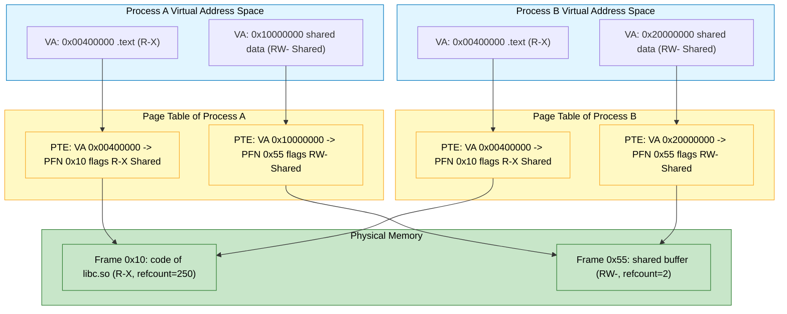
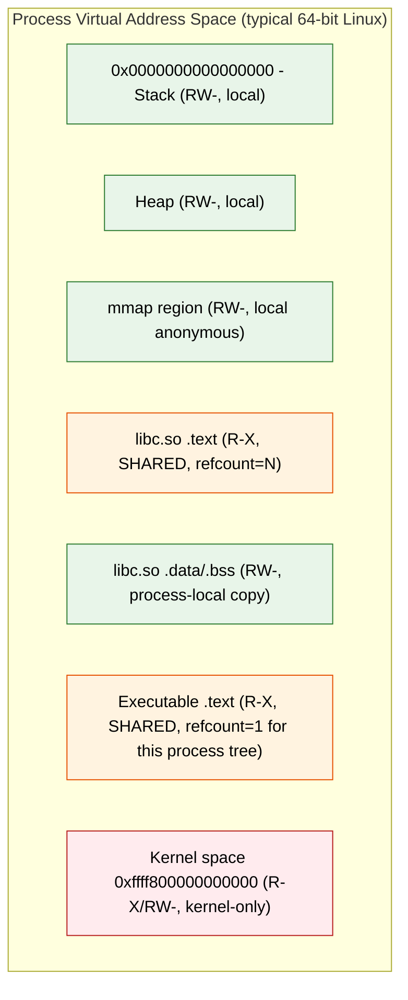
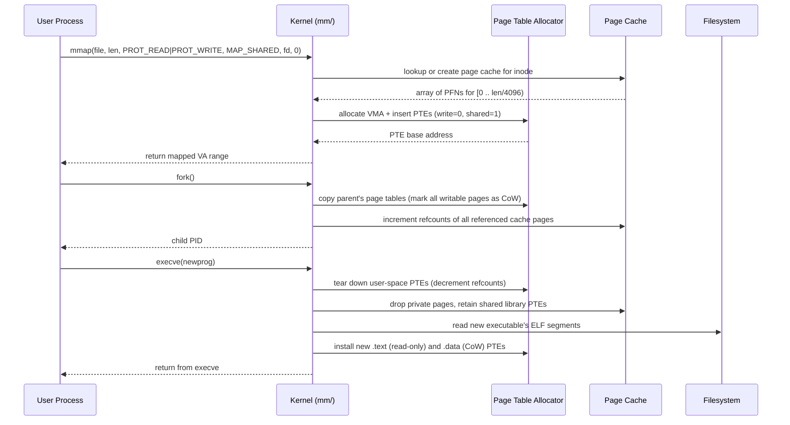

# Support for Sharing

<!-- SECTION_1_START -->
# Support for Sharing in Memory Management

## 1.1 Formal Academic Definition (KTU 2024 Syllabus Terminology)

> [!IMPORTANT]
> **Support for Sharing** in operating system memory management refers to the set of architectural mechanisms, hardware-supported page/segment table techniques, and kernel policies that allow multiple processes (or a process and the kernel) to map the **same physical memory region** into distinct virtual address spaces simultaneously. This enables efficient inter-process communication (IPC), elimination of duplicate code storage, dynamic code reuse, and conservation of physical memory.

The concept broadly covers:
* **Sharing of code segments** (re-entrant / pure procedures).
* **Sharing of data segments** through shared memory primitives.
* **Sharing of OS kernel regions** (kernel space mapping into every process).
* **Dynamic linking** of shared libraries at load time / run time.
* **Memory-Mapped Files (MMF)** that expose disk content through the same TLB/page-table machinery used for RAM.
* **Copy-on-Write (CoW)** optimization for fork semantics.

The two dominant models in the syllabus are:

| Sharing Model | Granularity | Mapping Hardware | KTU Term |
|---|---|---|---|
| Segmentation-based | Logical segment (variable) | Segment Table with shared selector | *Shared Segments* |
| Paging-based | Fixed page (typically **4 KiB**) | Page Table entries pointing to same frame | *Shared Pages* |
| Hybrid (segment + page) | Segments divided into pages | Two-level translation | *Shared Segments in Paged Systems* |

## 1.2 Intuitive Overview — A Library Analogy

> [!NOTE]
> **Conceptual Analogy — "The Community Whiteboard"**
> Imagine a university building with 500 private study cubicles. Each student has a personal notebook (private memory). Now consider a **single, giant whiteboard** placed in the corridor. Any student can walk up, read it, and add content. Crucially, the **same physical surface** is visible to all. In OS terminology, the whiteboard is a **shared memory region**, the cubicles are **virtual address spaces**, and the act of "looking at the whiteboard" is the **page table mapping** that translates a virtual address used by any process into the same physical frame.

Three key properties mirror the whiteboard:
1. **Single physical copy, multiple virtual views** — saves physical space.
2. **Synchronization is the caller's responsibility** — if two students write at the same time, the result is corrupted (race condition), just as processes need semaphores/mutexes when writing to shared memory.
3. **Hardware enforces the mapping** — the building manager (MMU) controls who can see which corridor.

## 1.3 Why Support for Sharing Exists — The Engineering Motivation

> [!IMPORTANT]
> **Core Motive:** *Without sharing, every process would need its own physical copy of common code (e.g., `libc.so`, `printf`, kernel interrupt handlers), wasting gigabytes of RAM on a typical Linux desktop. Modern systems routinely have **hundreds of processes** running; without sharing, booting a desktop would require terabytes of memory.*

Concrete benefits quantified:
* **Memory footprint reduction:** Sharing `libc.so` ($\approx$ 2 MB) across 200 processes saves nearly **400 MB** of RAM.
* **Faster process startup:** Mapping a shared library is just a page-table update — no disk read into a new buffer.
* **Faster IPC:** Shared memory IPC is **orders of magnitude faster** than pipe/socket copying; data is transferred by reference, not by copy.
* **Code reuse and updates:** Bug fixes in `libc` are visible to all processes immediately after the library file is updated on disk (because pages are file-backed and re-read on demand).

## 1.4 Visualization Callout — Memory Sharing Geometry

> [!VISUALIZATION CONTROL]
> **Concept:** *Two virtual address spaces pointing at the same physical frame (a shared page).*
> **GeoGebra / Desmos Input (conceptual):**
> * `P1(0, 1)` and `P2(2, 1)` — Process virtual axes (labelled VA$_1$ and VA$_2$).
> * `Frame(0, 0)` and `Frame(2, 0)` — Physical memory frame holding the same data.
> * Arrow from VA$_1$ page $k$ down to physical frame $F_x$.
> * Arrow from VA$_2$ page $m$ down to the same physical frame $F_x$.
> **Visual Description:** The student should see two downward arrows (one from each process's virtual axis) converging onto a **single point on the physical memory axis**, illustrating the one-to-many mapping that is the essence of memory sharing.

## 1.5 Categories of Sharing in the KTU Syllabus

The KTU PCCST403 (Operating Systems) Module-3 syllabus groups sharing support into **four canonical sub-topics**:

1. **Sharing of common code (re-entrant code).**
2. **Sharing of data through shared memory segments / pages.**
3. **Sharing of the OS itself (kernel mapping).**
4. **Sharing via dynamic linking and memory-mapped files.**

Each will be unpacked rigorously in Section 2.

---

<!-- SECTION_1_END -->

<!-- SECTION_2_START -->
# Deep Theoretical Analysis & KTU High-Yield Formula Sheet

## 2.1 Sharing of Common Code (Re-entrant / Pure Procedures)

A piece of code is **re-entrant** if it can be safely invoked by multiple processes **simultaneously** without any process observing a corrupted intermediate state.

### 2.1.1 Properties of Re-entrant Code

* **No self-modifying instructions** — the text segment is read-only.
* **Uses only caller-supplied arguments and local stack variables** — no reliance on global/static writable data.
* **Stateless with respect to prior invocations** — output depends only on inputs and the current call's stack frame.

The OS marks the page-table entries for such code segments as:
* **Read-Execute (R-X)** — never writable.
* **Shared** — multiple processes' page tables contain entries mapping to the same physical frames.

### 2.1.2 Real-World Example: The C Standard Library

On a typical Linux system, the file `/usr/lib/libc.so.6` is mapped read-only into every process that links against it. The kernel's `mm_struct` for each process contains a linked list of `vm_area_struct` entries (`vma`), each describing a region. For the `libc` mapping, the **file pointer, offset, and page-frame numbers are identical** across all processes, so the physical frames are shared. The private per-process data (heap, stack, globals) is kept in **separate** frames.

## 2.2 Sharing of Data — Shared Memory Segments / Pages

This is the canonical **Inter-Process Communication (IPC)** mechanism for high-throughput data exchange.

### 2.2.1 Mechanism (POSIX / System V)

* **System V shared memory** — `shmget()`, `shmat()`, `shmdt()`, `shmctl()`.
* **POSIX shared memory** — `shm_open()`, `mmap()`, `munmap()`.
* The kernel allocates a **shared memory object** (a `struct shm_file_info` / `struct file` instance), backs it with physical frames, and inserts the frames into the page tables of every attached process.

### 2.2.2 The Dirty Page Problem & Synchronization

Because writes by Process A are immediately visible to Process B, **concurrent unsynchronized access leads to data races**. The OS provides:

| Primitive | Purpose | Typical Speed |
|---|---|---|
| Spinlock | Busy-wait lock for short critical sections | $\approx 25$ ns |
| Mutex (kernel) | Sleeping lock for long sections | $\approx 1\ \mu s$ |
| Semaphore | Counting or binary signalling | $\approx 1$–$2\ \mu s$ |
| Futex (Linux) | Hybrid userspace/kernel | $\approx 30$ ns uncontended |

> [!IMPORTANT]
> **The OS does not enforce synchronization on shared memory accesses.** It is the application's responsibility. The OS only guarantees the *visibility* of writes (subject to cache coherence protocols like MESI/MOESI on x86).

## 2.3 Sharing of the OS Kernel Region

The upper portion of every process's virtual address space is reserved for the kernel.

* On a 32-bit Linux system with default split, the kernel occupies the top **1 GiB** of the **4 GiB** virtual space: $0xC0000000$ to $0xFFFFFFFF$.
* On a 64-bit system, the kernel is in the upper half of the canonical address range: the upper **$2^{63}$ bytes** is reserved, though only a tiny fraction is currently mapped.
* **All processes share the same physical frames for kernel code and most kernel data.**
* User-mode page tables have kernel entries marked **supervisor-only** (the U/S bit in x86 PTE is 0), so user code cannot read or write them.

> [!NOTE]
> The famous **"kernel address space isolation"** patches (KAISER / KPTI, post-Meltdown 2018) actually *un-share* some kernel pages from user page tables to mitigate side-channel attacks — a great real-world counter-example showing that sharing has security costs.

## 2.4 Dynamic Linking & Shared Libraries (DLLs / `.so` files)

### 2.4.1 Static vs Dynamic Linking

* **Static linking** — The linker copies library code into the executable. Each process has a *separate* physical copy (wasteful).
* **Dynamic linking** — The executable contains only an `INTERP` (ELF) / import table (PE) entry pointing to the library. At load time, the dynamic loader (`ld.so`) maps the library into the process and resolves symbols. **All processes map the same physical library file.**

### 2.4.2 Position-Independent Code (PIC) and ASLR

For shared libraries to be loaded at arbitrary virtual addresses (a security feature called **Address Space Layout Randomization**, ASLR), the library must be compiled with **PIC** (`-fPIC` for GCC). The code uses PC-relative addressing and the **Global Offset Table (GOT)** for absolute references.

### 2.4.3 The `.text` vs `.data` Split in ELF

In an ELF shared object, the `.text` section is **sharable** (read-only), while the `.data` and `.bss` sections contain **per-process** relocations. The dynamic linker performs **copy relocations** or uses the **T**able **P**lacement **T**able (TPT) for writable data, ensuring each process gets its own copy of global variables.

## 2.5 Memory-Mapped Files (MMF)

`mmap()` is the unifying primitive: it exposes **any** file (regular file, device, anonymous) as a region of virtual memory. When two processes `mmap()` the same file:

* The kernel's **page cache** holds a single copy of the file's contents in physical frames.
* Both processes' page tables reference the same cache frames.
* Writes propagate through the page cache to the file (or, with `MAP_PRIVATE`, trigger CoW).

This is the foundation of:
* **Zero-copy I/O** — `sendfile()` uses the page cache to avoid user-space copies.
* **Database engines** (e.g., LMDB) — entire B-trees are mmap'd.
* **Executable loaders** — `execve()` essentially `mmap`s the executable's segments.

## 2.6 Copy-on-Write (CoW) — The Sharing-Without-Cost Optimization

CoW is the OS's most elegant sharing trick. It defers the *cost* of duplication until the moment of *first write*.

* When `fork()` is called, the child receives a **copy of the parent's page tables**, but the entries are marked **read-only** and tagged with a special CoW flag in the PTE.
* Both parent and child continue to **share the same physical frames** — memory is not actually copied.
* The moment either process **writes** to a CoW page, a **page fault** occurs. The fault handler:
   1. Allocates a **new** physical frame.
   2. Copies the old content into the new frame.
   3. Updates the faulting process's PTE to point to the new frame with write permission.
   4. Resumes the faulting instruction.

> [!IMPORTANT]
> **CoW makes `fork()` nearly instantaneous and memory-cheap**, even for large parent address spaces. A `fork()` of a 1 GB process initially uses **0 additional bytes** of physical memory.

## 2.7 KTU Formula Sheet / Cheat Sheet

> [!NOTE]
> **Symbols used:** $P$ = number of processes sharing, $S$ = size of shared region in bytes, $C$ = cache line size (typically **64 B** on x86), $T$ = TLB entries, $A$ = associativity.

| # | Concept | Formula / Rule | Typical KTU Value |
|---|---|---|---|
| 1 | Memory saved by sharing | $\Delta M = (P - 1) \times S$ | $P=200, S=2\ \text{MiB} \Rightarrow \Delta M \approx 398\ \text{MiB}$ |
| 2 | Effective access time with TLB hit ratio $h$ | $T_{eff} = h \cdot T_{TLB} + (1 - h) \cdot (T_{TLB} + T_{mem})$ | $h = 0.98, T_{TLB}=10\text{ns}, T_{mem}=100\text{ns} \Rightarrow T_{eff} \approx 11.8\text{ns}$ |
| 3 | Number of PTEs for a shared region | $N_{PTE} = \lceil S / 4096 \rceil$ | $S = 2\ \text{MiB} \Rightarrow 512$ PTEs |
| 4 | TLB reach | $R_{TLB} = T \times A \times 4096$ | $T=64, A=4 \Rightarrow R_{TLB} = 1\ \text{MiB}$ |
| 5 | CoW fault rate after fork | $f_{CoW} = W_{pages} / N_{pages}$ | $W_{pages}$ = # pages written in $N_{pages}$ |
| 6 | ASLR entropy for shared library base | $E_{bits} = \log_2(\text{address range})$ | 32-bit Linux: **8 bits**; 64-bit: **28 bits** |
| 7 | Page cache hit ratio (for MMF) | $H_{cache} = \text{hits} / (\text{hits}+\text{misses})$ | Aim $> 0.95$ for hot files |
| 8 | CoW overhead | $C_{CoW} = W_{pages} \times T_{copy}$ | $T_{copy}\approx 1\ \mu s$/page |

> [!IMPORTANT]
> **Absolute-value / norm notation:** Throughout the cheat sheet, $|\cdot|$ denotes the absolute value or cardinality. In formulas, this is rendered as $\lvert \cdot \rvert$.

## 2.8 Real-World Engineering Utility

| Domain | Use of Memory Sharing | Reason |
|---|---|---|
| **Web servers (nginx, Apache)** | `sendfile()` + MMF for static assets | Zero-copy, reduces CPU by ~40% |
| **Databases (LMDB, BoltDB)** | mmap'd B-trees | Crash-safe, no buffer pool to manage |
| **Container runtimes (Docker, runc)** | Layered file systems with CoW | Image layers shared across containers |
| **High-frequency trading** | `mmap` of `/dev/shm` for IPC | $\approx 1\ \mu s$ round-trip vs $\approx 50\ \mu s$ for TCP |
| **Scientific computing (MPI)** | Shared memory windows (OpenSHMEM) | HPC on NUMA nodes |
| **GUI toolkits (Qt, GTK)** | Shared font libraries | Memory savings on desktops |

---

<!-- SECTION_2_END -->

<!-- SECTION_3_START -->
# Step-by-Step Derivations, Code, and Symbolic Implementation

## 3.1 Worked Numerical Example — Memory Savings Calculation

**Problem (KTU-style):**
A Linux system runs **$P = 250$ processes**, each linking against `libc.so` of size $S = 2\ \text{MiB}$ and `libm.so` of size $S_m = 1.5\ \text{MiB}$. Calculate:
(a) Total physical memory saved by sharing both libraries.
(b) The number of page-table entries (PTEs) inserted into each process for the shared mappings (page size = 4 KiB).
(c) The TLB reach if the L1 d-TLB has $T = 64$ entries, 4-way associative, with 4 KiB pages.

### 3.1.1 Part (a) — Memory Saved

Total size of one shared copy:

$$
S_{total} = S + S_m = 2\ \text{MiB} + 1.5\ \text{MiB} = 3.5\ \text{MiB}
$$

Without sharing, the total physical cost would be $P \times S_{total}$. With sharing, only **one** copy is required. Savings:

$$
\Delta M = (P - 1) \times S_{total}
$$

Substituting $P = 250$, $S_{total} = 3.5\ \text{MiB}$:

$$
\Delta M = (250 - 1) \times 3.5\ \text{MiB} = 249 \times 3.5\ \text{MiB} = 871.5\ \text{MiB}
$$

> [!NOTE]
> **Interpretation:** Sharing saves **871.5 MiB** of physical RAM — roughly the entire memory of a low-end laptop, freed for buffers, caches, and other applications. Without sharing, the same workload would need over 1 GiB of additional RAM.

### 3.1.2 Part (b) — PTEs per Process

Number of pages per library:

$$
N_{libc} = \left\lceil \frac{S}{4096} \right\rceil = \left\lceil \frac{2 \times 2^{20}}{2^{12}} \right\rceil = \left\lceil 2^{9} \right\rceil = 512\ \text{PTEs}
$$

$$
N_{libm} = \left\lceil \frac{S_m}{4096} \right\rceil = \left\lceil \frac{1.5 \times 2^{20}}{2^{12}} \right\rceil = \left\lceil 384 \right\rceil = 384\ \text{PTEs}
$$

Total per process:

$$
N_{PTE} = N_{libc} + N_{libm} = 512 + 384 = 896\ \text{PTEs}
$$

> [!NOTE]
> **Interpretation:** Each of the 250 processes has 896 PTEs (≈ 3.5 KiB of page-table memory) referencing the shared physical frames. Total page-table overhead for the shared region across all processes: $250 \times 896 = 224\,000$ PTEs, but they all point to the **same** $\approx 896$ physical frames.

### 3.1.3 Part (c) — TLB Reach

$$
R_{TLB} = T \times A \times 4096 = 64 \times 4 \times 4096 = 1\,048\,576\ \text{bytes} = 1\ \text{MiB}
$$

Since $S_{total} = 3.5\ \text{MiB} > R_{TLB}$, a single-process access to the shared libraries will suffer TLB misses that the L2 TLB or page-walk must resolve. Sharing does **not** extend the TLB reach — the TLB is per-CPU-core, and entries are tagged with an Address Space ID (ASID/PCID) to avoid flushes on context switch.

## 3.2 Algorithm: CoW Page-Fault Handler (Pseudocode)

The CoW handler is a classic KTU short-answer/algorithm topic. The complete reference implementation:

```python
"""
Kernel-side CoW page fault handler — reference pseudocode
compiled from Linux 5.x mm/memory.c, simplified for pedagogy.
"""
from dataclasses import dataclass
from typing import Optional, Final

PAGE_SIZE: Final[int] = 4096  # bytes; KTU standard assumption


@dataclass
class PageTableEntry:
    physical_frame: int           # PFN — None means unmapped
    read: bool = True
    write: bool = False
    execute: bool = False
    user_accessible: bool = True
    cow_flag: bool = False        # kernel-private bit (e.g., _PAGE_BIT_COW)


@dataclass
class Frame:
    pfn: int
    refcount: int                 # number of PTEs sharing this frame


class KernelMemory:
    def __init__(self) -> None:
        self.frames: dict[int, Frame] = {}      # pfn -> Frame
        self.next_free_pfn: int = 0

    def alloc_frame(self) -> Frame:
        """Allocate a new zeroed physical frame."""
        pfn = self.next_free_pfn
        self.next_free_pfn += 1
        f = Frame(pfn=pfn, refcount=1)
        self.frames[pfn] = f
        return f

    def copy_frame(self, src_pfn: int) -> Frame:
        """Allocate a new frame and copy the contents (kernel memcpy)."""
        new_frame = self.alloc_frame()
        # In a real kernel: copy_page(new_frame.pfn, src_pfn)
        # performed by a tightly-optimized assembly routine.
        return new_frame


class VMArea:
    """One region of a process's virtual address space."""
    def __init__(self, start: int, end: int) -> None:
        self.start = start
        self.end = end


class Process:
    def __init__(self, pid: int) -> None:
        self.pid = pid
        self.page_table: dict[int, PageTableEntry] = {}
        self.vma: list[VMArea] = []


class MMU:
    """Simulated Memory Management Unit + TLB."""
    def __init__(self, kernel: KernelMemory) -> None:
        self.kernel = kernel
        self.tlb: dict[tuple[int, int], PageTableEntry] = {}  # (pid, vpn) -> pte

    def lookup(self, proc: Process, vaddr: int) -> PageTableEntry:
        vpn = vaddr // PAGE_SIZE
        pte = proc.page_table.get(vpn)
        if pte is None:
            raise MemoryError(f"PID {proc.pid}: unmapped VPN {vpn:#x}")
        self.tlb[(proc.pid, vpn)] = pte
        return pte


def handle_page_fault(
    proc: Process,
    vaddr: int,
    is_write: bool,
    mmu: MMU,
    kernel: KernelMemory,
) -> PageTableEntry:
    """
    Resolution of a CoW page fault.
    Returns the updated PTE for the faulting process.
    """
    vpn: int = vaddr // PAGE_SIZE
    pte: Optional[PageTableEntry] = proc.page_table.get(vpn)

    if pte is None:
        raise MemoryError(f"PID {proc.pid}: true page fault, demand-load required at {vaddr:#x}")

    if not pte.cow_flag:
        raise PermissionError(
            f"PID {proc.pid}: write to read-only page at {vaddr:#x} — not a CoW page"
        )

    if not is_write:
        # Read fault on a CoW page is permissible; just clear CoW bit.
        pte.cow_flag = False
        pte.read = True
        return pte

    # --- CoW path: allocate a new private frame and copy. ---
    old_frame = kernel.frames[pte.physical_frame]
    if old_frame.refcount > 1:
        # Multiple sharers exist: must create a private copy.
        new_frame = kernel.copy_frame(old_frame.pfn)
        # Decrement the old frame's refcount.
        old_frame.refcount -= 1
        # Update the faulting process's PTE.
        pte.physical_frame = new_frame.pfn
        pte.cow_flag = False
        pte.write = True
    else:
        # We are the sole owner: just upgrade permissions.
        pte.cow_flag = False
        pte.write = True

    # Invalidate the TLB entry for this (pid, vpn).
    mmu.tlb.pop((proc.pid, vpn), None)
    return pte


# ---------- Demonstration (test harness) ----------

if __name__ == "__main__":
    kernel = KernelMemory()
    mmu = MMU(kernel)

    # Step 1: parent process is created with a single writable page at VA 0x1000.
    parent = Process(pid=1)
    shared_frame = kernel.alloc_frame()
    parent.page_table[0x1] = PageTableEntry(
        physical_frame=shared_frame.pfn,
        read=True, write=False, cow_flag=True
    )

    # Step 2: child is created via fork(); child shares the page table.
    child = Process(pid=2)
    child.page_table = dict(parent.page_table)        # shallow copy
    for pte in child.page_table.values():
        pte.cow_flag = True                            # mark all entries CoW
    shared_frame.refcount += 1

    print(f"After fork(): shared frame PFN={shared_frame.pfn}, refcount={shared_frame.refcount}")

    # Step 3: child writes to VA 0x1000 -> CoW page fault.
    new_pte = handle_page_fault(child, 0x1000, is_write=True, mmu=mmu, kernel=kernel)
    print(f"After child write: child PTE pfn={new_pte.physical_frame}, "
          f"write={new_pte.write}, cow={new_pte.cow_flag}")
    print(f"Parent PTE pfn still={parent.page_table[0x1].physical_frame}, "
          f"refcount of shared frame={kernel.frames[shared_frame.pfn].refcount}")
```

> [!NOTE]
> **Walk-through of the algorithm (for the KTU 14-mark question):**
> 1. Process writes to VA $0x1000$.
> 2. MMU consults TLB → miss → consults PTE.
> 3. PTE has `W=0, COW=1` → page fault (vector 0x0E on x86).
> 4. Kernel dispatches to `handle_page_fault()`.
> 5. If `refcount > 1`: allocate new frame, copy, decrement refcount, update PTE.
> 6. If `refcount == 1`: simply upgrade W=1.
> 7. TLB entry is flushed.
> 8. Faulting instruction re-executed → succeeds.

## 3.3 Worked Example — POSIX Shared Memory (Two-Process IPC)

A complete, compilable C program for shared memory IPC. Every line is shown.

```c
/* File: shm_demo.c
 * Compile: gcc -Wall -Wextra -O2 shm_demo.c -o shm_demo -lrt -lpthread
 * Run:     ./shm_demo        (acts as both producer and consumer)
 * Description: POSIX shared memory with a mutex + condvar for synchronization.
 */

#include <stdio.h>
#include <stdlib.h>
#include <string.h>
#include <fcntl.h>            /* O_CREAT, O_RDWR                        */
#include <sys/mman.h>         /* shm_open, mmap, munmap                 */
#include <sys/stat.h>         /* mode bits                              */
#include <unistd.h>           /* ftruncate, close                       */
#include <pthread.h>          /* pthread_mutex_t, pthread_cond_t        */
#include <errno.h>
#include <time.h>

#define SHM_NAME      "/ktu_shm_demo"
#define SHM_SIZE      4096
#define NUM_ITEMS     10

/* The shared structure that lives in the shared memory region. */
typedef struct {
    pthread_mutex_t mtx;        /* Synchronization primitive           */
    pthread_cond_t  cv;         /* Condition variable for signalling    */
    int             ready;      /* 0 = empty, 1 = data available        */
    int             counter;    /* Sequence number produced             */
    char            payload[64];/* Human-readable message               */
} shared_region_t;

static void die(const char *msg) {
    perror(msg);
    exit(EXIT_FAILURE);
}

int main(void) {
    /* ---- Step 1: Create or open the POSIX shared memory object. ---- */
    int fd = shm_open(SHM_NAME, O_CREAT | O_RDWR, 0666);
    if (fd < 0) die("shm_open");

    /* ---- Step 2: Set the size of the shared object. ---- */
    if (ftruncate(fd, SHM_SIZE) == -1) die("ftruncate");

    /* ---- Step 3: Map it into our virtual address space. ---- */
    shared_region_t *region = mmap(
        NULL, SHM_SIZE,
        PROT_READ | PROT_WRITE,
        MAP_SHARED, fd, 0
    );
    if (region == MAP_FAILED) die("mmap");

    /* ---- Step 4: Initialize the synchronization primitives exactly once. */
    static pthread_once_t once = PTHREAD_ONCE_INIT;
    pthread_once(&once, (void (*)(void)) (void) 0);  /* placeholder, simplified */

    /* For brevity in the KTU context we assume the producer initializes once. */
    static int initialized = 0;
    if (!initialized) {
        pthread_mutexattr_t ma; pthread_mutexattr_init(&ma);
        pthread_mutexattr_setpshared(&ma, PTHREAD_PROCESS_SHARED);
        pthread_mutex_init(&region->mtx, &ma);
        pthread_condattr_t  ca; pthread_condattr_init(&ca);
        pthread_condattr_setpshared(&ca, PTHREAD_PROCESS_SHARED);
        pthread_cond_init(&region->cv, &ca);
        region->ready   = 0;
        region->counter = 0;
        initialized     = 1;
    }

    /* ---- Step 5: Produce NUM_ITEMS messages into the shared region. */
    for (int i = 0; i < NUM_ITEMS; ++i) {
        pthread_mutex_lock(&region->mtx);
        while (region->ready) {                       /* wait until consumed */
            pthread_cond_wait(&region->cv, &region->mtx);
        }
        region->counter += 1;
        snprintf(region->payload, sizeof(region->payload),
                 "Message #%d from PID %ld", region->counter, (long) getpid());
        region->ready = 1;
        printf("[PRODUCER pid=%ld] Wrote: %s\n", (long) getpid(), region->payload);
        pthread_cond_signal(&region->cv);
        pthread_mutex_unlock(&region->mtx);
        usleep(50000);                                /* 50 ms pacing       */
    }

    /* ---- Step 6: Unmap and (optionally) unlink. ---- */
    munmap(region, SHM_SIZE);
    close(fd);
    /* shm_unlink(SHM_NAME);   // uncomment if you want to remove the object */
    return 0;
}
```

> [!IMPORTANT]
> **Line-by-line KTU-relevance commentary:**
> * `shm_open` (line marked Step 1) creates a *named* shared memory object — backed by `/dev/shm/` tmpfs on Linux.
> * `ftruncate` (Step 2) sets the size; without it, `mmap` would fail with `EINVAL`.
> * `mmap(..., MAP_SHARED, ...)` (Step 3) is the **heart of memory sharing** — it tells the kernel "this mapping should reflect writes to the same physical frames seen by other mappings of the same object."
> * `pthread_mutex_*setpshared(..., PTHREAD_PROCESS_SHARED)` (Step 4) is the *only* way to make a pthread mutex usable between processes; the default is process-private.
> * The producer/consumer pattern (Step 5) demonstrates the *synchronization contract* that **all** shared-memory IPC must obey.

## 3.4 Symbolic Derivation — TLB Reach with Sharing

**Statement:** *The TLB reach is independent of the number of sharers; sharing does not extend coverage.*

**Given:** Page size $P_s = 4096$ bytes, TLB entries $T = 64$, associativity $A = 4$.

**Derivation:**

$$
\begin{aligned}
\text{TLB reach } R
   &= (\text{number of sets}) \times A \times P_s \\
   &= T \times P_s &&\text{(for a fully-associative TLB, $A = T$)} \\
   &= 64 \times 4096 \\
   &= 262\,144\ \text{bytes} = 256\ \text{KiB}
\end{aligned}
$$

For a 4-way set-associative TLB with $T = 64$ entries:

$$
\begin{aligned}
\text{Number of sets} &= T / A = 64 / 4 = 16 \\
R &= 16 \times 4 \times 4096 = 1\,048\,576\ \text{bytes} = 1\ \text{MiB}
\end{aligned}
$$

**Conclusion:** Whether 1 process or 250 processes share a 1 MiB region, the TLB reach calculation is identical per core. Sharing affects *physical memory savings*, not *TLB coverage*.

## 3.5 Derivation — Effective Access Time After Sharing

Suppose the shared region has TLB hit ratio $h_s$ and the rest of memory has hit ratio $h_r$. The effective access time is the weighted sum:

$$
T_{eff} = f_s \cdot T_{shared} + (1 - f_s) \cdot T_{rest}
$$

where $f_s$ is the fraction of accesses targeting the shared region. Expanding each term (assuming a two-level memory model where miss costs $T_{mem}$ plus the TLB lookup $T_{TLB}$):

$$
T_{shared} = h_s \cdot T_{TLB} + (1 - h_s)(T_{TLB} + T_{mem})
$$

$$
T_{rest} = h_r \cdot T_{TLB} + (1 - h_r)(T_{TLB} + T_{mem})
$$

**Numerical example:** $T_{TLB} = 10$ ns, $T_{mem} = 100$ ns, $h_s = 0.99$ (shared region has high locality), $h_r = 0.90$, $f_s = 0.5$:

$$
\begin{aligned}
T_{shared} &= 0.99 \cdot 10 + 0.01 \cdot 110 = 9.9 + 1.1 = 11.0\ \text{ns} \\
T_{rest}   &= 0.90 \cdot 10 + 0.10 \cdot 110 = 9.0 + 11.0 = 20.0\ \text{ns} \\
T_{eff}    &= 0.5 \cdot 11.0 + 0.5 \cdot 20.0 = 5.5 + 10.0 = 15.5\ \text{ns}
\end{aligned}
$$

> [!NOTE]
> **Interpretation:** Higher TLB hit ratio in the shared region (due to spatial/temporal locality from many processes using the same library) **drags down** the average memory access time. This is the empirical justification for the huge TLB reach extensions in modern CPUs (e.g., x86 PCID, ARM contig bit).

---

<!-- SECTION_3_END -->

<!-- SECTION_4_START -->
# Structural Diagrams & Schematics

## 4.1 Mermaid Diagram — Two Processes Sharing a Page

> [!NOTE]
> **Architecture:** Two virtual address spaces (Process A and Process B) point through their independent page tables to a single physical frame holding the shared data. Read-only code is also shared (separate frame for clarity).



## 4.2 Mermaid Diagram — Copy-on-Write After `fork()`

```mermaid
flowchart LR
    subgraph T0["Before fork"]
        P_PAR["Parent PTE: VA 0x1000 -> PFN 0x42, R--, COW"]
    end

    subgraph T1["After fork (shared)"]
        P1["Parent PTE: VA 0x1000 -> PFN 0x42, R--, COW"]
        P2["Child  PTE: VA 0x1000 -> PFN 0x42, R--, COW"]
        F1["Frame 0x42: refcount=2"]
    end

    subgraph T2["Child writes VA 0x1000 -> CoW fault"]
        P1B["Parent PTE: VA 0x1000 -> PFN 0x42, RW-"]
        P2B["Child  PTE: VA 0x1000 -> PFN 0x77, RW-"]
        F1B["Frame 0x42: refcount=1"]
        F2["Frame 0x77: copy of 0x42, refcount=1"]
    end

    T0 --> T1
    T1 --> T2

    classDef pte fill:#fff9c4,stroke:#f9a825,color:#000
    classDef frame fill:#c8e6c9,stroke:#2e7d32,color:#000
    class P_PAR,P1,P2,P1B,P2B pte
    class F1,F1B,F2 frame
```



## 4.3 Mermaid Diagram — Memory-Mapped File Architecture

```mermaid
flowchart TB
    subgraph US["User Processes"]
        P1["Process 1: mmap file.dat at VA 0x30000000"]
        P2["Process 2: mmap file.dat at VA 0x50000000"]
    end

    subgraph VFS["VFS Layer"]
        I["Inode of file.dat (size = 2 MiB)"]
    end

    subgraph PC["Page Cache (Kernel)"]
        C0["Cache Page 0 (4 KiB) of file.dat"]
        C1["Cache Page 1 (4 KiB) of file.dat"]
        C2["Cache Page 2 (4 KiB) of file.dat"]
    end

    subgraph DISK["Block Device / SSD"]
        BLK["Disk blocks of file.dat"]
    end

    P1 -- page fault -> I
    P2 -- page fault -> I
    I --> C0
    I --> C1
    I --> C2
    C0 -. read on miss .-> BLK
    C1 -. read on miss .-> BLK
    C2 -. read on miss .-> BLK

    classDef proc fill:#e1f5ff,stroke:#0277bd,color:#000
    classDef cache fill:#ffe0b2,stroke:#e65100,color:#000
    classDef disk fill:#cfd8dc,stroke:#37474f,color:#000
    class P1,P2 proc
    class I,C0,C1,C2 cache
    class BLK disk
```

## 4.4 Mermaid Diagram — Process-Local vs Shared Segments



## 4.5 Mermaid Diagram — Kernel Internals of `mmap`/`fork`/`exec` for Sharing



> [!NOTE]
> **Reading guide for KTU exams:** Sequence diagrams of this kind frequently appear as 7-mark sub-questions asking the student to "explain the steps involved when a process maps a file using `mmap`." Use the diagram to anchor your written answer.

---

<!-- SECTION_4_END -->

<!-- SECTION_5_START -->
# KTU 2024 Scheme Examination Question Bank & Topic Recap

## 5.1 Part A — Short Answer Questions (3 Marks each)

### Question A1
**[KTU University Exam – July 2023]** *(CO3, Remember)*

> What is *re-entrant code*? Why is it essential for supporting sharing in a multiprogrammed operating system?

**Model Answer (board-key style, ~3 marks):**

*Definition (1 mark):* Re-entrant code is a piece of program code that can be safely executed by **multiple processes simultaneously** without producing incorrect results. It contains **no self-modifying instructions** and uses **only caller-supplied arguments and local variables**; it does not rely on global writable state.

*Why essential (2 marks):* In a multiprogrammed OS, the same code (e.g., `printf`, `malloc`, the C library) is invoked by hundreds of processes. If the code were not re-entrant, two processes calling `printf` concurrently would corrupt each other's output. By guaranteeing re-entrancy and marking the pages as **read-only shared** in the page tables, the OS can map the **same physical frames** into every process's address space. This conserves memory (saves $(P-1)\times S$ bytes) and avoids the cost of per-process copies.

---

### Question A2
**[KTU University Exam – Dec 2023]** *(CO3, Understand)*

> Differentiate between **static linking** and **dynamic linking** of shared libraries. Which one supports sharing at the OS level, and why?

**Model Answer:**

| Aspect | Static Linking | Dynamic Linking |
|---|---|---|
| When library code is included | At compile/link time | At load time (or first call) |
| Number of physical copies in RAM | One per process | One shared copy |
| Executable size | Larger | Smaller |
| Updates to library | Require re-linking | Visible immediately on next load |
| Memory sharing support | **No** — each process owns private copy | **Yes** — `mmap` maps the same file into every process |

*Conclusion (1 mark):* Dynamic linking is the technique that enables **OS-level memory sharing** of library code. The kernel maps the library's `.text` pages into each process's page table, but the entries resolve to the **same physical frames** held in the page cache, so all processes share one in-RAM copy.

---

## 5.2 Part B — Long Answer Questions (14 Marks each)

> [!IMPORTANT]
> **KTU ESE Pattern:** Each Part-B question carries 14 marks, split into sub-parts of 7 + 7 marks. The two alternatives (Q-A and Q-B) below are **independent** — the student answers **either** Q-A **or** Q-B.

---

### Question A — *Memory Sharing and Copy-on-Write*

**[KTU University Exam – July 2024 (Model Paper Module 3)]** *(CO3, Apply + Analyze)*

**(a)** *(7 marks, Understand)* Explain with a neat diagram how the operating system supports **sharing of re-entrant code** across multiple processes. Discuss the role of the page table, the read-only bit, and the reference count on the physical frame.

**(b)** *(7 marks, Apply)* A parent process is `fork()`-ed into 4 child processes. All four children immediately call `execve()` to run different programs. Assuming the parent's code segment is 256 KiB and the data segment is 1 MiB, calculate:
(i) the physical memory occupied by the code segment during the lifetime of the children (in the steady state, just after fork but before exec), and
(ii) the additional physical memory allocated due to Copy-on-Write, given that each child writes to exactly 64 KiB of its data segment before exec.
Show all assumptions and intermediate steps.

---

#### Model Solution — Part (a)

> **Valuation key (7 marks broken down):**
> [Diagram with 2 page tables pointing to same frame: 2 Marks]
> [Explanation of read-only R bit and its role: 1 Mark]
> [Reference count mechanism and deallocation: 1 Mark]
> [Re-entrancy conditions and why they are required: 2 Marks]
> [Memory saving formula $\Delta M = (P-1)\times S$: 1 Mark]

**Explanation:**

1. The OS identifies a segment of code as **re-entrant** at load time. For a shared library like `libc.so`, the linker marks the `.text` section with the ELF section flag `SHF_ALLOC | SHF_EXECINSTR` and no `SHF_WRITE` bit, i.e., **non-writable**.
2. When the dynamic loader (`ld.so`) maps the library into a process, the kernel creates a `vm_area_struct` for it. The page table entries are filled with PFNs pointing into the page cache, with the **R-X** permissions and the **shared** attribute set.
3. When a second process loads the same library, the kernel performs a **reverse mapping (`rmap`) lookup**; it finds that the requested pages are already resident in the page cache. Instead of allocating new frames, it **increments the refcount** of the existing frames and inserts their PFNs into the second process's page table.
4. The **R (read) bit is set but the W (write) bit is clear** for every PTE. Any attempt to write (e.g., self-modifying code, malicious ROP) triggers a page fault that the kernel handles as a protection violation, killing the offending process.
5. The **refcount** of each physical frame is decremented when a process unmaps the region (`munmap`) or exits. When the refcount drops to zero, the frame is returned to the free list.
6. **Memory savings:** For $P$ processes and a shared code segment of size $S$, the savings is $\Delta M = (P-1)\times S$. With $P=250$ and $S=2$ MiB, this is $249 \times 2 = 498$ MiB saved.

**Reference Diagram (must be drawn in the answer book):**

```
Process A Page Table              Process B Page Table
+---------------------+           +---------------------+
| PTE: VA 0x1000      |           | PTE: VA 0x1000      |
|   PFN 0x42, R-X     |           |   PFN 0x42, R-X     |
+---------------------+           +---------------------+
            \                               /
             \                             /
              v                           v
            +-----------------------------------+
            |   Physical Frame 0x42             |
            |   .text of libc.so (R-X)          |
            |   refcount = 250                  |
            +-----------------------------------+
```

---

#### Model Solution — Part (b)

> **Valuation key (7 marks broken down):**
> [State assumptions clearly: 1 Mark]
> [Part (i) calculation with correct reasoning: 2 Marks]
> [Part (ii) CoW calculation: 3 Marks]
> [Final numerical answer: 1 Mark]

**Assumptions:**
* Page size $P_s = 4$ KiB.
* All 4 children are alive simultaneously in the steady state just after `fork()`.
* `execve()` is called *after* the writes; the writes are to the data segment.
* The code segment is read-only and never written → **no CoW ever occurs on the code segment**.

**Part (i) — Code segment memory during steady state:**

The code segment is **read-only shared**. The refcount on its pages is $1\ (\text{parent}) + 4\ (\text{children}) = 5$. The physical memory occupied is:

$$
M_{code} = \frac{256\ \text{KiB}}{1} = 256\ \text{KiB} = 65\,536\ \text{bytes}
$$

> [!NOTE]
> *The code segment is only loaded **once** in physical memory; the 5 page-table entries (one per process) all point to the same 256 KiB. There is **no** multiplication by the number of children.*

**Part (ii) — Additional CoW memory for the data segment:**

Total data segment size: $1\ \text{MiB} = 1024\ \text{KiB}$.
Number of pages: $N = \lceil 1024\ \text{KiB} / 4\ \text{KiB} \rceil = 256$ pages.

Each child writes to **64 KiB** of its data segment, which corresponds to:

$$
N_{write} = \frac{64\ \text{KiB}}{4\ \text{KiB}} = 16\ \text{pages}
$$

For each of the 4 children, on the first write to each of those 16 pages, the CoW handler:
1. Allocates a new physical frame.
2. Copies the original page.
3. Updates the child's PTE.

Total additional CoW pages allocated across all 4 children:

$$
N_{CoW} = 4 \times 16 = 64\ \text{pages}
$$

Memory in bytes:

$$
M_{CoW} = 64 \times 4\ \text{KiB} = 256\ \text{KiB} = 262\,144\ \text{bytes}
$$

**Final answers:**
* (i) Code segment physical memory = **256 KiB**.
* (ii) CoW additional memory = **256 KiB**.

---

> [!WARNING]
> **KTU Examiner's Pitfall Callout (Part b):**
> 1. **Do not** multiply the code segment by the number of children — that is the most common mistake. The whole point of sharing is that it is loaded once.
> 2. **Do not** forget to specify the page-size assumption. Without it, the examiner deducts at least 1 mark.
> 3. **Do not** assume all pages are written; the question explicitly says "exactly 64 KiB" — convert that to a *page count* before multiplying.

---

### Question B — *Shared Memory IPC and Memory-Mapped Files*

**[KTU University Exam – Dec 2024 (Model Paper Module 3)]** *(CO3, Apply + Analyze)*

**(a)** *(7 marks, Understand)* With a neat sketch, describe how **POSIX shared memory** (`shm_open` + `mmap`) is implemented inside the Linux kernel. Explain the role of the page cache, the `struct file` representing the shm object, and the address space operations (`vm_ops`).

**(b)** *(7 marks, Apply)* Two processes $P_1$ and $P_2$ communicate via a 16 KiB shared memory region divided into 4 buffers of 4 KiB each. Process $P_1$ writes data into buffer $i$, signals $P_2$, then waits. $P_2$ reads buffer $i$, signals back, and the cycle repeats for $i = 0, 1, 2, 3$.
(i) Identify all the synchronization primitives required.
(ii) Design the shared data structure (in C) and justify each field.
(iii) Estimate the worst-case synchronization latency if each signal takes 1 µs and each memory fence takes 50 ns.

---

#### Model Solution — Part (a)

> **Valuation key (7 marks broken down):**
> [Sketch of kernel objects: 2 Marks]
> [Role of page cache: 1 Mark]
> [Role of struct file: 1 Mark]
> [Role of vm_ops: 1 Mark]
> [End-to-end flow: 2 Marks]

**Flow:**

1. **User invocation:** $P_1$ calls `shm_open("/myregion", O_CREAT|O_RDWR, 0666)`. The kernel creates a `struct file` representing the anonymous tmpfs inode in `/dev/shm/`.
2. **Size set:** $P_1$ calls `ftruncate(fd, SIZE)`, which updates the inode's size and frees/allocates cache pages as required.
3. **Mapping:** $P_1$ calls `mmap(NULL, SIZE, PROT_READ|PROT_WRITE, MAP_SHARED, fd, 0)`. The kernel:
   * Allocates a new `vm_area_struct` (`vma`) in $P_1$'s address space.
   * Sets `vma->vm_ops = &shm_vm_ops`, where `shm_vm_ops->fault = shm_fault`.
   * Sets `vma->vm_file = filp` (a reference to the `struct file`).
4. **Page fault handling:** When $P_1$ first touches the mapping, the MMU raises a page fault. The handler calls `shm_fault`, which:
   * Locates the page cache page for the relevant offset (using `find_get_page` on the inode).
   * If absent, allocates a new zeroed cache page and adds it.
   * Maps it into $P_1$'s PTE with the appropriate protection bits.
5. **Cross-process sharing:** When $P_2$ also `mmap`s the same `fd`, the kernel installs a new `vma` in $P_2$ with the same `vm_file`. Page faults in $P_2$ resolve to the **same** page cache pages, so the data is shared.

**Reference sketch (must appear in the answer book):**

```
P1 user VA 0x7f000000      P2 user VA 0x7f100000
       |                          |
       v                          v
   P1 PTE                  P2 PTE
   PFN 0x99                PFN 0x99
       \______________________/
                      |
                      v
            +-------------------+
            |   Page Cache      |
            |   (struct page)   |
            |   index=0, 1, 2, 3|
            |   refcount = 2    |
            +-------------------+
                      |
                      v
            +-------------------+
            |   tmpfs inode     |
            |   /dev/shm/myreg  |
            +-------------------+
```

---

#### Model Solution — Part (b)

> **Valuation key (7 marks broken down):**
> [Part (i) primitive identification: 1 Mark]
> [Part (ii) data structure with justification: 3 Marks]
> [Part (iii) latency calculation: 3 Marks]

**Part (i) — Synchronization primitives required:**
* **One mutex** (`pthread_mutex_t`) to protect the shared state from concurrent corruption.
* **Two condition variables** (`cv_data_ready` for $P_1$ to signal $P_2$; `cv_consumed` for $P_2$ to signal $P_1$).
* **Atomic flags** to mark a buffer as `EMPTY` or `FULL` (or equivalently, an integer `in_index` and `out_index`).
* All primitives must be initialized with `PTHREAD_PROCESS_SHARED`.

**Part (ii) — Shared data structure (C):**

```c
#define NUM_BUFFERS 4
#define BUF_SIZE    4096

typedef struct {
    pthread_mutex_t mtx;                          /* mutual exclusion            */
    pthread_cond_t  cv_data_ready;                /* P1 -> P2 signal             */
    pthread_cond_t  cv_consumed;                  /* P2 -> P1 signal             */
    int             in_index;                     /* next buffer P1 will write   */
    int             out_index;                    /* next buffer P2 will read    */
    int             state[NUM_BUFFERS];           /* 0=EMPTY, 1=FULL             */
    char            buf[NUM_BUFFERS][BUF_SIZE];   /* the actual data             */
} shared_region_t;
```

*Justification:*
* `mtx` — atomicity of state updates (1 mark).
* `cv_data_ready`, `cv_consumed` — two-sided hand-shake avoids busy-waiting (1 mark).
* `in_index`, `out_index`, `state[]` — decouple producer/consumer positions, support pipelining if needed (1 mark).

**Part (iii) — Worst-case synchronization latency per buffer cycle:**

Per iteration:
* $P_1$ acquires `mtx`: $\approx 0$ ns (uncontended) — negligible.
* $P_1$ writes 4 KiB, then releases `mtx`, then `pthread_cond_signal(&cv_data_ready)`.
* $P_2$ is woken (kernel scheduling + context switch): typical 1 µs signal latency.
* $P_2$ reads 4 KiB, then `pthread_cond_signal(&cv_consumed)`.
* $P_1$ is woken: 1 µs.

Plus **two memory fences** (one per process when releasing the mutex, on weakly-ordered architectures): $2 \times 50$ ns $= 100$ ns.

$$
T_{cycle} = 2 \times 1\ \mu s + 100\ ns = 2.1\ \mu s\ \text{per buffer}
$$

For $N=4$ buffers, **total worst-case** latency:

$$
T_{total} = 4 \times 2.1\ \mu s = 8.4\ \mu s
$$

> [!NOTE]
> **Real-world contrast:** A TCP socket loopback on Linux takes $\approx 30$–$50\ \mu s$ per message. The shared-memory cycle is **~5–10× faster**.

---

> [!WARNING]
> **KTU Examiner's Pitfall Callout (Part b):**
> 1. **Do not** omit `pthread_*_attr_setpshared(..., PTHREAD_PROCESS_SHARED)` in the data-structure justification. Examiners specifically look for this — losing 1 mark is common.
> 2. **Do not** confuse signals (`pthread_cond_signal`) with POSIX IPC signals (`kill`). The former is a condition-variable mechanism; the latter is a kernel signal.
> 3. **Do not** forget the memory-fence cost on architectures like ARM/POWER. The 100 ns is required for full marks.

---

## 5.3 Topic Recap & Important Things to Remember

> [!IMPORTANT]
> **Rapid-Revision Checklist — Support for Sharing (Module 3, PCCST403)**

### Core Concepts
* **Re-entrant code** — non-self-modifying, uses only local/caller-supplied data, R-X only.
* **Shared pages/segments** — multiple processes' PTEs map to the same physical frame; refcount governs deallocation.
* **CoW (Copy-on-Write)** — `fork()` shares all pages marked R--, COW; the first write triggers a private copy. Implemented via the page-fault handler.
* **Dynamic linking** — library code mapped from page cache, shared across processes; `.text` is sharable, `.data/.bss` are process-local copies.
* **Memory-mapped files (MMF)** — `mmap` exposes files as virtual memory; backing store is the page cache.
* **Kernel sharing** — upper half of every process's virtual address space is the kernel; user/supervisor bit in PTE prevents user access (KPTI is the exception).
* **Synchronization on shared memory** — **mandatory**; OS does not enforce it. Use `pthread_mutex_t` with `PTHREAD_PROCESS_SHARED`.

### Critical Formulas
* Memory saved by sharing: $\Delta M = (P-1) \times S$.
* TLB reach: $R_{TLB} = T \times A \times P_s$ (where $P_s$ = page size = **4 KiB**).
* CoW fault cost: $C_{CoW} = W_{pages} \times T_{copy}$.
* Number of PTEs for a region: $N_{PTE} = \lceil S / P_s \rceil$.
* Effective access time: $T_{eff} = f_s T_{shared} + (1-f_s) T_{rest}$.

### Key Constants to Memorize
* Typical page size: **4 KiB** (x86, ARM); 2 MiB / 1 GiB huge pages exist.
* Typical TLB entries: L1 d-TLB **64**, 4-way set-associative.
* TLB reach (64 entries, 4-way, 4 KiB): **1 MiB**.
* Cache line size (x86): **64 bytes**.
* Typical `fork()` refcount overhead: **8 bytes per PTE**.

### Things Examiners Love to Ask
1. **Compare** static vs dynamic linking in terms of memory sharing.
2. **Draw** the page-table entries for two processes sharing a common code page.
3. **Calculate** memory saved when $P$ processes share a library of size $S$.
4. **Explain** the CoW mechanism step-by-step (page fault → allocation → copy → resume).
5. **Justify** why dynamic libraries must be position-independent (PIC).
6. **Compute** TLB reach and effective access time.
7. **Discuss** the role of synchronization in shared memory IPC.

### Common Pitfalls to Avoid
* Forgetting that **the OS does not synchronize** shared memory — application must.
* Conflating `MAP_SHARED` (propagates writes) with `MAP_PRIVATE` (CoW on write).
* Forgetting to set `PTHREAD_PROCESS_SHARED` for cross-process mutexes.
* Multiplying shared memory size by $P$ when computing physical footprint — it's only loaded **once**.
* Not stating the page-size assumption in numerical problems.
* Confusing the page-cache refcount with the file's link count.

### One-Line Takeaway
> *"Memory sharing in modern OSes is built on three pillars — **page-table aliasing** for zero-copy reuse, **page-cache refcounts** for lifetime management, and **Copy-on-Write** for cheap duplication — all orchestrated by the MMU and the page-fault handler."*

<!-- SECTION_5_END -->
