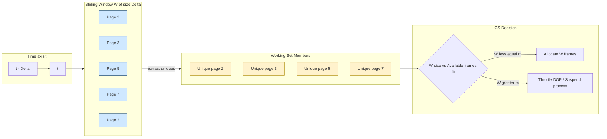
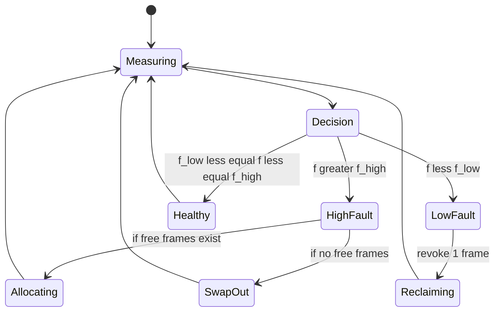
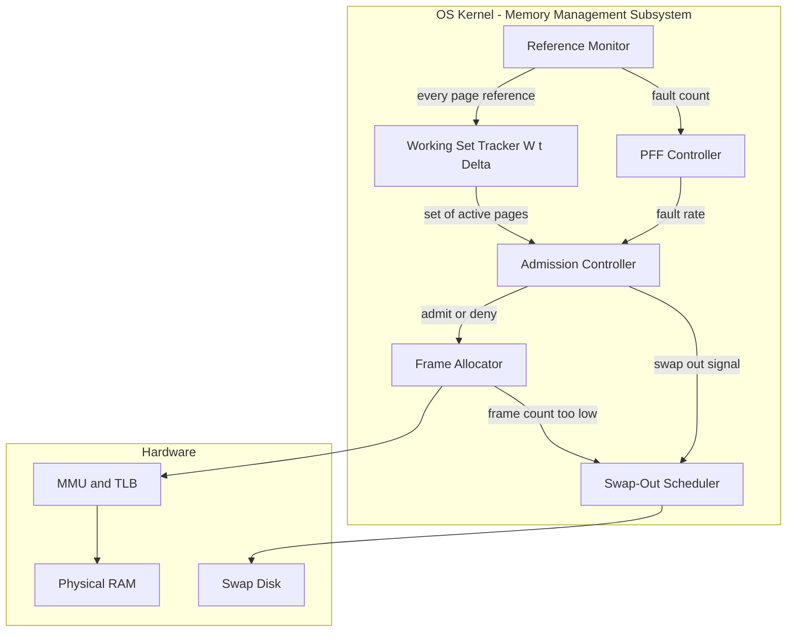

# Thrashing

<!-- SECTION_1_START -->
# THRASHING — Core Technical Definition & Intuitive Overview

## Formal KTU 2024 Definition

> [!IMPORTANT]
> **Thrashing** is a state of excessive paging activity in a virtual memory system where the operating system spends more time swapping pages **in and out of RAM** than executing actual user processes. It occurs when a process does **not have enough frames** (physical memory pages) to hold the pages actively in use, leading to continuous page faults, severe degradation of system throughput, and a collapse of the **CPU utilization** metric.

In the context of the **KTU 2024 Scheme (PCCST403)**, thrashing is studied under Module 3 (*Memory Management*) as a pathological symptom of mismanaged **demand paging**, directly violating the performance guarantee of virtual memory.

> [!NOTE]
> **Syllabus Highlight:** Thrashing is universally asked in KTU exams because it is the bridge concept between *demand paging*, *page replacement algorithms*, and *swapping policies*. Expect it in Part A (3 marks) and often as a 7-mark sub-part of a Part B question.

---

## Intuitive Analogy — "The Tiny Workbench" 🛠️

Imagine a carpenter (the **CPU**) who has a tiny workbench (**RAM**). The carpenter needs tools (data pages) to build a chair (process execution). The tools are stored in a massive, slow warehouse (**disk**).

- **Optimal scenario:** All required tools are on the workbench → fast work.
- **Overloaded scenario:** The carpenter has **10 jobs** running concurrently, but the workbench only fits 2 tools at a time. Every time the carpenter picks up a tool, another must be put back in the warehouse. The carpenter spends **the entire day** walking back and forth to the warehouse, hammering nothing. The workshop is "busy" but no chair is ever finished.

This endless shuttling between fast storage (workbench) and slow storage (warehouse) is exactly **Thrashing** — the system is technically working at 100% I/O load but 0% productive CPU time.

> [!NOTE]
> **Key Insight:** Thrashing is not a hardware fault. It is a **policy failure** — the OS allowed the degree of multiprogramming to exceed what physical memory can sustain.

---

## Where Thrashing Sits in the OS Architecture

| OS Subsystem | Role in Thrashing |
|---|---|
| **Memory Manager** | Allocates frames; misjudges working-set size |
| **Pager / Page Replacement** | Constantly evicts "active" pages |
| **Disk I/O Scheduler** | Gets saturated with swap traffic |
| **CPU Scheduler** | Becomes starved — ready queue is empty |
| **Kernel MMU / TLB** | Flushes entries due to mass invalidation |

> [!VISUALIZATION CONTROL]
> **Concept:** The U-Shaped Curve of CPU Utilization vs. Degree of Multiprogramming
> **GeoGebra / Desmos Input Equations:**
> * Point 1: `(1, 95)`  — Low multiprogramming, high CPU utilization
> * Point 2: `(4, 90)`  — Optimal throughput
> * Point 3: `(6, 55)`  — Beginning of page-stealing
> * Point 4: `(8, 15)`  — Onset of thrashing
> * Point 5: `(10, 3)`  — Deep thrashing
> **Visual Description:** A curve that rises initially, peaks at the "optimal" point, then **plummets** as the OS tries to over-commit memory. The student should observe the sharp downward inflection — the signature signature of thrashing.

<!-- SECTION_1_END -->

<!-- SECTION_2_START -->
# Deep Theoretical Analysis & KTU High-Yield Formula Sheet

## 1. The Root Cause — Why Thrashing Happens

Thrashing is fundamentally caused by the **combined effect** of these three conditions:

1. **Insufficient Frame Allocation:** A process's working set (the set of pages it is currently *actively* referencing) is larger than the number of frames allocated to it.
2. **Aggressive Page Replacement:** When a page is brought in, another "active" page must be evicted to make room, which will immediately be requested again.
3. **High Degree of Multiprogramming (DOP):** Too many processes are competing for a fixed number of frames, forcing the OS to chop every process's working set.

> [!NOTE]
> **The Virtuous-to-Vicious Cycle:** A process thrashes → it spends time in the **waiting** state → the **CPU scheduler** sees idle CPU → it admits a **new process** to "increase utilization" → frame allocation per process drops further → *more thrashing*. The OS digs itself deeper.

## 2. The Locality Model Foundation

Thrashing cannot be understood without **locality of reference**:

- **Temporal Locality:** If a page $P$ is referenced now, it is likely to be referenced again soon ($t \rightarrow t + \Delta t$).
- **Spatial Locality:** If page $P$ is referenced, nearby pages $P+1, P+2$ are likely to be referenced soon.

A process's execution is composed of **alternating localities** (bursts of activity on a small subset of pages). The set of pages in the *current* locality is the **Working Set**.

## 3. The Working Set Model (Denning, 1968)

The **Working Set $W(t, \Delta)$** of a process at time $t$ is the set of pages referenced in the most recent $\Delta$ virtual-time units (the **working-set window**).

> [!IMPORTANT]
> **Formal Definition (Board Definition):**
> $$W(t, \Delta) = \{ p_i \mid p_i \text{ was referenced in the interval } [t - \Delta, t] \}$$
> where $\Delta$ is a system-wide tunable parameter called the **window size** (typically $10^4$ to $10^6$ memory references).

**Key Properties:**

- $\vert W(t, \Delta) \vert$ is the **working set size** — the *minimum* number of frames the process needs to avoid thrashing.
- If $\sum \vert W_i(t, \Delta) \vert > m$ (total physical frames), then the system **must throttle multiprogramming** or **suspend** one or more processes.

**Approximation (Fixed-Sample Approximation):**

Instead of timing references, use a counter that triggers on a timer interrupt (e.g., every $\Delta$ references):

$$W(t, \Delta) \approx \text{unique pages referenced in last } \Delta \text{ references}$$

This is computationally cheaper and is what production OS kernels approximate.

## 4. The Page Fault Frequency (PFF) Strategy

Instead of guessing the working set, **directly measure** the page fault rate $f$ of each process.

| Fault Rate Range | OS Action |
|---|---|
| $f > f_{\text{high}}$ | Process is thrashing — **allocate more frames** |
| $f < f_{\text{low}}$ | Process has surplus frames — **revoke some** |
| $f_{\text{low}} \leq f \leq f_{\text{high}}$ | Process is healthy — **do nothing** |

When a process needs more frames but the total physical memory is exhausted, the OS has only two options:
- **Swap out** an entire process (write all its frames to disk, free its frames).
- **Reduce the degree of multiprogramming** by suspending processes.

## 5. Other Anti-Thrashing Strategies (KTU Favourites)

| Strategy | Mechanism |
|---|---|
| **Working Set Strategy** | Track $W(t,\Delta)$ per process; only admit processes whose $W$ fits in free frames. |
| **Page Fault Frequency (PFF)** | Dynamically adjust frames per process based on measured fault rate. |
| **Swapping** | Suspend an entire process, freeing all its frames. |
| **Local Replacement** | A process can only evict *its own* pages — prevents one process from starving another (but does not solve *aggregate* thrashing). |
| **Load Control / Admission Control** | Limit the number of active processes via a "multiprogramming degree" governor. |

---

## KTU Formula Sheet / Cheat Sheet

| # | Concept | Formula / Definition | Variable Meaning | Units |
|---|---|---|---|---|
| 1 | Working Set | $W(t,\Delta) = \{p_i \mid p_i \in [t-\Delta, t]\}$ | $t$ = current time, $\Delta$ = window | Pages |
| 2 | Working Set Size | $\vert W(t,\Delta) \vert$ | Cardinality of working set | Frames |
| 3 | Thrashing Condition | $\sum_{i=1}^{n} \vert W_i(t,\Delta) \vert > m$ | $n$ = #processes, $m$ = total frames | Boolean |
| 4 | Page Fault Rate | $f = \dfrac{\text{Page Faults}}{\text{References}}$ | Measured per process | Faults / ref |
| 5 | PFF Upper Bound | $f > f_{\text{high}} \Rightarrow$ give more frames | Tunable | Faults / ref |
| 6 | PFF Lower Bound | $f < f_{\text{low}} \Rightarrow$ take frames | Tunable | Faults / ref |
| 7 | Multiprogramming Degree | $DOP = \dfrac{m}{\overline{\vert W \vert}}$ | $m$ = frames, $\overline{\vert W \vert}$ = avg working set | Processes |
| 8 | Effective Access Time (thrashed) | $EAT = (1-p) \cdot ma + p \cdot \text{page fault cost}$ | $p$ skyrockets $\to$ EAT explodes | ns |
| 9 | CPU Utilization | $U = 1 - P_{\text{idle}}$ | Decreases sharply in thrashing | Ratio $[0,1]$ |
| 10 | Optimal DOP | $DOP^{*} = \arg\max_{DOP} \; U(DOP)$ | Found at peak of U-curve | Processes |

> [!NOTE]
> **Engineering Utility:** Working-set estimation is the conceptual ancestor of modern page-replacement hints in Linux (`/proc/PID/clear_refs`, `madvise(MADV_WILLNEED)`), the Windows *Working Set Manager*, and the Java Virtual Machine's *card table* generational GC sizing. Every production runtime that uses demand paging inherits these ideas.

<!-- SECTION_2_END -->

<!-- SECTION_3_START -->
# Step-by-Step Derivations & Code Implementation

## Derivation 1 — Effective Access Time in a Thrashed System

A normal system has a memory access time $ma$ and a page-fault service time of roughly $pfs$ (includes disk I/O + restart overhead). Let $p$ be the page fault rate. Then:

$$EAT = (1 - p) \cdot ma + p \cdot pfs$$

**Step-by-step transition to a thrashed regime:**

**Step 1 — In a healthy system:**
Assume $ma = 100$ ns, $p = 0.001$ (1 fault per 1000 refs), $pfs = 10$ ms $= 10^{7}$ ns.

$$EAT_{\text{healthy}} = (1 - 0.001)(100) + (0.001)(10^{7})$$

$$EAT_{\text{healthy}} = (0.999)(100) + 10000 = 99.9 + 10000 = 10100 \text{ ns} \approx 10.1 \; \mu s$$

**Step 2 — In a thrashed system:**
As the working set exceeds allocated frames, every memory access triggers a fault, so $p \to 1$.

$$EAT_{\text{thrashed}} = (1 - 1)(100) + (1)(10^{7}) = 10^{7} \text{ ns} = 10 \text{ ms}$$

**Step 3 — Compute the throughput collapse ratio:**

$$\text{Slowdown Factor} = \dfrac{EAT_{\text{thrashed}}}{EAT_{\text{healthy}}} = \dfrac{10^{7}}{1.01 \times 10^{4}} \approx 990 \times$$

> [!IMPORTANT]
> **Conclusion:** In a thrashed system, the effective memory access time approaches the **disk access time** itself. The system is bound by I/O, not compute. This is why the CPU utilization curve **collapses** past the optimal multiprogramming point.

---

## Derivation 2 — Working Set Size Computation (Numerical)

**Problem (typical KTU Part A or sub-part of Part B):**

A process makes the following page references in order, using a working-set window $\Delta = 5$ (i.e., last 5 references). Compute the working set size after each reference.

Reference String: `2, 3, 4, 1, 2, 5, 1, 2, 3, 4, 5, 1, 2, 3, 6`

**Step-by-step solution:**

Maintain a sliding window of the last 5 references and count **unique** pages in that window.

| Step | Reference | Sliding Window (last 5) | Unique Pages | $\vert W \vert$ |
|---|---|---|---|---|
| 1 | 2 | {2} | {2} | **1** |
| 2 | 3 | {2,3} | {2,3} | **2** |
| 3 | 4 | {2,3,4} | {2,3,4} | **3** |
| 4 | 1 | {2,3,4,1} | {1,2,3,4} | **4** |
| 5 | 2 | {2,3,4,1,2} | {1,2,3,4} | **4** |
| 6 | 5 | {3,4,1,2,5} | {1,2,3,4,5} | **5** |
| 7 | 1 | {4,1,2,5,1} | {1,2,4,5} | **4** |
| 8 | 2 | {1,2,5,1,2} | {1,2,5} | **3** |
| 9 | 3 | {2,5,1,2,3} | {1,2,3,5} | **4** |
| 10 | 4 | {5,1,2,3,4} | {1,2,3,4,5} | **5** |
| 11 | 5 | {1,2,3,4,5} | {1,2,3,4,5} | **5** |
| 12 | 1 | {2,3,4,5,1} | {1,2,3,4,5} | **5** |
| 13 | 2 | {3,4,5,1,2} | {1,2,3,4,5} | **5** |
| 14 | 3 | {4,5,1,2,3} | {1,2,3,4,5} | **5** |
| 15 | 6 | {5,1,2,3,6} | {1,2,3,5,6} | **5** |

**Peak working set size** $= 5$ frames.

**Thrashing condition check:** If the system has only $m = 3$ physical frames per process, then since $\vert W \vert_{\max} = 5 > 3$, **the process will thrash**.

---

## Derivation 3 — Optimal Degree of Multiprogramming

Let the system have $m = 20$ physical frames. Three processes have measured average working-set sizes: $\vert W_1 \vert = 6$, $\vert W_2 \vert = 8$, $\vert W_3 \vert = 5$.

**Step 1 — Total working-set demand:**

$$\sum_{i=1}^{3} \vert W_i \vert = 6 + 8 + 5 = 19 \text{ frames}$$

**Step 2 — Free frames after allocation:**

$$m_{\text{free}} = m - \sum \vert W_i \vert = 20 - 19 = 1 \text{ frame}$$

**Step 3 — Can we admit a 4th process?**

The 4th process $P_4$ has measured $\vert W_4 \vert = 4$. We need at least 4 free frames to admit it without immediately causing thrashing. Since $m_{\text{free}} = 1 < 4$, **$P_4$ must be denied admission or one of $P_1, P_2, P_3$ must be swapped out**.

> [!NOTE]
> **Decision rule (working-set admission control):** Admit process $P$ only if $\vert W_P \vert \leq m_{\text{free}}$. This is the most common KTU short-answer pattern.

---

## Code Implementation — Working Set Tracker (Python)

A fully operational reference monitor that tracks the working set using the **fixed-sample approximation**:

```python
import logging
from collections import deque
from typing import Deque, Set

logging.basicConfig(level=logging.INFO, format="%(asctime)s [%(levelname)s] %(message)s")


class WorkingSetTracker:
    """
    Tracks the working set W(t, Delta) for a single process using
    a sliding window of the last 'delta' memory references.

    Thrashing detection: if |W| > allocated_frames, raise a warning.
    """

    def __init__(self, delta: int, allocated_frames: int, process_id: int) -> None:
        if delta <= 0:
            raise ValueError("Delta (window size) must be a positive integer.")
        if allocated_frames <= 0:
            raise ValueError("Allocated frames must be a positive integer.")

        self._delta: int = delta
        self._allocated_frames: int = allocated_frames
        self._pid: int = process_id
        self._window: Deque[int] = deque(maxlen=delta)
        self._ref_count: int = 0
        self._thrashing: bool = False

        logging.info(
            f"PID {self._pid}: Tracker initialised | Delta={self._delta}, "
            f"Allocated frames={self._allocated_frames}"
        )

    def reference(self, page: int) -> int:
        """Record a single page reference and return the current working set size."""
        try:
            if not isinstance(page, int) or page < 0:
                raise ValueError(f"Invalid page id: {page}")

            self._window.append(page)
            self._ref_count += 1

            ws_size: int = len(set(self._window))
            self._evaluate_thrashing(ws_size)
            return ws_size

        except ValueError as ve:
            logging.error(f"PID {self._pid}: Reference error -> {ve}")
            return -1

    def _evaluate_thrashing(self, ws_size: int) -> None:
        """Internal guard: detect if the working set exceeds the frame allocation."""
        if ws_size > self._allocated_frames and not self._thrashing:
            self._thrashing = True
            logging.warning(
                f"PID {self._pid}: *** THRASHING DETECTED *** "
                f"Working set={ws_size} > Frames={self._allocated_frames}"
            )
        elif ws_size <= self._allocated_frames and self._thrashing:
            self._thrashing = False
            logging.info(f"PID {self._pid}: Thrashing cleared. Working set={ws_size}")

    @property
    def is_thrashing(self) -> bool:
        return self._thrashing

    @property
    def total_references(self) -> int:
        return self._ref_count


# -------------------------- DEMO --------------------------
if __name__ == "__main__":
    ref_string: list = [2, 3, 4, 1, 2, 5, 1, 2, 3, 4, 5, 1, 2, 3, 6]

    # Process is given only 3 frames. Working set peaks at 5 -> thrashing expected.
    tracker = WorkingSetTracker(delta=5, allocated_frames=3, process_id=101)

    print(f"{'Step':<5}{'Page':<6}{'|W(t,5)|':<12}{'Thrashing?':<12}")
    print("-" * 35)
    for step, page in enumerate(ref_string, start=1):
        ws = tracker.reference(page)
        print(f"{step:<5}{page:<6}{ws:<12}{tracker.is_thrashing}")
```

**Expected output (abridged):**

```
Step  Page  |W(t,5)|  Thrashing?
-----------------------------------
1     2     1          False
2     3     2          False
3     4     3          False
4     1     4          True     <-- THRASHING STARTS
...
15    6     5          True
```

> [!NOTE]
> **Engineering Mapping:** The `WorkingSetTracker` class mirrors the structure of the Linux kernel's `task_struct` working-set fields (`mm->mmap`, `vma->vm_mm`, the referenced bits walked by the page reclamation code in `mm/vmscan.c`).

---

## Code Implementation — Page Fault Frequency (PFF) Governor

```python
class PFFGovernor:
    """
    Implements the Page Fault Frequency strategy.
    Increases frame allocation on high fault rate; reclaims frames on low rate.
    """

    def __init__(self, f_low: float, f_high: float, max_frames: int) -> None:
        if not (0.0 <= f_low < f_high <= 1.0):
            raise ValueError("Require 0 <= f_low < f_high <= 1")
        self.f_low: float = f_low
        self.f_high: float = f_high
        self.max_frames: int = max_frames
        self.allocations: dict = {}   # pid -> frames
        self.faults: dict = {}        # pid -> fault count
        self.refs: dict = {}          # pid -> reference count
        self.free_frames: int = max_frames
        logging.info(
            f"PFF Governor active: f_low={f_low}, f_high={f_high}, "
            f"total_frames={max_frames}"
        )

    def register_process(self, pid: int, initial_frames: int) -> None:
        if initial_frames > self.free_frames:
            raise MemoryError("Insufficient free frames to register process.")
        self.allocations[pid] = initial_frames
        self.faults[pid] = 0
        self.refs[pid] = 0
        self.free_frames -= initial_frames
        logging.info(f"PID {pid} registered with {initial_frames} frames.")

    def report_fault(self, pid: int) -> None:
        self.faults[pid] = self.faults.get(pid, 0) + 1

    def report_references(self, pid: int, count: int) -> None:
        self.refs[pid] = self.refs.get(pid, 0) + count

    def regulate(self, pid: int) -> str:
        refs = self.refs.get(pid, 1)
        faults = self.faults.get(pid, 0)
        f: float = faults / refs if refs else 0.0

        action: str = "NO_CHANGE"
        if f > self.f_high and self.free_frames > 0:
            take = min(self.free_frames, 1)
            self.allocations[pid] += take
            self.free_frames -= take
            self.faults[pid] = 0
            self.refs[pid] = 0
            action = f"GRANT +{take} frame(s) (f={f:.3f})"
        elif f < self.f_low and self.allocations.get(pid, 0) > 1:
            self.allocations[pid] -= 1
            self.free_frames += 1
            self.faults[pid] = 0
            self.refs[pid] = 0
            action = f"REVOKE 1 frame (f={f:.3f})"
        else:
            self.faults[pid] = 0
            self.refs[pid] = 0
            action = f"HOLD (f={f:.3f})"
        logging.info(f"PID {pid} regulation: {action}")
        return action
```

<!-- SECTION_3_END -->

<!-- SECTION_4_START -->
# Structural Diagrams & Schematics

## Diagram 1 — The Thrashing Vicious Cycle (Cause-Effect Flow)

```mermaid
flowchart TD
    A[Process needs more frames than allocated] --> B[Frequent Page Faults]
    B --> C[Process spends most time in WAITING state]
    C --> D[CPU ready queue becomes empty]
    D --> E[CPU Utilization drops sharply]
    E --> F[CPU Scheduler misreads low utilization]
    F --> G[OS admits a NEW process to "raise" utilization]
    G --> H[Per-process frame count drops further]
    H --> I[All processes thrash simultaneously]
    I --> A

    styleA([start]):::hidden
    classDef hidden display:none;
    styleA styleA fill:#f9f,stroke:#333
    A:::crit
    B:::crit
    C:::crit
    D:::crit
    E:::crit
    F:::crit
    G:::crit
    H:::crit
    I:::crit
```

> [!NOTE]
> **Reading the diagram:** Each node is a self-reinforcing step. The only escape hatches are: (a) Suspend a process, (b) Add RAM, (c) Reduce locality size, (d) Use the PFF or Working-Set governor to cap admission.

## Diagram 2 — Working Set Model Architecture



## Diagram 3 — Page Fault Frequency (PFF) Control Loop



## Diagram 4 — Block-Level Functional Architecture (Thrashing Prevention Subsystem)



> [!NOTE]
> **Diagram Interpretation:** The four software blocks (Working Set Tracker, PFF Controller, Admission Controller, Frame Allocator) form the **thrashing prevention pipeline**. Each block can independently trigger `Swap-Out` to reclaim memory.

<!-- SECTION_4_END -->

<!-- SECTION_5_START -->
# KTU 2024 Scheme Examination Question Bank & Topic Recap

## PART A — Short Answer Questions (3 Marks Each)

> **Q1.** `[KTU University Exam - Dec 2023]` — **CO3, Remember**
> **Define thrashing. What is its primary cause?**

**Model Answer (3 marks):**

> [!NOTE]
> *Thrashing* is a condition in a virtual memory system where the system spends more time swapping pages in and out of memory than executing processes. **Primary cause:** When a process is allocated fewer frames than its working set size, every memory reference results in a page fault, leading to severe degradation of CPU utilization and system throughput. **[Definition: 2 marks, Cause: 1 mark]**

---

> **Q2.** `[KTU University Exam - July 2024]` — **CO3, Understand**
> **Differentiate between the Working Set Model and the Page Fault Frequency strategy. (Any 3 points)**

**Model Answer (3 marks):**

| # | Working Set Model | Page Fault Frequency |
|---|---|---|
| 1 | Uses a time window $\Delta$ of past references | Uses measured fault rate $f$ per process |
| 2 | Proactive — predicts need in advance | Reactive — adjusts after faults occur |
| 3 | Computationally heavier (sliding window) | Lighter (counter-based) |
| 4 | $\vert W(t,\Delta) \vert$ must fit in free frames | Allocate until $f \leq f_{\text{high}}$ |

**[Any 3 contrasting points: 3 marks — 1 mark each]**

---

## PART B — Long Answer Questions (14 Marks)

> ### Question A `[KTU University Exam - Dec 2023]` — **CO3, Apply + Analyze**
>
> **(a)** Explain the **Working Set Model** in detail. How is it used to control thrashing? State and explain the thrashing condition. **(7 marks)**
>
> **(b)** Consider a system with **3 processes** $P_1, P_2, P_3$ whose working set sizes measured over $\Delta = 10000$ references are $\vert W_1 \vert = 4$, $\vert W_2 \vert = 6$, $\vert W_3 \vert = 5$. The system has **$m = 20$ physical frames**. Determine:
>   * (i) Whether the system is in a safe (non-thrashing) state. Justify with a calculation. **(3 marks)**
>   * (ii) If a 4th process $P_4$ arrives with $\vert W_4 \vert = 4$, can the OS admit it without causing thrashing? What should the OS do? **(4 marks)**

### Model Solution — Question A

#### Part (a) — Working Set Model (7 marks)

> **[Definition: 2 marks]**
> The Working Set $W(t, \Delta)$ of a process at time $t$ is the set of pages referenced by the process in the most recent $\Delta$ virtual-time references. Mathematically:
> $$W(t, \Delta) = \{p_i \mid p_i \text{ referenced in } [t - \Delta, t]\}$$

> **[Cardinality & frame requirement: 2 marks]**
> $\vert W(t, \Delta) \vert$ is the working set size — it represents the **minimum number of frames** the process must be allocated to make forward progress without thrashing.

> **[Thrashing condition: 2 marks]**
> Thrashing occurs iff:
> $$\sum_{i=1}^{n} \vert W_i(t, \Delta) \vert > m$$
> where $n$ is the number of active processes and $m$ is the total number of physical frames.

> **[Control mechanism: 1 mark]**
> The OS uses this to perform **admission control**: it monitors each process's working set and either admits new processes (if free frames suffice) or **suspends** existing processes to maintain the invariant.

#### Part (b) — Numerical (7 marks)

**(i) Is the system safe? (3 marks)**

**Step 1 — Total working set demand:**

$$\sum_{i=1}^{3} \vert W_i \vert = 4 + 6 + 5 = 15 \text{ frames}$$

**Step 2 — Compare with available frames:**

$$m = 20 \geq 15 = \sum \vert W_i \vert$$

**Step 3 — Free frames remaining:**

$$m_{\text{free}} = 20 - 15 = 5 \text{ frames}$$

> **[Stating calculation: 2 marks] [Verdict: 1 mark]**
> **Verdict:** The system is **SAFE** (not thrashing). The condition $\sum \vert W_i \vert \leq m$ is satisfied with 5 frames of headroom.

**(ii) Can $P_4$ be admitted? (4 marks)**

**Step 1 — Frame demand of $P_4$:**

$$\vert W_4 \vert = 4 \text{ frames}$$

**Step 2 — Check against free frames:**

$$m_{\text{free}} = 5 \geq 4 = \vert W_4 \vert$$

> **[Stating demand and free frames: 1 mark]**
> **Step 3 — Verdict:**

$$5 \geq 4 \;\;\checkmark$$

> **[Decision logic: 2 marks]**
> **Yes**, $P_4$ **can be admitted** safely. After admission: $m_{\text{free}}' = 5 - 4 = 1$ frame, still leaving 1 frame of buffer. The thrashing condition still does **not** trigger: $\sum_{i=1}^{4} \vert W_i \vert = 19 \leq 20$.

> **[Final residual analysis: 1 mark]**
> If a 5th process $P_5$ with $\vert W_5 \vert = 2$ arrived, it would push the sum to 21, exceeding $m = 20$. The OS should **deny admission** and either queue $P_5$ or **suspend** the lowest-priority process.

> [!WARNING]
> **KTU Examiner's Pitfall (Q-A):** A common mistake is forgetting to **state the thrashing condition explicitly as a formula** before applying it. Examiners award 1–2 marks purely for the formal definition $W(t,\Delta) = \{p_i \mid p_i \in [t-\Delta, t]\}$. Do not skip the math.

---

> ### Question B `[KTU University Exam - July 2024]` — **CO3, Apply + Evaluate**
>
> **(a)** With a neat diagram, explain how the **degree of multiprogramming** affects **CPU utilization** in a demand-paging system. Why does the curve have a **U-shape** (rise, peak, fall)? **(7 marks)**
>
> **(b)** Explain the **Page Fault Frequency (PFF) strategy** with a state diagram. A process has an upper threshold $f_{\text{high}} = 0.05$ and lower threshold $f_{\text{low}} = 0.01$. If the process has **3 frames** and its current fault rate is **$f = 0.08$**, what action will the PFF controller take? Show the trace for 3 consecutive intervals where the rates are $0.08$, $0.04$, and $0.005$. **(7 marks)**

### Model Solution — Question B

#### Part (a) — CPU Utilization Curve (7 marks)

> **[Drawing the U-shaped curve: 3 marks]**
> *(Refer to the Desmos visualization in Section 1 of these notes.)*

**Explanation of the three regions:**

> **Region 1 — Under-utilized (left side of curve):**
> With very few processes, the CPU frequently has **no work to do** because the ready queue is empty. As more processes are added, the CPU stays busy longer → utilization rises. **[1 mark]**

> **Region 2 — Optimal (peak of curve):**
> At the optimal degree of multiprogramming $DOP^*$, the active processes' working sets **fit comfortably** in physical memory. Page faults are minimal, I/O and CPU overlap efficiently, and CPU utilization reaches its **maximum**. **[1.5 marks]**

> **Region 3 — Thrashing (right side of curve):**
> Beyond $DOP^*$, processes' working sets start **exceeding** available frames. Pages are swapped out that will be needed again immediately. The disk I/O subsystem becomes saturated; the ready queue starves; CPU utilization **collapses**. **[1.5 marks]**

> **[Block diagram of cause-effect cycle: 1 mark]**
> *(Refer to the Thrashing Vicious Cycle diagram in Section 4.)*

#### Part (b) — PFF Strategy with Trace (7 marks)

> **[PFF definition & thresholds: 2 marks]**
> The Page Fault Frequency strategy dynamically adjusts the number of frames allocated to a process based on its measured fault rate $f$:
> - If $f > f_{\text{high}}$ → process is thrashing, **allocate more frames**.
> - If $f < f_{\text{low}}$ → process has surplus, **revoke a frame**.
> - If $f_{\text{low}} \leq f \leq f_{\text{high}}$ → process is in the **healthy zone**, no change.

> **[State diagram: 1 mark]**
> *(Refer to the PFF Control Loop state diagram in Section 4.)*

**Numerical Trace (with $f_{\text{high}} = 0.05$, $f_{\text{low}} = 0.01$):**

> **Interval 1: $f_1 = 0.08$ (3 marks)**

**Step 1 — Classify:**

$$f_1 = 0.08 > f_{\text{high}} = 0.05 \;\;\Rightarrow\;\; \text{FAULT RATE TOO HIGH}$$

**Step 2 — Action:**

> **[Comparison: 1 mark] [Action: 1 mark] [Frame update: 1 mark]**
> The PFF controller requests **one additional frame** from the free pool. Frame count: $3 \rightarrow 4$. *If no free frames exist, the OS must either swap out a process or suspend one.*

> **Interval 2: $f_2 = 0.04$ (2 marks)**

**Step 1 — Classify:**

$$f_{\text{low}} = 0.01 \leq f_2 = 0.04 \leq f_{\text{high}} = 0.05 \;\;\Rightarrow\;\; \text{HEALTHY ZONE}$$

**Step 2 — Action:**

> **[Comparison: 1 mark] [Action: 1 mark]**
> **No change.** Frame count remains 4. The process is operating within the acceptable fault rate envelope.

> **Interval 3: $f_3 = 0.005$ (2 marks)**

**Step 1 — Classify:**

$$f_3 = 0.005 < f_{\text{low}} = 0.01 \;\;\Rightarrow\;\; \text{FAULT RATE TOO LOW (surplus frames)}$$

**Step 2 — Action:**

> **[Comparison: 1 mark] [Action: 1 mark]**
> The PFF controller **reclaims one frame** and returns it to the free pool. Frame count: $4 \rightarrow 3$. This prevents the process from hoarding memory it does not need.

> [!WARNING]
> **KTU Examiner's Pitfall (Q-B):** Two common mistakes:
>   1. **Confusing the direction of thresholds:** Many students write "if $f < f_{\text{high}}$, add frames" — this is the *opposite* of correct. Remember: high fault rate = need more memory.
>   2. **Skipping the comparison step:** Examiners award 1 mark *per classification comparison* ($f$ vs threshold). Always show the inequality explicitly.

---

## Topic Recap & Important Things to Remember

> [!IMPORTANT]
> **High-Density Revision Checklist — Thrashing (Module 3, PCCST403)**

- **Definition:** Thrashing = OS spends more time swapping pages than executing processes; system "works hard, achieves nothing."
- **Root cause:** $\sum_{i=1}^{n} \vert W_i(t,\Delta) \vert > m$ — total working set demand exceeds physical frames.
- **Symptom signature:** CPU utilization **collapses** past the optimal multiprogramming degree (the U-shaped curve).
- **Working Set $W(t, \Delta)$:** Pages referenced in the most recent $\Delta$ references. Cardinality = minimum frame requirement.
- **Page Fault Frequency (PFF):** $f > f_{\text{high}}$ → grant frame; $f < f_{\text{low}}$ → revoke frame; otherwise hold.
- **Anti-thrashing techniques:** Working-Set admission control, PFF governor, swapping out entire processes, local replacement, and reducing the degree of multiprogramming.
- **Fixed-sample approximation:** Use a counter-based sliding window instead of true time tracking (cheaper, used in production kernels).
- **Locality connection:** Thrashing is a *failure of locality assumption* — the OS assumed pages would be reused, but they were evicted too soon.
- **Real-world link:** Linux `vmscan`, Windows Working Set Manager, Java HotSpot card-table sizing, and database buffer pool governors all descend from these ideas.
- **Exam mnemonic — "MAF-D":** **M**ultiprogramming high → **A**llocation per process drops → **F**aults spike → **D**isk saturated → CPU idle → cycle restarts.
- **Numbers to remember:** Typical $\Delta = 10^4$ to $10^6$ references; a page fault costs $\sim 10^6$ ns; main memory access $\sim 10^2$ ns; thrash slowdown factor $\approx 1000\times$.
- **Compare-and-contrast pair (high-yield):** Working Set = *predictive* (uses past window); PFF = *reactive* (uses measured rate).
- **One-line board answer:** "Thrashing is prevented by ensuring the degree of multiprogramming does not exceed $\dfrac{m}{\overline{\vert W \vert}}$."

<!-- SECTION_5_END -->
