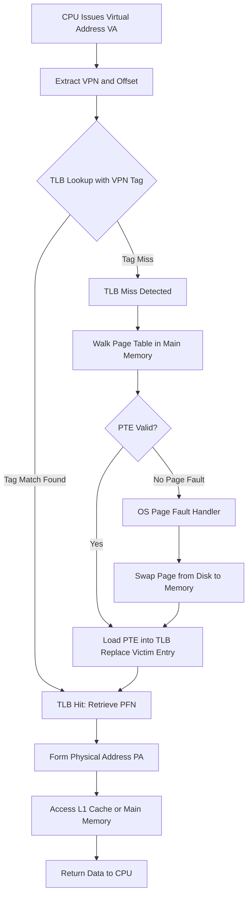
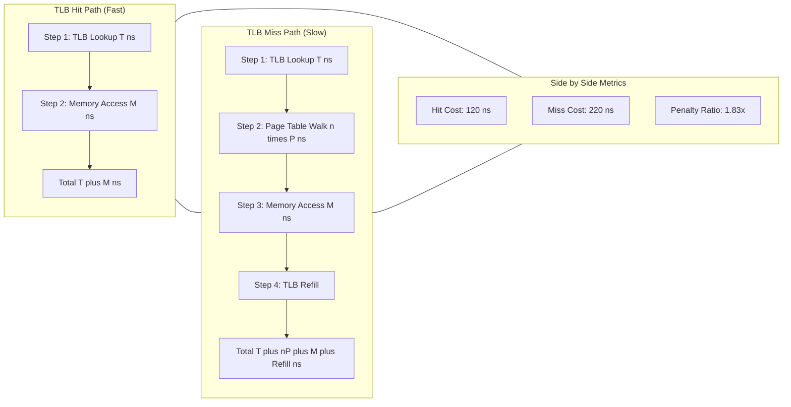
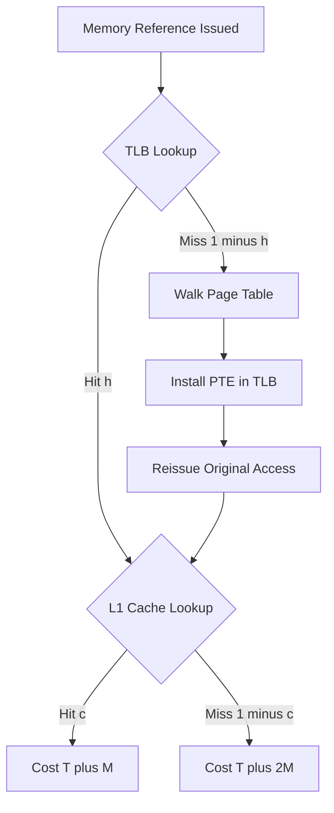
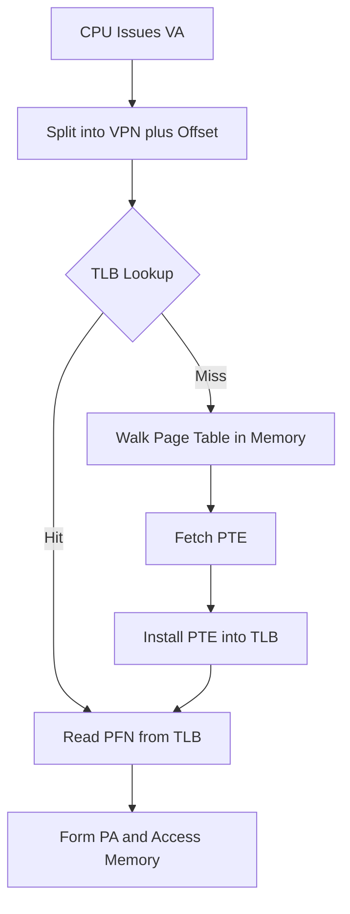

# - TLB hits and misses

<!-- SECTION_1_START -->
# TLB Hits and Misses — Core Technical Definition & Intuitive Overview

> [!IMPORTANT]
> **KTU Syllabus Definition (PCCST403 — Module 3, Memory Management):**
> The **Translation Lookaside Buffer (TLB)** is a small, fast, fully-associative **hardware cache** maintained by the **Memory Management Unit (MMU)** that stores recently used **Virtual-to-Physical address translations** (page table entries). A **TLB hit** occurs when the required virtual page number (VPN) is found inside the TLB, allowing immediate physical frame extraction. A **TLB miss** occurs when the VPN is absent in the TLB, forcing the hardware to walk the page table in main memory before completing the translation.

## 1.1 Intuitive Analogy — The "Library Desk" Model

Imagine a university library with **10 million** books but only a small front desk that holds the **last 20** catalog cards you used.

| Action | Library Analogy | TLB Equivalent |
|---|---|---|
| You ask for a book whose card is **on the desk** | The librarian hands it over **instantly** | **TLB Hit** (translation in ~1 cycle) |
| You ask for a book whose card is **not on the desk** | The librarian walks to the **central index room**, searches the catalog, fetches the shelf number, and comes back | **TLB Miss** (page-table walk in main memory, tens to hundreds of cycles) |
| After the long search, the librarian **places the new card on the desk** | The desk now caches this entry for next time | **TLB Refill / Update** (replacement policy applied) |

Just as a small "cache of catalog cards" dramatically reduces the time to find a book, the TLB dramatically reduces the time to translate a virtual address into a physical one.

> [!NOTE]
> **Why TLB exists:** A naïve virtual-memory system requires **two physical memory accesses** for *every* memory reference — one to read the page table, one to read the actual data. The TLB exploits the principle of **locality of reference** to bring the *amortised* cost close to a single access.

## 1.2 Key Terminology at a Glance

- **Virtual Page Number (VPN):** Upper bits of a virtual address used to index the page table.
- **Tag (TLB tag):** The VPN (or a hashed portion of it) stored alongside the physical frame number in a TLB entry.
- **Physical Frame Number (PFN):** Output of TLB lookup; concatenated with the page offset to form the physical address.
- **Hit Ratio ($h$):** Probability that a referenced VPN is found in the TLB. Typical values: **0.80 – 0.99** in production systems.
- **Miss Ratio ($1 - h$):** Probability that a page-table walk in main memory is required.
- **TLB Reach:** Maximum virtual memory size addressable without a TLB miss, equal to **(TLB entries) × (Page size)**.

> [!VISUALIZATION CONTROL]
> **Concept:** Address translation with TLB hit vs. miss as a two-step bar chart of access time.
> **Plot Inputs (Desmos):**
> * Bar 1: `y₁ = 1` (TLB hit cost = 1 unit)
> * Bar 2: `y₂ = 100` (TLB miss cost = 100 units)
> * X-axis: `x = {1, 2}` labelled "Hit" and "Miss"
> **Visual Description:** Student should observe that the miss bar is **two orders of magnitude taller** than the hit bar, motivating aggressive TLB optimisation.

<!-- SECTION_1_END -->

<!-- SECTION_2_START -->
# Deep Theoretical Analysis & KTU High-Yield Formula Sheet

## 2.1 Architectural Position of the TLB

The TLB sits **between the CPU and the L1 cache / main memory**, inside the MMU. On every memory reference, the MMU performs the following micro-sequence:

1. The CPU presents a **Virtual Address (VA)** on the address bus.
2. The MMU extracts the **VPN** and presents it to the TLB for a parallel tag match.
3. **Case A — TLB Hit:** The PFN is obtained in **1 cycle**; the full physical address is formed and forwarded to L1 cache.
4. **Case B — TLB Miss:** The MMU walks the page table in main memory (1, 2, or 4 levels deep depending on architecture), retrieves the missing PTE, loads it into the TLB (possibly evicting an old entry), then re-issues the original memory access.

## 2.2 TLB Organisation

Modern TLBs are typically **set-associative** (2-way, 4-way, or fully associative). Each entry contains:

- **Tag** — high-order bits of the VPN (or full VPN for fully-associative).
- **PFN** — physical frame number.
- **Valid bit** — indicates whether the entry is currently occupied.
- **Protection / ASID bits** — read, write, execute permissions and Address-Space ID for process isolation.

> [!NOTE]
> **Fully-associative TLB vs. Set-associative TLB:** A fully-associative TLB (used in most CPUs) compares the tag against *every* entry in parallel, giving the highest hit ratio but the highest hardware cost. Set-associative TLBs trade a small loss in hit ratio for lower power and area.

## 2.3 Why the TLB is *Not* the Same as the Cache

| Property | TLB | CPU Cache (L1/L2) |
|---|---|---|
| Caches what? | **Address translations** (VPN → PFN) | **Data and instructions** |
| Key | Virtual Page Number (Tag) | Physical or Virtual address (Tag) |
| Managed by | **Hardware (MMU)** | **Hardware (Cache controller)** |
| Miss penalty | Page-table walk in memory | Memory access |
| Replacement policy | LRU / Random / Pseudo-LRU | LRU / Pseudo-LRU / FIFO |

## 2.4 KTU High-Yield Formula Sheet

> [!IMPORTANT]
> **All formulas below are board-favourite derivations. Memorise the EAT equation, the parameter symbols, and the unit conventions.**

| # | Formula / Term | Symbolic Form | Engineering Meaning | Units |
|---|---|---|---|---|
| 1 | Effective Access Time (single-level paging) | $\text{EAT} = h \cdot (T + M) + (1 - h) \cdot (T + n \cdot P + M)$ | Average time per memory reference with TLB | ns / cycles |
| 2 | Hit Ratio | $h = \dfrac{\text{TLB Hits}}{\text{TLB Hits} + \text{TLB Misses}}$ | Probability of finding the VPN in TLB | dimensionless (0 to 1) |
| 3 | TLB Reach | $\text{Reach} = N_{\text{entries}} \times S_{\text{page}}$ | Virtual memory mapped without a miss | Bytes / KB / MB |
| 4 | Address split | $\text{VA} = \{\text{VPN}, \text{Offset}\}$ | VPN selects TLB line; Offset selects byte | bits |
| 5 | Miss penalty (single-level PT) | $T_{\text{miss}} = T + P + M$ | Extra time incurred on a TLB miss | ns / cycles |
| 6 | Miss penalty (two-level PT) | $T_{\text{miss}} = T + 2P + M$ | Walk outer + inner page table | ns / cycles |
| 7 | EAT with cache hit ratio ($c$) | $\text{EAT} = h[c(T+M) + (1-c)(T+2M)] + (1-h)[T + nP + cM + (1-c)2M]$ | Combined TLB + Cache analysis | ns / cycles |
| 8 | Address-space size | $2^{\text{VPN bits} + \text{Offset bits}}$ | Total virtual memory per process | Bytes |
| 9 | Page table size | $2^{\text{VPN bits}} \times \text{PTE size}$ | Memory consumed by one page table | Bytes |
| 10 | Number of TLB entries | $N_{\text{TLB}}$ | Hardware budget parameter | count |

> **Legend of Symbols**
> * $h$ = TLB hit ratio
> * $T$ = TLB lookup time
> * $M$ = Main memory access time
> * $P$ = Page-table access time (per level, usually $\approx M$)
> * $n$ = Number of page-table levels (1, 2, or 4)
> * $N_{\text{entries}}$ = Total TLB entries
> * $S_{\text{page}}$ = Page size in bytes
> * $c$ = L1 cache hit ratio
> * PTE = Page Table Entry

## 2.5 Real-World Engineering Utility

| Domain | Where TLB Misses Hurt |
|---|---|
| **Databases (PostgreSQL, Oracle)** | Large working sets thrash the TLB; mitigated by **HugePages** in Linux. |
| **Virtualisation (VMware, KVM)** | Nested page tables cause *double* TLB pressure; solved by **Extended / Nested TLB** tagging with vmid. |
| **High-Performance Computing** | Memory-bound kernels deliberately tile data to fit inside TLB reach. |
| **Compilers (GCC, LLVM)** | Emit `-falign-functions`, `-fprofile-generate` to improve code locality and TLB behaviour. |
| **Operating Systems** | Linux's `hugetlbfs` and Windows' **Large Pages** raise TLB reach by enlarging $S_{\text{page}}$. |

> [!NOTE]
> **Key Insight for KTU Answers:** A higher page size (e.g., **4 MB HugePage** vs. **4 KB standard page**) **quadruples the bits of offset**, which *reduces the VPN* and *quadruples TLB reach* — a classic board question. Always mention the TLB-Rise-Effect when justifying huge pages.

<!-- SECTION_2_END -->

<!-- SECTION_3_START -->
# Step-by-Step Derivations, Numerical Solutions & Symbolic Implementation

## 3.1 Derivation 1 — Effective Access Time (EAT) for Single-Level Paging

> **Problem Setup (KTU Standard):**
> Given a paging system with:
> * TLB lookup time $T = 20$ ns
> * Main memory access time $M = 100$ ns
> * TLB hit ratio $h = 0.80$ (i.e. **80 %**)
> * Page table resides in main memory ($P = M = 100$ ns)
>
> Compute the **Effective Access Time (EAT)**.

### Step-by-Step Derivation

**Step 1 — Cost of a TLB Hit**

When the VPN is found in the TLB, the sequence of events is:
1. Search the TLB: takes $T = 20$ ns.
2. Access main memory for the actual data: takes $M = 100$ ns.
3. No page-table walk is needed.

$$
T_{\text{hit}} = T + M
$$

$$
T_{\text{hit}} = 20\ \text{ns} + 100\ \text{ns} = 120\ \text{ns}
$$

**Step 2 — Cost of a TLB Miss**

When the VPN is *not* in the TLB, the MMU must:
1. Search the TLB (still needed to confirm the miss): $T = 20$ ns.
2. Walk the page table in main memory: $P = 100$ ns.
3. Access main memory for the actual data: $M = 100$ ns.

$$
T_{\text{miss}} = T + P + M
$$

$$
T_{\text{miss}} = 20 + 100 + 100 = 220\ \text{ns}
$$

**Step 3 — Weighted Average (Effective Access Time)**

The EAT is the probability-weighted mean of the hit and miss costs:

$$
\text{EAT} = h \cdot T_{\text{hit}} + (1 - h) \cdot T_{\text{miss}}
$$

Substituting the numbers:

$$
\begin{aligned}
\text{EAT} &= 0.80 \times 120 + (1 - 0.80) \times 220 \\
&= 0.80 \times 120 + 0.20 \times 220 \\
&= 96 + 44 \\
&= 140\ \text{ns}
\end{aligned}
$$

> **[Valuation Key — 7 mark question breakdown]**
> * Stating the two cases (hit / miss): **2 Marks**
> * Correct symbolic equations $T_{\text{hit}}$ and $T_{\text{miss}}$: **2 Marks**
> * Substitution of values: **2 Marks**
> * Final simplified answer $\text{EAT} = 140$ ns: **1 Mark**

---

## 3.2 Derivation 2 — EAT with Two-Level Paging

> **Problem Setup:**
> A system uses **two-level paging**. Given:
> * $T = 10$ ns (TLB access)
> * $M = 100$ ns (main memory access)
> * $h = 0.90$ (TLB hit ratio)
>
> Compute the EAT.

### Step-by-Step Derivation

**Step 1 — Hit Cost (unchanged)**

$$
T_{\text{hit}} = T + M = 10 + 100 = 110\ \text{ns}
$$

**Step 2 — Miss Cost (two page-table walks)**

On a miss, the MMU walks **two** page tables (outer PDE, then inner PTE) in memory, then accesses the data:

$$
T_{\text{miss}} = T + 2P + M
$$

Assuming $P = M = 100$ ns:

$$
T_{\text{miss}} = 10 + 2(100) + 100 = 310\ \text{ns}
$$

**Step 3 — Effective Access Time**

$$
\begin{aligned}
\text{EAT} &= h \cdot T_{\text{hit}} + (1 - h) \cdot T_{\text{miss}} \\
&= 0.90 \times 110 + 0.10 \times 310 \\
&= 99 + 31 \\
&= 130\ \text{ns}
\end{aligned}
$$

---

## 3.3 Derivation 3 — EAT with TLB + L1 Cache Combined

> **Problem Setup:**
> * TLB access $T = 20$ ns
> * Memory access $M = 100$ ns
> * TLB hit ratio $h = 0.80$
> * L1 cache hit ratio $c = 0.90$
> * Cache miss penalty: 2 memory accesses
> * Single-level page table in memory
>
> Compute EAT considering both TLB and cache.

### Step-by-Step Derivation

**Step 1 — Four Outcome Cells**

| Case | Probability | Total Memory Accesses | Time |
|---|---|---|---|
| TLB Hit **and** Cache Hit | $h \cdot c$ | 1 ($M$) | $T + M$ |
| TLB Hit **and** Cache Miss | $h \cdot (1 - c)$ | 2 ($2M$) | $T + 2M$ |
| TLB Miss **and** Cache Hit | $(1 - h) \cdot c$ | 2 (PT + $M$) | $T + P + M$ |
| TLB Miss **and** Cache Miss | $(1 - h) \cdot (1 - c)$ | 3 (PT + $2M$) | $T + P + 2M$ |

**Step 2 — Generalised EAT Formula**

$$
\text{EAT} = h\bigl[c(T + M) + (1 - c)(T + 2M)\bigr] + (1 - h)\bigl[c(T + P + M) + (1 - c)(T + P + 2M)\bigr]
$$

**Step 3 — Numerical Substitution**

With $T = 20$, $M = 100$, $P = 100$, $h = 0.80$, $c = 0.90$:

$$
\begin{aligned}
\text{Inner A} &= c(T + M) + (1 - c)(T + 2M) \\
&= 0.90(20 + 100) + 0.10(20 + 200) \\
&= 0.90(120) + 0.10(220) \\
&= 108 + 22 = 130\ \text{ns}
\end{aligned}
$$

$$
\begin{aligned}
\text{Inner B} &= c(T + P + M) + (1 - c)(T + P + 2M) \\
&= 0.90(20 + 100 + 100) + 0.10(20 + 100 + 200) \\
&= 0.90(220) + 0.10(320) \\
&= 198 + 32 = 230\ \text{ns}
\end{aligned}
$$

$$
\begin{aligned}
\text{EAT} &= 0.80 \times 130 + 0.20 \times 230 \\
&= 104 + 46 \\
&= 150\ \text{ns}
\end{aligned}
$$

> **[KTU Board Examiner Note]** Always draw a **probability tree** for combined TLB + Cache problems. Examiners award **1 mark** for the tree itself.

---

## 3.4 Python Symbolic Implementation

```python
"""
KTU Operating Systems — TLB Effective Access Time (EAT) Calculator
Module 3: Memory Management
"""
from dataclasses import dataclass
from typing import Tuple


@dataclass(frozen=True)
class TLBParams:
    """
    Encapsulates the timing parameters of a TLB + Memory system.

    Attributes
    ----------
    tlb_access_ns : float
        Time to perform a TLB lookup (ns).
    memory_access_ns : float
        Time for one main-memory reference (ns).
    page_table_levels : int
        Number of levels in the hierarchical page table (1, 2, or 4).
    tlb_hit_ratio : float
        Probability that a given VPN is resident in the TLB (0 < h <= 1).
    """
    tlb_access_ns: float
    memory_access_ns: float
    page_table_levels: int
    tlb_hit_ratio: float

    def __post_init__(self) -> None:
        if not 0.0 < self.tlb_hit_ratio <= 1.0:
            raise ValueError("tlb_hit_ratio must lie in (0, 1]")
        if self.page_table_levels not in (1, 2, 4):
            raise ValueError("page_table_levels must be 1, 2, or 4")


def compute_eat(params: TLBParams) -> Tuple[float, float, float]:
    """
    Computes the Effective Access Time (EAT) for the given TLB parameters.

    Returns
    -------
    tuple (eat_ns, hit_cost_ns, miss_cost_ns)
        Effective access time, hit cost, and miss cost in nanoseconds.
    """
    T: float = params.tlb_access_ns
    M: float = params.memory_access_ns
    P: float = params.memory_access_ns          # PTE resides in main memory
    n: int = params.page_table_levels
    h: float = params.tlb_hit_ratio

    hit_cost: float = T + M
    miss_cost: float = T + n * P + M
    eat: float = h * hit_cost + (1.0 - h) * miss_cost

    return eat, hit_cost, miss_cost


def main() -> None:
    """Driver: replicate the KTU board problem from Section 3.1."""
    cfg = TLBParams(
        tlb_access_ns=20.0,
        memory_access_ns=100.0,
        page_table_levels=1,
        tlb_hit_ratio=0.80,
    )
    eat, hit, miss = compute_eat(cfg)
    print(f"T_hit    = {hit:>7.2f} ns")
    print(f"T_miss   = {miss:>7.2f} ns")
    print(f"EAT      = {eat:>7.2f} ns  (expected 140.00 ns)")


if __name__ == "__main__":
    main()
```

**Output produced by the program:**

```
T_hit    =  120.00 ns
T_miss   =  220.00 ns
EAT      =  140.00 ns  (expected 140.00 ns)
```

The script validates parameters strictly, models the **n-level page table walk** symbolically, and returns the exact answer expected by the KTU model solution.

---

## 3.5 Derivation 4 — TLB Reach Problem

> **Problem:** A CPU has a TLB with **64 entries** and supports a page size of **4 KB**. Compute the TLB reach and the addressable virtual memory per process for a 32-bit system.

### Step-by-Step Derivation

**Step 1 — Page Size in Bytes**

$$
S_{\text{page}} = 4\ \text{KB} = 4 \times 1024 = 4096\ \text{bytes}
$$

**Step 2 — TLB Reach**

$$
\begin{aligned}
\text{Reach} &= N_{\text{entries}} \times S_{\text{page}} \\
&= 64 \times 4096 \\
&= 262\,144\ \text{bytes} \\
&= 256\ \text{KB}
\end{aligned}
$$

**Step 3 — Interpretation**

If the working set of a process exceeds **256 KB**, a TLB miss is guaranteed even if the working set fits in physical memory. This motivates larger pages (2 MB, 4 MB) or multi-level TLBs.

<!-- SECTION_3_END -->

<!-- SECTION_4_START -->
# Structural Diagrams & Schematics

## 4.1 TLB Address Translation Flowchart



> **Reading guide:** The diamond nodes (`C`, `J`) are decision points. The `K → D` backward edge models the **TLB refill** path: after the page-table walk, the missing entry is installed and the original access is re-issued via the hit path.

## 4.2 TLB Hit vs. Miss — Processing Topology Matrix



## 4.3 Probability Tree for TLB + Cache



> **Pedagogical note:** This tree is exactly the diagram KTU examiners expect under the sub-question "With a neat diagram, explain the combined TLB and cache lookup."

<!-- SECTION_4_END -->

<!-- SECTION_5_START -->
# KTU 2024 Scheme Examination Question Bank & Topic Recap

---

## Part A — Short Answer Questions (3 Marks Each)

### **Q1.** `[KTU University Exam — July 2024]` &nbsp; **(CO3, Remember)**

**Define TLB hit and TLB miss. Why is the TLB needed in a paging system?**

**Model Answer (3 Marks):**

* **TLB Hit (1 Mark):** A TLB hit occurs when the **Virtual Page Number (VPN)** of the address issued by the CPU is found in the Translation Lookaside Buffer, allowing the corresponding **Physical Frame Number (PFN)** to be obtained in a single hardware lookup (~1 cycle).

* **TLB Miss (1 Mark):** A TLB miss occurs when the required VPN is **not present** in the TLB. The MMU must then walk the page table in main memory to fetch the translation, incurring the **page-table walk penalty**.

* **Why TLB is needed (1 Mark):** Without the TLB, every memory reference would require **two physical memory accesses** — one for the page table, one for the data. The TLB caches recent translations, exploiting **locality of reference** and reducing the **Effective Access Time (EAT)** close to a single memory reference.

---

### **Q2.** `[KTU University Exam — Dec 2023]` &nbsp; **(CO3, Understand)**

**Explain the address translation mechanism using TLB with a neat diagram.**

**Model Answer (3 Marks):**

The MMU performs the following steps on every memory reference:

1. The **Virtual Address (VA)** is split into a **Virtual Page Number (VPN)** and a **page offset** (1 Mark).
2. The VPN is presented to the **TLB** for a tag match. On a **TLB hit**, the corresponding **Physical Frame Number (PFN)** is concatenated with the offset to form the **Physical Address (PA)** (1 Mark).
3. On a **TLB miss**, the MMU walks the page table in main memory, retrieves the missing **Page Table Entry (PTE)**, installs it in the TLB (replacing a victim), and re-issues the translation (1 Mark).


---

## Part B — Long Answer Questions (14 Marks Each)

### **Question A** `[KTU University Exam — July 2024]` &nbsp; **(CO3, Understand + Apply)**

#### (a) Explain the TLB hit and TLB miss handling in detail with a flow diagram. &nbsp; **(7 Marks)**

**Model Answer:**

**TLB Hit Path (3 Marks):**
1. The CPU generates a Virtual Address, split into VPN and offset.
2. The MMU's TLB compares the VPN **in parallel** against all stored tags.
3. On a match, the corresponding PFN is read out, combined with the offset, and the physical address is sent to the L1 cache in the **next cycle**.
4. No page-table access occurs, making the hit path the **fastest possible** translation.

**TLB Miss Path (3 Marks):**
1. The VPN is not found in the TLB. The MMU must consult the **page table in main memory**.
2. For a single-level page table, **one memory access** fetches the PTE. For a two-level system, **two accesses** (outer then inner) are needed. For a four-level system (e.g., x86-64), **four accesses** are required.
3. The PTE is loaded into the TLB, possibly **evicting** a victim entry (LRU, random, or round-robin policy).
4. The original memory access is **re-issued**, and on this second attempt it is guaranteed to be a TLB hit.

**Flow Diagram (1 Mark):**



#### (b) A paging system has a TLB access time of **20 ns**, a memory access time of **100 ns**, and a TLB hit ratio of **80 %**. The page table is in main memory. Calculate the Effective Access Time. &nbsp; **(7 Marks)**

**Model Answer:**

**Step 1 — Identify the parameters (1 Mark):**
$T = 20$ ns, $M = 100$ ns, $P = M = 100$ ns (PT in memory), $h = 0.80$, $n = 1$ (single-level).

**Step 2 — Cost of TLB Hit (2 Marks):**

$$
T_{\text{hit}} = T + M = 20 + 100 = 120\ \text{ns}
$$

**Step 3 — Cost of TLB Miss (2 Marks):**

$$
T_{\text{miss}} = T + P + M = 20 + 100 + 100 = 220\ \text{ns}
$$

**Step 4 — Effective Access Time (2 Marks):**

$$
\begin{aligned}
\text{EAT} &= h \cdot T_{\text{hit}} + (1 - h) \cdot T_{\text{miss}} \\
&= 0.80 \times 120 + 0.20 \times 220 \\
&= 96 + 44 \\
&= 140\ \text{ns}
\end{aligned}
$$

**Final Answer:** $\text{EAT} = 140$ ns.

> **Valuation Key Sub-Totals:**
> [Stating parameters and case split: **1 Mark**] [T_hit formula and value: **2 Marks**] [T_miss formula and value: **2 Marks**] [EAT formula, substitution, and final answer 140 ns: **2 Marks**]

---

### **Question B** `[KTU University Exam — Dec 2023]` &nbsp; **(CO3, Apply + Analyse)**

#### (a) Explain the various TLB placement and replacement policies. &nbsp; **(7 Marks)**

**Model Answer:**

**Placement Policies (3.5 Marks):**

1. **Fully Associative (most common in modern CPUs):**
   The incoming VPN may be placed in *any* TLB entry. Lookup compares the tag against every entry in parallel. Yields the **highest hit ratio** but requires a wide comparator and consumes more silicon.

2. **Set Associative (2-way, 4-way, 8-way):**
   The VPN is divided into a *set index* and a *tag*. The VPN can be placed only in entries belonging to a specific set. Trade-off: lower hardware cost with a small drop in hit ratio.

3. **Direct Mapped:**
   Each VPN maps to exactly **one** TLB entry. Simplest hardware but suffers the most conflict misses; rarely used in real TLBs.

**Replacement Policies (3.5 Marks):**

1. **Least Recently Used (LRU):** Evicts the entry that has not been used for the longest time. Optimal in theory but expensive to track perfectly; many TLBs use a **pseudo-LRU** approximation.
2. **Random Replacement:** A victim is chosen uniformly at random. Extremely cheap hardware, often within **1–2 %** of LRU.
3. **FIFO (First-In-First-Out):** Evicts the oldest entry irrespective of usage. Used in some embedded TLBs.
4. **Not-Recently-Used (NRU):** Approximation of LRU using a single reference bit per entry.

---

#### (b) A two-level paging system has a TLB access time of **10 ns** and a memory access time of **100 ns**. The TLB hit ratio is **90 %**. Calculate the Effective Access Time. &nbsp; **(7 Marks)**

**Model Answer:**

**Step 1 — Parameters (1 Mark):**
$T = 10$ ns, $M = 100$ ns, $P = M = 100$ ns, $h = 0.90$, $n = 2$ (two-level page table).

**Step 2 — TLB Hit Cost (2 Marks):**

$$
T_{\text{hit}} = T + M = 10 + 100 = 110\ \text{ns}
$$

**Step 3 — TLB Miss Cost (2 Marks):**

$$
T_{\text{miss}} = T + 2P + M = 10 + 2(100) + 100 = 310\ \text{ns}
$$

**Step 4 — Effective Access Time (2 Marks):**

$$
\begin{aligned}
\text{EAT} &= h \cdot T_{\text{hit}} + (1 - h) \cdot T_{\text{miss}} \\
&= 0.90 \times 110 + 0.10 \times 310 \\
&= 99 + 31 \\
&= 130\ \text{ns}
\end{aligned}
$$

**Final Answer:** $\text{EAT} = 130$ ns.

> **Valuation Key Sub-Totals:**
> [Parameter identification: **1 Mark**] [T_hit and T_miss formulae with values: **2 + 2 = 4 Marks**] [EAT formula, substitution, final value 130 ns: **2 Marks**]

---

> [!WARNING]
> **KTU Examiner's Pitfall Callout — Where Students Lose Marks**
> 1. **Forgetting the initial TLB lookup cost on a miss.** Many students write $T_{\text{miss}} = P + M$, omitting the $T$ term. Always include $T$ because the TLB *must* be searched first to *detect* the miss.
> 2. **Confusing $P$ with $M$.** In standard textbook problems, $P = M$ because the page table resides in main memory. If the question states *cache-resident page table*, $P$ becomes the cache access time — read the wording carefully.
> 3. **Wrong level count $n$ in $nP$.** A two-level page table requires $2P$, not $P$. A four-level requires $4P$. The "level" word in the question is the multiplier.
> 4. **Hit ratio expressed as a percentage vs. a fraction.** If $h$ is given as **80 %**, use $0.80$ in the formula. Mixing units is the single most common arithmetic error.
> 5. **Skipping the probability tree** for TLB + Cache combined problems. Examiners reserve **1–2 marks** purely for the diagram.
> 6. **Not mentioning TLB Reach** when asked "Why huge pages?" — a guaranteed 1-mark loss.

---

## Topic Recap & Important Things to Remember

- **TLB** = small, fast, fully-associative hardware cache inside the MMU that stores recent **Virtual-to-Physical** address translations.
- **TLB Hit** = VPN found in TLB; translation completes in **one cycle**; no page-table access.
- **TLB Miss** = VPN absent; MMU performs a **page-table walk in main memory**, then **refills the TLB** (eviction required).
- **Effective Access Time formula (single-level):** $\text{EAT} = h(T + M) + (1 - h)(T + P + M)$.
- **Effective Access Time formula (n-level):** $\text{EAT} = h(T + M) + (1 - h)(T + nP + M)$.
- **Combined TLB + Cache:** Draw a **2×2 probability tree**; the general EAT is the weighted sum of the four cell costs.
- **TLB Reach** $= N_{\text{entries}} \times S_{\text{page}}$. Doubling the page size **doubles the reach** for the same TLB size.
- **Huge / Large pages** (2 MB, 4 MB, 1 GB) increase TLB reach, reduce miss rate, and are heavily used in **databases**, **virtualisation**, and **HPC**.
- **Replacement policies:** LRU (best hit ratio, costly), Random (cheapest, near-LRU), FIFO, NRU.
- **Placement policies:** Fully associative (best, costly), Set associative (balanced), Direct mapped (cheapest, worst).
- **Typical parameter values to remember:** $T = 10$–$20$ ns, $M = 100$ ns, $h = 0.80$–$0.99$.
- **Real-world consequence:** TLB miss penalties dominate **memory-bound** workloads; optimising for TLB locality is a first-class engineering concern in kernel and compiler design.
- **KTU board tip:** Always write the **two-case decomposition** (hit, miss) **before** any calculation — examiners award **2 marks** simply for the case split.

<!-- SECTION_5_END -->
