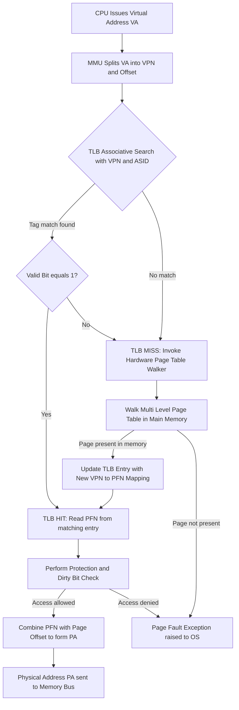
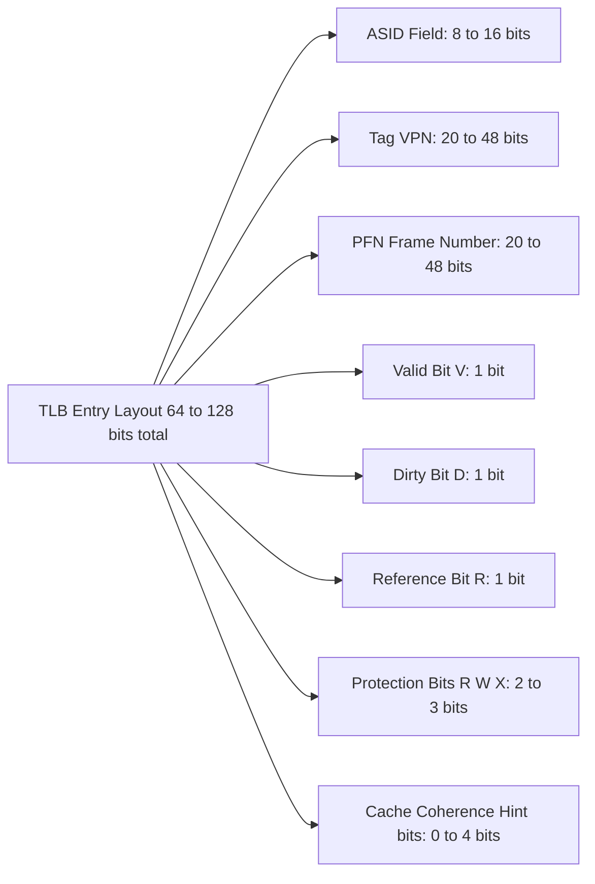
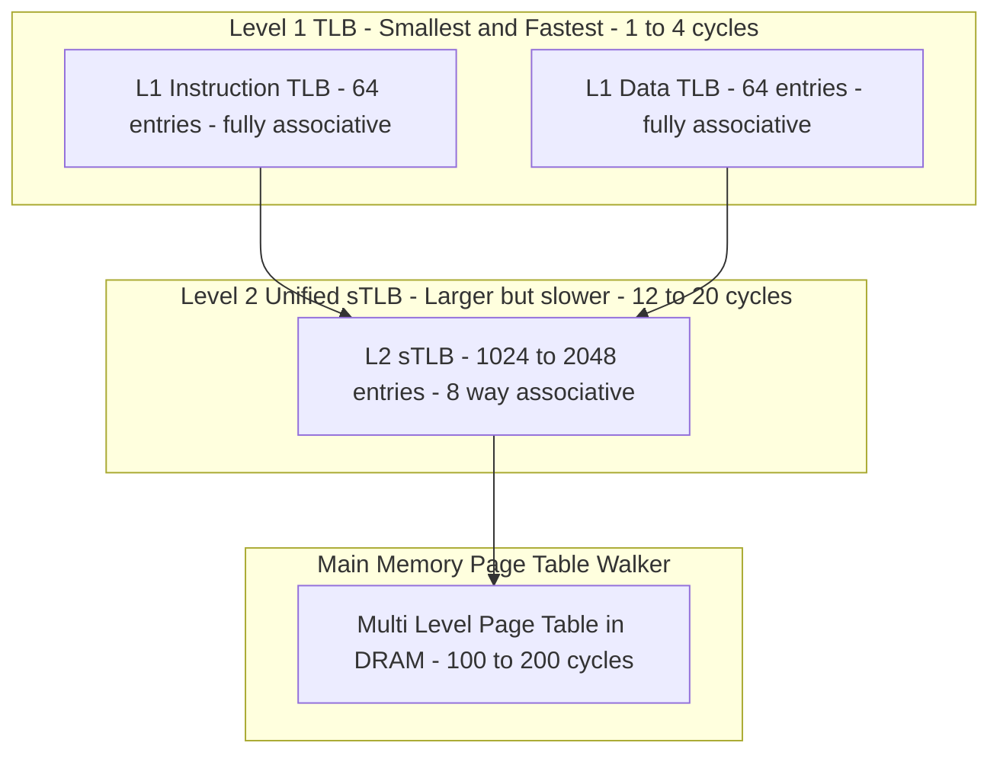
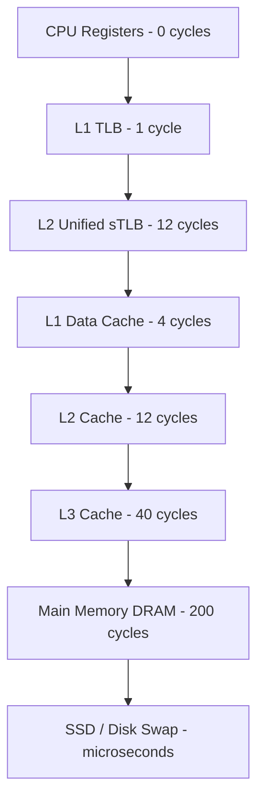
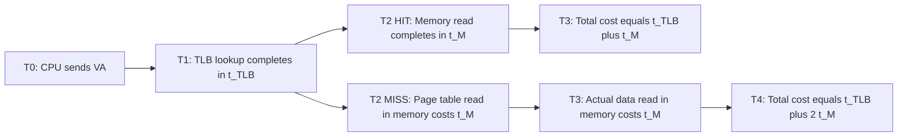

# TLB structure

<!-- SECTION_1_START -->

# TLB Structure — Definition & Intuitive Overview

## Formal KTU 2024 Definition

> [!IMPORTANT]
> **Translation Lookaside Buffer (TLB)** is a small, high-speed **fully (or set-) associative hardware cache** built inside the **Memory Management Unit (MMU)** of the processor. It stores a limited number of recently used **virtual-to-physical page frame translations** so that the CPU can resolve virtual addresses without repeatedly consulting the multi-level page table in main memory.

In the KTU Operating Systems syllabus (PCCST403, Module 3 — Memory Management), the TLB is treated as a critical performance-enhancement layer that sits *between* the **CPU core** and the **page table walker** mechanism.

> [!NOTE]
> **KTU Highlight** — The TLB is **hardware-managed by default** in modern CPUs (x86, ARM, RISC-V). Software-managed TLB exists in some architectures (e.g., MIPS, older SPARC, IA-64 Itanium) where a TLB miss triggers a software exception, and the OS page-fault handler reloads the translation.

---

## Conceptual Analogy — The Librarian's Quick-Reference Card

Imagine a librarian who gets hundreds of book requests every minute. Instead of walking to the giant catalogue drawer (the *page table* in main memory) for every request, the librarian keeps the **20 most recently used catalogue numbers on a small index card pinned to the desk**.

| Element in the Analogy | Real OS Component |
| :--- | :--- |
| Index card on the desk | **TLB** (small, fast SRAM) |
| Big catalogue drawer | **Page Table** in main memory |
| Book title being searched | **Virtual Page Number (VPN)** |
| Stack / shelf number returned | **Physical Frame Number (PFN)** |
| Looking up the index card | **TLB lookup** (~1 cycle) |
| Walking to the catalogue drawer | **Page table walk** (multiple memory accesses) |
| Erasing old cards to make room | **TLB replacement** (LRU / Random) |

> [!TIP]
> **Key insight for students:** Just like the librarian's index card works *only* for popular books, the TLB is useful because of **temporal and spatial locality** — programs tend to repeatedly access the same small set of pages (loop variables, stack frame, code section).

---

## Physical Constants & Standard Metrics

The following standard OS-textbook metrics are used in TLB analysis (must be in **bold** as per KTU 2024 convention):

- **TLB lookup time ($t_{TLB}$): typically 1 – 20 ns** (often a single CPU cycle on modern cores).
- **Memory access time ($t_M$): typically 100 – 200 ns** (DRAM access without cache hits).
- **TLB size: typically 64 – 2048 entries** (Intel Skylake has 1536 L1-DTLB entries; AMD Zen 3 has 64-entry L1 + 2048-entry L2).
- **TLB hit ratio ($h$): typically 0.80 – 0.99** for well-behaved workloads.
- **TLB miss ratio = $1 - h$**.

---

## Visualization of the TLB Concept

> [!VISUALIZATION CONTROL]
> **Concept:** Effective Access Time (EAT) plotted as a function of TLB hit ratio $h$.
> **GeoGebra / Desmos Input Equations:**
> * $f(h) = 20 + (2-h) \cdot 100$  *(EAT with $t_{TLB} = 20$ ns, $t_M = 100$ ns)*
> * $g(h) = 2 \cdot 100$  *(Constant EAT = 200 ns if no TLB exists)*
>
> **Visual Description:** On the horizontal $h$-axis (range 0 to 1) and vertical EAT-axis (range 0 to 250 ns), $f(h)$ should be observed as a **straight line with negative slope**, descending from **220 ns at $h = 0$** down to **120 ns at $h = 1$**. The line $g(h)$ should be observed as a **horizontal line at 200 ns**, which $f(h)$ crosses at approximately $h = 0.2$. The student should note that for hit ratios greater than 20%, the TLB-equipped system is faster than the no-TLB baseline.

---

<!-- SECTION_1_END -->

<!-- SECTION_2_START -->

# Deep Theoretical Analysis & KTU High-Yield Formula Sheet

## 1. Internal Structure of a Single TLB Entry

A TLB entry does **not** store the entire virtual address. Instead, it stores a **tag** (used for associative matching) and the corresponding physical frame data.

| Field | Width (typical) | Purpose |
| :--- | :--- | :--- |
| **Tag (Virtual Page Number)** | ~20 – 48 bits | Used for *content-addressable* matching against incoming VPN |
| **Physical Frame Number (PFN)** | ~20 – 48 bits | The actual main-memory frame to which this page maps |
| **Valid Bit (V)** | 1 bit | 1 = entry holds a valid translation; 0 = entry is empty / stale |
| **Dirty / Modified Bit (D)** | 1 bit | 1 = page has been written to; needed for write-back policies |
| **Reference / Use Bit (R)** | 1 bit | Set on every TLB hit; used by replacement logic (LRU) |
| **Protection Bits** | 2 – 3 bits | Read / Write / Execute permissions |
| **ASID (Address Space ID)** | 8 – 16 bits | Identifies which process owns the entry; enables context isolation |

> [!NOTE]
> **Why is an ASID needed?** When the OS performs a **context switch**, it does *not* flush the TLB entirely (that would be expensive). Instead, the incoming process's ASID is loaded into a special register, and TLB lookups match both the VPN *and* the ASID — preventing one process from accidentally translating another process's address.

## 2. How TLB Lookup Works — Step-by-Step Logic

1. The CPU issues a **Virtual Address (VA)** on the address bus.
2. The MMU extracts the **Virtual Page Number (VPN)** and the **page offset**.
3. The **TLB controller** simultaneously compares the VPN against **all stored tags** (because the TLB is fully or highly set-associative — this is a *parallel* comparison using CAM cells).
4. **ASID check** is performed in parallel to ensure the matching entry belongs to the current process.
5. If a tag matches **AND** the Valid bit is 1 **AND** the protection check passes ⇒ **TLB HIT** ⇒ PFN is concatenated with the offset to form the **Physical Address (PA)**.
6. If no tag matches (or Valid = 0) ⇒ **TLB MISS** ⇒ the hardware (or OS, in software-managed TLB) walks the page table in main memory to find the correct PFN.
7. On miss, the new translation is **inserted into the TLB**, potentially evicting an older entry per the replacement policy (LRU, Random, or FIFO).

## 3. TLB Associativity Models

The TLB is organized like any cache, but with a strong preference for high associativity to keep the miss rate low.

| Organization | Lookup Mechanism | Pros | Cons |
| :--- | :--- | :--- | :--- |
| **Direct-Mapped TLB** | VPN modulo N selects one slot | Fastest, simplest | High conflict misses |
| **Set-Associative TLB** (2-, 4-, 8-way) | VPN selects a set, then parallel tag compare within the set | Good balance | Slightly slower than direct-mapped |
| **Fully Associative TLB** | Tag compared against *every* entry in parallel | Lowest miss rate | Most expensive (CAM hardware) |

> [!TIP]
> **KTU favourite:** The exam often asks you to justify why the TLB is **fully (or highly set-) associative** rather than direct-mapped. The answer: because page-conflict misses on a direct-mapped TLB would be devastating — even a tiny working set of pages could thrash.

## 4. TLB Miss Handling — Hardware vs. Software

- **Hardware-Managed TLB (x86, ARM):** The MMU has a dedicated *hardware page-table walker* that autonomously reads the CR3/TTBR0 register, walks the multi-level page table, updates the TLB, and retries the access. The OS is *not* involved unless the page is genuinely not in memory (true *page fault*).
- **Software-Managed TLB (MIPS, SPARC, Itanium):** A TLB miss raises a *TLB refill exception*. The OS exception handler reads the page-table entry, writes it into the TLB using a privileged `TLBWI` / `TLBWR` instruction, and *returns from exception*. The original instruction is re-executed.

## 5. KTU Formula Sheet / Cheat Sheet

> [!IMPORTANT]
> **Master these formulas — they appear in 80% of ESE numerical questions.**

| $\#$ | Formula Name | Equation | Variables / Units |
| :---: | :--- | :--- | :--- |
| 1 | EAT (TLB hit + miss, single-level paging) | $EAT = h \cdot (t_{TLB} + t_M) + (1-h) \cdot (t_{TLB} + 2t_M)$ | $h \in [0,1]$, time in ns |
| 2 | EAT simplified | $EAT = t_{TLB} + (2-h) \cdot t_M$ | Derived from (1) |
| 3 | EAT with two-level page table | $EAT = h \cdot (t_{TLB} + t_M) + (1-h) \cdot (t_{TLB} + 3t_M)$ | Outer + inner PT walk |
| 4 | Speedup factor over no-TLB | $S = \dfrac{2 \cdot t_M}{EAT}$ | $S > 1$ means TLB helps |
| 5 | TLB reach | $R = N_{entries} \cdot P_{size}$ | $N$ = entries, $P$ = page size (bytes) |
| 6 | Miss penalty in cycles | $P_{miss} = \dfrac{EAT - (t_{TLB} + t_M)}{t_{cycle}}$ | Useful for AMAT analysis |
| 7 | Required hit ratio for target EAT | $h_{req} = 2 - \dfrac{EAT_{target} - t_{TLB}}{t_M}$ | Inverse of (2) |

## 6. Real-World Engineering Utility

- **CPU Performance Pipelines:** Every modern x86-64 / ARM core (Intel Core i9, AMD Ryzen, Apple M-series) integrates a **2-level TLB** (L1 split I-TLB / D-TLB, unified L2 sTLB). Performance counters like `dTLB-loads`, `dTLB-load-misses` are first-class performance-monitoring events used by profilers (`perf stat` on Linux).
- **Virtualization (Hypervisors):** Nested paging (Intel EPT, AMD NVP) introduces a *second* layer of TLB lookups — the *tagged TLB* in KVM/Xen uses ASIDs derived from both guest-VMID and guest-ASID.
- **Database & HPC tuning:** Large-memory workloads (Redis, in-memory OLAP, scientific simulations) suffer *TLB thrashing* when the working set exceeds the TLB reach. Solutions include **huge pages (2 MB / 1 GB)** to inflate the TLB reach, and **Memory Pool Allocators (jemalloc, tcmalloc)** to reduce page diversity.
- **Security:** TLB-based side-channel attacks (e.g., *Meltdown*, *TLBleed*) exploit timing differences between TLB hits and misses to leak information across security boundaries.

---

<!-- SECTION_2_END -->

<!-- SECTION_3_START -->

# Step-by-Step Derivations & Symbolic Implementation

## Derivation 1 — Effective Access Time (EAT) with TLB (Single-Level Paging)

### Setup

Let:
- $t_{TLB}$ = time to look up the TLB (ns)
- $t_M$ = time to access main memory once (ns)
- $h$ = TLB hit ratio (probability $0 \le h \le 1$)
- $1 - h$ = TLB miss ratio

### Case A — TLB Hit

The MMU finds the translation in the TLB in $t_{TLB}$ time. It then accesses physical memory once in $t_M$ time to fetch the actual data word.

$$T_{hit} = t_{TLB} + t_M$$

### Case B — TLB Miss (single-level page table, page table resides in memory)

The MMU does *not* find the translation in the TLB. It must:

1. Spend $t_{TLB}$ confirming the miss.
2. Access main memory to read the page-table entry (PTE) → cost $t_M$.
3. Access main memory a *second* time to read the actual data word using the discovered frame number → cost $t_M$.

$$T_{miss} = t_{TLB} + t_M + t_M = t_{TLB} + 2 \cdot t_M$$

### Expected (Effective) Access Time

$$EAT = h \cdot T_{hit} + (1 - h) \cdot T_{miss}$$

Substituting the two cases:

$$EAT = h \cdot (t_{TLB} + t_M) + (1 - h) \cdot (t_{TLB} + 2 \cdot t_M)$$

Expanding the second term:

$$EAT = h \cdot t_{TLB} + h \cdot t_M + (1 - h) \cdot t_{TLB} + (1 - h) \cdot 2 \cdot t_M$$

Grouping like terms:

$$EAT = \big[h \cdot t_{TLB} + (1-h) \cdot t_{TLB}\big] + \big[h \cdot t_M + 2(1-h) \cdot t_M\big]$$

$$EAT = t_{TLB} \cdot \big[h + 1 - h\big] + t_M \cdot \big[h + 2 - 2h\big]$$

$$EAT = t_{TLB} \cdot (1) + t_M \cdot (2 - h)$$

$$\boxed{\,EAT = t_{TLB} + (2 - h) \cdot t_M\,}$$

### Boundary Sanity Check

- If $h = 1$ (every access hits TLB): $EAT = t_{TLB} + t_M$ → minimum cost (correct: just TLB lookup + one memory read).
- If $h = 0$ (every access misses TLB): $EAT = t_{TLB} + 2 \cdot t_M$ → maximum cost (correct: TLB lookup + two memory reads).

---

## Derivation 2 — EAT with Two-Level Page Table

In a two-level page table, a TLB miss requires:

1. Access outer page table (level 1) → $t_M$
2. Access inner page table (level 2) → $t_M$
3. Access physical memory for the data word → $t_M$

So $T_{miss}^{(2)} = t_{TLB} + 3 \cdot t_M$. Therefore:

$$\boxed{\,EAT_{2L} = h \cdot (t_{TLB} + t_M) + (1 - h) \cdot (t_{TLB} + 3 \cdot t_M)\,}$$

Expanding and simplifying:

$$EAT_{2L} = t_{TLB} + (3 - 2h) \cdot t_M$$

---

## Worked Numerical Example (KTU 14-Mark Style)

### Problem Statement

Consider a paging system with a TLB. The TLB lookup time is **$20$ ns**, and the main memory access time is **$100$ ns**. The TLB hit ratio is **$80\%$**. The page table is stored in main memory.

**(a)** Compute the **Effective Access Time (EAT)**.          *(7 marks)*

**(b)** If the design goal is to bring EAT down to **$130$ ns**, what minimum TLB hit ratio is required? *(7 marks)*

### Part (a) — EAT Calculation

**Step 1 — Identify the given values.**
- $t_{TLB} = 20$ ns
- $t_M = 100$ ns
- $h = 0.80$

**Step 2 — Write the formula.**

$$EAT = h \cdot (t_{TLB} + t_M) + (1 - h) \cdot (t_{TLB} + 2 \cdot t_M)$$

**Step 3 — Substitute the values.**

$$EAT = 0.80 \cdot (20 + 100) + (1 - 0.80) \cdot (20 + 2 \cdot 100)$$

**Step 4 — Evaluate the inner brackets.**

$$EAT = 0.80 \cdot (120) + (0.20) \cdot (20 + 200)$$

$$EAT = 0.80 \cdot (120) + 0.20 \cdot (220)$$

**Step 5 — Compute the products.**

$$EAT = 96 + 44 = 140 \text{ ns}$$

**Step 6 — Cross-check using the simplified formula.**

$$EAT = t_{TLB} + (2 - h) \cdot t_M = 20 + (2 - 0.80) \cdot 100 = 20 + 1.20 \cdot 100 = 20 + 120 = 140 \text{ ns}$$

$$\boxed{\,EAT = 140 \text{ ns}\,}$$

**Step 7 — Interpretation.**
Without a TLB, every access would cost $2 \cdot t_M = 200$ ns. With the TLB at 80% hit ratio, the EAT is $140$ ns, giving a **speedup of $\dfrac{200}{140} \approx 1.43 \times$**.

> **Valuation key points (Part a):**
> * [Stating the formula: 2 Marks]
> * [Substituting the values: 2 Marks]
> * [Computing hit-time and miss-time: 1 Mark]
> * [Final simplified EAT = 140 ns: 2 Marks]

### Part (b) — Required Hit Ratio for EAT = 130 ns

**Step 1 — Set up the equation with $h$ as the unknown.**

$$EAT_{target} = t_{TLB} + (2 - h) \cdot t_M$$

$$130 = 20 + (2 - h) \cdot 100$$

**Step 2 — Isolate $(2 - h)$.**

$$130 - 20 = (2 - h) \cdot 100$$

$$110 = (2 - h) \cdot 100$$

$$2 - h = \dfrac{110}{100} = 1.10$$

**Step 3 — Solve for $h$.**

$$h = 2 - 1.10 = 0.90$$

$$\boxed{\,h_{required} = 0.90 \;\;(90\%)\,}$$

**Step 4 — Interpretation.**
The hit ratio must be improved from **80% → 90%** (a 10 percentage-point gain) to achieve an EAT of 130 ns. This could be achieved by increasing the TLB associativity, switching to a larger TLB, or using **huge pages** to inflate the TLB reach.

> **Valuation key points (Part b):**
> * [Setting up the target equation: 2 Marks]
> * [Subtracting $t_{TLB}$ and dividing by $t_M$: 2 Marks]
> * [Algebraic isolation of $h$: 2 Marks]
> * [Final answer $h = 0.90$ with correct unit / interpretation: 1 Mark]

---

## Python Code — TLB EAT Calculator (with strict typing and error handling)

```python
"""
TLB Effective Access Time (EAT) Calculator
Course: PCCST403 - Operating Systems (KTU 2024 Scheme)
Module 3 - Memory Management - TLB Structure
"""

from dataclasses import dataclass
from typing import Final


@dataclass(frozen=True)
class TLBSystemParams:
    """Immutable container for TLB system parameters.
    All time values are in nanoseconds (ns).
    """
    t_tlb_ns: float          # TLB lookup time
    t_memory_ns: float       # Main memory access time
    hit_ratio: float         # TLB hit ratio, in [0, 1]
    page_table_levels: int   # 1 = single-level PT, 2 = two-level PT


# KTU 2024 Standard Values
STANDARD_PARAMS: Final[TLBSystemParams] = TLBSystemParams(
    t_tlb_ns=20.0,
    t_memory_ns=100.0,
    hit_ratio=0.80,
    page_table_levels=1,
)


class TLBAnalyzer:
    """Computes Effective Access Time (EAT) for paging systems with TLB."""

    # Physical constants for human-readable boundaries
    MIN_HIT_RATIO: Final[float] = 0.0
    MAX_HIT_RATIO: Final[float] = 1.0
    SUPPORTED_PT_LEVELS: Final[frozenset[int]] = frozenset({1, 2})

    def __init__(self, params: TLBSystemParams) -> None:
        self._validate(params)
        self.params: TLBSystemParams = params

    @staticmethod
    def _validate(p: TLBSystemParams) -> None:
        if p.t_tlb_ns <= 0:
            raise ValueError(f"t_tlb_ns must be > 0, got {p.t_tlb_ns}")
        if p.t_memory_ns <= 0:
            raise ValueError(f"t_memory_ns must be > 0, got {p.t_memory_ns}")
        if not (TLBAnalyzer.MIN_HIT_RATIO <= p.hit_ratio <= TLBAnalyzer.MAX_HIT_RATIO):
            raise ValueError(
                f"hit_ratio must lie in [0, 1], got {p.hit_ratio}"
            )
        if p.page_table_levels not in TLBAnalyzer.SUPPORTED_PT_LEVELS:
            raise ValueError(
                f"page_table_levels must be 1 or 2, got {p.page_table_levels}"
            )

    def compute_eat(self) -> float:
        """Compute Effective Access Time in nanoseconds."""
        p = self.params
        hit_time: float = p.t_tlb_ns + p.t_memory_ns
        miss_time: float = p.t_tlb_ns + (p.page_table_levels + 1) * p.t_memory_ns
        eat: float = p.hit_ratio * hit_time + (1.0 - p.hit_ratio) * miss_time
        return eat

    def speedup_vs_no_tlb(self) -> float:
        """Return speedup factor compared to a system without TLB."""
        p = self.params
        no_tlb_time: float = (p.page_table_levels + 1) * p.t_memory_ns
        return no_tlb_time / self.compute_eat()

    def required_hit_ratio(self, target_eat_ns: float) -> float:
        """Compute the hit ratio needed to achieve a target EAT."""
        p = self.params
        if target_eat_ns < p.t_tlb_ns + p.t_memory_ns:
            raise ValueError("target EAT is below the theoretical minimum (t_TLB + t_M)")
        # EAT = t_TLB + (levels+1 - h*levels) * t_M  =>  solve for h
        levels: int = p.page_table_levels
        h: float = ((p.t_tlb_ns + (levels + 1) * p.t_memory_ns) - target_eat_ns) / (levels * p.t_memory_ns)
        if not (self.MIN_HIT_RATIO <= h <= self.MAX_HIT_RATIO):
            raise ValueError(f"Computed h={h:.4f} is outside [0, 1] - target EAT unachievable")
        return h


# ---------------- DEMO ----------------
if __name__ == "__main__":
    analyzer = TLBAnalyzer(STANDARD_PARAMS)
    eat: float = analyzer.compute_eat()
    speedup: float = analyzer.speedup_vs_no_tlb()
    h_for_130: float = analyzer.required_hit_ratio(target_eat_ns=130.0)

    print(f"Effective Access Time (EAT) : {eat:.2f} ns")
    print(f"Speedup vs no-TLB baseline   : {speedup:.3f}x")
    print(f"Hit ratio required for 130ns : {h_for_130 * 100:.2f} %")
```

**Expected console output:**

```
Effective Access Time (EAT) : 140.00 ns
Speedup vs no-TLB baseline   : 1.429x
Hit ratio required for 130ns : 90.00 %
```

---

<!-- SECTION_3_END -->

<!-- SECTION_4_START -->

# Structural Diagrams & Schematics

## Diagram 1 — TLB Address Translation Flow (Mermaid)



## Diagram 2 — TLB Entry Structure (Block Layout)



## Diagram 3 — Multi-Level TLB Hierarchy (Modern CPU)



## Diagram 4 — TLB vs Cache Position in Memory Hierarchy



## Diagram 5 — TLB Hit vs Miss Time-Line



---

<!-- SECTION_4_END -->

<!-- SECTION_5_START -->

# KTU 2024 Scheme Examination Question Bank & Topic Recap

> [!NOTE]
> All questions below are modeled on the **KTU 2024 Scheme End Semester Evaluation (ESE)** pattern: Part A carries 3 marks each, and Part B questions carry 14 marks each with internal choice.

---

## PART A — Short Answer Questions (3 Marks Each)

### Question 1 — `[KTU University Exam - July 2024]`

**Define Translation Lookaside Buffer (TLB). With the help of a neat block diagram, list the fields stored in a typical TLB entry.** *(3 Marks — CO1, Remember/Understand)*

#### Model Answer

**Definition (1 Mark):**
> The **Translation Lookaside Buffer (TLB)** is a small, high-speed **associative hardware cache** residing inside the **Memory Management Unit (MMU)**. It stores a limited set of recently used **virtual-to-physical page frame translations** to accelerate virtual address resolution.

**Block Diagram of a TLB Entry (2 Marks):**

A single TLB entry consists of the following fields, laid out in adjacent bit-fields:

| Tag (VPN) | PFN (Frame No.) | V | D | R | Protection (R/W/X) | ASID |
| :---: | :---: | :---: | :---: | :---: | :---: | :---: |

- **V (Valid)** — indicates whether the entry is currently active.
- **D (Dirty)** — set when the page has been modified.
- **R (Reference)** — set on every hit; assists LRU replacement.
- **Protection** — read / write / execute permission bits.
- **ASID** — Address Space Identifier (distinguishes per-process translations).

> **Valuation hint:** Examiner awards 1 mark for the definition and 2 marks for the diagram and field listing.

---

### Question 2 — `[KTU University Exam - Dec 2023]`

**Differentiate between a TLB hit and a TLB miss. How is a TLB miss handled in (i) a hardware-managed TLB and (ii) a software-managed TLB?** *(3 Marks — CO1, Understand)*

#### Model Answer

| Aspect | TLB Hit | TLB Miss |
| :--- | :--- | :--- |
| **Definition** | Required VPN-to-PFN mapping is found in the TLB | Required mapping is not in the TLB |
| **Hardware action** | PFN read directly from TLB in $\approx 1$ cycle | Hardware page-table walker fetches PTE from main memory |
| **Cost** | $t_{TLB} + t_M$ | $t_{TLB} + 2 \cdot t_M$ (or more for multi-level PT) |
| **TLB update** | Reference bit is set; no new entry needed | New VPN→PFN mapping is inserted (possibly evicting an LRU entry) |

**Handling mechanisms (1 Mark):**
- **Hardware-managed TLB** (x86, ARM): A dedicated hardware *page-table walker* reads the base register (e.g., CR3 on x86, TTBR0 on ARM) and traverses the page table autonomously. The OS is involved only on a *true page fault*.
- **Software-managed TLB** (MIPS, Itanium): The TLB miss generates an *exception*. The OS trap handler reads the PTE from memory, writes it into the TLB using a privileged `TLBWI` instruction, and returns from the exception. The faulting instruction is then re-executed.

---

## PART B — Full 14-Mark Questions (with Internal Choice)

### Question 1 — `[KTU University Exam - Dec 2023, Modified]`

#### OR

### Question 2 — `[KTU University Exam - July 2024, Modified]`

**INSTRUCTION:** *Answer ANY ONE full question from the two choices below. Each sub-part carries 7 marks.*

---

### ✅ Question 1 (Choice A) — `[CO2, Apply/Analyze]`

**(a)** Derive the expression for the **Effective Access Time (EAT)** of a paging system that uses a TLB, assuming a **single-level page table** residing in main memory. Clearly state the meaning of every variable used. *(7 Marks — Apply)*

**(b)** A paging system has a TLB with lookup time of **$10$ ns** and a main memory access time of **$100$ ns**. The TLB hit ratio is **$90\%$**.

&nbsp;&nbsp;&nbsp;&nbsp;**(i)** Compute the Effective Access Time (EAT). *(3 Marks)*

&nbsp;&nbsp;&nbsp;&nbsp;**(ii)** By what percentage does the TLB reduce the access time compared to a system *without* a TLB? *(2 Marks)*

&nbsp;&nbsp;&nbsp;&nbsp;**(iii)** What new hit ratio is required to reduce the EAT to **$120$ ns**? *(2 Marks)*

#### Model Solution for Question 1

**Part (a) — Derivation (7 Marks):**

Let:
- $t_{TLB}$ = TLB lookup time
- $t_M$ = main memory access time
- $h$ = TLB hit ratio, $0 \le h \le 1$

**Step 1 — Time on a TLB hit (2 Marks):**
The MMU finds the mapping in the TLB in time $t_{TLB}$, then performs one memory access to read the data word in time $t_M$. So:
$$T_{hit} = t_{TLB} + t_M$$

**Step 2 — Time on a TLB miss (2 Marks):**
The TLB lookup completes in $t_{TLB}$ (negative result). The hardware page-table walker accesses main memory to read the page-table entry ($t_M$), then uses the discovered frame number to access the actual data word in memory again ($t_M$). So:
$$T_{miss} = t_{TLB} + 2 \cdot t_M$$

**Step 3 — Effective (expected) access time (3 Marks):**

$$EAT = h \cdot T_{hit} + (1 - h) \cdot T_{miss}$$

$$EAT = h \cdot (t_{TLB} + t_M) + (1-h) \cdot (t_{TLB} + 2 \cdot t_M)$$

Expanding and simplifying:

$$EAT = h \cdot t_{TLB} + h \cdot t_M + (1-h) \cdot t_{TLB} + 2(1-h) \cdot t_M$$

$$EAT = t_{TLB} \cdot \underbrace{[h + 1 - h]}_{= 1} + t_M \cdot \underbrace{[h + 2 - 2h]}_{= 2 - h}$$

$$\boxed{\,EAT = t_{TLB} + (2 - h) \cdot t_M\,}$$

> **Valuation key points (Part a):**
> * [Defining all variables clearly: 1 Mark]
> * [Stating the TLB-hit time correctly: 2 Marks]
> * [Stating the TLB-miss time correctly: 2 Marks]
> * [Combining into the expected-value equation and arriving at the simplified form: 2 Marks]

**Part (b) — Numerical computation (7 Marks):**

Given: $t_{TLB} = 10$ ns, $t_M = 100$ ns, $h = 0.90$.

**(i) EAT calculation (3 Marks):**

$$EAT = t_{TLB} + (2 - h) \cdot t_M$$

$$EAT = 10 + (2 - 0.90) \cdot 100$$

$$EAT = 10 + 1.10 \cdot 100$$

$$EAT = 10 + 110 = 120 \text{ ns}$$

**(ii) Percentage reduction vs no-TLB (2 Marks):**

Without a TLB, every access costs $2 \cdot t_M = 200$ ns. With the TLB, EAT = $120$ ns.

$$\text{Reduction} = \dfrac{200 - 120}{200} \times 100\% = \dfrac{80}{200} \times 100\% = 40\%$$

**(iii) Required hit ratio for EAT = 120 ns (2 Marks):**

Setting up the target equation:

$$120 = 10 + (2 - h_{new}) \cdot 100$$

$$110 = (2 - h_{new}) \cdot 100 \;\Rightarrow\; 2 - h_{new} = 1.10 \;\Rightarrow\; h_{new} = 0.90$$

So the *current* hit ratio of 90% already gives an EAT of 120 ns — no improvement is needed (the system is already at target).

> **Valuation key points (Part b):**
> * [Correct formula substitution in (i): 1 Mark]
> * [Final EAT = 120 ns in (i): 2 Marks]
> * [Correct percentage reduction formula in (ii): 1 Mark]
> * [Final answer 40% in (ii): 1 Mark]
> * [Algebraic setup and final $h_{new}$ in (iii): 2 Marks]

---

### ✅ Question 2 (Choice B) — `[CO1, Understand / CO2, Apply]`

**(a)** Explain the **address translation process using a TLB** with the help of a neat flowchart. Discuss the role of the **ASID (Address Space Identifier)** during a context switch. *(7 Marks — Understand)*

**(b)** Consider a system that uses a **two-level page table** with a TLB. The TLB lookup time is **$15$ ns**, and the main memory access time is **$80$ ns**. The current TLB hit ratio is **$85\%$**.

&nbsp;&nbsp;&nbsp;&nbsp;**(i)** Derive the EAT formula for a two-level page table with TLB. *(3 Marks)*

&nbsp;&nbsp;&nbsp;&nbsp;**(ii)** Calculate the EAT. *(2 Marks)*

&nbsp;&nbsp;&nbsp;&nbsp;**(iii)** If the hit ratio drops to **$70\%$**, what is the new EAT? Comment on the performance impact. *(2 Marks)*

#### Model Solution for Question 2

**Part (a) — Address translation with TLB (7 Marks):**

**Step 1 — Address splitting (1 Mark):**
The CPU generates a virtual address. The MMU splits it into two parts:
- **Virtual Page Number (VPN)** — used for translation lookup
- **Page Offset** — appended to the resolved frame number

**Step 2 — TLB lookup in parallel (2 Marks):**
The VPN (and current ASID) are presented to the TLB. Because the TLB is associative, **all tags are compared in parallel** in a single cycle. A match produces the corresponding PFN.

**Step 3 — Hit vs Miss path (2 Marks):**

| Path | Action |
| :--- | :--- |
| **TLB Hit** | PFN is read, concatenated with the offset, and the physical address is sent to the memory bus. Total cost: $t_{TLB} + t_M$. |
| **TLB Miss** | The hardware page-table walker consults the outer page table, then the inner page table, and finally retrieves the data word. The new translation is loaded into the TLB. Total cost: $t_{TLB} + 3 \cdot t_M$ for a two-level PT. |

**Step 4 — Role of ASID in context switch (2 Marks):**
The **ASID** (Address Space Identifier) is a per-process tag stored in a special CPU register. When a context switch occurs, the OS updates this register with the incoming process's ASID. Subsequent TLB lookups match **both the VPN and the ASID**, ensuring that stale translations from the previous process do *not* falsely match the new process's virtual addresses. This avoids the need for a full TLB flush (which is expensive — every TLB miss after a flush would be costly).

> **Valuation key points (Part a):**
> * [Flowchart with correct steps: 3 Marks]
> * [Hit vs miss path clearly explained: 2 Marks]
> * [ASID role in context switch clearly explained: 2 Marks]

**Part (b) — Two-level page table EAT (7 Marks):**

**(i) Derivation (3 Marks):**
A TLB miss on a two-level page table requires accessing the outer page table (1 memory access), the inner page table (1 memory access), and finally the data word itself (1 memory access):

$$T_{miss}^{2L} = t_{TLB} + 3 \cdot t_M$$

$$T_{hit} = t_{TLB} + t_M$$

$$EAT_{2L} = h \cdot (t_{TLB} + t_M) + (1 - h) \cdot (t_{TLB} + 3 \cdot t_M)$$

$$\boxed{\,EAT_{2L} = t_{TLB} + (3 - 2h) \cdot t_M\,}$$

**(ii) Calculation at $h = 0.85$ (2 Marks):**

$$EAT_{2L} = 15 + (3 - 2 \cdot 0.85) \cdot 80 = 15 + (3 - 1.70) \cdot 80 = 15 + 1.30 \cdot 80 = 15 + 104 = 119 \text{ ns}$$

**(iii) Calculation at $h = 0.70$ (2 Marks):**

$$EAT_{2L} = 15 + (3 - 2 \cdot 0.70) \cdot 80 = 15 + (3 - 1.40) \cdot 80 = 15 + 1.60 \cdot 80 = 15 + 128 = 143 \text{ ns}$$

**Comment on performance impact:** Dropping the hit ratio from 85% to 70% (a 15 percentage-point decrease) inflates the EAT by $\dfrac{143 - 119}{119} \times 100\% \approx 20.2\%$. This demonstrates that **TLB hit ratio is a hyper-critical performance parameter** in modern systems; even small decreases can cause substantial slowdowns, especially in workloads with poor locality (e.g., large-graph traversal, sparse-matrix operations).

> **Valuation key points (Part b):**
> * [Derivation of $T_{miss}^{2L} = t_{TLB} + 3 t_M$: 1 Mark]
> * [Final simplified $EAT_{2L}$ formula: 2 Marks]
> * [Numerical calculation at 85%: 1 Mark]
> * [Numerical calculation at 70% and percentage impact comment: 2 Marks]

---

> [!WARNING]
> **KTU Examiner's Valuation Warning — Common Pitfalls**
>
> 1. **Forgetting the $t_{TLB}$ term.** Many students write $EAT = (2 - h) \cdot t_M$ and forget that the TLB lookup itself takes time. Always include the $t_{TLB}$ term. *[Penalty: 2 marks]*
> 2. **Mixing up the TLB miss cost for single vs. two-level page tables.** Single-level miss cost is $t_{TLB} + 2 t_M$, two-level miss cost is $t_{TLB} + 3 t_M$. Do not write $2 t_M$ for two-level PT. *[Penalty: 2-3 marks]*
> 3. **Not stating the assumptions.** Every EAT derivation must explicitly state that the page table resides in main memory and that TLB miss penalty includes one extra memory access per page-table level. *[Penalty: 1 mark]*
> 4. **Skipping units in the final answer.** Always write the EAT with units (ns / µs). The examiner will deduct ½ mark if units are missing.
> 5. **Confusing ASID with PID.** ASID is a hardware-tag inside TLB entries; PID is a software identifier managed by the kernel. Many processes can share an ASID; PIDs are unique. Do not equate the two.
> 6. **Forgetting the ASID check in flowcharts.** A flowchart that does *not* include the ASID comparison step is considered incomplete for 7-mark TLB translation questions.

---

## 📋 Topic Recap & Important Things to Remember

> [!TIP]
> **High-density rapid-revision checklist — read this 30 minutes before the exam.**

- ☐ **TLB = Translation Lookaside Buffer** — a small, fast, hardware associative cache inside the MMU that stores recent **VPN → PFN** translations.
- ☐ TLB is searched in **parallel** (content-addressable memory, CAM) — lookup is typically a **single CPU cycle**.
- ☐ A TLB entry contains: **Tag (VPN)**, **PFN (Frame No.)**, **V (Valid)**, **D (Dirty)**, **R (Reference)**, **Protection (R/W/X)**, **ASID**.
- ☐ **TLB Hit** cost = $t_{TLB} + t_M$ &nbsp;&nbsp;&nbsp; **TLB Miss (single-level PT)** cost = $t_{TLB} + 2 \cdot t_M$ &nbsp;&nbsp;&nbsp; **TLB Miss (two-level PT)** cost = $t_{TLB} + 3 \cdot t_M$.
- ☐ **Master formula (must memorize):** $EAT = t_{TLB} + (2 - h) \cdot t_M$ (single-level PT).
- ☐ **Two-level PT variant:** $EAT = t_{TLB} + (3 - 2h) \cdot t_M$.
- ☐ **TLB reach** = (number of TLB entries) × (page size). If working set > reach, **TLB thrashing** occurs.
- ☐ **ASID** prevents stale translations across **context switches** without requiring a full TLB flush.
- ☐ **Hardware-managed TLB** (x86, ARM) → autonomous hardware page-table walker. **Software-managed TLB** (MIPS, Itanium) → OS exception handler reloads the TLB.
- ☐ TLB is **fully associative** (or highly set-associative) to minimize **conflict misses** — not direct-mapped.
- ☐ Performance tricks: **Huge pages (2 MB / 1 GB)** dramatically increase TLB reach; **prefetching** and **memory-pool allocators** improve TLB locality.
- ☐ Modern CPUs have a **2-level TLB hierarchy** (L1 I-TLB, L1 D-TLB, L2 unified sTLB).
- ☐ For numerical ESE problems: always **state the formula, substitute values, show intermediate calculations, and write the final answer with units (ns)**.
- ☐ Speedup factor: $S = \dfrac{2 \cdot t_M}{EAT}$. If $S > 1$, the TLB is providing a benefit.
- ☐ If asked for the *required* hit ratio to achieve a target EAT, rearrange the EAT formula: $h = 2 - \dfrac{EAT - t_{TLB}}{t_M}$ (single-level PT).

---

<!-- SECTION_5_END -->
