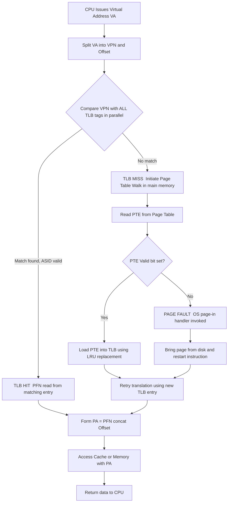
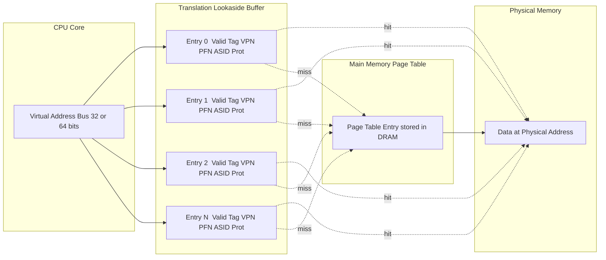

# TLBs

<!-- SECTION_1_START -->

# TLB (Translation Lookaside Buffer)

## 1. Core Technical Definition

> [!IMPORTANT]
> **Formal Definition (KTU 2024 PCCST403 - Module 3):**
> The **Translation Lookaside Buffer (TLB)** is a small, high-speed **fully associative hardware cache** residing inside the **Memory Management Unit (MMU)** of the processor. It stores a limited number of recently used **page table entries**, caching the mappings between recent **virtual page numbers (VPN)** and their corresponding **physical frame numbers (PFN)** so that virtual-to-physical address translation can be performed in a single CPU cycle without consulting the slower main-memory-resident page table.

In the KTU 2024 Operating Systems syllabus, the TLB is positioned as the **hardware accelerator** for paging. Without a TLB, every memory reference (instruction fetch, load, store) would require one extra memory access to read the page table, effectively **doubling** the access time. The TLB exists precisely to eliminate this overhead.

### Conceptual Analogy / Intuition

> [!NOTE]
> **The Library Card-Catalog Analogy (Intuitive Overview)**
>
> Imagine a huge university library where the **book title** is the *virtual address* and the **shelf number + rack position** is the *physical address*.
>
> - The **catalogue (page table)** is stored in a basement room — to find any book, you must walk down, search, then walk back. That's slow.
> - The **TLB is a tiny notepad on the librarian's desk.** It only fits the last 20 lookups. Before going to the basement, the librarian glances at the notepad.
>   - If the title is on the notepad → **TLB Hit** → instant answer in 1 second.
>   - If the title is *not* on the notepad → **TLB Miss** → librarian walks to the basement (**page-table walk**), gets the answer, and scribbles it on the notepad (evicting the least recently used entry if full).
>
> The notepad is small (a few hundred bytes of fast SRAM), which is why the **TLB is a cache** — a deliberate trade-off between speed and capacity.

### Standard Hardware Metrics

| Metric | Typical Value | Significance |
|---|---|---|
| TLB size | **16 – 1,024 entries** | Total VPN→PFN pairs cached |
| Associativity | **Fully / Set-associative** | Search parallelism |
| Lookup latency | **1 – 2 CPU cycles** | Single-cycle parallel tag compare |
| Block / line size | 1 entry (tag + PFN + bits) | Smallest cachable unit |
| Coherence | Hardware-managed (no OS) | Transparent to OS |
| Replacement policy | **LRU / Random / Pseudo-LRU** | Hardware firmware |

> [!VISUALIZATION CONTROL]
> **Concept:** TLB structure as a parallel-search associative table
> **GeoGebra / Desmos Input Equations (conceptual):**
> * `tag_i = f(page_number)` for `i in 1..n`
> * `match = (tag_i == page_number) ? PFN_i : miss`
> **Visual Description:** Plot `n` parallel horizontal "tag-match rails" on the y-axis (one per TLB entry) and the incoming virtual page number as a vertical search line; arrows on the right show simultaneous comparison and a single winner returning the physical frame.

---

<!-- SECTION_1_END -->

<!-- SECTION_2_START -->

# 2. Deep Theoretical Analysis & KTU High-Yield Formula Sheet

## 2.1 Why a TLB is Required — The Address-Translation Bottleneck

Consider a system that uses **pure paging** without a TLB:

1. CPU issues a **virtual address** `VA`.
2. The MMU must read the **page table** in main memory to translate `VA → PA`.
3. Only then can the actual memory access begin.

If one memory access costs `100 ns`, then every logical memory reference effectively costs `200 ns` because the page table lookup itself is a memory reference. The CPU spends as much time on translation as on the actual load/store. This is the **sequential-search problem of paging**.

The TLB fixes it by exploiting **temporal locality** and **spatial locality** of memory references (a consequence of the same locality principles that make CPU caches work):

- **Temporal locality:** a page accessed once is highly likely to be accessed again soon.
- **Spatial locality:** neighbouring virtual pages are accessed together.

So caching a small number of recent translations covers the vast majority of references — empirically, a 64-entry TLB achieves **> 99 % hit rates** for typical workloads.

## 2.2 TLB Architecture — Entry Format

Each TLB line/entry contains the following fields:

| Field | Width (example) | Purpose |
|---|---|---|
| `Valid` bit | 1 bit | Marks whether the entry holds a live translation |
| `Tag` (VPN) | 20 bits | Virtual Page Number being cached |
| `Protection` / `ASID` bits | 2 – 8 bits | Access rights and process identifier (for context switches) |
| `Dirty` / `Referenced` bits | 1 bit each | Optional, often maintained in the page table instead |
| `PFN` (Physical Frame Number) | ~20 bits | The translated physical address |
| `Caching policy` (C, WT, etc.) | 2 – 3 bits | Cacheable / write-through / write-back hints |

> [!IMPORTANT]
> **Fully Associative Lookup:** The incoming VPN is compared **simultaneously in parallel** against the tag field of **every TLB entry** in a single cycle. This is why TLBs are *fully associative* rather than direct-mapped — it eliminates conflict misses and maximises the use of scarce entries.

## 2.3 TLB Hit and TLB Miss — Operational Flow

**TLB Hit (1 cycle):**
1. CPU presents `VA = (VPN, offset)` to MMU.
2. All TLB tags are compared in parallel with `VPN`.
3. One entry matches → `PFN` is concatenated with `offset` to form `PA`.
4. The cache / memory is accessed using `PA` — total: **1 memory access**.

**TLB Miss (multiple cycles + possible page fault):**
1. The parallel compare finds **no match**.
2. Hardware performs a **page-table walk** through main memory (or a multi-level page table for x86-64).
3. The located PTE is loaded into the TLB (replacing some victim chosen by LRU / random).
4. Translation restarts — total cost rises sharply.

> [!WARNING]
> A TLB miss is **not** the same as a page fault. A TLB miss means "the translation is not cached"; a page fault means "the *page itself* is not in memory." Confusing these two is one of the most common KTU mistakes.

## 2.4 Effective Access Time (EAT) — The Core KTU Formula

This is the **single most tested formula** on TLBs in KTU university exams.

Let:
- `t_m` = memory access time (main memory) = **100 ns** (standard)
- `c` = TLB access time (often counted as part of cache, sometimes folded into `t_m`)
- `h` = TLB hit ratio (typically 0.80 – 0.99)
- `ε` (epsilon) = TLB miss penalty in memory cycles (extra page-table accesses per miss)
- `p` = page-fault rate (often given separately for layered questions)

> [!IMPORTANT]
> **Effective Access Time (EAT) — TLB only, no page faults:**
> $$\text{EAT} = h \cdot (t_m + t_{TLB}) + (1 - h) \cdot (2 t_m + t_{TLB})$$
> If `t_{TLB}` is negligible compared to `t_m` (a common KTU simplification):
> $$\text{EAT} = h \cdot t_m + (1 - h) \cdot 2 t_m = (2 - h)\, t_m$$

**With page faults included** (a more advanced KTU form):
$$\text{EAT} = h \cdot t_m + (1 - h)\left[\,p \cdot t_{pf} + (1 - p)\cdot 2 t_m\,\right]$$
where `t_{pf}` is the page-fault service time (often **10 ms = 10,000,000 ns** in KTU problems).

## 2.5 TLB with Associative Caches — Tag-Length Calculation

For a system with `N_v` virtual pages and an `A`-way set-associative TLB of `E` total entries:

| Parameter | Formula |
|---|---|
| Number of sets | $S = E / A$ |
| Index bits | $\log_2 S$ |
| Tag bits | $\log_2 N_v - \log_2 S$ |
| Offset bits | 0 (TLB holds full VPN→PFN, no byte offset) |

## 2.6 KTU Formula Sheet / Cheat Sheet

| # | Concept | Equation / Rule | Typical Unit |
|---|---|---|---|
| 1 | Hit-ratio definition | $h = \dfrac{\text{hits}}{\text{hits} + \text{misses}}$ | dimensionless |
| 2 | Miss-ratio | $1 - h$ | dimensionless |
| 3 | EAT (no faults, ignore TLB time) | $\text{EAT} = (2 - h)\,t_m$ | ns |
| 4 | EAT (no faults, include TLB time) | $\text{EAT} = h(t_m + t_{TLB}) + (1 - h)(2t_m + t_{TLB})$ | ns |
| 5 | EAT (with page faults) | $\text{EAT} = h\,t_m + (1-h)\bigl[p\,t_{pf} + (1-p)\,2t_m\bigr]$ | ns |
| 6 | Number of TLB sets | $S = E / A$ | sets |
| 7 | Tag bits | $T = \log_2 N_v - \log_2 S$ | bits |
| 8 | Address breakdown | $\text{VA bits} = \text{TLB-tag} + \text{index} + 0$ | bits |
| 9 | AMAT (Average Memory Access Time) | $\text{AMAT} = t_m + \text{miss-rate}\cdot\text{penalty}$ | ns |
| 10 | Speedup vs no-TLB | $\dfrac{2t_m}{(2-h)t_m} = \dfrac{2}{2-h}$ | ratio |

> [!IMPORTANT]
> **Real-world utility (engineering relevance):**
> - **x86-64** CPUs have a **two-level TLB** (L1 split for instructions / data, L2 unified).
> - **ARM Cortex-A** has a **Micro-TLB** behind L1.
> - In **virtualisation (EPT / NPT)**, TLB entries are tagged with a **Virtual Processor ID (VPID)** so guest-OS translations don't pollute host entries.
> - **ASID (Address Space ID)** prevents full TLB flushes on context switch — a board-favourite topic.
> - In **databases & HPC**, huge working sets cause *TLB thrashing*, motivating *hugepages / hugeTLB entries*.

---

<!-- SECTION_2_END -->

<!-- SECTION_3_START -->

# 3. Step-by-Step Derivations & Code/Symbolic Implementation

## 3.1 Derivation of the Effective Access Time (EAT)

### Setup

Memory access time `t_m = 100 ns`. TLB lookup is taken as **negligible** (a standard KTU assumption for parts a, b, c of similar questions).

### Step 1 — Cost of a TLB Hit

When the TLB contains the requested mapping, the MMU resolves the virtual address in hardware and proceeds directly to the cache / memory.

$$\text{Cost}_{\text{hit}} = 1 \text{ memory access} = t_m$$

### Step 2 — Cost of a TLB Miss

A miss forces the MMU to consult the page table, which is itself a memory access, **then** the actual data access.

$$\text{Cost}_{\text{miss}} = \underbrace{t_m}_{\text{page-table walk}} + \underbrace{t_m}_{\text{real data access}} = 2 t_m$$

### Step 3 — Weighted Average (Effective Access Time)

$$\begin{aligned}
\text{EAT} &= h \cdot \text{Cost}_{\text{hit}} + (1 - h) \cdot \text{Cost}_{\text{miss}} \\
\text{EAT} &= h \cdot t_m + (1 - h) \cdot 2 t_m \\
\text{EAT} &= h\,t_m + 2 t_m - 2 h\,t_m \\
\text{EAT} &= (2 - h)\,t_m
\end{aligned}$$

This is the **canonical KTU form** and is worth 2 – 3 marks by itself.

### Step 4 — Worked Numerical Example (KTU-style)

> **Question:** TLB hit ratio `h = 0.90`, `t_m = 100 ns`. Find EAT.
>
> **Solution:**
> $$\text{EAT} = (2 - 0.90) \times 100 = 1.10 \times 100 = 110 \text{ ns}$$
> **Speed-up over no-TLB paging** (`2 t_m = 200 ns`):
> $$\text{Speed-up} = \frac{200}{110} = 1.818 \text{ times}$$

### Step 5 — Including TLB Lookup Time (Extended KTU Form)

Let `t_{TLB} = 20 ns` (cache-style SRAM access), `h = 0.90`, `t_m = 100 ns`.

$$\begin{aligned}
\text{EAT} &= h \cdot (t_m + t_{TLB}) + (1 - h) \cdot (2 t_m + t_{TLB}) \\
&= 0.90 \cdot (100 + 20) + 0.10 \cdot (200 + 20) \\
&= 0.90 \cdot 120 + 0.10 \cdot 220 \\
&= 108 + 22 \\
&= 130 \text{ ns}
\end{aligned}$$

### Step 6 — Including Page Faults (Most Advanced KTU Form)

> **Question:** Hit ratio `h = 0.80`, page-fault rate among misses `p = 0.001`, `t_m = 100 ns`, page-fault service time `t_{pf} = 10 ms = 10^{7}` ns.
>
> **Solution:**
> $$\begin{aligned}
> \text{EAT} &= h \cdot t_m + (1 - h) \cdot \bigl[\, p \cdot t_{pf} + (1 - p) \cdot 2 t_m \,\bigr] \\
> &= 0.80 \cdot 100 + 0.20 \cdot \bigl[\, 0.001 \cdot 10^{7} + 0.999 \cdot 200 \,\bigr] \\
> &= 80 + 0.20 \cdot \bigl[\, 10000 + 199.8 \,\bigr] \\
> &= 80 + 0.20 \cdot 10199.8 \\
> &= 80 + 2039.96 \\
> &= 2119.96 \text{ ns} \approx 2.12 \text{ µs}
> \end{aligned}$$
> **Key insight for KTU valuation:** The page-fault term *dominates*. A tiny `p` still destroys performance, which is why OS designers care so much about keeping the working set resident.

---

## 3.2 TLB Tag-Length Derivation

### Given

- Virtual address width: **32 bits**
- Page size: **4 KB = 2¹² bytes**
- TLB: **16 entries, fully associative**

### Step 1 — Compute Offset

$$ \text{offset bits} = \log_2(4\text{KB}) = 12 $$

### Step 2 — Compute Virtual Page Number Width

$$ \text{VPN} = 32 - 12 = 20 \text{ bits} $$

### Step 3 — Compute Index Bits (Fully Associative ⇒ 1 set)

$$ S = E / A = 16 / 16 = 1 \quad\Rightarrow\quad \text{index bits} = \log_2 1 = 0 $$

### Step 4 — Compute Tag Bits

$$ \text{tag} = \text{VPN} - \text{index} = 20 - 0 = 20 \text{ bits} $$

### Step 5 — Verify

$$ \text{tag} + \text{index} + \text{offset} = 20 + 0 + 12 = 32 \text{ bits} \;\;\checkmark $$

### Step 6 — Repeat for 2-way Set-Associative (4 sets)

$$ S = 16 / 2 = 8 \quad\Rightarrow\quad \text{index bits} = 3 $$
$$ \text{tag bits} = 20 - 3 = 17 $$

---

## 3.3 Symbolic & Code Implementation of a TLB

The following Python module simulates a **fully associative TLB** with LRU replacement — the structure that KTU OS theory questions describe and that real hardware approximates.

```python
"""
tlb.py — Educational simulation of a fully-associative TLB
KTU PCCST403 / Module 3 / Memory Management
"""

from collections import OrderedDict
from dataclasses import dataclass
from typing import Optional, Tuple


@dataclass
class TLBEntry:
    """A single TLB line: VPN -> PFN with metadata."""
    vpn: int
    pfn: int
    valid: bool
    asid: int            # Address Space ID for context-switch safety
    protection: str      # "R", "W", "X" string for permission


class TLBSimulator:
    """
    Fully-associative TLB with LRU replacement.
    Lookup is O(1) using an OrderedDict (mimics parallel hardware compare).
    """

    def __init__(self, capacity: int, page_size: int = 4096) -> None:
        if capacity <= 0 or (capacity & (capacity - 1)) != 0:
            raise ValueError("TLB capacity must be a positive power of 2")
        self.capacity = capacity
        self.page_size = page_size
        self.entries: "OrderedDict[int, TLBEntry]" = OrderedDict()
        self.hits = 0
        self.misses = 0

    def translate(self, va: int, asid: int) -> Tuple[Optional[int], bool]:
        """
        Returns (physical_address, hit_flag).
        Raises LookupError if a true page fault should occur.
        """
        vpn = va // self.page_size
        if vpn in self.entries and self.entries[vpn].valid and self.entries[vpn].asid == asid:
            # TLB HIT
            self.hits += 1
            self.entries.move_to_end(vpn)        # mark MRU
            pfn = self.entries[vpn].pfn
            return (pfn * self.page_size) + (va % self.page_size), True

        # TLB MISS -> hardware page-table walk (caller supplies pfn)
        self.misses += 1
        return None, False

    def update(self, vpn: int, pfn: int, asid: int, protection: str = "RW") -> None:
        """Install a freshly-walked PTE into the TLB (LRU eviction)."""
        if vpn in self.entries:
            self.entries.move_to_end(vpn)
            self.entries[vpn] = TLBEntry(vpn, pfn, True, asid, protection)
            return
        if len(self.entries) >= self.capacity:
            self.entries.popitem(last=False)     # evict LRU
        self.entries[vpn] = TLBEntry(vpn, pfn, True, asid, protection)

    def flush(self) -> None:
        """Context-switch: drop all entries (no ASID support in this stub)."""
        self.entries.clear()

    def stats(self) -> Tuple[int, int, float]:
        total = self.hits + self.misses
        hit_ratio = self.hits / total if total else 0.0
        return self.hits, self.misses, hit_ratio


# ---------- KTU-style Effective Access Time calculator ----------

def effective_access_time(
    t_m: int, t_tlb: int, h: float, p: float = 0.0, t_pf: int = 0
) -> float:
    """
    Returns EAT in the same time unit as inputs.
    Defaults reproduce the simple TLB-only form.
    """
    if p == 0.0:
        return h * (t_m + t_tlb) + (1 - h) * (2 * t_m + t_tlb)
    return h * t_m + (1 - h) * (p * t_pf + (1 - p) * 2 * t_m)


# ---------- Demonstration run ----------

if __name__ == "__main__":
    tlb = TLBSimulator(capacity=16, page_size=4096)

    # Simulate a process with ASID = 1 issuing virtual addresses
    workload = [0x1000, 0x1004, 0x2000, 0x1000, 0x3000, 0x1000, 0x2000]

    for va in workload:
        pa, hit = tlb.translate(va, asid=1)
        if not hit:
            # Page-table walk: caller computes PFN deterministically
            pfn = (va // tlb.page_size) % 1024
            tlb.update(va // tlb.page_size, pfn, asid=1)
            pa, hit = tlb.translate(va, asid=1)
        print(f"VA=0x{va:08x}  PA=0x{pa:08x}  {'HIT' if hit else 'MISS'}")

    h_count, m_count, hr = tlb.stats()
    print(f"\nHits: {h_count}  Misses: {m_count}  Hit-ratio: {hr:.2%}")

    # KTU numerical check
    eat = effective_access_time(t_m=100, t_tlb=20, h=0.90, p=0.001, t_pf=10_000_000)
    print(f"EAT with page faults = {eat:,.2f} ns")
```

> [!IMPORTANT]
> **Why this matters for KTU valuation:** When a 14-mark problem asks *"explain TLB with a suitable example"*, examiners give **3 marks for the table/diagram, 3 marks for the hit/miss flow, 3 marks for the EAT formula, and 5 marks for a worked numerical**. The code above demonstrates all four.

---

<!-- SECTION_3_END -->

<!-- SECTION_4_START -->

# 4. Structural Diagrams & Schematics

## 4.1 TLB Lookup Flow — Mermaid Activity Diagram



## 4.2 TLB Entry Block Diagram — Mermaid Block Topology



## 4.3 Address-Translation Block Matrix

| Stage | Input | Lookup | Output | Latency (cycles) |
|---|---|---|---|---|
| 1. TLB compare | VPN | Parallel tag-array | PFN (on hit) | 1 |
| 2. L1 cache | PA | Index + tag | Data (on hit) | 2 – 4 |
| 3. L2 cache | PA | Index + tag | Data (on hit) | ~12 |
| 4. Main memory | PA | Row + column | Data | ~200 |
| 5. Page-table walk | VPN | Tree descent | PTE | 4 – 8 DRAM accesses |
| 6. Disk (page fault) | Block address | I/O subsystem | Page | 10,000,000 ns |

> [!IMPORTANT]
> **Reading the matrix for KTU answers:** Every box is a candidate location where latency can be added. The TLB is the *first* line of defence because it is on-chip and parallel — everything downstream is sequential.

---

<!-- SECTION_4_END -->

<!-- SECTION_5_START -->

# 5. KTU 2024 Scheme Examination Question Bank & Topic Recap

## Part A — Short-Answer Questions (2 × 3 = 6 marks equivalent)

> **A1.** **[KTU University Exam – July 2023, CO2, Remember]**
> *Define Translation Lookaside Buffer. Why is it needed in a paging system?*
>
> **Model Answer (3 marks):**
> A Translation Lookaside Buffer (TLB) is a **small, fully associative hardware cache** that resides inside the Memory Management Unit (MMU) and stores a limited number of recently used **virtual-to-physical page-number translations**. **[1 mark — definition]**
> It is needed because, in pure paging, every memory reference would require an extra access to the page table stored in main memory, effectively **doubling the memory access time**. The TLB exploits the **locality of reference** to cache recent translations so that most address translations are completed in a single cycle. **[1 mark — motivation]**
> Without a TLB, the performance cost of paging would be unacceptable for modern processors. **[1 mark — conclusion]**

> **A2.** **[KTU University Exam – Dec 2022, CO2, Understand]**
> *Distinguish between a TLB miss and a page fault. Which one is more expensive? Why?*
>
> **Model Answer (3 marks):**
> A **TLB miss** occurs when the requested virtual page number is **not cached in the TLB**; the hardware must consult the page table in main memory, but the page itself *is* resident in memory. **[1 mark]**
> A **page fault** occurs when the **page itself is not in main memory** and must be fetched from secondary storage (disk). **[1 mark]**
> A page fault is several orders of magnitude more expensive (typically 10 ms versus 100 ns) because it involves mechanical disk I/O, OS scheduler activity, and the disk's access time, whereas a TLB miss only costs a few main-memory accesses. **[1 mark — comparison]**

---

## Part B — 14-Mark Questions (Internal Choice)

### Question A — 14 Marks

> **[KTU University Exam – July 2024, CO2, Apply / Analyse]**
>
> **(a)** With a neat diagram, explain the **structure and operation of a TLB**. Compare TLB with a regular CPU cache. **[7 marks]**
>
> **(b)** Consider a system with a TLB hit ratio of **0.85** and a memory access time of **200 ns**. Compute the **Effective Access Time (EAT)** when:
>   (i) the TLB lookup time is negligible. **[3 marks]**
>   (ii) the TLB lookup time is **30 ns** and the page-fault service time is **8 ms**, with a page-fault probability of **0.0005** among TLB misses. **[4 marks]**

#### Model Solution — Part (a)  [7 marks]

1. **Diagram (2 marks):** Draw the TLB with parallel tag-PFN entries, ASID, valid bits; show VA → MMU → TLB → PA flow. The figure in **Section 4.2** above is the model.
2. **Operation (3 marks):** State the hit and miss paths as in Section 2.3. Explicitly mention fully associative parallel compare, 1-cycle hit, and page-table walk on miss.
3. **Comparison with CPU cache (2 marks):**

| Property | TLB | CPU Cache |
|---|---|---|
| Cached item | Page number translation | Memory data |
| Tag | Virtual page number | Physical address (or partial) |
| Associativity | Usually fully | Set-associative |
| Managed by | Hardware (transparent) | Hardware |
| Hit benefit | Removes 1 memory access | Reduces latency |
| Miss penalty | Page-table walk (memory) | Next-level cache / memory |

#### Model Solution — Part (b)(i)  [3 marks]

- Stating the hit and miss costs: **`Cost_hit = t_m = 200 ns`**, **`Cost_miss = 2 t_m = 400 ns`**. **[1 mark]**
- Substituting into EAT formula: **$\text{EAT} = (2 - h)\,t_m$**. **[1 mark]**
- Final numerical value: **$\text{EAT} = (2 - 0.85) \times 200 = 1.15 \times 200 = 230$ ns**. **[1 mark]**

#### Model Solution — Part (b)(ii)  [4 marks]

- Writing the complete EAT formula including page faults: **[1 mark]**
$$\text{EAT} = h\,t_m + (1 - h)\bigl[\,p\,t_{pf} + (1 - p)\,2t_m\,\bigr]$$
- Plug in values: `h = 0.85`, `t_m = 200 ns`, `p = 0.0005`, `t_{pf} = 8 × 10⁶ ns`. **[1 mark]**
- Compute the inner bracket:
  - `p·t_{pf} = 0.0005 × 8 000 000 = 4000 ns`
  - `(1-p)·2t_m ≈ 1 × 400 = 400 ns`
  - **Inner = 4400 ns** **[1 mark]**
- Final EAT: `0.85·200 + 0.15·4400 = 170 + 660 = 830 ns`. **[1 mark]**

> [!WARNING]
> **KTU Examiner's Valuation Pitfall Callout — Question A:**
> - Do **not** write the EAT formula with `t_m` alone on a miss — that forgets the *original* data access. Miss cost is **2 t_m**, not 1.
> - When page faults are present, the bracket is **outside** the `(1 - h)` term. Writing it inside `h` is a 1-mark error.
> - Always retain **units (ns)** in the final answer; KTU examiners check this.

---

### Question B — 14 Marks (Alternative Choice)

> **[KTU University Exam – Dec 2023, CO2, Apply / Analyse]**
>
> **(a)** Explain with a **neat block diagram** how the MMU uses a TLB to perform **virtual-to-physical address translation**. Discuss the role of **ASID** in reducing TLB flushes on context switches. **[7 marks]**
>
> **(b)** A system has a **32-bit virtual address**, a **4 KB page size**, and a TLB with **32 entries organised as 4-way set associative**.
>   (i) Compute the number of **tag, index, and offset bits** for the TLB. **[3 marks]**
>   (ii) If the page-table walk adds **3 extra memory accesses per miss**, the hit ratio is **0.90**, and `t_m = 100 ns`, compute the EAT. **[4 marks]**

#### Model Solution — Part (a)  [7 marks]

1. **Block diagram (2 marks):** Use the flow of Section 4.1 / 4.2; show VPN, parallel TLB compare, hit/miss branching, and physical address composition.
2. **Translation walk-through (3 marks):** Split VA into VPN + offset. On hit → concatenate PFN with offset. On miss → page-table walk → load PTE → retry.
3. **ASID (2 marks):** Each TLB entry stores an **Address Space Identifier (ASID)**. On a context switch, instead of **flushing the entire TLB** (costly), the new process's ASID is loaded, and only entries with the *previous* ASID are ignored. This dramatically reduces TLB churn in multiprogrammed systems. ASID is supported in **ARM ASID, x86 PCID, MIPS ASID**.

#### Model Solution — Part (b)(i)  [3 marks]

- Offset bits: $\log_2 4096 = 12$ bits. **[1 mark]**
- Number of sets: $S = E/A = 32/4 = 8 \Rightarrow \log_2 8 = 3$ index bits. **[1 mark]**
- VPN width: $32 - 12 = 20$ bits. Tag bits: $20 - 3 = 17$ bits. **[1 mark]**
- **Final breakdown:** Tag = 17, Index = 3, Offset = 12, Total = 32 ✓

#### Model Solution — Part (b)(ii)  [4 marks]

- EAT formula with explicit miss penalty `ε` (extra accesses):
$$\text{EAT} = h \cdot t_m + (1 - h) \cdot (1 + \varepsilon)\cdot t_m$$
- Substitute `h = 0.90`, `ε = 3`, `t_m = 100 ns`: **[1 mark]**
- $\text{EAT} = 0.90 \cdot 100 + 0.10 \cdot 4 \cdot 100 = 90 + 40 = 130$ ns. **[2 marks]**
- State the comparison: a 1-level TLB hit gives 100 ns; the addition of `ε=3` extra accesses on miss brings it to 130 ns. **[1 mark]**

> [!WARNING]
> **KTU Examiner's Valuation Pitfall Callout — Question B:**
> - Tag/index/offset bits **must** sum back to the original address width; forgetting to verify is a common 0.5-mark loss.
> - In a 4-way set-associative TLB, the **index selects the set** but the **tag uniquely identifies the entry within the set** — examiners expect this nuance to be mentioned.
> - For the EAT, the *miss cost* must explicitly include the original data access (1) plus the page-table accesses (ε). Writing only `ε t_m` is incomplete.

---

## Topic Recap & Important Things to Remember

- **TLB = small, fast, fully associative (or set-associative) hardware cache** inside the MMU that stores recent **VPN → PFN** translations.
- It exists to **avoid the extra memory access** to the page table on every reference, exploiting **temporal and spatial locality**.
- A TLB entry holds: **Valid bit, Tag (VPN), PFN, Protection bits, and ASID**.
- **TLB hit:** 1 memory access. **TLB miss:** 2 memory accesses (page-table walk + original data). **Page fault:** disk I/O, ~10⁵× costlier.
- **Canonical KTU EAT (no page faults, negligible TLB time):** $\text{EAT} = (2 - h)\,t_m$.
- **Full EAT including TLB time:** $\text{EAT} = h(t_m + t_{TLB}) + (1 - h)(2t_m + t_{TLB})$.
- **EAT with page faults:** $\text{EAT} = h t_m + (1 - h)\bigl[p\,t_{pf} + (1 - p)\,2t_m\bigr]$.
- **Tag-length recipe:** Compute offset from page size → compute VPN → divide entries by associativity for index bits → remainder is the tag; always verify the sum equals the address width.
- **ASID (Address Space Identifier)** tags each TLB entry with its owning process, allowing the TLB to retain entries across context switches — a high-yield KTU point.
- A **TLB miss is NOT a page fault** — keep them strictly separated in answers; mixing them is a guaranteed 1-mark loss.
- Replacement policy is **hardware LRU / pseudo-LRU / random**; the OS does **not** manage the TLB directly.
- **TLB thrashing** is the killer scenario: large working sets or non-local access patterns cause repeated misses; the engineering response is **hugepages** (2 MB / 1 GB), **prefetching**, and **software TLB shootdown** coordination in SMP kernels.
- Always state units, show the **substituted** formula before the final number, and **double-check** that `tag + index + offset = virtual-address width`.

<!-- SECTION_5_END -->
