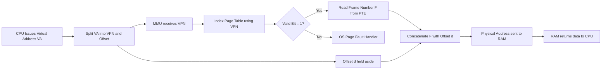
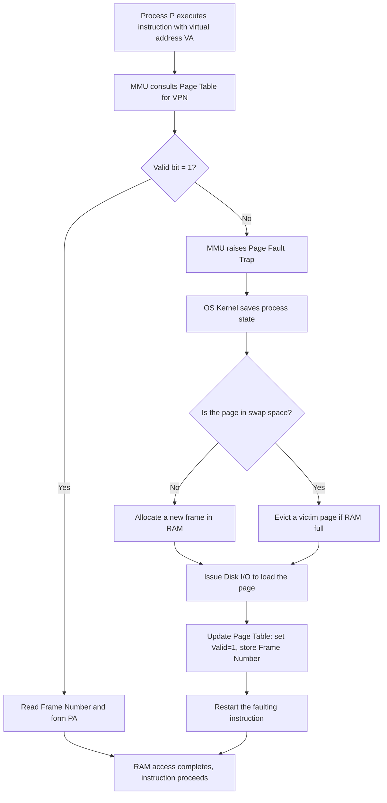
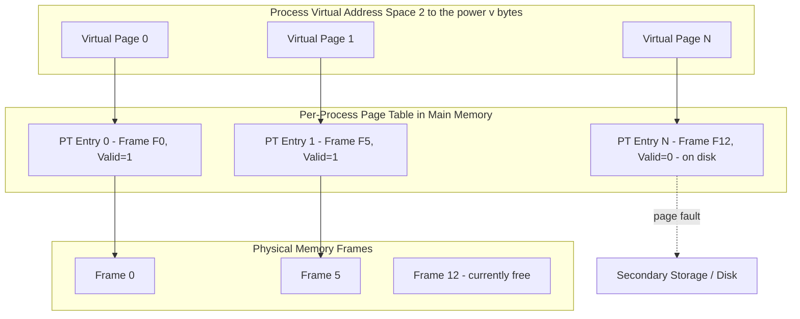

# Virtual memory  - Paging: Introduction

<!-- SECTION_1_START -->
# Virtual Memory & Paging: The Foundation of Modern Memory Management

## 1.1 Formal Academic Definition (KTU 2024 Syllabus Aligned)

> [!NOTE]
> **Virtual Memory** is a memory management technique in which secondary memory (typically a disk) is used as an extension of the main physical memory (RAM). It creates an illusion of a large, contiguous, private address space for every running process, even though the process may be physically scattered across RAM and disk, and even though multiple processes share the limited physical memory.

> [!IMPORTANT]
> **Paging** is the most widely used implementation of virtual memory. It divides the process's logical (virtual) address space into fixed-size blocks called **Pages**, and divides the physical memory (RAM) into fixed-size blocks called **Frames** (or **Page Frames**). Pages and frames are always of the **same size** — a mandatory design constraint.

**Standard page size in modern systems: $4\text{ KB} = 4096\text{ bytes} = 2^{12}\text{ bytes}$** (Some systems use $2\text{ MB}$ or $1\text{ GB}$ Huge Pages).

The mapping between virtual pages and physical frames is maintained by a per-process data structure called the **Page Table**, which is stored in main memory and consulted by the **Memory Management Unit (MMU)** — a specialized hardware component inside the CPU.

---

## 1.2 Intuitive Real-World Analogy: The Travelling Researcher

Imagine you are a researcher writing a massive 1000-page book. You do not have a single shelf large enough to hold the entire book in your small office (your **RAM**). However, you have:

* A small desk drawer (**Physical Memory / RAM** — fast, but limited).
* A huge personal library warehouse 10 km away (**Secondary Memory / Disk** — large, but slow).

You tear your book into chapters (**Pages** of, say, 20 pages each). You keep only the chapters you are currently working on in your desk drawer. The rest are in the warehouse. When you suddenly need an old chapter, you:
1. Note the **Chapter Number** (this is your **Virtual Page Number**).
2. Send an assistant to the warehouse to fetch it (this is a **Page Fault**).
3. The assistant brings the chapter, places it in an empty drawer slot (**Physical Frame**), and you continue working.

Your **mind still thinks the entire book is one continuous piece** — that illusion is your **Virtual Address Space**. The chapter number-to-drawer-slot mapping is your **Page Table**.

> [!TIP]
> The genius of paging is that neither the programmer nor the compiler needs to know that memory is fragmented. The OS and MMU handle the translation transparently.

---

## 1.3 The Address Splitting Concept (Core Intuition)

Every virtual address generated by the CPU is split into two parts by the hardware:

| High-order bits | Low-order bits |
| :--- | :--- |
| **Virtual Page Number (VPN)** | **Page Offset (d)** |

The **offset** tells *where* inside the page you want to go (e.g., the 837th byte of a 4096-byte page). The **VPN** tells *which* page is being referenced — and the page table tells which physical frame contains that page.

> [!VISUALIZATION CONTROL]
> **Concept:** Address Translation Flow (Geometric View)
> **GeoGebra / Desmos Input Equations:**
> * Point the **Virtual Address** on the x-axis as: $x = V = P \cdot 2^{12} + d$
> * Point the **Physical Address** on the y-axis as: $y = f(P) \cdot 2^{12} + d$
> * Draw the linear mapping $y = f(P) \cdot 2^{12} + d$ where $f(P)$ is the page table function.
> **Visual Description:** The student should observe two parallel number lines — the virtual line (conceptually huge, with gaps possible) and the physical line (smaller, contiguous). The dashed arrows from virtual pages to physical frames form a many-to-one or scattered mapping.

---

<!-- SECTION_2_START -->
# Deep Theoretical Analysis & KTU High-Yield Formula Sheet

## 2.1 Why Virtual Memory? — The "Why" Behind Paging

Modern computers run **multiprogrammed** workloads. Without virtual memory, three severe problems arise:

1. **Limited Program Size:** A program larger than physical RAM simply cannot execute.
2. **Internal & External Fragmentation:** Variable-sized allocation leaves unusable holes.
3. **Lack of Protection & Isolation:** Any process can overwrite another process's memory or the OS kernel.

Paging **solves all three problems simultaneously** by:
* Decoupling the logical view from the physical view (solves problem 1).
* Using fixed-size allocation, which removes external fragmentation (solves problem 2).
* Providing per-process page tables with Valid/Invalid bits, enabling protection rings (solves problem 3).

---

## 2.2 The Operational Pipeline: How a Virtual Address Becomes a Physical Address

The MMU performs the translation through the following fixed sequence:

1. **CPU issues a virtual address** $V$ on the address bus.
2. The MMU **extracts the VPN** from the high-order bits.
3. The MMU **indexes the Page Table** using the VPN to obtain the **Physical Frame Number (PFN)**.
4. The MMU **replaces** the VPN with the PFN and **re-attaches the unchanged offset** $d$.
5. The newly formed **Physical Address** is sent to the RAM controller.

This operation is called **Page Table Lookup** or a **Page Table Walk**.

> [!IMPORTANT]
> **The offset $d$ is NEVER translated.** It is copied verbatim from the virtual address to the physical address. This is a critical KTU board-exam rule.

---

## 2.3 The Page Table — Structure & Content

A page table is an **array of Page Table Entries (PTEs)**. Each PTE typically contains:

| Field | Purpose |
| :--- | :--- |
| **Frame Number** | The physical frame holding this page (the actual mapping). |
| **Valid Bit (V / Present)** | $1$ if the page is currently in RAM; $0$ if it is on disk (triggers page fault). |
| **Protection Bits (R / W / X)** | Read, Write, Execute permissions for the page. |
| **Dirty Bit (Modified)** | Set if the page has been written to; needed for write-back. |
| **Reference Bit (Accessed)** | Set on any access; used by page replacement algorithms. |
| **Caching Disabled Bit** | Used for memory-mapped I/O pages. |

---

## 2.4 KTU Formula Sheet — High-Yield Equations

> [!NOTE]
> Memorize these derivations. They appear in **nearly every KTU numerical** on paging.

Assume a system with:
* Virtual address space $= 2^{v}$ bytes
* Physical address space $= 2^{p}$ bytes
* Page size $= 2^{n}$ bytes

| Quantity | Formula | Engineering Meaning |
| :--- | :--- | :--- |
| Offset bits | $n$ | Low-order $n$ bits of address. |
| Virtual Page Number (VPN) bits | $v - n$ | High-order bits. |
| Physical Frame Number (PFN) bits | $p - n$ | High-order bits of physical address. |
| Number of virtual pages | $2^{v-n}$ | Size of the page table (entries). |
| Number of physical frames | $2^{p-n}$ | Maximum simultaneously resident pages. |
| Page table size in bytes | $2^{v-n} \times \text{PTE\_size}$ | RAM consumed by one page table. |
| Physical address from VPN $P$, offset $d$ | $PA = f(P) \cdot 2^{n} + d$ | Where $f(P)$ is the page table function. |
| Effective Address Translation (no TLB) | $T_{\text{EAT}} = 2 \times T_{\text{mem}}$ | 1 access for PT, 1 for data. |
| EAT with TLB (hit ratio $h$) | $h(T_{\text{TLB}} + T_{\text{mem}}) + (1-h)(T_{\text{TLB}} + 2T_{\text{mem}})$ | Most common KTU numerical. |
| EAT with page faults (rate $p$) | $(1-p) \cdot T_{\text{mem}} + p \cdot T_{\text{page\_fault}}$ | When disk I/O is involved. |

---

## 2.5 Real-World Engineering Utility

* **Cloud Computing (AWS, Azure):** Virtual memory allows over-commitment of RAM — providers sell more VM memory than physically exists, betting on the fact that not all VMs will touch all their pages at once.
* **Smartphones (Android/iOS):** Apps are frozen to disk when backgrounded; their pages are paged back in seamlessly on resume.
* **Databases (PostgreSQL, Oracle):** `shared_buffers` and `SGA` rely on paging for efficient caching of hot data.
* **Process Isolation & Security:** Modern kernels (Linux, Windows NT) implement per-process page tables — this is the foundation of the kernel/user protection ring.
* **Swap Devices:** Linux swap partitions, Windows `pagefile.sys` are concrete implementations of the "disk extension" of virtual memory.

---

<!-- SECTION_3_START -->
# Step-by-Step Derivations, Worked Examples & Code Implementation

## 3.1 Exhaustive Numerical: Address Translation Walk-Through

> [!IMPORTANT]
> **KTU Board Style Numerical — Solve it line-by-line.**

**Given:**
* Virtual address space $= 2^{20}\text{ bytes} = 1\text{ MB}$
* Physical address space $= 2^{16}\text{ bytes} = 64\text{ KB}$
* Page size $= 2^{12}\text{ bytes} = 4\text{ KB}$
* Virtual address to translate: $V = 0 \times 12345$
* Page Table (partial): Page $18 \rightarrow$ Frame $5$

**Step 1 — Compute the bit fields.**

$$
\begin{aligned}
n &= \log_2(\text{Page Size}) = \log_2(2^{12}) = 12\text{ offset bits} \\[4pt]
\text{VPN bits} &= v - n = 20 - 12 = 8\text{ bits} \\[4pt]
\text{PFN bits} &= p - n = 16 - 12 = 4\text{ bits} \\[4pt]
\text{Number of pages} &= 2^{8} = 256 \\[4pt]
\text{Number of frames} &= 2^{4} = 16
\end{aligned}
$$

**Step 2 — Split the virtual address.**

The 20-bit address $0 \times 12345$ in binary is:
$$
0 \times 12345 = 0001\;0010\;0011\;0100\;0101_2
$$

* High-order **8 bits (VPN):** $0001\;0010_2 = 0 \times 12 = 18$ (decimal)
* Low-order **12 bits (offset):** $0011\;0100\;0101_2 = 0 \times 345 = 837$ (decimal)

**Verification by reconstruction:**

$$
\begin{aligned}
V &= (\text{VPN} \times 2^{12}) + \text{offset} \\
  &= (18 \times 4096) + 837 \\
  &= 73728 + 837 \\
  &= 74565
\end{aligned}
$$

$$
0 \times 12345 = 1 \cdot 16^4 + 2 \cdot 16^3 + 3 \cdot 16^2 + 4 \cdot 16 + 5 = 65536 + 8192 + 768 + 64 + 5 = 74565 \quad \checkmark
$$

**Step 3 — Look up the Page Table.**

The page table for VPN $= 18$ returns **PFN $= 5$**.

**Step 4 — Form the physical address.**

$$
\begin{aligned}
PA &= (\text{PFN} \times 2^{12}) + \text{offset} \\
   &= (5 \times 4096) + 837 \\
   &= 20480 + 837 \\
   &= 21317
\end{aligned}
$$

In hexadecimal:

$$
PA = 0 \times 5000 + 0 \times 345 = 0 \times 5345
$$

> [!TIP]
> **Insight for students:** Notice that the offset $0 \times 345$ appears unchanged in the final physical address. This is the **single most-tested observation** in KTU exams.

---

## 3.2 Exhaustive Derivation: Effective Access Time (EAT) with TLB

**Given:**
* TLB access time $T_{\text{TLB}} = 20\text{ ns}$
* Memory access time $T_{\text{mem}} = 100\text{ ns}$
* TLB hit ratio $h = 0.8$ (80%)
* TLB miss penalty: 2 memory accesses (one for PT entry, one for data)

**Case 1 — TLB Hit (probability $h = 0.8$):**
* 1 TLB lookup $+ 1$ memory access
* Time cost $= T_{\text{TLB}} + T_{\text{mem}} = 20 + 100 = 120\text{ ns}$

**Case 2 — TLB Miss (probability $1-h = 0.2$):**
* 1 TLB lookup $+ 1$ memory access for page table $+ 1$ memory access for data
* Time cost $= T_{\text{TLB}} + 2 \cdot T_{\text{mem}} = 20 + 200 = 220\text{ ns}$

**Effective Access Time (EAT):**

$$
\begin{aligned}
\text{EAT} &= h \cdot (T_{\text{TLB}} + T_{\text{mem}}) + (1-h) \cdot (T_{\text{TLB}} + 2 T_{\text{mem}}) \\[4pt]
          &= 0.8 \times (20 + 100) + 0.2 \times (20 + 2 \times 100) \\[4pt]
          &= 0.8 \times 120 + 0.2 \times 220 \\[4pt]
          &= 96 + 44 \\[4pt]
          &= 140\text{ ns}
\end{aligned}
$$

> [!NOTE]
> **Without TLB**, EAT would simply be $2 \times 100 = 200\text{ ns}$. The TLB delivered a **30% speedup** in this scenario.

---

## 3.3 Full Python Implementation: Paging Simulator

```python
"""
Paging System Simulator (KTU-style educational implementation).
Translates virtual addresses to physical addresses using a page table.
"""

from dataclasses import dataclass, field
from typing import Dict, Optional
import logging

logging.basicConfig(level=logging.INFO, format="[%(levelname)s] %(message)s")
logger = logging.getLogger("PagingSim")


@dataclass
class PageTableEntry:
    """Represents a single PTE with all standard fields."""
    frame_number: Optional[int] = None
    valid: bool = False
    read: bool = True
    write: bool = True
    execute: bool = False
    dirty: bool = False
    referenced: bool = False


@dataclass
class PagingSystem:
    """
    A complete paging MMU simulator.
    - virtual_addr_bits: total bits in a virtual address (e.g., 20)
    - page_size: page size in bytes (must be power of 2)
    """
    virtual_addr_bits: int
    page_size: int
    num_physical_frames: int
    page_table: Dict[int, PageTableEntry] = field(default_factory=dict)

    def __post_init__(self) -> None:
        # Boundary validation (absolute checks)
        if self.page_size <= 0 or (self.page_size & (self.page_size - 1)) != 0:
            raise ValueError("Page size must be a positive power of 2.")
        if self.virtual_addr_bits <= 0:
            raise ValueError("Address width must be positive.")

        # Derived bit allocations
        self.offset_bits: int = (self.page_size - 1).bit_length() - 1 + 1
        # cleaner: use bit_length
        self.offset_bits = self.page_size.bit_length() - 1
        self.vpn_bits: int = self.virtual_addr_bits - self.offset_bits
        self.offset_mask: int = self.page_size - 1

        logger.info(
            f"System initialized: VPN={self.vpn_bits} bits, "
            f"Offset={self.offset_bits} bits, "
            f"Total virtual pages=2^{self.vpn_bits}={1 << self.vpn_bits}"
        )

    def add_mapping(self, vpn: int, frame: int) -> None:
        """Insert a virtual-to-physical frame mapping (as if loaded into RAM)."""
        if not (0 <= frame < self.num_physical_frames):
            raise ValueError(f"Frame {frame} out of physical bounds [0, {self.num_physical_frames}).")
        if not (0 <= vpn < (1 << self.vpn_bits)):
            raise ValueError(f"VPN {vpn} exceeds virtual address space.")

        self.page_table[vpn] = PageTableEntry(
            frame_number=frame,
            valid=True,
            referenced=True
        )
        logger.info(f"Mapping installed: VPN {vpn} -> Frame {frame}")

    def translate(self, virtual_address: int) -> int:
        """
        Translate a virtual address to a physical address.
        Raises RuntimeError on page fault.
        """
        if virtual_address < 0 or virtual_address >= (1 << self.virtual_addr_bits):
            raise ValueError(f"Virtual address 0x{virtual_address:X} out of range.")

        vpn: int = virtual_address >> self.offset_bits
        offset: int = virtual_address & self.offset_mask

        logger.info(
            f"VA=0x{virtual_address:X} | VPN={vpn} (0x{vpn:X}) | "
            f"Offset={offset} (0x{offset:X})"
        )

        pte: Optional[PageTableEntry] = self.page_table.get(vpn)

        if pte is None or not pte.valid:
            # Simulated page fault
            raise RuntimeError(
                f"PAGE FAULT: VPN {vpn} not resident in physical memory. "
                f"OS must load from disk."
            )

        pte.referenced = True
        physical_address: int = (pte.frame_number << self.offset_bits) | offset
        logger.info(
            f"PA=0x{physical_address:X} | Frame={pte.frame_number} | "
            f"Offset={offset}"
        )
        return physical_address


# ---------- Demonstration ----------
if __name__ == "__main__":
    system = PagingSystem(
        virtual_addr_bits=20,
        page_size=4096,           # 4 KB
        num_physical_frames=16
    )

    # Install mappings (as if process pages have been loaded)
    system.add_mapping(vpn=18, frame=5)
    system.add_mapping(vpn=0,  frame=2)
    system.add_mapping(vpn=255, frame=15)

    # --- Test 1: Valid access ---
    try:
        pa = system.translate(0x12345)
        print(f"\nVirtual 0x12345 -> Physical 0x{pa:X}\n")
    except RuntimeError as fault:
        print(f"FAULT: {fault}\n")

    # --- Test 2: Page fault simulation ---
    try:
        system.translate(0x05000)   # VPN 5 has no mapping
    except RuntimeError as fault:
        print(f"FAULT: {fault}")
```

**Sample Output:**

```
[INFO] System initialized: VPN=8 bits, Offset=12 bits, Total virtual pages=2^8=256
[INFO] Mapping installed: VPN 18 -> Frame 5
[INFO] VA=0x12345 | VPN=18 (0x12) | Offset=837 (0x345)
[INFO] PA=0x5345 | Frame=5 | Offset=837
Virtual 0x12345 -> Physical 0x5345
[INFO] VA=0x5000 | VPN=5 (0x5) | Offset=0 (0x0)
FAULT: PAGE FAULT: VPN 5 not resident in physical memory. OS must load from disk.
```

---

<!-- SECTION_4_START -->
# Structural Diagrams & Schematics

## 4.1 Address Translation Pipeline (Mermaid Block Diagram)



> [!NOTE]
> The offset $d$ bypasses the page table entirely — this is a **hardware optimization** that the KTU board expects students to state explicitly.

---

## 4.2 Page Fault Handling Sequence (Mermaid State Diagram)



---

## 4.3 Page Table Architecture (Mermaid Block Topology)



---

<!-- SECTION_5_START -->
# KTU 2024 Scheme Examination Question Bank & Topic Recap

## Part A — Short Answer Questions (3 Marks Each)

### Question 1
**[KTU University Exam — July 2024 | CO1 | Remember]**
**Define virtual memory. List any two advantages of virtual memory.**

**Model Answer:**

> [!NOTE]
> *Virtual memory is a storage management scheme in which the user's logical address space is decoupled from the physical memory. Secondary storage is used as a backing store to simulate a large main memory.*

**Advantages (any two for 3 marks):**
1. **Program size flexibility:** Programs larger than physical RAM can execute, since only active pages need to be in memory.
2. **Effective multiprogramming degree:** More processes can reside in RAM simultaneously, increasing CPU utilization.
3. **Memory protection & isolation:** Each process has its own private address space enforced by per-process page tables.
4. **Logical-to-physical decoupling:** Programmers and compilers need not worry about physical memory layout.

*Valuation Key: [Definition 1.5 marks] [Any two advantages 0.75 mark each]*

---

### Question 2
**[KTU University Exam — Dec 2023 | CO1 | Understand]**
**What is a page table? Why is it stored in main memory rather than in CPU registers?**

**Model Answer:**

A **Page Table** is a per-process data structure maintained by the OS that maps each **Virtual Page Number (VPN)** of a process to its corresponding **Physical Frame Number (PFN)** in RAM.

**Why stored in main memory:**
* Page tables are **very large** (e.g., $2^{20}$ entries for a 32-bit address space with 4 KB pages). CPU registers are too few and too small to hold them.
* Accessing the page table from memory allows **dynamic updates** by the OS (e.g., on page replacement or context switch).
* The MMU performs the lookup in a single memory access; this is acceptable because the **TLB caches the most recent lookups** in fast hardware.

*Valuation Key: [Definition 1 mark] [Two reasons for memory storage 1 mark each]*

---

## Part B — Full-Length Questions (14 Marks Each)

> [!IMPORTANT]
> Each Part B question carries **14 marks** with sub-parts **(a) 7 marks** and **(b) 7 marks**. Solve **either** Question A **or** Question B in full.

---

### Question A (14 Marks)

**(a) [7 Marks | CO1 | Understand]**
**[KTU University Exam — July 2023]**
**With a neat diagram, explain the basic concept of paging. Show how a logical address is translated to a physical address using a page table.**

**Model Solution:**

**Concept (2 marks):** Paging is a memory management scheme that avoids external fragmentation by dividing both logical memory and physical memory into **fixed-size blocks** called **pages** and **frames** respectively. The mapping is stored in a **Page Table**.

**Diagram (2 marks):** Refer to the Section 4.1 Mermaid flow converted to a clean textbook diagram showing:
* Virtual Address = `| VPN | d |`
* Page Table = `| VPN | Frame No. |`
* Physical Address = `| Frame No. | d |`

**Translation Steps (3 marks):**
1. CPU generates virtual address `VA = VPN || d`.
2. MMU extracts `VPN` and uses it as an **index** into the Page Table.
3. The Page Table returns the corresponding **Physical Frame Number (F)**.
4. The MMU concatenates `F` with the **unchanged offset `d`** to form the physical address `PA = F || d`.
5. The physical address is sent to RAM for the actual data access.

*Valuation Key: [Concept 2 marks] [Diagram 2 marks] [5 translation steps at 0.6 each = 3 marks]*

---

**(b) [7 Marks | CO2 | Apply]**
**[KTU University Exam — July 2023]**
**Consider a system with a virtual address space of $4\text{ GB}$ and a physical memory of $1\text{ GB}$. The page size is $4\text{ KB}$.**
**(i)** Find the number of virtual pages, number of physical frames, and number of bits in VPN, PFN, and offset.
**(ii)** A reference is made to virtual address $0 \times 12345678$. Identify the VPN and offset.

**Model Solution:**

**(i) Calculations (4 marks):**

$$
\begin{aligned}
\text{Virtual address space} &= 4\text{ GB} = 2^{32}\text{ bytes} \quad \Rightarrow \quad v = 32 \\[4pt]
\text{Physical memory} &= 1\text{ GB} = 2^{30}\text{ bytes} \quad \Rightarrow \quad p = 30 \\[4pt]
\text{Page size} &= 4\text{ KB} = 2^{12}\text{ bytes} \quad \Rightarrow \quad n = 12
\end{aligned}
$$

$$
\begin{aligned}
\text{Offset bits} &= n = 12 \\[4pt]
\text{VPN bits} &= v - n = 32 - 12 = 20 \\[4pt]
\text{PFN bits} &= p - n = 30 - 12 = 18 \\[4pt]
\text{Number of virtual pages} &= 2^{20} = 1{,}048{,}576 \approx 1\text{ M pages} \\[4pt]
\text{Number of physical frames} &= 2^{18} = 262{,}144 \approx 256\text{ K frames}
\end{aligned}
$$

**(ii) Address Split (3 marks):**

Virtual address $= 0 \times 12345678$ is a 32-bit quantity. In binary, the **top 20 bits** form the VPN and the **bottom 12 bits** form the offset.

$$
0 \times 12345678 = 0001\;0010\;0011\;0100\;0101\;0110\;0111\;1000_2
$$

* **VPN (top 20 bits):** $0001\;0010\;0011\;0100\;0101_2 = 0 \times 12345 = 74565$
* **Offset (bottom 12 bits):** $0110\;0111\;1000_2 = 0 \times 678 = 1656$

*Valuation Key: [Setting up equations 1 mark] [Computing bit values 2 marks] [Page and frame counts 1 mark] [VPN extraction 1.5 marks] [Offset extraction 1.5 marks]*

---

### Question B (14 Marks) — *Alternative Choice*

**(a) [7 Marks | CO1 | Understand]**
**[KTU University Exam — Dec 2023]**
**Explain the steps involved in handling a page fault with a neat diagram.**

**Model Solution:**

**Introduction (1 mark):** A **page fault** is a type of hardware exception (trap) raised by the MMU when a process references a page that is **not currently in physical memory** (Valid bit = 0).

**Steps (5 marks):**

1. **Trap to OS:** The MMU detects the invalid reference and transfers control to the OS page fault handler, saving the **program counter** and **process state**.
2. **Check validity:** The OS verifies that the reference is a legitimate memory access (not a protection violation or a bug). If illegal, the process is terminated.
3. **Locate the page on disk:** The OS consults the process's page table (or an inverted table) to find the **disk address** where the missing page is stored in the swap space.
4. **Find a free frame:** The OS searches the free-frame list. If empty, a **page replacement algorithm** (e.g., LRU, FIFO) selects a victim frame; if the victim is **dirty**, it is written back to disk first.
5. **Issue disk I/O:** The OS schedules a disk read to load the desired page into the selected free frame.
6. **Update the page table:** When the I/O completes, the OS updates the PTE: sets the **Valid bit to 1**, records the new **Frame Number**, and updates the disk address.
7. **Restart the instruction:** The process is placed back in the ready queue. When scheduled, the CPU retries the faulting instruction — which now succeeds because the page is in memory.

**Diagram (1 mark):** Refer to the Section 4.2 Mermaid state diagram of page fault handling.

*Valuation Key: [Definition 1 mark] [7 sequential steps at ~0.7 each = 5 marks] [Diagram 1 mark]*

---

**(b) [7 Marks | CO2 | Apply]**
**[KTU University Exam — Dec 2023]**
**A system uses paging with a Translation Lookaside Buffer (TLB). TLB lookup time is $20\text{ ns}$, memory access time is $100\text{ ns}$, and the TLB hit ratio is $80\%$. Calculate the effective memory access time (EAT). What happens to EAT if the hit ratio drops to $60\%$?**

**Model Solution:**

**Given:**
* $T_{\text{TLB}} = 20\text{ ns}$
* $T_{\text{mem}} = 100\text{ ns}$
* Hit ratio $h = 0.8$ (first case) and $h = 0.6$ (second case)

**Standard EAT Formula (1 mark):**

$$
\text{EAT} = h \cdot (T_{\text{TLB}} + T_{\text{mem}}) + (1-h) \cdot (T_{\text{TLB}} + 2 T_{\text{mem}})
$$

**Case 1: Hit Ratio $h = 0.8$ (3 marks):**

$$
\begin{aligned}
\text{EAT}_1 &= 0.8 \times (20 + 100) + 0.2 \times (20 + 200) \\
             &= 0.8 \times 120 + 0.2 \times 220 \\
             &= 96 + 44 \\
             &= 140\text{ ns}
\end{aligned}
$$

**Case 2: Hit Ratio $h = 0.6$ (3 marks):**

$$
\begin{aligned}
\text{EAT}_2 &= 0.6 \times (20 + 100) + 0.4 \times (20 + 200) \\
             &= 0.6 \times 120 + 0.4 \times 220 \\
             &= 72 + 88 \\
             &= 160\text{ ns}
\end{aligned}
$$

**Conclusion:** EAT **increases by $20\text{ ns}$** when the hit ratio falls from 80% to 60%, illustrating the critical importance of TLB hit performance.

*Valuation Key: [Formula statement 1 mark] [Plug-in and arithmetic for Case 1: 3 marks] [Plug-in and arithmetic for Case 2: 2.5 marks] [Conclusion 0.5 mark]*

---

> [!WARNING]
> **KTU Examiner's Pitfall Callout — Common Marks Lost**
> 1. **Forgetting to write the offset in the final physical address** — Students often quote only the frame number and lose 1–2 marks. Always write `PA = Frame × Page Size + Offset`.
> 2. **Mixing up VPN and PFN bits** — VPN uses *virtual* address width; PFN uses *physical* address width. Do not subtract the page size from the wrong quantity.
> 3. **Skipping the state of the process during page faults** — The OS must save PC, registers, and PSW. Examiners specifically check whether the student mentioned "saving the process state" before servicing the page fault.
> 4. **EAT numericals: forgetting the extra memory access on a TLB miss** — On miss, you need *one* access for the page table entry and *another* for the data → total **2 memory accesses**, not 1.
> 5. **No diagram** — KTU Part B (7-mark sub-parts) almost always require a labelled diagram; an absent diagram costs 1–2 marks.
> 6. **Writing page size as just "4 KB"** — Always specify both the decimal value and the power-of-2 form, e.g., "$4\text{ KB} = 2^{12}\text{ bytes}$".

---

## Topic Recap & Important Things to Remember

* **Virtual Memory** decouples the programmer's logical view of memory from the physical reality of limited RAM, using disk as a backing store.
* **Paging** divides both logical and physical memory into fixed-size units: **pages** (virtual) and **frames** (physical). **Page size = Frame size** is a non-negotiable design rule.
* Every virtual address is split into **VPN (high-order bits) + Offset (low-order bits)**. The offset is **never translated** — it is copied verbatim.
* The **Page Table** is the per-process data structure that stores the VPN $\rightarrow$ PFN mapping. It is held in **main memory** and consulted by the **MMU**.
* Standard page size in modern OS: **$4\text{ KB} = 2^{12}$ bytes**. Other sizes ($2\text{ MB}$, $1\text{ GB}$ huge pages) are used in high-performance servers.
* A **Page Table Entry (PTE)** must contain at minimum: **Frame Number, Valid Bit, Protection Bits (R/W/X), and Dirty/Reference bits** for advanced OS functions.
* The **Translation Lookaside Buffer (TLB)** is a small, fast, fully-associative hardware cache of recent VPN $\rightarrow$ PFN mappings — it reduces the page table lookup from 2 memory accesses to 1.
* **Page Fault** is raised by the MMU when the Valid bit is 0. The OS must: save state $\rightarrow$ locate page on disk $\rightarrow$ find/evict a frame $\rightarrow$ issue disk I/O $\rightarrow$ update PTE $\rightarrow$ restart the instruction.
* **Effective Access Time (EAT)** formulas (memorize both):
  * With TLB: $h(T_{\text{TLB}} + T_{\text{mem}}) + (1-h)(T_{\text{TLB}} + 2T_{\text{mem}})$.
  * With page faults: $(1-p) T_{\text{mem}} + p T_{\text{page\_fault}}$.
* The **number of entries** in a single-level page table is $2^{v-n}$ where $v$ is virtual address width and $n$ is the offset width — for 32-bit systems with 4 KB pages, this is $2^{20} = 1\text{ M}$ entries. This very large size is why **multi-level page tables** (invented later) are necessary.
* **Demand Paging** = pages are loaded into RAM *only when referenced* (lazy loading), not all at once. This is the natural and most common policy in modern systems.
* **Key advantages of paging:** no external fragmentation, simple memory allocation, easy sharing, strong protection, support for sparse address spaces, and ability to run programs larger than RAM.
* **Key limitation:** the page table itself consumes significant memory — a single-level page table for a 32-bit system with 4 KB pages and 4-byte PTEs needs $2^{20} \times 4 = 4\text{ MB}$ of RAM per process. This motivates Multi-Level Paging and Inverted Page Tables in later modules.
* **Standard KTU key phrases to use verbatim in answers:** *"decoupling of logical and physical address space"*, *"fixed-size pages eliminate external fragmentation"*, *"page fault is a trap to the OS"*, *"TLB is a hardware cache for the page table"*, and *"the offset is passed unchanged from virtual to physical address"*.

<!-- SECTION_5_END -->
