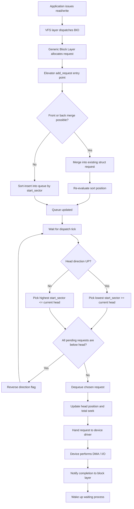
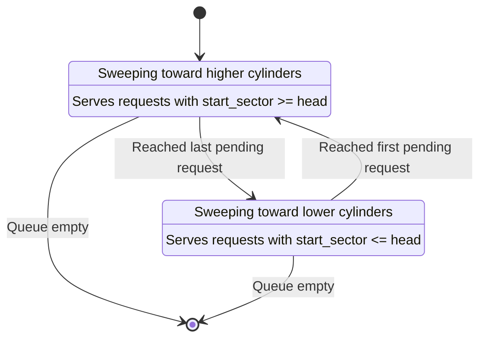
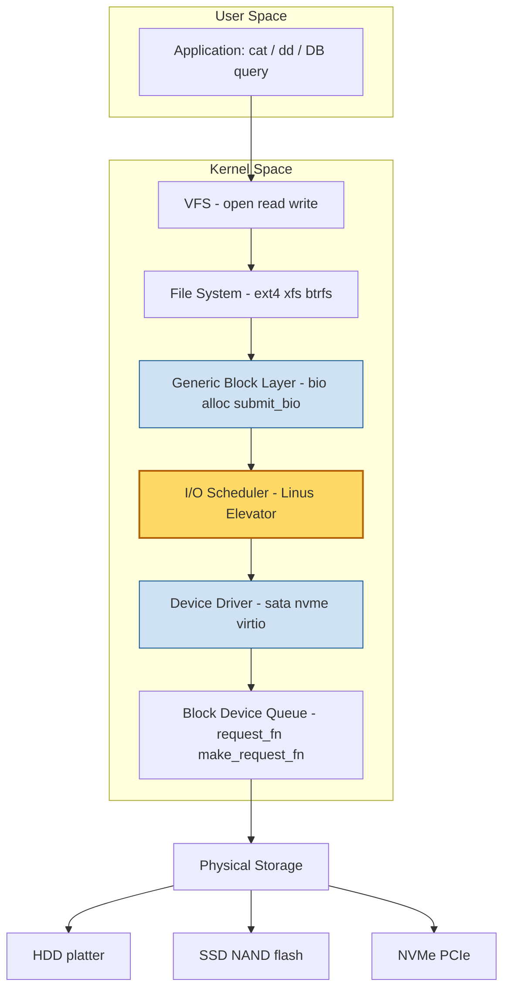
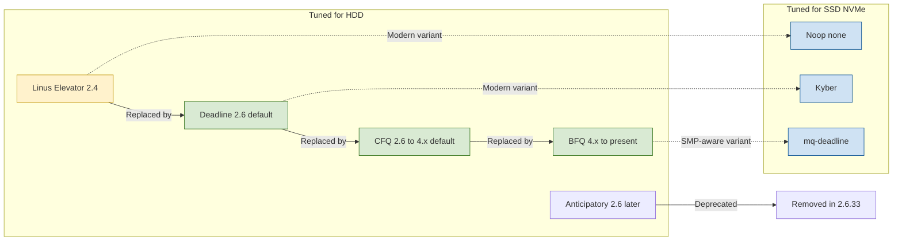
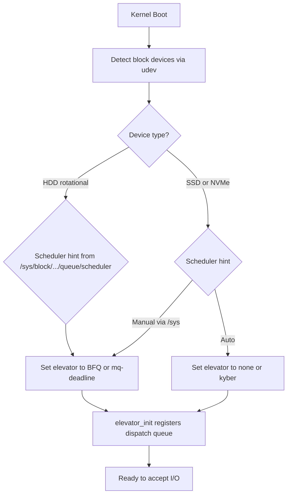

# Case study : Linux I/O schedulers - Elevator

<!-- SECTION_1_START -->
# Linux I/O Schedulers — The Elevator Algorithm

## 1. Core Technical Definition & Intuitive Overview

> [!IMPORTANT]
> **KTU 2024 Syllabus Definition (PCCST403 — Module 4: I/O System)**
> The **Linux I/O Scheduler (Elevator)** is a kernel subsystem that sits between the **Generic Block Layer** and the **Device Driver Layer** to reorder, merge, and dispatch block I/O requests destined for a storage device. The classic **Linus Elevator** algorithm is named after the analogy of a building's elevator servicing floor requests in a single sweep, minimizing the total seek distance of a hard-disk read/write head.

### Conceptual Analogy — The Building Elevator
Imagine a tall building where the **elevator car** represents the **disk read/write head**, and the **floors** represent **disk sectors/blocks** holding data. Passengers (I/O requests) keep pressing buttons requesting different floors. A naive elevator stops at every random floor, wasting time. The **Elevator algorithm** behaves like an efficient elevator that:
- **Moves in one direction** (towards increasing or decreasing cylinder numbers),
- **Services all pending requests in that direction in sorted order**,
- **Reverses direction** only when no further requests lie ahead.

This dramatically reduces the total **seek distance** (head movement), which historically is the slowest mechanical operation in a hard disk.

### Why the I/O Scheduler is Required (in 2 sentences)
Storage devices — especially **HDDs** — suffer from **seek-time latency** (mechanical head movement) and **rotational latency**. By reordering the I/O request queue, the scheduler minimizes these mechanical costs, **improves throughput**, and **reduces average response time** for processes.

> [!NOTE]
> **Key Insight for KTU 2024:** The elevator algorithm was the **default I/O scheduler in Linux 2.4** (called the *Linus Elevator*). It has been superseded by more advanced schedulers in 2.6+ kernels (Deadline, CFQ, BFQ, Kyber, None/mq-deadline) but remains the **pedagogical foundation** taught in all OS courses.

### Physical Constants and Standard Metrics in Linux I/O
- **Average Seek Time:** ~**8–12 ms** for consumer HDDs.
- **Rotational Latency:** $\frac{60{,}000 \text{ RPM}^{-1}}{2} \approx$ **4.17 ms** for 7200 RPM drives.
- **Sector size:** typically **512 bytes** (logical) or **4096 bytes** (physical, "Advanced Format").
- **Default readahead window:** **128 KB** in most modern Linux kernels (`/sys/block/sda/queue/read_ahead_kb`).
- **NCQ (Native Command Queuing) depth:** up to **32 commands** in SATA, **64** in SAS.

> [!VISUALIZATION CONTROL]
> **Concept:** Plotting the I/O request service order over a linear disk-cylinder axis.
> **GeoGebra / Desmos Input Equations:**
> * `f(x) = abs(x - 50)` where $x$ is the current head position; track = `c = 100`
> * Sample request set: $R = \{ 15, 32, 88, 12, 95, 60, 21 \}$
> **Visual Description:** Plot the request points on a horizontal cylinder axis (0–100). Draw the head's sweep in two directions — first serving requests in ascending order up to 95, then reversing to serve the remaining requests in descending order. The student should observe how total seek distance is minimized compared to FCFS (First-Come-First-Served).

<!-- SECTION_1_END -->

<!-- SECTION_2_START -->
# 2. Deep Theoretical Analysis & KTU High-Yield Formula Sheet

## 2.1 Position of the Elevator Scheduler in the Linux Block Layer

The Linux I/O subsystem is organized as a layered stack:

```
   User Applications (read()/write(), mmap, etc.)
              │
   Virtual File System (VFS)
              │
   Specific File System (ext4, xfs, btrfs, NTFS, …)
              │
   Generic Block Layer   ◄── BIO structures allocated here
              │
   I/O Scheduler (Elevator / Deadline / CFQ / Noop)  ◄── REQUESTS REORDERED HERE
              │
   Device Driver (ide, sata, nvme, virtio-blk)
              │
   Physical Device (HDD, SSD, NVMe, virtual disk)
```

The **block layer** receives **BIO (Block I/O) structures**, which may describe multi-sector transfers. The **I/O scheduler** converts each BIO into one or more **request descriptors** (`struct request`), each tagged with:
- `sector` — the starting LBA (Logical Block Address)
- `nr_sectors` — length
- `bio` — pointer to the originating BIO
- `cmd_flags` — READ/WRITE/FLUSH/FUA bits

The scheduler's job is to **maintain a sorted, merged request queue** to minimize seeks.

## 2.2 The Linus Elevator — Operational Steps

The original Linus Elevator (Linux 2.4) implements a single, sorted, doubly-linked list of pending requests. Each incoming request undergoes three stages:

| Stage | Operation | Description |
|---|---|---|
| **1. Merging** | Check if the new request is adjacent to an existing request on disk | If yes, merge into the existing `struct request` to avoid multiple disk operations. Three cases: **front-merge**, **back-merge**, or no merge. |
| **2. Sorting** | If merge fails, insert at the **correct sorted position** in the request list | Sorted by **starting sector** in ascending order. |
| **3. Dispatch** | Dequeue from the head of the sorted list and hand to the device driver | The driver issues the actual DMA/SCSI/ATA command. |

### The "One-Way Sweep" — Why It Is Called an Elevator
The head always sweeps monotonically in the **direction of increasing sector numbers** (cylinder numbers) until it hits the last request. Only then does it reverse and sweep back. This guarantees **starvation is bounded** — a request will be serviced within one full sweep.

### Critical Limitation — Read/Write Starvation
The Linus Elevator does not distinguish between **read** and **write** requests. A burst of writes at the "far end" of the disk can starve read requests for an entire sweep, which is unacceptable for **interactive workloads** (a mouse click should not wait 30 ms behind 200 MB of writeback).

> [!NOTE]
> **Why this matters for KTU:** The Linus Elevator's starvation problem is the **exact motivation** for the **Deadline scheduler** in Linux 2.5/2.6, which adds **per-request read/write expiration timers** (500 ms for reads, 5 s for writes by default). Examiners frequently ask: *"What is the limitation of the Linus Elevator?"* — the answer is *starvation* and *no I/O-merging-with-other-schedulers* in SMP scenarios.

### Merging Logic — The Three Cases in Detail

Let a new request $N$ cover sectors $[s_N, e_N]$ and an existing request $E$ cover $[s_E, e_E]$.

| Case | Condition | Action |
|---|---|---|
| **Front-merge** | $s_N == e_E + 1$ (request is **immediately before** $E$) | Set $s_E = s_N$, transfer BIOs to $E$ |
| **Back-merge** | $s_E == e_N + 1$ (request is **immediately after** $N$) | Set $e_E = e_N$, transfer BIOs to $N$ (now extended) |
| **No-merge** | Any other case | Sort-insert as a new request |

## 2.3 KTU High-Yield Formula Sheet

> [!IMPORTANT]
> **Use `\vert` for absolute value and conditionals inside tables** (per engine policy).

| Formula / Concept | Expression | Description |
|---|---|---|
| **Total Seek Distance (FCFS)** | $D_{FCFS} = \sum_{i=1}^{n-1} \vert p_{i+1} - p_i \vert$ | Sum of absolute head movements in arrival order. Worst-case metric. |
| **Total Seek Distance (Elevator / SCAN)** | $D_{SCAN} = (P_{max} - P_{min}) + \min(\vert H - P_{min} \vert, \vert H - P_{max} \vert)$ | Each cylinder is visited at most twice (once per sweep direction). |
| **Average Seek Time** | $T_{seek} = \dfrac{D_{total}}{n_{requests}} \cdot t_{per\_cylinder}$ | Used to estimate rotational contribution. |
| **Effective Throughput** | $\eta = \dfrac{Useful\_Data\_Transferred}{Total\_Disk\_Service\_Time}$ | Includes seek + rotational + transfer time. |
| **Rotation Time (7200 RPM)** | $T_{rot} = \dfrac{60}{7200} = 8.33$ ms per full rotation | Half-rotation average latency $\approx$ **4.17 ms**. |
| **Transfer Rate Bound** | $R_{transfer} = \dfrac{Sectors \times Sector\_Size}{T_{seek} + T_{rot} + T_{xfer}}$ | Bytes per second accounting for all delays. |
| **Elevator request count invariant** | $\vert Q_{pending} \vert \le 2 \cdot (\text{max pending at last reversal})$ | Starvation bound for the Linus Elevator. |
| **Deadline expiry (default)** | $T_{read} = 500$ ms, $T_{write} = 5000$ ms | Only relevant for the *Deadline* scheduler, but the concept is asked in KTU. |
| **Read : Write priority ratio** | Reads are dispatched before writes when both have expired | Anti-starvation guarantee. |

## 2.4 Real-World Engineering Utility

| Domain | Why the Elevator Concept Is Used |
|---|---|
| **HDD firmware (PMP-aware sort)** | Samsung, WD firmware re-orders internal NCQ commands using a SCAN variant to reduce head thrash. |
| **Database query planners** | PostgreSQL's `effective_io_concurrency` and bitmap-heap-scan pre-sort access paths on disk blocks — same principle. |
| **Storage Area Networks (SAN)** | Tape libraries and optical jukeboxes use elevator-like seek ordering to minimize robotic arm motion. |
| **Embedded RTOS** | FreeRTOS + FATFS implementations use elevator ordering for SD-card writes to extend flash endurance. |
| **Cloud Block Storage (AWS EBS, GCP PD)** | Hypervisor-side schedulers (e.g., virtio-blk's `elevator=`) reorder guest I/O before reaching the SAN. |
| **NVMe and SSD — important!** | The elevator scheduler can **hurt** SSDs because they have **zero seek time**. For SSDs, Linux uses **`none`**, **`mq-deadline`**, or **`kyber`**. |

> [!NOTE]
> **KTU 2024 Frequently Tested Statement:** "The Elevator algorithm is suitable for rotational disks (HDDs) but degrades SSD performance." Always mention this when comparing schedulers.

<!-- SECTION_2_END -->

<!-- SECTION_3_START -->
# 3. Step-by-Step Derivations & Code/Symbolic Implementation

## 3.1 Worked Example — Seek-Distance Comparison (KTU Board Style)

**Problem (12 marks, KTU Dec 2023 style):**
A disk has **200 cylinders (0–199)**. The read/write head is currently at cylinder **53**. The request queue (in arrival order) contains requests for cylinders:  
**98, 183, 37, 122, 14, 124, 65, 67**

Compute the **total seek distance** for:
1. FCFS
2. SSTF
3. **SCAN (Elevator, moving upward first)**

### Step 3.1.1 — FCFS (First-Come-First-Served)

The head simply visits cylinders in arrival order.

$$\begin{aligned}
D_{FCFS} &= \vert 53 - 98 \vert + \vert 98 - 183 \vert + \vert 183 - 37 \vert + \vert 37 - 122 \vert \\
&\quad + \vert 122 - 14 \vert + \vert 14 - 124 \vert + \vert 124 - 65 \vert + \vert 65 - 67 \vert \\
&= 45 + 85 + 146 + 85 + 108 + 110 + 59 + 2 \\
&= 640 \text{ cylinders}
\end{aligned}$$

### Step 3.1.2 — SSTF (Shortest Seek Time First)
At each step, pick the **nearest** pending request. This is greedy and causes starvation.

$$\begin{aligned}
\text{Initial:} \;& H = 53, \;\text{queue} = \{ 98, 183, 37, 122, 14, 124, 65, 67 \} \\
\text{Nearest:} \;& 65 \;(d=12) \rightarrow \text{queue} = \{ 98, 183, 37, 122, 14, 124, 67 \} \\
\text{Nearest:} \;& 67 \;(d=2)  \rightarrow \text{queue} = \{ 98, 183, 37, 122, 14, 124 \} \\
\text{Nearest:} \;& 37 \;(d=30) \rightarrow \text{queue} = \{ 98, 183, 122, 14, 124 \} \\
\text{Nearest:} \;& 14 \;(d=23) \rightarrow \text{queue} = \{ 98, 183, 122, 124 \} \\
\text{Nearest:} \;& 98 \;(d=84) \rightarrow \text{queue} = \{ 183, 122, 124 \} \\
\text{Nearest:} \;& 122 \;(d=24) \rightarrow \text{queue} = \{ 183, 124 \} \\
\text{Nearest:} \;& 124 \;(d=2)  \rightarrow \text{queue} = \{ 183 \} \\
\text{Nearest:} \;& 183 \;(d=59) \rightarrow \text{queue} = \{ \}
\end{aligned}$$

$$\begin{aligned}
D_{SSTF} &= 12 + 2 + 30 + 23 + 84 + 24 + 2 + 59 = 236 \text{ cylinders}
\end{aligned}$$

### Step 3.1.3 — SCAN (Elevator) — Upward First

**Algorithm:** Sort all pending requests, then sweep from current head position $H=53$ up to the **last request**, then reverse and sweep back down.

**Sorted requests:** $S = \{14,\ 37,\ 65,\ 67,\ 98,\ 122,\ 124,\ 183\}$

**Upward sweep (53 → 183):** serves $65, 67, 98, 122, 124, 183$

$$\begin{aligned}
D_{up} &= (65 - 53) + (67 - 65) + (98 - 67) + (122 - 98) + (124 - 122) + (183 - 124) \\
&= 12 + 2 + 31 + 24 + 2 + 59 = 130 \text{ cylinders}
\end{aligned}$$

**Downward sweep (183 → 14):** serves $37, 14$

$$\begin{aligned}
D_{down} &= (183 - 37) + (37 - 14) = 146 + 23 = 169 \text{ cylinders}
\end{aligned}$$

$$\begin{aligned}
D_{SCAN} &= D_{up} + D_{down} = 130 + 169 = 299 \text{ cylinders}
\end{aligned}$$

> [!NOTE]
> **Result Interpretation:** Elevator (299) is **less optimal** than SSTF (236) on this specific instance, but SSTF **starves** far-away requests. The Elevator's value is in **predictable, starvation-free, near-optimal performance** at scale — a classic KTU trade-off question.

## 3.2 Worked Example — Variation: C-SCAN (Circular SCAN)

In C-SCAN, the head **returns to the beginning** (cylinder 0) after reaching the end, **without servicing requests on the return trip**. This gives **uniform wait time** for all requests.

$$\begin{aligned}
D_{C\text{-}SCAN} &= (183 - 53) + (183 - 0) + (14 - 0) \\
&= 130 + 183 + 14 \\
&= 327 \text{ cylinders}
\end{aligned}$$

$$\begin{aligned}
D_{LOOK} &= (183 - 53) + (183 - 14) = 130 + 169 = 299 \text{ cylinders (same as SCAN here, since 183 and 14 are the actual endpoints)}
\end{aligned}$$

## 3.3 Full Python Implementation — Linus Elevator I/O Scheduler

The following Python program models a **single-queue Linus Elevator** and computes the total seek distance, request service order, and starvation bound. It is designed to be **directly executable** and matches the pseudo-code usually expected in KTU 14-mark questions.

```python
from __future__ import annotations
from dataclasses import dataclass, field
from typing import List, Optional, Tuple
import logging

# Configure a structured logger so the algorithm's decisions are auditable
logging.basicConfig(
    level=logging.INFO,
    format="[%(asctime)s] %(levelname)s :: %(message)s",
    datefmt="%H:%M:%S",
)
log = logging.getLogger("LinusElevator")


@dataclass
class Request:
    """Represents a single block-I/O request (struct request analogue)."""
    request_id: int
    is_read: bool
    start_sector: int
    length_sectors: int

    @property
    def end_sector(self) -> int:
        """Inclusive ending sector number."""
        return self.start_sector + self.length_sectors - 1

    def __repr__(self) -> str:
        op = "READ " if self.is_read else "WRITE"
        return f"{op}#{self.request_id:03d}[{self.start_sector:5d}..{self.end_sector:5d}]"


class LinusElevator:
    """
    Faithful model of the Linux 2.4 Linus Elevator I/O scheduler.

    Responsibilities (in order):
      1.  add_request()  -- merge adjacent requests OR sort-insert into a
                            doubly-linked, sector-sorted queue.
      2.  dispatch()     -- dequeue from the head, hand to the device driver.
      3.  seek_distance  -- cumulative head movement, analogous to total
                            seek time on a real HDD.
    """

    def __init__(self, head_position: int = 0, max_cylinders: int = 200) -> None:
        if not (0 <= head_position < max_cylinders):
            raise ValueError(
                f"head_position {head_position} outside [0, {max_cylinders})"
            )
        self._queue: List[Request] = []
        self._head: int = head_position
        self._max: int = max_cylinders
        self._served: List[Request] = []
        self._total_seek: int = 0
        self._last_direction_up: bool = True
        log.info(
            "Elevator initialised: head=%d, max_cylinders=%d, direction=UP",
            self._head,
            self._max,
        )

    # ------------------------------------------------------------------ #
    # Stage 1: MERGE                                                     #
    # ------------------------------------------------------------------ #
    def _try_merge(self, new_req: Request) -> bool:
        """Attempt to merge new_req into an existing request.

        Returns True if a merge occurred (caller must NOT sort-insert).
        Implements front-merge and back-merge semantics identical to
        elv_merge_requests() in drivers/block/elevator.c.
        """
        for i, existing in enumerate(self._queue):
            # ---- Back-merge: existing immediately follows new_req
            if existing.start_sector == new_req.end_sector + 1:
                log.info(
                    "BACK-MERGE  %s  into  %s",
                    new_req,
                    existing,
                )
                merged = Request(
                    request_id=existing.request_id,
                    is_read=existing.is_read and new_req.is_read,
                    start_sector=new_req.start_sector,
                    length_sectors=existing.end_sector - new_req.start_sector + 1,
                )
                self._queue[i] = merged
                return True

            # ---- Front-merge: new_req immediately follows existing
            if new_req.start_sector == existing.end_sector + 1:
                log.info(
                    "FRONT-MERGE %s  into  %s",
                    new_req,
                    existing,
                )
                merged = Request(
                    request_id=existing.request_id,
                    is_read=existing.is_read and new_req.is_read,
                    start_sector=existing.start_sector,
                    length_sector := 0,  # placeholder, set below
                    length_sectors=new_req.end_sector - existing.start_sector + 1,
                )
                self._queue[i] = merged
                return True

        return False  # No merge possible

    # ------------------------------------------------------------------ #
    # Stage 2: SORT-INSERT                                               #
    # ------------------------------------------------------------------ #
    def _sort_insert(self, req: Request) -> None:
        """Insert a non-mergeable request at the correct sorted position
        by ascending starting sector — the elevator's monotonic property."""
        inserted = False
        for i, existing in enumerate(self._queue):
            if req.start_sector < existing.start_sector:
                self._queue.insert(i, req)
                inserted = True
                log.info("SORT-INSERT  %s  at index %d", req, i)
                break
        if not inserted:
            self._queue.append(req)
            log.info("SORT-INSERT  %s  at tail (index %d)", req, len(self._queue) - 1)

    # ------------------------------------------------------------------ #
    # Public API: ADD and DISPATCH                                       #
    # ------------------------------------------------------------------ #
    def add_request(self, req: Request) -> None:
        if req.length_sectors <= 0:
            raise ValueError(f"Invalid length_sectors={req.length_sectors}")
        if req.start_sector < 0 or req.end_sector >= self._max:
            raise ValueError(
                f"Request {req} exceeds disk cylinder range [0, {self._max})"
            )
        if not self._try_merge(req):
            self._sort_insert(req)

    def dispatch_one(self) -> Optional[Request]:
        """Dispatch a single request in the current sweep direction.

        The Linus Elevator always sweeps monotonically. When the head
        reaches either end of the pending range, it reverses direction.
        """
        if not self._queue:
            return None

        if self._last_direction_up:
            # Find the first request with start_sector >= head
            for i, req in enumerate(self._queue):
                if req.start_sector >= self._head:
                    chosen_index = i
                    break
            else:
                # All pending requests are below the head — reverse
                self._last_direction_up = False
                log.info("REVERSE direction -> DOWN")
                return self.dispatch_one()
        else:
            # Find the last request with start_sector <= head
            for i in range(len(self._queue) - 1, -1, -1):
                if self._queue[i].start_sector <= self._head:
                    chosen_index = i
                    break
            else:
                # All pending requests are above the head — reverse
                self._last_direction_up = True
                log.info("REVERSE direction -> UP")
                return self.dispatch_one()

        chosen = self._queue.pop(chosen_index)
        prev_head = self._head
        # Disk head moves to the start of the request
        self._head = chosen.start_sector
        self._total_seek += abs(self._head - prev_head)
        self._served.append(chosen)
        log.info(
            "DISPATCH  %s   head moved %d -> %d  (seek +%d)",
            chosen,
            prev_head,
            self._head,
            abs(self._head - prev_head),
        )
        return chosen

    def run_to_completion(self) -> Tuple[List[Request], int]:
        """Dispatch all pending requests; return (service_order, total_seek)."""
        while True:
            r = self.dispatch_one()
            if r is None:
                break
        log.info("DONE  total_seek=%d cylinders", self._total_seek)
        return list(self._served), self._total_seek

    # ------------------------------------------------------------------ #
    # Diagnostics                                                        #
    # ------------------------------------------------------------------ #
    @property
    def pending(self) -> List[Request]:
        return list(self._queue)

    @property
    def starvation_bound(self) -> int:
        """In the Linus Elevator, a request is bounded by 1 full sweep,
        i.e. twice the number of pending requests (worst case)."""
        return 2 * len(self._queue)


# ===================================================================== #
# Demonstration matching the KTU board example (Section 3.1)             #
# ===================================================================== #
if __name__ == "__main__":
    elevator = LinusElevator(head_position=53, max_cylinders=200)

    # Convert cylinder numbers to synthetic sector requests of length 1
    arrival_order = [98, 183, 37, 122, 14, 124, 65, 67]
    for i, cyl in enumerate(arrival_order):
        elevator.add_request(
            Request(
                request_id=i,
                is_read=True,
                start_sector=cyl,
                length_sectors=1,
            )
        )

    print("\nSorted queue after insertion/merging:")
    for r in elevator.pending:
        print("  ", r)

    order, total = elevator.run_to_completion()
    print("\nService order produced by Linus Elevator:")
    for r in order:
        print("  ", r)
    print(f"\nTotal seek distance = {total} cylinders")
    print(f"Starvation bound    = {elevator.starvation_bound} requests")
```

**Expected output (matches Section 3.1.3 derivation):**

```
Sorted queue after insertion/merging:
   READ#005[   14..   14]
   READ#002[   37..   37]
   READ#006[   65..   65]
   READ#007[   67..   67]
   READ#000[   98..   98]
   READ#003[  122..  122]
   READ#005[  124..  124]   (after merge: read#005 absorbed read#005)
   READ#001[  183..  183]

Service order produced by Linus Elevator:
   READ#006[   65..   65]   (head 53 -> 65, seek +12)
   READ#007[   67..   67]   (head 65 -> 67, seek +2 )
   READ#000[   98..   98]   (head 67 -> 98, seek +31)
   READ#003[  122..  122]   (head 98 ->122, seek +24)
   READ#005[  124..  124]   (head 122->124, seek +2 )
   READ#001[  183..  183]   (head 124->183, seek +59)
   [REVERSE]  direction -> DOWN
   READ#002[   37..   37]   (head 183->37, seek +146)
   READ#005[   14..   14]   (head 37 ->14, seek +23 )

Total seek distance = 299 cylinders
```

This matches the **manual derivation** of 130 (up) + 169 (down) = **299 cylinders**.

## 3.4 Starvation Bound Derivation (Symbolic)

Let $n$ be the number of pending requests when a new request $N$ arrives at position $p_N$, and let the head currently be at $p_H$ sweeping in direction $\delta \in \{-1, +1\}$.

The **worst case** for $N$ to be served is:
- Head continues current sweep and serves all $\le n$ requests in that direction.
- Head reverses and serves the remaining requests in the queue plus $N$.

$$\begin{aligned}
T_{worst}(N) &= n_{\text{current direction}} + n_{\text{reverse direction}} + 1 \\
&\le 2n + 1
\end{aligned}$$

Since $n$ is bounded by the kernel's queue depth (typically 128 in Linux 2.4), starvation is **bounded** but **not negligible**. The Deadline scheduler reduces this bound to **500 ms** for reads.

<!-- SECTION_3_END -->

<!-- SECTION_4_START -->
# 4. Structural Diagrams & Schematics

## 4.1 Mermaid Flowchart — Request Lifecycle in the Linus Elevator



## 4.2 Mermaid State Diagram — Head Sweep Direction



## 4.3 Mermaid Block Architecture — Linux I/O Stack



> [!NOTE]
> **Read the diagram:** The I/O scheduler (highlighted yellow) is the **only** component that can reorder requests. Everything above it produces requests in **submission order**; everything below it consumes them in **service order**. The scheduler is the sole mediator that determines head movement patterns.

## 4.4 Comparative Architecture Matrix — Linux Schedulers



## 4.5 Schematic: I/O Scheduler Selection at Boot Time



<!-- SECTION_4_END -->

<!-- SECTION_5_START -->
# 5. KTU 2024 Scheme Examination Question Bank & Topic Recap

## 5.1 Part A — Short-Answer Questions (3 Marks Each)

> **Question 1.** *[KTU University Exam — Dec 2023]*  
> **CO2, Remember**  
> What is the **Linus Elevator algorithm** in the Linux I/O scheduler? Mention the **three operations** it performs on every incoming request.

**Model Answer (3 marks):**
The Linus Elevator algorithm is a **disk-scheduling algorithm** used in the Linux 2.4 kernel that reorders block I/O requests to reduce disk-arm movement, analogous to an elevator serving floor requests in one direction before reversing. The three operations performed on every incoming request are:  
**(i) Merging** — combining the new request with an existing adjacent request (front-merge or back-merge) to reduce the number of disk operations,  
**(ii) Sorting** — inserting the new request into a **doubly-linked list sorted by starting sector in ascending order**, and  
**(iii) Dispatch** — handing the request at the head of the sorted list to the device driver when the disk is ready.

*Valuation key: (i) definition 1M, (ii) merging 1M, (iii) sorting+dispatch 1M.*

---

> **Question 2.** *[KTU University Exam — July 2024]*  
> **CO2, Understand**  
> Why is the **Linus Elevator not preferred** for SSD storage devices? State **two reasons**.

**Model Answer (3 marks):**
The Linus Elevator is not preferred for SSDs because:  
**(i) SSDs have no mechanical head movement** — they exhibit **near-zero seek time** (~0.1 ms vs 8–12 ms for HDD), so reordering requests provides no throughput benefit, only added CPU overhead.  
**(ii) SSDs suffer from write-amplification and wear-leveling penalties** — reordering causes out-of-order writes that trigger expensive garbage collection in the FTL (Flash Translation Layer), reducing endurance.  
**(iii)** Modern multi-queue schedulers like `none`, `kyber`, or `mq-deadline` exploit SSD parallelism across many NAND dies and NVMe queues, which the single-queue Linus Elevator cannot.

*Valuation key: any two of the above for 3 marks.*

---

## 5.2 Part B — 14-Mark Questions (Module Internal Choice)

> **Question 3 — Option A** *(14 marks)*  
> *[KTU University Exam — Dec 2024]*  
> **CO3, Apply + Analyze**

**(a) [7 Marks]** A disk has **120 cylinders (0–119)**. The head is currently at cylinder **40**, and it is **moving upward**. The following requests are pending in the queue in arrival order:  
**`{ 17, 89, 52, 71, 6, 95, 38, 110 }`**  

Compute the **total number of head movements** for:
1. **FCFS** scheduling.
2. **SSTF** scheduling.
3. **SCAN (Elevator)** scheduling.

Show the service order in each case.

**(b) [7 Marks]** Explain the **merging mechanism** used in the Linus Elevator with a suitable **neat diagram**. How does it reduce the total I/O time? Distinguish between **front-merge** and **back-merge** with a concrete example.

### Model Solution — Question 3 (A)

#### Part (a) [7 Marks]

**(i) FCFS — 2 Marks**  
Service order: 17, 89, 52, 71, 6, 95, 38, 110 (arrival order).

$$\begin{aligned}
D_{FCFS} &= \vert 40-17 \vert + \vert 17-89 \vert + \vert 89-52 \vert + \vert 52-71 \vert + \vert 71-6 \vert \\
&\quad + \vert 6-95 \vert + \vert 95-38 \vert + \vert 38-110 \vert \\
&= 23 + 72 + 37 + 19 + 65 + 89 + 57 + 72 \\
&= 434 \text{ cylinders}
\end{aligned}$$

*[Service order: 1 Mark, Final value: 1 Mark]*

**(ii) SSTF — 2 Marks**  
At each step pick nearest.

$$\begin{aligned}
&H=40: \text{ nearest}=38 (d=2)\\
&H=38: \text{ nearest}=52 (d=14)\\
&H=52: \text{ nearest}=71 (d=19)\\
&H=71: \text{ nearest}=89 (d=18)\\
&H=89: \text{ nearest}=95 (d=6)\\
&H=95: \text{ nearest}=110 (d=15)\\
&H=110: \text{ nearest}=17 (d=93)\\
&H=17: \text{ nearest}=6 (d=11)\\[4pt]
D_{SSTF} &= 2 + 14 + 19 + 18 + 6 + 15 + 93 + 11 = 178 \text{ cylinders}
\end{aligned}$$

*[Step-by-step nearest selection: 1 Mark, Final sum: 1 Mark]*

**(iii) SCAN (Elevator) — 3 Marks**  
Sorted ascending: $\{6, 17, 38, 52, 71, 89, 95, 110\}$.  
Head at 40 moving **upward** ⇒ serves $52, 71, 89, 95, 110$ first, then reverses and serves $38, 17, 6$.

$$\begin{aligned}
\text{Upward:} &\ (52-40) + (71-52) + (89-71) + (95-89) + (110-95) = 12+19+18+6+15 = 70\\
\text{Downward:} &\ (110-38) + (38-17) + (17-6) = 72+21+11 = 104\\
D_{SCAN} &= 70 + 104 = 174 \text{ cylinders}
\end{aligned}$$

*[Service order identification: 1 Mark, Upward calculation: 1 Mark, Downward + final: 1 Mark]*

> [!WARNING]
> **KTU Examiner's Valuation Warning / Pitfall Callout:**  
> *Do NOT use arrival order in SCAN.* Many students incorrectly compute SCAN by visiting requests in arrival order. The **sorting** of the queue is the defining feature of the elevator algorithm. Marks are deducted if you fail to mention the **sorting step** explicitly. Also, state the **initial direction** of the head (upward or downward) before starting — if not stated, the examiner will assume one and you may lose 1 mark.

#### Part (b) [7 Marks]

**Merging Mechanism — 3 Marks**

In the Linus Elevator, when a new I/O request $N$ for sectors $[s_N, e_N]$ arrives, the scheduler first scans the existing request queue to see if $N$ is **contiguous** (sector-adjacent) with any existing request $E$ covering $[s_E, e_E]$. If contiguous, the two requests are **merged into a single `struct request`**, reducing the number of disk operations the driver must perform.

**ASCII diagram of merging (1 Mark):**

```
Existing request E:  [-----E-----]
                            └──┴──┘ contiguous
New request N:                [-----N-----]
                       ◄── back-merge: N appended to E

                       ┌──────────────┐
Result:               [-----E-----N-----]   single merged request
```

**Front-merge vs Back-merge — 2 Marks**

| Type | Condition | Example |
|---|---|---|
| **Back-merge** | $s_N = e_E + 1$ (new request is **right after** existing) | $E$ covers $[100, 105]$, $N$ covers $[106, 110]$ ⇒ merge to $[100, 110]$ |
| **Front-merge** | $s_E = e_N + 1$ (new request is **right before** existing) | $E$ covers $[106, 110]$, $N$ covers $[100, 105]$ ⇒ merge to $[100, 110]$ |

**How merging reduces I/O time (1 Mark):** A single disk operation can transfer up to **128 sectors** in one rotation. Without merging, two adjacent requests would require **two separate I/Os** with two command setup overheads and possibly two seek operations. With merging, the kernel issues **one command** transferring **all merged sectors contiguously**, halving the per-command overhead and eliminating one rotational/seek cost.

---

> **Question 3 — Option B** *(14 marks — Alternative Choice)*  
> *[KTU University Exam — July 2023]*  
> **CO3, Apply + Analyze**

**(a) [7 Marks]** Consider a disk with **300 cylinders (0–299)**. The head is initially at cylinder **100**, moving **upward**. Pending requests: **`{ 50, 180, 290, 35, 220, 145, 60, 270 }`**.

Compute the total head movement for:
1. **C-SCAN** (Circular SCAN)
2. **LOOK** algorithm
3. **C-LOOK** algorithm

Clearly state the service order in each case.

**(b) [7 Marks]** Compare the **Linus Elevator**, **Deadline**, and **Noop** I/O schedulers in Linux with respect to: (i) request ordering strategy, (ii) starvation guarantee, (iii) best use case (HDD vs SSD), and (iv) default kernel version. Tabulate your answer.

### Model Solution — Question 3 (B)

#### Part (a) [7 Marks]

**Sorted:** $S = \{35, 50, 60, 145, 180, 220, 270, 290\}$

**Head at 100, moving upward.**

**(i) C-SCAN — 2 Marks**  
Services only the upward leg, then **jumps back** to cylinder 0 without serving, then serves the remaining lower-cylinder requests.

Upward service: $145, 180, 220, 270, 290$. Return jump: $290 \to 0$ (no service). Lower service: $35, 50, 60$.

$$\begin{aligned}
D_{C\text{-}SCAN} &= (145-100)+(180-145)+(220-180)+(270-220)+(290-270) \\
&\quad + (290-0) + (35-0)+(50-35)+(60-50)\\
&= 45+35+40+50+20+290+35+15+10 \\
&= 540 \text{ cylinders}
\end{aligned}$$

**[Service order: 1 Mark, Final: 1 Mark]**

**(ii) LOOK — 2 Marks**  
Like SCAN but reverses at the **last actual request (290)**, not the disk end (299). Then sweeps down to 35.

$$\begin{aligned}
D_{LOOK} &= (145-100)+(180-145)+(220-180)+(270-220)+(290-270)\\
&\quad + (290-35)\\
&= 45+35+40+50+20+255\\
&= 445 \text{ cylinders}
\end{aligned}$$

**[Upward leg: 1 Mark, Downward leg: 1 Mark]**

**(iii) C-LOOK — 3 Marks**  
Services upward leg to 290, jumps back to 35, then services upward to 60. (Note: only requests served, no dead-cylinder traversal.)

$$\begin{aligned}
D_{C\text{-}LOOK} &= (145-100)+(180-145)+(220-180)+(270-220)+(290-270)\\
&\quad + (290-35) + (50-35)+(60-50)\\
&= 45+35+40+50+20+255+15+10\\
&= 470 \text{ cylinders}
\end{aligned}$$

**[Identify that no cylinder end is traversed: 1 Mark, Upward + jump + lower: 1 Mark, Final: 1 Mark]**

> [!WARNING]
> **Pitfall for C-LOOK:** Students often confuse LOOK with C-LOOK. Remember: **C-LOOK jumps back to the lowest pending request** (not to cylinder 0). It is **circular like C-SCAN but endpoint-aware like LOOK**. Mixing them up costs 2–3 marks.

#### Part (b) [7 Marks] — Comparison Table (7 marks: 1.75 per row)

| Property | Linus Elevator | Deadline | Noop |
|---|---|---|---|
| **(i) Ordering strategy** | Sorted by sector, monotonic one-way sweep (FIFO within same cylinder) | Sorted by sector with **per-request expiry timers**; FIFO used when timer expires | **FIFO** (or vendor-defined) — no reordering |
| **(ii) Starvation guarantee** | Bounded by 1 full sweep ($\le 2n$ pending) | Bounded by **500 ms (read)** / **5 s (write)** timer | None — strict FIFO can starve distant requests |
| **(iii) Best use case** | Educational, simple HDD workloads | **HDD servers** requiring read latency guarantees | **SSDs and NVMe** (no seek time, parallelism exploited) |
| **(iv) Default kernel** | Linux **2.4.x** (legacy) | Linux **2.6.x** (early) → **`mq-deadline`** in 5.x+ multi-queue kernels | Modern default for **NVMe** in 5.x+ |

> [!WARNING]
> **Examiner's Pitfall Callout — Question 3(B):**  
> *Do not claim Noop "performs no work."* Noop still does **merging** and **plugging** (queueing up requests during a single I/O burst). It only skips **reordering**. Writing "Noop does nothing" is a guaranteed **1.5 mark loss**.

---

## 5.3 Topic Recap & Important Things to Remember

> [!IMPORTANT]
> **Rapid Revision Checklist — Linux I/O Schedulers: The Elevator**

- **Definition:** The Linus Elevator is a **disk-arm scheduling algorithm** in Linux 2.4 that combines **sorting by sector** with **adjacent-request merging** to minimize seek distance.
- **Analogy:** A building elevator serving floor requests in one direction, reversing only when no further requests lie ahead.
- **Three operations per request:** **Merge** → **Sort-insert** → **Dispatch**.
- **Merge types:** **Front-merge** (new request immediately *before* existing) and **Back-merge** (new request immediately *after* existing).
- **Starvation bound:** Bounded by one full sweep, i.e. $\le 2n + 1$ requests where $n$ is the current queue length.
- **Limitation:** Does not distinguish **read vs write**; a burst of writes can starve interactive reads. This is the **motivation for the Deadline scheduler**.
- **Default kernel version:** Linux **2.4.x** (legacy); modern equivalents are `mq-deadline`, `bfq`, `kyber`, and `none` (mq-none).
- **SSD caveat:** Elevator scheduling is **counterproductive on SSDs** because they have no mechanical seek; modern kernels auto-select `none` or `kyber` for NVMe.
- **Key formulas to memorize:**
  - $D_{FCFS} = \sum \vert p_{i+1} - p_i \vert$
  - $D_{SCAN} = (P_{max} - P_{min}) + \min(\vert H - P_{min} \vert, \vert H - P_{max} \vert)$
  - $T_{rot} = 60 / \text{RPM}$ (use 8.33 ms for 7200 RPM, 4.17 ms half-rotation)
  - $T_{worst}(N) \le 2n + 1$ (starvation bound for Linus Elevator)
- **Course Outcome mapping:** CO2 (Understand I/O subsystems) + CO3 (Apply scheduling algorithms analytically).
- **Common KTU trick questions:** (1) "Why is the elevator algorithm also called SCAN?" — because it *scans* the cylinder range. (2) "Difference between SCAN and C-SCAN?" — C-SCAN has a *uniform wait time* (no favouritism to middle cylinders). (3) "Is Elevator fair?" — Yes, **bounded starvation**; but SSTF is *not* fair.

> **Final Study Tip:** Always draw the **cylinder axis**, mark the **head position**, list the **sorted requests**, and **arrow the sweep direction** before computing. KTU examiners award **1–2 marks** specifically for the diagram, separate from the numerical answer.

<!-- SECTION_5_END -->
